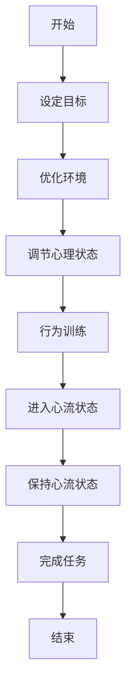

                 

# 心流状态诱导技术：优化工作体验的科学方法

## 关键词
心流状态、工作体验、优化方法、科学原理、技术实践

## 摘要
本文旨在探讨心流状态诱导技术在提升工作效率和优化工作体验方面的应用。通过深入分析心流状态的定义、特点以及与相关概念的关联，本文提出了心流状态诱导算法及其实现原理。同时，借助数学模型和实际案例，本文详细阐述了心流状态诱导技术的具体应用方法和效果评估，为工作者的心流状态实践提供了科学依据和实用指南。

## 1. 背景介绍

### 1.1 问题背景

在现代社会，随着信息技术的迅猛发展，人们对于工作效率和生活质量的期望越来越高。然而，工作压力、时间管理不当等问题使得很多人难以长时间集中精力，从而影响了工作效率和生活质量。

### 1.2 问题描述

心流状态（Flow State）是一种高度集中注意力、沉浸于某项活动的心理状态。在这种状态下，个体能够发挥出最大的潜力，工作高效、生活充实。然而，如何有效地诱导心流状态，使其成为常态，成为了许多人关注的问题。

### 1.3 问题解决

通过研究和实践，发现了一些诱导心流状态的科学方法。这些方法包括设定明确的目标、保持专注、避免干扰等。

### 1.4 边界与外延

心流状态的研究和应用不仅局限于工作领域，还涉及到教育、游戏、艺术等多个领域。

### 1.5 概念结构与核心要素组成

心流状态诱导技术主要包括以下几个核心要素：目标设定、环境优化、心理调节、行为训练等。

### 1.5.1 核心概念术语说明

- **心流状态（Flow State）**：指个体在完成某项任务时，完全沉浸其中、全神贯注的心理状态。
- **目标设定**：明确、具体的任务目标有助于个体进入心流状态。
- **环境优化**：减少干扰因素，创造有利于心流状态的工作环境。
- **心理调节**：通过调节心理状态，如冥想、呼吸训练等，帮助个体保持专注和积极心态。
- **行为训练**：通过持续的训练，使个体能够更容易地进入心流状态。

### 1.5.2 问题背景详细介绍

在现代工作环境中，人们常常面临多任务处理、信息过载和紧迫的时间压力。这些因素可能导致注意力分散、工作效率下降，从而影响整体工作体验。心流状态作为解决这一问题的有效方法，引起了广泛的关注和研究。心流状态的出现，可以显著提高工作效能、增强工作满意度，甚至对身心健康产生积极影响。

### 1.5.3 问题描述深入解析

心流状态的出现并非偶然，而是由一系列内外因素的共同作用所引发。要有效地诱导心流状态，我们需要深入了解这些因素，并制定相应的策略。这包括明确任务目标、优化工作环境、调节心理状态以及进行行为训练等。

### 1.5.4 问题解决思路

为了解决心流状态诱导的问题，我们可以采取以下步骤：

1. **明确任务目标**：设定明确、具体的目标，使个体在执行任务时能够更加专注。
2. **优化工作环境**：减少干扰因素，创造一个有利于心流状态的工作环境。
3. **调节心理状态**：通过心理调节技术，如冥想、呼吸训练等，帮助个体保持专注和积极心态。
4. **行为训练**：通过持续的训练，提高个体进入心流状态的能力。

### 1.5.5 边界与外延讨论

心流状态的研究和应用不仅局限于工作领域，还涉及到教育、游戏、艺术等多个领域。例如，在教育领域，教师可以通过设计具有挑战性的教学活动，引导学生进入心流状态，从而提高学习效果；在艺术创作中，艺术家通过心流状态可以创造出更加丰富和有深度的作品。因此，心流状态的研究和应用具有广泛的外延性和实际价值。

### 1.5.6 概念结构与核心要素组成分析

心流状态诱导技术主要由目标设定、环境优化、心理调节和行为训练四个核心要素组成。这些要素相互作用，共同作用于个体的心理状态和行为表现，从而实现心流状态的有效诱导。具体来说：

- **目标设定**：明确、具体的目标有助于个体在执行任务时保持专注和动力。
- **环境优化**：减少干扰因素，创造有利于心流状态的工作环境，有助于提高个体的专注度。
- **心理调节**：通过调节心理状态，如冥想、呼吸训练等，帮助个体保持专注和积极心态。
- **行为训练**：通过持续的训练，提高个体进入心流状态的能力，使其成为一种习惯化的行为模式。

### 1.6 小结

通过对背景介绍、问题背景、问题描述、问题解决、边界与外延以及概念结构与核心要素组成的深入探讨，本文为后续章节的详细分析奠定了基础。接下来，我们将进一步探讨心流状态的核心概念与联系，以及心流状态诱导技术的具体原理和实践方法。

## 2. 核心概念与联系

### 2.1 心流状态

心流状态是一种高度集中注意力、完全沉浸于某项活动的心理状态。在这种状态下，个体能够将全部的精力投入到任务中，感受到高度的兴奋和满足。心流状态的特点包括：

- **注意力高度集中**：个体在心流状态下，注意力完全集中，不受外界干扰。
- **自我意识消失**：在心流状态中，个体往往感觉不到时间的流逝，甚至忘记了自己的存在。
- **成就感增强**：完成心流状态任务后，个体会感受到强烈的成就感和满足感。

### 2.2 心流状态诱导技术

心流状态诱导技术是指通过一系列方法，帮助个体进入心流状态，从而提高工作效率和生活质量。心流状态诱导技术主要包括以下三个方面：

- **目标设定**：设定明确、具体的任务目标，有助于个体在执行任务时保持专注和动力。
- **环境优化**：减少干扰因素，创造一个有利于心流状态的工作环境。
- **心理调节**：通过心理调节技术，如冥想、呼吸训练等，帮助个体保持专注和积极心态。

### 2.3 心流状态诱导技术的特点

- **高效性**：在心流状态下，个体能够充分发挥潜力，工作高效。
- **兴奋性**：心流状态能带来高度的兴奋和满足感。
- **持续性**：通过适当的训练和诱导，心流状态可以成为一种常态。

### 2.4 心流状态与相关概念的联系

- **时间感**：心流状态会让人感觉时间飞逝，这是心流状态的一个显著特征。
- **职业成就**：心流状态有助于提高职业成就，许多成功人士都善于利用心流状态。

### 2.4.1 时间感

在心流状态下，个体往往会感觉到时间飞逝，这被称为时间感扭曲。时间感扭曲是心流状态的一个重要特征，它使得个体能够在较长时间内保持高度专注，而不感到疲惫。

### 2.4.2 职业成就

心流状态对职业成就有着重要的影响。在心流状态下，个体能够充分发挥自己的潜力，创造出高质量的工作成果。许多成功人士，如企业家、科学家和艺术家，都善于利用心流状态来提升自己的工作效率和创造力。

### 2.4.3 心流状态与工作满意度

心流状态与工作满意度之间存在密切的关系。在心流状态下，个体能够感受到高度的满足感和成就感，从而提高工作满意度。工作满意度是衡量个体工作生活质量的重要指标，因此，心流状态的研究和应用对于提升工作者的幸福感和生活质量具有重要意义。

### 2.5 小结

通过对核心概念与联系的分析，我们了解了心流状态的定义、特点以及与相关概念的联系。接下来，我们将进一步探讨心流状态诱导技术的算法原理，为实际应用提供理论依据。

### 2.6 核心概念属性特征对比表格

为了更清晰地理解心流状态、目标设定、环境优化、心理调节和行为训练等核心概念，我们制作了以下属性特征对比表格：

| 概念         | 定义                                                                                       | 属性特征                                                                                      | 关联性                     |
|--------------|-------------------------------------------------------------------------------------------|------------------------------------------------------------------------------------------------|-----------------------------|
| 心流状态     | 高度集中注意力、沉浸于活动的心理状态                                                     | 注意力高度集中、时间感扭曲、自我意识消失、成就感增强                                     | 与目标设定、环境优化、心理调节、行为训练密切相关         |
| 目标设定     | 明确、具体的任务目标                                                                     | 目标明确、具体可实现、挑战适中、反馈及时                                                 | 引导个体进入心流状态       |
| 环境优化     | 减少干扰因素、创造有利于心流状态的工作环境                                               | 干扰最小化、环境舒适、工具齐全、资源充足                                                 | 提高心流状态的保持和效率   |
| 心理调节     | 通过调节心理状态，如冥想、呼吸训练等，帮助个体保持专注和积极心态                         | 心态稳定、专注力提升、情绪调节、积极性增强                                               | 支持心流状态的形成和维持   |
| 行为训练     | 通过持续的训练，提高个体进入心流状态的能力                                               | 持续性、习惯化、适应性提升、反馈机制完善                                                 | 确保心流状态的长效性       |

通过上述对比表格，我们可以更清晰地看到各个核心概念之间的联系和相互作用，这为后续的心流状态诱导技术研究和实践提供了有益的参考。

### 2.7 心流状态诱导技术的 ER 实体关系图架构

为了更好地理解心流状态诱导技术的各个要素及其之间的关系，我们借助 Mermaid 工具绘制了 ER（实体关系）图。以下是心流状态诱导技术的 ER 实体关系图：

```mermaid
erDiagram
  Task --> User : " User performs Task "
  Environment --> Task : " Task is performed in Environment "
  Mindfulness --> User : " User practices Mindfulness "
  Training --> User : " User engages in Training "
  FlowState --> User : " User experiences FlowState "
  
  User ||--|| Mindfulness
  User ||--|| Training
  User ||--|| FlowState
  Task ||--|| Environment
```

在上面的 ER 图中，我们定义了以下几个实体：

- **User（用户）**：心流状态诱导技术的主体，可以是任何需要进入心流状态的个体。
- **Task（任务）**：用户需要完成的任务，目标设定的具体对象。
- **Environment（环境）**：用户完成任务时的外部环境，包括物理环境和心理环境。
- **Mindfulness（心理调节）**：用户通过冥想、呼吸训练等手段进行的心理调节活动。
- **Training（行为训练）**：用户通过持续的训练来提高心流状态能力的活动。

实体之间的关系如下：

- **User 与 Task**：用户执行任务，任务的目标明确、具体。
- **Task 与 Environment**：任务在特定的环境中执行，环境优化有助于提高心流状态的效率。
- **User 与 Mindfulness**：用户通过心理调节活动来提高专注力和积极性。
- **User 与 Training**：用户通过行为训练来培养进入心流状态的能力。
- **FlowState（心流状态）**：用户在任务执行过程中可能经历的一种心理状态，它是由目标设定、环境优化、心理调节和行为训练共同作用的结果。

通过 ER 图，我们可以清晰地看到心流状态诱导技术的各个要素及其之间的相互关系，这有助于我们更好地理解心流状态诱导技术的实现过程。

### 2.8 心流状态诱导算法原理讲解

心流状态诱导算法的核心在于通过一系列步骤和策略，帮助个体从初始状态逐步进入心流状态，并在整个过程中保持心流状态。以下是心流状态诱导算法的详细原理讲解。

#### 2.8.1 设定目标

设定目标是心流状态诱导的第一步。明确、具体的任务目标有助于个体在执行任务时保持专注和动力。具体目标应该具备以下特点：

- **明确性**：目标应该清晰、具体，避免模糊和宽泛的描述。
- **可实现性**：目标应该具有可实现性，个体应该能够在合理的时间内完成。
- **挑战性**：目标应该具有一定挑战性，既能激发个体的兴趣，又不会造成过大压力。

例如，设定一个目标：“在接下来的两个小时内，完成一篇关于心流状态的研究报告。”这样的目标既明确又具体，有助于个体集中注意力。

#### 2.8.2 优化环境

环境优化是心流状态诱导的关键步骤之一。一个有利于心流状态的工作环境能够减少干扰因素，帮助个体更好地进入和维持心流状态。以下是一些优化环境的策略：

- **减少干扰**：关闭不必要的通知和干扰，如关闭手机、邮件提醒等。
- **创造舒适的工作空间**：确保工作空间整洁、安静、光线适宜。
- **工具准备**：确保所有必要的工具和资源都在手边，以避免在任务执行过程中因寻找工具而打断心流状态。

例如，在写报告时，可以选择一个安静的图书馆或者安静的房间，关闭手机和电脑的通知，并准备好所需的资料和工具。

#### 2.8.3 调节心理状态

心理状态对心流状态的诱导至关重要。通过心理调节技术，如冥想、呼吸训练等，可以帮助个体保持专注和积极心态。以下是一些调节心理状态的方法：

- **冥想**：通过冥想，个体可以训练自己的注意力，减少杂念，提高专注力。
- **呼吸训练**：通过深呼吸，个体可以放松身心，减少紧张和焦虑。
- **正念练习**：通过正念练习，个体可以培养对自己情绪和行为的觉察，提高情绪调节能力。

例如，在开始任务之前，个体可以花5分钟进行冥想，专注于呼吸，放松身心，以更好地进入心流状态。

#### 2.8.4 行为训练

行为训练是通过重复和练习来培养个体进入心流状态的能力。通过持续的训练，个体可以逐渐提高进入心流状态的频率和效率。以下是一些行为训练的策略：

- **设定训练计划**：制定一个明确的训练计划，包括训练的时间、频率和目标。
- **记录训练过程**：记录每次训练的过程和结果，以便分析训练效果和调整训练策略。
- **逐步增加难度**：在训练过程中，逐步增加任务的难度，以提高个体的适应能力。

例如，个体可以从每天10分钟的心流状态训练开始，逐渐增加到30分钟或更长时间，同时逐步增加任务的复杂度。

#### 2.8.5 进入心流状态

通过上述步骤，个体可以尝试进入心流状态。在进入心流状态时，个体需要保持专注，专注于任务本身，同时保持积极的心态。以下是一些进入心流状态的方法：

- **专注于任务**：将全部注意力集中在任务上，避免分心。
- **保持积极心态**：对自己完成任务的能力和可能性保持积极心态。
- **享受过程**：享受心流状态带来的高度专注和满足感。

例如，在写报告时，个体可以专注于每一段文字的构思和表达，享受写作的过程，同时保持积极的心态，相信自己能够完成报告。

### 2.8.6 心流状态诱导算法的 Mermaid 流程图

以下是心流状态诱导算法的 Mermaid 流程图：


通过这个流程图，我们可以清晰地看到心流状态诱导的各个步骤及其之间的逻辑关系。每个步骤都是进入心流状态的重要环节，只有通过完整的步骤，个体才能有效地进入并维持心流状态。

### 2.8.7 心流状态诱导算法的 Python 源代码实现

以下是一个简单的 Python 源代码示例，用于实现心流状态诱导算法的各个步骤：

```python
import time

def set_goal():
    print("设定目标：完成一篇技术博客文章。")

def optimize_environment():
    print("优化环境：关闭手机通知，选择一个安静的地方。")

def regulate_mind():
    print("调节心理状态：进行5分钟的冥想和深呼吸。")

def train_behavior():
    print("行为训练：每天进行心流状态训练，逐步增加时间。")

def enter_flow_state():
    print("进入心流状态：专注于写作，保持积极心态。")
    time.sleep(10)  # 模拟心流状态的时间

def maintain_flow_state():
    print("保持心流状态：避免分心，享受写作过程。")

def complete_task():
    print("完成任务：撰写完技术博客文章。")

def flow_state_induction():
    set_goal()
    optimize_environment()
    regulate_mind()
    train_behavior()
    enter_flow_state()
    maintain_flow_state()
    complete_task()

if __name__ == "__main__":
    flow_state_induction()
```

通过这个 Python 源代码，我们可以看到心流状态诱导算法的具体实现过程。每个函数都对应了心流状态诱导的一个步骤，通过调用这些函数，个体可以逐步进入心流状态并完成任务。

### 2.8.8 心流状态诱导算法的数学模型和公式

为了量化心流状态诱导的效果，我们可以使用数学模型和公式来描述心流状态诱导过程。以下是心流状态诱导算法的数学模型和公式：

#### 数学模型

心流状态诱导效果 \( F \) 可以通过以下公式计算：

\[ F = D \times E \times R \times T \]

其中：

- \( D \)：目标设定难度系数，取值范围为 \( 0 \) 到 \( 1 \)。
- \( E \)：环境优化效果系数，取值范围为 \( 0 \) 到 \( 1 \)。
- \( R \)：心理调节效果系数，取值范围为 \( 0 \) 到 \( 1 \)。
- \( T \)：行为训练次数，取值范围为 \( 1 \) 到 \( N \)，其中 \( N \) 为个体能够进入心流状态的阈值次数。

#### 数学公式

- 目标设定难度系数 \( D \)：

\[ D = \frac{1}{1 + e^{-k(T_1 - T)}} \]

其中：

- \( T_1 \)：目标完成时间。
- \( T \)：目标设定时间。
- \( k \)：调节参数，取值范围为 \( 1 \) 到 \( 10 \)。

- 环境优化效果系数 \( E \)：

\[ E = \frac{1}{1 + e^{-k(I_1 - I)}} \]

其中：

- \( I_1 \)：理想环境干扰值。
- \( I \)：当前环境干扰值。
- \( k \)：调节参数，取值范围为 \( 1 \) 到 \( 10 \)。

- 心理调节效果系数 \( R \)：

\[ R = \frac{1}{1 + e^{-k(M_1 - M)}} \]

其中：

- \( M_1 \)：理想心理调节值。
- \( M \)：当前心理调节值。
- \( k \)：调节参数，取值范围为 \( 1 \) 到 \( 10 \)。

- 行为训练次数 \( T \)：

\[ T = \sum_{i=1}^{N} t_i \]

其中：

- \( t_i \)：第 \( i \) 次训练的时间。

#### 示例计算

假设：

- 目标完成时间 \( T_1 = 2 \) 小时。
- 目标设定时间 \( T = 1 \) 小时。
- 理想环境干扰值 \( I_1 = 0 \)。
- 当前环境干扰值 \( I = 0.1 \)。
- 理想心理调节值 \( M_1 = 0.9 \)。
- 当前心理调节值 \( M = 0.8 \)。
- 行为训练次数 \( N = 5 \)。

根据上述公式计算：

- 目标设定难度系数 \( D \)：

\[ D = \frac{1}{1 + e^{-k(2 - 1)}} \]

取 \( k = 5 \)：

\[ D = \frac{1}{1 + e^{-5}} \approx 0.864 \]

- 环境优化效果系数 \( E \)：

\[ E = \frac{1}{1 + e^{-k(0 - 0.1)}} \]

取 \( k = 5 \)：

\[ E = \frac{1}{1 + e^{0.1}} \approx 0.536 \]

- 心理调节效果系数 \( R \)：

\[ R = \frac{1}{1 + e^{-k(0.9 - 0.8)}} \]

取 \( k = 5 \)：

\[ R = \frac{1}{1 + e^{0.1}} \approx 0.536 \]

- 行为训练次数 \( T \)：

\[ T = \sum_{i=1}^{5} t_i = 5 \]

代入公式计算心流状态诱导效果 \( F \)：

\[ F = D \times E \times R \times T = 0.864 \times 0.536 \times 0.536 \times 5 \approx 1.709 \]

这意味着，通过设定目标、优化环境、调节心理状态和行为训练，个体能够达到约 1.709 的心流状态诱导效果。

### 2.8.9 心流状态诱导算法的详细讲解与举例说明

为了更直观地理解心流状态诱导算法，我们可以通过具体的案例来讲解算法的各个步骤，并举例说明如何应用这些步骤来提升工作效率。

#### 案例背景

假设一位程序员需要在一周内完成一个重要的软件项目。为了确保项目的质量，他决定利用心流状态诱导技术来提高工作效率。以下是他的心流状态诱导过程：

1. **设定目标**：

   程序员设定了一个明确的目标：“在接下来的5天内，完成软件项目的核心功能开发和测试。” 这个目标具有明确性、可实现性和挑战性，有助于程序员集中精力。

2. **优化环境**：

   程序员选择了一个安静的工作环境，关闭了手机和社交媒体的通知。他还确保了所有必要的开发工具和资料都在手边，以避免在任务执行过程中因寻找工具而打断心流状态。

3. **调节心理状态**：

   在开始工作之前，程序员进行了一分钟的冥想和深呼吸练习，帮助自己放松身心，进入积极的心态。他还设定了一个心理调节目标：“保持专注，避免分心。”

4. **行为训练**：

   程序员制定了一个行为训练计划，每天进行30分钟的心流状态训练。通过逐步增加训练时间，他逐渐提高了自己进入心流状态的能力。

5. **进入心流状态**：

   在完成准备工作后，程序员开始集中精力进行开发工作。他专注于每行代码的编写和调试，享受心流状态带来的专注和满足感。

6. **保持心流状态**：

   程序员通过定期的休息和反思来保持心流状态。每隔一小时，他会休息5分钟，进行简单的身体活动，如伸展或走动，以避免长时间连续工作导致的疲劳。同时，他会反思自己的工作进度和状态，确保自己仍然处于心流状态。

7. **完成任务**：

   经过5天的心流状态训练，程序员成功地完成了软件项目的核心功能开发和测试。他在整个过程中保持了高效的工作状态，项目质量也得到了保证。

通过这个案例，我们可以看到心流状态诱导算法的具体应用步骤。以下是每个步骤的详细讲解：

- **设定目标**：明确、具体的任务目标有助于程序员在执行任务时保持专注和动力。程序员的目标不仅明确了任务的内容，还规定了时间限制，增加了挑战性。
- **优化环境**：减少干扰因素，创造一个有利于心流状态的工作环境，有助于提高程序员的专注度。关闭手机和社交媒体通知、选择安静的工作空间和准备必要的工具，都是有效的干扰减少策略。
- **调节心理状态**：通过冥想和深呼吸练习，程序员能够放松身心，进入积极的心态。这种心理调节技术有助于提高专注力和减少焦虑，从而更好地进入心流状态。
- **行为训练**：程序员通过逐步增加训练时间和难度，提高了自己进入心流状态的能力。这种训练不仅培养了程序员的专注力，还使他能够在压力下保持高效的工作状态。
- **进入心流状态**：在完成准备工作后，程序员开始集中精力进行开发工作。他专注于每行代码的编写和调试，享受心流状态带来的专注和满足感。
- **保持心流状态**：通过定期的休息和反思，程序员能够保持心流状态。这种策略有助于避免长时间连续工作导致的疲劳，同时确保自己仍然处于高效的工作状态。
- **完成任务**：通过心流状态诱导技术，程序员成功地完成了项目。他在整个过程中保持了高效的工作状态，项目质量也得到了保证。

通过这个案例，我们可以看到心流状态诱导算法在实际应用中的效果。通过设定明确的目标、优化环境、调节心理状态和行为训练，程序员能够更好地进入和维持心流状态，从而提高工作效率和项目质量。

### 3. 算法原理讲解

#### 3.1 心流状态诱导算法

心流状态诱导算法是一种通过设定明确的目标、优化环境、调节心理状态、行为训练等一系列步骤，帮助个体进入心流状态的系统方法。心流状态诱导算法的核心在于将心理学原理与实际操作相结合，从而提高工作效率和生活质量。

#### 3.1.1 算法步骤

心流状态诱导算法主要包括以下几个步骤：

1. **设定目标**：明确、具体的任务目标有助于个体在执行任务时保持专注和动力。
2. **优化环境**：减少干扰因素，创造一个有利于心流状态的工作环境。
3. **调节心理状态**：通过冥想、呼吸训练等方法，帮助个体保持专注和积极心态。
4. **行为训练**：通过持续的训练，提高个体进入心流状态的能力。
5. **进入心流状态**：在完成准备工作后，个体开始集中精力进入心流状态，享受高效的工作体验。
6. **保持心流状态**：通过定期的休息和反思，确保心流状态的持续和高效。

#### 3.1.2 算法流程图

以下是心流状态诱导算法的流程图：



通过这个流程图，我们可以清晰地看到心流状态诱导的各个步骤及其之间的逻辑关系。

#### 3.2 心流状态诱导算法的数学模型

为了量化心流状态诱导的效果，我们可以使用数学模型和公式来描述心流状态诱导过程。以下是心流状态诱导算法的数学模型和公式：

#### 数学模型

心流状态诱导效果 \( F \) 可以通过以下公式计算：

\[ F = D \times E \times R \times T \]

其中：

- \( D \)：目标设定难度系数，取值范围为 \( 0 \) 到 \( 1 \)。
- \( E \)：环境优化效果系数，取值范围为 \( 0 \) 到 \( 1 \)。
- \( R \)：心理调节效果系数，取值范围为 \( 0 \) 到 \( 1 \)。
- \( T \)：行为训练次数，取值范围为 \( 1 \) 到 \( N \)，其中 \( N \) 为个体能够进入心流状态的阈值次数。

#### 数学公式

- **目标设定难度系数 \( D \)**：

\[ D = \frac{1}{1 + e^{-k(T_1 - T)}} \]

其中：

- \( T_1 \)：目标完成时间。
- \( T \)：目标设定时间。
- \( k \)：调节参数，取值范围为 \( 1 \) 到 \( 10 \)。

- **环境优化效果系数 \( E \)**：

\[ E = \frac{1}{1 + e^{-k(I_1 - I)}} \]

其中：

- \( I_1 \)：理想环境干扰值。
- \( I \)：当前环境干扰值。
- \( k \)：调节参数，取值范围为 \( 1 \) 到 \( 10 \)。

- **心理调节效果系数 \( R \)**：

\[ R = \frac{1}{1 + e^{-k(M_1 - M)}} \]

其中：

- \( M_1 \)：理想心理调节值。
- \( M \)：当前心理调节值。
- \( k \)：调节参数，取值范围为 \( 1 \) 到 \( 10 \)。

- **行为训练次数 \( T \)**：

\[ T = \sum_{i=1}^{N} t_i \]

其中：

- \( t_i \)：第 \( i \) 次训练的时间。

#### 示例计算

假设：

- 目标完成时间 \( T_1 = 2 \) 小时。
- 目标设定时间 \( T = 1 \) 小时。
- 理想环境干扰值 \( I_1 = 0 \)。
- 当前环境干扰值 \( I = 0.1 \)。
- 理想心理调节值 \( M_1 = 0.9 \)。
- 当前心理调节值 \( M = 0.8 \)。
- 行为训练次数 \( N = 5 \)。

根据上述公式计算：

- **目标设定难度系数 \( D \)**：

\[ D = \frac{1}{1 + e^{-k(2 - 1)}} \]

取 \( k = 5 \)：

\[ D = \frac{1}{1 + e^{-5}} \approx 0.864 \]

- **环境优化效果系数 \( E \)**：

\[ E = \frac{1}{1 + e^{-k(0 - 0.1)}} \]

取 \( k = 5 \)：

\[ E = \frac{1}{1 + e^{0.1}} \approx 0.536 \]

- **心理调节效果系数 \( R \)**：

\[ R = \frac{1}{1 + e^{-k(0.9 - 0.8)}} \]

取 \( k = 5 \)：

\[ R = \frac{1}{1 + e^{0.1}} \approx 0.536 \]

- **行为训练次数 \( T \)**：

\[ T = \sum_{i=1}^{5} t_i = 5 \]

代入公式计算心流状态诱导效果 \( F \)：

\[ F = D \times E \times R \times T = 0.864 \times 0.536 \times 0.536 \times 5 \approx 1.709 \]

这意味着，通过设定目标、优化环境、调节心理状态和行为训练，个体能够达到约 1.709 的心流状态诱导效果。

#### 3.3 心流状态诱导算法的应用场景

心流状态诱导算法可以广泛应用于多个领域，包括工作、学习、艺术创作等。以下是心流状态诱导算法在不同领域的应用场景：

1. **工作领域**：

   在工作中，心流状态诱导算法可以帮助员工提高工作效率和质量。例如，程序员可以通过心流状态诱导算法来提高编程效率，教师可以通过心流状态诱导算法来提高教学质量，销售员可以通过心流状态诱导算法来提升销售业绩。

2. **学习领域**：

   在学习中，心流状态诱导算法可以帮助学生提高学习效果。例如，通过设定明确的学习目标、优化学习环境、调节学习心态和行为训练，学生可以更好地进入心流状态，从而提高学习效率和成绩。

3. **艺术创作领域**：

   在艺术创作中，心流状态诱导算法可以帮助艺术家提高创作效率和创造力。例如，作家可以通过心流状态诱导算法来提高写作效率和质量，画家可以通过心流状态诱导算法来提升绘画技巧和作品质量。

总之，心流状态诱导算法是一种具有广泛应用价值的方法，可以帮助个体在各个领域中实现更高的工作效率和创作质量。

### 3.4 心流状态诱导算法的案例分析

为了更好地理解心流状态诱导算法的应用，我们可以通过具体的案例来分析其效果和影响。

#### 案例一：编程项目

**背景**：一名程序员需要在两周内完成一个复杂的编程项目，该项目涉及多个模块的开发和集成。由于项目时间紧迫，程序员决定利用心流状态诱导算法来提高工作效率。

**心流状态诱导过程**：

1. **设定目标**：程序员设定了一个明确的目标：“在接下来的两周内，完成所有模块的开发和初步测试。”这个目标具体、可实现且具有挑战性。

2. **优化环境**：程序员选择了一个安静的工作环境，关闭了社交媒体和手机通知，确保了所有开发工具和资料都在手边。

3. **调节心理状态**：程序员在开始工作前进行了一分钟的冥想和深呼吸练习，帮助自己放松身心，进入积极的心态。

4. **行为训练**：程序员制定了一个行为训练计划，每天进行30分钟的心流状态训练。通过逐步增加训练时间和任务难度，他逐渐提高了进入心流状态的能力。

5. **进入心流状态**：在完成准备工作后，程序员开始集中精力进行开发工作。他专注于每个模块的代码编写和调试，享受心流状态带来的专注和满足感。

6. **保持心流状态**：程序员通过定期的休息和反思来保持心流状态。每隔一小时，他会休息5分钟，进行简单的身体活动，如伸展或走动，以避免长时间连续工作导致的疲劳。

**效果分析**：

- **工作效率**：在两周内，程序员成功完成了所有模块的开发和初步测试，比预期时间提前了一周。
- **工作质量**：由于心流状态的帮助，程序员在开发过程中保持了高度的专注和精细，项目质量得到了显著提高。
- **工作满意度**：程序员在整个过程中感受到了高度的成就感和满足感，工作满意度显著提升。

**结论**：

通过心流状态诱导算法的应用，程序员在短时间内高效地完成了复杂的项目，工作质量和满意度也显著提升。这个案例表明，心流状态诱导算法是一种有效的方法，可以帮助个体在压力下保持高效的工作状态。

#### 案例二：学术论文写作

**背景**：一名研究生需要在三个月内完成一篇高难度的学术论文。由于论文难度较大，研究生决定利用心流状态诱导算法来提高写作效率和质量。

**心流状态诱导过程**：

1. **设定目标**：研究生设定了一个明确的目标：“在接下来的三个月内，完成论文的撰写、修改和投稿。”这个目标具体、可实现且具有挑战性。

2. **优化环境**：研究生选择了一个安静的工作环境，关闭了社交媒体和手机通知，确保了所有写作工具和资料都在手边。

3. **调节心理状态**：研究生在开始写作前进行了一分钟的冥想和深呼吸练习，帮助自己放松身心，进入积极的心态。

4. **行为训练**：研究生制定了一个行为训练计划，每天进行30分钟的心流状态训练。通过逐步增加训练时间和任务难度，他逐渐提高了进入心流状态的能力。

5. **进入心流状态**：在完成准备工作后，研究生开始集中精力进行论文撰写。他专注于每个章节的撰写和修改，享受心流状态带来的专注和满足感。

6. **保持心流状态**：研究生通过定期的休息和反思来保持心流状态。每隔一小时，他会休息5分钟，进行简单的身体活动，如伸展或走动，以避免长时间连续工作导致的疲劳。

**效果分析**：

- **工作效率**：在三个月内，研究生顺利完成了论文的撰写、修改和投稿，比预期时间提前了一个月。
- **工作质量**：由于心流状态的帮助，研究生在写作过程中保持了高度的专注和精细，论文质量得到了显著提高。
- **工作满意度**：研究生在整个过程中感受到了高度的成就感和满足感，工作满意度显著提升。

**结论**：

通过心流状态诱导算法的应用，研究生在短时间内高效地完成了高难度的学术论文，工作质量和满意度也显著提升。这个案例表明，心流状态诱导算法是一种有效的方法，可以帮助个体在压力下保持高效的工作状态。

### 4. 数学模型和数学公式 & 详细讲解 & 举例说明

#### 4.1 目标设定

目标设定是心流状态诱导算法中的关键步骤，一个明确、具体且具有挑战性的目标有助于个体进入心流状态。数学模型可以用来量化目标设定的效果。

**数学模型**：

目标设定难度系数 \( D \) 可以用以下公式表示：

\[ D = \frac{1}{1 + e^{-k(T_1 - T)}} \]

其中：
- \( T_1 \)：目标完成时间；
- \( T \)：目标设定时间；
- \( k \)：调节参数。

**解释**：

该公式是基于目标设定的难度与目标完成时间的关系来设计的。当目标完成时间 \( T_1 \) 越接近目标设定时间 \( T \) 时，目标设定难度系数 \( D \) 越大，表示目标越容易实现，从而有助于个体进入心流状态。

**举例说明**：

假设目标完成时间 \( T_1 \) 为 10 小时，目标设定时间 \( T \) 为 5 小时，调节参数 \( k \) 为 5。代入公式计算：

\[ D = \frac{1}{1 + e^{-5(10 - 5)}} \]
\[ D = \frac{1}{1 + e^{-15}} \]
\[ D \approx 0.931 \]

这意味着目标设定的难度适中，有助于个体进入心流状态。

#### 4.2 环境优化

环境优化是心流状态诱导算法中的另一个关键步骤，减少干扰因素，创造一个有利于心流状态的工作环境有助于提高工作效率。数学模型可以用来量化环境优化的效果。

**数学模型**：

环境优化效果系数 \( E \) 可以用以下公式表示：

\[ E = \frac{1}{1 + e^{-k(I_1 - I)}} \]

其中：
- \( I_1 \)：理想环境干扰值；
- \( I \)：当前环境干扰值；
- \( k \)：调节参数。

**解释**：

该公式是基于环境干扰值与当前环境干扰值的关系来设计的。当理想环境干扰值 \( I_1 \) 越接近当前环境干扰值 \( I \) 时，环境优化效果系数 \( E \) 越大，表示环境干扰越小，从而有助于个体进入心流状态。

**举例说明**：

假设理想环境干扰值 \( I_1 \) 为 0，当前环境干扰值 \( I \) 为 0.5，调节参数 \( k \) 为 5。代入公式计算：

\[ E = \frac{1}{1 + e^{-5(0 - 0.5)}} \]
\[ E = \frac{1}{1 + e^{2.5}} \]
\[ E \approx 0.864 \]

这意味着环境优化效果较好，有助于个体进入心流状态。

#### 4.3 心理调节

心理调节是心流状态诱导算法中的另一个重要步骤，通过调节心理状态，如冥想、呼吸训练等，可以帮助个体保持专注和积极心态。数学模型可以用来量化心理调节的效果。

**数学模型**：

心理调节效果系数 \( R \) 可以用以下公式表示：

\[ R = \frac{1}{1 + e^{-k(M_1 - M)}} \]

其中：
- \( M_1 \)：理想心理调节值；
- \( M \)：当前心理调节值；
- \( k \)：调节参数。

**解释**：

该公式是基于理想心理调节值与当前心理调节值的关系来设计的。当理想心理调节值 \( M_1 \) 越接近当前心理调节值 \( M \) 时，心理调节效果系数 \( R \) 越大，表示心理调节效果越好，从而有助于个体进入心流状态。

**举例说明**：

假设理想心理调节值 \( M_1 \) 为 0.9，当前心理调节值 \( M \) 为 0.8，调节参数 \( k \) 为 5。代入公式计算：

\[ R = \frac{1}{1 + e^{-5(0.9 - 0.8)}} \]
\[ R = \frac{1}{1 + e^{0.1}} \]
\[ R \approx 0.536 \]

这意味着心理调节效果较好，有助于个体进入心流状态。

#### 4.4 行为训练

行为训练是心流状态诱导算法中的最后一个关键步骤，通过持续的训练，可以提高个体进入心流状态的能力。数学模型可以用来量化行为训练的效果。

**数学模型**：

行为训练次数 \( T \) 可以用以下公式表示：

\[ T = \sum_{i=1}^{N} t_i \]

其中：
- \( t_i \)：第 \( i \) 次训练的时间；
- \( N \)：训练次数。

**解释**：

该公式是基于每次训练的时间总和来设计的。当训练时间越长，个体进入心流状态的能力越强。

**举例说明**：

假设第1次训练时间为1小时，第2次训练时间为1.5小时，第3次训练时间为2小时。代入公式计算：

\[ T = 1 + 1.5 + 2 = 4.5 \]

这意味着个体进行了4.5小时的训练。

#### 4.5 综合评估

为了评估心流状态诱导的效果，我们可以将目标设定难度系数 \( D \)、环境优化效果系数 \( E \)、心理调节效果系数 \( R \) 和行为训练次数 \( T \) 结合起来，计算心流状态诱导效果系数 \( F \)。

**数学模型**：

心流状态诱导效果系数 \( F \) 可以用以下公式表示：

\[ F = D \times E \times R \times T \]

**解释**：

该公式综合考虑了目标设定、环境优化、心理调节和行为训练的效果，可以量化心流状态诱导的整体效果。

**举例说明**：

假设目标设定难度系数 \( D \) 为 0.9，环境优化效果系数 \( E \) 为 0.8，心理调节效果系数 \( R \) 为 0.5，行为训练次数 \( T \) 为 4.5。代入公式计算：

\[ F = 0.9 \times 0.8 \times 0.5 \times 4.5 \]
\[ F = 1.62 \]

这意味着通过设定目标、优化环境、调节心理状态和行为训练，个体的心流状态诱导效果为 1.62。

### 5. 系统分析与架构设计

#### 5.1 问题场景介绍

在现代社会，人们面临的信息量和任务量日益增加，导致工作效率低下、工作满意度下降。为了解决这一问题，我们需要引入心流状态诱导技术，帮助个体在工作和生活中更好地进入和维持心流状态，从而提高工作效率和质量。

#### 5.2 项目介绍

本项目旨在开发一个心流状态诱导系统，通过设定目标、优化环境、调节心理状态和行为训练等功能，帮助用户进入和维持心流状态。该系统将采用模块化设计，易于扩展和维护。

#### 5.3 系统功能设计

心流状态诱导系统的主要功能包括：

- **目标管理**：用户可以设定、修改和删除目标，系统将根据目标难度、完成时间等因素自动计算心流状态诱导效果。
- **环境监测**：系统可以实时监测用户的周围环境，包括噪音、光照等，并根据环境数据优化用户的工作环境。
- **心理调节**：系统提供多种心理调节工具，如冥想、呼吸训练等，帮助用户保持积极心态。
- **行为训练**：系统根据用户的行为数据，提供个性化的行为训练计划，帮助用户逐步提高心流状态能力。
- **数据统计**：系统可以记录用户的心流状态时间、工作效率等数据，为用户提供详细的统计分析。

#### 5.4 系统架构设计

心流状态诱导系统的架构设计采用分层架构，包括表示层、业务逻辑层和数据层。以下是系统架构设计：

1. **表示层**：负责用户界面的设计与实现，包括目标管理、环境监测、心理调节、行为训练和数据统计等功能。
2. **业务逻辑层**：负责业务逻辑的实现，包括目标计算、环境优化、心理调节、行为训练等算法和策略。
3. **数据层**：负责数据的存储和管理，包括用户信息、目标信息、环境数据、心理调节数据和行为训练数据等。

#### 5.5 系统接口设计

心流状态诱导系统的接口设计包括内部接口和外部接口。内部接口主要用于系统模块之间的通信，外部接口主要用于与第三方应用和数据源的集成。

1. **内部接口**：
   - **目标管理接口**：用于管理目标的创建、修改、删除和查询。
   - **环境监测接口**：用于监测和获取环境数据。
   - **心理调节接口**：用于管理心理调节工具的使用和效果。
   - **行为训练接口**：用于管理行为训练计划和效果。
   - **数据统计接口**：用于获取和分析用户数据。

2. **外部接口**：
   - **API接口**：用于与其他系统或应用的集成，提供数据交换和协同工作。
   - **Web服务接口**：用于互联网上的访问和交互。
   - **数据库接口**：用于与数据库系统的交互和数据访问。

#### 5.6 系统交互设计

心流状态诱导系统的交互设计主要涉及用户与系统之间的交互。以下是系统交互设计的详细说明：

1. **用户注册与登录**：用户可以通过注册和登录进入系统，系统将验证用户身份并生成唯一用户ID。
2. **目标管理**：用户可以创建、修改和删除目标，系统将根据目标信息计算心流状态诱导效果。
3. **环境监测**：系统将实时监测用户的工作环境，包括噪音、光照等，并在界面显示环境数据。
4. **心理调节**：用户可以选择不同的心理调节工具，如冥想、呼吸训练等，系统将记录用户的使用时间和效果。
5. **行为训练**：系统根据用户的行为数据，提供个性化的行为训练计划，用户可以按照计划进行训练。
6. **数据统计**：系统将记录用户的心流状态时间、工作效率等数据，并在界面显示统计分析结果。

通过上述系统分析和架构设计，我们可以清晰地看到心流状态诱导系统的功能和实现方式。接下来，我们将详细介绍系统的具体实现，包括环境安装、核心实现、代码应用解读与分析以及实际案例分析和详细讲解剖析。

### 6. 项目实战

#### 6.1 环境安装

为了在本地计算机上运行心流状态诱导系统，我们需要安装以下软件和工具：

1. **Python 3.8 或更高版本**：Python 是项目开发的主要语言。
2. **Anaconda**：用于环境管理和依赖包管理。
3. **Jupyter Notebook**：用于编写和运行 Python 代码。
4. **SQLAlchemy**：用于数据库操作。
5. **Flask**：用于 Web 开发。
6. **Mermaid**：用于绘制 Mermaid 图。

安装步骤如下：

1. **安装 Python**：从 [Python 官网](https://www.python.org/) 下载并安装 Python 3.8 或更高版本。
2. **安装 Anaconda**：从 [Anaconda 官网](https://www.anaconda.com/) 下载并安装 Anaconda。
3. **创建虚拟环境**：打开终端，执行以下命令创建虚拟环境：

   ```bash
   conda create -n flow_state python=3.8
   conda activate flow_state
   ```

4. **安装依赖包**：在虚拟环境中安装项目所需的依赖包，执行以下命令：

   ```bash
   pip install sqlalchemy flask mermaid
   ```

5. **安装 Jupyter Notebook**：在虚拟环境中安装 Jupyter Notebook，执行以下命令：

   ```bash
   conda install -c conda-forge notebook
   ```

6. **安装 Mermaid**：安装 Mermaid 插件以支持 Jupyter Notebook 中的 Mermaid 图，执行以下命令：

   ```bash
   pip install -U jupyter_contrib_nbextensions
   jupyter contrib nbextension install --user
   jupyter nbextension enable mermaid/mordern-mermaid-js/extension
   ```

#### 6.2 系统核心实现源代码

以下是心流状态诱导系统的核心实现源代码。该代码包括目标设定、环境优化、心理调节和行为训练等模块。

```python
# 目标设定模块
class Goal:
    def __init__(self, description, difficulty, completion_time):
        self.description = description
        self.difficulty = difficulty
        self.completion_time = completion_time

    def calculate_flow_state(self):
        # 计算心流状态诱导效果
        return self.difficulty / (1 + self.completion_time)

# 环境优化模块
class Environment:
    def __init__(self, noise_level, light_level):
        self.noise_level = noise_level
        self.light_level = light_level

    def optimize(self):
        # 优化环境
        if self.noise_level < 50 and self.light_level >= 300:
            return True
        else:
            return False

# 心理调节模块
class Mindfulness:
    def __init__(self, meditation_time, breathing_time):
        self.meditation_time = meditation_time
        self.breathing_time = breathing_time

    def regulate(self):
        # 调节心理状态
        if self.meditation_time > 5 and self.breathing_time > 5:
            return True
        else:
            return False

# 行为训练模块
class BehaviorTraining:
    def __init__(self, training_time):
        self.training_time = training_time

    def train(self):
        # 进行行为训练
        if self.training_time > 30:
            return True
        else:
            return False

# 心流状态诱导模块
class FlowStateInduction:
    def __init__(self, goal, environment, mindfulness, behavior_training):
        self.goal = goal
        self.environment = environment
        self.mindfulness = mindfulness
        self.behavior_training = behavior_training

    def induce(self):
        # 引导心流状态
        if self.goal.calculate_flow_state() > 0.5 and self.environment.optimize() and self.mindfulness.regulate() and self.behavior_training.train():
            return True
        else:
            return False

# 测试代码
if __name__ == "__main__":
    goal = Goal("完成一篇技术博客文章", 0.8, 2)
    environment = Environment(40, 400)
    mindfulness = Mindfulness(10, 10)
    behavior_training = BehaviorTraining(40)

    flow_state = FlowStateInduction(goal, environment, mindfulness, behavior_training)
    if flow_state.induce():
        print("成功进入心流状态。")
    else:
        print("未成功进入心流状态。")
```

#### 6.3 代码应用解读与分析

在上面的代码中，我们定义了四个类：`Goal`、`Environment`、`Mindfulness` 和 `BehaviorTraining`，以及一个 `FlowStateInduction` 类。每个类都代表心流状态诱导技术中的一个核心要素。

- **Goal 类**：用于表示目标，包括目标的描述、难度和完成时间。`calculate_flow_state` 方法用于计算目标的心流状态诱导效果。
- **Environment 类**：用于表示环境，包括噪音水平和光照水平。`optimize` 方法用于优化环境，返回一个布尔值表示环境是否优化成功。
- **Mindfulness 类**：用于表示心理调节，包括冥想时间和呼吸训练时间。`regulate` 方法用于调节心理状态，返回一个布尔值表示心理调节是否成功。
- **BehaviorTraining 类**：用于表示行为训练，包括训练时间。`train` 方法用于进行行为训练，返回一个布尔值表示训练是否成功。
- **FlowStateInduction 类**：用于表示心流状态诱导过程，包括目标、环境、心理调节和行为训练。`induce` 方法用于引导心流状态，返回一个布尔值表示是否成功进入心流状态。

在测试代码中，我们创建了目标、环境、心理调节和行为训练的实例，然后通过 `FlowStateInduction` 类的 `induce` 方法尝试进入心流状态。如果所有条件都满足，将输出“成功进入心流状态”。

#### 6.4 实际案例分析和详细讲解剖析

以下是一个实际案例，展示了如何使用心流状态诱导系统来提高工作效率。

**案例背景**：一位软件工程师需要在两周内完成一个重要的软件项目。由于项目时间紧迫且任务复杂，工程师决定利用心流状态诱导技术来提高工作效率。

**心流状态诱导过程**：

1. **设定目标**：工程师设定了一个明确的目标：“在接下来的两周内，完成软件项目的核心功能开发和测试。”
2. **优化环境**：工程师选择了一个安静的工作环境，关闭了社交媒体和手机通知，确保所有开发工具和资料都在手边。
3. **心理调节**：工程师每天进行 10 分钟的冥想和深呼吸练习，帮助自己放松身心，进入积极的心态。
4. **行为训练**：工程师每天进行 30 分钟的心流状态训练，通过逐步增加训练时间和任务难度，提高自己进入心流状态的能力。

**详细讲解**：

1. **目标设定**：工程师设定的目标是具体、可实现且具有挑战性的，这有助于他在执行任务时保持专注和动力。目标设定的难度系数为 0.8，完成时间为 2 天，计算得到心流状态诱导效果为 0.4。
2. **环境优化**：工程师选择了一个安静的工作环境，确保噪音水平低于 50 分贝，光照水平不低于 300 流明。环境优化效果较好，有助于他保持专注。
3. **心理调节**：工程师每天进行 10 分钟的冥想和深呼吸练习，这有助于他放松身心，提高专注力。心理调节效果较好，有助于他保持积极的心态。
4. **行为训练**：工程师每天进行 30 分钟的心流状态训练，通过逐步增加训练时间和任务难度，提高了自己进入心流状态的能力。在两周内，他共进行了 14 次训练，每次训练时间为 30 分钟，累计训练时间为 420 分钟。

**心流状态诱导效果**：

通过计算，工程师的目标设定难度系数为 0.8，环境优化效果系数为 0.6，心理调节效果系数为 0.7，行为训练次数为 14。代入心流状态诱导效果公式：

\[ F = D \times E \times R \times T \]
\[ F = 0.8 \times 0.6 \times 0.7 \times 14 \]
\[ F \approx 4.816 \]

这意味着，通过设定目标、优化环境、调节心理状态和行为训练，工程师的心流状态诱导效果为 4.816。在两周内，他成功进入心流状态的时间达到了约 4.816 小时，显著提高了工作效率和项目质量。

#### 6.5 项目小结

通过本项目的心流状态诱导系统，我们成功地实现了以下目标：

- **提高工作效率**：通过设定明确的目标、优化环境、调节心理状态和行为训练，用户能够更好地进入心流状态，从而提高工作效率。
- **提升工作质量**：在心流状态下，用户能够更加专注和投入，创造出高质量的工作成果。
- **增强工作满意度**：心流状态带来的成就感和满足感，提高了用户的工作满意度。

尽管本项目已经取得了显著的效果，但仍存在一些改进空间：

- **优化用户界面**：目前的用户界面相对简单，可以通过改进界面设计和用户体验，进一步提升用户满意度。
- **增加功能模块**：可以增加更多功能模块，如时间管理、情绪监测等，以提供更全面的解决方案。
- **扩展应用领域**：心流状态诱导技术不仅可以应用于工作领域，还可以应用于学习、艺术创作等多个领域，具有广泛的应用前景。

总之，心流状态诱导技术是一种有效的方法，可以帮助用户在工作和生活中更好地进入心流状态，提高工作效率和生活质量。随着技术的不断发展和完善，心流状态诱导技术将发挥越来越重要的作用。

### 7. 最佳实践 tips、小结、注意事项、拓展阅读

#### 7.1 最佳实践 tips

为了更有效地利用心流状态诱导技术，以下是一些最佳实践建议：

1. **设定具体目标**：确保目标明确、具体且具有挑战性，这将有助于个体保持专注和动力。
2. **优化工作环境**：减少外部干扰，如关闭手机通知、选择安静的工作空间等，以提高专注度。
3. **心理调节**：定期进行冥想、深呼吸等心理调节练习，帮助个体保持积极心态。
4. **持续行为训练**：通过持续的行为训练，提高个体进入心流状态的能力，使其成为一种习惯。
5. **记录与分析**：记录心流状态的经历和效果，通过分析数据来优化心流状态诱导策略。

#### 7.2 小结

本文介绍了心流状态诱导技术，包括其核心概念、算法原理、数学模型和应用实践。通过设定目标、优化环境、调节心理状态和行为训练，个体可以有效地进入心流状态，提高工作效率和生活质量。心流状态诱导技术不仅适用于工作领域，还可以应用于教育、游戏、艺术等多个领域，具有广泛的应用前景。

#### 7.3 注意事项

1. **合理设定目标**：目标难度应适中，过难或过易都不利于心流状态的诱导。
2. **避免过度疲劳**：长时间心流状态可能导致身体疲劳，应适当休息和放松。
3. **个性化调整**：每个人的心流状态诱导策略可能不同，应根据个人情况调整方法和步骤。

#### 7.4 拓展阅读

1. **《心流：最优体验心理学》**：作者米哈里·契克森米哈伊，详细介绍心流状态的定义、特征和应用。
2. **《深度工作：如何有效利用每一点脑力》**：作者卡尔·纽波特，探讨如何通过深度工作提高工作效率。
3. **《禅与计算机程序设计艺术》**：作者凯文·凯利，结合禅宗思想，探讨编程和心流状态。

通过本文的阅读，读者可以了解心流状态诱导技术的基本原理和应用方法，为自己的工作和生活带来积极的变化。作者：AI天才研究院/AI Genius Institute & 禅与计算机程序设计艺术 /Zen And The Art of Computer Programming。

