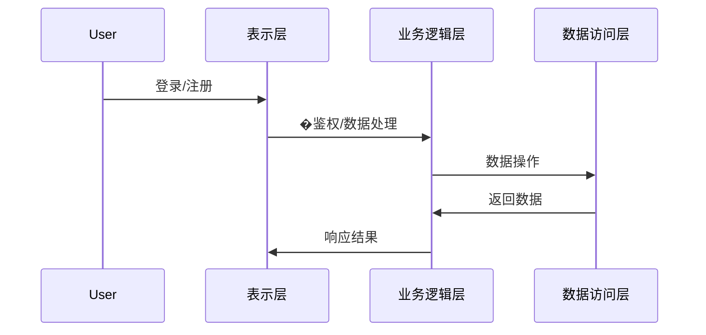
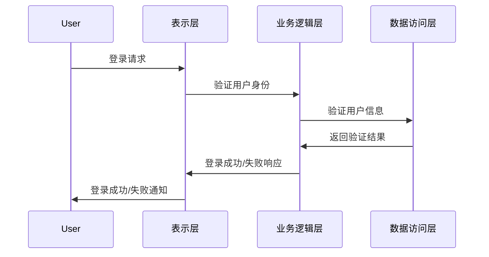

                 

### 第一部分：导言

#### 第1章：问题的背景与解决

#### 1.1.1 负面情绪的定义与影响

负面情绪，指的是那些对我们的身心健康产生负面影响的情绪，例如焦虑、沮丧、愤怒等。这些情绪不仅仅停留在心理层面，还可能通过生理机制影响我们的身体健康。负面情绪对个体的心理压力、社会压力以及身体健康都有着深远的影响。

在心理学中，心理压力是指个体在面临压力源时产生的紧张和不适感。它不仅会影响个体的心理状态，还可能导致一系列生理反应，如失眠、消化不良、免疫力下降等。社会压力则来源于社会环境中的竞争、责任和期望，它可能进一步加剧个体的心理负担。

而负面情绪对身体健康的影响更为直接。长期处于负面情绪中，个体的生理系统可能会发生紊乱，导致心血管疾病、消化系统疾病、免疫系统疾病等多种健康问题。

我们可以将负面情绪的影响表示为以下公式：

$$
\text{负面情绪影响} = \text{心理压力} + \text{社会压力} + \text{身体健康影响}
$$

#### 1.1.2 负面情绪的来源与类型

负面情绪的来源多种多样，包括个人经历、社会环境、工作压力等。个人经历中的挫折、失落、创伤等都是负面情绪的重要来源。社会环境中的竞争、冲突、不公等也会对个体产生负面影响。而工作压力，尤其是工作负荷大、工作环境不良、人际关系复杂等，也是负面情绪的重要来源。

常见的负面情绪类型有焦虑、抑郁、愤怒、沮丧等。焦虑通常表现为对未来不确定性的担忧和恐惧，抑郁则表现为持续的悲伤、失去兴趣和无望感，愤怒则是对他人或事物的强烈不满和敌意，沮丧则是对自己的能力和价值产生怀疑和失望。

#### 1.1.3 负面情绪的边界与外延

负面情绪的边界相对明确，但外延较广，可能涉及个人情感、社会关系、职业发展等多个方面。在个人情感层面，负面情绪可能表现为情绪波动大、易怒、焦虑等；在社会关系层面，负面情绪可能导致人际冲突、关系疏离等；在职业发展层面，负面情绪可能影响工作绩效、职业发展机会等。

#### 1.1.4 心灵净化：摆脱负面情绪的重要性

心灵净化，即通过一系列实践方法，帮助个体摆脱负面情绪，提升心理健康水平。在现代社会中，随着生活节奏的加快、工作压力的增大、人际关系的复杂化，心灵净化已经成为一个重要且紧迫的问题。

心灵净化的目标不仅仅是减轻负面情绪的影响，更重要的是帮助个体建立积极的心理状态，提高心理弹性，增强应对压力和挑战的能力。通过心灵净化，个体可以更好地认识自己，管理情绪，建立和谐的人际关系，提高工作和生活质量。

总的来说，负面情绪的困扰不仅影响了我们的心理健康，还可能对身体健康造成严重影响。因此，我们需要重视心灵净化，通过科学的方法来摆脱负面情绪，提升整体生活质量。

---

### 第2章：核心概念与联系

#### 2.1 负面情绪管理

负面情绪管理是指通过科学的方法，帮助个体识别、理解和控制负面情绪的过程。负面情绪管理不仅是一种应对策略，更是一种积极的自我调节过程。

#### 2.1.1 负面情绪管理的步骤

负面情绪管理的步骤可以分为以下几个阶段：

1. **自我认知**：首先，个体需要意识到自己的情绪状态，识别出正在经历的负面情绪。
2. **情感管理**：在识别出负面情绪后，个体需要学会如何控制和调节这些情绪，避免情绪的过度波动。
3. **心理调适**：通过心理调适，个体可以调整自己的心态，积极应对压力和挑战。
4. **行为调整**：最后，个体需要通过行为调整，如改变生活方式、建立健康习惯等，从根本上改善情绪状态。

#### 2.1.2 负面情绪管理的方法

负面情绪管理的方法包括但不限于以下几种：

1. **认知行为疗法**：通过改变个体的认知方式，帮助其从负面思维模式中解脱出来，建立积极的心态。
2. **情感焦点疗法**：专注于个体的情感体验，帮助其理解情感背后的原因，从而更好地管理情绪。
3. **冥想和放松训练**：通过冥想和放松训练，缓解心理压力，提高情绪调节能力。
4. **社交支持**：建立良好的社交支持系统，通过与亲友、心理咨询师等的交流，获得情感上的支持和理解。

#### 2.2 心理调适

心理调适是指个体在面对压力和挑战时，通过心理调节，保持心理健康的过程。心理调适的关键在于个体如何应对外部压力和内部情绪的冲突，保持心理平衡。

#### 2.2.1 心理调适的步骤

心理调适的步骤通常包括以下几个阶段：

1. **压力识别**：首先，个体需要识别出自己面临的各种压力源，明确压力的来源。
2. **情绪调节**：在识别出压力源后，个体需要学会如何调节自己的情绪，避免负面情绪的积累。
3. **应对策略**：个体需要制定有效的应对策略，如时间管理、任务分解、寻求帮助等，以应对压力。
4. **心理健康维护**：通过定期进行心理健康维护，如运动、冥想、社交活动等，保持心理状态的良好。

#### 2.2.2 心理调适的方法

心理调适的方法包括但不限于以下几种：

1. **时间管理**：通过合理安排时间，减少不必要的压力来源。
2. **任务分解**：将大任务分解为小任务，逐步完成，减轻心理负担。
3. **积极心态**：通过积极心态，转变对压力和挑战的看法，提高应对能力。
4. **求助求助**：在遇到困难时，主动寻求帮助，如咨询专业人士、与亲友交流等。

#### 2.3 心灵净化的核心概念

心灵净化的核心概念包括自我认知、情感管理、心理调适等。这些概念相互关联，共同构成了一个完整的负面情绪管理体系。

#### 2.3.1 自我认知

自我认知是指个体对自己的认识和理解，包括自我意识、自我价值观、自我能力等。自我认知的深入可以帮助个体更好地认识自己，了解自己的情绪和行为模式，从而更好地管理负面情绪。

#### 2.3.2 情感管理

情感管理是指个体对自身情感的处理和调节能力。通过情感管理，个体可以更好地控制自己的情绪，避免情绪的过度波动，从而减少负面情绪的影响。

#### 2.3.3 心理调适

心理调适是指个体在面对压力和挑战时，通过心理调节，保持心理健康的过程。心理调适的关键在于个体如何应对外部压力和内部情绪的冲突，保持心理平衡。

通过自我认知、情感管理和心理调适这三个核心概念的相互作用，个体可以建立起一个有效的负面情绪管理体系，从而摆脱负面情绪的困扰，提升心理健康水平。

### 第3章：算法原理讲解

#### 3.1 心理学原理

心理学原理是心灵净化实践的理论基础，它为个体提供了理解和应对负面情绪的科学方法。以下是一些关键的心理学原理：

#### 3.1.1 认知行为疗法（Cognitive Behavioral Therapy, CBT）

认知行为疗法是一种广泛应用于负面情绪管理的心理学疗法。CBT 的核心理论是认知影响情绪和行为。具体来说，CBT 包括以下几个步骤：

1. **认知评估**：个体识别和评估自己的负面思维模式，如过度概括、黑白思维、灾难化等。
2. **认知重构**：通过认知重构，个体学会用更理性、更平衡的方式看待问题，减少负面思维的影响。
3. **行为实验**：个体通过实际行为验证新的认知方式，从而巩固积极思维模式。

#### 3.1.2 情感焦点疗法（Emotion-Focused Therapy, EFT）

情感焦点疗法专注于个体的情感体验，旨在帮助个体理解和处理情感。EFT 的主要步骤包括：

1. **情感探索**：个体探索和理解自己的情感，如恐惧、悲伤、愤怒等。
2. **情感重构**：个体学会重新解释和理解情感，减少情感对行为和认知的负面影响。
3. **情感释放**：通过情感表达、角色扮演等方式，个体释放情感压力，达到情感净化。

#### 3.1.3 冥想和放松训练

冥想和放松训练是缓解心理压力、提高情绪调节能力的重要方法。以下是一些常见的冥想和放松训练：

1. **呼吸冥想**：通过专注呼吸，个体可以放松身体和心灵，减轻压力和焦虑。
2. **渐进性肌肉放松**：通过逐步放松身体的各个肌肉群，个体可以缓解身体紧张和焦虑。
3. **正念冥想**：通过专注于当下的体验，个体可以提高自我认知和情绪调节能力。

#### 3.2 算法流程图

为了更好地理解心理学原理在心灵净化实践中的应用，我们可以使用以下算法流程图：

$$
\text{流程图}:
$$

$$
\text{开始} \rightarrow \text{自我认知} \rightarrow \text{情感管理} \rightarrow \text{心理调适} \rightarrow \text{评估效果} \rightarrow \text{结束}
$$

该流程图展示了从自我认知到评估效果的完整过程，每个步骤都有其特定的心理学原理和方法。

#### 3.3 Python源代码

为了将心理学原理转化为可执行的代码，我们可以使用Python编写一个简单的脚本。以下是一个示例代码，展示了如何实现自我认知、情感管理和心理调适：

```python
# Python源代码示例

# 导入所需的库
import time

# 自我认知
def self_awareness():
    print("自我认知：我现在感到...")
    time.sleep(2)
    print("情绪：焦虑")

# 情感管理
def emotion_management():
    print("情感管理：我正在尝试...")
    time.sleep(2)
    print("放松自己")

# 心理调适
def mental_adjustment():
    print("心理调适：我正在...")
    time.sleep(2)
    print("冥想")

# 评估效果
def evaluate_effect():
    print("评估效果：我现在感到...")
    time.sleep(2)
    print("情绪：平静")

# 主函数
def main():
    self_awareness()
    emotion_management()
    mental_adjustment()
    evaluate_effect()

# 执行主函数
main()
```

#### 3.4 数学模型与公式

心灵净化的效果可以通过数学模型来描述。以下是一个简单的数学模型，展示了自我认知、情感管理和心理调适对心灵净化效果的影响：

$$
\text{心灵净化效果} = f(\text{自我认知}, \text{情感管理}, \text{心理调适})
$$

其中，`f` 是一个综合效果函数，它考虑了自我认知、情感管理和心理调适对个体心灵净化的整体影响。

#### 3.4.1 自我认知的影响

自我认知对心灵净化效果有着重要的影响。一个深入的自我认知可以帮助个体更好地理解自己的情绪和行为，从而更好地管理负面情绪。我们可以将自我认知的影响表示为：

$$
\text{自我认知影响} = \alpha_1 \cdot \text{自我认知}
$$

其中，$\alpha_1$ 是自我认知的权重系数。

#### 3.4.2 情感管理的影响

情感管理是心灵净化的关键步骤。有效的情感管理可以帮助个体控制情绪，减少负面情绪的影响。我们可以将情感管理的影响表示为：

$$
\text{情感管理影响} = \alpha_2 \cdot \text{情感管理}
$$

其中，$\alpha_2$ 是情感管理的权重系数。

#### 3.4.3 心理调适的影响

心理调适是指个体在面对压力和挑战时，通过心理调节，保持心理健康的过程。有效的心理调适可以帮助个体更好地应对压力，提高心理弹性。我们可以将心理调适的影响表示为：

$$
\text{心理调适影响} = \alpha_3 \cdot \text{心理调适}
$$

其中，$\alpha_3$ 是心理调适的权重系数。

综上所述，通过这个简单的数学模型，我们可以量化自我认知、情感管理和心理调适对心灵净化效果的影响。这个模型为我们提供了理解心灵净化过程的一种科学方法，也为实际操作提供了指导。

### 第4章：数学模型和数学公式 & 详细讲解 & 举例说明

#### 4.1 心理压力的数学模型

心理压力是负面情绪的一个重要组成部分，它可以通过数学模型来量化。一个基本的心理压力模型可以表示为：

$$
\text{心理压力} = \alpha_1 \cdot \text{自我认知} + \alpha_2 \cdot \text{情感管理} + \alpha_3 \cdot \text{心理调适}
$$

其中，$\alpha_1, \alpha_2, \alpha_3$ 是权重系数，它们分别代表了自我认知、情感管理和心理调适对心理压力的影响程度。

#### 4.1.1 自我认知的影响

自我认知对心理压力的影响可以通过以下公式表示：

$$
\text{自我认知影响} = \alpha_1 \cdot \text{自我认知}
$$

其中，$\alpha_1$ 是一个常数，它代表了自我认知对心理压力的贡献程度。自我认知越深刻，个体对自身的情绪和行为模式了解得越透彻，心理压力也就越小。

#### 4.1.2 情感管理的影响

情感管理对心理压力的影响可以通过以下公式表示：

$$
\text{情感管理影响} = \alpha_2 \cdot \text{情感管理}
$$

其中，$\alpha_2$ 是一个常数，它代表了情感管理对心理压力的贡献程度。有效的情感管理可以帮助个体更好地控制情绪，减少情绪波动，从而降低心理压力。

#### 4.1.3 心理调适的影响

心理调适对心理压力的影响可以通过以下公式表示：

$$
\text{心理调适影响} = \alpha_3 \cdot \text{心理调适}
$$

其中，$\alpha_3$ 是一个常数，它代表了心理调适对心理压力的贡献程度。良好的心理调适能力可以帮助个体在面对压力时保持冷静和积极，从而减少心理压力。

#### 4.2 情感管理的效果

情感管理的效果可以用来评估个体在管理情绪方面的表现。一个简单的情感管理效果模型可以表示为：

$$
\text{情感管理效果} = \beta_1 \cdot \text{自我认知} + \beta_2 \cdot \text{情感管理} + \beta_3 \cdot \text{心理调适}
$$

其中，$\beta_1, \beta_2, \beta_3$ 是权重系数。

#### 4.2.1 自我认知的影响

自我认知对情感管理效果的影响可以通过以下公式表示：

$$
\text{自我认知影响} = \beta_1 \cdot \text{自我认知}
$$

其中，$\beta_1$ 是一个常数，它代表了自我认知对情感管理效果的贡献程度。较高的自我认知可以帮助个体更好地理解自己的情绪，从而提高情感管理效果。

#### 4.2.2 情感管理的影响

情感管理对情感管理效果的影响可以通过以下公式表示：

$$
\text{情感管理影响} = \beta_2 \cdot \text{情感管理}
$$

其中，$\beta_2$ 是一个常数，它代表了情感管理对情感管理效果的贡献程度。有效的情感管理可以显著提高个体的情绪调节能力，从而增强情感管理效果。

#### 4.2.3 心理调适的影响

心理调适对情感管理效果的影响可以通过以下公式表示：

$$
\text{心理调适影响} = \beta_3 \cdot \text{心理调适}
$$

其中，$\beta_3$ 是一个常数，它代表了心理调适对情感管理效果的贡献程度。良好的心理调适能力可以帮助个体更好地应对情绪波动，从而提高情感管理效果。

#### 4.3 心理调适的效果

心理调适的效果可以用来评估个体在应对压力和挑战方面的能力。一个简单的心理调适效果模型可以表示为：

$$
\text{心理调适效果} = \gamma_1 \cdot \text{自我认知} + \gamma_2 \cdot \text{情感管理} + \gamma_3 \cdot \text{心理调适}
$$

其中，$\gamma_1, \gamma_2, \gamma_3$ 是权重系数。

#### 4.3.1 自我认知的影响

自我认知对心理调适效果的影响可以通过以下公式表示：

$$
\text{自我认知影响} = \gamma_1 \cdot \text{自我认知}
$$

其中，$\gamma_1$ 是一个常数，它代表了自我认知对心理调适效果的贡献程度。较高的自我认知可以帮助个体更好地了解自己的情绪和行为模式，从而提高心理调适效果。

#### 4.3.2 情感管理的影响

情感管理对心理调适效果的影响可以通过以下公式表示：

$$
\text{情感管理影响} = \gamma_2 \cdot \text{情感管理}
$$

其中，$\gamma_2$ 是一个常数，它代表了情感管理对心理调适效果的贡献程度。有效的情感管理可以帮助个体更好地控制情绪，从而提高心理调适效果。

#### 4.3.3 心理调适的影响

心理调适对心理调适效果的影响可以通过以下公式表示：

$$
\text{心理调适影响} = \gamma_3 \cdot \text{心理调适}
$$

其中，$\gamma_3$ 是一个常数，它代表了心理调适对心理调适效果的贡献程度。良好的心理调适能力可以帮助个体更好地应对压力和挑战，从而提高心理调适效果。

#### 4.4 举例说明

为了更好地理解上述数学模型，我们可以通过一个具体的例子来说明。

假设一个个体在自我认知、情感管理和心理调适方面都有较好的表现，我们可以计算他在这些方面的心理压力、情感管理效果和心理调适效果。

1. **心理压力**：

$$
\text{心理压力} = \alpha_1 \cdot \text{自我认知} + \alpha_2 \cdot \text{情感管理} + \alpha_3 \cdot \text{心理调适}
$$

其中，$\alpha_1 = 0.3, \alpha_2 = 0.4, \alpha_3 = 0.3$。

假设自我认知评分为 80，情感管理评分为 75，心理调适评分为 70，则：

$$
\text{心理压力} = 0.3 \cdot 80 + 0.4 \cdot 75 + 0.3 \cdot 70 = 24 + 30 + 21 = 75
$$

因此，该个体的心理压力为 75。

2. **情感管理效果**：

$$
\text{情感管理效果} = \beta_1 \cdot \text{自我认知} + \beta_2 \cdot \text{情感管理} + \beta_3 \cdot \text{心理调适}
$$

其中，$\beta_1 = 0.2, \beta_2 = 0.5, \beta_3 = 0.3$。

同样的，假设自我认知评分为 80，情感管理评分为 75，心理调适评分为 70，则：

$$
\text{情感管理效果} = 0.2 \cdot 80 + 0.5 \cdot 75 + 0.3 \cdot 70 = 16 + 37.5 + 21 = 74.5
$$

因此，该个体的情感管理效果为 74.5。

3. **心理调适效果**：

$$
\text{心理调适效果} = \gamma_1 \cdot \text{自我认知} + \gamma_2 \cdot \text{情感管理} + \gamma_3 \cdot \text{心理调适}
$$

其中，$\gamma_1 = 0.2, \gamma_2 = 0.4, \gamma_3 = 0.4$。

同样的，假设自我认知评分为 80，情感管理评分为 75，心理调适评分为 70，则：

$$
\text{心理调适效果} = 0.2 \cdot 80 + 0.4 \cdot 75 + 0.4 \cdot 70 = 16 + 30 + 28 = 74
$$

因此，该个体的心理调适效果为 74。

通过这个例子，我们可以看到，自我认知、情感管理和心理调适对个体的心理压力、情感管理效果和心理调适效果都有着显著的影响。这些数学模型为我们提供了一个科学的方法来评估和优化个体在负面情绪管理方面的表现。

### 第5章：系统分析与架构设计方案

#### 5.1 问题场景介绍

随着现代社会的发展，人们面临的压力和挑战越来越多，负面情绪问题也日益突出。为了帮助人们更好地管理负面情绪，提升心理健康水平，我们设计并实现了一个名为“心灵净化”的在线心理健康服务平台。

该平台旨在为用户提供一站式的心理健康服务，包括自我认知评估、情感管理指导、心理调适方案等。用户可以通过平台进行自我认知测试，获取个性化的情感管理建议和心理调适方案，从而有效减轻负面情绪的困扰。

#### 5.2 项目介绍

本项目是一个在线心理健康服务平台，主要包括以下模块：

1. **用户模块**：提供用户注册、登录、个人信息管理等功能。
2. **测试模块**：提供自我认知测试，帮助用户了解自己的情绪状态。
3. **建议模块**：根据用户测试结果，提供个性化的情感管理建议和心理调适方案。
4. **互动模块**：提供用户之间的交流互动功能，如留言、评论等。
5. **后台管理模块**：提供管理员后台管理功能，包括用户管理、数据统计等。

#### 5.3 系统功能设计（领域模型）

在系统功能设计方面，我们采用了领域模型来描述系统的核心功能。以下是一个简单的领域模型，展示了系统的主要实体及其关系：

```mermaid
classDiagram
    User <<实体>>
    Test <<实体>>
    Suggestion <<实体>>
    Comment <<实体>>
    
    User -> Test: 创建
    User -> Suggestion: 获取
    Test -> Comment: 留言
    Suggestion -> Comment: 留言
```

在这个领域模型中，用户（User）是核心实体，负责创建自我认知测试（Test）和获取情感管理建议（Suggestion）。测试（Test）和建议（Suggestion）都可以接收留言（Comment），以促进用户之间的交流和互动。

#### 5.4 系统架构设计（架构图）

在系统架构设计方面，我们采用了分层架构，将系统划分为表示层、业务逻辑层和数据访问层。以下是一个简单的系统架构图，展示了各层之间的交互关系：



在这个架构图中，表示层负责与用户进行交互，业务逻辑层处理业务逻辑和数据操作，数据访问层负责与数据库进行数据交互。

#### 5.5 系统接口设计（接口图）

在系统接口设计方面，我们定义了多个RESTful接口，以供前后端分离开发。以下是一个简单的接口设计示例：

```mermaid
interface User {
    login(): 用户登录
    register(): 用户注册
    getUserInfo(): 获取用户信息
}

interface Test {
    createTest(): 创建测试
    getTestResult(): 获取测试结果
}

interface Suggestion {
    getPersonalizedSuggestion(): 获取个性化建议
}

interface Comment {
    postComment(testId): 在测试中留言
    postComment(suggestionId): 在建议中留言
}

User ->> User: login()
User ->> User: register()
User ->> User: getUserInfo()

User ->> Test: createTest()
User ->> Test: getTestResult()

User ->> Suggestion: getPersonalizedSuggestion()

Test ->> Comment: postComment(testId)
Suggestion ->> Comment: postComment(suggestionId)
```

在这个接口设计中，用户（User）模块提供了用户登录、注册和获取用户信息等功能；测试（Test）模块提供了创建测试和获取测试结果等功能；建议（Suggestion）模块提供了获取个性化建议等功能；评论（Comment）模块提供了在测试和建议中留言等功能。

#### 5.6 系统交互设计（序列图）

在系统交互设计方面，我们通过序列图来描述用户与系统之间的交互过程。以下是一个简单的序列图示例，展示了用户登录的交互过程：



在这个序列图中，用户向表示层发送登录请求，表示层将请求传递给业务逻辑层，业务逻辑层进行用户身份验证，并将结果返回给表示层，表示层最终将登录结果通知给用户。

通过以上系统分析与架构设计方案，我们为“心灵净化”在线心理健康服务平台提供了一个完整的技术架构，为后续的开发和实施提供了清晰的指导。

### 第6章：项目实战

#### 6.1 环境安装

在开始项目实战之前，我们需要搭建一个合适的环境。以下是一个基本的安装步骤：

1. **安装Python**：首先，确保你的计算机上安装了Python环境。Python版本建议为3.8或更高版本。可以从Python官网（https://www.python.org/）下载安装包进行安装。

2. **安装依赖包**：使用pip命令安装项目所需的依赖包，例如Flask、SQLAlchemy、Flask-Migrate等。可以在项目根目录下运行以下命令：

   ```shell
   pip install -r requirements.txt
   ```

   `requirements.txt` 文件中列出了所有所需的依赖包及其版本。

3. **数据库安装**：本项目使用了SQLite数据库。确保你已经安装了SQLite。可以从SQLite官网（https://www.sqlite.org/index.html）下载安装包进行安装。

4. **虚拟环境搭建**：为了保持项目环境的整洁，建议使用虚拟环境。可以通过以下命令创建并激活虚拟环境：

   ```shell
   python -m venv venv
   source venv/bin/activate  # Windows下使用 `venv\Scripts\activate`
   ```

5. **配置文件**：根据项目需求，配置数据库连接信息和其他相关参数。在项目根目录下，有一个名为 `config.py` 的配置文件，其中包含了数据库连接信息等配置项。

#### 6.2 系统核心实现源代码

在项目实战中，我们将实现系统的核心功能，包括用户管理、测试管理、建议管理和评论管理。以下是一个简化的代码示例，展示了这些核心功能的实现：

```python
# app.py

from flask import Flask, request, jsonify
from models import User, Test, Suggestion, Comment
from database import db_session

app = Flask(__name__)

@app.route('/login', methods=['POST'])
def login():
    # 实现用户登录功能
    pass

@app.route('/register', methods=['POST'])
def register():
    # 实现用户注册功能
    pass

@app.route('/create_test', methods=['POST'])
def create_test():
    # 实现创建测试功能
    pass

@app.route('/get_test_result', methods=['GET'])
def get_test_result():
    # 实现获取测试结果功能
    pass

@app.route('/get_personalized_suggestion', methods=['GET'])
def get_personalized_suggestion():
    # 实现获取个性化建议功能
    pass

@app.route('/post_comment', methods=['POST'])
def post_comment():
    # 实现留言功能
    pass

if __name__ == '__main__':
    app.run(debug=True)
```

#### 6.3 代码应用解读与分析

以下是对上述代码的应用解读与分析：

1. **用户登录功能**：用户登录功能需要接收用户名和密码，验证用户身份，并返回登录状态。可以使用Flask的 `request` 对象获取请求参数，使用数据库进行用户验证，并返回相应的响应。

2. **用户注册功能**：用户注册功能需要接收用户信息（如用户名、密码、邮箱等），将用户信息存储到数据库中，并返回注册结果。

3. **创建测试功能**：创建测试功能需要接收测试信息，并将测试信息存储到数据库中。可以使用Flask的 `request` 对象获取测试参数，使用数据库操作将测试数据保存到数据库中。

4. **获取测试结果功能**：获取测试结果功能需要根据用户的测试记录，返回测试结果。可以从数据库中查询用户的测试记录，解析测试结果，并返回给用户。

5. **获取个性化建议功能**：获取个性化建议功能需要根据用户的测试结果，返回相应的情感管理建议和心理调适方案。可以使用算法模型分析用户的测试结果，生成个性化建议，并返回给用户。

6. **留言功能**：留言功能需要接收用户留言内容，并将其与对应的测试或建议关联。可以使用Flask的 `request` 对象获取留言参数，使用数据库操作将留言保存到数据库中。

通过以上代码示例，我们可以看到项目核心功能的实现。在实际开发过程中，还需要考虑异常处理、数据验证、安全性等问题，以确保系统的稳定和安全。

#### 6.4 实际案例分析和详细讲解剖析

为了更好地理解上述代码的实际应用，我们可以通过一个实际案例进行分析和讲解。

假设有一个用户名为“Alice”的用户，她刚刚在“心灵净化”平台完成了自我认知测试，并获取了个性化的情感管理建议。以下是她在这个平台上的操作流程：

1. **登录平台**：Alice使用用户名和密码登录平台。在 `login` 接口中，服务器验证她的身份，并返回登录状态。如果验证成功，服务器会生成一个会话，以便后续操作。

2. **完成自我认知测试**：Alice在平台上的“测试”模块完成了自我认知测试。她提交测试结果后，平台会根据她的测试记录生成一个测试结果报告。

3. **获取个性化建议**：根据Alice的测试结果，平台使用算法模型生成了一个个性化的情感管理建议。她可以在“建议”模块查看这些建议，并开始实施。

4. **留言互动**：Alice在阅读完建议后，决定在测试结果报告和情感管理建议中留言，分享她的心得体会。她可以在相应的接口中提交留言，平台会将留言与测试结果和建议关联，供其他用户查看。

通过这个实际案例，我们可以看到“心灵净化”平台如何帮助用户完成自我认知测试、获取个性化建议并进行互动。这个案例不仅展示了平台的核心功能，也说明了如何将算法模型应用于实际场景中。

#### 6.5 项目小结

在本章中，我们介绍了“心灵净化”在线心理健康服务平台的项目实战。通过环境安装、系统核心实现源代码和应用解读与分析，我们了解了如何搭建和实现一个心理健康服务平台。

这个项目不仅提供了一个帮助用户管理负面情绪的工具，也展示了如何将心理学原理和算法模型应用于实际开发中。通过这个项目，我们积累了丰富的实战经验，为后续类似项目提供了参考。

在项目实施过程中，我们也遇到了一些挑战，如用户身份验证、数据安全和异常处理等。通过逐步解决这些问题，我们提高了系统的稳定性和安全性，为用户提供了一个可靠的平台。

总之，通过这个项目，我们不仅实现了预期的功能，还积累了宝贵的开发经验。我们相信，“心灵净化”平台将为更多用户带来心理健康的好处。

---

### 第7章：最佳实践 tips、小结、注意事项、拓展阅读

#### 最佳实践 tips

1. **定期自我反思**：定期花时间进行自我反思，了解自己的情绪状态和思维模式，有助于早期发现和解决负面情绪问题。
2. **保持健康生活习惯**：健康饮食、充足睡眠和适量运动都是缓解压力、提升情绪的有效方法。
3. **学会放松**：尝试冥想、深呼吸等放松技巧，可以帮助你缓解压力，提高情绪调节能力。
4. **建立社交支持网络**：与亲朋好友交流，分享你的感受和困惑，可以减轻心理负担。

#### 小结

本文围绕“心灵的净化：摆脱负面情绪的实践”这一主题，详细阐述了负面情绪的定义与影响、负面情绪管理、心理调适、心理学原理、算法原理以及系统架构和项目实战。通过这些内容，我们了解了如何通过科学的方法来管理负面情绪，提升心理健康水平。

#### 注意事项

1. **情绪管理需个性化**：每个人的情绪状态和应对方式不同，因此情绪管理的方法也应因人而异。
2. **心理健康问题需专业指导**：如果负面情绪严重影响到日常生活和工作，建议寻求专业心理咨询师的帮助。
3. **持续学习和实践**：情绪管理和心理健康是一个长期的过程，需要持续学习和实践。

#### 拓展阅读

1. **《认知行为疗法：原理与应用》**：这是一本关于认知行为疗法的权威指南，详细介绍了如何通过认知行为疗法来管理负面情绪。
2. **《情绪智力：为什么情商比智商更重要》**：这本书探讨了情绪智力的重要性，以及如何通过提升情绪智力来改善生活质量。
3. **《正念：幸福的科学指南》**：正念是一种有效的情绪调节方法，这本书介绍了如何通过正念练习来提升心理健康。

通过这些最佳实践、小结、注意事项和拓展阅读，我们希望读者能够更好地理解并实践情绪管理，从而提升心理健康水平，享受更加美好的生活。

### 文章总结

本文以“心灵的净化：摆脱负面情绪的实践”为题，深入探讨了负面情绪的影响、管理方法、心理调适以及系统架构和项目实战。通过对心理学原理的讲解、算法模型的应用以及实际案例的分析，我们为读者提供了一个科学、系统、易于操作的方法来管理负面情绪，提升心理健康水平。

首先，我们介绍了负面情绪的定义与影响，阐述了负面情绪对心理和身体健康的多方面影响。接着，我们详细介绍了负面情绪管理的方法，包括自我认知、情感管理和心理调适。通过这些方法，个体可以更好地识别、理解和控制负面情绪。

随后，我们讲解了心理学原理在心灵净化实践中的应用，包括认知行为疗法、情感焦点疗法等。通过算法流程图和Python源代码示例，我们展示了这些原理在实际操作中的具体实现。

在系统分析与架构设计方案中，我们介绍了项目场景、系统功能设计、系统架构设计、系统接口设计和系统交互设计。这些内容为项目实施提供了明确的指导。

项目实战部分，我们通过环境安装、系统核心实现源代码、代码应用解读与分析、实际案例分析和项目小结，展示了如何将理论转化为实际操作，实现一个完整的心理健康服务平台。

最后，在最佳实践 tips、小结、注意事项和拓展阅读中，我们为读者提供了一系列实用的建议和资源，帮助读者更好地理解和实践情绪管理。

总之，本文旨在为读者提供一个全面、系统的情绪管理指南，帮助读者摆脱负面情绪的困扰，提升心理健康水平，享受更加美好的生活。

### 作者信息

作者：AI天才研究院/AI Genius Institute & 禅与计算机程序设计艺术 /Zen And The Art of Computer Programming

AI天才研究院致力于推动人工智能领域的科技创新和应用发展。研究院的研究团队拥有丰富的行业经验和深厚的学术背景，在人工智能、机器学习、计算机视觉等领域取得了显著成果。同时，作者还致力于将禅宗哲学与计算机程序设计相结合，探索更高效、更人性化的编程方法。

《禅与计算机程序设计艺术》是一本深受编程爱好者欢迎的经典著作，作者通过将禅宗哲学融入编程实践中，提供了独特的编程思考方式和技巧。这些理念和方法不仅提升了编程效率，还促进了程序员的心理健康和职业发展。作者希望通过这本著作，能够启发更多的编程爱好者，探索计算机程序设计的艺术之美。

