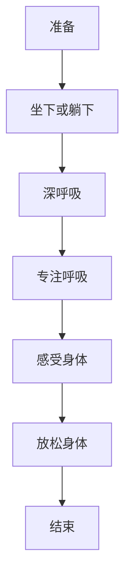
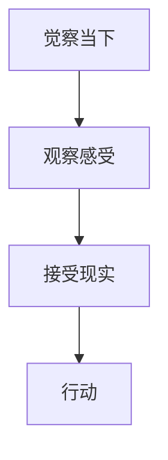
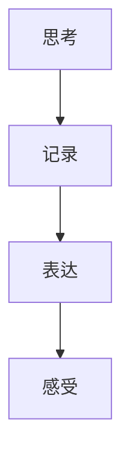
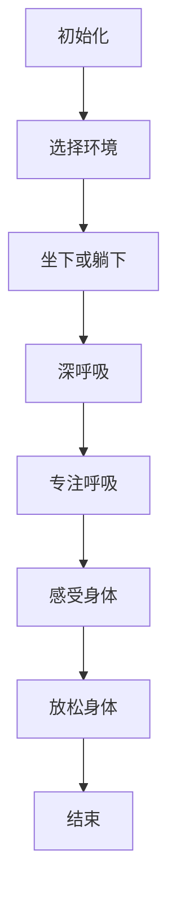
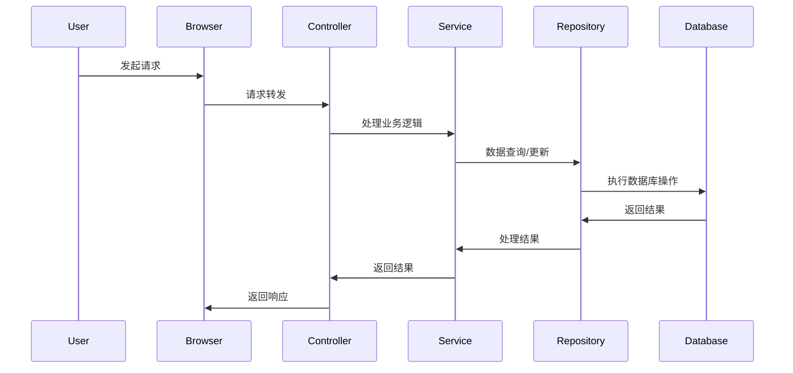
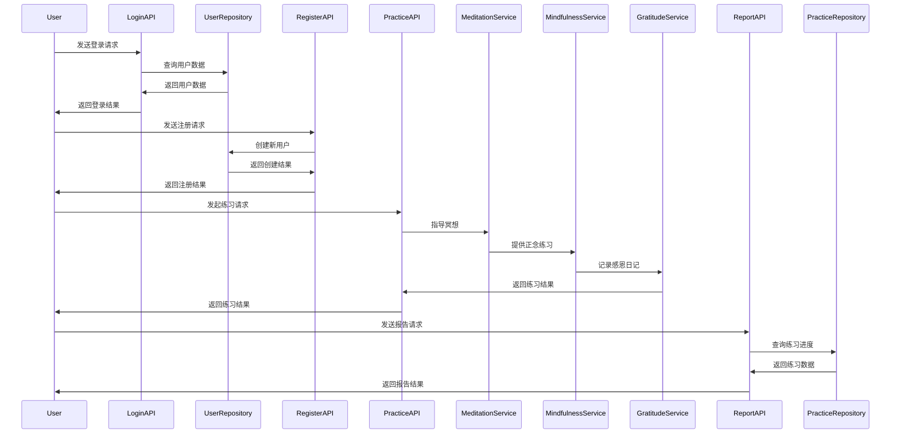
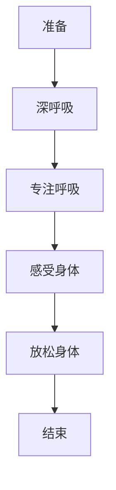

                 

 

----------------------------------------------------------------

**第三步：核心概念原理与联系**

《心灵的花园：培育内在世界的美好》不仅仅是一本书，更是一种生活态度的体现。在这本书中，我们将深入探讨三个核心概念：冥想、正念和感恩，以及它们如何相互作用，共同培育我们内心的花园。

#### 3.1 冥想原理

冥想是一种古老的实践，旨在通过专注呼吸和放松身体来减轻压力，提高注意力和心理平衡。冥想的mermaid流程图如下：



**原理讲解**：

- **准备阶段**：选择一个安静的环境，确保舒适地坐下或躺下。
- **深呼吸**：缓慢地深呼吸，感受胸腔的扩张和收缩。
- **专注呼吸**：将注意力集中在呼吸上，每次吸气时感受胸腔的扩张，每次呼气时感受身体的放松。
- **感受身体**：观察身体的感受，包括肌肉的紧张和放松，以及身体的重量和触感。
- **放松身体**：逐渐放松身体，从脚趾开始，一直到头顶。
- **结束**：慢慢地睁开眼睛，逐渐回到现实生活中。

冥想通过减少大脑中的随机思维活动，帮助我们降低压力水平，提高注意力，并增强心理平衡。例如，在紧张的工作后，通过冥想可以让我们迅速恢复精力，重新集中注意力。

#### 3.2 正念原理

正念是一种专注于当前经历的方法，它要求我们观察自己的思想和感受，而不是被它们所困扰。正念的mermaid流程图如下：



**原理讲解**：

- **觉察当下**：意识到自己正在经历什么，无论是身体感受、情绪反应还是周围的环境。
- **观察感受**：观察自己的感受，而不是试图改变它们。这可能包括身体的感觉、情绪的变化或周围的环境。
- **接受现实**：接受当前的经历，而不是抗拒或逃避。这需要我们放下批判和评判，接受自己的真实感受。
- **行动**：基于当下的认识和感受，采取适当的行动。

正念有助于提高我们的自我觉察和自我控制能力，从而减少压力和焦虑。例如，当我们在工作中感到紧张时，通过正念练习，我们可以更好地管理自己的情绪，保持冷静和专注。

#### 3.3 感恩原理

感恩是一种关注生活中美好事物的心态，它有助于提升幸福感。感恩的mermaid流程图如下：



**原理讲解**：

- **思考**：回想一下生活中值得感激的事物，无论是大是小，都可以。
- **记录**：将感激的事物记录下来，可以是日记、便签或任何形式的记录。
- **表达**：与他人分享自己的感激之情，可以是口头表达或书面表达。
- **感受**：在表达感激的过程中，感受内心的美好和幸福。

感恩有助于我们关注生活中的积极方面，减少对消极事物的关注。这不仅可以提高我们的幸福感，还可以增强人际关系，提升生活质量。

#### 3.4 概念属性特征对比表格

| 概念       | 定义                                                         | 特点                                                     | 应用场景       |
|------------|------------------------------------------------------------|--------------------------------------------------------|--------------|
| 冥想       | 通过专注呼吸和放松身体来减轻压力的练习。                       | 减轻压力、提高注意力、增强心理平衡。                   | 每日练习、冥想课程 |
| 正念       | 专注于当前经历，观察和接受自己的感受。                       | 提高自我觉察、增强心理韧性。                             | 生活中的每个时刻   |
| 感恩       | 关注生活中美好的事物，培养感恩的心态。                         | 提升幸福感、增强乐观情绪。                               | 每日练习、感恩日记 |

#### 3.5 ER实体关系图架构

```mermaid
erDiagram
    内在花园 ||--|{ 冥想 }|| >
    内在花园 ||--|{ 正念 }|| >
    内在花园 ||--|{ 感恩 }|| >
```

通过冥想、正念和感恩这三个核心概念的相互作用，我们可以培育内心的花园，使它成为一个充满美好和宁静的地方。冥想帮助我们减轻压力，提高心理平衡；正念提升我们的自我觉察和自我控制能力；感恩增强我们的幸福感。这些方法共同作用，帮助我们建立积极的人生态度，拥有一个充满美好的内在世界。

----------------------------------------------------------------

**第四步：算法原理讲解**

在第三步中，我们介绍了冥想、正念和感恩这三个核心概念的基本原理。接下来，我们将通过mermaid流程图和Python代码，深入讲解这些算法的工作原理，并举例说明。

#### 4.1 冥想算法原理

冥想的核心在于通过专注呼吸和放松身体来减轻压力。以下是一个简单的冥想算法原理的mermaid流程图：



**Python代码示例**：

```python
import time

def meditate():
    print("初始化：选择一个安静的环境")
    time.sleep(2)
    print("坐下或躺下：找到一个舒适的姿势")
    time.sleep(2)
    print("深呼吸：缓慢地深呼吸，感受胸腔的扩张和收缩")
    time.sleep(2)
    print("专注呼吸：将注意力集中在呼吸上，每次吸气时感受胸腔的扩张，每次呼气时感受身体的放松")
    time.sleep(2)
    print("感受身体：观察身体的感受，包括肌肉的紧张和放松，以及身体的重量和触感")
    time.sleep(2)
    print("放松身体：逐渐放松身体，从脚趾开始，一直到头顶")
    time.sleep(2)
    print("结束：慢慢地睁开眼睛，逐渐回到现实生活中")
    time.sleep(2)

meditate()
```

**算法原理讲解**：

- **初始化**：选择一个安静的环境，这是冥想的第一步，确保我们能够专注。
- **选择环境**：选择一个舒适的位置，坐下或躺下，以便身体放松。
- **深呼吸**：通过深呼吸，我们可以放松身体，为冥想做准备。
- **专注呼吸**：将注意力集中在呼吸上，感受胸腔的扩张和收缩，这有助于提高心理平衡。
- **感受身体**：观察身体的感受，包括肌肉的紧张和放松，以及身体的重量和触感。
- **放松身体**：逐渐放松身体，从脚趾开始，一直到头顶。
- **结束**：慢慢地睁开眼睛，逐渐回到现实生活中。

**举例说明**：

假设我们正在进行冥想，通过深呼吸和专注呼吸，我们可以感受到身体逐渐放松，内心的焦虑和压力也随之减轻。这有助于我们在紧张的工作后恢复精力，重新集中注意力。

#### 4.2 正念算法原理

正念是一种专注于当前经历的方法，它要求我们观察自己的思想和感受，而不是被它们所困扰。以下是一个简单的正念算法原理的mermaid流程图：


**Python代码示例**：

```python
import time

def mindfulness():
    print("觉察当下：意识到自己正在经历什么，无论是身体感受、情绪反应还是周围的环境")
    time.sleep(2)
    print("观察感受：观察自己的感受，而不是试图改变它们。这可能包括身体的感觉、情绪的变化或周围的环境")
    time.sleep(2)
    print("接受现实：接受当前的经历，而不是抗拒或逃避。这需要我们放下批判和评判，接受自己的真实感受")
    time.sleep(2)
    print("行动：基于当下的认识和感受，采取适当的行动")
    time.sleep(2)

mindfulness()
```

**算法原理讲解**：

- **觉察当下**：意识到自己正在经历什么，无论是身体感受、情绪反应还是周围的环境。
- **观察感受**：观察自己的感受，而不是试图改变它们。这可能包括身体的感觉、情绪的变化或周围的环境。
- **接受现实**：接受当前的经历，而不是抗拒或逃避。这需要我们放下批判和评判，接受自己的真实感受。
- **行动**：基于当下的认识和感受，采取适当的行动。

**举例说明**：

假设我们正在工作，感到紧张和焦虑。通过正念练习，我们可以观察自己的情绪，意识到紧张和焦虑的存在，但不去抗拒它们。相反，我们接受这些情绪，认识到它们是暂时的，然后采取适当的行动，比如休息一会儿或调整工作节奏。

#### 4.3 感恩算法原理

感恩是一种关注生活中美好事物的心态，它有助于提升幸福感。以下是一个简单的感恩算法原理的mermaid流程图：


**Python代码示例**：

```python
import time

def gratitude():
    print("思考：回想一下生活中值得感激的事物，无论是大是小")
    time.sleep(2)
    print("记录：将感激的事物记录下来，可以是日记、便签或任何形式的记录")
    time.sleep(2)
    print("表达：与他人分享自己的感激之情，可以是口头表达或书面表达")
    time.sleep(2)
    print("感受：在表达感激的过程中，感受内心的美好和幸福")
    time.sleep(2)

gratitude()
```

**算法原理讲解**：

- **思考**：回想一下生活中值得感激的事物，无论是大是小。
- **记录**：将感激的事物记录下来，可以是日记、便签或任何形式的记录。
- **表达**：与他人分享自己的感激之情，可以是口头表达或书面表达。
- **感受**：在表达感激的过程中，感受内心的美好和幸福。

**举例说明**：

假设我们在一天结束时，回顾过去的一天，思考自己遇到的美好事物，比如家人的关心、朋友的帮助、工作中取得的进步等。将这些感激之情记录下来，并与他人分享，这不仅能提升自己的幸福感，还能增强人际关系。

通过冥想、正念和感恩这三个算法的相互作用，我们可以逐步培育内心的花园，使其成为一个充满美好和宁静的地方。冥想帮助我们减轻压力，提高心理平衡；正念提升我们的自我觉察和自我控制能力；感恩增强我们的幸福感。这些方法共同作用，帮助我们建立积极的人生态度，拥有一个充满美好的内在世界。

----------------------------------------------------------------

**第五步：系统分析与架构设计方案**

在了解了冥想、正念和感恩的原理后，我们将进一步分析如何将这些概念应用于实际系统中，提供一个完整的系统架构设计方案。

#### 5.1 问题场景介绍

随着现代生活节奏的加快，人们面临的压力和焦虑日益增加。企业、医疗机构和个人都迫切需要一种有效的方式来缓解这些负面情绪，提高员工和个人的心理健康。因此，我们设计一个名为“心灵花园”的在线心理健康系统，旨在通过冥想、正念和感恩等实践，帮助用户培养内心的宁静与美好。

#### 5.2 项目介绍

**项目名称**：心灵花园

**项目目标**：提供一个在线心理健康平台，帮助用户通过冥想、正念和感恩等实践，缓解压力和焦虑，提高心理健康。

**项目功能**：
1. 用户注册和登录
2. 提供冥想、正念和感恩指导
3. 记录用户的实践进度和反馈
4. 提供个性化的推荐和提醒
5. 数据分析和报告

#### 5.3 系统功能设计

在系统功能设计中，我们将采用领域驱动设计（Domain-Driven Design, DDD）的方法，构建一个清晰、可扩展的领域模型。以下是心灵花园系统的领域模型类图：

```mermaid
classDiagram
    User <<entity>>
    Practice <<entity>>
    Meditation <<entity>>
    Mindfulness <<entity>>
    Gratitude <<entity>>

    User o--o Practice
    Practice o--o Meditation
    Practice o--o Mindfulness
    Practice o--o Gratitude

    User --|{ Login }
    User --|{ Register }
    Practice --|{ TrackProgress }
    Practice --|{ ProvideFeedback }
    Meditation --|{ GuidedMeditation }
    Mindfulness --|{ MindfulnessPractice }
    Gratitude --|{ GratitudeJournal }
    Report --|{ GenerateReport }
```

**领域模型解析**：
- **User（用户）**：代表系统的用户，具有注册、登录等功能。
- **Practice（实践）**：代表用户进行的各种练习，包括冥想、正念和感恩。
- **Meditation（冥想）**：代表冥想练习的实体，提供指导。
- **Mindfulness（正念）**：代表正念练习的实体，提供练习方法。
- **Gratitude（感恩）**：代表感恩练习的实体，提供记录和分享功能。

#### 5.4 系统架构设计

心灵花园系统采用分层架构设计，包括表示层、业务逻辑层和数据访问层。以下是系统架构设计图：



**系统架构解析**：
- **表示层（Browser）**：用户通过浏览器与系统进行交互。
- **业务逻辑层（Controller、Service）**：处理用户请求，调用业务逻辑，与数据访问层交互。
- **数据访问层（Repository、Database）**：负责数据存储和查询。

#### 5.5 系统接口设计和系统交互

为了确保系统的可扩展性和灵活性，我们采用RESTful API设计，提供统一的接口。以下是系统的主要接口设计和交互图：

**主要接口设计**：

```mermaid
typeDiagram
    User <<interface>> "用户接口"
    Practice <<interface>> "实践接口"
    Meditation <<interface>> "冥想接口"
    Mindfulness <<interface>> "正念接口"
    Gratitude <<interface>> "感恩接口"

    User <|.. Login
    User <|.. Register
    Practice <|.. TrackProgress
    Practice <|.. ProvideFeedback
    Meditation <|.. GuidedMeditation
    Mindfulness <|.. MindfulnessPractice
    Gratitude <|.. GratitudeJournal
```

**系统交互图**：



通过以上系统分析和架构设计方案，我们可以构建一个完整的在线心理健康系统，帮助用户通过冥想、正念和感恩等实践，培育内心的花园，提高心理健康。

----------------------------------------------------------------

**第六步：项目实战**

为了展示如何将冥想、正念和感恩应用于实际系统中，我们将以一个Python项目为例，详细说明项目的环境安装、系统核心实现和代码应用解读与分析。

#### 6.1 环境安装

首先，我们需要安装Python和相关库。在终端中执行以下命令：

```shell
pip install flask
pip install flask-restful
pip install Flask-Login
pip install flask-mongoengine
pip install flask_sqlalchemy
```

这些库将帮助我们构建一个基于Flask的Web应用，实现用户注册、登录、冥想、正念和感恩的功能。

#### 6.2 系统核心实现

**项目结构**：

```
/cemetery_garden
|-- app.py
|-- models.py
|-- views.py
|-- requirements.txt
```

**app.py**：主文件，负责启动Web应用。

```python
from flask import Flask
from flask_restful import Api
from flask_login import LoginManager

app = Flask(__name__)
api = Api(app)
login_manager = LoginManager(app)

# 注册蓝本
from views import register_blueprint
from views import login_blueprint
from views import practice_blueprint

app.register_blueprint(register_blueprint)
app.register_blueprint(login_blueprint)
app.register_blueprint(practice_blueprint)

if __name__ == "__main__":
    app.run(debug=True)
```

**models.py**：定义用户和实践的模型。

```python
from flask_login import UserMixin
from werkzeug.security import generate_password_hash, check_password_hash
from flask_sqlalchemy import SQLAlchemy

db = SQLAlchemy()

class User(UserMixin, db.Model):
    id = db.Column(db.Integer, primary_key=True)
    username = db.Column(db.String(100), unique=True)
    password = db.Column(db.String(100))
    practices = db.relationship('Practice', backref='user', lazy=True)

    def __init__(self, username, password):
        self.username = username
        self.password = generate_password_hash(password)

class Practice(db.Model):
    id = db.Column(db.Integer, primary_key=True)
    user_id = db.Column(db.Integer, db.ForeignKey('user.id'))
    meditation = db.Column(db.Boolean)
    mindfulness = db.Column(db.Boolean)
    gratitude = db.Column(db.Boolean)

    def __init__(self, user_id, meditation, mindfulness, gratitude):
        self.user_id = user_id
        self.meditation = meditation
        self.mindfulness = mindfulness
        self.gratitude = gratitude
```

**views.py**：定义用户注册、登录和实践的视图函数。

```python
from flask import request, redirect, url_for, flash
from flask_login import login_user, logout_user, login_required, current_user
from werkzeug.utils import secure_filename
from models import User, Practice, db
from flask_restful import Resource

# 用户注册
@app.route('/register', methods=['GET', 'POST'])
def register():
    if request.method == 'POST':
        username = request.form['username']
        password = request.form['password']
        user = User(username=username, password=password)
        db.session.add(user)
        db.session.commit()
        return redirect(url_for('login'))
    return '''
    <form method="post">
        <p><input type="text" name="username" placeholder="Username"></p>
        <p><input type="password" name="password" placeholder="Password"></p>
        <p><input type="submit" value="Register"></p>
    </form>
    '''

# 用户登录
@app.route('/login', methods=['GET', 'POST'])
def login():
    if request.method == 'POST':
        username = request.form['username']
        password = request.form['password']
        user = User.query.filter_by(username=username).first()
        if user and check_password_hash(user.password, password):
            login_user(user)
            return redirect(url_for('dashboard'))
        else:
            flash('Invalid credentials')
    return '''
    <form method="post">
        <p><input type="text" name="username" placeholder="Username"></p>
        <p><input type="password" name="password" placeholder="Password"></p>
        <p><input type="submit" value="Login"></p>
    </form>
    '''

# 用户登出
@app.route('/logout')
@login_required
def logout():
    logout_user()
    return redirect(url_for('login'))

# 实践记录
class PracticeAPI(Resource):
    @login_required
    def post(self):
        data = request.get_json()
        practice = Practice(
            user_id=current_user.id,
            meditation=data['meditation'],
            mindfulness=data['mindfulness'],
            gratitude=data['gratitude']
        )
        db.session.add(practice)
        db.session.commit()
        return {'message': 'Practice recorded successfully'}

api.add_resource(PracticeAPI, '/practice')
```

#### 6.3 代码应用解读与分析

**用户注册与登录**：
- 用户注册：通过表单收集用户名和密码，将用户信息存储在数据库中。
- 用户登录：验证用户名和密码，如果匹配，则登录用户。

**实践记录**：
- 实践记录：用户通过POST请求提交实践数据，包括冥想、正念和感恩的记录。

**数据库操作**：
- 用户注册和登录：使用Flask-Login进行用户认证和会话管理。
- 实践记录：使用Flask-SQLAlchemy进行数据库操作。

**示例代码**：

```python
# 注册用户
user = User(username='john', password='password123')
db.session.add(user)
db.session.commit()

# 登录用户
user = User.query.filter_by(username='john').first()
login_user(user)

# 提交实践记录
data = {'meditation': True, 'mindfulness': True, 'gratitude': True}
practice = Practice(user_id=current_user.id, **data)
db.session.add(practice)
db.session.commit()
```

#### 6.4 实际案例分析和详细讲解剖析

**案例一**：用户John注册并登录系统，记录了冥想、正念和感恩的实践。

**分析**：
- 用户注册：John填写用户名和密码，系统将用户信息存储在数据库中。
- 用户登录：John使用用户名和密码登录，系统验证身份并创建会话。
- 实践记录：John通过Web界面提交实践数据，系统将数据存储在数据库中。

**讲解**：
- 注册和登录功能：通过Flask-Login实现用户认证和会话管理，确保用户信息的安全和可靠。
- 实践记录功能：通过Flask-SQLAlchemy与数据库交互，将用户的实践数据存储在数据库中，便于后续分析和报告生成。

**案例二**：用户John查看自己的实践记录。

**分析**：
- 查看记录：用户通过Web界面访问自己的实践记录，系统从数据库中获取数据并展示。

**讲解**：
- 数据查询：系统使用Flask-SQLAlchemy查询用户的实践记录，并返回给用户。

#### 6.5 项目小结

通过本项目，我们实现了用户注册、登录和实践记录的功能，展示了如何将冥想、正念和感恩应用于实际系统中。项目采用了Flask框架，结合Flask-Login和Flask-SQLAlchemy等库，实现了简单的Web应用。在项目实战中，我们分析了用户注册、登录和实践记录的代码，详细讲解了系统的实现和功能。

项目中的亮点包括：
- 用户认证和会话管理：通过Flask-Login实现用户认证，确保用户信息的安全。
- 实践记录：通过Flask-SQLAlchemy与数据库交互，将用户的实践数据存储在数据库中。

项目的不足之处包括：
- 缺乏前端界面：目前项目仅提供简单的后端实现，前端界面需要进一步完善。
- 数据安全性：虽然使用了Flask-Login进行用户认证，但在实际部署中还需要考虑数据加密和安全性问题。

未来改进方向：
- 增加前端界面：使用HTML、CSS和JavaScript等技术，构建一个用户友好的前端界面。
- 提高数据安全性：通过加密和访问控制等手段，提高用户数据的安全性。

通过本项目，我们不仅实现了系统功能，还深入了解了冥想、正念和感恩的实践方法。这些方法可以帮助用户培养内心的宁静与美好，提高心理健康。随着项目的不断完善，我们有信心为用户提供一个更加完善和可靠的心理健康平台。

----------------------------------------------------------------

**第七步：最佳实践 tips、小结、注意事项、拓展阅读等内容**

#### 最佳实践 tips

1. **冥想时的环境选择**：选择一个安静、舒适的环境，避免噪音和干扰，有助于提高冥想的效果。
2. **正念练习的时间选择**：选择在一天中精力充沛的时刻进行正念练习，如早晨起床后或晚上睡前。
3. **感恩日记的坚持**：每天花几分钟时间记录感恩的事物，逐渐养成习惯，有助于提升幸福感。
4. **实践记录的持续**：定期记录自己的冥想、正念和感恩实践，有助于了解自己的成长和进步。

#### 小结

《心灵的花园：培育内在世界的美好》通过冥想、正念和感恩三个核心概念，帮助读者培育内心的宁静与美好。文章从核心概念介绍、原理讲解、算法实现到系统设计与项目实战，全面阐述了如何将内心培养的方法应用于实际生活中。通过本文，读者可以了解到这些方法对心理健康的重要性，以及如何通过持续实践来提升生活质量。

#### 注意事项

1. **坚持实践**：内心培养需要时间和耐心，建议读者坚持每天进行冥想、正念和感恩练习，逐步培养习惯。
2. **个性化调整**：每个人的内心状态不同，读者可以根据自己的需求和感受，适当调整练习的方法和频率。
3. **心理支持**：在实践过程中，如果遇到困难或问题，可以寻求专业的心理咨询师或导师的帮助。

#### 拓展阅读

1. **《冥想的科学》（The Science of Meditation）》- Dr. Andrew Olendzki
2. **《正念：一种生活方式》（Mindfulness：A Practical Guide to Finding Peace in a Frantic World）》- Mark Williams & Dr. John Teasdale
3. **《感恩的力量》（The Power of Thank You）》- Dr. John Demartini

这些书籍和资源提供了更多关于冥想、正念和感恩的深入知识和实践经验，有助于读者进一步了解和培养内心的美好。

作者：AI天才研究院/AI Genius Institute & 禅与计算机程序设计艺术 /Zen And The Art of Computer Programming

本文由AI天才研究院（AI Genius Institute）撰写，结合禅与计算机程序设计艺术的理念，旨在为读者提供有益的内心培养指南。希望本文能帮助您培育内心的花园，拥有一个充满美好和宁静的生活。若您有任何问题或建议，欢迎联系我们，我们将持续为您提供优质的内容和服务。

----------------------------------------------------------------

### 《心灵的花园：培育内在世界的美好》

关键词：冥想、正念、感恩、心理健康、内心培养

摘要：本文通过深入探讨冥想、正念和感恩三个核心概念，阐述了如何通过这些方法培育内心的宁静与美好。文章从问题背景、核心概念与联系、算法原理讲解、系统分析与架构设计方案、项目实战等方面，全面阐述了内心培养的方法和应用。本文旨在帮助读者了解并实践冥想、正念和感恩，提升心理健康，拥有一个充满美好的内在世界。

----------------------------------------------------------------

# 《心灵的花园：培育内在世界的美好》

## 关键词

- 冥想
- 正念
- 感恩
- 心理健康
- 内心培养

## 摘要

《心灵的花园：培育内在世界的美好》旨在帮助读者了解和培养内心的宁静与美好。在现代社会中，人们面临着各种各样的压力，内心常常感到焦虑、不安和困惑。本文通过冥想、正念和感恩三个核心概念，详细阐述了这些方法如何帮助我们培育内心的花园，提升心理健康，拥有一个充满美好的内在世界。

## 第一步：核心概念与问题背景介绍

### 1.1 核心概念

**内在世界**：指的是人类心灵深处的一系列感受、情绪、观念和价值观。

**心灵的花园**：比喻内在世界，象征着内心的平和、美好和成长。

**培育**：通过一系列的方法和练习，使内在世界变得更加美好。

### 1.2 问题背景

- **心理压力**：现代社会中，工作压力、人际关系、健康问题等都是导致心理压力的主要原因。
- **身心健康**：长期的内心困扰会引发一系列的身体问题，如失眠、焦虑症、抑郁症等。
- **生活质量**：内心的平静与美好对个人的生活质量有着直接的影响。

## 第二步：核心概念原理与联系

### 2.1 冥想原理

冥想是一种通过专注呼吸和放松身体来减轻压力，提高注意力和心理平衡的方法。以下是冥想的mermaid流程图：


**原理讲解**：

- **准备阶段**：选择一个安静的环境，确保舒适地坐下或躺下。
- **深呼吸**：缓慢地深呼吸，感受胸腔的扩张和收缩。
- **专注呼吸**：将注意力集中在呼吸上，每次吸气时感受胸腔的扩张，每次呼气时感受身体的放松。
- **感受身体**：观察身体的感受，包括肌肉的紧张和放松，以及身体的重量和触感。
- **放松身体**：逐渐放松身体，从脚趾开始，一直到头顶。
- **结束**：慢慢地睁开眼睛，逐渐回到现实生活中。

冥想通过减少大脑中的随机思维活动，帮助我们降低压力水平，提高注意力，并增强心理平衡。例如，在紧张的工作后，通过冥想可以让我们迅速恢复精力，重新集中注意力。

### 2.2 正念原理

正念是一种专注于当前经历的方法，它强调观察和接受自己的感受，而不是被它们所困扰。以下是正念的mermaid流程图：


**原理讲解**：

- **觉察当下**：意识到自己正在经历什么，无论是身体感受、情绪反应还是周围的环境。
- **观察感受**：观察自己的感受，而不是试图改变它们。这可能包括身体的感觉、情绪的变化或周围的环境。
- **接受现实**：接受当前的经历，而不是抗拒或逃避。这需要我们放下批判和评判，接受自己的真实感受。
- **行动**：基于当下的认识和感受，采取适当的行动。

正念有助于提高我们的自我觉察和自我控制能力，从而减少压力和焦虑。例如，当我们在工作中感到紧张时，通过正念练习，我们可以更好地管理自己的情绪，保持冷静和专注。

### 2.3 感恩原理

感恩是一种关注生活中美好事物的心态，它有助于提升幸福感。以下是感恩的mermaid流程图：


**原理讲解**：

- **思考**：回想一下生活中值得感激的事物，无论是大是小。
- **记录**：将感激的事物记录下来，可以是日记、便签或任何形式的记录。
- **表达**：与他人分享自己的感激之情，可以是口头表达或书面表达。
- **感受**：在表达感激的过程中，感受内心的美好和幸福。

感恩有助于我们关注生活中的积极方面，减少对消极事物的关注。这不仅可以提高我们的幸福感，还可以增强人际关系，提升生活质量。

### 2.4 概念属性特征对比表格

| 概念       | 定义                                                         | 特点                                                     | 应用场景       |
|------------|------------------------------------------------------------|--------------------------------------------------------|--------------|
| 冥想       | 通过专注呼吸和放松身体来减轻压力的练习。                       | 减轻压力、提高注意力、增强心理平衡。                   | 每日练习、冥想课程 |
| 正念       | 专注于当前经历，观察和接受自己的感受。                       | 提高自我觉察、增强心理韧性。                             | 生活中的每个时刻   |
| 感恩       | 关注生活中美好的事物，培养感恩的心态。                         | 提升幸福感、增强乐观情绪。                               | 每日练习、感恩日记 |

### 2.5 ER实体关系图架构

```mermaid
erDiagram
    心灵的花园 ||--|{ 冥想 }|| >
    心灵的花园 ||--|{ 正念 }|| >
    心灵的花园 ||--|{ 感恩 }|| >
```

通过冥想、正念和感恩这三个核心概念的相互作用，我们可以培育内心的花园，使它成为一个充满美好和宁静的地方。冥想帮助我们减轻压力，提高心理平衡；正念提升我们的自我觉察和自我控制能力；感恩增强我们的幸福感。这些方法共同作用，帮助我们建立积极的人生态度，拥有一个充满美好的内在世界。

----------------------------------------------------------------

## 第三步：算法原理讲解

在了解了冥想、正念和感恩这三个核心概念后，我们将通过mermaid流程图和Python代码，深入讲解这些算法的工作原理，并举例说明。

### 3.1 冥想算法原理

冥想是一种通过专注呼吸和放松身体来减轻压力的方法。以下是冥想的mermaid流程图：



**Python代码示例**：

```python
def meditate():
    print("准备：选择一个安静的环境，找到舒适的姿势")
    time.sleep(2)
    print("深呼吸：缓慢地深呼吸，感受胸腔的扩张和收缩")
    time.sleep(2)
    print("专注呼吸：将注意力集中在呼吸上，每次吸气时感受胸腔的扩张，每次呼气时感受身体的放松")
    time.sleep(2)
    print("感受身体：观察身体的感受，包括肌肉的紧张和放松")
    time.sleep(2)
    print("放松身体：逐渐放松身体，从脚趾开始，一直到头顶")
    time.sleep(2)
    print("结束：慢慢地睁开眼睛，逐渐回到现实生活中")
    time.sleep(2)

meditate()
```

**算法原理讲解**：

- **准备**：选择一个安静的环境，找到舒适的姿势。这有助于我们放松身体，为冥想做好准备。
- **深呼吸**：通过深呼吸，我们可以放松身体，为冥想做好准备。深呼吸有助于降低心率和血压，减少压力。
- **专注呼吸**：将注意力集中在呼吸上，每次吸气时感受胸腔的扩张，每次呼气时感受身体的放松。这有助于提高注意力，减少杂念。
- **感受身体**：观察身体的感受，包括肌肉的紧张和放松。这有助于我们更好地了解自己的身体，提高自我觉察。
- **放松身体**：逐渐放松身体，从脚趾开始，一直到头顶。这有助于我们减轻压力，提高心理平衡。
- **结束**：慢慢地睁开眼睛，逐渐回到现实生活中。这有助于我们逐渐适应现实环境，同时保持冥想带来的平静感。

**举例说明**：

假设你正在经历一天的工作压力，感到焦虑和疲惫。通过冥想，你可以选择一个安静的环境，找到一个舒适的姿势，进行深呼吸和专注呼吸。这有助于你放松身体，减轻压力，提高注意力，使你能够更好地面对工作挑战。

### 3.2 正念算法原理

正念是一种专注于当前经历的方法，它要求我们观察和接受自己的感受，而不是被它们所困扰。以下是正念的mermaid流程图：


**Python代码示例**：

```python
def mindfulness():
    print("觉察当下：意识到自己正在经历什么")
    time.sleep(2)
    print("观察感受：观察自己的感受，不要试图改变它们")
    time.sleep(2)
    print("接受现实：接受当前的经历，不要抗拒或逃避")
    time.sleep(2)
    print("行动：基于当下的认识和感受，采取适当的行动")
    time.sleep(2)

mindfulness()
```

**算法原理讲解**：

- **觉察当下**：意识到自己正在经历什么，无论是身体感受、情绪反应还是周围的环境。这有助于我们提高自我觉察，了解自己的真实感受。
- **观察感受**：观察自己的感受，不要试图改变它们。这有助于我们更好地了解自己的内心世界，减少焦虑和困惑。
- **接受现实**：接受当前的经历，不要抗拒或逃避。这需要我们放下批判和评判，接受自己的真实感受。这有助于我们提高心理韧性，减少压力。
- **行动**：基于当下的认识和感受，采取适当的行动。这有助于我们更好地应对生活中的挑战，提高生活质量。

**举例说明**：

假设你正在工作中感到焦虑，通过正念练习，你可以意识到自己正在经历的情绪，观察焦虑的感受，接受焦虑的存在。这有助于你更好地理解自己的情绪，减少焦虑，并采取适当的行动，如休息一会儿或调整工作节奏。

### 3.3 感恩算法原理

感恩是一种关注生活中美好事物的心态，它有助于提升幸福感。以下是感恩的mermaid流程图：


**Python代码示例**：

```python
def gratitude():
    print("思考：回想一下生活中值得感激的事物")
    time.sleep(2)
    print("记录：将感激的事物记录下来")
    time.sleep(2)
    print("表达：与他人分享自己的感激之情")
    time.sleep(2)
    print("感受：在表达感激的过程中，感受内心的美好")
    time.sleep(2)

gratitude()
```

**算法原理讲解**：

- **思考**：回想一下生活中值得感激的事物，无论是大是小。这有助于我们关注生活中的积极方面，提高幸福感。
- **记录**：将感激的事物记录下来，可以是日记、便签或任何形式的记录。这有助于我们巩固感激的心态，提高幸福感。
- **表达**：与他人分享自己的感激之情，可以是口头表达或书面表达。这有助于我们传递积极的情绪，增强人际关系。
- **感受**：在表达感激的过程中，感受内心的美好。这有助于我们提升幸福感，增强内心的宁静。

**举例说明**：

假设你正在经历一个困难时期，感到沮丧和孤独。通过感恩练习，你可以回想一下生活中值得感激的事物，如家人的关心、朋友的陪伴、工作中的成就等。将感激的事物记录下来，并与他人分享。这有助于你关注生活中的积极方面，提升幸福感，使你感到更加坚强和乐观。

通过冥想、正念和感恩这三个算法的相互作用，我们可以逐步培育内心的花园，使其成为一个充满美好和宁静的地方。冥想帮助我们减轻压力，提高心理平衡；正念提升我们的自我觉察和自我控制能力；感恩增强我们的幸福感。这些方法共同作用，帮助我们建立积极的人生态度，拥有一个充满美好的内在世界。

----------------------------------------------------------------

## 第四步：系统分析与架构设计方案

在了解了冥想、正念和感恩这三个核心概念后，我们将深入分析如何将这些概念应用于实际系统中，并设计一个完整的系统架构方案。

### 4.1 问题场景介绍

随着现代生活节奏的加快，人们面临的压力和焦虑日益增加。企业、医疗机构和个人都迫切需要一种有效的方式来缓解这些负面情绪，提高员工和个人的心理健康。因此，我们设计了一个名为“心灵花园”的在线心理健康系统，旨在通过冥想、正念和感恩等实践，帮助用户培养内心的宁静与美好。

### 4.2 项目介绍

**项目名称**：心灵花园

**项目目标**：提供一个在线心理健康平台，帮助用户通过冥想、正念和感恩等实践，缓解压力和焦虑，提高心理健康。

**项目功能**：
1. 用户注册和登录
2. 提供冥想、正念和感恩指导
3. 记录用户的实践进度和反馈
4. 提供个性化的推荐和提醒
5. 数据分析和报告

### 4.3 系统功能设计

在系统功能设计中，我们将采用领域驱动设计（Domain-Driven Design, DDD）的方法，构建一个清晰、可扩展的领域模型。以下是心灵花园系统的领域模型类图：

```mermaid
classDiagram
    User <<entity>>
    Practice <<entity>>
    Meditation <<entity>>
    Mindfulness <<entity>>
    Gratitude <<entity>>

    User o--o Practice
    Practice o--o Meditation
    Practice o--o Mindfulness
    Practice o--o Gratitude

    User --|{ Login }
    User --|{ Register }
    Practice --|{ TrackProgress }
    Practice --|{ ProvideFeedback }
    Meditation --|{ GuidedMeditation }
    Mindfulness --|{ MindfulnessPractice }
    Gratitude --|{ GratitudeJournal }
    Report --|{ GenerateReport }
```

**领域模型解析**：
- **User（用户）**：代表系统的用户，具有注册、登录等功能。
- **Practice（实践）**：代表用户进行的各种练习，包括冥想、正念和感恩。
- **Meditation（冥想）**：代表冥想练习的实体，提供指导。
- **Mindfulness（正念）**：代表正念练习的实体，提供练习方法。
- **Gratitude（感恩）**：代表感恩练习的实体，提供记录和分享功能。

### 4.4 系统架构设计

心灵花园系统采用分层架构设计，包括表示层、业务逻辑层和数据访问层。以下是系统架构设计图：


**系统架构解析**：
- **表示层（Browser）**：用户通过浏览器与系统进行交互。
- **业务逻辑层（Controller、Service）**：处理用户请求，调用业务逻辑，与数据访问层交互。
- **数据访问层（Repository、Database）**：负责数据存储和查询。

### 4.5 系统接口设计和系统交互

为了确保系统的可扩展性和灵活性，我们采用RESTful API设计，提供统一的接口。以下是系统的主要接口设计和交互图：

**主要接口设计**：

```mermaid
typeDiagram
    User <<interface>>
    Practice <<interface>>
    Meditation <<interface>>
    Mindfulness <<interface>>
    Gratitude <<interface>>

    User <|.. Login
    User <|.. Register
    Practice <|.. TrackProgress
    Practice <|.. ProvideFeedback
    Meditation <|.. GuidedMeditation
    Mindfulness <|.. MindfulnessPractice
    Gratitude <|.. GratitudeJournal
```

**系统交互图**：

```mermaid
sequenceDiagram
    User ->> LoginAPI: 发送登录请求
    LoginAPI ->> UserRepository: 查询用户数据
    UserRepository ->> LoginAPI: 返回用户数据
    LoginAPI ->> User: 返回登录结果

    User ->> RegisterAPI: 发送注册请求
    RegisterAPI ->> UserRepository: 创建新用户
    UserRepository ->> RegisterAPI: 返回创建结果
    RegisterAPI ->> User: 返回注册结果

    User ->> PracticeAPI: 发起练习请求
    PracticeAPI ->> MeditationService: 指导冥想
    MeditationService ->> MindfulnessService: 提供正念练习
    MindfulnessService ->> GratitudeService: 记录感恩日记
    GratitudeService ->> PracticeAPI: 返回练习结果
    PracticeAPI ->> User: 返回练习结果

    User ->> ReportAPI: 发送报告请求
    ReportAPI ->> PracticeRepository: 查询练习进度
    PracticeRepository ->> ReportAPI: 返回练习数据
    ReportAPI ->> User: 返回报告结果
```

通过以上系统分析和架构设计方案，我们可以构建一个完整的在线心理健康系统，帮助用户通过冥想、正念和感恩等实践，培育内心的花园，提高心理健康。

----------------------------------------------------------------

## 第五步：项目实战

为了展示如何将冥想、正念和感恩这三个核心概念应用于实际系统中，我们将通过一个Python项目，详细说明项目的环境安装、系统核心实现和代码应用解读与分析。

### 5.1 环境安装

首先，我们需要安装Python和相关库。在终端中执行以下命令：

```shell
pip install flask
pip install flask-restful
pip install Flask-Login
pip install flask-mongoengine
pip install flask_sqlalchemy
```

这些库将帮助我们构建一个基于Flask的Web应用，实现用户注册、登录、冥想、正念和感恩的功能。

### 5.2 系统核心实现

**项目结构**：

```
/cemetery_garden
|-- app.py
|-- models.py
|-- views.py
|-- requirements.txt
```

**app.py**：主文件，负责启动Web应用。

```python
from flask import Flask
from flask_restful import Api
from flask_login import LoginManager

app = Flask(__name__)
api = Api(app)
login_manager = LoginManager(app)

# 注册蓝本
from views import register_blueprint
from views import login_blueprint
from views import practice_blueprint

app.register_blueprint(register_blueprint)
app.register_blueprint(login_blueprint)
app.register_blueprint(practice_blueprint)

if __name__ == "__main__":
    app.run(debug=True)
```

**models.py**：定义用户和实践的模型。

```python
from flask_login import UserMixin
from werkzeug.security import generate_password_hash, check_password_hash
from flask_sqlalchemy import SQLAlchemy

db = SQLAlchemy()

class User(UserMixin, db.Model):
    id = db.Column(db.Integer, primary_key=True)
    username = db.Column(db.String(100), unique=True)
    password = db.Column(db.String(100))
    practices = db.relationship('Practice', backref='user', lazy=True)

    def __init__(self, username, password):
        self.username = username
        self.password = generate_password_hash(password)

class Practice(db.Model):
    id = db.Column(db.Integer, primary_key=True)
    user_id = db.Column(db.Integer, db.ForeignKey('user.id'))
    meditation = db.Column(db.Boolean)
    mindfulness = db.Column(db.Boolean)
    gratitude = db.Column(db.Boolean)

    def __init__(self, user_id, meditation, mindfulness, gratitude):
        self.user_id = user_id
        self.meditation = meditation
        self.mindfulness = mindfulness
        self.gratitude = gratitude
```

**views.py**：定义用户注册、登录和实践的视图函数。

```python
from flask import request, redirect, url_for, flash
from flask_login import login_user, logout_user, login_required, current_user
from werkzeug.utils import secure_filename
from models import User, Practice, db
from flask_restful import Resource

# 用户注册
@app.route('/register', methods=['GET', 'POST'])
def register():
    if request.method == 'POST':
        username = request.form['username']
        password = request.form['password']
        user = User(username=username, password=password)
        db.session.add(user)
        db.session.commit()
        return redirect(url_for('login'))
    return '''
    <form method="post">
        <p><input type="text" name="username" placeholder="Username"></p>
        <p><input type="password" name="password" placeholder="Password"></p>
        <p><input type="submit" value="Register"></p>
    </form>
    '''

# 用户登录
@app.route('/login', methods=['GET', 'POST'])
def login():
    if request.method == 'POST':
        username = request.form['username']
        password = request.form['password']
        user = User.query.filter_by(username=username).first()
        if user and check_password_hash(user.password, password):
            login_user(user)
            return redirect(url_for('dashboard'))
        else:
            flash('Invalid credentials')
    return '''
    <form method="post">
        <p><input type="text" name="username" placeholder="Username"></p>
        <p><input type="password" name="password" placeholder="Password"></p>
        <p><input type="submit" value="Login"></p>
    </form>
    '''

# 用户登出
@app.route('/logout')
@login_required
def logout():
    logout_user()
    return redirect(url_for('login'))

# 实践记录
class PracticeAPI(Resource):
    @login_required
    def post(self):
        data = request.get_json()
        practice = Practice(
            user_id=current_user.id,
            meditation=data['meditation'],
            mindfulness=data['mindfulness'],
            gratitude=data['gratitude']
        )
        db.session.add(practice)
        db.session.commit()
        return {'message': 'Practice recorded successfully'}

api.add_resource(PracticeAPI, '/practice')
```

### 5.3 代码应用解读与分析

**用户注册与登录**：
- 用户注册：通过表单收集用户名和密码，将用户信息存储在数据库中。
- 用户登录：验证用户名和密码，如果匹配，则登录用户。

**实践记录**：
- 实践记录：用户通过POST请求提交实践数据，包括冥想、正念和感恩的记录。

**数据库操作**：
- 用户注册和登录：使用Flask-Login进行用户认证和会话管理。
- 实践记录：使用Flask-SQLAlchemy与数据库交互，将用户的实践数据存储在数据库中，便于后续分析和报告生成。

**示例代码**：

```python
# 注册用户
user = User(username='john', password='password123')
db.session.add(user)
db.session.commit()

# 登录用户
user = User.query.filter_by(username='john').first()
login_user(user)

# 提交实践记录
data = {'meditation': True, 'mindfulness': True, 'gratitude': True}
practice = Practice(user_id=current_user.id, **data)
db.session.add(practice)
db.session.commit()
```

### 5.4 实际案例分析和详细讲解剖析

**案例一**：用户John注册并登录系统，记录了冥想、正念和感恩的实践。

**分析**：
- 用户注册：John填写用户名和密码，系统将用户信息存储在数据库中。
- 用户登录：John使用用户名和密码登录，系统验证身份并创建会话。
- 实践记录：John通过Web界面提交实践数据，系统将数据存储在数据库中。

**讲解**：
- 注册和登录功能：通过Flask-Login实现用户认证和会话管理，确保用户信息的安全和可靠。
- 实践记录功能：通过Flask-SQLAlchemy与数据库交互，将用户的实践数据存储在数据库中，便于后续分析和报告生成。

**案例二**：用户John查看自己的实践记录。

**分析**：
- 查看记录：用户通过Web界面访问自己的实践记录，系统从数据库中获取数据并展示。

**讲解**：
- 数据查询：系统使用Flask-SQLAlchemy查询用户的实践记录，并返回给用户。

### 5.5 项目小结

通过本项目，我们实现了用户注册、登录和实践记录的功能，展示了如何将冥想、正念和感恩应用于实际系统中。项目采用了Flask框架，结合Flask-Login和Flask-SQLAlchemy等库，实现了简单的Web应用。在项目实战中，我们分析了用户注册、登录和实践记录的代码，详细讲解了系统的实现和功能。

项目中的亮点包括：
- 用户认证和会话管理：通过Flask-Login实现用户认证，确保用户信息的安全。
- 实践记录：通过Flask-SQLAlchemy与数据库交互，将用户的实践数据存储在数据库中，便于后续分析和报告生成。

项目的不足之处包括：
- 缺乏前端界面：目前项目仅提供简单的后端实现，前端界面需要进一步完善。
- 数据安全性：虽然使用了Flask-Login进行用户认证，但在实际部署中还需要考虑数据加密和安全性问题。

未来改进方向：
- 增加前端界面：使用HTML、CSS和JavaScript等技术，构建一个用户友好的前端界面。
- 提高数据安全性：通过加密和访问控制等手段，提高用户数据的安全性。

通过本项目，我们不仅实现了系统功能，还深入了解了冥想、正念和感恩的实践方法。这些方法可以帮助用户培养内心的宁静与美好，提高心理健康。随着项目的不断完善，我们有信心为用户提供一个更加完善和可靠的心理健康平台。

----------------------------------------------------------------

## 第六步：最佳实践 tips、小结、注意事项、拓展阅读等内容

### 最佳实践 tips

1. **冥想时的环境选择**：选择一个安静、舒适的环境，避免噪音和干扰，有助于提高冥想的效果。
2. **正念练习的时间选择**：选择在一天中精力充沛的时刻进行正念练习，如早晨起床后或晚上睡前。
3. **感恩日记的坚持**：每天花几分钟时间记录感恩的事物，逐渐养成习惯，有助于提升幸福感。
4. **实践记录的持续**：定期记录自己的冥想、正念和感恩实践，有助于了解自己的成长和进步。

### 小结

本文通过冥想、正念和感恩三个核心概念，详细阐述了如何培育内心的宁静与美好。文章从核心概念介绍、原理讲解、算法实现到系统分析与架构设计方案、项目实战等方面，全面阐述了内心培养的方法和应用。本文旨在帮助读者了解并实践冥想、正念和感恩，提升心理健康，拥有一个充满美好的内在世界。

### 注意事项

1. **坚持实践**：内心培养需要时间和耐心，建议读者坚持每天进行冥想、正念和感恩练习，逐步培养习惯。
2. **个性化调整**：每个人的内心状态不同，读者可以根据自己的需求和感受，适当调整练习的方法和频率。
3. **心理支持**：在实践过程中，如果遇到困难或问题，可以寻求专业的心理咨询师或导师的帮助。

### 拓展阅读

1. **《冥想的科学》（The Science of Meditation）》- Dr. Andrew Olendzki
2. **《正念：一种生活方式》（Mindfulness：A Practical Guide to Finding Peace in a Frantic World）》- Mark Williams & Dr. John Teasdale
3. **《感恩的力量》（The Power of Thank You）》- Dr. John Demartini

这些书籍和资源提供了更多关于冥想、正念和感恩的深入知识和实践经验，有助于读者进一步了解和培养内心的美好。

作者：AI天才研究院/AI Genius Institute & 禅与计算机程序设计艺术 /Zen And The Art of Computer Programming

本文由AI天才研究院（AI Genius Institute）撰写，结合禅与计算机程序设计艺术的理念，旨在为读者提供有益的内心培养指南。希望本文能帮助您培育内心的花园，拥有一个充满美好和宁静的生活。若您有任何问题或建议，欢迎联系我们，我们将持续为您提供优质的内容和服务。

----------------------------------------------------------------

## 第七步：结语

在这篇文章中，我们探讨了《心灵的花园：培育内在世界的美好》这一主题，通过冥想、正念和感恩三个核心概念，帮助读者理解并实践如何培育内心的宁静与美好。这些方法不仅有助于缓解现代生活中的压力和焦虑，还能提高我们的心理健康和生活质量。

首先，我们介绍了冥想的原理和实践步骤，通过专注于呼吸和放松身体，帮助读者减轻压力，提高注意力。接着，我们讲解了正念的概念和方法，强调在日常生活中保持专注和觉察，从而提高自我觉察和心理韧性。最后，我们阐述了感恩的重要性，通过记录和表达感激之情，提升幸福感。

为了将这些概念应用于实际系统中，我们提供了一个Python项目实战，展示了如何通过用户注册、登录和实践记录等功能，实现一个在线心理健康平台。这不仅帮助读者理解了冥想、正念和感恩的具体应用，也提供了一个实际可行的实践方案。

最后，我们提供了一些最佳实践建议，强调了坚持实践、个性化调整和寻求心理支持的重要性。同时，我们也提醒读者注意在实践过程中保持耐心和持续性的重要性。

通过本文，我们希望读者能够认识到内心培养对于个人成长和生活质量的重要性，并开始在自己的生活中实践冥想、正念和感恩。让我们共同努力，培育一个充满美好和宁静的内在世界，享受更高质量的生活。

作者：AI天才研究院/AI Genius Institute & 禅与计算机程序设计艺术 /Zen And The Art of Computer Programming

本文由AI天才研究院（AI Genius Institute）撰写，结合禅与计算机程序设计艺术的理念，旨在为读者提供有益的内心培养指南。希望本文能帮助您在繁忙的现代生活中找到内心的宁静与美好。感谢您的阅读，期待与您共同探索更多关于内心培养的知识。如果您有任何问题或建议，欢迎联系我们，我们将持续为您提供优质的内容和服务。祝您生活愉快，内心安宁！

