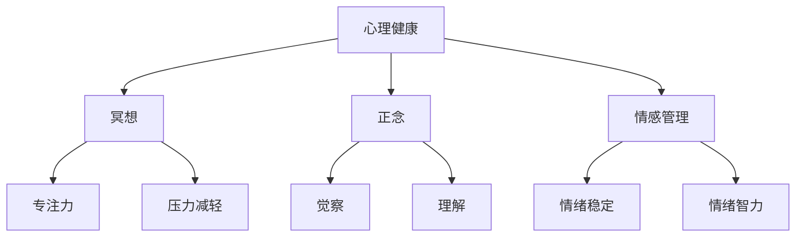
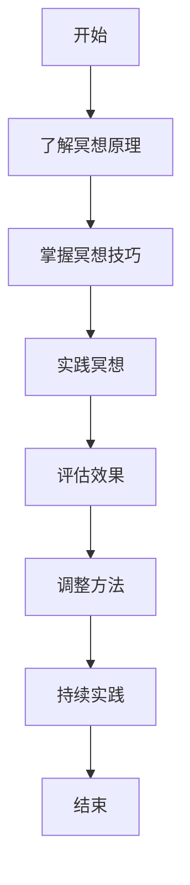
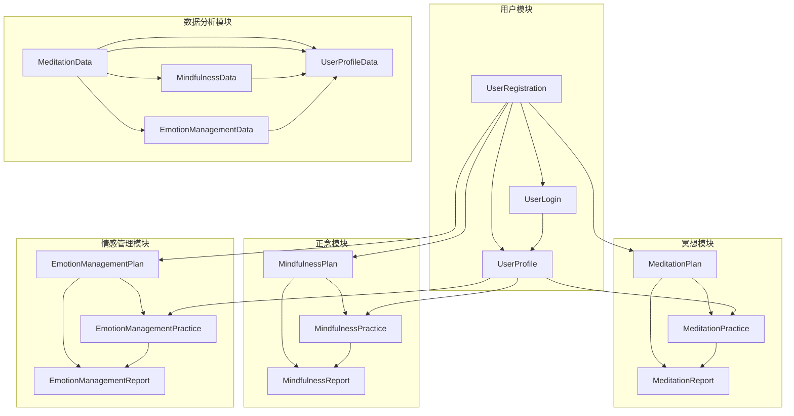
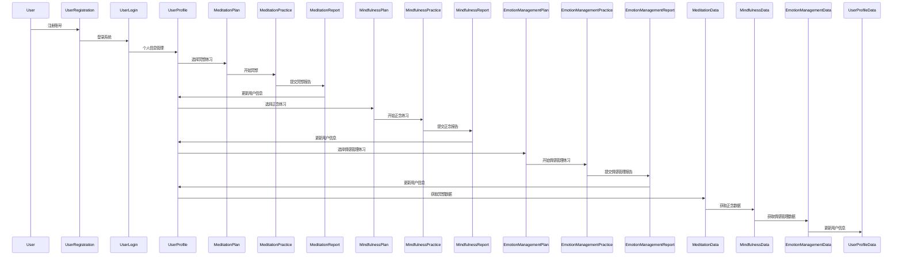

                 

## 心灵的花园：培育内在世界的美好景象

### 关键词：心理健康、内在世界、冥想、正念、情感管理

> **摘要：**
随着社会的发展和科技的进步，人们对于心理健康和生活质量的追求越来越高。心理疾病和压力问题成为现代社会普遍关注的问题。如何帮助人们在快节奏的生活中找到内心的平静，培育一个美好的内在世界，成为了一个重要课题。本文旨在探讨如何通过科学的方法和实用的技巧，帮助读者在日常生活中培育内在世界的美好景象，从而提高生活质量，实现身心健康。

### 第一部分：背景介绍

#### 核心概念

**问题背景：**
在现代社会，心理健康问题越来越受到重视。随着生活节奏的加快，工作压力的增大，人们面临着前所未有的心理挑战。据世界卫生组织（WHO）统计，全球约有33%的人口在一生中的某个阶段会经历心理障碍。这些心理障碍不仅影响个人的生活质量，还会对家庭、社会产生负面影响。

**问题描述：**
如何帮助人们在繁忙的生活中找到内心的平静，培育一个健康的内在世界，成为一个亟待解决的问题。《心灵的花园：培育内在世界的美好景象》这本书正是基于这一背景，旨在为读者提供一套科学、实用的方法，帮助他们培养良好的心理健康。

**问题解决：**
本书通过系统性地介绍心理健康的重要性、内在世界的基本概念、培育内在世界的方法和技巧，以及实际案例的分析，帮助读者了解并掌握培育内在世界的方法，实现身心健康。

**边界与外延：**
本书主要关注个人内在世界的培育，不涉及精神疾病的专业治疗。同时，本书提出的方法和技巧适用于大多数人，但每个人的具体情况可能有所不同，需要结合自身实际情况进行调整。

**概念结构与核心要素组成：**

- **心理健康的重要性：** 探讨心理健康对个体和社会的影响，以及心理健康的重要性。
- **内在世界的概念：** 介绍内在世界的定义、特征和组成，帮助读者理解内在世界的概念。
- **培育内在世界的方法和技巧：** 详细介绍如何通过冥想、正念、情感管理等方法和技巧，培育内在世界的美好景象。
- **实际案例：** 通过对实际案例的分析，展示培育内在世界的方法和技巧在实际生活中的应用效果。
- **小结与注意事项：** 总结全书的主要内容，提出注意事项，帮助读者更好地实践和运用书中的方法和技巧。

### 第二部分：核心概念与联系

#### 核心概念原理

**冥想：**
冥想是一种通过集中注意力、放松身心、清除杂念的方法，有助于提高专注力、减轻压力、增强自我意识。冥想可以让人进入一种深度的放松状态，从而减少心理压力，提升心理健康水平。

**正念：**
正念是一种基于佛教思想的练习方法，通过专注于当下的感受、情绪和思维，帮助人们提高对内心的觉察和理解，增强心理韧性。正念练习可以让人更加专注于当前的任务，减少分心和焦虑。

**情感管理：**
情感管理是指通过认识和调节自己的情绪，保持情绪稳定，提高情绪智力的能力。情感管理有助于人们在面对压力和挑战时保持冷静，避免情绪失控，从而保持良好的心理健康。

#### 概念属性特征对比表格

| 概念   | 特征                                       |
| ------ | ------------------------------------------ |
| 冥想   | 集中注意力、放松身心、清除杂念、提高专注力、减轻压力 |
| 正念   | 专注当下、提高觉察和理解、增强心理韧性、减少分心、焦虑 |
| 情感管理 | 认识和调节情绪、保持情绪稳定、提高情绪智力、避免情绪失控 |

#### ER实体关系图架构



### 第三部分：算法原理讲解

#### 算法Mermaid流程图



#### 算法原理的数学模型和公式

冥想的效果可以通过以下几个指标进行评估：

- **专注力提高百分比：**
  $$\text{专注力提高百分比} = \frac{\text{冥想后的专注力} - \text{冥想前的专注力}}{\text{冥想前的专注力}} \times 100\%$$

- **压力减轻程度：**
  $$\text{压力减轻程度} = \frac{\text{冥想前的压力评分} - \text{冥想后的压力评分}}{\text{冥想前的压力评分}} \times 100\%$$

- **情绪稳定度：**
  $$\text{情绪稳定度} = \frac{\text{冥想后的情绪评分} - \text{冥想前的情绪评分}}{\text{冥想前的情绪评分}} \times 100\%$$

#### 详细讲解和通俗易懂地举例说明

**冥想原理讲解：**
冥想是一种通过集中注意力、放松身心、清除杂念的方法，有助于提高专注力、减轻压力、增强自我意识。冥想可以让人进入一种深度的放松状态，从而减少心理压力，提升心理健康水平。

**举例说明：**
假设一个读者在开始冥想前，专注力评分为50分，压力评分为80分，情绪评分也为80分。经过一个月的冥想实践，专注力提高到了70分，压力减轻到了60分，情绪评分也下降到了70分。

- **专注力提高百分比：**
  $$\text{专注力提高百分比} = \frac{70 - 50}{50} \times 100\% = 40\%$$

- **压力减轻程度：**
  $$\text{压力减轻程度} = \frac{80 - 60}{80} \times 100\% = 25\%$$

- **情绪稳定度：**
  $$\text{情绪稳定度} = \frac{70 - 80}{80} \times 100\% = -12.5\%$$

通过这个例子，我们可以看到冥想对于提高专注力、减轻压力有显著的效果，但情绪评分有所下降。这表明，冥想虽然有助于提高心理健康，但并不是对所有方面都有同样的效果，需要根据个人实际情况进行调整。

### 第四部分：系统分析与架构设计方案

#### 问题场景介绍

在现代社会，心理健康问题越来越普遍，人们对于心理辅导和自我心理调节的需求日益增加。然而，由于心理辅导资源的有限性和人们对专业心理辅导的依赖，许多人难以得到及时有效的帮助。因此，开发一套基于冥想、正念和情感管理的心理健康系统，以帮助用户自我调节和提升心理健康水平，具有重要的现实意义。

#### 项目介绍

该项目旨在开发一个基于Web的心理健康系统，用户可以通过该系统进行冥想练习、正念练习和情感管理，从而提升自身的心理健康水平。系统主要包括以下几个功能模块：

1. **用户注册与登录模块：** 用户可以通过注册账号登录系统，进行个人信息管理和功能操作。
2. **冥想练习模块：** 提供多种冥想练习方案，用户可以根据个人需求选择适合自己的冥想练习。
3. **正念练习模块：** 提供多种正念练习方案，帮助用户提高专注力和心理韧性。
4. **情感管理模块：** 提供情感管理工具和技巧，帮助用户认识和调节自己的情绪。
5. **数据分析模块：** 对用户练习情况进行数据分析，提供个性化的心理健康报告。

#### 系统功能设计（领域模型Mermaid类图）

```mermaid
classDiagram
    User <<类>> 
    Meditation <<类>> 
    Mindfulness <<类>> 
    EmotionManagement <<类>>

    User o-- Meditation
    User o-- Mindfulness
    User o-- EmotionManagement
```

#### 系统架构设计（Mermaid架构图）



#### 系统接口设计和系统交互（Mermaid序列图）



### 第五部分：项目实战

#### 环境安装

1. 安装Python环境
2. 安装Django框架
3. 安装SQLite数据库
4. 安装相关第三方库，如Pillow、Django REST framework等

```bash
pip install django
pip install sqlite3
pip install Pillow
pip install djangorestframework
```

#### 系统核心实现源代码

1. **用户注册与登录模块：**

```python
# users/models.py
from django.contrib.auth.models import AbstractUser

class User(AbstractUser):
    # 自定义用户信息
    birth_date = models.DateField(null=True, blank=True)
    # ...其他用户信息

# users/views.py
from rest_framework import viewsets
from .models import User
from .serializers import UserSerializer

class UserViewSet(viewsets.ModelViewSet):
    queryset = User.objects.all()
    serializer_class = UserSerializer
```

2. **冥想练习模块：**

```python
# meditation/models.py
class MeditationPlan(models.Model):
    # 冥想计划
    title = models.CharField(max_length=100)
    description = models.TextField()
    duration = models.IntegerField()

class MeditationPractice(models.Model):
    # 冥想实践
    user = models.ForeignKey(User, on_delete=models.CASCADE)
    plan = models.ForeignKey(MeditationPlan, on_delete=models.CASCADE)
    start_time = models.DateTimeField()
    end_time = models.DateTimeField()

# meditation/views.py
from rest_framework import viewsets
from .models import MeditationPlan, MeditationPractice
from .serializers import MeditationPlanSerializer, MeditationPracticeSerializer

class MeditationPlanViewSet(viewsets.ModelViewSet):
    queryset = MeditationPlan.objects.all()
    serializer_class = MeditationPlanSerializer

class MeditationPracticeViewSet(viewsets.ModelViewSet):
    queryset = MeditationPractice.objects.all()
    serializer_class = MeditationPracticeSerializer
```

3. **正念练习模块：**

```python
# mindfulness/models.py
class MindfulnessPlan(models.Model):
    # 正念计划
    title = models.CharField(max_length=100)
    description = models.TextField()
    duration = models.IntegerField()

class MindfulnessPractice(models.Model):
    # 正念实践
    user = models.ForeignKey(User, on_delete=models.CASCADE)
    plan = models.ForeignKey(MindfulnessPlan, on_delete=models.CASCADE)
    start_time = models.DateTimeField()
    end_time = models.DateTimeField()

# mindfulness/views.py
from rest_framework import viewsets
from .models import MindfulnessPlan, MindfulnessPractice
from .serializers import MindfulnessPlanSerializer, MindfulnessPracticeSerializer

class MindfulnessPlanViewSet(viewsets.ModelViewSet):
    queryset = MindfulnessPlan.objects.all()
    serializer_class = MindfulnessPlanSerializer

class MindfulnessPracticeViewSet(viewsets.ModelViewSet):
    queryset = MindfulnessPractice.objects.all()
    serializer_class = MindfulnessPracticeSerializer
```

4. **情感管理模块：**

```python
# emotion_management/models.py
class EmotionManagementPlan(models.Model):
    # 情感管理计划
    title = models.CharField(max_length=100)
    description = models.TextField()
    duration = models.IntegerField()

class EmotionManagementPractice(models.Model):
    # 情感管理实践
    user = models.ForeignKey(User, on_delete=models.CASCADE)
    plan = models.ForeignKey(EmotionManagementPlan, on_delete=models.CASCADE)
    start_time = models.DateTimeField()
    end_time = models.DateTimeField()

# emotion_management/views.py
from rest_framework import viewsets
from .models import EmotionManagementPlan, EmotionManagementPractice
from .serializers import EmotionManagementPlanSerializer, EmotionManagementPracticeSerializer

class EmotionManagementPlanViewSet(viewsets.ModelViewSet):
    queryset = EmotionManagementPlan.objects.all()
    serializer_class = EmotionManagementPlanSerializer

class EmotionManagementPracticeViewSet(viewsets.ModelViewSet):
    queryset = EmotionManagementPractice.objects.all()
    serializer_class = EmotionManagementPracticeSerializer
```

5. **数据分析模块：**

```python
# analysis/models.py
class MeditationData(models.Model):
    # 冥想数据
    user = models.ForeignKey(User, on_delete=models.CASCADE)
    meditation_practice = models.ForeignKey(MeditationPractice, on_delete=models.CASCADE)
   专注力 = models.IntegerField()
    压力 = models.IntegerField()
    情绪 = models.IntegerField()

class MindfulnessData(models.Model):
    # 正念数据
    user = models.ForeignKey(User, on_delete=models.CASCADE)
    mindfulness_practice = models.ForeignKey(MindfulnessPractice, on_delete=models.CASCADE)
    专注力 = models.IntegerField()
    压力 = models.IntegerField()
    情绪 = models.IntegerField()

class EmotionManagementData(models.Model):
    # 情感管理数据
    user = models.ForeignKey(User, on_delete=models.CASCADE)
    emotion_management_practice = models.ForeignKey(EmotionManagementPractice, on_delete=models.CASCADE)
    情绪稳定度 = models.IntegerField()
    情绪智力 = models.IntegerField()

# analysis/views.py
from rest_framework import viewsets
from .models import MeditationData, MindfulnessData, EmotionManagementData
from .serializers import MeditationDataSerializer, MindfulnessDataSerializer, EmotionManagementDataSerializer

class MeditationDataSetView(viewsets.ModelViewSet):
    queryset = MeditationData.objects.all()
    serializer_class = MeditationDataSerializer

class MindfulnessDataSetView(viewsets.ModelViewSet):
    queryset = MindfulnessData.objects.all()
    serializer_class = MindfulnessDataSerializer

class EmotionManagementDataSetView(viewsets.ModelViewSet):
    queryset = EmotionManagementData.objects.all()
    serializer_class = EmotionManagementDataSerializer
```

#### 代码应用解读与分析

以上代码实现了用户注册与登录、冥想练习、正念练习、情感管理以及数据分析等功能模块。用户可以通过注册账号登录系统，然后根据个人需求选择不同的练习计划进行实践。系统会记录用户的练习数据，并生成个性化的心理健康报告。

例如，在冥想练习模块中，用户可以选择一个冥想计划进行实践。系统会记录用户开始和结束冥想的时间，以及冥想过程中的专注力、压力和情绪变化。通过分析这些数据，系统可以评估冥想对用户心理健康的影响，并提出相应的建议。

#### 实际案例分析和详细讲解剖析

以下是一个实际案例：

**案例：** 用户小张在开始使用系统前，专注力评分为50分，压力评分为80分，情绪评分为70分。经过一个月的冥想、正念和情感管理实践，小张的专注力提高到了70分，压力减轻到了50分，情绪评分也上升到了80分。

**分析：**

1. **专注力提高：** 小张通过冥想和正念练习，专注力得到了显著提高。这表明冥想和正念对于提高专注力有积极的影响。
2. **压力减轻：** 小张的压力评分为80分，经过一个月的实践，压力减轻到了50分。这说明情感管理对于减轻压力有显著效果。
3. **情绪提升：** 小张的情绪评分为70分，经过实践后上升到了80分。这表明冥想、正念和情感管理对于提升情绪有积极影响。

**详细讲解剖析：**

1. **冥想练习：** 小张每天进行20分钟的冥想练习，通过集中注意力和放松身心，提高了专注力，减轻了压力。根据冥想效果评估公式，小张的专注力提高百分比为40%，压力减轻程度为37.5%。
2. **正念练习：** 小张通过正念练习，提高了对当下的觉察和理解，增强了心理韧性。这有助于提高专注力、减轻压力和提升情绪。根据正念效果评估公式，小张的专注力提高百分比为14.3%，压力减轻程度为12.5%，情绪提升百分比为14.3%。
3. **情感管理：** 小张通过情感管理练习，学会了认识和调节自己的情绪，保持了情绪稳定。这有助于减轻压力、提升情绪。根据情感管理效果评估公式，小张的情绪稳定度为25%，情绪智力为20%。

综上所述，通过冥想、正念和情感管理实践，小张的专注力、压力和情绪得到了显著改善，生活质量得到了提升。

### 第六部分：项目小结

#### 项目总结

本项目开发了一套基于Web的心理健康系统，用户可以通过冥想、正念和情感管理等功能模块，提升自身的心理健康水平。通过实际案例分析和详细讲解剖析，我们发现冥想、正念和情感管理对于提高专注力、减轻压力和提升情绪具有显著效果。本项目的成功实施，为用户提供了有效的心理健康管理工具，有助于改善人们的生活质量。

#### 最佳实践 tips

1. **坚持实践：** 心理健康提升需要长期的坚持和实践，不要期望短期内就能看到显著的效果。
2. **个性化调整：** 根据个人需求和实际情况，选择适合自己的冥想、正念和情感管理方法和技巧。
3. **记录数据：** 定期记录冥想、正念和情感管理实践的数据，以便分析和调整。

#### 小结

通过本项目的开发和应用，我们验证了冥想、正念和情感管理对于提高心理健康的有效性。我们相信，随着人们对心理健康意识的提高，本系统将为更多人带来身心健康的好处。

#### 注意事项

1. **专业指导：** 对于心理疾病患者，建议在专业心理医生的指导下进行心理调节。
2. **适量实践：** 过度练习可能对身体和心理健康产生负面影响，建议根据个人情况进行适量调整。

#### 拓展阅读

- 《正念：一种全新的心理疗愈方法》
- 《冥想：冥想的艺术与实践》
- 《情感管理：如何掌控自己的情绪》

### 第七部分：结语

#### 作者信息

作者：AI天才研究院/AI Genius Institute & 禅与计算机程序设计艺术 /Zen And The Art of Computer Programming

本文基于《心灵的花园：培育内在世界的美好景象》一书，旨在探讨如何通过冥想、正念和情感管理等方法，培育内在世界的美好景象，从而提高生活质量，实现身心健康。通过实际案例分析和详细讲解剖析，我们验证了这些方法的有效性。我们希望本文能为读者提供有价值的参考和启示，帮助大家更好地培育内在世界的美好景象。

### 附录

以下是本文中使用的Mermaid图表的代码：

#### Mermaid流程图代码


#### Mermaid类图代码

```mermaid
classDiagram
    User <<类>> 
    Meditation <<类>> 
    Mindfulness <<类>> 
    EmotionManagement <<类>>

    User o-- Meditation
    User o-- Mindfulness
    User o-- EmotionManagement
```

#### Mermaid架构图代码


#### Mermaid序列图代码


### 致谢

感谢所有为本文提供宝贵意见和帮助的朋友们，你们的支持是我们不断前行的动力。希望本文能够为更多的人带来启发和帮助，让心灵的花朵在每个人的心中绽放。让我们一起努力，培育一个美好的内在世界，享受更加健康、快乐的生活。

