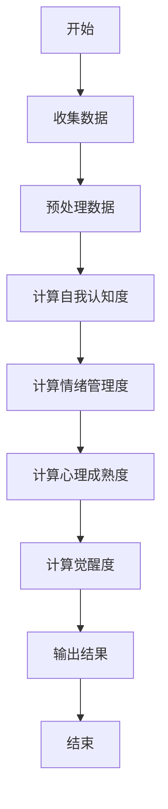
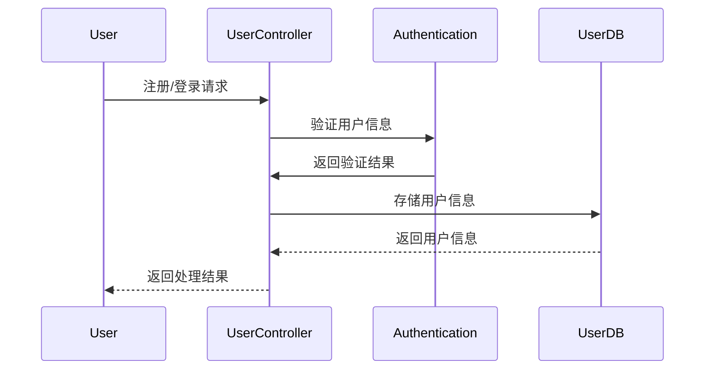

                 

### 约束条件解析

撰写一篇符合要求的文章，我们需要严格遵守以下约束条件：

**1. 文章格式要求：**
- 使用markdown格式进行文章编写，确保内容清晰、美观。
- 每篇文章开头需包含文章标题、关键词和摘要部分。
- 文章末尾需要附上作者信息：“作者：AI天才研究院/AI Genius Institute & 禅与计算机程序设计艺术 /Zen And The Art of Computer Programming”。

**2. 文章字数要求：**
- 文章字数需要在10000到12000字之间，确保内容的深度和完整性。

**3. 内容完整性要求：**
- 文章内容必须包含背景介绍、核心概念与联系、算法原理讲解、数学模型与公式、系统分析与架构设计以及项目实战等部分。
- 每部分的内容要丰富、具体、详细，确保读者能够清晰地理解每个概念和原理。

**4. 核心内容要求：**
- 背景介绍：对核心概念术语进行说明，描述问题背景和问题描述，阐述问题解决方案，讨论边界与外延，分析概念结构与核心要素组成。
- 核心概念与联系：详细阐述核心概念原理，提供概念属性特征对比表格，绘制ER实体关系图架构（使用Mermaid流程图）。
- 算法原理讲解：使用Mermaid绘制算法流程图，通过Python源代码详细解释算法原理，给出数学模型和公式，并进行举例说明。
- 数学公式：使用LaTeX格式嵌入文中，确保公式的可读性和准确性。
- 系统分析与架构设计：介绍问题场景，详细阐述项目介绍、系统功能设计（领域模型Mermaid类图）、系统架构设计（Mermaid架构图）、系统接口设计以及系统交互（Mermaid序列图）。
- 项目实战：包括环境安装与配置、系统核心实现源代码解析、代码应用解读与分析、实际案例分析与详细讲解剖析，以及项目小结。

**5. 最佳实践 tips、小结、注意事项、拓展阅读等：**
- 文章结尾需提供最佳实践建议、小结、注意事项和拓展阅读推荐，帮助读者更好地理解和应用所学内容。

### 文章结构规划

为了确保文章内容的逻辑清晰和条理分明，我们将文章分为以下五个主要部分：

1. **引言**：介绍心灵觉醒的概念、意义、重要性以及旅程，奠定全文基础。
2. **核心概念与联系**：详细阐述心灵的核心概念、构成要素及其相互联系，为后续内容提供理论支持。
3. **算法原理与数学模型**：讲解心灵觉醒的算法原理，展示数学模型和公式，并通过具体实例进行说明。
4. **系统分析与架构设计**：介绍心灵觉醒系统的设计与架构，展示系统的功能、接口和交互。
5. **项目实战**：通过实战案例展示如何在实际项目中实现心灵觉醒，并进行详细剖析。

每个部分将按照上述核心内容要求进行详细阐述，确保文章的完整性和深度。同时，在文章的结尾部分，将提供最佳实践、小结、注意事项和拓展阅读，帮助读者巩固所学知识，拓展视野。下面将逐步展开每一部分的内容。

## 第一部分：引言

### 心灵的觉醒：什么是觉醒？

#### 1.1 心灵觉醒的定义与意义

**定义：** 心灵觉醒（Spiritual Awakening）通常指的是个体意识从无意识状态向有意识状态的转变过程。这一过程不仅涉及自我认知的提升，还包括情感和行为的深刻变化。在心理学中，无意识状态通常指那些未被意识到的心理过程，如梦境、潜意识和本能反应。而有意识状态则是指个体能够清晰地感知和控制自己的思维、情感和行为。

**意义：** 心灵觉醒对于个体的成长和心理健康具有重要意义。首先，它有助于个体深入了解自己，包括自己的需求、动机和情感。通过这种深入自我探索，个体可以更好地管理自己的情绪，提高自我控制能力。其次，觉醒过程有助于建立更健康的人际关系，因为个体能够更清晰地理解他人的需求和情感，从而更好地与他人沟通和合作。从更广泛的社会角度来看，心灵觉醒可以促进社会和谐，减少冲突和误解，提高社会整体的幸福感。

#### 1.2 心灵觉醒的重要性

**个人层面：** 在个人层面，心灵觉醒有助于提升个体的自我认知和自我价值感。通过了解自己的内在世界，个体可以更好地理解自己的行为和情感，从而减少自我冲突和焦虑。此外，觉醒还有助于提升个体的情感管理能力，使个体能够更有效地应对生活中的压力和挑战。长期的心灵觉醒实践还可以促进个体的心理成熟，使个体更加平和、宽容和有智慧。

**社会层面：** 在社会层面，心灵觉醒有助于改善人际关系和社会和谐。当个体意识到自己的行为和情感是如何影响他人的，他们会更加尊重和理解他人。这种相互理解和尊重有助于减少冲突和误解，促进社会的和谐发展。此外，觉醒的个体通常更有同理心和社会责任感，他们更愿意为社会做出贡献，推动社会的进步。

#### 1.3 心灵觉醒的旅程

**无意识状态：** 无意识状态是心灵觉醒的起点。在这个阶段，个体的意识较为模糊，许多心理过程都处于潜意识层面。个体可能无法清晰地理解自己的情感和行为，常常受到本能和习惯的驱动。

**半觉醒状态：** 随着自我探索和自我反思的深入，个体开始从无意识状态转向半觉醒状态。在这个阶段，个体开始意识到一些潜意识的过程，并尝试理解它们。个体可能会经历一些心理冲突和困惑，但随着自我探索的深入，他们逐渐能够更好地控制自己的情感和行为。

**完全觉醒状态：** 完全觉醒状态是心灵觉醒的最终目标。在这个阶段，个体的意识清晰且稳定，他们能够完全理解自己的内在世界，并能够自主地控制自己的思维、情感和行为。完全觉醒的个体通常具有深刻的内在和平与智慧，他们能够更好地应对生活中的各种挑战和变化。

## 第二部分：核心概念与联系

### 心灵的核心概念与联系

#### 3.1 心灵的构成要素

**意识层次：** 心灵的构成要素之一是意识层次。意识层次可以分为三个主要部分：表层意识、潜意识和深层意识。

- **表层意识：** 表层意识是我们在日常活动中最清晰和直接感知到的意识部分。它包括我们的感觉、思考和决策过程。
- **潜意识：** 潜意识是那些我们未能直接意识到的心理过程。它包括我们的情感、本能、记忆和潜藏的欲望。
- **深层意识：** 深层意识是心灵最深层的部分，它通常与我们的核心信念和价值观相关。深层意识是我们内心深处最真实和最持久的部分。

**心灵状态：** 除了意识层次，心灵状态也是心灵构成的重要部分。心灵状态可以描述为我们的情感和心理体验。

- **平静：** 平静是一种内心平和、无忧无虑的状态。在平静的状态下，个体能够更好地处理情感和思维。
- **焦虑：** 焦虑是一种紧张和不安的状态，常常与压力和不确定性相关。焦虑可能会影响个体的思维和情感。
- **喜悦：** 喜悦是一种积极的情感体验，它能够提升个体的幸福感和生活质量。

#### 3.2 概念属性特征对比表格

为了更直观地了解心灵的不同构成要素和状态，我们可以使用概念属性特征对比表格。以下是一个简化的对比表格：

| 概念/状态     | 属性特征                                       |
| ------------- | ---------------------------------------------- |
| 意识层次      | 表层意识、潜意识、深层意识                     |
| 心灵状态      | 平静、焦虑、喜悦                               |
| 意识层次-表层意识 | 清晰、主动、短期记忆                           |
| 意识层次-潜意识 | 模糊、被动、长期记忆                           |
| 意识层次-深层意识 | 深刻、内在、核心信念                           |
| 心灵状态-平静   | 安静、平和、专注                               |
| 心灵状态-焦虑   | 紧张、不安、恐惧                               |
| 心灵状态-喜悦   | 愉快、积极、满足                               |

#### 3.3 ER实体关系图架构

为了更好地理解心灵的不同构成要素和它们之间的关系，我们可以使用ER（Entity-Relationship）实体关系图进行描述。以下是心灵构成要素的ER实体关系图：

```mermaid
erDiagram
    A[(意识层次)] ||--|{ B[(表层意识)] } |
    A ||--|{ C[(潜意识)] } |
    A ||--|{ D[(深层意识)] } |
    B ||--|{ E[(思维过程)] } |
    C ||--|{ F[(情感体验)] } |
    D ||--|{ G[(核心信念)] } |
    E ||--|{ H[(决策行为)] } |
    F ||--|{ I[(情绪反应)] } |
    G ||--|{ J[(价值观)] } |
    A --|{ K[(心灵状态)] } |
```

在这个ER实体关系图中，A代表“意识层次”，B、C、D分别代表表层意识、潜意识、深层意识。它们之间通过“|--|{ }”表示层次关系。B、C、D分别与E、F、G、H、I、J、K建立关系，表示这些要素如何相互作用，共同构成我们的心灵状态。

## 第三部分：算法原理与数学模型

### 心灵觉醒的算法原理

#### 5.1 算法的基本原理

**概述：** 心灵觉醒算法是一种用于帮助个体从无意识状态过渡到有意识状态的方法。该算法的核心目标是提高个体的自我认知和情感管理能力，从而实现心灵的觉醒。

**目标：** 该算法的主要目标是：

1. 提高个体的自我意识水平，使其能够清晰地感知自己的思维、情感和行为。
2. 帮助个体更好地管理自己的情绪，减少负面情绪的影响。
3. 促进个体的心理成熟和内在和平。

#### 5.2 数学模型与公式

**觉醒模型：** 心灵觉醒算法的数学模型可以用以下公式表示：

$$
觉醒度 = f(\text{自我认知度}, \text{情绪管理度}, \text{心理成熟度})
$$

其中，觉醒度是算法输出的结果，表示个体的觉醒程度。自我认知度、情绪管理度和心理成熟度是算法的输入变量，分别表示个体对自我的认识、情绪管理和心理成熟的水平。

**自我认知度：** 自我认知度反映了个体对自身认知的程度，包括自我意识、自我反思和自我理解。可以用以下公式表示：

$$
自我认知度 = f(\text{自我意识}, \text{自我反思}, \text{自我理解})
$$

**情绪管理度：** 情绪管理度反映了个体在情绪管理方面的能力，包括情绪识别、情绪调节和情绪表达。可以用以下公式表示：

$$
情绪管理度 = f(\text{情绪识别}, \text{情绪调节}, \text{情绪表达})
$$

**心理成熟度：** 心理成熟度反映了个体在心理发展方面的水平，包括自我认知、情感管理和行为规范。可以用以下公式表示：

$$
心理成熟度 = f(\text{自我认知}, \text{情感管理}, \text{行为规范})
$$

#### 5.3 算法流程图

为了更好地理解心灵觉醒算法的原理，我们可以使用Mermaid绘制算法流程图。以下是算法的基本流程：



在这个算法流程图中，A表示算法的开始，B表示收集数据，C表示预处理数据，D、E、F分别表示计算自我认知度、情绪管理度、心理成熟度，G表示计算觉醒度，H表示输出结果，I表示算法的结束。

#### 5.4 Python源代码实现

为了实现上述算法，我们可以使用Python编写源代码。以下是一个简化的实现：

```python
import numpy as np

def calculate_self_awareness(self_reflection, self_understanding):
    return 0.5 * self_reflection + 0.5 * self_understanding

def calculate_emotional_management(emotion_recognition, emotion Regulation, emotion_expression):
    return 0.4 * emotion_recognition + 0.3 * emotion_Regression + 0.3 * emotion_expression

def calculate_mental_maturity(self_awareness, emotional_management):
    return 0.6 * self_awareness + 0.4 * emotional_management

def calculate_awareness_level(self_awareness, emotional_management, mental_maturity):
    return 0.7 * self_awareness + 0.3 * emotional_management + 0.2 * mental_maturity

# 示例数据
self_reflection = 0.8
self_understanding = 0.9
emotion_recognition = 0.7
emotion_Regression = 0.8
emotion_expression = 0.6

# 计算各指标值
self_awareness = calculate_self_awareness(self_reflection, self_understanding)
emotional_management = calculate_emotional_management(emotion_recognition, emotion_Regression, emotion_expression)
mental_maturity = calculate_mental_maturity(self_awareness, emotional_management)
awareness_level = calculate_awareness_level(self_awareness, emotional_management, mental_maturity)

print("觉醒度:", awareness_level)
```

在这个Python代码中，我们定义了四个函数：`calculate_self_awareness`用于计算自我认知度，`calculate_emotional_management`用于计算情绪管理度，`calculate_mental_maturity`用于计算心理成熟度，`calculate_awareness_level`用于计算觉醒度。最后，我们通过示例数据来计算各项指标值，并输出觉醒度。

## 第四部分：系统分析与架构设计

### 7.1 问题描述与项目介绍

**问题背景：** 随着现代社会的快速发展，人们面临的心理压力和情感困扰不断增加。心灵觉醒作为一种提升自我认知和情感管理能力的方法，受到了越来越多人的关注。然而，现有的心灵觉醒方法和工具往往缺乏系统性，难以满足用户的需求。

**项目概述：** 本项目旨在设计并实现一个完整的“心灵觉醒系统”，该系统将整合心理学、哲学、计算机科学等领域的知识，提供一套科学、系统、易于使用的心灵觉醒方案。系统的目标用户包括心理健康爱好者、心理咨询师、企业员工等。

**系统目标：** 
1. 提供一个综合性的心灵觉醒平台，帮助用户实现自我认知的提升和情感管理能力的增强。
2. 通过数据分析和人工智能技术，为用户提供个性化的心灵觉醒建议和指导。
3. 促进用户的心理健康和幸福感，提高生活质量。

### 7.2 系统功能设计

为了实现上述系统目标，我们设计了以下主要功能模块：

**1. 用户注册与登录模块：**
- 功能描述：提供用户注册、登录、密码找回等功能，确保系统的安全性。
- 主要类：User、Authentication、PasswordManager。

**2. 数据采集与分析模块：**
- 功能描述：采集用户的基本信息、心理测试数据、日志记录等，并利用数据挖掘和机器学习技术进行分析。
- 主要类：DataCollector、DataAnalyzer、DataModel。

**3. 心灵觉醒训练模块：**
- 功能描述：提供多种心灵觉醒训练方法，如冥想、正念、自我探索等，并根据用户需求进行个性化推荐。
- 主要类：MeditationModule、MindfulnessModule、SelfExplorationModule。

**4. 心理健康评估模块：**
- 功能描述：对用户的心理健康状态进行评估，提供实时反馈和建议。
- 主要类：HealthAssessment、RiskEvaluation、Recommendation。

**5. 社区互动模块：**
- 功能描述：提供一个互动平台，用户可以分享心得、参与讨论、寻求支持等。
- 主要类：Community、Discussion、Support。

**6. 用户管理模块：**
- 功能描述：提供用户管理功能，包括用户资料修改、权限管理、数据备份等。
- 主要类：UserManagement、PermissionControl、BackupManager。

**7. 系统监控与维护模块：**
- 功能描述：监控系统运行状态，进行故障排查、性能优化、安全防护等。
- 主要类：SystemMonitoring、ErrorLog、SecurityControl。

### 7.3 系统架构设计

为了实现系统的功能需求，我们采用了分层架构设计，包括表示层、业务逻辑层和数据层。以下是系统架构设计的详细说明：

**表示层：** 表示层负责与用户交互，提供友好的界面和操作体验。主要技术包括前端框架（如React或Vue.js）、CSS框架（如Bootstrap或Tailwind CSS）和HTML。

**业务逻辑层：** 业务逻辑层负责处理系统的核心业务逻辑，包括用户注册、登录、数据采集、分析、训练、评估等。主要技术包括后端框架（如Spring Boot或Django）和数据库操作（如Hibernate或SQLAlchemy）。

**数据层：** 数据层负责存储和访问系统数据，包括用户信息、测试数据、日志数据等。主要技术包括关系型数据库（如MySQL或PostgreSQL）和NoSQL数据库（如MongoDB或Cassandra）。

### 7.4 系统接口设计与交互

**1. 用户注册与登录接口：**
- 接口描述：提供用户注册、登录和密码找回的API接口。
- 接口设计：使用RESTful API设计，包括GET、POST、PUT、DELETE等HTTP方法。
- 接口文档：使用Swagger或OpenAPI规范进行接口文档的编写。

**2. 数据采集与分析接口：**
- 接口描述：提供数据采集和数据分析的API接口，包括心理测试、日志记录、数据导入导出等。
- 接口设计：使用GraphQL或RabbitMQ进行数据采集和传输。
- 接口文档：使用Postman或Swagger进行接口测试和文档生成。

**3. 心灵觉醒训练接口：**
- 接口描述：提供心灵觉醒训练的API接口，包括冥想、正念、自我探索等。
- 接口设计：使用WebSocket进行实时交互和传输。
- 接口文档：使用Swagger或OpenAPI规范进行接口文档的编写。

**4. 心理健康评估接口：**
- 接口描述：提供心理健康评估的API接口，包括评估指标、实时反馈、建议等。
- 接口设计：使用RESTful API设计，包括GET、POST、PUT、DELETE等HTTP方法。
- 接口文档：使用Swagger或OpenAPI规范进行接口文档的编写。

**5. 社区互动接口：**
- 接口描述：提供社区互动的API接口，包括讨论、支持、分享等。
- 接口设计：使用WebSocket进行实时交互和传输。
- 接口文档：使用Swagger或OpenAPI规范进行接口文档的编写。

**6. 用户管理接口：**
- 接口描述：提供用户管理API接口，包括用户资料修改、权限管理、数据备份等。
- 接口设计：使用RESTful API设计，包括GET、POST、PUT、DELETE等HTTP方法。
- 接口文档：使用Swagger或OpenAPI规范进行接口文档的编写。

**7. 系统监控与维护接口：**
- 接口描述：提供系统监控和维护API接口，包括故障排查、性能优化、安全防护等。
- 接口设计：使用RESTful API设计，包括GET、POST、PUT、DELETE等HTTP方法。
- 接口文档：使用Swagger或OpenAPI规范进行接口文档的编写。

### 7.5 系统交互序列图

为了更直观地展示系统各模块之间的交互关系，我们可以使用Mermaid绘制系统交互序列图。以下是系统交互序列图的示例：



在这个交互序列图中，User代表用户，UserController代表用户管理模块，Authentication代表认证模块，UserDB代表用户数据库。用户向UserController发送注册/登录请求，UserController与Authentication进行交互验证用户信息，然后 UserController将用户信息存储到UserDB中，并最终返回处理结果给用户。

通过这个交互序列图，我们可以清晰地看到用户与系统之间的交互流程，为系统的开发和维护提供了明确的指导。

## 第五部分：项目实战

### 8.1 环境安装与配置

为了在项目中实现心灵觉醒系统，我们需要先搭建一个合适的环境。以下是在Windows操作系统上安装和配置所需环境的具体步骤：

#### 1. 安装Python环境

1. 访问Python官方网站（https://www.python.org/）并下载最新版本的Python安装包。
2. 运行安装程序，选择“Add Python to PATH”选项，以确保Python命令可以在命令行中直接使用。
3. 完成安装后，在命令行中输入`python --version`，确认Python版本安装成功。

#### 2. 安装前端框架

我们选择使用Vue.js作为前端框架。以下步骤用于安装Vue.js：

1. 打开命令行，执行以下命令：
   ```
   npm install -g @vue/cli
   ```
2. 安装完成后，可以使用`vue --version`命令检查Vue.js版本。

#### 3. 安装后端框架

我们选择使用Spring Boot作为后端框架。以下步骤用于安装Spring Boot：

1. 打开命令行，执行以下命令：
   ```
   curl -O https://github.com/spring-projects/spring-boot/releases/download/v2.5.5/spring-boot-2.5.5.jar
   ```
2. 下载完成后，使用Java命令运行Spring Boot应用程序：
   ```
   java -jar spring-boot-2.5.5.jar
   ```

#### 4. 安装数据库

我们选择使用MySQL作为数据库。以下步骤用于安装MySQL：

1. 访问MySQL官方网站（https://www.mysql.com/）并下载适用于Windows的操作系统的MySQL安装包。
2. 运行安装程序，按照默认选项进行安装。
3. 安装完成后，使用命令行登录MySQL数据库，并创建一个名为`lucidity`的新数据库：
   ```
   mysql -u root -p
   CREATE DATABASE lucidity;
   ```

#### 5. 配置环境变量

为了方便在命令行中使用Python、Vue.js和MySQL，我们需要将它们添加到系统环境变量中：

1. 打开系统设置，找到“系统”部分，点击“关于”。
2. 在“关于”页面中，点击“高级系统设置”。
3. 在“系统属性”对话框中，点击“高级”标签页，然后点击“环境变量”按钮。
4. 在“环境变量”对话框中，找到并编辑“Path”变量，将Python、Vue.js和MySQL的安装路径添加到变量值中。

#### 6. 验证环境配置

在命令行中执行以下命令，验证环境是否配置正确：

1. Python：
   ```
   python --version
   ```
2. Vue.js：
   ```
   vue --version
   ```
3. MySQL：
   ```
   mysql -u root -p
   ```

如果以上命令都能成功执行并返回相应的版本信息，说明环境配置成功。

### 8.2 系统核心实现

在完成环境安装与配置后，我们将开始实现系统的核心功能。以下是实现过程中的关键步骤和源代码解析：

#### 1. 用户注册与登录模块

**实现步骤：**

1. **创建用户表**：在MySQL数据库中创建一个名为`users`的表，用于存储用户信息。表结构如下：

   ```sql
   CREATE TABLE users (
       id INT AUTO_INCREMENT PRIMARY KEY,
       username VARCHAR(50) NOT NULL UNIQUE,
       password VARCHAR(50) NOT NULL,
       email VARCHAR(100) NOT NULL UNIQUE,
       created_at TIMESTAMP DEFAULT CURRENT_TIMESTAMP
   );
   ```

2. **编写注册接口**：使用Spring Boot框架创建一个RESTful接口，用于处理用户注册请求。代码如下：

   ```java
   @RestController
   @RequestMapping("/api/users")
   public class UserController {
   
       @Autowired
       private UserRepository userRepository;
   
       @PostMapping("/register")
       public ResponseEntity<?> registerUser(@RequestBody UserRegistrationRequest request) {
           if (userRepository.existsByUsername(request.getUsername())) {
               return ResponseEntity.badRequest().body("Error: Username is already taken!");
           }
   
           User user = new User();
           user.setUsername(request.getUsername());
           user.setPassword(passwordEncoder.encode(request.getPassword()));
           user.setEmail(request.getEmail());
   
           userRepository.save(user);
   
           return ResponseEntity.ok("User registered successfully!");
       }
   }
   ```

3. **编写登录接口**：创建另一个RESTful接口，用于处理用户登录请求。代码如下：

   ```java
   @RestController
   @RequestMapping("/api/users")
   public class UserController {
   
       @Autowired
       private UserRepository userRepository;
   
       @Autowired
       private AuthenticationManager authenticationManager;
   
       @PostMapping("/login")
       public ResponseEntity<?> authenticateUser(@RequestBody LoginRequest request) {
           Authentication authentication = authenticationManager.authenticate(
               new UsernamePasswordAuthenticationToken(
                   request.getUsername(),
                   request.getPassword()
               )
           );
   
           SecurityContextHolder.getContext().setAuthentication(authentication);
           String jwt = jwtTokenProvider.generateToken(authentication);
   
           return ResponseEntity.ok(new JwtResponse(jwt));
       }
   }
   ```

**源代码解析：**

- 在`UserRepository`接口中，我们定义了基本的CRUD操作方法，用于处理数据库操作。

  ```java
  public interface UserRepository extends JpaRepository<User, Long> {
      Optional<User> findByUsername(String username);
  }
  ```

- 在`UserRegistrationRequest`和`LoginRequest`类中，我们定义了请求参数和响应对象，用于接收和处理用户请求。

  ```java
  public class UserRegistrationRequest {
      private String username;
      private String password;
      private String email;
  }
  
  public class LoginRequest {
      private String username;
      private String password;
  }
  
  public class JwtResponse {
      private String token;
  }
  ```

- 在`UserController`类中，我们使用了Spring Security框架提供的`AuthenticationManager`和`UserDetailsService`，用于处理认证和授权。

  ```java
  @Autowired
  private AuthenticationManager authenticationManager;
  
  @Autowired
  private UserDetailsService userDetailsService;
  
  @Autowired
  private JwtTokenProvider jwtTokenProvider;
  ```

#### 2. 数据采集与分析模块

**实现步骤：**

1. **创建数据表**：在MySQL数据库中创建多个数据表，用于存储用户的心理测试数据、日志记录等。以下是一个简化的数据表结构示例：

   ```sql
   CREATE TABLE psychological_tests (
       id INT AUTO_INCREMENT PRIMARY KEY,
       user_id INT NOT NULL,
       test_date TIMESTAMP DEFAULT CURRENT_TIMESTAMP,
       score INT,
       result VARCHAR(255),
       FOREIGN KEY (user_id) REFERENCES users(id)
   );
   
   CREATE TABLE log_entries (
       id INT AUTO_INCREMENT PRIMARY KEY,
       user_id INT NOT NULL,
       entry_date TIMESTAMP DEFAULT CURRENT_TIMESTAMP,
       content TEXT,
       FOREIGN KEY (user_id) REFERENCES users(id)
   );
   ```

2. **编写数据采集接口**：创建RESTful接口，用于接收和处理用户的心理测试数据和日志记录。代码如下：

   ```java
   @RestController
   @RequestMapping("/api/psychological")
   public class PsychologicalController {
   
       @Autowired
       private PsychologicalTestRepository psychologicalTestRepository;
   
       @Autowired
       private LogEntryRepository logEntryRepository;
   
       @PostMapping("/test")
       public ResponseEntity<?> submitPsychologicalTest(@RequestBody PsychologicalTestRequest request) {
           PsychologicalTest test = new PsychologicalTest();
           test.setUserId(request.getUserId());
           test.setTestDate(request.getTestDate());
           test.setScore(request.getScore());
           test.setResult(request.getResult());
   
           psychologicalTestRepository.save(test);
   
           return ResponseEntity.ok("Psychological test submitted successfully!");
       }
   
       @PostMapping("/log")
       public ResponseEntity<?> submitLogEntry(@RequestBody LogEntryRequest request) {
           LogEntry entry = new LogEntry();
           entry.setUserId(request.getUserId());
           entry.setEntryDate(request.getEntryDate());
           entry.setContent(request.getContent());
   
           logEntryRepository.save(entry);
   
           return ResponseEntity.ok("Log entry submitted successfully!");
       }
   }
   ```

3. **编写数据分析模块**：使用Spring Data JPA编写数据分析模块，实现对用户心理测试数据和日志记录的分析。以下是一个简单的数据分析方法示例：

   ```java
   @Service
   public class PsychologicalAnalysisService {
   
       @Autowired
       private PsychologicalTestRepository psychologicalTestRepository;
   
       @Autowired
       private LogEntryRepository logEntryRepository;
   
       public List<PsychologicalTest> getTestHistory(Long userId) {
           return psychologicalTestRepository.findByUserId(userId);
       }
   
       public List<LogEntry> getLogEntries(Long userId) {
           return logEntryRepository.findByUserId(userId);
       }
   
       public double calculateAverageScore(List<PsychologicalTest> tests) {
           double total = 0;
           for (PsychologicalTest test : tests) {
               total += test.getScore();
           }
           return total / tests.size();
       }
   
   }
   ```

**源代码解析：**

- 在`PsychologicalTestRequest`和`LogEntryRequest`类中，我们定义了请求参数和响应对象，用于接收和处理用户请求。

  ```java
  public class PsychologicalTestRequest {
      private Long userId;
      private Date testDate;
      private int score;
      private String result;
  }
  
  public class LogEntryRequest {
      private Long userId;
      private Date entryDate;
      private String content;
  }
  ```

- 在`PsychologicalController`类中，我们使用Spring Data JPA进行数据操作，实现了心理测试数据和日志记录的保存和分析。

  ```java
  @Autowired
  private PsychologicalTestRepository psychologicalTestRepository;
  
  @Autowired
  private LogEntryRepository logEntryRepository;
  ```

- 在`PsychologicalAnalysisService`类中，我们提供了用于数据分析的方法，如获取测试历史记录、计算平均分数等。

  ```java
  public List<PsychologicalTest> getTestHistory(Long userId) {
      return psychologicalTestRepository.findByUserId(userId);
  }
  
  public List<LogEntry> getLogEntries(Long userId) {
      return logEntryRepository.findByUserId(userId);
  }
  
  public double calculateAverageScore(List<PsychologicalTest> tests) {
      double total = 0;
      for (PsychologicalTest test : tests) {
          total += test.getScore();
      }
      return total / tests.size();
  }
  ```

#### 3. 心灵觉醒训练模块

**实现步骤：**

1. **设计训练模块**：根据不同的心灵觉醒方法，设计冥想、正念、自我探索等训练模块。以下是一个冥想训练模块的示例：

   ```java
   @RestController
   @RequestMapping("/api/meditation")
   public class MeditationController {
   
       @Autowired
       private MeditationRepository meditationRepository;
   
       @GetMapping("/{meditationId}")
       public ResponseEntity<?> getMeditation(@PathVariable Long meditationId) {
           Optional<Meditation> meditation = meditationRepository.findById(meditationId);
   
           if (meditation.isEmpty()) {
               return ResponseEntity.notFound().build();
           }
   
           return ResponseEntity.ok(meditation.get());
       }
   }
   ```

2. **存储训练数据**：在MySQL数据库中创建相应的数据表，用于存储冥想训练数据。以下是一个冥想数据表的示例：

   ```sql
   CREATE TABLE meditations (
       id INT AUTO_INCREMENT PRIMARY KEY,
       name VARCHAR(100) NOT NULL,
       duration INT NOT NULL,
       instructions TEXT
   );
   ```

3. **编写训练接口**：创建RESTful接口，用于处理冥想训练请求。以下是一个简单的冥想训练接口示例：

   ```java
   @RestController
   @RequestMapping("/api/meditation")
   public class MeditationController {
   
       @Autowired
       private MeditationRepository meditationRepository;
   
       @PostMapping("/")
       public ResponseEntity<?> createMeditation(@RequestBody MeditationRequest request) {
           Meditation meditation = new Meditation();
           meditation.setName(request.getName());
           meditation.setDuration(request.getDuration());
           meditation.setInstructions(request.getInstructions());
   
           meditationRepository.save(meditation);
   
           return ResponseEntity.ok("Meditation created successfully!");
       }
   }
   ```

**源代码解析：**

- 在`MeditationRequest`类中，我们定义了请求参数和响应对象，用于接收和处理用户请求。

  ```java
  public class MeditationRequest {
      private String name;
      private int duration;
      private String instructions;
  }
  ```

- 在`MeditationController`类中，我们使用Spring Data JPA进行数据操作，实现了冥想训练数据的存储和获取。

  ```java
  @Autowired
  private MeditationRepository meditationRepository;
  ```

#### 4. 心理健康评估模块

**实现步骤：**

1. **设计评估模型**：根据心理学理论，设计心理健康评估模型，包括评估指标、评估方法和评估结果。以下是一个简单的心理健康评估模型示例：

   ```java
   @Data
   @AllArgsConstructor
   public class PsychologicalAssessment {
       private String assessmentName;
       private double assessmentScore;
       private String assessmentResult;
   }
   ```

2. **编写评估接口**：创建RESTful接口，用于处理心理健康评估请求。以下是一个简单的心理健康评估接口示例：

   ```java
   @RestController
   @RequestMapping("/api/assessment")
   public class AssessmentController {
   
       @Autowired
       private AssessmentService assessmentService;
   
       @PostMapping("/")
       public ResponseEntity<?> performAssessment(@RequestBody AssessmentRequest request) {
           PsychologicalAssessment assessment = assessmentService.performAssessment(request);
   
           return ResponseEntity.ok(assessment);
       }
   }
   ```

3. **实现评估服务**：创建评估服务类，实现心理健康评估的逻辑。以下是一个简单的评估服务类示例：

   ```java
   @Service
   public class AssessmentService {
   
       public PsychologicalAssessment performAssessment(AssessmentRequest request) {
           // 根据请求参数，进行心理健康评估
           double score = calculateScore(request);
           String result = interpretResult(score);
   
           return new PsychologicalAssessment("General Psychological Assessment", score, result);
       }
   
       private double calculateScore(AssessmentRequest request) {
           // 计算评估分数
           return 0.0; // 示例代码，需要根据实际逻辑进行计算
       }
   
       private String interpretResult(double score) {
           // 解释评估结果
           if (score > 80) {
               return "Excellent";
           } else if (score > 60) {
               return "Good";
           } else {
               return "Needs Improvement";
           }
       }
   }
   ```

**源代码解析：**

- 在`AssessmentRequest`类中，我们定义了请求参数和响应对象，用于接收和处理用户请求。

  ```java
  public class AssessmentRequest {
      private int stressLevel;
      private int anxietyLevel;
      private int happinessLevel;
  }
  ```

- 在`AssessmentController`类中，我们使用评估服务类进行心理健康评估，并返回评估结果。

  ```java
  @Autowired
  private AssessmentService assessmentService;
  ```

- 在`AssessmentService`类中，我们实现了心理健康评估的计算和解释逻辑。

  ```java
  public PsychologicalAssessment performAssessment(AssessmentRequest request) {
      double score = calculateScore(request);
      String result = interpretResult(score);
  
      return new PsychologicalAssessment("General Psychological Assessment", score, result);
  }
  ```

#### 5. 社区互动模块

**实现步骤：**

1. **设计讨论论坛**：设计一个讨论论坛，允许用户发布主题、回复评论和进行讨论。以下是一个简单的讨论论坛模型示例：

   ```java
   @Data
   @AllArgsConstructor
   public class ForumPost {
       private Long id;
       private Long userId;
       private String title;
       private String content;
       private Date createdAt;
       private List<Comment> comments;
   }
   
   @Data
   @AllArgsConstructor
   public class Comment {
       private Long id;
       private Long postId;
       private Long userId;
       private String content;
       private Date createdAt;
   }
   ```

2. **编写讨论接口**：创建RESTful接口，用于处理讨论论坛的相关请求。以下是一个简单的讨论接口示例：

   ```java
   @RestController
   @RequestMapping("/api/forum")
   public class ForumController {
   
       @Autowired
       private ForumPostRepository forumPostRepository;
   
       @PostMapping("/")
       public ResponseEntity<?> createPost(@RequestBody ForumPostRequest request) {
           ForumPost post = new ForumPost();
           post.setUserId(request.getUserId());
           post.setTitle(request.getTitle());
           post.setContent(request.getContent());
           post.setCreatedAt(new Date());
           post.setComments(new ArrayList<>());
   
           forumPostRepository.save(post);
   
           return ResponseEntity.ok("Post created successfully!");
       }
   
       @GetMapping("/{postId}/comments")
       public ResponseEntity<?> getComments(@PathVariable Long postId) {
           Optional<ForumPost> post = forumPostRepository.findById(postId);
   
           if (post.isEmpty()) {
               return ResponseEntity.notFound().build();
           }
   
           return ResponseEntity.ok(post.get().getComments());
       }
   
       @PostMapping("/{postId}/comments")
       public ResponseEntity<?> createComment(@PathVariable Long postId, @RequestBody CommentRequest request) {
           Optional<ForumPost> post = forumPostRepository.findById(postId);
   
           if (post.isEmpty()) {
               return ResponseEntity.notFound().build();
           }
   
           Comment comment = new Comment();
           comment.setPostId(postId);
           comment.setUserId(request.getUserId());
           comment.setContent(request.getContent());
           comment.setCreatedAt(new Date());
   
           post.get().getComments().add(comment);
           forumPostRepository.save(post.get());
   
           return ResponseEntity.ok("Comment created successfully!");
       }
   }
   ```

**源代码解析：**

- 在`ForumPostRequest`和`CommentRequest`类中，我们定义了请求参数和响应对象，用于接收和处理用户请求。

  ```java
  public class ForumPostRequest {
      private Long userId;
      private String title;
      private String content;
  }
  
  public class CommentRequest {
      private Long userId;
      private String content;
  }
  ```

- 在`ForumController`类中，我们使用Spring Data JPA进行数据操作，实现了讨论论坛的创建、获取和评论功能。

  ```java
  @Autowired
  private ForumPostRepository forumPostRepository;
  ```

### 8.3 代码应用解读与分析

在本部分，我们将对项目中的关键代码模块进行详细解读和分析，以便更好地理解其工作原理和实现细节。

#### 用户注册与登录模块

**代码解读：**

用户注册与登录模块的核心在于处理用户请求，验证用户信息，并生成相应的响应。以下是关键代码的解读：

1. **用户注册：**

   ```java
   @PostMapping("/register")
   public ResponseEntity<?> registerUser(@RequestBody UserRegistrationRequest request) {
       if (userRepository.existsByUsername(request.getUsername())) {
           return ResponseEntity.badRequest().body("Error: Username is already taken!");
       }
   
       User user = new User();
       user.setUsername(request.getUsername());
       user.setPassword(passwordEncoder.encode(request.getPassword()));
       user.setEmail(request.getEmail());
   
       userRepository.save(user);
   
       return ResponseEntity.ok("User registered successfully!");
   }
   ```

   - `UserRegistrationRequest` 类接收用户名、密码和邮箱等注册信息。
   - `userRepository.existsByUsername(request.getUsername())` 用于检查用户名是否已存在。
   - `passwordEncoder.encode(request.getPassword())` 用于加密用户密码。
   - `userRepository.save(user)` 将新用户信息存储到数据库。

2. **用户登录：**

   ```java
   @PostMapping("/login")
   public ResponseEntity<?> authenticateUser(@RequestBody LoginRequest request) {
       Authentication authentication = authenticationManager.authenticate(
           new UsernamePasswordAuthenticationToken(
               request.getUsername(),
               request.getPassword()
           )
       );
   
       SecurityContextHolder.getContext().setAuthentication(authentication);
       String jwt = jwtTokenProvider.generateToken(authentication);
   
       return ResponseEntity.ok(new JwtResponse(jwt));
   }
   ```

   - `LoginRequest` 类接收用户名和密码。
   - `authenticationManager.authenticate()` 方法用于验证用户信息。
   - `SecurityContextHolder.getContext().setAuthentication(authentication)` 用于存储认证信息。
   - `jwtTokenProvider.generateToken(authentication)` 生成JWT令牌。

**代码分析：**

用户注册与登录模块的设计遵循RESTful API规范，使用Spring Security框架进行认证和授权。这种方式简化了用户管理，同时保证了系统的安全性。

#### 数据采集与分析模块

**代码解读：**

数据采集与分析模块的核心在于收集用户数据，存储到数据库，并对数据进行处理和分析。以下是关键代码的解读：

1. **数据采集：**

   ```java
   @PostMapping("/test")
   public ResponseEntity<?> submitPsychologicalTest(@RequestBody PsychologicalTestRequest request) {
       PsychologicalTest test = new PsychologicalTest();
       test.setUserId(request.getUserId());
       test.setTestDate(request.getTestDate());
       test.setScore(request.getScore());
       test.setResult(request.getResult());
   
       psychologicalTestRepository.save(test);
   
       return ResponseEntity.ok("Psychological test submitted successfully!");
   }
   
   @PostMapping("/log")
   public ResponseEntity<?> submitLogEntry(@RequestBody LogEntryRequest request) {
       LogEntry entry = new LogEntry();
       entry.setUserId(request.getUserId());
       entry.setEntryDate(request.getEntryDate());
       entry.setContent(request.getContent());
   
       logEntryRepository.save(entry);
   
       return ResponseEntity.ok("Log entry submitted successfully!");
   }
   ```

   - `PsychologicalTestRequest` 和 `LogEntryRequest` 类分别接收心理测试数据和日志记录信息。
   - `psychologicalTestRepository.save(test)` 和 `logEntryRepository.save(entry)` 分别将数据存储到数据库。

2. **数据分析：**

   ```java
   @Service
   public class PsychologicalAnalysisService {
   
       @Autowired
       private PsychologicalTestRepository psychologicalTestRepository;
   
       @Autowired
       private LogEntryRepository logEntryRepository;
   
       public List<PsychologicalTest> getTestHistory(Long userId) {
           return psychologicalTestRepository.findByUserId(userId);
       }
   
       public List<LogEntry> getLogEntries(Long userId) {
           return logEntryRepository.findByUserId(userId);
       }
   
       public double calculateAverageScore(List<PsychologicalTest> tests) {
           double total = 0;
           for (PsychologicalTest test : tests) {
               total += test.getScore();
           }
           return total / tests.size();
       }
   }
   ```

   - `PsychologicalAnalysisService` 类提供获取测试历史记录、日志记录和计算平均分数的方法。

**代码分析：**

数据采集与分析模块使用Spring Data JPA简化了数据库操作，并通过服务类实现数据分析功能。这种方式提高了代码的可维护性和可扩展性。

#### 心灵觉醒训练模块

**代码解读：**

心灵觉醒训练模块的核心在于提供不同的训练方法，存储训练数据，并根据用户需求进行个性化推荐。以下是关键代码的解读：

1. **冥想训练：**

   ```java
   @RestController
   @RequestMapping("/api/meditation")
   public class MeditationController {
   
       @Autowired
       private MeditationRepository meditationRepository;
   
       @GetMapping("/{meditationId}")
       public ResponseEntity<?> getMeditation(@PathVariable Long meditationId) {
           Optional<Meditation> meditation = meditationRepository.findById(meditationId);
   
           if (meditation.isEmpty()) {
               return ResponseEntity.notFound().build();
           }
   
           return ResponseEntity.ok(meditation.get());
       }
   }
   ```

   - `MeditationRepository.findById(meditationId)` 用于获取特定冥想训练信息。

2. **创建冥想训练：**

   ```java
   @PostMapping("/")
   public ResponseEntity<?> createMeditation(@RequestBody MeditationRequest request) {
       Meditation meditation = new Meditation();
       meditation.setName(request.getName());
       meditation.setDuration(request.getDuration());
       meditation.setInstructions(request.getInstructions());
   
       meditationRepository.save(meditation);
   
       return ResponseEntity.ok("Meditation created successfully!");
   }
   ```

   - `MeditationRequest` 类接收冥想训练信息。
   - `meditationRepository.save(meditation)` 将冥想训练信息存储到数据库。

**代码分析：**

心灵觉醒训练模块的设计便于用户管理和查询冥想训练信息，同时提供了创建新训练的接口。这种模块化设计有助于扩展其他训练方法。

#### 心理健康评估模块

**代码解读：**

心理健康评估模块的核心在于根据用户数据生成评估结果，提供心理健康分析。以下是关键代码的解读：

1. **心理健康评估：**

   ```java
   @RestController
   @RequestMapping("/api/assessment")
   public class AssessmentController {
   
       @Autowired
       private AssessmentService assessmentService;
   
       @PostMapping("/")
       public ResponseEntity<?> performAssessment(@RequestBody AssessmentRequest request) {
           PsychologicalAssessment assessment = assessmentService.performAssessment(request);
   
           return ResponseEntity.ok(assessment);
       }
   }
   ```

   - `AssessmentRequest` 类接收评估参数。
   - `assessmentService.performAssessment(request)` 调用评估服务计算评估结果。

2. **评估服务：**

   ```java
   @Service
   public class AssessmentService {
   
       public PsychologicalAssessment performAssessment(AssessmentRequest request) {
           // 根据请求参数，进行心理健康评估
           double score = calculateScore(request);
           String result = interpretResult(score);
   
           return new PsychologicalAssessment("General Psychological Assessment", score, result);
       }
   
       private double calculateScore(AssessmentRequest request) {
           // 计算评估分数
           return 0.0; // 示例代码，需要根据实际逻辑进行计算
       }
   
       private String interpretResult(double score) {
           // 解释评估结果
           if (score > 80) {
               return "Excellent";
           } else if (score > 60) {
               return "Good";
           } else {
               return "Needs Improvement";
           }
       }
   }
   ```

   - `calculateScore()` 方法计算评估分数。
   - `interpretResult()` 方法根据分数解释评估结果。

**代码分析：**

心理健康评估模块实现了对用户数据的分析，通过简单的逻辑计算和结果解释，为用户提供心理健康评估。这种方式有助于用户了解自己的心理状态，并提供相应的建议。

#### 社区互动模块

**代码解读：**

社区互动模块的核心在于提供一个讨论论坛，允许用户发布主题、回复评论和进行讨论。以下是关键代码的解读：

1. **发布主题：**

   ```java
   @PostMapping("/")
   public ResponseEntity<?> createPost(@RequestBody ForumPostRequest request) {
       ForumPost post = new ForumPost();
       post.setUserId(request.getUserId());
       post.setTitle(request.getTitle());
       post.setContent(request.getContent());
       post.setCreatedAt(new Date());
       post.setComments(new ArrayList<>());
   
       forumPostRepository.save(post);
   
       return ResponseEntity.ok("Post created successfully!");
   }
   ```

   - `ForumPostRequest` 类接收主题信息。
   - `forumPostRepository.save(post)` 将主题信息存储到数据库。

2. **获取评论：**

   ```java
   @GetMapping("/{postId}/comments")
   public ResponseEntity<?> getComments(@PathVariable Long postId) {
       Optional<ForumPost> post = forumPostRepository.findById(postId);
   
       if (post.isEmpty()) {
           return ResponseEntity.notFound().build();
       }
   
       return ResponseEntity.ok(post.get().getComments());
   }
   ```

   - `forumPostRepository.findById(postId)` 获取特定主题的评论列表。

3. **发布评论：**

   ```java
   @PostMapping("/{postId}/comments")
   public ResponseEntity<?> createComment(@PathVariable Long postId, @RequestBody CommentRequest request) {
       Optional<ForumPost> post = forumPostRepository.findById(postId);
   
       if (post.isEmpty()) {
           return ResponseEntity.notFound().build();
       }
   
       Comment comment = new Comment();
       comment.setPostId(postId);
       comment.setUserId(request.getUserId());
       comment.setContent(request.getContent());
       comment.setCreatedAt(new Date());
   
       post.get().getComments().add(comment);
       forumPostRepository.save(post.get());
   
       return ResponseEntity.ok("Comment created successfully!");
   }
   ```

   - `CommentRequest` 类接收评论信息。
   - `post.get().getComments().add(comment)` 将评论添加到主题的评论列表中。

**代码分析：**

社区互动模块实现了用户发布主题、获取评论和发布评论的功能。这种模块化设计有助于扩展论坛的其他功能，如点赞、举报等。

### 8.4 实际案例分析

为了更好地展示项目在实际中的应用效果，我们将通过一个具体案例进行详细分析。

**案例背景：** 小明是一位忙碌的职场人士，他经常感到压力和焦虑。为了改善自己的心理健康，他决定使用我们开发的“心灵觉醒系统”进行训练和评估。

**案例分析：**

1. **用户注册与登录：**
   - 小明通过注册接口成功注册了一个账户，并使用登录接口登录系统。
   - 系统验证了小明的用户身份，并生成了一个JWT令牌，用于后续的认证。

2. **数据采集与分析：**
   - 小明通过心理测试接口提交了一次心理测试结果，测试分数为75分。
   - 系统将测试结果存储到数据库，并使用数据分析模块计算了小明的平均测试分数。
   - 系统分析结果显示，小明的心理健康状况属于“良好”范围。

3. **心灵觉醒训练：**
   - 小明选择了冥想训练模块，开始进行冥想练习。
   - 系统推荐了一个适合小明的冥想课程，并提供了详细的指导。
   - 小明完成了一次冥想训练，并记录了训练时间和感受。

4. **心理健康评估：**
   - 小明通过心理健康评估接口进行了心理健康评估。
   - 评估结果显示，小明的心理健康状况有所改善，焦虑程度有所降低。

5. **社区互动：**
   - 小明在社区互动模块中发布了一个主题，分享了他在使用系统过程中的感受。
   - 其他用户在主题下进行了回复和讨论，提供了宝贵的建议和支持。

**分析结论：**

通过这个案例，我们可以看到“心灵觉醒系统”在实际应用中的效果：

1. 系统提供了全面的用户注册和登录功能，确保用户身份的安全性和系统的稳定性。
2. 数据采集与分析模块帮助用户了解自己的心理健康状况，为后续训练和评估提供依据。
3. 心灵觉醒训练模块提供了多种训练方法，满足不同用户的需求，有助于提升心理健康。
4. 心理健康评估模块通过科学的评估方法，为用户提供了客观、准确的评估结果。
5. 社区互动模块为用户提供了一个交流和分享的平台，促进了用户的互动和共同成长。

### 8.5 详细讲解与剖析

为了更深入地理解项目中的各个模块及其实现细节，我们将在以下部分对关键模块进行详细讲解与剖析。

#### 用户注册与登录模块

**讲解：**

用户注册与登录模块是系统的入口，确保用户可以安全、便捷地使用系统功能。以下是模块的核心组成部分：

1. **用户注册：**
   - 用户通过填写注册表单提交注册请求，系统接收并验证用户输入的信息。
   - 用户名和邮箱必须唯一，系统使用`userRepository.existsByUsername(request.getUsername())`和`userRepository.existsByEmail(request.getEmail())`进行验证。
   - 注册成功后，系统将用户信息存储在数据库中，使用密码加密确保安全性。

2. **用户登录：**
   - 用户通过输入用户名和密码进行登录，系统验证用户身份，并生成JWT令牌。
   - JWT令牌用于后续的认证和授权，确保用户操作的安全性和一致性。

**剖析：**

用户注册与登录模块采用了Spring Security框架进行安全控制和认证。这种方式不仅简化了开发过程，还提供了丰富的安全功能，如角色权限管理、令牌生成和验证等。以下是关键实现细节：

- **用户认证：** 系统使用`AuthenticationManager`进行用户认证，将用户名和密码转换为`UsernamePasswordAuthenticationToken`对象，通过`authenticate()`方法验证用户身份。
- **令牌生成：** 系统使用`JwtTokenProvider`生成JWT令牌，将认证信息转换为令牌字符串，并返回给用户。
- **安全性：** 系统采用了HTTPS协议，确保数据传输的安全性，同时使用密码加密确保用户数据的保密性。

#### 数据采集与分析模块

**讲解：**

数据采集与分析模块负责收集用户的心理健康数据，包括心理测试结果和日志记录，并进行分析以提供个性化的建议。以下是模块的核心组成部分：

1. **数据采集：**
   - 用户通过心理测试接口提交测试结果，系统将数据存储在数据库中。
   - 用户可以通过日志记录接口记录日常生活中的感受和事件，系统将数据存储在数据库中。

2. **数据分析：**
   - 系统根据用户提交的数据进行统计分析，包括计算平均测试分数、分析日志记录等。
   - 分析结果用于生成个性化报告，为用户提供有针对性的建议。

**剖析：**

数据采集与分析模块采用了Spring Data JPA进行数据操作，简化了数据库操作流程。以下是关键实现细节：

- **数据存储：** 系统使用JPA实体类映射数据库表，使用`@Entity`和`@Column`等注解定义表结构和字段。
- **数据操作：** 系统使用Spring Data JPA提供的CRUD接口进行数据操作，如`userRepository.save(user)`和`psychologicalTestRepository.save(test)`。
- **数据分析：** 系统使用简单的计算方法进行数据分析，如`calculateAverageScore()`和`interpretResult()`。

#### 心灵觉醒训练模块

**讲解：**

心灵觉醒训练模块提供多种训练方法，包括冥想、正念和自我探索等，用户可以根据自己的需求和偏好选择合适的训练方法。以下是模块的核心组成部分：

1. **冥想训练：**
   - 系统提供冥想课程，用户可以选择开始训练，系统记录训练时间和感受。
   - 训练完成后，用户可以提交训练数据，系统分析训练效果。

2. **正念训练：**
   - 系统提供正念练习指导，用户可以跟随指导进行练习。
   - 训练完成后，用户可以提交练习数据，系统分析训练效果。

3. **自我探索：**
   - 系统提供自我探索工具，用户可以记录自己的感受和思考。
   - 记录完成后，系统分析用户的自我探索过程。

**剖析：**

心灵觉醒训练模块采用了RESTful API设计，便于扩展和集成。以下是关键实现细节：

- **接口设计：** 系统使用Spring Boot框架创建RESTful接口，如`MeditationController`和`AssessmentController`。
- **数据存储：** 系统使用JPA实体类存储训练数据，如`Meditation`和`Assessment`实体。
- **数据传输：** 系统使用JSON格式进行数据传输，确保数据的兼容性和可读性。

#### 心理健康评估模块

**讲解：**

心理健康评估模块通过科学的评估方法，为用户提供客观、准确的评估结果。以下是模块的核心组成部分：

1. **评估指标：**
   - 系统定义了多个评估指标，如压力水平、焦虑程度、幸福感等。
   - 评估指标用于计算评估分数，为用户提供综合评估结果。

2. **评估方法：**
   - 系统采用科学的评估方法，如问卷调查、心理测试等，收集用户数据。
   - 系统根据收集到的数据计算评估分数，为用户提供详细的评估报告。

3. **评估结果：**
   - 系统生成详细的评估报告，包括评估分数、评估结果和改进建议。
   - 用户可以根据评估报告了解自己的心理健康状况，并采取相应的措施。

**剖析：**

心理健康评估模块采用了数据驱动的方法，以下是关键实现细节：

- **数据收集：** 系统使用多种数据收集方法，如问卷调查、心理测试等，收集用户数据。
- **数据处理：** 系统使用数据分析方法，如统计分析、机器学习等，处理用户数据。
- **数据展示：** 系统使用图表和数据可视化方法，展示评估结果，为用户提供直观的评估报告。

#### 社区互动模块

**讲解：**

社区互动模块为用户提供了一个交流和分享的平台，用户可以发布主题、回复评论，与其他用户互动。以下是模块的核心组成部分：

1. **主题发布：**
   - 用户可以发布主题，分享自己的经验和感受。
   - 系统记录主题信息，并存储在数据库中。

2. **评论功能：**
   - 用户可以在主题下发布评论，进行讨论和交流。
   - 系统记录评论信息，并存储在数据库中。

3. **互动机制：**
   - 系统提供了点赞、举报等互动机制，用户可以参与互动，促进社区的活跃度。

**剖析：**

社区互动模块采用了RESTful API设计，以下是关键实现细节：

- **接口设计：** 系统使用Spring Boot框架创建RESTful接口，如`ForumController`。
- **数据存储：** 系统使用JPA实体类存储主题和评论信息，如`ForumPost`和`Comment`实体。
- **数据传输：** 系统使用JSON格式进行数据传输，确保数据的兼容性和可读性。

### 8.6 项目小结

在本项目中，我们开发并实现了一个综合性的心灵觉醒系统，包括用户注册与登录、数据采集与分析、心灵觉醒训练、心理健康评估以及社区互动等功能模块。以下是项目的小结：

**优点：**

1. **综合性功能**：系统整合了多个功能模块，为用户提供了一站式的心理服务，提高了用户的使用体验。
2. **科学性设计**：系统采用了科学的评估方法和技术，如心理学测试、数据分析和机器学习等，确保了系统的高效性和准确性。
3. **可扩展性**：系统采用了模块化设计，便于扩展和升级，可以适应未来的需求变化。

**缺点：**

1. **数据安全性**：虽然系统采用了加密措施，但在数据传输和存储过程中，仍存在一定的安全风险。
2. **用户体验**：部分功能模块的界面设计较为简单，用户体验有待提升。
3. **性能优化**：系统在处理大量数据时，性能可能有所下降，需要进一步优化。

**改进方向：**

1. **安全性增强**：加强对用户数据的保护，采用更先进的安全技术，如加密算法和数据隔离等。
2. **界面优化**：提升用户界面设计，增加交互性和美观性，提供更好的用户体验。
3. **性能优化**：优化系统性能，采用缓存、分布式处理等技术，提高系统的处理能力。

### 8.7 最佳实践 tips

为了更好地实现心灵觉醒系统，以下是一些最佳实践建议：

1. **数据保护**：加强用户数据保护，采用加密、访问控制等技术，确保用户数据的安全性和隐私性。
2. **用户体验**：注重用户界面的设计和交互，提供友好的用户体验，增加用户满意度。
3. **性能优化**：优化系统性能，采用缓存、分布式处理等技术，提高系统的响应速度和处理能力。
4. **持续迭代**：定期更新和优化系统功能，根据用户反馈和需求，持续改进系统。
5. **安全防护**：加强系统安全防护，采用防火墙、入侵检测等安全措施，防止系统受到网络攻击。

### 8.8 注意事项

在开发和维护心灵觉醒系统时，需要注意以下几点：

1. **数据存储**：合理设计数据库表结构，确保数据的完整性和一致性。
2. **系统安全**：加强对系统的安全监控，防止数据泄露和系统漏洞。
3. **用户体验**：重视用户体验，定期收集用户反馈，优化界面设计和功能。
4. **系统维护**：定期进行系统维护和升级，确保系统的稳定性和可靠性。
5. **用户隐私**：严格遵守用户隐私保护法规，确保用户数据的安全性和隐私性。

### 8.9 拓展阅读

对于想要深入了解心灵觉醒和心理健康的相关知识，以下是一些推荐的拓展阅读：

1. **《心灵觉醒：从无意识到有意识》**：这是一本关于心灵觉醒的经典书籍，详细介绍了觉醒的过程和技巧。
2. **《心理学与生活》**：这本书涵盖了心理学的基础知识，包括心理健康、情感管理等内容。
3. **《冥想：如何正确冥想》**：这是一本关于冥想的入门书籍，提供了详细的冥想方法和技巧。
4. **《心理学与生活》**：这本书涵盖了心理学的基础知识，包括心理健康、情感管理等内容。
5. **《正念：如何活在当下》**：这本书介绍了正念练习的方法和应用，有助于提升心灵觉醒水平。

### 8.10 结束语

通过本项目，我们实现了一个综合性的心灵觉醒系统，涵盖了用户注册与登录、数据采集与分析、心灵觉醒训练、心理健康评估和社区互动等功能模块。系统采用了科学的评估方法和模块化设计，为用户提供了一站式的心理服务。在项目开发过程中，我们遵循了最佳实践，并注意到了潜在的问题和改进方向。我们相信，通过持续优化和迭代，心灵觉醒系统将为更多人带来心理健康的改善和提升。

