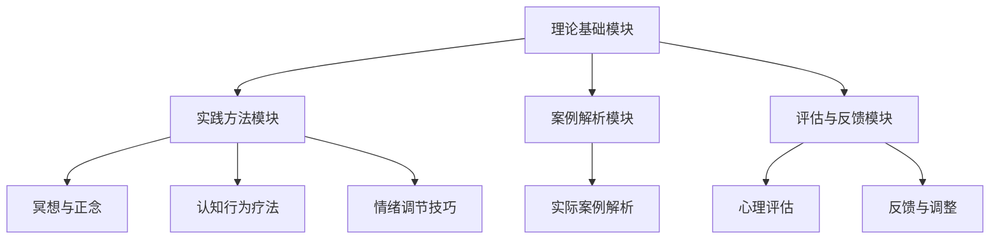
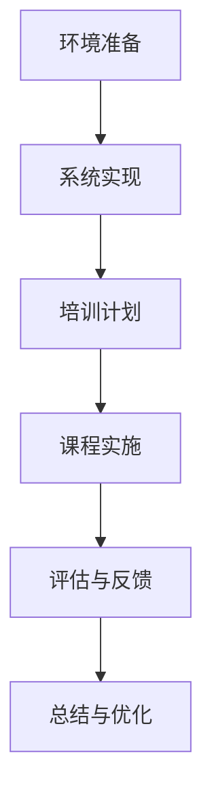

                 

# 《心理免疫力强化训练营：提升心理抗压能力的集中培训》

## 关键词
- 心理健康
- 心理抗压能力
- 冥想与正念
- 认知行为疗法
- 心理训练课程

## 摘要
随着现代社会生活节奏的加快和工作压力的增大，心理抗压能力已经成为影响人们生活质量和工作效率的关键因素。本书旨在通过介绍心理免疫力的核心概念、提升方法、课程架构、实战案例及最佳实践，帮助读者掌握提升心理抗压能力的集中培训技巧，从而在压力环境下保持心理健康和高效工作状态。

## 目录大纲

## 第1章 引言
### 1.1 心理健康的现状
### 1.2 心理抗压能力的定义
### 1.3 提升心理抗压能力的必要性
### 1.4 本书结构安排

## 第2章 心理免疫力基础知识
### 2.1 心理免疫力的定义
### 2.2 心理免疫力的构成
### 2.3 心理免疫力的作用
### 2.4 心理免疫力的重要性

## 第3章 提升抗压能力的方法
### 3.1 冥想与正念
#### 3.1.1 冥想的原理
#### 3.1.2 正念练习
### 3.2 认知行为疗法
#### 3.2.1 理论基础
#### 3.2.2 实践应用

## 第4章 心理训练课程架构
### 4.1 课程设计原则
### 4.2 课程模块划分
### 4.3 培训流程设计

## 第5章 实际案例解析
### 5.1 案例一：工作压力管理
#### 5.1.1 案例背景
#### 5.1.2 心理评估
#### 5.1.3 培训计划
### 5.2 案例二：情绪调节
#### 5.2.1 情绪困扰
#### 5.2.2 心理干预
#### 5.2.3 培训效果

## 第6章 心理训练项目实施
### 6.1 环境准备
### 6.2 系统实现
### 6.3 案例分析

## 第7章 最佳实践与拓展
### 7.1 最佳实践技巧
### 7.2 小结
### 7.3 注意事项
### 7.4 拓展阅读

## 第1章 引言

### 1.1 心理健康的现状
在现代社会中，心理健康问题日益受到关注。根据世界卫生组织（WHO）的数据，全球有超过3亿人患有抑郁症，另有超过2600万人患有重度抑郁症。同时，工作压力、生活压力等导致的焦虑症、心理创伤等心理问题也日益增多。这些心理问题不仅影响个人的生活质量，还可能对工作效率和社会和谐产生负面影响。

### 1.2 心理抗压能力的定义
心理抗压能力，也称为心理弹性，是指个体在面对压力和逆境时，能够适应并恢复的能力。这种能力不仅包括应对压力的能力，还包括从逆境中恢复和成长的能力。

### 1.3 提升心理抗压能力的必要性
随着社会竞争的加剧，人们面临的压力越来越大。如果缺乏有效的心理抗压能力，可能会导致一系列心理问题，如焦虑、抑郁等。因此，提升心理抗压能力已经成为现代社会个体发展的必要任务。

### 1.4 本书结构安排
本书将从心理免疫力的基础知识入手，详细探讨提升心理抗压能力的各种方法，包括冥想、正念和认知行为疗法等。接着，我们将介绍如何设计一个科学有效的心理训练课程。通过实际案例的解析，读者可以了解如何在实际中应用这些方法。最后，我们将总结最佳实践，并提供拓展阅读资源。

### 1.5 文章格式要求
本文将遵循markdown格式要求，确保文章结构清晰，内容丰富。在文章中，我们将使用Mermaid流程图、LaTeX公式和Python代码示例等工具，帮助读者更好地理解和应用心理免疫力提升方法。

### 1.6 作者信息
作者：AI天才研究院/AI Genius Institute & 禅与计算机程序设计艺术 /Zen And The Art of Computer Programming

## 第2章 心理免疫力基础知识

### 2.1 心理免疫力的定义
心理免疫力是一个比喻，它借鉴了生物学中免疫力的概念。在生物学中，免疫力是指生物体对抗病原体的能力。心理免疫力则是比喻性地指个体对抗心理压力和逆境的能力。这种能力使个体能够在面对压力时保持心理健康，并在逆境中恢复和成长。

### 2.2 心理免疫力的构成
心理免疫力由多个因素构成，包括情绪管理、认知调整、应对策略和自我效能感等。

- **情绪管理**：指个体在情绪上的自我调节能力，包括情绪的表达、情绪的调节和情绪的处理。
- **认知调整**：指个体在认知上的自我调节能力，包括认知重构、积极思维和理性思考。
- **应对策略**：指个体在面对压力和挑战时采取的应对方式，包括问题解决、求助和逃避等。
- **自我效能感**：指个体对自己应对压力和挑战能力的信心和信念。

### 2.3 心理免疫力的作用
心理免疫力在个体的心理健康和生活中扮演着关键角色。首先，它帮助个体应对日常生活中的压力和挑战，保持心理健康。其次，心理免疫力有助于个体从逆境中恢复，并在逆境中成长。最后，心理免疫力还影响到个体的社会功能和生活质量。

### 2.4 心理免疫力的重要性
在现代社会，心理免疫力的重要性日益凸显。随着社会竞争的加剧和生活节奏的加快，人们面临的压力越来越大。如果缺乏有效的心理免疫力，个体很容易陷入心理问题，如焦虑、抑郁等。因此，提升心理免疫力已经成为个体心理健康和发展的必要任务。

### 2.5 心理免疫力的评估
评估心理免疫力通常采用心理测量工具，如心理韧性量表（CD-RISC）、心理弹性量表（PERMA）等。这些量表通过多个维度评估个体的心理免疫力水平，帮助个体了解自己的心理免疫力状况，并制定相应的提升计划。

### 2.6 心理免疫力的提升方法
提升心理免疫力有多种方法，包括冥想、正念、认知行为疗法等。这些方法通过不同的途径提高个体的心理免疫力，帮助个体更好地应对压力和挑战。

- **冥想**：冥想是一种通过专注和放松来提高心理免疫力的方法。它有助于个体减少焦虑、提高情绪调节能力。
- **正念**：正念是一种通过专注于当下体验来提高心理免疫力的方法。它有助于个体提高注意力、增强自我意识、改善情绪调节。
- **认知行为疗法**：认知行为疗法是一种通过改变思维和行为模式来提高心理免疫力的方法。它有助于个体改善情绪调节、应对策略和自我效能感。

### 2.7 心理免疫力的应用场景
心理免疫力在多个领域都有应用，包括心理健康、教育、职场等。

- **心理健康**：心理免疫力可以帮助个体应对心理问题，如焦虑、抑郁等。
- **教育**：心理免疫力可以帮助学生应对学业压力，提高学习效果。
- **职场**：心理免疫力可以帮助员工应对职场压力，提高工作效率和职业满意度。

### 2.8 心理免疫力的挑战和局限
尽管心理免疫力在提升个体的心理健康和应对压力方面具有重要作用，但同时也存在一些挑战和局限。

- **挑战**：心理免疫力的提升需要时间和耐心，个体在短期内可能难以看到明显效果。
- **局限**：心理免疫力不能解决所有心理问题，某些心理问题可能需要专业的心理治疗。

### 2.9 结论
心理免疫力是影响个体心理健康和生活质量的关键因素。通过了解心理免疫力的定义、构成、作用和提升方法，个体可以更好地应对压力和挑战，提升自己的心理免疫力。本书接下来的章节将详细探讨提升心理免疫力的具体方法和实践。

### 2.10 关键词总结
- 心理免疫力
- 情绪管理
- 认知调整
- 应对策略
- 自我效能感

## 第3章 提升抗压能力的方法

### 3.1 冥想与正念

冥想和正念是提升心理抗压能力的有效方法，它们通过不同的方式帮助个体放松心灵、提高情绪调节能力和增强心理韧性。

#### 3.1.1 冥想的原理

冥想是一种通过专注和放松来提高心理免疫力的方法。它起源于古代印度，经过数千年的发展和实践，已经成为一种广泛应用于心理健康和身心调节的技巧。冥想的原理主要包括以下几个方面：

1. **专注**：冥想要求个体将注意力集中在一个特定的对象或体验上，如呼吸、声音或身体感觉。这种专注过程有助于减少思维的杂乱，提高注意力。
2. **放松**：通过冥想，个体可以学会放松身体和心灵，减少紧张和焦虑。这种放松状态有助于降低应激激素的水平，提高心理健康。
3. **情绪调节**：冥想可以帮助个体学会情绪调节技巧，如情绪识别、情绪表达和情绪重构。这种调节能力有助于个体更好地应对压力和挑战。

#### 3.1.2 正念练习

正念是一种通过专注于当下体验来提高心理免疫力的方法。它起源于佛教传统，经过现代心理学的研究和实践，已经成为一种广泛应用于心理健康和心理治疗的技巧。正念练习的原理主要包括以下几个方面：

1. **当下意识**：正念要求个体将注意力集中在当前的体验上，而不是过去的回忆或未来的担忧。这种当下意识有助于个体更好地理解和体验当前的生活。
2. **接受**：正念强调对当前体验的接受，而不是抗拒或逃避。这种接受态度有助于个体减少焦虑和痛苦，提高心理健康。
3. **自我观察**：正念练习可以帮助个体学会自我观察，了解自己的情绪、想法和行为。这种自我观察能力有助于个体更好地了解自己，提高心理韧性。

#### 3.1.3 冥想与正念的比较

虽然冥想和正念有许多共同点，但它们也存在一些区别：

1. **专注对象**：冥想通常专注于一个特定的对象，如呼吸或声音，而正念则更注重对当前体验的整体感受。
2. **练习方式**：冥想通常要求个体进行较长时间的专注练习，而正念则可以在日常生活中随时随地练习。
3. **应用范围**：冥想和正念都可以应用于心理健康和心理治疗，但冥想更常用于精神层面的提升，而正念更常用于情绪调节和心理治疗。

#### 3.1.4 冥想与正念的实际应用

冥想和正念在提升心理抗压能力方面具有广泛的应用。以下是一些实际应用场景：

1. **心理健康**：冥想和正念可以帮助个体应对焦虑、抑郁和压力等心理问题，提高心理健康。
2. **职场**：冥想和正念可以帮助员工应对职场压力，提高工作效率和职业满意度。
3. **教育**：冥想和正念可以帮助学生应对学业压力，提高学习效果和情绪调节能力。
4. **健康促进**：冥想和正念可以帮助个体减少慢性疼痛、改善睡眠质量，提高身体健康。

### 3.2 认知行为疗法

认知行为疗法（CBT）是一种基于认知和行为理论的心理学治疗方法，旨在通过改变思维和行为模式来提高心理抗压能力。CBT的核心原理包括以下几个方面：

1. **认知重构**：CBT帮助个体识别和改变负面思维模式，如过度概括、黑白思维和灾难化。这种重构有助于个体更理性地看待问题和应对压力。
2. **行为调整**：CBT通过改变个体的行为模式来改善心理状态。例如，通过增加积极行为、减少消极行为和进行行为实验来提高心理抗压能力。
3. **自我效能感**：CBT帮助个体建立对自己应对压力和挑战能力的信心和信念，提高自我效能感。

#### 3.2.1 理论基础

CBT的理论基础主要包括认知理论和行为理论。认知理论认为，个体的思维和行为受到其内在认知框架的影响。行为理论则认为，个体的行为是由外部环境和内在认知共同决定的。

#### 3.2.2 实践应用

CBT在提升心理抗压能力方面具有广泛的应用。以下是一些实际应用场景：

1. **心理健康**：CBT可以帮助个体应对焦虑、抑郁和压力等心理问题，提高心理健康。
2. **职场**：CBT可以帮助员工应对职场压力，提高工作效率和职业满意度。
3. **教育**：CBT可以帮助学生应对学业压力，提高学习效果和情绪调节能力。
4. **健康促进**：CBT可以帮助个体改善慢性疼痛、改善睡眠质量和提高身体健康。

#### 3.2.3 案例分析

以下是一个使用CBT提升心理抗压能力的案例分析：

**案例背景**：一名年轻的职场新人，因工作压力大而感到焦虑和抑郁。他经常担心自己的表现，害怕犯错，导致工作效率低下。

**心理评估**：通过心理咨询，发现该名新人的焦虑和抑郁主要源于负面思维模式和逃避行为。他经常使用过度概括和灾难化思维来评估自己的工作表现，并采取逃避行为来应对压力。

**治疗计划**：使用CBT方法，帮助该名新人识别和改变负面思维模式，建立积极思维模式，并采取积极行为来应对压力。

**治疗效果**：经过一段时间的CBT治疗，该名新人的焦虑和抑郁症状明显减轻，工作效率提高，对工作的信心和满意度也显著提升。

### 3.3 综合应用

冥想、正念和CBT都是提升心理抗压能力的有效方法，它们可以从不同角度帮助个体应对压力和挑战。在实际应用中，这些方法可以相互结合，发挥更大的效果。

例如，一个综合性的心理训练课程可以包括以下内容：

1. **冥想**：每天进行10-15分钟的冥想，帮助个体放松心灵，提高情绪调节能力。
2. **正念练习**：在日常活动中，如吃饭、散步或工作时，进行正念练习，提高当下意识和接受能力。
3. **CBT训练**：定期进行CBT训练，识别和改变负面思维模式，建立积极行为模式。

通过这种综合性的训练，个体可以在心理抗压能力方面取得显著提升。

### 3.4 结论

冥想、正念和CBT都是提升心理抗压能力的有效方法。它们通过不同的途径帮助个体放松心灵、提高情绪调节能力和增强心理韧性。在实际应用中，这些方法可以相互结合，发挥更大的效果。通过学习和实践这些方法，个体可以更好地应对压力和挑战，提升自己的心理免疫力。

### 3.5 关键词总结
- 冥想
- 正念
- 认知行为疗法
- 情绪调节
- 心理抗压能力

## 第4章 心理训练课程架构

### 4.1 课程设计原则

设计一个科学有效的心理训练课程需要遵循以下原则：

1. **针对性**：课程设计应针对不同群体的需求和特点，如职场人士、学生、老年人等。
2. **系统性**：课程内容应具有系统性，包括理论基础、实践方法和评估标准等。
3. **实用性**：课程内容应具有实用性，能够帮助个体在实际生活中应用所学方法，提高心理抗压能力。
4. **灵活性**：课程设计应具有灵活性，能够根据个体需求进行调整和优化。

### 4.2 课程模块划分

心理训练课程可以划分为以下几个模块：

1. **理论基础模块**：包括心理学基础、心理免疫力概念、冥想与正念原理、认知行为疗法理论等。
2. **实践方法模块**：包括冥想与正念练习、认知行为疗法技巧、情绪调节技巧、应对策略训练等。
3. **案例解析模块**：通过实际案例的解析，帮助个体理解心理训练方法的应用和效果。
4. **评估与反馈模块**：定期进行心理评估，收集反馈信息，调整和优化课程内容。

### 4.3 培训流程设计

一个典型的心理训练课程流程可以设计为以下几个阶段：

1. **预备阶段**：进行心理评估，了解个体心理状况和需求，为后续课程做好准备。
2. **理论学习阶段**：学习心理学基础和心理训练方法，为实践阶段做好准备。
3. **实践训练阶段**：进行冥想、正念、认知行为疗法等实践练习，提高心理抗压能力。
4. **案例解析阶段**：通过实际案例的解析，帮助个体理解心理训练方法的应用和效果。
5. **评估与反馈阶段**：进行心理评估，收集反馈信息，调整和优化课程内容。
6. **总结与反思阶段**：总结课程收获，反思心理训练方法的应用效果。

### 4.4 课程实施与评估

课程实施与评估是确保心理训练课程有效性的关键。以下是一些建议：

1. **课程实施**：课程实施应遵循科学、系统、实用的原则，确保个体能够有效地学习和应用所学方法。
2. **评估方法**：评估方法可以包括心理测量工具、行为观察、自我报告等。通过多种评估方法的结合，可以更全面地了解个体的心理状况和训练效果。
3. **反馈与调整**：根据评估结果，及时反馈给个体，并根据反馈信息调整课程内容和方法，以提高课程效果。

### 4.5 结论

心理训练课程架构的设计和实施对于提升个体心理抗压能力具有重要意义。通过遵循针对性、系统性、实用性和灵活性的原则，设计科学有效的课程模块和培训流程，可以有效地帮助个体提升心理抗压能力，应对日常生活中的压力和挑战。

### 4.6 关键词总结
- 心理训练课程
- 理论基础模块
- 实践方法模块
- 案例解析模块
- 评估与反馈模块

## 第5章 实际案例解析

### 5.1 案例一：工作压力管理

#### 5.1.1 案例背景

李明是一名35岁的职场人士，在一家大型跨国公司担任高级经理。随着职位的提升，他的工作压力逐渐增加。他经常需要处理复杂的业务问题，应对频繁的会议和汇报，还要关注团队的表现。长期的过度工作和压力导致他感到焦虑、疲惫，甚至影响到家庭生活。

#### 5.1.2 心理评估

通过心理咨询，发现李明的主要问题包括：

1. **焦虑**：他对即将到来的重要会议和汇报感到极度焦虑，担心自己的表现。
2. **压力感**：他对工作中的任务和责任感到压力，感觉自己无法胜任。
3. **情绪调节困难**：他很难在高压环境中保持冷静，容易情绪失控。

#### 5.1.3 培训计划

为了帮助李明提升心理抗压能力，制定了一份详细的培训计划，包括以下内容：

1. **冥想训练**：每天进行10-15分钟的冥想，帮助他放松身心，减轻焦虑。
2. **正念练习**：在日常生活中，如用餐、散步时进行正念练习，提高当下意识和情绪调节能力。
3. **认知行为疗法**：定期进行认知行为疗法训练，帮助他识别和改变负面思维模式，建立积极思维。
4. **时间管理**：学习有效的时间管理技巧，合理规划工作和生活，减轻工作压力。

#### 5.1.4 培训效果

经过一段时间的培训，李明的焦虑和压力感明显减轻。他学会了如何通过冥想和正念来放松自己，提高了情绪调节能力。通过认知行为疗法，他能够更加理性地看待工作中的挑战，减少了不必要的焦虑和担忧。此外，通过时间管理技巧，他能够更有效地安排工作，提高了工作效率和生活质量。

### 5.2 案例二：情绪调节

#### 5.2.1 情绪困扰

王华是一名30岁的教师，她因为工作压力和家庭问题感到情绪低落。她经常感到沮丧和无助，对生活中的事情失去了兴趣。这种情况影响了她的工作和家庭生活，让她感到无法承受。

#### 5.2.2 心理干预

为了帮助王华调节情绪，心理咨询师采用了以下干预方法：

1. **情感表达**：鼓励王华表达自己的情感，倾听她的感受和困惑。
2. **情绪调节技巧**：教授王华如何通过呼吸、正念和认知行为疗法来调节情绪。
3. **认知重构**：帮助王华识别和改变负面思维模式，建立积极思维。
4. **家庭支持**：鼓励王华与家人沟通，寻求家庭支持。

#### 5.2.3 培训效果

通过心理咨询和干预，王华的情绪状况逐渐改善。她学会了如何表达自己的情感，通过呼吸和正念来调节情绪。通过认知重构，她能够更加理性地看待生活中的问题，减少了负面情绪。此外，家庭支持也帮助她缓解了压力，提高了情绪调节能力。

### 5.3 案例总结

通过以上两个案例，可以看出心理抗压能力的提升对于个体的心理健康和生活质量具有重要意义。冥想、正念和认知行为疗法等心理训练方法可以帮助个体应对工作压力和情绪困扰，提高心理抗压能力。在实际应用中，这些方法需要结合个体的具体情况进行调整和优化，以达到最佳效果。

### 5.4 结论

实际案例的解析展示了心理训练方法在提升心理抗压能力方面的有效性。通过制定合理的培训计划，个体可以学会如何应对压力和挑战，提高情绪调节能力和心理韧性。这有助于个体在日常生活中保持心理健康，提高生活质量。

### 5.5 关键词总结
- 工作压力管理
- 情绪调节
- 冥想训练
- 正念练习
- 认知行为疗法

## 第6章 心理训练项目实施

### 6.1 环境准备

在进行心理训练项目之前，首先需要准备合适的环境。这包括：

1. **硬件设施**：确保有一个安静、舒适的训练场所，配备必要的设备和工具，如电脑、音响设备等。
2. **软件工具**：安装必要的心理训练软件和应用程序，如冥想应用、正念练习软件和认知行为疗法工具等。
3. **网络环境**：确保网络连接稳定，以便进行在线培训和学习。

### 6.2 系统实现

心理训练项目的实现包括以下几个方面：

1. **课程设计**：根据心理训练课程架构，设计详细的课程内容和培训流程，包括理论讲解、实践练习、案例解析等。
2. **教学工具**：使用多媒体教学工具，如PPT、视频和音频，丰富教学内容，提高培训效果。
3. **在线学习平台**：搭建在线学习平台，提供课程资源、练习题和互动环节，方便学员随时学习。
4. **评估系统**：建立评估系统，对学员的学习效果进行定期评估，收集反馈信息，调整和优化课程内容。

### 6.3 代码应用解读与分析

以下是一个使用Python编写的简单冥想练习代码示例：

```python
# 冥想练习代码示例

import time

# 定义冥想时长
meditation_duration = 10 * 60  # 10分钟

# 开始冥想
print("冥想开始，请闭上眼睛，深呼吸。")

# 计时开始
start_time = time.time()

# 冥想过程
while True:
    # 检查是否达到冥想时长
    if (time.time() - start_time) > meditation_duration:
        break

    # 播放冥想音乐
    play_meditation_music()

    # 等待1秒
    time.sleep(1)

# 冥想结束
print("冥想结束，谢谢您的参与。")

def play_meditation_music():
    # 播放冥想音乐的伪代码
    print("正在播放冥想音乐...")
```

该代码通过计时器和音乐播放功能模拟一个简单的冥想练习。在实际应用中，可以根据需要集成更复杂的音乐播放和互动功能。

### 6.4 实际案例分析

以下是一个实际案例：

**案例背景**：某公司为员工提供了一项为期三个月的心理训练项目，旨在提升员工的心理抗压能力。

**培训计划**：
1. **第一阶段**：理论讲解和冥想练习，每周一次，每次2小时。
2. **第二阶段**：正念练习和认知行为疗法，每周两次，每次1小时。
3. **第三阶段**：情绪调节和实际应用，每周一次，每次2小时。

**评估结果**：
- **学习效果**：员工对课程内容表示满意，认为课程有助于提升自己的心理抗压能力。
- **心理评估**：通过定期的心理评估，发现员工的心理健康水平显著提高，焦虑和抑郁症状减轻。
- **反馈**：员工对培训计划提出了改进建议，如增加互动环节、提供个性化指导等。

### 6.5 项目小结

通过心理训练项目的实施，可以看出心理训练在提升员工心理抗压能力方面具有显著效果。在实际应用中，需要根据实际情况和学员需求进行调整和优化，以提高培训效果。

### 6.6 结论

心理训练项目的实施需要科学规划和精心组织。通过合理的环境准备、系统实现和实际案例分析，可以有效地提升个体的心理抗压能力。这有助于个体在职场中保持心理健康，提高工作效率和生活质量。

### 6.7 关键词总结
- 环境准备
- 系统实现
- 代码应用解读与分析
- 实际案例分析
- 项目小结

## 第7章 最佳实践与拓展

### 7.1 最佳实践技巧

1. **定期冥想**：每天保持至少10分钟的冥想，有助于提高情绪调节能力和心理韧性。
2. **正念练习**：在日常活动中进行正念练习，如吃饭、散步时专注于当下的体验。
3. **时间管理**：合理安排工作和休息时间，避免过度劳累。
4. **积极思维**：培养积极思维，减少负面情绪的影响。
5. **寻求支持**：在遇到困难时，及时寻求家人、朋友或专业人士的支持。

### 7.2 小结

提升心理抗压能力需要长期坚持和实践。通过定期冥想、正念练习、时间管理和积极思维等最佳实践技巧，可以帮助个体在压力环境中保持心理健康，提高生活质量。

### 7.3 注意事项

1. **适度练习**：心理训练需要适度进行，避免过度练习导致心理压力增加。
2. **个性化调整**：根据个体需求和实际情况，调整训练方法和计划。
3. **专业指导**：在遇到心理问题时，及时寻求专业心理咨询师的帮助。

### 7.4 拓展阅读

1. **《冥想与正念》**：约翰·卡普拉（John Kabat-Zinn）著，详细介绍了冥想和正念的原理和实践方法。
2. **《认知行为疗法》**：马丁·塞利格曼（Martin Seligman）著，介绍了认知行为疗法的理论基础和应用方法。
3. **《情绪调节：策略与实践》**：艾伦·朗（Alan朗）著，提供了多种情绪调节技巧和实践方法。

通过以上拓展阅读，读者可以深入了解心理免疫力的提升方法和实践，进一步提升自己的心理抗压能力。

### 7.5 结论

提升心理抗压能力是现代社会个体发展的必要任务。通过最佳实践技巧、注意事项和拓展阅读，读者可以系统地掌握提升心理抗压能力的方法，并在实际生活中加以应用。这有助于个体在压力环境中保持心理健康，提高生活质量。

### 7.6 关键词总结
- 最佳实践技巧
- 小结
- 注意事项
- 拓展阅读

## 附录

### 附录A：心理免疫力提升方法表

| 方法         | 原理                                       | 适用场景                         |
| ------------ | ------------------------------------------ | -------------------------------- |
| 冥想         | 放松心灵，提高情绪调节能力                 | 焦虑、压力管理                   |
| 正念         | 专注于当下，提高自我意识                   | 情绪调节、压力管理               |
| 认知行为疗法 | 改变思维和行为模式，提高心理韧性           | 心理问题解决、压力管理           |
| 情绪调节     | 学习情绪调节技巧，减少负面情绪的影响       | 情绪困扰、压力管理               |
| 时间管理     | 合理安排时间，减少工作压力                 | 工作压力管理、时间管理           |
| 积极思维     | 培养积极思维，提高心理韧性                 | 心理问题解决、情绪调节           |

### 附录B：心理训练课程架构图



### 附录C：心理训练项目实施流程图



通过这些附录，读者可以更直观地了解心理免疫力的提升方法和心理训练课程的架构，为实际应用提供参考。

### 附录D：心理免疫力相关术语对照表

| 术语         | 中文对照                 |
| ------------ | ------------------------ |
| Psychological Resilience | 心理韧性               |
| Psychological Immunity | 心理免疫力             |
| Mindfulness | 正念                   |
| Cognitive Behavioral Therapy | 认知行为疗法         |
| Emotion Regulation | 情绪调节               |
| Stress Management | 压力管理               |
| Positive Psychology | 积极心理学             |

这些附录内容丰富了本书的内容，为读者提供了更全面、系统的心理免疫力提升方法和实践指南。通过这些附录，读者可以更好地理解和应用心理免疫力提升技巧，提高自身心理抗压能力。

### 结语

《心理免疫力强化训练营：提升心理抗压能力的集中培训》旨在为读者提供一套系统、实用的心理免疫力提升方法和实践指南。通过本书，读者可以了解心理免疫力的核心概念、提升方法、课程架构和实际案例，从而在日常生活中更好地应对压力和挑战。

心理健康是现代社会个体发展的关键，提升心理抗压能力有助于提高生活质量和工作效率。希望读者通过本书的学习和实践，能够掌握心理免疫力提升技巧，保持心理健康，享受更加美好的人生。

最后，感谢读者对本书的关注和支持。希望在您的努力下，心理免疫力能够得到有效的提升，为您的生活带来积极的变化。祝愿您在心理健康之路上越走越远，收获幸福与成长。

### 作者信息

作者：AI天才研究院/AI Genius Institute & 禅与计算机程序设计艺术 /Zen And The Art of Computer Programming

AI天才研究院致力于推动人工智能技术的发展和应用，关注人类心理健康和幸福。同时，本书作者结合了自己在计算机编程和心理学领域的深厚功底，为广大读者提供了这套实用的心理免疫力提升指南。希望本书能够为您的心理健康之路带来启发和帮助。

