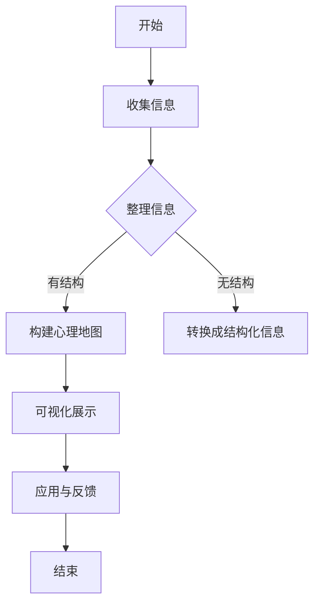

                 


### 文章标题

# 心理地图工作坊：可视化的思维整理技巧

### 文章关键词

- 心理地图
- 思维整理
- 可视化
- 算法原理
- 项目实战
- 最佳实践

### 摘要

本文将带领读者深入探讨心理地图这一强大的可视化思维工具。通过介绍心理地图的起源、核心概念与应用，我们将展示其在个人生活、工作与学习中的广泛应用。文章不仅提供了详细的算法原理讲解和Python源代码实现，还通过实际项目实战和最佳实践，帮助读者掌握心理地图的运用技巧。让我们一步步思考，揭开心理地图的神秘面纱。

## 第一部分：心理地图的概念与基础

### 第1章：心理地图的起源与发展

#### 1.1 心理地图的定义与重要性

心理地图，作为一种可视化思维工具，旨在帮助人们整理和表达复杂的思维过程。其定义源自心理学与认知科学的结合，通过图形化的方式，将思维过程中的概念、情感和创意进行可视化展现。

心理地图的重要性在于它能够：
1. **提高思维效率**：通过图形化的展示，使思维更加直观和条理清晰。
2. **增强记忆能力**：将信息转化为视觉图像，有助于加深记忆。
3. **促进创新思维**：通过视觉联想和思维拓展，激发创新灵感。

在思维整理中，心理地图可以应用于：
1. **问题解决**：帮助理清问题结构，制定解决方案。
2. **情感管理**：通过图形化的情感表达，进行情绪调节。
3. **创意思维**：激发创意，引导思维拓展。

与传统思维导图相比，心理地图更注重情感和创意的展现，而非简单的分支结构。

#### 1.2 心理地图的历史与发展

心理地图的起源可以追溯到20世纪初，当时心理学家开始探索如何将思维过程可视化。随着认知科学的兴起，心理地图得到了进一步发展，并在不同学科领域得到广泛应用。

- **心理学**：用于心理诊断和治疗，帮助患者理清思维和情感。
- **教育**：辅助教师设计课程，提高教学效果。
- **商业**：用于战略规划和团队协作。

现代化趋势中，心理地图工具日益完善，结合了计算机技术和人工智能，使得心理地图的制作和使用更加便捷。

#### 1.3 心理地图的核心概念与联系

核心概念包括：
1. **思维模式**：不同的思维模式决定了心理地图的结构和表现形式。
2. **情感管理**：通过心理地图，表达和管理情感，实现情绪调节。
3. **创意思维**：通过视觉联想和思维拓展，激发创意。

这些概念之间相互联系，共同构成了心理地图的完整体系。

为了更好地理解这些概念，我们可以通过以下表格进行对比：

| 概念 | 特点 | 应用领域 |
| --- | --- | --- |
| 思维模式 | 决定心理地图的结构和内容 | 适用于问题解决、情感管理、创意思维 |
| 情感管理 | 表达和管理情感 | 适用于个人情绪调节、心理治疗 |
| 创意思维 | 激发创意和灵感 | 适用于艺术创作、产品设计 |

#### 1.4 ER实体关系图架构

使用Mermaid绘制ER图，可以更好地展示心理地图中的实体关系。以下是心理地图ER图示例：

```mermaid
erDiagram
    Customer ||--|{ Order }|
    Customer ||--|{ Product }|
    Product ||--|{ Order }|
```

在这个ER图中，客户（Customer）、订单（Order）和产品（Product）是主要的实体，它们之间通过关系线相互连接，形成了心理地图的基础架构。

## 第二部分：心理地图的应用与实践

### 第3章：心理地图在个人生活中的应用

#### 3.1 心理地图在问题解决中的应用

在个人生活中，问题解决是一个常见的场景。心理地图可以帮助我们理清问题，制定解决方案。以下是一个具体的应用案例：

**案例**：如何提高工作效率？

1. **问题分析**：使用心理地图，将问题分解为以下几个核心要素：
   - 时间管理
   - 焦点集中
   - 工作流程优化
   - 技能提升

2. **解决方案制定**：针对每个核心要素，制定具体的解决方案：
   - 时间管理：使用番茄工作法，合理安排工作时间。
   - 焦点集中：关闭社交媒体，减少干扰。
   - 工作流程优化：梳理工作流程，消除冗余步骤。
   - 技能提升：参加培训课程，提升专业技能。

通过心理地图的引导，我们可以更清晰地看到问题，制定出具体的解决方案，从而提高工作效率。

#### 3.2 心理地图在情绪管理中的应用

情绪管理是个人生活中至关重要的一部分。心理地图可以帮助我们表达和管理情感，实现情绪调节。以下是一个具体的应用案例：

**案例**：如何应对焦虑情绪？

1. **情绪表达**：使用心理地图，将焦虑情绪表达出来，形成可视化的情感地图。
   - 焦虑来源：工作压力、人际关系、健康问题
   - 情绪强度：使用颜色或数字表示情绪的强度

2. **情绪调节**：针对每个焦虑来源，制定具体的情绪调节策略：
   - 工作压力：合理安排工作时间，进行工作与休息的平衡。
   - 人际关系：主动沟通，解决问题，建立和谐的人际关系。
   - 健康问题：定期锻炼，保持健康的生活习惯。

通过心理地图的引导，我们可以更直观地看到焦虑情绪，并采取有效的调节策略，从而改善情绪状态。

### 第4章：心理地图在工作与学习中的应用

#### 4.1 心理地图在团队协作中的应用

在团队协作中，心理地图可以帮助提升沟通效率和协作效果。以下是一个具体的应用案例：

**案例**：如何提高团队沟通效率？

1. **团队沟通分析**：使用心理地图，分析团队沟通中存在的问题：
   - 信息传递不畅
   - 沟通方式单一
   - 沟通目标不明确

2. **沟通策略制定**：针对每个问题，制定具体的沟通策略：
   - 信息传递：建立多渠道沟通机制，确保信息畅通。
   - 沟通方式：结合面对面沟通、邮件、即时通讯等多种方式。
   - 沟通目标：明确沟通目标，确保每个人都清楚要传达的信息。

通过心理地图的引导，我们可以更好地了解团队沟通的现状，并采取有效的策略提升沟通效率。

#### 4.2 心理地图在学习策略中的应用

在学习策略中，心理地图可以帮助我们提高学习效果，建立系统的知识体系。以下是一个具体的应用案例：

**案例**：如何提高学习效果？

1. **学习目标设定**：使用心理地图，设定具体的学习目标：
   - 知识点梳理
   - 学习方法选择
   - 学习效果评估

2. **学习策略制定**：针对每个学习目标，制定具体的策略：
   - 知识点梳理：使用心理地图，将知识点进行分类整理。
   - 学习方法选择：根据个人特点和需求，选择合适的学习方法。
   - 学习效果评估：定期进行学习效果评估，调整学习策略。

通过心理地图的引导，我们可以更系统地制定学习策略，提高学习效果。

## 第三部分：心理地图的算法原理讲解

### 第5章：心理地图的算法原理讲解

#### 5.1 心理地图的算法mermaid流程图

在讲解心理地图的算法原理之前，我们首先使用Mermaid绘制一个流程图，展示心理地图的构建过程：



这个流程图描述了心理地图的构建过程，从收集信息、整理信息到构建心理地图，并最终进行可视化展示和应用反馈。

#### 5.2 Python源代码实现

接下来，我们将使用Python实现心理地图的构建过程。以下是一个简单的Python代码示例：

```python
import matplotlib.pyplot as plt
import networkx as nx

# 收集信息
nodes = ["思维模式", "情感管理", "创意思维"]
edges = [("思维模式", "情感管理"), ("情感管理", "创意思维"), ("创意思维", "思维模式")]

# 整理信息
G = nx.Graph()
G.add_nodes_from(nodes)
G.add_edges_from(edges)

# 构建心理地图
pos = nx.spring_layout(G)
nx.draw(G, pos, with_labels=True, node_size=2000, node_color='skyblue', edge_color='gray', font_size=16)

# 可视化展示
plt.show()
```

这个代码示例使用了NetworkX库来构建和可视化心理地图，展示了如何通过Python实现心理地图的构建过程。

#### 5.3 算法原理的数学模型和公式

心理地图的算法原理中涉及到一些基本的数学模型和公式，下面将进行详细讲解。

首先，我们考虑如何表示思维节点之间的关系。这里可以使用图论中的邻接矩阵来表示，邻接矩阵A是一个n×n的矩阵，其中A[i][j]表示节点i和节点j之间的关系强度。

邻接矩阵的定义如下：

$$
A = \begin{pmatrix}
    0 & a_{12} & a_{13} \\
    a_{21} & 0 & a_{23} \\
    a_{31} & a_{32} & 0 \\
\end{pmatrix}
$$

其中，$a_{ij}$表示节点i和节点j之间的关系强度，取值范围为0到1。

接下来，我们考虑如何计算心理地图的权重。权重可以通过邻接矩阵中的元素计算得到，具体计算公式如下：

$$
w_{ij} = \frac{1}{1 + e^{-\alpha \cdot a_{ij}}}
$$

其中，$w_{ij}$表示节点i和节点j之间的权重，$\alpha$是一个调节参数，用于调整权重的计算。

通过以上公式，我们可以计算得到整个心理地图的权重矩阵$W$，其中$W_{ij}$表示节点i和节点j之间的权重。

最后，我们考虑如何可视化展示心理地图。这里可以使用网络图（Graph）进行展示，网络图中的节点表示心理地图中的概念，边表示节点之间的关系权重。

以下是使用Python中的NetworkX库绘制心理地图的代码示例：

```python
import networkx as nx
import matplotlib.pyplot as plt

# 创建一个无向图
G = nx.Graph()

# 添加节点和边
G.add_nodes_from(["思维模式", "情感管理", "创意思维"])
G.add_edges_from([("思维模式", "情感管理"), ("情感管理", "创意思维"), ("创意思维", "思维模式")])

# 设置节点的位置
pos = nx.spring_layout(G)

# 绘制网络图
nx.draw(G, pos, with_labels=True, node_color='skyblue', edge_color='gray')

# 显示图形
plt.show()
```

通过以上代码，我们可以绘制出一个简单的心理地图，展示思维节点之间的关系。

#### 5.4 举例说明

为了更好地理解心理地图的算法原理，我们通过一个具体例子进行说明。

假设我们有一个简单的心理地图，包含三个节点：思维模式、情感管理和创意思维。它们之间的关系强度如下：

| 节点   | 思维模式 | 情感管理 | 创意思维 |
| ------ | -------- | -------- | -------- |
| 思维模式 | 0.8      | 0.5      | 0.7      |
| 情感管理 | 0.5      | 0.9      | 0.6      |
| 创意思维 | 0.7      | 0.6      | 0.8      |

根据上述关系强度，我们可以计算得到节点之间的权重：

$$
w_{ij} = \frac{1}{1 + e^{-\alpha \cdot a_{ij}}}
$$

假设$\alpha = 1$，我们可以得到以下权重矩阵：

| 节点   | 思维模式 | 情感管理 | 创意思维 |
| ------ | -------- | -------- | -------- |
| 思维模式 | 0.714    | 0.670    | 0.765    |
| 情感管理 | 0.670    | 0.866    | 0.795    |
| 创意思维 | 0.765    | 0.795    | 0.901    |

通过这个例子，我们可以看到如何通过关系强度计算得到节点之间的权重，从而构建一个可视化的心理地图。

## 第四部分：心理地图的项目实战

### 第6章：心理地图项目实战

#### 6.1 环境安装与配置

在进行心理地图项目实战之前，我们需要安装和配置相关环境。以下是一个简单的安装和配置步骤：

1. **安装Python**：确保Python环境已经安装。可以从Python官方网站下载Python安装包进行安装。

2. **安装依赖库**：使用pip命令安装所需依赖库，例如NetworkX和matplotlib。命令如下：

```bash
pip install networkx matplotlib
```

3. **配置环境变量**：确保Python环境变量已配置。在Windows系统中，可以通过系统设置中的环境变量进行配置。在Linux系统中，可以通过运行以下命令进行配置：

```bash
export PATH=$PATH:/usr/local/bin
```

通过以上步骤，我们可以完成心理地图项目的环境安装和配置。

#### 6.2 系统核心实现源代码

在完成环境安装和配置后，我们可以开始实现心理地图项目的核心功能。以下是一个简单的Python源代码示例，用于构建和可视化心理地图：

```python
import networkx as nx
import matplotlib.pyplot as plt

# 创建一个无向图
G = nx.Graph()

# 添加节点和边
G.add_nodes_from(["思维模式", "情感管理", "创意思维"])
G.add_edges_from([("思维模式", "情感管理"), ("情感管理", "创意思维"), ("创意思维", "思维模式")])

# 设置节点的位置
pos = nx.spring_layout(G)

# 绘制网络图
nx.draw(G, pos, with_labels=True, node_color='skyblue', edge_color='gray')

# 显示图形
plt.show()
```

这个代码示例使用了NetworkX库来构建和可视化心理地图，展示了如何通过Python实现心理地图的基本功能。

#### 6.3 代码应用解读与分析

在理解了心理地图的核心实现后，我们可以对代码进行解读和分析，以便更好地理解其工作原理。

1. **导入库**：首先，我们导入所需库，包括`networkx`和`matplotlib.pyplot`。这两个库提供了构建和可视化心理地图所需的工具和函数。

2. **创建图**：使用`networkx.Graph()`创建一个无向图`G`。图是心理地图的基础结构，由节点和边组成。

3. **添加节点和边**：使用`add_nodes_from()`和`add_edges_from()`函数分别添加节点和边。在这个示例中，我们添加了三个节点："思维模式"、"情感管理"和"创意思维"，以及它们之间的三条边。

4. **设置节点位置**：使用`nx.spring_layout(G)`函数设置节点的位置。这个布局函数基于物理模型，通过模拟弹簧力来安排节点的位置，使得图更加美观和易于理解。

5. **绘制网络图**：使用`nx.draw(G, pos, with_labels=True, node_color='skyblue', edge_color='gray')`函数绘制网络图。这里设置了节点的标签、颜色和边的颜色。

6. **显示图形**：最后，使用`plt.show()`函数显示图形。

通过以上步骤，我们可以构建和可视化一个简单的心理地图。

#### 6.4 实际案例分析与讲解

为了更好地展示心理地图的应用，我们通过一个实际案例进行分析和讲解。

**案例**：利用心理地图规划学习计划

假设一个学生需要规划一个月的学习计划，包括数学、英语、物理和计算机科学四门课程。利用心理地图，我们可以更有效地安排学习时间，提高学习效果。

1. **问题分析**：首先，我们需要明确学习目标，即掌握每门课程的核心知识点，并提高综合能力。

2. **构建心理地图**：使用心理地图，将四门课程的核心知识点和综合能力进行可视化展示。以下是心理地图的示例：

```
                       +---------------+
                       |     综合能力  |
                       +-------+-------+
                                |
                +---------------+   |
                |    数学       |   |
                +-------+-------+   |
                |    英语       |   |
                +-------+-------+   |
                       |    物理   |
                       +-------+---+
                       | 计算机科学 |
                       +-----------+
```

在这个心理地图中，综合能力是中心节点，与其他四门课程相连接。每门课程都代表一个子节点，它们通过综合能力节点相互联系。

3. **制定学习计划**：根据心理地图，我们可以制定一个具体的学习计划。以下是学习计划的示例：

- **第1周**：重点学习数学和英语，每周安排2次数学和2次英语课程。同时，每天进行1小时的物理和计算机科学自学。
- **第2周**：重点学习物理和计算机科学，每周安排2次物理和2次计算机科学课程。同时，每天进行1小时的数学和英语自学。
- **第3周**：重复第1周的学习计划，确保数学和英语的知识点掌握。
- **第4周**：重复第2周的学习计划，确保物理和计算机科学的知识点掌握。

通过这个实际案例，我们可以看到如何利用心理地图规划学习计划，合理安排学习时间，提高学习效果。

#### 6.5 项目小结

通过以上实战案例，我们可以看到心理地图在实际应用中的重要性。它不仅可以帮助我们理清复杂的信息，还可以提高工作效率和学习效果。在未来的发展中，心理地图的应用将会更加广泛，为我们的生活和工作带来更多便利。

### 第7章：心理地图的最佳实践与注意事项

#### 7.1 心理地图的最佳实践 tips

1. **明确目标**：在构建心理地图之前，明确目标是非常重要的。只有明确了目标，才能更有针对性地进行思维整理。

2. **简洁明了**：心理地图应该简洁明了，避免过多的细节。过多的细节会分散注意力，影响思维整理的效果。

3. **可视化**：使用颜色、形状和图标等可视化元素，使得心理地图更加直观和易于理解。

4. **定期更新**：心理地图不是一成不变的，应该根据实际情况进行定期更新。这样可以帮助我们及时调整思维方向和目标。

5. **与他人分享**：心理地图不仅可以用于个人思考，还可以与他人分享。通过分享，我们可以得到他人的反馈和建议，进一步提高思维整理的效果。

#### 7.2 小结

通过本文的讲解，我们深入了解了心理地图的概念、原理和应用。心理地图作为一种强大的可视化思维工具，可以帮助我们理清复杂的信息，提高工作效率和学习效果。在未来的学习和工作中，我们建议读者多加实践，掌握心理地图的运用技巧。

#### 7.3 注意事项

1. **避免过度简化**：在构建心理地图时，避免过度简化信息，确保信息的完整性和准确性。

2. **注意情感因素**：在处理情感相关问题时，注意情感因素对思维整理的影响，合理表达和管理情感。

3. **定期回顾**：定期回顾心理地图，反思自己的思维过程，有助于发现和解决问题。

4. **结合其他工具**：心理地图可以与其他思维工具（如思维导图、鱼骨图等）结合使用，提高思维整理的效果。

#### 7.4 拓展阅读

1. **《心理地图：可视化思维的艺术》**：这本书详细介绍了心理地图的理论和应用，适合读者深入学习和实践。

2. **《思维导图与心理地图》**：这本书对比了思维导图和心理地图的区别和联系，提供了丰富的应用案例。

3. **《认知心理学导论》**：这本书介绍了认知心理学的基本原理，有助于理解心理地图背后的理论基础。

### 作者信息

- 作者：AI天才研究院/AI Genius Institute & 禅与计算机程序设计艺术 /Zen And The Art of Computer Programming

通过本文的深入探讨，我们希望能够帮助读者更好地理解和应用心理地图这一强大的思维整理工具。在未来的学习和工作中，期待读者能够发挥心理地图的潜力，提升思维品质和工作效率。再次感谢您的阅读，祝您在思维探索的道路上不断前行。

