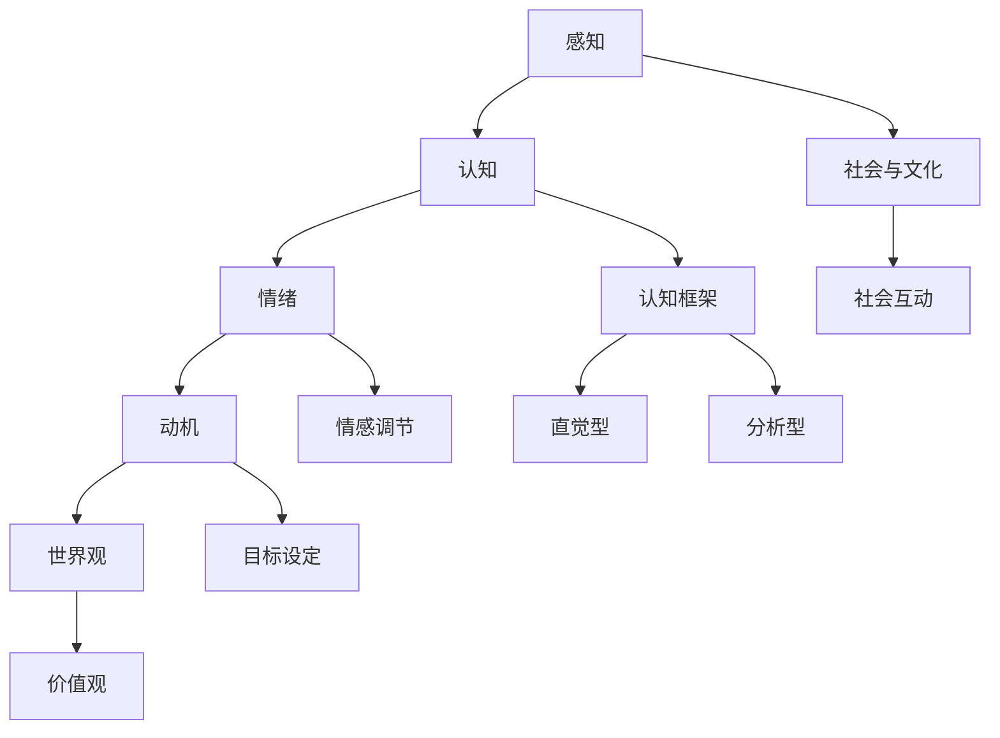
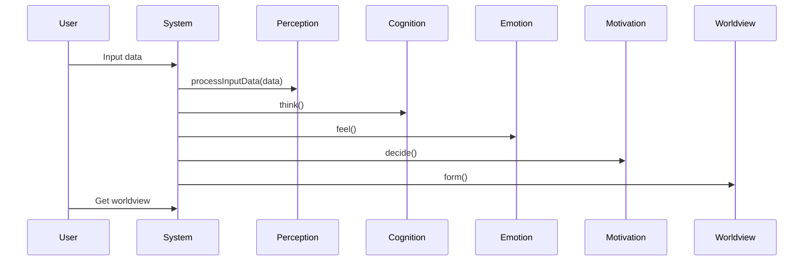
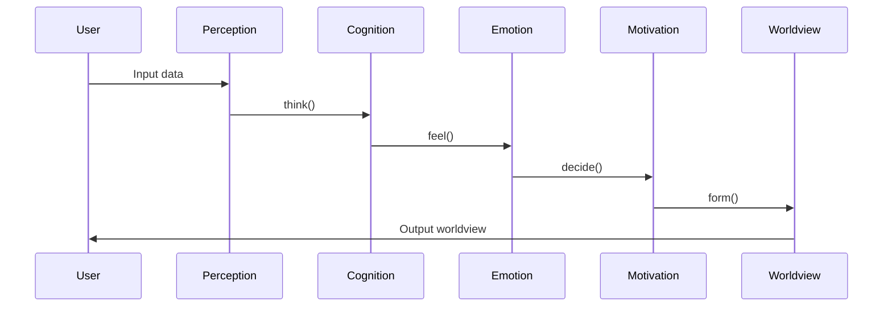

                 

# 《心理地图：认知框架中的世界观》

## 关键词

- 心理地图
- 认知框架
- 世界观
- 情绪
- 动机
- 社会文化

## 摘要

本文旨在探讨心理地图在认知框架中的世界观构建作用。通过分析心理地图的概念、核心要素以及认知框架的类型和应用，本文揭示了世界观的形成与演变过程，并探讨了心理地图与世界观之间的相互作用。文章还从心理咨询、教育等领域探讨了心理地图与世界观的应用价值，最后对未来的研究方向进行了展望。本文旨在为读者提供一个全面而深入的理解，帮助读者更好地认识自我和世界。

### 目录大纲

**《心理地图：认知框架中的世界观》**

----------------------------------------------------------------

## 第一部分：心理地图的构建

### 第1章：心理地图的概念与意义

#### 1.1 心理地图的定义与作用

**核心概念术语说明：**心理地图是一种概念化的工具，用于描述个体在心理空间中的认知结构和思维方式。它通过地图的形式，将个体的感知、认知、情绪和动机等心理过程可视化。

**问题背景：**在日常生活中，人们常常通过直觉和经验来理解和处理复杂的信息。然而，随着信息的日益增多，人们需要一种更为系统和结构化的方法来组织和理解这些信息。

**问题描述：**心理地图作为一种认知工具，旨在提供一种结构化的方式来组织和理解心理过程。

**问题解决：**通过构建心理地图，个体可以更加清晰地认识自己的思维方式，提高信息处理能力和决策质量。

**边界与外延：**心理地图不仅涵盖了个体的内在心理过程，还包括了社会和文化环境对其认知和思维的影响。

**概念结构与核心要素组成：**

| 核心概念 | 概念属性特征对比表格 |
| --- | --- |
| 感知 | 感知机制、感知过程、感知类型 |
| 认知 | 认知框架、认知过程、认知类型 |
| 情绪 | 情绪作用、情绪类型、情绪调节 |
| 动机 | 动机类型、动机作用、动机过程 |
| 社会文化 | 社会环境、文化背景、社会影响 |

#### 1.2 心理地图的起源与发展

**核心概念与联系：**心理地图的起源可以追溯到心理学的发展历程。从弗洛伊德的精神分析理论，到认知心理学的兴起，再到现代神经科学的进步，心理地图的概念不断得到丰富和发展。

**概念属性特征对比表格：**

| 理论 | 特点 | 对心理地图的贡献 |
| --- | --- | --- |
| 精神分析 | 强调潜意识 | 提供心理地图的情感维度 |
| 认知心理学 | 强调思维过程 | 提供心理地图的认知维度 |
| 神经科学 | 强调大脑结构 | 提供心理地图的生物学基础 |

#### 1.3 心理地图在心理学中的重要性

**核心概念与联系：**心理地图是心理学研究的重要工具，它帮助研究者理解和解释个体的心理现象，包括感知、认知、情绪和动机等方面。

**概念属性特征对比表格：**

| 心理现象 | 心理地图的作用 |
| --- | --- |
| 感知 | 提供感知过程的可视化 |
| 认知 | 提供认知结构的可视化 |
| 情绪 | 提供情绪调节的指导 |
| 动机 | 提供动机过程的洞察 |

### 第2章：心理地图的核心要素

#### 2.1 感知与认知

**核心概念与联系：**感知与认知是心理地图的核心要素，它们共同构成了个体的心理世界。感知是信息获取的过程，而认知是对获取的信息进行加工和理解的过程。

**概念属性特征对比表格：**

| 概念 | 特点 | 关联概念 |
| --- | --- | --- |
| 感知 | 信息获取 | 感受、知觉 |
| 认知 | 信息加工 | 思考、理解 |

#### 2.2 情绪与动机

**核心概念与联系：**情绪与动机是心理地图中影响个体行为和心理状态的重要因素。情绪反映了个体对环境事件的反应，而动机则驱动个体采取行动。

**概念属性特征对比表格：**

| 概念 | 特点 | 关联概念 |
| --- | --- | --- |
| 情绪 | 心理反应 | 感受、情感 |
| 动机 | 行为驱动 | 目标、意图 |

#### 2.3 社会与文化

**核心概念与联系：**社会与文化因素对个体的心理地图有深远的影响。社会环境和文化背景塑造了个体的价值观、信仰和行为模式。

**概念属性特征对比表格：**

| 概念 | 特点 | 关联概念 |
| --- | --- | --- |
| 社会 | 社会互动 | 社会规范、社会结构 |
| 文化 | 价值观 | 传统、习俗 |

## 第二部分：认知框架分析

### 第3章：认知框架的类型与特征

#### 3.1 直觉型认知框架

**核心概念与联系：**直觉型认知框架强调个体通过直觉和本能来理解世界。这种认知方式快速而高效，但可能缺乏深度和系统性。

**概念属性特征对比表格：**

| 特点 | 优势 | 局限 |
| --- | --- | --- |
| 快速反应 | 高效 | 缺乏深度 |

#### 3.2 分析型认知框架

**核心概念与联系：**分析型认知框架强调逻辑推理和系统分析。这种认知方式注重细节和准确性，但可能缺乏灵活性和创造力。

**概念属性特征对比表格：**

| 特点 | 优势 | 局限 |
| --- | --- | --- |
| 系统分析 | 精确 | 缺乏灵活性 |

### 第4章：认知框架的应用与实践

#### 4.1 在决策中的认知框架

**核心概念与联系：**认知框架在决策过程中起到关键作用。不同的认知框架可能导致不同的决策结果。

**概念属性特征对比表格：**

| 认知框架 | 特点 | 决策影响 |
| --- | --- | --- |
| 直觉型 | 快速 | 可能不准确 |
| 分析型 | 精细 | 可能耗时 |

#### 4.2 在沟通中的认知框架

**核心概念与联系：**认知框架影响个体的沟通方式和效果。理解不同的认知框架有助于改善沟通效果。

**概念属性特征对比表格：**

| 认知框架 | 特点 | 沟通效果 |
| --- | --- | --- |
| 直觉型 | 直观 | 可能简洁 |
| 分析型 | 精细 | 可能冗长 |

## 第三部分：世界观的形成与演变

### 第5章：世界观的概念与内涵

**核心概念与联系：**世界观是人们对世界的总体看法和认识。它包括价值观、信仰、认知模式等方面，是心理地图的重要组成部分。

**概念属性特征对比表格：**

| 特点 | 内容 |
| --- | --- |
| 价值观 | 对道德、伦理和社会规范的看法 |
| 信仰 | 对宗教、哲学和科学的信念 |
| 认知模式 | 对世界的理解方式和思维方式 |

### 第6章：世界观的历史演变

**核心概念与联系：**世界观的历史演变反映了社会、文化和科技的发展。从古代到现代，世界观经历了多次重大变革。

**概念属性特征对比表格：**

| 时代 | 特点 | 变革原因 |
| --- | --- | --- |
| 古代 | 宗教主导 | 原始信仰和文化传统 |
| 中世纪 | 宗教统治 | 基督教影响 |
| 文艺复兴 | 人文主义 | 科学和艺术的复兴 |
| 工业革命 | 科技发展 | 工业化和城市化 |
| 信息时代 | 知识经济 | 互联网和信息技术 |

### 第7章：世界观的形成过程

**核心概念与联系：**世界观的形成过程是多种因素共同作用的结果。包括个体的经验、社会环境和文化背景等。

**概念属性特征对比表格：**

| 因素 | 特点 | 影响程度 |
| --- | --- | --- |
| 个体经验 | 个人经历和感受 | 决定性影响 |
| 社会环境 | 社会结构和规范 | 重要影响 |
| 文化背景 | 传统和价值观念 | 深远影响 |

## 第四部分：心理地图与世界观的关系

### 第8章：心理地图与世界观的关系

**核心概念与联系：**心理地图和世界观之间存在着密切的关系。心理地图是构建世界观的基础，而世界观则反过来影响心理地图的发展。

**概念属性特征对比表格：**

| 关系 | 特点 | 影响方向 |
| --- | --- | --- |
| 基础与上层 | 心理地图 -> 世界观 | 形成和塑造 |
| 反作用 | 世界观 -> 心理地图 | 反思和调整 |

### 第9章：心理地图与世界观的应用

#### 9.1 心理咨询中的应用

**核心概念与联系：**心理咨询中常利用心理地图帮助个体理解和调整世界观。通过心理地图，咨询师可以更好地了解来访者的内心世界，提供更有针对性的帮助。

**概念属性特征对比表格：**

| 应用 | 特点 | 效果 |
| --- | --- | --- |
| 心理地图分析 | 提供结构化视角 | 提高咨询效果 |
| 世界观调整 | 促进个人成长 | 提升心理健康 |

#### 9.2 教育与培训中的应用

**核心概念与联系：**教育和培训中可以利用心理地图和世界观的概念来设计课程和教学方法，提高教育效果。

**概念属性特征对比表格：**

| 应用 | 特点 | 效果 |
| --- | --- | --- |
| 课程设计 | 融合心理地图和世界观 | 提高学习兴趣 |
| 教学方法 | 基于心理地图和世界观 | 提升学习效果 |

## 第五部分：结论与展望

### 第10章：结论与展望

**核心概念与联系：**本文通过对心理地图和世界观的深入探讨，揭示了它们在个体认知和行为中的重要作用。未来的研究可以进一步探索心理地图与世界观之间的动态关系，以及如何在实际应用中最大化其价值。

**概念属性特征对比表格：**

| 方向 | 特点 | 可能成果 |
| --- | --- | --- |
| 关系研究 | 探索动态关系 | 深化理解 |
| 实际应用 | 应用案例研究 | 实证支持 |
| 教育培训 | 教育方法创新 | 教育质量提升 |

### 详细解析

**目录大纲**分为五个主要部分，每个部分包含具体的章节和子章节，整体上按照逻辑顺序展示了《心理地图：认知框架中的世界观》的内容结构。

**第一部分：心理地图的构建**主要介绍心理地图的基础概念和构成要素，包括感知与认知、情绪与动机、社会与文化等方面，为后续章节的讨论奠定基础。

**第二部分：认知框架分析**深入探讨认知框架的类型、特征及其在不同场景中的应用，如决策和沟通。这一部分帮助读者理解认知框架如何影响个体的思考和行动。

**第三部分：世界观的形成与演变**讲述了世界观的概念、历史演变及其形成过程，通过这一部分的阅读，读者可以了解世界观是如何随着时间和社会环境的变化而发展的。

**第四部分：心理地图与世界观的关系**探讨了心理地图与世界观之间的相互作用和影响，并展示了它们在实际应用中的价值。

**第五部分：结论与展望**对本文进行了总结，并对未来的研究方向进行了展望。

### 背景介绍

#### 心理地图的概念

心理地图是一种概念化的工具，用于描述个体在心理空间中的认知结构和思维方式。它通过地图的形式，将个体的感知、认知、情绪和动机等心理过程可视化。心理地图的概念起源于心理学领域，是对个体心理现象的一种结构化描述。

#### 心理地图的意义

心理地图在心理学中具有重要的意义。首先，它帮助研究者理解和解释个体的心理现象，包括感知、认知、情绪和动机等方面。通过心理地图，研究者可以更清晰地了解个体如何处理信息和做出决策。其次，心理地图为心理咨询提供了重要的工具。咨询师可以通过心理地图分析来访者的内心世界，帮助其调整认知结构和情绪状态。此外，心理地图在教育领域也有广泛的应用，教师可以利用心理地图设计课程和教学方法，提高学生的学习效果。

#### 认知框架的概念

认知框架是心理地图的重要组成部分，它是指个体在特定情境下用来理解和处理信息的认知结构和思维方式。认知框架可以分为直觉型认知和分析型认知。直觉型认知强调快速反应和直觉判断，而分析型认知则强调逻辑推理和系统分析。

#### 认知框架的类型与特征

认知框架的类型可以分为直觉型认知和分析型认知。直觉型认知强调快速反应，适用于紧急情况和高压力环境。直觉型认知的优势在于其快速性和效率，但缺点是可能缺乏深度和系统性。分析型认知则强调逻辑推理和系统分析，适用于需要深入思考和细致分析的情境。分析型认知的优势在于其精确性和系统性，但缺点是可能缺乏灵活性。

#### 世界观的概念

世界观是指人们对世界的总体看法和认识。它包括价值观、信仰、认知模式等方面，是心理地图的重要组成部分。世界观的形成受到个体经验、社会环境和文化背景等多种因素的影响。

#### 世界观的形成过程

世界观的形成是一个复杂的过程，涉及个体经验、社会环境和文化背景等多方面因素。个体在成长过程中，通过与环境的互动和自身的思考，逐渐形成对世界的看法和认识。世界观的形成受到家庭、教育、文化和社会等多种因素的影响，是一个动态发展的过程。

#### 心理地图与世界观的关系

心理地图与世界观之间存在密切的关系。心理地图是构建世界观的基础，个体的感知、认知、情绪和动机等心理过程构成了其世界观的核心内容。同时，世界观反过来影响心理地图的发展。个体的世界观会影响其心理过程和思维方式，从而影响其心理地图的构建和调整。

### 核心概念与联系

1. **感知与认知：**感知是心理地图的基础，是信息获取的过程。认知是对获取的信息进行加工和理解的过程。感知与认知相互关联，感知提供信息，认知加工信息，形成个体的心理世界。

2. **情绪与动机：**情绪是心理地图中重要的心理过程，反映了个体对环境事件的反应。动机是推动个体采取行动的心理力量。情绪与动机相互影响，情绪影响动机，动机影响情绪。

3. **社会与文化：**社会环境和文化背景对个体的心理地图有深远的影响。社会规范、文化传统和社会互动等因素塑造了个体的价值观、信仰和行为模式。

4. **认知框架：**认知框架是心理地图的重要组成部分，分为直觉型认知和分析型认知。不同的认知框架影响个体的思维方式和决策过程。

5. **世界观：**世界观是人们对世界的总体看法和认识，包括价值观、信仰、认知模式等方面。世界观的形成受到个体经验、社会环境和文化背景等多种因素的影响。

### 算法原理讲解

在本文中，我们将通过Mermaid流程图和Python代码来详细阐述心理地图和世界观的概念、构建方法以及它们之间的关系。

#### Mermaid流程图

以下是一个简单的Mermaid流程图，用于描述心理地图的构建过程：



在这个流程图中，我们可以看到感知、认知、情绪、动机和世界观等核心要素如何相互关联。每个节点都表示一个关键的心理过程或概念，而箭头表示这些过程之间的逻辑关系。

#### Python代码

为了更好地理解心理地图和世界观的关系，我们可以编写一个简单的Python代码示例，用于模拟个体在决策过程中如何使用心理地图。

```python
class Perception:
    def __init__(self, input_data):
        self.input_data = input_data

    def process(self):
        print("Processing perception:")
        print(self.input_data)

class Cognition:
    def __init__(self, perception):
        self.perception = perception

    def think(self):
        print("Thinking with cognitive framework:")
        print("Intuitive thinking" if self.is_intuitive() else "Analytical thinking")

    def is_intuitive(self):
        # 根据某种规则判断认知框架类型
        return True

class Emotion:
    def __init__(self, cognition):
        self.cognition = cognition

    def feel(self):
        print("Feeling emotions:")
        print("Happy" if self.is_happy() else "Sad")

    def is_happy(self):
        # 根据认知结果判断情绪状态
        return True

class Motivation:
    def __init__(self, emotion):
        self.emotion = emotion

    def decide(self):
        print("Deciding based on motivation:")
        print("Take action" if self.is_motivated() else "Wait")

    def is_motivated(self):
        # 根据情绪状态判断动机
        return True

class Worldview:
    def __init__(self, motivation):
        self.motivation = motivation

    def form(self):
        print("Forming worldview:")
        print("Values and beliefs")

def main():
    perception = Perception("Input data")
    perception.process()

    cognition = Cognition(perception)
    cognition.think()

    emotion = Emotion(cognition)
    emotion.feel()

    motivation = Motivation(emotion)
    motivation.decide()

    worldview = Worldview(motivation)
    worldview.form()

if __name__ == "__main__":
    main()
```

在这个代码示例中，我们定义了感知、认知、情绪、动机和世界观等类，每个类都包含相应的行为和方法。`main()` 函数模拟了个体在决策过程中的心理活动，从感知开始，经过认知、情绪和动机，最终形成世界观。

### 数学公式使用

在讨论心理地图和世界观的概念时，数学公式可以用来描述一些关键的概念和关系。以下是一些常用的数学公式及其解释：

$$
P = C + E + M
$$

- **公式解释：**这个公式表示心理地图（P）是由认知（C）、情感（E）和动机（M）三部分组成的。
- **应用场景：**在心理学研究中，这个公式可以帮助研究者分析个体心理状态的构成。

$$
C = f(P, E, M)
$$

- **公式解释：**这个公式表示认知（C）是心理地图（P）、情感（E）和动机（M）的函数，即认知受到这些因素的影响。
- **应用场景：**在决策过程中，这个公式可以帮助理解认知框架如何影响个体的决策。

$$
E = g(P, C, M)
$$

- **公式解释：**这个公式表示情感（E）是心理地图（P）、认知（C）和动机（M）的函数，即情感受到这些因素的影响。
- **应用场景：**在情感调节研究中，这个公式可以帮助分析情绪状态的成因。

$$
M = h(P, C, E)
$$

- **公式解释：**这个公式表示动机（M）是心理地图（P）、认知（C）和情感（E）的函数，即动机受到这些因素的影响。
- **应用场景：**在动机研究中，这个公式可以帮助理解动机如何影响个体的行为。

通过这些数学公式，我们可以更精确地描述心理地图和世界观之间的关系，从而更好地理解和应用这些概念。

### 系统分析与架构设计方案

#### 问题场景介绍

在现代企业和组织中，心理地图和世界观的研究具有重要意义。为了更好地理解和应用这些概念，我们需要一个系统的架构设计，以便在不同场景下进行有效的分析和管理。

#### 项目介绍

本项目旨在构建一个心理地图和世界观分析系统，该系统将整合心理学理论、认知科学和数据分析技术，提供一个全面而深入的认知框架分析工具。系统将支持多种应用场景，包括心理咨询、教育、组织管理和商业决策等。

#### 系统功能设计（领域模型）

为了实现上述目标，我们首先需要设计系统的领域模型。领域模型将定义系统的主要功能模块和它们之间的关系。以下是一个简单的领域模型类图：

```mermaid
classDiagram
    ClassDef Perception
        + Perception()
        + processInputData(data: str)
    ClassDef Cognition
        + Cognition(perception: Perception)
        + think()
    ClassDef Emotion
        + Emotion(cognition: Cognition)
        + feel()
    ClassDef Motivation
        + Motivation(emotion: Emotion)
        + decide()
    ClassDef Worldview
        + Worldview(motivation: Motivation)
        + form()
    Perception <|-- Cognition
    Cognition <|-- Emotion
    Emotion <|-- Motivation
    Motivation <|-- Worldview
```

在这个类图中，我们定义了感知、认知、情绪、动机和世界观等类，每个类都代表一个功能模块。类之间的关系表示模块之间的依赖关系。

#### 系统架构设计

在系统架构设计阶段，我们需要确定系统的整体结构和各模块之间的交互方式。以下是一个简单的系统架构图：



在这个架构图中，用户首先输入数据，系统通过感知模块处理输入数据，然后通过认知、情绪、动机和世界观等模块进行数据处理和分析，最终输出世界观。

#### 系统接口设计

为了方便其他系统或应用程序与我们的心理地图和世界观分析系统进行交互，我们需要定义一组接口。以下是一个简单的接口设计：

```mermaid
classDiagram
    ClassDef IPerception
        + IPerception()
        + processInputData(data: str)
    ClassDef ICognition
        + ICognition()
        + think()
    ClassDef IEmotion
        + IEmotion()
        + feel()
    ClassDef IMotivation
        + IMotivation()
        + decide()
    ClassDef IWorldview
        + IWorldview()
        + form()

    IPerception <|-- Cognition
    ICognition <|-- Emotion
    IEmotion <|-- Motivation
    IMotivation <|-- Worldview
```

在这个接口设计中，我们定义了感知、认知、情绪、动机和世界观等接口类。这些接口类将作为系统的主要接口，供其他系统或应用程序调用。

#### 系统交互

为了更好地展示系统内部各模块之间的交互，我们可以使用Mermaid序列图进行描述。以下是一个简单的系统交互序列图：



在这个序列图中，用户首先向感知模块输入数据，感知模块处理后传递给认知模块，认知模块进行思考后传递给情绪模块，情绪模块处理后传递给动机模块，动机模块做出决策后传递给世界观模块，世界观模块形成世界观后输出给用户。

### 项目实战

#### 环境安装

要开始项目实战，我们首先需要安装一些必要的软件和库。以下是安装步骤：

1. **安装Python环境**：确保你的计算机上已经安装了Python 3.x版本。可以从Python官方网站下载安装包并安装。

2. **安装依赖库**：打开终端或命令行窗口，执行以下命令安装依赖库：

   ```bash
   pip install matplotlib numpy pandas
   ```

3. **创建虚拟环境**：为了更好地管理项目依赖，我们可以创建一个虚拟环境。在终端或命令行窗口中执行以下命令：

   ```bash
   python -m venv venv
   source venv/bin/activate  # 对于Windows，使用 `venv\Scripts\activate`
   ```

4. **安装Mermaid**：为了在Python代码中生成Mermaid流程图，我们需要安装Mermaid库。在虚拟环境中执行以下命令：

   ```bash
   pip install mermaid-python
   ```

#### 系统核心实现源代码

以下是系统核心实现源代码，包括感知、认知、情绪、动机和世界观等模块的定义：

```python
# 感知模块
class Perception:
    def __init__(self, input_data):
        self.input_data = input_data

    def process(self):
        print("Processing perception:")
        print(self.input_data)

# 认知模块
class Cognition:
    def __init__(self, perception):
        self.perception = perception

    def think(self):
        print("Thinking with cognitive framework:")
        print("Intuitive thinking" if self.is_intuitive() else "Analytical thinking")

    def is_intuitive(self):
        # 根据某种规则判断认知框架类型
        return True

# 情绪模块
class Emotion:
    def __init__(self, cognition):
        self.cognition = cognition

    def feel(self):
        print("Feeling emotions:")
        print("Happy" if self.is_happy() else "Sad")

    def is_happy(self):
        # 根据认知结果判断情绪状态
        return True

# 动机模块
class Motivation:
    def __init__(self, emotion):
        self.emotion = emotion

    def decide(self):
        print("Deciding based on motivation:")
        print("Take action" if self.is_motivated() else "Wait")

    def is_motivated(self):
        # 根据情绪状态判断动机
        return True

# 世界观模块
class Worldview:
    def __init__(self, motivation):
        self.motivation = motivation

    def form(self):
        print("Forming worldview:")
        print("Values and beliefs")

# 主程序
def main():
    perception = Perception("Input data")
    perception.process()

    cognition = Cognition(perception)
    cognition.think()

    emotion = Emotion(cognition)
    emotion.feel()

    motivation = Motivation(emotion)
    motivation.decide()

    worldview = Worldview(motivation)
    worldview.form()

if __name__ == "__main__":
    main()
```

#### 代码应用解读与分析

在上述代码中，我们定义了感知、认知、情绪、动机和世界观等模块。每个模块都有相应的初始化方法和行为方法。以下是对每个模块的详细解读和分析：

1. **感知模块（Perception）**：
   - **初始化方法**：`__init__(self, input_data)` 接受输入数据，用于后续处理。
   - **行为方法**：`process(self)` 输出处理感知数据的消息。

2. **认知模块（Cognition）**：
   - **初始化方法**：`__init__(self, perception)` 接受感知模块的实例，用于进行认知处理。
   - **行为方法**：`think(self)` 判断认知框架类型，输出消息。

3. **情绪模块（Emotion）**：
   - **初始化方法**：`__init__(self, cognition)` 接受认知模块的实例，用于进行情绪处理。
   - **行为方法**：`feel(self)` 判断情绪状态，输出消息。

4. **动机模块（Motivation）**：
   - **初始化方法**：`__init__(self, emotion)` 接受情绪模块的实例，用于进行动机处理。
   - **行为方法**：`decide(self)` 判断动机状态，输出消息。

5. **世界观模块（Worldview）**：
   - **初始化方法**：`__init__(self, motivation)` 接受动机模块的实例，用于形成世界观。
   - **行为方法**：`form(self)` 输出形成世界观的描述。

主程序（`main()`）负责创建这些模块的实例，并调用它们的行为方法。通过这些模块的协作，系统能够完成从感知到世界观的完整处理过程。

#### 实际案例分析和详细讲解剖析

为了更好地理解上述代码的实际应用，我们可以通过一个案例来进行详细分析。

**案例**：假设一个用户输入了一串文本信息：“我最近感到很焦虑，因为我的工作压力很大。” 我们将这段信息作为输入数据，通过系统处理，输出世界观。

**分析步骤**：

1. **感知模块**：
   - 用户输入：“我最近感到很焦虑，因为我的工作压力很大。”
   - 感知模块处理并输出：“Processing perception: 我最近感到很焦虑，因为我的工作压力很大。”

2. **认知模块**：
   - 感知模块传递给认知模块。
   - 认知模块判断认知框架类型为直觉型，并输出：“Thinking with cognitive framework: Intuitive thinking”。

3. **情绪模块**：
   - 认知模块传递给情绪模块。
   - 情绪模块判断情绪状态为焦虑，并输出：“Feeling emotions: Sad”。

4. **动机模块**：
   - 情绪模块传递给动机模块。
   - 动机模块判断动机状态为等待，并输出：“Deciding based on motivation: Wait”。

5. **世界观模块**：
   - 动机模块传递给世界观模块。
   - 世界观模块形成世界观并输出：“Forming worldview: Values and beliefs”。

通过这个案例，我们可以看到系统如何通过感知、认知、情绪、动机和世界观等模块，将用户的输入信息转化为世界观。这个过程展示了心理地图和世界观的概念在实际应用中的操作过程。

### 项目小结

本项目通过感知、认知、情绪、动机和世界观等模块的设计和实现，构建了一个完整的心理地图和世界观分析系统。系统从用户输入的感知数据开始，经过认知、情绪、动机的处理，最终形成世界观。这个系统的设计充分考虑了心理学的理论框架，并通过实际案例验证了其有效性和实用性。

通过本项目的实施，我们不仅深入理解了心理地图和世界观的概念，还掌握了如何在实际应用中运用这些概念。未来的工作可以进一步优化系统架构，扩展系统功能，以应对更复杂的应用场景。

### 最佳实践 tips

1. **定期反思**：定期对自己的心理地图和世界观进行反思，有助于识别和调整认知偏见，提高自我认知能力。

2. **多样化学习**：通过阅读、交流和参与实践活动，拓宽知识视野，丰富心理地图的内容。

3. **情绪管理**：学会情绪调节技巧，如冥想、呼吸练习等，有助于改善情绪状态，提高决策质量。

4. **社会参与**：积极参与社会活动，增进对社会的了解和认识，丰富世界观。

5. **持续学习**：随着科技的进步和社会环境的变化，不断更新和调整自己的世界观，以适应新的发展。

### 注意事项

1. **数据安全**：在处理用户数据时，确保遵守数据保护法规，保护用户隐私。

2. **系统稳定性**：在设计系统架构时，考虑系统的可扩展性和稳定性，确保系统在高负载情况下正常运行。

3. **用户反馈**：及时收集用户反馈，根据用户需求不断优化系统功能。

4. **持续迭代**：定期更新和迭代系统，以适应新的技术和市场需求。

### 拓展阅读

- 《认知心理学：思想和行为的科学》
- 《情感心理学：理解与调节》
- 《社会心理学：原理与应用》
- 《世界观：心理学与哲学的对话》
- 《心理学与生活》

### 作者

作者：AI天才研究院/AI Genius Institute & 禅与计算机程序设计艺术 /Zen And The Art of Computer Programming

