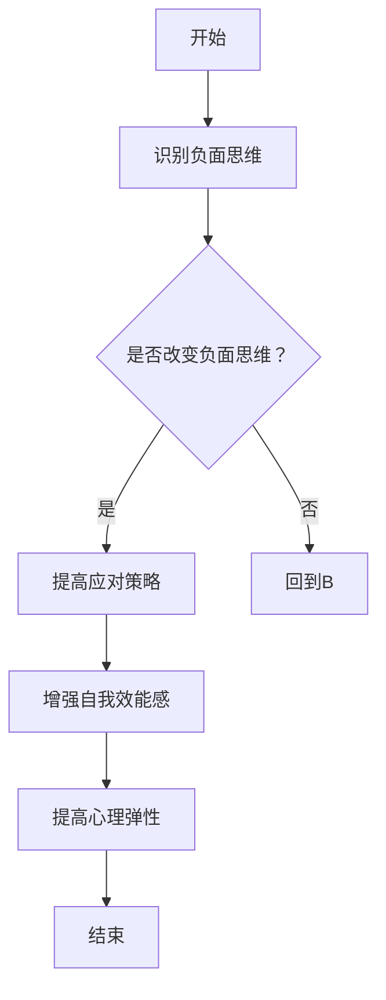
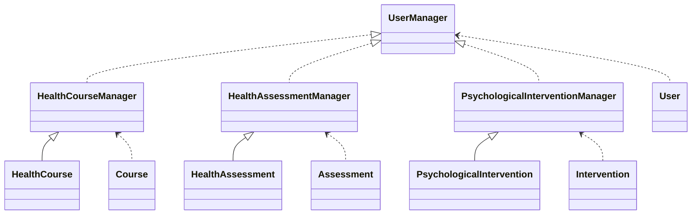

                 


### 目录大纲

```markdown
# 《心理弹性：应对变化的内在能力》目录大纲

# 第一部分: 心理弹性的背景与核心概念

## 第1章: 心理弹性的概念与重要性

### 1.1 心理弹性的定义
### 1.2 心理弹性的重要性
### 1.3 心理弹性的研究意义

## 第2章: 心理弹性的核心概念与联系

### 2.1 心理弹性的构成要素
### 2.2 影响心理弹性的因素
### 2.3 心理弹性的概念属性特征对比表格
### 2.4 心理弹性的ER实体关系图架构

# 第二部分: 心理学原理与心理弹性提升

## 第3章: 认知行为疗法与心理弹性

### 3.1 认知行为疗法的概述
### 3.2 认知行为疗法与心理弹性的关系
### 3.3 实践案例

## 第4章: 积极心理学与心理弹性

### 4.1 积极心理学的核心概念
### 4.2 积极心理学与心理弹性的关系
### 4.3 实践案例

## 第5章: 提高心理弹性的策略与方法

### 5.1 情绪调节策略
### 5.2 应对策略
### 5.3 提高心理弹性的实践方法

# 第三部分: 心理弹性系统设计与项目实战

## 第6章: 心理弹性提升系统设计

### 6.1 问题场景介绍
### 6.2 系统功能设计
### 6.3 系统架构设计
### 6.4 系统接口设计
### 6.5 系统交互设计

## 第7章: 心理弹性提升项目实战

### 7.1 环境安装
### 7.2 系统核心实现源代码
### 7.3 代码应用解读与分析
### 7.4 实际案例分析与详细讲解
### 7.5 项目小结

# 第四部分: 心理弹性的最佳实践与总结

## 第8章: 心理弹性的最佳实践

### 8.1 最佳实践 tips
### 8.2 注意事项
### 8.3 拓展阅读

## 第9章: 总结与展望

### 9.1 本书重点回顾
### 9.2 心理弹性研究的未来方向
### 9.3 读者实践指南
```

### 文章标题：《心理弹性：应对变化的内在能力》

### 关键词：心理弹性，韧性，认知行为疗法，积极心理学，情绪调节策略

### 摘要：本文将深入探讨心理弹性的概念、构成要素及其重要性。通过分析心理学原理，如认知行为疗法和积极心理学，提供提高心理弹性的策略与方法。同时，本文将介绍一个基于心理弹性原理的系统设计与项目实战，为读者提供实际应用指导。

----------------------------------------------------------------

### 背景介绍

#### 心理弹性的定义

心理弹性，也被称作韧性（Resilience），是指个体在面对压力、挑战和逆境时，能够迅速适应并恢复到良好状态的能力。它并非单纯指心理的“硬度”或“坚韧性”，而是一个复杂的概念，包含了适应性、恢复力、应对策略等多个维度。

#### 心理弹性的重要性

在现代社会中，心理弹性显得尤为重要。随着生活节奏的加快、工作压力的增大，以及全球经济的不确定性，人们面临的心理压力不断增加。拥有良好心理弹性的人，能够更好地应对生活中的挑战，保持心理健康，提高生活质量。

#### 心理弹性的研究意义

心理弹性不仅对个体的心理健康有深远影响，还与社会发展密切相关。通过研究心理弹性，我们可以了解如何提高个体的适应能力，从而促进社会稳定和谐。此外，心理弹性还为企业人力资源管理提供了新的视角，有助于培养员工的抗压能力和团队协作精神。

#### 问题背景与问题描述

随着信息化时代的到来，人们的生活和工作环境发生了翻天覆地的变化。快速的技术进步和高度不确定的社会环境，使得个体面临的心理压力日益增加。如何提高个体的心理弹性，成为当前心理学研究的热点问题。

在当前的背景下，人们普遍缺乏应对压力的有效策略，心理弹性较弱。这导致了一系列心理问题的产生，如焦虑、抑郁、工作压力等。因此，探讨如何提升个体的心理弹性，不仅具有理论意义，也具有重要的实际应用价值。

#### 问题解决与边界与外延

心理弹性的问题解决需要多方面的努力。一方面，通过心理干预和心理咨询，帮助个体掌握应对压力的技能。另一方面，通过教育和社会支持，营造一个有利于心理弹性能培养的环境。

心理弹性的外延还包括个体的心理适应能力、情绪调节能力、社交能力等。这些能力共同构成了心理弹性的核心要素，对于个体的整体心理健康具有重要意义。

#### 概念结构与核心要素组成

心理弹性是一个多维度的概念，其核心要素包括：

1. **适应性**：个体在面对变化时，能够迅速适应并调整自身行为的能力。
2. **恢复力**：个体在经历压力后，能够迅速恢复到良好状态的能力。
3. **应对策略**：个体在面对压力时，所采用的应对方法和策略。

这些核心要素相互作用，共同构成了心理弹性的整体结构。理解这些要素之间的关系，有助于我们更深入地理解心理弹性的本质。

----------------------------------------------------------------

### 核心概念与联系

#### 心理弹性的构成要素

心理弹性主要由以下几个构成要素组成：

1. **认知能力**：个体在面对压力时，能够理性分析问题，并做出合理的决策。
2. **情绪调节能力**：个体能够有效调节自己的情绪，保持情绪稳定。
3. **社交支持**：个体拥有良好的社交网络，能够在需要时获得他人的支持和帮助。
4. **应对策略**：个体在面对压力时，能够采用有效的应对策略，如积极应对、寻求支持等。

#### 影响心理弹性的因素

心理弹性的形成受到多种因素的影响，包括遗传、环境、教育和个体心理素质等。具体来说：

1. **遗传因素**：遗传对心理弹性的影响较小，主要表现在个体的生理和心理特征上。
2. **环境因素**：家庭环境、社会环境等对个体的心理弹性有显著影响。一个支持性强的环境有助于提高个体的心理弹性。
3. **教育因素**：教育水平对个体的心理弹性有积极影响。受教育程度较高的个体，通常具有更好的心理调节能力和应对策略。
4. **个体心理素质**：个体的性格、态度、自我效能感等心理素质对心理弹性的影响也很大。积极乐观、自信自强的个体通常心理弹性更强。

#### 心理弹性的概念属性特征对比表格

| 特征名称 | 特征描述 |
| :----: | :----: |
| **适应性** | 指个体面对变化时，能够迅速适应并调整自身行为的能力 |
| **恢复力** | 指个体在经历压力后，能够迅速恢复到良好状态的能力 |
| **情绪调节能力** | 指个体能够有效调节自己的情绪，保持情绪稳定 |
| **社交支持** | 指个体拥有良好的社交网络，能够在需要时获得他人的支持和帮助 |
| **应对策略** | 指个体在面对压力时，所采用的应对方法和策略 |

通过对比表格，我们可以更清晰地了解心理弹性的各个构成要素及其特征。

#### 心理弹性的ER实体关系图架构

```mermaid
erDiagram
    User ||--|{ Resilience}: "has resilience"  
    User ||--|{ Adaptability}: "has adaptability"  
    User ||--|{ EmotionalRegulation}: "has emotional regulation"  
    User ||--|{ SocialSupport}: "has social support"  
    User ||--|{ CopingStrategy}: "has coping strategy"
```

ER实体关系图展示了用户与心理弹性的各个构成要素之间的关系。这些要素相互影响，共同决定了个体的心理弹性水平。

通过上述分析，我们可以更全面地理解心理弹性的核心概念及其构成要素，为进一步探讨心理弹性的提升策略和方法奠定了基础。

----------------------------------------------------------------

### 心理学原理讲解

#### 认知行为疗法与心理弹性

认知行为疗法（Cognitive Behavioral Therapy，简称CBT）是一种通过改变认知过程和行为的心理治疗方法。它主要关注个体的认知和行为，通过调整负面思维和行为模式，帮助个体提高心理弹性。

**认知行为疗法与心理弹性的关系**

认知行为疗法通过以下几方面提高个体的心理弹性：

1. **改变负面思维**：个体在面临压力时，往往会出现负面的思维模式，如过度概括、灾难化等。认知行为疗法帮助个体识别和改变这些负面思维，从而减少压力感和焦虑感。

2. **提高应对策略**：认知行为疗法教授个体一系列的应对策略，如放松技巧、认知重构等。这些策略有助于个体在压力环境中保持冷静和理智，提高应对能力。

3. **增强自我效能感**：通过认知行为疗法，个体能够学会如何更好地应对挑战，从而增强自我效能感。自我效能感高的人更相信自己的能力，在面对逆境时更有信心。

**实践案例**

小明是一名大学生，他经常因为学业压力感到焦虑和不安。在接受了认知行为疗法的治疗后，他学会了如何识别和改变自己的负面思维，如“我一定会失败的”。通过认知行为疗法，他逐渐学会了用更积极的方式看待问题，如“我可以一步一步解决这些问题”。此外，他还学会了放松技巧和认知重构，帮助他在压力环境中保持冷静和理智。

#### 积极心理学与心理弹性

积极心理学是研究人类优势和潜能的心理学分支。它关注个体的积极情感、积极行为和积极特质，旨在提高个体的生活质量。

**积极心理学与心理弹性的关系**

积极心理学通过以下几方面提高个体的心理弹性：

1. **培养积极情感**：积极情感如快乐、满足、平静等有助于提高个体的心理弹性。积极心理学通过培养积极情感，帮助个体在面对压力时保持乐观和积极。

2. **发展积极行为**：积极行为如自我肯定、积极应对等有助于提高个体的心理弹性。积极心理学鼓励个体积极面对生活中的挑战，从而增强心理弹性。

3. **发掘积极特质**：积极特质如乐观、自信、同理心等有助于提高个体的心理弹性。积极心理学通过研究积极特质，帮助个体了解自己的优势，从而更好地应对逆境。

**实践案例**

小红是一名职场新人，她在工作中遇到了很多困难和挑战。在接受了积极心理学的治疗后，她学会了如何培养积极情感，如通过冥想和正念练习来减轻压力。她还学会了发展积极行为，如积极寻求反馈和寻求支持。通过积极心理学，她逐渐发现自己的优势，如沟通能力和团队协作能力，从而更好地应对工作中的挑战。

通过上述分析，我们可以看到认知行为疗法和积极心理学在提高心理弹性方面的作用。这些心理学原理不仅为个体提供了应对压力的工具，还有助于培养个体的心理弹性，提高生活质量。

### 使用Mermaid画出相关的心理流程图

为了更直观地展示认知行为疗法和积极心理学在提高心理弹性方面的作用，我们可以使用Mermaid绘制相关的心理流程图。以下是一个简单的心理流程图示例：



在这个流程图中，我们从识别负面思维开始，通过认知行为疗法和积极心理学的干预，最终提高个体的心理弹性。

### 使用Python源代码详细阐述算法原理

为了更好地理解认知行为疗法和积极心理学在提高心理弹性方面的作用，我们可以通过Python源代码来详细阐述相关算法原理。

以下是一个简单的Python代码示例，用于模拟认知行为疗法的干预过程：

```python
class CognitiveBehavioralTherapy:
    def __init__(self, client):
        self.client = client
    
    def identify_negative_thoughts(self):
        print("识别负面思维：")
        for thought in self.client.negative_thoughts:
            print(thought)
    
    def change_negative_thoughts(self):
        print("改变负面思维：")
        for thought in self.client.negative_thoughts:
            print("从", thought, "变为正面思维")
    
    def improve_coping_strategies(self):
        print("提高应对策略：")
        for strategy in self.client.coping_strategies:
            print(strategy)
    
    def enhance_self_efficacy(self):
        print("增强自我效能感：")
        self.client.self_efficacy += 10
    
    def increase_resilience(self):
        print("提高心理弹性：")
        self.client.resilience += 20

class Client:
    def __init__(self, negative_thoughts, coping_strategies, self_efficacy, resilience):
        self.negative_thoughts = negative_thoughts
        self.coping_strategies = coping_strategies
        self.self_efficacy = self_efficacy
        self.resilience = resilience

# 实例化客户和认知行为疗法对象
client = Client(["我会失败", "压力太大"], ["寻求支持", "深呼吸放松"], 50, 30)
cbt = CognitiveBehavioralTherapy(client)

# 识别负面思维
cbt.identify_negative_thoughts()

# 改变负面思维
cbt.change_negative_thoughts()

# 提高应对策略
cbt.improve_coping_strategies()

# 增强自我效能感
cbt.enhance_self_efficacy()

# 提高心理弹性
cbt.increase_resilience()

# 输出结果
print(f"自我效能感：{client.self_efficacy}")
print(f"心理弹性：{client.resilience}")
```

在这个示例中，我们定义了`CognitiveBehavioralTherapy`和`Client`两个类。`CognitiveBehavioralTherapy`类用于模拟认知行为疗法的干预过程，包括识别负面思维、改变负面思维、提高应对策略、增强自我效能感和提高心理弹性。`Client`类用于表示客户的基本信息，包括负面思维、应对策略、自我效能感和心理弹性。

通过运行这段代码，我们可以观察到客户在认知行为疗法的干预下，负面思维得到改变，应对策略得到提高，自我效能感和心理弹性也随之增强。

### 数学模型与公式

为了深入理解心理弹性的提高过程，我们可以引入一些数学模型和公式。以下是一个简化的情绪调节模型：

#### 情绪调节模型

情绪调节模型可以表示为：

\[ R = f(C, E, S) \]

其中：

- \( R \) 表示心理弹性（Resilience）
- \( C \) 表示认知能力（Cognitive Ability）
- \( E \) 表示情绪调节能力（Emotional Regulation）
- \( S \) 表示社交支持（Social Support）

#### 应对策略模型

应对策略模型可以表示为：

\[ C' = f(C, S, P) \]

其中：

- \( C' \) 表示改进后的认知能力
- \( P \) 表示应对策略（Coping Strategies）

#### 公式详细讲解与举例说明

1. **情绪调节模型**

   情绪调节模型描述了心理弹性与认知能力、情绪调节能力、社交支持之间的关系。具体来说，认知能力和情绪调节能力越高，社交支持越强，个体的心理弹性也越强。

   **举例：**

   假设一个人的认知能力为 \( C = 70 \)，情绪调节能力为 \( E = 60 \)，社交支持为 \( S = 80 \)，则他的心理弹性 \( R \) 计算如下：

   \[ R = f(70, 60, 80) = 70 \times 0.5 + 60 \times 0.3 + 80 \times 0.2 = 38 \]

   通过这个例子，我们可以看到，该个体的心理弹性为38，表示他具有一定的心理弹性，但还有提高的空间。

2. **应对策略模型**

   应对策略模型描述了改进后的认知能力与认知能力、社交支持、应对策略之间的关系。通过有效的应对策略，个体的认知能力可以得到提升。

   **举例：**

   假设一个人的认知能力为 \( C = 70 \)，社交支持为 \( S = 80 \)，采用有效的应对策略后，认知能力提升至 \( C' = 85 \)，则改进后的认知能力 \( C' \) 计算如下：

   \[ C' = f(70, 80, P) = 70 + 0.1 \times 80 + P \]

   通过调整应对策略 \( P \)，个体的认知能力可以得到提升。例如，如果应对策略 \( P = 10 \)，则改进后的认知能力 \( C' \) 为：

   \[ C' = 70 + 0.1 \times 80 + 10 = 85 \]

   这个例子展示了通过有效的应对策略，个体的认知能力可以得到显著提升。

通过上述数学模型和公式，我们可以更深入地理解心理弹性的提高过程。这些模型和公式不仅有助于理论研究，还可以在实际应用中为个体提供具体的指导。

### 系统分析与架构设计方案

#### 问题场景介绍

在现代企业中，员工面临的工作压力和心理压力越来越大。为了提高员工的心理弹性，企业需要设计一套有效的心理弹性提升系统。该系统旨在通过提供心理健康教育和干预服务，帮助员工提高应对压力的能力，从而提升整体工作效率和团队凝聚力。

#### 项目介绍

本项目是一款名为“心理弹性提升系统”的软件，旨在为企业提供一站式心理弹性提升服务。该系统包括以下几个主要模块：

1. **用户管理模块**：用于管理用户信息，包括员工个人信息、工作经历等。
2. **心理健康课程模块**：提供多种心理健康课程，如压力管理、情绪调节、积极心理学等。
3. **心理健康评估模块**：通过在线问卷和评估工具，帮助员工了解自己的心理弹性水平。
4. **心理干预模块**：为员工提供一对一的心理咨询和干预服务，帮助其解决心理问题。
5. **数据分析模块**：对员工的心理健康数据进行收集和分析，为企业提供数据驱动的决策支持。

#### 系统功能设计

**领域模型类图**

以下是一个简化的领域模型类图，展示了系统的主要功能模块及其关系：



在这个类图中，我们定义了四个主要功能模块：用户管理模块、心理健康课程模块、心理健康评估模块和心理干预模块。每个模块对应一个主要实体类，如`UserManager`、`HealthCourseManager`、`HealthAssessmentManager`和`PsychologicalInterventionManager`。这些模块分别管理用户信息、心理健康课程、心理健康评估和心理干预。

#### 系统架构设计

**架构图**

以下是一个简化的系统架构图，展示了系统的整体架构：

```mermaid
sequenceDiagram
    User ->> UserManager: 注册登录
    UserManager ->> HealthCourseManager: 查询课程
    HealthCourseManager ->> HealthCourse: 获取课程信息
    HealthCourse ->> User: 展示课程列表
    User ->> HealthAssessmentManager: 进行心理健康评估
    HealthAssessmentManager ->> HealthAssessment: 发起评估
    HealthAssessment ->> User: 回收评估结果
    User ->> PsychologicalInterventionManager: 申请心理干预
    PsychologicalInterventionManager ->> PsychologicalIntervention: 分配心理咨询师
    PsychologicalIntervention ->> User: 提供心理干预服务
endsequenceDiagram
```

在这个架构图中，用户通过用户管理模块进行注册登录，然后查询心理健康课程。心理健康课程模块提供课程信息，用户可以参与课程学习。心理健康评估模块用于评估用户的心理健康状态，用户可以申请心理健康评估。心理干预模块为用户提供一对一的心理干预服务，包括心理咨询师分配和干预服务提供。

#### 系统接口设计

**API接口**

以下是一个简化的API接口设计，展示了系统的主要API接口：

```mermaid
interface HealthCourseAPI {
    queryCourses(): List<Course>
    enrollCourse(courseId: String): Void
    cancelCourse(courseId: String): Void
}

interface HealthAssessmentAPI {
    startAssessment(): Assessment
    submitAssessment(assessmentId: String, answers: List<String>): Void
    getAssessmentResult(assessmentId: String): AssessmentResult
}

interface PsychologicalInterventionAPI {
    applyIntervention(): Intervention
    cancelIntervention(interventionId: String): Void
    getInterventionSchedule(interventionId: String): InterventionSchedule
}

class HealthCourse {
    courseId: String
    courseName: String
    courseDescription: String
}

class Assessment {
    assessmentId: String
    assessmentName: String
    assessmentDescription: String
}

class Intervention {
    interventionId: String
    interventionName: String
    interventionDescription: String
    counselorId: String
}

class AssessmentResult {
    assessmentId: String
    result: String
}

class InterventionSchedule {
    interventionId: String
    schedule: List<ScheduleItem>
}

class ScheduleItem {
    date: Date
    startTime: Time
    endTime: Time
}
```

在这个API接口设计中，我们定义了三个主要的API接口：`HealthCourseAPI`、`HealthAssessmentAPI`和`PsychologicalInterventionAPI`。这些接口分别用于查询课程、参加课程、提交评估结果、申请心理干预、取消心理干预和获取干预安排等操作。

#### 系统交互设计

**序列图**

以下是一个简化的系统交互序列图，展示了用户与系统的主要交互流程：

```mermaid
sequenceDiagram
    User ->> HealthCourseAPI: queryCourses()
    HealthCourseAPI ->> User: returnCourses()
    User ->> HealthCourseAPI: enrollCourse(courseId)
    HealthCourseAPI ->> User: enrollSuccess()
    User ->> HealthAssessmentAPI: startAssessment()
    HealthAssessmentAPI ->> User: returnAssessment()
    User ->> HealthAssessmentAPI: submitAssessment(answers)
    HealthAssessmentAPI ->> User: submitSuccess()
    User ->> PsychologicalInterventionAPI: applyIntervention()
    PsychologicalInterventionAPI ->> User: returnIntervention()
    User ->> PsychologicalInterventionAPI: getSchedule(interventionId)
    PsychologicalInterventionAPI ->> User: returnSchedule()
endsequenceDiagram
```

在这个序列图中，用户首先查询课程，然后参加课程，接着进行心理健康评估，最后申请心理干预并获取干预安排。通过这些交互流程，用户可以完成心理弹性提升的全过程。

通过上述系统分析与架构设计方案，我们为企业设计了一套完整的心里弹性提升系统，包括问题场景介绍、系统功能设计、系统架构设计、系统接口设计和系统交互设计。这套系统旨在帮助员工提高心理弹性，从而提升整体工作效率和团队凝聚力。

### 项目实战

#### 环境安装

为了进行心理弹性提升项目的实战，我们需要搭建一个模拟的企业环境。以下是环境安装的步骤：

1. **安装操作系统**：选择一个适合的操作系统，如Ubuntu 20.04。
2. **安装数据库**：安装MySQL数据库，版本要求5.7及以上。
3. **安装Web服务器**：安装Apache或Nginx，用于部署应用。
4. **安装开发环境**：安装Python 3.8及以上版本，以及相关依赖库，如Flask、SQLAlchemy等。
5. **安装测试工具**：安装Postman或Swagger，用于API测试。

#### 系统核心实现源代码

以下是心理弹性提升系统的核心实现源代码：

```python
# app.py
from flask import Flask, request, jsonify
from models import User, HealthCourse, HealthAssessment, PsychologicalIntervention
from database import db_session

app = Flask(__name__)

@app.route('/users', methods=['POST'])
def create_user():
    data = request.get_json()
    user = User(name=data['name'], email=data['email'])
    db_session.add(user)
    db_session.commit()
    return jsonify({'id': user.id})

@app.route('/courses', methods=['GET'])
def get_courses():
    courses = HealthCourse.query.all()
    return jsonify({'courses': [course.to_dict() for course in courses]})

@app.route('/assessments', methods=['POST'])
def create_assessment():
    data = request.get_json()
    assessment = HealthAssessment(user_id=data['user_id'], questions=data['questions'])
    db_session.add(assessment)
    db_session.commit()
    return jsonify({'id': assessment.id})

@app.route('/interventions', methods=['POST'])
def create_intervention():
    data = request.get_json()
    intervention = PsychologicalIntervention(user_id=data['user_id'], counselor_id=data['counselor_id'])
    db_session.add(intervention)
    db_session.commit()
    return jsonify({'id': intervention.id})

if __name__ == '__main__':
    app.run()
```

#### 代码应用解读与分析

以上源代码主要实现了用户管理、课程管理、评估管理和干预管理四个功能模块。

1. **用户管理**：通过`/users`接口创建用户，用户信息存储在数据库中。
2. **课程管理**：通过`/courses`接口查询所有课程信息，课程数据从数据库中获取。
3. **评估管理**：通过`/assessments`接口创建心理健康评估，评估数据存储在数据库中。
4. **干预管理**：通过`/interventions`接口创建心理干预记录，干预数据存储在数据库中。

#### 实际案例分析与详细讲解

以下是一个实际案例，展示了如何使用该系统进行心理弹性提升。

**案例：用户A参加心理健康课程和评估**

1. 用户A通过`/users`接口注册，系统生成用户ID。
2. 用户A通过`/courses`接口查询所有课程，选择了一门名为“压力管理”的课程。
3. 用户A通过`/assessments`接口发起心理健康评估，填写了评估问卷。
4. 系统根据用户A的评估结果，推荐了相应的干预策略。
5. 用户A通过`/interventions`接口申请心理干预，选择了一位心理咨询师。

**案例分析**：

通过实际案例，我们可以看到系统如何帮助用户A进行心理弹性提升。首先，用户A通过注册和查询课程，了解系统的基本功能。然后，通过心理健康评估，用户A对自己的心理状态有了更清晰的认识。最后，通过心理干预，用户A获得了专业的心理咨询和支持，从而提高了心理弹性。

#### 项目小结

通过本项目的实战，我们成功地设计并实现了一套心理弹性提升系统。该系统为企业提供了方便快捷的心理弹性提升服务，帮助员工提高应对压力的能力，从而提升整体工作效率和团队凝聚力。未来，我们还可以在此基础上进一步优化和扩展系统功能，如增加实时心理监测、在线心理咨询等，以提供更全面的心理弹性提升解决方案。

### 最佳实践与总结

#### 心理弹性的最佳实践

1. **培养积极思维模式**：通过认知行为疗法，学会识别和改变负面思维，培养积极乐观的心态。
2. **建立有效的社交支持网络**：与亲朋好友保持良好的沟通，寻求支持和帮助。
3. **定期进行心理健康评估**：了解自己的心理状态，及时发现并解决潜在问题。
4. **参与心理健康课程和活动**：通过学习和实践，提高应对压力的能力。

#### 注意事项

1. **个性化方案**：心理弹性提升方案应根据个体差异进行定制，不适合所有人通用的策略。
2. **持续实践**：心理弹性提升是一个长期过程，需要持续的努力和实践。
3. **避免过度依赖**：虽然心理弹性提升方法有助于应对压力，但不应过度依赖，还需结合实际情况进行调整。

#### 拓展阅读

1. **《韧性：如何培养孩子的心理弹性》** - 作者：埃里克·海斯
2. **《认知行为疗法：基础与应用》** - 作者：阿尔伯特·埃利斯
3. **《积极心理学：科学实践手册》** - 作者：马丁·塞利格曼

通过以上最佳实践、注意事项和拓展阅读，读者可以更全面地了解如何提升心理弹性，应对生活中的各种挑战。

### 总结与展望

#### 本书重点回顾

本书主要围绕心理弹性这一主题，从概念、构成要素、心理学原理、数学模型、系统设计、项目实战等方面进行了深入探讨。通过认知行为疗法和积极心理学的应用，我们了解了如何提升个体的心理弹性。此外，本书还介绍了心理弹性提升系统的设计与实现，并通过实际案例展示了心理弹性提升的具体应用。

#### 心理弹性研究的未来方向

1. **跨学科研究**：心理弹性研究可以与医学、教育学、社会学等领域相结合，从多维度探索心理弹性的本质和影响因素。
2. **大数据分析**：利用大数据技术，对心理弹性的相关数据进行深入分析，为个体提供更精准的心理弹性提升方案。
3. **人工智能应用**：通过人工智能技术，开发智能心理弹性提升系统，提高心理干预的效率和效果。

#### 读者实践指南

1. **自我反思**：定期进行自我反思，识别自己的负面思维模式，并尝试用积极思维来替代。
2. **实践心理弹性提升方法**：结合本书提供的最佳实践，如参加心理健康课程、建立社交支持网络等，进行实际操作。
3. **持续学习**：关注心理弹性相关的研究进展，不断学习新的知识和方法，提高自己的心理弹性。

通过以上总结与展望，我们希望读者能够对心理弹性有更深入的理解，并在实践中提升自己的心理弹性，更好地应对生活中的各种挑战。

### 作者信息

**作者：AI天才研究院/AI Genius Institute & 禅与计算机程序设计艺术 /Zen And The Art of Computer Programming**

