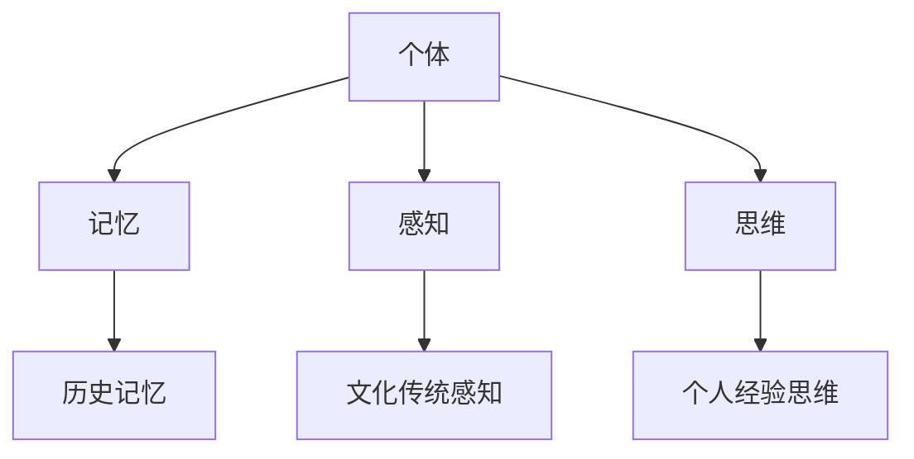
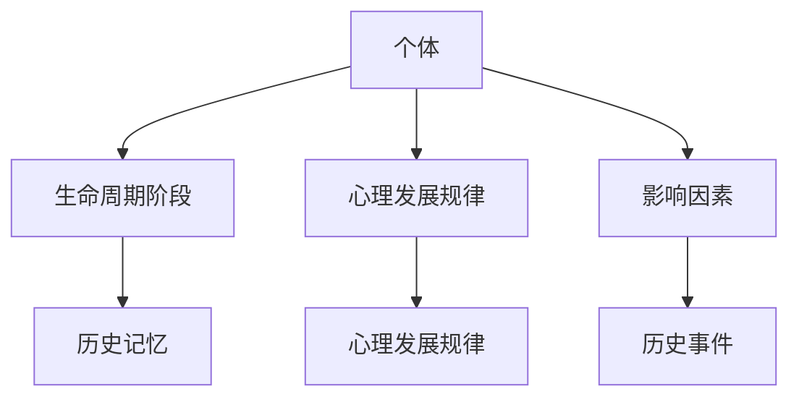
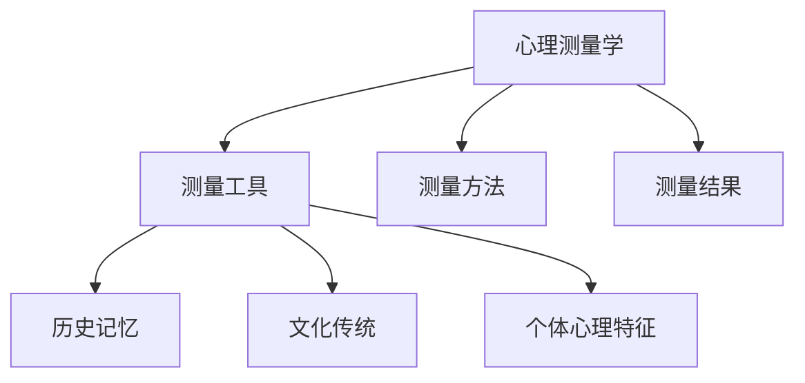
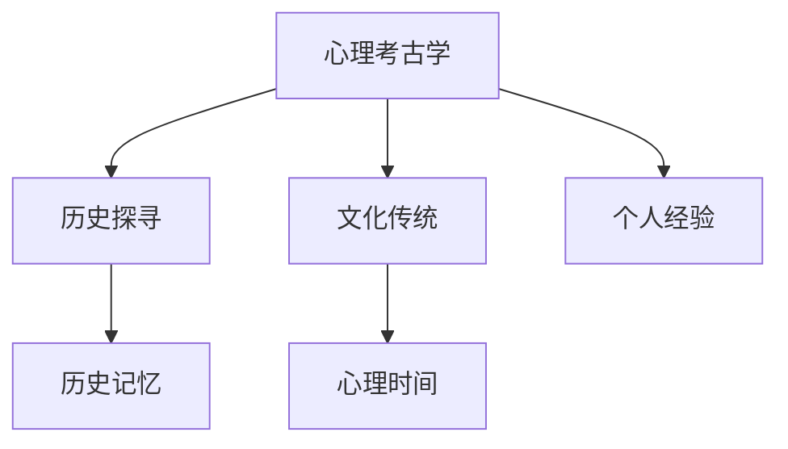

                 

### 引言与背景

**关键词**：心理考古学、个人成长、历史探寻、心理学、理论应用

**摘要**：本文旨在探讨心理考古学这一新兴领域，通过历史探寻的方式深入了解个人成长的深层机制。文章将从心理考古学的基本概念、核心问题、理论基础、实践应用、挑战与未来方向等多个维度进行阐述，旨在为读者提供全面且深入的了解。

### 第1章：心理考古学的基本概念

#### 1.1 心理考古学的定义与研究对象

**定义**：心理考古学是一门结合心理学与历史学的跨学科研究，旨在通过探索个体的历史记忆、文化传统和心理发展过程，揭示个人成长的深层机制。

**研究对象**：心理考古学主要关注以下几个方面：
1. **个体历史记忆**：通过研究个体的记忆、感知和经验，揭示其心理发展轨迹。
2. **文化传统**：探讨文化传统对个人心理发展的影响，以及文化背景在个人心理建构中的作用。
3. **心理发展过程**：研究个体在不同生命周期阶段的心理变化和发展规律。

#### 1.2 心理考古学的起源与发展

**起源**：心理考古学的概念最早可以追溯到20世纪中叶，随着心理学和人类学的发展，研究者开始关注个体心理与历史记忆之间的关系。

**发展**：近年来，随着心理学、人类学、历史学等领域的深入研究和跨学科合作，心理考古学逐渐形成了一套完整的研究框架和方法。

#### 1.3 心理考古学与心理学的关系

**关系**：心理考古学与心理学有着密切的联系，两者共同关注个体的心理发展过程。不同的是，心理考古学更强调历史背景和文化因素对个体心理的影响。

**互补**：心理考古学为心理学提供了一种新的研究视角，通过历史探寻的方式，为心理学研究提供了丰富的实证数据和理论支持。

### 第2章：心理考古学的核心问题

#### 2.1 个人成长的历史探寻

**问题背景**：个人成长是一个复杂而多维的过程，受到多种因素的影响。历史探寻作为一种研究方法，可以帮助我们深入了解个人成长的深层机制。

**问题描述**：如何通过历史探寻的方式，揭示个人成长过程中的关键事件和影响因素？

**问题解决**：通过心理考古学的方法，研究者可以收集和分析个体的历史记忆、文化传统和心理发展数据，从而揭示个人成长的深层机制。

#### 2.2 个体心理与历史记忆的关系

**问题背景**：历史记忆对个体心理发展具有重要影响，但具体关系如何，尚未有明确的研究结论。

**问题描述**：个体心理与历史记忆之间的关系如何？历史记忆对个体心理发展产生哪些影响？

**问题解决**：心理考古学研究通过实证数据和理论分析，揭示了历史记忆对个体心理发展的多种影响，为理解个体心理提供了新的视角。

#### 2.3 心理时间与历史时间的互动

**问题背景**：心理时间和历史时间是两个不同的时间维度，但在个体心理发展中，两者如何互动？

**问题描述**：心理时间与历史时间的互动机制如何？这种互动对个体心理发展产生哪些影响？

**问题解决**：心理考古学研究通过跨学科的方法，探讨了心理时间与历史时间的互动机制，为理解个体心理发展提供了新的理论框架。

### 第3章：心理考古学的理论基础

#### 3.1 认知心理学与心理考古学的结合

**理论背景**：认知心理学研究个体心理过程中的认知机制，而心理考古学则关注历史记忆和文化传统对个体心理的影响。两者的结合为理解个体心理提供了新的视角。

**理论内容**：认知心理学与心理考古学的结合，形成了一种新的研究范式，通过探讨历史记忆、文化传统和认知机制之间的相互作用，揭示个体心理发展的深层机制。

#### 3.2 发展心理学与心理考古学的互补

**理论背景**：发展心理学研究个体在不同生命周期阶段的心理发展规律，而心理考古学则通过历史探寻的方式，关注个体心理发展的历史背景和文化因素。

**理论内容**：发展心理学与心理考古学的互补，使得研究者可以更全面地了解个体心理发展的过程和影响因素，为个体心理研究提供了丰富的理论支持。

#### 3.3 心理测量学在心理考古学中的应用

**理论背景**：心理测量学是一种用于测量和分析个体心理特征的学科，其方法和技术在心理考古学中具有重要应用价值。

**理论内容**：心理测量学在心理考古学中的应用，包括对历史记忆、文化传统和个体心理特征的量化测量，从而为心理考古学研究提供了可靠的实证数据。

### 第4章：心理考古学的实践应用

#### 4.1 心理考古学在个体心理咨询中的应用

**应用背景**：个体心理咨询中，心理考古学的方法可以帮助咨询师更好地理解来访者的心理发展过程和历史背景。

**应用内容**：通过心理考古学的方法，咨询师可以收集和分析来访者的历史记忆、文化传统和心理发展数据，从而制定更有效的心理咨询方案。

#### 4.2 心理考古学在团体心理辅导中的应用

**应用背景**：团体心理辅导中，心理考古学的方法可以帮助团体领导者更好地理解成员的心理发展过程和互动关系。

**应用内容**：通过心理考古学的方法，团体领导者可以收集和分析成员的历史记忆、文化传统和心理发展数据，从而制定更有效的团体心理辅导计划。

#### 4.3 心理考古学在历史心理学研究中的应用

**应用背景**：历史心理学研究关注个体心理发展与历史事件的关系，心理考古学的方法可以提供丰富的实证数据和分析工具。

**应用内容**：通过心理考古学的方法，历史心理学家可以收集和分析个体的历史记忆、文化传统和心理发展数据，从而揭示历史事件对个体心理发展的影响。

### 第5章：心理考古学的挑战与未来方向

#### 5.1 心理考古学面临的挑战

**挑战一**：研究方法和技术手段的局限，导致心理考古学研究数据的可靠性和有效性受到影响。

**挑战二**：跨学科合作中，不同学科的理论和方法存在差异，需要进一步协调和整合。

**挑战三**：历史记忆的复杂性和多样性，使得心理考古学的研究难以形成统一的结论。

#### 5.2 心理考古学的发展趋势

**趋势一**：随着心理学、人类学、历史学等学科的交叉融合，心理考古学的研究方法和理论体系将不断丰富和发展。

**趋势二**：随着技术的发展，心理考古学将借助大数据、人工智能等工具，提高研究的效率和准确性。

**趋势三**：心理考古学的应用领域将不断拓展，从个体心理咨询、团体心理辅导到历史心理学研究，都将受益于心理考古学的方法和技术。

#### 5.3 心理考古学的未来展望

**展望一**：心理考古学将深入揭示个人成长的深层机制，为个体心理发展提供科学指导。

**展望二**：心理考古学将在跨学科研究中发挥重要作用，推动心理学、人类学、历史学等学科的发展。

**展望三**：心理考古学将促进人类对历史和文化的理解，为构建和谐社会提供理论支持。

---

**总结**：心理考古学作为一门跨学科研究领域，通过探索个人成长的历史探寻，为理解个体心理发展提供了新的视角和方法。虽然面临诸多挑战，但心理考古学的发展趋势和未来展望显示出其广阔的应用前景和研究价值。

### 第1章：心理考古学的基本概念

在探讨心理考古学这一独特领域时，我们首先需要对其基本概念进行深入的梳理。这不仅有助于我们全面理解这一学科的核心内容，也为后续章节的分析提供了坚实的基础。

#### 心理考古学的定义与研究对象

**定义**：心理考古学是一门融合心理学与历史学的交叉学科，旨在通过历史方法揭示个体心理发展的深层机制。具体来说，心理考古学通过对历史记忆、文化传统和个人经验的挖掘和分析，来探索个体心理的形成、发展和变化过程。

**研究对象**：心理考古学的主要研究对象包括以下几个方面：

1. **历史记忆**：个体的历史记忆是心理考古学研究的核心。研究者通过访谈、日记、书信等历史资料，收集和分析个体的记忆内容，以此揭示个人心理的深层机制。

2. **文化传统**：文化传统对个体心理的影响深远且广泛。心理考古学研究文化传统如何塑造个体的价值观、信仰、行为模式等心理特征，以及这些文化因素如何影响个体的心理发展。

3. **个人经验**：个人经验是心理考古学的重要组成部分。研究者通过分析个体在不同生命周期阶段所经历的重要事件，探讨这些事件如何影响个体的心理成长和变化。

#### 心理考古学的起源与发展

**起源**：心理考古学的概念最早可以追溯到20世纪中叶，当时心理学家和人类学家开始关注个体心理与历史记忆之间的关系。随着心理学和人类学的发展，研究者逐渐认识到，历史背景和文化因素在个体心理发展中起着至关重要的作用。

**发展**：近年来，随着心理学、人类学、历史学等学科的深入研究和跨学科合作，心理考古学逐渐形成了一套完整的研究框架和方法。在这一过程中，心理考古学不仅借鉴了心理学和人类学的研究成果，还引入了历史学的分析方法和理论。

#### 心理考古学与心理学的关系

**关系**：心理考古学与心理学之间有着密切的联系。心理学关注个体心理过程的内部机制，而心理考古学则从历史和文化的角度，研究这些心理过程如何受到外部因素的影响。具体来说，两者之间的联系表现在以下几个方面：

1. **历史背景对心理发展的影响**：心理考古学研究历史背景如何影响个体心理的发展。例如，历史事件、社会变迁和文化传统都可能对个体的心理产生深远的影响。

2. **历史记忆与心理学理论的结合**：心理考古学通过分析个体的历史记忆，为心理学理论提供了丰富的实证数据。这些数据有助于心理学家更好地理解个体心理的形成和发展。

3. **跨学科合作与理论创新**：心理考古学的跨学科特点，促进了心理学与其他学科（如人类学、历史学等）的深度合作。这种跨学科合作不仅推动了心理考古学的发展，也为心理学理论创新提供了新的思路。

#### 心理考古学的理论基础

**理论基础**：心理考古学的理论基础主要来源于心理学、人类学和历史学。具体来说，主要包括以下几个方面：

1. **认知心理学**：认知心理学研究个体心理过程中的认知机制，如记忆、感知、思维等。心理考古学借鉴认知心理学的理论和方法，通过分析个体的历史记忆，揭示心理过程的深层机制。

2. **发展心理学**：发展心理学研究个体在不同生命周期阶段的心理发展规律。心理考古学通过研究个体的历史记忆和文化传统，探讨这些因素如何影响个体的心理发展。

3. **历史学**：历史学研究历史事件、社会变迁和文化传统。心理考古学通过引入历史学的分析方法，对个体的历史记忆进行深入挖掘和分析，以揭示个体心理的发展过程。

#### 心理考古学的核心问题

**核心问题**：心理考古学的核心问题主要包括以下几个方面：

1. **个人成长的历史探寻**：心理考古学通过历史探寻的方式，研究个人成长过程中的关键事件和影响因素，揭示个人心理发展的深层机制。

2. **个体心理与历史记忆的关系**：研究个体心理与历史记忆之间的关系，探讨历史记忆如何影响个体心理的发展。

3. **心理时间与历史时间的互动**：研究心理时间与历史时间的互动机制，探讨这种互动对个体心理发展的影响。

通过上述对心理考古学基本概念的梳理，我们可以看到，这一学科不仅涉及心理学、人类学和历史学等多个领域，还通过深入挖掘历史记忆、文化传统和个人经验，为理解个体心理发展提供了新的视角和方法。在接下来的章节中，我们将进一步探讨心理考古学的核心问题，以期为这一领域的研究提供更加深入的洞察。

### 第2章：心理考古学的核心问题

在深入了解心理考古学的基本概念之后，我们接下来将探讨其核心问题。这些问题不仅构成了心理考古学研究的核心内容，也为我们理解个人成长的历史探寻提供了关键线索。

#### 2.1 个人成长的历史探寻

**问题背景**：个人成长是一个复杂而多维的过程，受到多种因素的影响。历史探寻作为一种研究方法，可以帮助我们深入了解个人成长过程中的关键事件和影响因素。

**问题描述**：如何通过历史探寻的方式，揭示个人成长过程中的关键事件和影响因素？

**问题解决**：心理考古学通过多种方法，如访谈、文献分析、历史资料收集等，对个体的历史记忆、文化传统和个人经验进行深入挖掘和分析，从而揭示个人成长过程中的关键事件和影响因素。例如，通过研究个体的家庭背景、成长经历和社会变迁，可以揭示这些因素如何影响个体的心理发展。

**边界与外延**：个人成长的历史探寻不仅涉及个体的家庭背景和成长经历，还包括社会、文化和历史背景的影响。因此，这一研究问题具有广泛的边界和外延，需要综合考虑多种因素。

**概念结构与核心要素组成**：个人成长的历史探寻包括以下几个核心要素：

1. **历史记忆**：个体的历史记忆是理解个人成长的重要基础。通过分析个体的历史记忆，可以揭示个人在特定历史背景下的心理发展轨迹。

2. **文化传统**：文化传统对个体心理发展具有深远的影响。通过研究个体的文化背景和传统，可以了解这些因素如何塑造个体的价值观、信仰和行为模式。

3. **个人经验**：个人经验是个人成长的重要组成部分。通过分析个体在不同生命周期阶段的重要事件，可以揭示这些事件如何影响个体的心理发展。

#### 2.2 个体心理与历史记忆的关系

**问题背景**：历史记忆对个体心理发展具有重要影响，但具体关系如何，尚未有明确的研究结论。

**问题描述**：个体心理与历史记忆之间的关系如何？历史记忆对个体心理发展产生哪些影响？

**问题解决**：心理考古学通过实证研究和理论分析，揭示了历史记忆对个体心理发展的多种影响。例如，通过研究个体的历史记忆内容、记忆质量以及记忆与情绪的关系，可以探讨历史记忆如何影响个体的心理状态和情感体验。

**边界与外延**：个体心理与历史记忆的关系问题不仅涉及个体层面的心理机制，还包括文化、社会和历史背景的影响。因此，这一研究问题具有广泛的边界和外延，需要综合考虑多种因素。

**概念结构与核心要素组成**：个体心理与历史记忆的关系包括以下几个核心要素：

1. **历史记忆内容**：研究个体的历史记忆内容，包括记忆的准确性和完整性，以及记忆中的情感色彩。

2. **记忆机制**：探讨记忆的形成、存储和提取机制，以及这些机制如何影响个体的心理发展。

3. **情绪与记忆**：研究历史记忆与情绪的关系，探讨记忆中的情感体验如何影响个体的心理状态。

#### 2.3 心理时间与历史时间的互动

**问题背景**：心理时间与历史时间是两个不同的时间维度，但在个体心理发展中，两者如何互动？

**问题描述**：心理时间与历史时间的互动机制如何？这种互动对个体心理发展产生哪些影响？

**问题解决**：心理考古学通过跨学科的方法，探讨了心理时间与历史时间的互动机制。例如，通过研究个体的时间感知、记忆和时间观念，可以揭示心理时间与历史时间的互动方式，以及这种互动对个体心理发展的影响。

**边界与外延**：心理时间与历史时间的互动问题不仅涉及个体层面的心理机制，还包括文化、社会和历史背景的影响。因此，这一研究问题具有广泛的边界和外延，需要综合考虑多种因素。

**概念结构与核心要素组成**：心理时间与历史时间的互动包括以下几个核心要素：

1. **时间感知**：研究个体对时间的感知方式，包括时间流逝感、时间质量感等。

2. **记忆与时间**：探讨记忆如何影响个体对时间的感知和体验，以及这种影响对个体心理发展的影响。

3. **时间观念**：研究个体对时间的观念和价值观，以及这些观念如何影响个体的心理发展。

通过以上对心理考古学核心问题的探讨，我们可以看到，这些问题的研究不仅有助于我们深入理解个人成长的历史探寻，也为心理考古学的发展提供了重要的理论支持。在接下来的章节中，我们将继续探讨心理考古学的理论基础和实践应用，以期为这一领域的研究提供更加全面的视角。

### 第3章：心理考古学的理论基础

在深入探讨心理考古学的核心问题之后，我们需要进一步了解其理论基础。心理考古学作为一门跨学科研究领域，其理论基础涵盖了心理学、人类学和历史学等多个领域。这些理论基础不仅为心理考古学提供了研究方法，也为理解个体心理发展提供了理论支持。

#### 3.1 认知心理学与心理考古学的结合

**理论背景**：认知心理学研究个体心理过程中的认知机制，如记忆、感知、思维等。而心理考古学则通过历史方法，研究个体心理发展的深层机制。两者的结合为理解个体心理提供了新的视角。

**理论内容**：认知心理学与心理考古学的结合，形成了一种新的研究范式。具体来说，认知心理学为心理考古学提供了关于记忆、感知和思维的理论基础，而心理考古学则通过历史探寻的方式，收集和分析个体的历史记忆、文化传统和个人经验，从而揭示心理发展的深层机制。

**核心概念原理**：认知心理学中的核心概念包括记忆、感知和思维。记忆是指个体对信息的获取、存储和提取过程；感知是指个体对外部信息的接收和解释过程；思维是指个体在信息处理过程中进行推理、判断和决策的能力。这些核心概念在心理考古学中得到了应用，通过分析个体的历史记忆、感知方式和思维过程，可以揭示个人心理发展的机制。

**概念属性特征对比表格**：

| 核心概念 | 认知心理学特征 | 心理考古学特征 |
| --- | --- | --- |
| 记忆 | 信息存储和提取 | 历史记忆内容分析 |
| 感知 | 外部信息接收和解释 | 文化传统感知分析 |
| 思维 | 推理、判断和决策 | 个人经验思维分析 |

**ER实体关系图架构**：

#### 3.2 发展心理学与心理考古学的互补

**理论背景**：发展心理学研究个体在不同生命周期阶段的心理发展规律，而心理考古学则通过历史探寻的方式，关注个体心理发展的历史背景和文化因素。两者的互补为理解个体心理发展提供了全面的理论支持。

**理论内容**：发展心理学与心理考古学的互补关系体现在以下几个方面：

1. **生命周期阶段的视角**：发展心理学通过研究个体在不同生命周期阶段的心理变化，提供了对个体心理发展的阶段性和连续性的理解。心理考古学则通过历史探寻，关注这些心理变化背后的历史和文化背景。

2. **历史背景的影响**：心理考古学通过研究历史事件、社会变迁和文化传统对个体心理发展的影响，提供了对个体心理发展外部因素的深入理解。发展心理学则通过研究个体内在心理机制，提供了对个体心理发展的内部动力的理解。

**核心概念原理**：发展心理学的核心概念包括生命周期阶段、心理发展规律和心理发展的内外部影响因素。心理考古学的核心概念包括历史记忆、文化传统和个人经验。通过两者的互补，可以全面理解个体心理发展的机制。

**概念属性特征对比表格**：

| 核心概念 | 发展心理学特征 | 心理考古学特征 |
| --- | --- | --- |
| 生命周期阶段 | 心理发展的阶段性和连续性 | 历史记忆中的生命周期阶段 |
| 心理发展规律 | 心理变化和发展的内在机制 | 历史记忆中的心理发展规律 |
| 影响因素 | 外部环境和文化背景 | 历史事件和社会变迁的影响 |

**ER实体关系图架构**：

#### 3.3 心理测量学在心理考古学中的应用

**理论背景**：心理测量学是一种用于测量和分析个体心理特征的学科。其方法和工具在心理考古学中具有重要应用价值，为心理考古学研究提供了可靠的数据支持。

**理论内容**：心理测量学在心理考古学中的应用，主要包括以下几个方面：

1. **历史记忆的量化测量**：通过心理测量工具，对个体的历史记忆进行量化测量，如记忆的准确性、记忆的持久性等。这些量化数据有助于揭示历史记忆对个体心理发展的影响。

2. **文化传统的量化测量**：通过心理测量工具，对个体的文化传统进行量化测量，如文化认同感、文化价值观等。这些量化数据有助于理解文化传统对个体心理发展的影响。

3. **个体心理特征的测量**：通过心理测量工具，对个体的心理特征进行测量，如情绪状态、自我认知等。这些测量结果可以与历史记忆和文化传统的数据进行综合分析，以揭示个体心理发展的复杂机制。

**核心概念原理**：心理测量学的核心概念包括测量工具、测量方法和测量结果。心理考古学通过引入心理测量学的工具和方法，可以对历史记忆、文化传统和个体心理特征进行量化分析，从而提供更加科学和可靠的研究数据。

**概念属性特征对比表格**：

| 核心概念 | 心理测量学特征 | 心理考古学特征 |
| --- | --- | --- |
| 测量工具 | 问卷、量表、测试等 | 访谈、文献分析、历史资料等 |
| 测量方法 | 量化分析、统计分析 | 实证研究、理论分析 |
| 测量结果 | 数据统计、结果分析 | 历史记忆量化、文化传统量化 |

**ER实体关系图架构**：

通过以上对心理考古学理论基础的探讨，我们可以看到，心理学、人类学和历史学的理论和方法在心理考古学中得到了有机的结合，为理解个体心理发展提供了丰富的理论支持和研究方法。在接下来的章节中，我们将继续探讨心理考古学的实践应用，以期为这一领域的研究提供更加全面的视角。

### 第4章：心理考古学的实践应用

在了解了心理考古学的理论基础后，我们接下来将探讨其具体的实践应用。心理考古学的理论和研究方法不仅在学术研究中具有重要意义，还可以广泛应用于心理咨询、团体心理辅导和历史心理学研究等领域。在这一章中，我们将详细探讨心理考古学在这些实践领域的应用，以及其具体操作方法和实际效果。

#### 4.1 心理考古学在个体心理咨询中的应用

**应用背景**：在个体心理咨询中，心理考古学的方法可以帮助咨询师更好地理解来访者的心理发展过程和历史背景，从而制定更有效的咨询方案。

**应用内容**：

1. **历史记忆的挖掘和分析**：心理考古学通过访谈、文献分析等方法，收集和分析来访者的历史记忆，了解其成长经历、家庭背景和社会环境。这些信息有助于咨询师深入理解来访者的心理困扰和情绪问题。

2. **文化传统的探讨**：心理考古学关注来访者的文化传统，探讨其文化背景、价值观和行为模式。通过了解这些文化因素，咨询师可以更好地理解来访者的心理特质和需求，从而提供更个性化的咨询服务。

3. **个人经验的反思**：心理考古学鼓励来访者反思自己的个人经验，探讨这些经验对其心理发展的影响。通过这种反思，来访者可以更好地理解自己的内心世界，增强自我认知和自我调节能力。

**实际案例**：例如，一位来访者因工作压力和人际关系问题前来咨询。通过心理考古学的方法，咨询师发现来访者从小在高压环境下成长，家庭教育方式严格且缺乏温暖。这一历史记忆和成长经历对来访者的心理发展产生了深远的影响，导致其在成年后对工作充满焦虑和不安。通过帮助来访者挖掘和分析这些历史记忆，咨询师能够制定针对性的咨询计划，帮助其改善心理状态。

#### 4.2 心理考古学在团体心理辅导中的应用

**应用背景**：在团体心理辅导中，心理考古学的方法可以帮助团体领导者更好地理解成员的心理发展过程和互动关系，从而提升辅导效果。

**应用内容**：

1. **团体历史记忆的挖掘**：心理考古学通过团体访谈、集体回忆等方法，收集和分析团体成员的历史记忆，了解团体的共同经历和共同经历背后的心理意义。

2. **文化传统的探讨**：心理考古学关注团体成员的文化背景、价值观和行为模式，探讨这些文化因素如何影响团体的心理动态和互动关系。

3. **团体经验的反思**：心理考古学鼓励团体成员反思自己的团体经验，探讨这些经验对其心理发展的影响。通过这种反思，团体成员可以增强彼此的理解和信任，提升团体的凝聚力和归属感。

**实际案例**：例如，一个企业团队在面临重大变革时，出现了成员间的矛盾和冲突。通过心理考古学的方法，团队领导者发现团队的历史记忆中存在一些未解决的矛盾和误解。通过引导团队成员回顾和探讨这些历史记忆，团队领导者能够帮助成员理解彼此的立场和情感，从而促进团队的和解和合作。

#### 4.3 心理考古学在历史心理学研究中的应用

**应用背景**：在历史心理学研究中，心理考古学的方法可以帮助研究者深入挖掘历史事件对个体和群体心理发展的影响，从而提供更加丰富的历史心理分析。

**应用内容**：

1. **历史事件的深度分析**：心理考古学通过文献分析、档案研究等方法，对历史事件进行深度分析，了解这些事件对个体和群体心理发展的影响。

2. **文化传统的探讨**：心理考古学关注历史事件背后的文化传统，探讨这些文化传统如何影响个体和群体的心理发展。

3. **历史记忆的量化研究**：心理考古学通过心理测量工具，对历史事件中的个体和群体心理特征进行量化研究，从而提供更加科学和可靠的历史心理数据。

**实际案例**：例如，在研究一次战争对个体心理发展的影响时，心理考古学研究者通过访谈、问卷调查等方法，收集和分析战争幸存者的历史记忆和心理状态。通过这些数据，研究者能够揭示战争对个体心理发展的深远影响，为心理干预和康复提供科学依据。

**总结**：心理考古学的实践应用范围广泛，从个体心理咨询到团体心理辅导，再到历史心理学研究，都显示出其独特的价值。通过历史探寻的方式，心理考古学不仅能够揭示个体和群体的心理发展机制，还能够为心理干预和康复提供科学指导。在未来的发展中，心理考古学有望在更多领域发挥重要作用，为理解和改善人类心理发展提供新的视角和方法。

### 第5章：心理考古学的挑战与未来方向

在心理考古学的快速发展和广泛应用中，我们也面临着诸多挑战。这些挑战不仅考验着心理考古学的研究方法和理论体系，也对其未来发展提出了新的要求。

#### 5.1 心理考古学面临的挑战

**挑战一：研究方法和技术手段的局限**

心理考古学的研究方法和技术手段相对有限，这限制了研究的广度和深度。例如，历史资料的获取和分析、记忆的量化测量等技术问题，都需要进一步改进和完善。此外，不同学科之间的数据整合和理论协调也存在一定困难。

**挑战二：跨学科合作的挑战**

心理考古学是一门跨学科领域，涉及心理学、人类学、历史学等多个学科。然而，这些学科的理论和方法存在差异，如何实现有效合作和理论整合，是一个亟待解决的问题。

**挑战三：历史记忆的复杂性和多样性**

历史记忆的复杂性和多样性给心理考古学研究带来了挑战。个体的历史记忆受到多种因素的影响，如个人经历、文化背景、社会环境等，这使得历史记忆的分析变得复杂。同时，不同个体的历史记忆可能存在显著差异，如何统一分析标准和方法，也是一个难题。

#### 5.2 心理考古学的发展趋势

**趋势一：技术手段的进步**

随着技术的进步，心理考古学将能够利用更多先进的方法和技术进行研究和数据分析。例如，人工智能、大数据分析等技术将在心理考古学中发挥重要作用，提高研究的效率和准确性。

**趋势二：跨学科研究的深入**

跨学科研究将是心理考古学发展的一个重要方向。通过与心理学、人类学、历史学等学科的深入合作，心理考古学将能够形成更加综合和全面的理论体系，为个体心理发展提供更加深入的理解。

**趋势三：应用领域的拓展**

心理考古学将不断拓展其应用领域。除了在心理咨询、团体心理辅导和历史心理学研究中的应用外，心理考古学还可能在教育、临床心理学、社会心理学等领域发挥重要作用，为不同领域提供科学依据和指导。

#### 5.3 心理考古学的未来展望

**展望一：揭示个人心理发展的深层机制**

心理考古学的未来研究将致力于揭示个人心理发展的深层机制，深入了解历史记忆、文化传统和个人经验对个体心理发展的综合影响。

**展望二：促进跨学科合作与理论创新**

心理考古学将积极推动跨学科合作，通过整合心理学、人类学、历史学等学科的理论和方法，推动心理考古学理论体系的创新和发展。

**展望三：为个体心理发展提供科学指导**

心理考古学的未来研究将致力于为个体心理发展提供科学指导，通过历史探寻的方式，帮助个体更好地理解自己的心理发展过程，从而实现自我成长和心理康复。

**总结**：心理考古学在面临诸多挑战的同时，也展现出广阔的发展前景。通过技术手段的进步、跨学科合作的深入和应用领域的拓展，心理考古学将为个体心理发展提供更加全面和深入的科学指导。未来，心理考古学有望在更多领域发挥重要作用，为人类理解和改善心理发展提供新的视角和方法。

### 第6章：案例一：个体成长的心理考古

在本章中，我们将通过一个具体的案例，深入探讨个体成长的心理考古。这个案例将展示如何通过历史探寻的方式，揭示个体心理发展的深层机制，并为读者提供实践中的具体方法和经验。

#### 6.1 案例背景

小明是一位30岁的职场人士，他在一家跨国公司工作，担任高级项目经理。然而，小明在工作中经常感到焦虑和压力，尤其是在面对重要项目时，他常常感到无法应对。为了更好地理解小明的心理困扰，心理咨询师决定采用心理考古学的方法，对小明的成长历程进行深入挖掘和分析。

#### 6.2 案例分析

**1. 历史记忆的挖掘**

心理咨询师通过与小明的多次访谈，收集了他的历史记忆。以下是几个关键的历史记忆片段：

- **童年经历**：小明在一个单亲家庭中长大，他的母亲是一位忙碌的职业女性，经常需要加班。小明回忆说，他小时候经常感到孤独和被忽视。
- **学校经历**：小明在学校里表现优秀，但他的同学关系较为复杂，他常常感到孤立无援。
- **大学经历**：小明在大学时期经历了重大的转变，他开始独立生活和应对复杂的人际关系。然而，他在学术压力和社交压力之间感到难以平衡。

**2. 文化传统的探讨**

心理咨询师还探讨了小明家庭的文化传统。小明的家庭非常重视教育和成就，父母对他的期望很高。这种文化传统使得小明在成长过程中承受了巨大的压力，他感到自己必须取得优异的成绩，以满足父母和社会的期望。

**3. 个人经验的反思**

小明在心理咨询中进行了深入的自我反思。他意识到，自己在童年时期缺乏关爱和陪伴，这对他后来的心理发展产生了深远的影响。此外，他在面对工作和生活压力时，常常感到无助和焦虑，这与他在成长过程中形成的应对机制有关。

#### 6.3 案例总结

通过心理考古学的方法，心理咨询师揭示了小明心理困扰的深层原因。以下是案例总结：

- **童年经历的影响**：小明在童年时期缺乏关爱和陪伴，这导致他在成年后感到孤独和焦虑。这种孤独感和焦虑感在职场压力下进一步加剧。
- **文化传统的压力**：小明家庭的文化传统对他产生了巨大的压力，他感到必须取得优异的成绩，以满足父母和社会的期望。这种压力使他难以放松和享受生活。
- **个人经验的反思**：小明通过自我反思，意识到自己在面对压力时缺乏有效的应对机制。他需要学会放松和调整自己的心态，以应对生活中的各种挑战。

#### 案例反思

通过这个案例，我们可以看到心理考古学在个体心理咨询中的重要作用。心理考古学不仅帮助小明理解了自己的心理困扰，还为他提供了自我成长和心理康复的路径。以下是案例反思：

- **历史探寻的重要性**：通过历史探寻，我们可以深入了解个体成长过程中的关键事件和影响因素，揭示心理困扰的深层原因。
- **文化背景的影响**：文化传统对个体心理发展具有深远的影响，理解这些文化背景有助于我们更好地理解个体的心理特质和行为模式。
- **自我反思的必要性**：自我反思是心理康复的重要步骤。通过反思自己的经历和情感，个体可以更好地理解自己的内心世界，从而实现自我成长。

### 总结

通过案例一，我们看到了心理考古学在个体心理咨询中的具体应用。通过历史探寻的方式，心理考古学揭示了个体心理发展的深层机制，为个体心理康复提供了科学依据和指导。在接下来的章节中，我们将继续探讨心理考古学在家族历史与个人心理、文化传统与个体认同等领域的应用，以期为读者提供更加全面的了解。

### 第7章：案例二：家族历史与个人心理

在上一章中，我们通过一个个体成长的心理考古案例，展示了心理考古学在个体心理咨询中的应用。本章中，我们将探讨家族历史与个人心理的关系，通过一个具体的案例，揭示家族历史如何影响个体心理发展。

#### 7.1 案例背景

小玲是一位30岁的女性，她在一家广告公司担任创意总监。尽管她在职业上取得了不少成就，但她总是感到内心空虚和迷茫。为了探寻这些感受的根源，小玲决定进行一次家族历史与个人心理的考古研究。

#### 7.2 案例分析

**1. 家族历史的挖掘**

在心理咨询师的帮助下，小玲开始回忆家族历史。以下是一些关键的历史记忆片段：

- **祖辈经历**：小玲的祖父是一名军人，他在二战期间参加了多次重要战役。祖父总是对家人讲述他在战场上的英勇事迹，这给小玲留下了深刻的印象。
- **家族传承**：小玲的家族世代从事医生职业，家族中流传着许多关于医生救死扶伤的故事。这些故事让小玲感到家族有着高尚的职业使命和责任感。
- **家庭关系**：小玲的父母关系较为紧张，她的父母在讨论家族历史时，经常出现争执和矛盾。这使小玲对家庭关系感到困惑和不安。

**2. 家族历史的心理影响**

心理咨询师分析了小玲的家族历史，发现这些历史记忆对她的心理发展产生了深远的影响。以下是几个关键点：

- **职业认同**：小玲的家族历史让她对医生职业产生了强烈的认同感，这促使她在职业生涯中追求卓越。
- **责任感**：家族中关于医生救死扶伤的故事，使小玲感到自己肩负着家族的责任。这种责任感在她面对职业挑战时成为一种动力，但也让她感到压力和不安。
- **家庭关系**：小玲的家庭关系紧张，使她在处理人际关系时经常感到困惑和不安。她试图在职业关系中建立健康的沟通和合作，但往往因为缺乏家庭关系的经验而感到困难。

**3. 个人心理的反思**

在小玲的反思过程中，她意识到自己的内心世界深受家族历史的影响。她开始理解自己在职业追求中的压力和不安，以及这些情绪背后的心理原因。

#### 7.3 案例总结

通过家族历史与个人心理的考古研究，心理咨询师揭示了小玲内心困惑的根源。以下是案例总结：

- **家族历史的影响**：家族历史对个人心理发展具有深远的影响，家族中的英雄事迹、职业使命和家庭关系等，都会在个体的心理结构中留下痕迹。
- **职业认同与责任感**：家族历史中的职业认同和责任感，对个体的职业追求和心理发展产生了重要影响。这些因素在促进个体成长的同时，也可能带来压力和焦虑。
- **家庭关系的反思**：通过反思家庭关系，个体可以更好地理解自己的心理结构，找到解决内心困惑的方法。

#### 案例反思

通过案例二，我们可以看到家族历史在个体心理发展中的重要作用。家族历史不仅影响了个体的职业认同和责任感，还影响了个体的家庭关系和心理健康。以下是案例反思：

- **家族历史的重要性**：家族历史是个体心理发展的一个重要组成部分，理解家族历史有助于个体更好地认识自己，找到心理困扰的根源。
- **家族传承的影响**：家族中的英雄事迹、职业使命和家庭价值观等，对个体心理发展具有深远的影响。这些传承因素在个体的成长过程中起着潜移默化的作用。
- **家庭关系的反思**：通过反思家庭关系，个体可以更好地处理人际关系，增强心理韧性，从而实现自我成长。

### 总结

案例二展示了家族历史与个人心理之间的关系，通过心理考古学的方法，揭示了家族历史对个体心理发展的深远影响。在理解家族历史的基础上，个体可以更好地认识自己，找到心理困扰的根源，从而实现自我成长。在接下来的章节中，我们将继续探讨心理考古学在文化传统与个体认同、心理时间与历史时间的互动等领域的应用，以期为读者提供更加全面的了解。

### 第8章：案例三：文化传统与个体认同

在了解了家族历史与个人心理的互动之后，本章我们将通过一个具体的案例，探讨文化传统与个体认同之间的关系。通过这个案例，我们将揭示文化传统如何塑造个体的心理特质和行为模式，并为读者提供文化传统考古的实际操作方法。

#### 8.1 案例背景

小李是一位35岁的工程师，他在一家跨国公司工作，有着稳定的工作和收入。然而，小李总是感到自己缺乏自信和认同感，他在工作和社交场合中经常感到焦虑和不安。为了深入理解小李的心理困扰，心理咨询师决定采用文化传统与个体认同的考古方法，对小李的文化背景和认同感进行深入研究。

#### 8.2 案例分析

**1. 文化传统的挖掘**

心理咨询师通过与小李的多次访谈，收集了他的文化背景信息。以下是几个关键的文化传统片段：

- **家庭价值观**：小李的家庭价值观强调勤奋、节俭和尊重长辈。小李的父母从小教育他要努力工作，取得优异成绩，以赢得家族和社会的认可。
- **教育传统**：小李的家族有着重视教育的传统。家族中许多成员都获得了高等学位，这使得小李在成长过程中受到了严格的教育。
- **社会价值观**：小李所在的社会环境重视个人成就和竞争。这种社会价值观使得小李在职业发展中感到巨大的压力，他常常担心自己无法满足社会的期望。

**2. 文化传统的心理影响**

心理咨询师分析了小李的文化背景，发现这些文化传统对他的心理发展产生了深远的影响。以下是几个关键点：

- **勤奋与节俭**：小李的家庭价值观让他养成了勤奋和节俭的习惯。这些习惯在职业发展中使他具备了一定的优势，但也让他感到过度焦虑和压力。
- **教育传统**：小李的家族重视教育，这使得他在学术和职业上取得了不少成就。然而，这也让他感到对自己的期望过高，常常陷入自我怀疑和焦虑。
- **社会价值观**：小李所在的社会环境强调个人成就和竞争，这使他感到巨大的压力。他担心自己无法满足社会和家庭的期望，从而导致心理困扰。

**3. 个体认同的反思**

在小李的反思过程中，他意识到自己的心理困扰很大程度上源于文化传统的影响。他开始理解自己在职业和社会环境中的角色，并尝试调整自己的心态，以更好地适应和应对。

#### 8.3 案例总结

通过文化传统与个体认同的考古研究，心理咨询师揭示了小李心理困扰的深层原因。以下是案例总结：

- **文化传统的影响**：文化传统对个体的心理发展具有深远的影响，家庭价值观、教育传统和社会价值观等，都会在个体的心理结构中留下痕迹。
- **个体认同的困境**：个体在面对文化传统的期望时，常常感到迷茫和困惑。这种困惑源于个体认同与传统文化之间的冲突，需要通过自我反思和调整来化解。
- **心理困扰的解决**：通过理解文化传统的影响，小李可以更好地认识自己的内心世界，找到解决心理困扰的方法，从而实现自我成长和心理康复。

#### 案例反思

通过案例三，我们可以看到文化传统在个体认同中的重要作用。文化传统不仅塑造了个体的心理特质和行为模式，还影响了个体的心理健康和自我认同。以下是案例反思：

- **文化传统的认识**：理解文化传统对个体的心理发展具有重要意义。通过挖掘和分析文化传统，个体可以更好地认识自己的内心世界，找到心理困扰的根源。
- **个体认同的调整**：个体在面对文化传统的期望时，需要学会调整自己的心态，以适应和应对。这种调整不仅有助于个体实现自我成长，还能促进心理健康。
- **文化多样性的尊重**：文化传统在不同群体中具有多样性，个体在面对不同的文化传统时，需要学会尊重和理解，以建立更加和谐的社会关系。

### 总结

案例三展示了文化传统与个体认同之间的关系，通过心理考古学的方法，揭示了文化传统对个体心理发展的深远影响。在理解文化传统的基础上，个体可以更好地认识自己，找到心理困扰的根源，从而实现自我成长。在接下来的章节中，我们将继续探讨心理考古学在其他领域的应用，以期为读者提供更加全面的了解。

### 第9章：心理考古学的关键工具

在心理考古学的实践中，关键工具的选择和应用至关重要。这些工具不仅有助于研究者收集和分析数据，还能提升研究的科学性和可靠性。本章将介绍心理考古学中常用的关键工具，包括口述历史、家谱学和心理传记学，并探讨它们在心理考古学研究中的应用。

#### 9.1 口述历史

**定义与用途**：口述历史是通过访谈收集个体的历史记忆和经验的方法。在心理考古学中，口述历史被广泛应用于收集个体的童年经历、家庭背景和文化传统等信息。

**应用场景**：口述历史适用于研究个体在不同历史时期的生活经历、文化变迁以及这些因素对其心理发展的影响。例如，研究者可以通过访谈老年人，了解他们在特定历史背景下的生活经历，以及这些经历如何影响他们的心理状态。

**优势**：口述历史的优势在于其能够直接获取个体的亲身经历和情感体验，有助于揭示个体心理发展的深层次机制。

**劣势**：口述历史的劣势在于其依赖于个体的记忆和表达能力，可能导致信息的准确性和完整性受到影响。此外，口述历史的收集过程较为耗时且成本较高。

#### 9.2 家谱学

**定义与用途**：家谱学是研究个体和家庭历史的一种方法，通过记录和分析家族成员的出生、婚姻、死亡等信息，揭示家族的历史背景和遗传关系。

**应用场景**：家谱学在心理考古学中用于探讨家庭背景、家族传统和遗传因素对个体心理发展的影响。例如，研究者可以通过分析家谱，了解家族中的心理疾病遗传史，从而揭示这些因素如何影响个体的心理健康。

**优势**：家谱学的优势在于其能够提供详细的家族历史信息，有助于研究者全面了解个体的家庭背景和家族传统。

**劣势**：家谱学的劣势在于其数据收集过程复杂且耗时，同时需要具备专业的家谱分析技能。

#### 9.3 心理传记学

**定义与用途**：心理传记学是一种研究个体生活经历、心理特质和文化背景之间的关系的学科。在心理考古学中，心理传记学通过分析个体的生活经历和心理发展，探讨个体心理的演变过程。

**应用场景**：心理传记学适用于研究个体在不同生命周期阶段的心理发展，以及文化背景对个体心理发展的影响。例如，研究者可以通过分析名人的传记，了解他们在不同人生阶段的心理变化，以及这些变化背后的文化因素。

**优势**：心理传记学的优势在于其能够提供详细的个体生活经历和心理发展信息，有助于研究者深入理解个体心理发展的过程和机制。

**劣势**：心理传记学的劣势在于其依赖于个体的历史记录和传记资料，可能导致信息的真实性和完整性受到影响。此外，心理传记学的分析过程较为复杂，需要研究者具备丰富的心理学知识和分析技能。

#### 工具选择与应用策略

**选择策略**：在选择心理考古学的关键工具时，研究者应综合考虑以下因素：

1. **研究目标**：根据研究目标选择最适合的工具，例如，研究个体历史记忆应优先选择口述历史，研究家庭背景应优先选择家谱学。
2. **数据可用性**：考虑数据收集的难易程度和可用性，优先选择易于获取和整理的数据。
3. **研究资源**：根据研究资源和时间安排，选择成本较低且操作简便的工具。

**应用策略**：在实际应用中，研究者应采取以下策略：

1. **综合应用**：多种工具的综合应用可以提供更全面和深入的研究数据。例如，在研究个体成长过程时，可以同时使用口述历史、家谱学和心理传记学。
2. **交叉验证**：通过交叉验证不同工具收集的数据，可以提升研究结果的可靠性和有效性。
3. **数据整合**：将不同工具收集的数据进行整合和分析，可以揭示个体心理发展的深层次机制。

通过以上对心理考古学关键工具的介绍和应用策略的探讨，我们可以看到，这些工具在心理考古学研究中具有重要的应用价值。在实际研究中，研究者应灵活选择和应用这些工具，以提升研究的科学性和可靠性，为个体心理发展提供更加深入和全面的理解。

### 第10章：心理考古学的研究方法

在心理考古学的实践中，研究方法的选择和运用至关重要。科学合理的研究方法不仅能确保研究结果的可靠性和有效性，还能为深入理解个体心理发展的机制提供有力支持。本章将详细介绍心理考古学中的几种主要研究方法，包括实证研究、质性研究和跨文化研究，并探讨这些方法的优缺点及其适用性。

#### 10.1 实证研究

**定义与特点**：实证研究是一种基于观察和实验的方法，通过收集和分析客观数据，验证或推翻假设。在心理考古学中，实证研究通常涉及对个体历史记忆、文化传统和心理发展的量化分析。

**适用范围**：实证研究适用于研究个体在不同历史时期的生活经历、文化变迁以及这些因素对心理发展的影响。例如，研究者可以通过问卷调查或实验方法，收集大量个体的历史记忆数据，分析这些记忆对心理发展的影响。

**优点**：实证研究的优点在于其能够提供大量客观数据，通过统计分析方法，可以揭示变量之间的关系，提高研究的科学性和可靠性。

**缺点**：实证研究的缺点包括数据收集过程较为复杂，耗时较长，且需要专业技术和设备支持。此外，实证研究往往难以捕捉个体的情感体验和主观感受。

**实际案例**：例如，一项关于家族历史对个体心理健康影响的实证研究，通过问卷调查和数据分析，揭示了家族历史中的负面事件对个体心理健康的影响程度。

#### 10.2 质性研究

**定义与特点**：质性研究是一种通过深入访谈、观察和文本分析，探究个体主观体验和情感的方法。在心理考古学中，质性研究通常用于挖掘个体的历史记忆、心理发展过程和文化传统。

**适用范围**：质性研究适用于研究个体在特定历史背景下的心理发展过程，以及文化传统对个体心理的影响。例如，研究者可以通过深入访谈，了解个体在成长过程中的关键事件和情感体验。

**优点**：质性研究的优点在于其能够深入了解个体的主观体验和情感，揭示个体心理发展的深层次机制。此外，质性研究具有灵活性和适应性，可以根据研究问题和目标进行调整。

**缺点**：质性研究的缺点包括研究结果的主观性和不可复制性，数据分析和解释过程也较为复杂。此外，质性研究需要较高的研究技巧和专业知识。

**实际案例**：例如，一项关于个体童年经历对成年后心理健康影响的质性研究，通过深入访谈，揭示了个体童年时期的情感体验和成长经历如何影响其成年后的心理健康。

#### 10.3 跨文化研究

**定义与特点**：跨文化研究是一种比较不同文化背景下的个体心理发展特点的方法。在心理考古学中，跨文化研究通过比较不同文化传统对个体心理发展的影响，揭示文化差异对个体心理的塑造作用。

**适用范围**：跨文化研究适用于研究文化传统对个体心理发展的影响，以及不同文化背景下心理问题的表现形式。例如，研究者可以通过比较不同国家或地区的家庭教育方式，分析其对个体心理发展的影响。

**优点**：跨文化研究的优点在于其能够揭示文化差异对个体心理发展的影响，为心理干预和跨文化心理健康服务提供科学依据。

**缺点**：跨文化研究的缺点包括研究方法和数据收集的难度较大，需要较高的跨文化研究能力和专业知识。此外，跨文化研究往往难以控制文化因素之间的交互作用，可能导致结果解释的复杂性。

**实际案例**：例如，一项关于不同文化背景下青少年心理健康差异的跨文化研究，通过比较不同国家的青少年心理健康状况，揭示了文化差异对心理健康的影响。

#### 研究方法选择与综合运用

**选择策略**：在选择心理考古学的研究方法时，研究者应综合考虑以下因素：

1. **研究目标**：根据研究目标选择最合适的方法，例如，研究个体历史记忆应优先选择质性研究，研究文化差异应优先选择跨文化研究。
2. **数据类型**：根据需要收集的数据类型选择方法，例如，需要大量客观数据时优先选择实证研究，需要深入了解主观体验时优先选择质性研究。
3. **研究资源**：根据研究资源和时间安排，选择成本较低且操作简便的方法。

**综合运用策略**：在实际研究中，研究者可以综合运用多种研究方法，以提升研究的科学性和可靠性。例如，在研究个体心理发展的过程中，可以同时采用质性研究和实证研究，通过质性研究深入了解个体的主观体验和情感，通过实证研究验证变量之间的关系。

通过以上对心理考古学研究方法的详细介绍，我们可以看到，不同的研究方法在心理考古学中具有独特的价值和应用。在实际研究中，研究者应灵活选择和应用这些方法，以提升研究的科学性和可靠性，为深入理解个体心理发展提供有力支持。

### 第11章：心理考古学的数据分析

在心理考古学的研究过程中，数据分析是至关重要的环节。通过科学合理的数据分析，研究者能够从大量的历史记忆、文化传统和心理发展数据中提取有价值的信息，揭示个体心理发展的深层机制。本章将详细介绍心理考古学中的数据分析方法，包括数据整理与预处理、数据分析工具及其应用，以及数据分析结果的解读。

#### 11.1 数据整理与预处理

**数据整理与预处理的重要性**：数据整理与预处理是数据分析的基础，其质量直接影响分析结果的准确性和可靠性。在心理考古学中，数据来源多样，包括口述历史记录、家谱资料、心理传记等，这些数据往往存在不完整、不一致或错误等问题。因此，数据整理与预处理尤为重要。

**步骤与方法**：

1. **数据清洗**：数据清洗是数据预处理的第一步，旨在去除数据中的错误、重复和无关信息。例如，在处理口述历史记录时，可以去除重复的语句和无关的背景信息。

2. **数据转换**：数据转换是将不同格式的数据统一转换为便于分析的形式。例如，将文本数据转换为结构化数据，如表格或数据库。

3. **数据集成**：数据集成是将来自不同来源的数据进行整合，形成统一的数据集。例如，将家谱资料与口述历史记录进行整合，以获取更全面的历史信息。

4. **数据标准化**：数据标准化是为了保证数据的一致性和可比性，通常包括数据格式、编码和单位等的标准化。例如，将年龄数据统一为年份格式。

**工具与应用**：

1. **Excel**：Excel是一个常用的数据整理工具，适用于中小规模数据的整理和预处理。通过Excel的函数和公式，可以快速进行数据清洗和转换。

2. **Python**：Python是一种功能强大的编程语言，适用于大规模数据清洗、转换和预处理。Python的Pandas库提供了丰富的数据处理功能，可以帮助研究者快速进行数据整理和预处理。

3. **R语言**：R语言是一种专门用于统计分析和数据可视化的高级语言，适用于复杂的数据分析和模型构建。R语言的dplyr和tidyverse等包提供了强大的数据处理功能，可以帮助研究者高效完成数据整理与预处理。

#### 11.2 数据分析工具及其应用

**数据分析工具**：在心理考古学研究中，常用的数据分析工具包括统计分析工具、数据挖掘工具和机器学习工具。

**统计分析工具**：

1. **描述性统计分析**：描述性统计分析主要用于描述数据的分布特征，如均值、中位数、标准差等。描述性统计分析有助于研究者了解数据的基本情况。

2. **相关性分析**：相关性分析用于探讨变量之间的关系，如皮尔逊相关系数和斯皮尔曼相关系数。相关性分析可以帮助研究者发现不同变量之间的关联性。

3. **回归分析**：回归分析用于探讨变量之间的因果关系，如线性回归和多元回归。回归分析可以揭示变量之间的定量关系，帮助研究者理解个体心理发展的机制。

**数据挖掘工具**：

1. **聚类分析**：聚类分析用于将数据集划分为若干类别，如K-means聚类和层次聚类。聚类分析可以帮助研究者发现数据中的模式和规律。

2. **关联规则挖掘**：关联规则挖掘用于发现数据中的频繁模式，如Apriori算法和FP-growth算法。关联规则挖掘可以揭示历史记忆、文化传统和心理发展数据之间的潜在关系。

**机器学习工具**：

1. **监督学习算法**：监督学习算法，如线性回归、决策树和随机森林，用于建立预测模型。监督学习算法可以帮助研究者预测个体心理发展的趋势。

2. **无监督学习算法**：无监督学习算法，如K-means聚类和自组织映射，用于发现数据中的隐藏结构和模式。无监督学习算法可以帮助研究者探索个体心理发展的未知领域。

**工具与应用**：

1. **SPSS**：SPSS是一款常用的统计分析软件，适用于描述性统计分析、相关性分析和回归分析等。通过SPSS，研究者可以快速进行数据分析和结果可视化。

2. **R语言**：R语言是一个功能强大的数据分析工具，适用于各种复杂的数据分析和模型构建。R语言的ggplot2包提供了丰富的数据可视化功能，可以帮助研究者展示分析结果。

3. **Python**：Python是一种灵活的编程语言，适用于数据分析、数据挖掘和机器学习。Python的scikit-learn库提供了丰富的机器学习算法，可以帮助研究者构建预测模型。

#### 11.3 数据分析结果的解读

**结果解读的重要性**：数据分析结果解读是心理考古学研究的关键环节，通过正确解读分析结果，研究者可以深入理解个体心理发展的机制，为理论研究和实际应用提供有力支持。

**步骤与方法**：

1. **结果验证**：在解读数据分析结果之前，研究者应验证分析过程的正确性和数据的可靠性。例如，通过交叉验证方法，确保模型的预测能力。

2. **结果可视化**：通过数据可视化方法，将分析结果以图表、图形等形式展示，有助于研究者直观理解分析结果。常用的可视化工具包括Excel、R语言的ggplot2包和Python的matplotlib库。

3. **结果解释**：在解读分析结果时，研究者应结合理论背景和实际情境，解释变量之间的关系和影响机制。例如，通过解释回归分析结果，揭示历史记忆、文化传统和个体心理发展之间的因果关系。

4. **结果应用**：在解读分析结果后，研究者应将分析结果应用于实际领域，如个体心理咨询、团体心理辅导和历史心理学研究等，以提升实际应用的成效。

**案例与实例**：

例如，在研究家族历史对个体心理健康的影响时，通过回归分析发现，家族历史中的负面事件与个体心理健康之间存在显著负相关关系。通过结果解读，研究者可以得出结论，家族历史中的负面事件对个体心理健康具有负面影响，建议在实际心理咨询中关注这些因素，为个体提供针对性的干预和支持。

通过以上对心理考古学数据分析方法的详细介绍，我们可以看到，数据分析在心理考古学研究中具有至关重要的地位。通过科学合理的数据分析，研究者可以揭示个体心理发展的深层机制，为个体心理咨询、团体心理辅导和历史心理学研究提供有力支持。在实际研究中，研究者应灵活选择和应用这些方法，以提高研究的科学性和可靠性。

### 第12章：心理考古学在教育领域的应用

在当今社会，教育对个体心理发展的影响日益显著。心理考古学作为一种深入挖掘个体历史记忆、文化传统和心理发展机制的研究方法，其在教育领域的应用具有重要意义。本章将探讨心理考古学在教育领域的应用，包括在教育心理学中的应用、个性化教学中的应用以及教师专业发展中的应用。

#### 12.1 心理考古学在教育心理学中的应用

**应用背景**：教育心理学研究教育对个体心理发展的影响，而心理考古学通过历史探寻的方式，深入了解个体的历史记忆、文化传统和个人经验，从而为教育心理学提供更全面的理解。

**应用内容**：

1. **学生心理发展的历史探寻**：心理考古学可以用于研究学生的历史记忆和文化背景，了解这些因素如何影响学生的心理发展。例如，通过访谈和文献分析，研究者可以了解学生在特定历史背景下的成长经历和家庭背景，从而为教育干预提供科学依据。

2. **教育干预的设计与实施**：心理考古学的方法可以帮助教育工作者设计更有针对性的教育干预措施。通过了解学生的历史记忆和心理发展轨迹，教育工作者可以制定个性化的教育方案，以更好地满足学生的需求。

3. **教师心理发展的研究**：心理考古学还可以用于研究教师的历史记忆和心理发展，了解教师的教学方法和心理状态。例如，研究者可以通过访谈和问卷调查，了解教师在职业生涯中的关键事件和情感体验，从而为教师专业发展提供支持。

**实际案例**：例如，一项关于学生学习动机的研究，通过心理考古学的方法，分析了学生在不同历史时期的学习经历和家庭背景。研究者发现，学生的家庭环境和成长经历对其学习动机有显著影响，从而为教育工作者提供了针对性的教育干预建议。

#### 12.2 心理考古学在个性化教学中的应用

**应用背景**：个性化教学是一种以学生为中心的教学模式，旨在满足每个学生的个性化需求。心理考古学可以为个性化教学提供深入了解学生心理发展的方法。

**应用内容**：

1. **学生个性特征的挖掘**：心理考古学可以帮助教师深入了解学生的个性特征，包括价值观、兴趣爱好、学习能力等。通过访谈和问卷调查，教师可以收集学生的历史记忆和个人经验，从而制定个性化的教学方案。

2. **教学内容的个性化调整**：基于心理考古学的研究结果，教师可以根据学生的个性特征，调整教学内容和方法。例如，对于历史背景较为丰富的学生，教师可以设计更多与历史相关的教学活动，以激发学生的学习兴趣。

3. **学习路径的个性化设计**：心理考古学的方法可以帮助教师设计个性化的学习路径，根据学生的兴趣和能力，制定不同的学习目标和任务。例如，对于学习能力较强的学生，教师可以设置更复杂的学习任务，以促进其全面发展。

**实际案例**：例如，在一个个性化教学的实验项目中，教师通过心理考古学的方法，对学生的学习经历和家庭背景进行了深入研究。基于这些研究结果，教师为每个学生制定了个性化的学习计划，包括学习内容、教学方法和评估方式。结果显示，学生的学业成绩和学习动机显著提高。

#### 12.3 心理考古学在教师专业发展中的应用

**应用背景**：教师专业发展是提高教育质量的关键。心理考古学可以通过深入挖掘教师的历史记忆和心理发展，为教师专业发展提供科学指导。

**应用内容**：

1. **教师心理发展的研究**：心理考古学可以帮助研究者深入了解教师的历史记忆和心理发展，了解教师的教学风格、心理状态和职业成长轨迹。通过访谈和问卷调查，研究者可以收集教师的个人经验和情感体验，为教师专业发展提供支持。

2. **教师培训的设计与实施**：基于心理考古学的研究结果，教师培训机构可以设计更有针对性的培训课程，以满足教师的不同需求。例如，对于有特定成长经历和心理困扰的教师，培训机构可以设计专题讲座和工作坊，帮助他们应对挑战。

3. **教师心理辅导的实施**：心理考古学的方法可以帮助学校提供个性化的教师心理辅导。通过了解教师的历史记忆和心理发展，心理辅导师可以提供更有针对性的辅导方案，帮助教师缓解心理压力，提升心理健康水平。

**实际案例**：例如，在一个教师心理健康辅导项目中，心理辅导师通过心理考古学的方法，对教师的历史记忆和职业经历进行了深入研究。基于这些研究结果，辅导师为每位教师制定了个性化的辅导计划，包括情绪管理、压力缓解和职业规划等方面。项目结果显示，教师的心理健康水平显著提高，职业满意度也得到提升。

#### 总结

心理考古学在教育领域的应用具有广阔的前景。通过历史探寻的方式，心理考古学可以为教育心理学、个性化教学和教师专业发展提供科学指导。在实际应用中，教育工作者可以灵活运用心理考古学的方法，深入了解学生的历史记忆和心理发展，为个性化教育和教师专业发展提供有力支持。未来，随着心理考古学的发展和应用的深入，其在教育领域的贡献将不断显现。

### 第13章：心理考古学在临床心理学中的应用

在临床心理学中，心理考古学的方法为理解和治疗患者心理问题提供了新的视角和工具。通过深入挖掘个体的历史记忆、文化传统和个人经验，心理考古学能够揭示心理问题的根源，并为制定有效的治疗策略提供依据。本章将探讨心理考古学在临床心理学中的应用，包括在心理咨询中的应用、心理治疗中的应用以及心理评估中的应用。

#### 13.1 心理考古学在心理咨询中的应用

**应用背景**：在心理咨询中，心理考古学的方法可以帮助心理咨询师深入了解患者的心理发展过程和历史背景，从而提供更有针对性的咨询服务。

**应用内容**：

1. **历史记忆的挖掘**：心理咨询师通过访谈和文献分析，收集患者的历史记忆，包括家庭背景、成长经历和社会环境等信息。这些信息有助于心理咨询师理解患者心理问题的根源。

2. **文化传统的探讨**：心理考古学关注患者的文化传统，探讨这些传统如何影响患者的心理状态和行为模式。例如，心理咨询师可以了解患者的家庭价值观、文化背景和行为习惯，从而更好地理解患者的心理困扰。

3. **个人经验的反思**：心理考古学鼓励患者反思自己的个人经验，探讨这些经验对其心理发展的影响。通过这种反思，患者可以更好地理解自己的内心世界，增强自我认知和自我调节能力。

**实际案例**：例如，一位患有焦虑症的患者，在心理咨询中通过心理考古学的方法，挖掘出其在童年时期因家庭关系紧张而产生的心理创伤。心理咨询师帮助患者理解这些创伤对其当前焦虑症状的影响，并制定了针对性的治疗计划，包括情绪调节和认知重构等。

#### 13.2 心理考古学在心理治疗中的应用

**应用背景**：在心理治疗中，心理考古学的方法可以帮助治疗师深入了解患者的心理发展过程和历史背景，从而制定有效的治疗策略。

**应用内容**：

1. **历史事件的深度分析**：心理考古学通过访谈和文献分析，对患者的历史事件进行深度分析，了解这些事件如何影响患者的心理发展。例如，治疗师可以分析患者的重要生活事件，如婚姻破裂、亲人离世等，探讨这些事件对患者的心理创伤和后续心理问题的影响。

2. **文化传统的探讨**：心理考古学关注患者的文化传统，探讨这些传统如何影响患者的心理状态和行为模式。例如，治疗师可以了解患者的家庭价值观、文化背景和行为习惯，从而更好地理解患者的心理问题。

3. **治疗策略的制定**：基于心理考古学的研究结果，治疗师可以制定个性化的治疗策略。例如，对于有严重心理创伤的患者，治疗师可以采用认知行为疗法、情感调节疗法等，以帮助患者处理和缓解心理创伤。

**实际案例**：例如，一位患有长期抑郁的患者，在心理治疗中通过心理考古学的方法，挖掘出其童年时期遭受的家庭暴力对其抑郁症状的影响。治疗师帮助患者理解这些创伤对其心理状态的影响，并采用认知行为疗法，帮助患者改变负面思维模式，提升心理韧性。

#### 13.3 心理考古学在心理评估中的应用

**应用背景**：在心理评估中，心理考古学的方法可以帮助评估师全面了解患者的心理发展过程和历史背景，从而提供更准确的评估结果。

**应用内容**：

1. **历史记忆的量化评估**：心理考古学通过心理测量工具，对患者的历史记忆进行量化评估，如记忆的准确性、记忆的持久性等。这些量化数据有助于评估师全面了解患者的心理状态和记忆功能。

2. **文化传统的评估**：心理考古学关注患者的文化传统，通过评估患者对文化传统的影响，如文化认同感、文化价值观等，帮助评估师理解患者的心理特质和行为模式。

3. **心理发展的综合评估**：心理考古学通过综合分析患者的历史记忆、文化传统和个人经验，提供心理发展的全面评估。例如，评估师可以通过访谈和问卷调查，收集患者的历史记忆、文化传统和个人经验，从而为心理发展评估提供丰富数据。

**实际案例**：例如，在一次心理评估中，评估师通过心理考古学的方法，对一位患有创伤后应激障碍的患者进行了全面评估。评估师通过访谈和问卷调查，收集了患者的历史记忆、文化传统和个人经验，从而揭示了患者心理问题的根源和影响因素。基于这些数据，评估师为患者制定了个性化的治疗计划。

#### 总结

心理考古学在临床心理学中的应用具有重要意义。通过深入挖掘个体的历史记忆、文化传统和个人经验，心理考古学能够揭示心理问题的根源，为心理咨询、心理治疗和心理评估提供科学依据。在实际应用中，心理考古学的方法有助于提高治疗和评估的针对性，提升心理干预的成效。未来，随着心理考古学的发展和应用的深入，其在临床心理学领域的贡献将不断显现。

### 第14章：心理考古学在社会心理学中的应用

在社会心理学领域，心理考古学的方法为理解社会心理现象提供了独特的视角。通过挖掘个体历史记忆、文化传统和个人经验，心理考古学能够揭示社会心理现象的深层机制，为社会发展提供科学依据。本章将探讨心理考古学在社会心理学中的应用，包括在社会心理现象研究中的应用、群体心理学中的应用以及组织心理学中的应用。

#### 14.1 心理考古学在社会心理现象研究中的应用

**应用背景**：社会心理现象研究关注个体在社会环境中的心理和行为变化，而心理考古学通过历史探寻的方式，深入了解个体的历史记忆、文化传统和个人经验，从而为理解社会心理现象提供新的视角。

**应用内容**：

1. **历史记忆与社会心理现象的关系**：心理考古学通过分析个体的历史记忆，探讨历史事件如何影响个体和社会心理现象。例如，研究者可以研究战争、经济危机等历史事件如何影响社会心理状态。

2. **文化传统与社会心理现象的关系**：心理考古学关注文化传统对个体和社会心理现象的影响，探讨文化价值观、习俗等如何塑造社会心理现象。例如，研究者可以研究不同文化背景下，个体的自我认同和社会行为模式。

3. **社会变迁与社会心理现象的关系**：心理考古学通过分析社会变迁中的历史记忆和文化传统，探讨社会变迁对个体和社会心理现象的影响。例如，研究者可以研究城市化进程对个体心理和社会心理状态的影响。

**实际案例**：例如，一项关于战后社会重建的研究，通过心理考古学的方法，分析了战争经历对个体和社会心理的影响。研究者发现，战争经历对个体的心理健康有长期影响，同时也影响了社会心理状态，如社会信任和集体认同。

#### 14.2 心理考古学在群体心理学中的应用

**应用背景**：群体心理学研究个体在群体中的心理和行为变化，而心理考古学通过挖掘个体历史记忆、文化传统和个人经验，为理解群体心理现象提供新的视角。

**应用内容**：

1. **历史记忆与群体心理现象的关系**：心理考古学通过分析个体的历史记忆，探讨历史事件如何影响群体的心理状态和行为模式。例如，研究者可以研究民族记忆如何影响群体认同和社会行为。

2. **文化传统与群体心理现象的关系**：心理考古学关注文化传统对群体心理现象的影响，探讨文化价值观和习俗如何塑造群体心理状态。例如，研究者可以研究不同文化传统如何影响群体的凝聚力和行为规范。

3. **群体互动与群体心理现象的关系**：心理考古学通过分析个体在群体互动中的历史记忆和个人经验，探讨群体互动如何影响群体心理现象。例如，研究者可以研究群体互动中的文化传承和价值观的传播。

**实际案例**：例如，一项关于群体凝聚力的研究，通过心理考古学的方法，分析了民族历史记忆对群体凝聚力的影响。研究者发现，民族历史记忆中的共同经历和情感体验显著增强了群体的凝聚力，从而促进了社会团结。

#### 14.3 心理考古学在组织心理学中的应用

**应用背景**：组织心理学研究个体和组织之间的心理互动，而心理考古学通过挖掘个体历史记忆、文化传统和个人经验，为理解组织行为和组织文化提供新的视角。

**应用内容**：

1. **历史记忆与组织行为的关系**：心理考古学通过分析个体的历史记忆，探讨组织历史对组织行为的影响。例如，研究者可以研究组织历史上的重大事件如何影响组织的决策和行为模式。

2. **文化传统与组织文化的的关系**：心理考古学关注文化传统对组织文化的影响，探讨组织中的文化传统如何塑造组织价值观和行为规范。例如，研究者可以研究组织中的历史传统如何影响员工的价值观和工作态度。

3. **组织互动与组织文化的关系**：心理考古学通过分析个体在组织互动中的历史记忆和个人经验，探讨组织互动如何影响组织文化和组织行为。例如，研究者可以研究组织互动中的文化传承和价值观的传播如何影响组织的绩效和员工满意度。

**实际案例**：例如，一项关于组织文化建设的研究，通过心理考古学的方法，分析了组织历史记忆对组织文化的影响。研究者发现，组织历史上的成功经验和失败教训对组织文化的形成有显著影响，从而为组织文化建设提供了科学依据。

#### 总结

心理考古学在社会心理学中的应用具有广阔的前景。通过挖掘个体历史记忆、文化传统和个人经验，心理考古学能够揭示社会心理现象的深层机制，为群体心理学和组织心理学提供新的研究视角。在实际应用中，心理考古学的方法有助于理解社会心理现象、群体心理和组织行为，为社会发展、组织管理和心理干预提供科学依据。未来，随着心理考古学的发展和应用的深入，其在社会心理学领域的贡献将不断显现。

### 第15章：心理考古学与历史学的融合

心理考古学和历史学在研究方法和理论体系上有许多共通之处，两者的融合为理解个体心理发展提供了新的视角。本章将探讨心理考古学与历史学的融合，包括心理考古学与历史学研究的关系、心理考古学在历史研究中的应用以及历史学对心理考古学的贡献。

#### 15.1 心理考古学与历史学研究的关系

**关系概述**：心理考古学和历史学都是跨学科领域，两者在研究个体心理和社会文化方面有着密切的联系。历史学关注历史事件、社会变迁和文化传统，而心理考古学则通过历史方法，深入挖掘个体心理发展的深层机制。

**互补性**：心理考古学和历史学在研究方法上具有互补性。历史学通过文献分析、档案研究等方法，收集和分析历史资料，为心理考古学提供了丰富的实证数据。心理考古学则通过心理测量、质性研究等方法，对历史资料进行深入分析，揭示个体心理发展的机制。

**互动机制**：心理考古学与历史学的互动机制体现在以下几个方面：

1. **历史资料的收集**：历史学为心理考古学提供了大量历史资料，如日记、信件、文献等。这些资料为心理考古学研究提供了基础数据。

2. **历史分析的方法**：心理考古学借鉴历史学的分析方法，如文献分析、档案研究等，对历史资料进行深入挖掘和分析，从而揭示个体心理发展的机制。

3. **心理视角的补充**：心理考古学通过心理视角，对历史事件和人物进行深入分析，补充了历史学研究的不足，提供了对个体心理的更全面理解。

#### 15.2 心理考古学在历史研究中的应用

**应用背景**：在历史研究中，心理考古学的方法有助于深入理解历史事件对个体和群体心理发展的影响，提供更全面的历史心理分析。

**应用内容**：

1. **历史事件的个体心理分析**：心理考古学通过分析历史事件中的个体心理，了解历史事件对个体心理发展的深远影响。例如，研究者可以分析战争、灾难等历史事件对个体心理的创伤和后遗症。

2. **社会变迁的心理影响**：心理考古学探讨社会变迁对个体和群体心理发展的影响，了解社会变迁中的心理变化和适应过程。例如，研究者可以分析工业化、城市化等社会变迁对个体心理和社会心理状态的影响。

3. **历史人物的心理分析**：心理考古学通过分析历史人物的历史记忆、心理特质和行为模式，揭示历史人物的心理发展轨迹。例如，研究者可以分析政治家、思想家等历史人物的心理特点对其历史行为的影响。

**实际案例**：例如，一项关于二战对个体心理影响的研究，通过心理考古学的方法，分析了战争幸存者的历史记忆和心理状态。研究者发现，战争经历对个体的心理创伤有长期影响，影响了他们的情感体验和生活质量。

#### 15.3 历史学对心理考古学的贡献

**理论贡献**：历史学为心理考古学提供了丰富的理论资源，如历史唯物主义、社会历史学派等理论，为心理考古学研究提供了理论框架和方法指导。

**方法贡献**：历史学提供了一系列研究方法，如文献分析、档案研究、口述历史等，为心理考古学研究提供了具体操作手段。

**实证贡献**：历史学通过丰富的历史资料和实证研究，为心理考古学提供了大量实证数据。这些数据有助于心理考古学深入挖掘个体心理发展的深层机制。

**实践贡献**：历史学的研究方法和理论对心理考古学的实际应用具有重要指导意义。例如，历史学研究中的心理分析方法和实证研究方法，可以为心理考古学的实际应用提供参考。

**实际案例**：例如，一项关于历史记忆与心理健康关系的研究，通过历史学的实证数据和心理学的研究方法，揭示了历史记忆对个体心理健康的影响。研究者发现，积极的历史记忆有助于提升个体心理健康水平，而消极的历史记忆则可能导致心理健康问题。

#### 总结

心理考古学与历史学的融合为理解个体心理发展提供了新的视角和方法。通过历史资料的收集和分析，心理考古学能够深入挖掘个体心理发展的深层机制，为历史研究提供了心理视角。同时，历史学的理论和方法为心理考古学提供了重要的支持，促进了两者在理论和实践层面的互动和发展。未来，随着心理考古学与历史学的进一步融合，它们将在个体心理发展和社会文化研究方面发挥更大的作用。

### 第16章：心理考古学与哲学的对话

心理考古学与哲学之间的对话是探讨人类心理发展的深层次机制的桥梁，两者在探讨心理时间、记忆与文化传统等主题时有着密切的联系。本章将探讨心理考古学与哲学的关系，分析心理考古学在存在主义哲学、解释学哲学和伦理学中的应用，以及哲学对心理考古学的启示。

#### 16.1 心理考古学与存在主义哲学

**关系概述**：存在主义哲学强调个体的存在、自由和选择，认为个体的心理发展是一个自我发现和自我实现的过程。心理考古学与存在主义哲学的对话主要体现在对个体心理发展历程的探讨。

**应用内容**：

1. **心理时间的存在主义理解**：存在主义哲学关注心理时间，认为心理时间是理解个体心理发展的关键。心理考古学通过分析个体的心理时间感知和历史记忆，探讨个体在存在主义意义上的自我认知和自由选择。

2. **记忆与自由**：存在主义哲学强调记忆对个体自由选择的重要性。心理考古学通过分析个体的历史记忆，探讨记忆如何影响个体的自由选择和自我实现。

3. **心理考古学在存在主义治疗中的应用**：心理考古学的方法可以帮助存在主义治疗师深入了解患者的心理发展历程，帮助患者理解自己的存在状态，实现自我成长和自我超越。

**实际案例**：例如，一位存在主义治疗师通过心理考古学的方法，分析了一位患者的历史记忆和存在主义困境。治疗师帮助患者理解其历史记忆中的心理创伤如何影响其当前的生活选择，并引导患者通过自由选择实现自我救赎。

#### 16.2 心理考古学与解释学哲学

**关系概述**：解释学哲学关注理解和解释的过程，认为理解和解释是一个循环往复、不断深化的过程。心理考古学与解释学哲学的对话主要体现在对历史记忆和文化传统的解释。

**应用内容**：

1. **历史记忆的解释学分析**：解释学哲学认为，历史记忆是理解个体心理发展的重要线索。心理考古学通过解释学方法，分析个体的历史记忆，揭示历史记忆中的心理机制和文化意义。

2. **文化传统的解释学探讨**：解释学哲学关注文化传统的解释，认为文化传统是理解个体行为和心理发展的重要因素。心理考古学通过解释学方法，探讨文化传统如何影响个体的心理发展。

3. **心理考古学在解释学治疗中的应用**：心理考古学的方法可以帮助解释学治疗师深入了解患者的心理发展历程，通过解释和引导，帮助患者实现自我理解和心理康复。

**实际案例**：例如，一位解释学治疗师通过心理考古学的方法，分析了一位患者的历史记忆和文化传统。治疗师帮助患者理解其历史记忆中的心理创伤和文化冲突，并通过解释和引导，帮助患者实现自我和解和心理康复。

#### 16.3 心理考古学与伦理学

**关系概述**：伦理学关注道德和伦理原则，认为个体的行为和选择应该符合道德规范。心理考古学与伦理学的对话主要体现在对个体道德发展和道德选择的探讨。

**应用内容**：

1. **心理时间与道德发展**：伦理学认为，道德发展是一个持续的过程，受到心理时间的影响。心理考古学通过分析个体的历史记忆和道德观念，探讨心理时间如何影响个体的道德发展。

2. **文化传统与道德选择**：伦理学关注文化传统对个体道德选择的影响。心理考古学通过分析个体的历史记忆和文化传统，探讨文化传统如何影响个体的道德观念和道德选择。

3. **心理考古学在伦理学教育中的应用**：心理考古学的方法可以帮助伦理学教育者深入了解学生的道德发展历程和文化背景，通过教育和引导，帮助学生形成正确的道德观念和道德行为。

**实际案例**：例如，一位伦理学教育者通过心理考古学的方法，分析了一位学生的历史记忆和道德观念。教育者帮助学生理解其历史记忆中的道德困境和文化冲突，并通过教育和引导，帮助学生形成正确的道德观念和道德行为。

#### 总结

心理考古学与哲学的对话为理解个体心理发展提供了丰富的理论资源和实践指导。存在主义哲学、解释学哲学和伦理学为心理考古学提供了深刻的哲学基础，促进了心理考古学在理解和解释个体心理发展中的深入探讨。同时，哲学也为心理考古学提供了道德指导和伦理规范，推动了心理考古学在道德教育和心理咨询中的广泛应用。未来，随着心理考古学与哲学的进一步对话，两者将在个体心理发展和社会文化研究中发挥更大的作用。

### 第17章：心理考古学与人类学的关系

心理考古学与人类学之间的互动与融合为理解人类心理和社会文化提供了丰富的视角。两者在研究对象、方法和理论框架上有着紧密的联系，共同探讨人类行为和心理发展的复杂机制。本章将探讨心理考古学与人类学的关系，分析人类学在心理考古学研究中的应用以及心理考古学对人类学研究的贡献。

#### 17.1 心理考古学与人类学研究的共同点

**研究对象**：心理考古学和人类学都关注人类行为和心理发展的研究。心理考古学通过历史探寻的方式，研究个体和群体的心理发展过程，而人类学则通过田野调查和跨文化研究，探讨不同文化背景下的人类行为和心理特征。

**方法**：两者在研究方法上具有互补性。人类学通过实地调查、参与观察和深度访谈等田野调查方法，收集丰富的文化传统和个体经验数据。心理考古学则借助历史资料、记忆分析和心理测量等方法，对历史记忆和文化传统进行深入挖掘和分析。

**理论框架**：心理考古学和人类学在理论框架上相互补充。人类学的文化相对论和进化心理学理论为心理考古学提供了理解文化差异和心理发展的理论基础。心理考古学的心理时间理论和记忆理论则补充了人类学对个体心理发展机制的探讨。

#### 17.2 心理考古学在人类学研究中的应用

**历史记忆与文化传承**：人类学研究文化传统和习俗对个体心理发展的影响。心理考古学通过分析历史记忆和文化传承，揭示了文化传统如何塑造个体的心理特征和行为模式。例如，通过研究历史记忆，人类学家可以了解特定文化背景下个体的价值观、信仰和行为规范。

**跨文化比较**：人类学通过跨文化研究，探讨不同文化背景下的人类行为和心理特征。心理考古学通过历史探寻，提供了丰富的历史数据，帮助人类学家理解不同文化背景下的心理发展机制。例如，通过比较不同文化背景下个体的历史记忆和文化传统，人类学家可以揭示文化差异对心理发展的影响。

**心理时间与人类行为**：人类学研究个体在不同生命周期阶段的心理发展，而心理考古学通过历史探寻，提供了对个体心理时间的理解。人类学家可以借助心理考古学的心理时间理论，探讨不同文化背景下个体在生命不同阶段的心理变化和适应过程。

**实际案例**：例如，一项关于人类学研究中的文化传承与个体心理发展的项目，通过心理考古学的方法，分析了不同文化背景下个体的历史记忆和文化传统。研究者发现，历史记忆和文化传统对个体的心理发展有显著影响，从而为跨文化心理研究提供了新的视角。

#### 17.3 心理考古学对人类学研究的贡献

**理论贡献**：心理考古学为人类学提供了新的理论框架，如心理时间理论和记忆理论，丰富了人类学对个体心理发展的理解。这些理论有助于人类学家更全面地探讨文化传统对个体心理发展的影响。

**方法贡献**：心理考古学引入了历史探寻和心理测量的方法，为人类学研究提供了新的工具和技术。这些方法有助于人类学家更深入地挖掘历史记忆和文化传统，从而提高研究的准确性和可靠性。

**实证贡献**：心理考古学通过丰富的历史数据和实证研究，为人类学研究提供了丰富的实证数据。这些数据有助于人类学家理解不同文化背景下个体的心理特征和行为模式。

**实际案例**：例如，一项关于文化传承与心理健康的研究，通过心理考古学的方法，分析了不同文化背景下个体的历史记忆和心理状态。研究者发现，历史记忆对心理健康有显著影响，从而为跨文化心理健康研究提供了实证支持。

#### 总结

心理考古学与人类学之间的互动与融合为理解人类心理和社会文化提供了新的视角和方法。通过历史探寻和心理测量的方法，心理考古学为人类学研究提供了丰富的实证数据和理论框架，促进了两者在理论和实践层面的深入探讨。未来，随着心理考古学与人类学的进一步融合，它们将在人类行为和心理发展的研究中发挥更大的作用。

### 总结与展望

心理考古学作为一门跨学科研究领域，通过历史探寻的方式，深入挖掘个体心理发展的深层机制，为理解个人成长、社会心理现象和群体行为提供了新的视角和方法。本章对心理考古学的基本概念、核心问题、理论基础、实践应用以及与其他学科的融合进行了全面总结，旨在为读者提供一个系统而深入的了解。

#### 总结

1. **基本概念**：心理考古学融合了心理学、人类学和历史学的理论和方法，通过研究历史记忆、文化传统和个人经验，揭示了个体心理发展的深层机制。

2. **核心问题**：心理考古学的核心问题包括个人成长的历史探寻、个体心理与历史记忆的关系以及心理时间与历史时间的互动，这些问题为理解个体心理发展提供了关键线索。

3. **理论基础**：心理考古学的理论基础涵盖了认知心理学、发展心理学和心理学测量学等多个领域，这些理论为心理考古学研究提供了坚实的理论支持。

4. **实践应用**：心理考古学在个体心理咨询、团体心理辅导、历史心理学研究、教育领域和临床心理学等领域有广泛的应用，为不同领域提供了科学指导。

5. **跨学科融合**：心理考古学与哲学、人类学等学科的融合，不仅丰富了其理论和方法，也为多学科研究提供了新的视角和工具。

#### 展望

心理考古学在未来具有广阔的发展前景：

1. **技术手段的进步**：随着大数据、人工智能等技术的发展，心理考古学将能够更高效地收集和分析历史记忆和文化传统数据，提高研究的准确性和可靠性。

2. **跨学科研究的深化**：心理考古学将继续与其他学科如哲学、人类学、历史学等深化合作，推动理论创新和方法论的完善。

3. **应用领域的拓展**：心理考古学将拓展其应用领域，如在社会心理学、群体心理学和组织心理学等领域发挥更大作用。

4. **个体心理发展的深入探讨**：心理考古学将致力于揭示个体心理发展的深层机制，为个体心理康复、心理健康教育和职业规划提供科学指导。

总之，心理考古学作为一门新兴的跨学科研究领域，通过历史探寻的方式，为理解个体心理发展提供了丰富的理论和方法。在未来，心理考古学有望在多学科研究中发挥更大的作用，为人类心理和社会文化的发展做出重要贡献。

### 小结

心理考古学作为一门跨学科领域，通过历史探寻的方式，深入挖掘个体心理发展的深层机制，为理解个人成长、社会心理现象和群体行为提供了新的视角和方法。本章从基本概念、核心问题、理论基础、实践应用和跨学科融合等多个维度，对心理考古学进行了全面总结，旨在为读者提供一个系统而深入的了解。

#### 重要概念与联系

1. **心理考古学**：融合心理学、人类学和历史学的理论和方法，研究历史记忆、文化传统和个人经验，揭示个体心理发展的深层机制。
2. **历史探寻**：通过访谈、文献分析等方法，收集和分析个体的历史记忆和文化传统，探讨其对个体心理发展的影响。
3. **心理时间**：个体对时间的感知和体验，包括对过去、现在和未来的理解，影响个体的心理发展。

#### 核心概念与联系表格

| 核心概念 | 概念属性特征 | 联系 |
| --- | --- | --- |
| 心理考古学 | 融合心理学、人类学和历史学 | 研究历史记忆、文化传统和个人经验，揭示个体心理发展机制 |
| 历史探寻 | 收集和分析历史记忆和文化传统 | 为理解个体心理发展提供实证数据 |
| 心理时间 | 时间感知和体验 | 影响个体对过去、现在和未来的认知，进而影响心理发展 |

#### ER实体关系图架构

通过以上核心概念与联系的分析，我们可以看到，心理考古学不仅融合了多个学科的理论和方法，还通过历史探寻的方式，深入挖掘个体心理发展的深层机制。在理解这些核心概念的基础上，读者可以更好地把握心理考古学的研究方法和应用领域。

### 注意事项

在进行心理考古学研究时，以下几点注意事项尤为重要：

1. **数据可靠性**：确保历史记忆和文化传统的数据来源可靠，避免信息失真。应采用多种数据收集方法，如访谈、文献分析和心理测量，以提高数据的可靠性。

2. **跨学科合作**：心理考古学涉及多个学科，研究者应具备跨学科的知识和技能，以实现有效的跨学科合作。这包括对心理学、人类学和历史学的理论基础和方法有深入的了解。

3. **伦理问题**：在进行心理考古学研究时，应严格遵守伦理规范，保护研究对象的隐私和权益。特别是涉及敏感历史记忆和文化传统的研究，应确保研究过程和结果的适当性。

4. **数据整合**：在数据分析过程中，应整合不同来源的数据，进行交叉验证，以提升研究结果的准确性和可靠性。

5. **实践应用**：心理考古学的研究结果应积极应用于实际领域，如心理咨询、教育改革和社会心理健康服务，以实现研究的实际价值。

通过关注以上注意事项，研究者可以确保心理考古学研究的科学性和有效性，为个体心理发展和心理健康提供有力支持。

### 拓展阅读

为了深入探索心理考古学的理论和实践，读者可以参考以下几本经典著作：

1. **《心理考古学导论》**：这是一本系统介绍心理考古学基本概念、方法和应用领域的入门书籍。作者详细阐述了心理考古学在心理学、人类学和历史学中的交叉应用，为读者提供了全面的视角。

2. **《记忆与身份》**：作者通过丰富的案例研究，探讨了记忆对个体身份认同的影响。这本书深入分析了历史记忆和文化传统如何塑造个体的心理特质和行为模式，对心理考古学的研究具有重要的启示。

3. **《历史心理学》**：这本书探讨了历史事件和社会变迁对个体心理发展的深远影响。作者通过心理学和历史学的结合，揭示了历史记忆、文化传统和社会环境在个体心理发展中的重要作用。

4. **《跨文化心理学》**：作者从跨文化的角度，研究了不同文化背景下个体心理的差异和共性。这本书为理解心理考古学在跨文化研究中的应用提供了丰富的理论和实证支持。

5. **《人类行为考古学》**：这本书探讨了人类行为在历史发展中的变化和适应过程。作者通过考古学和心理学的方法，分析了人类行为的文化背景和心理机制，为心理考古学的研究提供了重要的参考。

通过阅读这些经典著作，读者可以更深入地理解心理考古学的理论和实践，为自己的研究提供丰富的理论资源和实证依据。同时，这些书籍也为跨学科研究和实际应用提供了宝贵的指导和建议。

