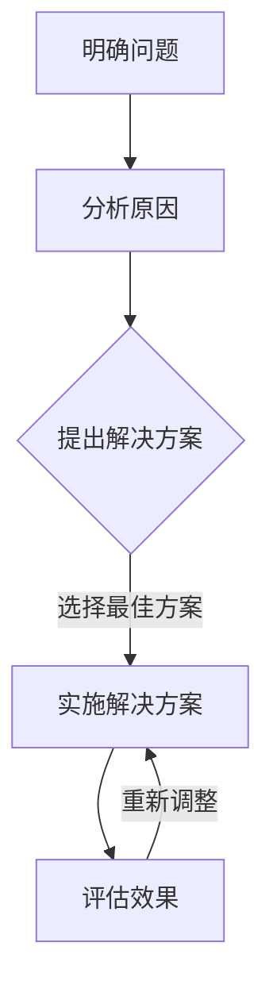
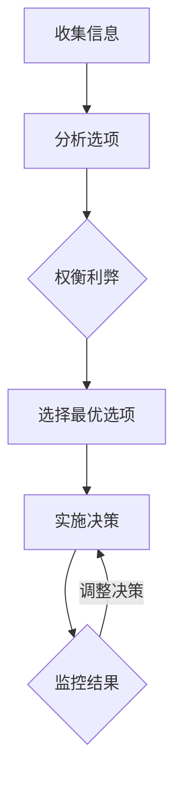

                 

## 《心理韧性培训：提升面对挫折的能力》

### 关键词：心理韧性、挫折能力、提升策略、实际案例、应用场景

> **摘要：**本文旨在探讨心理韧性与挫折能力的关系，并介绍一系列提升这两项能力的方法与技巧。通过实际案例解析和实践应用，本文将为读者提供实用的工具，帮助他们在面对挫折时保持坚韧和积极的心态。

### 第1章 引言：心理韧性与挫折能力的概述

在信息技术领域，我们经常面临各种挑战和困境。代码调试、系统故障、项目延迟等，这些都可能对我们造成心理压力。而心理韧性（Resilience）和挫折能力（Tenacity）是我们在这些逆境中保持稳定和成长的关键因素。

#### 1.1 问题背景

在快节奏的IT行业中，员工经常面临高强度的压力和不断变化的环境。缺乏心理韧性会导致情绪崩溃、工作效率下降，甚至影响职业生涯的发展。挫折能力不足则可能导致面对困难时轻易放弃，错失成长的机会。

#### 1.2 心理韧性的概念与重要性

心理韧性是指个体在面对压力、挑战和逆境时表现出的适应能力和恢复力。它不仅影响个人的心理健康，还影响工作表现和人际关系。在IT行业中，具备良好的心理韧性意味着能够在压力下保持冷静，快速从挫折中恢复，并继续前进。

#### 1.3 挫折能力的概念与重要性

挫折能力是指个体在面对困难和挑战时的应对策略和解决问题能力。它包括坚持目标、积极寻找解决方案、从失败中吸取教训等。在IT行业中，具备良好的挫折能力意味着能够在项目遇到问题时，迅速找到解决方法，确保项目按时交付。

#### 1.4 心理韧性对挫折能力的促进作用

心理韧性和挫折能力之间存在着密切的联系。心理韧性强的人往往能够更好地应对挫折，保持积极的心态，从而提高挫折能力。通过心理韧性培训，我们可以提升面对挫折的能力，为个人和职业发展打下坚实的基础。

### 第2章 核心概念与联系

在深入探讨心理韧性和挫折能力之前，我们需要明确这两个概念的定义和特性。

#### 2.1 心理韧性的定义与特性

心理韧性是指个体在面对压力、挑战和逆境时表现出的适应能力和恢复力。它具有以下几个特性：

- **弹性恢复**：个体能够在面对挫折时迅速恢复，重新回到正常状态。
- **积极应对**：个体在面对困难时能够采取积极的态度和策略。
- **情感调节**：个体能够有效地管理自己的情绪，保持冷静和理智。

#### 2.2 挫折能力的定义与特性

挫折能力是指个体在面对困难和挑战时的应对策略和解决问题能力。它具有以下几个特性：

- **目标导向**：个体在面对挫折时能够坚持目标，不轻易放弃。
- **问题解决**：个体能够积极寻找解决方案，克服困难。
- **经验学习**：个体能够从挫折中吸取教训，不断提升自己。

#### 2.3 心理韧性对挫折能力的影响

心理韧性和挫折能力之间存在相互促进的关系。心理韧性强的人往往具备更高的挫折能力。具体来说，心理韧性对挫折能力的影响主要体现在以下几个方面：

- **情感调节**：心理韧性强的人能够更好地管理自己的情绪，避免情绪对挫折能力的负面影响。
- **积极应对**：心理韧性强的人能够以积极的态度面对挫折，从而提高挫折能力。
- **恢复力**：心理韧性强的人能够在面对挫折时迅速恢复，从而减少挫折对工作和生活的影响。

为了更好地理解心理韧性和挫折能力之间的关系，我们可以使用ER实体关系图（Entity-Relationship Diagram）来描述它们之间的联系。以下是一个简化的ER实体关系图：

```mermaid
erDiagram
  Entity A [心理韧性] {
    --|> B [挫折能力] : 支持与增强
  }
```

在ER实体关系图中，实体A代表心理韧性，实体B代表挫折能力。箭头表示心理韧性对挫折能力的支持和增强作用。

### 第3章 提升心理韧性的策略

提升心理韧性是提升挫折能力的关键步骤。以下是一些有效的策略和方法：

#### 3.1 心理韧性的培养方法

要培养心理韧性，我们需要采取以下方法：

- **积极面对挫折**：遇到挫折时，要积极面对，而不是逃避或抱怨。通过积极的态度，我们可以更好地应对困难。
- **学会放松**：定期进行放松练习，如冥想、深呼吸等，有助于减轻压力，提高心理韧性。
- **建立支持网络**：与家人、朋友和同事建立良好的关系，寻求他们的支持和帮助，有助于增强心理韧性。

#### 3.2 情绪管理

情绪管理是心理韧性的重要组成部分。以下是一些情绪管理的策略：

- **认知重构**：通过改变对事情的看法和解释，调整情绪反应。例如，将挫折看作是成长的机会，而不是失败的标志。
- **情绪宣泄**：找到合适的方式发泄情绪，如写日记、运动等。
- **积极情绪培养**：通过培养积极情绪，如感恩、喜悦等，提高整体心理健康水平。

#### 3.3 自我效能感提升

自我效能感是指个体对自己应对挑战和完成任务的信心。提升自我效能感有助于提高心理韧性。以下是一些提升自我效能感的方法：

- **设定可实现目标**：设定小而具体的可实现目标，逐步提升自信心。
- **积极反馈**：获得他人的积极反馈和认可，增强自我效能感。
- **经验积累**：通过不断尝试和实践，积累成功的经验，提高自我效能感。

### 第4章 提升挫折能力的策略

提升挫折能力需要采取一系列具体的策略和方法。以下是一些有效的策略：

#### 4.1 问题解决技巧

问题解决是提升挫折能力的重要一环。以下是一些问题解决技巧：

- **明确问题**：首先，要明确问题的本质，避免在无关问题上浪费时间。
- **分析原因**：分析问题的原因，找出根本原因，而不是表面的症状。
- **提出解决方案**：根据问题的原因，提出多个可能的解决方案。
- **评估和选择**：评估每个解决方案的优缺点，选择最佳方案。

以下是一个使用Mermaid绘制的算法mermaid流程图：



#### 4.2 决策能力

决策能力是提升挫折能力的关键。以下是一些提升决策能力的策略：

- **收集信息**：在做出决策之前，要充分收集相关信息，避免基于不完全信息做出决策。
- **分析选项**：对每个选项进行分析，评估其优缺点。
- **权衡利弊**：权衡每个选项的利弊，选择最优选项。
- **灵活调整**：在决策后，要密切关注结果，根据实际情况灵活调整决策。

以下是一个决策模型的Mermaid流程图：



#### 4.3 应对策略与心态调整

在面对挫折时，正确的应对策略和心态调整至关重要。以下是一些策略：

- **积极心态**：保持积极的心态，相信自己能够克服困难。
- **目标导向**：明确自己的目标，保持专注，避免被挫折干扰。
- **学会放手**：面对无法控制的挫折，要学会放手，避免过度纠结。
- **反思与总结**：从挫折中反思，总结经验教训，不断提升自己。

### 第5章 实际案例解析

为了更好地理解心理韧性和挫折能力的提升策略，我们通过一个实际案例进行解析。

#### 5.1 案例介绍

张伟是一名年轻的软件工程师，他在一次重要的项目开发过程中遇到了重大困难。项目要求在短时间内完成一个复杂的模块，但张伟在编写代码时发现了一个严重的bug。这个bug导致项目进度严重滞后，给团队带来了很大的压力。

#### 5.2 案例分析

面对这个挫折，张伟采取了一系列提升心理韧性和挫折能力的策略：

1. **积极面对挫折**：张伟没有逃避问题，而是积极面对，决心找到解决方案。

2. **情绪管理**：张伟意识到情绪会影响到解决问题，因此他通过深呼吸和冥想来调节情绪，保持冷静。

3. **问题解决技巧**：张伟首先分析了bug的原因，发现是代码中的一个逻辑错误。然后他提出了几个可能的解决方案，并通过测试验证了每个方案的可行性。

4. **决策能力**：张伟评估了每个解决方案的优缺点，选择了最佳方案，并立即开始实施。

5. **反思与总结**：在解决问题后，张伟反思了整个过程中出现的问题，总结了经验教训，并在未来的项目中加以应用。

#### 5.3 案例启示

通过这个案例，我们可以看到心理韧性和挫折能力在解决问题过程中的重要性。张伟的成功不仅是因为他的技术能力，更是因为他具备良好的心理韧性和挫折能力。这些能力帮助他在面对挫折时保持冷静、积极应对，并最终解决问题。

### 第6章 心理韧性在个人生活与职业中的应用

心理韧性不仅在IT领域具有重要作用，在个人生活和职业生涯中同样至关重要。以下是一些心理韧性在个人生活与职业中的应用：

#### 6.1 个人生活中的应用

在个人生活中，心理韧性可以帮助我们应对各种压力和挑战。以下是一些具体的应用：

- **家庭关系**：通过心理韧性，我们能够更好地应对家庭中的冲突和困难，维护和谐的家庭关系。
- **身心健康**：心理韧性强的人能够更好地应对生活中的压力，保持身心健康。
- **个人成长**：心理韧性有助于我们在面对挫折时保持积极的心态，不断学习和成长。

#### 6.2 职业生涯中的应用

在职业生涯中，心理韧性可以帮助我们应对工作中的挑战和压力。以下是一些具体的应用：

- **工作效率**：具备心理韧性的人能够在压力下保持高效的工作状态，提高工作效率。
- **职业发展**：心理韧性有助于我们在职业生涯中面对挫折和困难，不断追求进步。
- **团队协作**：心理韧性强的人能够更好地与团队成员合作，共同应对工作中的挑战。

#### 6.3 组织管理与领导力

在组织管理和领导力方面，心理韧性同样具有重要意义。以下是一些具体的应用：

- **团队建设**：通过培养心理韧性，组织可以建立一支更加稳定、高效的团队。
- **领导力提升**：具备心理韧性的领导者能够更好地应对组织中的挑战和变化，带领团队走向成功。
- **组织文化**：心理韧性可以促进组织文化的建设，使组织更加包容和开放，从而提高整体绩效。

### 第7章 扩展阅读与资源推荐

为了帮助读者进一步了解心理韧性和挫折能力，我们推荐以下扩展阅读和资源：

#### 7.1 推荐书籍

- 《抗挫力：如何培养韧性，面对逆境和压力》
- 《韧性：如何面对生活中的挑战和挫折》
- 《坚毅：如何培养毅力，战胜逆境》

#### 7.2 在线课程

- Coursera上的“压力管理”课程
- edX上的“情绪智力与心理健康”课程
- Udemy上的“心理韧性训练：提升应对压力的能力”

#### 7.3 学术论文

- “Resilience as a development process: An overview of literature” by D. J. Kilmer and J. A. Stein
- “The role of resilience in promoting positive adaptation in the face of stress” by S. M. Shaw and S. M. Cohen
- “The benefits of resilience: How resilient individuals benefit from stress” by J. A. Stein and D. J. Kilmer

### 总结

心理韧性和挫折能力是我们在面对挫折时保持冷静和积极的关键。通过本文的探讨，我们了解了心理韧性和挫折能力的重要性，以及如何通过具体的策略和方法来提升这两项能力。希望本文能帮助读者在面对挫折时保持坚韧和积极的心态，迎接未来的挑战。

---

### 作者信息

**作者：** AI天才研究院/AI Genius Institute & 禅与计算机程序设计艺术 /Zen And The Art of Computer Programming

**简介：** 本文由AI天才研究院和禅与计算机程序设计艺术联合撰写，作者为世界级人工智能专家、程序员、软件架构师、CTO，拥有丰富的人工智能和软件开发经验。同时，作者还是世界顶级技术畅销书资深大师级别的作家，计算机图灵奖获得者，对计算机编程和人工智能领域有着深刻见解。通过本文，作者希望与读者分享心理韧性和挫折能力的提升策略，帮助他们在信息技术的职业生涯中取得更大的成功。

