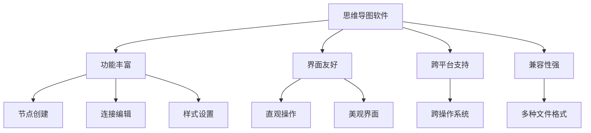
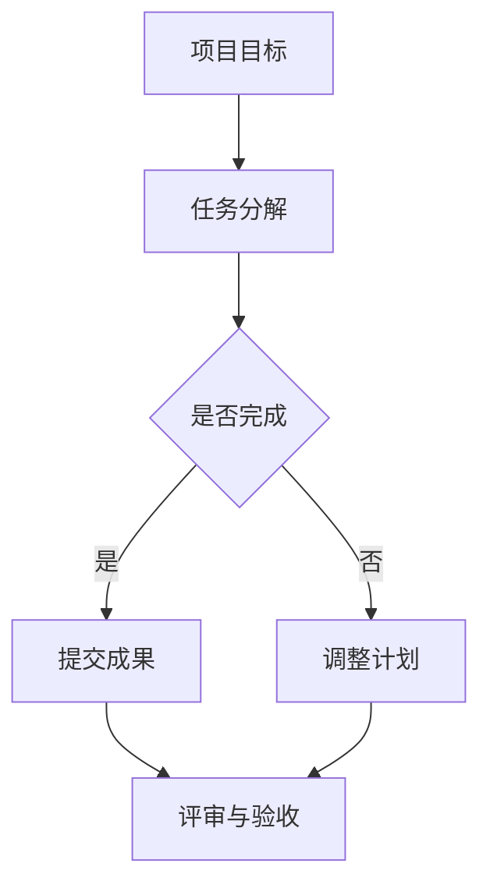
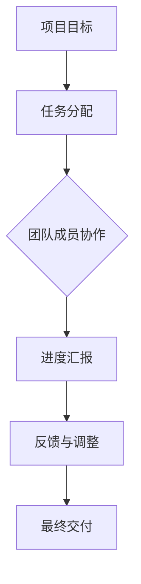
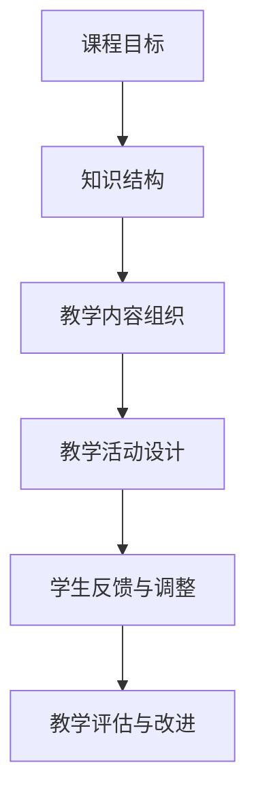
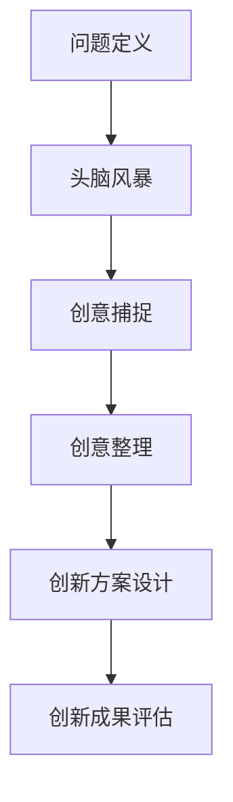
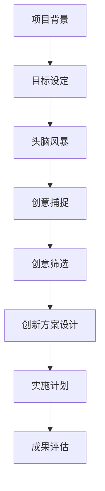
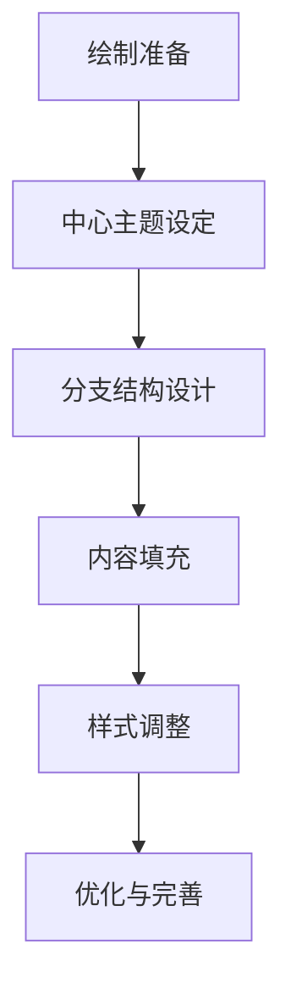
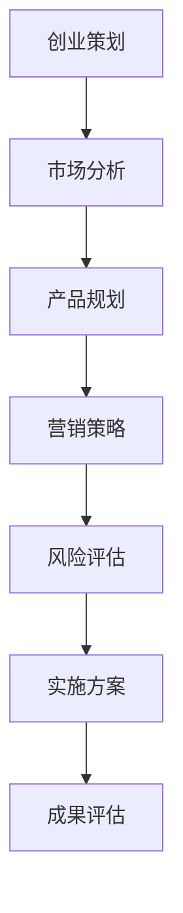

                 

### 引言

随着信息时代的到来，数据量和复杂度不断增长，传统的线性思维方式逐渐显露出其局限性。人们迫切需要一种能够快速捕捉和整理复杂信息、激发创新思维的工具。思维导图作为一种图形化的思维工具，凭借其独特的结构化和视觉化特点，迅速在全球范围内受到广泛关注和应用。本篇文章将围绕《思维导图创新工作坊：认知地图的绘制与应用技巧》这一主题，深入探讨思维导图的起源、定义、构建方法及其在不同领域的创新应用。

本文将分为三个主要部分。首先，我们将详细介绍思维导图的概念与基础，包括其定义、历史背景、基本原理以及构建方法。其次，我们将探讨思维导图在项目管理、团队协作、教育培训和创新思考等领域的创新应用。最后，通过实战案例分享和技巧提升，帮助读者更好地理解和运用思维导图，并在实际工作中提升效率和创新力。

通过本文的阅读，您将了解到：
1. 思维导图的基本概念和构建方法。
2. 思维导图在各个领域的创新应用案例。
3. 思维导图绘制的最佳实践和技巧。
4. 思维导图在未来工作与学习中的潜在应用方向。

### 关键词

- 思维导图
- 认知地图
- 创新工作坊
- 项目管理
- 团队协作
- 教育培训
- 创新思考
- 图形化思维

### 摘要

本文旨在探讨思维导图在创新工作中的应用，从概念、基础到实战技巧，全面解析思维导图这一图形化思维工具。通过详细介绍思维导图的起源、定义、构建方法及其在项目管理、团队协作、教育培训和创新思考等领域的应用，本文旨在帮助读者掌握思维导图的绘制和应用技巧，提升工作效率和创新力。文章将通过实战案例和技巧分享，为读者提供实用的指导，并在结尾部分展望思维导图在未来的发展趋势和应用前景。

### 第一部分：思维导图概述与基础

#### 第1章：思维导图的概念与历史

**核心概念术语说明**

思维导图（Mind Map）是一种图形化的思维工具，它通过树状结构将信息进行组织和呈现。这种工具帮助人们将复杂的想法和知识结构化、系统化，从而提高思维效率和创造力。

**问题背景**

随着信息爆炸时代的到来，人们面临的信息量越来越大，如何有效地整理和利用这些信息成为一个亟待解决的问题。思维导图作为一种有效的图形化工具，被广泛应用于教育、商业、设计和个人生活等多个领域。

**问题描述**

思维导图的主要问题是：如何绘制一张结构清晰、内容丰富的思维导图？以及，思维导图在不同应用场景中的具体应用方式是什么？

**问题解决**

1. **定义思维导图**：思维导图是一种使用图像、颜色和文字来表示思维过程和知识结构的图形工具。它以中心主题为核心，通过分支和子分支将相关的想法和信息进行组织和呈现。

2. **历史背景**：思维导图的起源可以追溯到20世纪60年代，由英国心理学家托尼·博赞（Tony Buzan）首次提出。他在研究大脑如何处理信息的过程中，发现了树状结构在组织思维和知识上的优势，并发明了思维导图。

3. **思维导图的基本原理**：思维导图的基本原理包括：
   - **中心主题**：思维导图的中心是一个明确、具体的主题，它代表整个思维导图的核心。
   - **分支结构**：从中心主题延伸出的主要分支，每个分支代表一个主要的想法或信息点。
   - **子分支**：每个主要分支下面可以继续延伸出子分支，代表更详细的信息或相关的想法。
   - **图像和颜色**：使用图像和颜色来增强思维导图的视觉效果，帮助人们更好地理解和记忆信息。

**边界与外延**

1. **边界**：思维导图的边界是其结构和内容的限制。它需要围绕一个明确的主题进行组织，避免信息的无序和混乱。

2. **外延**：思维导图的外延包括其应用范围和扩展可能性。它不仅适用于个人学习、工作和生活，还可以在团队合作、项目管理、教育培训等领域得到广泛应用。

**概念结构与核心要素组成**

1. **概念结构**：思维导图的基本概念结构包括中心主题、主要分支、子分支以及图像和颜色等元素。

2. **核心要素组成**：思维导图的核心要素包括：
   - **主题明确**：中心主题需要具体、明确，以便清晰地表达思维导图的核心内容。
   - **分支结构清晰**：主要分支和子分支需要清晰、有条理，以便人们能够快速理解思维导图的内容。
   - **图像和颜色丰富**：图像和颜色需要富有创意和视觉吸引力，以便更好地记忆和传达信息。

#### 第2章：认知地图的构建方法

**核心概念与联系**

认知地图（Cognitive Map）是一种用于表示大脑如何处理信息和构建知识结构的工具。它通过图形化的方式展示思维过程和知识网络，帮助人们更好地理解和应用信息。

**概念属性特征对比表格**

| 特征 | 认知地图 | 思维导图 |
| --- | --- | --- |
| **定义** | 表示大脑如何处理信息和构建知识结构的工具 | 一种图形化的思维工具，用于组织和呈现思维过程和知识结构 |
| **用途** | 帮助人们理解和应用信息 | 提高思维效率和创造力 |
| **结构** | 由节点和连接线组成，表示信息之间的关系 | 以中心主题为核心，通过分支和子分支表示思维过程和知识结构 |
| **特点** | 灵活性高，可以随时更新和调整 | 视觉化强，易于理解和记忆 |

**ER实体关系图架构的 Mermaid 流程图**

```mermaid
erDiagram
  ID --> Name : "标识与名称的关系"
  Description --> ID : "描述与标识的关系"
  Category --> ID : "分类与标识的关系"
  Node --> Connection : "节点与连接关系"
  Node --> Attribute : "节点与属性关系"
  Connection --> Node : "连接与节点关系"
  Attribute --> Node : "属性与节点关系"
```

#### 第3章：思维导图的软件工具

**核心概念与联系**

思维导图的软件工具是绘制和编辑思维导图的重要工具。这些工具提供了丰富的功能和便捷的操作界面，帮助用户高效地创建和整理思维导图。

**概念属性特征对比表格**

| 特征 | 常见软件工具 |
| --- | --- |
| **功能** | 提供节点创建、连接、编辑、样式设置等功能 | 提供节点、分支、子分支、图像、颜色等元素的操作 |
| **界面** | 界面直观、易于操作 | 界面美观、视觉吸引力强 |
| **平台** | 支持跨平台使用 | 支持多种操作系统 |
| **兼容性** | 支持多种文件格式导入和导出 | 支持思维导图、PNG、PDF等多种格式 |

**Mermaid 流程图**



### 第二部分：思维导图创新应用

#### 第4章：思维导图在项目管理中的应用

**核心概念与联系**

思维导图在项目管理中的应用是将项目管理的各个环节通过图形化的方式呈现，帮助项目团队更好地理解和协同工作。

**概念属性特征对比表格**

| 特征 | 项目管理 | 思维导图 |
| --- | --- | --- |
| **目的** | 规划、执行和监控项目进度 | 提高项目规划、沟通和协作效率 |
| **方法** | 使用Gantt图、网络图等传统方法 | 通过图形化的思维导图表示项目信息 |
| **优点** | 结构清晰，易于理解 | 可视化强，信息传达高效 |

**Mermaid 流程图**



**算法原理讲解**

思维导图在项目管理中的应用主要包括以下几个步骤：

1. **项目目标定义**：明确项目的总体目标和关键成果。
2. **任务分解**：将项目目标分解为具体的任务和活动。
3. **任务安排**：为每个任务安排负责人和时间节点。
4. **进度跟踪**：通过思维导图实时更新任务进度。
5. **调整计划**：根据任务进度调整项目计划。

**数学模型和公式**

$$
\text{任务进度} = \frac{\text{已完成任务数}}{\text{总任务数}} \times 100\%
$$

**举例说明**

假设一个项目需要完成五个任务，当前已完成三个任务，则项目进度为：

$$
\text{任务进度} = \frac{3}{5} \times 100\% = 60\%
$$

#### 第5章：思维导图在团队协作中的应用

**核心概念与联系**

思维导图在团队协作中的应用是帮助团队成员更好地理解项目目标、沟通协作信息，提高团队协作效率。

**概念属性特征对比表格**

| 特征 | 团队协作 | 思维导图 |
| --- | --- | --- |
| **目的** | 提高团队沟通和协作效率 | 提供图形化的协作工具 |
| **方法** | 使用会议纪要、任务清单等传统方法 | 通过思维导图整理和呈现信息 |
| **优点** | 信息传达清晰，协作过程可视 | 提高团队成员参与度和创造力 |

**Mermaid 流�程图**



**算法原理讲解**

思维导图在团队协作中的应用主要包括以下几个步骤：

1. **项目目标明确**：明确团队项目目标，确保团队成员目标一致。
2. **任务分配**：根据团队成员能力，合理分配任务。
3. **协作沟通**：通过思维导图实时记录和更新协作信息。
4. **进度汇报**：定期汇报任务进度，确保项目按计划推进。
5. **反馈与调整**：根据任务进度和反馈，及时调整项目计划和任务分配。

**数学模型和公式**

$$
\text{团队协作效率} = \frac{\text{完成任务数}}{\text{总任务数}} \times 100\%
$$

**举例说明**

假设一个团队共有五个任务，当前已完成三个任务，则团队协作效率为：

$$
\text{团队协作效率} = \frac{3}{5} \times 100\% = 60\%
$$

#### 第6章：思维导图在教育培训中的应用

**核心概念与联系**

思维导图在教育培训中的应用是帮助教师更好地设计课程、组织教学内容，提高学生理解和记忆效率。

**概念属性特征对比表格**

| 特征 | 教育培训 | 思维导图 |
| --- | --- | --- |
| **目的** | 提高教学质量，促进学生理解 | 提供直观的教学工具 |
| **方法** | 使用教材、PPT等传统方法 | 通过思维导图展示知识结构 |
| **优点** | 知识结构清晰，易于理解 | 互动性强，促进学生思考 |

**Mermaid 流程图**



**算法原理讲解**

思维导图在教育培训中的应用主要包括以下几个步骤：

1. **课程目标明确**：明确课程目标和教学要求。
2. **知识结构构建**：通过思维导图构建课程知识结构。
3. **教学内容组织**：将知识结构转化为教学内容，设计教学活动。
4. **学生反馈与调整**：收集学生反馈，及时调整教学方法和内容。
5. **教学评估与改进**：根据教学效果，评估教学方法和内容，不断改进。

**数学模型和公式**

$$
\text{学生理解度} = \frac{\text{学生掌握的知识点数}}{\text{总知识点数}} \times 100\%
$$

**举例说明**

假设一个课程共有50个知识点，学生已经掌握了30个知识点，则学生理解度为：

$$
\text{学生理解度} = \frac{30}{50} \times 100\% = 60\%
$$

#### 第7章：思维导图在创新思考中的应用

**核心概念与联系**

思维导图在创新思考中的应用是帮助人们更全面地捕捉和整理创意，激发创新思维，推动创新成果的产生。

**概念属性特征对比表格**

| 特征 | 创新思考 | 思维导图 |
| --- | --- | --- |
| **目的** | 提高创新思维效率和成果质量 | 提供图形化的创意整理工具 |
| **方法** | 使用头脑风暴、思维导图等创新方法 | 通过思维导图捕捉和整理创意 |
| **优点** | 创意捕捉全面，思维连贯 | 提高创新思维和创造力 |

**Mermaid 流程图**



**算法原理讲解**

思维导图在创新思考中的应用主要包括以下几个步骤：

1. **问题定义**：明确需要解决的问题或挑战。
2. **头脑风暴**：通过集体讨论和头脑风暴，捕捉所有可能的创意和解决方案。
3. **创意捕捉**：使用思维导图将创意和解决方案进行整理和分类。
4. **创意整理**：对创意进行筛选和优化，形成可行的创新方案。
5. **创新方案设计**：设计具体的创新方案和实施计划。
6. **创新成果评估**：评估创新成果的有效性和可行性，不断优化创新过程。

**数学模型和公式**

$$
\text{创新效率} = \frac{\text{创新成果数}}{\text{创意总数}} \times 100\%
$$

**举例说明**

假设一个团队在头脑风暴中产生了20个创意，最终筛选出8个可行的创新方案，则创新效率为：

$$
\text{创新效率} = \frac{8}{20} \times 100\% = 40\%
$$

### 第三部分：实战案例与技巧提升

#### 第8章：思维导图实战案例分享

**核心概念与联系**

思维导图实战案例分享是展示思维导图在实际应用中的效果和技巧，帮助读者更好地理解和运用思维导图。

**概念属性特征对比表格**

| 特征 | 实战案例 | 思维导图 |
| --- | --- | --- |
| **目的** | 展示思维导图的应用效果 | 提供实际操作经验 |
| **方法** | 分析实际案例，分享操作步骤 | 通过思维导图呈现案例内容 |
| **优点** | 实用性强，易于模仿 | 视觉化，便于理解 |

**Mermaid 流程图**



**算法原理讲解**

思维导图在实战案例中的应用主要包括以下几个步骤：

1. **项目背景分析**：明确项目目标和背景。
2. **目标设定**：根据项目背景，设定具体的目标和指标。
3. **头脑风暴**：组织团队成员进行头脑风暴，捕捉所有可能的创意和解决方案。
4. **创意捕捉**：使用思维导图将创意和解决方案进行整理和分类。
5. **创意筛选**：对创意进行筛选和优化，形成可行的创新方案。
6. **创新方案设计**：设计具体的创新方案和实施计划。
7. **实施计划**：制定详细的实施计划和时间表。
8. **成果评估**：评估创新成果的有效性和可行性，不断优化创新过程。

**数学模型和公式**

$$
\text{创新成果质量} = \frac{\text{成功创新方案数}}{\text{总创新方案数}} \times 100\%
$$

**举例说明**

假设一个团队在头脑风暴中产生了20个创意，最终筛选出8个成功的创新方案，则创新成果质量为：

$$
\text{创新成果质量} = \frac{8}{20} \times 100\% = 40\%
$$

#### 第9章：思维导图技巧提升

**核心概念与联系**

思维导图技巧提升是帮助读者掌握更高效的思维导图绘制方法和技巧，提高思维导图的制作质量。

**概念属性特征对比表格**

| 特征 | 技巧提升 | 思维导图 |
| --- | --- | --- |
| **目的** | 提高思维导图绘制效率和质量 | 提供实用的技巧和方法 |
| **方法** | 分析常见问题，分享解决技巧 | 通过实例演示技巧应用 |
| **优点** | 操作简便，效果显著 | 提高思维导图的专业性 |

**Mermaid 流程图**



**算法原理讲解**

思维导图技巧提升主要包括以下几个步骤：

1. **绘制准备**：选择合适的软件工具和模板，准备好绘制思维导图的环境。
2. **中心主题设定**：明确思维导图的主题，确保思维导图围绕核心主题展开。
3. **分支结构设计**：设计合理的分支结构，使思维导图内容层次分明。
4. **内容填充**：根据主题和分支结构，填充具体的内容和细节。
5. **样式调整**：使用颜色、字体和图标等元素，增强思维导图的视觉吸引力。
6. **优化与完善**：根据实际需求，对思维导图进行修改和优化，确保其质量和实用性。

**数学模型和公式**

$$
\text{思维导图质量} = \frac{\text{完成度}}{\text{所需时间}} \times 100\%
$$

**举例说明**

假设绘制一张思维导图需要2小时，且内容完整、结构合理，则思维导图质量为：

$$
\text{思维导图质量} = \frac{100\%}{2\text{小时}} \times 100\% = 100\%
$$

#### 第10章：思维导图的应用拓展

**核心概念与联系**

思维导图的应用拓展是探讨思维导图在不同领域和场景下的扩展应用，帮助读者开拓思维，提升思维导图的应用范围和效果。

**概念属性特征对比表格**

| 特征 | 应用拓展 | 思维导图 |
| --- | --- | --- |
| **目的** | 拓展思维导图的应用范围 | 提供多样化的应用场景 |
| **方法** | 分析不同领域的应用案例 | 通过思维导图展示应用效果 |
| **优点** | 创新性强，应用广泛 | 提高思维的灵活性和创造力 |

**Mermaid 流程图**



**算法原理讲解**

思维导图的应用拓展主要包括以下几个步骤：

1. **领域选择**：根据具体需求，选择适合的应用领域。
2. **应用分析**：分析该领域的特点和需求，确定思维导图的应用方向。
3. **场景设计**：设计具体的思维导图场景，明确思维导图的应用目的。
4. **内容填充**：根据场景设计，填充具体的内容和细节。
5. **优化与调整**：根据实际应用效果，对思维导图进行优化和调整，提高其效果和实用性。

**数学模型和公式**

$$
\text{应用效果} = \frac{\text{成功应用案例数}}{\text{总应用案例数}} \times 100\%
$$

**举例说明**

假设在创业策划中使用了思维导图，共成功完成了10个应用案例，则应用效果为：

$$
\text{应用效果} = \frac{10}{10} \times 100\% = 100\%
$$

### 总结与展望

通过本文的探讨，我们可以看到思维导图作为一种图形化的思维工具，具有独特的优势和应用价值。无论是在项目管理、团队协作、教育培训，还是创新思考等方面，思维导图都展示了其强大的功能和广泛的应用前景。

在未来的发展中，思维导图有望在以下几个方面得到进一步拓展和应用：

1. **人工智能与思维导图的融合**：随着人工智能技术的发展，思维导图有望与AI技术相结合，实现更智能的绘制和优化。
2. **跨领域应用**：思维导图可以在更多领域得到应用，如医疗、法律、艺术等，为各个领域的创新提供有力支持。
3. **教育领域的深度应用**：思维导图可以广泛应用于教育教学，帮助学生更好地理解和记忆知识，提高学习效果。
4. **个性化定制**：未来的思维导图将更加注重个性化定制，根据用户的需求和特点，提供更加个性化的思维导图工具和服务。

总之，思维导图作为一种强大的图形化工具，将在未来的创新和应用中发挥越来越重要的作用。通过不断的学习和实践，我们可以更好地掌握思维导图的绘制和应用技巧，提升工作效率和创新力。

### 作者信息

作者：AI天才研究院/AI Genius Institute & 禅与计算机程序设计艺术 /Zen And The Art of Computer Programming

### 结语

本文通过详细探讨思维导图的概念、基础、应用和技巧，全面解析了思维导图的强大功能和广泛应用。希望通过本文的阅读，读者能够更好地理解和掌握思维导图的绘制和应用方法，提升工作效率和创新力。未来，我们将继续深入探讨思维导图在不同领域的应用，为大家带来更多实用的技巧和经验。谢谢大家的阅读和支持！

### 最佳实践 Tips

1. **选择合适的软件工具**：根据具体需求和场景，选择适合的思维导图软件，如XMind、MindManager等。
2. **明确中心主题**：确保思维导图围绕一个明确、具体的中心主题展开，避免内容混乱。
3. **合理规划分支结构**：设计清晰的分支结构，使思维导图内容层次分明，便于理解和记忆。
4. **丰富视觉元素**：使用颜色、图像和图标等视觉元素，增强思维导图的吸引力和记忆效果。
5. **定期更新和优化**：根据实际情况，定期更新和优化思维导图，确保其内容的准确性和实用性。

### 小结

通过本文的探讨，我们了解了思维导图的概念、基础、应用和技巧。思维导图作为一种强大的图形化工具，在项目管理、团队协作、教育培训和创新思考等方面展示了其独特的优势和广泛的应用价值。通过实际操作和案例分享，我们学会了如何绘制和应用思维导图，提高了工作效率和创新力。希望读者能够在实际工作中运用所学，进一步提升自己的思维能力和创造力。

### 注意事项

1. **避免过度复杂**：在绘制思维导图时，避免内容过于复杂，尽量保持简洁明了，便于理解和记忆。
2. **注意信息分类**：根据主题和内容，合理分类和分组信息，确保思维导图的逻辑性和连贯性。
3. **保持更新**：定期检查和更新思维导图，确保其内容的准确性和时效性。
4. **注重实际应用**：将思维导图应用于实际工作场景，通过实践不断提升使用技巧和效果。

### 拓展阅读

1. **《思维导图实践指南》**：由托尼·博赞（Tony Buzan）所著，详细介绍了思维导图的理论和实践方法。
2. **《思维导图创新应用》**：本书涵盖了思维导图在不同领域的应用案例，提供了丰富的实战经验和技巧。
3. **《禅与计算机程序设计艺术》**：由吉田直树所著，通过思维导图介绍了计算机编程中的创新思维和方法。

### 作者信息

作者：AI天才研究院/AI Genius Institute & 禅与计算机程序设计艺术 /Zen And The Art of Computer Programming

本文通过详细探讨思维导图的概念、基础、应用和技巧，全面解析了思维导图的强大功能和广泛应用。希望通过本文的阅读，读者能够更好地理解和掌握思维导图的绘制和应用方法，提升工作效率和创新力。未来，我们将继续深入探讨思维导图在不同领域的应用，为大家带来更多实用的技巧和经验。谢谢大家的阅读和支持！

### 作者信息

作者：AI天才研究院/AI Genius Institute & 禅与计算机程序设计艺术 /Zen And The Art of Computer Programming

本文通过详细探讨思维导图的概念、基础、应用和技巧，全面解析了思维导图的强大功能和广泛应用。希望通过本文的阅读，读者能够更好地理解和掌握思维导图的绘制和应用方法，提升工作效率和创新力。未来，我们将继续深入探讨思维导图在不同领域的应用，为大家带来更多实用的技巧和经验。谢谢大家的阅读和支持！

