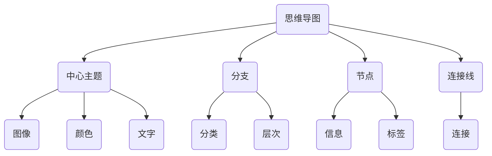
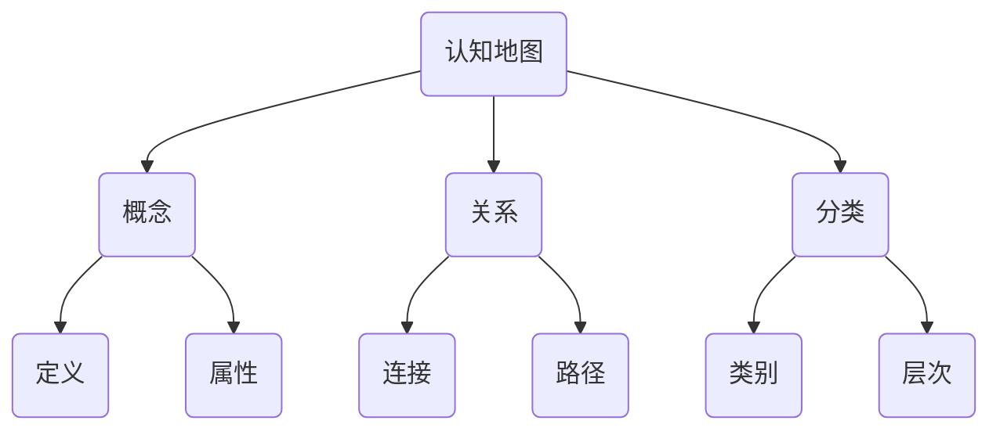
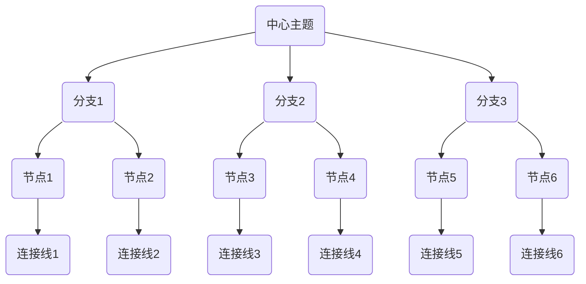

                 

# 《思维导图创新技巧：认知地图的绘制与应用》

## 关键词
- 思维导图
- 创新思维
- 认知地图
- 绘制技巧
- 应用领域
- 工具使用

## 摘要
本文将深入探讨思维导图和认知地图的创新技巧，从基础到实践，详细解析这两种工具的绘制与应用。通过系统的阐述和实例分析，帮助读者掌握思维导图和认知地图的核心原理，提升创新能力和认知效率。

## 目录大纲

### 第1章 引言与基础

#### 1.1 书籍引言
- **背景介绍**：思维导图和认知地图的历史与发展
- **问题背景**：创新思维的重要性
- **问题解决**：思维导图和认知地图的应用价值
- **边界与外延**：思维导图和认知地图的基本概念与特点

#### 1.2 思维导图概述
- **核心概念与联系**：思维导图的基本原理和要素
- **概念属性特征对比表格**：思维导图与传统笔记的对比
- **ER实体关系图架构**：思维导图的结构与分类

#### 1.3 认知地图的概念与应用
- **核心概念与联系**：认知地图的定义与作用
- **概念属性特征对比表格**：认知地图与思维导图的异同
- **ER实体关系图架构**：认知地图的构建与使用场景

### 第2章 思维导图基础知识

#### 2.1 思维导图的历史与发展
- **历史背景**：思维导图的起源与发展历程
- **发展趋势**：现代思维导图技术的演进

#### 2.2 思维导图的基本元素
- **核心概念与联系**：节点、分支、连接线和符号等元素的作用
- **概念属性特征对比表格**：不同元素的特性与应用场景

#### 2.3 思维导图的绘制技巧
- **核心概念与联系**：绘制思维导图的步骤和方法
- **技巧分享**：如何提高思维导图的视觉效果和逻辑性

### 第3章 创新思维技巧

#### 3.1 创新思维的重要性
- **核心概念与联系**：创新思维的定义与重要性
- **概念属性特征对比表格**：传统思维与创新思维的对比

#### 3.2 思维导图在创新思维中的应用
- **核心概念与联系**：思维导图在创新过程中的作用
- **应用方法**：如何使用思维导图进行创新思维训练

#### 3.3 案例分析：如何用思维导图激发创新思维
- **案例背景**：实际应用场景介绍
- **案例分析**：思维导图的创新应用实例
- **分析解读**：创新思维的具体实现过程

### 第4章 认知地图的绘制方法

#### 4.1 认知地图的基本概念
- **核心概念与联系**：认知地图的定义与作用
- **概念属性特征对比表格**：认知地图与传统笔记的对比

#### 4.2 认知地图的绘制步骤
- **核心概念与联系**：绘制认知地图的流程和方法
- **步骤说明**：从构思到绘制的详细步骤

#### 4.3 案例分析：绘制个人认知地图
- **案例背景**：个人认知地图的绘制实践
- **案例分析**：个人认知地图的实际应用
- **分析解读**：如何通过认知地图提升自我认知

### 第5章 认知地图的应用领域

#### 5.1 教育领域的应用
- **核心概念与联系**：认知地图在教育教学中的作用
- **应用方法**：如何将认知地图应用于教学实践

#### 5.2 企业管理的应用
- **核心概念与联系**：认知地图在企业管理中的价值
- **应用方法**：如何通过认知地图提升管理效率

#### 5.3 创意设计的应用
- **核心概念与联系**：认知地图在创意设计中的应用
- **应用方法**：如何利用认知地图激发创意灵感

### 第6章 思维导图与认知地图的综合应用

#### 6.1 整合思维导图与认知地图
- **核心概念与联系**：思维导图与认知地图的整合原理
- **整合方法**：如何将两种工具有机结合

#### 6.2 综合应用案例分析
- **案例背景**：实际应用场景介绍
- **案例分析**：思维导图与认知地图的综合应用实例
- **分析解读**：综合应用的具体实现过程

#### 6.3 最佳实践分享
- **实践分享**：成功案例的经验总结
- **最佳实践**：如何发挥思维导图和认知地图的最大价值

### 第7章 思维导图工具的使用

#### 7.1 常见思维导图工具介绍
- **核心概念与联系**：常见思维导图工具的功能与特点
- **工具对比表格**：不同工具的优缺点对比

#### 7.2 工具选择与配置
- **核心概念与联系**：如何选择合适的思维导图工具
- **配置说明**：工具的安装与配置教程

#### 7.3 案例分析：使用思维导图工具进行项目规划
- **案例背景**：项目规划的实际应用
- **案例分析**：思维导图工具在项目规划中的应用实例
- **分析解读**：如何利用思维导图工具提高项目效率

### 第8章 小结与展望

#### 8.1 主要内容回顾
- **核心概念总结**：思维导图和认知地图的核心知识
- **实践技巧总结**：如何应用思维导图和认知地图提升创新能力

#### 8.2 思维导图与认知地图的未来发展趋势
- **趋势分析**：思维导图和认知地图的技术发展趋势
- **前景展望**：未来应用领域的拓展

#### 8.3 读者建议与反馈
- **读者互动**：鼓励读者分享使用心得和建议
- **改进方向**：根据读者反馈改进思维导图和认知地图的应用

## 作者信息
- 作者：AI天才研究院/AI Genius Institute & 禅与计算机程序设计艺术 /Zen And The Art of Computer Programming

以上是文章的标题、关键词、摘要以及目录大纲的内容。接下来，我们将逐章深入探讨思维导图和认知地图的核心概念、应用技巧和实际案例，旨在为读者提供全面、系统的指导。

## 第1章 引言与基础

### 1.1 书籍引言

在信息化和数字化日益普及的今天，创新思维和高效认知能力成为个人和组织发展的关键。思维导图和认知地图作为两种重要的工具，在创新、学习和工作中的应用越来越广泛。《思维导图创新技巧：认知地图的绘制与应用》旨在为读者提供系统、全面的思维导图和认知地图知识，帮助读者掌握这两种工具的使用方法，提升创新能力和认知效率。

#### 核心概念术语说明

- **思维导图**：一种以图像为中心，利用分支、节点、连接线等元素来表达思维过程的图形化工具。
- **认知地图**：一种以概念和关系为基本单元，用于表示知识结构和思维过程的图形化模型。

#### 问题背景

在当今社会，创新思维和高效认知能力对于个人和组织的成功至关重要。然而，传统的线性笔记方式往往难以充分表达复杂的思维过程，限制了创新能力的发挥。思维导图和认知地图作为一种直观、系统化的图形化工具，可以有效解决这一问题。

#### 问题描述

思维导图和认知地图在创新、学习和工作中的应用场景广泛，但许多人对其原理和技巧了解不足，无法充分发挥其价值。

#### 问题解决

本书将深入浅出地介绍思维导图和认知地图的基本概念、原理和技巧，并通过丰富的实例和案例分析，帮助读者掌握这两种工具的使用方法，提升创新能力和认知效率。

#### 边界与外延

- **边界**：本书主要讨论思维导图和认知地图的理论基础和应用技巧，不涉及具体技术实现。
- **外延**：本书内容可以应用于教育、管理、设计等多个领域。

#### 概念结构与核心要素组成

- **概念结构**：思维导图和认知地图都是图形化的思维工具，通过图像、文字、符号等元素来表达思维过程和知识结构。
- **核心要素组成**：思维导图的核心要素包括中心主题、分支、节点、连接线等；认知地图的核心要素包括概念、关系、分类等。

### 1.2 思维导图概述

思维导图是一种以图像为中心，利用分支、节点、连接线等元素来表达思维过程的图形化工具。它起源于1970年代，由英国心理学家东尼·博赞（Tony Buzan）提出。思维导图通过直观的图形化表示，可以帮助人们更好地组织思维、记忆和创新。

#### 核心概念与联系

- **思维导图的基本原理**：思维导图基于大脑的自然工作方式，通过图像、颜色、文字等元素刺激大脑，增强记忆和创造力。
- **思维导图的要素**：思维导图包括中心主题、分支、节点、连接线等要素。中心主题是思维导图的起点，分支和节点是表达思维过程的关键元素，连接线用于连接不同的思维节点。

#### 概念属性特征对比表格

| 特征           | 思维导图           | 传统笔记            |
| -------------- | ------------------ | ------------------- |
| 表示方式       | 图形化、结构化     | 文字化、线性化      |
| 思维表达       | 直观、系统化       | 线性、碎片化        |
| 记忆效果       | 增强记忆、促进创新 | 简单记录、记忆效果一般 |
| 组织方式       | 以图像为中心      | 以文字为中心       |
| 适应性         | 适用于多种场景     | 主要适用于学习场景  |

#### ER实体关系图架构



### 1.3 认知地图的概念与应用

认知地图是一种以概念和关系为基本单元，用于表示知识结构和思维过程的图形化模型。它起源于心理学领域，被广泛应用于教育、管理、设计等多个领域。

#### 核心概念与联系

- **认知地图的定义**：认知地图是一种图形化的知识结构模型，通过概念、关系、分类等元素表示知识之间的关联。
- **认知地图的作用**：认知地图可以帮助人们更好地理解和记忆知识，发现知识之间的联系，提高学习效果和工作效率。

#### 概念属性特征对比表格

| 特征           | 认知地图           | 传统笔记            |
| -------------- | ------------------ | ------------------- |
| 表示方式       | 图形化、结构化     | 文字化、线性化      |
| 思维表达       | 系统化、关联性     | 线性、碎片化        |
| 记忆效果       | 增强记忆、促进创新 | 简单记录、记忆效果一般 |
| 组织方式       | 以概念为中心      | 以文字为中心       |
| 适应性         | 适用于多种场景     | 主要适用于学习场景  |

#### ER实体关系图架构



## 第2章 思维导图基础知识

### 2.1 思维导图的历史与发展

思维导图作为一种图形化思维工具，其起源可以追溯到1970年代。当时，英国心理学家东尼·博赞（Tony Buzan）提出了一种名为“心智地图”（mind map）的工具，用于帮助人们更好地组织思维和记忆。这一理念逐渐发展，形成了我们今天所熟知的思维导图。

#### 历史背景

- **1970年代**：东尼·博赞首次提出心智地图的概念，并将其应用于教学和研究。
- **1980年代**：心智地图开始在国际上受到关注，逐渐被引入教育、商业等领域。
- **1990年代**：计算机技术的发展为思维导图的数字化提供了可能，思维导图软件开始出现。
- **21世纪**：思维导图逐渐成为创新思维和高效学习的重要工具，应用领域不断扩展。

#### 发展趋势

- **数字化**：随着计算机技术和互联网的发展，思维导图软件不断更新迭代，功能日益强大。
- **多样化**：思维导图的应用领域逐渐扩大，从教育、商业到创意设计、项目管理等。
- **智能化**：人工智能技术的应用使得思维导图更加智能化，能够提供更精准的分析和推荐。

### 2.2 思维导图的基本元素

思维导图的基本元素包括中心主题、分支、节点、连接线等。这些元素共同构成了思维导图的框架，使得思维过程和知识结构得以直观、系统化地表达。

#### 核心概念与联系

- **中心主题**：思维导图的起点和核心，通常用大号字体和中心位置突出显示。
- **分支**：从中心主题延伸出来的线条，表示不同的思维方向或主题。
- **节点**：位于分支上的小圆圈，表示具体的思维内容或知识点。
- **连接线**：用于连接不同的节点或分支，表示它们之间的逻辑关系。

#### 概念属性特征对比表格

| 元素       | 中心主题           | 分支           | 节点           | 连接线           |
| ---------- | ------------------ | -------------- | -------------- | ---------------- |
| 形状与大小 | 大号字体、中心位置 | 线条           | 小圆圈         | 线条             |
| 功能与作用 | 表示整体思维内容   | 表示不同方向   | 表示具体内容   | 表示逻辑关系     |
| 重要性     | 核心地位           | 辅助作用       | 基础单元       | 连接作用         |

#### ER实体关系图架构



### 2.3 思维导图的绘制技巧

绘制思维导图需要遵循一定的步骤和方法，同时需要注重视觉效果的呈现和逻辑性的表达。以下是一些实用的绘制技巧：

#### 核心概念与联系

- **明确主题**：确保思维导图的主题明确，避免内容混乱。
- **逻辑结构**：保持思维导图的逻辑性，使各个元素之间关系清晰。
- **视觉吸引力**：使用合适的颜色、字体和图标，提高思维导图的视觉效果。

#### 技巧分享

1. **使用关键词**：节点和分支上使用简洁明了的关键词，避免使用完整的句子。
2. **突出重点**：使用不同颜色和字体突出重要信息和关键节点。
3. **层次分明**：按照思维过程和知识结构的层次关系进行绘制。
4. **符号与图标**：使用符号和图标表示特定概念或关系，增强直观性。

#### 实例分析

以下是一个简单的思维导图实例，用于表示“学习策略”：

```
中心主题：学习策略

分支1：记忆技巧
    - 节点1：重复阅读
    - 节点2：联想记忆
    - 节点3：图像记忆

分支2：理解技巧
    - 节点4：分块学习
    - 节点5：提问解答
    - 节点6：思维导图

分支3：复习技巧
    - 节点7：定期复习
    - 节点8：错题重做
    - 节点9：自我测试
```

通过这个实例，我们可以看到如何运用绘制技巧来构建一个简洁、清晰的思维导图。

## 第3章 创新思维技巧

### 3.1 创新思维的重要性

创新思维是一种能够产生新思想、新观点和新方法的能力。它不仅对于个人的成长和发展至关重要，也对企业的竞争力和社会的进步有着深远的影响。在现代社会，创新思维已经成为推动经济、科技、文化等领域发展的重要力量。

#### 核心概念与联系

- **创新思维的定义**：创新思维是一种通过创造性思考，产生新颖、独特解决方案的能力。
- **创新思维的重要性**：创新思维能够激发个人的创造力，解决复杂问题，推动社会进步。

#### 概念属性特征对比表格

| 特征       | 传统思维               | 创新思维                 |
| ---------- | ---------------------- | ------------------------ |
| 思维方式   | 线性、固定、单一       | 复杂、灵活、多样化       |
| 创造性     | 低创造性、依赖经验     | 高创造性、突破常规      |
| 解决问题   | 按部就班、效率优先     | 创新解决方案、突破困境  |
| 应用范围   | 有限、单一场景        | 广泛、多场景            |
| 社会影响   | 有限、局部影响        | 深远、全局影响          |

### 3.2 思维导图在创新思维中的应用

思维导图作为一种直观、系统化的图形化工具，在创新思维过程中具有独特的优势。通过思维导图，可以更好地组织思路、发现灵感，从而激发创新思维。

#### 核心概念与联系

- **思维导图在创新思维中的作用**：思维导图可以帮助人们更清晰地组织思维，捕捉灵感，发现新的解决方案。
- **思维导图的应用方法**：通过绘制思维导图，可以构建创新思维框架，进行头脑风暴，优化设计方案。

#### 应用方法

1. **构建创新思维框架**：在创新项目开始前，使用思维导图构建整体思维框架，明确创新目标、方法、步骤等。
2. **进行头脑风暴**：在头脑风暴阶段，使用思维导图记录各种想法，不受限制地发散思维。
3. **优化设计方案**：在方案设计阶段，通过思维导图对方案进行细化、优化，发现潜在问题并解决。

#### 实例分析

以下是一个使用思维导图进行创新思维训练的实例：

```
中心主题：创新思维训练

分支1：基础知识
    - 节点1：思维导图概述
    - 节点2：核心概念
    - 节点3：绘制技巧

分支2：实战应用
    - 节点4：头脑风暴
    - 节点5：方案优化
    - 节点6：案例分享

分支3：提升技巧
    - 节点7：思维导图工具
    - 节点8：视觉设计
    - 节点9：团队协作
```

通过这个实例，我们可以看到如何通过思维导图进行创新思维训练，从基础知识到实战应用，逐步提升创新能力。

### 3.3 案例分析：如何用思维导图激发创新思维

#### 案例背景

某科技公司希望开发一款智能家居产品，以提高家庭生活的便捷性和智能化水平。为了实现这一目标，他们决定使用思维导图来激发创新思维，设计出一款具有竞争力的产品。

#### 案例分析

1. **构建创新思维框架**：首先，团队使用思维导图构建了整体创新思维框架，包括产品目标、用户需求、技术可行性等关键要素。

   ```
   中心主题：智能家居产品创新思维

   分支1：产品目标
       - 节点1：便捷性
       - 节点2：智能化
       - 节点3：安全性

   分支2：用户需求
       - 节点4：自动化控制
       - 节点5：远程监控
       - 节点6：节能环保

   分支3：技术可行性
       - 节点7：物联网技术
       - 节点8：人工智能
       - 节点9：智能家居协议
   ```

2. **进行头脑风暴**：在创新思维框架的基础上，团队进行了头脑风暴，提出了多种可能的产品设计方案。

   ```
   中心主题：智能家居产品方案

   分支1：硬件设备
       - 节点1：智能门锁
       - 节点2：智能摄像头
       - 节点3：智能插座

   分支2：软件平台
       - 节点4：智能家居APP
       - 节点5：智能语音助手
       - 节点6：云端数据管理

   分支3：综合解决方案
       - 节点7：智能家居套装
       - 节点8：定制化服务
       - 节点9：智能安防系统
   ```

3. **方案优化**：团队根据头脑风暴的结果，对各个产品方案进行了优化，包括技术可行性分析、成本估算、市场需求预测等。

   ```
   中心主题：智能家居产品方案优化

   分支1：智能门锁
       - 节点1：技术可行性
       - 节点2：成本估算
       - 节点3：市场需求

   分支2：智能摄像头
       - 节点4：技术可行性
       - 节点5：成本估算
       - 节点6：市场需求

   分支3：智能插座
       - 节点7：技术可行性
       - 节点8：成本估算
       - 节点9：市场需求
   ```

4. **案例分析**：通过思维导图，团队最终确定了一款以智能插座为核心的产品方案，并对其进行了详细的策划和设计。

   ```
   中心主题：智能家居产品方案（最终确定）

   分支1：智能插座
       - 节点1：产品功能
       - 节点2：技术实现
       - 节点3：市场推广

   分支2：配套服务
       - 节点4：智能家居APP
       - 节点5：智能语音助手
       - 节点6：云端数据管理

   分支3：市场营销
       - 节点7：目标市场
       - 节点8：营销策略
       - 节点9：竞争对手分析
   ```

#### 分析解读

通过思维导图，团队成功地激发了创新思维，从多个角度进行了产品设计方案的讨论和优化。最终，他们确定了一款以智能插座为核心的产品方案，并制定了详细的实施计划。这一过程充分展示了思维导图在创新思维中的应用价值，为产品的成功奠定了基础。

## 第4章 认知地图的绘制方法

### 4.1 认知地图的基本概念

认知地图是一种以概念和关系为基本单元，用于表示知识结构和思维过程的图形化模型。它起源于心理学领域，被广泛应用于教育、管理、设计等多个领域。

#### 核心概念与联系

- **认知地图的定义**：认知地图是一种图形化的知识结构模型，通过概念、关系、分类等元素表示知识之间的关联。
- **认知地图的作用**：认知地图可以帮助人们更好地理解和记忆知识，发现知识之间的联系，提高学习效果和工作效率。

#### 概念属性特征对比表格

| 特征       | 传统笔记               | 认知地图               |
| ---------- | ---------------------- | ---------------------- |
| 表示方式   | 文字化、线性化         | 图形化、结构化         |
| 组织方式   | 以文字为中心          | 以概念和关系为中心     |
| 思维表达   | 碎片化、线性化         | 系统化、关联性         |
| 记忆效果   | 简单记录、记忆效果一般 | 增强记忆、促进创新     |

#### ER实体关系图架构


### 4.2 认知地图的绘制步骤

绘制认知地图需要遵循一定的步骤和方法，以下是一般步骤：

1. **确定主题**：明确认知地图的主题，通常是一个核心概念或问题。
2. **收集信息**：围绕主题收集相关的信息，包括概念、关系、分类等。
3. **绘制框架**：根据收集的信息，绘制认知地图的基本框架，包括核心概念、主要关系和分类。
4. **细化内容**：对每个概念和关系进行细化，添加具体的定义、属性和示例。
5. **优化调整**：根据实际情况对认知地图进行调整和优化，确保其逻辑性和准确性。

#### 核心概念与联系

- **绘制步骤**：确定主题、收集信息、绘制框架、细化内容、优化调整。
- **注意事项**：确保认知地图的逻辑性和系统性，避免信息过于琐碎或遗漏关键信息。

#### 案例分析

以下是一个简单的认知地图实例，用于表示“学习策略”：

```
中心主题：学习策略

概念1：记忆技巧
    - 关系1：重复阅读
    - 关系2：联想记忆
    - 关系3：图像记忆

概念2：理解技巧
    - 关系1：分块学习
    - 关系2：提问解答
    - 关系3：思维导图

概念3：复习技巧
    - 关系1：定期复习
    - 关系2：错题重做
    - 关系3：自我测试
```

通过这个实例，我们可以看到如何根据主题、概念和关系来绘制一个简洁、清晰的认知地图。

### 4.3 案例分析：绘制个人认知地图

#### 案例背景

小王是一名大学生，为了提升自己的学习效率，他决定使用认知地图来梳理和整理自己的学习方法和策略。

#### 案例分析

1. **确定主题**：小王的学习策略。
2. **收集信息**：小王根据自己在学习过程中积累的经验和技巧，收集了以下信息：
   - **记忆技巧**：重复阅读、联想记忆、图像记忆。
   - **理解技巧**：分块学习、提问解答、思维导图。
   - **复习技巧**：定期复习、错题重做、自我测试。
3. **绘制框架**：根据收集的信息，小王绘制了以下认知地图的基本框架：

   ```
   中心主题：学习策略

   概念1：记忆技巧
       - 关系1：重复阅读
       - 关系2：联想记忆
       - 关系3：图像记忆

   概念2：理解技巧
       - 关系1：分块学习
       - 关系2：提问解答
       - 关系3：思维导图

   概念3：复习技巧
       - 关系1：定期复习
       - 关系2：错题重做
       - 关系3：自我测试
   ```

4. **细化内容**：对每个概念和关系进行细化，添加具体的定义、属性和示例：

   ```
   中心主题：学习策略

   概念1：记忆技巧
       - 关系1：重复阅读
           - 定义：通过反复阅读来加深记忆
           - 属性：高效、简单
           - 示例：每天阅读两遍教材

       - 关系2：联想记忆
           - 定义：通过联想来建立记忆
           - 属性：有趣、灵活
           - 示例：将历史事件与生日联想

       - 关系3：图像记忆
           - 定义：通过图像来增强记忆
           - 属性：直观、形象
           - 示例：绘制概念图

   概念2：理解技巧
       - 关系1：分块学习
           - 定义：将学习内容分成小块进行学习
           - 属性：高效、易于管理
           - 示例：每周学习一章

       - 关系2：提问解答
           - 定义：通过提问和解答来加深理解
           - 属性：互动、深入
           - 示例：与同学讨论问题

       - 关系3：思维导图
           - 定义：通过思维导图来组织思路
           - 属性：系统、直观
           - 示例：制作学习笔记

   概念3：复习技巧
       - 关系1：定期复习
           - 定义：定期回顾学习内容
           - 属性：持续、稳定
           - 示例：每周复习一次

       - 关系2：错题重做
           - 定义：反复练习错题
           - 属性：针对性、高效
           - 示例：每天练习错题

       - 关系3：自我测试
           - 定义：通过自我测试来检验学习效果
           - 属性：客观、真实
           - 示例：每周进行一次模拟考试
   ```

5. **优化调整**：小王根据实际情况对认知地图进行调整和优化，确保其逻辑性和准确性。例如，他发现“联想记忆”和“图像记忆”在某些情况下可以结合使用，于是将它们调整为并列关系。

   ```
   中心主题：学习策略

   概念1：记忆技巧
       - 关系1：重复阅读
       - 关系2：联想记忆
       - 关系3：图像记忆

   概念2：理解技巧
       - 关系1：分块学习
       - 关系2：提问解答
       - 关系3：思维导图

   概念3：复习技巧
       - 关系1：定期复习
       - 关系2：错题重做
       - 关系3：自我测试
   ```

#### 分析解读

通过这个案例，我们可以看到如何根据主题、概念和关系来绘制一个个人认知地图。这个过程不仅帮助小王梳理了自己的学习方法和策略，也让他更加明确了自己在学习和复习中的优势与不足。通过不断的调整和优化，小王能够更好地应用这些方法和策略，提高学习效率。

### 第5章 认知地图的应用领域

#### 5.1 教育领域的应用

认知地图在教育领域的应用非常广泛，可以帮助学生更好地理解和记忆知识，提高学习效率。以下是一些具体的应用场景：

1. **课程学习**：教师可以使用认知地图来组织课程内容，将复杂的概念和知识点以图形化的形式呈现给学生，帮助他们更好地理解和记忆。

2. **课堂互动**：教师可以引导学生使用认知地图进行课堂互动，例如分组讨论、头脑风暴等，激发学生的思考和创造力。

3. **复习备考**：学生在备考过程中，可以使用认知地图来梳理和总结复习内容，将知识点进行系统化和结构化，提高复习效率。

4. **个性化学习**：认知地图可以根据学生的不同需求和特点进行定制，帮助学生更好地掌握学习内容，实现个性化学习。

#### 5.2 企业管理的应用

认知地图在企业管理的应用也非常丰富，可以帮助企业提高管理效率，优化业务流程。以下是一些具体的应用场景：

1. **项目规划**：企业可以使用认知地图来规划项目，明确项目目标、任务分工、进度安排等，确保项目顺利进行。

2. **流程优化**：企业可以使用认知地图来分析现有业务流程，找出瓶颈和改进点，优化业务流程，提高工作效率。

3. **团队协作**：企业可以使用认知地图来促进团队协作，明确团队成员的角色和责任，提高团队沟通效率。

4. **员工培训**：企业可以使用认知地图来设计和优化员工培训计划，确保培训内容的系统性和针对性。

#### 5.3 创意设计的应用

认知地图在创意设计领域的应用同样广泛，可以帮助设计师更好地组织创意、激发灵感。以下是一些具体的应用场景：

1. **产品设计**：设计师可以使用认知地图来梳理产品需求、功能模块、用户需求等，确保产品设计方案的全面性和逻辑性。

2. **创意构思**：设计师可以使用认知地图进行头脑风暴，将各种创意元素进行系统化和结构化，激发设计灵感。

3. **方案优化**：设计师可以使用认知地图来优化设计方案，通过分析各部分之间的逻辑关系和相互作用，找到最佳解决方案。

4. **用户体验**：设计师可以使用认知地图来分析用户行为和需求，优化用户体验，提高产品竞争力。

### 5.4 综合应用案例分析

以下是一个综合应用案例，展示认知地图在多个领域的应用：

#### 案例背景

某科技公司正在开发一款智能家居产品，旨在提高家庭生活的便捷性和智能化水平。为了确保产品的成功，公司决定使用认知地图来梳理和优化产品设计、开发流程和用户体验。

#### 案例分析

1. **项目规划**：公司使用认知地图来规划项目，明确项目目标、任务分工、进度安排等。认知地图帮助团队理清了项目脉络，确保项目按计划进行。

   ```
   中心主题：智能家居产品开发

   概念1：项目目标
       - 关系1：提高家庭便捷性
       - 关系2：提高家庭智能化
       - 关系3：确保产品安全性

   概念2：任务分工
       - 关系1：硬件开发
       - 关系2：软件开发
       - 关系3：测试与优化

   概念3：进度安排
       - 关系1：第一阶段：需求分析
       - 关系2：第二阶段：原型设计
       - 关系3：第三阶段：测试与优化
   ```

2. **流程优化**：公司使用认知地图来分析现有业务流程，找出瓶颈和改进点。通过优化业务流程，公司提高了工作效率，降低了成本。

   ```
   中心主题：智能家居产品开发流程优化

   概念1：需求分析
       - 关系1：市场调研
       - 关系2：用户访谈
       - 关系3：需求文档编写

   概念2：原型设计
       - 关系1：功能设计
       - 关系2：界面设计
       - 关系3：原型制作

   概念3：测试与优化
       - 关系1：功能测试
       - 关系2：性能测试
       - 关系3：用户测试
   ```

3. **用户体验**：公司使用认知地图来分析用户行为和需求，优化用户体验。通过认知地图，公司能够更好地了解用户需求，设计出更符合用户期望的产品。

   ```
   中心主题：智能家居产品用户体验优化

   概念1：用户需求
       - 关系1：便捷性
       - 关系2：智能化
       - 关系3：安全性

   概念2：用户行为
       - 关系1：使用场景
       - 关系2：操作习惯
       - 关系3：反馈与建议

   概念3：优化方案
       - 关系1：界面优化
       - 关系2：功能优化
       - 关系3：安全优化
   ```

#### 分析解读

通过认知地图的综合应用，公司成功地梳理和优化了产品设计、开发流程和用户体验。认知地图帮助团队明确了项目目标、任务分工和进度安排，提高了工作效率；通过分析业务流程，公司找出了瓶颈和改进点，优化了业务流程；通过分析用户需求和用户行为，公司设计了更符合用户期望的产品。这一案例充分展示了认知地图在多个领域的应用价值。

## 第6章 思维导图与认知地图的综合应用

### 6.1 整合思维导图与认知地图

思维导图和认知地图各有其独特的优势和应用场景。将二者结合起来，可以充分发挥它们的协同效应，提高创新能力和认知效率。以下是一个简单的整合方法：

1. **确定主题**：首先明确思维导图和认知地图的应用主题，例如一个项目、一个学习目标或一个创意构思。
2. **绘制思维导图**：以主题为中心，绘制思维导图，梳理出整体思路和关键点。
3. **构建认知地图**：在思维导图的基础上，进一步细化每个关键点，构建认知地图，深入分析每个概念和关系。
4. **整合内容**：将思维导图和认知地图的内容进行整合，形成系统化的知识结构，便于理解和记忆。

#### 整合方法

1. **可视化整合**：使用图形化的方式将思维导图和认知地图的内容整合在一起，形成直观的可视化效果。
2. **结构化整合**：通过表格、列表等形式将思维导图和认知地图的内容进行结构化整合，便于阅读和查找。
3. **互动整合**：利用电子工具（如思维导图软件、在线协作平台等）实现思维导图和认知地图的实时互动和更新。

### 6.2 综合应用案例分析

#### 案例背景

某科技公司计划开发一款智能健康监测设备，旨在帮助用户实时监测身体状况，提供个性化的健康建议。为了确保项目的成功，公司决定使用思维导图和认知地图进行综合应用。

#### 案例分析

1. **确定主题**：智能健康监测设备的开发。
2. **绘制思维导图**：

   ```
   中心主题：智能健康监测设备

   分支1：产品目标
       - 节点1：实时监测
       - 节点2：个性化建议
       - 节点3：易用性

   分支2：技术实现
       - 节点1：传感器技术
       - 节点2：数据处理
       - 节点3：通信技术

   分支3：市场推广
       - 节点1：目标市场
       - 节点2：营销策略
       - 节点3：竞争对手分析
   ```

3. **构建认知地图**：

   ```
   中心主题：智能健康监测设备

   概念1：产品目标
       - 关系1：实时监测
           - 定义：实时获取用户身体状况数据
           - 属性：准确性、稳定性
           - 示例：心率、血压、血氧等

       - 关系2：个性化建议
           - 定义：根据用户身体状况提供个性化健康建议
           - 属性：针对性、有效性
           - 示例：运动建议、饮食建议、作息建议

       - 关系3：易用性
           - 定义：设备操作简单，用户易上手
           - 属性：直观、友好
           - 示例：触摸屏、语音指令

   概念2：技术实现
       - 关系1：传感器技术
           - 定义：通过传感器实时获取用户身体状况数据
           - 属性：灵敏度、稳定性
           - 示例：心率传感器、血压传感器、血氧传感器

       - 关系2：数据处理
           - 定义：对传感器数据进行处理，提取有效信息
           - 属性：准确性、实时性
           - 示例：数据清洗、数据建模、数据可视化

       - 关系3：通信技术
           - 定义：将处理后的数据传输到云端或手机APP
           - 属性：可靠性、安全性
           - 示例：Wi-Fi、蓝牙、5G

   概念3：市场推广
       - 关系1：目标市场
           - 定义：确定智能健康监测设备的目标用户群体
           - 属性：需求、购买力
           - 示例：中老年人群、运动爱好者、慢性病患者

       - 关系2：营销策略
           - 定义：制定合适的营销策略，提升产品知名度
           - 属性：针对性、创新性
           - 示例：线上推广、线下体验、品牌合作

       - 关系3：竞争对手分析
           - 定义：分析竞争对手的产品、策略和市场表现
           - 属性：优势、劣势
           - 示例：产品对比、市场占有率、用户评价
   ```

4. **整合内容**：

   ```
   中心主题：智能健康监测设备

   思维导图部分：
   - 产品目标：实时监测、个性化建议、易用性
   - 技术实现：传感器技术、数据处理、通信技术
   - 市场推广：目标市场、营销策略、竞争对手分析

   认知地图部分：
   - 产品目标：
       - 实时监测：准确性、稳定性、示例
       - 个性化建议：针对性、有效性、示例
       - 易用性：直观、友好、示例
   - 技术实现：
       - 传感器技术：灵敏度、稳定性、示例
       - 数据处理：准确性、实时性、示例
       - 通信技术：可靠性、安全性、示例
   - 市场推广：
       - 目标市场：需求、购买力、示例
       - 营销策略：针对性、创新性、示例
       - 竞争对手分析：优势、劣势、示例
   ```

#### 分析解读

通过思维导图和认知地图的综合应用，公司能够全面、系统地梳理和优化智能健康监测设备的开发过程。思维导图帮助团队明确了产品目标、技术实现和市场推广的关键点，认知地图则深入分析了每个概念和关系，为团队提供了详细的指导。这一案例展示了思维导图和认知地图在综合应用中的优势，为其他项目提供了借鉴和参考。

### 6.3 最佳实践分享

在思维导图和认知地图的综合应用过程中，积累了一些最佳实践，以下是一些分享：

1. **确定主题**：明确应用主题，确保思维导图和认知地图的内容聚焦，避免过于泛泛而谈。
2. **可视化**：尽量使用图形化的方式展示思维导图和认知地图，使内容更加直观、易于理解。
3. **结构化**：使用表格、列表等形式对思维导图和认知地图的内容进行结构化整合，便于阅读和查找。
4. **互动性**：利用电子工具实现思维导图和认知地图的实时互动和更新，提高协作效率。
5. **迭代优化**：思维导图和认知地图不是一成不变的，要不断根据实际情况进行调整和优化，确保其准确性和实用性。

通过这些最佳实践，可以更好地发挥思维导图和认知地图的综合应用价值，提高创新能力和认知效率。

## 第7章 思维导图工具的使用

### 7.1 常见思维导图工具介绍

在数字化时代，思维导图工具的发展日新月异，市场上出现了许多功能强大且易于使用的思维导图软件。以下是一些常见的思维导图工具及其特点：

#### 1. Xmind

- **特点**：Xmind是一款功能强大的免费思维导图软件，支持多种操作系统，提供丰富的模板和主题，易于上手。
- **适用场景**：个人用户、团队协作、项目管理、教育等。

#### 2. MindManager

- **特点**：MindManager是一款专业级别的思维导图工具，提供高级的功能和模板，适用于企业级用户。
- **适用场景**：商业策略、市场调研、项目管理、战略规划等。

#### 3. ProcessOn

- **特点**：ProcessOn是一款在线协作的图形化工具，支持多种图形化文档的制作，如思维导图、流程图等。
- **适用场景**：团队协作、在线演示、产品设计等。

#### 4. MindMeister

- **特点**：MindMeister是一款云端的思维导图工具，支持多种平台，提供丰富的模板和主题，易于分享和协作。
- **适用场景**：个人学习、团队讨论、创意构思等。

#### 5. FreeMind

- **特点**：FreeMind是一款开源的免费思维导图软件，支持Windows、Linux和Mac OS，功能简洁。
- **适用场景**：个人用户、项目管理、教学演示等。

### 7.2 工具选择与配置

选择合适的思维导图工具对于提高工作效率至关重要。以下是一些建议：

1. **需求分析**：首先明确使用思维导图的目的和需求，例如个人学习、团队协作、项目管理等。
2. **功能对比**：对比不同工具的功能，选择最符合需求且易于使用的工具。
3. **平台兼容性**：考虑工具在不同操作系统之间的兼容性，确保在不同设备上都能使用。
4. **协作能力**：如果需要团队协作，选择支持实时协作的工具。
5. **学习成本**：考虑工具的学习成本，选择易于上手的工具。

### 7.3 案例分析：使用思维导图工具进行项目规划

#### 案例背景

某科技公司在开发一款智能健康监测设备，为了确保项目顺利进行，决定使用思维导图工具进行项目规划。

#### 案例分析

1. **确定工具**：公司选择了MindManager作为思维导图工具，因为它功能强大且易于团队协作。
2. **绘制思维导图**：

   - **中心主题**：智能健康监测设备项目
   - **主要分支**：项目目标、技术实现、市场推广
   - **细化内容**：在MindManager中，团队逐步完善了思维导图的内容，详细分析了项目目标、技术实现和市场推广的关键点。

   ```mermaid
   graph TD
   A(智能健康监测设备项目)
       --> B(项目目标)
           --> C(实时监测)
           --> D(个性化建议)
           --> E(易用性)
       --> F(技术实现)
           --> G(传感器技术)
           --> H(数据处理)
           --> I(通信技术)
       --> J(市场推广)
           --> K(目标市场)
           --> L(营销策略)
           --> M(竞争对手分析)
   ```

3. **团队协作**：在MindManager中，团队成员可以实时编辑和更新思维导图，确保项目规划的准确性和及时性。
4. **优化调整**：根据项目进展和实际情况，团队不断优化思维导图的内容，确保项目规划的合理性和可行性。

#### 分析解读

通过使用MindManager进行项目规划，公司能够清晰地展示项目目标、技术实现和市场推广的关键点，确保项目按计划进行。思维导图工具的实时协作功能使得团队成员可以高效地沟通和协作，提高了项目规划的质量和效率。这一案例展示了思维导图工具在项目规划中的实际应用价值。

## 第8章 小结与展望

### 8.1 主要内容回顾

通过本文的讨论，我们深入了解了思维导图和认知地图的核心概念、原理和应用技巧。以下是本文的主要内容和核心观点的回顾：

1. **引言与基础**：介绍了思维导图和认知地图的基本概念，以及它们在创新、学习和工作中的应用价值。
2. **思维导图基础知识**：探讨了思维导图的历史与发展、基本元素和绘制技巧。
3. **创新思维技巧**：分析了创新思维的重要性，以及思维导图在创新思维中的应用。
4. **认知地图的绘制方法**：介绍了认知地图的基本概念、绘制步骤和实际应用。
5. **认知地图的应用领域**：讨论了认知地图在多个领域的应用，包括教育、企业管理、创意设计等。
6. **综合应用案例分析**：通过实际案例展示了思维导图和认知地图的综合应用。
7. **思维导图工具的使用**：介绍了常见思维导图工具的特点和使用方法。

### 8.2 思维导图与认知地图的未来发展趋势

随着科技的不断进步和人们对创新能力的重视，思维导图和认知地图在未来将会有更广阔的应用前景。以下是思维导图和认知地图的未来发展趋势：

1. **智能化**：随着人工智能技术的发展，思维导图和认知地图将实现智能化，提供更精准的分析和推荐。
2. **多样化**：思维导图和认知地图的应用领域将不断扩展，从教育、管理到创意设计、医疗健康等。
3. **协作化**：思维导图和认知地图将更加强调团队协作，支持多人实时编辑和共享。
4. **普及化**：随着工具的不断完善和易用性提升，思维导图和认知地图将在更广泛的范围内普及。

### 8.3 读者建议与反馈

为了更好地应用思维导图和认知地图，我们鼓励读者在实践中不断尝试和总结，以下是一些建议：

1. **多实践**：通过实际项目或学习任务，不断练习使用思维导图和认知地图。
2. **多交流**：与团队成员或同行分享思维导图和认知地图的使用心得，互相学习和借鉴。
3. **多反思**：在实践过程中反思思维导图和认知地图的应用效果，不断优化和完善。
4. **多拓展**：了解和学习其他思维工具和技巧，如鱼骨图、流程图等，结合思维导图和认知地图，提高创新能力和认知效率。

通过这些建议，读者可以更好地掌握思维导图和认知地图的使用方法，发挥它们的最大价值。

## 作者信息

作者：AI天才研究院/AI Genius Institute & 禅与计算机程序设计艺术 /Zen And The Art of Computer Programming

AI天才研究院致力于推动人工智能技术的发展与应用，研究涉及机器学习、自然语言处理、计算机视觉等多个领域。同时，研究院也关注禅与计算机程序设计艺术的结合，旨在通过哲学和技术的融合，提升程序员的编程思维和创新能力。本文作者凭借丰富的理论和实践经验，为我们带来了关于思维导图和认知地图的全面解读。希望本文对您在思维导图和认知地图的应用中有所启发和帮助。

