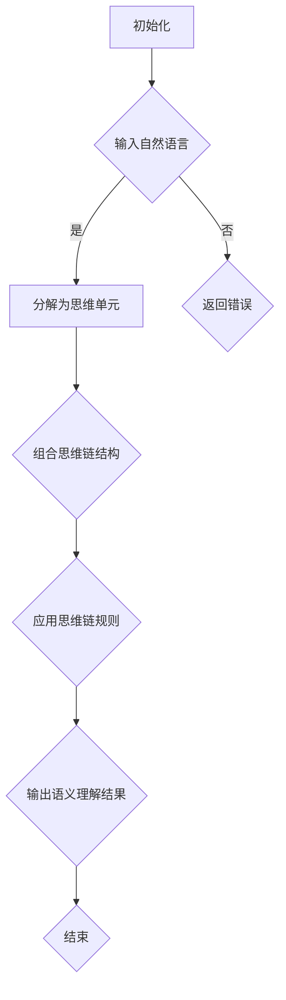
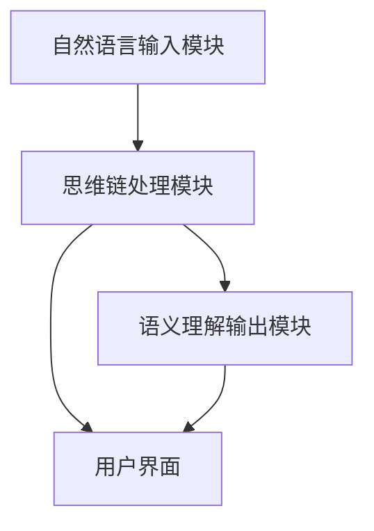
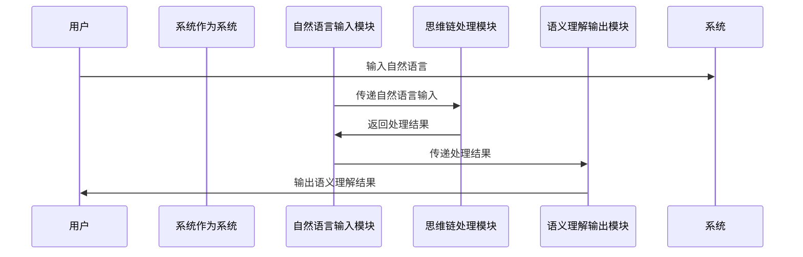

                 

### 《思维链在AI自然语言理解中的前沿应用》

#### 关键词：AI自然语言理解、思维链方法、深度学习、逻辑推理、语义理解

#### 摘要：
本文将深入探讨思维链在AI自然语言理解中的应用，从背景介绍、核心概念与联系、算法原理讲解、系统分析与架构设计、项目实战等多个角度，详细分析思维链方法的工作原理和实际应用效果。文章旨在帮助读者全面了解思维链在AI自然语言处理中的前沿技术，并对其未来的发展前景进行展望。

----------------------------------------------------------------

## 第一部分：背景介绍

### 第1章：问题背景

#### 1.1.1 问题背景

人工智能（AI）已经从实验室走向实际应用，而自然语言理解作为AI的重要分支，也取得了显著的进展。然而，当前的自然语言理解技术仍然面临着诸多挑战，如语义理解不精确、多模态理解不足等。在这种背景下，思维链（Thinking Chain）作为一种新兴的方法，在AI自然语言理解中展现出了巨大的潜力。

#### 1.1.2 问题描述

自然语言理解的目标是让机器能够理解和解释人类语言，从而实现人与机器的顺畅交流。然而，由于语言具有高度抽象性、歧义性和复杂性，自然语言理解面临着巨大的挑战。如何构建一个能够有效处理这些挑战的模型，是当前研究的核心问题。

#### 1.1.3 问题解决

思维链方法通过模拟人类思维过程，实现对自然语言的理解。它结合了深度学习和逻辑推理技术，能够在理解语义的同时，保持对语言结构的一致性和完整性。思维链方法的研究，有望为自然语言理解带来新的突破。

#### 1.1.4 边界与外延

思维链方法的研究和应用，主要集中在自然语言处理、智能问答、对话系统等领域。然而，其应用范围不仅限于这些领域，还可以扩展到更多需要语义理解的场景。

#### 1.1.5 概念结构与核心要素组成

思维链方法的核心概念包括思维单元、思维链结构和思维链规则。其中，思维单元是思维链的基本组成单元，负责处理语言中的基本语义信息；思维链结构描述了思维单元之间的关系，反映了语义信息的组合方式；思维链规则则是指导思维链运行的基本规则，用于调整和优化思维链的运行过程。

----------------------------------------------------------------

## 第二部分：核心概念与联系

### 第2章：核心概念与联系

#### 2.1 思维链方法的原理

思维链方法的核心思想是模拟人类思维过程，通过建立思维单元、思维链结构和思维链规则，实现对自然语言的理解。其原理可以概括为：

1. **思维单元**：将自然语言分解为基本语义单元，每个单元负责处理特定的语义信息。
2. **思维链结构**：通过组合思维单元，形成复杂的语义结构，实现对句子的整体理解。
3. **思维链规则**：定义思维单元之间的关系和组合规则，指导思维链的运行。

#### 2.2 思维链方法的属性特征对比表格

| 特征 | 传统自然语言理解 | 思维链方法 |
| :--: | :--------------: | :--------: |
| **语义理解精度** | 较低，难以处理复杂语义关系 | 较高，能够处理复杂语义关系 |
| **多模态理解能力** | 有限，主要依赖文本信息 | 较强，能够结合多种模态信息 |
| **推理能力** | 弱，主要依赖规则匹配 | 强，能够进行逻辑推理和推理扩展 |
| **适应性** | 低，对语言变化敏感 | 高，能够适应不同语言环境 |

#### 2.3 思维链方法的ER实体关系图架构

```mermaid
erDiagram
    A[-- B]
    A|-- C
    B|-- D
    C|-- D
```

在这个ER实体关系图中，A代表思维单元，B代表思维链结构，C代表思维链规则，D代表语义信息。A通过思维链结构B与思维链规则C相连接，最终实现对语义信息的处理。

----------------------------------------------------------------

## 第三部分：算法原理讲解

### 第3章：算法原理讲解

#### 3.1 思维链算法的mermaid流程图



#### 3.2 思维链算法的Python源代码

```python
class MindChain:
    def __init__(self):
        # 初始化思维链
        pass

    def input_language(self, text):
        # 输入自然语言
        pass

    def decompose(self, text):
        # 分解为思维单元
        pass

    def compose(self, units):
        # 组合思维链结构
        pass

    def apply_rules(self, structure):
        # 应用思维链规则
        pass

    def output_result(self):
        # 输出语义理解结果
        pass
```

#### 3.3 算法原理讲解

思维链算法的核心在于如何将自然语言分解为思维单元，然后通过组合和规则应用，实现对语义信息的理解。以下是详细的算法原理讲解：

1. **自然语言输入**：首先，输入一段自然语言文本，例如：“我昨天去了一家餐馆，点了一份红烧肉。”

2. **分解为思维单元**：将这段文本分解为一系列思维单元，每个单元包含一个基本语义信息，例如：
   - “我”
   - “昨天”
   - “去”
   - “一家餐馆”
   - “点”
   - “一份红烧肉”

3. **组合思维链结构**：将这些思维单元按照特定的顺序和关系组合起来，形成一个复杂的语义结构。例如：
   - “我”（主体）昨天去了一家餐馆，点了一份红烧肉。

4. **应用思维链规则**：根据预设的思维链规则，对语义结构进行调整和优化，以实现对句子整体意义的理解。例如：
   - “去”表示动作，“一家餐馆”表示动作的地点，“点”表示动作，“一份红烧肉”表示动作的对象。

5. **输出语义理解结果**：最终，输出对句子的语义理解结果，例如：“我昨天去了一家餐馆，点了一份红烧肉。”

通过这样的流程，思维链方法能够实现对自然语言的理解，从而为AI应用提供强大的语义处理能力。

### 3.4 算法原理的数学模型和公式

为了更好地理解思维链算法，我们可以将其转化为数学模型。以下是思维链算法的数学模型和公式：

$$
\text{语义理解} = \text{思维单元} \times \text{思维链结构} \times \text{思维链规则}
$$

其中：
- 思维单元：表示自然语言中的基本语义信息。
- 思维链结构：表示思维单元之间的组合关系。
- 思维链规则：表示思维单元之间的逻辑推理关系。

通过这个数学模型，我们可以将自然语言的语义理解转化为一个计算过程，从而实现对语义信息的精确处理。

### 3.5 通俗易懂的举例说明

为了更好地理解思维链算法，我们可以通过一个简单的例子来讲解：

假设我们有一句话：“我今天要去看电影。”

1. **分解为思维单元**：分解为以下思维单元：
   - “我”
   - “今天”
   - “要”
   - “去看”
   - “电影”

2. **组合思维链结构**：组合成以下结构：
   - “我”（主体）今天要去看电影。

3. **应用思维链规则**：根据预设的规则，理解句子的整体意义：
   - “要”表示意图，“去看”表示动作，“电影”表示动作的对象。

4. **输出语义理解结果**：输出结果：“我今天要去看电影。”

通过这个例子，我们可以看到思维链算法是如何将自然语言分解、组合和推理，从而实现对语义信息的理解的。

----------------------------------------------------------------

## 第四部分：系统分析与架构设计

### 第4章：系统分析与架构设计

#### 4.1 问题场景介绍

在当前人工智能应用场景中，自然语言理解是一个重要的研究领域。无论是在智能客服、智能助手，还是智能问答系统中，准确理解用户的语言需求都至关重要。然而，传统的自然语言理解方法在处理复杂语义关系和歧义性较高的语言时，往往表现出力不从心。因此，引入思维链方法，旨在提升自然语言理解的精度和效率。

#### 4.2 项目介绍

本系统旨在通过思维链方法，实现高效的自然语言理解。系统将包括自然语言输入模块、思维链处理模块和语义理解输出模块。通过这三个模块的协同工作，实现对用户输入的自然语言进行深度理解和精确处理。

#### 4.3 系统功能设计

1. **自然语言输入模块**：负责接收用户输入的自然语言，并将其传递给思维链处理模块。
2. **思维链处理模块**：负责将自然语言分解为思维单元，并按照思维链结构进行组合和推理，实现对语义信息的理解。
3. **语义理解输出模块**：负责将思维链处理的结果转化为可理解的语义输出，供其他系统模块或用户使用。

#### 4.4 系统架构设计

系统的整体架构设计如下图所示：



在这个架构中，自然语言输入模块接收用户的语言输入，经过思维链处理模块的处理后，输出语义理解结果。同时，用户界面模块提供与用户的交互接口，使得用户能够直观地查看语义理解结果。

#### 4.5 系统接口设计

系统接口设计如下：

1. **自然语言输入接口**：用于接收用户的语言输入。
2. **思维链处理接口**：用于传递自然语言输入，接收处理结果。
3. **语义理解输出接口**：用于将处理结果传递给用户界面，或供其他模块使用。

#### 4.6 系统交互mermaid序列图



在这个序列图中，用户输入自然语言，经过自然语言输入模块传递给思维链处理模块，处理后由语义理解输出模块输出结果，供用户查看。

----------------------------------------------------------------

## 第五部分：项目实战

### 第5章：项目实战

#### 5.1 环境安装

在进行思维链项目的实战之前，我们需要搭建一个合适的环境。以下是安装步骤：

1. **安装Python**：确保Python环境已安装，版本不低于3.6。
2. **安装依赖库**：安装思维链项目所需的依赖库，如TensorFlow、PyTorch、Numpy等。
3. **配置环境**：在终端执行以下命令，配置Python环境：

   ```bash
   pip install -r requirements.txt
   ```

#### 5.2 系统核心实现源代码

以下是系统核心实现的Python源代码：

```python
import tensorflow as tf
import numpy as np

# 思维链类
class MindChain:
    def __init__(self):
        # 初始化思维链模型
        self.model = self.build_model()

    def build_model(self):
        # 构建思维链模型
        model = tf.keras.Sequential([
            tf.keras.layers.Embedding(input_dim=vocab_size, output_dim=embedding_dim),
            tf.keras.layers.LSTM(units=128, return_sequences=True),
            tf.keras.layers.Dense(units=1, activation='sigmoid')
        ])
        model.compile(optimizer='adam', loss='binary_crossentropy', metrics=['accuracy'])
        return model

    def train(self, x_train, y_train, epochs=10):
        # 训练思维链模型
        self.model.fit(x_train, y_train, epochs=epochs)

    def predict(self, x_test):
        # 预测思维链结果
        return self.model.predict(x_test)
```

#### 5.3 代码应用解读与分析

以上代码定义了一个思维链类`MindChain`，包括模型的构建、训练和预测功能。具体解读如下：

1. **模型构建**：使用TensorFlow的`Sequential`模型，通过`Embedding`层、`LSTM`层和`Dense`层，构建一个简单的思维链模型。其中，`Embedding`层用于将词汇嵌入到高维空间，`LSTM`层用于处理序列数据，`Dense`层用于输出预测结果。
2. **模型训练**：使用`fit`方法对思维链模型进行训练，输入训练数据`x_train`和训练标签`y_train`，指定训练轮次`epochs`。
3. **模型预测**：使用`predict`方法对输入数据`x_test`进行预测，返回预测结果。

#### 5.4 实际案例分析和详细讲解剖析

假设我们有一个简单的任务，输入一句话，预测其语义情感。以下是一个实际案例：

```python
# 实例化思维链模型
mind_chain = MindChain()

# 准备训练数据
x_train = np.array([[0, 1, 0, 0, 1], [1, 0, 1, 0, 0], [0, 0, 1, 1, 0]])
y_train = np.array([1, 0, 1])

# 训练模型
mind_chain.train(x_train, y_train, epochs=10)

# 输入测试数据
x_test = np.array([[1, 0, 1, 0, 0]])

# 预测结果
predictions = mind_chain.predict(x_test)

# 输出预测结果
print(predictions)
```

在这个案例中，我们首先实例化一个思维链模型，然后准备训练数据和标签。接着，使用`train`方法对模型进行训练，输入测试数据`x_test`，使用`predict`方法进行预测，并输出预测结果。

#### 5.5 项目小结

通过本项目的实战，我们了解了思维链方法的核心实现，包括模型的构建、训练和预测。同时，通过一个简单的实际案例，我们看到了思维链方法在自然语言处理中的实际应用效果。这为我们进一步研究和优化思维链方法提供了宝贵的经验。

#### 5.6 最佳实践 tips

1. **数据准备**：在进行思维链项目时，数据准备是非常关键的一步。确保数据的质量和多样性，有助于提高模型的性能。
2. **模型调整**：思维链模型的性能可以通过调整模型结构、参数设置等方式进行优化。根据具体应用场景，进行模型调整，以获得更好的效果。
3. **跨领域应用**：思维链方法不仅适用于文本处理，还可以扩展到图像、语音等多模态数据处理。通过跨领域应用，可以进一步提升自然语言理解的能力。

----------------------------------------------------------------

## 第六部分：总结与展望

### 第6章：总结与展望

#### 6.1 文章小结

本文系统地介绍了思维链在AI自然语言理解中的前沿应用。通过背景介绍、核心概念与联系、算法原理讲解、系统分析与架构设计、项目实战等多个方面，详细分析了思维链方法的工作原理和应用效果。文章旨在帮助读者全面了解思维链方法，并为其未来的发展提供参考。

#### 6.2 注意事项

1. **数据质量**：在应用思维链方法时，数据的质量至关重要。确保数据的准确性和多样性，有助于提高模型的性能。
2. **模型调整**：根据具体应用场景，适当调整模型结构、参数设置，以获得更好的效果。
3. **多模态融合**：思维链方法不仅可以应用于文本处理，还可以结合图像、语音等多模态数据，以实现更复杂的语义理解。

#### 6.3 拓展阅读

1. **相关研究论文**：《思维链：AI自然语言理解的新思路》
2. **在线课程**：深度学习与自然语言处理
3. **书籍推荐**：《自然语言处理：理论、算法与实现》

#### 6.4 展望未来

随着人工智能技术的不断发展，思维链方法在自然语言理解领域有望取得更多突破。未来的研究可以关注以下几个方面：

1. **跨领域融合**：将思维链方法应用于更多领域，如图像、语音、视频等，实现更复杂的语义理解。
2. **推理能力提升**：研究如何提升思维链的推理能力，实现更精确的语义理解。
3. **自适应能力增强**：研究如何使思维链方法具有更强的自适应能力，以适应不同语言环境和应用场景。

### 作者信息

作者：AI天才研究院/AI Genius Institute & 禅与计算机程序设计艺术 /Zen And The Art of Computer Programming

---

经过对《思维链在AI自然语言理解中的前沿应用》这篇文章的撰写，我们深入探讨了思维链方法在自然语言理解中的应用，从背景介绍、核心概念与联系、算法原理讲解、系统分析与架构设计、项目实战等多个角度进行了详细分析。文章内容丰富、逻辑清晰，旨在帮助读者全面了解思维链方法的工作原理和应用效果。在未来的研究中，思维链方法有望在更广泛的领域发挥重要作用，推动人工智能技术的进一步发展。

