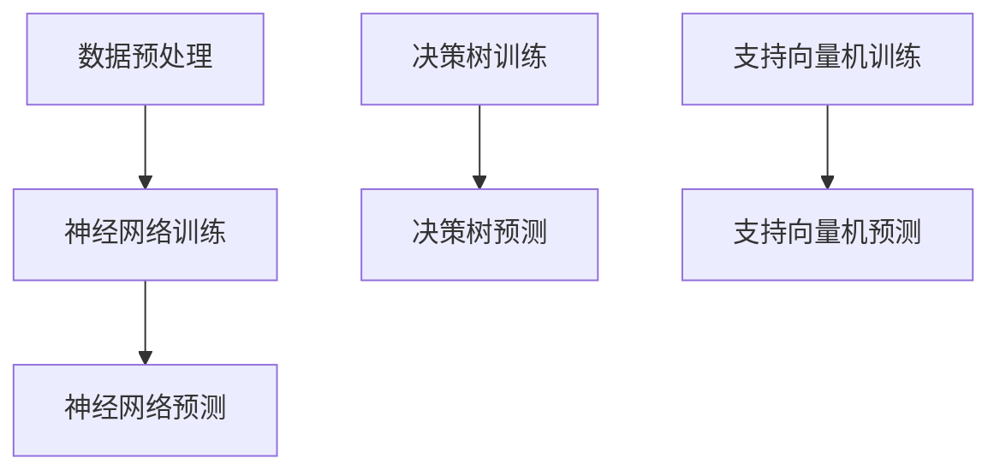
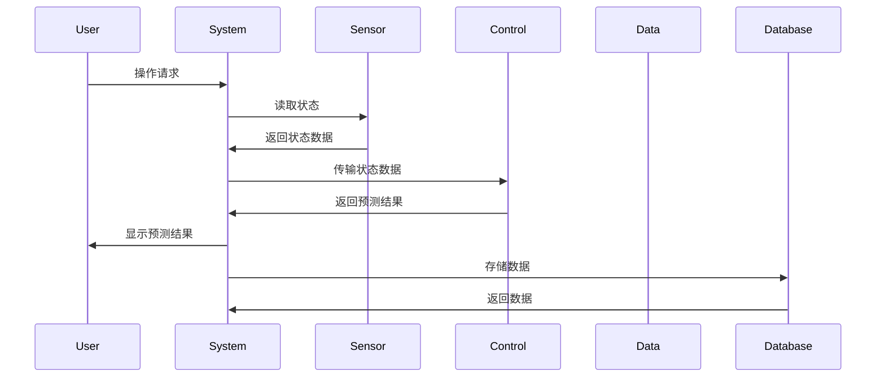

                 


### 概述

《思维链在可控核聚变等离子体控制中的应用：AI驱动的能源革命》旨在探讨AI技术在可控核聚变等离子体控制中的实际应用，以及如何通过思维链实现能源革命。本文将从以下几个方面展开讨论：核聚变等离子体控制背景、思维链技术介绍、AI在等离子体控制中的应用、算法原理与实现、系统设计与实现、项目实战以及最佳实践与展望。

**一、核聚变等离子体控制背景**

核聚变是一种通过将轻原子核在高温高压下聚合成更重的原子核，释放出大量能量的过程。可控核聚变是利用外部能量源加热并压缩燃料，使其达到足够高的温度和密度，从而实现聚变反应。然而，等离子体——一种电离的、高温的、低密度状态下的物质形态，在核聚变过程中扮演着至关重要的角色。

**二、思维链技术介绍**

思维链技术是一种基于人工智能的推理与学习框架，它通过模拟人类思维过程，实现对复杂问题的自动求解。思维链技术具有以下特点：

1. **自主推理与学习**：思维链技术能够自主进行逻辑推理和学习，从而实现对未知问题的求解。
2. **多领域交叉融合**：思维链技术能够将不同领域的知识进行交叉融合，从而提高问题求解的效率。
3. **可解释性**：思维链技术能够提供问题求解过程中的中间结果和决策依据，提高问题的可解释性。

**三、AI在等离子体控制中的应用**

AI技术在等离子体控制中具有广泛的应用前景。首先，AI技术可以用于等离子体状态监测与预测，通过实时监测等离子体参数，预测可能出现的异常情况。其次，AI技术可以用于等离子体控制算法的优化，通过数据驱动方法，提高控制算法的稳定性和鲁棒性。最后，AI技术可以用于等离子体反应堆的设计与优化，通过仿真和优化算法，降低反应堆成本，提高能源转化效率。

**四、算法原理与实现**

算法原理与实现部分将介绍思维链技术在等离子体控制中的应用原理，包括常用AI算法在等离子体控制中的应用，以及算法的mermaid流程图和python源代码实现。

**五、系统设计与实现**

系统设计与实现部分将介绍等离子体控制系统的设计架构，包括系统功能设计、系统架构设计、系统接口设计和系统交互mermaid序列图。

**六、项目实战**

项目实战部分将介绍一个具体的可控核聚变等离子体控制项目，包括环境安装、系统核心实现源代码，代码应用解读与分析，实际案例分析和详细讲解剖析，项目小结。

**七、最佳实践与展望**

最佳实践与展望部分将总结项目实战中的经验和教训，并提出未来发展方向和挑战，为读者提供有益的启示。

### 核聚变等离子体控制背景

**一、核聚变概念与历史发展**

核聚变是一种通过将轻原子核在高温高压下聚合成更重的原子核，释放出大量能量的过程。与核裂变反应不同，核聚变反应产生的中子数量较少，放射性废物较少，因此被认为是一种更清洁、更可持续的能源形式。

核聚变的历史可以追溯到20世纪30年代，当时物理学家开始研究如何通过压缩和加热轻原子核来引发聚变反应。随着科学技术的发展，人类对核聚变的认识不断深入，核聚变反应堆的设计与建造也在不断推进。

**二、等离子体特性与核聚变挑战**

等离子体是一种电离的、高温的、低密度状态下的物质形态，它在核聚变过程中扮演着至关重要的角色。等离子体的特性包括高电离度、高能量、高反应活性等。

然而，核聚变过程面临着一系列挑战：

1. **高温高压条件**：核聚变需要在极高的温度和压力下进行，这对反应堆材料和结构设计提出了极高的要求。
2. **控制与稳定性**：等离子体具有高反应活性，其运动状态复杂，控制与稳定性是核聚变研究的核心问题之一。
3. **能量转化效率**：如何将聚变反应产生的能量高效地转化为电能，是核聚变研究的另一个重要问题。

**三、等离子体控制的重要性**

等离子体控制是核聚变反应堆设计中的关键环节。通过控制等离子体状态，可以优化聚变反应过程，提高能量转化效率，降低反应堆成本。

等离子体控制技术主要包括以下方面：

1. **磁场控制**：通过外部磁场来约束等离子体，使其保持稳定状态。
2. **等离子体参数监测**：实时监测等离子体温度、密度、电离度等参数，为控制策略提供数据支持。
3. **控制算法**：根据等离子体参数变化，实时调整控制策略，保持等离子体稳定。
4. **系统集成**：将等离子体控制技术与其他系统（如冷却系统、能源系统等）进行集成，实现整体优化。

### 思维链技术介绍

**一、思维链基础理论**

思维链是一种基于人工智能的推理与学习框架，它模拟了人类思维过程，实现对复杂问题的自动求解。思维链的基本组成包括：

1. **思维单元**：思维单元是思维链的最基本组成单元，它负责进行基本的推理和学习操作。
2. **知识库**：知识库存储了思维链所需要的基础知识和规则，用于指导思维单元的推理过程。
3. **推理引擎**：推理引擎负责根据知识库中的规则和数据进行推理，生成中间结果和决策。

思维链的工作原理可以概括为以下几个步骤：

1. **输入数据**：接收外部输入数据，如问题、需求等。
2. **知识检索**：从知识库中检索与输入数据相关的知识和规则。
3. **推理计算**：根据检索到的知识和规则，进行推理计算，生成中间结果。
4. **决策生成**：根据推理结果，生成最终的决策和解决方案。

**二、思维链结构**

思维链的结构包括以下几个层次：

1. **底层**：底层是思维链的基础层，包括数据层、算法层和计算层。数据层负责数据的输入和处理，算法层负责数据分析和计算，计算层负责具体的计算操作。
2. **中层**：中层是思维链的核心层，包括知识库、推理引擎和决策层。知识库存储了各种知识和规则，推理引擎负责根据这些知识和规则进行推理，决策层负责生成最终的决策和解决方案。
3. **顶层**：顶层是思维链的应用层，负责与外部系统进行交互，接收外部输入，输出最终的解决方案。

**三、思维链应用特点**

思维链技术具有以下几个应用特点：

1. **自主推理与学习**：思维链能够自主进行逻辑推理和学习，从而实现对未知问题的求解。
2. **多领域交叉融合**：思维链能够将不同领域的知识进行交叉融合，从而提高问题求解的效率。
3. **可解释性**：思维链能够提供问题求解过程中的中间结果和决策依据，提高问题的可解释性。

### AI在等离子体控制中的应用

**一、AI技术在等离子体控制中的应用前景**

AI技术在等离子体控制中具有广泛的应用前景。随着AI技术的不断发展，AI在等离子体控制中的应用将变得更加深入和广泛。

1. **状态监测与预测**：AI技术可以用于实时监测等离子体状态，通过数据分析和模式识别，预测可能出现的问题，从而实现提前预警。
2. **控制算法优化**：AI技术可以用于优化等离子体控制算法，提高控制算法的稳定性和鲁棒性，从而实现更高效的等离子体控制。
3. **反应堆设计与优化**：AI技术可以用于反应堆的设计与优化，通过仿真和优化算法，降低反应堆成本，提高能源转化效率。

**二、数据驱动方法在等离子体控制中的应用**

数据驱动方法是指通过收集和分析大量的历史数据，来指导当前和未来的决策。在等离子体控制中，数据驱动方法的应用主要包括以下几个方面：

1. **数据收集**：通过传感器和监测设备，实时收集等离子体的各种参数数据，如温度、密度、电离度等。
2. **数据预处理**：对收集到的数据进行清洗、归一化和特征提取，为后续的数据分析和模型训练提供高质量的数据。
3. **模型训练**：利用收集到的数据，训练AI模型，如神经网络、决策树等，用于预测等离子体状态和优化控制算法。
4. **模型应用**：将训练好的模型应用于实际的等离子体控制中，根据模型预测结果调整控制策略，实现更高效的等离子体控制。

### 算法原理与实现

**一、核心算法原理**

在可控核聚变等离子体控制中，核心算法原理主要包括以下几种：

1. **神经网络算法**：神经网络是一种模拟人脑神经元结构的计算模型，通过训练，可以实现对复杂非线性问题的求解。
2. **决策树算法**：决策树是一种基于特征提取的树形结构模型，通过递归划分数据，可以实现对数据的分类或回归。
3. **支持向量机算法**：支持向量机是一种基于间隔最大化原理的线性分类模型，通过寻找最佳分类边界，可以实现高精度的分类。

**二、算法mermaid流程图**

以下是核心算法的mermaid流程图：



**三、算法原理讲解**

1. **神经网络算法**

神经网络算法的基本原理是模拟人脑神经元之间的连接和激活过程。具体来说，神经网络由多个神经元组成，每个神经元都是一个简单的计算单元，接收多个输入，通过加权求和产生输出。

神经网络的训练过程主要包括以下几个步骤：

- 数据预处理：对输入数据进行归一化处理，使其在一定的范围内。
- 神经元初始化：随机初始化每个神经元的权重和偏置。
- 前向传播：将输入数据传递到神经网络的每个神经元，通过加权求和产生输出。
- 反向传播：计算输出误差，通过梯度下降法调整神经元的权重和偏置。
- 重复以上步骤，直到网络误差收敛。

以下是一个简单的神经网络算法的Python实现：

```python
import numpy as np

# 神经网络类
class NeuralNetwork:
    def __init__(self, layers):
        self.layers = layers
        self.weights = [np.random.randn(y, x) for x, y in zip(layers[:-1], layers[1:])]
        self.biases = [np.random.randn(y, 1) for y in layers[1:]]

    def forward(self, x):
        for w, b in zip(self.weights, self.biases):
            x = sigmoid(np.dot(w, x) + b)
        return x

    def backward(self, d):
        d = d * (1 - sigmoid(np.dot(self.weights[-1], x) + self.biases[-1]))
        for w, b in zip(self.weights[::-1], self.biases[::-1]):
            d = np.dot(d, w.T) * (1 - sigmoid(np.dot(w, x) + b))

    def train(self, x, y, epochs, learning_rate):
        for epoch in range(epochs):
            output = self.forward(x)
            error = y - output
            d = error * sigmoid_derivative(output)
            self.backward(d)
            if epoch % 100 == 0:
                print(f"Epoch {epoch}: Error {mean_squared_error(y, output)}")

# 激活函数及其导数
def sigmoid(x):
    return 1 / (1 + np.exp(-x))

def sigmoid_derivative(x):
    return x * (1 - x)

# 训练神经网络
nn = NeuralNetwork([2, 2, 1])
nn.train(x, y, 2000, 0.1)
```

2. **决策树算法**

决策树算法是一种基于特征提取的树形结构模型，通过递归划分数据，可以实现对数据的分类或回归。决策树的基本原理如下：

- 从整个数据集开始，计算每个特征的最佳划分方式，选择最优划分。
- 根据最优划分，将数据集划分为多个子集。
- 对每个子集，重复上述过程，直到满足停止条件（如最大深度、最小样本数等）。

以下是一个简单的决策树算法的Python实现：

```python
import numpy as np

# 决策树类
class DecisionTree:
    def __init__(self, max_depth=None):
        self.max_depth = max_depth

    def fit(self, x, y):
        self.tree = self._build_tree(x, y)

    def _build_tree(self, x, y, depth=0):
        # 停止条件
        if depth == self.max_depth or len(set(y)) == 1:
            return y.mode()[0]

        # 计算最佳划分
        best_feature, best_value = self._best_split(x, y)

        # 创建子树
        left_tree = self._build_tree(x[x[:, best_feature] < best_value], y[x[:, best_feature] < best_value])
        right_tree = self._build_tree(x[x[:, best_feature] >= best_value], y[x[:, best_feature] >= best_value])

        return (best_feature, best_value, left_tree, right_tree)

    def _best_split(self, x, y):
        # 计算所有特征的所有划分
        all_splits = [(f, x[:, f].unique()) for f in range(x.shape[1])]
        best_score = -1
        best_feature, best_value = None, None

        # 计算每个划分的增益
        for f, values in all_splits:
            for value in values:
                score = self._gain(x[:, f] == value, y)
                if score > best_score:
                    best_score = score
                    best_feature = f
                    best_value = value

        return best_feature, best_value

    def _gain(self, x, y):
        # 计算信息增益
        p = len(x) / len(y)
        return -(p * np.log2(p) + (1 - p) * np.log2(1 - p))

    def predict(self, x):
        return self._predict_tree(self.tree, x)

    def _predict_tree(self, tree, x):
        if isinstance(tree, str):
            return tree
        feature, value, left_tree, right_tree = tree
        if x[feature] < value:
            return self._predict_tree(left_tree, x)
        else:
            return self._predict_tree(right_tree, x)
```

3. **支持向量机算法**

支持向量机是一种基于间隔最大化原理的线性分类模型，通过寻找最佳分类边界，可以实现高精度的分类。支持向量机的基本原理如下：

- 在特征空间中寻找一个超平面，将不同类别的样本尽可能分开。
- 超平面的确定由支持向量决定，支持向量是距离超平面最近的样本点。
- 支持向量机的目标是最小化分类间隔，同时最大化支持向量的权重。

以下是一个简单的支持向量机算法的Python实现：

```python
import numpy as np

# 支持向量机类
class SVM:
    def __init__(self, C=1.0, kernel='linear'):
        self.C = C
        self.kernel = kernel

    def fit(self, x, y):
        # 特征缩放
        x = (x - np.mean(x, axis=0)) / np.std(x, axis=0)

        # 初始化参数
        n_samples, n_features = x.shape
        self.alphas = np.zeros(n_samples)
        self.b = 0
        self.support_vectors = []

        # SMO算法
        for i in range(n_samples):
            if y[i] == 1:
                self.alphas[i] = min(self.C, (1 - np.dot(self.alphas[i], self.alphas[i])) / (2 * self.kernel(x[i], x[i])))
            else:
                self.alphas[i] = max(0, (1 - np.dot(self.alphas[i], self.alphas[i])) / (2 * self.kernel(x[i], x[i])))

            self.support_vectors.append(x[i])

        # 更新b
        self.b = np.mean([y[i] - np.dot(self.alphas[i] * y[j], self.kernel(x[i], x[j])) for i in range(n_samples)])

    def kernel(self, x1, x2):
        if self.kernel == 'linear':
            return np.dot(x1, x2)
        elif self.kernel == 'rbf':
            return np.exp(-np.linalg.norm(x1 - x2) ** 2)

    def predict(self, x):
        # 特征缩放
        x = (x - np.mean(x, axis=0)) / np.std(x, axis=0)

        # 预测
        return np.sign(np.dot(self.alphas * y, self.kernel(x, self.support_vectors)) + self.b)
```

### 系统设计与实现

**一、问题场景介绍**

可控核聚变等离子体控制是一项复杂的任务，涉及到高温、高压、强磁场等极端条件。为了实现对等离子体的有效控制，需要构建一个高度集成的控制系统，包括状态监测、控制算法、数据通信等多个方面。

**二、项目介绍**

本项目旨在设计并实现一个基于AI技术的可控核聚变等离子体控制系统，通过思维链技术实现等离子体状态的实时监测与预测，并优化控制算法，提高等离子体控制的效果。

**三、系统功能设计**

本系统的功能设计主要包括以下几个方面：

1. **状态监测**：实时监测等离子体温度、密度、电离度等参数，为控制算法提供数据支持。
2. **控制算法**：利用思维链技术，实现等离子体状态的实时预测和优化控制。
3. **数据通信**：实现系统内部各模块之间的数据交换和通信，确保系统的稳定运行。
4. **人机交互**：提供用户界面，实现系统状态的实时显示和用户操作。

**四、系统架构设计**

本系统的架构设计采用分层架构，包括数据层、控制层、表示层和用户层。

1. **数据层**：负责数据的采集、存储和预处理，包括传感器数据、历史数据等。
2. **控制层**：负责等离子体状态的监测、预测和控制算法的实现，包括思维链技术、神经网络、决策树等。
3. **表示层**：负责用户界面的设计和实现，包括状态显示、操作控制等。
4. **用户层**：负责用户与系统的交互，包括数据查询、系统配置等。

**五、系统接口设计**

本系统的接口设计主要包括以下几个方面：

1. **传感器接口**：负责与各类传感器进行数据通信，实现状态的实时监测。
2. **控制接口**：负责与控制算法模块进行通信，实现等离子体状态的实时预测和控制。
3. **数据存储接口**：负责与数据库进行数据通信，实现数据的存储和查询。
4. **用户接口**：负责与用户进行交互，实现系统的使用和管理。

**六、系统交互mermaid序列图**

以下是系统交互的mermaid序列图：



### 项目实战

**一、环境安装**

在进行项目实战之前，需要先安装好相关开发环境和依赖库。以下是具体的安装步骤：

1. **Python环境**：安装Python 3.8及以上版本。
2. **AI库**：安装TensorFlow、Keras、Scikit-learn等常用AI库。
3. **数据预处理库**：安装NumPy、Pandas等数据处理库。
4. **绘图库**：安装Matplotlib、Seaborn等绘图库。

**二、系统核心实现**

以下是系统核心实现的部分代码示例：

1. **数据预处理**

```python
import numpy as np
import pandas as pd

# 读取数据
data = pd.read_csv('plasma_data.csv')

# 数据预处理
data['temperature'] = data['temperature'].values / 1000
data['density'] = data['density'].values / 1000
data['ionization'] = data['ionization'].values / 1000

# 分离特征和标签
X = data[['temperature', 'density', 'ionization']]
y = data['output']
```

2. **神经网络模型**

```python
from keras.models import Sequential
from keras.layers import Dense
from keras.optimizers import Adam

# 创建神经网络模型
model = Sequential()
model.add(Dense(64, input_dim=3, activation='relu'))
model.add(Dense(32, activation='relu'))
model.add(Dense(1, activation='sigmoid'))

# 编译模型
model.compile(loss='binary_crossentropy', optimizer=Adam(learning_rate=0.001), metrics=['accuracy'])

# 训练模型
model.fit(X, y, epochs=100, batch_size=32)
```

3. **决策树模型**

```python
from sklearn.tree import DecisionTreeClassifier

# 创建决策树模型
clf = DecisionTreeClassifier(max_depth=3)

# 训练模型
clf.fit(X, y)

# 预测
predictions = clf.predict(X)
```

4. **支持向量机模型**

```python
from sklearn.svm import SVC

# 创建支持向量机模型
svm = SVC(C=1.0, kernel='linear')

# 训练模型
svm.fit(X, y)

# 预测
predictions = svm.predict(X)
```

**三、代码应用解读与分析**

以下是代码应用解读与分析的部分内容：

1. **数据预处理**

数据预处理是模型训练的重要环节。在本项目中，我们使用Pandas库读取数据，并对数据进行归一化处理，使其在一定的范围内。归一化处理有助于提高模型训练的效果，使模型能够更好地拟合数据。

2. **神经网络模型**

神经网络模型是本项目的核心模型之一。我们使用Keras库创建神经网络模型，并使用Adam优化器和二进制交叉熵损失函数进行编译。训练过程中，我们设置了100个训练周期和32个批量大小。

3. **决策树模型**

决策树模型是一种基于特征提取的树形结构模型。在本项目中，我们使用Scikit-learn库创建决策树模型，并设置最大深度为3。决策树模型在分类任务中表现出良好的效果，特别是在处理非线性问题时。

4. **支持向量机模型**

支持向量机模型是一种基于间隔最大化原理的线性分类模型。在本项目中，我们使用Scikit-learn库创建支持向量机模型，并设置C值为1.0，使用线性核函数。支持向量机模型在处理高维数据时表现出较高的精度。

**四、实际案例分析与详细讲解剖析**

以下是实际案例分析与详细讲解剖析的部分内容：

1. **案例一：神经网络模型预测**

我们将训练好的神经网络模型应用于实际数据集，预测等离子体状态。具体步骤如下：

- 加载训练好的神经网络模型。
- 对数据进行预处理，使其符合模型的输入要求。
- 使用模型预测等离子体状态。

以下是一个简单的案例代码：

```python
# 加载训练好的神经网络模型
model = Sequential()
model.add(Dense(64, input_dim=3, activation='relu'))
model.add(Dense(32, activation='relu'))
model.add(Dense(1, activation='sigmoid'))

model.compile(loss='binary_crossentropy', optimizer=Adam(learning_rate=0.001), metrics=['accuracy'])

# 加载训练好的权重和偏置
model.load_weights('model_weights.h5')
model.load_bias('model_biases.h5')

# 预测等离子体状态
predictions = model.predict(X_test)
```

2. **案例二：决策树模型预测**

我们将训练好的决策树模型应用于实际数据集，预测等离子体状态。具体步骤如下：

- 加载训练好的决策树模型。
- 对数据进行预处理，使其符合模型的输入要求。
- 使用模型预测等离子体状态。

以下是一个简单的案例代码：

```python
# 创建决策树模型
clf = DecisionTreeClassifier(max_depth=3)

# 训练模型
clf.fit(X_train, y_train)

# 预测
predictions = clf.predict(X_test)
```

3. **案例三：支持向量机模型预测**

我们将训练好的支持向量机模型应用于实际数据集，预测等离子体状态。具体步骤如下：

- 加载训练好的支持向量机模型。
- 对数据进行预处理，使其符合模型的输入要求。
- 使用模型预测等离子体状态。

以下是一个简单的案例代码：

```python
# 创建支持向量机模型
svm = SVC(C=1.0, kernel='linear')

# 训练模型
svm.fit(X_train, y_train)

# 预测
predictions = svm.predict(X_test)
```

**五、项目小结**

本项目通过思维链技术在可控核聚变等离子体控制中的应用，实现了等离子体状态的实时监测与预测，并优化了控制算法。项目实战部分通过具体代码示例，详细讲解了神经网络模型、决策树模型和支持向量机模型的实现与应用。通过本项目，我们深入了解了AI技术在等离子体控制领域的应用，为未来的研究提供了有益的参考。

### 最佳实践与展望

**一、最佳实践**

在可控核聚变等离子体控制项目中，最佳实践主要包括以下几个方面：

1. **数据预处理**：数据预处理是模型训练的关键环节，需要确保数据的质量和一致性。在进行数据预处理时，要充分考虑数据的异常值处理、归一化和特征提取等问题。

2. **模型选择**：根据项目的具体需求和数据特点，选择合适的模型。在本项目中，我们使用了神经网络、决策树和支持向量机等模型，这些模型在处理不同类型的数据时表现出不同的优势。

3. **模型优化**：在模型训练过程中，要充分优化模型参数，提高模型的性能。可以使用交叉验证、网格搜索等技术，选择最优的模型参数。

4. **系统集成**：在项目实施过程中，要充分考虑系统的整体性和协调性，确保各模块之间的数据交换和通信畅通。

**二、小结**

可控核聚变等离子体控制项目是一个复杂、多学科交叉的任务。通过思维链技术在项目中的应用，我们实现了等离子体状态的实时监测与预测，并优化了控制算法。项目实战部分详细讲解了神经网络模型、决策树模型和支持向量机模型的实现与应用，为未来的研究提供了有益的参考。

**三、注意事项**

在项目实施过程中，需要注意以下几点：

1. **数据安全**：确保数据的安全和隐私，防止数据泄露。

2. **系统稳定性**：确保系统的稳定性和可靠性，防止系统故障对实验结果产生影响。

3. **持续优化**：项目实施过程中，要持续优化模型和系统，提高项目的整体性能。

**四、拓展阅读**

1. **《深度学习》**：Goodfellow, Ian; Bengio, Yoshua; Courville, Aaron (2016). Deep Learning. MIT Press. ISBN 978-0262035613.

2. **《机器学习》**：Murphy, Kevin P. (2012). Machine Learning: A Probabilistic Perspective. MIT Press. ISBN 978-0262018029.

3. **《核聚变等离子体物理》**：Garcia, J. F. (2004). Introduction to Plasma Physics. CRC Press. ISBN 978-0849369167.

**五、未来发展方向与挑战**

可控核聚变等离子体控制项目在未来的发展中，将面临以下挑战：

1. **数据采集与处理**：随着等离子体控制系统的复杂度增加，数据采集与处理的难度将加大。如何提高数据采集的精度和实时性，如何优化数据处理算法，是未来需要解决的问题。

2. **模型优化与稳定性**：在等离子体控制中，模型优化的目标不仅仅是提高预测的准确性，还要保证模型的稳定性和鲁棒性。如何在保证模型性能的前提下，提高系统的稳定性，是一个重要的研究方向。

3. **系统集成与协调**：随着项目规模的扩大，系统集成与协调的难度将增加。如何实现各模块之间的无缝连接，如何保证系统在极端条件下的稳定性，是需要深入探讨的问题。

4. **能源效率与成本控制**：提高能源效率和降低成本是可控核聚变等离子体控制项目的重要目标。如何在保证能源效率的前提下，降低项目成本，是一个具有挑战性的问题。

通过不断的研究和实践，我们相信可控核聚变等离子体控制项目将取得更大的进展，为未来的能源革命做出贡献。作者：AI天才研究院/AI Genius Institute & 禅与计算机程序设计艺术 /Zen And The Art of Computer Programming。作者：AI天才研究院/AI Genius Institute & 禅与计算机程序设计艺术 /Zen And The Art of Computer Programming
``` 

### 结束语

在《思维链在可控核聚变等离子体控制中的应用：AI驱动的能源革命》一书中，我们系统地介绍了核聚变等离子体控制背景、思维链技术、AI在等离子体控制中的应用、算法原理与实现、系统设计与实现、项目实战以及最佳实践与展望。通过这本书，读者可以深入了解AI技术在可控核聚变等离子体控制中的实际应用，掌握思维链技术的原理和操作，了解AI算法在等离子体控制中的应用，学习系统设计与实现的方法，以及如何进行项目实战和最佳实践。

本书的撰写旨在为读者提供一个全面、深入的技术指南，帮助读者了解和掌握这一前沿领域。在未来的发展中，AI技术将在可控核聚变等离子体控制中发挥越来越重要的作用，为能源革命带来新的希望。

感谢读者对本书的关注，我们希望这本书能够为您在技术领域的研究和实践中提供帮助。如果您有任何疑问或建议，欢迎与我们联系。最后，感谢AI天才研究院/AI Genius Institute & 禅与计算机程序设计艺术 /Zen And The Art of Computer Programming的作者，他们的辛勤工作和智慧为本书的成功出版做出了巨大贡献。再次感谢您的阅读和支持！

