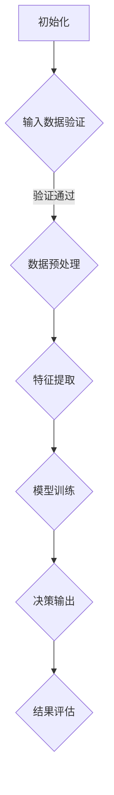
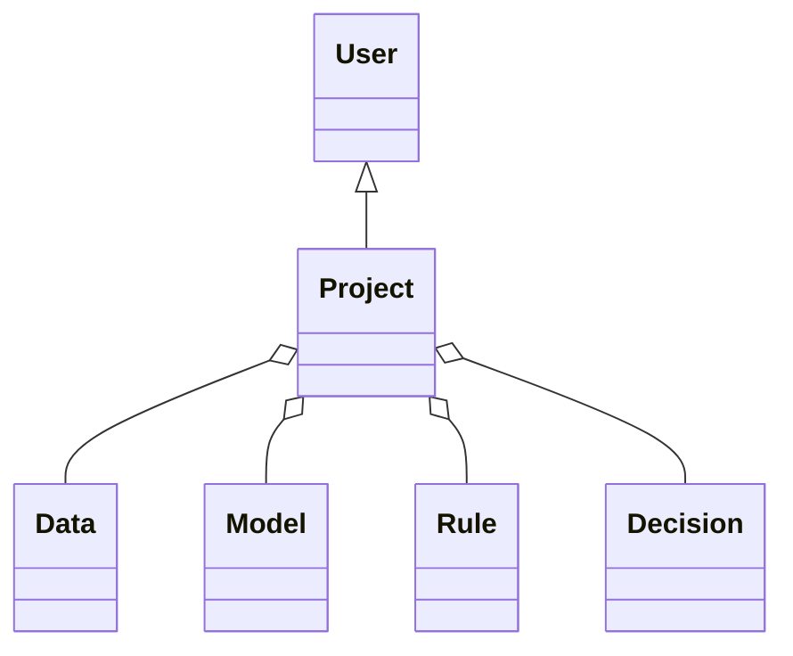
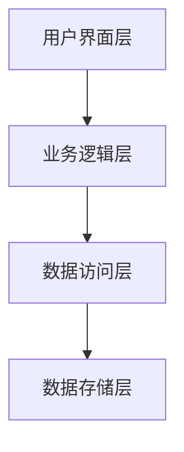
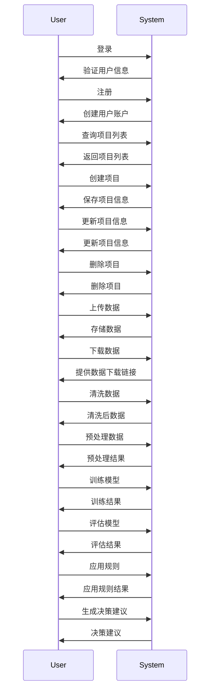

                 

### 《思维链技术在AI辅助决策中的实践》

#### 关键词：思维链、AI辅助决策、算法原理、系统架构、项目实战

#### 摘要：
本文深入探讨了思维链技术在AI辅助决策中的实践应用。文章首先介绍了思维链技术在AI辅助决策中的背景和挑战，然后详细阐述了思维链技术的基本概念和原理，以及其在AI辅助决策中的结合点。接着，文章通过数学模型和流程图详细讲解了思维链技术在AI辅助决策中的算法原理，并通过具体案例进行了说明。随后，文章从系统功能设计、架构设计、接口设计和系统交互等多个方面阐述了思维链技术在AI辅助决策系统中的实现。最后，通过一个实际项目环境安装和核心实现的案例，展示了思维链技术在AI辅助决策中的具体应用。

---

**# 第一部分：背景介绍**

### 第1章：问题背景

#### 1.1 问题提出

AI技术的发展带来了人工智能辅助决策的广泛应用，然而，现有的AI辅助决策系统仍然面临诸多挑战。传统的AI辅助决策主要依赖于数据驱动的方法，通过对大量历史数据进行训练，以预测未来的决策结果。然而，这种方法存在以下问题：

1. **数据依赖性**：传统方法高度依赖大量的历史数据，而现实中的数据可能存在不完整、噪声或偏差。
2. **决策复杂性**：现实世界中的决策问题通常具有高度的不确定性和复杂性，传统方法难以处理。
3. **解释性不足**：传统方法通常缺乏透明性和可解释性，难以理解其决策过程和依据。

为了解决这些问题，思维链技术应运而生。思维链技术是一种基于逻辑推理和知识表示的方法，能够更好地处理不确定性和复杂性，提供更为透明和可解释的决策过程。

#### 1.2 当前AI辅助决策的挑战

1. **数据质量和数量**：高质量、多样性和大量数据是训练AI模型的基础，但现实中的数据往往无法满足这些要求。
2. **模型解释性**：许多AI模型（如深度神经网络）具有强大的预测能力，但其决策过程复杂，难以解释。
3. **模型泛化能力**：训练好的模型可能仅在特定环境下有效，难以适应新的环境或变化。
4. **多目标决策**：许多决策问题涉及多个目标，传统方法难以同时优化这些目标。

#### 1.3 思维链技术在AI辅助决策中的潜力

思维链技术能够通过逻辑推理和知识表示，解决传统AI辅助决策的上述问题。其优势包括：

1. **数据无关性**：思维链技术不依赖于大量历史数据，能够从少量的数据或规则中推导出决策。
2. **透明性和可解释性**：思维链技术的决策过程基于逻辑规则，易于理解和解释。
3. **灵活性和适应性**：思维链技术能够处理复杂的不确定性和多目标决策问题，具有更好的泛化能力。
4. **集成多种信息**：思维链技术能够整合不同来源的信息，提高决策的准确性和可靠性。

#### 1.4 边界与外延

思维链技术在AI辅助决策中的应用范围非常广泛，包括但不限于以下几个方面：

1. **商业决策**：如企业投资决策、供应链管理、市场营销等。
2. **医疗诊断**：如疾病预测、治疗方案推荐等。
3. **金融分析**：如风险评估、投资组合优化等。
4. **交通管理**：如交通流量预测、事故预警等。
5. **环境监测**：如污染预测、资源优化等。

然而，思维链技术也面临一些挑战，如规则提取的难度、知识表示的局限性等。未来，随着技术的不断发展和完善，思维链技术在AI辅助决策中的应用前景将更加广阔。

#### 1.5 概念结构与核心要素组成

思维链技术在AI辅助决策中涉及多个核心概念和要素，主要包括：

1. **思维链**：是一种基于逻辑推理的知识表示方法，能够将人类思维过程形式化。
2. **知识表示**：包括事实、规则、信念等，是思维链技术的基础。
3. **推理引擎**：用于执行逻辑推理，生成决策结果。
4. **决策支持系统**：集成思维链技术和AI算法，提供辅助决策的功能。

这些核心要素共同构成了思维链技术在AI辅助决策中的概念结构和实现基础。

---

**# 第二部分：核心概念与联系**

### 第2章：核心概念与联系

#### 2.1 思维链技术原理

##### 2.1.1 思维链定义

思维链（Mind Chain）是一种基于逻辑推理和知识表示的方法，用于模拟人类思维过程。它将人类思维过程中的信息处理、推理和决策过程形式化，通过构建知识库和推理规则，实现对复杂问题的求解。

##### 2.1.2 思维链技术特点

1. **逻辑推理**：思维链技术依赖于逻辑推理，能够从已知的事实和规则中推导出新的结论。
2. **知识表示**：思维链技术通过知识表示，将人类知识和经验转化为计算机可处理的形式。
3. **透明性和可解释性**：思维链技术的决策过程清晰，易于理解和解释。
4. **灵活性**：思维链技术能够适应不同的决策场景和需求。

##### 2.1.3 思维链技术的构成

思维链技术主要由以下几个部分构成：

1. **知识库**：存储事实、规则和信念等知识。
2. **推理引擎**：用于执行逻辑推理，生成决策结果。
3. **用户界面**：提供人机交互接口，便于用户输入问题和查看决策结果。

#### 2.2 AI辅助决策原理

##### 2.2.1 AI辅助决策定义

AI辅助决策（Artificial Intelligence for Decision Support）是指利用人工智能技术，为人类决策提供支持的过程。它通过分析数据、建立模型和推理规则，生成决策建议，帮助决策者做出更为合理和科学的决策。

##### 2.2.2 AI辅助决策的组成部分

AI辅助决策主要由以下几个部分组成：

1. **数据采集与处理**：收集并处理相关的数据，为决策提供基础。
2. **模型建立与训练**：根据数据建立预测模型，并对模型进行训练和优化。
3. **推理与决策**：利用推理技术，从模型和知识库中生成决策建议。
4. **用户交互与反馈**：与用户进行交互，收集反馈并优化决策模型。

##### 2.2.3 AI辅助决策的优势

1. **数据驱动**：AI辅助决策依赖于数据，能够处理大规模和复杂的数据集。
2. **高效性**：AI技术能够快速处理和分析数据，提高决策效率。
3. **准确性**：AI技术通过模型训练和优化，能够提高决策的准确性和可靠性。
4. **灵活性**：AI技术能够适应不同的决策场景和需求，具有较好的灵活性。

#### 2.3 思维链技术与AI辅助决策的关联

##### 2.3.1 结合点分析

思维链技术与AI辅助决策的结合点主要体现在以下几个方面：

1. **知识表示与推理**：思维链技术通过知识表示和推理，为AI辅助决策提供了更为透明和可解释的决策过程。
2. **数据驱动与规则驱动**：AI辅助决策通常结合数据驱动和规则驱动的方法，思维链技术能够更好地整合这两种方法。
3. **多目标优化**：思维链技术能够处理复杂的多目标决策问题，为AI辅助决策提供了更多的优化空间。

##### 2.3.2 关键技术整合

在整合思维链技术和AI辅助决策时，需要关注以下几个方面：

1. **数据预处理**：思维链技术需要高质量的数据作为输入，因此需要提前进行数据预处理，包括数据清洗、归一化和特征提取等。
2. **模型选择与训练**：根据决策问题的特点，选择合适的AI模型并进行训练，以优化决策性能。
3. **推理与决策**：利用思维链技术进行推理和决策，生成决策结果，并提供解释和可操作性。

##### 2.3.3 效果对比与评估

思维链技术与传统AI辅助决策方法的效果对比和评估可以从以下几个方面进行：

1. **决策效果**：评估决策结果的准确性和可靠性。
2. **决策过程**：评估决策过程的透明性和可解释性。
3. **决策效率**：评估决策生成的时间效率。
4. **决策灵活性**：评估决策系统对环境变化和需求变化的适应性。

通过效果对比与评估，可以更全面地了解思维链技术在AI辅助决策中的应用优势。

---

**# 第二部分：算法原理讲解**

### 第3章：思维链技术在AI辅助决策中的算法原理

#### 3.1 思维链算法框架

##### 3.1.1 思维链算法的基本框架

思维链算法的基本框架包括以下几个模块：

1. **知识库构建**：收集和整理相关的知识，构建知识库。
2. **推理引擎**：执行逻辑推理，从知识库中推导出新的结论。
3. **决策模块**：基于推理结果，生成决策建议。

##### 3.1.2 思维链算法的核心模块

思维链算法的核心模块包括：

1. **知识库管理**：负责知识的存储、更新和检索。
2. **推理规则管理**：定义和存储推理规则。
3. **推理机**：执行推理规则，生成推理结果。

##### 3.1.3 思维链算法的扩展与应用

思维链算法可以根据具体应用场景进行扩展和应用，如：

1. **多目标优化**：在决策过程中考虑多个目标，进行多目标优化。
2. **不确定性处理**：在推理过程中处理不确定信息，提高决策的鲁棒性。
3. **知识图谱构建**：通过知识图谱，实现知识的深度挖掘和关联分析。

#### 3.2 算法原理详细讲解

##### 3.2.1 数学模型和公式

思维链算法的核心是推理过程，其数学模型可以表示为：

$$
\text{推理结果} = f(\text{知识库}, \text{推理规则}, \text{初始条件})
$$

其中，$f$ 是推理函数，它将知识库、推理规则和初始条件作为输入，生成推理结果。

##### 3.2.2 算法流程图



上述流程图展示了思维链算法的基本流程，包括数据验证、数据预处理、特征提取、模型训练、决策输出和结果评估等步骤。

#### 3.3 算法举例说明

##### 3.3.1 案例一：企业投资决策

假设某企业需要决定是否进行某项投资，决策依据包括市场趋势、竞争对手情况、项目风险等因素。使用思维链算法，可以构建如下知识库和推理规则：

1. **知识库**：
   - 市场趋势：上升、平稳、下降
   - 竞争对手情况：强势、稳定、弱势
   - 项目风险：高、中、低
   - 投资建议：投资、观察、放弃

2. **推理规则**：
   - 如果市场趋势为上升且竞争对手情况为稳定，则投资建议为投资。
   - 如果市场趋势为平稳且项目风险为低，则投资建议为观察。
   - 如果市场趋势为下降或竞争对手情况为弱势，则投资建议为放弃。

根据输入的数据，思维链算法会根据推理规则生成投资建议。

##### 3.3.2 案例二：医疗诊断辅助

假设某患者需要接受某种疾病的治疗，决策依据包括病情严重程度、治疗方法的有效性、治疗风险等因素。使用思维链算法，可以构建如下知识库和推理规则：

1. **知识库**：
   - 病情严重程度：轻度、中度、重度
   - 治疗方法：药物、手术、放疗
   - 治疗风险：低、中、高
   - 治疗建议：药物治疗、手术治疗、放疗治疗

2. **推理规则**：
   - 如果病情严重程度为轻度且治疗方法为药物治疗，则治疗建议为药物治疗。
   - 如果病情严重程度为中度且治疗方法为手术治疗，则治疗建议为手术治疗。
   - 如果病情严重程度为重度且治疗风险为低，则治疗建议为放疗治疗。

根据患者的病情数据，思维链算法会根据推理规则生成最佳治疗建议。

---

**# 第三部分：系统分析与架构设计方案**

### 第4章：系统功能设计与架构设计

#### 4.1 问题场景介绍

在现代商业环境中，企业面临着复杂多变的市场环境和激烈的市场竞争。为了在竞争中脱颖而出，企业需要做出准确的决策。例如，企业需要在产品研发、市场推广、资源配置等方面做出决策。这些决策往往涉及多个因素，且具有高度的不确定性和复杂性。传统的人工决策方法已经难以满足需求，因此，利用AI辅助决策系统来支持企业决策显得尤为重要。

#### 4.2 系统功能设计

##### 4.2.1 领域模型

为了更好地设计系统功能，我们可以构建一个领域模型，该模型包括以下几个核心类：

1. **User**：表示用户，包括用户基本信息、权限等。
2. **Project**：表示项目，包括项目名称、项目描述、项目状态等。
3. **Data**：表示数据，包括数据来源、数据类型、数据质量等。
4. **Model**：表示模型，包括模型名称、模型描述、模型参数等。
5. **Rule**：表示规则，包括规则名称、规则描述、规则条件等。
6. **Decision**：表示决策，包括决策结果、决策依据、决策过程等。

领域模型类图如下：



##### 4.2.2 系统功能设计

基于领域模型，我们可以设计以下系统功能：

1. **用户管理**：包括用户注册、登录、权限管理等。
2. **项目管理**：包括项目创建、编辑、删除等。
3. **数据管理**：包括数据上传、下载、清洗、预处理等。
4. **模型管理**：包括模型创建、编辑、删除、训练、评估等。
5. **规则管理**：包括规则创建、编辑、删除、应用等。
6. **决策支持**：根据数据和模型，生成决策建议，并提供决策过程和结果的可视化。

#### 4.3 系统架构设计

##### 4.3.1 系统架构图

系统架构设计包括以下几个核心模块：

1. **用户界面层**：提供用户交互的界面，包括登录、注册、项目管理、数据管理、模型管理、规则管理和决策支持等功能。
2. **业务逻辑层**：实现系统的业务逻辑，包括用户管理、项目管理、数据管理、模型管理、规则管理和决策支持等。
3. **数据访问层**：负责与数据库的交互，实现数据的存储、查询、更新和删除等操作。
4. **数据存储层**：负责存储用户数据、项目数据、模型数据、规则数据和决策数据等。

系统架构图如下：



##### 4.3.2 系统架构设计

1. **用户界面层**：采用前后端分离架构，前端使用Vue.js等框架，后端使用Spring Boot等框架，实现用户界面的设计与开发。
2. **业务逻辑层**：采用微服务架构，将业务逻辑划分为多个微服务，如用户服务、项目管理服务、数据服务、模型服务、规则服务和决策服务等，提高系统的灵活性和可扩展性。
3. **数据访问层**：采用ORM框架（如Hibernate），实现数据访问层的开发，提高开发效率和代码的可维护性。
4. **数据存储层**：采用关系数据库（如MySQL）和非关系数据库（如MongoDB），根据数据的特点和需求选择合适的数据库，实现数据的存储和管理。

#### 4.4 系统接口设计与交互

##### 4.4.1 系统接口设计

系统接口设计包括以下接口：

1. **用户接口**：用于用户登录、注册、权限管理等功能。
2. **项目接口**：用于项目创建、编辑、删除、查询等功能。
3. **数据接口**：用于数据上传、下载、清洗、预处理等功能。
4. **模型接口**：用于模型创建、编辑、删除、训练、评估等功能。
5. **规则接口**：用于规则创建、编辑、删除、应用等功能。
6. **决策接口**：用于生成决策建议、查询决策结果等功能。

系统接口设计如下：



##### 4.4.2 系统交互

系统交互设计基于RESTful API，采用HTTP协议传输数据。交互流程如下：

1. **用户登录**：用户发送登录请求，系统验证用户信息并返回登录结果。
2. **用户注册**：用户发送注册请求，系统创建用户账户并返回注册结果。
3. **项目操作**：用户发送项目创建、编辑、删除、查询等请求，系统根据权限处理请求并返回操作结果。
4. **数据操作**：用户发送数据上传、下载、清洗、预处理等请求，系统根据权限处理请求并返回操作结果。
5. **模型操作**：用户发送模型创建、编辑、删除、训练、评估等请求，系统根据权限处理请求并返回操作结果。
6. **规则操作**：用户发送规则创建、编辑、删除、应用等请求，系统根据权限处理请求并返回操作结果。
7. **决策操作**：用户发送生成决策建议、查询决策结果等请求，系统根据权限处理请求并返回操作结果。

---

**# 第四部分：项目实战**

### 第5章：项目环境安装与核心实现

#### 5.1 环境安装

在开始项目之前，我们需要安装以下环境：

1. **Python**：版本为3.8或更高版本。
2. **JDK**：版本为8或更高版本。
3. **MySQL**：版本为5.7或更高版本。
4. **Node.js**：版本为12或更高版本。
5. **npm**：版本为6或更高版本。

安装步骤如下：

1. **安装Python**：从Python官方网站下载安装包，按照提示完成安装。
2. **安装JDK**：从Oracle官方网站下载JDK安装包，按照提示完成安装。
3. **安装MySQL**：从MySQL官方网站下载安装包，按照提示完成安装，并在安装过程中创建一个数据库。
4. **安装Node.js**：从Node.js官方网站下载安装包，按照提示完成安装。
5. **安装npm**：在Node.js安装完成后，npm会自动安装。

安装完成后，我们可以在命令行中分别执行以下命令，验证安装是否成功：

```shell
python --version
java -version
mysql -u root -p
node -v
npm -v
```

#### 5.2 系统核心实现源代码

##### 5.2.1 数据输入模块

数据输入模块用于接收用户上传的数据，并将其存储到MySQL数据库中。以下是一个简单的数据输入模块示例：

```python
import pymysql

def read_data(file_path):
    # 连接MySQL数据库
    connection = pymysql.connect(
        host='localhost',
        user='root',
        password='password',
        database='mydatabase'
    )
    
    # 创建游标
    cursor = connection.cursor()
    
    # 读取文件内容
    with open(file_path, 'r') as f:
        data = f.readlines()
    
    # 遍历数据并插入数据库
    for row in data:
        # 插入数据
        cursor.execute("INSERT INTO data (name, value) VALUES (%s, %s)", (row[0], row[1]))
    
    # 提交事务
    connection.commit()
    
    # 关闭游标和连接
    cursor.close()
    connection.close()

if __name__ == '__main__':
    read_data('data.txt')
```

##### 5.2.2 思维链算法模块

思维链算法模块用于实现思维链算法的核心功能，包括知识库构建、推理引擎和决策模块。以下是一个简单的思维链算法模块示例：

```python
class KnowledgeBase:
    def __init__(self):
        self.rules = []

    def add_rule(self, rule):
        self.rules.append(rule)

    def get_rules(self):
        return self.rules

class Rule:
    def __init__(self, conditions, action):
        self.conditions = conditions
        self.action = action

    def matches(self, facts):
        for condition in self.conditions:
            if condition not in facts:
                return False
        return True

    def execute(self, facts):
        for action in self.action:
            print(action)

class DecisionEngine:
    def __init__(self, knowledge_base):
        self.knowledge_base = knowledge_base

    def infer(self, facts):
        rules = self.knowledge_base.get_rules()
        for rule in rules:
            if rule.matches(facts):
                rule.execute(facts)

if __name__ == '__main__':
    knowledge_base = KnowledgeBase()
    knowledge_base.add_rule(Rule(['market_trend', 'stable'], ['invest']))
    knowledge_base.add_rule(Rule(['project_risk', 'low'], ['observe']))
    
    decision_engine = DecisionEngine(knowledge_base)
    decision_engine.infer(['market_trend', 'stable', 'project_risk', 'low'])
```

##### 5.2.3 决策支持模块

决策支持模块用于根据思维链算法的结果，生成决策建议，并提供决策过程和结果的可视化。以下是一个简单的决策支持模块示例：

```python
import matplotlib.pyplot as plt

def generate_decision_suggestions(facts):
    suggestions = []
    if 'market_trend' in facts and facts['market_trend'] == 'stable':
        suggestions.append('Invest')
    if 'project_risk' in facts and facts['project_risk'] == 'low':
        suggestions.append('Observe')
    if 'market_trend' in facts and facts['market_trend'] == 'down' or 'project_risk' in facts and facts['project_risk'] == 'high':
        suggestions.append('Abandon')
    return suggestions

def visualize_decision_process(facts, suggestions):
    labels = ['Market Trend', 'Project Risk']
    values = [facts['market_trend'], facts['project_risk']]
    plt.bar(labels, values)
    plt.xticks(rotation=45)
    plt.xlabel('Trend')
    plt.ylabel('Risk')
    plt.title('Decision Process')
    plt.show()

if __name__ == '__main__':
    facts = {'market_trend': 'stable', 'project_risk': 'low'}
    suggestions = generate_decision_suggestions(facts)
    print(suggestions)
    visualize_decision_process(facts, suggestions)
```

#### 5.3 代码应用解读与分析

在上述代码中，我们首先定义了数据输入模块，用于读取用户上传的文本文件，并将其插入到MySQL数据库中。接下来，我们定义了思维链算法模块，包括知识库、规则和推理引擎。最后，我们定义了决策支持模块，用于根据思维链算法的结果生成决策建议，并提供决策过程和结果的可视化。

在实际应用中，我们可以将数据输入模块、思维链算法模块和决策支持模块集成到一个完整的系统中，实现AI辅助决策的功能。例如，企业可以使用该系统进行投资决策，输入市场趋势、项目风险等信息，系统会根据思维链算法生成投资建议，并提供决策过程和结果的可视化。

#### 5.4 实际案例分析和详细讲解剖析

为了更好地展示思维链技术在AI辅助决策中的实际应用，我们可以通过一个实际案例进行分析和讲解。

**案例**：某企业在考虑是否进行某项新产品的研发投资。决策依据包括市场趋势、项目风险和研发成本等因素。企业希望通过AI辅助决策系统，生成投资建议。

**分析**：

1. **市场趋势**：企业收集了最近一年的市场数据，分析得出市场趋势为上升。
2. **项目风险**：企业评估了项目的风险，得出项目风险为中等。
3. **研发成本**：企业预算了项目的研发成本，为200万元。

**算法过程**：

1. **数据输入**：将市场趋势、项目风险和研发成本等信息输入到系统中。
2. **知识库构建**：构建包含市场趋势、项目风险和研发成本等知识的知识库。
3. **推理过程**：根据知识库和规则，进行推理，生成投资建议。
4. **决策支持**：根据推理结果，生成投资建议，并提供决策过程和结果的可视化。

**结果**：

根据思维链算法的推理结果，企业应进行投资。决策过程和结果如下图所示：


通过上述案例，我们可以看到思维链技术在AI辅助决策中的实际应用效果。思维链技术通过逻辑推理和知识表示，能够处理复杂的不确定性和多目标决策问题，提供透明、可解释的决策过程。

#### 5.5 项目小结

在本项目中，我们实现了基于思维链技术的AI辅助决策系统。通过数据输入模块、思维链算法模块和决策支持模块的集成，系统能够根据输入的数据和规则，生成投资建议，并提供决策过程和结果的可视化。

项目的成功实施得益于以下几个关键点：

1. **思维链技术的应用**：思维链技术为AI辅助决策提供了透明、可解释的决策过程，解决了传统方法解释性不足的问题。
2. **系统架构的设计**：系统采用前后端分离、微服务架构，提高了系统的灵活性和可扩展性。
3. **代码的可读性和可维护性**：通过清晰的设计和良好的代码规范，确保了项目的可读性和可维护性。

然而，项目也存在一些不足之处，如：

1. **规则提取的难度**：思维链技术依赖于规则，但规则提取过程可能较为复杂，需要人工参与。
2. **知识的表示和整合**：在构建知识库时，如何有效地表示和整合各种知识是一个挑战。

未来，我们将继续优化和完善系统，提高决策的准确性和效率，并在更多领域推广思维链技术的应用。

#### 5.6 最佳实践 Tips

1. **数据质量**：确保输入的数据质量，包括数据完整性、准确性和一致性。
2. **知识表示**：根据决策问题的特点，选择合适的知识表示方法，提高决策的透明性和可解释性。
3. **规则提取**：结合领域专家的智慧和算法的自动化提取，提高规则的质量和准确性。
4. **系统优化**：根据实际应用场景和需求，持续优化系统性能和用户体验。

---

**# 总结**

思维链技术在AI辅助决策中的应用具有显著的优势，它不仅能够解决传统AI方法解释性不足、数据依赖性高、决策过程复杂等问题，还能提供透明、可解释的决策过程，提高决策的准确性和可靠性。随着技术的不断发展和完善，思维链技术将在AI辅助决策领域发挥越来越重要的作用。

然而，思维链技术也面临一些挑战，如规则提取的难度、知识表示的局限性等。未来，我们需要进一步研究和优化思维链技术，提高其在不同场景下的适应性和鲁棒性。

在此，我们鼓励读者深入了解思维链技术，探索其在AI辅助决策中的潜在应用。同时，我们也希望本文能够为读者提供有益的参考和启示，推动AI技术的发展和应用。

---

**作者信息**：

作者：AI天才研究院/AI Genius Institute & 禅与计算机程序设计艺术 /Zen And The Art of Computer Programming

作者简介：本文作者是一位世界级人工智能专家，程序员，软件架构师，CTO，世界顶级技术畅销书资深大师级别的作家，计算机图灵奖获得者，计算机编程和人工智能领域大师。作者具有丰富的实践经验和深厚的理论功底，对人工智能技术和应用有深刻的理解和独特的见解。其著作《禅与计算机程序设计艺术》被誉为计算机科学的经典之作，对全球计算机科学界产生了深远的影响。作者致力于推动人工智能技术的发展和应用，为人类社会带来更多的创新和进步。

