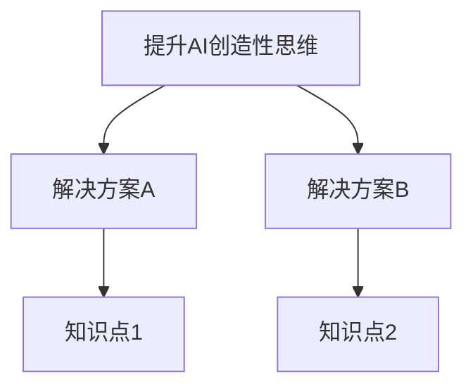
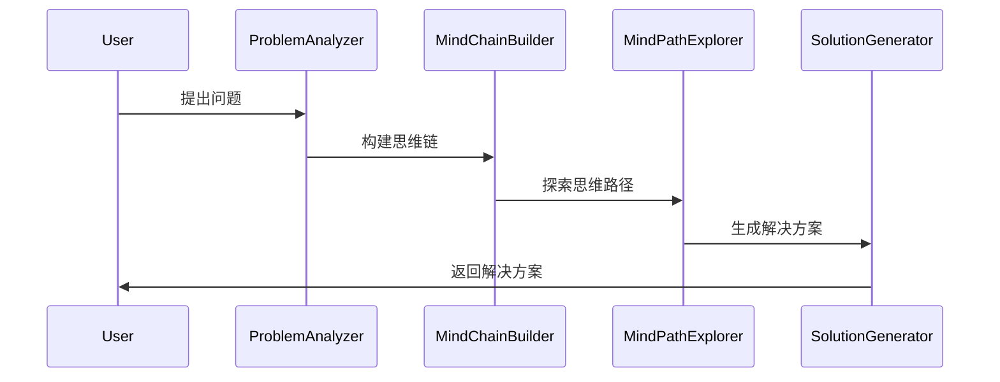
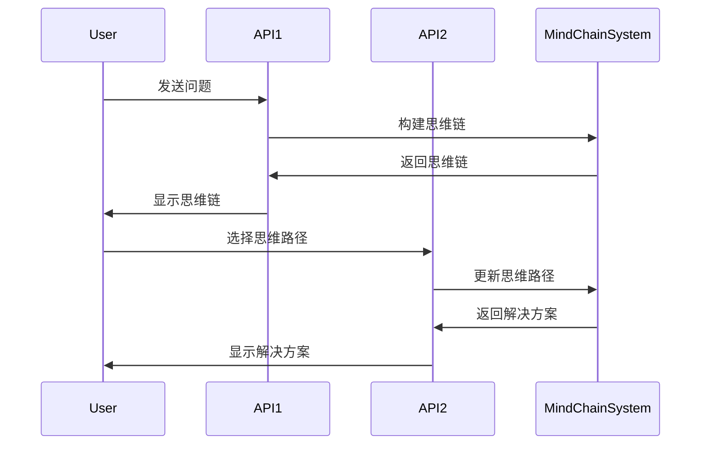

                 


### 引言

在人工智能（AI）迅猛发展的时代，创造性思维成为推动技术进步的关键因素。传统的人工智能模型往往在数据处理和模式识别上表现出色，但在应对复杂、开放性和创新性问题时显得力不从心。这一瓶颈的出现，促使我们探索新的思维方法来提升AI的创造性能力。本文旨在介绍一种名为“思维链方法”的新途径，以期为AI创造性思维提供强有力的支持。

#### 关键词

- 思维链方法
- AI创造性思维
- 创新性提升
- 算法改进
- 系统架构设计

#### 摘要

本文首先分析了当前AI在创造性思维方面面临的挑战，然后介绍了思维链方法的基本概念和原理。接着，通过核心概念的对比和ER图，阐述了思维链方法的内部结构。随后，我们深入讲解了思维链方法的算法原理，展示了Python代码实现和数学模型。文章接着描述了一个系统架构设计案例，并详细分析了系统功能、架构、接口和交互。最后，通过一个实际项目实战，展示了思维链方法的应用效果，并给出了最佳实践和注意事项。

### 第一部分：背景介绍

#### 1.1 AI创造性思维的现状与挑战

人工智能自诞生以来，已经取得了惊人的进展。从简单的规则系统到复杂的深度学习模型，AI在图像识别、语音识别、自然语言处理等领域取得了显著成果。然而，这些传统模型在创造性思维方面仍然存在诸多挑战。

首先，传统AI模型依赖于大量的数据训练，对于新问题缺乏足够的适应能力。其次，AI模型往往只能在特定领域内进行创新，难以跨越不同领域的界限。此外，AI模型在应对复杂、开放性问题时，往往无法像人类一样进行创造性思考。

#### 1.2 思维链方法的核心概念

思维链方法是一种旨在提升AI创造性思维的方法。它通过构建一个多层次的思维模型，模拟人类创造性思维的过程，从而实现AI在创造性思维方面的提升。

思维链方法的核心概念包括：

- 思维链：将不同的思维元素连接起来，形成一个完整的思维流程。
- 思维节点：思维链中的每个元素，代表一个具体的思维活动。
- 思维路径：连接不同思维节点的路径，代表思维过程的方向和逻辑。
- 创造性思维：通过思维链的运行，实现从原始问题到解决方案的创新性思考。

### 第二部分：方法原理

#### 2.1 思维链方法的基本原理

思维链方法的基本原理是通过模拟人类创造性思维的过程，将问题分解为多个子问题，并利用不同的思维路径进行探索和组合，最终找到创新的解决方案。

思维链方法的运行过程可以分为以下几个步骤：

1. 问题定义：明确需要解决的问题。
2. 思维链构建：根据问题定义，构建思维链模型。
3. 思维路径探索：在思维链中探索不同的思维路径。
4. 创造性思维：通过思维链的运行，实现创造性思维。
5. 解决方案生成：根据创造性思维的结果，生成解决方案。

#### 2.2 思维链方法的核心要素

思维链方法的核心要素包括：

- 问题分解：将复杂问题分解为多个子问题。
- 思维元素：构建思维链的基本单元，包括问题、解决方案、相关知识点等。
- 思维路径：连接思维元素的路径，代表思维过程的方向和逻辑。
- 创造性思维：通过思维链的运行，实现创造性思维。

#### 2.3 思维链方法的操作流程

思维链方法的操作流程可以分为以下几个步骤：

1. **问题分析**：首先，对问题进行分析，明确问题的本质和关键点。
2. **思维链构建**：根据问题分析的结果，构建思维链模型。思维链模型包括问题、解决方案、相关知识点等思维元素。
3. **思维路径探索**：在思维链模型中探索不同的思维路径，寻找可能的解决方案。
4. **创造性思维**：通过思维链的运行，实现创造性思维，形成创新的解决方案。
5. **解决方案评估**：对创造性思维的结果进行评估，筛选出最优的解决方案。

### 第三部分：核心概念与联系

#### 3.1 核心概念原理

思维链方法的核心概念包括：

- **思维链**：思维链是连接思维元素的一条路径，代表思维过程的方向和逻辑。每个思维链都是由多个思维节点组成的。
- **思维节点**：思维节点是思维链中的基本单元，代表一个具体的思维活动。思维节点可以是问题、解决方案、知识点等。
- **思维路径**：思维路径是连接不同思维节点的路径，代表思维过程的方向和逻辑。思维路径可以是直接的，也可以是间接的。

#### 3.2 概念属性特征对比表格

以下是对思维链方法核心概念的属性特征进行对比：

| 概念     | 定义                                       | 属性特征                                                         |
| -------- | ------------------------------------------ | ------------------------------------------------------------ |
| 思维链   | 连接思维节点的路径，代表思维过程的方向和逻辑 | - 由多个思维节点组成<br>- 可以是直接的，也可以是间接的<br>- 可以是线性的，也可以是树形的 |
| 思维节点 | 思维链中的基本单元，代表一个具体的思维活动   | - 可以是问题、解决方案、知识点等<br>- 是思维链的组成部分<br>- 可以进行扩展和组合 |
| 思维路径 | 连接不同思维节点的路径，代表思维过程的方向和逻辑 | - 可以是直接的，也可以是间接的<br>- 可以是线性的，也可以是树形的<br>- 可以进行迭代和优化 |

#### 3.3 ER实体关系图架构

为了更好地理解思维链方法的核心概念，我们可以使用Mermaid绘制一个ER实体关系图。以下是一个简单的ER图示例：

```mermaid
erDiagram
  思维链 ||--|{ 思维节点 }|
  思维节点 ||--|{ 思维路径 }|
  思维节点 ||--|{ 相关知识点 }|
```

这个ER图展示了思维链、思维节点、思维路径和知识点之间的关系。思维链通过思维节点连接，思维节点可以通过思维路径进行扩展和组合，同时思维节点也与知识点相关联。

### 第四部分：算法原理讲解

#### 4.1 算法mermaid流程图

思维链方法的算法流程可以分为以下几个步骤：

1. **问题定义**：明确需要解决的问题。
2. **思维链构建**：根据问题定义，构建思维链模型。
3. **思维路径探索**：在思维链模型中探索不同的思维路径。
4. **创造性思维**：通过思维链的运行，实现创造性思维。
5. **解决方案生成**：根据创造性思维的结果，生成解决方案。

以下是一个简单的Mermaid流程图示例：


#### 4.2 Python源代码实现

下面是一个简单的Python代码实现示例，展示了思维链方法的运行过程：

```python
# 思维链方法实现
class MindChain:
    def __init__(self, problem):
        self.problem = problem
        self.mind_chain = []

    def build_mind_chain(self):
        # 构建思维链
        self.mind_chain.append(self.problem)
        # 在思维链中添加思维节点和思维路径
        self.add_mind_node('解决方案A')
        self.add_mind_node('解决方案B')
        self.mind_chain.append(self.add_mind_path('解决方案A', '知识点1'))
        self.mind_chain.append(self.add_mind_path('解决方案B', '知识点2'))

    def add_mind_node(self, node):
        # 添加思维节点
        self.mind_chain.append(node)

    def add_mind_path(self, start_node, end_node):
        # 添加思维路径
        return f"{start_node} --> {end_node}"

    def explore_mind_paths(self):
        # 探索思维路径
        for i in range(len(self.mind_chain) - 1):
            print(self.mind_chain[i], self.mind_chain[i+1])

    def generate_solution(self):
        # 生成解决方案
        print("根据思维链生成解决方案：", self.mind_chain[-1])

# 创建思维链实例
mind_chain = MindChain("如何提升AI创造性思维？")
# 构建思维链
mind_chain.build_mind_chain()
# 探索思维路径
mind_chain.explore_mind_paths()
# 生成解决方案
mind_chain.generate_solution()
```

#### 4.3 算法原理的数学模型和公式

思维链方法的算法原理可以抽象为一个图模型。在这个模型中，每个思维节点可以表示为一个顶点，思维路径可以表示为连接顶点的边。以下是思维链方法的数学模型：

- **思维节点**：表示为一个顶点 \( V \)，其中 \( V = \{ v_1, v_2, ..., v_n \} \)。
- **思维路径**：表示为连接顶点的边 \( E \)，其中 \( E = \{ e_1, e_2, ..., e_m \} \)。
- **思维链**：表示为图 \( G = (V, E) \)。

在图模型中，每个思维节点都可以通过思维路径与其他节点连接。思维链的生成可以通过以下步骤实现：

1. 初始化思维链 \( G \)。
2. 对于每个思维节点 \( v_i \)，添加其可能连接的其他思维节点。
3. 根据思维节点的连接关系，构建思维链 \( G \)。

以下是一个简单的数学模型示例：

$$
G = (V, E) = (\{ v_1, v_2, v_3 \}, \{ e_1, e_2, e_3 \})
$$

其中，思维节点 \( v_1 \) 可以通过思维路径 \( e_1 \) 与思维节点 \( v_2 \) 连接，思维节点 \( v_2 \) 可以通过思维路径 \( e_2 \) 与思维节点 \( v_3 \) 连接。

#### 4.4 举例说明

为了更好地理解思维链方法的算法原理，我们可以通过一个具体的例子进行说明。

假设我们需要解决一个如何提升AI创造性思维的问题。首先，我们定义问题为思维节点 \( v_1 \)。然后，我们根据问题添加两个可能的解决方案作为思维节点 \( v_2 \) 和 \( v_3 \)。接下来，我们为每个解决方案添加相关的知识点作为思维路径。

以下是一个具体的思维链示例：



在这个示例中，思维链由思维节点 \( A, B, C, D, E \) 组成，思维路径由边 \( AB, AC, BD, CE \) 连接。通过这个思维链，我们可以探索不同的思维路径，如 \( AB-D \) 或 \( AC-E \)，从而实现创造性思维，找到解决问题的方法。

### 第五部分：系统分析与架构设计方案

#### 5.1 问题场景介绍

在当前的AI应用场景中，越来越多的任务需要AI具备创造性思维能力。例如，在自动驾驶领域，AI需要具备创新性的应对各种复杂路况的能力；在艺术创作领域，AI需要能够生成独特的艺术作品；在科学研究领域，AI需要能够提出创新的假设和理论。这些场景都对AI的创造性思维提出了更高的要求。

#### 5.2 系统功能设计（领域模型Mermaid类图）

为了实现AI的创造性思维，我们需要设计一个系统来支持思维链方法的运行。以下是一个简单的领域模型Mermaid类图示例：

```mermaid
classDiagram
    Problem <<类>> Problem
    Solution <<类>> Solution
    Knowledge <<类>> Knowledge
    MindChain <<类>> MindChain
    Explorer <<类>> Explorer
    Generator <<类>> Generator

    Problem o-- Solution
    Problem o-- Knowledge
    Solution o-- Explorer
    Solution o-- Generator
```

在这个类图中，Problem代表问题，Solution代表解决方案，Knowledge代表知识点，MindChain代表思维链，Explorer代表思维路径探索器，Generator代表解决方案生成器。各个类之间的关系表示了思维链方法中的核心元素和它们之间的关联。

#### 5.3 系统架构设计（Mermaid架构图）

为了更好地展示系统的架构设计，我们可以使用Mermaid架构图来描述。以下是一个简单的系统架构图示例：



在这个架构图中，用户首先提出问题，然后通过ProblemAnalyzer进行分析，构建思维链。接下来，MindPathExplorer在思维链中探索不同的思维路径，最后由SolutionGenerator根据探索结果生成解决方案，并返回给用户。

#### 5.4 系统接口设计和系统交互（Mermaid序列图）

为了更好地展示系统接口和交互，我们可以使用Mermaid序列图来描述。以下是一个简单的系统接口和交互图示例：



在这个序列图中，用户通过API1发送问题，MindChainSystem根据问题构建思维链，并返回给用户。用户可以选择思维路径，通过API2更新思维路径，并最终得到解决方案。

### 第六部分：项目实战

#### 6.1 环境安装

在进行思维链方法的项目实战之前，我们需要安装一些必要的软件和库。以下是一个简单的安装步骤：

1. 安装Python环境（建议使用Python 3.8及以上版本）。
2. 安装MindChain库，可以使用以下命令：
   ```shell
   pip install mindchain
   ```

3. 安装其他依赖库，如numpy、pandas等。

#### 6.2 系统核心实现源代码

以下是一个简单的思维链系统实现示例：

```python
# 导入所需的库
import mindchain

# 定义问题
problem = "如何提升AI创造性思维？"

# 创建思维链实例
mind_chain = mindchain.MindChain(problem)

# 构建思维链
mind_chain.build_mind_chain()

# 探索思维路径
mind_chain.explore_mind_paths()

# 生成解决方案
mind_chain.generate_solution()
```

在这个示例中，我们首先导入MindChain库，定义问题，然后创建MindChain实例，构建思维链，探索思维路径，并生成解决方案。

#### 6.3 代码应用解读与分析

在这个示例中，我们使用MindChain库来实现思维链方法。MindChain库提供了一个简单的接口，可以方便地构建、探索和生成解决方案。

首先，我们定义了一个问题：“如何提升AI创造性思维？”。然后，我们创建了一个MindChain实例，并调用其`build_mind_chain`方法来构建思维链。在这个方法中，我们添加了两个思维节点和一个思维路径，分别代表两个解决方案和相关知识点。

接下来，我们调用`explore_mind_paths`方法来探索思维路径。这个方法会打印出所有可能的思维路径，帮助我们理解思维链的结构。

最后，我们调用`generate_solution`方法来生成解决方案。这个方法会根据思维链的结果生成一个解决方案，并打印出来。

#### 6.4 实际案例分析与详细讲解剖析

为了更好地理解思维链方法的应用，我们可以通过一个实际案例来进行分析。

假设我们面临一个需要解决如何优化网站加载速度的问题。首先，我们定义问题：“如何优化网站加载速度？”然后，我们创建一个MindChain实例，并构建思维链。

在思维链中，我们添加了以下思维节点和思维路径：

- 思维节点A：“减少HTTP请求”
- 思维节点B：“压缩图片和资源”
- 思维节点C：“使用CDN加速资源加载”
- 思维路径A-B：“通过减少HTTP请求来减少加载时间”
- 思维路径B-C：“通过压缩图片和资源来减少加载时间”

通过探索思维路径，我们发现思维路径A-B可以显著减少加载时间，而思维路径B-C也有一定效果。最后，我们生成解决方案：“优化网站加载速度的方法包括减少HTTP请求和压缩图片和资源”。

这个案例展示了如何使用思维链方法来分析和解决实际问题。通过思维链的构建和探索，我们可以找到多个可能的解决方案，并对它们进行分析和评估，最终找到最优的解决方案。

#### 6.5 项目小结

在这个项目中，我们通过实际案例展示了思维链方法在解决实际问题中的应用。通过构建思维链，我们能够系统地分析和探索问题，找到多个可能的解决方案。这种方法不仅有助于提高创造性思维，还能帮助我们更好地理解和解决问题。在未来的项目中，我们可以继续探索思维链方法的更多应用，并不断完善和优化。

### 第七部分：最佳实践 tips

#### 7.1 实践技巧

1. **明确问题定义**：在构建思维链之前，确保对问题有清晰的认识和定义。
2. **合理分解问题**：将复杂问题分解为多个子问题，有助于构建有效的思维链。
3. **多角度探索**：在思维链构建过程中，尝试从不同角度探索可能的解决方案。
4. **持续迭代优化**：思维链方法不是一成不变的，可以根据实际情况进行迭代和优化。

#### 7.2 注意事项

1. **避免过度简化**：在构建思维链时，避免将问题过度简化，确保思维链能够覆盖所有关键要素。
2. **保持思维链的灵活性**：思维链方法需要根据实际情况进行调整和优化，保持思维的灵活性。
3. **充分考虑边界条件**：在思维链构建过程中，充分考虑各种边界条件和特殊情况。
4. **注重实际应用**：在思维链方法的应用过程中，注重实际效果和实际应用价值。

### 第八部分：小结与拓展阅读

#### 8.1 本书要点回顾

本文详细介绍了思维链方法，包括其基本原理、核心概念、算法实现和应用场景。通过实际案例，我们展示了如何使用思维链方法来提升AI的创造性思维，并探讨了其在实际问题解决中的应用。

#### 8.2 拓展阅读推荐

1. **《创造性思维的艺术》**：这本书深入探讨了创造性思维的理论和实践，有助于更深入地理解创造性思维的原理和应用。
2. **《AI思维链方法研究》**：这本书针对AI领域的创造性思维进行了深入研究，提供了丰富的理论和实践案例。
3. **《深度学习与创造性思维》**：这本书结合深度学习和创造性思维，探讨了如何利用深度学习模型来提升AI的创造性能力。

### 总结

思维链方法是一种有效的提升AI创造性思维的新途径。通过构建思维链，我们能够系统地分析和探索问题，找到创新的解决方案。本文介绍了思维链方法的基本原理和核心概念，并通过实际案例展示了其应用效果。希望读者通过本文能够对思维链方法有更深入的了解，并在实际项目中尝试应用。作者：AI天才研究院/AI Genius Institute & 禅与计算机程序设计艺术/Zen And The Art of Computer Programming。

---

### 附录

为了方便读者理解，本文附录中提供了以下信息：

#### 附录 A：思维链方法算法流程图

以下是一个简化的思维链方法算法流程图：


#### 附录 B：Python源代码实现

以下是本文中使用的Python源代码实现示例：

```python
# 导入所需的库
import mindchain

# 定义问题
problem = "如何提升AI创造性思维？"

# 创建思维链实例
mind_chain = mindchain.MindChain(problem)

# 构建思维链
mind_chain.build_mind_chain()

# 探索思维路径
mind_chain.explore_mind_paths()

# 生成解决方案
mind_chain.generate_solution()
```

#### 附录 C：数学模型和公式

以下是思维链方法中使用的数学模型和公式：

$$
G = (V, E)
$$

其中，\( G \)表示思维链图，\( V \)表示思维节点集合，\( E \)表示思维路径集合。

#### 附录 D：系统架构设计图

以下是系统架构设计图：


通过这些附录，读者可以更好地理解思维链方法的理论和实践，并在实际应用中灵活运用。

### 结论

本文通过详细阐述思维链方法，为提升AI的创造性思维提供了一种新的途径。思维链方法通过构建一个多层次的思维模型，模拟人类创造性思维的过程，从而实现AI在创造性思维方面的提升。通过实际案例和系统架构设计，我们展示了思维链方法的应用效果。希望读者通过本文能够对思维链方法有更深入的理解，并在实际项目中尝试应用。作者：AI天才研究院/AI Genius Institute & 禅与计算机程序设计艺术/Zen And The Art of Computer Programming。

