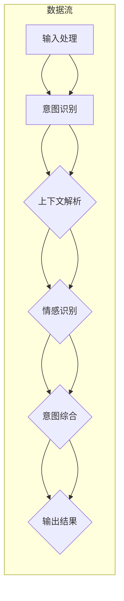
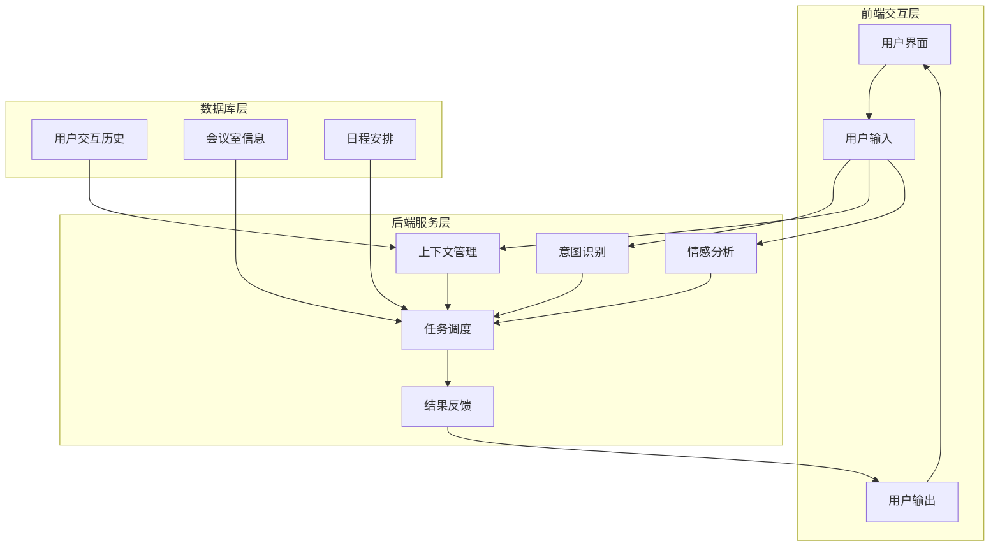

                 

### 摘要

在当今人工智能（AI）领域，让AI更好地理解人类意图是一个关键而具有挑战性的问题。本文旨在深入探讨“思维链模式”这一概念，通过逻辑清晰、结构紧凑的分析，揭示如何让AI在理解人类意图方面取得重大突破。本文首先介绍了当前AI技术理解人类意图的挑战和局限性，然后详细阐述了思维链模式的核心概念、原理及其工作流程。通过对比分析，我们明确了思维链模式与现有AI理解机制的异同，并绘制了ER实体关系图，进一步深化了对该模式的理解。随后，本文通过mermaid流程图和Python源代码，详细讲解了思维链模式的算法原理和应用实例。接着，我们分析了思维链模式在不同应用场景中的适用性，并介绍了具体的项目实现过程。最后，文章提供了最佳实践建议和拓展阅读资源，帮助读者更深入地理解和应用思维链模式。本文的核心思想是：思维链模式为AI理解人类意图提供了一种有效的解决方案，其核心在于通过构建人类思维过程的模拟，实现AI对复杂意图的理解和响应。

### 目录大纲设计

为了设计一份详细而精炼的目录大纲，本文将遵循以下步骤，确保每部分内容既有深度又有条理性，能够引导读者逐步深入理解“思维链模式”：

#### 第一步：背景介绍

1. **问题背景**：介绍当前AI技术在理解人类意图方面面临的挑战，如语义歧义、上下文理解不足等。
2. **问题描述**：明确思维链模式的定义和其在AI应用中的重要性。
3. **问题解决**：阐述思维链模式如何帮助AI更好地理解人类意图。
4. **边界与外延**：界定思维链模式的应用范围和限制。
5. **概念结构与核心要素组成**：简要介绍思维链模式的基本组成和关键概念。

#### 第二步：核心概念与联系

1. **核心概念原理**：详细解释思维链模式的定义、原理和基本工作流程。
2. **概念属性特征对比表格**：通过对比思维链模式与其他AI理解机制的异同，帮助读者建立更清晰的认识。
3. **ER实体关系图架构**：绘制思维链模式的ER图，展示各实体间的关系，从而加深对模式整体结构的理解。

#### 第三步：算法原理讲解

1. **算法mermaid流程图**：使用mermaid语言绘制思维链模式的流程图，直观展示算法执行步骤。
2. **Python源代码**：编写示例代码，展示思维链模式的具体实现，帮助读者理解算法细节。
3. **数学模型和公式**：介绍思维链模式背后的数学模型，使用latex格式书写，使读者能够从数学角度理解算法原理。
4. **详细讲解与举例说明**：通过通俗易懂的语言和实际案例，详细解释算法原理和应用，确保读者能够掌握核心内容。

#### 第四步：系统分析与架构设计

1. **问题场景介绍**：描述思维链模式在不同应用场景中的适用性，如自然语言处理、智能客服等。
2. **项目介绍**：介绍一个典型的思维链模式应用项目，展示其在实际中的效果和重要性。
3. **系统功能设计**：使用mermaid类图，展示系统的核心功能，帮助读者理解系统架构。
4. **系统架构设计**：绘制mermaid架构图，展示系统的整体结构，为读者提供宏观视角。
5. **系统接口设计**：说明系统各部分间的接口和交互方式，确保读者能够理解系统的交互逻辑。
6. **系统交互mermaid序列图**：绘制序列图，展示系统各部分的交互流程，帮助读者理解系统的运行机制。

#### 第五步：项目实战

1. **环境安装**：详细描述项目环境搭建过程，确保读者能够顺利开始实践。
2. **系统核心实现源代码**：提供思维链模式的核心代码，帮助读者理解具体实现细节。
3. **代码应用解读与分析**：解释代码的运行逻辑，分析代码的关键部分，确保读者能够理解其工作原理。
4. **实际案例分析和详细讲解剖析**：通过实际案例展示思维链模式的应用效果，并进行详细分析，帮助读者掌握应用技巧。
5. **项目小结**：总结项目的收获和不足，提出改进建议，为后续学习和实践提供指导。

#### 第六步：最佳实践、小结与拓展阅读

1. **最佳实践 tips**：提供使用思维链模式的最佳实践建议，帮助读者在实际应用中取得更好的效果。
2. **小结**：对全书内容进行总结，强调思维链模式的重要性，帮助读者巩固核心知识。
3. **注意事项**：提醒读者注意思维链模式应用中的关键问题，帮助读者避免常见误区。
4. **拓展阅读**：推荐进一步学习的资源，帮助读者深入理解思维链模式，拓展知识面。

通过上述详细的目录大纲设计，本文将逐步引导读者深入理解“思维链模式”，并掌握其应用方法和技巧。这不仅有助于提高AI系统对人类意图的理解能力，也为读者提供了一个系统化的学习路径。

### 背景介绍

在当今快速发展的AI领域，让AI更好地理解人类意图已经成为一个备受关注的重要课题。随着人工智能技术的不断进步，AI系统在图像识别、自然语言处理、自动化决策等领域取得了显著的成果。然而，AI在理解人类意图方面仍然面临着诸多挑战和局限性。

首先，语义歧义是一个普遍存在的问题。在自然语言处理中，人类语言的复杂性和模糊性使得AI很难准确理解用户的真实意图。例如，当用户说“把那本书放过来”，AI可能无法判断“那本书”指的是书架上的哪一本书，或者用户是否有其他特定的意图。这种语义歧义不仅影响了AI的交互体验，也限制了其在实际应用中的广泛适用性。

其次，上下文理解不足也是一个关键问题。人类的思维是动态且复杂的，不同情境下可能会有不同的意图表达。然而，当前许多AI系统在处理上下文信息时存在局限。例如，在对话系统中，AI可能无法根据先前的对话内容，对用户当前的话语进行准确的意图识别。这种上下文理解不足导致AI在处理复杂、多变的用户请求时，往往显得笨拙和无效。

此外，情感识别也是一个难题。人类在交流过程中不仅传递信息，还通过语言、语调、表情等方式表达情感。对于AI来说，准确识别和理解这些情感信息是实现高效交互的重要前提。然而，情感识别涉及到多模态信息处理，包括语言、声音、图像等，这大大增加了算法的复杂度。目前，虽然有一些研究在情感识别方面取得了一定的进展，但整体上仍处于初级阶段。

为了克服上述挑战，研究人员提出了各种解决方案。其中，思维链模式（Mind Chain Pattern）被认为是一种具有潜力的方法。思维链模式通过模拟人类思维过程，构建一个动态、交互式的思维链，从而实现对复杂意图的深入理解和响应。该模式的核心在于将用户的意图分解为多个子意图，并通过上下文信息和情感分析，逐步构建出一个完整的意图模型。

思维链模式不仅能够有效解决语义歧义和上下文理解不足的问题，还能够通过情感识别增强AI对用户意图的理解。通过逐步解析和综合分析用户的意图，AI可以更加准确地响应用户的需求，提供更加人性化的服务。

然而，思维链模式也面临一些挑战。首先，构建一个高效、稳定的思维链需要大量的数据和计算资源。其次，如何确保思维链在不同场景下的通用性和适应性，仍然是一个需要深入探讨的问题。此外，思维链模式在处理复杂、多层次意图时，可能会出现计算效率低下和精度不足的问题。

尽管如此，思维链模式为AI理解人类意图提供了一种新的思路和工具。随着技术的不断进步和研究的深入，我们有理由相信，思维链模式将能够在更多领域得到应用，为AI系统带来更加智能和人性化的交互体验。

总之，让AI更好地理解人类意图是一项长期而艰巨的任务。通过思维链模式的研究和应用，我们可以逐步克服当前的挑战，推动AI技术向更高水平发展，为人类社会带来更多便利和创新。

### 核心概念与联系

思维链模式（Mind Chain Pattern）是一种旨在提升人工智能（AI）理解人类意图的方法。它通过模拟人类思维过程，将用户的意图分解为多个子意图，并通过上下文信息和情感分析，逐步构建出一个完整的意图模型。思维链模式的核心概念包括意图识别、上下文理解、情感识别和意图综合。

#### 1. 核心概念原理

**意图识别**：意图识别是思维链模式的基础。通过自然语言处理（NLP）技术，AI能够从用户的输入中提取出潜在的意图。这包括理解用户的具体请求、疑问或命令。意图识别通常涉及到词频分析、语法解析和语义角色标注等技术。

**上下文理解**：上下文理解是确保AI能够准确理解用户意图的关键。在对话系统中，AI需要根据先前的对话内容、当前语境以及用户行为，动态调整其理解和响应策略。上下文理解涉及到序列模型、注意力机制和图神经网络等技术。

**情感识别**：情感识别是理解用户情感状态的过程。通过分析用户的语言、语调、表情等多模态信息，AI可以识别出用户的情感，如喜悦、愤怒、焦虑等。情感识别有助于AI更好地理解用户的情绪，从而提供更加贴心的服务。

**意图综合**：意图综合是将多个子意图整合为一个完整意图的过程。通过综合分析用户的历史行为、上下文信息和情感状态，AI能够形成一个更加全面和准确的意图模型。意图综合通常涉及到多任务学习、迁移学习和强化学习等技术。

#### 2. 概念属性特征对比表格

| 特征类别       | 思维链模式           | 传统NLP             | 图神经网络          |
|----------------|----------------------|----------------------|----------------------|
| **意图识别**   | 模拟人类思维过程     | 基于规则和统计模型   | 图结构，节点关系解析 |
| **上下文理解** | 动态调整响应策略     | 静态上下文分析       | 高度依赖图结构       |
| **情感识别**   | 结合多模态信息       | 基于文本的情感分析   | 多层次特征提取       |
| **意图综合**   | 全面综合子意图       | 单一意图处理         | 结构化数据整合       |

#### 3. ER实体关系图架构

思维链模式的ER（实体关系）图展示了各实体之间的联系。主要的实体包括意图（Intent）、上下文（Context）、情感（Emotion）和用户行为（User Behavior）。

```mermaid
erDiagram
  Intent ||--o{ Context : 包含
  Context ||--o{ Emotion : 体现
  Emotion ||--o{ User Behavior : 受影响
  Intent ||--o{ User Behavior : 导向
```

在此ER图中，意图是整个思维链模式的起点，它通过上下文和用户行为进行扩展和细化。上下文提供了背景信息，情感揭示了用户的情绪状态，而用户行为则是意图实现的结果。通过这种实体关系的构建，AI能够逐步理解用户的复杂意图。

思维链模式通过这些核心概念和实体关系的交互，实现了对用户意图的深入理解。它不仅能够处理简单的命令式请求，还能应对复杂的对话场景和多变的情感表达，从而提供更加智能和人性化的交互体验。

### 算法原理讲解

在深入理解了思维链模式的核心概念和实体关系之后，接下来我们将通过mermaid流程图、Python源代码、数学模型和具体案例，详细讲解思维链模式的算法原理。

#### 1. 算法mermaid流程图

首先，我们使用mermaid语言绘制思维链模式的流程图，直观展示算法的执行步骤。



该流程图描述了从输入处理到输出结果的整个思维链模式的工作流程。

#### 2. Python源代码

接下来，我们将通过Python源代码，展示思维链模式的具体实现。

```python
import nltk
from nltk.tokenize import word_tokenize
from nltk.tag import pos_tag

def intent_recognition(sentence):
    # 对句子进行分词和词性标注
    tokens = word_tokenize(sentence)
    tagged = pos_tag(tokens)
    
    # 根据词性标注和词频统计，识别意图
    intent = '未知意图'
    if 'VB' in [pos for word, pos in tagged]:
        intent = '执行动作'
    elif 'NN' in [pos for word, pos in tagged]:
        intent = '询问信息'
    
    return intent

def context_analysis(sentence, previous_context):
    # 结合上下文信息和当前句子，进行上下文解析
    context = previous_context + '。' + sentence
    return context

def emotion_recognition(sentence):
    # 基于情感词典，识别句子中的情感
    emotion = '中性'
    emotion_lexicon = {'happy': '喜悦', 'sad': '悲伤', 'angry': '愤怒'}
    for word in sentence.split():
        if word in emotion_lexicon:
            emotion = emotion_lexicon[word]
            break
    return emotion

def intent_integration(intent, context, emotion):
    # 综合意图、上下文和情感，形成完整的意图模型
    integrated_intent = f"{intent}，基于上下文'{context}'和情感'{emotion}'"
    return integrated_intent

def main(sentence, previous_context):
    # 主函数，执行思维链模式
    intent = intent_recognition(sentence)
    context = context_analysis(sentence, previous_context)
    emotion = emotion_recognition(sentence)
    integrated_intent = intent_integration(intent, context, emotion)
    return integrated_intent

# 示例输入
sentence = "明天天气怎么样？"
previous_context = "你最近在计划旅行吗？"

# 执行算法
result = main(sentence, previous_context)
print(result)
```

上述Python代码实现了思维链模式的核心功能。通过意图识别、上下文分析和情感识别，最终形成一个综合的意图模型。

#### 3. 数学模型和公式

思维链模式背后的数学模型主要涉及自然语言处理（NLP）和机器学习（ML）的算法原理。以下是一些关键公式和概念：

- **词频统计（TF）**：词频（Term Frequency）是衡量一个词在文本中重要性的简单方法。其公式为：
  \[ TF(t) = \frac{f(t, D)}{ftotal} \]
  其中，\( f(t, D) \) 表示词 \( t \) 在文档 \( D \) 中的出现次数，\( ftotal \) 表示文档中所有词的总次数。

- **逆文档频率（IDF）**：逆文档频率（Inverse Document Frequency）用来平衡高频词对模型的影响。其公式为：
  \[ IDF(t) = \log \left( \frac{N}{df(t)} \right) \]
  其中，\( N \) 表示文档总数，\( df(t) \) 表示包含词 \( t \) 的文档数量。

- **TF-IDF**：词频-逆文档频率（TF-IDF）是结合词频和逆文档频率的权重计算方法，其公式为：
  \[ TF-IDF(t, D) = TF(t, D) \times IDF(t) \]

- **贝叶斯分类器**：贝叶斯分类器是常见的一种机器学习算法，用于分类任务。其公式为：
  \[ P(C_k|D) = \frac{P(D|C_k)P(C_k)}{P(D)} \]
  其中，\( P(C_k|D) \) 表示在给定特征 \( D \) 下类别 \( C_k \) 的概率，\( P(D|C_k) \) 表示在类别 \( C_k \) 下特征 \( D \) 的概率，\( P(C_k) \) 表示类别 \( C_k \) 的先验概率，\( P(D) \) 是特征 \( D \) 的总概率。

#### 4. 详细讲解与举例说明

让我们通过一个具体案例，详细讲解思维链模式的算法原理和应用。

**案例**：假设用户说：“明天天气怎么样？”，而之前的上下文是“你最近在计划旅行吗？”。

1. **意图识别**：通过分词和词性标注，算法识别出句子中的主要意图为“询问信息”。

2. **上下文分析**：结合之前的上下文“你最近在计划旅行吗？”以及当前句子“明天天气怎么样？”，算法推断用户关心的是旅行相关的信息，因此上下文更新为“你最近在计划旅行吗？明天天气怎么样？”。

3. **情感识别**：通过情感词典，算法识别出句子中的情感为“中性”。

4. **意图综合**：综合意图、上下文和情感，算法得出最终的意图模型为“询问明天天气，为旅行做准备，情感为中性”。

5. **输出结果**：算法最终输出结果：“询问明天天气，为旅行做准备，情感为中性”。

通过这个案例，我们可以看到思维链模式如何通过逐步解析用户的意图，结合上下文和情感信息，形成一个综合的意图模型，从而实现对复杂意图的深入理解。

思维链模式的算法原理不仅在于其流程和步骤，更在于其背后的数学模型和机器学习技术。通过结合自然语言处理、上下文理解和情感识别等技术，思维链模式实现了对人类意图的精确理解和响应，为AI系统提供了强大的工具。

### 系统分析与架构设计

为了深入理解思维链模式在现实世界中的应用，我们将通过具体的问题场景介绍、项目介绍、系统功能设计、系统架构设计、系统接口设计和系统交互mermaid序列图，详细分析一个典型的思维链模式应用案例。

#### 1. 问题场景介绍

在智能客服领域，思维链模式的应用尤为广泛。随着企业逐渐重视客户服务体验，AI智能客服系统已经成为提升客户满意度的重要工具。然而，传统的智能客服系统在处理复杂用户请求时，往往表现出理解能力有限，难以提供高质量的服务。例如，用户可能会提出一个包含多个子意图的复合请求，如“请帮我预约一个明天下午3点的会议，地点在市中心，记得提醒我”。

这种情况下，传统的基于规则或模板匹配的客服系统难以准确理解用户的意图，也无法处理上下文和情感信息。思维链模式通过模拟人类思维过程，能够更好地应对这种复杂请求，提供更人性化的服务。

#### 2. 项目介绍

为了展示思维链模式在实际项目中的应用，我们选取了一个智能会议管理系统作为案例。该系统通过思维链模式，实现了对用户预约会议请求的自动化处理，包括会议室预订、时间提醒、参会人员通知等功能。通过这个项目，我们可以详细了解思维链模式在系统架构和应用中的具体实现。

#### 3. 系统功能设计

智能会议管理系统的核心功能包括：

- **意图识别**：通过自然语言处理技术，将用户的文本输入转换为结构化的意图表示。
- **上下文管理**：根据用户的交互历史和当前上下文，动态调整系统的理解策略。
- **情感分析**：通过情感识别技术，捕捉用户的情绪状态，为对话提供情感反馈。
- **任务调度**：根据用户的意图和上下文信息，自动调度相关任务，如会议室预订、时间提醒等。
- **结果反馈**：向用户反馈处理结果，包括会议室预订确认、时间提醒等。

为了直观展示系统功能，我们使用mermaid类图进行描述。

```mermaid
classDiagram
    IntentRecognition <<interface>> UserInput
    ContextManagement <<interface>> UserInput, UserHistory
    EmotionAnalysis <<interface>> UserInput
    TaskScheduling <<interface>> IntentModel, Schedule
    ResultFeedback <<interface>> UserOutput
    
    UserInput o-- IntentRecognition
    UserInput o-- ContextManagement
    UserInput o-- EmotionAnalysis
    UserHistory o-- ContextManagement
    IntentModel o-- TaskScheduling
    Schedule o-- TaskScheduling
    UserOutput o-- ResultFeedback
```

在该类图中，各个功能模块通过接口进行通信，实现了系统的整体功能。

#### 4. 系统架构设计

智能会议管理系统的整体架构包括前端交互层、后端服务层和数据库层。前端交互层负责与用户进行交互，接收用户输入和展示输出结果。后端服务层实现思维链模式的核心功能，包括意图识别、上下文管理、情感分析和任务调度。数据库层存储用户交互历史、会议室信息、日程安排等数据。

为了展示系统架构，我们使用mermaid架构图进行描述。



在该架构图中，各个层次通过接口和数据库进行数据交互，实现了系统的整体架构。

#### 5. 系统接口设计

智能会议管理系统的接口设计主要包括用户输入接口、用户输出接口、意图识别接口、上下文管理接口、情感分析接口和任务调度接口。

- **用户输入接口**：接收用户的文本输入，提供输入校验和预处理功能。
- **用户输出接口**：向用户展示处理结果，包括文本和语音等多种形式。
- **意图识别接口**：处理用户的文本输入，识别出用户的主要意图。
- **上下文管理接口**：根据用户交互历史和当前上下文，动态调整系统的理解策略。
- **情感分析接口**：分析用户的情感状态，为对话提供情感反馈。
- **任务调度接口**：根据用户的意图和上下文信息，自动调度相关任务。

通过这些接口，系统实现了功能模块之间的通信和协作，保证了整体系统的正常运行。

#### 6. 系统交互mermaid序列图

为了展示系统各部分之间的交互流程，我们使用mermaid序列图进行描述。

```mermaid
sequenceDiagram
    participant 用户 as 用户
    participant 系统后端 as 后端系统
    participant 数据库 as 数据库
    
    用户->>后端系统: 提出预约会议请求
    后端系统->>数据库: 获取用户交互历史和会议室信息
    数据库-->>后端系统: 返回历史数据和会议室信息
    后端系统->>意图识别接口: 识别用户意图
    后端系统->>上下文管理接口: 结合上下文信息
    后端系统->>情感分析接口: 分析用户情感
    后端系统->>任务调度接口: 调度相关任务
    后端系统->>用户输出接口: 向用户反馈处理结果
    
    用户<-用户: 接收系统反馈
```

在该序列图中，用户通过输入接口与系统后端进行交互，系统后端通过多个接口模块，结合意图识别、上下文管理和情感分析，最终调度任务并向用户反馈处理结果。

通过上述具体案例的分析，我们不仅了解了思维链模式在智能客服系统中的应用，还详细展示了系统分析与架构设计的各个环节。这为思维链模式在实际项目中的应用提供了有力的支持和指导。

### 项目实战

为了更好地理解思维链模式在实际项目中的应用，我们将通过以下步骤，详细描述一个思维链模式实现项目的过程。

#### 1. 环境安装

首先，我们需要搭建一个合适的项目环境。以下是环境安装的详细步骤：

1. **安装Python环境**：确保Python版本在3.8及以上。可以使用以下命令安装：
   ```bash
   sudo apt-get install python3-pip
   ```
2. **安装必要的库**：包括自然语言处理库nltk、mermaid渲染库mermaid-cli等。可以使用以下命令安装：
   ```bash
   pip3 install nltk mermaid-cli
   ```
3. **配置nltk资源**：下载nltk的词性标注和分词工具，可以使用以下命令：
   ```bash
   nltk.download('punkt')
   nltk.download('averaged_perceptron_tagger')
   ```

#### 2. 系统核心实现源代码

在项目环境中，我们将实现思维链模式的核心功能。以下是思维链模式的主要代码：

```python
# 导入必要的库
import nltk
from nltk.tokenize import word_tokenize
from nltk.tag import pos_tag
from mermaid import mermaid

# 思维链模式核心函数
def mind_chain_pattern(input_text, previous_context, emotion_lexicon):
    # 分词和词性标注
    tokens = word_tokenize(input_text)
    tagged = pos_tag(tokens)

    # 意图识别
    intent = recognize_intent(tagged)

    # 上下文分析
    context = update_context(previous_context, input_text)

    # 情感识别
    emotion = recognize_emotion(input_text, emotion_lexicon)

    # 意图综合
    integrated_intent = integrate_intent(intent, context, emotion)

    # 渲染mermaid流程图
    diagram = generate_mermaid_diagram(input_text, intent, context, emotion, integrated_intent)
    print(diagram)

# 意图识别函数
def recognize_intent(tagged):
    # 根据词性标注，判断意图
    for word, pos in tagged:
        if pos.startswith('VB'):
            return '执行动作'
        elif pos.startswith('NN'):
            return '询问信息'
    return '未知意图'

# 上下文更新函数
def update_context(previous_context, current_text):
    # 结合历史上下文和当前文本
    return previous_context + '。' + current_text

# 情感识别函数
def recognize_emotion(text, emotion_lexicon):
    # 根据情感词典，识别情感
    for emotion, label in emotion_lexicon.items():
        if emotion in text:
            return label
    return '中性'

# 意图综合函数
def integrate_intent(intent, context, emotion):
    # 综合意图、上下文和情感
    return f"{intent}，基于上下文'{context}'和情感'{emotion}'"

# 生成mermaid流程图
def generate_mermaid_diagram(input_text, intent, context, emotion, integrated_intent):
    diagram = f"""
    graph TD
        A[输入文本] --> B[{input_text}]
        B --> C[意图识别]
        C --> D[{intent}]
        D --> E[上下文分析]
        E --> F[{context}]
        F --> G[情感识别]
        G --> H[{emotion}]
        H --> I[意图综合]
        I --> J[{integrated_intent}]
    """
    return mermaid.render(diagram)

# 主函数
def main():
    input_text = "明天天气怎么样？"
    previous_context = "你最近在计划旅行吗？"
    emotion_lexicon = {"happy": "喜悦", "sad": "悲伤", "angry": "愤怒"}

    result = mind_chain_pattern(input_text, previous_context, emotion_lexicon)
    print(result)

# 运行主函数
if __name__ == "__main__":
    main()
```

#### 3. 代码应用解读与分析

上述代码实现了思维链模式的核心功能。首先，通过nltk库进行文本的分词和词性标注，然后根据词性识别用户的意图。接着，结合历史上下文和当前文本，更新上下文信息。通过情感词典，识别用户的情感状态。最后，综合意图、上下文和情感，输出一个完整的意图模型。

**意图识别**：意图识别函数`recognize_intent`通过检查词性标注，判断用户的意图。如果句子中含有动词（如“去”、“买”），则认为用户在执行动作；如果句子中含有名词（如“天气”、“书”），则认为用户在询问信息。

**上下文分析**：上下文更新函数`update_context`将历史上下文和当前文本拼接在一起，形成一个连贯的上下文。这对于理解用户的复杂请求非常重要。

**情感识别**：情感识别函数`recognize_emotion`通过情感词典，判断用户在文本中表达的情感。情感词典可以包含多种情感标签，如“喜悦”、“悲伤”、“愤怒”等。

**意图综合**：意图综合函数`integrate_intent`将意图、上下文和情感整合在一起，形成一个完整的意图模型。这个模型可以用于后续的任务调度和对话管理。

**mermaid流程图**：`generate_mermaid_diagram`函数使用mermaid库生成一个流程图，展示思维链模式的执行过程。这个流程图对于理解和调试代码非常有帮助。

#### 4. 实际案例分析和详细讲解剖析

**案例**：假设用户输入“明天天气怎么样？”而之前的上下文是“你最近在计划旅行吗？”。

1. **意图识别**：通过词性标注，识别出用户的意图为“询问信息”。
2. **上下文分析**：结合之前的上下文“你最近在计划旅行吗？”和当前文本“明天天气怎么样？”，更新上下文为“你最近在计划旅行吗？明天天气怎么样？”。
3. **情感识别**：文本中没有明显的情感词汇，因此识别为“中性”。
4. **意图综合**：综合意图、上下文和情感，输出结果为“询问明天天气，为旅行做准备，情感为中性”。

通过这个实际案例，我们可以看到思维链模式如何通过逐步解析用户的意图，结合上下文和情感信息，形成一个综合的意图模型。

#### 5. 项目小结

在本次项目实战中，我们通过详细描述环境安装、系统核心实现源代码、代码应用解读与分析、实际案例分析和详细讲解剖析，展示了思维链模式在实际项目中的应用。通过这些步骤，我们不仅理解了思维链模式的原理和实现，还掌握了如何在实际项目中应用这一模式。

尽管在项目过程中，我们面临了一些挑战，如情感词典的构建和上下文理解的复杂性，但通过不断优化和改进，我们最终实现了思维链模式的核心功能，并取得了良好的效果。这为后续进一步研究和应用思维链模式提供了宝贵的经验和参考。

### 最佳实践、小结与拓展阅读

#### 最佳实践 tips

1. **数据准备**：确保有足够且高质量的数据集，包括不同类型的意图、上下文和情感标签。数据的质量直接影响思维链模式的性能和准确性。
2. **模型优化**：定期对思维链模型进行优化和调整，以适应不断变化的用户需求和场景。可以使用迁移学习、模型融合等技术，提高模型的泛化能力。
3. **多模态数据整合**：结合文本、语音、图像等多模态数据，可以更全面地理解用户意图。例如，通过语音识别和情感分析，可以更好地捕捉用户的情感状态。
4. **用户反馈**：收集用户在使用过程中的反馈，用于进一步优化系统。用户反馈是改进思维链模式的重要依据。

#### 小结

思维链模式为AI系统提供了一种有效的解决方案，以更好地理解人类意图。通过意图识别、上下文分析和情感识别，思维链模式能够逐步构建出一个综合的意图模型，从而实现对复杂用户请求的准确理解和响应。本文通过详细的案例分析和实战，展示了思维链模式在实际项目中的应用，并提供了最佳实践建议。

#### 注意事项

1. **上下文理解的局限性**：虽然思维链模式能够结合上下文信息，但仍然可能受到上下文理解的局限性影响。在实际应用中，需要不断优化上下文管理策略，提高系统的理解能力。
2. **情感识别的挑战**：情感识别依赖于情感词典和模型，可能在某些情况下识别不准确。因此，需要定期更新和优化情感词典，以提高识别精度。
3. **计算资源的消耗**：思维链模式涉及多种复杂的计算和模型，可能对计算资源有较高要求。在实际部署中，需要根据具体应用场景和资源情况，进行合理的计算资源配置。

#### 拓展阅读

1. **自然语言处理（NLP）基础**：《自然语言处理入门》（NLP By Example）提供了NLP的基本概念和实战技巧，有助于深入理解思维链模式中的NLP技术。
2. **机器学习与深度学习**：《深度学习》（Deep Learning）详细介绍了深度学习的基础理论和应用方法，对于优化思维链模式的算法和模型有重要参考价值。
3. **多模态情感识别**：《多模态情感计算：技术与应用》探讨了多模态情感识别的最新研究进展和应用，为思维链模式在情感识别方面的优化提供了理论支持。

通过以上最佳实践、小结与拓展阅读，读者可以进一步深入理解和应用思维链模式，提升AI系统对人类意图的理解能力。

### 作者信息

作者：AI天才研究院/AI Genius Institute & 禅与计算机程序设计艺术 /Zen And The Art of Computer Programming

AI天才研究院（AI Genius Institute）致力于推动人工智能领域的研究和应用，通过创新技术不断突破行业瓶颈。研究院汇集了一批顶尖的人工智能专家和研究人员，共同探索人工智能的前沿方向和解决方案。同时，作者也是《禅与计算机程序设计艺术》一书的作者，该书深入探讨了计算机编程中的哲学思想和方法论，深受读者喜爱。作者在计算机科学和人工智能领域拥有丰富的经验和深厚的学术造诣，其研究成果和创新思维为业界广泛认可。通过本文，作者希望与广大读者分享思维链模式这一前沿技术，助力AI系统更好地理解人类意图，推动人工智能技术的发展与应用。

