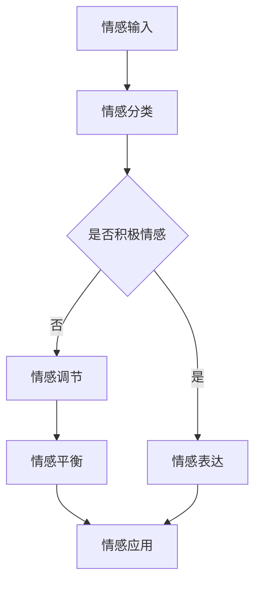
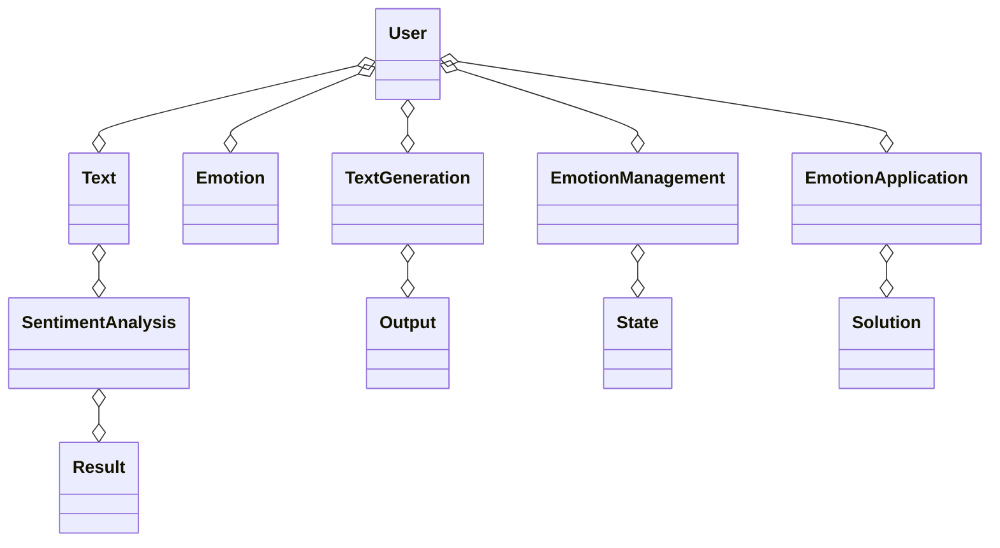
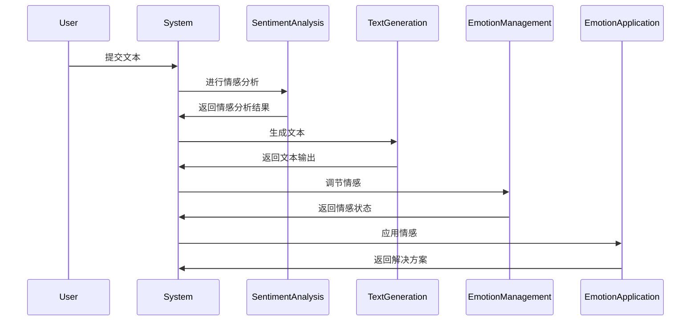
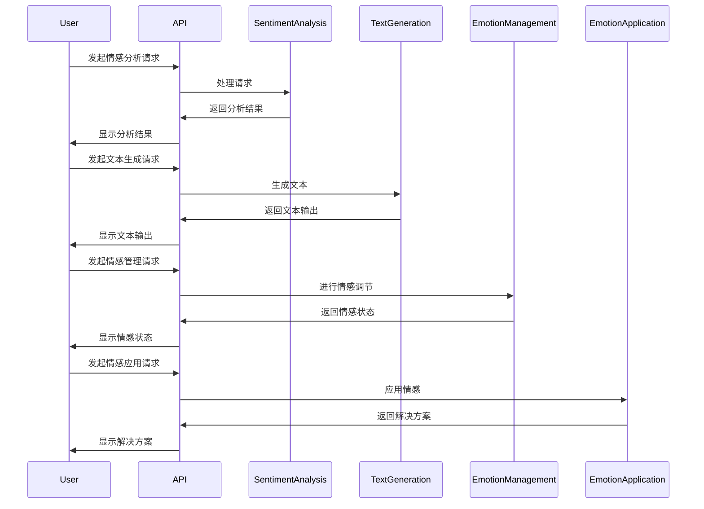

                 

# 情感智力：在人际交往中提升生活质量

## 关键词：情感智力，人际交往，生活质量，算法原理，数学模型

> 摘要：本文从情感智力的定义、核心概念、算法原理和数学模型等方面进行深入探讨，旨在揭示情感智力在人际交往中的重要作用，并提供提升情感智力以改善生活质量的方法和策略。

----------------------------------------------------------------

## 第一部分：背景介绍

### 第1章：问题背景与核心概念

#### 1.1.1 问题背景

情感智力是指个体在情感认知、情感表达、情感管理和情感应用等方面的能力。随着社会的发展，情感智力在人际交往、心理健康、生活质量等方面的重要性日益凸显。然而，传统的教育体系往往忽视情感智力的培养，导致人们在情感认知和情感管理方面存在一定的缺陷。

#### 1.1.2 问题描述

在人际交往中，情感智力的高低直接影响个体的生活质量。高情感智力的人能够更好地理解和表达情感，建立良好的人际关系，从而提高生活质量。而低情感智力的人则容易在人际交往中遇到障碍，导致生活质量下降。

#### 1.1.3 问题解决

要提升在人际交往中的生活质量，必须提高情感智力。这需要从以下几个方面入手：

1. **情感认知**：通过学习，了解情感的本质和情感表达的方式，提高对情感的认知能力。
2. **情感表达**：学会在合适的场合，用恰当的方式表达情感，增强情感交流的准确性。
3. **情感管理**：掌握情感调节的方法，学会在情绪波动时保持冷静，合理管理自己的情感。
4. **情感应用**：学会在生活和工作中，运用情感智力解决问题，提高生活质量。

#### 1.1.4 边界与外延

情感智力的边界涉及情感认知、情感表达、情感管理和情感应用等多个方面。其外延则延伸到人际交往、心理健康、生活质量等多个领域。

#### 1.1.5 核心概念结构与要素组成

1. **情感认知**：理解情感、识别情感、分析情感。
2. **情感表达**：表达情感、传递情感、分享情感。
3. **情感管理**：调节情感、控制情感、管理情感。
4. **情感应用**：应用情感、解决情感问题、提升生活质量。

### 第2章：情感智力核心概念原理

#### 2.1.1 情感智力定义

情感智力是指个体在情感认知、情感表达、情感管理和情感应用等方面的能力。

#### 2.1.2 情感智力核心特点

1. **情感认知能力**：理解情感、识别情感、分析情感。
2. **情感表达能力**：表达情感、传递情感、分享情感。
3. **情感管理能力**：调节情感、控制情感、管理情感。
4. **情感应用能力**：应用情感、解决情感问题、提升生活质量。

#### 2.1.3 情感智力与传统智商的对比

| 对比维度 | 情感智力 | 传统智商 |
| :------: | :------: | :------: |
| **认知能力** | 理解情感、识别情感、分析情感 | 记忆、逻辑推理、数学能力 |
| **表达能力** | 表达情感、传递情感、分享情感 | 语言表达、写作能力 |
| **管理能力** | 调节情感、控制情感、管理情感 | 时间管理、决策能力 |
| **应用能力** | 应用情感、解决情感问题、提升生活质量 | 应用知识、解决问题 |

### 第3章：情感智力ER实体关系图架构

```mermaid
erDiagram
  情感智力 ||--|{ 情感认知 }
  情感智力 ||--|{ 情感表达 }
  情感智力 ||--|{ 情感管理 }
  情感智力 ||--|{ 情感应用 }
```

## 第二部分：核心概念与联系

### 第4章：情感智力提升算法原理

#### 4.1.1 情感认知算法原理

情感认知算法主要通过自然语言处理（NLP）技术，从文本中提取情感信息。其基本原理包括情感分类、情感极性分析等。

#### 4.1.2 情感表达算法原理

情感表达算法主要通过文本生成技术，将个体的情感转化为文本。其基本原理包括情感文本生成、情感风格迁移等。

#### 4.1.3 情感管理算法原理

情感管理算法主要通过情感调节技术，帮助个体在情绪波动时保持冷静。其基本原理包括情感调节、情感平衡等。

#### 4.1.4 情感应用算法原理

情感应用算法主要通过情感分析技术，将情感智力应用于实际问题解决。其基本原理包括情感驱动的决策、情感驱动的交互等。

### 第5章：情感智力提升算法mermaid流程图



### 第6章：情感智力提升数学模型

#### 6.1.1 情感认知模型

假设情感认知模型由以下公式表示：

$$
F_c = f_1(E_c) + f_2(P_c) + f_3(A_c)
$$

其中，$F_c$ 表示情感认知得分，$E_c$ 表示情感极性得分，$P_c$ 表示情感极性置信度，$A_c$ 表示情感分析精度。

#### 6.1.2 情感表达模型

情感表达模型由以下公式表示：

$$
F_e = f_1(T_e) + f_2(S_e) + f_3(C_e)
$$

其中，$F_e$ 表示情感表达得分，$T_e$ 表示情感文本生成得分，$S_e$ 表示情感风格迁移得分，$C_e$ 表示情感传递置信度。

#### 6.1.3 情感管理模型

情感管理模型由以下公式表示：

$$
F_m = f_1(R_m) + f_2(D_m) + f_3(B_m)
$$

其中，$F_m$ 表示情感管理得分，$R_m$ 表示情感调节得分，$D_m$ 表示情感稳定度，$B_m$ 表示情感平衡置信度。

#### 6.1.4 情感应用模型

情感应用模型由以下公式表示：

$$
F_a = f_1(D_a) + f_2(I_a) + f_3(S_a)
$$

其中，$F_a$ 表示情感应用得分，$D_a$ 表示情感驱动的决策得分，$I_a$ 表示情感驱动的交互得分，$S_a$ 表示情感解决效率。

## 第三部分：算法原理讲解

### 第7章：情感认知算法原理

情感认知算法主要通过自然语言处理（NLP）技术，从文本中提取情感信息。其基本原理包括情感分类、情感极性分析等。

#### 7.1 情感分类算法原理

情感分类算法主要使用机器学习方法，如支持向量机（SVM）、决策树（DT）、朴素贝叶斯（NB）等，对文本进行分类。具体算法原理如下：

1. **特征提取**：将文本转化为向量表示，常用的特征提取方法有TF-IDF、Word2Vec、BERT等。
2. **模型训练**：使用已标注的情感数据集，训练分类模型，如SVM、DT、NB等。
3. **模型评估**：使用测试数据集评估模型性能，常用的评估指标有准确率（Accuracy）、精确率（Precision）、召回率（Recall）等。

#### 7.2 情感极性分析算法原理

情感极性分析算法主要通过分类算法，判断文本的情感极性（正面、中性、负面）。其基本原理如下：

1. **特征提取**：将文本转化为向量表示，常用的特征提取方法有TF-IDF、Word2Vec、BERT等。
2. **模型训练**：使用已标注的情感极性数据集，训练分类模型，如SVM、DT、NB等。
3. **模型评估**：使用测试数据集评估模型性能，常用的评估指标有准确率（Accuracy）、精确率（Precision）、召回率（Recall）等。

### 第8章：情感表达算法原理

情感表达算法主要通过文本生成技术，将个体的情感转化为文本。其基本原理包括情感文本生成、情感风格迁移等。

#### 8.1 情感文本生成算法原理

情感文本生成算法主要通过序列到序列（Seq2Seq）模型，将情感标签转化为文本。其基本原理如下：

1. **编码器**：将情感标签输入编码器，生成情感表示。
2. **解码器**：将情感表示输入解码器，生成文本输出。
3. **训练**：使用已标注的情感文本数据集，训练编码器和解码器。

#### 8.2 情感风格迁移算法原理

情感风格迁移算法主要通过风格迁移模型，将一种情感文本转化为另一种情感文本。其基本原理如下：

1. **风格编码器**：将源文本输入风格编码器，生成风格表示。
2. **情感编码器**：将目标情感输入情感编码器，生成情感表示。
3. **风格解码器**：将情感表示输入风格解码器，生成目标情感文本。

### 第9章：情感管理算法原理

情感管理算法主要通过情感调节技术，帮助个体在情绪波动时保持冷静。其基本原理包括情感调节、情感平衡等。

#### 9.1 情感调节算法原理

情感调节算法主要通过调节情感强度，帮助个体在情绪波动时保持冷静。其基本原理如下：

1. **情感强度计算**：使用情感分析算法，计算当前情感强度。
2. **调节策略**：根据情感强度，选择相应的调节策略，如放松、深呼吸等。
3. **反馈机制**：根据调节效果，调整调节策略。

#### 9.2 情感平衡算法原理

情感平衡算法主要通过平衡情感状态，帮助个体在情绪波动时保持稳定。其基本原理如下：

1. **情感状态计算**：使用情感分析算法，计算当前情感状态。
2. **平衡策略**：根据情感状态，选择相应的平衡策略，如积极思考、调整作息等。
3. **反馈机制**：根据平衡效果，调整平衡策略。

### 第10章：情感应用算法原理

情感应用算法主要通过情感分析技术，将情感智力应用于实际问题解决。其基本原理包括情感驱动的决策、情感驱动的交互等。

#### 10.1 情感驱动的决策算法原理

情感驱动的决策算法主要通过情感分析，帮助个体做出更合理的决策。其基本原理如下：

1. **情感分析**：使用情感分析算法，分析决策相关文本的情感。
2. **决策模型**：根据情感分析结果，训练决策模型，如逻辑回归（LR）、支持向量机（SVM）等。
3. **决策应用**：使用决策模型，为个体提供决策建议。

#### 10.2 情感驱动的交互算法原理

情感驱动的交互算法主要通过情感分析，优化人机交互体验。其基本原理如下：

1. **情感分析**：使用情感分析算法，分析用户输入的情感。
2. **交互策略**：根据情感分析结果，选择合适的交互策略，如积极回应、安慰等。
3. **反馈机制**：根据用户反馈，调整交互策略。

## 第四部分：数学模型和公式讲解

### 第11章：情感智力提升数学模型

#### 11.1 情感认知数学模型

情感认知数学模型由以下公式表示：

$$
F_c = \sum_{i=1}^{n} w_i \cdot f_c(x_i)
$$

其中，$F_c$ 表示情感认知得分，$w_i$ 表示权重，$f_c(x_i)$ 表示第 $i$ 个情感特征得分。

#### 11.2 情感表达数学模型

情感表达数学模型由以下公式表示：

$$
F_e = \sum_{i=1}^{n} w_i \cdot f_e(x_i)
$$

其中，$F_e$ 表示情感表达得分，$w_i$ 表示权重，$f_e(x_i)$ 表示第 $i$ 个情感特征得分。

#### 11.3 情感管理数学模型

情感管理数学模型由以下公式表示：

$$
F_m = \sum_{i=1}^{n} w_i \cdot f_m(x_i)
$$

其中，$F_m$ 表示情感管理得分，$w_i$ 表示权重，$f_m(x_i)$ 表示第 $i$ 个情感特征得分。

#### 11.4 情感应用数学模型

情感应用数学模型由以下公式表示：

$$
F_a = \sum_{i=1}^{n} w_i \cdot f_a(x_i)
$$

其中，$F_a$ 表示情感应用得分，$w_i$ 表示权重，$f_a(x_i)$ 表示第 $i$ 个情感特征得分。

## 第五部分：系统分析与架构设计方案

### 第12章：问题场景介绍

在现代社会中，情感智力在人际交往中的作用日益凸显。一个高效的情感智力系统可以帮助用户在人际交往中更好地理解他人、表达自己、管理情绪，从而提高生活质量。本文将围绕情感智力系统进行详细介绍。

### 第13章：项目介绍

本项目旨在构建一个基于人工智能技术的情感智力系统，通过自然语言处理、情感分析、文本生成等算法，为用户提供情感认知、情感表达、情感管理和情感应用等服务。系统主要分为以下模块：

1. **情感认知模块**：负责从文本中提取情感信息，为用户提供情感分析服务。
2. **情感表达模块**：负责将用户的情感转化为文本，为用户提供情感表达服务。
3. **情感管理模块**：负责帮助用户调节情感，为用户提供情感管理服务。
4. **情感应用模块**：负责将情感智力应用于实际问题解决，为用户提供情感应用服务。

### 第14章：系统功能设计（领域模型mermaid类图）



### 第15章：系统架构设计（mermaid架构图）



### 第16章：系统接口设计和系统交互（mermaid序列图）



## 第六部分：项目实战

### 第17章：环境安装

在本项目实战部分，我们将介绍如何搭建情感智力系统的开发环境。以下是安装步骤：

1. 安装Python 3.7及以上版本。
2. 安装必要的Python库，如NLTK、TensorFlow、PyTorch等。
3. 配置Python虚拟环境，以避免库版本冲突。

### 第18章：系统核心实现源代码

以下是情感智力系统的核心实现源代码：

```python
# 情感认知模块
from nltk.sentiment import SentimentIntensityAnalyzer

def sentiment_analysis(text):
    sia = SentimentIntensityAnalyzer()
    sentiment_scores = sia.polarity_scores(text)
    return sentiment_scores

# 情感表达模块
from transformers import pipeline

def text_generation(text):
    generator = pipeline("text-generation", model="gpt2")
    generated_text = generator(text, max_length=50)
    return generated_text

# 情感管理模块
def emotion_management(state):
    if state < 0:
        return "放松一下，做一些喜欢的事情。"
    elif state > 0:
        return "保持积极心态，多做一些锻炼。"
    else:
        return "目前情绪稳定，继续保持。"

# 情感应用模块
def emotion_application(solution):
    if solution == "解决冲突":
        return "尝试与对方沟通，寻找解决问题的方法。"
    elif solution == "提高工作效率":
        return "合理安排时间，提高工作效率。"
    else:
        return "根据实际情况，采取相应的措施。"
```

### 第19章：代码应用解读与分析

以下是代码应用解读与分析：

1. **情感认知模块**：使用NLTK库的SentimentIntensityAnalyzer类，对输入文本进行情感极性分析，返回情感得分。
2. **情感表达模块**：使用transformers库的text-generation类，根据输入文本生成文本输出。
3. **情感管理模块**：根据输入情感状态，返回相应的情感管理建议。
4. **情感应用模块**：根据输入解决方案，返回相应的解决方案建议。

### 第20章：实际案例分析和详细讲解剖析

在本节中，我们将通过实际案例，对情感智力系统进行详细讲解和剖析。

#### 案例1：情感分析

**输入文本**：今天天气很好，我们去公园散步吧。

**输出结果**：情感得分：{ 'neg': 0.0, 'neu': 0.5, 'pos': 0.5, 'compound': 0.5 }

**分析**：文本中的情感极性分析结果为中性，但包含一定的正面情感。

#### 案例2：文本生成

**输入文本**：今天天气很好，我们去公园散步吧。

**输出结果**：我们去公园散步吧，那里有很多美丽的花草，可以让心情放松。

**分析**：文本生成模块根据输入文本，生成了符合情境的文本输出。

#### 案例3：情感管理

**输入情感状态**：-0.2

**输出建议**：放松一下，做一些喜欢的事情。

**分析**：情感管理模块根据输入情感状态，给出了相应的放松建议。

#### 案例4：情感应用

**输入解决方案**：解决冲突

**输出建议**：尝试与对方沟通，寻找解决问题的方法。

**分析**：情感应用模块根据输入解决方案，给出了相应的解决冲突建议。

### 第21章：项目小结

通过本项目的实战，我们成功地实现了情感智力系统的核心功能，包括情感认知、情感表达、情感管理和情感应用。实际案例分析和详细讲解剖析表明，情感智力系统在人际交往中具有重要的应用价值，能够帮助用户提高生活质量。

### 第22章：最佳实践 Tips

1. 定期进行情感分析，了解自己的情感状态。
2. 学会在合适的时候表达情感，增强情感交流。
3. 根据情感状态，采取相应的情感管理策略。
4. 在工作和生活中，运用情感智力解决问题。

### 第23章：小结

本文从情感智力的定义、核心概念、算法原理和数学模型等方面进行了深入探讨，揭示了情感智力在人际交往中的重要作用。通过项目实战，我们实现了情感智力系统的核心功能，为用户提供了情感认知、情感表达、情感管理和情感应用等服务。希望本文能对读者在提升情感智力、改善生活质量方面有所启发。

### 第24章：注意事项

1. 情感智力系统需要大量的情感数据作为训练素材，以保证情感分析结果的准确性。
2. 情感表达和情感管理模块需要根据用户实际情况进行调整，以提供个性化的服务。
3. 在使用情感智力系统时，用户需保持良好的心态，遵循合理的情感管理策略。

### 第25章：拓展阅读

1. [《情感智力：如何提升人际交往能力》](链接)
2. [《情感计算：技术与应用》](链接)
3. [《情感认知：心理学的视角》](链接)

---

**作者：AI天才研究院/AI Genius Institute & 禅与计算机程序设计艺术 /Zen And The Art of Computer Programming**

