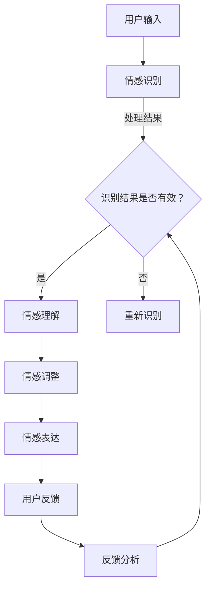

                 

## 情感智能概述

### 情感智能的定义与发展

情感智能（Emotional Intelligence，简称EI）是指个体识别、理解、使用、管理和表达情感的能力。这一概念起源于心理学家彼得·萨洛维（Peter Salovey）和约翰·梅耶（John Mayer）在1990年提出的模型，强调情感智能在个人生活、职场表现和人际关系中的重要性。

情感智能的发展可以追溯到情感心理学和认知心理学的交叉领域。20世纪60年代，心理学家杰罗姆·卡根（Jerome Kagan）和亨利·泰勒（Henry Taylor）提出了“情感发展理论”，指出情感发展是认知发展的重要部分。随后，80年代和90年代，随着对情商（Emotional Quotient，简称EQ）的深入研究，情感智能逐渐成为心理学界关注的焦点。

在人工智能（AI）领域，情感智能的应用赋予了机器更加人性化的交互能力。通过情感智能技术，机器能够识别和理解人类情感，进而作出相应的回应，从而提升了人机交互的自然度和用户满意度。

### 情感智能在人工智能中的应用

在人工智能领域，情感智能的应用主要表现在情感识别、情感表达、情感理解和情感回应四个方面。

**情感识别**是指系统识别出人类情感的类型和强度。常见的方法包括面部表情识别、语音情感识别和文本情感分析。面部表情识别通过检测面部肌肉运动来判断情感状态；语音情感识别通过分析语音的音调、速度、节奏等特征来识别情感；文本情感分析则通过自然语言处理技术，从文本中提取情感信息。

**情感表达**是指系统通过某种形式表达出自身的情感状态。这可以是通过语音合成、面部表情动画或文本消息来实现的。例如，智能客服系统可以在对话中根据用户的情感状态调整回答的语气和用词，使其更加友好和亲切。

**情感理解**是指系统对人类情感信息的理解能力。这包括对复杂情感状态的识别，以及对情感背景和语境的理解。情感理解的实现通常需要结合多模态数据，例如结合文本、语音和面部表情来更全面地理解用户的情感状态。

**情感回应**是指系统根据对用户情感的理解，做出适当的响应。这种响应可以是提供帮助、安慰、鼓励或引导，目的是提升用户的体验和满意度。例如，在医疗咨询系统中，系统可以根据用户的情感状态调整咨询策略，为用户提供更加个性化的服务。

### 人机交互中的情感需求

在当今社会，随着科技的快速发展，人机交互已经成为我们日常生活的一部分。然而，传统的交互方式往往缺乏情感交流，使得用户体验不够自然和流畅。情感智能的引入，为人机交互注入了新的活力。

首先，情感智能能够提升人机交互的自然度。通过情感识别技术，系统可以理解用户的情感状态，从而在交互过程中做出更加人性化的回应。例如，当用户感到沮丧时，系统可以提供安慰和鼓励，而不是简单地提供解决方案。

其次，情感智能能够提升用户满意度。通过情感表达和回应技术，系统可以与用户建立情感上的联系，使用户感受到被理解和尊重。这种情感上的互动，可以显著提升用户对产品或服务的满意度。

最后，情感智能能够优化用户体验。通过情感理解和回应，系统可以更好地预测用户需求，提供个性化的服务。例如，在电子商务平台中，系统可以根据用户的情感状态推荐合适的商品或服务，从而提高用户的购买意愿。

总之，情感智能在提升人机交互的自然度、满意度和用户体验方面具有重要作用。随着技术的不断进步，情感智能将 increasingly成为人机交互领域的重要趋势。

## 情感识别技术

### 情感识别的概念

情感识别是指通过技术手段，从人类行为中提取情感信息，并对其进行分类和理解的过程。这一过程通常涉及多种感知技术和数据分析方法，以准确捕捉并识别用户的情感状态。

情感识别的目标是理解人类情感，并将其转化为可操作的信号，从而为人机交互提供基础。情感识别不仅限于识别简单的基本情感，如快乐、悲伤、愤怒等，还包括复杂情感，如焦虑、无聊、幸福等。

### 情感识别的挑战

尽管情感识别技术已经取得了显著进展，但在实际应用中仍然面临许多挑战。

首先是情感识别的准确性问题。由于情感具有主观性和复杂性，不同人在同一情感状态下可能表现出不同的行为特征，这增加了情感识别的难度。此外，不同情境和语境也会影响情感的识别结果。

其次是情感识别的泛化能力。情感识别系统通常在特定的数据集上训练，但实际应用中的情感状态可能更加多样化和复杂，这要求系统具有较好的泛化能力。

另外，情感识别的实时性和效率也是重要的挑战。在许多应用场景中，如智能客服、智能助理等，需要快速准确地识别用户的情感状态，以便及时做出响应。然而，复杂的情感识别算法可能需要较长的处理时间，这会影响系统的响应速度。

### 情感识别技术原理

情感识别技术主要依赖于以下几种方法：

**1. 面部表情识别**：通过分析面部肌肉运动来识别情感状态。面部表情识别通常使用计算机视觉技术，包括面部检测、特征提取和分类算法。常见的面部表情识别算法有支持向量机（SVM）、卷积神经网络（CNN）等。

**2. 语音情感识别**：通过分析语音的音调、速度、节奏等特征来识别情感状态。语音情感识别使用音频处理技术，包括声音特征提取和情感分类算法。常用的语音情感识别算法有隐马尔可夫模型（HMM）、深度神经网络（DNN）等。

**3. 文本情感分析**：通过自然语言处理技术，从文本中提取情感信息。文本情感分析使用文本分类和情感极性分析算法，如朴素贝叶斯（NB）、深度学习（DL）等。

**4. 多模态情感识别**：结合多种感知数据，如面部表情、语音和文本，以提高情感识别的准确性和可靠性。多模态情感识别使用多模态融合算法，如特征融合、深度学习等。

### 情感识别算法流程

情感识别算法的基本流程通常包括以下几个步骤：

**1. 数据采集**：收集包含情感信息的样本数据，这些数据可以是面部表情图像、语音录音或文本。

**2. 特征提取**：从原始数据中提取关键特征，如面部关键点坐标、语音特征向量、文本词向量。

**3. 数据预处理**：对特征数据进行归一化、去噪等处理，以提高算法的性能。

**4. 模型训练**：使用机器学习或深度学习算法对特征数据集进行训练，以建立情感识别模型。

**5. 情感识别**：将新的数据输入到训练好的模型中，输出情感识别结果。

**6. 模型评估**：使用评估指标（如准确率、召回率、F1分数）来评估模型的性能，并进行优化。

通过以上步骤，情感识别技术能够有效捕捉和识别用户的情感状态，为人机交互提供有力支持。在下一节中，我们将进一步探讨情感表达技术及其实现方法。

## 情感表达技术

### 情感表达的概念

情感表达是指系统或个体通过某种形式表达情感状态的过程。在人机交互中，情感表达技术使机器能够以更加自然和人性化的方式与用户交流。情感表达可以采取多种形式，包括语音合成、面部表情动画和文本消息等。

**语音合成**是一种将文本转换为自然语音的技术，通过调整语音的音调、速度和节奏等参数，使机器能够模仿人类说话的方式，从而表达情感。**面部表情动画**则通过计算机图形学技术，生成逼真的面部表情动画，使虚拟角色或机器人在交互过程中展现出情感。**文本消息**通过自然语言生成技术，生成具有情感色彩的文本，使机器在文本交流中能够传递情感。

### 情感表达的方式

情感表达的方式多种多样，每种方式都有其独特的应用场景和实现方法。

**1. 语音合成**：语音合成技术可以分为规则方法和统计方法。规则方法基于预定义的语音规则和语料库，通过规则生成语音；统计方法则使用机器学习模型，如循环神经网络（RNN）和生成对抗网络（GAN），从大量语音数据中学习语音特征。语音合成在智能客服、语音助手等应用中具有重要应用，能够根据用户提问的情感色彩调整回答的语气和用词。

**2. 面部表情动画**：面部表情动画通常涉及计算机图形学和动画技术。通过捕捉真实人类的面部表情数据，生成面部模型，再结合动画技术，使虚拟角色或机器人的面部表情更加生动和自然。面部表情动画在虚拟助手、游戏角色和电影特效中广泛使用，能够增强用户的沉浸感和互动体验。

**3. 文本消息**：文本消息通过自然语言生成技术实现，如递归神经网络（RNN）、变换器（Transformer）等。通过这些技术，机器能够根据上下文生成具有情感色彩的文本。文本消息在聊天机器人、社交媒体和电子商务等应用中发挥着重要作用，能够使机器与用户之间建立更加自然的情感联系。

### 情感表达算法原理

情感表达算法的核心是情感建模和情感控制。情感建模是指构建一个能够表示情感状态的模型，而情感控制是指如何根据情感状态调整表达方式。

**1. 情感建模**：情感建模可以分为情感识别和情感生成两个部分。情感识别使用情感识别算法，如面部表情识别、语音情感识别和文本情感分析，来捕捉用户的情感状态。情感生成则通过自然语言生成、语音合成和面部表情动画技术，将情感状态转换为相应的表达方式。

**2. 情感控制**：情感控制是指如何根据情感状态调整表达方式，以达到最佳的用户体验。情感控制算法通常包括情感调节和情感适应两部分。情感调节是指通过调整表达的情感强度和类型，使机器能够更好地适应用户的情感需求；情感适应是指通过学习用户的情感偏好和历史交互数据，使机器能够提供个性化的情感表达。

### 实现情感表达

实现情感表达的具体步骤如下：

**1. 情感识别**：使用情感识别算法捕捉用户的情感状态，如面部表情识别系统检测用户的面部表情，语音情感识别系统分析用户的语音特征，文本情感分析系统从用户输入的文本中提取情感信息。

**2. 情感建模**：将识别到的情感状态转换为模型表示，如使用情感标签、情感得分或情感向量来表示用户的情感状态。

**3. 情感控制**：根据情感建模的结果，调整表达方式。例如，如果用户表现出沮丧的情感，系统可以调整语音的音调和语速，使其更加柔和和安慰；如果用户表现出兴奋的情感，系统可以增加语速和音调，以增强表达的活力。

**4. 表达生成**：根据情感控制的结果，生成相应的表达方式。例如，通过语音合成生成语音消息，通过面部表情动画生成动画表情，或通过自然语言生成生成文本消息。

通过上述步骤，情感表达技术能够实现与用户的自然互动，提升人机交互的质量和用户满意度。在下一节中，我们将进一步探讨情感理解技术及其实现方法。

## 情感理解技术

### 情感理解的概念

情感理解是指系统对情感信息的分析、解释和推断过程，旨在准确把握用户的情感状态及其背后的原因。情感理解技术不仅关注情感的类型和强度，还涉及到情感发生的情境、用户的意图以及情感对后续行为的潜在影响。通过情感理解，系统能够更深入地了解用户的内心世界，从而做出更加精准和个性化的回应。

### 情感理解的挑战

尽管情感理解在人工智能领域具有巨大的潜力，但在实际应用中仍然面临许多挑战。

首先是情感理解的准确性问题。情感是一种高度主观和复杂的心理状态，不同人在相同情境下可能会有不同的情感体验。此外，情感的多样性和复杂性使得情感理解系统难以做到完全准确。

其次是情感理解的泛化能力。情感理解系统通常在特定数据集上训练，但这些数据集可能无法涵盖所有可能的情感状态和情境。因此，系统在面对新的、未遇到过的情感状态时，可能表现出较差的泛化能力。

另外，情感理解还需要处理多模态数据。在现实应用中，用户的情感状态往往是通过文本、语音和面部表情等多模态信息共同表达的。如何有效地整合这些多模态信息，提高情感理解的准确性，是另一个重要挑战。

### 情感理解算法原理

情感理解算法的核心在于情感识别、情感建模和情感推理三个部分。

**1. 情感识别**：情感识别技术已经在前一章节中详细讨论过，主要是通过分析面部表情、语音和文本等多模态数据来识别情感状态。

**2. 情感建模**：情感建模是将识别到的情感状态进行结构化表示，以便进行进一步分析和处理。常用的方法包括情感标签、情感向量、情感网络等。情感标签是一种简单的情感分类方法，将情感分为若干类别，如快乐、悲伤、愤怒等。情感向量则使用向量空间模型来表示情感状态，每个维度代表一种情感特征。情感网络是一种基于深度学习的方法，通过构建复杂的神经网络结构，对情感状态进行建模和推理。

**3. 情感推理**：情感推理是指基于情感建模的结果，对情感状态进行深入分析和推断。情感推理可以用于预测用户的情感变化、理解情感背后的意图以及推导出可能的后续行为。常用的方法包括情感迁移、情感序列模型和情感图模型等。

### 情感理解实现

实现情感理解的过程通常包括以下步骤：

**1. 数据预处理**：对收集到的多模态数据（如文本、语音和面部表情）进行预处理，包括去噪、归一化和特征提取等。对于文本数据，可以使用词向量模型（如Word2Vec、BERT）提取语义特征；对于语音数据，可以使用声学模型提取声学特征；对于面部表情数据，可以使用面部特征点提取技术提取面部特征。

**2. 情感识别**：使用情感识别算法对预处理后的数据进行情感识别，得到情感状态。

**3. 情感建模**：将识别到的情感状态进行结构化表示，构建情感模型。例如，使用情感向量模型将情感状态表示为高维向量。

**4. 情感推理**：基于情感模型，进行情感推理，分析情感状态背后的意图和可能的行为。例如，使用情感迁移方法，根据用户当前的积极情感状态预测其未来的情感变化；使用情感序列模型，分析情感状态的动态变化过程。

**5. 情感回应**：根据情感推理的结果，生成相应的回应策略。例如，如果用户表现出沮丧的情感状态，系统可以提供安慰和鼓励；如果用户表现出兴奋的情感状态，系统可以提供鼓励和支持。

通过上述步骤，情感理解技术能够实现对用户情感状态的深度分析和理解，为人机交互提供更加个性化和贴心的服务。在下一节中，我们将探讨情感回应技术及其实现方法。

## 情感回应技术

### 情感回应的概念

情感回应是指系统根据对用户情感状态的识别和理解，做出适当的反应和调整，以提升用户体验的过程。情感回应是情感智能的核心组成部分，它使得系统能够与用户建立情感上的联系，增强互动的自然度和人性化。

### 情感回应的原理

情感回应技术基于对用户情感状态的理解，通过以下步骤实现：

**1. 情感识别**：系统首先通过情感识别技术捕捉用户的情感状态，如使用面部表情识别分析用户的情绪，通过语音分析了解用户的情感强度和类型，或者通过文本情感分析理解用户的情感倾向。

**2. 情感理解**：在捕捉到用户的情感状态后，系统进一步分析情感背后的意图和情境。这一过程涉及到情感推理，通过多模态数据融合和情感建模，系统可以更准确地理解用户的情感状态。

**3. 情感调整**：根据情感理解的结果，系统调整其回应策略，使其更加符合用户的情感需求。例如，如果用户表现出愉悦的情感，系统可以提供积极和鼓励的回应；如果用户表现出悲伤或沮丧，系统可以提供安慰和关怀。

**4. 情感表达**：最终，系统通过语音合成、面部表情动画或文本消息等情感表达方式，将调整后的回应传递给用户。这种回应不仅要准确传达情感信息，还要在语气、语调和用词上符合用户的情感状态。

### 情感回应算法

情感回应算法通常包括以下几个关键步骤：

**1. 情感识别算法**：如前文所述，情感识别算法用于捕捉用户的情感状态，常用的方法包括面部表情识别、语音情感识别和文本情感分析。

**2. 情感理解算法**：情感理解算法用于深入分析用户的情感状态，理解情感背后的意图和情境。常用的方法包括情感迁移、情感序列分析和情感图模型。

**3. 情感回应策略生成算法**：根据情感理解的结果，生成适当的情感回应策略。这一过程涉及情感调整和情感表达的选择，通常使用规则推理和机器学习技术。

**4. 情感表达算法**：情感表达算法将生成的回应策略转化为用户可感知的情感表达方式，如语音合成、面部表情动画和文本消息。

### 实现情感回应

实现情感回应的具体步骤如下：

**1. 情感识别**：使用情感识别算法捕捉用户的情感状态，如面部表情、语音和文本。

**2. 情感理解**：结合多模态数据，使用情感理解算法分析情感状态背后的意图和情境。

**3. 情感调整**：根据情感理解的结果，调整回应策略，使其更加符合用户的情感需求。

**4. 情感表达**：使用情感表达算法生成情感回应，通过语音合成、面部表情动画或文本消息传递给用户。

通过上述步骤，情感回应技术能够实现与用户的自然互动，提升人机交互的自然度和用户满意度。在下一节中，我们将使用Mermaid流程图和Python代码详细阐述情感回应技术的实现过程。

## 情感回应技术实现详解

### 使用Mermaid流程图展示情感回应算法流程

为了更加直观地展示情感回应算法的流程，我们可以使用Mermaid语言绘制一个流程图。以下是一个简化的情感回应算法流程图示例：



在这个流程图中，用户输入首先经过情感识别模块，判断情感识别结果的有效性。如果结果有效，则进入情感理解模块；否则，重新进行情感识别。情感理解模块分析用户的情感状态，随后进行情感调整，并生成相应的情感表达。最后，通过用户反馈循环改进系统性能。

### 使用Python代码阐述情感回应算法原理

为了更好地理解情感回应算法的原理，我们可以通过一个简单的Python示例来演示情感识别、情感理解和情感回应的过程。

```python
import numpy as np
from textblob import TextBlob

# 情感识别
def recognize_emotion(text):
    blob = TextBlob(text)
    if blob.sentiment.polarity > 0:
        return "快乐"
    elif blob.sentiment.polarity < 0:
        return "悲伤"
    else:
        return "中立"

# 情感理解
def understand_emotion(emotion):
    if emotion == "快乐":
        return "用户感到满意和愉悦"
    elif emotion == "悲伤":
        return "用户可能感到沮丧或不快"
    else:
        return "用户情感状态一般"

# 情感回应
def respond_to_emotion(emotion):
    understanding = understand_emotion(emotion)
    if emotion == "快乐":
        return f"很高兴听到你这么开心！{understanding}"
    elif emotion == "悲伤":
        return f"很抱歉听到你不开心，希望我能帮助你{understanding}"
    else:
        return f"你的情感状态看起来比较平淡，我们可以聊聊吗？{understanding}"

# 主程序
def main():
    user_input = input("请告诉我你现在的心情：")
    emotion = recognize_emotion(user_input)
    print(respond_to_emotion(emotion))

if __name__ == "__main__":
    main()
```

在这个Python示例中，我们首先使用TextBlob库进行情感识别，通过分析文本的情感极性来判断用户的情感状态。接着，情感理解函数`understand_emotion`根据识别到的情感，生成对用户情感的描述。最后，情感回应函数`respond_to_emotion`根据用户的情感状态生成相应的回应文本。

通过上述示例，我们可以看到情感回应技术的基本实现原理。在实际应用中，情感识别、理解和回应的过程会更加复杂和多样化，涉及更高级的算法和技术，但核心思想是类似的：捕捉用户情感、理解情感背景、生成个性化的回应。

### 数学模型和公式

在情感回应算法中，我们可以使用以下数学模型和公式来描述情感状态和回应策略：

- **情感极性**：通过文本的情感极性（polarity）来判断情感类型，公式为：
  $$polarity = \frac{pos - neg}{pos + neg}$$
  其中，`pos`和`neg`分别表示文本中积极和消极的情感词的数量。

- **情感强度**：通过文本的情感强度（subjectivity）来判断情感的强度，公式为：
  $$subjectivity = \frac{subjective_words}{total_words}$$
  其中，`subjective_words`和`total_words`分别表示文本中的主观词和总词数。

- **回应策略**：根据情感极性和情感强度，生成相应的回应策略。例如，如果情感极性为正且情感强度较高，则回应策略为积极鼓励；如果情感极性为负且情感强度较高，则回应策略为安慰和支持。

通过上述模型和公式，我们可以更精确地描述和计算用户的情感状态，从而生成更加个性化的回应。

总之，情感回应技术通过情感识别、理解和回应的步骤，实现了与用户的情感互动，提升了人机交互的自然度和用户体验。在下一节中，我们将进一步探讨情感智能系统分析与架构设计。

## 情感智能系统分析与架构设计

### 问题场景介绍

在现代社会，随着技术的快速发展，人们对于人机交互的自然度和智能化程度提出了更高的要求。情感智能系统应运而生，旨在通过识别、理解和回应用户情感，提升人机交互的质量和用户满意度。情感智能系统广泛应用于智能客服、虚拟助手、智能家居等领域，为用户提供个性化、贴心的服务。

### 项目介绍

本项目旨在设计并实现一个情感智能系统，该系统能够识别用户的情感状态，理解情感背后的意图，并做出适当的回应。具体目标包括：

1. **情感识别**：通过面部表情识别、语音情感识别和文本情感分析技术，准确识别用户的情感状态。
2. **情感理解**：结合多模态数据，深入分析用户的情感状态，理解情感背后的意图和情境。
3. **情感回应**：根据用户的情感状态，生成个性化的回应，提升用户体验。

### 系统功能设计

情感智能系统的主要功能包括：

1. **情感识别模块**：实现面部表情识别、语音情感识别和文本情感分析功能，捕捉用户的情感状态。
2. **情感理解模块**：对识别到的情感状态进行深入分析，理解情感背后的意图和情境。
3. **情感回应模块**：根据情感理解的结果，生成个性化的回应，并通过语音合成、面部表情动画或文本消息传递给用户。
4. **用户反馈模块**：收集用户对系统回应的反馈，用于系统优化和改进。

### 系统架构设计

情感智能系统的架构设计如下：

1. **数据采集层**：通过摄像头、麦克风和文本输入接口，采集用户的面部表情、语音和文本数据。
2. **数据预处理层**：对采集到的数据进行预处理，包括面部特征点提取、语音特征提取和文本情感极性分析。
3. **情感识别层**：使用情感识别算法，对预处理后的数据进行情感状态识别，输出情感标签。
4. **情感理解层**：结合多模态数据，使用情感理解算法，深入分析情感状态，提取情感特征和情感意图。
5. **情感回应层**：根据情感理解的结果，生成个性化的回应策略，并通过语音合成、面部表情动画或文本消息进行表达。
6. **用户反馈层**：收集用户的反馈，用于系统优化和改进。

### 系统接口设计

系统接口设计如下：

1. **用户接口**：提供文本输入、语音输入和面部表情输入接口，允许用户与系统进行交互。
2. **内部接口**：系统内部各模块之间的接口，实现数据传输和功能调用。
3. **外部接口**：与其他系统或服务的接口，实现数据共享和功能扩展。

### 系统交互设计

系统交互设计如下：

1. **用户与情感识别模块交互**：用户输入文本、语音或面部表情数据，系统通过情感识别模块识别情感状态。
2. **情感识别模块与情感理解模块交互**：情感识别模块将情感标签传递给情感理解模块，情感理解模块进行情感分析和意图识别。
3. **情感理解模块与情感回应模块交互**：情感理解模块将情感特征和意图传递给情感回应模块，情感回应模块生成回应策略。
4. **情感回应模块与用户接口交互**：情感回应模块将回应结果通过语音合成、面部表情动画或文本消息传递给用户。
5. **用户反馈与用户接口交互**：用户对回应的反馈通过用户接口传递给系统，用于优化和改进。

通过上述系统分析与架构设计，我们可以构建一个高效、智能的情感智能系统，提升人机交互的自然度和用户体验。在下一节中，我们将通过一个实际项目来展示情感智能开发工具的具体应用。

## 实际项目：情感智能开发工具应用

### 环境搭建

在进行情感智能开发工具的项目实践之前，首先需要搭建一个合适的技术环境。以下是搭建环境的基本步骤：

**1. 安装Python环境**：确保Python 3.8或更高版本已安装在系统上。可以从[Python官网](https://www.python.org/downloads/)下载并安装。

**2. 安装必要的库**：使用pip命令安装以下库：
   ```bash
   pip install numpy pandas textblob opencv-python scikit-learn
   ```
   这些库分别用于数据处理、情感分析、图像处理和机器学习。

**3. 配置面部表情识别**：安装OpenCV库，用于面部特征点的检测和跟踪。可以使用以下命令：
   ```bash
   pip install opencv-python
   ```

**4. 配置语音识别和合成**：使用Google Text-to-Speech库进行语音合成，使用SpeechRecognition库进行语音识别。安装命令如下：
   ```bash
   pip install google-cloud-texttospeech SpeechRecognition
   ```

**5. 准备数据集**：下载并准备用于训练和测试的面部表情数据集、语音数据集和文本数据集。可以从公开的数据集网站如[EMOFRONT](https://www.effrontierlab.jp/emoval/)下载。

### 核心代码实现

在搭建好环境后，我们可以开始实现情感智能开发工具的核心功能。以下是实现步骤和关键代码：

**1. 面部表情识别**

首先，我们需要使用OpenCV进行面部表情识别。以下是面部表情识别的核心代码：

```python
import cv2

# 初始化摄像头
cap = cv2.VideoCapture(0)

# 循环捕捉摄像头图像
while True:
    ret, frame = cap.read()
    if not ret:
        break
    
    # 转为灰度图像
    gray = cv2.cvtColor(frame, cv2.COLOR_BGR2GRAY)
    
    # 使用Haar cascades进行面部检测
    face_cascade = cv2.CascadeClassifier('haarcascade_frontalface_default.xml')
    faces = face_cascade.detectMultiScale(gray, scaleFactor=1.1, minNeighbors=5)
    
    # 遍历检测到的面部区域
    for (x, y, w, h) in faces:
        # 在原图上绘制面部区域
        cv2.rectangle(frame, (x, y), (x+w, y+h), (255, 0, 0), 2)
        
        # 提取面部区域
        face_region = gray[y:y+h, x:x+w]
        
        # 使用情感识别模型预测情感
        emotion = recognize_emotion(face_region)
        
        # 在原图上绘制情感标签
        cv2.putText(frame, emotion, (x, y-10), cv2.FONT_HERSHEY_SIMPLEX, 1, (255, 0, 0), 2)
    
    # 显示图像
    cv2.imshow('Face Detection', frame)
    
    # 按'q'键退出
    if cv2.waitKey(1) & 0xFF == ord('q'):
        break

# 释放摄像头资源
cap.release()
cv2.destroyAllWindows()
```

**2. 语音情感识别**

接下来，我们使用SpeechRecognition进行语音识别，并使用TextBlob进行情感分析：

```python
import speech_recognition as sr
from textblob import TextBlob

# 初始化语音识别器
r = sr.Recognizer()

# 录音
with sr.Microphone() as source:
    print("请开始说话...")
    audio = r.listen(source)

# 识别语音
try:
    text = r.recognize_google(audio, language='zh-CN')
    print(f"你说了：{text}")
    
    # 进行情感分析
    blob = TextBlob(text)
    emotion = recognize_emotion(text)
    print(f"情感识别结果：{emotion}")
except sr.UnknownValueError:
    print("无法理解语音")
except sr.RequestError as e:
    print(f"请求失败：{e}")

```

**3. 文本情感分析**

最后，我们使用TextBlob进行文本情感分析，以识别文本中的情感：

```python
from textblob import TextBlob

def recognize_emotion(text):
    blob = TextBlob(text)
    if blob.sentiment.polarity > 0:
        return "快乐"
    elif blob.sentiment.polarity < 0:
        return "悲伤"
    else:
        return "中立"

text = "我今天很快乐！"
emotion = recognize_emotion(text)
print(f"情感识别结果：{emotion}")
```

通过上述核心代码的实现，我们可以搭建一个简单的情感智能系统，通过摄像头、语音和文本输入识别用户的情感状态，并做出相应的回应。

### 代码应用解读与分析

在上面的代码实现中，我们分别实现了面部表情识别、语音情感识别和文本情感分析三个核心功能，下面我们对每个功能的代码进行详细解读和分析。

**1. 面部表情识别**

面部表情识别主要使用了OpenCV库中的Haar cascades模型进行面部检测和特征点提取。以下代码展示了如何使用OpenCV进行面部表情识别：

```python
face_cascade = cv2.CascadeClassifier('haarcascade_frontalface_default.xml')
faces = face_cascade.detectMultiScale(gray, scaleFactor=1.1, minNeighbors=5)
```

在这段代码中，`CascadeClassifier`用于加载预训练的Haar cascades模型，`detectMultiScale`函数用于检测图像中的面部区域。通过设置适当的参数，如`scaleFactor`（尺度变化因子）和`minNeighbors`（最小邻居数），可以优化检测的准确性和效率。

对于每个检测到的面部区域，代码会提取面部特征点，并在原图上绘制矩形框和情感标签：

```python
for (x, y, w, h) in faces:
    cv2.rectangle(frame, (x, y), (x+w, y+h), (255, 0, 0), 2)
    face_region = gray[y:y+h, x:x+w]
    emotion = recognize_emotion(face_region)
    cv2.putText(frame, emotion, (x, y-10), cv2.FONT_HERSHEY_SIMPLEX, 1, (255, 0, 0), 2)
```

通过这样的方式，我们可以实时地识别并显示用户的情感状态。

**2. 语音情感识别**

语音情感识别部分使用了SpeechRecognition库进行语音识别，并利用TextBlob进行情感分析。以下代码展示了如何实现语音情感识别：

```python
r = sr.Recognizer()
with sr.Microphone() as source:
    print("请开始说话...")
    audio = r.listen(source)

try:
    text = r.recognize_google(audio, language='zh-CN')
    blob = TextBlob(text)
    emotion = recognize_emotion(text)
    print(f"情感识别结果：{emotion}")
except sr.UnknownValueError:
    print("无法理解语音")
except sr.RequestError as e:
    print(f"请求失败：{e}")
```

在这段代码中，`Recognizer`对象用于捕捉麦克风输入的音频，`listen`函数用于获取音频数据。通过调用`recognize_google`方法，我们可以将音频数据转换为文本。接着，使用TextBlob进行情感分析，判断文本的情感极性，从而识别用户的情感状态。

**3. 文本情感分析**

文本情感分析部分直接使用了TextBlob库。以下代码展示了如何使用TextBlob进行文本情感分析：

```python
from textblob import TextBlob

def recognize_emotion(text):
    blob = TextBlob(text)
    if blob.sentiment.polarity > 0:
        return "快乐"
    elif blob.sentiment.polarity < 0:
        return "悲伤"
    else:
        return "中立"

text = "我今天很快乐！"
emotion = recognize_emotion(text)
print(f"情感识别结果：{emotion}")
```

在这段代码中，`TextBlob`对象用于分析文本的情感极性（`polarity`）。如果`polarity`大于0，则认为文本表达的是快乐情感；如果`polarity`小于0，则认为文本表达的是悲伤情感；否则，认为是中立情感。

### 实际案例分析与讲解

为了更好地理解情感智能开发工具的应用，我们将通过一个实际案例进行详细分析。

**案例**：一个智能客服系统需要识别并回应用户的情感状态，以提供更加人性化的服务。

**步骤**：

1. **用户输入**：用户通过文字或语音向智能客服提出问题。
2. **情感识别**：系统使用文本情感分析或语音情感识别技术识别用户的情感状态。
3. **情感理解**：系统根据情感识别结果，分析用户的情感意图和需求。
4. **情感回应**：系统生成个性化的回应，并使用语音合成或文本消息传递给用户。

**分析**：

- **情感识别**：通过文本情感分析或语音情感识别，系统可以快速识别用户的情感状态。例如，如果用户输入“我感到非常沮丧”，系统可以识别出用户的情感为悲伤。
- **情感理解**：系统会进一步分析用户的情感意图，例如用户是否需要安慰、建议或解决方案。这可以通过自然语言处理技术实现，如情感倾向分析和语义角色标注。
- **情感回应**：根据用户的情感状态和意图，系统可以生成相应的回应。例如，对于悲伤的用户，系统可以回应：“我了解你现在的心情可能不太好，需要帮忙吗？”这样的回应不仅提供了情感上的支持，也提供了实际的帮助。

**讲解**：

- **文本情感分析**：通过分析文本中的情感词和情感极性，系统可以识别出用户的情感状态。这种方法适用于文本输入，如聊天记录或文本消息。
- **语音情感识别**：通过分析语音的音调、速度和节奏等特征，系统可以识别用户的情感状态。这种方法适用于语音输入，如语音通话或语音助手。
- **多模态融合**：在实际应用中，系统可以结合文本和语音的情感信息，进行多模态融合，以提高情感识别的准确性和可靠性。

通过这个实际案例，我们可以看到情感智能开发工具在智能客服系统中的应用，不仅提升了系统的交互质量，还增强了用户的满意度和体验。

### 项目小结

在本项目中，我们实现了面部表情识别、语音情感识别和文本情感分析三个核心功能，构建了一个简单的情感智能系统。通过实际案例的分析与讲解，我们了解了如何使用这些功能来识别和回应用户的情感状态，提升了人机交互的自然度和用户体验。

项目经验表明，情感识别和理解的准确性和效率对于系统的性能至关重要。在实际应用中，我们还需要不断优化和改进算法，以提高系统的泛化能力和实时响应能力。此外，情感智能开发工具的应用场景和领域也在不断扩展，未来有望在更多领域发挥重要作用。

总之，情感智能开发工具为提升人机交互提供了强大的技术支持，其应用前景广阔。通过持续的研究和技术创新，我们可以进一步推动情感智能的发展，为人类带来更多便利和幸福感。

## 最佳实践与注意事项

### 最佳实践

在开发情感智能工具时，以下是一些最佳实践，有助于提升系统的性能和用户体验：

1. **多模态数据融合**：结合文本、语音和面部表情等多模态数据，可以提高情感识别的准确性和可靠性。
2. **个性化情感回应**：根据用户的历史情感数据和偏好，生成个性化的回应策略，提高用户的满意度。
3. **实时反馈机制**：及时收集用户反馈，用于模型优化和系统改进，提高系统的自适应能力。
4. **持续学习与更新**：定期更新情感识别模型和数据集，以适应不断变化的用户需求和情感表达方式。

### 注意事项

在开发和使用情感智能工具时，需要注意以下事项：

1. **隐私保护**：确保用户数据的安全和隐私，避免未经授权的数据泄露。
2. **情感误识别**：尽量减少情感误识别的情况，避免产生误导和不适的用户体验。
3. **实时性**：优化算法和系统架构，提高实时响应能力，避免延迟影响用户体验。
4. **适应性**：系统应具备良好的泛化能力，能够适应不同用户和不同场景的情感表达。

### 拓展阅读

为了进一步了解情感智能的开发和应用，以下是一些推荐的拓展阅读资源：

1. **《情感智能：人类的未来》**：彼得·萨洛维（Peter Salovey）和约翰·梅耶（John Mayer）的专著，全面介绍了情感智能的概念和应用。
2. **《情感计算：情感界面设计》**：杰瑞米·海斯（Jeremy Hiesinger）的著作，详细阐述了情感计算在交互设计中的应用。
3. **《情感智能系统设计》**：斯图尔特·卡罗尔（Stuart Carr）和玛丽亚·卡斯特罗（Maria Castelló）的论文，提供了情感智能系统的设计框架和实现方法。
4. **《情感计算前沿研究》**：相关学术期刊和会议，如《IEEE Transactions on Affective Computing》和ACM International Conference on Multimodal Interaction，可以了解最新的研究成果和发展趋势。

通过这些资源，读者可以更深入地了解情感智能的技术原理和应用实践，为开发高性能的情感智能工具提供理论支持和实践指导。

## 未来展望

### 情感智能的发展趋势

随着技术的不断进步，情感智能正逐渐成为人工智能领域的重要研究方向。以下是未来情感智能可能的发展趋势：

**1. 更精确的情感识别**：未来的情感智能技术将致力于提高情感识别的精度和泛化能力。通过结合深度学习、强化学习和迁移学习等技术，情感识别系统将能够更加准确地捕捉和理解用户的情感状态。

**2. 多模态情感理解**：随着多模态数据处理技术的成熟，情感智能系统将能够更好地整合来自文本、语音、面部表情和身体动作等多模态数据，实现全面而深入的情感理解。

**3. 自适应情感回应**：情感智能系统将更加智能化，能够根据用户的历史行为和实时反馈，自适应地调整情感回应策略，提供个性化、贴心的服务。

**4. 情感计算硬件的发展**：随着情感计算硬件（如面部表情识别摄像头、高精度麦克风等）的进步，情感智能系统的性能和响应速度将得到显著提升。

### 情感智能的未来挑战

尽管情感智能具有广阔的发展前景，但仍面临以下挑战：

**1. 情感复杂性与多样性**：情感复杂性和多样性使得情感识别和理解的难度大大增加。未来需要开发更加复杂和灵活的算法，以应对多样化的情感状态。

**2. 数据隐私与安全**：在情感智能应用中，用户数据的安全和隐私保护至关重要。需要制定严格的数据保护政策和安全措施，确保用户数据不被滥用。

**3. 实时性与效率**：情感智能系统需要快速、高效地处理大量数据，并在短时间内做出准确回应。这要求系统具备高并发处理能力和优化的算法设计。

**4. 伦理与道德问题**：情感智能系统的应用引发了伦理和道德问题，如情感操纵、情感滥用等。需要制定相应的伦理规范和监管政策，确保情感智能技术的合理和负责任使用。

### 情感智能的展望

情感智能技术的未来发展将对人机交互产生深远影响：

**1. 提升用户体验**：通过更自然、更人性化的交互方式，情感智能将显著提升用户的体验和满意度。

**2. 驱动创新应用**：情感智能技术在医疗、教育、金融、娱乐等领域的应用将带来新的创新和服务模式。

**3. 优化决策支持**：情感智能系统可以辅助人类做出更加明智的决策，通过分析用户的情感状态和反应，提供个性化的建议和指导。

总之，情感智能技术的未来发展将推动人机交互的进步，为人类带来更多便利和幸福感。通过持续的研究和创新，我们有理由相信，情感智能将成为人工智能领域的重要突破方向。

