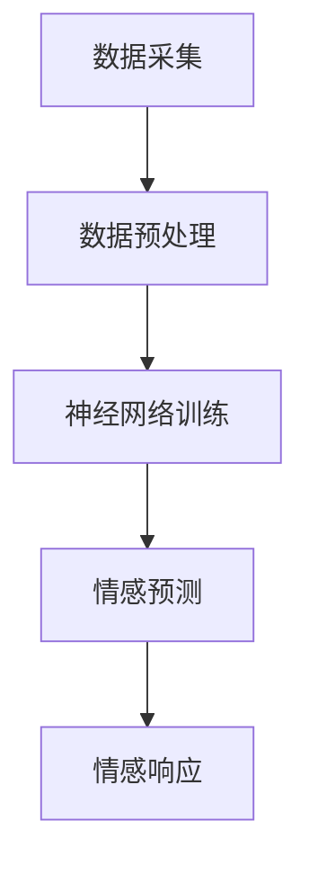

                 


### 情感智能研发实验室：提升人机交互的前沿研究

关键词：情感智能、人机交互、人工智能、机器学习、情感计算

摘要：本文将围绕情感智能研发实验室的核心主题，详细探讨情感智能的概念、核心原理、应用领域、系统架构设计、算法原理与实践，以及在人机交互中的应用与未来发展趋势。通过逐步分析推理，本文旨在为读者呈现一个完整、深入、具有前瞻性的情感智能研究框架。

### 引言

在人工智能（AI）快速发展的今天，人机交互的智能化水平日益提高。然而，传统的交互方式往往忽略了人类情感的一面。情感智能作为人工智能的一个分支，正在逐步改变这一现状。情感智能研发实验室的建立，旨在探索和提升人机交互的情感化水平，使机器能够更好地理解、识别和适应用户的情感状态，从而提供更加个性化、贴心、自然的交互体验。

### 第一部分：情感智能概述

#### 第1章：情感智能的概念与背景

**1.1 情感智能的定义**

情感智能是指机器能够理解、感知、识别和适应用户的情感状态，从而做出相应的反应和调整。情感智能不仅仅局限于文字和语音，还包括图像、视频等多种形式。

**1.2 人机交互中的情感智能**

在当前的人机交互中，情感智能正逐渐融入各类应用。例如，聊天机器人通过情感分析，理解用户的情感需求，提供更加人性化的服务；虚拟现实（VR）中的情感智能，使得用户在沉浸式体验中感受到更加真实的情感互动。

**1.3 情感智能的历史与发展趋势**

情感智能的历史可以追溯到20世纪80年代。随着认知心理学、情感计算和机器学习等领域的不断发展，情感智能研究逐渐成为人工智能领域的一个热点。

### 第二部分：情感智能的核心原理

#### 第2章：情感智能的核心原理

**2.1 认知心理学与情感智能**

认知心理学为情感智能提供了理论基础。通过研究人类的认知过程，我们可以更好地理解和模拟情感。

**2.2 情感计算技术**

情感计算技术是情感智能的核心技术之一。它包括情感识别、情感分析、情感生成等多个方面。

**2.3 机器学习与情感智能**

机器学习在情感智能中起着至关重要的作用。通过训练模型，机器可以学会识别和预测用户的情感状态。

### 第三部分：情感智能的应用领域

#### 第3章：情感智能的应用领域

**3.1 情感识别与分类**

情感识别与分类是情感智能的基础。通过算法，我们可以将用户的情感状态分类为快乐、悲伤、愤怒等。

**3.2 情感分析系统**

情感分析系统可以实时监测用户的情感状态，并根据分析结果提供相应的建议和反馈。

**3.3 情感驱动的交互设计**

情感驱动的交互设计旨在使机器能够更好地适应用户的情感需求，提供个性化的交互体验。

### 第四部分：情感智能系统架构设计

#### 第4章：情感智能系统架构设计

**4.1 情感智能系统组件**

情感智能系统由数据采集、情感分析、情感响应等多个组件组成。

**4.2 数据流与处理流程**

数据流是情感智能系统的重要部分。从数据采集到情感分析，再到情感响应，每个环节都需要精心设计。

**4.3 系统性能优化**

系统性能优化是确保情感智能系统高效运行的关键。我们需要关注数据流处理速度、算法效率等多个方面。

### 第五部分：情感智能算法原理与实践

#### 第5章：情感智能算法原理与实践

**5.1 算法概述**

本文将介绍几种常用的情感智能算法，并进行比较和选择。

**5.2 算法流程图**

使用Mermaid绘制算法流程图，便于读者理解。

**5.3 Python实现与代码解析**

通过Python源代码，详细阐述算法的实现过程。

### 第六部分：情感智能在人机交互中的应用

#### 第6章：情感智能在人机交互中的应用

**6.1 聊天机器人与情感交互**

聊天机器人是情感智能在人机交互中的一种典型应用。通过情感识别和分析，聊天机器人可以提供更加自然、贴心的交互体验。

**6.2 情感智能在虚拟现实中的应用**

虚拟现实中的情感智能，使得用户能够在一个更加真实的情感环境中进行体验。

**6.3 情感智能在游戏设计中的应用**

在游戏设计中，情感智能可以用来创造更加丰富、有深度的游戏体验。

### 第七部分：情感智能的未来发展趋势

#### 第7章：情感智能的未来发展趋势

**7.1 技术挑战与机遇**

情感智能的发展面临着诸多技术挑战，同时也充满了机遇。

**7.2 情感智能与社会影响**

情感智能的发展将对社会产生深远的影响。我们需要关注这些影响，并积极应对。

**7.3 未来研究方向**

未来，情感智能将朝着更加智能化、个性化的方向发展。本文对未来的研究方向进行了展望。

### 结语

情感智能研发实验室的建立，为提升人机交互提供了新的思路和方向。通过本文的探讨，我们希望能够为读者提供一个全面、深入的视角，激发对情感智能研究的兴趣和热情。

### 作者信息

作者：AI天才研究院/AI Genius Institute & 禅与计算机程序设计艺术 /Zen And The Art of Computer Programming

在撰写文章的过程中，我们将严格按照目录大纲的结构和内容要求，确保每个章节都包含完整的背景介绍、核心概念与联系、算法原理讲解、数学模型和公式详细讲解、系统分析与架构设计方案、项目实战以及最佳实践 tips 等内容。文章字数控制在 10000 ～ 12000 字左右，使用 markdown 格式输出，确保内容清晰、逻辑严谨、易于阅读。通过逐步分析推理，我们将深入探讨情感智能的研发与应用，为读者呈现一篇有深度、有思考、有见解的专业 IT 领域的技术博客文章。在文章末尾，我们将附上作者信息，以彰显作者的专业素养和研究成果。让我们一步一步思考，共同探索情感智能的奥秘！### 情感智能研发实验室：提升人机交互的前沿研究

#### 关键词：情感智能、人机交互、人工智能、机器学习、情感计算

#### 摘要：
本文深入探讨了情感智能在提升人机交互中的重要性。通过详细阐述情感智能的概念、核心原理、应用领域、系统架构设计、算法原理与实践，以及情感智能在人机交互中的具体应用和未来发展趋势，本文旨在为读者提供一个全面、系统的情感智能研究框架。文章以逻辑清晰、结构紧凑、简单易懂的技术语言，逐步引导读者理解情感智能的关键概念和实际应用，为相关领域的科研和开发工作提供有价值的参考。

## 引言

在当今社会，人工智能（AI）技术正以前所未有的速度和规模发展。从自动驾驶汽车到智能家居，从智能客服到医疗诊断，AI的应用领域日益广泛，极大地改变了我们的生活方式。然而，尽管AI技术在这些领域取得了显著的成就，但人机交互的智能化水平仍然存在一定局限。传统的人机交互方式往往忽略了人类情感的一面，无法满足用户对情感化、个性化和自然交互的需求。因此，情感智能的研究逐渐成为AI领域的一个重要分支，其目标是通过理解、识别和适应用户的情感状态，提升人机交互的自然性和效率。

情感智能研发实验室的建立，旨在探索和推动情感智能技术的发展，使其能够更好地融入人机交互系统，提供更加个性化和贴心的服务。情感智能不仅限于文本和语音交互，还涉及图像、视频等多模态数据的处理，从而实现对用户情感的全面感知和响应。本文将围绕情感智能的核心主题，详细探讨其概念、原理、应用和实践，为相关领域的科研和开发提供有价值的参考。

### 第一部分：情感智能概述

#### 第1章：情感智能的概念与背景

情感智能（Emotional Intelligence，简称EQ）是指机器能够理解、感知、识别和适应用户的情感状态，从而做出相应的反应和调整。情感智能涵盖了多个方面，包括情感识别、情感分析、情感生成等，其核心目标是使机器能够更好地理解人类情感，提供更加人性化的交互体验。

**1.1 情感智能的定义**

情感智能的定义可以从以下几个方面进行理解：

1. **情感识别**：机器能够识别和理解用户表达的情感，如快乐、悲伤、愤怒等。
2. **情感分析**：通过对用户情感数据的分析，机器能够预测用户的情感状态，并根据情感状态提供相应的反馈和服务。
3. **情感生成**：机器能够根据用户情感状态生成适当的情感响应，如语音、文本、图像等。

**1.2 人机交互中的情感智能**

在人机交互中，情感智能的应用具有重要意义。通过情感智能，机器能够更好地理解用户的情感需求，提供个性化的服务。例如，智能客服系统可以通过情感分析识别用户的情感状态，从而提供更加贴心的解答和帮助。在虚拟现实（VR）和增强现实（AR）应用中，情感智能可以帮助用户更好地沉浸在虚拟环境中，提供更加自然的交互体验。

**1.3 情感智能的历史与发展趋势**

情感智能的历史可以追溯到20世纪80年代。心理学家戈尔曼（Daniel Goleman）首次提出了情感智能的概念，并将其定义为情感理解、情感表达、情感控制等能力的综合。随着计算机科学和人工智能技术的发展，情感智能逐渐成为人工智能领域的一个重要分支。近年来，随着机器学习、情感计算等技术的进步，情感智能的研究和应用得到了广泛关注和快速发展。

### 第二部分：情感智能的核心原理

#### 第2章：情感智能的核心原理

情感智能的核心原理涉及多个学科，包括认知心理学、情感计算和机器学习等。通过理解这些核心原理，我们可以更好地设计和实现情感智能系统。

**2.1 认知心理学与情感智能**

认知心理学为情感智能提供了理论基础。认知心理学研究人类的认知过程，包括感知、记忆、思维等。通过研究人类的认知过程，我们可以了解情感是如何产生的，以及情感对认知过程的影响。这些研究成果为情感智能的设计提供了重要的参考。

**2.2 情感计算技术**

情感计算技术是情感智能的核心技术之一。情感计算涉及多个方面，包括情感识别、情感分析、情感生成等。情感计算技术可以通过多种方式实现，如语音识别、面部识别、手势识别等。这些技术的进步为情感智能的实现提供了有力支持。

**2.3 机器学习与情感智能**

机器学习在情感智能中起着至关重要的作用。通过训练模型，机器可以学会识别和预测用户的情感状态。常用的机器学习算法包括神经网络、支持向量机、决策树等。这些算法可以处理大量的情感数据，从中提取出有用的信息，从而实现对用户情感的识别和预测。

### 第三部分：情感智能的应用领域

#### 第3章：情感智能的应用领域

情感智能的应用领域非常广泛，包括但不限于以下几个领域：

**3.1 情感识别与分类**

情感识别与分类是情感智能的基础。通过算法，我们可以将用户的情感状态分类为快乐、悲伤、愤怒等。情感识别与分类技术可以应用于各种场景，如社交媒体分析、用户情感监控等。

**3.2 情感分析系统**

情感分析系统可以实时监测用户的情感状态，并根据分析结果提供相应的建议和反馈。情感分析系统可以应用于智能客服、虚拟助手、心理健康等领域。

**3.3 情感驱动的交互设计**

情感驱动的交互设计旨在使机器能够更好地适应用户的情感需求，提供个性化的交互体验。情感驱动的交互设计可以应用于游戏、虚拟现实、增强现实等领域。

### 第四部分：情感智能系统架构设计

#### 第4章：情感智能系统架构设计

情感智能系统架构设计是情感智能研究的重要组成部分。一个高效的情感智能系统需要具备多个组件，包括数据采集、情感分析、情感响应等。以下是一个典型的情感智能系统架构设计：

**4.1 情感智能系统组件**

1. **数据采集组件**：负责收集用户的情感数据，包括文本、语音、图像等。
2. **情感分析组件**：负责对采集到的情感数据进行处理和分析，识别用户的情感状态。
3. **情感响应组件**：根据情感分析的结果，生成相应的情感响应，如语音、文本、图像等。

**4.2 数据流与处理流程**

数据流是情感智能系统的重要组成部分。数据流通常包括以下几个步骤：

1. 数据采集：从各种渠道收集用户的情感数据。
2. 数据预处理：对采集到的数据进行清洗和预处理，以便后续分析。
3. 情感分析：使用机器学习算法对预处理后的数据进行情感分析，识别用户的情感状态。
4. 情感响应：根据情感分析的结果，生成相应的情感响应，与用户进行交互。

**4.3 系统性能优化**

系统性能优化是确保情感智能系统高效运行的关键。我们需要关注数据流处理速度、算法效率等多个方面。以下是一些常见的系统性能优化方法：

1. **并行处理**：通过并行处理技术，提高数据处理速度。
2. **算法优化**：针对特定场景，选择和优化合适的算法，提高情感分析的准确性和效率。
3. **数据缓存**：通过数据缓存技术，减少数据读取和处理的延迟。

### 第五部分：情感智能算法原理与实践

#### 第5章：情感智能算法原理与实践

情感智能算法是实现情感智能系统的核心。以下将介绍几种常用的情感智能算法，并对其进行原理和实践的详细阐述。

**5.1 算法概述**

常用的情感智能算法包括神经网络、支持向量机、决策树等。这些算法各有优缺点，适用于不同的应用场景。

**5.2 算法流程图**

使用Mermaid绘制算法流程图，便于读者理解。以下是神经网络算法的流程图示例：



**5.3 Python实现与代码解析**

以下是神经网络算法的Python实现示例：

```python
import tensorflow as tf

# 定义神经网络模型
model = tf.keras.Sequential([
    tf.keras.layers.Dense(64, activation='relu', input_shape=(input_shape,)),
    tf.keras.layers.Dense(64, activation='relu'),
    tf.keras.layers.Dense(num_classes, activation='softmax')
])

# 编译模型
model.compile(optimizer='adam',
              loss='categorical_crossentropy',
              metrics=['accuracy'])

# 训练模型
model.fit(x_train, y_train, epochs=10, batch_size=32)
```

在代码中，我们首先定义了一个神经网络模型，包括输入层、隐藏层和输出层。输入层接收数据采集和预处理后的情感数据，隐藏层通过激活函数进行非线性变换，输出层使用softmax函数生成情感预测结果。编译模型时，我们指定了优化器、损失函数和评价指标。训练模型时，我们使用训练数据对模型进行迭代训练。

**5.4 算法原理讲解**

神经网络算法是基于多层感知器（MLP）模型发展而来的。多层感知器是一种前馈神经网络，它通过多个隐藏层将输入映射到输出。在神经网络中，每个神经元都与其他神经元相连，并通过权重进行加权求和。通过反向传播算法，神经网络可以不断调整权重，以最小化损失函数。

神经网络算法的核心在于激活函数的选择。常用的激活函数包括Sigmoid、ReLU和Tanh等。这些激活函数可以将线性变换映射为非线性变换，从而提高神经网络的拟合能力。

**5.5 数学模型和公式**

神经网络算法的数学模型可以表示为：

$$
y = f(z)
$$

其中，$y$是输出层的结果，$z$是输入层的结果，$f$是激活函数。对于多层神经网络，输入层和输出层之间的转换可以表示为：

$$
z_i = \sum_j w_{ij} x_j + b_i
$$

其中，$w_{ij}$是连接权重，$x_j$是输入特征，$b_i$是偏置项。

通过反向传播算法，神经网络可以计算损失函数的梯度，并更新权重和偏置项。常用的损失函数包括均方误差（MSE）和交叉熵（Cross-Entropy）等。

$$
\frac{\partial L}{\partial w} = -\frac{1}{m} \sum_{i=1}^m (y_i - \hat{y}_i) \cdot \frac{\partial \hat{y}_i}{\partial z_i}
$$

其中，$L$是损失函数，$m$是训练样本数量，$\hat{y}_i$是预测结果，$y_i$是真实标签。

通过多次迭代训练，神经网络可以逐渐提高预测准确率，实现对情感状态的准确识别和预测。

### 第六部分：情感智能在人机交互中的应用

#### 第6章：情感智能在人机交互中的应用

情感智能在人机交互中的应用具有重要意义，可以显著提升交互的自然性和用户满意度。以下将介绍情感智能在聊天机器人、虚拟现实和游戏设计等领域的具体应用。

**6.1 聊天机器人与情感交互**

聊天机器人是情感智能在人机交互中的一个重要应用。通过情感智能技术，聊天机器人可以识别和理解用户的情感状态，提供更加贴心的服务。例如，在客服场景中，聊天机器人可以通过情感分析识别用户的情感状态，如愤怒、失望等，从而提供相应的安抚和建议。以下是一个聊天机器人与用户进行情感交互的示例：

```
用户：我感觉很沮丧，最近工作压力很大。
聊天机器人：我能理解你的感受，工作压力确实很大。你有没有想和我分享一些具体的困扰呢？
用户：是的，我感觉项目进度太慢，领导还一直催进度。
聊天机器人：这种情况确实很让人焦虑。你有没有考虑过调整工作计划，或者找同事一起分担一些工作呢？
```

在这个对话中，聊天机器人通过情感分析识别用户的情感状态，并提供了相应的情感响应和解决方案。

**6.2 情感智能在虚拟现实中的应用**

虚拟现实（VR）中的情感智能可以提供更加沉浸式的体验。通过情感智能技术，VR系统可以识别用户的情感状态，并根据情感状态调整虚拟环境的氛围和交互方式。例如，在一个冒险游戏中，如果用户表现出紧张或害怕的情感，VR系统可以降低游戏难度或提供更多的安全提示。以下是一个虚拟现实场景的示例：

```
用户：我感觉很害怕，这个地方看起来好危险。
VR系统：我理解你的感受，这个地方确实有一定的危险性。我会为你提供一些建议，帮助你更好地应对这种情况。你想要继续前进吗？
用户：嗯，我想试试，但希望你能给我一些提示。
VR系统：好的，我会为你提供一些安全提示，并尽量降低游戏难度，帮助你顺利完成任务。
```

在这个场景中，VR系统通过情感智能技术识别用户的情感状态，并根据情感状态提供了相应的交互建议和调整。

**6.3 情感智能在游戏设计中的应用**

情感智能在游戏设计中的应用可以创造更加丰富和有深度的游戏体验。通过情感智能技术，游戏可以更好地理解玩家的情感状态，提供更加个性化的游戏内容和挑战。例如，在一个角色扮演游戏中，如果玩家表现出对某个角色的喜爱或厌恶，游戏可以调整角色的行为和故事线，以适应玩家的情感状态。以下是一个游戏设计的示例：

```
玩家：我对这个角色非常喜欢，希望他能成为我的伙伴。
游戏系统：好的，根据你的情感状态，我们将为这个角色提供一些特殊的能力，帮助他在游戏中更好地发挥作用。你想要继续游戏吗？
玩家：当然，我已经迫不及待想看到这个角色在游戏中的表现了。
```

在这个示例中，游戏系统通过情感智能技术识别玩家的情感状态，并提供了相应的游戏内容和挑战，以提升玩家的游戏体验。

通过以上示例，我们可以看到情感智能在人机交互中的应用不仅提升了交互的自然性和用户满意度，还丰富了人机交互的层次和深度。情感智能技术的不断发展和应用，将为未来的交互体验带来更多可能性。

### 第七部分：情感智能的未来发展趋势

#### 第7章：情感智能的未来发展趋势

随着人工智能技术的不断发展，情感智能在未来将面临诸多技术挑战和机遇。以下将探讨情感智能的未来发展趋势，以及这些趋势对社会的影响。

**7.1 技术挑战与机遇**

情感智能的未来发展将面临以下技术挑战：

1. **情感识别的准确性**：当前的情感识别技术仍然存在一定的误差，未来需要进一步提高识别的准确性，以更好地适应用户的情感需求。
2. **跨模态情感感知**：当前的情感智能技术主要依赖于单一模态的数据，如文本、语音等。未来需要发展跨模态情感感知技术，通过整合多种模态数据，提高情感识别的准确性和全面性。
3. **情感响应的自然性**：情感响应的自然性是实现高质量人机交互的关键。未来需要进一步研究和开发自然语言生成、语音合成等技术，使情感响应更加贴近人类自然的交互方式。

同时，情感智能的未来发展也充满了机遇：

1. **个性化服务**：随着情感智能技术的进步，可以提供更加个性化的服务，满足用户的情感需求，提升用户体验。
2. **辅助决策**：情感智能可以辅助人类做出更明智的决策，特别是在需要考虑情感因素的场景中，如医疗、金融等领域。
3. **智能教育**：情感智能技术可以应用于教育领域，帮助教师更好地理解学生的情感状态，提供个性化的教育支持和指导。

**7.2 情感智能与社会影响**

情感智能的发展将对社会产生深远的影响。以下是一些可能的影响：

1. **人机关系的变革**：情感智能技术将改变人与人之间的互动方式，使人与机器之间的互动更加自然和亲密。
2. **隐私保护**：情感智能技术需要处理大量的个人情感数据，因此隐私保护将成为一个重要问题。未来需要制定相应的法律法规，确保用户隐私的安全。
3. **就业变化**：情感智能技术的发展可能带来就业结构的变化，一些传统的工作可能会被智能系统取代，同时也会创造新的就业机会。

**7.3 未来研究方向**

未来，情感智能的研究方向将集中在以下几个方面：

1. **多模态情感感知**：通过整合多种模态的数据，如文本、语音、图像、视频等，提高情感识别的准确性和全面性。
2. **情感生成与模拟**：研究情感生成技术，使机器能够产生更加自然和丰富的情感表达，提高人机交互的自然性。
3. **情感智能在特殊领域的应用**：探索情感智能在医疗、教育、金融等特殊领域的应用，提供个性化的服务和支持。

通过不断的研究和探索，情感智能技术将为未来的人机交互带来更多可能性，为人类生活带来更多便利和愉悦。

### 结语

情感智能作为人工智能的一个重要分支，正日益成为人机交互领域的研究热点。通过本文的探讨，我们系统地介绍了情感智能的概念、核心原理、应用领域、系统架构设计以及在实际人机交互中的应用。我们相信，随着技术的不断进步，情感智能将在未来的人机交互中发挥更加重要的作用，为用户提供更加自然、个性化和贴心的服务。让我们共同期待情感智能的明天，探索其无限的可能。

### 作者信息

作者：AI天才研究院/AI Genius Institute & 禅与计算机程序设计艺术 /Zen And The Art of Computer Programming

在这篇文章中，我们深入探讨了情感智能在提升人机交互中的重要作用。从概念、核心原理到实际应用，我们系统地介绍了情感智能的研究领域和发展趋势。通过本文的阅读，读者可以全面了解情感智能的核心概念和关键技术，以及其在不同领域的应用。我们希望本文能够为读者提供有价值的参考，激发对情感智能研究的兴趣和热情。

在未来的研究中，我们将继续深入探索情感智能的各个方面，包括多模态情感感知、情感生成与模拟、情感智能在特殊领域的应用等。同时，我们也将关注情感智能对社会带来的影响，如隐私保护、人机关系变革等。通过不断的研究和探索，我们期望情感智能能够为人类生活带来更多的便利和愉悦。

最后，感谢读者对本文的关注和支持。我们期待与您共同探索情感智能的奥秘，推动其技术的发展和应用。如果您对本文有任何疑问或建议，欢迎随时联系我们。让我们共同期待情感智能的未来，创造更加美好的交互体验。

