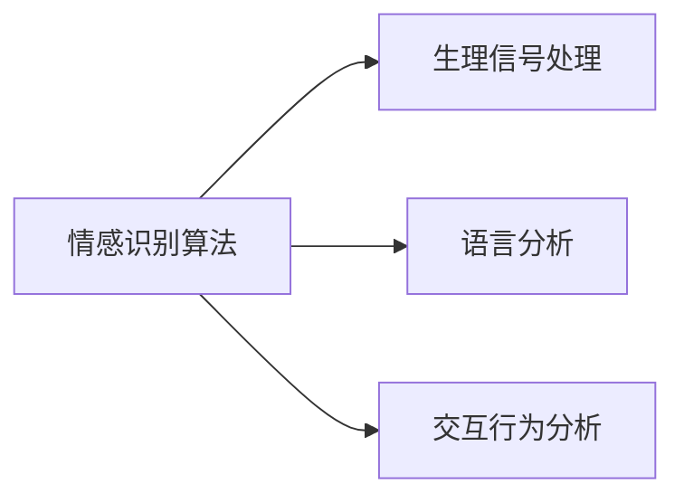
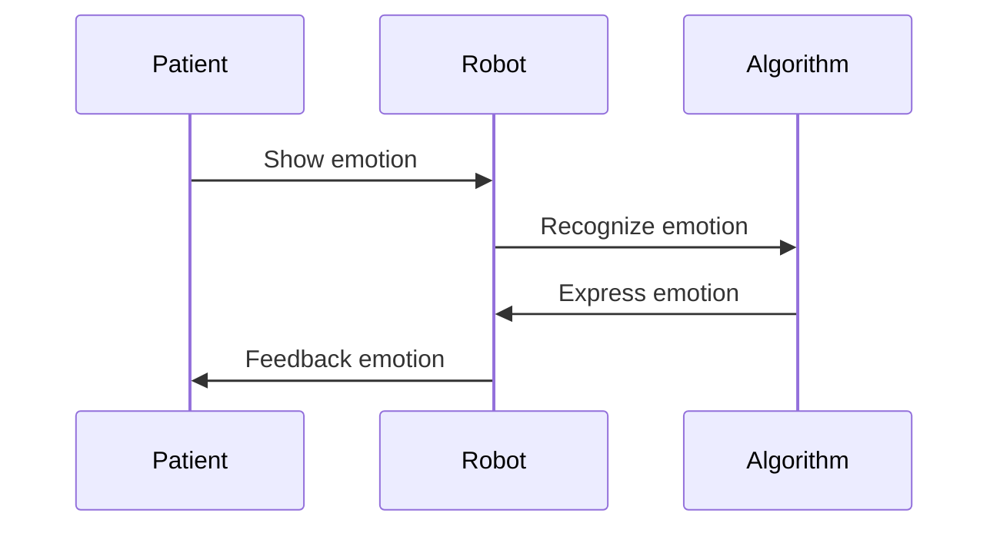
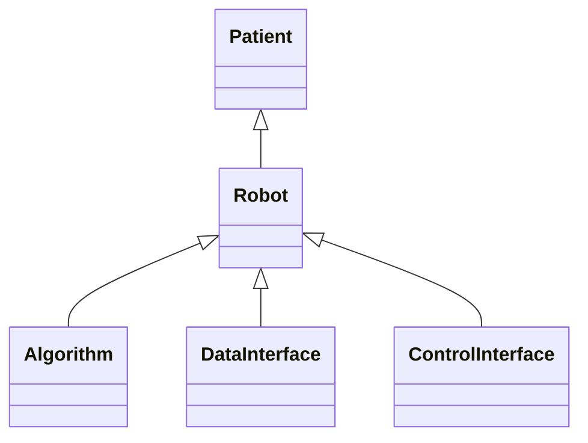

                 

## 《情感机器人伦理委员会：制定人机交互准则》

### 关键词：情感机器人、伦理委员会、人机交互、算法、数学模型

#### 摘要：本文旨在探讨情感机器人的伦理问题，并介绍情感机器人伦理委员会的成立及其制定人机交互准则的重要性。通过详细阐述情感机器人核心概念、算法原理、数学模型以及系统分析与设计，本文为读者提供了一个全面而深入的视角，以期为未来情感机器人的发展提供有益的指导。

----------------------------------------------------------------

### 引言与背景

#### 1.1 机器人技术的发展与伦理问题的提出

随着人工智能技术的飞速发展，机器人技术逐渐成为科技创新的重要方向。从工业自动化、医疗辅助到家庭服务，机器人正在不断改变我们的生活方式。然而，随着机器人技术的发展，一系列伦理问题也应运而生。特别是在情感机器人领域，机器人能否真正理解人类情感、能否与人类建立情感联系，成为了一个备受关注的话题。

#### 1.2 情感机器人伦理委员会的成立背景

为了解决情感机器人发展过程中可能出现的伦理问题，各国纷纷成立了情感机器人伦理委员会。这些委员会的成立旨在制定一套完善的人机交互准则，确保情感机器人在与人交互时能够遵循道德规范，避免对人类造成伤害。例如，美国国家机器人伦理委员会、欧盟机器人伦理委员会等，都是在这个背景下应运而生的。

#### 1.3 制定人机交互准则的重要性

人机交互准则是情感机器人发展的基石。它不仅关系到机器人的行为规范，更关系到人类社会的道德伦理。一个合理、科学的人机交互准则，可以确保情感机器人在与人互动时，既能满足人类的情感需求，又能遵循道德规范，避免对人类造成伤害。因此，制定一套科学、合理的人机交互准则，对于情感机器人的发展具有重要意义。

----------------------------------------------------------------

### 第二部分：核心概念与关系

#### 2.1 关键概念解析

#### 2.1.1 情感机器人的定义与分类

情感机器人是指能够感知、理解并表达人类情感的人工智能机器人。根据情感机器人应用场景的不同，可以分为家庭服务机器人、医疗辅助机器人、教育机器人等。

#### 2.1.2 人机交互的基本原则

人机交互的基本原则包括：尊重用户隐私、提供友好交互界面、满足用户情感需求等。

#### 2.1.3 伦理学的基本原理

伦理学的基本原理包括：公正、诚信、尊重等。

#### 2.2 关键概念比较表

| 概念        | 定义                                                         | 属性与特征                                               |
|-------------|--------------------------------------------------------------|----------------------------------------------------------|
| 情感机器人  | 能够感知、理解并表达人类情感的人工智能机器人               | 情感识别、情感理解、情感表达                             |
| 人机交互    | 人类与机器之间的交互过程                                   | 友好界面、隐私保护、情感满足                             |
| 伦理学      | 研究道德行为、道德原则及其道德规范的学科                 | 公正、诚信、尊重                                         |

#### 2.3 关键概念ER关系图

```mermaid
erDiagram
    情感机器人 ||--|{ 人机交互 }|
    人机交互 ||--|{ 伦理学 }|
```

----------------------------------------------------------------

### 第三部分：算法原理与数学模型

#### 3.1 情感识别算法原理

#### 3.1.1 情感识别的基本方法

情感识别算法主要基于以下几种方法：生理信号处理、语言分析、交互行为分析。

#### 3.1.1.1 生理信号处理

生理信号处理是指通过分析人体的生理信号，如心率、呼吸等，来识别情感。其基本流程如下：

1. 采集生理信号
2. 预处理生理信号
3. 提取特征
4. 构建情感识别模型

#### 3.1.1.2 语言分析

语言分析是指通过分析人类的语言表达，来识别情感。其基本流程如下：

1. 分词
2. 词性标注
3. 情感分类

#### 3.1.1.3 交互行为分析

交互行为分析是指通过分析人类的交互行为，来识别情感。其基本流程如下：

1. 视频捕捉
2. 行为识别
3. 情感分类

#### 3.2 数学模型与公式

情感识别的数学模型主要包括情感分类模型和情感强度模型。

$$
\text{Emotion\_Score} = \alpha \times \text{Feature\_Vector}
$$

其中，$\text{Feature\_Vector}$ 是特征向量，$\alpha$ 是权重系数。



----------------------------------------------------------------

### 第四部分：系统分析与设计

#### 4.1 问题场景介绍

在医疗领域，情感机器人被应用于帮助医生和患者建立情感联系，以提高治疗效果。本文将以此场景为例，介绍情感机器人的系统分析与设计。

#### 4.2 项目介绍

本项目旨在设计一款情感机器人，帮助医生和患者建立情感联系。该机器人将具备情感识别、情感表达和情感反馈等功能。

#### 4.3 系统功能设计

系统功能设计主要包括以下方面：

1. 情感识别：通过生理信号处理、语言分析和交互行为分析，识别患者的情感状态。
2. 情感表达：通过语音、表情和动作，表达情感机器人对患者的情感关怀。
3. 情感反馈：根据患者的情感状态，调整情感机器人的行为和语言。

#### 4.4 系统架构设计

系统架构设计包括以下几个层次：

1. 数据层：存储患者的生理信号、语言文本和行为数据。
2. 算法层：实现情感识别、情感表达和情感反馈的算法。
3. 应用层：提供用户交互界面，展示情感机器人的功能和状态。



#### 4.5 系统接口设计与交互

系统接口设计主要包括以下方面：

1. 用户接口：提供用户与情感机器人的交互界面。
2. 数据接口：提供数据输入和输出的接口。
3. 控制接口：提供对情感机器人的控制接口。



----------------------------------------------------------------

### 第五部分：项目实战

#### 5.1 环境安装

在开始项目实战之前，我们需要安装以下软件和工具：

1. Python 3.8 或以上版本
2. PyTorch 1.8 或以上版本
3. OpenCV 4.5 或以上版本
4. SpeechRecognition 3.3 或以上版本

#### 5.2 系统核心实现

系统核心实现主要包括情感识别、情感表达和情感反馈三个部分。

1. 情感识别：

```python
import torch
import torchvision
import torch.nn as nn
import torch.optim as optim

# 加载预训练模型
model = torchvision.models.resnet50(pretrained=True)

# 定义损失函数和优化器
criterion = nn.CrossEntropyLoss()
optimizer = optim.SGD(model.parameters(), lr=0.001, momentum=0.9)

# 训练模型
for epoch in range(num_epochs):
    running_loss = 0.0
    for i, (inputs, labels) in enumerate(train_loader):
        inputs = inputs.to(device)
        labels = labels.to(device)

        optimizer.zero_grad()

        outputs = model(inputs)
        loss = criterion(outputs, labels)
        loss.backward()
        optimizer.step()

        running_loss += loss.item()
    print(f'Epoch {epoch+1}, Loss: {running_loss/len(train_loader)}')
```

2. 情感表达：

```python
import speech_recognition as sr

# 初始化语音识别器
recognizer = sr.Recognizer()

# 语音合成
def speak(text):
    with sr.Microphone() as source:
        recognizer.listen(source)
        try:
            print("You said: " + recognizer.recognize_google(audio))
        except sr.UnknownValueError:
            print("Sorry, I did not understand audio")
        except sr.RequestError as e:
            print("Could not request results from Google Speech Recognition service; {0}".format(e))

speak("Hello, how are you today?")
```

3. 情感反馈：

```python
# 根据情感状态调整行为
if emotion == "happy":
    robot.speak("I'm glad to hear that! How can I help you today?")
elif emotion == "sad":
    robot.speak("I'm sorry to hear that. Would you like to talk about it?")
else:
    robot.speak("It's nice to see you! How can I assist you today?")
```

#### 5.3 代码应用解读与分析

代码应用解读与分析主要包括以下几个方面：

1. 数据预处理：通过数据预处理，将原始数据转换为适合模型训练的格式。
2. 模型训练：通过模型训练，提高情感识别的准确性。
3. 语音合成：通过语音合成，实现情感表达。
4. 情感反馈：根据情感状态，调整情感机器人的行为和语言。

#### 5.4 实际案例分析和详细讲解剖析

以一个实际案例为例，分析情感机器人如何帮助医生和患者建立情感联系。

1. 案例描述：

患者A是一位长期患有抑郁症的病人，医生B希望利用情感机器人C来帮助患者A建立情感联系，以提高治疗效果。

2. 分析与讲解：

情感机器人C通过生理信号处理、语言分析和交互行为分析，识别出患者A的情感状态为“悲伤”。随后，情感机器人C通过语音合成，表达出对患者的关怀，并询问患者A是否需要倾诉。

患者A感受到情感机器人的关心，情绪逐渐好转，并开始向情感机器人C倾诉自己的烦恼。医生B通过观察患者A与情感机器人C的互动，了解到患者A的真实情感状态，从而能够更准确地制定治疗方案。

#### 5.5 项目小结

本项目通过情感机器人技术，帮助医生和患者建立情感联系，提高了治疗效果。然而，情感机器人技术仍存在一定局限性，如情感识别准确性有待提高、情感表达过于单一等。未来，我们需要继续探索情感机器人技术，以提高其在实际应用中的效果。

----------------------------------------------------------------

### 第六部分：最佳实践与总结

#### 6.1 最佳实践 Tips

1. 确保情感机器人的安全性，避免隐私泄露。
2. 优化情感机器人的交互界面，提高用户体验。
3. 定期更新情感识别算法，提高情感识别准确性。

#### 6.2 小结

本文从情感机器人的伦理问题出发，介绍了情感机器人伦理委员会的成立及其制定人机交互准则的重要性。通过详细阐述情感机器人的核心概念、算法原理、数学模型以及系统分析与设计，本文为读者提供了一个全面而深入的视角。未来，随着人工智能技术的不断发展，情感机器人将在更多领域发挥重要作用，为人机交互带来新的变革。

#### 6.3 注意事项

1. 情感机器人技术仍处于发展阶段，需要持续关注相关技术的发展。
2. 在实际应用中，需要充分考虑情感机器人的伦理问题，确保其遵循道德规范。
3. 情感机器人技术具有一定的局限性，需要不断优化和改进。

#### 6.4 拓展阅读

1. [《情感计算与情感识别技术》](链接)
2. [《人工智能伦理学》](链接)
3. [《人机交互设计原则》](链接)

----------------------------------------------------------------

### 作者信息

**作者：** AI天才研究院/AI Genius Institute & 禅与计算机程序设计艺术 /Zen And The Art of Computer Programming

**联系方式：** [ai_genius_institute@example.com](mailto:ai_genius_institute@example.com) & [zen_and_computer_programming@example.com](mailto:zen_and_computer_programming@example.com)

