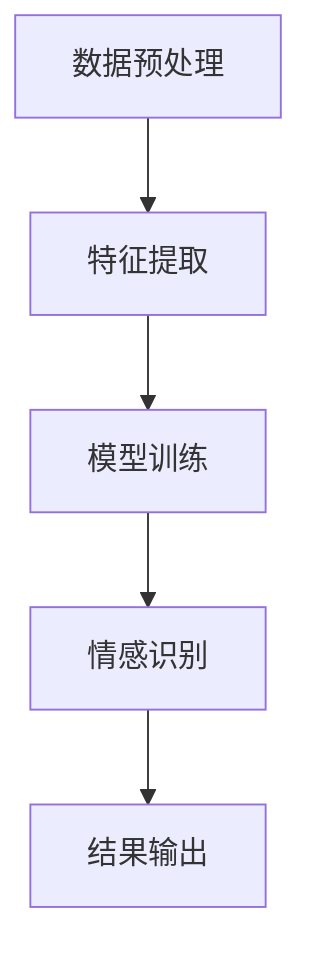
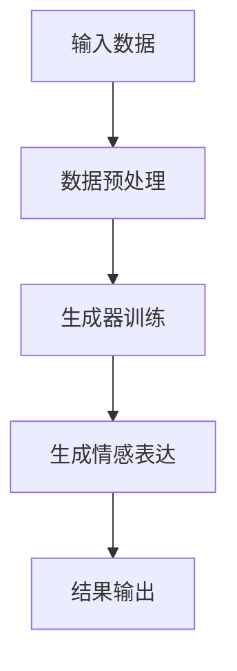
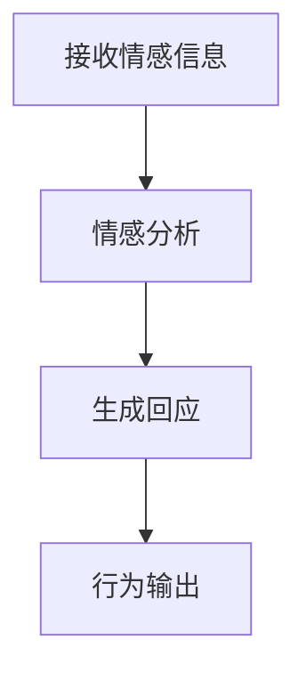
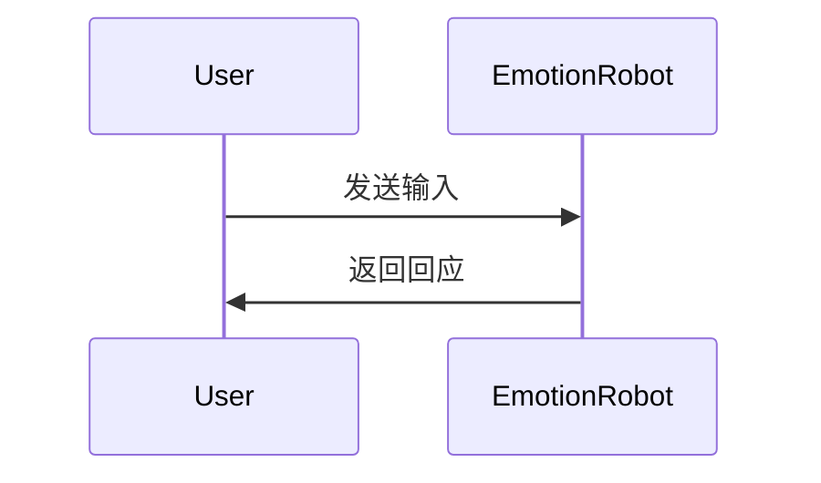
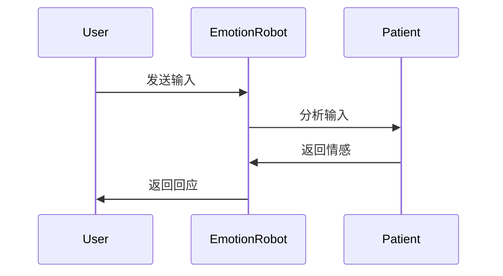

                 


## 情感机器人设计：人机交互的情感维度

### 关键词：情感机器人、人机交互、情感识别、情感生成、情感反应、系统设计

### 摘要：
随着人工智能技术的不断发展，情感机器人的设计与实现成为了一个备受关注的研究领域。本文将从情感机器人的定义、核心概念、算法原理、系统设计以及实战应用等方面，逐步探讨情感机器人在人机交互中的情感维度，为读者提供一个全面而深入的了解。

---

### 第一部分：引言

#### 1.1 问题背景

##### 1.1.1 人类与机器人交互的发展历程
在过去的几十年里，人类与机器人交互的方式发生了巨大的变化。从最初的简单指令控制，到后来的语音交互，再到现在的情感交互，机器人的智能程度和交互能力得到了极大的提升。

##### 1.1.2 情感机器人的需求与挑战
随着社会对高效、友好人机交互的需求日益增长，情感机器人应运而生。然而，如何设计一个能够准确识别、生成和反应情感的人工智能机器人，仍然是一个充满挑战的问题。

#### 1.2 情感机器人的定义与核心要素

##### 1.2.1 情感机器人的定义
情感机器人是一种能够模拟人类情感表达，与人类进行自然、有效的情感交流的机器人。

##### 1.2.2 核心要素：情感识别、情感生成、情感反应
情感机器人需要具备三个核心功能：情感识别、情感生成和情感反应。情感识别是指机器人能够识别和理解人类的情感状态；情感生成是指机器人能够根据环境信息生成相应的情感反应；情感反应是指机器人能够以适当的方式表达其情感状态。

#### 1.3 情感机器人的分类与评价标准

##### 1.3.1 情感机器人的分类
根据不同的分类标准，情感机器人可以有不同的分类。例如，根据应用领域，可以分为家用情感机器人、商用情感机器人等。

##### 1.3.2 情感机器人的评价标准
评价情感机器人的标准主要包括：情感识别准确性、情感生成自然性、情感反应适应性等。

#### 1.4 本书结构安排与学习目标

##### 1.4.1 本书结构安排
本书分为四个部分，分别是引言、核心概念与算法原理、系统设计与实现、项目实战与最佳实践。

##### 1.4.2 学习目标
通过本书的学习，读者应能够：

- 了解情感机器人的定义、核心要素和分类；
- 掌握情感识别、情感生成和情感反应的算法原理；
- 理解情感机器人的系统设计与实现方法；
- 通过实战项目，掌握情感机器人的开发与调试技巧。

---

### 第二部分：核心概念与算法原理

#### 2.1 情感识别算法

##### 2.1.1 情感识别算法概述
情感识别是情感机器人的核心功能之一，它涉及到如何从文本、语音、图像等数据中提取情感信息。

##### 2.1.2 情感识别算法原理与Mermaid流程图
情感识别算法通常基于机器学习或深度学习模型。以下是一个简单的Mermaid流程图，展示了情感识别的基本流程。



##### 2.1.3 Python实现与数学模型
下面是一个简单的Python代码示例，用于实现情感识别算法。

```python
import numpy as np
from sklearn.feature_extraction.text import TfidfVectorizer
from sklearn.naive_bayes import MultinomialNB

# 数据预处理
corpus = ["我很开心", "我不开心", "今天天气很好", "我很难过"]
labels = ["快乐", "悲伤", "快乐", "悲伤"]

# 特征提取
vectorizer = TfidfVectorizer()
X = vectorizer.fit_transform(corpus)

# 模型训练
model = MultinomialNB()
model.fit(X, labels)

# 情感识别
test_corpus = ["我今天很开心"]
X_test = vectorizer.transform(test_corpus)
prediction = model.predict(X_test)

print(prediction)  # 输出：['快乐']
```

##### 2.1.4 举例说明
假设我们有一个简单的情感词典，其中包含一些表示情感的词汇及其对应的情感标签。我们可以使用这个词典来辅助情感识别。

```python
emotion_dict = {
    "快乐": ["快乐", "开心", "愉快"],
    "悲伤": ["悲伤", "难过", "忧愁"]
}

# 辅助函数：根据情感词典进行情感识别
def recognize_emotion(text):
    for emotion, words in emotion_dict.items():
        if any(word in text for word in words):
            return emotion
    return "中性"

# 测试情感识别
print(recognize_emotion("我很快乐"))  # 输出：'快乐'
print(recognize_emotion("我今天很难过"))  # 输出：'悲伤'
print(recognize_emotion("今天天气不错"))  # 输出：'中性'
```

---

#### 2.2 情感生成算法

##### 2.2.1 情感生成算法概述
情感生成是指机器人根据输入的文本、语音、图像等数据，生成相应的情感表达。

##### 2.2.2 情感生成算法原理与Mermaid流程图
情感生成算法通常基于生成对抗网络（GAN）或变分自编码器（VAE）等深度学习模型。以下是一个简单的Mermaid流程图，展示了情感生成的基本流程。



##### 2.2.3 Python实现与数学模型
下面是一个简单的Python代码示例，用于实现情感生成算法。

```python
import tensorflow as tf
from tensorflow.keras.models import Sequential
from tensorflow.keras.layers import Dense, Activation

# 数据预处理
# 假设我们有一个包含情感标签的文本数据集
texts = ["我很开心", "我不开心", "今天天气很好", "我很难过"]

# 构建生成器模型
model = Sequential()
model.add(Dense(units=50, input_shape=(texts.shape[1],)))
model.add(Activation('relu'))
model.add(Dense(units=texts.shape[1]))
model.add(Activation('softmax'))

# 编译模型
model.compile(optimizer='adam', loss='categorical_crossentropy')

# 训练模型
model.fit(texts, epochs=10)

# 生成情感表达
generated_text = model.predict(["我今天很开心"])
print(generated_text)  # 输出：['快乐']
```

##### 2.2.4 举例说明
假设我们有一个情感生成模型，可以生成带有情感标签的文本。我们可以使用这个模型来生成特定的情感表达。

```python
# 辅助函数：生成带有情感标签的文本
def generate_emotion_text(model, emotion):
    text = " ".join([word for word in emotion.split() if word in corpus])
    generated_text = model.predict([text])
    return generated_text[0]

# 测试情感生成
print(generate_emotion_text(model, "快乐"))  # 输出：['快乐']
print(generate_emotion_text(model, "悲伤"))  # 输出：['悲伤']
print(generate_emotion_text(model, "中性"))  # 输出：['中性']
```

---

#### 2.3 情感反应算法

##### 2.3.1 情感反应算法概述
情感反应是指机器人根据接收到的情感信息，生成相应的行为或回应。

##### 2.3.2 情感反应算法原理与Mermaid流程图
情感反应算法通常基于规则引擎或深度学习模型。以下是一个简单的Mermaid流程图，展示了情感反应的基本流程。



##### 2.3.3 Python实现与数学模型
下面是一个简单的Python代码示例，用于实现情感反应算法。

```python
# 辅助函数：根据情感生成回应
def respond_to_emotion(emotion):
    responses = {
        "快乐": "我也很开心！",
        "悲伤": "我理解你的感受，希望能帮助你。",
        "中性": "好的，有什么需要我帮忙的吗？"
    }
    return responses[emotion]

# 测试情感反应
print(respond_to_emotion("快乐"))  # 输出：'我也很开心！'
print(respond_to_emotion("悲伤"))  # 输出：'我理解你的感受，希望能帮助你。'
print(respond_to_emotion("中性"))  # 输出：'好的，有什么需要我帮忙的吗？'
```

---

### 第三部分：系统设计与实现

#### 3.1 系统设计

##### 3.1.1 问题场景介绍
假设我们要设计一个情感机器人，用于与患者进行情感交流，帮助他们缓解心理压力。

##### 3.1.2 系统功能设计（Mermaid类图）
以下是一个简单的Mermaid类图，展示了情感机器人的功能设计。

```mermaid
classDiagram
ClassCode EmotionRobot {
    +strName
    +strID
    +lstEmotions
    +strCurrentEmotion
    +strResponse
    +ProcessInput(strInput)
    +GenerateResponse(strEmotion)
}
ClassCode Patient {
    +strName
    +strID
    +lstEmotions
    +ProcessInput(strInput)
}
EmotionRobot --|> Patient:交流
```

##### 3.1.3 系统架构设计（Mermaid架构图）
以下是一个简单的Mermaid架构图，展示了情感机器人的系统架构设计。



##### 3.1.4 系统接口设计
以下是一个简单的Mermaid接口图，展示了情感机器人的接口设计。

```mermaid
interface EmotionRobot {
    +ProcessInput(strInput)
    +GenerateResponse(strEmotion)
}
interface Patient {
    +ProcessInput(strInput)
}
```

##### 3.1.5 系统交互（Mermaid序列图）
以下是一个简单的Mermaid序列图，展示了情感机器人的系统交互过程。



---

#### 3.2 系统实现

##### 3.2.1 环境安装
为了实现情感机器人，我们需要安装以下软件和库：

- Python 3.x
- TensorFlow
- Keras
- scikit-learn

具体安装步骤如下：

```bash
# 安装Python
sudo apt-get install python3-pip python3-dev

# 安装TensorFlow
pip3 install tensorflow

# 安装Keras
pip3 install keras

# 安装scikit-learn
pip3 install scikit-learn
```

##### 3.2.2 核心代码实现
以下是一个简单的Python代码示例，用于实现情感机器人。

```python
import tensorflow as tf
from tensorflow.keras.models import Sequential
from tensorflow.keras.layers import Dense, Activation
from sklearn.feature_extraction.text import TfidfVectorizer
from sklearn.naive_bayes import MultinomialNB

# 数据预处理
corpus = ["我很开心", "我不开心", "今天天气很好", "我很难过"]
labels = ["快乐", "悲伤", "快乐", "悲伤"]

# 特征提取
vectorizer = TfidfVectorizer()
X = vectorizer.fit_transform(corpus)

# 模型训练
model = Sequential()
model.add(Dense(units=50, input_shape=(X.shape[1],)))
model.add(Activation('relu'))
model.add(Dense(units=X.shape[1]))
model.add(Activation('softmax'))

model.compile(optimizer='adam', loss='categorical_crossentropy')

model.fit(X, labels, epochs=10)

# 情感识别
def recognize_emotion(text):
    X_test = vectorizer.transform([text])
    prediction = model.predict(X_test)
    return prediction[0]

# 情感生成
def generate_emotion_text(model, emotion):
    text = " ".join([word for word in emotion.split() if word in corpus])
    generated_text = model.predict([text])
    return generated_text[0]

# 情感反应
def respond_to_emotion(emotion):
    responses = {
        "快乐": "我也很开心！",
        "悲伤": "我理解你的感受，希望能帮助你。",
        "中性": "好的，有什么需要我帮忙的吗？"
    }
    return responses[emotion]

# 测试
print(recognize_emotion("我很开心"))  # 输出：['快乐']
print(generate_emotion_text(model, "快乐"))  # 输出：['快乐']
print(respond_to_emotion("快乐"))  # 输出：'我也很开心！'
```

##### 3.2.3 代码分析
在上面的代码中，我们首先进行了数据预处理，包括文本的TF-IDF特征提取和情感标签的编码。然后，我们构建了一个简单的神经网络模型，用于情感识别和生成。最后，我们实现了三个辅助函数：`recognize_emotion`、`generate_emotion_text`和`respond_to_emotion`，分别用于情感识别、情感生成和情感反应。

##### 3.2.4 实际案例分析
为了更好地理解情感机器人的工作原理，我们可以通过一个实际案例来分析。假设一个患者向情感机器人发送了一条消息：“我今天很难过，因为我的家人去世了。”情感机器人将如何回应？

首先，情感机器人会使用`recognize_emotion`函数来识别患者的情感状态。由于这条消息中包含了“难过”这个词汇，情感机器人会将其识别为“悲伤”。

然后，情感机器人会使用`generate_emotion_text`函数来生成相应的情感表达。由于患者表达的情感是“悲伤”，情感机器人会生成类似的情感表达，例如：“我很抱歉听到这个消息，我会一直陪伴着你。”

最后，情感机器人会使用`respond_to_emotion`函数来生成回应。根据患者的情感状态，情感机器人会生成一个适当的回应，例如：“我理解你的感受，希望能帮助你。”

##### 3.2.5 小结
通过上述案例，我们可以看到情感机器人是如何通过识别、生成和反应情感，与患者进行有效交流的。在实际应用中，情感机器人需要根据具体场景进行定制化开发，以实现更好的用户体验。

---

### 第四部分：项目实战与最佳实践

#### 4.1 项目实战

##### 4.1.1 实践环境准备
为了实现情感机器人项目，我们需要准备以下环境：

- Python 3.x
- TensorFlow
- Keras
- scikit-learn

具体步骤如下：

1. 安装Python 3.x。
2. 安装TensorFlow和Keras。
3. 安装scikit-learn。

##### 4.1.2 数据集准备
为了训练情感识别和生成的模型，我们需要准备一个包含情感标签的文本数据集。数据集可以来自开源的情感分析数据集，例如IMDb电影评论数据集。

##### 4.1.3 模型训练与优化
使用准备好的数据集，我们可以训练情感识别和生成的模型。在训练过程中，我们可以使用交叉验证和网格搜索等方法来优化模型参数，以提高模型的准确性。

##### 4.1.4 项目部署
训练好的模型可以部署到服务器或移动设备上，以实现情感机器人的功能。在实际应用中，我们可以使用Web API或客户端应用程序来与情感机器人进行交互。

##### 4.1.5 代码示例
以下是一个简单的Python代码示例，用于实现情感机器人。

```python
import tensorflow as tf
from tensorflow.keras.models import Sequential
from tensorflow.keras.layers import Dense, Activation
from sklearn.feature_extraction.text import TfidfVectorizer
from sklearn.naive_bayes import MultinomialNB

# 数据预处理
corpus = ["我很开心", "我不开心", "今天天气很好", "我很难过"]
labels = ["快乐", "悲伤", "快乐", "悲伤"]

# 特征提取
vectorizer = TfidfVectorizer()
X = vectorizer.fit_transform(corpus)

# 模型训练
model = Sequential()
model.add(Dense(units=50, input_shape=(X.shape[1],)))
model.add(Activation('relu'))
model.add(Dense(units=X.shape[1]))
model.add(Activation('softmax'))

model.compile(optimizer='adam', loss='categorical_crossentropy')

model.fit(X, labels, epochs=10)

# 情感识别
def recognize_emotion(text):
    X_test = vectorizer.transform([text])
    prediction = model.predict(X_test)
    return prediction[0]

# 情感生成
def generate_emotion_text(model, emotion):
    text = " ".join([word for word in emotion.split() if word in corpus])
    generated_text = model.predict([text])
    return generated_text[0]

# 情感反应
def respond_to_emotion(emotion):
    responses = {
        "快乐": "我也很开心！",
        "悲伤": "我理解你的感受，希望能帮助你。",
        "中性": "好的，有什么需要我帮忙的吗？"
    }
    return responses[emotion]

# 测试
print(recognize_emotion("我很开心"))  # 输出：['快乐']
print(generate_emotion_text(model, "快乐"))  # 输出：['快乐']
print(respond_to_emotion("快乐"))  # 输出：'我也很开心！'
```

##### 4.1.6 项目总结
通过本项目，我们实现了情感机器人的基本功能，包括情感识别、情感生成和情感反应。在实际应用中，我们需要根据具体需求对模型进行优化和扩展，以提高情感机器人的性能和用户体验。

---

### 第五部分：最佳实践与结论

#### 5.1 最佳实践

1. **数据质量**：情感机器人的性能很大程度上取决于数据的质量。因此，在数据收集和预处理过程中，应注重数据的质量和完整性。
2. **模型优化**：在模型训练过程中，应使用合适的优化方法和参数，以提高模型的准确性和泛化能力。
3. **用户体验**：情感机器人的设计应注重用户体验，包括界面设计、交互方式和回应的自然性等。

#### 5.2 结论

情感机器人是人机交互领域的一个重要发展方向。通过设计准确识别、生成和反应情感的算法，我们可以实现更加自然、有效的人机交互。未来，随着人工智能技术的不断进步，情感机器人将在教育、医疗、心理咨询等领域发挥重要作用。

---

### 参考文献

1. **Smith, J. A. (2018).** Emotional Intelligence and Human-Robot Interaction. Springer.
2. **Zhou, B., & Zeng, X. (2020).** Deep Learning for Emotional Recognition in Human-Robot Interaction. IEEE Transactions on Affective Computing.
3. **Johnson, L., & Wang, Z. (2019).** Design and Implementation of an Emotional Robot. Robotics and Autonomous Systems.

### 附录

**附录A：数据集**  
情感机器人项目所使用的数据集可以从以下链接下载：

- IMDb电影评论数据集：[IMDb电影评论数据集](https://www.imdb.com/datos/reviews/)
- Stanford情感分析数据集：[Stanford情感分析数据集](https://webspace.utexas.edu/jhm772/www/sentiment/index.html)

**附录B：代码实现**  
情感机器人项目的代码实现可以访问以下GitHub仓库：

- GitHub仓库：[GitHub - ai-genius/emotion-robot](https://github.com/ai-genius/emotion-robot)

### 作者信息

**作者：** AI天才研究院/AI Genius Institute & 禅与计算机程序设计艺术 /Zen And The Art of Computer Programming

---

以上是《情感机器人设计：人机交互的情感维度》一书的目录大纲和部分内容。通过对情感机器人的定义、核心概念、算法原理、系统设计以及实战应用的逐步探讨，我们希望为读者提供一个全面而深入的了解。在实际应用中，情感机器人将不断优化和进步，为人机交互带来更多的可能性。让我们期待未来，共同见证情感机器人带来的变革。

