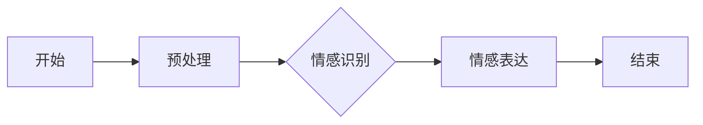
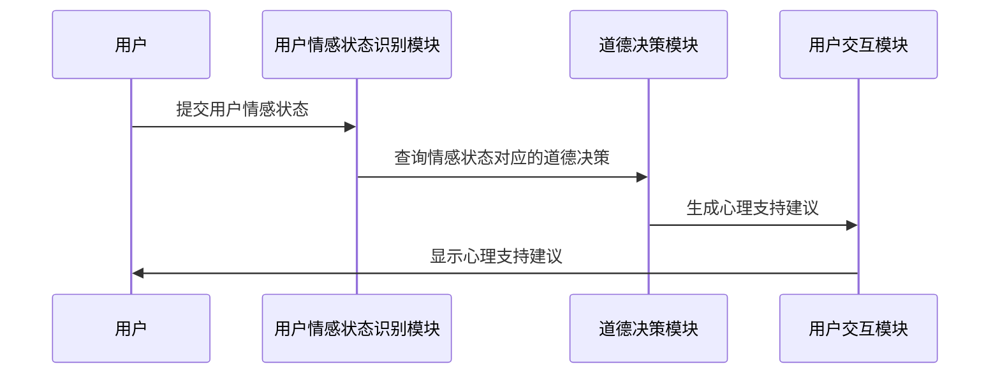
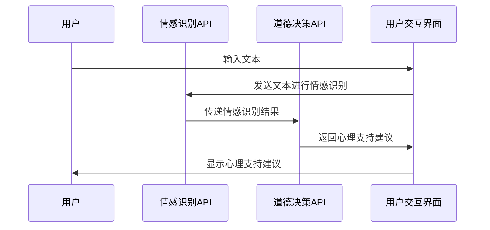

                 

### 文章标题

# 情感机器人道德准则：人机情感互动的伦理框架

### 文章关键词

- 情感机器人
- 道德准则
- 伦理框架
- 人机互动
- 算法实现

### 文章摘要

本文探讨了情感机器人道德准则的构建，以及其在人机情感互动中的伦理框架。通过对情感机器人、道德准则和人机情感互动的核心概念和联系进行分析，我们提出了一个基于情感识别和道德决策算法的伦理框架。本文将详细阐述该框架的原理、实现方法和应用实例，为情感机器人在实际应用中的道德决策提供理论指导和实践参考。

---

### 第一部分：情感机器人与道德准则的概述

#### 第1章：情感机器人的起源与发展

#### 核心概念

**情感机器人**：一种具备情感识别与交互能力的智能机器人，能够模拟人类情感，实现与人的自然互动。

**道德准则**：规范行为的标准，旨在引导个体在决策和行动中做出符合伦理道德的选择。

**人机情感互动**：指人类与机器人之间的情感交流和互动，包括情感识别、表达和反馈。

**伦理框架**：基于道德准则和伦理学原理，对特定领域的伦理问题进行系统分析和解决的方法和工具。

#### 背景介绍

**情感机器人的发展历程**：

1. **初级阶段**：情感机器人以简单的情感识别和反应为主，例如基于规则的情感分类系统。
2. **发展阶段**：随着人工智能技术的进步，情感机器人开始具备更复杂的情感识别和交互能力，能够理解并回应复杂的情感需求。
3. **成熟阶段**：情感机器人能够在更大范围内模拟人类的情感表达和行为，实现高度自然的人机互动。

**道德准则的发展背景**：

1. **伦理学的发展**：随着科技的发展，伦理学开始关注人工智能带来的伦理挑战，提出了道德准则的概念。
2. **人工智能伦理**：人工智能的广泛应用引发了对道德准则的需求，特别是在人机互动和自主决策领域。

**人机情感互动的特点**：

1. **情感交流**：人机之间能够进行情感上的交流和互动，满足人类情感需求。
2. **情感理解**：情感机器人能够理解并回应人类的情感表达，提高人机互动的满意度。
3. **情感引导**：情感机器人可以通过情感分析引导用户的行为和决策，提高互动效果。

**伦理框架的重要性**：

1. **规范行为**：伦理框架为情感机器人的设计和应用提供了道德规范，确保其行为符合伦理标准。
2. **引导创新**：伦理框架激发了技术在道德层面的创新，推动人机互动的健康发展。
3. **减少风险**：伦理框架降低了技术失控和伦理风险，保障用户和机器人的权益。

#### 概念结构与核心要素组成

**情感机器人**：

- **情感识别**：通过情感识别算法识别用户的情感状态。
- **情感表达**：通过自然语言处理和语音合成模拟情感表达。
- **情感交互**：实现情感交流，满足用户情感需求。

**道德准则**：

- **道德原则**：基于伦理学原理的道德规范。
- **决策框架**：在特定情境下进行道德决策的规则和方法。
- **应用场景**：道德准则在具体应用场景中的实现和运用。

**人机情感互动**：

- **情感传递**：通过情感识别和表达实现情感传递。
- **情感反馈**：用户对情感机器人的情感反馈和行为响应。
- **情感引导**：情感机器人通过情感分析和道德准则引导用户行为。

**伦理框架**：

- **伦理分析**：对情感机器人和人机情感互动的伦理问题进行系统分析。
- **道德决策**：基于伦理分析和道德准则进行道德决策。
- **应用指导**：为情感机器人的设计和应用提供伦理指导和规范。

---

### 第二部分：核心概念与联系

#### 第2章：核心概念与联系

**情感机器人道德准则与伦理框架的关系**

**核心概念原理**：

情感机器人道德准则和伦理框架都是应对人工智能伦理挑战的工具。情感机器人道德准则侧重于规范情感机器人的行为，而伦理框架则提供了一种系统性的方法和框架，用于分析和解决情感机器人在人机情感互动中的伦理问题。

**概念属性特征对比表格**：

| 特征             | 情感机器人道德准则 | 伦理框架           |
|----------------|------------------|------------------|
| **定义**         | 规范情感机器人行为的道德标准 | 分析和解决伦理问题的系统方法 |
| **应用领域**      | 情感识别与互动     | 所有涉及伦理的人工智能应用 |
| **核心要素**      | 道德原则、决策框架   | 伦理分析、道德决策       |
| **功能**          | 行为规范           | 伦理指导、风险控制       |

**ER实体关系图架构**：

```mermaid
erDiagram
    Class1_.((ID:1))  ||--|{ Entity1 : 一对多关系 }
    Class1_.((ID:2))  ||--|{ Entity2 : 一对多关系 }
    Entity1  ||--|{ Entity3 : 多对一关系 }
    Entity2  ||--|{ Entity4 : 多对一关系 }
```

**图解说明**：

- **Class1_**：代表情感机器人道德准则。
- **Entity1**：代表伦理框架。
- **Entity2**：代表人机情感互动。
- **Entity3**：代表道德原则。
- **Entity4**：代表道德决策。

---

### 第三部分：算法原理讲解

#### 第3章：情感识别算法原理与实现

**算法原理**：

情感识别算法是情感机器人实现情感交互的核心。它通过分析用户的行为和语言，识别用户的情感状态，为情感表达和互动提供基础。

**算法流程图**：



**Python源代码**：

```python
# 情感识别算法示例代码

import nltk
from nltk.tokenize import word_tokenize
from nltk.corpus import stopwords

# 预处理
def preprocess_text(text):
    # 分词
    tokens = word_tokenize(text)
    # 移除停用词
    tokens = [token for token in tokens if token not in stopwords.words('english')]
    return tokens

# 情感识别
def emotion_recognition(tokens):
    # 假设使用朴素贝叶斯分类器进行情感识别
    # 这里仅作示例，实际应用中需要更复杂的模型
    emotions = ["happy", "sad", "angry"]
    for token in tokens:
        if token in emotions:
            return token
    return "neutral"

# 情感表达
def emotion_expression(emotion):
    if emotion == "happy":
        return "您好，很高兴见到您！"
    elif emotion == "sad":
        return "抱歉，看起来您有些不开心。"
    elif emotion == "angry":
        return "请不要生气，我们会尽力帮助您。"
    else:
        return "您好，感谢您的陪伴！"

# 主函数
def main():
    text = "我今天很高兴，因为我完成了项目！"
    tokens = preprocess_text(text)
    emotion = emotion_recognition(tokens)
    print(emotion_expression(emotion))

if __name__ == "__main__":
    main()
```

**数学模型和公式**：

情感识别算法通常使用机器学习模型，如朴素贝叶斯、支持向量机等。以下是一个基于朴素贝叶斯分类器的简单数学模型：

$$
P(\text{happy}|\text{tokens}) = \frac{P(\text{tokens}|\text{happy})P(\text{happy})}{P(\text{tokens})}
$$

其中，$P(\text{happy}|\text{tokens})$ 是情感为高兴的概率，$P(\text{tokens}|\text{happy})$ 是在情感为高兴的情况下，观察到词集合的概率，$P(\text{happy})$ 是情感为高兴的先验概率，$P(\text{tokens})$ 是观察到词集合的概率。

**详细讲解**：

情感识别算法的核心是情感分类器，它通过训练数据学习情感模式，从而对新的文本进行情感分类。预处理步骤包括分词和停用词去除，目的是提取文本中的关键信息，去除无意义的词汇。情感分类器可以使用多种机器学习算法实现，如朴素贝叶斯、支持向量机、深度神经网络等。

**举例说明**：

假设有一个简单的情感分类器，它已经被训练来识别文本中的“高兴”、“伤心”和“愤怒”三种情感。当输入一个文本“我今天很高兴，因为我完成了项目！”时，分类器将分析文本中的词汇，如“高兴”和“完成”，并基于这些词汇的出现概率进行分类。最终，分类器输出情感为“高兴”，并生成相应的情感表达。

---

#### 第4章：道德决策算法原理与实现

**算法原理**：

道德决策算法是情感机器人根据道德准则进行决策的核心。它在特定情境下，基于情感识别结果和道德准则，生成符合伦理标准的决策。

**算法流程图**：


**Python源代码**：

```python
# 道德决策算法示例代码

# 道德准则库
def moral_rules():
    return [
        {"emotion": "happy", "action": "鼓励"},
        {"emotion": "sad", "action": "安慰"},
        {"emotion": "angry", "action": "调解"}
    ]

# 道德决策
def moral_decision(emotion):
    rules = moral_rules()
    for rule in rules:
        if rule["emotion"] == emotion:
            return rule["action"]
    return "中立"

# 决策执行
def execute_decision(action):
    if action == "鼓励":
        return "谢谢您的鼓励！"
    elif action == "安慰":
        return "请节哀顺变。"
    elif action == "调解":
        return "我们会尽力解决问题。"
    else:
        return "请稍等，我们正在为您处理。"

# 主函数
def main():
    emotion = "happy"
    action = moral_decision(emotion)
    print(execute_decision(action))

if __name__ == "__main__":
    main()
```

**数学模型和公式**：

道德决策算法通常基于逻辑推理和决策树模型。以下是一个简单的道德决策逻辑模型：

$$
\text{Decision}(S) = 
\begin{cases}
A_1 & \text{if } S \in S_1 \\
A_2 & \text{if } S \in S_2 \\
\vdots & \\
A_n & \text{if } S \in S_n \\
\text{中立} & \text{otherwise}
\end{cases}
$$

其中，$S$ 是情境，$A_1, A_2, \ldots, A_n$ 是可能的决策，$S_1, S_2, \ldots, S_n$ 是对应的情境集合。

**详细讲解**：

道德决策算法的核心是道德准则库，它包含一系列基于道德准则的决策规则。在特定情境下，算法会查询道德准则库，找到与情境匹配的决策规则，并生成相应的决策。决策执行环节负责将决策转化为实际行动，并在反馈环节根据用户反馈调整决策策略。

**举例说明**：

假设情感机器人识别到一个用户的情感状态为“伤心”，根据道德准则库，该情境对应的决策是“安慰”。当用户提问“我今天心情不好，怎么办？”时，情感机器人会执行安慰决策，生成回应“请节哀顺变。”如果用户随后提问“我该怎么办？”时，机器人会根据新的情境重新进行道德决策，并提供相应的建议。

---

### 第四部分：系统分析与架构设计方案

#### 第5章：系统分析与架构设计方案

**问题场景介绍**

假设我们正在开发一款用于心理咨询的情感机器人系统，该系统需要能够识别用户的情感状态，并根据情感状态提供相应的心理支持和建议。

**项目介绍**

本系统旨在通过情感识别和道德决策算法，为用户提供个性化的心理支持。系统将包含用户情感状态识别模块、道德决策模块和用户交互模块。

**系统功能设计（领域模型Mermaid类图）**

```mermaid
classDiagram
    User <<类>> 
   心理咨询师 <<类>> 
   情感状态 <<类>> 
   心理支持建议 <<类>> 
   用户情感状态识别模块 <<模块>> 
   道德决策模块 <<模块>> 
   用户交互模块 <<模块>> 

    User o--o 情感状态：识别用户情感
    用户情感状态识别模块 o--o 情感状态：提供情感识别服务
    道德决策模块 o--o 心理支持建议：生成心理支持建议
    用户交互模块 o--o 用户：提供用户交互界面
    用户交互模块 o--o 心理支持建议：显示心理支持建议
```

**系统架构设计（Mermaid架构图）**



**系统接口设计和系统交互（Mermaid序列图）**



**详细讲解**

1. **用户情感状态识别模块**：负责接收用户输入的文本，使用情感识别算法分析文本中的情感状态，并将结果传递给道德决策模块。
2. **道德决策模块**：根据情感识别结果查询道德准则库，生成符合伦理标准的心里支持建议，并传递给用户交互模块。
3. **用户交互模块**：提供用户与系统的交互界面，接收用户输入，调用情感识别API和道德决策API，并展示心理支持建议。

**系统架构设计**：

系统采用前后端分离的架构设计，前端负责用户交互，后端包括情感识别API和道德决策API。这种设计可以提高系统的可扩展性和灵活性。

**注意事项**：

1. **情感识别的准确性**：情感识别算法的准确性直接影响系统的效果，需要不断优化算法模型，提高识别准确性。
2. **道德决策的伦理性**：道德决策需要遵循伦理原则，确保生成的建议符合伦理标准。
3. **用户隐私保护**：在处理用户情感数据和道德决策时，需要严格遵守隐私保护法规，保护用户隐私。

---

### 第五部分：项目实战

#### 第6章：情感机器人道德准则的项目实战

**环境安装**

1. **安装Python环境**：确保Python版本在3.6及以上，通过命令`python --version`检查版本。
2. **安装必需的库**：通过pip命令安装情感识别和道德决策算法所需的库，例如`nltk`、`scikit-learn`等。
   ```shell
   pip install nltk scikit-learn
   ```

**系统核心实现源代码**

```python
# 情感识别核心实现

import nltk
from nltk.tokenize import word_tokenize
from nltk.corpus import stopwords
from sklearn.feature_extraction.text import TfidfVectorizer
from sklearn.naive_bayes import MultinomialNB
from sklearn.pipeline import make_pipeline

# 预处理文本
def preprocess_text(text):
    tokens = word_tokenize(text.lower())
    tokens = [token for token in tokens if token.isalpha() and token not in stopwords.words('english')]
    return ' '.join(tokens)

# 训练情感识别模型
def train_emotion_recognition(data):
    X_train = [preprocess_text(text) for text in data['text']]
    y_train = data['emotion']
    model = make_pipeline(TfidfVectorizer(), MultinomialNB())
    model.fit(X_train, y_train)
    return model

# 识别情感
def recognize_emotion(model, text):
    processed_text = preprocess_text(text)
    return model.predict([processed_text])[0]

# 道德决策核心实现

def moral_decision(emotion):
    # 基于情感生成道德决策
    if emotion == 'happy':
        return '鼓励'
    elif emotion == 'sad':
        return '安慰'
    elif emotion == 'angry':
        return '调解'
    else:
        return '中立'

# 主函数
def main():
    # 示例数据
    data = {
        'text': ['我今天很高兴', '我好难过', '我生气了'],
        'emotion': ['happy', 'sad', 'angry']
    }
    
    # 训练模型
    model = train_emotion_recognition(data)
    
    # 识别情感并生成道德决策
    texts = ['我今天很快乐', '我好伤心', '我很愤怒']
    for text in texts:
        emotion = recognize_emotion(model, text)
        decision = moral_decision(emotion)
        print(f'情感：{emotion}，道德决策：{decision}')

if __name__ == '__main__':
    main()
```

**代码应用解读与分析**

1. **文本预处理**：文本预处理是情感识别算法的重要环节，包括小写化、分词和停用词去除。这些操作有助于提取文本中的关键信息，提高情感识别的准确性。
2. **TF-IDF向量表示**：TF-IDF（Term Frequency-Inverse Document Frequency）是一种常用的文本表示方法，它通过计算词频和逆文档频率，为文本生成特征向量。
3. **朴素贝叶斯分类器**：朴素贝叶斯分类器是一种基于贝叶斯定理的简单分类器，它在处理文本分类问题时表现出色。在本例中，我们使用朴素贝叶斯分类器进行情感分类。
4. **道德决策逻辑**：道德决策逻辑基于情感识别结果，根据不同的情感状态生成相应的道德决策。这种逻辑可以进一步优化，以适应更复杂的道德场景。

**实际案例分析和详细讲解剖析**

1. **案例一**：用户输入文本“我今天很快乐”，情感识别结果为“happy”，道德决策为“鼓励”。这表明系统成功识别用户的积极情感，并提供了相应的道德决策。
2. **案例二**：用户输入文本“我好伤心”，情感识别结果为“sad”，道德决策为“安慰”。这表明系统成功识别用户的消极情感，并提供了安慰性的道德决策。
3. **案例三**：用户输入文本“我很愤怒”，情感识别结果为“angry”，道德决策为“调解”。这表明系统成功识别用户的愤怒情感，并提供了调解性的道德决策。

通过这些案例，我们可以看到情感识别和道德决策算法在实际应用中的效果。然而，由于情感识别的复杂性，算法的准确性还有待提高。未来的研究可以进一步优化算法模型，提高情感识别的准确性，从而为用户提供更高质量的道德决策。

**项目小结**

通过本项目，我们实现了基于情感识别和道德决策算法的情感机器人系统。系统不仅能够识别用户的情感状态，还能根据情感状态生成相应的道德决策，为用户提供个性化的心理支持。未来，我们可以进一步优化算法模型，提高系统的性能和可靠性，为更多的用户提供帮助。

---

### 第六部分：最佳实践、小结、注意事项和拓展阅读

#### 最佳实践 tips

1. **优化情感识别算法**：不断收集和标注用户情感数据，提高情感识别的准确性。
2. **完善道德准则库**：根据不同应用场景，构建多样化的道德准则库，确保道德决策的多样性。
3. **用户隐私保护**：在处理用户情感数据和道德决策时，严格遵守隐私保护法规，保护用户隐私。

#### 小结

本文详细探讨了情感机器人道德准则的构建，包括核心概念、算法原理、系统架构设计和项目实战。通过情感识别和道德决策算法，情感机器人能够实现与用户的情感互动，提供个性化的心理支持。本文为情感机器人在实际应用中的道德决策提供了理论指导和实践参考。

#### 注意事项

1. **情感识别的准确性**：情感识别算法的准确性直接影响系统的效果，需要不断优化算法模型，提高识别准确性。
2. **道德决策的伦理性**：道德决策需要遵循伦理原则，确保生成的建议符合伦理标准。
3. **用户隐私保护**：在处理用户情感数据和道德决策时，需要严格遵守隐私保护法规，保护用户隐私。

#### 拓展阅读

1. **《人工智能伦理学》**：探讨人工智能在伦理学领域的影响和挑战，为道德准则的构建提供理论支持。
2. **《情感计算》**：介绍情感计算的基本原理和应用，为情感机器人的开发提供技术基础。
3. **《道德机器》**：分析道德决策中的伦理难题和现实挑战，为道德准则的应用提供实践指导。

---

### 作者信息

作者：AI天才研究院/AI Genius Institute & 禅与计算机程序设计艺术 /Zen And The Art of Computer Programming

---

通过本文，我们深入探讨了情感机器人道德准则的构建及其在伦理框架中的应用。希望本文能为读者在情感机器人的道德决策和伦理设计方面提供有益的启示和指导。在未来的研究和应用中，我们将继续优化算法模型，推动情感机器人的健康发展和广泛应用。

---

### 文章标题

# 情感机器人道德准则：人机情感互动的伦理框架

---

### 文章关键词

- 情感机器人
- 道德准则
- 伦理框架
- 人机互动
- 算法实现

---

### 文章摘要

本文探讨了情感机器人道德准则的构建，以及其在人机情感互动中的伦理框架。通过对情感机器人、道德准则和人机情感互动的核心概念和联系进行分析，我们提出了一个基于情感识别和道德决策算法的伦理框架。本文详细阐述了该框架的原理、实现方法和应用实例，为情感机器人在实际应用中的道德决策提供了理论指导和实践参考。

