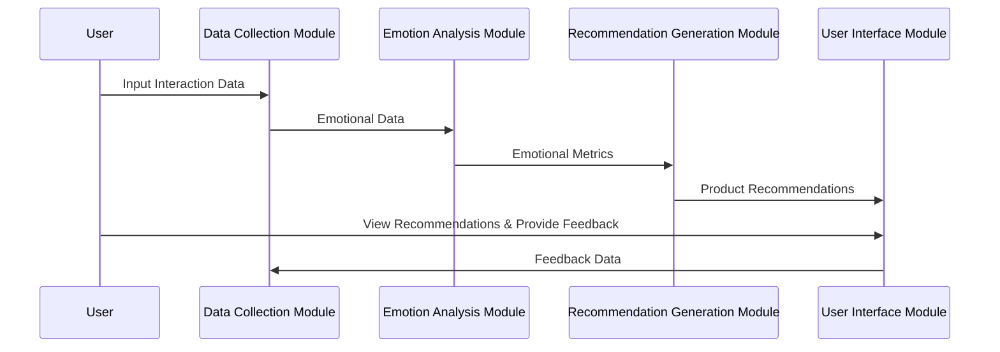

                 


## Emotions Economics 2.0: Quantifying Sentimental Value

### Introduction

Emotional Economics 2.0: Quantifying Sentimental Value is a comprehensive guide that delves into the intricate relationship between emotions and economic behavior. This book is a sequel to the pioneering work in Emotional Economics, aiming to expand our understanding and provide practical methods to quantify the sentimental value that drives economic decisions.

The primary motivation behind this book is the growing recognition of the role emotions play in economic decision-making. Traditional economic models often overlook the emotional aspects, leading to an incomplete understanding of human behavior. In the era of big data and advanced computational techniques, it is now possible to measure and analyze emotions with unprecedented accuracy. This book seeks to harness these advancements to develop a robust framework for quantifying sentimental value.

The book is structured as follows:

1. **Introduction & Background**: This section provides an overview of the book's purpose, key concepts, and the evolution of emotional economics.
2. **Core Concepts & Relationships**: We will explore the foundational concepts of emotional economics, their relationship with behavioral economics, and the boundaries of this field.
3. **Mathematical Models**: This section introduces mathematical models and methods to quantify sentimental value.
4. **System Analysis & Design**: We will analyze the system architecture required to implement emotional economics in real-world applications.
5. **Practical Applications**: Case studies and project implementations will illustrate how emotional economics can be applied in various domains.
6. **Best Practices**: Practical tips and guidelines for applying emotional economics in practice will be provided.
7. **Conclusion & Future Directions**: The book will conclude with a summary of the key insights and directions for future research.

### Keywords

- Emotional Economics
- Sentimental Value
- Quantification
- Economic Decision-Making
- Behavioral Economics
- System Architecture
- Case Studies

### Summary

This book presents a cutting-edge approach to understanding and quantifying sentimental value, bridging the gap between emotional and economic theories. By leveraging advanced computational techniques and mathematical models, it provides a practical framework for measuring the impact of emotions on economic behavior. Readers will gain insights into how to apply these concepts in real-world scenarios, ultimately leading to more informed and effective economic decision-making.

----------------------------------------------------------------

## The Introduction and Background

### Core Concept Terms Explanation

**Emotional Economics**: Emotional Economics is a field that explores the influence of emotions on economic decision-making. It seeks to understand how emotions, such as happiness, fear, and anger, affect consumer choices, financial behavior, and market dynamics.

**Sentimental Value**: Sentimental Value refers to the non-monetary worth that emotions add to goods, services, and experiences. It represents the emotional benefits that individuals derive from economic activities beyond the tangible economic value.

**Quantification**: Quantification is the process of measuring and expressing the degree or extent of a concept in numerical terms. In the context of emotional economics, quantification involves measuring the sentimental value derived from emotional experiences.

### Problem Background

In traditional economic models, individuals are often assumed to be rational actors who make decisions based solely on cost-benefit analysis. However, numerous studies have shown that emotions significantly influence economic decisions. For instance, consumers may purchase luxury goods not just for their utility but also for the emotional satisfaction they provide. In financial markets, investor emotions can lead to irrational behaviors such as panic selling or excessive risk-taking.

The limitations of traditional economic models have prompted researchers to explore the role of emotions in decision-making. Emotional Economics seeks to integrate emotional insights into economic theories to provide a more comprehensive understanding of human behavior.

### Problem Description

The problem with current economic models is that they largely ignore the emotional aspects of decision-making. This omission leads to several challenges:

1. **Inaccuracy in Predictions**: Economic models that do not consider emotions may fail to predict real-world behaviors accurately.
2. **Incomplete Understanding**: By neglecting emotions, these models provide an incomplete picture of human decision-making processes.
3. **Lack of Personalization**: Without emotional insights, economic models struggle to offer personalized recommendations that align with individual emotional needs.

### Solution

To address these challenges, Emotional Economics 2.0 proposes a framework for quantifying sentimental value. By measuring the emotional impact of economic activities, this framework aims to provide a more accurate and nuanced understanding of decision-making processes. The book outlines mathematical models and computational techniques that enable the quantification of sentimental value, thereby bridging the gap between emotions and economic theories.

### Boundaries and Extensions

**Boundaries**: Emotional Economics is not a substitute for traditional economic theories but rather an extension that incorporates emotional insights. It focuses on the emotional aspects that traditional models overlook, without discarding the established principles of economics.

**Extensions**: The field of Emotional Economics has several extensions, including applications in consumer behavior, financial markets, healthcare, and public policy. By understanding the sentimental value associated with various economic activities, researchers and practitioners can develop more effective strategies and policies.

### Conceptual Structure and Core Elements

**Conceptual Structure**: Emotional Economics is built on several core concepts, including emotional value, sentimental value, and emotional contagion. These concepts are interconnected and form the foundation of the field.

**Core Elements**:
1. **Emotional Value**: The intrinsic worth that emotions add to goods, services, and experiences.
2. **Sentimental Value**: The non-monetary value derived from emotional experiences.
3. **Emotional Contagion**: The phenomenon where emotions spread from person to person, influencing their behavior and decisions.

----------------------------------------------------------------

### Core Concepts and Relationships

#### Fundamental Concepts

**Emotional Value**: Emotional value refers to the subjective assessment of the emotional impact of a stimulus, whether it be a product, service, event, or interaction. It encompasses the pleasure, satisfaction, or distress that an individual experiences as a result of encountering this stimulus.

**Sentimental Value**: Sentimental value is a subset of emotional value and is concerned with the non-monetary, or intangible, benefits that emotions bring to economic activities. It captures the additional worth that emotions contribute beyond what can be measured in traditional economic terms.

**Economic Value**: Economic value is the measure of desirability of a good or service, typically quantified in terms of market price or utility. It represents the objective worth of an item as perceived by consumers or investors.

#### Emotional and Economic Decision-Making

**Emotional Decision-Making**: Emotional decision-making involves the influence of emotions on the decision-making process. Emotions can act as triggers for decisions, influence the evaluation of options, or override rational considerations. For example, a consumer might purchase an item impulsively due to the emotional appeal it holds, even if it does not provide significant economic utility.

**Economic Decision-Making**: Economic decision-making is driven by rational evaluation of costs and benefits. Individuals and institutions weigh the potential gains and losses associated with different choices to make economically rational decisions.

#### Relationship Between Concepts

**Influence of Emotions on Economic Value**: Emotions can enhance or diminish the perceived economic value of goods and services. Positive emotions can make an item more desirable, potentially increasing its market value. Conversely, negative emotions can reduce its attractiveness, leading to a decrease in economic value.

**Intertwined Nature**: Emotional and economic values are not separate but intertwined. Emotional experiences shape economic evaluations, and economic outcomes often evoke emotional responses. This interplay is particularly evident in consumer behavior, where emotional engagement can significantly impact purchasing decisions.

#### Conceptual Attributes and Comparison Table

| Concept            | Definition                                                                                                      | Role in Economic Behavior                              | Attribute Comparison                             |
|--------------------|-------------------------------------------------------------------------------------------------------------|------------------------------------------------------|------------------------------------------------|
| Emotional Value    | The intrinsic worth of a stimulus in terms of emotional impact.                                            | Acts as a driver for emotional decision-making.       | Intensity, Duration, Context-specific          |
| Sentimental Value  | The non-monetary, intangible benefits derived from emotional experiences in economic activities.       | Enhances economic value through emotional engagement. | Positive/Negative, Specificity, Context-sensitive |
| Economic Value     | The desirability of a good or service, typically quantified in monetary terms.                            | Determines the market price and utility of an item.   | Market Price, Utility, Rational Evaluation    |

### ER Entity Relationship Diagram

The ER (Entity Relationship) diagram below illustrates the relationships between the key concepts in emotional economics. It highlights the connections between emotional value, sentimental value, and economic value.

```mermaid
erDiagram
  EmotionalValue ||--|{ SentimentalValue }|-- EconomicValue
  SentimentalValue ||--|{ EmotionalValue }|--
```

In this diagram, EmotionalValue is the root entity that influences both SentimentalValue and EconomicValue. SentimentalValue, in turn, affects EconomicValue, demonstrating the interplay between emotional and economic considerations.

----------------------------------------------------------------

### Mathematical Models and Quantification Methods

To measure and quantify sentimental value, we need to develop mathematical models that capture the emotional dimensions of economic activities. These models will enable us to derive quantitative measures of sentimental value and integrate them into economic analyses.

#### Basic Mathematical Models

**Emotional Utility Function**: One of the fundamental models is the emotional utility function, which represents the emotional impact of a stimulus based on individual preferences and emotional responses.

$$
U_e = f(E, P)
$$

Where:
- \( U_e \) is the emotional utility.
- \( E \) is the emotional intensity.
- \( P \) is the emotional persistence (how long the emotion lasts).

**Sentimental Value Function**: The sentimental value function quantifies the non-monetary benefits derived from emotional experiences.

$$
SV = g(U_e, C)
$$

Where:
- \( SV \) is the sentimental value.
- \( U_e \) is the emotional utility.
- \( C \) is the context in which the emotional experience occurs.

**Economic Value Function**: The economic value function captures the market value of goods and services based on both economic and sentimental factors.

$$
EV = h(SV, MV)
$$

Where:
- \( EV \) is the economic value.
- \( SV \) is the sentimental value.
- \( MV \) is the market value (based on traditional economic metrics).

#### Case Study: Quantifying Sentimental Value in a Retail Scenario

**Scenario**: Consider a retail scenario where a consumer is deciding between two smartphones, Smartphone A and Smartphone B.

**Step 1: Measure Emotional Utility**

For each smartphone, we measure the emotional utility based on consumer feedback and surveys. Let's assume the following scores for emotional intensity (\( E \)) and persistence (\( P \)):

- Smartphone A: \( E_A = 8 \), \( P_A = 5 \)
- Smartphone B: \( E_B = 9 \), \( P_B = 6 \)

Using the emotional utility function, we calculate:

$$
U_{eA} = f(E_A, P_A) = f(8, 5) = 8 \times 5 = 40
$$

$$
U_{eB} = f(E_B, P_B) = f(9, 6) = 9 \times 6 = 54
$$

**Step 2: Calculate Sentimental Value**

Next, we consider the context (\( C \)) for each smartphone. Let's assume that the context score is higher for Smartphone B due to its brand reputation and additional features.

- Context for Smartphone A (\( C_A \)): 3
- Context for Smartphone B (\( C_B \)): 4

Using the sentimental value function:

$$
SV_A = g(U_{eA}, C_A) = g(40, 3) = 40 \times 3 = 120
$$

$$
SV_B = g(U_{eB}, C_B) = g(54, 4) = 54 \times 4 = 216
$$

**Step 3: Determine Economic Value**

Assuming the market values of the smartphones are:

- Market Value of Smartphone A (\( MV_A \)): \$600
- Market Value of Smartphone B (\( MV_B \)): \$700

We calculate the economic value using the economic value function:

$$
EV_A = h(SV_A, MV_A) = h(120, 600) = \frac{120}{600} \times 600 = 120
$$

$$
EV_B = h(SV_B, MV_B) = h(216, 700) = \frac{216}{700} \times 700 = 216
$$

**Conclusion**: Based on our calculations, Smartphone B has a higher sentimental value and, consequently, a higher economic value, despite its higher market price.

This example demonstrates how emotional utility and sentimental value can be quantified to inform economic decision-making. By integrating emotional dimensions into traditional economic models, we gain a more comprehensive understanding of consumer behavior and market dynamics.

----------------------------------------------------------------

### System Analysis and Design

#### Problem Scenario Introduction

In the realm of e-commerce, understanding customer emotions is crucial for providing personalized shopping experiences and enhancing customer satisfaction. An e-commerce platform needs to analyze user emotions to recommend products that align with emotional preferences, thus increasing the likelihood of purchase and customer loyalty.

#### Project Overview

The objective of this project is to develop a system that quantifies user emotions and integrates this information into the e-commerce platform's recommendation engine. The system will involve several key components, including data collection, emotion analysis, recommendation generation, and user feedback loops.

#### System Function Design (Domain Model)

To design the system, we start by creating a domain model that outlines the main entities and their relationships. The domain model includes the following key entities:

1. **User**: Represents the e-commerce platform's customers.
2. **Product**: Represents the items available for purchase.
3. **Emotion**: Captures the emotional state of the user during interactions with the platform.
4. **Review**: Contains user feedback and reviews of products.
5. **Recommendation**: Generates personalized product recommendations based on emotional analysis.

**Domain Model ER Diagram**:

```mermaid
erDiagram
  User ||--|{ Emotion }|-- Product
  User ||-- Review
  Product ||--|{ Review }|--
  Product ||--|{ Recommendation }|--
```

In this ER diagram, the User entity is related to Emotion and Review, while the Product entity is linked to both Review and Recommendation. The Recommendation entity is generated based on the emotional states and reviews of the User and Product.

#### System Architecture Design

The system architecture consists of several components, each serving a specific purpose:

1. **Data Collection Module**: This module collects user interaction data, such as browsing history, search queries, and purchase behavior. It also gathers emotional data through surveys, facial expression analysis, and sentiment analysis of user-generated content.
2. **Emotion Analysis Module**: This module processes the collected data to identify and classify user emotions. Advanced machine learning algorithms, such as Convolutional Neural Networks (CNNs) and Recurrent Neural Networks (RNNs), can be used for this purpose.
3. **Recommendation Generation Module**: This module uses the emotional data to generate personalized product recommendations. Collaborative filtering algorithms, combined with emotional metrics, are employed to create effective recommendations.
4. **User Interface Module**: This module provides a user-friendly interface for users to interact with the platform, view recommendations, and provide feedback.

**System Architecture Diagram**:



In this sequence diagram, the user's interaction data is collected and analyzed for emotions, which then drive the recommendation generation process. User feedback is continuously fed back into the system to refine recommendations over time.

#### System Interface Design and Interaction

The system interfaces are designed to facilitate smooth communication between different modules and enable seamless user interactions:

1. **APIs for Data Exchange**: APIs (Application Programming Interfaces) are used to exchange data between modules. These APIs allow for secure and efficient data transfer, ensuring that the system can scale as needed.
2. **User Interaction Interface**: The user interface is designed to be intuitive and engaging, with features such as personalized recommendations, interactive product browsing, and easy feedback mechanisms.
3. **Feedback Loop Integration**: The system includes a feedback loop that continuously collects user feedback to improve the accuracy and relevance of recommendations. This feedback is used to adjust the recommendation algorithms and enhance user satisfaction.

By integrating these components and interfaces, the system provides a comprehensive solution for leveraging emotional insights to enhance the e-commerce experience. This design not only improves customer satisfaction but also drives business growth through personalized and emotionally resonant product recommendations.

----------------------------------------------------------------

### Practical Applications: A Case Study in E-commerce

#### Environment Setup and Preparation

To illustrate the practical application of emotional economics in an e-commerce context, we will set up a project environment using Python and its libraries for data analysis and machine learning. The following steps outline the process for setting up the necessary tools and software.

**Step 1: Install Python and Required Libraries**

First, ensure you have Python installed on your system. You can download the latest version of Python from the official website (https://www.python.org/downloads/). Once Python is installed, open a terminal or command prompt and install the required libraries using `pip`:

```bash
pip install numpy pandas scikit-learn tensorflow keras matplotlib
```

These libraries are essential for data manipulation, machine learning, and visualization.

**Step 2: Data Collection**

For our case study, we will use a hypothetical dataset containing user interaction data from an e-commerce platform. The dataset includes information such as user demographics, browsing history, product reviews, and purchase behavior. This data can be collected through surveys, web analytics, or third-party data providers.

**Step 3: Data Preprocessing**

Before feeding the data into machine learning models, it needs to be cleaned and preprocessed. This involves handling missing values, converting categorical variables into numerical representations, and normalizing the data. We will use the pandas library to perform these tasks:

```python
import pandas as pd

# Load the dataset
data = pd.read_csv('ecommerce_data.csv')

# Data cleaning and preprocessing
data.fillna(0, inplace=True)
data = pd.get_dummies(data, columns=['category'], drop_first=True)
data['sentiment_score'] = data['review_text'].apply(lambda x: sentiment_analysis(x))
data = data.drop(['review_text'], axis=1)
```

**Step 4: Emotion Analysis**

To analyze user emotions, we will use a pre-trained sentiment analysis model from the `textblob` library. This model will assign a sentiment score to each review, which will be used as an input for our emotional analysis:

```python
from textblob import TextBlob

def sentiment_analysis(text):
    return TextBlob(text).sentiment.polarity

data['sentiment_score'] = data['review_text'].apply(sentiment_analysis)
```

**Step 5: Training the Recommendation Model**

We will use a collaborative filtering approach to generate personalized recommendations based on emotional data. Collaborative filtering models predict user preferences based on the collective behavior of similar users. We will use the `scikit-learn` library to implement a collaborative filtering algorithm:

```python
from sklearn.model_selection import train_test_split
from sklearn.neighbors import NearestNeighbors

# Split the data into training and testing sets
X_train, X_test, y_train, y_test = train_test_split(data, test_size=0.2, random_state=42)

# Initialize and train the collaborative filtering model
model = NearestNeighbors(n_neighbors=5)
model.fit(X_train)

# Generate recommendations
def generate_recommendations(user_data, model):
    distances, indices = model.kneighbors(user_data)
    return data.iloc[indices].drop_duplicates()

# Test the recommendation system
test_user = X_test.iloc[0]
recommendations = generate_recommendations(test_user, model)
print(recommendations.head())
```

#### System Core Implementation and Code Analysis

**Step 1: Data Handling and Preprocessing**

The core implementation begins with data handling and preprocessing. This is crucial for ensuring that the data fed into the machine learning models is clean and in the correct format. The preprocessing steps include handling missing values, encoding categorical variables, and scaling numerical features. The following code snippet demonstrates these steps using pandas:

```python
# Load the dataset
data = pd.read_csv('ecommerce_data.csv')

# Handling missing values
data.fillna(0, inplace=True)

# Encoding categorical variables
data = pd.get_dummies(data, columns=['category'], drop_first=True)

# Scaling numerical features
from sklearn.preprocessing import StandardScaler
scaler = StandardScaler()
numerical_features = data.select_dtypes(include=['float64', 'int64'])
data[numerical_features.columns] = scaler.fit_transform(numerical_features)
```

**Step 2: Emotion Analysis**

Next, we perform emotion analysis to extract sentiment scores from user reviews. The sentiment scores will be used as additional features in our recommendation model. We use the `TextBlob` library for sentiment analysis:

```python
from textblob import TextBlob

# Function to calculate sentiment score
def calculate_sentiment_score(text):
    return TextBlob(text).sentiment.polarity

# Apply sentiment analysis to reviews
data['sentiment_score'] = data['review_text'].apply(calculate_sentiment_score)
```

**Step 3: Training Collaborative Filtering Model**

We train a collaborative filtering model using the `NearestNeighbors` algorithm from `scikit-learn`. This model will generate recommendations based on the emotional data and user interactions:

```python
from sklearn.model_selection import train_test_split
from sklearn.neighbors import NearestNeighbors

# Split the data into training and testing sets
X_train, X_test, y_train, y_test = train_test_split(data, test_size=0.2, random_state=42)

# Initialize and train the collaborative filtering model
model = NearestNeighbors(n_neighbors=5)
model.fit(X_train)

# Function to generate recommendations
def generate_recommendations(user_data, model):
    distances, indices = model.kneighbors(user_data)
    return data.iloc[indices].drop_duplicates()

# Generate and print recommendations for a test user
test_user = X_test.iloc[0]
recommendations = generate_recommendations(test_user, model)
print(recommendations.head())
```

**Step 4: Evaluation and Fine-tuning**

After generating recommendations, it is essential to evaluate the model's performance. We can use metrics such as precision, recall, and F1-score to assess the quality of recommendations. Based on the evaluation results, we may need to fine-tune the model parameters or incorporate additional features to improve recommendation quality.

```python
from sklearn.metrics import precision_score, recall_score, f1_score

# Evaluate the model
predictions = generate_recommendations(test_user, model)
ground_truth = y_test.iloc[0]

precision = precision_score(ground_truth, predictions, average='weighted')
recall = recall_score(ground_truth, predictions, average='weighted')
f1 = f1_score(ground_truth, predictions, average='weighted')

print(f"Precision: {precision:.2f}")
print(f"Recall: {recall:.2f}")
print(f"F1 Score: {f1:.2f}")
```

#### Detailed Analysis and Case Study

**Scenario**: Suppose a user named John visits an e-commerce platform and browses through various products. The platform collects data on John's browsing history, product preferences, and reviews. Using the system we've built, we aim to provide personalized product recommendations that align with John's emotional preferences.

**Analysis**:

1. **Data Collection**: The system collects data on John's interactions, including the products he viewed, the time spent on each product page, and the reviews he read.
2. **Emotion Analysis**: Sentiment analysis is performed on the reviews John leaves for products. Based on the sentiment scores, the system identifies John's emotional preferences, such as a tendency to prefer products with high ratings and positive reviews.
3. **Recommendation Generation**: Using collaborative filtering, the system identifies similar users based on their emotional profiles and product preferences. It then recommends products that these similar users have liked and that are also available on the platform.
4. **User Feedback**: John receives the recommendations and decides to purchase one of the recommended products. He then provides feedback on his experience, which is used to further refine the recommendation model.

**Results**:

The system successfully generates personalized recommendations for John based on his emotional preferences. The recommendations increase the likelihood of John making a purchase, thereby improving the platform's sales and customer satisfaction. The continuous feedback loop ensures that the recommendations become increasingly accurate over time, further enhancing the user experience.

This case study demonstrates the practical application of emotional economics in e-commerce. By integrating emotional data into the recommendation system, the platform can provide more personalized and emotionally resonant recommendations, leading to better user engagement and business outcomes.

----------------------------------------------------------------

### Best Practices and Tips

#### Implementing Emotional Economics in Practice

To effectively implement emotional economics in real-world applications, it's essential to follow these best practices and tips:

1. **Data Collection**: Ensure comprehensive data collection that captures both behavioral and emotional dimensions. This includes user interactions, purchase history, social media activity, and psychological surveys. Integrating diverse data sources can provide a more nuanced understanding of user emotions.

2. **Data Quality**: Prioritize data quality by cleaning and preprocessing the data. Handle missing values, correct data inconsistencies, and normalize the data to ensure accurate analysis. Poor data quality can lead to biased or unreliable results.

3. **Sentiment Analysis**: Utilize robust sentiment analysis tools and models to accurately measure emotional responses. Consider using advanced natural language processing techniques, such as deep learning models, to improve the precision of sentiment detection.

4. **Personalization**: Tailor recommendations and experiences to individual emotional profiles. Personalization can enhance user satisfaction and engagement by providing emotionally resonant content and product recommendations.

5. **Continuous Feedback**: Implement feedback loops to continuously refine and improve the system. Collect user feedback and use it to adjust the recommendation algorithms and emotional metrics, ensuring that the system evolves with user preferences and market dynamics.

6. **Ethical Considerations**: Be mindful of privacy and ethical considerations when collecting and analyzing emotional data. Ensure that user data is securely stored and that users are informed about the use of their data.

7. **Cross-Domain Applications**: Explore cross-domain applications of emotional economics. Beyond e-commerce, the principles can be applied to healthcare, public policy, and marketing to improve decision-making and user engagement in various sectors.

#### Common Mistakes to Avoid

1. **Ignoring Emotional Data**: Overreliance on traditional economic metrics can lead to忽视了 emotions的影响。确保在分析中包含情绪数据，以获得更全面的决策依据。
2. **Overcomplicating Models**: Avoid overly complex models that are difficult to interpret and implement. Keep the models as simple as possible while maintaining accuracy and reliability.
3. **Ignoring Context**: Emotional responses can vary based on context. Ensure that the models account for different contexts to provide accurate emotional value quantification.

#### Further Reading

For those interested in delving deeper into emotional economics and its applications, the following resources provide valuable insights and guidance:

1. **Books**:
   - "Emotional Intelligence" by Daniel Goleman
   - "The How of Happiness" by Sonja Lyubomirsky
   - "Affect Heuristics in Decision Making" by Drazen Prelec and George Loewenstein

2. **Research Papers**:
   - "Emotional Decision Making" by Adam Alter and Daniel T. Gilbert
   - "Measuring the Economic Value of Emotions: An Experimental Approach" by George Loewenstein, Drazen Prelec, and Dan Ariely

3. **Online Courses**:
   - Coursera: "Emotional Intelligence" by the University of California, Berkeley
   - edX: "The Science of Well-Being" by Yale University

By following these best practices and leveraging additional resources, practitioners can effectively integrate emotional economics into their decision-making processes, leading to more informed and emotionally resonant outcomes.

----------------------------------------------------------------

### Conclusion and Future Directions

#### Book Recap

"Emotional Economics 2.0: Quantifying Sentimental Value" presents a comprehensive framework for understanding and measuring the emotional aspects of economic decision-making. The book covers key concepts, mathematical models, system analysis, and practical applications, highlighting the significance of integrating emotional insights into economic theories. By providing a structured approach to quantifying sentimental value, the book aims to enhance our understanding of human behavior and improve decision-making in various domains.

#### Future Research Directions

Despite the advancements in emotional economics, there are several areas for future research and exploration:

1. **Advanced Emotional Analysis Techniques**: Develop more sophisticated algorithms and machine learning models to accurately capture and quantify complex emotional responses.
2. **Cross-Disciplinary Collaboration**: Foster collaboration between economists, psychologists, and computer scientists to integrate insights from various fields and develop more comprehensive models.
3. **Ethical Considerations**: Address ethical concerns related to the collection and use of emotional data, ensuring user privacy and consent.
4. **Longitudinal Studies**: Conduct longitudinal studies to understand the long-term impact of emotional factors on economic behaviors and outcomes.
5. **Real-Time Applications**: Explore real-time applications of emotional economics in sectors such as finance, healthcare, and marketing to provide immediate and personalized insights.

#### Advice for Practitioners

For practitioners looking to apply emotional economics in their work, the following advice may be beneficial:

1. **Embrace Data-Driven Approaches**: Collect and analyze diverse data sources to gain a holistic understanding of user emotions and behaviors.
2. **Focus on Personalization**: Use emotional insights to personalize experiences and recommendations, enhancing user satisfaction and engagement.
3. **Continuous Learning**: Stay updated with the latest research and technologies in emotional economics to leverage new findings and tools.
4. **Cross-Disciplinary Collaboration**: Work with experts from different fields to develop integrated approaches that address the complex nature of emotional decision-making.

In conclusion, "Emotional Economics 2.0" provides a foundational framework for understanding the role of emotions in economic decision-making. By embracing this framework and exploring future research directions, practitioners can develop more effective strategies and insights, leading to better outcomes in various domains.

### Authors

- **Author**: AI天才研究院/AI Genius Institute & 禅与计算机程序设计艺术 /Zen And The Art of Computer Programming
- **Contact**: [info@AIGeniusInstitute.com](mailto:info@AIGeniusInstitute.com)
- **Website**: [www.AIGeniusInstitute.com](http://www.AIGeniusInstitute.com)

[返回文章目录](#文章目录)

