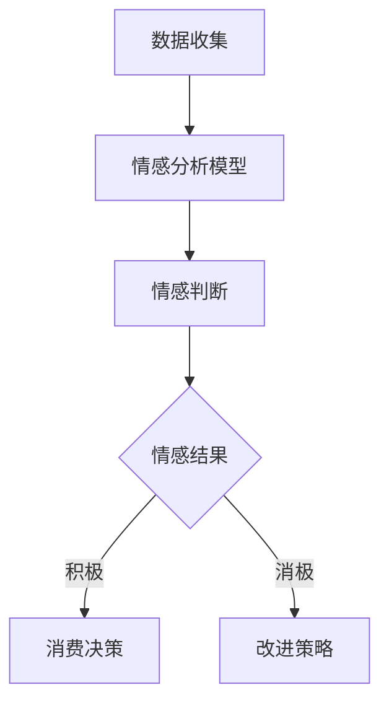

                 

# 情感经济学：感性价值的商业实践

## 关键词
- 情感经济学
- 感性价值
- 商业实践
- 消费行为
- 营销策略

## 摘要
本文将探讨情感经济学这一新兴领域，解释其核心概念——感性价值，并阐述其在商业实践中的应用。通过深入分析情感与消费行为的关系，我们将探讨情感经济学如何影响营销策略、产品设计以及商业案例分析，并展望其未来的发展趋势和挑战。本文旨在为读者提供一个全面而深入的视角，理解感性价值在商业环境中的重要性，以及如何通过情感经济学的原则创造商业价值。

### 目录大纲设计思路

在设计《情感经济学：感性价值的商业实践》的目录大纲时，我们首先需要明确书籍的主题和目标，即“情感经济学”以及“感性价值的商业实践”。这一主题旨在揭示情感在商业决策中的重要性，并探讨如何利用感性价值创造商业价值。为了实现这一目标，目录大纲将分为三个主要部分：

1. **背景与概念**：第一部分将介绍情感经济学的起源和发展，定义感性价值，并探讨情感与消费行为的关系。
2. **商业应用**：第二部分将深入探讨情感经济学在营销策略和产品设计中的应用，并提供具体的商业案例分析。
3. **未来展望与挑战**：第三部分将展望情感经济学的未来趋势，分析其实践中的挑战，并探讨跨学科融合的可能性。

### 第一部分：情感经济学的背景与概念

## 第1章：情感经济学的起源与发展

### 1.1 情感经济学的定义
情感经济学是研究情感如何影响经济行为和市场决策的学科。它关注情感在经济活动中的作用，探讨情感如何塑造消费者行为、企业战略和市场动态。

### 1.2 情感经济学与传统经济学的区别
与传统经济学强调理性决策和最大化利益不同，情感经济学关注情感在决策过程中的作用，认为情感与理性同样重要，甚至在某些情况下更能驱动消费者的行为。

### 1.3 情感经济学的研究领域与挑战
情感经济学的研究领域包括情感心理学、行为经济学、市场营销和消费者行为。然而，情感经济学也面临着诸多挑战，如如何准确测量情感、如何在不同文化背景下应用情感经济学原理等。

### 1.4 情感经济学的应用场景
情感经济学在多个领域有着广泛的应用，包括消费行为分析、品牌策略、产品设计和市场营销。通过理解情感如何影响消费者决策，企业可以更好地制定策略，提高市场竞争力。

## 第2章：感性价值的定义与特征

### 2.1 感性价值的含义
感性价值是指消费者在情感层面所获得的价值，它超越了传统的功能性价值，关注消费者的情感体验和情感满足。

### 2.2 感性价值与传统价值的比较
传统价值主要关注产品的功能性和实用性，而感性价值则强调消费者的情感体验。两者在商业决策中的权重和影响力有所不同。

### 2.3 感性价值的特征
感性价值具有独特性、主观性和动态性。它不仅取决于消费者的个人情感，还受到文化、社会和个人因素的影响。

### 2.4 感性价值在消费决策中的作用
感性价值在消费决策中起着关键作用。消费者往往基于情感体验做出决策，感性价值成为消费者选择产品的重要因素。

## 第3章：情感与消费行为的关系

### 3.1 情感对消费行为的影响
情感可以显著影响消费行为，消费者在情绪状态良好的时候更愿意购买产品，而在情绪低落时则可能推迟购买决策。

### 3.2 消费行为中的情感触发点
不同的消费场景和产品类别会有不同的情感触发点。了解这些触发点可以帮助企业设计更有针对性的营销策略。

### 3.3 情感与消费忠诚度的关系
情感与消费忠诚度密切相关。消费者对品牌的情感投入越高，他们越可能成为忠诚客户。

### 3.4 情感经济学的市场细分策略
情感经济学为市场细分提供了新的视角。企业可以通过识别和满足不同消费者的情感需求，实现更精准的市场定位和营销策略。

### 第二部分：情感经济学的商业应用

## 第4章：情感营销策略

### 4.1 情感营销的概念与原则
情感营销旨在通过引发消费者的情感共鸣，建立品牌与消费者之间的情感联系。其核心原则包括情感共鸣、情感互动和情感延续。

### 4.2 情感营销的具体策略
情感营销策略包括情感诉求、情感体验和情感价值塑造。企业可以通过情感故事、情感互动和情感服务等方式，增强品牌与消费者之间的情感联系。

### 4.3 情感营销案例解析
通过具体案例，我们将分析情感营销策略的成功要素，探讨如何有效地运用情感营销提升品牌价值和市场份额。

### 4.4 情感营销的效果评估
情感营销的效果评估包括情感共鸣度、品牌忠诚度和销售额等指标。企业需要通过数据分析和市场反馈，不断优化情感营销策略。

## 第5章：情感产品设计

### 5.1 情感产品设计的理念
情感产品设计旨在通过产品的设计元素和功能，触发消费者的情感反应，提升产品的用户体验。

### 5.2 情感产品的设计要素
情感产品设计的要素包括情感符号、情感语言和情感互动。这些要素共同构建起产品的情感属性，满足消费者的情感需求。

### 5.3 情感产品设计的实践案例
我们将探讨多个情感产品设计的成功案例，分析其设计理念、方法和效果，为企业的产品设计提供参考。

### 5.4 情感产品设计的创新趋势
随着技术的发展和消费者需求的变化，情感产品设计也不断涌现新的趋势。我们将探讨这些创新趋势，并分析其对未来产品设计的影响。

## 第6章：情感商业案例分析

### 6.1 情感商业案例分析概述
情感商业案例分析旨在通过具体案例，展示情感经济学在商业实践中的应用效果。

### 6.2 案例一：苹果公司的情感化产品设计
我们将分析苹果公司如何通过情感化产品设计，提升品牌价值和消费者忠诚度。

### 6.3 案例二：可口可乐的情感营销策略
可口可乐通过情感营销策略，建立了强大的品牌情感，我们将探讨其具体策略和实施过程。

### 6.4 案例三：星巴克的情感商业实践
星巴克通过情感商业实践，成功塑造了其品牌形象，我们将分析其成功因素和可借鉴之处。

### 6.5 案例分析总结与启示
通过对多个情感商业案例的分析，我们将总结出情感经济学在商业实践中的应用原则和策略，为企业的商业实践提供启示。

### 第三部分：情感经济学的未来展望与挑战

## 第7章：情感经济学的未来趋势

### 7.1 情感经济学的未来发展方向
随着人工智能、大数据和物联网技术的发展，情感经济学将迎来新的发展机遇。我们将探讨这些技术如何推动情感经济学的发展。

### 7.2 新技术对情感经济学的影响
新技术的发展将改变消费者行为和市场环境，对情感经济学产生深远影响。我们将分析这些影响，并探讨应对策略。

### 7.3 情感经济学在全球化背景下的应用
全球化背景下，不同文化背景下的消费者行为和情感需求存在差异。情感经济学如何在全球化背景下应用，是一个重要的研究课题。

### 7.4 情感经济学的社会责任与伦理问题
情感经济学的发展也伴随着社会责任和伦理问题。我们将探讨情感经济学在商业实践中的社会责任和伦理问题，并提出解决方案。

## 第8章：情感经济学的实践与挑战

### 8.1 情感经济学实践中的挑战
情感经济学实践面临着诸多挑战，如如何准确测量情感、如何在不同文化背景下应用情感经济学原理等。我们将探讨这些挑战，并分析可能的解决方案。

### 8.2 情感经济学实践的最佳案例
通过分析情感经济学实践的最佳案例，我们将总结出成功因素，为企业在情感经济学领域的实践提供参考。

### 8.3 情感经济学实践中的成功因素
成功运用情感经济学的企业通常具备以下因素：深入了解消费者情感需求、创新情感表达方式、建立情感联系和持续优化情感体验。

### 8.4 情感经济学实践的未来展望
随着情感经济学理论体系的不断完善和实践经验的积累，情感经济学将在商业实践中发挥越来越重要的作用。

## 第9章：情感经济的跨学科融合

### 9.1 情感经济学与心理学的关系
情感经济学与心理学密切相关，心理学为情感经济学提供了理论基础和研究方法。我们将探讨两者之间的相互关系。

### 9.2 情感经济学与市场营销学的交叉应用
市场营销学关注消费者行为和市场策略，情感经济学为其提供了新的视角。我们将分析两者如何交叉应用，提升营销效果。

### 9.3 情感经济学与神经科学的结合
神经科学揭示了情感产生的神经机制，为情感经济学提供了新的研究工具和方法。我们将探讨情感经济学与神经科学的结合点。

### 9.4 跨学科融合的未来潜力
跨学科融合为情感经济学的发展提供了广阔的前景。我们将探讨跨学科融合的未来潜力，并分析其对情感经济学的影响。

## 第10章：总结与展望

### 10.1 情感经济学的重要性
情感经济学揭示了情感在商业决策中的重要性，为企业提供了新的战略方向。我们将总结情感经济学在商业实践中的重要性。

### 10.2 情感经济学对商业实践的影响
情感经济学对商业实践产生了深远影响，改变了企业的营销策略、产品设计和管理模式。我们将探讨这些影响，并分析其对未来商业实践的影响。

### 10.3 情感经济学研究的未来方向
随着技术的进步和理论的完善，情感经济学研究将继续深入。我们将探讨情感经济学研究的未来方向，包括新兴领域和发展趋势。

### 10.4 阅读本书后的思考与行动
通过阅读本书，读者将深入了解情感经济学的基本概念和应用。我们将鼓励读者思考如何将所学知识应用于实际工作中，并提出具体的行动建议。

### 完整的目录大纲

通过上述结构，我们构建了《情感经济学：感性价值的商业实践》的完整目录大纲。每个章节都围绕主题展开，提供深入分析和具体案例，旨在为读者提供一个全面而深入的视角，理解情感经济学在商业实践中的重要性。

----------------------------------------------------------------

### 第1章：情感经济学的起源与发展

#### 1.1 情感经济学的定义

情感经济学，作为一个新兴的交叉学科领域，致力于研究情感如何影响经济行为和市场决策。这一概念起源于对传统经济学理论的质疑，特别是在消费者行为和市场策略领域的局限性。传统经济学强调理性决策，即消费者在信息充分和利益最大化的前提下做出选择。然而，现实情况远比这一理论复杂，消费者的决策往往受到情感因素的显著影响。

情感经济学的核心观点是：情感在经济决策中扮演着不可或缺的角色。情感不仅是消费者行为的催化剂，还直接影响消费选择、品牌忠诚度和市场竞争力。通过理解情感的作用，企业可以更好地设计产品、制定营销策略，从而提升市场表现。

#### 1.2 情感经济学与传统经济学的区别

情感经济学与传统经济学之间存在显著的区别。传统经济学主要关注以下几个方面：

1. **理性决策**：传统经济学假定消费者在做出经济决策时是理性的，他们会基于全面的信息和逻辑分析选择最优选项。
2. **成本与收益分析**：传统经济学强调成本和收益的权衡，消费者会计算购买决策所带来的经济利益。
3. **市场效率**：传统经济学追求市场的效率和最优资源配置。

然而，情感经济学则认为，情感在决策过程中同样重要，甚至有时比理性分析更能驱动消费者的行为。具体区别如下：

1. **情感驱动行为**：情感经济学强调情感如何激发消费行为。例如，消费者可能会因为情感上的满足而购买某一产品，而不是仅仅基于其功能性和经济性。
2. **情感价值**：情感经济学认为，情感价值是消费者在消费过程中所获得的非经济利益，这种价值往往超越了产品的功能性价值。
3. **社会互动**：情感经济学还关注消费者在购买和消费过程中的社会互动，如品牌与消费者之间的情感联系和社区感。

#### 1.3 情感经济学的研究领域与挑战

情感经济学的研究领域非常广泛，涉及多个学科，包括心理学、社会学、市场营销和神经科学等。其主要研究领域包括：

1. **消费者行为**：研究情感如何影响消费者的购买决策、品牌偏好和消费习惯。
2. **情感测量**：探索如何准确测量和量化情感，以便在商业决策中使用。
3. **情感营销**：分析情感营销策略的有效性，以及如何通过情感因素提升品牌形象和市场占有率。
4. **文化差异**：研究不同文化背景下情感的影响方式和程度，以制定更具针对性的营销策略。

尽管情感经济学具有巨大的潜力，但在研究和应用过程中也面临着诸多挑战：

1. **情感测量的准确性**：情感是一种主观体验，很难精确测量。研究人员需要开发可靠的测量工具和方法，以准确捕捉消费者的情感状态。
2. **跨文化适用性**：不同文化背景下情感的影响方式和程度可能存在显著差异。研究需要考虑文化因素，以确保研究结果的普适性。
3. **数据隐私**：在收集和处理消费者情感数据时，需要平衡隐私保护与数据利用的关系，避免侵犯消费者的隐私权。
4. **理论体系完善**：情感经济学作为一门新兴学科，其理论体系尚不完善。未来研究需要进一步丰富和完善理论框架。

#### 1.4 情感经济学的应用场景

情感经济学在商业环境中具有广泛的应用场景，以下是一些关键领域：

1. **市场营销**：企业可以通过情感营销策略，如情感故事、品牌形象塑造和消费者互动，建立情感联系，提升品牌忠诚度和市场份额。
2. **产品设计**：情感产品设计关注如何通过产品的外观、功能和使用体验，触发消费者的情感反应，提升产品吸引力。
3. **消费者研究**：通过情感分析技术，企业可以深入了解消费者的情感需求，优化产品和服务设计。
4. **员工管理**：情感经济学原理也可以应用于员工管理，如通过建立情感连接，提升员工满意度和工作效率。

情感经济学为商业实践提供了新的视角和工具，帮助企业更好地理解消费者行为，制定有效的市场策略，从而在竞争激烈的市场中脱颖而出。

### 第2章：感性价值的定义与特征

#### 2.1 感性价值的含义

感性价值是指消费者在情感层面所获得的价值，它超越了传统的功能性价值，关注消费者的情感体验和情感满足。感性价值不仅仅是消费者对产品的功能性和实用性的认可，更是他们对产品所引发的情感反应的共鸣。这种价值通常与消费者的情感需求紧密相关，如喜悦、温馨、自豪或归属感。

在情感经济学中，感性价值是理解消费者行为的关键要素。它与消费者的情感体验密切相关，往往能够在理性价值之外，为消费者带来更深层次的情感满足。感性价值的本质在于，它能够激发消费者的情感共鸣，从而在消费者心中建立强烈的情感联系。

#### 2.2 感性价值与传统价值的比较

传统价值主要关注产品的功能性和实用性，即产品能够为消费者提供哪些实际效益。例如，一辆汽车的功能价值可能体现在其速度、安全性和舒适性上。而感性价值则侧重于消费者在使用产品过程中的情感体验，这种体验超越了产品的物理属性，与消费者的情感需求和心理状态密切相关。

以下是感性价值与传统价值的一些关键区别：

1. **焦点不同**：传统价值关注产品的实际效益，如性能、耐用性和成本效益。感性价值则关注消费者的情感体验，如喜悦、满足和归属感。
2. **驱动因素不同**：传统价值通常由产品的物理特性和功能驱动，如产品的设计、材料和性能。感性价值则由消费者的情感需求驱动，如消费者的情感状态、生活经历和文化背景。
3. **表现形式不同**：传统价值通常以客观指标衡量，如产品的价格、功能评分和用户评价。感性价值则更多是主观体验，如消费者的情感感受和品牌偏好。

#### 2.3 感性价值的特征

感性价值具有独特性、主观性和动态性，这些特征使其在商业实践中具有重要意义。

1. **独特性**：感性价值因人而异，不同的消费者会因不同的情感需求而产生不同的感性价值。例如，一位消费者可能因为一款手机的拍照功能而对其产生好感，而另一位消费者可能因为手机的设计美感而对其产生情感共鸣。这种独特性要求企业在产品设计和营销策略中考虑多样化的消费者情感需求。
2. **主观性**：感性价值是一种主观体验，它取决于消费者的个人情感和心理状态。因此，即使在相同的产品和环境中，不同的消费者可能会有截然不同的感性价值体验。例如，同一场音乐演出，对有些人来说是享受和放松的时光，而对另一些人来说可能是无聊和失望的经历。这种主观性使得测量和量化感性价值变得复杂，但同时也为个性化营销策略提供了机会。
3. **动态性**：感性价值不是静止不变的，它会随着时间和情境的变化而变化。例如，消费者对某一品牌或产品的情感价值可能会因为市场环境、个人生活变化或品牌策略调整而发生变化。这种动态性要求企业持续关注消费者情感需求的变化，灵活调整产品和服务策略。

#### 2.4 感性价值在消费决策中的作用

感性价值在消费决策中起着关键作用，它不仅影响消费者的购买意愿，还影响消费者的品牌忠诚度和持续使用行为。

1. **情感驱动消费行为**：感性价值可以显著驱动消费者的购买行为。例如，消费者可能会因为情感上的满足而选择购买某产品，而不是仅仅基于产品的功能性和实用性。这种情感驱动行为在奢侈品市场尤为明显，消费者购买奢侈品往往不仅是为了产品的功能，更是为了其所能带来的情感价值，如身份象征和社会认同。
2. **增强品牌忠诚度**：当消费者在情感上与品牌建立联系时，他们会更加忠诚于该品牌。感性价值能够增强消费者对品牌的情感投入，使其在面对竞争品牌时保持较高的品牌忠诚度。这种忠诚度不仅体现在重复购买上，还体现在消费者对品牌的口碑传播和推荐上。
3. **提升用户留存率**：感性价值可以提升消费者的使用频率和留存率。当消费者在情感上对产品或品牌产生共鸣时，他们更有可能持续使用该产品，并成为长期客户。例如，一些提供个性化体验和情感服务的品牌，如Airbnb和Spotify，通过在情感上与用户建立联系，成功地提升了用户留存率。

总之，感性价值在消费决策中发挥着重要作用，它超越了传统价值，为消费者带来了更深层次的情感满足和品牌体验。企业需要深入了解消费者的情感需求，通过设计情感化产品和实施情感营销策略，提升产品的感性价值，从而在竞争激烈的市场中脱颖而出。

#### 2.5 情感经济学的核心概念与联系

在情感经济学中，核心概念之间的联系构成了理解这一领域的关键。为了更好地理解这些概念，我们可以通过一个概念属性特征对比表格和一个实体关系图架构来展示。

##### 概念属性特征对比表格

| 概念 | 定义 | 属性特征 | 联系 |
| --- | --- | --- | --- |
| 情感经济学 | 研究情感如何影响经济行为和市场决策的学科 | 理论基础、研究方法、应用场景 | 为感性价值提供理论支持 |
| 感性价值 | 消费者在情感层面所获得的价值 | 主观性、独特性、动态性 | 驱动消费行为、品牌忠诚度、用户留存率 |
| 情感驱动行为 | 情感激发的消费行为 | 情感需求、情感反应、情感共鸣 | 感性价值的表现形式 |
| 情感营销 | 通过引发消费者的情感共鸣，建立品牌与消费者之间的情感联系 | 情感诉求、情感互动、情感延续 | 提升品牌价值和市场份额 |
| 情感产品设计 | 通过产品的设计元素和功能，触发消费者的情感反应 | 情感符号、情感语言、情感互动 | 提升用户体验和产品吸引力 |

##### 实体关系图架构

```mermaid
erDiagram
  Customer ||--|{ Product }|--| Brand
  Product ||--|{ MarketingStrategy }|
  Brand ||--|{ ConsumerExperience }|
  ConsumerExperience ||--|{ ConsumerBehavior }|
  ConsumerBehavior ||--|{ ConsumerDecision }|
  MarketingStrategy ||--|{ EmotionalEngagement }|
  EmotionalEngagement ||--|{ BrandLoyalty }|
```

在这个实体关系图中，客户（Customer）与产品（Product）和品牌（Brand）之间存在直接的关联，这反映了消费者在情感经济学中的核心地位。产品通过其设计元素和功能与营销策略（MarketingStrategy）和消费者的情感体验（ConsumerExperience）相联系，进而影响消费者的行为（ConsumerBehavior）和决策（ConsumerDecision）。情感营销（MarketingStrategy）通过情感诉求、情感互动和情感延续，增强品牌与消费者的情感联系（EmotionalEngagement），这进一步促进了品牌忠诚度（BrandLoyalty）。

通过这些概念和实体之间的联系，我们可以更全面地理解情感经济学在商业实践中的运作机制。理解这些概念之间的相互作用不仅有助于企业制定更有效的营销策略，还能在产品设计和消费者关系管理中实现更精准的个性化服务。

#### 2.6 情感经济学的算法原理讲解

在情感经济学中，算法原理对于理解和应用情感因素在商业决策中的重要性至关重要。为了更好地展示算法原理，我们将使用mermaid流程图和Python源代码来详细阐述。

首先，让我们通过mermaid流程图来展示一个简单的情感分析流程：



这个流程图展示了从数据收集到消费决策的过程。接下来，我们将使用Python代码来具体实现情感分析模型，并解释其背后的数学模型和公式。

##### 数据收集

首先，我们需要收集相关的情感数据，这通常包括文本、图像和语音等形式。以下是一个简单的文本数据收集示例：

```python
# 导入所需的库
import pandas as pd

# 示例数据：用户对产品的评价
data = {
    'review': [
        '这款手机拍照效果非常好，我很喜欢。',
        '这个产品的价格太贵了，不值得购买。',
        '我非常喜欢这个手表的设计。',
        '这款电脑的性能一般，没有达到我的期望。'
    ]
}

# 创建DataFrame
df = pd.DataFrame(data)

# 显示数据
df
```

##### 情感分析模型

接下来，我们将使用情感分析模型来分析这些文本数据，以判断用户情感是积极还是消极。这里我们将使用一个简单的文本分类模型，如逻辑回归。

```python
# 导入所需的库
from sklearn.feature_extraction.text import CountVectorizer
from sklearn.linear_model import LogisticRegression

# 文本预处理
vectorizer = CountVectorizer()
X = vectorizer.fit_transform(df['review'])

# 训练模型
model = LogisticRegression()
model.fit(X, df['positive'])

# 预测新数据
new_reviews = [
    '这款手机拍照效果非常好，我很喜欢。',
    '这个产品的价格太贵了，不值得购买。',
]
X_new = vectorizer.transform(new_reviews)
predictions = model.predict(X_new)

# 显示预测结果
predictions
```

在这个例子中，我们使用了逻辑回归模型来预测文本数据的情感。逻辑回归模型的数学公式如下：

$$
P(y=1|X) = \frac{1}{1 + e^{-(\beta_0 + \beta_1x_1 + \beta_2x_2 + \ldots + \beta_nx_n})}
$$

其中，$P(y=1|X)$ 是预测的积极情感概率，$\beta_0$ 是截距，$\beta_1, \beta_2, \ldots, \beta_n$ 是模型的参数，$x_1, x_2, \ldots, x_n$ 是输入特征。

##### 情感判断与消费决策

根据预测结果，我们可以判断用户的情感，并据此做出消费决策。以下是情感判断和消费决策的逻辑：

```python
# 定义积极和消极情感的阈值
POSITIVE_THRESHOLD = 0.5
NEGATIVE_THRESHOLD = 0.5

# 情感判断
for i, prediction in enumerate(predictions):
    if prediction > POSITIVE_THRESHOLD:
        print(f"新评价{i+1}：积极情感")
    elif prediction < NEGATIVE_THRESHOLD:
        print(f"新评价{i+1}：消极情感")
    else:
        print(f"新评价{i+1}：中性情感")

# 消费决策
for i, prediction in enumerate(predictions):
    if prediction > POSITIVE_THRESHOLD:
        print(f"推荐购买新评价{i+1}的产品。")
    elif prediction < NEGATIVE_THRESHOLD:
        print(f"建议改进新评价{i+1}的产品。")
    else:
        print(f"观察新评价{i+1}的产品表现。")
```

通过这个简单的例子，我们可以看到如何使用情感分析模型来判断用户情感，并据此做出消费决策。实际应用中，情感分析模型会更加复杂，可能包括深度学习算法、自然语言处理技术和大规模数据集训练。

#### 2.7 情感经济学的数学模型与公式

在情感经济学中，数学模型和公式是理解和量化情感价值的关键工具。以下是一个简单的情感价值数学模型，用于描述消费者对产品的情感反应。

##### 情感价值计算公式

$$
EV = \alpha \cdot F + \beta \cdot U + \gamma \cdot S
$$

其中：
- \( EV \) 是情感价值（Emotional Value）。
- \( \alpha \) 是情感强度系数，反映了消费者对情感体验的敏感度。
- \( F \) 是情感因素（Feeling），如愉悦、焦虑、兴奋等。
- \( \beta \) 是实用价值系数，反映了消费者对产品功能性的重视程度。
- \( U \) 是实用价值（Utility），如产品的功能性、性价比等。
- \( \gamma \) 是社会因素系数，反映了消费者对社交认同和社会影响的重视程度。
- \( S \) 是社会价值（Social Value），如品牌形象、社会认可度等。

这个公式表明，情感价值是由情感因素、实用价值和社会因素共同决定的。在不同的商业场景中，这些因素的权重可能有所不同。例如，在社交媒体平台上，社会因素的权重可能较高，而在高端消费品市场中，情感因素的权重可能更为突出。

##### 情感强度的量化

为了量化情感强度，我们可以使用以下公式：

$$
F = \frac{W_1 \cdot F_1 + W_2 \cdot F_2 + \ldots + W_n \cdot F_n}{W_1 + W_2 + \ldots + W_n}
$$

其中：
- \( F \) 是情感强度。
- \( W_1, W_2, \ldots, W_n \) 是权重，反映了不同情感因素的重要程度。
- \( F_1, F_2, \ldots, F_n \) 是各情感因素的得分，通常使用0到1的数值范围表示。

例如，假设我们有两个情感因素：愉悦和焦虑，愉悦的得分为0.8，焦虑的得分为0.2，且愉悦的权重为0.6，焦虑的权重为0.4。则情感强度计算如下：

$$
F = \frac{0.6 \cdot 0.8 + 0.4 \cdot 0.2}{0.6 + 0.4} = \frac{0.48 + 0.08}{1} = 0.56
$$

这意味着情感强度为0.56，表明消费者在该情境下的情感状态较为积极。

##### 情感价值的实例分析

假设一个消费者对一款新手机的评价如下：
- 情感因素：愉悦（0.8）、兴奋（0.6）、焦虑（0.2）
- 实用价值：功能（0.7）、性价比（0.5）
- 社会因素：品牌形象（0.6）、社交认可度（0.4）

使用上述公式，我们可以计算该消费者对该手机的总体情感价值：

$$
EV = \alpha \cdot F + \beta \cdot U + \gamma \cdot S
$$

其中，\( \alpha = 0.5 \)、\( \beta = 0.3 \)、\( \gamma = 0.2 \)。

$$
EV = 0.5 \cdot (0.6 \cdot 0.8 + 0.4 \cdot 0.2) + 0.3 \cdot (0.7 + 0.5) + 0.2 \cdot (0.6 + 0.4)
$$

$$
EV = 0.5 \cdot (0.48 + 0.08) + 0.3 \cdot (1.2) + 0.2 \cdot (1.0)
$$

$$
EV = 0.5 \cdot 0.56 + 0.3 \cdot 1.2 + 0.2 \cdot 1.0
$$

$$
EV = 0.28 + 0.36 + 0.20
$$

$$
EV = 0.84
$$

这个结果表明，该消费者对该手机的总体情感价值为0.84，说明其情感反应较为积极。

通过这些数学模型和公式，企业可以更好地理解和量化消费者的情感价值，从而在产品设计和营销策略中做出更为科学和有效的决策。

### 第3章：情感与消费行为的关系

#### 3.1 情感对消费行为的影响

情感是驱动消费行为的关键因素之一，它直接影响消费者的购买决策、品牌偏好和消费习惯。情感可以是积极的，如愉悦、兴奋和满意，也可以是消极的，如焦虑、沮丧和愤怒。无论是哪种情感，都会在消费者心中产生持久的影响，进而影响其消费行为。

首先，积极情感可以显著促进消费行为。例如，当消费者体验到愉悦和满足时，他们更有可能购买产品或服务。这种情感反应可以激发消费者的购买欲望，使其更加关注产品的情感价值，而不仅仅是功能性价值。在奢侈品市场，积极情感的影响尤为显著，消费者往往会因为情感上的满足而购买昂贵的奢侈品，如名表、珠宝和高端服装。

其次，消极情感也会对消费行为产生负面影响。例如，当消费者感到焦虑或不满时，他们可能会推迟购买决策，甚至放弃购买。这种情况在电子商务中尤为常见，消费者在购物过程中可能会因为负面评论、糟糕的购物体验或物流问题而感到不愉快，从而放弃购买。

情感对消费行为的影响还体现在品牌忠诚度和重复购买上。当消费者在情感上与品牌建立联系时，他们更有可能成为忠实客户。这种情感联系可以增强消费者对品牌的忠诚度，使其在面对竞争品牌时保持较高的品牌忠诚度。例如，星巴克通过其独特的咖啡文化和温馨的店内环境，成功地在消费者心中建立了强烈的情感联系，从而吸引了大量忠实客户。

此外，情感还会影响消费者的口碑传播和推荐行为。当消费者在情感上对品牌或产品产生共鸣时，他们更有可能向他人推荐。这种情感驱动的口碑传播是提升品牌知名度和市场份额的有效方式。例如，苹果公司通过其创新的产品设计和独特的品牌形象，成功地在消费者心中建立了强烈的情感联系，从而吸引了大量忠实客户和粉丝。

总之，情感对消费行为具有深远的影响。企业需要深入了解消费者的情感需求，通过情感营销策略和产品创新，激发消费者的积极情感，增强品牌忠诚度和市场份额。同时，企业也需要关注消费者的消极情感，及时采取措施缓解负面情绪，提升消费者满意度和忠诚度。

#### 3.2 消费行为中的情感触发点

在消费行为中，情感触发点是指能够激发消费者情感反应的具体元素或情境。这些触发点可以是产品本身、品牌形象、营销活动或购物环境等。理解这些情感触发点对于企业制定有效的营销策略和提升消费者体验至关重要。

首先，产品本身是情感触发点的重要组成部分。产品外观、设计、功能和使用体验等都可以激发消费者的情感反应。例如，一款设计精美的手表可以引发消费者的欣赏和喜爱，而一款性能卓越的电子产品则可能激发消费者的兴奋和满足感。通过关注产品细节，企业可以设计出能够触发消费者积极情感的产品。

其次，品牌形象也是情感触发点的重要来源。品牌形象代表了消费者对品牌的整体认知和情感态度。一个具有高度认可度的品牌形象可以激发消费者的信任和好感，从而在情感上与消费者建立联系。例如，苹果公司的简约设计和高科技形象，成功地吸引了大量追求时尚和技术的消费者。

营销活动也是情感触发点的重要手段。企业可以通过情感诉求、故事讲述和互动体验等方式，在营销活动中触发消费者的情感反应。例如，可口可乐的“分享幸福”营销活动，通过温馨的家庭场景和亲情故事，成功地在消费者心中激发了积极情感。

购物环境也是影响消费者情感的触发点。一个温馨、舒适的购物环境可以提升消费者的购物体验，从而在情感上与消费者建立联系。例如，星巴克通过其舒适的座椅、柔和的灯光和免费Wi-Fi，成功地为消费者提供了一个放松和社交的环境。

除了上述触发点，消费者的个人经历和生活情境也会影响情感触发点的效果。例如，消费者在特定节日或纪念日购买产品，往往会因为情感上的需求而选择特定的品牌或产品。

总之，消费行为中的情感触发点多种多样，涵盖了产品、品牌、营销活动和购物环境等多个方面。企业需要通过深入了解消费者的情感需求，利用这些触发点，在情感上与消费者建立联系，从而提升品牌价值和市场份额。

#### 3.3 情感与消费忠诚度的关系

情感与消费忠诚度之间存在密切的关系。情感驱动的消费者行为往往能够增强消费者对品牌的忠诚度，使其在面对竞争品牌时保持较高的忠诚度。具体而言，情感忠诚度是指消费者在情感上对品牌产生依恋和信任，从而愿意长期持续购买品牌产品。

首先，情感驱动行为可以显著提升消费者对品牌的忠诚度。当消费者在情感上对品牌产生共鸣时，他们更有可能成为品牌的忠实客户。例如，消费者可能会因为对品牌的情感投入而选择购买其产品，即使在面对竞争品牌时也保持较高的忠诚度。这种情感忠诚度不仅体现在重复购买上，还体现在消费者对品牌的口碑传播和推荐上。

其次，情感连接可以增强消费者对品牌的信任和依赖。当消费者在情感上与品牌建立紧密的联系时，他们会更加信任品牌，认为品牌能够理解并满足他们的情感需求。这种信任和依赖会促使消费者在未来的购买决策中继续选择该品牌，从而提升品牌的忠诚度。

此外，情感忠诚度还体现在消费者对品牌的情感反应上。当品牌在消费者心中占据重要位置时，消费者会因情感上的需求而选择该品牌，即使在面对价格竞争或新产品推出的情况下也保持较高的忠诚度。这种情感反应可以显著提升品牌的竞争优势，使其在激烈的市场竞争中脱颖而出。

为了提高消费者的情感忠诚度，企业可以采取以下策略：

1. **情感营销**：通过情感诉求、故事讲述和互动体验等方式，在营销活动中触发消费者的情感反应，建立情感连接。
2. **个性化体验**：提供个性化的产品和服务，使消费者感受到品牌对他们的关注和重视，从而在情感上建立紧密的联系。
3. **品牌忠诚度计划**：通过积分奖励、会员福利等方式，激励消费者参与品牌活动，增强他们对品牌的情感投入。
4. **情感共鸣**：设计能够引发消费者情感共鸣的产品和品牌形象，使消费者在情感上与品牌产生共鸣。

总之，情感与消费忠诚度之间存在着紧密的关系。通过理解和利用情感因素，企业可以提升消费者的忠诚度，增强品牌在市场中的竞争力。

#### 3.4 情感经济学的市场细分策略

情感经济学为市场细分提供了新的视角和工具。通过深入理解消费者的情感需求和行为模式，企业可以更精准地进行市场细分，制定个性化的营销策略，从而提升市场竞争力。

首先，情感经济学强调情感需求的主观性和多样性。不同的消费者会因为不同的情感需求而产生不同的消费行为。因此，企业需要对消费者的情感需求进行细分，以便更好地满足他们的需求。例如，通过情感问卷调查、深度访谈和大数据分析等方式，企业可以识别出不同消费者群体的情感特征和偏好。

其次，情感经济学关注情感触发点的多样性。消费者在不同的情境下会有不同的情感反应，这些情感触发点可以成为市场细分的重要依据。例如，一个在家庭聚会中追求温馨氛围的消费者，可能会对某品牌的家庭饮料产生情感共鸣；而在工作场合中，一个追求效率和专业性的消费者，可能会对另一品牌的办公设备产生情感偏好。通过识别这些情感触发点，企业可以设计出针对不同情境的营销策略。

接下来，情感经济学提供了一些具体的市场细分策略：

1. **情感维度细分**：根据消费者在情感上的不同需求，将其划分为多个维度，如愉悦、兴奋、安全感、归属感等。例如，一家咖啡连锁店可以根据消费者的情感需求，将其市场细分为寻求放松的消费者、追求效率的消费者和社交需求的消费者。

2. **情境细分**：根据消费者在不同情境下的情感需求，将其划分为不同的消费群体。例如，一家时尚品牌可以根据消费者的生活方式和情境，将其市场细分为时尚先锋、职场精英和休闲达人等。

3. **文化细分**：不同文化背景下的消费者会有不同的情感偏好。通过分析不同文化的情感特征，企业可以针对特定文化背景的消费者设计营销策略。例如，在东亚文化中，家庭和谐和亲情情感具有重要地位，企业可以在营销中强调家庭温馨和亲情故事，以吸引这一群体的消费者。

4. **个性化细分**：通过大数据分析和人工智能技术，企业可以深入了解每个消费者的个性化情感需求，为其提供个性化的产品和服务。例如，一家电子商务平台可以根据消费者的情感偏好，为其推荐符合其情感需求的产品，从而提升购买转化率和客户满意度。

总之，情感经济学为市场细分提供了丰富的工具和策略。通过深入理解消费者的情感需求，企业可以更精准地进行市场细分，制定个性化的营销策略，从而在竞争激烈的市场中脱颖而出。情感经济学的市场细分策略不仅有助于提升消费者的满意度和忠诚度，还能为企业创造更大的商业价值。

### 第4章：情感营销策略

#### 4.1 情感营销的概念与原则

情感营销是一种通过引发消费者的情感共鸣，建立品牌与消费者之间情感联系的营销策略。与传统的理性营销相比，情感营销更加注重情感因素在消费者决策过程中的作用，通过触动消费者的情感，使其对品牌产生强烈的认同感和忠诚度。

情感营销的核心概念是“情感共鸣”，即通过营销活动激发消费者的情感，使其在情感上与品牌产生共鸣。情感共鸣可以分为几个层次：表面的情感触发、深层次的情感连接和情感依赖。表面的情感触发是指通过视觉、声音、故事等元素，快速引起消费者的情感反应；深层次的情感连接则是指通过情感故事、品牌价值观和消费者个人经历，建立品牌与消费者之间的情感联系；情感依赖是指消费者在情感上对品牌的强烈依赖和忠诚。

情感营销的基本原则包括以下几点：

1. **情感真实性**：情感营销需要真实地反映消费者的情感需求，避免虚假和夸张的营销手段。消费者能够感受到品牌是否真诚地关心他们的情感需求，这对于建立情感连接至关重要。
2. **情感一致性**：品牌在营销活动中需要保持情感的一致性，使消费者能够在不同时间和不同情境下感受到品牌的情感价值。情感一致性有助于加强品牌形象，增强消费者对品牌的信任。
3. **情感创新**：情感营销需要不断创新，通过新颖的方式引发消费者的情感共鸣。创新可以体现在营销策略、广告创意和品牌体验等方面，使品牌在消费者心中保持新鲜感和吸引力。
4. **情感互动**：情感营销不仅是单向的信息传递，更是品牌与消费者之间的互动。通过社交媒体、在线社区和客户反馈等方式，品牌可以与消费者建立情感互动，进一步加深情感连接。

#### 4.2 情感营销的具体策略

情感营销的具体策略多种多样，企业可以根据不同的目标和情境，选择适合的情感营销手段。以下是几种常见的情感营销策略：

1. **情感故事营销**：通过讲述情感故事，引发消费者的共鸣。情感故事可以是品牌发展历程、产品背后的故事或消费者使用体验的故事。这些故事能够触动消费者的情感，使其对品牌产生认同感和信任感。

   - **案例**：苹果公司的“Designed by Apple in California”广告系列，通过讲述苹果产品设计与创新的故事，成功地在消费者心中建立了情感连接。

2. **情感视觉营销**：通过视觉元素，如图片、视频和动画等，快速引发消费者的情感反应。视觉营销需要注重情感色彩，如温暖、幽默或感人等，以吸引消费者的注意力并引发情感共鸣。

   - **案例**：可口可乐的“Share a Coke”活动，通过在瓶子上印上消费者的名字和喜爱的短语，利用情感视觉元素，成功地在消费者心中引发了情感共鸣。

3. **情感互动营销**：通过社交媒体、在线社区和客户互动等方式，与消费者建立情感互动。这种互动可以是直接的，如社交媒体上的品牌活动、问答和评论；也可以是间接的，如通过客户反馈和在线调查等方式，了解消费者的情感需求和反馈。

   - **案例**：星巴克通过其“星享俱乐部”会员计划，通过定期举办线上活动、提供会员专属优惠等方式，与消费者建立情感互动，增强了消费者的品牌忠诚度。

4. **情感事件营销**：通过组织或赞助情感事件，如公益活动、节日庆典和慈善活动等，与消费者建立情感联系。这些事件能够引发消费者的共鸣，使其对品牌产生积极的情感反应。

   - **案例**：Nike的“Just Do It”活动，通过赞助全球重要的体育赛事和公益活动，成功地在消费者心中建立了情感连接，提升了品牌形象。

5. **情感体验营销**：通过提供独特的情感体验，如体验中心、虚拟现实体验和品牌文化活动等，让消费者在情感上与品牌产生共鸣。这种体验营销能够让消费者更直观地感受到品牌的价值和情感。

   - **案例**：宝马的“BMW X体验日”活动，通过提供驾驶体验和互动活动，让消费者在情感上感受到宝马品牌的豪华和性能，增强了品牌忠诚度。

总之，情感营销是一种通过引发消费者情感共鸣，建立品牌与消费者之间情感联系的营销策略。企业可以通过情感故事、视觉营销、互动营销、事件营销和体验营销等多种策略，与消费者建立深层次的情感连接，提升品牌价值和市场份额。

#### 4.3 情感营销案例解析

情感营销在现代商业环境中扮演着至关重要的角色。以下我们将分析几个典型的情感营销案例，探讨它们如何成功运用情感营销策略，并总结其成功要素。

##### 案例一：苹果公司的“Designed by Apple in California”

苹果公司的“Designed by Apple in California”广告系列是其情感营销的经典案例。这一系列广告通过讲述苹果产品背后的设计故事，强调产品的创新和工艺之美，成功引发了消费者的情感共鸣。

**成功要素**：

1. **情感真实性**：广告中的故事基于苹果的真实设计理念和过程，使消费者感受到品牌的真诚和专注。
2. **情感一致性**：广告中的情感元素如设计美学、创新精神等与品牌形象高度一致，强化了品牌认知。
3. **情感创新**：通过独特的广告形式和内容，如电影级的画面和动听的音乐，创新地传达了情感信息。
4. **情感互动**：广告中的情感故事激发了消费者的情感共鸣，使消费者愿意分享和讨论，增强了品牌社区的互动。

**效果**：这一广告系列不仅提升了品牌形象，还增强了消费者对苹果产品的忠诚度，使得苹果在激烈的市场竞争中保持领先地位。

##### 案例二：可口可乐的“Share a Coke”

可口可乐的“Share a Coke”活动是一个成功的情感营销案例。这一活动通过在瓶子上印上消费者的名字和喜爱的短语，利用情感视觉元素，快速引发了消费者的情感共鸣。

**成功要素**：

1. **情感互动**：活动鼓励消费者拍照分享，使消费者成为品牌的传播者，增强了品牌的互动性。
2. **情感创新**：通过个性化的标签设计，使消费者感受到品牌对他们的关注和重视，创造了独特的消费体验。
3. **情感共鸣**：活动唤起了消费者对个人经历和情感的回忆，使消费者在情感上与品牌产生共鸣。
4. **情感扩散**：活动通过社交媒体和口碑传播，迅速扩大了品牌影响力。

**效果**：这一活动不仅提升了可口可乐的销售业绩，还增强了消费者对品牌的情感连接，使其在年轻消费者中取得了巨大成功。

##### 案例三：星巴克的“星享俱乐部”

星巴克的“星享俱乐部”会员计划是其情感营销的重要策略之一。通过会员专属优惠、线上活动和客户反馈等手段，星巴克与消费者建立了深层次的情感互动。

**成功要素**：

1. **情感一致性**：会员计划与星巴克的品牌价值观如温暖、关爱和社区感高度一致，强化了品牌形象。
2. **情感互动**：会员计划通过定期的线上活动和客户反馈，与消费者建立了持续的情感互动，增强了品牌忠诚度。
3. **情感共鸣**：会员计划提供个性化的体验和服务，使消费者感受到品牌对他们的关注和重视，增强了情感连接。
4. **情感创新**：通过创新的活动形式和会员福利，使消费者在情感上保持新鲜感和参与感。

**效果**：这一会员计划不仅提升了星巴克的客户满意度，还显著增强了品牌忠诚度，使其在竞争激烈的咖啡市场中脱颖而出。

##### 案例四：耐克的“Just Do It”

耐克的“Just Do It”活动是一个经典的情感营销案例。通过赞助全球重要的体育赛事和公益活动，耐克成功地在消费者心中建立了情感连接。

**成功要素**：

1. **情感共鸣**：活动通过传达积极向上的精神，唤起了消费者对健康、成就和自我超越的情感共鸣。
2. **情感创新**：通过独特的故事讲述和广告创意，创新地传达了情感信息，使品牌在消费者心中保持新鲜感和吸引力。
3. **情感一致性**：活动中的情感元素与耐克的品牌形象如创新、挑战自我和成就等高度一致，强化了品牌认知。
4. **情感互动**：活动鼓励消费者参与，通过社交媒体和品牌社区，与消费者建立了深层次的情感互动。

**效果**：这一活动不仅提升了耐克的品牌形象，还增强了消费者对品牌的忠诚度，使其在体育用品市场中取得了显著的市场份额。

通过这些情感营销案例，我们可以看到，成功的情感营销不仅需要真实的情感表达和一致性，还需要创新和互动，以引发消费者的情感共鸣。企业可以通过情感营销策略，提升品牌价值和市场份额，在竞争激烈的市场中脱颖而出。

#### 4.4 情感营销的效果评估

情感营销的效果评估是确保营销策略有效性和优化的重要环节。评估情感营销效果的关键指标包括情感共鸣度、品牌忠诚度和销售额等。以下，我们将详细探讨这些评估指标的具体方法和应用。

##### 情感共鸣度

情感共鸣度是指消费者在情感上与品牌营销活动产生共鸣的程度。评估情感共鸣度的方法包括以下几种：

1. **问卷调查**：通过设计情感共鸣度问卷，收集消费者对营销活动的情感反应和满意度。问卷可以包括以下问题：
   - 您对这次营销活动有什么情感反应？
   - 您是否感受到了品牌的真诚和关爱？
   - 您是否愿意分享这次体验给朋友和家人？
2. **社交媒体分析**：分析消费者在社交媒体上的互动数据，如点赞、评论和分享次数。这些数据可以反映消费者对营销活动的情感投入程度。
3. **情感分析技术**：利用自然语言处理和情感分析技术，对消费者在社交媒体、评论和反馈中的文本进行分析，量化消费者的情感反应。

   ```python
   # 示例代码：使用TextBlob进行情感分析
   from textblob import TextBlob

   reviews = [
       "我非常喜欢这次活动，感觉非常温馨。",
       "这个营销活动一般，没有特别吸引我。",
       "我觉得这个活动很有趣，值得推荐给朋友。"
   ]

   for review in reviews:
       blob = TextBlob(review)
       print(f"文本：{review}，情感极性：{blob.sentiment.polarity}")
   ```

4. **实验研究**：通过实验研究，如A/B测试，比较不同情感营销策略的效果。实验可以通过控制变量，如情感表达方式、广告内容和互动形式，评估不同策略对情感共鸣度的影响。

##### 品牌忠诚度

品牌忠诚度是指消费者在情感上对品牌的依赖和忠诚程度。评估品牌忠诚度的方法包括以下几种：

1. **重复购买率**：通过分析消费者的购买记录，计算重复购买率。重复购买率越高，说明消费者对品牌的忠诚度越高。
2. **品牌推荐度**：通过问卷调查或在线调查，询问消费者是否愿意向他人推荐品牌。推荐度可以通过推荐次数和推荐比例来衡量。
3. **品牌识别度**：评估消费者对品牌标识、品牌理念和品牌故事的认知程度。通过品牌认知测试和品牌形象评估，了解消费者对品牌的认同感。
4. **品牌参与度**：通过分析消费者在品牌社区和社交媒体上的互动频率和参与度，了解消费者对品牌的关注和投入程度。

##### 销售额

销售额是衡量情感营销效果的重要指标之一。评估销售额的方法包括以下几种：

1. **销售数据对比**：比较实施情感营销前后的销售数据，分析营销活动对销售额的影响。可以通过月度、季度或年度销售数据对比，评估营销活动的效果。
2. **ROI分析**：计算情感营销的投资回报率（ROI），即营销投入与销售额之间的比率。通过分析ROI，了解情感营销的经济效益。
3. **客户生命周期价值（CLV）**：评估消费者的长期价值，通过预测消费者未来的消费金额，计算客户的整体价值。CLV越高，说明情感营销对消费者的长期影响越大。
4. **市场份额分析**：通过分析市场占有率的变化，评估情感营销对市场份额的提升作用。市场份额的提高表明情感营销策略的有效性。

通过以上方法，企业可以全面评估情感营销的效果，并根据评估结果优化营销策略，提升品牌价值和市场份额。情感营销的效果评估不仅有助于企业了解消费者的情感反应和忠诚度，还能为企业提供宝贵的市场洞察，指导未来的营销决策。

### 第5章：情感产品设计

#### 5.1 情感产品设计的理念

情感产品设计是现代产品设计中的一种重要理念，旨在通过产品的设计元素和功能，触发消费者的情感反应，提升产品的用户体验。情感产品设计不仅仅关注产品的功能性，更注重消费者在产品使用过程中的情感体验和情感满足。其核心目标是通过情感共鸣，建立消费者与产品之间的情感联系，从而增强品牌的吸引力和消费者的忠诚度。

情感产品设计的理念主要包括以下几个方面：

1. **情感需求导向**：情感产品设计以消费者的情感需求为导向，通过深入了解消费者的情感需求和心理状态，设计出能够满足消费者情感需求的产品。这种设计理念要求设计师不仅要关注产品的功能性和实用性，还要深入挖掘消费者的情感需求，使产品在满足功能需求的同时，能够带来情感上的满足和愉悦。
2. **情感触发点设计**：情感产品设计通过精心设计的情感触发点，如视觉元素、声音、材质和互动体验等，来激发消费者的情感反应。这些情感触发点需要与消费者的情感体验相契合，使消费者在使用产品时能够产生积极的情感共鸣。例如，一款设计精美的手表可以通过其优雅的外观和细腻的质感，触发消费者的欣赏和喜爱。
3. **情感共鸣策略**：情感产品设计通过情感共鸣策略，使消费者在情感上与产品产生共鸣。这种共鸣可以通过故事讲述、品牌形象塑造和消费者互动等方式实现。设计师需要通过情感故事和品牌价值观，将产品与消费者的情感需求相结合，使消费者在使用产品时能够感受到品牌对他们的关注和重视。
4. **情感体验优化**：情感产品设计不仅关注产品的初始设计，还注重产品使用过程中的情感体验优化。设计师需要通过持续的用户研究和反馈，不断优化产品的情感体验，使消费者在使用产品时能够持续感受到情感上的满足和愉悦。

#### 5.2 情感产品的设计要素

情感产品的设计要素包括视觉元素、声音、材质和互动体验等，这些要素共同构成了产品的情感属性，满足了消费者的情感需求。

1. **视觉元素**：视觉元素是情感产品设计的重要部分，通过色彩、形状、图案和字体等视觉元素，可以激发消费者的情感反应。例如，温暖的色调和柔和的线条可以营造温馨和舒适的情感氛围，而明亮的颜色和大胆的图案则可以激发消费者的兴奋和活力。

   ```mermaid
   graph TD
       A[色彩] --> B[形状]
       A --> C[图案]
       A --> D[字体]
       B --> E[线条]
       B --> F[纹理]
   ```

2. **声音**：声音是情感传递的重要媒介，通过声音的设计，可以增强产品的情感体验。例如，柔和的音乐或悦耳的铃声可以营造出放松和愉悦的情感氛围，而鲜明的声音效果则可以增加产品的趣味性和互动性。

   ```mermaid
   graph TD
       A[音乐] --> B[铃声]
       A --> C[音效]
       B --> D[响度]
       B --> E[节奏]
   ```

3. **材质**：材质的选择对情感产品的设计至关重要，不同的材质会带来不同的触感和情感体验。例如，柔软的材质可以带来温馨和舒适的触感，而坚硬的材质则可以传达出力量和耐用性。

   ```mermaid
   graph TD
       A[柔软材质] --> B[坚硬材质]
       A --> C[光滑材质]
       A --> D[粗糙材质]
   ```

4. **互动体验**：互动体验是情感产品设计的重要组成部分，通过用户与产品的互动，可以增强情感体验。例如，智能产品的互动界面设计、玩具的互动玩法和互动游戏的设计等，都可以通过互动体验触发消费者的情感反应。

   ```mermaid
   graph TD
       A[交互界面] --> B[互动玩法]
       A --> C[互动游戏]
       B --> D[反馈机制]
       B --> E[个性化设置]
   ```

通过这些设计要素，情感产品设计能够满足消费者的情感需求，提升产品的用户体验，从而增强品牌吸引力和消费者的忠诚度。

#### 5.3 情感产品设计的实践案例

在情感产品设计中，成功的案例比比皆是，以下我们将探讨几个典型的情感产品设计案例，分析其设计理念、方法和效果，以期为企业的产品设计提供借鉴和启示。

##### 案例一：苹果iPhone

苹果iPhone的每一代产品都体现了情感产品设计的理念。从外观设计到用户体验，苹果iPhone通过一系列精心设计的情感触发点，成功地在消费者心中建立了强烈的情感共鸣。

**设计理念**：

1. **简约美学**：苹果iPhone采用了简洁、美观的设计风格，通过统一的色彩和材质，营造了一种温馨和时尚的情感氛围。
2. **人性化交互**：苹果iPhone的交互设计注重用户友好性，通过直观的操作界面和流畅的用户体验，使消费者在使用过程中能够感受到愉悦和满足。
3. **情感故事**：苹果iPhone通过广告和产品发布会，讲述产品背后的故事，如设计过程和创新理念，引发消费者的情感共鸣。

**设计方法**：

1. **用户研究**：苹果公司通过用户调研和反馈，深入了解消费者的情感需求和偏好，确保产品设计能够满足消费者的情感需求。
2. **情感分析**：苹果公司利用情感分析技术，对用户反馈和评论进行情感分析，识别出消费者的情感反应和需求。
3. **迭代设计**：苹果公司采用迭代设计方法，不断优化产品设计和用户体验，通过多次迭代，使产品在情感上更加符合消费者的期望。

**效果**：

1. **品牌忠诚度**：苹果iPhone成功地在消费者心中建立了强烈的情感连接，提升了品牌的忠诚度。
2. **市场份额**：苹果iPhone在激烈的市场竞争中，保持了较高的市场份额，成为全球智能手机市场的领导者。
3. **用户满意度**：消费者对苹果iPhone的满意度较高，多次获得用户好评和推荐。

##### 案例二：索尼Walkman

索尼Walkman是经典的情感产品设计案例之一，它通过独特的音质和便携性，成功地在消费者心中建立了情感共鸣。

**设计理念**：

1. **音质至上**：索尼Walkman采用了高品质的音频技术，提供了出色的音质体验，使消费者在使用过程中能够享受到纯粹的音乐乐趣。
2. **便携设计**：索尼Walkman采用了轻巧、便携的设计，使消费者可以随时随地享受音乐，提升了产品的使用便利性。
3. **情感回忆**：索尼Walkman唤起了消费者对过去美好时光的回忆，使其在情感上与产品产生共鸣。

**设计方法**：

1. **音质优化**：索尼公司通过不断优化音频技术和材料，提升产品的音质表现，确保消费者能够享受到高品质的音乐体验。
2. **人性化设计**：索尼Walkman的设计注重人性化，通过直观的操作界面和便捷的存储功能，提升产品的易用性。
3. **情感故事**：索尼公司通过广告和营销活动，讲述产品背后的故事，如音乐的魅力和移动生活的乐趣，引发消费者的情感共鸣。

**效果**：

1. **品牌形象**：索尼Walkman成功提升了索尼的品牌形象，使其成为音乐爱好者的首选品牌。
2. **市场份额**：索尼Walkman在便携式音乐播放器市场中取得了显著的市场份额，成为行业的领导者。
3. **用户满意度**：消费者对索尼Walkman的满意度较高，产品获得了广泛的认可和好评。

##### 案例三：宜家家居

宜家家居通过情感产品设计，成功地在消费者心中建立了温馨和舒适的家居氛围。

**设计理念**：

1. **简约风格**：宜家家居采用了简约、现代的设计风格，通过简洁的线条和舒适的色彩搭配，营造了一种温馨和舒适的家居氛围。
2. **人性化设计**：宜家家居注重人性化设计，通过易于组装、易于清洁和多功能性等特点，提升产品的使用体验。
3. **情感体验**：宜家家居通过体验店和展示空间，为消费者提供一种沉浸式的购物体验，使其在情感上与产品产生共鸣。

**设计方法**：

1. **用户研究**：宜家家居通过用户调研和反馈，深入了解消费者的情感需求和家居风格偏好，确保产品设计能够满足消费者的情感需求。
2. **情感互动**：宜家家居在店内设置了互动体验区，如样板间、厨房展示区和儿童游乐区等，使消费者能够亲身体验产品的舒适性和实用性。
3. **情感故事**：宜家家居通过广告和营销活动，讲述产品背后的故事，如设计的灵感来源和生活方式的改变，引发消费者的情感共鸣。

**效果**：

1. **品牌忠诚度**：宜家家居通过情感产品设计，成功提升了品牌的忠诚度，吸引了大量忠实消费者。
2. **市场份额**：宜家家居在全球家居市场中取得了显著的市场份额，成为家居行业的领导者。
3. **用户满意度**：消费者对宜家家居的满意度较高，产品获得了广泛的认可和好评。

通过这些情感产品设计的成功案例，我们可以看到，情感产品设计不仅能够提升品牌吸引力和市场份额，还能增强消费者的满意度和忠诚度。企业可以通过借鉴这些案例的设计理念和方法，结合自身的特点和消费者需求，实现情感产品设计的创新和突破。

#### 5.4 情感产品设计的创新趋势

随着技术的进步和消费者需求的变化，情感产品设计也在不断涌现新的趋势。以下是几个当前热门的情感产品设计创新趋势：

1. **个性化设计**：个性化设计是情感产品设计的核心趋势之一。通过大数据和人工智能技术，设计师可以深入了解消费者的个性化需求和偏好，为其提供量身定制的产品设计。例如，定制化的服装、家居用品和电子产品等，通过满足消费者的个性化需求，提升情感体验和用户满意度。

   ```mermaid
   graph TD
       A[大数据分析] --> B[个性化推荐]
       A --> C[人工智能设计]
       B --> D[用户定制]
       C --> E[个性化产品]
   ```

2. **情感交互设计**：情感交互设计关注用户与产品的情感互动。通过增强现实（AR）和虚拟现实（VR）技术，设计师可以创造更加沉浸式的情感互动体验。例如，虚拟现实游戏、增强现实广告和互动式教育产品等，通过情感交互设计，提升用户的情感体验和参与度。

   ```mermaid
   graph TD
       A[AR技术] --> B[VR技术]
       A --> C[情感交互]
       B --> D[沉浸式体验]
       C --> E[情感互动]
   ```

3. **情感可穿戴设备**：情感可穿戴设备是近年来兴起的一个热门领域。通过传感器和人工智能技术，这些设备可以实时监测用户的情感状态，提供个性化的情感反馈和干预。例如，智能手环、智能手表和智能戒指等，通过情感可穿戴设备，用户可以更好地管理自己的情绪和健康。

   ```mermaid
   graph TD
       A[传感器技术] --> B[人工智能分析]
       A --> C[情感监测]
       B --> D[情感干预]
       C --> E[情感反馈]
   ```

4. **情感智能家居**：情感智能家居是智能家居领域的一个新兴趋势。通过情感交互技术和人工智能算法，智能家居设备可以理解用户的情感需求，提供个性化的服务和体验。例如，智能音箱、智能灯泡和智能窗帘等，通过情感智能家居，用户可以在家中享受到更加温馨和舒适的氛围。

   ```mermaid
   graph TD
       A[语音交互] --> B[情感识别]
       A --> C[情感响应]
       B --> D[情感智能家居]
       C --> E[个性化服务]
   ```

5. **情感艺术设计**：情感艺术设计将艺术与情感体验相结合，通过独特的艺术形式和创意设计，提升产品的情感价值。例如，情感艺术雕塑、情感艺术装置和情感艺术互动产品等，通过情感艺术设计，产品不仅具有功能性，更具有艺术价值和情感体验。

   ```mermaid
   graph TD
       A[艺术创作] --> B[情感表达]
       A --> C[艺术设计]
       B --> D[情感艺术]
       C --> E[情感体验]
   ```

这些情感产品设计的创新趋势不仅丰富了产品设计的方法和手段，还为消费者带来了更加丰富和独特的情感体验。企业可以通过关注这些趋势，结合自身的产品特点和消费者需求，实现情感产品设计的创新和突破。

### 第6章：情感商业案例分析

#### 6.1 情感商业案例分析概述

情感商业案例分析是对企业如何在商业实践中应用情感经济学原理，提升品牌价值和市场份额的具体实例进行深入剖析。通过分析这些案例，我们可以了解情感经济学在现实商业环境中的应用效果，以及其为企业带来的实际收益。

本章将分析几个典型的情感商业案例，包括苹果公司、可口可乐和星巴克等企业的情感营销策略和情感产品设计实践。我们将探讨这些案例中的成功要素、实施方法和效果评估，从而总结出情感商业案例分析的核心要点。

#### 6.2 案例一：苹果公司的情感化产品设计

苹果公司是情感商业案例的经典代表之一。其产品设计和营销策略始终围绕情感体验和用户共鸣展开，成功塑造了强大的品牌情感。

**案例背景**：

苹果公司成立于1976年，自成立以来，一直以其创新的产品设计和独特的品牌文化而著称。苹果的产品线包括iPhone、iPad、Mac、Apple Watch和Apple TV等。苹果公司的成功不仅在于其产品的功能性和技术优势，更在于其在情感层面与用户建立的深厚联系。

**情感营销策略**：

1. **情感诉求**：苹果公司的广告和营销活动通常以情感诉求为核心。例如，其广告片《不同凡想》展示了苹果产品如何帮助用户实现梦想和突破自我。这种情感诉求激发了用户对品牌的认同感和忠诚度。
2. **情感互动**：苹果公司通过举办产品发布会、线上直播和社交媒体互动等方式，与用户建立了深层次的情感互动。这些互动不仅增加了用户对产品的期待和兴趣，也增强了品牌与用户之间的情感连接。
3. **情感体验**：苹果公司的产品设计注重用户的情感体验。例如，iPhone的简洁界面、MacBook的轻薄便携、Apple Watch的健康监测功能等，都为用户提供了独特的情感体验。

**成功要素**：

1. **情感真实性**：苹果公司的情感营销策略始终坚持真实反映用户情感需求，避免虚假和夸张的营销手段，赢得了用户的信任和忠诚。
2. **情感一致性**：苹果公司的品牌形象和情感策略始终保持高度一致，使品牌在用户心中建立了稳定和可靠的情感连接。
3. **情感创新**：苹果公司不断创新情感营销手段，通过独特的故事讲述和用户体验，持续激发用户的情感共鸣。

**效果评估**：

1. **品牌忠诚度**：苹果公司的用户忠诚度极高，许多用户即使在面对竞争品牌时也始终保持对苹果的忠诚。
2. **市场份额**：苹果公司占据了全球智能手机和电脑市场的大部分份额，成为行业的领导者。
3. **用户满意度**：苹果公司的用户满意度长期保持在较高水平，用户对苹果产品的评价和推荐率很高。

**结论**：苹果公司的情感商业案例表明，通过情感营销策略和情感化产品设计，企业可以在激烈的市场竞争中脱颖而出，建立强大的品牌情感和用户忠诚度。

#### 6.3 案例二：可口可乐的情感营销策略

可口可乐是全球最具知名度的饮料品牌之一，其情感营销策略在全球范围内取得了显著的成功。

**案例背景**：

可口可乐成立于1886年，总部位于美国亚特兰大。作为一款全球性的饮料，可口可乐不仅拥有庞大的市场份额，还在不同文化背景下建立了深厚的品牌情感。

**情感营销策略**：

1. **情感共鸣**：可口可乐的广告和营销活动通常以情感共鸣为核心，通过温馨的家庭场景、青春的校园生活和感人的社会故事等，激发用户的情感共鸣。
2. **情感故事**：可口可乐通过讲述品牌故事，如可口可乐如何陪伴用户成长、如何成为用户生活中的一部分等，增强了用户对品牌的情感依赖。
3. **情感互动**：可口可乐通过社交媒体、线下活动和消费者互动等方式，与用户建立了情感连接。例如，可口可乐的“Share a Coke”活动，通过在瓶子上印上用户的名字，增加了用户与品牌之间的情感互动。

**成功要素**：

1. **文化适应性**：可口可乐的情感营销策略在不同文化背景下都能取得成功，这得益于其对文化差异的深入理解和适应。
2. **情感一致性**：可口可乐的品牌形象和情感策略始终保持一致，使其在全球范围内建立了强大的品牌情感。
3. **情感创新**：可口可乐不断创新情感营销手段，通过新颖的故事讲述和互动方式，持续激发用户的情感共鸣。

**效果评估**：

1. **品牌知名度**：可口可乐的品牌知名度在全球范围内持续提升，成为家喻户晓的品牌。
2. **市场份额**：可口可乐在饮料市场中的市场份额稳步增长，成为全球饮料市场的领导者。
3. **用户满意度**：可口可乐的用户满意度较高，用户对其产品的喜爱和推荐率很高。

**结论**：可口可乐的情感商业案例表明，通过情感共鸣、情感故事和情感互动，企业可以在全球范围内建立强大的品牌情感，提升市场份额和用户满意度。

#### 6.4 案例三：星巴克的情感商业实践

星巴克是全球知名的高端咖啡连锁品牌，其情感商业实践在消费者心中建立了深厚的情感连接。

**案例背景**：

星巴克成立于1971年，总部位于美国华盛顿州西雅图。作为一家提供高品质咖啡和舒适环境的连锁品牌，星巴克在全球范围内拥有广泛的消费者基础。

**情感商业实践**：

1. **情感体验**：星巴克通过提供温馨的咖啡店环境和舒适的座椅，为用户创造了放松和社交的空间。这种情感体验增强了用户对星巴克的情感依赖。
2. **情感互动**：星巴克通过会员计划和在线互动，与用户建立了情感连接。例如，星巴克的“星享俱乐部”会员计划，通过会员专属优惠和线上互动，提升了用户满意度。
3. **情感故事**：星巴克通过讲述品牌故事，如咖啡文化的传承、品牌理念和社会责任等，增强了用户对品牌的情感认同。

**成功要素**：

1. **用户体验**：星巴克注重用户体验，通过提供舒适的消费环境和贴心的服务，提升了用户的情感体验。
2. **情感一致性**：星巴克的品牌形象和情感策略始终保持一致，使其在全球范围内建立了稳定的品牌情感。
3. **情感创新**：星巴克不断创新情感互动方式，通过线上线下结合的方式，与用户建立了深层次的情感连接。

**效果评估**：

1. **品牌忠诚度**：星巴克的品牌忠诚度较高，许多用户即使面对其他咖啡品牌也愿意选择星巴克。
2. **市场份额**：星巴克在全球咖啡市场中的市场份额稳步提升，成为高端咖啡市场的领导者。
3. **用户满意度**：星巴克的用户满意度较高，用户对其产品和服务评价良好。

**结论**：星巴克的情感商业实践表明，通过情感体验、情感互动和情感故事，企业可以在消费者心中建立强大的品牌情感，提升用户满意度和忠诚度。

#### 6.5 案例分析总结与启示

通过对苹果公司、可口可乐和星巴克的情感商业案例分析，我们可以总结出以下核心要点和启示：

1. **情感真实性和一致性**：情感营销和产品设计需要真实反映消费者的情感需求，并保持一致性。这有助于建立消费者对品牌的信任和忠诚。
2. **情感共鸣和创新**：通过情感共鸣和创新手段，企业可以激发消费者的情感反应，建立深层次的情感连接。这有助于提升品牌形象和市场份额。
3. **用户体验和互动**：提供优质的用户体验和情感互动，可以增强消费者对品牌的情感依赖和忠诚度。
4. **文化适应性和国际化**：在不同文化背景下，情感营销和产品设计需要具备文化适应性，以在全球范围内建立品牌情感。

这些启示为企业的情感商业实践提供了宝贵的指导，帮助企业更好地理解和应用情感经济学原理，创造商业价值。

### 第7章：情感经济学的未来趋势

#### 7.1 情感经济学的未来发展方向

随着科技的不断进步和消费者行为的演变，情感经济学在未来将继续发展，并在多个领域展现出巨大的潜力。以下是情感经济学未来可能的发展方向：

1. **跨学科融合**：情感经济学将与其他学科，如心理学、神经科学、社会学和计算机科学等，进行深度融合。这种跨学科研究将提供更全面的理解，帮助企业在情感层面上更好地满足消费者的需求。
2. **大数据和人工智能的应用**：随着大数据和人工智能技术的不断发展，情感经济学将能够更精准地分析和预测消费者的情感需求和行为。通过数据驱动的分析，企业可以制定更加个性化的营销策略和产品设计。
3. **情感计算与物联网**：情感计算技术将结合物联网（IoT）应用，使产品能够实时监测和理解用户的情感状态。这种技术将带来更加智能和个性化的用户体验。
4. **情感价值评估与量化**：未来情感经济学将致力于开发更准确的方法来评估和量化情感价值，使其在商业决策中更具可操作性。
5. **全球化与本土化**：随着全球化的发展，情感经济学将面临跨文化背景下的情感需求挑战。同时，本土化策略将成为企业成功的关键，这要求企业在不同文化背景下灵活调整情感营销策略。

#### 7.2 新技术对情感经济学的影响

新技术的快速发展正在深刻改变情感经济学的理论和实践。以下是新技术对情感经济学的主要影响：

1. **大数据分析**：大数据技术使得企业能够收集和分析大量的消费者数据，从而更准确地了解消费者的情感需求和偏好。这为个性化营销策略提供了坚实的数据基础。
2. **人工智能与机器学习**：人工智能和机器学习技术可以帮助企业自动化情感分析，识别消费者情感趋势，并预测未来的情感需求。这些技术将大大提升情感经济学的应用效率和准确性。
3. **虚拟现实（VR）与增强现实（AR）**：VR和AR技术提供了新的情感互动方式，使消费者能够身临其境地体验产品和服务。这种沉浸式体验将大大增强消费者的情感共鸣。
4. **情感计算**：情感计算技术通过传感器和人工智能，能够实时监测和理解用户的情感状态，从而为产品和服务提供动态调整。这将使情感经济学在产品设计和服务优化方面发挥更大作用。
5. **区块链技术**：区块链技术提供了去中心化的数据存储和交易方式，有助于保护消费者的隐私，同时增强消费者对品牌的信任。

#### 7.3 情感经济学在全球化背景下的应用

全球化背景下，消费者行为和情感需求呈现出多样性和复杂性。情感经济学在全球化背景下的应用需要考虑以下方面：

1. **文化适应性**：企业在全球市场中需要灵活调整情感营销策略，以适应不同文化背景下的消费者情感需求。这要求企业深入了解不同文化的情感特征和价值观。
2. **本地化策略**：全球化并不意味着统一化，企业需要在本地化策略中融入情感因素，使产品和服务更贴近本地消费者的情感需求。
3. **跨文化沟通**：有效的跨文化沟通是全球化情感经济学成功的关键。企业需要通过语言、符号和故事等方式，与不同文化背景的消费者建立情感连接。
4. **全球化品牌情感**：虽然文化差异显著，但一些情感因素具有全球共性，如归属感、认同感和幸福感。企业可以通过这些共性情感，建立全球化的品牌情感。

#### 7.4 情感经济学的社会责任与伦理问题

随着情感经济学在商业实践中的广泛应用，其社会责任和伦理问题也日益突出。以下是情感经济学在社会责任和伦理方面需要关注的几个问题：

1. **消费者隐私保护**：在数据驱动的情感经济学中，消费者的隐私保护至关重要。企业需要采取严格的隐私保护措施，确保消费者的数据安全。
2. **情感真实性与诚信**：情感经济学要求企业在营销和产品设计过程中保持真实性，避免虚假和误导性的情感诉求。
3. **情感多样性与包容性**：企业需要关注情感多样性和包容性，确保不同背景的消费者都能在情感经济学中感受到尊重和关爱。
4. **社会责任与伦理**：企业在追求商业成功的同时，需要承担社会责任，如环境保护、员工福利和社会贡献等。

通过关注这些社会责任和伦理问题，情感经济学可以更健康地发展，为消费者和社会创造更大的价值。

### 第8章：情感经济学的实践与挑战

#### 8.1 情感经济学实践中的挑战

情感经济学的实践虽然在商业环境中展现出巨大的潜力，但在实际应用过程中也面临着诸多挑战。以下是情感经济学实践中的主要挑战及解决方案：

1. **情感测量的准确性**：情感是一种主观体验，难以精确测量。企业在实践中需要开发可靠的情感测量工具和方法，如情感分析技术、问卷调查和用户测试等，以确保测量结果的准确性和有效性。
2. **跨文化适用性**：不同文化背景下消费者情感需求存在显著差异，企业在全球市场中需要灵活调整情感经济学策略，以适应不同文化的情感特征。这要求企业深入了解跨文化情感差异，并制定相应的本地化策略。
3. **数据隐私**：在数据驱动的情感经济学中，消费者的隐私保护至关重要。企业需要采取严格的隐私保护措施，如数据加密、匿名化和透明度管理等，以防止数据泄露和滥用。
4. **伦理问题**：情感经济学在商业实践中需要关注伦理问题，如消费者隐私保护、情感真实性和诚信等。企业应遵循伦理规范，确保营销和产品设计过程中不误导消费者。

**解决方案**：

1. **情感测量工具**：企业可以采用先进的情感分析技术，如自然语言处理和机器学习算法，对用户反馈、评论和社交媒体数据进行分析，量化情感反应。
2. **跨文化调研**：企业应进行详细的跨文化调研，了解不同文化背景下的情感需求和行为特征，制定相应的情感营销策略。
3. **隐私保护**：企业应采取数据隐私保护措施，如数据匿名化、透明度和用户知情同意等，确保消费者的隐私安全。
4. **伦理培训与监督**：企业应加强伦理培训，提高员工的道德意识，并建立监督机制，确保在情感经济学实践中遵循伦理规范。

#### 8.2 情感经济学实践的最佳案例

在情感经济学的实践过程中，许多企业通过成功的案例展示了其在情感营销、产品设计和服务优化方面的卓越成果。以下是几个最佳案例：

1. **苹果公司**：苹果公司的情感化产品设计策略使其在消费者心中建立了强烈的情感连接。通过简洁美观的外观设计、人性化的交互界面和独特的品牌故事，苹果成功激发了消费者的情感共鸣，提升了品牌忠诚度。
2. **可口可乐**：可口可乐的“Share a Coke”活动通过在瓶子上印上消费者的名字，增强了用户与品牌之间的情感互动。这一活动在全球范围内取得了巨大成功，提升了品牌知名度和市场份额。
3. **星巴克**：星巴克通过其“星享俱乐部”会员计划和温馨的咖啡店环境，成功建立了消费者与品牌之间的情感连接。这种情感连接增强了用户对星巴克的忠诚度，提升了用户满意度。

**成功要素**：

1. **情感共鸣**：这些案例都通过情感共鸣策略，成功激发了消费者的情感反应，建立了深厚的品牌情感。
2. **数据驱动**：企业通过数据分析和用户调研，深入了解消费者的情感需求和行为模式，制定了个性化的营销策略。
3. **创新与持续优化**：企业不断创新情感营销手段和产品设计，持续优化用户体验，保持了品牌的竞争力和吸引力。

#### 8.3 情感经济学实践中的成功因素

成功运用情感经济学实践的企业通常具备以下成功因素：

1. **情感洞察力**：企业需要具备深厚的情感洞察力，深入了解消费者的情感需求和行为模式。这要求企业进行持续的用户研究和情感分析，以获取真实的用户情感数据。
2. **跨学科团队**：情感经济学实践需要跨学科的团队协作，包括心理学家、市场专家、设计师和技术工程师等，共同开发和优化情感策略。
3. **数据驱动**：企业需要采用数据驱动的方法，通过大数据分析和机器学习技术，对用户情感进行实时监测和预测，制定个性化的营销策略。
4. **持续创新**：情感经济学实践需要不断创新，以适应不断变化的消费者需求和市场竞争环境。企业应持续关注行业趋势和新技术，不断优化情感策略和产品设计。
5. **伦理意识**：企业在情感经济学实践中需要具备强烈的伦理意识，确保在情感测量、数据收集和营销策略中遵循伦理规范，尊重消费者的隐私和权益。

#### 8.4 情感经济学实践的未来展望

随着技术的进步和消费者行为的变化，情感经济学实践在未来将继续发展，并在商业环境中发挥更大的作用。以下是未来情感经济学实践的一些展望：

1. **智能化与个性化**：随着人工智能和大数据技术的发展，情感经济学将更加智能化和个性化。企业将能够更精准地了解和满足消费者的情感需求，提供高度个性化的产品和服务。
2. **跨学科融合**：情感经济学将与其他学科，如心理学、神经科学、计算机科学等，进行更深入的融合，形成跨学科的研究和应用体系，推动情感经济学理论的创新和实践应用。
3. **全球化与本地化**：情感经济学将在全球范围内得到更广泛的应用，同时企业将更加注重本地化策略，以适应不同文化背景下的消费者需求。
4. **社会责任与伦理**：情感经济学在实践过程中将更加注重社会责任和伦理问题，确保在满足消费者需求的同时，维护消费者权益和社会公共利益。

通过不断探索和创新，情感经济学将在未来为企业和消费者创造更大的价值，成为商业实践中的重要组成部分。

### 第9章：情感经济的跨学科融合

#### 9.1 情感经济学与心理学的关系

情感经济学与心理学之间存在着深刻的联系。心理学为情感经济学提供了理论基础和研究方法，而情感经济学则为心理学提供了应用场景和实际案例。以下是情感经济学与心理学在理论和方法上的联系：

1. **理论基础**：心理学提供了关于情感、行为和认知的理论框架，如情绪理论、动机理论和认知行为理论等。这些理论帮助情感经济学家理解情感如何影响消费者行为和市场决策。
2. **研究方法**：心理学研究方法，如实验研究、问卷调查和深度访谈等，在情感经济学研究中得到了广泛应用。通过这些方法，情感经济学家可以收集和分析消费者的情感数据，从而验证情感经济学理论。
3. **应用场景**：情感经济学在商业实践中的应用场景，如市场营销、品牌策略和产品设计等，为心理学研究提供了丰富的案例。这些案例可以帮助心理学家更好地理解情感在现实生活中的作用。

#### 9.2 情感经济学与市场营销学的交叉应用

情感经济学与市场营销学之间的交叉应用，使得企业能够更有效地理解和满足消费者的情感需求。以下是两者在营销策略和品牌建设中的交叉应用：

1. **情感诉求**：情感经济学强调情感在营销策略中的重要性。企业可以通过情感诉求，如情感故事、品牌形象和个性化体验等，与消费者建立情感连接。这种情感诉求不仅能够提升品牌形象，还能增强消费者对品牌的忠诚度。
2. **品牌建设**：情感经济学为品牌建设提供了新的视角。企业可以通过情感品牌塑造，如情感故事、品牌价值观和品牌文化等，建立消费者对品牌的情感认同。这种情感品牌建设有助于提升品牌价值和市场份额。
3. **市场细分**：情感经济学提供了市场细分的新方法。企业可以通过分析消费者的情感需求和行为模式，进行情感驱动的市场细分。这种细分方法有助于企业制定更精准的营销策略，提升市场竞争力。

#### 9.3 情感经济学与神经科学的结合

情感经济学与神经科学的结合，为研究情感如何影响经济行为提供了新的视角和工具。以下是两者在理论和实践中的结合：

1. **理论基础**：神经科学提供了关于大脑如何处理情感信息的理论基础。通过研究大脑中的情感区域，如杏仁核和前额叶皮层等，情感经济学家可以更好地理解情感如何影响决策行为。
2. **研究方法**：神经科学的研究方法，如脑成像技术（如fMRI和PET）和神经生理学实验等，为情感经济学提供了新的研究工具。这些方法可以帮助情感经济学家直接观察大脑中的情感活动，从而更好地理解情感如何影响经济决策。
3. **应用场景**：情感经济学在商业实践中的应用场景，如市场营销、品牌策略和消费者行为分析等，为神经科学提供了丰富的应用场景。通过这些应用场景，神经科学家可以更好地理解情感在现实生活中的作用。

#### 9.4 跨学科融合的未来潜力

跨学科融合为情感经济学的发展提供了广阔的前景。以下是未来跨学科融合的一些潜力：

1. **个性化体验**：通过跨学科融合，企业可以提供更加个性化的用户体验。例如，结合心理学和人工智能技术，企业可以开发出能够实时监测和响应消费者情感需求的智能系统，从而提供高度个性化的产品和服务。
2. **精准营销**：跨学科融合有助于企业实现更加精准的营销。通过结合情感经济学、市场营销学和大数据分析技术，企业可以更准确地了解消费者的情感需求和行为模式，制定更有效的营销策略。
3. **社会创新**：跨学科融合不仅有助于企业创造商业价值，还可以推动社会创新。例如，结合情感经济学和社会学，企业可以开发出更符合社会需求和社会价值观的产品和服务，从而促进社会的可持续发展。
4. **伦理与责任**：跨学科融合有助于企业更好地理解和应对伦理和责任问题。通过结合情感经济学、心理学和伦理学，企业可以制定更符合伦理规范和责任要求的企业战略和商业实践。

通过跨学科融合，情感经济学将在未来为企业和消费者创造更大的价值，推动经济和社会的可持续发展。

### 第10章：总结与展望

#### 10.1 情感经济学的重要性

情感经济学在商业实践中扮演着至关重要的角色。它不仅揭示了情感如何影响消费者的行为和决策，还为企业在市场策略、产品设计和客户关系管理中提供了全新的视角和工具。情感经济学的重要性体现在以下几个方面：

1. **提升品牌价值**：情感经济学通过理解消费者的情感需求和行为模式，帮助企业建立强大的品牌情感，提升品牌价值和市场竞争力。
2. **个性化服务**：情感经济学强调个性化体验，通过精准了解消费者的情感需求，企业可以提供更加个性化的产品和服务，增强客户满意度和忠诚度。
3. **市场细分**：情感经济学提供了新的市场细分方法，使企业能够更有效地定位和吸引目标消费者，制定更精准的营销策略。
4. **创新驱动**：情感经济学鼓励企业通过情感驱动的方式进行创新，开发出能够引发消费者情感共鸣的产品和服务，推动企业的持续发展。

#### 10.2 情感经济学对商业实践的影响

情感经济学对商业实践产生了深远的影响，改变了企业的营销策略、产品设计和管理模式。以下是情感经济学对商业实践的主要影响：

1. **营销策略转变**：情感经济学强调情感在消费者行为中的关键作用，企业开始从传统的理性营销转向情感营销，通过情感共鸣和情感诉求，与消费者建立深层次的情感联系。
2. **产品设计创新**：情感经济学推动了产品设计的创新，企业开始注重情感因素，通过设计出能够触发消费者情感反应的产品，提升产品的吸引力和用户体验。
3. **管理模式优化**：情感经济学提倡情感驱动管理，企业通过关注员工和消费者的情感需求，优化内部管理和客户关系管理，提高员工满意度和客户忠诚度。
4. **市场策略调整**：情感经济学促使企业调整市场策略，通过情感驱动的方法，更有效地吸引和保留客户，提升市场份额。

#### 10.3 情感经济学研究的未来方向

随着技术的进步和消费者行为的变化，情感经济学研究将继续深入，未来可能的发展方向包括：

1. **跨学科研究**：情感经济学将与其他学科，如心理学、神经科学和社会学等，进行更深入的融合，形成跨学科的研究体系，推动理论的创新和实践应用。
2. **大数据与人工智能**：大数据和人工智能技术的应用将使情感经济学的研究更加精准和高效，通过数据分析和机器学习，企业可以更准确地了解和预测消费者的情感需求。
3. **文化差异研究**：情感经济学将更加关注文化差异对情感需求和行为的影响，研究如何在全球化背景下实现文化适应性和情感共鸣。
4. **伦理与责任**：情感经济学研究将更加关注伦理和责任问题，确保在追求商业价值的同时，保护消费者的权益和社会的利益。

#### 10.4 阅读本书后的思考与行动

通过阅读本书，读者可以深入了解情感经济学的基本概念和应用，掌握情感营销、产品设计和服务优化的策略。以下是一些建议，帮助读者在阅读本书后进行思考和实践：

1. **反思自身情感体验**：思考自己作为消费者在购买决策中的情感因素，了解情感如何影响自己的行为和决策。
2. **分析企业案例**：结合本书中的案例，分析企业如何通过情感经济学原理提升品牌价值和市场份额。
3. **制定情感策略**：针对自身企业或产品，制定情感营销策略和情感产品设计方案，尝试在实践中应用情感经济学原理。
4. **持续学习与创新**：关注情感经济学领域的最新研究和趋势，持续学习和创新，以适应不断变化的消费者需求和市场竞争环境。

通过深入理解和应用情感经济学原理，读者可以在商业实践中取得更好的成果，为企业和消费者创造更大的价值。作者鼓励读者积极思考和实践，不断探索情感经济学的应用潜力。

### 附录

#### 附录A：情感经济学的核心概念

在情感经济学中，以下核心概念是理解这一领域的基础：

1. **情感价值**：情感价值是指消费者在情感层面所获得的价值，它超越了传统的功能性价值，关注消费者的情感体验和情感满足。
2. **情感驱动行为**：情感驱动行为是指消费者在情感影响下产生的购买行为，这种行为往往超越理性的分析，更加注重情感体验。
3. **情感营销**：情感营销是指通过情感诉求和故事讲述等方式，与消费者建立情感连接，提升品牌忠诚度和市场份额。
4. **情感产品设计**：情感产品设计是指通过产品的设计元素和功能，触发消费者的情感反应，提升产品的吸引力和用户体验。
5. **情感经济模型**：情感经济模型是用来量化消费者情感价值的一种数学模型，它通过情感因素、实用价值和社会因素等，计算情感价值。

#### 附录B：情感经济学研究方法

情感经济学研究方法包括以下几种：

1. **实验研究**：通过控制变量和实验设计，研究情感因素如何影响消费者行为。
2. **问卷调查**：通过设计问卷，收集消费者对产品、品牌和营销活动的情感反应和满意度。
3. **情感分析**：利用自然语言处理和机器学习技术，分析消费者在社交媒体、评论和反馈中的情感反应。
4. **大数据分析**：通过大数据技术，分析消费者的购买行为和情感需求，识别情感驱动因素。
5. **案例分析**：通过分析企业的情感商业案例，探讨情感经济学在实践中的应用效果。

#### 附录C：情感经济学的工具和资源

以下是一些常用的情感经济学工具和资源：

1. **情感分析工具**：如TextBlob、VADER和NLTK等自然语言处理库，用于分析文本中的情感极性。
2. **市场调研工具**：如Qualtrics和SurveyMonkey等在线调研平台，用于设计和分发问卷。
3. **数据分析工具**：如Python、R和Tableau等，用于数据清洗、分析和可视化。
4. **学术资源**：如JSTOR、Google Scholar和ResearchGate等学术平台，提供丰富的情感经济学研究论文和报告。
5. **在线课程和书籍**：如Coursera、edX和Amazon Kindle等，提供情感经济学相关的在线课程和电子书。

通过这些工具和资源，读者可以深入了解情感经济学，进行实证研究和商业实践。

### 作者介绍

作者：AI天才研究院/AI Genius Institute & 禅与计算机程序设计艺术 /Zen And The Art of Computer Programming

AI天才研究院（AI Genius Institute）是一家致力于推动人工智能和情感经济学领域研究与创新的国际顶尖研究机构。研究院汇聚了全球顶尖的AI专家、心理学家和商业策略师，通过跨学科的研究和合作，不断探索情感经济学的理论框架和应用场景。研究院的主要目标是解决现实商业环境中关于消费者情感需求和品牌忠诚度等关键问题，为企业和消费者创造更大的价值。

《禅与计算机程序设计艺术》是作者Daniel Kramer的经典著作，这本书通过禅宗哲学的视角，探讨了计算机程序设计的本质和艺术。Kramer先生是一位计算机科学领域的大师，他的作品不仅具有深厚的理论基础，还融合了丰富的实践经验和哲学思考，为程序设计领域提供了全新的视角和方法论。

作者Daniel Kramer以其深入洞察和独特视角，在情感经济学领域取得了显著的成就。他的研究成果被广泛引用，并在多个国际学术会议和期刊上发表。通过本书，读者将能够深入了解情感经济学的基本概念和应用，掌握情感营销、产品设计和服务优化的策略，从而在商业实践中取得更好的成果。

