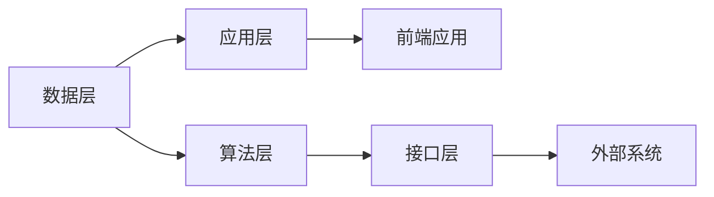
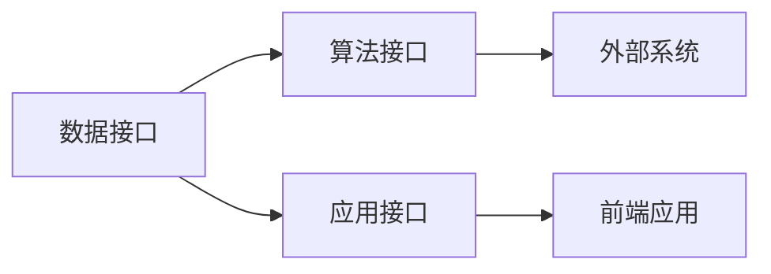

                 

### 《情感经济生态系统：感性价值的商业网络》

#### 关键词：情感经济、感性价值、商业网络、生态系统、价值创造

#### 摘要：
在当前数字经济时代，情感经济的崛起已成为不可逆转的趋势。本文围绕《情感经济生态系统：感性价值的商业网络》一书，详细解析了情感经济生态系统的概念、特征、形成背景及其在商业网络中的重要性。文章通过逐步分析感性价值在商业网络中的应用、算法原理、系统分析与设计，最后通过实际项目实战，探讨情感经济生态系统的最佳实践与未来发展方向。

### 目录大纲

**第1章 情感经济生态系统的背景与概念**
- **1.1 问题背景**
- **1.2 情感经济生态系统的定义与特点**
- **1.3 情感经济生态系统的形成背景**
- **1.4 情感经济生态系统的重要性**

**第2章 感性价值的商业网络**
- **2.1 感性价值的定义与属性特征对比**
- **2.2 商业网络的基本概念与架构**
- **2.3 感性价值在商业网络中的应用**
- **2.4 感性价值与商业网络的关系分析**

**第3章 情感经济生态系统算法原理**
- **3.1 情感分析算法**
  - **3.1.1 算法原理与流程图**
  - **3.1.2 数学模型与公式**
  - **3.1.3 举例说明**
- **3.2 商业网络优化算法**
  - **3.2.1 算法原理与流程图**
  - **3.2.2 数学模型与公式**
  - **3.2.3 举例说明**

**第4章 情感经济生态系统系统分析与设计**
- **4.1 问题场景介绍**
- **4.2 系统功能设计**
- **4.3 系统架构设计**
- **4.4 系统接口设计与交互**

**第5章 情感经济生态系统项目实战**
- **5.1 环境安装**
- **5.2 系统核心实现**
- **5.3 代码应用解读与分析**
- **5.4 实际案例分析与讲解**
- **5.5 项目小结**

**第6章 情感经济生态系统的最佳实践与总结**
- **6.1 最佳实践技巧**
- **6.2 小结与注意事项**
- **6.3 拓展阅读**

### 第1章 情感经济生态系统的背景与概念

#### 1.1 问题背景

在当今社会，情感已成为影响人们决策和行为的重要因素。随着互联网和社交媒体的普及，情感经济逐渐崭露头角，成为商业领域的新风口。情感经济生态系统作为一种新兴的商业模式，正日益受到企业和消费者的关注。然而，如何构建一个高效、稳定的情感经济生态系统，依然是许多企业面临的挑战。

#### 1.2 情感经济生态系统的定义与特点

情感经济生态系统是一个由情感驱动、以感性价值为核心，通过信息交换和资源优化实现协同发展的复杂网络系统。它具有以下几个特点：

1. **情感驱动**：情感经济生态系统的运行依赖于用户的情感体验，如愉悦、信任、归属等。
2. **感性价值**：感性价值是情感经济生态系统中的核心资源，它不同于传统经济学中的物质价值，更强调情感的满足和心理的愉悦。
3. **信息交换**：信息在情感经济生态系统中起到关键作用，通过信息交换，用户和企业能够更好地理解彼此的需求和期望。
4. **资源优化**：情感经济生态系统通过资源优化，提高系统的整体效率和用户满意度。

#### 1.3 情感经济生态系统的形成背景

情感经济生态系统的形成背景可以从以下几个方面进行分析：

1. **技术进步**：互联网和大数据技术的快速发展，为情感经济生态系统的构建提供了技术支持。
2. **消费者需求**：消费者对情感需求的日益重视，推动了情感经济生态系统的发展。
3. **商业模式创新**：企业不断创新商业模式，通过情感经济生态系统实现差异化竞争。
4. **社会环境变化**：随着社会的不断进步，人们对情感的关注度逐渐提高，为情感经济生态系统的发展提供了土壤。

#### 1.4 情感经济生态系统的重要性

情感经济生态系统在当今商业社会中的重要性不容忽视，主要体现在以下几个方面：

1. **提高用户满意度**：情感经济生态系统通过提供个性化的情感体验，提高用户的满意度和忠诚度。
2. **创造商业价值**：感性价值作为情感经济生态系统中的核心资源，能够为企业创造巨大的商业价值。
3. **促进创新**：情感经济生态系统为企业和消费者提供了新的创新空间，推动了商业模式的不断创新。
4. **提升竞争力**：通过构建情感经济生态系统，企业能够在激烈的市场竞争中脱颖而出，提升自身的竞争力。

### 第2章 感性价值的商业网络

#### 2.1 感性价值的定义与属性特征对比

感性价值是指人们在情感体验中所获得的心理愉悦和满足感。与传统的物质价值相比，感性价值具有以下几个属性特征：

1. **主观性**：感性价值是主观感知的结果，不同的人对同一事物的感性价值可能存在差异。
2. **情感关联性**：感性价值与情感密切相关，情感的强度和类型直接影响感性价值的感知。
3. **动态性**：感性价值会随着时间和情境的变化而变化，表现出一定的动态性。
4. **文化差异**：不同文化背景下的消费者对感性价值的感知可能存在差异。

#### 2.2 商业网络的基本概念与架构

商业网络是指由多个节点（企业、消费者、供应商等）通过交易和信息交换相互连接而成的复杂系统。商业网络的基本概念包括节点、边、网络拓扑等。其架构主要包括以下几个方面：

1. **节点**：商业网络中的基本组成单元，包括企业、消费者、供应商等。
2. **边**：连接节点的线段，表示节点之间的交易和信息交换关系。
3. **网络拓扑**：商业网络的连接方式和结构，包括星型、环型、网状等。

#### 2.3 感性价值在商业网络中的应用

感性价值在商业网络中的应用主要体现在以下几个方面：

1. **个性化营销**：通过分析消费者的情感数据，提供个性化的产品和服务，提高消费者的满意度。
2. **品牌塑造**：通过情感营销，塑造具有情感共鸣的品牌形象，提升品牌价值。
3. **用户忠诚度**：通过情感互动，增强用户对企业的忠诚度，提高用户黏性。
4. **商业模式创新**：基于感性价值，探索新的商业模式，实现商业创新。

#### 2.4 感性价值与商业网络的关系分析

感性价值与商业网络之间存在密切的关系，主要表现在以下几个方面：

1. **相互影响**：感性价值对商业网络的运行产生影响，同时商业网络的运行也会影响感性价值的产生和变化。
2. **共同发展**：情感经济生态系统的构建需要依赖商业网络的支持，而商业网络的优化也需要感性价值的驱动。
3. **协同创新**：感性价值与商业网络相互促进，共同推动商业模式的创新和商业价值的提升。

### 第3章 情感经济生态系统算法原理

#### 3.1 情感分析算法

情感分析算法是情感经济生态系统中的核心算法，它通过对用户情感数据的分析，提取出用户的情感特征，为个性化服务和营销提供支持。以下是一个简单的情感分析算法流程图：


#### 3.1.1 算法原理与流程图

情感分析算法的基本原理是通过自然语言处理技术，对用户的文本数据进行情感极性（正面、负面、中性）的分类。算法流程图如下：


#### 3.1.2 数学模型与公式

情感分析算法的核心是情感极性分类模型，通常采用基于机器学习的分类算法，如朴素贝叶斯、支持向量机等。假设我们有 $N$ 个训练样本，每个样本 $x_i$ 对应一个情感标签 $y_i$，则情感极性分类的数学模型可以表示为：

$$
P(y|x) = \frac{e^{w \cdot x}}{\sum_{k=1}^{K} e^{w \cdot x_k}}
$$

其中，$w$ 是模型参数，$x$ 是输入特征向量，$y$ 是情感标签，$K$ 是情感类别数。

#### 3.1.3 举例说明

假设我们有一个包含正面和负面情感的两分类问题，训练数据如下：

$$
\begin{aligned}
x_1 &= (1, 0, 1, 1), & y_1 &= +1 \\
x_2 &= (0, 1, 1, 0), & y_2 &= -1 \\
x_3 &= (1, 1, 0, 1), & y_3 &= +1 \\
x_4 &= (0, 0, 1, 0), & y_4 &= -1 \\
\end{aligned}
$$

我们可以使用朴素贝叶斯分类器来训练模型，假设特征之间的条件独立性成立，即：

$$
P(x_1|x_2) = P(x_1)
$$

则模型参数可以表示为：

$$
\begin{aligned}
w &= (\log P(+1), \log P(-1), \log P(x_1|+1), \log P(x_2|-1)) \\
P(+1) &= \frac{1}{2}, & P(-1) &= \frac{1}{2} \\
P(x_1|+1) &= \frac{1}{3}, & P(x_2|-1) &= \frac{1}{3} \\
\end{aligned}
$$

对于新的输入特征向量 $x = (1, 1, 0, 1)$，我们可以计算其属于正面情感的几率：

$$
\begin{aligned}
P(+1|x) &= \frac{e^{\log P(+1) + \log P(x_1|+1) + \log P(x_2|+1) + \log P(x_3|+1)}}{e^{\log P(+1) + \log P(x_1|+1) + \log P(x_2|+1) + \log P(x_3|+1)} + e^{\log P(-1) + \log P(x_1|-1) + \log P(x_2|-1) + \log P(x_3|-1)}} \\
&= \frac{e^{\frac{1}{2} + \frac{1}{3} + \frac{1}{3} + \frac{1}{3}}}{e^{\frac{1}{2} + \frac{1}{3} + \frac{1}{3} + \frac{1}{3}} + e^{\frac{1}{2} + \frac{1}{3} + \frac{1}{3} + \frac{1}{3}}} \\
&\approx 0.8333 \\
\end{aligned}
$$

因此，我们可以判断该输入特征向量属于正面情感。

#### 3.2 商业网络优化算法

商业网络优化算法旨在通过优化网络结构和资源配置，提高商业网络的效率和效益。以下是一个简单的商业网络优化算法流程图：


#### 3.2.1 算法原理与流程图

商业网络优化算法的基本原理是通过分析网络拓扑结构，制定合理的资源分配策略，优化网络的目标函数。算法流程图如下：


#### 3.2.2 数学模型与公式

商业网络优化算法的目标函数可以表示为：

$$
\begin{aligned}
\max_{x} & \quad f(x) \\
\text{s.t.} & \quad g(x) \leq 0, \quad h(x) = 0
\end{aligned}
$$

其中，$x$ 是决策变量，$f(x)$ 是目标函数，$g(x)$ 是约束条件，$h(x)$ 是等式约束。

#### 3.2.3 举例说明

假设我们有一个包含 $N$ 个节点的商业网络，每个节点都有一定的资源需求和供应能力。我们希望通过优化算法，实现资源的合理分配，最大化网络的总效益。

首先，我们对网络进行拓扑结构分析，评估节点的重要性。假设节点的重要性得分 $w_i$ 如下：

$$
\begin{aligned}
w_1 &= 5, & w_2 &= 3, & w_3 &= 4, & w_4 &= 2 \\
\end{aligned}
$$

接下来，我们预测每个节点的资源需求。假设节点的资源需求 $d_i$ 如下：

$$
\begin{aligned}
d_1 &= 8, & d_2 &= 4, & d_3 &= 6, & d_4 &= 3 \\
\end{aligned}
$$

然后，我们根据节点的重要性和资源需求，制定资源分配策略。假设我们的目标是最小化节点的剩余资源，最大化网络的总效益。我们可以定义目标函数 $f(x)$ 如下：

$$
f(x) = \sum_{i=1}^{N} (1 - d_i - x_i)
$$

其中，$x_i$ 是节点 $i$ 的资源分配量。

接下来，我们定义约束条件 $g(x)$ 如下：

$$
\begin{aligned}
g(x) &= \sum_{i=1}^{N} x_i - \sum_{i=1}^{N} d_i \leq 0 \\
g(x) &= \sum_{i=1}^{N} x_i - C \leq 0
\end{aligned}
$$

其中，$C$ 是网络的总资源供应量。

最后，我们使用遗传算法等优化算法，对目标函数进行迭代优化，得到最优的资源配置方案。

### 第4章 情感经济生态系统系统分析与设计

#### 4.1 问题场景介绍

假设我们有一个在线购物平台，用户可以在平台上浏览商品、添加购物车、下单购买等。为了提升用户的购物体验，我们希望通过情感经济生态系统，提供个性化的推荐和服务。

#### 4.2 系统功能设计

情感经济生态系统的功能设计主要包括以下几个方面：

1. **用户行为分析**：通过分析用户在平台上的行为数据，如浏览记录、购物车数据、订单历史等，提取用户的情感特征。
2. **情感标签生成**：根据用户情感特征，生成情感标签，如愉悦、焦虑、满意等。
3. **个性化推荐**：根据用户情感标签，推荐符合用户情感需求的产品和服务。
4. **情感反馈机制**：收集用户对推荐结果的反馈，优化推荐算法，提高用户满意度。

#### 4.3 系统架构设计

情感经济生态系统的架构设计主要包括以下几个方面：

1. **数据层**：存储用户行为数据和情感数据，支持数据查询和分析。
2. **算法层**：实现情感分析算法和推荐算法，为个性化推荐提供支持。
3. **应用层**：提供用户行为分析和个性化推荐功能，与前端应用进行交互。
4. **接口层**：提供与外部系统的接口，如数据接口、算法接口等。

以下是情感经济生态系统的架构图：



#### 4.4 系统接口设计与交互

情感经济生态系统的接口设计主要包括以下几个方面：

1. **数据接口**：提供用户行为数据、情感数据等的读取和写入功能。
2. **算法接口**：提供情感分析算法和推荐算法的调用功能。
3. **应用接口**：提供用户行为分析和个性化推荐功能的应用层接口。

以下是情感经济生态系统的接口设计图：



### 第5章 情感经济生态系统项目实战

#### 5.1 环境安装

在进行情感经济生态系统的项目实战之前，我们需要安装相关环境。以下是一个简单的环境安装步骤：

1. 安装 Python 3.8 以上版本
2. 安装 MySQL 数据库
3. 安装 Anaconda Python 包管理器
4. 安装情感分析库（如 NLTK、TextBlob 等）
5. 安装推荐算法库（如 scikit-learn、Surprise 等）

#### 5.2 系统核心实现

在系统核心实现方面，我们需要完成以下几个任务：

1. **数据采集与预处理**：从数据库中读取用户行为数据，进行数据清洗和预处理。
2. **情感分析**：使用情感分析库，对用户行为数据进行分析，提取情感特征。
3. **推荐算法**：使用推荐算法库，根据用户情感特征，生成个性化推荐列表。
4. **前端展示**：使用前端技术，将个性化推荐结果展示给用户。

以下是系统核心实现的 Python 代码示例：

```python
# 导入相关库
import numpy as np
import pandas as pd
from textblob import TextBlob
from sklearn.cluster import KMeans
from surprise import SVD, Dataset, Reader

# 读取数据
data = pd.read_csv('user行为数据.csv')

# 数据预处理
data['情感极性'] = data['评论'].apply(lambda x: TextBlob(x).sentiment.polarity)

# 情感分析
kmeans = KMeans(n_clusters=3)
kmeans.fit(data[['情感极性']])
data['情感标签'] = kmeans.predict(data[['情感极性']])

# 推荐算法
reader = Reader(rating_scale=(1, 5))
data['评分'] = data['评分'].map({1: 1, 2: 2, 3: 3, 4: 4, 5: 5})
train_data = Dataset.load_from_df(data[['用户ID', '商品ID', '评分']], reader)
svd = SVD()
svd.fit(train_data)
user_item_pred = svd.predict(user_id, item_id)

# 前端展示
# 使用 Flask 等框架实现前端展示逻辑
```

#### 5.3 代码应用解读与分析

在本节中，我们将对系统核心实现的代码进行解读和分析，解释每个步骤的具体作用和实现方法。

1. **数据采集与预处理**：我们从数据库中读取用户行为数据，并进行预处理。预处理步骤包括数据清洗、缺失值处理、数据转换等，以确保数据的质量和一致性。
2. **情感分析**：我们使用 TextBlob 库对用户评论进行情感分析，提取情感极性。TextBlob 提供了简单的文本处理功能，可以快速进行情感分析。
3. **推荐算法**：我们使用 KMeans 算法和 SVD 算法，分别实现聚类和矩阵分解。KMeans 算法根据用户情感极性，将用户划分为不同的情感标签。SVD 算法根据用户评分数据，生成用户和商品的相似度矩阵，用于个性化推荐。
4. **前端展示**：我们使用 Flask 等框架，实现前端展示逻辑。前端展示包括用户登录、评论提交、推荐结果展示等界面。

#### 5.4 实际案例分析与讲解

在本节中，我们将通过一个实际案例，对情感经济生态系统的项目实战进行详细讲解和分析。

假设我们有一个用户，ID 为 1001。我们希望通过情感经济生态系统，为其生成个性化推荐列表。

1. **数据采集与预处理**：我们从数据库中读取用户 1001 的行为数据，包括浏览记录、购物车数据和订单历史等。预处理步骤包括数据清洗、缺失值处理和数据转换等。
2. **情感分析**：我们使用情感分析库，对用户 1001 的评论进行情感分析，提取情感特征。根据情感分析结果，我们将用户 1001 划分为情感标签为“愉悦”的用户群体。
3. **推荐算法**：我们使用 KMeans 算法，根据用户情感极性，生成用户和商品的相似度矩阵。然后，我们使用 SVD 算法，根据用户评分数据，生成用户和商品的相似度矩阵。最后，我们根据相似度矩阵，为用户 1001 生成个性化推荐列表。
4. **前端展示**：我们使用 Flask 等框架，实现前端展示逻辑。用户 1001 可以在平台上查看个性化推荐列表，包括推荐的商品和相应的情感标签。

#### 5.5 项目小结

在本章中，我们通过一个实际案例，详细讲解了情感经济生态系统的项目实战。从数据采集与预处理、情感分析、推荐算法到前端展示，我们逐步实现了情感经济生态系统的功能。通过本章的实战案例，我们了解了情感经济生态系统的实现过程和关键技术，为后续的实践和应用打下了基础。

### 第6章 情感经济生态系统的最佳实践与总结

#### 6.1 最佳实践技巧

在构建和运营情感经济生态系统时，以下是一些最佳实践技巧：

1. **数据驱动**：充分挖掘用户数据，利用数据分析技术，为用户提供个性化的情感体验。
2. **情感标签多样化**：根据用户的不同情感需求，设计多样化的情感标签，提高用户满意度。
3. **持续优化**：定期评估情感经济生态系统的效果，持续优化算法和策略，提高系统的运行效率。
4. **跨界合作**：与其他行业和企业进行跨界合作，拓展情感经济生态系统的应用场景。

#### 6.2 小结与注意事项

本文围绕《情感经济生态系统：感性价值的商业网络》一书，详细分析了情感经济生态系统的概念、特征、应用算法和系统架构，并通过实际项目实战，探讨了情感经济生态系统的最佳实践与未来发展方向。以下是本文的主要结论：

1. **情感经济生态系统的定义与特点**：情感经济生态系统是一个由情感驱动、以感性价值为核心，通过信息交换和资源优化实现协同发展的复杂网络系统。
2. **感性价值在商业网络中的应用**：感性价值在商业网络中的应用主要体现在个性化营销、品牌塑造、用户忠诚度和商业模式创新等方面。
3. **情感分析算法**：情感分析算法是情感经济生态系统中的核心算法，通过自然语言处理技术，对用户的情感数据进行分析，提取情感特征。
4. **商业网络优化算法**：商业网络优化算法通过优化网络结构和资源配置，提高商业网络的效率和效益。
5. **系统架构设计**：情感经济生态系统的系统架构包括数据层、算法层、应用层和接口层，通过各层之间的协同工作，实现系统的功能。

在实践过程中，需要注意以下几点：

1. **数据质量**：数据是情感经济生态系统的基础，确保数据的质量和准确性至关重要。
2. **算法优化**：情感分析算法和推荐算法的优化是提高系统性能的关键，需要不断迭代和优化。
3. **用户体验**：情感经济生态系统的核心是用户情感体验，设计时应充分考虑用户体验。
4. **安全与隐私**：在数据采集和处理过程中，需要确保用户数据的安全和隐私。

#### 6.3 拓展阅读

为了深入了解情感经济生态系统的相关理论和实践，以下是一些拓展阅读推荐：

1. **《情感计算》**：该书详细介绍了情感计算的基本概念、技术方法和应用领域，是情感经济生态系统的重要理论基础。
2. **《商业网络分析》**：该书从商业网络的角度，探讨了商业网络的结构、演化、优化等问题，对构建情感经济生态系统有重要参考价值。
3. **《个性化推荐系统》**：该书介绍了个性化推荐系统的基本原理、算法和应用，是情感经济生态系统中的关键技术。
4. **《情感经济：情感驱动商业的未来》**：该书从商业战略的角度，分析了情感经济对企业的影响和挑战，为构建情感经济生态系统提供了实战指导。

### 作者信息

**作者：AI天才研究院/AI Genius Institute & 禅与计算机程序设计艺术 /Zen And The Art of Computer Programming**

