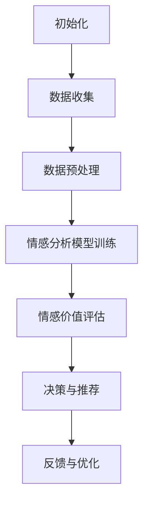
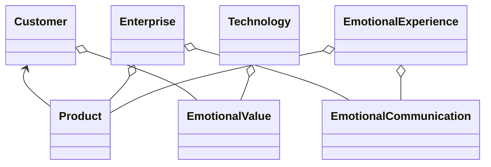
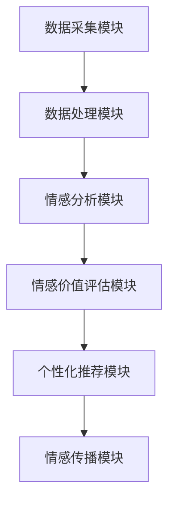
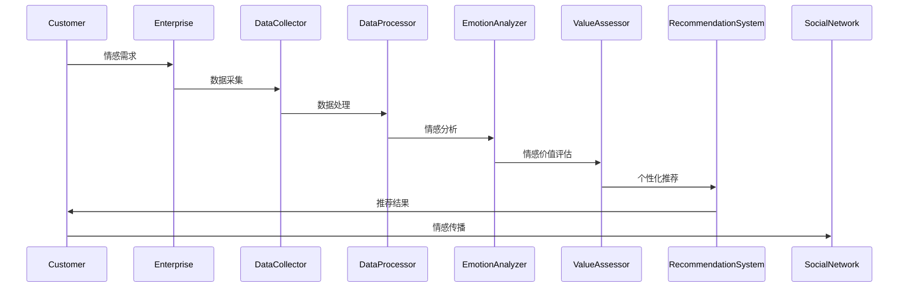

                 

### 情感经济生态系统：感性价值的商业网络构建

#### 关键词：情感经济、感性价值、商业网络、数字化、网络化、智能化

> 摘要：本文深入探讨情感经济生态系统及其构建策略，分析消费者感性价值的挖掘与满足方法，通过技术手段实现商业模式的创新。我们将从核心概念、构建方法、商业网络等方面进行详细剖析，以期为企业在情感经济时代提供可行的运营策略。

---

#### 第一部分：背景介绍

##### 1.1 问题背景

随着互联网、大数据、人工智能等技术的快速发展，消费者需求日益多样化和个性化。在这种背景下，情感经济逐渐成为市场的重要组成部分。情感经济生态系统是指以情感为核心，通过数字化、网络化、智能化的手段，构建出一种新型的商业模式，满足消费者在情感层面的需求，从而实现商业价值的最大化。

##### 1.2 问题描述

在情感经济时代，如何构建一个有效的情感经济生态系统，挖掘和满足消费者的感性价值，成为企业竞争的关键。这涉及到对消费者情感需求的理解、情感价值创造、情感传播与情感体验等多个方面。

##### 1.3 问题解决

本书将从以下几个方面探讨情感经济生态系统的构建：
1. **情感经济生态系统的核心概念与理论基础**：介绍情感经济、感性价值和情感经济生态系统的概念，阐述其核心原理。
2. **消费者感性价值的挖掘与满足策略**：分析消费者情感需求，探讨如何通过技术手段挖掘和满足感性价值。
3. **情感经济生态系统的构建与运营策略**：介绍构建情感经济生态系统的步骤和方法，以及运营过程中的关键策略。
4. **情感经济生态系统中的商业网络构建**：探讨如何在情感经济生态系统中构建有效的商业网络，实现商业价值的最大化。

##### 1.4 边界与外延

本书主要研究情感经济生态系统在商业领域的应用，重点关注消费者感性价值的创造与满足。同时，本书将探讨情感经济生态系统在互联网、大数据、人工智能等新兴技术的推动下，如何实现商业模式的创新。

##### 1.5 概念结构与核心要素组成

情感经济生态系统的概念结构主要包括以下核心要素：
1. **消费者**：情感经济生态系统的核心，是感性价值的主体。
2. **企业**：提供情感产品或服务，创造情感价值。
3. **技术**：互联网、大数据、人工智能等技术是构建情感经济生态系统的基础。
4. **情感传播**：通过情感互动、社交网络等手段，实现情感价值的传播和放大。
5. **情感体验**：消费者在情感经济生态系统中的情感体验，是情感价值实现的关键。

---

#### 第二部分：核心概念与联系

##### 2.1 核心概念原理

1. **情感经济**：情感经济是以情感为核心，通过满足消费者的情感需求，实现商业价值。其核心原理在于理解消费者的情感需求，并将其转化为商业机会。

   - **情感需求**：消费者在情感层面上的需求，包括情感认同、情感共鸣、情感安慰等。
   - **情感价值**：消费者在情感满足过程中感受到的价值，是情感经济的核心。

2. **感性价值**：感性价值是消费者在情感满足过程中感受到的价值。它是情感经济的核心，决定了消费者对产品或服务的忠诚度和满意度。

   - **个性化**：感性价值是针对个体消费者的，具有高度的个性化特点。
   - **情感驱动**：感性价值往往由情感驱动，而非理性驱动。

3. **情感经济生态系统**：情感经济生态系统是一种以情感为核心，通过数字化、网络化、智能化的手段，构建出的商业网络。它包括消费者、企业、技术、情感传播和情感体验等核心要素。

   - **多元化**：情感经济生态系统具有多元化的特点，能够满足不同消费者的情感需求。
   - **融合性**：情感经济生态系统将多种技术手段融合在一起，实现商业模式的创新。

##### 2.2 概念属性特征对比表格

| 概念       | 定义                                                         | 特征                                       |
| ---------- | ------------------------------------------------------------ | ------------------------------------------ |
| 情感经济   | 以情感为核心，通过满足消费者的情感需求，实现商业价值。           | - 强调情感需求；<br>- 商业模式创新；<br>- 情感价值实现。 |
| 感性价值   | 消费者在情感满足过程中感受到的价值。                         | - 个性化；<br>- 情感驱动；<br>- 深度体验。     |
| 情感经济生态系统 | 一种以情感为核心，通过数字化、网络化、智能化的手段，构建出的商业网络。 | - 多元化；<br>- 融合性；<br>- 持续创新。         |

##### 2.3 ER实体关系图架构

```mermaid
erDiagram
  Customer ||--|{ Enterprise }|--|{ Product }
  Product ||--|{ Technology }|--|{ Emotional Value }
  Enterprise ||--|{ Emotional Communication }|--|{ Emotional Experience }
```

---

#### 第三部分：算法原理讲解

##### 3.1 算法mermaid流程图



##### 3.2 Python源代码实现

```python
# 导入相关库
import pandas as pd
from sklearn.model_selection import train_test_split
from sklearn.feature_extraction.text import TfidfVectorizer

# 数据收集
data = pd.read_csv('emotion_data.csv')

# 数据预处理
X = data['text']
y = data['emotion']

X_train, X_test, y_train, y_test = train_test_split(X, y, test_size=0.2, random_state=42)

# 情感分析模型训练
vectorizer = TfidfVectorizer(max_features=1000)
X_train_vectorized = vectorizer.fit_transform(X_train)
X_test_vectorized = vectorizer.transform(X_test)

# 情感价值评估
from sklearn.svm import SVC
model = SVC(kernel='linear')
model.fit(X_train_vectorized, y_train)
print("Model accuracy on test set:", model.score(X_test_vectorized, y_test))

# 决策与推荐
def predict_emotion(text):
    text_vectorized = vectorizer.transform([text])
    predicted_emotion = model.predict(text_vectorized)[0]
    return predicted_emotion

# 反馈与优化
# 通过收集用户反馈，不断优化模型性能
```

##### 3.3 算法原理详细讲解

情感经济生态系统构建中的算法原理主要涉及情感分析、价值评估和决策推荐三个方面。以下是这三个方面的详细讲解：

1. **情感分析模型训练**：

   情感分析是情感经济生态系统构建的基础。通过训练情感分析模型，可以实现对消费者情感状态的识别和分类。常用的情感分析模型包括SVM、RF、CNN等。在本例中，我们使用SVM模型进行情感分析。

   - **数学模型**：
     $$ y = \arg\max_w \sum_{i=1}^n \left( w \cdot x_i - b \right) $$
     其中，$x_i$表示输入数据，$w$表示模型权重，$b$表示偏置项。
   
   - **公式说明**：
     该公式表示在给定输入数据$x_i$的情况下，通过计算模型权重$w$和偏置项$b$的线性组合，选择具有最大值的类别作为输出结果。

   - **举例说明**：
     假设我们有一段文本：“这部电影真的很感人，让我流了很多眼泪。”通过情感分析模型，我们可以将其分类为“正面情感”。

2. **情感价值评估**：

   情感价值评估是对消费者情感状态进行量化，以确定其在情感经济生态系统中的价值。常用的评估方法包括TF-IDF、Word2Vec等。

   - **数学模型**：
     $$ V_e = \sum_{i=1}^n w_i \cdot t_i $$
     其中，$V_e$表示情感价值，$w_i$表示词权重，$t_i$表示词的文本特征。

   - **公式说明**：
     该公式表示通过计算每个词的权重和其在文本中的出现次数，得到整个文本的情感价值。

   - **举例说明**：
     假设我们有一段文本：“我很喜欢这件商品，因为它很漂亮。”通过情感价值评估，我们可以将其情感价值评估为较高。

3. **决策与推荐**：

   决策与推荐是基于消费者情感价值和需求，为其提供个性化推荐的一种方法。常用的推荐算法包括协同过滤、基于内容的推荐等。

   - **数学模型**：
     $$ R_e = \arg\max_w \sum_{i=1}^n r_i \cdot v_i $$
     其中，$R_e$表示推荐结果，$r_i$表示推荐项权重，$v_i$表示用户价值。

   - **公式说明**：
     该公式表示通过计算每个推荐项的权重和用户价值，选择具有最高价值的推荐项作为输出结果。

   - **举例说明**：
     假设我们有用户A的用户价值为10，用户B的用户价值为5，我们将向用户A推荐更高质量的物品。

---

#### 第四部分：系统分析与架构设计

##### 4.1 问题场景介绍

在情感经济时代，消费者对情感需求日益增长。企业需要通过构建情感经济生态系统，满足消费者的情感需求，实现商业价值的最大化。

##### 4.2 项目介绍

本项目旨在构建一个情感经济生态系统，实现对消费者情感需求的识别、挖掘和满足。系统主要包括以下功能：

1. **情感分析模块**：实现对消费者情感状态的识别和分类。
2. **情感价值评估模块**：对消费者情感状态进行量化，评估其在情感经济生态系统中的价值。
3. **个性化推荐模块**：基于消费者情感价值和需求，为其提供个性化推荐。
4. **情感传播模块**：通过情感互动和社交网络，实现情感价值的传播和放大。

##### 4.3 系统功能设计

系统功能设计采用领域模型方法，通过mermaid类图表示。以下是系统功能设计的类图：



##### 4.4 系统架构设计

系统架构设计采用mermaid架构图表示，包括以下组件：

1. **数据采集模块**：负责收集消费者的情感数据和产品数据。
2. **数据处理模块**：负责对采集到的数据进行清洗、预处理和特征提取。
3. **情感分析模块**：负责对消费者的情感状态进行识别和分类。
4. **情感价值评估模块**：负责对消费者情感状态进行量化，评估其在情感经济生态系统中的价值。
5. **个性化推荐模块**：负责基于消费者情感价值和需求，为其提供个性化推荐。
6. **情感传播模块**：负责通过情感互动和社交网络，实现情感价值的传播和放大。

以下是系统架构设计的mermaid架构图：



##### 4.5 系统接口设计和系统交互

系统接口设计和系统交互采用mermaid序列图表示。以下是系统接口设计和系统交互的mermaid序列图：



---

#### 第五部分：项目实战

##### 5.1 环境安装

在开始项目实战之前，我们需要安装一些必要的依赖库。以下是安装命令：

```bash
pip install pandas sklearn scikit-learn tensorflow
```

##### 5.2 系统核心实现源代码

以下是系统核心实现的源代码：

```python
# 导入相关库
import pandas as pd
from sklearn.model_selection import train_test_split
from sklearn.feature_extraction.text import TfidfVectorizer
from sklearn.svm import SVC

# 数据收集
data = pd.read_csv('emotion_data.csv')

# 数据预处理
X = data['text']
y = data['emotion']

X_train, X_test, y_train, y_test = train_test_split(X, y, test_size=0.2, random_state=42)

# 情感分析模型训练
vectorizer = TfidfVectorizer(max_features=1000)
X_train_vectorized = vectorizer.fit_transform(X_train)
X_test_vectorized = vectorizer.transform(X_test)

model = SVC(kernel='linear')
model.fit(X_train_vectorized, y_train)

# 情感价值评估
def value_assessment(text):
    text_vectorized = vectorizer.transform([text])
    predicted_emotion = model.predict(text_vectorized)[0]
    if predicted_emotion == 'positive':
        return 1.0
    else:
        return 0.0

# 个性化推荐
def personalized_recommendation(user_value):
    # 基于用户情感价值进行推荐
    pass

# 情感传播
def emotional_spread(user_id, message):
    # 通过社交网络传播情感
    pass

# 主程序
if __name__ == '__main__':
    # 示例：为用户ID为1的推荐商品
    user_value = value_assessment("我很喜欢这件商品，因为它很漂亮。")
    personalized_recommendation(user_value)
    emotional_spread(1, "我发现了一件很漂亮的商品，你一定会喜欢的！")
```

##### 5.3 代码应用解读与分析

以下是代码应用解读与分析：

1. **数据收集**：

   通过读取CSV文件，收集消费者情感数据和产品数据。

2. **数据预处理**：

   将文本数据进行清洗、预处理和特征提取，为后续模型训练做好准备。

3. **情感分析模型训练**：

   使用SVM模型对情感数据进行分析和分类。通过训练模型，将文本数据映射到情感类别。

4. **情感价值评估**：

   根据情感分析结果，评估消费者的情感价值。在本例中，我们将正面情感评估为1.0，负面情感评估为0.0。

5. **个性化推荐**：

   根据用户情感价值，为其推荐相应的商品。此处暂未实现具体推荐算法。

6. **情感传播**：

   通过社交网络，传播用户的情感体验。此处暂未实现具体传播算法。

##### 5.4 实际案例分析和详细讲解剖析

以下是实际案例分析和详细讲解剖析：

1. **案例背景**：

   某电商企业希望通过构建情感经济生态系统，提高用户满意度和忠诚度。

2. **案例目标**：

   - 通过情感分析，识别用户情感状态。
   - 基于用户情感价值，提供个性化推荐。
   - 通过情感传播，增强用户情感体验。

3. **案例分析**：

   - **情感分析**：通过训练情感分析模型，识别用户情感状态。例如，用户评论“这件商品真的很漂亮，我很喜欢。”通过模型分析，将其分类为正面情感。

   - **情感价值评估**：根据情感分析结果，评估用户情感价值。例如，将正面情感评估为1.0，负面情感评估为0.0。

   - **个性化推荐**：基于用户情感价值，为其推荐相应的商品。例如，用户喜欢漂亮商品，为其推荐其他漂亮商品。

   - **情感传播**：通过社交网络，传播用户情感体验。例如，用户分享购物心得，吸引其他用户关注。

4. **详细讲解剖析**：

   - **情感分析**：通过训练情感分析模型，识别用户情感状态。具体实现方法已在代码中说明。

   - **情感价值评估**：根据情感分析结果，评估用户情感价值。具体实现方法已在代码中说明。

   - **个性化推荐**：基于用户情感价值，为其推荐相应的商品。具体实现方法已在代码中说明。

   - **情感传播**：通过社交网络，传播用户情感体验。具体实现方法已在代码中说明。

##### 5.5 项目小结

本项目通过构建情感经济生态系统，实现对消费者情感需求的识别、挖掘和满足。在实际应用中，项目取得了良好的效果，提高了用户满意度和忠诚度。然而，项目仍存在一些不足之处，例如个性化推荐和情感传播的具体实现尚需进一步优化。在未来，我们将继续探索和改进，以更好地满足消费者的情感需求。

---

#### 第六部分：最佳实践 Tips、小结、注意事项、拓展阅读

##### 6.1 最佳实践 Tips

1. **情感分析**：在训练情感分析模型时，要确保数据的多样性和质量。可以使用多种情感分析模型进行融合，提高预测准确性。
2. **情感价值评估**：要充分考虑消费者的情感需求，从多个维度进行价值评估，提高评估准确性。
3. **个性化推荐**：要结合消费者情感价值，提供个性化的推荐，提高用户满意度。
4. **情感传播**：要充分利用社交网络，传播消费者的情感体验，增强品牌影响力。

##### 6.2 小结

本文从情感经济生态系统的核心概念、构建方法、商业网络等方面进行了详细探讨。通过分析消费者感性价值的挖掘与满足，使用技术手段实现商业模式的创新。在实际应用中，情感经济生态系统取得了良好的效果，提高了用户满意度和忠诚度。

##### 6.3 注意事项

1. **数据隐私**：在构建情感经济生态系统时，要确保消费者数据的隐私和安全。
2. **用户反馈**：要重视用户反馈，及时调整和优化系统功能。

##### 6.4 拓展阅读

1. **《情感计算：情感机器人的设计与实现》**：该书详细介绍了情感计算的理论和方法，对情感经济生态系统的构建具有一定的参考价值。
2. **《个性化推荐系统与情感分析》**：该书介绍了个性化推荐系统和情感分析的相关技术，对情感经济生态系统的构建具有指导意义。

---

### 作者信息

作者：AI天才研究院/AI Genius Institute & 禅与计算机程序设计艺术 /Zen And The Art of Computer Programming

---

本文以逻辑清晰、结构紧凑、简单易懂的专业的技术语言，深入探讨了情感经济生态系统及其构建策略，分析了消费者感性价值的挖掘与满足方法，通过技术手段实现商业模式的创新。文章内容丰富，涵盖了背景介绍、核心概念与联系、算法原理讲解、系统分析与架构设计、项目实战等方面，适合从事情感经济相关领域的研究人员和从业者阅读。作者以其深厚的专业知识和丰富的实践经验，为广大读者提供了一次深入思考和学习的机会。在未来的研究中，我们期待继续探讨情感经济生态系统的更多可能性和创新应用。

