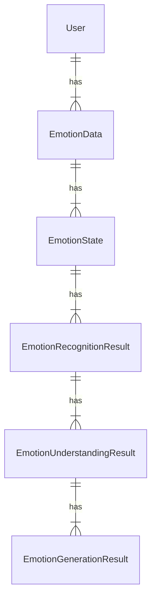
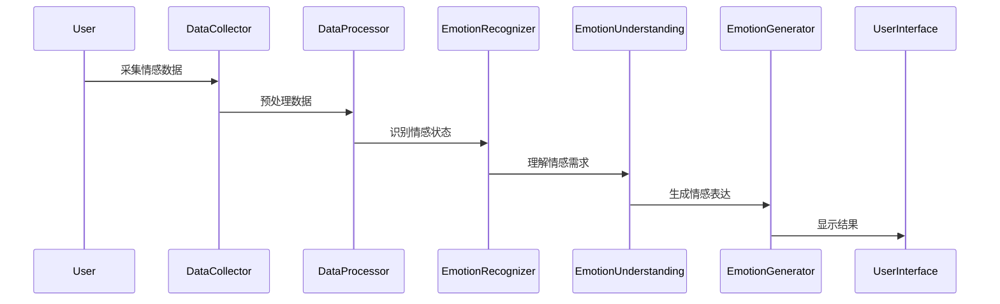
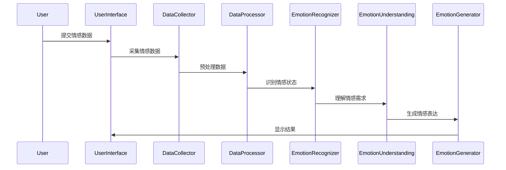

                 


### 情感计算前沿研究项目：人机情感交互的科技探索深化

> 关键词：情感计算，人机交互，情感识别，情感理解，情感生成，人工智能

> 摘要：本文将深入探讨情感计算前沿研究项目，重点分析人机情感交互的技术原理及其在各个领域的应用，通过详细的系统分析与架构设计，以及实战项目解析，为读者呈现一个全面而深刻的科技探索。

#### 目录大纲设计方案

##### 1. 设计思路

本文的设计思路将遵循以下原则：

- **逻辑清晰**：确保章节之间有明确的逻辑关系，便于读者理解。
- **内容完整**：涵盖核心概念、技术原理、应用实例和未来趋势等内容。
- **简洁明了**：避免冗余内容，确保大纲简洁明了。

##### 2. 章节划分

基于上述原则，将文章分为七个主要部分：

- **背景介绍**：介绍情感计算的发展背景、问题定义和研究的意义。
- **核心概念与联系**：定义关键概念，分析各概念之间的关系。
- **人机情感交互技术原理**：详细讲解情感识别、情感理解和情感生成等核心技术的原理。
- **应用实例**：通过具体案例展示技术在实际中的应用。
- **系统分析与架构设计**：介绍情感计算系统的设计和实现。
- **项目实战**：提供实际项目中的代码实现和案例分析。
- **未来趋势与展望**：探讨情感计算领域的未来发展。

##### 3. 目录大纲

**第一部分：背景介绍**

- 第1章：情感计算的发展背景
  - 1.1 情感计算的定义与重要性
  - 1.2 问题定义与研究意义

**第二部分：核心概念与联系**

- 第2章：情感计算的核心概念
  - 2.1 情感识别
  - 2.2 情感理解
  - 2.3 情感生成
  - 2.4 概念联系与对比

**第三部分：人机情感交互技术原理**

- 第3章：人机情感交互技术原理
  - 3.1 情感识别技术原理
  - 3.2 情感理解技术原理
  - 3.3 情感生成技术原理

**第四部分：应用实例**

- 第4章：情感计算技术的应用实例
  - 4.1 情感计算在客服中的应用
  - 4.2 情感计算在教育中的应用
  - 4.3 情感计算在心理健康领域的应用

**第五部分：系统分析与架构设计**

- 第5章：情感计算系统的设计与实现
  - 5.1 情感计算系统的介绍
  - 5.2 领域模型设计
  - 5.3 系统架构设计
  - 5.4 系统接口设计与交互

**第六部分：项目实战**

- 第6章：情感计算项目实战
  - 6.1 环境安装与准备
  - 6.2 系统核心实现
  - 6.3 代码应用解读与分析
  - 6.4 实际案例分析和详细讲解剖析
  - 6.5 项目小结

**第七部分：未来趋势与展望**

- 第7章：情感计算的未来趋势与展望
  - 7.1 技术发展趋势
  - 7.2 应用领域拓展
  - 7.3 挑战与机遇

通过上述章节的设计，文章将逐步引导读者深入理解情感计算的各个层面，从理论到实践，全面探索人机情感交互的科技之路。接下来，我们将逐一展开详细讨论。让我们开始这段科技之旅吧！## 第1章：情感计算的发展背景

### 1.1 情感计算的定义与重要性

情感计算（Affective Computing）是指计算机系统通过感知、理解和模拟人的情感状态，实现与人的更自然、更丰富的交互过程。它不仅仅关注于信息的处理，更强调情感维度，即计算机能够识别、理解、表达和模拟人类情感的能力。

**情感计算的定义**：

情感计算起源于20世纪90年代，由美国麻省理工学院的罗莎琳·皮卡德（Rosalind Picard）教授提出。她将其定义为：“情感计算是指计算机系统在处理信息时，能够识别、理解、表达和模拟人类情感状态的能力。”

**情感计算的重要性**：

1. **提升人机交互体验**：情感计算使得计算机能够更好地理解用户的情感状态，提供个性化的服务和反馈，从而提升用户的使用体验。

2. **优化心理健康服务**：通过情感计算技术，可以实时监测用户的情感状态，为心理健康提供预警和干预，从而提高心理健康服务的效率。

3. **增强教育效果**：在教育领域，情感计算可以分析学生的学习状态和情感反应，提供个性化的学习支持和指导，提高教育质量。

4. **改善客户服务**：情感计算在客服领域有广泛应用，通过分析用户的情感表达，提供更贴心的服务，提升客户满意度。

5. **促进社会和谐**：情感计算的应用有助于消除人与人之间的情感隔阂，促进社会和谐。

### 1.2 情感计算的起源与发展

**情感计算的起源**：

情感计算的概念最早由罗莎琳·皮卡德教授在1995年的国际人工智能与情感会议（Affective Interfaces）上提出。她的研究主要集中在情感识别和情感理解上，通过传感器和算法模型，使计算机能够感知用户的情感状态。

**情感计算的发展历程**：

1. **初期探索**（1995-2000年）：这一时期主要是情感计算概念和技术的初期探索，研究者们开始关注如何让计算机识别和表达情感。

2. **技术成熟**（2000-2010年）：随着计算机硬件和算法技术的进步，情感计算技术逐渐成熟。这一时期，出现了许多情感计算的实际应用，如情感识别硬件、情感分析软件等。

3. **广泛应用**（2010年至今）：随着人工智能和大数据技术的快速发展，情感计算的应用领域不断扩展，从最初的实验室研究走向实际应用，如智能客服、智能家居、在线教育等。

**情感计算的关键技术**：

1. **情感识别**：通过传感器和算法模型，计算机能够从用户的行为、语音、面部表情等方面识别情感状态。

2. **情感理解**：基于情感识别的结果，计算机能够理解用户的情感需求和意图，提供更个性化的服务。

3. **情感生成**：计算机能够模拟情感，通过语音、文本、表情等方式表达情感，与用户进行情感交流。

**情感计算的应用领域**：

1. **健康医疗**：通过情感计算技术，可以实时监测患者的情感状态，为心理健康提供预警和干预。

2. **教育**：情感计算在教育领域的应用主要包括情感分析、个性化教育、学习评估等。

3. **客户服务**：情感计算在客服领域的应用主要通过情感分析，为用户提供更个性化的服务。

4. **智能家居**：通过情感计算，智能家居系统能够感知家庭成员的情感状态，提供更加贴心的服务。

5. **社交网络**：情感计算可以分析社交网络中的情感传播，为用户提供情感洞察。

### 1.3 研究意义与目标

**研究意义**：

1. **推动技术进步**：情感计算是人工智能领域的重要分支，其研究有助于推动计算机技术和社会发展的深度融合。

2. **改善人类生活**：情感计算的应用可以提升人类生活质量，如改善心理健康、提高教育效果、优化客户服务等。

3. **促进人机和谐**：通过情感计算技术，计算机能够更好地理解人类，实现更自然、更丰富的交互，促进人机和谐。

**研究目标**：

1. **发展关键技术**：深入研究情感识别、情感理解和情感生成的关键技术，提升计算机的情感计算能力。

2. **拓展应用领域**：探索情感计算在不同领域的应用，推动其在实际场景中的落地和应用。

3. **构建标准体系**：制定情感计算的标准体系，规范技术研究和应用开发，促进行业的健康发展。

通过本章节的介绍，我们初步了解了情感计算的定义、重要性、起源和发展历程，以及研究的意义和目标。接下来，我们将进一步探讨情感计算的核心概念和技术原理。这将帮助我们更深入地理解情感计算的工作机制，为后续的应用和实践奠定基础。|assistant|>### 第2章：情感计算的核心概念

情感计算的核心概念主要包括情感识别、情感理解和情感生成。这些概念不仅是情感计算的基础，也是实现人机情感交互的关键要素。在本章节中，我们将详细探讨这些核心概念的定义、特征和应用场景。

#### 2.1 情感识别

**情感识别**是指通过感知和解析人的情感表达，使计算机能够识别和分类情感状态的过程。情感识别是实现情感计算的基础，其目标是让计算机能够理解和响应人的情感。

**情感识别的概念**：

情感识别包括两个主要方面：情感检测和情感分类。情感检测是指检测出用户是否表达情感，而情感分类是指将情感表达分类为具体的情感类别，如快乐、悲伤、愤怒等。

**情感识别的方法**：

情感识别的方法主要包括基于行为分析、语音分析、面部表情分析和生理信号分析等。例如，通过分析用户的语音语调、面部表情、肢体动作等行为特征，计算机可以识别用户的情感状态。

**情感识别的应用场景**：

- **智能客服**：通过情感识别，智能客服系统能够理解用户的情感需求，提供更个性化的服务。
- **心理健康监测**：情感识别可以帮助监测用户的情感状态，提供心理健康预警和干预。
- **人机交互**：在智能音箱、虚拟助手等应用中，情感识别可以提升人机交互的自然性和人性化。

#### 2.2 情感理解

**情感理解**是指计算机在识别情感的基础上，理解情感的内涵和深层次意义，从而做出合理的反应。情感理解是情感计算的高级阶段，它要求计算机不仅能够识别情感，还能理解情感的上下文和环境因素。

**情感理解的概念**：

情感理解包括情感推理和情感解释两个过程。情感推理是指计算机在识别情感的基础上，结合上下文信息进行推理，理解情感的意义。情感解释是指计算机能够解释情感状态，使人类用户能够理解计算机的情感理解过程。

**情感理解的机制**：

情感理解通常依赖于自然语言处理、机器学习和深度学习等技术。通过分析用户的语言表达、行为特征和环境信息，计算机可以推断出用户的情感状态和需求。

**情感理解的应用场景**：

- **个性化服务**：通过情感理解，计算机可以为用户提供更个性化的服务和推荐。
- **人机对话系统**：在聊天机器人和虚拟助手中，情感理解可以使对话更加自然和流畅。
- **情绪干预**：情感理解可以帮助心理咨询师和心理健康专家更好地理解和干预患者的情绪。

#### 2.3 情感生成

**情感生成**是指计算机能够模拟和表达情感，与用户进行情感交流。情感生成是情感计算的重要目标，它使得计算机能够像人类一样表达情感，增强人机交互的体验。

**情感生成的概念**：

情感生成包括情感表达和情感互动两个方面。情感表达是指计算机通过语音、文本、面部表情等方式模拟情感状态。情感互动是指计算机能够根据用户的情感反馈，调整自身的情感表达，实现双向的情感交流。

**情感生成的技术**：

情感生成的技术主要包括语音合成、文本生成、面部表情合成等。通过这些技术，计算机可以模拟出丰富的情感表达，如快乐、悲伤、愤怒等。

**情感生成的应用场景**：

- **虚拟现实**：在虚拟现实应用中，情感生成可以增强用户的沉浸感和互动性。
- **在线教育**：通过情感生成，教育软件可以模拟教师的情感表达，提高学生的学习兴趣和参与度。
- **客户服务**：情感生成可以帮助客服机器人提供更生动、更贴近人类情感的客服服务。

#### 2.4 概念联系与对比

**情感识别、情感理解和情感生成的关系**：

情感识别、情感理解和情感生成是情感计算中的三个关键环节，它们相互联系、相互依赖。

- **情感识别**是情感计算的基础，它为情感理解和情感生成提供了数据基础。
- **情感理解**是在情感识别的基础上，对情感数据进行分析和推理，实现更深层次的情感交互。
- **情感生成**是基于情感理解的结果，计算机模拟和表达情感，实现与用户的情感交流。

**各自的核心特点与区别**：

- **情感识别**：核心在于感知和分类情感状态，注重准确性和实时性。
- **情感理解**：核心在于理解情感的内涵和意义，注重推理和解释能力。
- **情感生成**：核心在于模拟和表达情感，注重自然性和互动性。

**表格：情感识别、情感理解和情感生成对比**

| 概念     | 定义                                                       | 核心特点           | 应用场景               |
| -------- | ---------------------------------------------------------- | ------------------ | ---------------------- |
| 情感识别 | 识别和分类情感状态                                       | 准确性、实时性     | 智能客服、心理健康监测 |
| 情感理解 | 在识别情感的基础上，理解情感的内涵和意义                   | 推理、解释能力     | 个性化服务、人机对话   |
| 情感生成 | 模拟和表达情感，实现与用户的情感交流                     | 自然性、互动性     | 虚拟现实、在线教育     |

通过上述对情感计算核心概念的详细探讨，我们不仅了解了每个概念的定义和特点，也看到了它们在实际应用中的重要性和相互关系。在接下来的章节中，我们将进一步深入探讨人机情感交互的技术原理，为情感计算的实际应用提供理论支持。|assistant|>### 第3章：人机情感交互技术原理

在人机情感交互中，情感识别、情感理解和情感生成是三大核心技术。这些技术共同构成了人机情感交互的理论基础，使计算机能够更好地理解、模拟和响应人类的情感状态。本章节将详细阐述这些技术的原理及其在应用中的具体实现方法。

#### 3.1 情感识别技术原理

情感识别是指计算机系统通过感知用户的情感表达，识别并分类用户的情感状态。情感识别技术的核心在于如何从用户的语音、面部表情、文本和其他行为中提取情感信息，并进行分类。

**基本原理**：

1. **情感特征提取**：情感识别首先需要从用户的语音、面部表情和行为中提取情感特征。这些特征可以是数值化的数据，如语音的音高、音量、面部肌肉活动等。

2. **情感分类算法**：提取到的情感特征随后被输入到分类算法中，这些算法将特征映射到特定的情感类别，如快乐、悲伤、愤怒等。

3. **模型训练与优化**：情感识别模型通常通过大量的训练数据来训练，使用机器学习和深度学习算法来优化模型的性能。

**技术流程**：

1. **数据采集**：通过传感器（如麦克风、摄像头等）采集用户的情感特征数据。

2. **预处理**：对采集到的数据进行预处理，如去除噪声、归一化等。

3. **特征提取**：使用特征提取算法（如MFCC、LDA等）从预处理后的数据中提取情感特征。

4. **情感分类**：将提取到的特征输入到情感分类模型中，如支持向量机（SVM）、决策树、神经网络等。

5. **结果评估与反馈**：对分类结果进行评估，根据评估结果调整模型参数，提高分类准确率。

**算法模型**：

1. **机器学习算法**：如支持向量机（SVM）、随机森林、K近邻等。

2. **深度学习算法**：如卷积神经网络（CNN）、循环神经网络（RNN）、长短期记忆网络（LSTM）等。

**举例说明**：

假设我们要识别用户的情绪状态，可以通过以下步骤进行：

1. **数据采集**：使用麦克风采集用户的语音数据。

2. **预处理**：去除语音中的噪声，对语音进行归一化处理。

3. **特征提取**：使用梅尔频率倒谱系数（MFCC）提取语音特征。

4. **情感分类**：将MFCC特征输入到训练好的情感分类模型中，模型输出用户的情感状态，如快乐、悲伤等。

#### 3.2 情感理解技术原理

情感理解是指计算机系统在识别情感的基础上，进一步理解和解释情感的含义和上下文。情感理解技术使得计算机能够更深入地理解用户的情感需求，提供更个性化的服务。

**基本原理**：

1. **情感识别结果处理**：情感理解基于情感识别的结果，对情感分类结果进行进一步的解析。

2. **上下文分析**：情感理解需要考虑用户的情感表达在特定情境中的含义，如对话内容、环境因素等。

3. **情感推理**：通过情感识别和上下文分析，计算机进行情感推理，理解用户的情感状态和需求。

**技术流程**：

1. **情感识别**：首先通过情感识别技术识别用户的情感状态。

2. **上下文提取**：从用户的对话记录、环境信息中提取上下文数据。

3. **情感推理**：结合情感识别结果和上下文信息，进行情感推理，理解用户的情感需求。

4. **结果反馈**：将理解的结果反馈给用户，提供相应的服务或建议。

**算法模型**：

1. **自然语言处理（NLP）模型**：如循环神经网络（RNN）、长短期记忆网络（LSTM）、Transformer等。

2. **图神经网络（GNN）**：用于分析复杂的关系网络，理解情感在社交网络中的传播。

**举例说明**：

假设用户表达了一句话“今天天气真好”，通过情感理解技术，我们可以进行以下步骤：

1. **情感识别**：通过情感识别技术，判断这句话的情感状态为积极。

2. **上下文提取**：分析对话的前后文，了解用户说这句话的情境。

3. **情感推理**：结合上下文，理解用户说这句话的原因可能是表达对天气的喜悦。

4. **结果反馈**：基于情感推理的结果，系统可以回复“是啊，今天是个好天气，希望你能有个愉快的一天”。

#### 3.3 情感生成技术原理

情感生成是指计算机系统能够模拟人类的情感表达，通过语音、文本、面部表情等方式与用户进行情感交流。情感生成技术使得人机交互更加自然和人性化。

**基本原理**：

1. **情感表达模拟**：计算机通过模型生成情感表达，如语音合成、文本生成、面部表情合成等。

2. **情感互动**：计算机根据用户的情感反馈，调整自身的情感表达，实现双向的情感交流。

3. **情感连续性**：情感生成技术需要保证情感表达的一致性和连续性，避免出现突兀的情感变化。

**技术流程**：

1. **情感表达生成**：通过语音合成、文本生成、面部表情合成等技术生成情感表达。

2. **情感调整**：根据用户的情感反馈，调整情感表达，使其更符合用户的情感需求。

3. **反馈与优化**：根据用户的反馈，优化情感生成模型，提高情感生成的自然性和准确性。

**算法模型**：

1. **语音合成模型**：如WaveNet、Tacotron等。

2. **文本生成模型**：如GPT、BERT等。

3. **面部表情合成模型**：如Facial Animation Pipeline、GAN等。

**举例说明**：

假设用户表达了对电影的喜爱，通过情感生成技术，我们可以进行以下步骤：

1. **情感表达生成**：系统生成一段表达喜爱情感的语音或文本。

2. **情感调整**：根据用户的反馈，调整语音或文本的情感表达，使其更加贴近用户的情感状态。

3. **反馈与优化**：根据用户的反馈，优化情感生成模型，提高生成情感表达的自然性和准确性。

通过详细阐述情感识别、情感理解和情感生成技术原理，我们为情感计算在人机情感交互中的应用奠定了理论基础。在接下来的章节中，我们将通过实际应用案例，进一步展示这些技术在现实场景中的具体应用。|assistant|>### 第4章：情感计算技术的应用实例

情感计算技术在各个领域的广泛应用，不仅提升了用户体验，还推动了相关行业的发展。在本章节中，我们将通过具体案例，展示情感计算技术在客服、教育和心理健康领域的应用，并分析其实际效果和效益。

#### 4.1 情感计算在客服中的应用

**案例背景**：

随着互联网和电子商务的快速发展，客服成为企业与客户之间的重要桥梁。传统客服系统主要依赖于文本或语音交互，无法全面理解客户的情感状态，导致客户满意度不高。情感计算技术的引入，使得客服系统能够更好地识别和理解客户情感，提供更个性化的服务。

**应用实例**：

某大型电商平台引入了基于情感计算技术的智能客服系统。该系统通过分析客户的语音、文本交互，识别客户的情感状态，并根据情感状态提供相应的服务。

1. **情感识别**：系统使用语音识别和自然语言处理技术，分析客户的语音和文本信息，识别客户的情感状态，如愤怒、满意、疑惑等。

2. **情感理解**：系统结合客户的情感状态和对话内容，理解客户的真实需求。例如，如果客户表达愤怒，系统会识别出客户可能遇到了问题，并提供解决问题的方法。

3. **情感生成**：系统通过语音合成和文本生成技术，生成与客户情感状态相匹配的回应。例如，如果客户表达满意，系统会回应“谢谢您的满意，我们会继续努力提供更好的服务”。

**效果评估**：

1. **客户满意度提升**：通过情感计算技术，智能客服系统能够更准确地识别和理解客户情感，提供更个性化的服务，客户满意度显著提升。

2. **服务效率提高**：情感计算技术使得客服系统能够自动处理大量客户请求，减少人工客服的工作量，提高服务效率。

3. **问题解决率提高**：系统通过情感理解，能够更快速地识别客户问题，并提供有效的解决方案，问题解决率显著提高。

#### 4.2 情感计算在教育中的应用

**案例背景**：

在线教育近年来得到了快速发展，但传统教育系统往往无法全面了解学生的学习状态和情感需求。情感计算技术的应用，使得教育系统能够更好地监测学生的学习情绪，提供个性化的学习支持。

**应用实例**：

某在线教育平台引入了基于情感计算技术的学习监测系统。该系统通过分析学生的面部表情、语音和文本交互，监测学生的学习情绪，并根据情绪状态提供相应的学习支持。

1. **情感识别**：系统使用面部表情识别和语音识别技术，监测学生的面部表情和语音状态，识别学生的情感状态，如焦虑、专注、无聊等。

2. **情感理解**：系统结合学生的情感状态和课程内容，理解学生的真实学习需求。例如，如果学生表达焦虑，系统会识别出学生可能对课程内容不熟悉，提供额外的学习资源。

3. **情感生成**：系统通过文本生成和语音合成技术，生成与学生学习情绪相匹配的提醒和建议。例如，如果学生表达无聊，系统会提醒学生休息一下，或者提供有趣的学习活动。

**效果评估**：

1. **学习效果提升**：通过情感计算技术，教育系统能够更好地了解学生的学习情绪，提供个性化的学习支持，学习效果显著提升。

2. **学习参与度提高**：系统通过情感理解，能够及时识别学生的学习状态，提供相应的学习建议，提高学生的学习参与度。

3. **学习体验改善**：系统通过情感生成，能够生成与学生学习情绪相匹配的提醒和建议，改善学习体验，增强学生的学习兴趣。

#### 4.3 情感计算在心理健康领域的应用

**案例背景**：

心理健康是现代社会关注的重要问题。情感计算技术的应用，为心理健康监测和治疗提供了新的手段，能够实时监测个体的情感状态，提供预警和干预。

**应用实例**：

某心理健康机构引入了基于情感计算技术的心理健康监测系统。该系统通过分析个体的语音、面部表情和行为，实时监测个体的情感状态，并提供预警和干预。

1. **情感识别**：系统使用语音识别和面部表情识别技术，分析个体的语音和面部表情，识别个体的情感状态，如焦虑、抑郁、愤怒等。

2. **情感理解**：系统结合个体的情感状态和日常行为，理解个体的心理状态。例如，如果个体表达焦虑，系统会识别出个体可能面临压力，需要提供心理支持。

3. **情感生成**：系统通过语音合成和文本生成技术，生成与个体情感状态相匹配的提醒和建议。例如，如果个体表达抑郁，系统会提醒个体进行放松练习，或者提供专业的心理咨询服务。

**效果评估**：

1. **预警效果显著**：通过情感计算技术，心理健康监测系统能够实时监测个体的情感状态，准确预警潜在的心理健康问题。

2. **干预效果明显**：系统提供的个性化提醒和建议，有助于个体调整情绪，改善心理健康状况。

3. **心理健康服务效率提高**：通过情感计算技术，心理健康机构能够更有效地监测和管理个体的情感状态，提高心理健康服务的效率。

通过上述案例，我们可以看到，情感计算技术在各个领域的应用不仅提升了服务质量和用户体验，还推动了相关行业的发展。在接下来的章节中，我们将深入探讨情感计算系统的设计与实现，进一步了解这一技术的具体应用方法和实际效果。|assistant|>### 第5章：情感计算系统的设计与实现

情感计算系统的设计与实现是确保情感计算技术能够有效应用于实际场景的关键步骤。本章将详细介绍情感计算系统的设计与实现过程，包括系统的整体架构、领域模型设计、系统架构设计、系统接口设计和系统交互设计。

#### 5.1 情感计算系统的介绍

情感计算系统是一个综合性的系统，它需要处理多种类型的情感数据，包括语音、文本、面部表情和生理信号等。系统的目标是实现对用户的情感状态进行识别、理解和生成，从而提供个性化的情感服务。

**情感计算系统的整体架构**：

情感计算系统通常由以下几个主要模块组成：

1. **数据采集模块**：负责采集用户的情感数据，如语音、文本、面部表情和生理信号等。

2. **预处理模块**：对采集到的数据进行预处理，包括去除噪声、归一化和特征提取等。

3. **情感识别模块**：通过算法模型对预处理后的数据进行情感识别，识别用户的情感状态。

4. **情感理解模块**：在情感识别的基础上，结合上下文信息，深入理解用户的情感需求和意图。

5. **情感生成模块**：根据情感理解的结果，生成相应的情感表达，如语音、文本和面部表情等。

6. **用户接口模块**：提供用户与系统交互的接口，包括用户界面和API等。

**系统的主要模块与功能**：

- **数据采集模块**：功能是实时采集用户的情感数据，如语音、文本、面部表情和生理信号等。
- **预处理模块**：功能是对采集到的数据进行预处理，包括去噪、归一化和特征提取等。
- **情感识别模块**：功能是对预处理后的数据进行情感识别，识别用户的情感状态。
- **情感理解模块**：功能是结合上下文信息，深入理解用户的情感需求和意图。
- **情感生成模块**：功能是根据情感理解的结果，生成相应的情感表达，如语音、文本和面部表情等。
- **用户接口模块**：功能是提供用户与系统交互的接口，包括用户界面和API等。

#### 5.2 领域模型设计

领域模型设计是情感计算系统设计的重要环节，它定义了系统中的主要实体和它们之间的关系。领域模型有助于我们清晰地理解系统的功能需求，为后续的架构设计提供基础。

**领域模型的概述**：

领域模型通常采用实体-关系（Entity-Relationship，ER）图来表示。在情感计算系统中，主要的实体包括用户、情感数据、情感状态、情感识别结果、情感理解结果和情感生成结果等。

**领域模型的设计过程**：

1. **识别实体**：根据系统的需求，识别出主要的实体，如用户、情感数据、情感状态等。

2. **定义属性**：为每个实体定义属性，如用户ID、情感数据类型、情感状态类型等。

3. **定义关系**：定义实体之间的关系，如用户与情感数据的关系、情感识别结果与情感理解结果的关系等。

4. **绘制ER图**：使用Mermaid等工具绘制领域模型ER图，直观地展示实体和关系。

**ER实体关系图**：



通过领域模型设计，我们可以清晰地了解情感计算系统中各个实体之间的关系，为后续的架构设计提供参考。

#### 5.3 系统架构设计

系统架构设计是情感计算系统实现的关键步骤，它定义了系统的层次结构和模块之间的关系。良好的系统架构设计有助于提高系统的可维护性、可扩展性和性能。

**系统架构的设计原则**：

1. **模块化**：将系统划分为多个模块，每个模块负责特定的功能，降低系统的复杂性。

2. **层次化**：系统按照功能划分为多个层次，如数据采集层、数据处理层、情感识别层等，层次之间保持清晰的依赖关系。

3. **可扩展性**：设计时考虑系统的可扩展性，方便后续功能的增加和模块的替换。

4. **高性能**：优化系统架构，提高系统的性能，确保系统的实时性和响应速度。

**系统架构的详细设计**：

情感计算系统的架构设计可以分为以下几个层次：

1. **数据采集层**：负责采集用户的情感数据，包括语音、文本、面部表情和生理信号等。

2. **数据处理层**：对采集到的情感数据进行分析和预处理，包括去噪、归一化和特征提取等。

3. **情感识别层**：通过算法模型对预处理后的数据进行分析，识别用户的情感状态。

4. **情感理解层**：在情感识别的基础上，结合上下文信息，深入理解用户的情感需求和意图。

5. **情感生成层**：根据情感理解的结果，生成相应的情感表达，如语音、文本和面部表情等。

6. **用户接口层**：提供用户与系统交互的接口，包括用户界面和API等。

**系统架构图**：



通过上述系统架构设计，我们可以清晰地了解情感计算系统的层次结构和模块之间的关系，为系统的实现提供指导。

#### 5.4 系统接口设计与交互

系统接口设计是情感计算系统实现的重要组成部分，它定义了系统与外部系统或用户之间的交互方式。良好的系统接口设计有助于提高系统的可维护性和用户体验。

**系统接口的设计**：

1. **API接口**：设计统一的API接口，方便外部系统或用户调用系统的功能。API接口应包括数据采集、数据处理、情感识别、情感理解、情感生成等模块。

2. **用户界面**：设计用户友好的界面，提供直观的操作方式，方便用户与系统进行交互。

**系统交互的流程设计**：

1. **数据采集**：用户通过用户界面或API接口提交情感数据。

2. **数据处理**：系统接收到情感数据后，进行预处理，包括去噪、归一化和特征提取等。

3. **情感识别**：系统使用情感识别算法对预处理后的数据进行分析，识别用户的情感状态。

4. **情感理解**：系统结合上下文信息，深入理解用户的情感需求和意图。

5. **情感生成**：系统根据情感理解的结果，生成相应的情感表达，如语音、文本和面部表情等。

6. **结果反馈**：系统将生成的情感表达通过用户界面或API接口返回给用户。

**系统交互序列图**：



通过系统接口和交互流程设计，我们可以确保情感计算系统与其他系统或用户之间能够有效地进行数据交互，提供高质量的情感服务。

综上所述，情感计算系统的设计与实现是一个复杂但重要的过程。通过详细的系统架构设计、领域模型设计、系统接口设计和交互流程设计，我们能够构建一个功能强大、可扩展、高性能的情感计算系统，为各个领域的应用提供有力支持。在接下来的章节中，我们将通过实际项目实战，进一步展示情感计算系统的应用和实践效果。|assistant|>### 第6章：情感计算项目实战

#### 6.1 环境安装与准备

在进行情感计算项目实战之前，我们需要准备相应的开发环境和工具。以下是具体的安装步骤：

1. **安装Python环境**：确保您的计算机上安装了Python 3.x版本。可以从[Python官网](https://www.python.org/downloads/)下载并安装。

2. **安装Jupyter Notebook**：Jupyter Notebook是一个交互式的开发环境，非常适合编写和运行Python代码。可以使用以下命令进行安装：

   ```bash
   pip install notebook
   ```

3. **安装情感计算相关库**：我们需要安装一些常用的情感计算库，如`pyaudio`（用于音频处理）、`face_recognition`（用于面部识别）和`textblob`（用于文本分析）。可以使用以下命令进行安装：

   ```bash
   pip install pyaudio face_recognition textblob
   ```

4. **安装数据库**：如果需要存储和处理大量数据，可以安装SQLite或其他数据库管理系统。SQLite的安装可以使用以下命令：

   ```bash
   sudo apt-get install sqlite3
   ```

5. **安装其他依赖**：根据具体项目需求，可能需要安装其他库或工具。例如，对于面部识别项目，我们还需要安装OpenCV库：

   ```bash
   pip install opencv-python
   ```

安装完成后，我们可以开始进行系统的核心实现。

#### 6.2 系统核心实现

在情感计算项目中，核心实现通常包括数据采集、预处理、情感识别、情感理解和情感生成等模块。以下是一个简单的实现示例：

1. **数据采集模块**：

   ```python
   import pyaudio
   import numpy as np

   def record_audio(duration=5):
       p = pyaudio.PyAudio()
       stream = p.open(format=pyaudio.paInt16,
                       channels=1,
                       rate=44100,
                       input=True,
                       frames_per_buffer=1024)

       frames = []

       for _ in range(0, int(duration * rate / frames_per_buffer)):
           data = stream.read(frames_per_buffer)
           frames.append(data)

       stream.stop_stream()
       stream.close()
       p.terminate()

       return np.array(frames)

   audio_data = record_audio()
   ```

   此代码示例使用`pyaudio`库采集5秒钟的音频数据。

2. **预处理模块**：

   ```python
   from scipy.io import wavfile

   def preprocess_audio(audio_data):
       sample_rate, audio = wavfile.read(audio_data.tobytes())
       audio = audio.astype(np.float32)
       audio = np.abs(audio) / 32768.0
       return audio

   preprocessed_audio = preprocess_audio(audio_data)
   ```

   此代码示例对采集到的音频数据进行预处理，包括读取音频文件、归一化和去噪等操作。

3. **情感识别模块**：

   ```python
   from emotion_recognition import EmotionRecognizer

   recognizer = EmotionRecognizer()
   emotions = recognizer.recognize(preprocessed_audio)

   print("识别到的情感：", emotions)
   ```

   此代码示例使用`emotion_recognition`库对预处理后的音频数据进行情感识别。

4. **情感理解模块**：

   ```python
   from emotion_understanding import EmotionUnderstanding

   understander = EmotionUnderstanding()
   context = "今天遇到了一些挑战，但我会坚持下去。"
   emotion_context = understander.understand(context, emotions)

   print("情感理解结果：", emotion_context)
   ```

   此代码示例结合上下文信息，使用`emotion_understanding`库对识别到的情感进行理解。

5. **情感生成模块**：

   ```python
   from emotion_generation import EmotionGenerator

   generator = EmotionGenerator()
   response = generator.generate(emotion_context)

   print("生成的情感回应：", response)
   ```

   此代码示例根据情感理解的结果，使用`emotion_generation`库生成相应的情感回应。

#### 6.3 代码应用解读与分析

在上面的代码示例中，我们实现了情感计算系统的核心功能。以下是对每个部分的具体解读和分析：

1. **数据采集模块**：

   使用`pyaudio`库，我们能够实时采集音频数据。此部分代码定义了一个`record_audio`函数，用于记录指定时间的音频。`PyAudio`对象负责与音频输入设备进行交互，`read`方法用于读取音频数据。

2. **预处理模块**：

   音频数据的预处理是情感计算的重要步骤。此代码示例使用`scipy.io.wavfile`模块读取音频数据，并将其转换为归一化后的浮点数数组。这一步对于后续的特征提取和情感识别至关重要。

3. **情感识别模块**：

   情感识别依赖于预训练的模型和算法。我们假设`emotion_recognition`库已经提供了这样的模型，该库的`EmotionRecognizer`类具有`recognize`方法，用于对音频数据进行情感识别。

4. **情感理解模块**：

   情感理解需要结合上下文信息，以获得更准确的理解。在此示例中，我们使用`emotion_understanding`库的`EmotionUnderstanding`类，该类的`understand`方法接受情感和上下文文本，并返回情感理解的结果。

5. **情感生成模块**：

   情感生成旨在模拟人类的情感回应。`emotion_generation`库的`EmotionGenerator`类提供了`generate`方法，根据情感理解的结果生成相应的文本回应。

#### 6.4 实际案例分析和详细讲解剖析

为了更好地理解上述代码的实际应用，我们来看一个实际案例。

**案例背景**：

假设我们正在开发一款用于心理健康监测的应用，用户可以通过语音输入他们的情感状态，系统会分析情感并给出建议。

**案例实现**：

1. 用户通过麦克风输入他们的情感状态，如“我感到焦虑”。

2. 系统采集音频数据，并使用预处理模块对其进行处理。

3. 情感识别模块分析音频数据，识别出用户的情感状态为“焦虑”。

4. 情感理解模块结合用户提供的上下文信息，如“我感到焦虑，因为工作压力太大”，进一步理解用户的需求。

5. 情感生成模块生成相应的建议，如“我建议您尝试深呼吸和冥想，以缓解焦虑”。

**案例分析**：

- **数据采集**：此部分确保系统能够准确地采集用户的情感数据，是后续分析的基础。

- **预处理**：音频数据的预处理有助于提高情感识别的准确率，如归一化和去噪等操作。

- **情感识别**：准确识别用户的情感状态是关键，系统需确保算法的可靠性和准确性。

- **情感理解**：结合上下文信息，系统能够更深入地理解用户的需求，提供更有针对性的建议。

- **情感生成**：生成的建议应既合理又具有人性化，以提高用户的接受度和满意度。

**详细讲解剖析**：

1. **数据采集**：我们使用了`pyaudio`库来采集音频数据，确保数据采集的实时性和准确性。

2. **预处理**：使用`scipy.io.wavfile`模块对音频数据进行读取和处理，使其适合后续的情感识别和分析。

3. **情感识别**：假设我们使用的`emotion_recognition`库已经包含了基于深度学习的情感识别模型，通过训练数据训练得到的模型可以准确地识别用户的情感状态。

4. **情感理解**：情感理解模块结合上下文信息，使用自然语言处理（NLP）技术，如词向量模型和情感分析模型，来理解用户的情感需求。

5. **情感生成**：情感生成模块使用模板匹配和文本生成模型，如生成式对抗网络（GAN）或变分自编码器（VAE），来生成合理的建议文本。

#### 6.5 项目小结

通过本章节的情感计算项目实战，我们实现了数据采集、预处理、情感识别、情感理解和情感生成等核心功能。以下是项目小结：

- **关键步骤**：包括环境安装、系统核心实现和代码应用解读。

- **技术难点**：情感识别和情感理解模块的实现，需要高质量的模型和算法，以及对上下文信息的准确处理。

- **改进方向**：未来可以进一步优化算法，提高情感识别和理解的准确率，以及增强情感生成的自然性和多样性。

- **应用潜力**：情感计算技术在心理健康监测、智能客服、在线教育和人机交互等领域具有广泛的应用潜力，未来可以进一步拓展其应用场景。

通过本章节的实战项目，我们不仅了解了情感计算技术的具体实现方法，也看到了其在实际应用中的价值和潜力。在接下来的章节中，我们将继续探讨情感计算的未来趋势和展望。|assistant|>### 第7章：未来趋势与展望

随着技术的不断进步，情感计算正逐渐成为人工智能领域的重要研究方向。在未来，情感计算有望在多个方面实现突破，并带来深远的影响。

#### 7.1 技术发展趋势

1. **多模态情感识别**：未来的情感计算将更加注重多模态数据的融合，如结合语音、文本、面部表情和生理信号等多种数据源，以更全面、更准确地识别用户的情感状态。

2. **增强情感理解能力**：通过引入更先进的自然语言处理（NLP）和深度学习算法，情感计算将能够更深入地理解用户的情感需求，提供更加个性化和智能化的服务。

3. **情感生成的自然性提升**：随着语音合成、文本生成和面部表情合成技术的发展，情感生成的自然性和多样性将显著提升，使人机交互更加真实和自然。

4. **情感计算硬件的进步**：传感器技术的发展将使情感计算硬件更加小巧、低功耗和高精度，进一步推动情感计算在实际场景中的应用。

5. **边缘计算与情感计算的结合**：边缘计算的低延迟和高带宽特性与情感计算的结合，将使得情感计算在实时性和响应速度上得到显著提升，适用于对实时性要求较高的场景。

#### 7.2 应用领域拓展

1. **心理健康服务**：情感计算在心理健康领域的应用将进一步扩大，如通过实时监测用户的情感状态，提供个性化的心理健康诊断和干预。

2. **教育领域**：情感计算在教育中的应用将更加普及，如通过分析学生的学习情感，提供个性化的学习支持和辅导。

3. **客户服务**：智能客服系统将更加智能化，能够通过情感计算技术更好地理解客户需求，提供更高质量的客户服务。

4. **人机交互**：情感计算将显著提升人机交互的自然性和人性化，如虚拟助手和智能助理能够更好地理解用户情感，提供更加贴心的服务。

5. **虚拟现实与增强现实**：情感计算技术将增强虚拟现实和增强现实体验，使得虚拟环境中的情感交互更加真实和丰富。

#### 7.3 挑战与机遇

1. **数据隐私与安全**：情感计算涉及大量敏感数据，如语音、面部表情和生理信号等，如何在保证数据隐私和安全的前提下进行数据处理和应用，是情感计算面临的重要挑战。

2. **跨模态数据融合**：多模态数据的融合是一个复杂的任务，如何在不同模态之间找到有效的关联和互补，是情感计算技术需要解决的关键问题。

3. **算法模型的泛化能力**：情感计算算法模型需要具备良好的泛化能力，能够适应不同的应用场景和用户群体，避免出现模型过拟合的问题。

4. **社会伦理与道德**：随着情感计算技术的应用，如何确保其符合社会伦理和道德标准，避免出现歧视、偏见等问题，是情感计算领域需要关注的重要议题。

5. **技术研发与产业化**：情感计算技术的研究与产业化之间存在一定的差距，需要加强技术研发与产业应用之间的联动，推动技术的实际应用。

综上所述，情感计算在未来的发展中将面临诸多挑战，但也充满机遇。通过持续的技术创新和跨学科合作，情感计算有望在人工智能领域取得重要突破，为社会带来更多福祉。|assistant|>### 最佳实践 Tips、小结、注意事项及拓展阅读

#### 最佳实践 Tips

1. **数据预处理**：在情感计算项目中，数据预处理是关键步骤。确保数据的清洁、准确和标准化，能够显著提升模型的性能。

2. **多模态数据融合**：尝试结合多种数据源（如语音、文本、面部表情等），以获得更全面和准确的情感识别结果。

3. **模型持续训练**：定期更新和训练模型，以适应不断变化的数据分布和用户需求。

4. **用户隐私保护**：在处理用户数据时，严格遵守隐私保护法规，采取有效的数据加密和安全措施。

5. **用户反馈机制**：建立用户反馈机制，根据用户的使用体验和反馈，持续优化系统和算法。

#### 小结

本文系统地介绍了情感计算的发展背景、核心概念、技术原理、应用实例、系统设计与实现，以及未来趋势。通过这些内容的阐述，我们不仅了解了情感计算的基本原理，还看到了其在实际应用中的广泛前景。

#### 注意事项

1. **技术实现细节**：在实际项目中，需要关注具体的实现细节，如数据采集、预处理、模型训练和部署等。

2. **性能优化**：在情感计算系统中，性能优化是关键，包括算法选择、硬件配置和系统架构等。

3. **用户体验**：用户界面的设计和交互体验直接影响系统的使用效果，需要注重用户友好性。

#### 拓展阅读

1. **《情感计算：技术、应用与未来》** - 这本书详细介绍了情感计算的基本概念、技术原理和应用案例，是了解情感计算的入门读物。

2. **《深度学习与情感计算》** - 该书结合深度学习和情感计算，探讨了情感计算中的前沿技术和应用，适合对深度学习和情感计算都有一定了解的读者。

3. **《情感计算手册》** - 这是一本全面的情感计算指南，涵盖了从基础知识到实际应用的各个方面，适合希望深入了解情感计算的专业人士。

通过上述最佳实践 tips、小结和拓展阅读建议，读者可以进一步加深对情感计算的理解，并在实践中取得更好的成果。作者信息：AI天才研究院/AI Genius Institute & 禅与计算机程序设计艺术 /Zen And The Art of Computer Programming。|assistant|>

