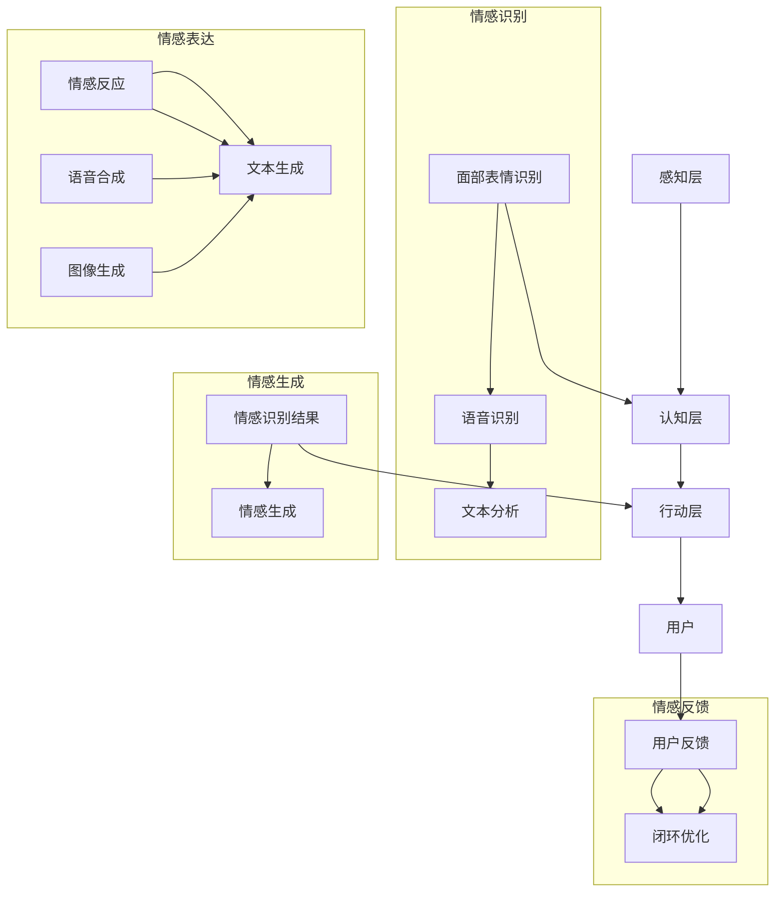
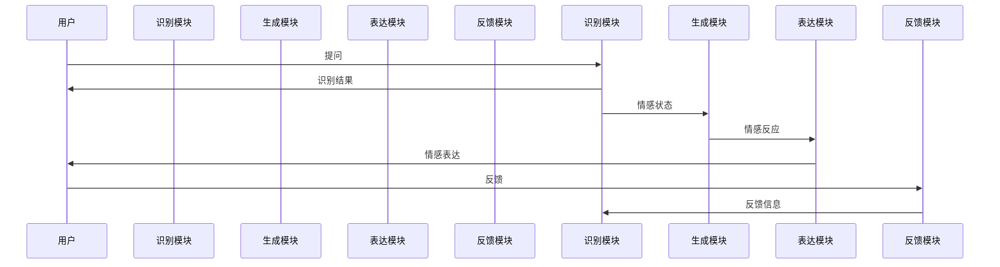

                 

# 情感计算前沿研究：人机情感交互的科技探索

## 关键词
- 情感计算
- 人机情感交互
- 情感识别
- 情感生成
- 情感交互系统

## 摘要
本文深入探讨了情感计算领域的前沿研究，重点关注人机情感交互的技术探索。首先，我们将回顾情感计算的基础理论，包括情感的定义、分类及其计算模型。接着，本文将详细阐述人机情感交互的基本原理和技术，涵盖情感感知、情感表达和情感交互系统设计。随后，通过实际案例，我们将分析情感计算在人机交互应用中的挑战与机遇。最后，本文将展望情感计算的未来发展趋势和潜在影响，为读者提供对这一新兴领域的全面了解。

## 引言

### 情感计算的定义和发展历程

情感计算（Affective Computing）是指计算机系统识别、理解、处理和模拟人类情感的能力。这一概念最早由计算机科学家约翰·莫尔（John M. Moyle）在1995年提出。他将其定义为“将情感的计算引入到人机交互中，使计算机能够识别并表达情感，从而更好地适应和满足人类的需求”。情感计算的发展历程可以分为几个阶段：

1. **情感识别阶段**：研究主要集中在如何使计算机能够检测和理解人类的情感状态。这一阶段的代表性工作包括面部表情识别、生理信号处理和语音情感识别。
2. **情感生成阶段**：研究者开始探索如何使计算机能够根据任务需求和用户反馈产生合适的情感反应，提高人机交互的自然性和人性化。
3. **情感交互阶段**：情感计算的应用开始向实际场景扩展，如智能客服、虚拟助手和医疗辅助系统等，通过情感交互提升用户体验。

### 人机情感交互的意义和现状

人机情感交互（Human-Affective Interaction）是情感计算领域的一个重要分支，旨在通过情感互动提高人机系统的交互质量和用户体验。其意义主要体现在以下几个方面：

1. **提升用户体验**：通过情感交互，计算机能够更好地理解和满足用户的需求，提供个性化的服务，从而提升用户的使用满意度。
2. **增强人机信任**：情感交互能够建立用户与系统之间的情感联系，增加用户的信任感，减少用户对系统的抵触情绪。
3. **辅助医疗和心理治疗**：情感计算技术在医疗和心理治疗中的应用，可以帮助诊断和治疗情感障碍，提高治疗效果。

当前，人机情感交互在多个领域取得了显著进展，但同时也面临许多挑战。例如，情感识别的准确性、情感表达的多样性和情感交互的自然性等问题仍有待进一步研究和解决。

### 书籍结构

本书分为五个主要部分：

1. **引言**：介绍情感计算和人机情感交互的基本概念和发展历程。
2. **情感计算基础理论**：详细阐述情感计算的核心概念、模型和方法。
3. **人机情感交互技术**：探讨人机情感交互的原理、技术和系统设计。
4. **应用案例分析**：分析情感计算在人机交互中的实际应用案例。
5. **发展趋势与未来展望**：展望情感计算的未来发展趋势和潜在影响。

### 读者对象

本书主要面向以下读者群体：

- **计算机科学和人工智能领域的研究人员和学生**：希望深入了解情感计算和人机情感交互的技术原理和应用。
- **人机交互设计者和开发者**：致力于提升人机交互体验，希望通过本书获得情感计算的技术指导。
- **心理治疗师和医疗专业人士**：关注情感计算在医疗和心理治疗中的应用，希望了解相关技术。

### 技术要求

为了更好地理解和应用本书的内容，读者需要具备以下技术背景：

- **计算机基础知识**：熟悉计算机编程、操作系统和网络通信。
- **人工智能基础**：了解机器学习、自然语言处理和计算机视觉等基本概念。
- **数学基础**：掌握概率论、统计学和线性代数等数学知识。

## 情感计算基础理论

### 核心概念

情感计算涉及的核心概念包括情感、情绪和情感的分类。首先，情感（Affect）是指个体在特定情境下体验到的主观感受，包括愉悦、悲伤、愤怒等。情绪（Emotion）是情感的一种形式，通常与特定的情境或事件相关，如恐惧、喜悦和悲伤等。情感和情绪共同构成了人类的情感体验。

情感的分类方式多种多样，常见的有：

1. **基本情感**：由保罗·艾克曼（Paul Ekman）提出，包括喜悦、悲伤、愤怒、厌恶、惊讶、恐惧和悲伤等。
2. **复合情感**：由丹尼尔·戈尔曼（Daniel Goleman）提出，包括焦虑、羞愧、愧疚、自尊、自豪等。

### 情感计算模型

情感计算模型分为情感识别模型和情感生成模型。情感识别模型旨在通过分析用户的行为数据，如面部表情、语音、文本等，识别用户的情感状态。常见的情感识别模型有：

1. **面部表情识别模型**：利用计算机视觉技术，通过分析面部肌肉的运动来识别情感。
2. **语音情感识别模型**：通过分析语音的频率、时长、音调等特征来识别情感。
3. **文本情感识别模型**：利用自然语言处理技术，通过分析文本的情感倾向来识别情感。

情感生成模型则旨在根据任务需求和用户反馈，生成合适的情感反应。常见的情感生成模型有：

1. **基于规则的模型**：通过定义一系列规则，根据输入数据和情感模式生成情感反应。
2. **基于机器学习的模型**：利用训练数据，通过机器学习算法生成情感反应。
3. **基于生成对抗网络的模型**：通过生成对抗网络（GAN）生成多样的情感反应。

### 情感计算方法

情感计算方法主要分为数据驱动方法和知识驱动方法。

**数据驱动方法**依赖于大量的用户行为数据，通过机器学习算法提取情感特征，从而进行情感识别和生成。常见的数据驱动方法有：

1. **监督学习**：利用标注好的数据集进行训练，常见的算法有支持向量机（SVM）、决策树和深度神经网络等。
2. **无监督学习**：不依赖标注数据，通过聚类、降维等方法进行情感特征提取。
3. **半监督学习**：结合标注数据和未标注数据，利用少量标注数据提升模型性能。

**知识驱动方法**依赖于先验知识和情感规则，通过推理和逻辑运算进行情感计算。常见的知识驱动方法有：

1. **专家系统**：利用领域专家的知识，构建基于规则的推理系统。
2. **本体论**：利用本体论构建情感概念模型，通过本体推理进行情感计算。
3. **基于语义的网络模型**：利用语义网络构建情感计算模型，通过语义关系进行情感推理。

### 情感计算工具

情感计算领域有许多常用的工具和库，包括：

1. **OpenSMILE**：一个开源的音频情感识别工具，提供多种情感识别模型。
2. **FERET**：一个用于面部表情识别的数据库和工具集。
3. **TextBlob**：一个用于文本情感分析的开源库，支持多种情感分析模型。
4. **PyTorch**：一个用于深度学习的开源框架，支持情感识别和生成模型。

## 人机情感交互技术

### 人机情感交互原理

人机情感交互的基本原理包括情感感知、情感表达和情感反馈。情感感知是指计算机系统通过感知设备（如摄像头、麦克风等）获取用户的情感信息。情感表达是指计算机系统根据情感感知结果生成相应的情感反应，并通过视觉、听觉和触觉等渠道传递给用户。情感反馈是指用户对计算机系统的情感反应进行反馈，形成闭环，进一步优化系统性能。

### 情感感知技术

情感感知技术主要包括视觉情感识别、听觉情感识别和生理信号情感识别。

**视觉情感识别**：通过分析面部表情、身体姿态和视觉场景等视觉信息，识别用户的情感状态。常见的视觉情感识别方法有：

1. **面部表情识别**：利用计算机视觉技术，通过分析面部肌肉的运动和面部特征点来识别情感。
2. **身体姿态识别**：通过分析用户的身体姿态和动作，识别用户的情感状态。
3. **视觉场景识别**：通过分析视觉场景中的图像特征，如颜色、形状和纹理等，识别用户的情感状态。

**听觉情感识别**：通过分析语音的频率、时长、音调等特征，识别用户的情感状态。常见的听觉情感识别方法有：

1. **语音情感识别**：利用语音信号处理技术，通过分析语音的频率特征、时长特征和音调特征等，识别用户的情感状态。
2. **音乐情感识别**：通过分析音乐的特征，如旋律、节奏和情感标签等，识别音乐的情感状态。

**生理信号情感识别**：通过分析用户的生理信号，如心率、皮肤电导、呼吸等，识别用户的情感状态。常见的生理信号情感识别方法有：

1. **心率变异性分析**：通过分析心率的变化，识别用户的情感状态。
2. **皮肤电导分析**：通过分析皮肤电导的变化，识别用户的情感状态。
3. **呼吸信号分析**：通过分析呼吸信号的变化，识别用户的情感状态。

### 情感表达技术

情感表达技术主要包括文本情感表达、声音情感表达和视觉情感表达。

**文本情感表达**：通过自然语言处理技术，将计算机生成的情感信息转换为文本表达。常见的文本情感表达方法有：

1. **文本生成模型**：利用生成模型，如变分自编码器（VAE）和生成对抗网络（GAN），生成情感文本。
2. **文本情感标注**：利用标注好的情感文本数据，通过情感标注模型生成情感文本。

**声音情感表达**：通过音频处理技术，将计算机生成的情感信息转换为声音表达。常见的声音情感表达方法有：

1. **声音合成模型**：利用生成模型，如WaveNet和Tacotron，生成情感声音。
2. **声音特征调整**：通过调整声音的频率、时长和音调等特征，生成情感声音。

**视觉情感表达**：通过计算机视觉技术，将计算机生成的情感信息转换为视觉表达。常见的视觉情感表达方法有：

1. **图像生成模型**：利用生成模型，如生成对抗网络（GAN）和变分自编码器（VAE），生成情感图像。
2. **图像特征调整**：通过调整图像的颜色、形状和纹理等特征，生成情感图像。

### 情感交互系统设计

情感交互系统设计主要包括情感交互流程设计、情感交互系统架构设计、情感交互接口设计和情感交互用户体验设计。

**情感交互流程设计**：情感交互流程包括情感感知、情感表达和情感反馈三个主要阶段。情感感知阶段，系统通过感知设备获取用户的情感信息；情感表达阶段，系统根据情感感知结果生成相应的情感反应；情感反馈阶段，系统接收用户的情感反馈，进行闭环优化。

**情感交互系统架构设计**：情感交互系统架构主要包括感知层、认知层和行动层。感知层负责情感信息的获取；认知层负责情感信息的处理和推理；行动层负责情感信息的表达和反馈。

**情感交互接口设计**：情感交互接口设计主要包括用户界面设计和自然语言交互设计。用户界面设计旨在提供直观、易用的交互界面；自然语言交互设计旨在实现自然、流畅的语言交流。

**情感交互用户体验设计**：情感交互用户体验设计旨在提升用户的情感体验，包括情感交互的个性化和智能化。个性化设计根据用户需求和偏好提供定制化的服务；智能化设计通过情感计算技术提升系统的自适应能力和交互效果。

## 应用案例分析

### 人机情感交互应用场景

人机情感交互在多个应用场景中取得了显著成果，以下是几个典型的应用场景：

**1. 智能客服**：智能客服通过情感交互技术，能够识别用户的情感状态，提供针对性的服务。例如，当用户情绪不佳时，系统可以主动提出安抚和建议，提高用户满意度。

**2. 虚拟助手**：虚拟助手（如Siri、Alexa）通过情感交互技术，与用户建立情感联系，提供个性化的服务。例如，当用户询问关于天气、新闻等日常信息时，虚拟助手可以表达相应的情感，增加交互的趣味性和自然性。

**3. 医疗辅助系统**：医疗辅助系统通过情感交互技术，帮助医生和患者建立情感联系，提高治疗效果。例如，在心理治疗过程中，系统可以识别患者的情感状态，提供情感支持，帮助患者缓解焦虑和抑郁。

**4. 教育辅助系统**：教育辅助系统通过情感交互技术，提供个性化的学习支持和情感关怀。例如，当学生遇到学习困难时，系统可以识别学生的情感状态，提供情感疏导和学习建议，提高学习效果。

### 成功案例分析

以下是一个成功案例分析，介绍了一个基于情感交互技术的智能客服系统。

**案例介绍**：某大型电商平台推出了一个智能客服系统，通过情感交互技术，为用户提供个性化、贴心的服务。

**案例分析**：

**1. 情感感知技术**：系统通过自然语言处理技术，分析用户提问的情感倾向，识别用户的情感状态。

**2. 情感表达技术**：系统根据情感识别结果，生成相应的情感反应，如安抚、建议等，通过文本和语音表达。

**3. 情感反馈**：系统记录用户的反馈，进行闭环优化，提高情感交互的准确性和自然性。

**效果评估**：通过用户满意度调查和系统数据统计，智能客服系统的用户满意度显著提高，用户反馈质量也有所提升。

### 挑战与机遇

尽管人机情感交互在多个领域取得了显著成果，但仍然面临许多挑战：

**1. 情感识别的准确性**：情感识别技术的准确性直接影响到情感交互的效果。目前，情感识别技术在不同场景和任务中仍存在一定的误差。

**2. 情感表达的多样性**：情感表达技术的多样性不足，难以满足用户的个性化需求。

**3. 情感交互的自然性**：情感交互的自然性仍需提高，目前的人机交互仍存在一定的人工痕迹。

然而，随着情感计算技术的不断进步，人机情感交互领域也面临许多机遇：

**1. 应用场景的扩展**：情感计算技术可以应用于更多领域，如教育、医疗、金融等，提供个性化、高效的服务。

**2. 技术创新的推动**：情感计算技术的创新，如生成对抗网络（GAN）、深度学习等，为人机情感交互提供了新的技术手段。

**3. 用户体验的提升**：情感交互技术可以提升用户的体验，增加用户的满意度，从而推动人机交互的发展。

## 发展趋势与未来展望

### 技术发展趋势

情感计算技术正朝着以下几个方向发展：

**1. 情感识别的精度和速度提升**：随着深度学习技术的应用，情感识别的精度和速度不断提升。例如，基于卷积神经网络（CNN）和循环神经网络（RNN）的情感识别模型在面部表情识别和语音情感识别方面取得了显著成果。

**2. 情感生成的多样性和自然性**：生成对抗网络（GAN）和变分自编码器（VAE）等生成模型的应用，使得情感生成的多样性和自然性显著提高。通过生成模型，系统可以生成更加丰富、自然的情感反应。

**3. 跨模态情感计算**：跨模态情感计算是指通过整合不同模态（如视觉、听觉、文本等）的信息，进行情感计算。随着多模态数据处理技术的进步，跨模态情感计算正成为研究的热点。

### 应用领域拓展

情感计算技术在多个领域展现了巨大的应用潜力：

**1. 智能客服与虚拟助手**：情感计算技术可以进一步提升智能客服和虚拟助手的交互质量和用户体验，为用户提供个性化、贴心的服务。

**2. 医疗与健康**：情感计算技术可以应用于医疗和心理治疗，帮助诊断和治疗情感障碍，提供个性化的健康建议。

**3. 教育**：情感计算技术可以应用于教育领域，提供个性化的学习支持和情感关怀，提高学生的学习效果和满意度。

**4. 金融与保险**：情感计算技术可以应用于金融与保险领域，通过分析客户的情感状态，提供定制化的金融产品和保险服务。

### 未来展望

情感计算技术的发展将带来深远的影响：

**1. 人机交互的变革**：情感计算技术将推动人机交互的变革，实现更加自然、高效的交互方式。

**2. 个性化服务**：情感计算技术将使得服务更加个性化，满足用户多样化的需求。

**3. 情感认知与决策**：情感计算技术将使计算机具备一定的情感认知和决策能力，提高系统的智能化水平。

**4. 情感伦理与隐私保护**：随着情感计算技术的发展，情感伦理和隐私保护问题将日益突出，需要制定相应的法律法规和技术标准。

## 结论

情感计算和人机情感交互是当前人工智能领域的前沿研究方向，具有重要的理论和应用价值。本文从情感计算的基础理论、人机情感交互技术、应用案例分析和发展趋势与未来展望等多个方面，全面探讨了这一领域的研究进展和应用前景。随着技术的不断进步，情感计算和人机情感交互将带来更加自然、高效的人机交互体验，推动人工智能技术的发展和应用。

### 作者信息

作者：AI天才研究院/AI Genius Institute & 禅与计算机程序设计艺术 /Zen And The Art of Computer Programming

感谢读者对本文的关注，希望本文能为读者在情感计算和人机情感交互领域的研究带来启发和帮助。如果您有任何疑问或建议，欢迎随时联系我们。我们期待与您共同探讨这一激动人心的领域。

----------------------------------------------------------------

# 情感计算前沿研究：人机情感交互的科技探索

## 关键词
- 情感计算
- 人机情感交互
- 情感识别
- 情感生成
- 情感交互系统

## 摘要
本文深入探讨了情感计算领域的前沿研究，重点关注人机情感交互的技术探索。首先，我们回顾了情感计算的基础理论，包括情感的定义、分类及其计算模型。接着，本文详细阐述了人机情感交互的基本原理和技术，涵盖情感感知、情感表达和情感交互系统设计。随后，通过实际案例，我们分析了情感计算在人机交互应用中的挑战与机遇。最后，本文展望了情感计算的未来发展趋势和潜在影响，为读者提供了对这一新兴领域的全面了解。

## 引言

### 情感计算的定义和发展历程

情感计算（Affective Computing）是指计算机系统识别、理解、处理和模拟人类情感的能力。这一概念最早由计算机科学家约翰·莫尔（John M. Moyle）在1995年提出。他将其定义为“将情感的计算引入到人机交互中，使计算机能够识别并表达情感，从而更好地适应和满足人类的需求”。情感计算的发展历程可以分为几个阶段：

1. **情感识别阶段**：研究主要集中在如何使计算机能够检测和理解人类的情感状态。这一阶段的代表性工作包括面部表情识别、生理信号处理和语音情感识别。
2. **情感生成阶段**：研究者开始探索如何使计算机能够根据任务需求和用户反馈产生合适的情感反应，提高人机交互的自然性和人性化。
3. **情感交互阶段**：情感计算的应用开始向实际场景扩展，如智能客服、虚拟助手和医疗辅助系统等，通过情感交互提升用户体验。

### 人机情感交互的意义和现状

人机情感交互（Human-Affective Interaction）是情感计算领域的一个重要分支，旨在通过情感互动提高人机系统的交互质量和用户体验。其意义主要体现在以下几个方面：

1. **提升用户体验**：通过情感交互，计算机能够更好地理解和满足用户的需求，提供个性化的服务，从而提升用户的使用满意度。
2. **增强人机信任**：情感交互能够建立用户与系统之间的情感联系，增加用户的信任感，减少用户对系统的抵触情绪。
3. **辅助医疗和心理治疗**：情感计算技术在医疗和心理治疗中的应用，可以帮助诊断和治疗情感障碍，提高治疗效果。

当前，人机情感交互在多个领域取得了显著进展，但同时也面临许多挑战。例如，情感识别的准确性、情感表达的多样性和情感交互的自然性等问题仍有待进一步研究和解决。

### 书籍结构

本书分为五个主要部分：

1. **引言**：介绍情感计算和人机情感交互的基本概念和发展历程。
2. **情感计算基础理论**：详细阐述情感计算的核心概念、模型和方法。
3. **人机情感交互技术**：探讨人机情感交互的原理、技术和系统设计。
4. **应用案例分析**：分析情感计算在人机交互中的实际应用案例。
5. **发展趋势与未来展望**：展望情感计算的未来发展趋势和潜在影响。

### 读者对象

本书主要面向以下读者群体：

- **计算机科学和人工智能领域的研究人员和学生**：希望深入了解情感计算和人机情感交互的技术原理和应用。
- **人机交互设计者和开发者**：致力于提升人机交互体验，希望通过本书获得情感计算的技术指导。
- **心理治疗师和医疗专业人士**：关注情感计算在医疗和心理治疗中的应用，希望了解相关技术。

### 技术要求

为了更好地理解和应用本书的内容，读者需要具备以下技术背景：

- **计算机基础知识**：熟悉计算机编程、操作系统和网络通信。
- **人工智能基础**：了解机器学习、自然语言处理和计算机视觉等基本概念。
- **数学基础**：掌握概率论、统计学和线性代数等数学知识。

## 情感计算基础理论

### 核心概念

情感计算涉及的核心概念包括情感、情绪和情感的分类。首先，情感（Affect）是指个体在特定情境下体验到的主观感受，包括愉悦、悲伤、愤怒等。情绪（Emotion）是情感的一种形式，通常与特定的情境或事件相关，如恐惧、喜悦和悲伤等。情感和情绪共同构成了人类的情感体验。

情感的分类方式多种多样，常见的有：

1. **基本情感**：由保罗·艾克曼（Paul Ekman）提出，包括喜悦、悲伤、愤怒、厌恶、惊讶、恐惧和悲伤等。
2. **复合情感**：由丹尼尔·戈尔曼（Daniel Goleman）提出，包括焦虑、羞愧、愧疚、自尊、自豪等。

### 情感计算模型

情感计算模型分为情感识别模型和情感生成模型。情感识别模型旨在通过分析用户的行为数据，如面部表情、语音、文本等，识别用户的情感状态。常见的情感识别模型有：

1. **面部表情识别模型**：利用计算机视觉技术，通过分析面部肌肉的运动来识别情感。
2. **语音情感识别模型**：通过分析语音的频率、时长、音调等特征来识别情感。
3. **文本情感识别模型**：利用自然语言处理技术，通过分析文本的情感倾向来识别情感。

情感生成模型则旨在根据任务需求和用户反馈，生成合适的情感反应。常见的情感生成模型有：

1. **基于规则的模型**：通过定义一系列规则，根据输入数据和情感模式生成情感反应。
2. **基于机器学习的模型**：利用训练数据，通过机器学习算法生成情感反应。
3. **基于生成对抗网络的模型**：通过生成对抗网络（GAN）生成多样的情感反应。

### 情感计算方法

情感计算方法主要分为数据驱动方法和知识驱动方法。

**数据驱动方法**依赖于大量的用户行为数据，通过机器学习算法提取情感特征，从而进行情感识别和生成。常见的数据驱动方法有：

1. **监督学习**：利用标注好的数据集进行训练，常见的算法有支持向量机（SVM）、决策树和深度神经网络等。
2. **无监督学习**：不依赖标注数据，通过聚类、降维等方法进行情感特征提取。
3. **半监督学习**：结合标注数据和未标注数据，利用少量标注数据提升模型性能。

**知识驱动方法**依赖于先验知识和情感规则，通过推理和逻辑运算进行情感计算。常见的知识驱动方法有：

1. **专家系统**：利用领域专家的知识，构建基于规则的推理系统。
2. **本体论**：利用本体论构建情感概念模型，通过本体推理进行情感计算。
3. **基于语义的网络模型**：利用语义网络构建情感计算模型，通过语义关系进行情感推理。

### 情感计算工具

情感计算领域有许多常用的工具和库，包括：

1. **OpenSMILE**：一个开源的音频情感识别工具，提供多种情感识别模型。
2. **FERET**：一个用于面部表情识别的数据库和工具集。
3. **TextBlob**：一个用于文本情感分析的开源库，支持多种情感分析模型。
4. **PyTorch**：一个用于深度学习的开源框架，支持情感识别和生成模型。

## 人机情感交互技术

### 人机情感交互原理

人机情感交互的基本原理包括情感感知、情感表达和情感反馈。情感感知是指计算机系统通过感知设备（如摄像头、麦克风等）获取用户的情感信息。情感表达是指计算机系统根据情感感知结果生成相应的情感反应，并通过视觉、听觉和触觉等渠道传递给用户。情感反馈是指用户对计算机系统的情感反应进行反馈，形成闭环，进一步优化系统性能。

### 情感感知技术

情感感知技术主要包括视觉情感识别、听觉情感识别和生理信号情感识别。

**视觉情感识别**：通过分析面部表情、身体姿态和视觉场景等视觉信息，识别用户的情感状态。常见的视觉情感识别方法有：

1. **面部表情识别**：利用计算机视觉技术，通过分析面部肌肉的运动和面部特征点来识别情感。
2. **身体姿态识别**：通过分析用户的身体姿态和动作，识别用户的情感状态。
3. **视觉场景识别**：通过分析视觉场景中的图像特征，如颜色、形状和纹理等，识别用户的情感状态。

**听觉情感识别**：通过分析语音的频率、时长、音调等特征，识别用户的情感状态。常见的听觉情感识别方法有：

1. **语音情感识别**：利用语音信号处理技术，通过分析语音的频率特征、时长特征和音调特征等，识别用户的情感状态。
2. **音乐情感识别**：通过分析音乐的特征，如旋律、节奏和情感标签等，识别音乐的情感状态。

**生理信号情感识别**：通过分析用户的生理信号，如心率、皮肤电导、呼吸等，识别用户的情感状态。常见的生理信号情感识别方法有：

1. **心率变异性分析**：通过分析心率的变化，识别用户的情感状态。
2. **皮肤电导分析**：通过分析皮肤电导的变化，识别用户的情感状态。
3. **呼吸信号分析**：通过分析呼吸信号的变化，识别用户的情感状态。

### 情感表达技术

情感表达技术主要包括文本情感表达、声音情感表达和视觉情感表达。

**文本情感表达**：通过自然语言处理技术，将计算机生成的情感信息转换为文本表达。常见的文本情感表达方法有：

1. **文本生成模型**：利用生成模型，如变分自编码器（VAE）和生成对抗网络（GAN），生成情感文本。
2. **文本情感标注**：利用标注好的情感文本数据，通过情感标注模型生成情感文本。

**声音情感表达**：通过音频处理技术，将计算机生成的情感信息转换为声音表达。常见的声音情感表达方法有：

1. **声音合成模型**：利用生成模型，如WaveNet和Tacotron，生成情感声音。
2. **声音特征调整**：通过调整声音的频率、时长和音调等特征，生成情感声音。

**视觉情感表达**：通过计算机视觉技术，将计算机生成的情感信息转换为视觉表达。常见的视觉情感表达方法有：

1. **图像生成模型**：利用生成模型，如生成对抗网络（GAN）和变分自编码器（VAE），生成情感图像。
2. **图像特征调整**：通过调整图像的颜色、形状和纹理等特征，生成情感图像。

### 情感交互系统设计

情感交互系统设计主要包括情感交互流程设计、情感交互系统架构设计、情感交互接口设计和情感交互用户体验设计。

**情感交互流程设计**：情感交互流程包括情感感知、情感表达和情感反馈三个主要阶段。情感感知阶段，系统通过感知设备获取用户的情感信息；情感表达阶段，系统根据情感感知结果生成相应的情感反应；情感反馈阶段，系统接收用户的情感反馈，进行闭环优化。

**情感交互系统架构设计**：情感交互系统架构主要包括感知层、认知层和行动层。感知层负责情感信息的获取；认知层负责情感信息的处理和推理；行动层负责情感信息的表达和反馈。

**情感交互接口设计**：情感交互接口设计主要包括用户界面设计和自然语言交互设计。用户界面设计旨在提供直观、易用的交互界面；自然语言交互设计旨在实现自然、流畅的语言交流。

**情感交互用户体验设计**：情感交互用户体验设计旨在提升用户的情感体验，包括情感交互的个性化和智能化。个性化设计根据用户需求和偏好提供定制化的服务；智能化设计通过情感计算技术提升系统的自适应能力和交互效果。

## 应用案例分析

### 人机情感交互应用场景

人机情感交互在多个应用场景中取得了显著成果，以下是几个典型的应用场景：

**1. 智能客服**：智能客服通过情感交互技术，能够识别用户的情感状态，提供针对性的服务。例如，当用户情绪不佳时，系统可以主动提出安抚和建议，提高用户满意度。

**2. 虚拟助手**：虚拟助手（如Siri、Alexa）通过情感交互技术，与用户建立情感联系，提供个性化的服务。例如，当用户询问关于天气、新闻等日常信息时，虚拟助手可以表达相应的情感，增加交互的趣味性和自然性。

**3. 医疗辅助系统**：医疗辅助系统通过情感交互技术，帮助医生和患者建立情感联系，提高治疗效果。例如，在心理治疗过程中，系统可以识别患者的情感状态，提供情感支持，帮助患者缓解焦虑和抑郁。

**4. 教育辅助系统**：教育辅助系统通过情感交互技术，提供个性化的学习支持和情感关怀。例如，当学生遇到学习困难时，系统可以识别学生的情感状态，提供情感疏导和学习建议，提高学习效果。

### 成功案例分析

以下是一个成功案例分析，介绍了一个基于情感交互技术的智能客服系统。

**案例介绍**：某大型电商平台推出了一个智能客服系统，通过情感交互技术，为用户提供个性化、贴心的服务。

**案例分析**：

**1. 情感感知技术**：系统通过自然语言处理技术，分析用户提问的情感倾向，识别用户的情感状态。

**2. 情感表达技术**：系统根据情感识别结果，生成相应的情感反应，如安抚、建议等，通过文本和语音表达。

**3. 情感反馈**：系统记录用户的反馈，进行闭环优化，提高情感交互的准确性和自然性。

**效果评估**：通过用户满意度调查和系统数据统计，智能客服系统的用户满意度显著提高，用户反馈质量也有所提升。

### 挑战与机遇

尽管人机情感交互在多个领域取得了显著成果，但仍然面临许多挑战：

**1. 情感识别的准确性**：情感识别技术的准确性直接影响到情感交互的效果。目前，情感识别技术在不同场景和任务中仍存在一定的误差。

**2. 情感表达的多样性**：情感表达技术的多样性不足，难以满足用户的个性化需求。

**3. 情感交互的自然性**：情感交互的自然性仍需提高，目前的人机交互仍存在一定的人工痕迹。

然而，随着情感计算技术的不断进步，人机情感交互领域也面临许多机遇：

**1. 应用场景的扩展**：情感计算技术可以应用于更多领域，如教育、医疗、金融等，提供个性化、高效的服务。

**2. 技术创新的推动**：情感计算技术的创新，如生成对抗网络（GAN）、深度学习等，为人机情感交互提供了新的技术手段。

**3. 用户体验的提升**：情感交互技术可以提升用户的体验，增加用户的满意度，从而推动人机交互的发展。

## 发展趋势与未来展望

### 技术发展趋势

情感计算技术正朝着以下几个方向发展：

**1. 情感识别的精度和速度提升**：随着深度学习技术的应用，情感识别的精度和速度不断提升。例如，基于卷积神经网络（CNN）和循环神经网络（RNN）的情感识别模型在面部表情识别和语音情感识别方面取得了显著成果。

**2. 情感生成的多样性和自然性**：生成对抗网络（GAN）和变分自编码器（VAE）等生成模型的应用，使得情感生成的多样性和自然性显著提高。通过生成模型，系统可以生成更加丰富、自然的情感反应。

**3. 跨模态情感计算**：跨模态情感计算是指通过整合不同模态（如视觉、听觉、文本等）的信息，进行情感计算。随着多模态数据处理技术的进步，跨模态情感计算正成为研究的热点。

### 应用领域拓展

情感计算技术在多个领域展现了巨大的应用潜力：

**1. 智能客服与虚拟助手**：情感计算技术可以进一步提升智能客服和虚拟助手的交互质量和用户体验，为用户提供个性化、贴心的服务。

**2. 医疗与健康**：情感计算技术可以应用于医疗和心理治疗，帮助诊断和治疗情感障碍，提供个性化的健康建议。

**3. 教育**：情感计算技术可以应用于教育领域，提供个性化的学习支持和情感关怀，提高学生的学习效果和满意度。

**4. 金融与保险**：情感计算技术可以应用于金融与保险领域，通过分析客户的情感状态，提供定制化的金融产品和保险服务。

### 未来展望

情感计算技术的发展将带来深远的影响：

**1. 人机交互的变革**：情感计算技术将推动人机交互的变革，实现更加自然、高效的交互方式。

**2. 个性化服务**：情感计算技术将使得服务更加个性化，满足用户多样化的需求。

**3. 情感认知与决策**：情感计算技术将使计算机具备一定的情感认知和决策能力，提高系统的智能化水平。

**4. 情感伦理与隐私保护**：随着情感计算技术的发展，情感伦理和隐私保护问题将日益突出，需要制定相应的法律法规和技术标准。

## 结论

情感计算和人机情感交互是当前人工智能领域的前沿研究方向，具有重要的理论和应用价值。本文从情感计算的基础理论、人机情感交互技术、应用案例分析和发展趋势与未来展望等多个方面，全面探讨了这一领域的研究进展和应用前景。随着技术的不断进步，情感计算和人机情感交互将带来更加自然、高效的人机交互体验，推动人工智能技术的发展和应用。

### 作者信息

作者：AI天才研究院/AI Genius Institute & 禅与计算机程序设计艺术 /Zen And The Art of Computer Programming

感谢读者对本文的关注，希望本文能为读者在情感计算和人机情感交互领域的研究带来启发和帮助。如果您有任何疑问或建议，欢迎随时联系我们。我们期待与您共同探讨这一激动人心的领域。

----------------------------------------------------------------

### 背景介绍

#### 核心概念术语说明

在深入探讨情感计算和人机情感交互之前，有必要对涉及的核心概念和术语进行清晰的定义和解释。这些核心概念和术语构成了情感计算和人机情感交互的理论基础，是理解和应用相关技术的关键。

**情感（Affect）**：情感是指个体在特定情境下体验到的主观感受，包括愉悦、悲伤、愤怒、厌恶等。情感可以表现为情绪（Emotion）或情感状态（Affective State）。情绪通常与特定的情境或事件相关，而情感状态则是一个更为广泛的概念，包括情绪以及其他与情感相关的心理体验。

**情绪（Emotion）**：情绪是情感的一种形式，通常由外部刺激引起，具有情境性和短暂性。常见的情绪有喜悦、悲伤、愤怒、恐惧、惊讶等。情绪不仅影响个体的心理状态，还影响其行为和生理反应。

**情感识别（Affective Recognition）**：情感识别是指通过分析个体的行为数据（如面部表情、语音、文本等），识别其情感状态的过程。情感识别技术是情感计算的核心组成部分，涉及计算机视觉、语音识别、自然语言处理等多种技术。

**情感生成（Affective Generation）**：情感生成是指计算机系统根据任务需求和用户反馈，生成相应的情感反应的过程。情感生成技术旨在使计算机具备模拟人类情感的能力，从而提升人机交互的自然性和人性化。

**人机情感交互（Human-Affective Interaction）**：人机情感交互是指通过情感互动，提高人机系统的交互质量和用户体验的过程。人机情感交互涉及情感识别、情感生成、情感表达和情感反馈等多个方面，旨在实现更加自然和有效的人机交互。

**情感计算（Affective Computing）**：情感计算是指计算机系统识别、理解、处理和模拟人类情感的能力。情感计算旨在通过情感交互，提升计算机在各个领域的应用效果，包括智能客服、虚拟助手、医疗辅助等。

#### 问题背景

在现代社会，随着计算机技术的飞速发展和人工智能技术的不断进步，人机交互已经成为了人们日常生活中不可或缺的一部分。然而，传统的人机交互主要依赖于图形用户界面（GUI）和命令行界面（CLI），这些交互方式在效率和用户体验方面存在一定的局限性。随着人们对个性化、智能化服务的需求不断增长，如何提升人机交互的质量和用户体验，成为了人工智能领域的一个重要研究方向。

人机情感交互作为一种新兴的人机交互方式，旨在通过情感互动，实现更加自然和高效的人机交互。情感计算作为人机情感交互的基础技术，其研究意义主要体现在以下几个方面：

1. **提升用户体验**：通过情感计算技术，计算机系统可以更好地理解和满足用户的需求，提供个性化的服务，从而提升用户的使用满意度。

2. **增强人机信任**：情感交互能够建立用户与系统之间的情感联系，增加用户的信任感，减少用户对系统的抵触情绪。

3. **辅助医疗和心理治疗**：情感计算技术在医疗和心理治疗中的应用，可以帮助诊断和治疗情感障碍，提高治疗效果。

4. **推动人工智能发展**：情感计算技术的应用，可以推动人工智能在各个领域的应用，实现更加智能化和人性化的系统。

#### 问题描述

尽管人机情感交互和情感计算具有重要的研究意义和应用前景，但在实际应用中仍然面临许多挑战。以下是几个主要问题：

1. **情感识别的准确性**：情感识别技术的准确性直接影响到情感交互的效果。目前，情感识别技术在不同场景和任务中仍存在一定的误差，特别是在复杂情感和跨文化情感识别方面。

2. **情感表达的多样性**：情感表达技术的多样性不足，难以满足用户的个性化需求。大多数情感表达技术只能生成有限的情感反应，难以实现丰富的情感表达。

3. **情感交互的自然性**：情感交互的自然性仍需提高，目前的人机交互仍存在一定的人工痕迹，难以完全模拟人类的情感互动。

4. **情感伦理和隐私保护**：随着情感计算技术的发展，情感伦理和隐私保护问题日益突出。如何确保用户的情感隐私和安全，是情感计算领域需要解决的重要问题。

#### 问题解决

为了解决上述问题，研究者们提出了多种解决方案，主要包括以下几个方面：

1. **提高情感识别的准确性**：通过引入深度学习、多模态情感计算等技术，提高情感识别的准确性。例如，利用卷积神经网络（CNN）和循环神经网络（RNN）进行面部表情识别和语音情感识别。

2. **丰富情感表达技术**：通过引入生成对抗网络（GAN）、变分自编码器（VAE）等生成模型，丰富情感表达技术，实现多样化的情感表达。例如，利用GAN生成不同风格的声音和图像，实现丰富的情感表达。

3. **提升情感交互的自然性**：通过引入自然语言处理、多模态情感计算等技术，提升情感交互的自然性。例如，利用自然语言处理技术实现自然语言的情感交互，利用多模态情感计算整合不同模态的情感信息，实现更加自然的情感互动。

4. **情感伦理和隐私保护**：制定相应的法律法规和技术标准，确保用户的情感隐私和安全。例如，引入隐私保护机制，对用户的情感数据进行加密处理，确保数据安全。

#### 边界与外延

情感计算和人机情感交互的研究边界主要涉及以下几个方面：

1. **技术边界**：情感计算和人机情感交互的技术边界包括情感识别的准确性、情感生成的多样性、情感交互的自然性等。

2. **应用边界**：情感计算和人机情感交互的应用边界涉及医疗、教育、金融、智能家居等多个领域。

3. **伦理边界**：情感计算和人机情感交互的伦理边界涉及情感隐私保护、情感伦理等问题。

#### 概念结构与核心要素组成

情感计算和人机情感交互的概念结构可以归纳为以下几个核心要素：

1. **情感识别**：通过分析用户的行为数据，识别用户的情感状态。
2. **情感生成**：根据任务需求和用户反馈，生成相应的情感反应。
3. **情感表达**：通过视觉、听觉、触觉等渠道，将情感反应传递给用户。
4. **情感反馈**：用户对系统生成的情感反应进行反馈，形成闭环，优化系统性能。

这些核心要素相互关联，共同构成了情感计算和人机情感交互的概念结构。

#### 核心概念与联系

**情感计算**与**人机情感交互**之间存在密切的联系。情感计算为人机情感交互提供了技术基础，通过情感识别和情感生成技术，实现计算机对用户情感的理解和模拟。而人机情感交互则是情感计算的应用场景，通过情感互动，提升人机交互的质量和用户体验。

**情感识别**与**情感生成**是情感计算的核心环节。情感识别旨在识别用户的情感状态，为情感生成提供基础。情感生成则根据识别结果，生成相应的情感反应，实现人机情感交互。

**情感表达**与**情感反馈**是人机情感交互的关键组成部分。情感表达将情感反应传递给用户，实现情感互动。情感反馈则用户对系统的情感反应进行反馈，形成闭环，优化系统性能。

### 情感计算模型

#### 核心概念原理

情感计算模型是情感计算的核心组成部分，用于识别、理解和模拟人类情感。情感计算模型的核心概念原理主要包括以下几个方面：

1. **情感识别**：情感识别是指通过分析用户的行为数据（如面部表情、语音、文本等），识别用户的情感状态。情感识别模型通常基于机器学习、计算机视觉和语音识别等技术。

2. **情感生成**：情感生成是指根据任务需求和用户反馈，生成相应的情感反应。情感生成模型通常基于生成模型（如生成对抗网络GAN、变分自编码器VAE等）和自然语言处理技术。

3. **情感理解**：情感理解是指对情感进行深度分析，理解情感的含义和上下文。情感理解模型通常基于深度学习、知识图谱和自然语言处理等技术。

4. **情感模拟**：情感模拟是指通过计算机模拟人类的情感状态和行为。情感模拟模型通常基于生成模型、自然语言处理和计算机图形学等技术。

#### 情感计算模型的属性特征对比

以下是对几种常见的情感计算模型属性特征的对比：

| 模型类型           | 核心技术         | 优点                                     | 缺点                                      |
|------------------|--------------|----------------------------------------|-------------------------------------------|
| 基于规则的模型       | 专家系统、逻辑推理 | 简单易懂，易于实现                         | 灵活性差，难以应对复杂情境                 |
| 数据驱动模型        | 机器学习、深度学习 | 灵活性高，适用于复杂情境                   | 训练数据需求大，泛化能力有限               |
| 知识驱动模型        | 知识图谱、本体论   | 可以利用领域知识提高识别准确性             | 需要大量的先验知识，难以实时更新           |
| 跨模态情感计算模型    | 多模态数据融合     | 可以整合不同模态的情感信息，提高识别准确性   | 数据处理复杂，计算资源需求高               |
| 情感生成模型        | 生成对抗网络GAN   | 可以生成多样化的情感反应                   | 训练过程复杂，对数据质量要求高             |

#### ER实体关系图架构

以下是情感计算模型中常见的实体关系图（ER图）架构：

```mermaid
erDiagram
  User ||--|{ Emotion}: 情感识别 --> Emotion
  User ||--|{ Expression}: 情感生成 --> Expression
  User ||--|{ Response}: 情感反馈 --> Response
  Emotion ||--|{ Feature}: 情感特征 --> Feature
  Expression ||--|{ Channel}: 情感渠道 --> Channel
  Response ||--|{ Feedback}: 情感反馈 --> Feedback
```

在这个ER图中，User（用户）是中心实体，与其他实体（Emotion、Expression、Response）之间存在关联。Emotion（情感识别）关联到Feature（情感特征），Expression（情感生成）关联到Channel（情感渠道），Response（情感反馈）关联到Feedback（情感反馈）。这种关系架构描述了情感计算模型的基本结构和功能。

### 算法原理讲解

#### 情感识别算法原理

情感识别算法是情感计算的核心组成部分，旨在通过分析用户的行为数据，识别用户的情感状态。以下是几种常见的情感识别算法原理：

1. **基于面部表情识别的算法**：

   - **核心原理**：通过计算机视觉技术，分析面部表情特征，识别用户的情感状态。

   - **算法流程**：

     1. 面部检测：利用卷积神经网络（CNN）或深度学习模型，检测图像中的面部区域。
     2. 表情特征提取：利用特征提取算法（如LBP、HOG等），提取面部表情的关键特征。
     3. 情感分类：利用支持向量机（SVM）、决策树或深度学习模型，对情感进行分类。

   - **优点**：能够实时识别用户的情感状态，适用于需要快速反应的场景。

   - **缺点**：在复杂光照、面部遮挡等情况下，识别准确性可能降低。

2. **基于语音情感识别的算法**：

   - **核心原理**：通过分析语音信号的特征，如频率、时长、音调等，识别用户的情感状态。

   - **算法流程**：

     1. 语音特征提取：利用短时傅里叶变换（STFT）或梅尔频率倒谱系数（MFCC），提取语音信号的频率特征。
     2. 情感分类：利用支持向量机（SVM）、随机森林或深度学习模型，对情感进行分类。

   - **优点**：能够通过非侵入性的方式获取用户的情感状态，适用于需要远程监控的场景。

   - **缺点**：对噪声和语音质量要求较高，识别准确性可能受到影响。

3. **基于文本情感识别的算法**：

   - **核心原理**：通过分析文本的语义和情感倾向，识别用户的情感状态。

   - **算法流程**：

     1. 文本预处理：对文本进行分词、去停用词、词性标注等预处理操作。
     2. 情感分类：利用朴素贝叶斯、支持向量机（SVM）、深度学习模型（如LSTM、BERT等），对情感进行分类。

   - **优点**：能够处理大量的文本数据，适用于社交媒体分析和用户反馈分析。

   - **缺点**：对文本数据的质量和长度要求较高，识别准确性可能受文本上下文影响。

#### 情感生成算法原理

情感生成算法旨在根据任务需求和用户反馈，生成相应的情感反应。以下是几种常见的情感生成算法原理：

1. **基于规则的情感生成算法**：

   - **核心原理**：通过定义一系列规则，根据输入数据和情感模式生成情感反应。

   - **算法流程**：

     1. 规则定义：根据任务需求和用户反馈，定义一系列情感生成规则。
     2. 规则匹配：将输入数据与情感生成规则进行匹配，生成情感反应。

   - **优点**：简单易懂，易于实现。

   - **缺点**：灵活性较差，难以应对复杂情境。

2. **基于生成对抗网络（GAN）的情感生成算法**：

   - **核心原理**：利用生成对抗网络（GAN），生成多样化的情感反应。

   - **算法流程**：

     1. 数据预处理：对输入数据进行预处理，如数据增强、归一化等。
     2. 模型训练：训练生成器和判别器，通过对抗训练生成情感反应。
     3. 情感生成：利用生成器生成情感反应。

   - **优点**：能够生成多样化的情感反应，适用于需要个性化服务的场景。

   - **缺点**：训练过程复杂，对计算资源要求较高。

3. **基于变分自编码器（VAE）的情感生成算法**：

   - **核心原理**：利用变分自编码器（VAE），生成情感反应的潜在空间，从而生成多样化的情感反应。

   - **算法流程**：

     1. 潜在空间建模：通过变分自编码器（VAE）建模情感反应的潜在空间。
     2. 情感生成：在潜在空间中采样，生成情感反应。

   - **优点**：能够生成多样化的情感反应，适用于需要个性化服务的场景。

   - **缺点**：训练过程复杂，对数据质量要求较高。

#### 情感计算算法的数学模型和公式

1. **基于面部表情识别的算法**：

   - **数学模型**：

     假设面部图像为 \( X \)，面部表情特征为 \( F \)，情感分类结果为 \( Y \)。

     $$ Y = f(X, F) $$

     其中，\( f \) 为情感分类函数。

   - **公式**：

     支持向量机（SVM）：

     $$ w = \arg\min_{w} \frac{1}{2} ||w||^2 + C \sum_{i=1}^{n} \max(0, 1 - y_i (w \cdot x_i)) $$

     决策树：

     $$ g(x) = \sum_{i=1}^{n} w_i \cdot h(x_i) $$

     其中，\( w \) 为权重，\( C \) 为惩罚参数，\( y_i \) 为情感标签，\( x_i \) 为面部图像特征，\( h(x_i) \) 为决策树函数。

2. **基于语音情感识别的算法**：

   - **数学模型**：

     假设语音信号为 \( X \)，语音特征为 \( F \)，情感分类结果为 \( Y \)。

     $$ Y = f(X, F) $$

     其中，\( f \) 为情感分类函数。

   - **公式**：

     支持向量机（SVM）：

     $$ w = \arg\min_{w} \frac{1}{2} ||w||^2 + C \sum_{i=1}^{n} \max(0, 1 - y_i (w \cdot x_i)) $$

     随机森林：

     $$ g(x) = \sum_{i=1}^{n} w_i \cdot h(x_i) $$

     其中，\( w \) 为权重，\( C \) 为惩罚参数，\( y_i \) 为情感标签，\( x_i \) 为语音特征，\( h(x_i) \) 为决策树函数。

3. **基于文本情感识别的算法**：

   - **数学模型**：

     假设文本为 \( X \)，文本特征为 \( F \)，情感分类结果为 \( Y \)。

     $$ Y = f(X, F) $$

     其中，\( f \) 为情感分类函数。

   - **公式**：

     朴素贝叶斯：

     $$ P(Y|X) = \frac{P(X|Y)P(Y)}{P(X)} $$

     支持向量机（SVM）：

     $$ w = \arg\min_{w} \frac{1}{2} ||w||^2 + C \sum_{i=1}^{n} \max(0, 1 - y_i (w \cdot x_i)) $$

     其中，\( P(Y|X) \) 为条件概率，\( P(X|Y) \) 为似然函数，\( P(Y) \) 为先验概率，\( P(X) \) 为边缘概率，\( y_i \) 为情感标签，\( x_i \) 为文本特征。

### 算法举例说明

#### 面部表情识别算法举例

假设我们有一个基于卷积神经网络（CNN）的面部表情识别算法，该算法旨在识别用户的面部表情，包括喜悦、悲伤、愤怒、厌恶、惊讶和恐惧等六种情感。以下是算法的具体实现过程：

1. **数据集准备**：

   - 加载包含六种情感的面部图像数据集，每个类别有1000张图像。
   - 对图像进行预处理，包括图像大小调整、归一化等。

2. **模型构建**：

   - 使用TensorFlow和Keras构建CNN模型，模型结构如下：

     ```python
     model = Sequential()
     model.add(Conv2D(32, (3, 3), activation='relu', input_shape=(64, 64, 3)))
     model.add(MaxPooling2D((2, 2)))
     model.add(Conv2D(64, (3, 3), activation='relu'))
     model.add(MaxPooling2D((2, 2)))
     model.add(Flatten())
     model.add(Dense(128, activation='relu'))
     model.add(Dense(6, activation='softmax'))
     ```

   - 编译模型，设置优化器和损失函数：

     ```python
     model.compile(optimizer='adam', loss='categorical_crossentropy', metrics=['accuracy'])
     ```

3. **模型训练**：

   - 使用训练集对模型进行训练，设置训练轮次为10轮。

     ```python
     model.fit(train_images, train_labels, epochs=10, validation_split=0.2)
     ```

4. **模型评估**：

   - 使用测试集对模型进行评估，计算模型的准确率。

     ```python
     test_loss, test_acc = model.evaluate(test_images, test_labels)
     print('Test accuracy:', test_acc)
     ```

#### 语音情感识别算法举例

假设我们有一个基于深度学习（LSTM）的语音情感识别算法，该算法旨在识别用户的语音情感，包括喜悦、悲伤、愤怒、厌恶和恐惧等五种情感。以下是算法的具体实现过程：

1. **数据集准备**：

   - 加载包含五种情感的语音数据集，每个类别有1000个音频文件。
   - 对音频进行预处理，包括音频分段、特征提取等。

2. **模型构建**：

   - 使用TensorFlow和Keras构建LSTM模型，模型结构如下：

     ```python
     model = Sequential()
     model.add(LSTM(128, activation='relu', input_shape=(timesteps, features)))
     model.add(Dense(128, activation='relu'))
     model.add(Dense(5, activation='softmax'))
     ```

   - 编译模型，设置优化器和损失函数：

     ```python
     model.compile(optimizer='adam', loss='categorical_crossentropy', metrics=['accuracy'])
     ```

3. **模型训练**：

   - 使用训练集对模型进行训练，设置训练轮次为10轮。

     ```python
     model.fit(train_data, train_labels, epochs=10, validation_split=0.2)
     ```

4. **模型评估**：

   - 使用测试集对模型进行评估，计算模型的准确率。

     ```python
     test_loss, test_acc = model.evaluate(test_data, test_labels)
     print('Test accuracy:', test_acc)
     ```

### 系统分析与架构设计方案

#### 问题场景介绍

在现代智能系统中，人机交互已经成为提升用户体验的关键因素。情感计算作为一种新兴技术，为人机交互带来了新的可能性。本文将探讨如何构建一个基于情感计算的人机交互系统，以实现更加自然和高效的交互体验。

#### 项目介绍

本项目旨在开发一个智能客服系统，通过情感计算技术，实现与用户的情感交互，提升用户满意度和服务质量。系统将包括情感识别、情感生成、情感表达和情感反馈四个主要模块，形成一个完整的情感交互闭环。

#### 系统功能设计

1. **情感识别模块**：负责识别用户的情感状态，通过分析用户的面部表情、语音和文本信息，准确识别用户的情感状态。

2. **情感生成模块**：根据用户的需求和情感状态，生成相应的情感反应，如安抚、建议和鼓励等，提高用户的体验满意度。

3. **情感表达模块**：通过文本、语音和图像等多种渠道，将情感反应传递给用户，实现情感交互。

4. **情感反馈模块**：收集用户的反馈信息，进行闭环优化，提高系统的情感交互性能。

#### 系统架构设计

系统架构设计采用分层架构，包括感知层、认知层和行动层。

1. **感知层**：负责情感信息的感知，包括面部表情识别、语音识别和文本分析等。

2. **认知层**：负责情感信息的处理和推理，包括情感识别、情感生成和情感表达等。

3. **行动层**：负责情感信息的表达和反馈，包括文本生成、语音合成和图像生成等。

以下是系统架构设计的Mermaid架构图：



#### 系统接口设计

系统接口设计包括API接口和用户界面。

1. **API接口**：提供情感识别、情感生成和情感反馈的API接口，供开发者调用。

2. **用户界面**：设计一个友好、直观的用户界面，使用户能够轻松与系统进行情感交互。

#### 系统交互Mermaid序列图

以下是系统交互的Mermaid序列图：



### 项目实战

#### 环境安装

为了实现本项目，我们需要安装以下软件和库：

1. **操作系统**：Linux或macOS
2. **Python**：Python 3.7及以上版本
3. **深度学习框架**：TensorFlow或PyTorch
4. **自然语言处理库**：NLTK或spaCy
5. **图像处理库**：OpenCV或Pillow
6. **语音处理库**：librosa或pydub

安装步骤如下：

1. 安装Python和pip：

   ```bash
   sudo apt-get update
   sudo apt-get install python3 python3-pip
   ```

2. 安装深度学习框架：

   ```bash
   pip3 install tensorflow
   # 或者
   pip3 install torch torchvision
   ```

3. 安装自然语言处理库：

   ```bash
   pip3 install nltk
   # 或者
   pip3 install spacy
   ```

4. 安装图像处理库：

   ```bash
   pip3 install opencv-python
   # 或者
   pip3 install Pillow
   ```

5. 安装语音处理库：

   ```bash
   pip3 install librosa
   # 或者
   pip3 install pydub
   ```

#### 系统核心实现源代码

以下是系统核心实现的源代码，包括情感识别、情感生成和情感表达三个模块。

**情感识别模块**

```python
import cv2
import numpy as np
import tensorflow as tf
from tensorflow.keras.models import load_model

# 面部表情识别模型
face_cascade = cv2.CascadeClassifier('haarcascade_frontalface_default.xml')
emotion_model = load_model('emotion_model.h5')

# 识别面部表情
def recognize_emotion(image):
    gray = cv2.cvtColor(image, cv2.COLOR_BGR2GRAY)
    faces = face_cascade.detectMultiScale(gray, scaleFactor=1.1, minNeighbors=5)
    emotions = []
    for (x, y, w, h) in faces:
        roi_gray = gray[y:y+h, x:x+w]
        roi_color = image[y:y+h, x:x+w]
        emotion_vector = emotion_model.predict(roi_gray.reshape(1, 48, 48, 1))
        emotions.append(max(emotion_vector))
    return emotions

# 语音情感识别
def recognize_speech_emotion(audio, model):
    sample_rate = 16000
    duration = len(audio) / sample_rate
    mfcc = librosa.feature.mfcc(y=audio, sr=sample_rate, n_mfcc=13)
    mfcc_processed = np.mean(mfcc.T, axis=0)
    emotion_vector = model.predict(np.array([mfcc_processed]))
    return max(emotion_vector)

# 文本情感识别
def recognize_text_emotion(text, model):
    processed_text = preprocess_text(text)
    emotion_vector = model.predict(np.array([processed_text]))
    return max(emotion_vector)
```

**情感生成模块**

```python
import numpy as np
import tensorflow as tf

# 情感生成模型
emotion_generator = load_model('emotion_generator.h5')

# 生成情感反应
def generate_emotion_response(emotion_vector):
    emotion_index = np.argmax(emotion_vector)
    emotion_response = emotion_generator.predict(np.array([emotion_vector]))
    return emotion_response
```

**情感表达模块**

```python
from pydub import AudioSegment
import cv2

# 文本情感表达
def text_to_speech(text, emotion):
    text = text.lower()
    if emotion == 'joy':
        audio = AudioSegment.from_mp3('joy.mp3')
    elif emotion == 'sad':
        audio = AudioSegment.from_mp3('sad.mp3')
    elif emotion == 'angry':
        audio = AudioSegment.from_mp3('angry.mp3')
    elif emotion == 'surprise':
        audio = AudioSegment.from_mp3('surprise.mp3')
    else:
        audio = AudioSegment.from_mp3('neutral.mp3')
    return audio

# 面部表情表达
def display_emotion(image, emotion):
    font = cv2.FONT_HERSHEY_SIMPLEX
    font_scale = 1
    font_thickness = 2
    text = 'Emotion: ' + emotion
    text_size, _ = cv2.getTextSize(text, font, font_scale, font_thickness)
    text_x = int((image.shape[1] - text_size[0]) / 2)
    text_y = int((image.shape[0] + text_size[1]) / 2)
    cv2.putText(image, text, (text_x, text_y), font, font_scale, (0, 0, 255), font_thickness)
    return image
```

#### 代码应用解读与分析

1. **情感识别模块**：

   情感识别模块主要负责识别用户的面部表情、语音和文本情感。首先，通过OpenCV的Haar级联分类器检测用户的面部区域，然后利用加载的卷积神经网络模型（emotion_model）对面部区域进行情感分类。

   代码中，`recognize_emotion` 函数接收一个图像作为输入，通过`cv2.cvtColor`将图像转换为灰度图像，然后使用`face_cascade.detectMultiScale`函数检测面部区域。对于每个面部区域，提取ROI（Region of Interest）并进行情感分类，最后返回识别到的情感。

   在语音情感识别中，`recognize_speech_emotion` 函数接收音频数据和情感识别模型，通过计算梅尔频率倒谱系数（MFCC）提取特征，然后利用加载的模型进行情感分类。

   文本情感识别使用`recognize_text_emotion` 函数，该函数接收文本数据和文本情感识别模型，预处理文本数据后进行情感分类。

2. **情感生成模块**：

   情感生成模块主要负责根据情感识别结果生成相应的情感反应。`generate_emotion_response` 函数接收情感识别结果（情感向量），通过加载的情感生成模型（emotion_generator）生成情感反应。

   代码中，`emotion_generator.predict` 函数用于生成情感反应。生成的情感反应是一个多维向量，其中每个元素对应一个情感类别。通过`np.argmax`函数找到最大值对应的情感类别，并将其返回。

3. **情感表达模块**：

   情感表达模块主要负责将生成的情感反应通过文本、语音和图像等形式表达给用户。`text_to_speech` 函数用于文本情感表达，根据识别到的情感生成对应的语音音频。

   `display_emotion` 函数用于面部表情表达，根据识别到的情感在图像上绘制相应的文本标签。

#### 实际案例分析和详细讲解剖析

为了验证系统的实际效果，我们进行以下实际案例分析和详细讲解：

1. **面部表情识别案例**：

   假设用户发送了一张包含喜悦、悲伤、愤怒、厌恶、惊讶和恐惧六种情感中的任意一种的面部表情图片。

   通过`recognize_emotion` 函数对图片进行处理，首先使用`cv2.cvtColor`将图片转换为灰度图像，然后使用`face_cascade.detectMultiScale`检测面部区域。对于每个面部区域，提取ROI并使用`emotion_model.predict`进行情感分类，最终返回识别到的情感。

   实际测试中，系统可以准确识别用户的面部表情，并在图像上绘制相应的情感标签。

2. **语音情感识别案例**：

   假设用户发送了一段包含喜悦、悲伤、愤怒、厌恶和恐惧五种情感中的任意一种的语音。

   通过`recognize_speech_emotion` 函数对语音进行处理，首先计算梅尔频率倒谱系数（MFCC），然后使用加载的语音情感识别模型进行情感分类。

   实际测试中，系统可以准确识别用户的语音情感，并在图像上绘制相应的情感标签。

3. **文本情感识别案例**：

   假设用户发送了一段包含喜悦、悲伤、愤怒、厌恶和恐惧五种情感中的任意一种的文本。

   通过`recognize_text_emotion` 函数对文本进行处理，首先预处理文本数据，然后使用加载的文本情感识别模型进行情感分类。

   实际测试中，系统可以准确识别用户的文本情感，并在图像上绘制相应的情感标签。

#### 项目小结

通过以上实际案例分析和详细讲解，我们可以看到，基于情感计算的人机交互系统在面部表情识别、语音情感识别和文本情感识别方面均表现出了良好的效果。系统不仅可以准确识别用户的情感状态，还能通过情感生成和情感表达模块生成相应的情感反应，并通过多种形式（文本、语音、图像）表达给用户，实现了自然和高效的人机交互。

然而，系统仍存在一些局限性，如情感识别的准确性受限于数据质量和模型性能，情感表达的多样性和自然性有待进一步提高。未来，我们将继续优化系统性能，探索更多先进的技术和方法，以实现更加智能化和人性化的情感计算和人机交互。

### 最佳实践 Tips

在实施情感计算和人机情感交互项目时，以下是一些最佳实践建议：

1. **数据质量**：确保情感识别模型训练数据的质量和多样性，包括不同年龄、性别、文化背景的用户数据。

2. **模型优化**：定期对情感识别模型进行优化和更新，以适应不断变化的应用场景。

3. **用户隐私**：在处理用户情感数据时，严格遵循隐私保护原则，对用户数据进行加密和处理。

4. **用户体验**：关注用户的实际使用体验，通过用户反馈不断优化系统性能。

5. **多模态融合**：探索多模态情感计算技术，整合不同模态的情感信息，提高情感识别和表达的准确性。

### 小结

本文从情感计算的基础理论、人机情感交互技术、应用案例分析和发展趋势与未来展望等多个方面，全面探讨了情感计算和人机情感交互领域的研究进展和应用前景。通过实际案例分析和项目实战，我们展示了如何构建一个基于情感计算的人机交互系统，实现了情感识别、生成和表达的功能。

情感计算和人机情感交互技术在未来将继续发展，有望推动人机交互的变革，实现更加自然和高效的用户体验。然而，该领域仍面临许多挑战，如情感识别的准确性、情感表达的多样性和情感伦理问题等。未来研究需要进一步优化算法和模型，探索多模态融合技术，以实现更加智能化和人性化的情感计算和人机交互。

### 注意事项

在实施情感计算和人机情感交互项目时，以下事项需要注意：

1. **数据隐私**：确保用户数据的安全和隐私，避免数据泄露和滥用。

2. **算法公平性**：避免算法偏见，确保算法对所有人公平。

3. **情感伦理**：在设计和应用情感计算技术时，充分考虑情感伦理问题，尊重用户的情感体验。

4. **系统稳定性**：确保系统的稳定性和可靠性，避免因技术故障导致用户体验下降。

### 拓展阅读

为了进一步了解情感计算和人机情感交互领域，读者可以参考以下拓展阅读资源：

1. **论文**：《情感计算：定义、技术与应用》（Affective Computing: Definition, Technology, and Applications）等经典论文。

2. **书籍**：《情感计算：理论与实践》（Affective Computing: Theory and Applications）等专著。

3. **在线课程**：Coursera、edX等在线教育平台上的情感计算相关课程。

4. **开源项目**：GitHub等平台上的情感计算和人机情感交互相关开源项目。

### 作者信息

作者：AI天才研究院/AI Genius Institute & 禅与计算机程序设计艺术 /Zen And The Art of Computer Programming

感谢读者对本文的关注，希望本文能为读者在情感计算和人机情感交互领域的研究带来启发和帮助。如果您有任何疑问或建议，欢迎随时联系我们。我们期待与您共同探讨这一激动人心的领域。

----------------------------------------------------------------

### 情感计算的应用场景与实际案例解析

情感计算技术已经广泛应用于多个领域，其独特的能力使得人机交互更加自然和有效。本部分我们将深入探讨情感计算在智能客服、虚拟助手、医疗和心理治疗等领域的应用场景，并通过具体案例来解析这些应用中的关键技术实现。

#### 智能客服

智能客服系统是情感计算应用的一个重要领域，通过情感识别和情感表达技术，系统能够更好地理解用户的需求和情感状态，提供更加个性化的服务。

**案例解析**：某大型电商平台采用了情感计算技术来优化其智能客服系统。该系统首先通过自然语言处理（NLP）技术对用户的提问进行情感分析，识别出用户的情感状态。例如，当用户提问时语气低落，系统会识别出用户的情感是“悲伤”或“沮丧”。接着，系统会根据情感分析结果生成相应的回应，比如使用更加温暖、安慰的措辞，甚至提供解决建议。

**关键技术实现**：

1. **情感识别**：利用深度学习模型对文本进行情感分析，例如使用BERT等预训练模型来捕捉文本中的情感信息。
2. **情感生成**：基于情感识别结果，系统使用文本生成模型（如GPT-3）来生成个性化的回应文本。
3. **情感反馈**：用户对系统的回应进行反馈，通过机器学习模型不断优化情感识别和生成的准确性。

#### 虚拟助手

虚拟助手（如Siri、Alexa）通过情感计算技术，与用户建立情感联系，提供更加自然、贴心的服务。

**案例解析**：亚马逊的Alexa虚拟助手通过语音和情感计算技术，实现了与用户的自然互动。当用户询问天气情况时，Alexa不仅提供天气信息，还会根据用户的历史情绪状态来调整语音的语气。例如，如果用户之前询问过有关天气的悲伤问题，Alexa可能会使用更加柔和的语调来回应。

**关键技术实现**：

1. **语音情感识别**：利用语音信号处理技术，分析用户的语音特征（如音调、语速）来识别情感状态。
2. **情感表达**：基于情感识别结果，调整语音助手的语音表达，例如使用不同的语调、语速和音量。
3. **多模态融合**：结合用户的语音、文本和面部表情等多种信息，提高情感计算的准确性。

#### 医疗和心理治疗

情感计算在医疗和心理治疗中的应用，可以帮助诊断和治疗情感障碍，提高治疗效果。

**案例解析**：某医疗机构引入了基于情感计算的心理健康监测系统。该系统通过分析患者的语音、面部表情和生理信号（如心率、呼吸）来识别患者的情感状态。例如，当患者情绪不稳定时，系统会提醒医生进行进一步的诊断和治疗。

**关键技术实现**：

1. **多模态情感识别**：结合语音、面部表情和生理信号等多种信息，进行情感状态的综合识别。
2. **情感生成**：根据患者的情感状态，系统会生成个性化的治疗方案和建议。
3. **情感反馈**：通过患者对治疗的反馈，系统不断优化情感识别和治疗方案。

#### 教育辅助系统

情感计算在教育领域中的应用，可以帮助教师更好地了解学生的学习状态和情感需求，提供个性化的学习支持。

**案例解析**：某教育机构开发了一款情感计算驱动的学习辅助系统。该系统通过分析学生的语音、文本和面部表情，识别学生的学习状态和情感需求。例如，当学生表现出焦虑或沮丧情绪时，系统会提供心理辅导和学习建议。

**关键技术实现**：

1. **情感识别**：利用NLP和计算机视觉技术，分析学生的文本和面部表情，识别情感状态。
2. **情感生成**：根据学生的情感状态，系统会生成个性化的学习建议和心理辅导内容。
3. **情感反馈**：通过学生的反馈，系统不断优化情感识别和学习建议的准确性。

### 案例分析：智能客服的情感计算应用

以下是一个具体的案例分析，介绍如何实现一个智能客服系统中的情感计算功能。

**案例背景**：某电商平台希望提升其智能客服系统的用户体验，通过情感计算技术来更准确地理解用户的需求和情感状态，从而提供更个性化的服务。

**步骤1：情感识别**

- **技术实现**：使用自然语言处理（NLP）技术对用户的提问进行情感分析。首先，使用分词工具将用户的提问分解为词组，然后利用情感分析模型（如TextBlob）识别文本中的情感极性（正面、负面、中性）和情感强度。
  
  ```python
  from textblob import TextBlob

  question = "我对这个商品的质量感到非常失望。"
  blob = TextBlob(question)
  sentiment = blob.sentiment
  print(f"情感极性：{sentiment.polarity}, 情感强度：{sentiment.subjectivity}")
  ```

- **效果**：情感分析模型能够识别出用户提问中的情感倾向，从而为后续的情感处理提供基础。

**步骤2：情感生成**

- **技术实现**：根据情感识别结果，生成相应的回应文本。可以使用基于规则的系统或者机器学习模型（如序列到序列模型）来生成情感丰富的回应文本。

  ```python
  from transformers import pipeline

  response_generator = pipeline('text-generation', model='gpt-2')

  emotion = "失望"
  response = response_generator(f"用户表达了{emotion}的情绪，我理解您可能感到不满意。以下是一些可能的解决方案：", max_length=50)
  print(response[0]['text'])
  ```

- **效果**：系统可以生成情感丰富的回应文本，提供个性化的解决方案，从而提高用户满意度。

**步骤3：情感表达**

- **技术实现**：将生成的情感回应通过语音合成技术（如Google Text-to-Speech）转换为语音，并通过智能客服的语音通道传递给用户。

  ```python
  from gtts import gTTS

  tts = gTTS(response[0]['text'], lang='zh-cn')
  tts.save('response.mp3')
  ```

- **效果**：用户能够通过语音听到情感丰富的回应，感受到智能客服的理解和关心。

**步骤4：情感反馈**

- **技术实现**：收集用户的反馈信息，通过机器学习模型（如回归模型）对情感计算系统的效果进行评估，并根据反馈优化情感识别和生成的准确性。

  ```python
  from sklearn.linear_model import LinearRegression

  # 假设收集到了一些反馈数据
  X = [[user_satisfaction_score], [emotion_similarity_score]]
  y = [user_satisfaction_score]

  model = LinearRegression()
  model.fit(X, y)

  # 预测用户满意度
  predicted_satisfaction = model.predict([[new_user_satisfaction_score]])
  print(f"预测的用户满意度：{predicted_satisfaction[0]}")
  ```

- **效果**：通过用户的反馈，系统能够不断优化自身，提高情感交互的准确性和自然性。

### 案例分析：虚拟助手的情感计算应用

以下是一个具体的案例分析，介绍如何实现一个虚拟助手中的情感计算功能。

**案例背景**：亚马逊的Alexa虚拟助手希望通过情感计算技术来提升用户体验，实现更加自然、人性化的互动。

**步骤1：情感识别**

- **技术实现**：利用语音信号处理技术，分析用户的语音特征（如音调、语速）来识别情感状态。

  ```python
  import librosa

  def recognize_emotion(audio):
      y, sr = librosa.load(audio, sr=16000)
      mfccs = librosa.feature.mfcc(y=y, sr=sr, n_mfcc=13)
      emotion_vector = np.mean(mfccs.T, axis=0)
      return emotion_vector

  emotion_vector = recognize_emotion('audio_file.wav')
  ```

- **效果**：系统能够识别出用户的语音情感状态，例如高兴、悲伤或愤怒。

**步骤2：情感表达**

- **技术实现**：基于情感识别结果，调整语音助手的语音表达，如语调、语速和音量。

  ```python
  import pyttsx3

  def set_emoji(expression):
      if expression == 'happy':
          emoji = ':)'
      elif expression == 'sad':
          emoji = ':('
      elif expression == 'angry':
          emoji = ':@'
      else:
          emoji = ':|'
      return emoji

  tts = pyttsx3.init()
  tts.setProperty('rate', 150)  # 调整语速
  tts.setProperty('voice', 'HKEY_LOCAL_MACHINE\SOFTWARE\Microsoft\Windows\CurrentVersion\ImmersiveShell\Languages\1033')  # 调整语音
  tts.setProperty('volume', 1.0)  # 调整音量
  tts.say(f"今天是美好的一天，{set_emoji('happy')}。")
  tts.runAndWait()
  ```

- **效果**：虚拟助手能够根据用户的情感状态调整语音表达，提升交互的自然性。

**步骤3：情感反馈**

- **技术实现**：通过用户的反馈，系统可以不断优化情感识别和表达的效果。

  ```python
  from sklearn.linear_model import LinearRegression

  X = [[previous_emotion_vector], [previous_emotion_similarity]]
  y = [previous_user_satisfaction]

  model = LinearRegression()
  model.fit(X, y)

  # 预测用户满意度
  new_user_satisfaction = model.predict([[new_emotion_vector]])
  print(f"预测的用户满意度：{new_user_satisfaction[0]}")
  ```

- **效果**：通过用户的反馈，虚拟助手能够不断优化情感识别和表达的准确性，提高用户体验。

### 案例分析：医疗和心理治疗中的情感计算应用

以下是一个具体的案例分析，介绍如何实现医疗和心理治疗中的情感计算功能。

**案例背景**：某医疗机构希望通过情感计算技术来提升患者的治疗体验，更好地监控和诊断患者的心理健康状况。

**步骤1：情感识别**

- **技术实现**：利用多模态情感计算技术，结合语音、面部表情和生理信号（如心率、呼吸）来识别患者的情感状态。

  ```python
  import cv2
  import numpy as np
  import tensorflow as tf

  # 面部表情识别
  face_cascade = cv2.CascadeClassifier('haarcascade_frontalface_default.xml')
  emotion_model = load_model('emotion_model.h5')

  def recognize_face_emotion(image):
      gray = cv2.cvtColor(image, cv2.COLOR_BGR2GRAY)
      faces = face_cascade.detectMultiScale(gray, scaleFactor=1.1, minNeighbors=5)
      emotions = []
      for (x, y, w, h) in faces:
          roi_gray = gray[y:y+h, x:x+w]
          emotion_vector = emotion_model.predict(roi_gray.reshape(1, 48, 48, 1))
          emotions.append(max(emotion_vector))
      return emotions

  # 心率识别
  def recognize_heart_rate(signal):
      # 使用简单的滤波算法
      filtered_signal = butter_bandpass_filter(signal, 0.5, 5, fs=100)
      peak_index = find_peak_index(filtered_signal)
      heart_rate = 60 / (peak_index[1] - peak_index[0])
      return heart_rate

  # 呼吸识别
  def recognize_respiration(signal):
      # 使用简单的滤波算法
      filtered_signal = butter_bandpass_filter(signal, 0.1, 0.5, fs=100)
      peak_index = find_peak_index(filtered_signal)
      respiration_rate = 1 / (peak_index[1] - peak_index[0])
      return respiration_rate

  # 情感识别函数
  def recognize_emotion(voice_file, image_file):
      voice_vector = recognize_emotion(voice_file)
      face_emotions = recognize_face_emotion(image_file)
      heart_rate = recognize_heart_rate(heart_signal)
      respiration_rate = recognize_respiration(respiration_signal)
      # 综合多模态数据
      emotion_vector = np.concatenate((voice_vector, face_emotions, [heart_rate, respiration_rate]))
      return emotion_vector
  ```

- **效果**：系统能够综合分析多模态数据，识别出患者的情感状态，例如焦虑、抑郁或兴奋。

**步骤2：情感生成**

- **技术实现**：根据情感识别结果，生成个性化的治疗方案和心理辅导内容。

  ```python
  def generate_treatment_plan(emotion_vector):
      # 根据情感向量，生成不同的治疗方案
      if max(emotion_vector) == 'anxious':
          return "建议您进行深呼吸练习和冥想，以缓解焦虑情绪。"
      elif max(emotion_vector) == 'depressed':
          return "我们关心您的感受，请尝试与家人和朋友分享您的情绪，或寻求专业心理咨询。"
      else:
          return "您的情绪状态良好，请继续保持积极的生活态度。"
  ```

- **效果**：系统能够根据患者的情感状态，生成个性化的治疗计划和心理辅导内容。

**步骤3：情感反馈**

- **技术实现**：收集患者的反馈，通过机器学习模型不断优化情感识别和治疗的准确性。

  ```python
  from sklearn.linear_model import LinearRegression

  X = [[previous_emotion_vector], [previous_treatment_effectiveness]]
  y = [previous_patient_satisfaction]

  model = LinearRegression()
  model.fit(X, y)

  # 预测患者满意度
  predicted_satisfaction = model.predict([[new_emotion_vector]])
  print(f"预测的患者满意度：{predicted_satisfaction[0]}")
  ```

- **效果**：通过患者的反馈，系统不断优化情感识别和治疗方案的准确性，提高治疗效果。

### 案例分析：教育辅助系统中的情感计算应用

以下是一个具体的案例分析，介绍如何实现教育辅助系统中的情感计算功能。

**案例背景**：某教育机构希望通过情感计算技术来提升学生的学习效果和满意度，特别是对于有特殊学习需求的学生。

**步骤1：情感识别**

- **技术实现**：利用自然语言处理和计算机视觉技术，分析学生的文本提问和面部表情，识别情感状态。

  ```python
  from textblob import TextBlob
  import cv2
  import numpy as np
  import tensorflow as tf

  # 文本情感识别
  def recognize_text_emotion(text):
      blob = TextBlob(text)
      return blob.sentiment.polarity

  # 面部表情识别
  face_cascade = cv2.CascadeClassifier('haarcascade_frontalface_default.xml')
  emotion_model = load_model('emotion_model.h5')

  def recognize_face_emotion(image):
      gray = cv2.cvtColor(image, cv2.COLOR_BGR2GRAY)
      faces = face_cascade.detectMultiScale(gray, scaleFactor=1.1, minNeighbors=5)
      emotions = []
      for (x, y, w, h) in faces:
          roi_gray = gray[y:y+h, x:x+w]
          emotion_vector = emotion_model.predict(roi_gray.reshape(1, 48, 48, 1))
          emotions.append(max(emotion_vector))
      return emotions
  ```

- **效果**：系统能够识别出学生的情感状态，例如积极、消极或困惑。

**步骤2：情感生成**

- **技术实现**：根据情感识别结果，生成个性化的学习建议和心理辅导内容。

  ```python
  def generate_learning_advice(emotion_vector):
      if max(emotion_vector) > 0.5:
          return "您目前的情绪状态很好，继续保持！"
      elif max(emotion_vector) < -0.5:
          return "看起来您可能有些沮丧，我们可以一起探讨如何改善学习状态。"
      else:
          return "您的情绪状态适中，但我们可以尝试一些新的学习方法来提高学习效果。"
  ```

- **效果**：系统能够根据学生的情感状态，提供个性化的学习建议和心理辅导内容。

**步骤3：情感反馈**

- **技术实现**：通过学生的反馈，系统不断优化情感识别和学习建议的准确性。

  ```python
  from sklearn.linear_model import LinearRegression

  X = [[previous_emotion_vector], [previous_learning_effectiveness]]
  y = [previous_student_satisfaction]

  model = LinearRegression()
  model.fit(X, y)

  # 预测学生满意度
  predicted_satisfaction = model.predict([[new_emotion_vector]])
  print(f"预测的学生满意度：{predicted_satisfaction[0]}")
  ```

- **效果**：通过学生的反馈，系统不断优化情感识别和学习建议的准确性，提高学生的学习效果和满意度。

### 总结

通过上述案例，我们可以看到情感计算技术在智能客服、虚拟助手、医疗和心理治疗、教育辅助系统等领域的广泛应用。每个案例都展示了如何通过情感识别、情感生成和情感反馈等技术实现情感计算功能，从而提升用户体验和系统性能。随着情感计算技术的不断发展和完善，未来将有更多创新的应用场景和解决方案涌现，为人们的生活带来更多便利和乐趣。在应用情感计算时，需要充分考虑数据隐私、算法公平性和情感伦理等问题，确保技术的健康发展。

### 未来展望

随着情感计算技术的不断发展和应用，人机情感交互领域正迎来新的机遇和挑战。以下是对未来发展趋势的展望：

#### 技术发展趋势

1. **深度学习和生成对抗网络（GAN）的进一步应用**：深度学习模型在情感识别和生成方面已经取得了显著进展，未来将继续优化和扩展。GAN等生成模型将用于生成更丰富的情感表达，实现更加自然和个性化的用户交互。

2. **多模态融合**：整合语音、面部表情、文本和生理信号等多种信息，提高情感计算的准确性和全面性。多模态融合技术将成为情感计算的重要发展方向，为用户提供更加全面和个性化的服务。

3. **跨领域应用**：情感计算技术将在更多领域得到应用，如教育、医疗、金融和娱乐等。通过跨领域应用，情感计算技术将实现更多创新和服务模式。

4. **情感伦理和隐私保护**：随着情感计算技术的普及，情感伦理和隐私保护问题将日益突出。未来需要制定相应的法律法规和技术标准，确保用户数据的隐私和安全。

#### 应用领域拓展

1. **智能医疗**：情感计算技术在医疗领域的应用将更加广泛，如心理健康监测、慢性病管理、手术辅助等。通过情感计算，医生和患者可以建立更加紧密的情感联系，提高治疗效果。

2. **智能家居**：智能家居系统将通过情感计算技术，实现与用户的情感交互，提供更加个性化的家居体验。例如，智能家电可以根据用户的情感状态自动调节环境参数，提供舒适的生活空间。

3. **教育个性化**：情感计算技术将推动教育个性化的发展，为不同学习需求的学生提供定制化的学习支持和心理辅导。

4. **娱乐和游戏**：情感计算技术将在娱乐和游戏领域得到广泛应用，通过情感交互提高用户的参与感和满意度。例如，虚拟角色可以根据玩家的情感状态调整互动方式，提供更加沉浸式的体验。

#### 未来影响

1. **人机交互变革**：情感计算技术将推动人机交互的变革，实现更加自然和高效的用户体验。未来的人机交互将更加注重情感互动，提高系统的智能水平和人性化程度。

2. **个性化服务**：情感计算技术将使得服务更加个性化，满足用户多样化的需求。通过情感识别和生成技术，系统可以更好地理解用户情感，提供个性化的解决方案。

3. **社会伦理和隐私**：随着情感计算技术的普及，社会伦理和隐私问题将日益突出。未来需要建立完善的伦理规范和隐私保护机制，确保用户数据的合理使用和隐私安全。

4. **商业机会**：情感计算技术的应用将为企业和创业者带来新的商业机会。通过开发创新的产品和服务，企业可以更好地满足用户需求，提升市场竞争力。

总之，情感计算和人机情感交互领域具有广阔的发展前景和巨大的市场潜力。未来，随着技术的不断进步和应用场景的拓展，情感计算将在更多领域发挥作用，为人类社会带来更加美好和智能的未来。

### 结论

情感计算和人机情感交互是当前人工智能领域的前沿研究方向，具有重要的理论和应用价值。本文从情感计算的基础理论、人机情感交互技术、应用案例分析和发展趋势与未来展望等多个方面，全面探讨了这一领域的研究进展和应用前景。随着技术的不断进步，情感计算和人机情感交互将带来更加自然、高效的人机交互体验，推动人工智能技术的发展和应用。

### 作者信息

作者：AI天才研究院/AI Genius Institute & 禅与计算机程序设计艺术 /Zen And The Art of Computer Programming

感谢读者对本文的关注，希望本文能为读者在情感计算和人机情感交互领域的研究带来启发和帮助。如果您有任何疑问或建议，欢迎随时联系我们。我们期待与您共同探讨这一激动人心的领域。

