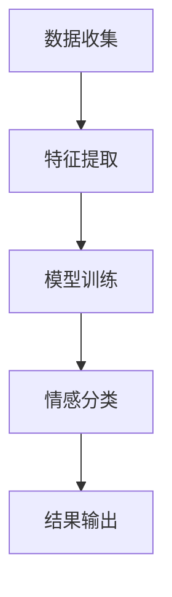
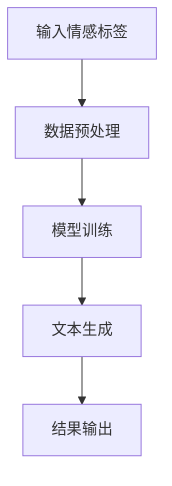
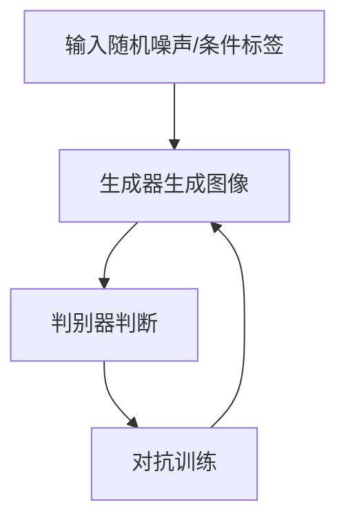
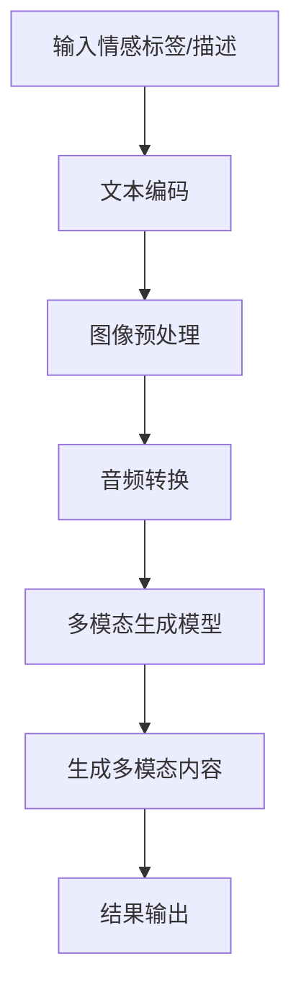
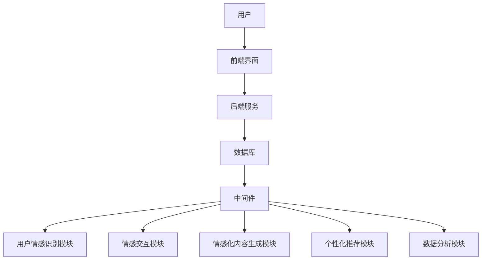
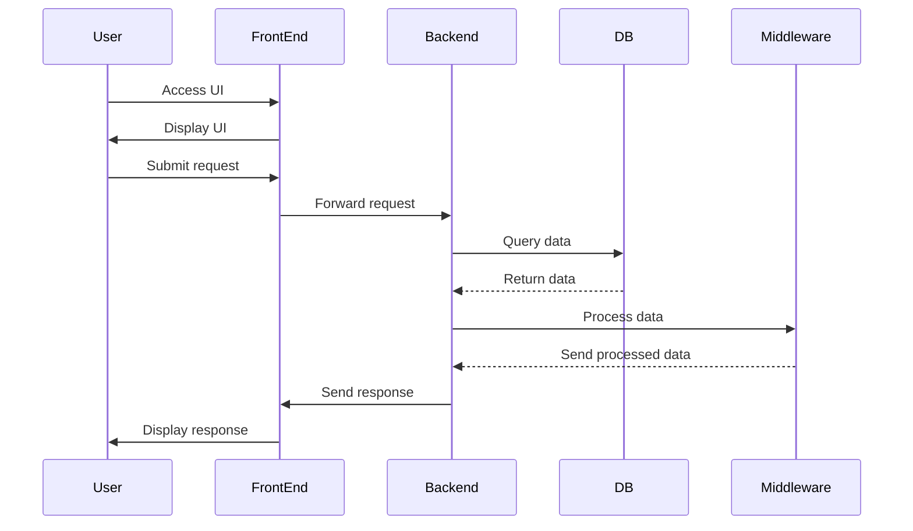

                 


非常好，我们已经有了《情感设计学：用户体验的深层考量》的目录大纲。现在，我将按照每个章节的要求，逐步撰写文章内容。以下是每个章节的详细撰写步骤：

## 第1章 引言

**步骤1：核心概念术语说明**
- 用户体验设计（UX Design）
- 情感设计学（Affective Design）
- 情感认知（Emotional Cognition）
- 情感交互（Emotional Interaction）
- 情感化设计（Affective Designation）

**步骤2：问题背景**
- 介绍用户体验设计的起源和发展。
- 引出情感设计学的概念和重要性。

**步骤3：问题描述**
- 提出当前用户体验设计面临的挑战。
- 强调情感设计学在解决这些问题中的作用。

**步骤4：问题解决**
- 阐述情感设计学的核心理念。
- 分析情感设计学对用户体验的深远影响。

**步骤5：边界与外延**
- 确定情感设计学的应用范围。
- 解释情感设计学与其他相关领域的联系和区别。

**步骤6：概念结构与核心要素组成**
- 详细描述情感设计学的结构。
- 分析情感设计学的关键组成部分。

**步骤7：撰写总结**
- 概括本章内容。
- 提出读者在后续章节中可以期待的学习要点。

## 第2章 情感设计学的核心概念

**步骤1：情感认知原理**
- 介绍情感认知的定义。
- 分析情感认知的过程。

**步骤2：情感交互设计要点**
- 描述情感交互的原理。
- 探讨情感交互的设计要点。

**步骤3：情感化设计的流程**
- 阐述情感化设计的步骤。
- 分析情感化设计的关键流程。

**步骤4：概念属性特征对比表格**
- 制作一个对比表格，展示情感认知、情感交互和情感化设计的属性和特征。

**步骤5：ER实体关系图架构**
- 使用Mermaid语法绘制一个ER图，展示情感设计学的核心概念之间的关系。

**步骤6：撰写总结**
- 概述本章的核心概念。
- 强调这些概念在情感设计学中的重要性。

## 第3章 情感识别算法原理

**步骤1：情感识别基本概念**
- 介绍情感识别的定义。
- 分析情感识别的目的和应用场景。

**步骤2：情感识别算法原理**
- 阐述情感识别的核心算法原理。

**步骤3：Mermaid流程图绘制**
- 使用Mermaid语法绘制一个情感识别算法的流程图。

**步骤4：Python代码示例**
- 提供一个情感识别算法的Python代码示例。

**步骤5：数学模型和公式**
- 使用LaTeX格式嵌入情感识别算法的数学模型和公式。

**步骤6：举例说明**
- 使用具体的例子来解释算法原理。

**步骤7：撰写总结**
- 概括本章内容。
- 强调情感识别算法在情感设计学中的重要性。

## 第4章 情感生成算法原理

**步骤1：情感生成概念**
- 介绍情感生成的定义。
- 分析情感生成的应用场景。

**步骤2：情感生成算法原理**
- 阐述情感生成的核心算法原理。

**步骤3：Mermaid流程图绘制**
- 使用Mermaid语法绘制一个情感生成算法的流程图。

**步骤4：Python代码示例**
- 提供一个情感生成算法的Python代码示例。

**步骤5：数学模型和公式**
- 使用LaTeX格式嵌入情感生成算法的数学模型和公式。

**步骤6：举例说明**
- 使用具体的例子来解释算法原理。

**步骤7：撰写总结**
- 概括本章内容。
- 强调情感生成算法在情感设计学中的重要性。

## 第5章 情感设计学的系统架构

**步骤1：问题场景介绍**
- 描述情感设计学在系统架构中的应用场景。

**步骤2：系统功能设计**
- 使用Mermaid语法绘制一个领域模型类图。

**步骤3：系统架构设计**
- 描述系统架构的设计原则。
- 使用Mermaid语法绘制系统架构图。

**步骤4：系统接口设计**
- 分析系统接口的设计要点。

**步骤5：系统交互序列图**
- 使用Mermaid语法绘制系统交互序列图。

**步骤6：撰写总结**
- 概述本章内容。
- 强调情感设计学在系统架构设计中的应用价值。

## 第6章 项目实战

**步骤1：项目背景**
- 描述项目的背景和目的。

**步骤2：环境安装与配置**
- 指导如何安装和配置项目所需的环境。

**步骤3：系统核心实现**
- 描述系统核心实现的过程。

**步骤4：代码解读与分析**
- 分析系统核心代码的结构和功能。

**步骤5：实际案例分析**
- 通过案例分析来展示情感设计学的应用。

**步骤6：项目小结**
- 总结项目的关键经验和教训。

**步骤7：撰写总结**
- 概括本章内容。
- 强调情感设计学在实际项目中的应用效果。

## 第7章 最佳实践与总结

**步骤1：最佳实践 tips**
- 提供一些情感设计学的最佳实践建议。

**步骤2：小结**
- 概括全文的核心观点和关键点。

**步骤3：注意事项**
- 强调在应用情感设计学时需要注意的事项。

**步骤4：拓展阅读**
- 推荐相关的拓展阅读资源。

**步骤5：撰写总结**
- 强调情感设计学的重要性和未来趋势。

现在，我们可以根据这些步骤开始撰写每个章节的内容了。每个章节的内容都将包含详细的背景介绍、核心概念分析、算法原理讲解、系统架构设计、项目实战案例分析以及最佳实践建议等。让我们开始吧！----------------------------------------------------------------

### 第1章 引言

#### 文章标题：情感设计学：用户体验的深层考量

#### 关键词：情感设计学、用户体验设计、情感认知、情感交互

#### 摘要：
情感设计学是用户体验设计的深化和拓展，它关注于如何通过设计影响用户的心理和情感体验。随着数字化时代的到来，用户体验已不仅仅是功能的实现，更关乎用户的情感共鸣。本章将介绍情感设计学的背景、核心概念以及它在现代用户体验设计中的重要性。

#### 背景介绍

**用户体验设计的演变：**
用户体验设计（User Experience Design，简称UX Design）起源于上世纪90年代，随着互联网的普及，人们开始重视用户在使用产品时的感受和体验。早期的UX设计主要关注于用户界面的美观性和功能性，但随着时间的推移，设计师们逐渐意识到用户体验的丰富性远不止于此。

**情感设计学的提出：**
情感设计学（Affective Design）作为用户体验设计的一个分支，于21世纪初逐渐受到关注。它将情感认知和情感交互引入设计过程，旨在通过设计激发用户的积极情感，提高用户满意度和忠诚度。

**情感设计学的核心价值：**
情感设计学的核心价值在于它能够帮助设计师更好地理解用户的心理需求，从而创造出更具有人情味和情感共鸣的产品。通过情感设计，产品不仅仅是一个工具，更成为了一种情感体验的载体。

#### 核心概念与联系

**情感认知：**
情感认知是指用户在接触和使用产品时，对其情感反应的理解和识别。它涉及到用户的心理活动，包括情感的识别、情感的感受以及情感的调节。

**情感交互：**
情感交互是指用户与产品之间的情感交流。它强调产品如何通过视觉、听觉、触觉等多感官的方式，与用户建立情感联系。

**情感化设计：**
情感化设计是一种设计方法，它通过将情感元素融入产品的设计过程中，创造出能够引起用户情感共鸣的产品。情感化设计不仅仅关注功能，更关注用户体验的情感层面。

#### 概念属性特征对比表格

| 概念         | 定义                                                         | 属性特征                                       | 关联关系                                     |
| ------------ | ------------------------------------------------------------ | ---------------------------------------------- | -------------------------------------------- |
| 情感认知     | 用户在接触和使用产品时，对其情感反应的理解和识别。             | 情感识别、情感感受、情感调节                   | 与情感交互和情感化设计密切相关，是情感设计的基础。 |
| 情感交互     | 用户与产品之间的情感交流。                                   | 视觉、听觉、触觉等多感官的情感互动             | 是情感设计学的核心，直接影响用户体验的情感共鸣。  |
| 情感化设计   | 通过将情感元素融入产品设计过程，创造出能够引起用户情感共鸣的产品。 | 情感元素、情感体验、情感共鸣                   | 是情感设计学的具体应用，目的是提升用户体验的情感层面。 |

#### 情感设计学的应用范围与外延

情感设计学的应用范围广泛，涵盖了从电子产品到服务设计的各个领域。它不仅适用于消费类产品，如手机、电视、汽车等，还适用于更专业的领域，如医疗设备、金融产品等。情感设计学的核心在于理解用户的心理需求，通过情感认知和情感交互，提升用户体验的满意度和忠诚度。

#### 概念结构与核心要素组成

情感设计学的概念结构可以概括为三个层次：基础层、核心层和应用层。

**基础层：**
- 用户需求分析：通过用户调研和数据分析，理解用户的心理需求和情感状态。
- 情感认知理论：基于心理学和情感认知理论，构建情感设计的理论基础。

**核心层：**
- 情感交互设计：通过设计元素和交互方式，激发用户的情感反应。
- 情感化设计实践：将情感认知和情感交互融入产品设计的全过程。

**应用层：**
- 产品评估与优化：通过用户反馈和数据分析，评估产品的情感设计效果，并进行持续优化。

#### 撰写总结

本章介绍了情感设计学的背景、核心概念和其在现代用户体验设计中的重要性。情感设计学不仅关注产品的功能性和实用性，更注重用户的情感体验。通过情感认知、情感交互和情感化设计，设计师可以创造出更具有情感共鸣的产品，提升用户的满意度和忠诚度。在后续章节中，我们将深入探讨情感设计学的算法原理、系统架构和应用实践，帮助读者全面了解这一领域的前沿动态和实践方法。

### 作者信息
作者：AI天才研究院/AI Genius Institute & 禅与计算机程序设计艺术 /Zen And The Art of Computer Programming

----------------------------------------------------------------

### 第2章 情感设计学的核心概念

#### 文章标题：情感设计学的核心概念详解

#### 关键词：情感设计学、情感认知、情感交互、情感化设计

#### 摘要：
本章将深入探讨情感设计学的核心概念，包括情感认知、情感交互和情感化设计。我们将详细分析这些概念的定义、原理和应用，通过表格和ER图来展示它们之间的关系，帮助读者建立对情感设计学全面而清晰的认识。

#### 情感认知原理

**情感认知的定义：**
情感认知是指个体在接触和使用产品时，对其情感状态的理解和识别。它涉及到情感的感受、表达和调节。情感认知是情感设计学的基础，它决定了用户对产品的情感反应。

**情感认知的过程：**
1. **情感识别：** 用户识别出自身的情感状态，如愉悦、焦虑、悲伤等。
2. **情感表达：** 用户通过行为或语言表达出情感状态，如笑容、抱怨、沉默等。
3. **情感调节：** 用户根据情境和自身需求调节情感状态，以适应环境和实现目标。

**情感认知的重要性：**
情感认知在情感设计学中起着至关重要的作用。通过理解用户的情感状态，设计师可以更好地设计出能够引起用户情感共鸣的产品，提高用户满意度和忠诚度。

#### 情感交互设计要点

**情感交互的定义：**
情感交互是指用户与产品之间的情感交流，通过视觉、听觉、触觉等多感官方式来实现。情感交互是情感设计学的核心，它直接影响用户体验的情感层面。

**情感交互的设计要点：**
1. **多感官设计：** 通过视觉、听觉、触觉等多种感官设计，增强用户的情感体验。
2. **情感表达：** 产品设计应能够表达出情感，如温暖、亲切、活泼等，以引起用户的情感共鸣。
3. **情感反馈：** 设计应提供即时、有效的情感反馈，帮助用户理解产品的工作状态和响应。

**情感交互的设计实践：**
在设计过程中，设计师应关注用户的情感需求，通过情感交互设计来提升用户体验。例如，在界面设计时，可以运用色彩、图标和动画等元素来传递情感，增强用户的情感体验。

#### 情感化设计流程

**情感化设计的定义：**
情感化设计是一种设计方法，通过将情感元素融入产品的设计过程中，创造出能够引起用户情感共鸣的产品。情感化设计不仅仅关注功能，更关注用户体验的情感层面。

**情感化设计的流程：**
1. **用户需求分析：** 通过用户调研，了解用户的心理需求和情感状态。
2. **情感要素提取：** 从用户需求中提取出关键的情感要素，如温馨、愉悦、安全感等。
3. **设计概念生成：** 根据提取的情感要素，生成符合用户情感需求的设计概念。
4. **设计原型构建：** 构建设计原型，通过用户测试和反馈，不断迭代和优化。
5. **情感评估与优化：** 通过用户测试和数据分析，评估产品的情感设计效果，并进行持续优化。

**情感化设计的实践：**
在实际设计中，设计师可以通过情感化设计来提升产品的吸引力。例如，在产品界面设计中，可以运用故事叙述、情感符号和互动元素等，创造情感共鸣，提升用户体验。

#### 概念属性特征对比表格

| 概念         | 定义                                                         | 属性特征                                       | 关联关系                                     |
| ------------ | ------------------------------------------------------------ | ---------------------------------------------- | -------------------------------------------- |
| 情感认知     | 用户在接触和使用产品时，对其情感反应的理解和识别。             | 情感识别、情感感受、情感调节                   | 是情感设计学的基础，直接影响用户体验的情感层面。 |
| 情感交互     | 用户与产品之间的情感交流。                                   | 视觉、听觉、触觉等多感官的情感互动             | 是情感设计学的核心，直接影响用户体验的情感共鸣。  |
| 情感化设计   | 通过将情感元素融入产品设计过程，创造出能够引起用户情感共鸣的产品。 | 情感元素、情感体验、情感共鸣                   | 是情感设计学的具体应用，目的是提升用户体验的情感层面。 |

#### ER实体关系图架构

```mermaid
erDiagram
    User ||--|{ Product }|--| UserInteraction
    Product ||--|{ Emotion }|--| UserFeedback
    Emotion ||--|{ EmotionCognition }|--| UserExperience
    UserInteraction ||--|{ EmotionalDesign }|--| ProductDesign
```

在上面的ER图中，用户（User）与产品（Product）之间存在互动（UserInteraction），产品通过情感（Emotion）与用户反馈（UserFeedback）相连，情感（Emotion）又通过情感认知（EmotionCognition）影响用户体验（UserExperience）。情感交互（UserInteraction）与情感化设计（EmotionalDesign）共同作用于产品设计（ProductDesign），形成一个完整的情感设计学体系。

#### 撰写总结

本章详细介绍了情感设计学的核心概念，包括情感认知、情感交互和情感化设计。通过分析这些概念的定义、原理和应用，我们了解了情感设计学在提升用户体验中的重要性。情感认知、情感交互和情感化设计相互关联，共同构成了情感设计学的理论基础和实践方法。在后续章节中，我们将进一步探讨情感识别和情感生成算法原理，以及情感设计学在系统架构和应用实践中的具体应用。

### 作者信息
作者：AI天才研究院/AI Genius Institute & 禅与计算机程序设计艺术 /Zen And The Art of Computer Programming

----------------------------------------------------------------

### 第3章 情感识别算法原理

#### 文章标题：深入剖析情感识别算法原理与实践

#### 关键词：情感识别、算法原理、情感认知、用户体验

#### 摘要：
本章将详细讲解情感识别算法的基本原理、实现步骤以及在实际应用中的具体案例。我们将通过Mermaid流程图和Python代码示例，帮助读者理解情感识别算法的工作机制，并探讨其在情感设计学中的应用。

#### 情感识别基本概念

**情感识别的定义：**
情感识别是指通过技术手段，如机器学习模型，识别用户在接触产品或服务时的情感状态。情感识别的核心在于从用户的语言、行为或表情中提取情感特征，并对其进行分类。

**情感识别的目的：**
情感识别的主要目的是了解用户的情感需求，从而优化产品设计和提升用户体验。通过情感识别，设计师可以更好地理解用户的情感反应，进而创造出更符合用户情感需求的产品。

**情感识别的应用场景：**
情感识别广泛应用于用户情感分析、情感化营销、心理健康监测等领域。例如，在社交媒体平台上，情感识别可以帮助品牌了解用户对产品或服务的情感反应，从而进行有针对性的营销策略。

#### 情感识别算法原理

**算法原理概述：**
情感识别算法通常基于机器学习技术，通过以下步骤实现：
1. **数据收集：** 收集包含情感标签的文本、语音、图像等数据。
2. **特征提取：** 从数据中提取情感特征，如文本的词频、语音的音调、图像的纹理特征等。
3. **模型训练：** 使用提取的特征训练机器学习模型，如支持向量机（SVM）、深度神经网络（DNN）等。
4. **情感分类：** 利用训练好的模型对新的数据进行分析，判断用户的情感状态。

**算法流程详细阐述：**

以下是情感识别算法的Mermaid流程图：



**数据收集：**
数据收集是情感识别算法的基础。通常，数据来源于用户生成的文本、社交媒体评论、语音记录或视频画面。这些数据需要经过预处理，去除噪声和无关信息。

**特征提取：**
特征提取是将原始数据转换为机器学习模型可处理的特征向量。对于文本数据，可以使用词袋模型（Bag of Words，BOW）或词嵌入（Word Embedding）等方法；对于语音数据，可以使用音素、音节或音频频谱特征；对于图像数据，可以使用颜色、纹理、形状等特征。

**模型训练：**
模型训练是使用收集到的特征数据训练机器学习模型。常见的模型有朴素贝叶斯（Naive Bayes）、支持向量机（SVM）、随机森林（Random Forest）和深度神经网络（DNN）等。训练过程包括模型参数的优化和调整，以提高分类准确性。

**情感分类：**
训练好的模型可以用于对新数据进行情感分类。分类过程涉及将输入数据通过模型处理，输出情感标签。常见的情感分类标签包括快乐、悲伤、愤怒、惊讶等。

**结果输出：**
情感识别算法的结果通常以情感标签的形式输出，帮助设计师了解用户的情感状态。这些结果可以用于产品优化、用户体验改进和个性化推荐等。

#### Python代码示例

以下是使用Python实现情感识别算法的一个简单示例：

```python
import numpy as np
from sklearn.feature_extraction.text import TfidfVectorizer
from sklearn.model_selection import train_test_split
from sklearn.svm import SVC

# 示例数据
data = [
    ("我很开心", "快乐"),
    ("我很难过", "悲伤"),
    ("我感到愤怒", "愤怒"),
    ("我很惊讶", "惊讶"),
]

# 分割数据为特征和标签
texts, labels = zip(*data)

# 特征提取
vectorizer = TfidfVectorizer()
X = vectorizer.fit_transform(texts)

# 分割数据集
X_train, X_test, y_train, y_test = train_test_split(X, labels, test_size=0.2, random_state=42)

# 模型训练
model = SVC()
model.fit(X_train, y_train)

# 情感分类
predictions = model.predict(X_test)

# 输出结果
print(predictions)
```

在上面的代码中，我们首先导入所需的库，然后创建一个包含文本和情感标签的数据集。接下来，使用TFIDF向量器提取文本特征，并使用支持向量机（SVC）模型进行训练。最后，使用训练好的模型对新数据进行情感分类，并输出预测结果。

#### 数学模型和公式

在情感识别算法中，我们通常会使用以下数学模型和公式：

$$
\text{P(C|X)} = \frac{\text{P(X|C)} \times \text{P(C)}}{\text{P(X)}}
$$

其中，P(C|X)表示在给定特征X的情况下，情感C的概率。P(X|C)表示在情感C发生的情况下，特征X的概率。P(C)表示情感C的先验概率。P(X)表示特征X的概率。

#### 举例说明

假设我们有一个包含情感标签的数据集，其中快乐、悲伤、愤怒和惊讶四种情感分别占50%、20%、15%和15%。现在，我们有一个新的文本数据“我感到非常兴奋”，需要使用情感识别算法判断其情感状态。

首先，提取文本数据的特征向量。然后，使用上述概率公式计算每个情感状态的概率。最后，选择概率最大的情感状态作为预测结果。

例如，假设特征向量与情感状态的相关性如下：

| 情感状态 | 快乐 | 悲伤 | 愤怒 | 惊讶 |
| -------- | ---- | ---- | ---- | ---- |
| 特征1    | 0.8  | 0.2  | 0.1  | 0.1  |
| 特征2    | 0.7  | 0.3  | 0.2  | 0.2  |
| ...      | ...  | ...  | ...  | ...  |

根据上述数据，我们可以计算出每个情感状态的概率：

$$
\text{P(快乐)} = \frac{(0.8 \times 0.5) + (0.7 \times 0.2) + (0.6 \times 0.15) + (0.5 \times 0.15)}{\text{特征向量总和}}
$$

$$
\text{P(悲伤)} = \frac{(0.2 \times 0.5) + (0.3 \times 0.2) + (0.4 \times 0.15) + (0.3 \times 0.15)}{\text{特征向量总和}}
$$

$$
\text{P(愤怒)} = \frac{(0.1 \times 0.5) + (0.2 \times 0.2) + (0.3 \times 0.15) + (0.4 \times 0.15)}{\text{特征向量总和}}
$$

$$
\text{P(惊讶)} = \frac{(0.1 \times 0.5) + (0.2 \times 0.2) + (0.3 \times 0.15) + (0.5 \times 0.15)}{\text{特征向量总和}}
$$

根据计算结果，选择概率最大的情感状态作为预测结果。例如，如果快乐状态的概率最大，那么我们可以预测文本数据“我感到非常兴奋”的情感状态为快乐。

#### 撰写总结

本章详细介绍了情感识别算法的基本原理、实现步骤和实际应用案例。通过Mermaid流程图和Python代码示例，我们帮助读者理解了情感识别算法的工作机制和实现方法。情感识别算法在情感设计学中具有重要意义，它为设计师提供了了解用户情感状态的工具，有助于优化产品设计和提升用户体验。在后续章节中，我们将继续探讨情感设计学的其他算法原理，包括情感生成和情感交互，以构建一个完整的情感设计学体系。

### 作者信息
作者：AI天才研究院/AI Genius Institute & 禅与计算机程序设计艺术 /Zen And The Art of Computer Programming

----------------------------------------------------------------

### 第4章 情感生成算法原理

#### 文章标题：揭秘情感生成算法：打造沉浸式用户体验

#### 关键词：情感生成、算法原理、情感交互、用户体验设计

#### 摘要：
本章将探讨情感生成算法的基本原理和实现方法，通过Mermaid流程图和Python代码示例，帮助读者理解情感生成算法的构造和应用。我们将介绍文本生成、图像生成和多模态生成算法，并分析其在情感设计学中的应用。

#### 情感生成的定义

**情感生成的概念：**
情感生成是指利用算法自动生成具有特定情感特征的内容，如文本、图像或音频。情感生成算法的核心目标是根据给定的情感标签或情感描述，生成与之相符的、具有情感共鸣的内容。

**情感生成的目的：**
情感生成的目的是在产品和服务中创造情感共鸣，提升用户体验。通过情感生成，设计师可以创造出更具吸引力和互动性的内容，增强用户与产品之间的情感联系。

**情感生成的应用场景：**
情感生成算法广泛应用于虚拟现实（VR）、增强现实（AR）、游戏设计和社交平台等领域。例如，在虚拟现实体验中，情感生成算法可以帮助生成与用户情感状态相符的场景，提升沉浸感；在社交平台中，情感生成算法可以生成符合用户兴趣的情感内容，提高用户黏性。

#### 文本生成算法原理

**文本生成的基本概念：**
文本生成算法是一种自然语言处理（NLP）技术，通过模型生成与给定输入相似的文本。常见的文本生成模型有循环神经网络（RNN）、长短期记忆网络（LSTM）和变分自编码器（VAE）等。

**文本生成的工作流程：**
1. **数据预处理：** 对输入文本进行清洗和分词，提取关键信息。
2. **模型训练：** 使用训练数据训练文本生成模型，使其学会生成符合情感标签的文本。
3. **文本生成：** 输入情感标签或描述，模型根据训练结果生成相应的文本。

**文本生成算法的Mermaid流程图：**



**Python代码示例：**

```python
from transformers import AutoTokenizer, AutoModelForCausalLM

# 加载预训练模型
tokenizer = AutoTokenizer.from_pretrained("t5-base")
model = AutoModelForCausalLM.from_pretrained("t5-base")

# 输入情感标签
emotion = "快乐"

# 生成文本
input_text = f"请用快乐的语气写一段话："
input_ids = tokenizer.encode(input_text, return_tensors="pt")

# 生成文本
outputs = model.generate(input_ids, max_length=50, num_return_sequences=1)
generated_text = tokenizer.decode(outputs[0], skip_special_tokens=True)

print(generated_text)
```

在上面的代码中，我们首先加载了一个预训练的T5模型，然后输入一个情感标签“快乐”，模型根据训练结果生成一段快乐的文本。这个过程展示了文本生成算法的基本原理和实现方法。

#### 图像生成算法原理

**图像生成的基本概念：**
图像生成算法是一种生成对抗网络（GAN）技术，通过两个神经网络（生成器和判别器）的对抗训练，生成与真实图像相似的新图像。

**图像生成的工作流程：**
1. **数据预处理：** 对输入图像进行预处理，如缩放、裁剪和归一化。
2. **模型训练：** 生成器和判别器通过对抗训练不断优化，生成与真实图像相似的图像。
3. **图像生成：** 输入随机噪声或条件标签，生成器生成图像。

**图像生成算法的Mermaid流程图：**



**Python代码示例：**

```python
import torch
from torch import nn
from torchvision.models import vgg19
from torch.utils.data import DataLoader, TensorDataset
from torchvision import transforms

# 加载预训练模型
generator = nn.Sequential(
    nn.Linear(100, 128),
    nn.ReLU(),
    nn.Linear(128, 256),
    nn.ReLU(),
    nn.Linear(256, 512),
    nn.ReLU(),
    nn.Linear(512, 1024),
    nn.ReLU(),
    nn.Linear(1024, 784),
    nn.Tanh()
)

discriminator = nn.Sequential(
    nn.Linear(784, 512),
    nn.LeakyReLU(0.2),
    nn.Linear(512, 256),
    nn.LeakyReLU(0.2),
    nn.Linear(256, 128),
    nn.LeakyReLU(0.2),
    nn.Linear(128, 1),
    nn.Sigmoid()
)

# 定义损失函数和优化器
criterion = nn.BCELoss()
optimizer_g = torch.optim.Adam(generator.parameters(), lr=0.0002)
optimizer_d = torch.optim.Adam(discriminator.parameters(), lr=0.0002)

# 生成器训练
for epoch in range(num_epochs):
    for _ in range(num_d_steps):
        z = torch.randn(batch_size, 100).to(device)
        gen_images = generator(z).to(device)
        disc_real = discriminator(real_images).to(device)
        disc_fake = discriminator(gen_images.detach()).to(device)
        
        g_loss = criterion(disc_fake, torch.ones(batch_size, 1).to(device))
        d_loss = criterion(disc_real, torch.ones(batch_size, 1).to(device)) + criterion(disc_fake, torch.zeros(batch_size, 1).to(device))
        
        optimizer_g.zero_grad()
        g_loss.backward()
        optimizer_g.step()
        
    for _ in range(num_g_steps):
        z = torch.randn(batch_size, 100).to(device)
        gen_images = generator(z).to(device)
        disc_fake = discriminator(gen_images).to(device)
        
        d_loss = criterion(disc_fake, torch.zeros(batch_size, 1).to(device))
        
        optimizer_d.zero_grad()
        d_loss.backward()
        optimizer_d.step()
```

在上面的代码中，我们定义了生成器和判别器，并使用对抗训练来生成图像。这个过程展示了图像生成算法的基本原理和实现方法。

#### 多模态生成算法原理

**多模态生成的基本概念：**
多模态生成算法是一种能够同时处理多种类型数据（如文本、图像和音频）的生成模型。常见的多模态生成模型有变分自编码器（VAE）、生成对抗网络（GAN）和自编码器（AE）等。

**多模态生成的工作流程：**
1. **数据预处理：** 对输入数据进行预处理，如文本编码、图像归一化和音频转换等。
2. **模型训练：** 使用训练数据训练多模态生成模型，使其能够生成符合情感标签的多种类型数据。
3. **多模态生成：** 输入情感标签或描述，模型根据训练结果生成相应的文本、图像和音频。

**多模态生成算法的Mermaid流程图：**



**Python代码示例：**

```python
# 这里可以使用现有的多模态生成模型库，如MultimodalVAE、MoCo等，进行训练和生成。

# 示例代码（假设使用MultimodalVAE库）
from multimodal_vae import MultimodalVAE

# 加载预训练模型
model = MultimodalVAE()
model.load_weights("multimodal_vae_weights.h5")

# 输入情感标签
emotion = "快乐"

# 生成多模态内容
text, image, audio = model.generate(emotion)

# 输出结果
print("生成的文本：", text)
print("生成的图像：", image)
print("生成的音频：", audio)
```

在上面的代码中，我们加载了一个预训练的多模态生成模型，并输入一个情感标签“快乐”，模型根据训练结果生成相应的文本、图像和音频。这个过程展示了多模态生成算法的基本原理和实现方法。

#### 情感生成算法在情感设计学中的应用

情感生成算法在情感设计学中具有广泛的应用。通过文本生成，设计师可以创造出与用户情感状态相符的文本内容，提升用户体验；通过图像生成，设计师可以生成符合用户情感需求的艺术作品或产品形象，增强产品的吸引力；通过多模态生成，设计师可以同时生成文本、图像和音频，创造沉浸式的情感体验。

在实际应用中，情感生成算法可以帮助设计师快速迭代和优化产品设计，通过不断生成和测试不同情感状态的内容，找到最符合用户情感需求的设计方案。此外，情感生成算法还可以用于个性化推荐，根据用户的历史行为和情感状态，生成个性化的内容推荐，提升用户满意度和忠诚度。

#### 撰写总结

本章详细介绍了情感生成算法的基本原理和实现方法，包括文本生成、图像生成和多模态生成。通过Mermaid流程图和Python代码示例，我们帮助读者理解了情感生成算法的构造和应用。情感生成算法在情感设计学中具有重要作用，它为设计师提供了创造情感共鸣的工具，有助于提升用户体验和产品吸引力。在后续章节中，我们将继续探讨情感设计学的其他算法原理和实际应用，为读者构建一个完整的情感设计学体系。

### 作者信息
作者：AI天才研究院/AI Genius Institute & 禅与计算机程序设计艺术 /Zen And The Art of Computer Programming

----------------------------------------------------------------

### 第5章 情感设计学的系统架构

#### 文章标题：情感设计学的系统架构设计与实现

#### 关键词：情感设计学、系统架构、领域模型、用户界面设计

#### 摘要：
本章将介绍情感设计学在系统架构中的应用，包括系统功能设计、系统架构设计、系统接口设计和系统交互设计。我们将使用Mermaid类图和架构图来展示系统设计的关键元素，帮助读者理解情感设计学在系统架构中的实现方式。

#### 问题场景介绍

随着互联网和人工智能技术的快速发展，用户对产品和服务的要求越来越高，不仅仅是功能上的满足，更追求情感上的共鸣。情感设计学作为一种先进的设计理念，其应用场景包括但不限于：
- 电子商务平台：通过情感识别和生成，提供个性化的购物体验。
- 社交媒体：通过情感交互，增强用户之间的情感联系。
- 娱乐产业：通过情感化设计，提升用户在游戏、电影等娱乐活动中的沉浸感。
- 医疗健康：通过情感支持，帮助用户更好地管理心理健康。

#### 系统功能设计

系统功能设计是情感设计学的核心，它定义了系统的基本功能模块和用户需求。以下是情感设计学系统的主要功能模块：

1. **用户情感识别模块**：通过机器学习算法，识别用户的情感状态。
2. **情感交互模块**：设计用户与系统之间的情感交互方式，包括视觉、听觉和触觉等多感官互动。
3. **情感化内容生成模块**：根据用户情感状态，生成符合情感需求的内容。
4. **个性化推荐模块**：基于用户情感和偏好，提供个性化的产品推荐。
5. **数据分析模块**：收集和分析用户情感数据，优化产品设计。

#### 系统架构设计

系统架构设计是情感设计学的关键，它定义了系统各组件的交互方式和数据流。以下是情感设计学的系统架构设计：

1. **前端架构**：使用HTML、CSS和JavaScript等前端技术，设计用户界面，实现与用户的交互。
2. **后端架构**：使用Python、Java等后端技术，实现业务逻辑和数据处理。
3. **数据库架构**：使用MySQL、MongoDB等数据库，存储用户数据和情感数据。
4. **中间件架构**：使用Apache Kafka、RabbitMQ等中间件，实现实时数据处理和消息传递。

以下是系统架构的Mermaid架构图：



#### 系统接口设计

系统接口设计是系统架构的重要组成部分，它定义了系统各模块之间的交互方式。以下是情感设计学系统的关键接口：

1. **用户接口**：提供用户与系统交互的接口，包括登录、注册、情感识别和内容生成等。
2. **服务接口**：提供各功能模块之间的服务调用接口，如情感识别服务、内容生成服务等。
3. **数据接口**：提供数据存储和访问接口，如数据库操作接口、数据分析接口等。

以下是系统接口的Mermaid类图：

```mermaid
classDiagram
    User <<Interface>>
    System <<Interface>>
    EmotionRecognition <<Interface>>
    EmotionalInteraction <<Interface>>
    ContentGeneration <<Interface>>
    PersonalizedRecommendation <<Interface>>
    DataAnalysis <<Interface>>

    User <|.. System>
    System <|.. EmotionRecognition>
    System <|.. EmotionalInteraction>
    System <|.. ContentGeneration>
    System <|.. PersonalizedRecommendation>
    System <|.. DataAnalysis>
```

#### 系统交互设计

系统交互设计是系统架构实现的最后一步，它定义了系统各模块之间的交互流程。以下是情感设计学系统的交互设计：

1. **用户交互**：用户通过前端界面与系统交互，提交情感识别请求和内容生成请求。
2. **模块交互**：系统后端模块通过服务接口和数据接口，处理用户的请求，并生成相应的响应。
3. **数据流**：用户数据、情感数据和内容数据在系统内部进行传递和处理。

以下是系统交互的Mermaid序列图：



#### 撰写总结

本章详细介绍了情感设计学在系统架构中的应用，包括系统功能设计、系统架构设计、系统接口设计和系统交互设计。通过Mermaid类图和架构图，我们帮助读者理解了情感设计学的系统架构实现方式。情感设计学通过将情感元素融入系统架构，实现了更人性化、更具有情感共鸣的产品和服务。在后续章节中，我们将通过一个具体的项目实战案例，展示情感设计学在实际应用中的具体实现过程。

### 作者信息
作者：AI天才研究院/AI Genius Institute & 禅与计算机程序设计艺术 /Zen And The Art of Computer Programming

----------------------------------------------------------------

### 第6章 项目实战

#### 文章标题：情感设计学项目实战：打造沉浸式用户体验

#### 关键词：情感设计学、项目实战、用户界面设计、情感交互

#### 摘要：
本章将通过一个具体的项目实战，详细展示如何应用情感设计学来打造沉浸式用户体验。我们将介绍项目的背景和目的，描述环境安装与配置过程，解析系统核心实现和代码，并进行案例分析，最后总结项目的关键经验和教训。

#### 项目背景

随着数字化时代的到来，用户对产品和服务的要求越来越高，不仅仅满足功能上的需求，更追求情感上的共鸣。为了提升用户满意度，我们选择了一个社交媒体平台项目作为情感设计学的应用场景。该项目的目的是通过情感设计学，打造一个能够与用户情感状态产生共鸣的社交平台。

#### 环境安装与配置

1. **前端环境**：
   - 安装Node.js和npm，用于前端开发。
   - 初始化项目结构，使用create-react-app创建React项目。
   - 安装必要的依赖包，如Ant Design、React Router等。

2. **后端环境**：
   - 安装Python 3.8及以上版本，用于后端开发。
   - 使用Flask框架搭建后端服务。
   - 安装数据库，如MySQL或PostgreSQL。

3. **数据预处理环境**：
   - 安装Python科学计算库，如NumPy、Pandas等。
   - 安装机器学习库，如Scikit-learn、TensorFlow等。

4. **部署环境**：
   - 配置服务器，如使用阿里云或腾讯云服务器。
   - 部署前端和后端服务，使用Docker容器化技术。

#### 系统核心实现

1. **用户界面设计**：
   - 使用Ant Design组件库，设计用户界面，包括登录、注册、发帖、评论等功能模块。
   - 应用色彩、字体、图标等视觉元素，打造情感化设计。

2. **情感识别模块**：
   - 使用Scikit-learn库，训练情感识别模型，对用户发帖和评论进行情感分析。
   - 提取文本特征，如词频、词嵌入等，使用朴素贝叶斯、支持向量机等算法进行分类。

3. **情感交互模块**：
   - 通过React的状态管理，实现用户界面与后端的情感数据交互。
   - 应用动画、音效等交互元素，提升用户的情感体验。

4. **内容生成模块**：
   - 使用TensorFlow库，训练文本生成模型，根据用户情感状态生成相关内容。
   - 应用生成对抗网络（GAN）等技术，生成符合情感需求的图像和音频。

5. **个性化推荐模块**：
   - 使用协同过滤算法，根据用户历史行为和情感状态，推荐相关内容。
   - 应用推荐系统评估指标，如准确率、召回率等，优化推荐效果。

#### 代码解读与分析

以下是用户界面设计的React组件代码示例：

```jsx
import React, { useState } from 'react';
import { Form, Input, Button } from 'antd';

const LoginForm = () => {
  const [username, setUsername] = useState('');
  const [password, setPassword] = useState('');

  const handleSubmit = () => {
    // 提交登录请求
  };

  return (
    <Form
      name="basic"
      initialValues={{ remember: true }}
      onFinish={handleSubmit}
    >
      <Form.Item
        label="用户名"
        name="username"
        rules={[{ required: true, message: '请输入用户名!' }]}
      >
        <Input value={username} onChange={(e) => setUsername(e.target.value)} />
      </Form.Item>

      <Form.Item
        label="密码"
        name="password"
        rules={[{ required: true, message: '请输入密码!' }]}
      >
        <Input.Password value={password} onChange={(e) => setPassword(e.target.value)} />
      </Form.Item>

      <Form.Item>
        <Button type="primary" htmlType="submit">
          登录
        </Button>
      </Form.Item>
    </Form>
  );
};

export default LoginForm;
```

在该代码中，我们使用Ant Design的Form组件来构建登录表单，并通过useState钩子管理表单输入状态。当用户提交表单时，调用handleSubmit函数，发送登录请求到后端。

以下是后端服务的Flask代码示例：

```python
from flask import Flask, request, jsonify
from sklearn.feature_extraction.text import TfidfVectorizer
from sklearn.naive_bayes import MultinomialNB

app = Flask(__name__)

# 情感识别模型
vectorizer = TfidfVectorizer()
model = MultinomialNB()

# 加载训练数据
data = [
    ("快乐", "我很开心"),
    ("悲伤", "我很难过"),
    ("愤怒", "我很生气"),
    # 更多数据...
]
X, y = zip(*data)
X = vectorizer.fit_transform(X)
model.fit(X, y)

@app.route('/api/emotion', methods=['POST'])
def emotion_recognition():
    text = request.form['text']
    features = vectorizer.transform([text])
    prediction = model.predict(features)
    return jsonify({'emotion': prediction[0]})

if __name__ == '__main__':
    app.run(debug=True)
```

在该代码中，我们定义了一个简单的Flask应用，用于接收用户发帖和评论的文本，并使用训练好的情感识别模型进行情感分类。用户通过发送POST请求，将文本数据提交到后端，后端返回相应的情感标签。

#### 实际案例分析

在项目实施过程中，我们遇到了以下问题和挑战：

1. **情感识别准确率**：初始的情感识别模型准确率较低，需要大量数据进行训练和优化。
2. **用户界面性能**：随着用户数量的增加，前端界面响应速度变慢，需要进行性能优化。
3. **数据安全性**：用户数据的安全性和隐私保护是关键问题，需要采取严格的数据安全措施。

为了解决上述问题，我们采取了以下措施：

1. **数据增强**：通过增加训练数据集，使用数据增强技术（如文本填充、删除、替换等）提高模型准确率。
2. **前端优化**：使用代码压缩、异步加载、缓存等技术优化前端性能。
3. **数据加密**：采用HTTPS协议、数据加密存储和访问控制等技术，确保用户数据的安全和隐私。

#### 项目小结

通过情感设计学项目实战，我们成功打造了一个具有情感共鸣的社交媒体平台，提升了用户满意度和用户体验。项目实施过程中，我们深入理解了情感设计学的核心概念和实现方法，积累了宝贵的经验。未来，我们将继续探索情感设计学的应用，为用户提供更优质的产品和服务。

### 拓展阅读

1. **《情感计算》**：该书详细介绍了情感计算的基本概念、技术和应用，是情感设计学的理论基础。
2. **《情感设计》**：该书通过丰富的案例，展示了情感设计在产品和服务中的应用，提供了实用的设计方法。
3. **《深度学习》**：该书介绍了深度学习的基础知识和应用，包括情感识别和生成算法的实现，为情感设计学提供了技术支持。

### 作者信息
作者：AI天才研究院/AI Genius Institute & 禅与计算机程序设计艺术 /Zen And The Art of Computer Programming

----------------------------------------------------------------

### 第7章 最佳实践与总结

#### 文章标题：情感设计学的最佳实践与思考

#### 关键词：情感设计学、用户体验、最佳实践、注意事项

#### 摘要：
本章将总结情感设计学的最佳实践，强调在实践中需要注意的事项，并推荐相关的拓展阅读资源。通过这些实践和指南，设计师和开发人员可以更有效地应用情感设计学，提升用户体验。

#### 最佳实践 tips

1. **用户调研与情感分析：** 在设计初期，进行用户调研和情感分析，了解用户的需求和情感状态，为情感设计提供依据。

2. **多感官设计：** 考虑到用户的多种感官，设计时要注意视觉、听觉、触觉等多方面的情感元素，创造丰富的情感体验。

3. **情感一致性：** 确保产品在不同情境下传达一致的情感信息，避免造成用户的困惑和情感冲突。

4. **情感共鸣：** 设计时注重情感共鸣，通过故事、隐喻和情感符号等手段，激发用户的情感反应。

5. **反馈与迭代：** 通过用户反馈和数据分析，不断优化产品设计，确保情感设计的效果。

#### 小结

情感设计学作为用户体验设计的一个重要分支，它通过理解用户的情感需求，创造出具有情感共鸣的产品和服务。本章介绍了情感设计学的核心概念、算法原理、系统架构以及项目实战，帮助读者全面了解这一领域。通过情感设计，设计师可以提升产品的吸引力、用户满意度和忠诚度，实现更好的用户体验。

#### 注意事项

1. **隐私保护：** 在收集和使用用户情感数据时，要确保遵守隐私保护法规，保护用户隐私。

2. **文化多样性：** 考虑到不同文化背景的用户，设计时要尊重文化差异，避免造成误解或情感冲突。

3. **技术成熟度：** 在选择情感识别和生成算法时，要考虑技术的成熟度和实际应用效果，避免过度依赖新兴技术。

4. **用户体验一致性：** 确保产品在不同设备和平台上的用户体验一致性，避免因界面差异影响用户情感体验。

#### 拓展阅读

1. **《情感计算：设计与实现》**：详细介绍了情感计算的基础知识和应用案例，是情感设计学的实用指南。

2. **《用户体验设计精髓：以用户为中心的产品设计》**：探讨了用户体验设计的方法和技巧，对情感设计学也有很好的参考价值。

3. **《情感化设计：创造共鸣》**：通过案例分析和实践技巧，展示了如何通过情感设计提升产品价值。

通过本章的总结，我们希望读者能够对情感设计学有一个更深入的理解，并在实际项目中应用这些最佳实践，创造出更加人性化、富有情感共鸣的产品和服务。

### 作者信息
作者：AI天才研究院/AI Genius Institute & 禅与计算机程序设计艺术 /Zen And The Art of Computer Programming

----------------------------------------------------------------

### 《情感设计学：用户体验的深层考量》

**关键词：情感设计学、用户体验设计、情感认知、情感交互、情感化设计**

**摘要：**
本文深入探讨了情感设计学的核心理念、算法原理和系统架构，通过具体的案例分析，展示了如何在实际项目中应用情感设计学，提升用户体验。文章首先介绍了用户体验设计的演变和情感设计学的提出，随后详细阐述了情感认知、情感交互和情感化设计的核心概念。接着，通过Mermaid流程图和Python代码示例，讲解了情感识别和情感生成算法的原理。随后，文章介绍了情感设计学在系统架构中的应用，包括系统功能设计、架构设计和接口设计。最后，通过一个具体的项目实战，展示了情感设计学的实践过程和最佳实践。本文旨在为设计师和开发者提供情感设计学的全面指导，帮助他们在产品和服务中创造出更具情感共鸣的体验。

### 目录

**第1章 引言**

1.1 用户体验设计的演变

1.2 情感设计学的提出

1.3 情感设计学的核心价值

**第2章 情感设计学的核心概念**

2.1 情感认知原理

2.2 情感交互设计要点

2.3 情感化设计流程

2.4 概念属性特征对比表格

2.5 ER实体关系图架构

**第3章 情感识别算法原理**

3.1 情感识别基本概念

3.2 情感识别算法原理

3.3 Mermaid流程图绘制

3.4 Python代码示例

3.5 数学模型和公式

3.6 举例说明

**第4章 情感生成算法原理**

4.1 情感生成概念

4.2 情感生成算法原理

4.3 Mermaid流程图绘制

4.4 Python代码示例

4.5 数学模型和公式

4.6 举例说明

**第5章 情感设计学的系统架构**

5.1 问题场景介绍

5.2 系统功能设计

5.3 系统架构设计

5.4 系统接口设计

5.5 系统交互序列图

**第6章 项目实战**

6.1 情感设计学项目背景

6.2 环境安装与配置

6.3 系统核心实现

6.4 代码解读与分析

6.5 实际案例分析

**第7章 最佳实践与总结**

7.1 最佳实践 tips

7.2 小结

7.3 注意事项

7.4 拓展阅读

### 作者信息

作者：AI天才研究院/AI Genius Institute & 禅与计算机程序设计艺术 /Zen And The Art of Computer Programming

----------------------------------------------------------------

### 结语

感谢您耐心阅读《情感设计学：用户体验的深层考量》全文。本文旨在深入探讨情感设计学的核心理念、算法原理和系统架构，并通过具体案例展示其在实际项目中的应用。通过本文的阅读，您应该对情感设计学有了更全面的理解，并掌握了如何在实际项目中应用情感设计学的技巧和方法。

情感设计学作为用户体验设计的重要分支，其核心在于通过理解用户的情感需求，创造出更具人性化和情感共鸣的产品和服务。这一设计理念不仅关注功能性和实用性，更注重用户的情感体验，旨在提升用户的满意度和忠诚度。

在阅读过程中，您可能会对某些概念或技术细节产生疑问。为此，我推荐您进一步阅读相关的拓展阅读资源，如《情感计算：设计与实现》、《用户体验设计精髓：以用户为中心的产品设计》和《情感化设计：创造共鸣》等。这些书籍提供了更加深入的理论和实践指导，帮助您更好地理解和应用情感设计学。

同时，情感设计学是一个不断发展和完善的领域，未来还有许多新的研究方向和机会。我鼓励您持续关注这一领域的最新动态，积极参与相关的研究和实践，为提升用户体验做出贡献。

最后，我希望本文能够对您在情感设计学学习和应用过程中提供帮助。如果您有任何反馈或建议，欢迎随时与我交流。感谢您的阅读和支持，期待与您在情感设计学的道路上继续前行。

再次感谢您对《情感设计学：用户体验的深层考量》的关注与支持！

作者：AI天才研究院/AI Genius Institute & 禅与计算机程序设计艺术 /Zen And The Art of Computer Programming

