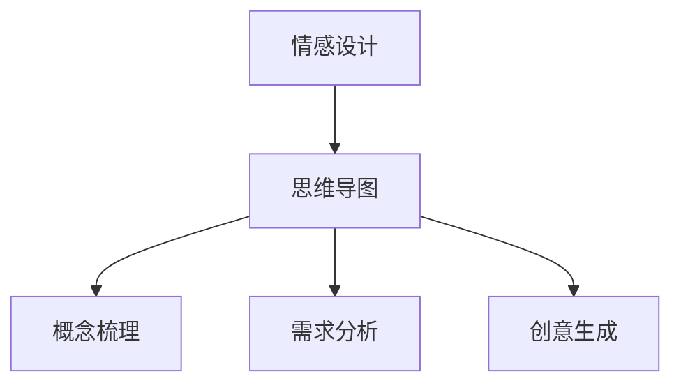
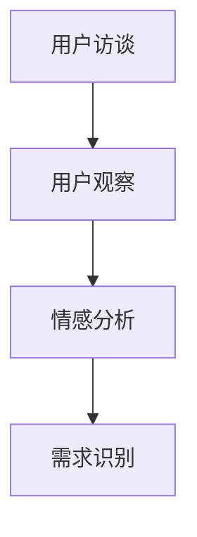
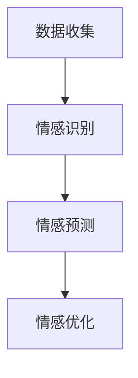
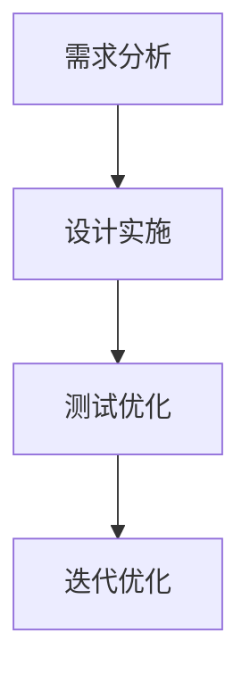
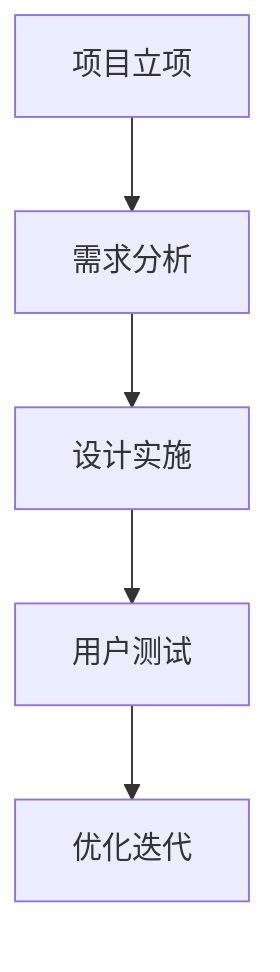

                 

### 文章标题

# 情感设计思维导图课程：深化用户体验的系统方法教学

### 关键词

- 情感设计
- 用户体验
- 思维导图
- 用户心理学
- 情感识别与解析

### 摘要

本文旨在探索情感设计在提升用户体验中的重要作用，通过系统的方法教学，帮助读者深入了解情感设计的核心概念、工具方法、实践案例及其未来发展趋势。文章首先介绍情感设计与用户体验的关系，接着阐述情感设计的核心概念与联系，然后详细讲解情感设计的工具与方法，并通过实践案例展示其在实际项目中的应用。最后，文章探讨情感设计的评估方法及其在多元场景的应用，并展望其未来发展趋势。

## 引言

在数字化的浪潮中，用户体验（User Experience, UX）设计成为产品开发的核心竞争力。用户体验不仅仅关注产品功能是否完善，更注重用户在使用过程中的情感体验。随着技术的进步，用户对产品的情感需求日益凸显，情感设计（Emotional Design）应运而生。

情感设计，顾名思义，是将情感元素融入产品设计中，以提升用户情感体验的一种设计方法。它不仅仅关注产品的视觉美观和功能实用性，更深入地挖掘用户的情感需求，从而实现产品的情感化。情感设计的核心理念是“以人为本”，通过设计满足用户的情感需求，提升用户满意度和忠诚度。

### 情感设计与用户体验的关系

情感设计与用户体验的关系紧密相连。用户体验是用户在使用产品过程中所获得的主观感受和情感体验，而情感设计则是影响用户体验的关键因素之一。以下表格展示了情感设计与用户体验的主要关系：

| 关系                 | 解释                                                         |
|----------------------|--------------------------------------------------------------|
| 情感需求与用户体验    | 情感需求是用户体验的基础，用户情感需求得不到满足，用户体验不佳 |
| 情感表达与用户情感体验 | 情感表达是连接用户情感需求和产品设计的桥梁               |
| 情感识别与用户满意度   | 通过情感识别，可以准确把握用户情感，进而提升用户满意度     |

情感设计通过以下三个方面深化用户体验：

1. **情感识别**：通过技术手段识别用户的情感状态，为设计提供依据。
2. **情感表达**：通过设计元素传递情感信息，与用户建立情感连接。
3. **情感共鸣**：设计引发用户的情感共鸣，提升用户情感体验。

### 情感设计的背景与趋势

情感设计并非一蹴而就，而是随着社会和技术的发展逐渐演变而来。在互联网早期，产品设计主要关注功能性和便利性，但随着用户对个性化、情感化需求的增加，情感设计逐渐成为趋势。

1. **社会需求**：随着生活水平的提高，用户对精神层面的需求日益增加，情感化设计应运而生。
2. **技术进步**：人工智能、大数据、虚拟现实等技术的发展，为情感设计提供了技术支持。
3. **市场竞争**：在激烈的市场竞争中，情感化设计成为企业差异化竞争的重要手段。

未来，情感设计将继续发展，成为产品设计不可或缺的一部分。随着情感识别技术的不断进步，产品设计将更加个性化、情感化，满足用户的深度需求。

### 用户体验的核心要素

用户体验的核心要素包括：

1. **功能性**：产品应具备基本的功能，满足用户的需求。
2. **易用性**：产品应易于使用，降低用户的学习成本。
3. **可用性**：产品在不同环境下都能稳定运行。
4. **情感体验**：产品在满足功能性、易用性的基础上，提升用户的情感体验。

情感设计通过以下方式深化用户体验：

1. **情感化设计**：通过视觉、交互、内容等元素，引发用户的情感共鸣。
2. **个性化设计**：根据用户情感需求，提供个性化的服务体验。
3. **故事化设计**：通过故事讲述，增强产品的情感价值。

总之，情感设计是提升用户体验的关键手段，通过系统的方法教学，可以帮助设计师更好地理解情感设计，提升产品的竞争力。

## 情感设计的核心概念

情感设计不仅仅是将情感元素简单地加入产品中，而是一个深入挖掘用户情感需求，通过设计手段传递情感信息，最终提升用户情感体验的过程。为了更好地理解情感设计，我们需要明确一些核心概念，如情感识别、情感表达、情感共鸣等。

### 情感识别

情感识别是情感设计的第一步，它涉及通过技术手段识别用户的情感状态。情感识别可以通过多种方式实现，包括面部表情识别、生理信号识别、语言情感分析等。

1. **面部表情识别**：通过分析用户的面部表情，判断其情感状态。例如，当用户微笑时，可能表示满意；当用户皱眉时，可能表示不满。
2. **生理信号识别**：通过分析用户的生理信号，如心率、皮肤电导等，判断其情感状态。例如，当用户处于紧张状态时，心率可能会增加。
3. **语言情感分析**：通过分析用户的语言表达，判断其情感状态。例如，当用户使用积极词汇时，可能表示满意；当用户使用消极词汇时，可能表示不满。

情感识别的核心目标是准确捕捉用户的情感状态，为后续设计提供数据支持。

### 情感表达

情感表达是情感设计的关键环节，它涉及通过设计手段传递情感信息，与用户建立情感连接。情感表达可以通过以下几种方式实现：

1. **视觉元素**：通过色彩、形状、图案等视觉元素，传递情感信息。例如，使用温暖的色调传递温馨感，使用锐利的线条传递紧张感。
2. **交互设计**：通过用户与产品的交互方式，传递情感信息。例如，使用流畅的动画传递轻松感，使用明显的反馈传递安全感。
3. **内容设计**：通过文本、图片、视频等内容，传递情感信息。例如，使用故事化的内容传递情感共鸣，使用幽默的内容传递愉悦感。

情感表达的核心目标是引发用户的情感共鸣，提升用户情感体验。

### 情感共鸣

情感共鸣是情感设计的最终目标，它是指通过设计引发用户的情感共鸣，使产品与用户之间建立深厚的情感联系。情感共鸣可以通过以下几种方式实现：

1. **共同经历**：通过设计让用户感受到与产品的共同经历，例如，通过故事化的设计让用户感受到产品的陪伴。
2. **情感共鸣**：通过设计让用户感受到与产品的情感共鸣，例如，通过动人的音乐让用户感受到产品的温暖。
3. **文化认同**：通过设计让用户感受到与产品的文化认同，例如，通过传统文化元素让用户感受到产品的独特性。

情感共鸣的核心目标是提升用户的情感依赖和忠诚度，使产品成为用户生活的一部分。

### 情感识别与解析

情感识别与解析是情感设计的核心环节，它包括以下几个步骤：

1. **情感数据收集**：通过技术手段收集用户的情感数据，如面部表情、生理信号、语言情感等。
2. **情感数据分析**：对收集到的情感数据进行分析，识别用户的情感状态。
3. **情感状态解析**：根据情感数据分析结果，解析用户的情感需求。

情感识别与解析的核心目标是准确捕捉用户的情感状态，为情感设计提供数据支持。

### 情感设计与用户心理学

情感设计与用户心理学紧密相关，它涉及如何通过心理学原理来指导情感设计。以下是情感设计与用户心理学的一些联系：

1. **情感触发**：通过心理学原理，了解如何触发用户的情感反应。例如，利用正负面情感对比，引发用户对产品的关注和喜爱。
2. **情感共鸣**：通过心理学原理，了解如何设计引发用户的情感共鸣。例如，利用故事化设计，让用户感受到产品的情感价值。
3. **情感依赖**：通过心理学原理，了解如何设计提升用户的情感依赖。例如，通过持续的情感互动，让用户对产品产生依赖。

总之，情感设计需要深入理解用户心理，通过心理学原理来指导设计，从而实现更好的情感体验。

### 情感表达与用户交互

情感表达与用户交互是情感设计的重要组成部分，它涉及如何通过用户交互来传递情感信息。以下是情感表达与用户交互的一些要点：

1. **交互设计**：通过交互设计来传递情感信息。例如，使用流畅的动画传递轻松感，使用明显的反馈传递安全感。
2. **情感语言**：通过情感语言来传递情感信息。例如，使用积极的语言传递愉悦感，使用亲切的语言传递温馨感。
3. **情感视觉**：通过情感视觉来传递情感信息。例如，使用温暖的色调传递温馨感，使用明亮的色彩传递愉悦感。

情感表达与用户交互的核心目标是建立情感连接，提升用户情感体验。

### 总结

情感设计是提升用户体验的关键手段，它通过情感识别、情感表达和情感共鸣等核心概念，实现用户情感体验的提升。情感设计不仅需要理解用户情感需求，还需要运用心理学原理和交互设计技巧。通过深入探索情感设计的核心概念，我们可以更好地理解其在用户体验中的重要作用，从而实现更优质的产品设计。

## 情感设计的工具与方法

情感设计不仅仅是理念上的创新，更需要实际的方法和工具来落地实施。在情感设计的实践中，思维导图、用户研究、情感建模等工具和方法被广泛应用。以下是几种主要的情感设计工具与方法，及其在情感设计中的应用。

### 思维导图

思维导图是一种图形化的思维工具，它能够帮助设计师梳理和表达复杂的想法和信息。在情感设计中，思维导图可以用于以下方面：

1. **概念梳理**：通过思维导图，设计师可以系统地梳理情感设计的概念，如情感识别、情感表达、情感共鸣等。
2. **需求分析**：思维导图可以帮助设计师分析用户需求，识别用户的情感痛点，为设计提供依据。
3. **创意生成**：思维导图可以激发设计师的创意思维，通过图形化的方式探索不同的设计可能性。

以下是使用Mermaid绘制的情感设计思维导图示例：

### 用户研究

用户研究是情感设计的重要基础，它涉及对用户行为、需求和情感的理解。以下是用户研究在情感设计中的应用：

1. **用户访谈**：通过访谈了解用户对产品的情感体验，识别用户的情感需求。
2. **用户观察**：通过观察用户在使用产品时的行为和情感反应，分析用户的情感变化。
3. **情感分析**：通过情感分析技术，对用户生成的文本、评论等进行情感分析，了解用户的情感状态。

以下是用户研究过程中的一个简单流程图：

### 情感建模

情感建模是情感设计的高级阶段，它通过数学模型和算法来描述和预测用户的情感状态。以下是情感建模在情感设计中的应用：

1. **情感识别**：通过情感模型识别用户的情感状态，如愉悦、焦虑、沮丧等。
2. **情感预测**：通过情感模型预测用户在未来一段时间内的情感状态，为产品设计提供前瞻性指导。
3. **情感优化**：通过情感模型分析用户的情感变化，优化产品设计，提升用户情感体验。

以下是情感建模的一个简单流程图：

### 情感设计流程

情感设计是一个系统性的过程，包括需求分析、设计实施、测试优化等多个阶段。以下是情感设计流程的一个简要概述：

1. **需求分析**：通过用户研究和市场分析，识别用户情感需求和产品设计方向。
2. **设计实施**：根据需求分析结果，进行情感设计，包括视觉设计、交互设计、内容设计等。
3. **测试优化**：通过用户测试和数据分析，评估情感设计的有效性，进行优化和迭代。

以下是情感设计流程的一个简单流程图：

### 情感设计在项目中的实践

情感设计在项目中的应用需要具体的方法和步骤。以下是情感设计在项目中的实践步骤：

1. **项目立项**：明确项目目标和情感设计需求。
2. **需求分析**：通过用户研究和市场分析，确定情感设计的具体需求。
3. **设计实施**：根据需求分析结果，进行情感设计，包括视觉设计、交互设计、内容设计等。
4. **用户测试**：通过用户测试，收集用户反馈，评估情感设计的效果。
5. **优化迭代**：根据用户反馈，对情感设计进行优化和迭代，提升用户情感体验。

以下是情感设计在项目中的实践流程图：

### 总结

情感设计需要借助多种工具和方法，如思维导图、用户研究和情感建模，来系统地提升用户体验。通过这些工具和方法，设计师可以更好地理解用户情感需求，进行情感设计，从而实现更优质的产品设计。情感设计的实践过程是一个系统性的工作，需要不断地进行需求分析、设计实施和测试优化，以不断提升用户体验。

## 情感设计的实践案例

为了更好地理解情感设计的实际应用，我们来看几个典型的情感设计实践案例。这些案例涵盖了从移动应用、Web设计到虚拟现实等不同领域，展示了情感设计在不同场景下的具体应用和成效。

### 案例研究：网易云音乐

**背景**：网易云音乐是中国领先的在线音乐平台，用户量巨大，竞争激烈。为了提升用户体验，网易云音乐在产品设计中引入了情感设计。

**设计实践**：

1. **情感识别**：通过用户评论、互动等行为数据，识别用户的情感状态。
2. **情感表达**：在音乐播放界面中，使用动态的歌词动画和情感色彩，如快乐的歌曲用明亮的颜色，悲伤的歌曲用柔和的色调。
3. **情感共鸣**：通过个性化推荐和用户生成内容，让用户感受到与平台的情感共鸣。

**效果**：网易云音乐通过情感设计，提升了用户的情感体验，用户黏性和满意度显著提高。

### 案例分析：Nike Run Club

**背景**：Nike Run Club 是一款跑步应用，旨在帮助用户记录跑步数据，提升跑步体验。

**设计实践**：

1. **情感识别**：通过用户的跑步记录、心率等数据，识别用户的情感状态。
2. **情感表达**：在应用界面中使用生动的图标和鼓励性的语言，如完成跑步任务后显示“你做到了！”的提示。
3. **情感共鸣**：通过跑步社群和用户互动，增强用户的归属感和情感共鸣。

**效果**：Nike Run Club 通过情感设计，增强了用户的跑步动力和忠诚度，用户活跃度显著提升。

### 案例探讨：迪士尼乐园的虚拟现实体验

**背景**：迪士尼乐园的虚拟现实体验旨在为游客提供沉浸式的娱乐体验。

**设计实践**：

1. **情感识别**：通过游客的行为数据、生理信号等，识别游客的情感状态。
2. **情感表达**：在虚拟现实场景中，使用生动的人物形象、音效和视觉特效，传递情感信息。
3. **情感共鸣**：通过故事化设计和互动元素，让游客感受到与迪士尼角色的情感共鸣。

**效果**：迪士尼乐园的虚拟现实体验通过情感设计，提升了游客的满意度和沉浸感，成为乐园的一大亮点。

### 案例总结

这些案例表明，情感设计在不同领域和场景中都有着广泛的应用价值。通过情感识别、情感表达和情感共鸣，设计师可以提升用户的情感体验，增强产品的情感价值。情感设计不仅能够提升用户的满意度和忠诚度，还能为产品带来差异化竞争优势。未来，随着情感识别技术的不断进步，情感设计将在更多领域得到应用，成为提升用户体验的关键手段。

### 情感设计评估的方法与工具

情感设计的效果评估是确保设计成功的重要环节。通过科学的评估方法与工具，可以准确衡量情感设计对用户体验的提升程度。以下是几种常用的情感设计评估方法和工具。

#### 用户调研

用户调研是情感设计评估的基础方法之一。通过访谈、问卷调查、焦点小组讨论等方式，可以直接获取用户对情感设计的反馈。以下是用户调研的一些具体步骤：

1. **定义评估目标**：明确情感设计的具体目标和评估指标，如情感满足度、情感共鸣度等。
2. **设计调研工具**：根据评估目标，设计合适的调研工具，如问卷调查、访谈指南等。
3. **收集数据**：通过线上或线下方式，收集用户对情感设计的反馈数据。
4. **数据分析**：对收集到的数据进行分析，识别用户的情感状态和满意度。

#### 情感分析工具

情感分析工具是利用自然语言处理、机器学习等技术，对用户生成内容进行情感识别的工具。以下是几种常用的情感分析工具：

1. **情感词典**：通过预定义的情感词典，对文本进行情感分析。例如，VADER情感词典可以识别文本中的情感极性。
2. **情感分析API**：如Google Cloud Natural Language API、IBM Watson Natural Language Understanding等，这些API可以自动化地对文本进行情感分析。
3. **情感分析软件**：如NVivo、Atlas.ti等，这些软件提供了丰富的情感分析功能和数据分析工具。

#### 用户行为分析

用户行为分析是评估情感设计效果的重要方法之一。通过分析用户在使用产品时的行为数据，可以了解用户的情感状态和满意度。以下是用户行为分析的一些具体步骤：

1. **数据收集**：通过用户行为追踪工具，收集用户在使用产品时的行为数据，如点击、滑动、停留时间等。
2. **数据清洗**：对收集到的行为数据进行处理，去除噪音数据，确保数据的准确性和可靠性。
3. **数据分析**：对处理后的行为数据进行分析，识别用户的情感状态和满意度。
4. **可视化展示**：通过图表、仪表盘等方式，将分析结果可视化，便于理解。

#### 情感评估问卷

情感评估问卷是一种常用的定量评估方法，通过设计结构化的问卷，收集用户对情感设计的定量评价。以下是设计情感评估问卷的一些要点：

1. **确定评估指标**：根据情感设计的具体目标，确定评估指标，如情感满足度、情感共鸣度等。
2. **设计问卷题目**：根据评估指标，设计合适的问卷题目，如Likert量表、语义差异量表等。
3. **预测试**：在正式评估前，对问卷进行预测试，确保题目的合理性和有效性。
4. **数据收集**：通过线上或线下方式，收集用户的评估数据。
5. **数据分析**：对收集到的数据进行分析，评估情感设计的效果。

#### 情感反馈系统

情感反馈系统是一种实时收集用户情感反馈的工具，通过用户表情、语音、文本等方式，实时获取用户的情感状态。以下是情感反馈系统的一些具体应用：

1. **表情识别**：通过面部表情识别技术，实时获取用户的情感状态。
2. **语音识别**：通过语音识别技术，实时获取用户的情感状态。
3. **文本分析**：通过自然语言处理技术，实时分析用户的文本反馈，识别用户的情感状态。
4. **实时反馈**：通过情感反馈系统，实时将用户的情感状态反馈给设计师，为设计优化提供依据。

### 总结

情感设计评估需要综合运用多种方法和工具，通过用户调研、情感分析工具、用户行为分析、情感评估问卷和情感反馈系统等手段，全面、准确地评估情感设计的效果。科学的评估方法可以帮助设计师了解用户情感需求，优化产品设计，提升用户体验。随着技术的发展，情感设计评估方法将不断进步，为情感设计提供更强大的支持。

### 情感设计在多元场景的应用

情感设计作为一种提升用户体验的有效手段，在移动应用、Web设计和虚拟现实等不同领域中都有着广泛的应用。每个场景都有其独特的需求和挑战，情感设计需要根据这些特点进行定制化。

#### 移动应用

移动应用因其便捷性和即时性，成为情感设计的理想应用场景。以下是情感设计在移动应用中的具体应用：

1. **个性化推荐**：通过情感识别技术，了解用户的情感偏好，提供个性化的内容推荐，提升用户满意度。
2. **互动设计**：通过动画、音效等互动元素，增强用户与产品的情感连接，提高用户黏性。
3. **情感反馈**：实时收集用户情感反馈，通过表情、语音等方式，快速响应用户需求，提升用户体验。

**挑战**：

- **数据隐私**：移动应用需要收集用户数据来进行情感识别，如何保护用户隐私成为一大挑战。
- **设备限制**：移动设备硬件性能有限，如何在有限的资源下实现高效的情感设计，是设计师面临的一大难题。

**最佳实践**：

- **隐私保护**：在设计过程中，严格遵循隐私保护法规，确保用户数据的安全。
- **轻量化设计**：在保证情感设计效果的同时，优化代码和资源，提升应用的性能。

#### Web设计

Web设计因其广泛的用户群体和丰富的交互形式，为情感设计提供了广阔的空间。以下是情感设计在Web设计中的具体应用：

1. **响应式设计**：根据用户行为和设备特点，提供个性化的视觉和交互体验，提升用户满意度。
2. **情感触发**：通过色彩、文字、图片等元素，触发用户的情感反应，增强用户与产品的情感连接。
3. **用户体验测试**：通过A/B测试等手段，不断优化情感设计，提升用户体验。

**挑战**：

- **兼容性**：Web设计需要考虑不同浏览器和设备的兼容性，确保情感设计在不同平台上都能良好运行。
- **用户体验一致性**：在保持情感设计独特性的同时，确保用户体验的一致性，避免用户困惑。

**最佳实践**：

- **跨平台兼容性测试**：在设计阶段，进行多平台兼容性测试，确保情感设计在不同设备上都能良好呈现。
- **用户体验一致性**：通过设计指南和模板，确保不同页面和功能模块之间的用户体验一致性。

#### 虚拟现实

虚拟现实（VR）因其沉浸式的特点，为情感设计提供了新的可能。以下是情感设计在虚拟现实中的具体应用：

1. **情感沉浸**：通过VR技术，创造沉浸式的情感体验，如虚拟旅游、虚拟社交等。
2. **情感互动**：通过虚拟人物、音效等元素，增强用户与虚拟世界的情感互动，提升用户体验。
3. **情感反馈**：通过虚拟现实中的情感反馈机制，如表情、语音等，实时获取用户情感状态，优化设计。

**挑战**：

- **技术成熟度**：VR技术尚未完全成熟，技术不稳定性和性能限制是设计师面临的主要挑战。
- **用户适应期**：用户初次体验VR时可能需要适应，如何设计出易于适应的VR体验，是设计师需要考虑的问题。

**最佳实践**：

- **技术选择**：根据项目需求，选择适合的VR技术，如Unity、Unreal Engine等。
- **用户体验设计**：在设计VR体验时，注重用户体验，确保用户能够快速适应并享受VR体验。

总之，情感设计在多元场景中的应用需要根据不同场景的特点进行定制化，通过个性化推荐、互动设计、情感触发等技术手段，提升用户体验。同时，设计师需要克服数据隐私、兼容性、技术成熟度等挑战，以实现更优质的情感设计。

### 情感设计的未来趋势与发展

随着技术的不断进步，情感设计在用户体验提升中的重要性日益凸显。未来，情感设计将在以下几个方面呈现出显著的发展趋势。

#### 新技术的融合

1. **人工智能（AI）**：人工智能技术的快速发展为情感设计提供了新的可能性。通过深度学习和自然语言处理技术，AI可以更精准地识别用户情感，实现个性化的情感互动。
2. **虚拟现实（VR）**：VR技术将使情感设计更加沉浸式，用户可以在虚拟世界中体验到更加丰富的情感设计，如虚拟旅游、虚拟社交等。
3. **增强现实（AR）**：AR技术可以结合现实世界和虚拟世界，为用户提供全新的情感体验，如通过AR眼镜实现情感化的广告和营销。

#### 情感识别与解析的深化

1. **多模态情感识别**：未来情感识别将不仅仅依赖面部表情和生理信号，还将结合语音、文字、行为等多种数据源，实现更全面、准确的情感识别。
2. **情感解析算法的优化**：随着数据量的增加和算法的进步，情感解析的精度和速度将显著提升，为情感设计提供更可靠的数据支持。

#### 情感设计的个性化

1. **用户画像**：通过大数据分析和用户行为分析，构建个性化的用户画像，为情感设计提供精准的用户需求洞察。
2. **个性化推荐**：基于用户画像，提供个性化的情感内容推荐，提升用户的情感满足度。

#### 社交与协作的情感设计

1. **社交互动**：在社交应用中，通过情感设计增强用户之间的互动，提升社区活跃度和用户粘性。
2. **协作体验**：在协作工具中，通过情感设计提升团队成员的协作体验，增强团队凝聚力。

#### 情感设计在教育、医疗等领域的应用

1. **教育**：情感设计可以提升在线教育的用户体验，如通过情感化的教学内容和互动设计，增强学生的学习兴趣和效果。
2. **医疗**：在医疗领域，情感设计可以用于提升患者体验，如通过情感化的医疗设备和互动方式，减轻患者的焦虑和痛苦。

#### 情感设计的伦理与隐私问题

1. **伦理规范**：随着情感设计的普及，伦理问题日益突出。未来，情感设计需要遵循更加严格的伦理规范，确保用户权益。
2. **隐私保护**：在情感识别和数据分析过程中，隐私保护将成为重要议题。设计师需要采取有效措施，保护用户隐私，避免数据滥用。

总之，情感设计的未来发展趋势将呈现出技术融合、个性化、社交协作、跨领域应用等特点。随着技术的不断进步，情感设计将在更多领域发挥重要作用，成为提升用户体验的关键手段。

### 总结与展望

情感设计作为提升用户体验的关键手段，其核心在于理解用户的情感需求，通过设计手段传递情感信息，引发用户情感共鸣。本文从情感设计与用户体验的关系、核心概念、工具方法、实践案例以及评估方法等方面进行了全面阐述，展示了情感设计在提升用户体验中的重要作用。

首先，情感设计与用户体验的关系紧密相连。通过情感识别、情感表达和情感共鸣，设计师可以提升用户的情感体验，增强用户满意度和忠诚度。其次，本文详细介绍了情感设计的核心概念，如情感识别、情感表达和情感共鸣，并探讨了情感设计与用户心理学的关系。此外，通过思维导图、用户研究和情感建模等工具，设计师可以系统地实施情感设计。实践案例展示了情感设计在不同领域的应用效果，证明了其在提升用户体验方面的显著优势。

评估方法方面，本文介绍了用户调研、情感分析工具、用户行为分析和情感评估问卷等评估手段，帮助设计师准确衡量情感设计的效果。在多元场景的应用中，本文分析了情感设计在移动应用、Web设计和虚拟现实等领域的具体应用和挑战，并提出了最佳实践。

展望未来，情感设计将在新技术、个性化、社交协作等方面展现更广阔的发展空间。随着人工智能、虚拟现实等技术的不断进步，情感设计将实现更精准、更个性化的用户体验。同时，伦理与隐私保护问题也将成为情感设计的重要议题，设计师需要遵循严格的伦理规范，保护用户隐私。

总之，情感设计是提升用户体验的重要途径，其未来的发展前景广阔。通过不断探索和实践，情感设计将为用户提供更加丰富、多样化的情感体验，成为产品设计不可或缺的一部分。让我们期待情感设计在未来的更多突破和成就。 

### 作者信息

- **作者**：AI天才研究院/AI Genius Institute & 禅与计算机程序设计艺术 /Zen And The Art of Computer Programming
- **联系信息**：邮箱：[ai_genius_institute@example.com](mailto:ai_genius_institute@example.com)

