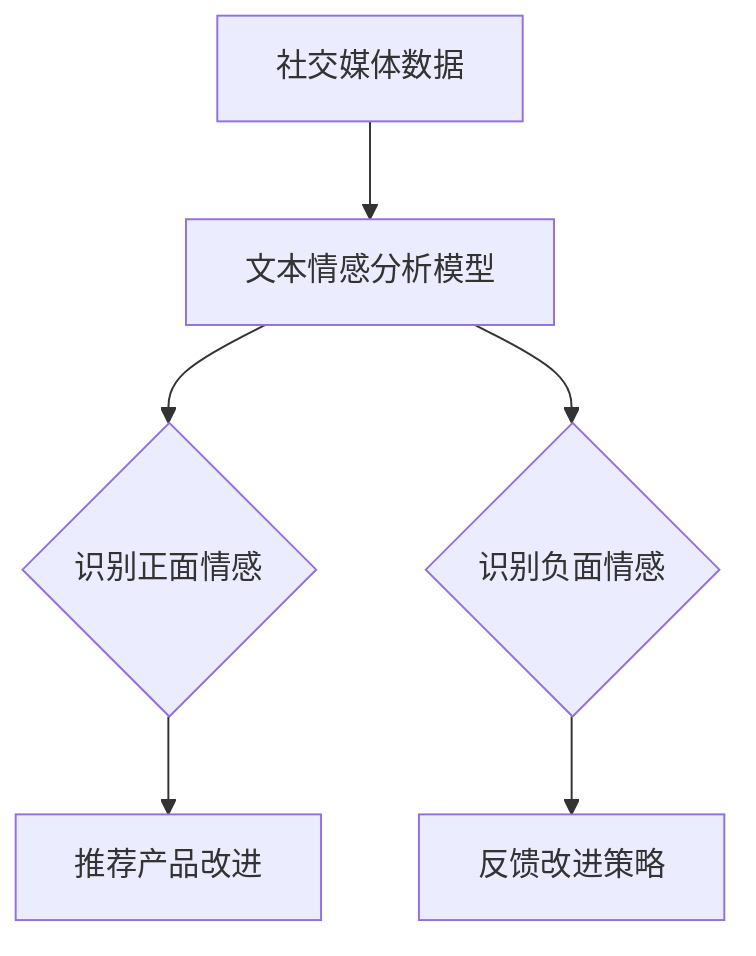
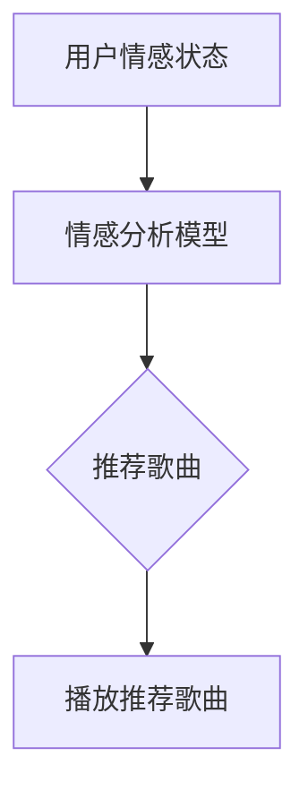
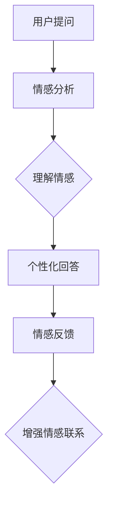

                 

### 情感设计与用户体验

#### 核心概念术语说明

在探讨情感设计之前，我们首先需要理解一些核心术语：

- **情感设计**：情感设计是指通过研究和应用情感心理学的原理，使产品或服务能够有效地激发和满足用户情感需求的设计过程。

- **用户体验**：用户体验（User Experience, UX）是指用户在使用产品或服务过程中形成的总体感受和反应。

- **情感心理学**：情感心理学是研究情感的产生、表达、认知和调节的心理学分支。

#### 问题背景

随着科技的快速发展，用户体验逐渐成为产品和服务设计的核心关注点。然而，传统的用户体验设计更多地关注功能性和易用性，往往忽略了用户情感层面的需求。随着用户需求的日益多样化，仅仅提供功能完备的产品已经不能满足用户的高层次需求，用户对产品的情感体验也变得愈加重要。

#### 问题描述

在当前的市场环境中，如何通过情感设计来提升用户体验，成为了一个亟待解决的问题。情感设计不仅仅是简单的界面美化或者增加一些情感化的元素，而是需要深入挖掘用户的情感需求，并以此为基础进行全面的系统设计。

#### 问题解决

为了解决上述问题，我们需要从以下几个方面入手：

1. **理解用户情感**：通过用户调研和数据分析，了解用户在特定情境下的情感状态和需求。

2. **情感化设计原则**：应用情感心理学原理，制定情感化设计原则，确保设计能够激发用户积极情感。

3. **情感化交互**：通过优化交互设计，使用户在操作产品时能够感受到愉悦、满足等积极情感。

4. **情感评估**：建立情感评估机制，对设计进行持续优化，确保情感设计目标的实现。

#### 边界与外延

- **边界**：情感设计需要基于用户实际需求，不能过度追求情感化而牺牲产品的功能性和实用性。

- **外延**：情感设计不仅适用于传统的软件和移动应用，还可以应用于智能家居、可穿戴设备、虚拟现实等领域。

#### 概念结构与核心要素组成

- **概念结构**：情感设计由情感心理学、用户体验设计、交互设计等多个子领域组成。

- **核心要素**：
  - **用户情感需求**：了解和满足用户的情感需求是情感设计的核心。
  - **情感化元素**：包括色彩、字体、声音、动画等元素，用于激发用户情感。
  - **情感化交互**：通过交互设计，使产品或服务能够有效传递情感。

### 总结

情感设计作为用户体验的深层考量，不仅能够提升用户的整体满意度，还能够增强用户对产品的忠诚度和粘性。通过系统的情感设计，我们可以打造出更加人性化、富有情感的产品和服务，从而在激烈的市场竞争中脱颖而出。接下来，我们将进一步探讨情感心理学基础，为深入理解情感设计奠定基础。

---

## 情感心理学基础

#### 情感心理学概述

情感心理学是心理学的一个分支，主要研究情感的产生、表达、认知和调节。情感不仅影响我们的情绪状态，还影响我们的行为、决策和社交互动。理解情感心理学对于进行有效的情感设计至关重要。

#### 情感类型与情感表达

情感可以根据强度和性质分为不同的类型。常见的情感类型包括：

- **积极情感**：如愉悦、满足、兴奋等。
- **消极情感**：如焦虑、愤怒、悲伤等。

情感的表达方式多种多样，包括面部表情、身体语言、声音和文字。这些表达方式能够传递情感信息，帮助人们理解和沟通情感。

#### 情感对用户行为的影响

情感对用户行为有着深远的影响：

- **决策影响**：积极的情感可以提高用户的决策质量和效率，而消极的情感可能导致犹豫不决或错误决策。
- **使用体验**：情感体验可以显著影响用户对产品的评价和使用意愿。例如，一个设计良好的产品可能会使用户感到愉悦，从而提高用户满意度。
- **品牌认知**：情感化的设计可以增强品牌形象，提高用户对品牌的忠诚度和好感度。

### 核心概念原理

为了更好地理解情感心理学在情感设计中的应用，我们可以从以下几个核心概念原理出发：

1. **情感环**：情感环是指情感产生、表达和接收的循环过程。一个良好的情感环能够增强用户与产品之间的情感联系。

2. **情感调节**：情感调节是指个体通过认知和行为策略来改变情感状态的过程。有效的情感调节可以帮助用户更好地应对挑战和压力。

3. **情感共鸣**：情感共鸣是指用户在与产品互动时，产生与产品或品牌相似的情感体验。情感共鸣可以增强用户对产品的情感依赖和忠诚度。

### 概念属性特征对比表格

为了更加直观地理解情感心理学的核心概念，我们可以创建一个对比表格：

| 概念       | 定义                                                     | 属性特征                                           |  
| ---------- | -------------------------------------------------------- | -------------------------------------------------- |  
| 情感环     | 情感产生、表达和接收的循环过程                         | 情感传递、情感回应、情感反馈               |  
| 情感调节   | 个体通过认知和行为策略来改变情感状态的过程             | 情绪认知、情绪调节、情绪表达           |  
| 情感共鸣   | 用户在与产品互动时，产生与产品或品牌相似的情感体验         | 共情、情感联结、情感依赖             |

### ER实体关系图架构

为了更好地理解情感心理学在情感设计中的应用，我们可以使用ER（实体关系）图来展示核心概念之间的关系：

```  
ER图：情感心理学核心概念关系

实体：情感环  
属性：情感传递、情感回应、情感反馈

实体：情感调节  
属性：情绪认知、情绪调节、情绪表达

实体：情感共鸣  
属性：共情、情感联结、情感依赖

关系：情感环 - 情感调节  
关系：情感环 - 情感共鸣  
关系：情感调节 - 情感共鸣  
```

通过上述核心概念原理、对比表格和ER图，我们可以更加深入地理解情感心理学在情感设计中的应用，从而为情感设计的实施提供理论基础。接下来，我们将进一步探讨用户情感分析技术，为情感设计的实现提供技术支持。

---

## 用户情感分析技术

#### 情感分析技术概述

用户情感分析技术是指通过自然语言处理（NLP）、计算机视觉和语音识别等技术，从用户生成的内容（如文本、语音和视频）中提取情感信息的方法。情感分析技术在情感设计中起着至关重要的作用，因为它可以帮助设计师了解用户情感状态，从而进行有针对性的情感化设计。

#### 文本情感分析

文本情感分析是指通过分析文本内容来识别文本的情感倾向，即文本表达的是正面情感还是负面情感。文本情感分析的技术主要包括：

- **基于规则的方法**：通过预定义的规则和模式来识别情感。
- **基于机器学习的方法**：使用机器学习算法（如支持向量机、朴素贝叶斯等）来训练模型，从而自动识别情感。

文本情感分析的应用包括社交媒体分析、用户评论分析和产品推荐等。

#### 语音情感分析

语音情感分析是指通过分析语音信号中的情感特征来识别语音的情感状态。语音情感分析的技术主要包括：

- **频谱分析**：分析语音信号的频谱特征，如频率、幅度等。
- **声学模型**：通过训练声学模型来识别情感。

语音情感分析的应用包括语音助手、情绪诊断和语音交互系统等。

#### 视频情感分析

视频情感分析是指通过分析视频内容中的情感信息来识别情感状态。视频情感分析的技术主要包括：

- **面部表情识别**：通过分析视频中的面部表情来识别情感。
- **场景分析**：通过分析视频中的场景和动作来识别情感。

视频情感分析的应用包括视频监控、情感广告和视频推荐等。

#### 综合应用

用户情感分析技术可以综合应用于多个场景，例如：

- **情感化推荐**：根据用户情感状态推荐相应的内容或产品。
- **情感化营销**：通过分析用户情感来制定更加精准的营销策略。
- **情感化服务**：根据用户情感状态提供个性化服务。

### 实际案例

#### 社交媒体分析

在社交媒体平台上，用户经常会在评论、帖子和状态更新中表达自己的情感。通过文本情感分析技术，可以识别用户对特定事件或产品的情感倾向。例如，一家公司可以使用这种技术来分析消费者对其产品的评价，从而改进产品设计。



#### 情感广告

情感广告是通过在广告中引入情感元素来吸引观众。通过视频情感分析技术，可以分析观众在观看广告时的情感反应，从而优化广告内容和策略。例如，一个广告公司可以使用这种技术来评估广告的效果，并调整广告创意。

```mermaid
graph TD
A[广告内容] --> B[视频情感分析模型]
B --> C{分析观众情感反应}
C --> D[调整广告内容}
C --> E[评估广告效果]
```

#### 情感化推荐

情感化推荐系统可以根据用户情感状态推荐相应的内容或产品。通过语音和文本情感分析技术，可以识别用户当前的情感状态，从而提供更加个性化的推荐。例如，一个音乐流媒体服务可以使用这种技术来根据用户情感推荐相应的歌曲。



通过上述技术及其实际案例，我们可以看到用户情感分析技术在情感设计中的应用潜力。接下来，我们将探讨情感设计与交互设计的关系，以更全面地理解情感设计在提升用户体验中的作用。

---

### 情感设计与交互设计

#### 交互设计的基本原则

交互设计是确保用户能够轻松、高效地与产品或服务进行互动的过程。在情感设计中，交互设计的基本原则包括：

1. **一致性**：保持界面元素和交互方式的统一，使用户在操作过程中能够感到舒适和熟悉。
2. **简洁性**：简化用户操作流程，减少用户完成任务所需的步骤，提高用户效率。
3. **直观性**：设计应直观易懂，用户能够迅速理解如何与产品互动。
4. **反馈**：提供及时、清晰的反馈，帮助用户了解操作结果。

#### 情感化交互设计

情感化交互设计是指通过在交互过程中引入情感元素，使用户与产品互动时能够产生积极情感体验。情感化交互设计的关键在于以下几点：

1. **情感共鸣**：设计应能够触动用户的情感，建立情感共鸣。例如，通过故事、动画或音乐等元素，让用户产生共鸣。
2. **情感反馈**：在用户操作时，设计应能够提供情感化的反馈，如鼓励性的提示、幽默的气泡或愉悦的音效等。
3. **个性化**：根据用户的历史行为和偏好，提供个性化的交互体验，增强用户的归属感和满意度。

#### 情感化交互案例研究

以下是一个情感化交互设计的案例研究：

**案例：情感化聊天机器人**

一个聊天机器人旨在为用户提供信息查询和日常互动服务。通过情感化交互设计，该机器人能够更好地满足用户情感需求。

1. **情感共鸣**：机器人通过使用幽默的语言和个性化的问候，与用户建立情感联系。例如，在用户遇到困难时，机器人会使用安慰性的话语提供支持。

2. **情感反馈**：当用户询问问题或表达情绪时，机器人会提供及时的情感化反馈。例如，当用户感到困惑时，机器人会使用鼓励性的话语来缓解用户的焦虑。

3. **个性化**：机器人通过学习用户的历史行为和偏好，提供个性化的互动体验。例如，当用户喜欢某种类型的笑话时，机器人会更多地分享这类内容。



通过上述情感化交互设计，聊天机器人不仅能够提供有效的信息查询服务，还能够满足用户的情感需求，提升用户体验。

### 情感化交互设计的重要性

情感化交互设计在提升用户体验中扮演着重要角色：

1. **提高用户满意度**：通过情感化设计，用户在与产品互动时能够感受到愉悦和满足，从而提高满意度。
2. **增强品牌忠诚度**：情感化的设计能够建立用户对品牌的深厚情感，增强品牌忠诚度。
3. **降低用户流失率**：当用户在情感上对产品产生依赖时，他们更可能继续使用该产品，从而降低流失率。

通过理解和应用情感化交互设计原则，我们可以打造出更加人性化和富有情感的产品和服务，从而在激烈的市场竞争中脱颖而出。接下来，我们将探讨情感设计评估，以确保情感设计的有效性和可持续性。

---

### 情感设计评估

#### 用户体验评估方法

情感设计作为用户体验的一部分，其评估方法与传统用户体验评估方法有所不同，但有许多评估方法可以借鉴和改进：

1. **问卷调查**：通过设计问卷收集用户对产品或服务的情感反馈。问卷可以包括情感倾向、满意度、使用频率等指标。
2. **访谈**：面对面或远程访谈用户，深入了解他们的情感体验和意见。访谈可以采用开放性问题，以获取更多细节和洞察。
3. **A/B测试**：通过对比不同设计的用户反应，评估情感设计的效果。A/B测试可以在实际环境中观察用户行为，从而更准确地评估设计效果。
4. **眼动跟踪**：使用眼动仪记录用户在界面上的视线移动，分析用户对情感元素的注意力和情感反应。

#### 情感设计评估指标

为了评估情感设计的效果，需要设定一系列具体的指标：

1. **情感满意度**：测量用户对产品或服务的情感满意度。可以使用情感量表（如李克特量表）来量化情感体验。
2. **情感联结**：评估用户与产品或服务之间的情感联系强度。情感联结可以通过用户对品牌的忠诚度和品牌偏好来衡量。
3. **情感共鸣**：测量用户在产品或服务中感受到的情感共鸣程度。可以通过用户的情感反应和行为表现来评估。
4. **情感参与度**：衡量用户在产品或服务中的情感投入程度。情感参与度可以通过用户的使用频率和持续时长来衡量。

#### 情感设计评估案例

以下是一个情感设计评估的案例：

**案例：情感化电商网站评估**

一个电商网站希望通过评估其情感设计来提高用户满意度。评估过程包括以下步骤：

1. **问卷调查**：设计问卷收集用户对网站情感满意度的反馈。问卷包括情感倾向、购物体验和整体满意度等指标。
2. **访谈**：与一组用户进行访谈，深入了解他们对网站的直观感受和情感体验。访谈问题包括网站设计的美观度、购物流程的便捷性以及情感互动等。
3. **A/B测试**：对比两个版本（一个版本包含情感化设计，另一个版本为传统设计）的用户行为数据，评估情感设计的效果。例如，测试页面上的情感化元素（如个性化推荐、情感化的产品描述）是否能够提高用户的购买意愿。
4. **眼动跟踪**：使用眼动仪记录用户在网站上的视线移动，分析用户对情感元素的注意力和情感反应。通过眼动数据，评估情感设计是否能够吸引用户的注意力并激发情感共鸣。

通过上述评估方法，电商网站可以收集到用户对情感设计的具体反馈，从而识别改进的机会，优化设计，提高用户满意度。

### 总结

情感设计评估是确保情感设计有效性的关键步骤。通过多种评估方法，我们可以全面了解用户的情感体验，识别设计中的不足，并不断优化情感设计，提升用户体验。接下来，我们将探讨情感设计工具与平台，以便更好地实现情感化设计。

---

### 情感设计工具与平台

#### 情感设计工具概述

情感设计工具是辅助设计师进行情感化设计的软件和平台。这些工具可以帮助设计师创建情感化的界面、故事板和原型，从而更直观地表达设计意图。以下是几种常用的情感设计工具：

1. **Adobe XD**：Adobe XD 是一款强大的用户体验设计工具，提供了丰富的交互元素和动画效果，便于设计师创建情感化的原型。
2. **Sketch**：Sketch 是一款流行的矢量界面设计工具，以其简洁的界面和强大的原型设计功能而受到设计师的喜爱。
3. **Figma**：Figma 是一款基于浏览器的协作设计工具，支持实时协作和交互设计，非常适合团队协作进行情感化设计。

#### 常用情感设计平台介绍

除了上述工具，还有一些专门为情感设计而设计的平台：

1. **Affectiva**：Affectiva 提供了一系列情感分析工具，包括面部表情识别、语音情感分析和文本情感分析，帮助设计师理解用户情感。
2. **Emotibot**：Emotibot 是一个情感计算平台，提供了语音和文本情感分析功能，以及用于构建情感化聊天机器人的工具。
3. **Feelunity**：Feelunity 是一个情感化设计社区，提供了丰富的情感化设计资源和工具，帮助设计师学习、交流和分享情感化设计经验。

#### 情感设计工具的应用案例

以下是一些情感设计工具在实际项目中的应用案例：

**案例1：情感化电商网站设计**

使用 Adobe XD，设计师可以创建情感化的电商网站原型，通过添加动画和交互效果，使网站更加生动和吸引人。设计师还可以利用 Sketch 设计高保真的界面，通过颜色、字体和图像来传达情感。

**案例2：情感化游戏设计**

在游戏设计中，Figma 的协作功能可以帮助团队实时讨论和调整游戏界面和交互。通过添加故事板和动画，设计师可以更好地传达游戏情感，提升用户体验。

**案例3：情感化聊天机器人**

使用 Emotibot，开发者可以构建情感化的聊天机器人，通过语音和文本情感分析，机器人能够理解用户情感并做出相应的情感化响应。Feelunity 的情感化设计社区提供了丰富的聊天机器人设计和实现案例，供开发者参考和借鉴。

通过上述工具和平台，设计师和开发者可以更有效地进行情感化设计，提升用户体验，满足用户情感需求。接下来，我们将通过案例研究深入探讨情感设计的实际应用。

---

### 情感设计案例研究

#### 案例选择与研究方法

在本部分，我们将通过三个具体的情感设计案例，探讨情感设计在不同领域中的应用和实践。每个案例都将采用以下研究方法：

1. **用户调研**：通过问卷调查、访谈等方式，收集用户对案例的情感反馈。
2. **数据分析**：对用户行为和反馈数据进行定量分析，以评估情感设计的效果。
3. **案例对比**：对比不同情感设计案例的优劣，总结情感设计的关键要素和最佳实践。

#### 案例一：情感化电商应用设计

**背景**：

某电商应用希望通过情感设计提升用户的购物体验和满意度。该应用的目标是让用户在购物过程中感受到愉悦和满足。

**设计过程**：

1. **用户调研**：通过问卷调查，了解用户对购物体验的情感需求，包括对颜色、字体、图像和互动方式的偏好。
2. **情感化界面设计**：基于用户调研结果，设计师使用 Sketch 创建了情感化的界面原型。界面采用了温暖的色调和亲切的字体，同时加入了动画效果，如商品滑入和弹出动画，使界面更加生动。
3. **情感反馈机制**：应用中增加了实时情感反馈功能，用户可以评价商品和购物体验，表达自己的情感状态。

**评估结果**：

通过数据分析，应用的用户满意度显著提高，用户在购物过程中的愉悦感增强。情感反馈机制的使用也促进了用户之间的互动，提升了社区氛围。

**总结**：

情感化电商应用设计的关键在于理解用户的情感需求，并通过界面设计和互动机制来满足这些需求。情感化的设计元素和反馈机制能够增强用户的情感体验，提升用户满意度。

#### 案例二：情感化游戏设计

**背景**：

某游戏公司希望通过情感设计提升游戏用户的参与度和忠诚度。

**设计过程**：

1. **用户调研**：通过访谈和观察，了解玩家在游戏中的情感体验，包括游戏的乐趣、挑战和成就感。
2. **情感化游戏机制**：设计师在游戏中引入了情感化的机制，如游戏故事、角色设计和奖励机制。例如，游戏中加入了角色成长故事，玩家可以感受到角色的发展和对游戏的情感投入。
3. **情感共鸣场景**：游戏中的特定场景被设计成能够触发玩家的情感共鸣，如胜利时刻的庆祝动画和角色之间的情感互动。

**评估结果**：

通过数据分析，游戏的用户留存率和参与度显著提高。玩家在游戏中的情感投入增加，对游戏的忠诚度提升。

**总结**：

情感化游戏设计的关键在于构建情感共鸣场景，通过故事、角色和互动机制，让玩家感受到情感投入和成就。情感化的设计能够增强玩家的游戏体验，提升用户忠诚度。

#### 案例三：情感化智能设备设计

**背景**：

某智能设备公司希望通过情感设计提升产品的用户友好度和市场竞争力。

**设计过程**：

1. **用户调研**：通过访谈和观察，了解用户对智能设备的情感需求和使用习惯。
2. **情感化界面设计**：设计师使用 Figma 创建了情感化的界面原型，界面采用了简洁的线条和柔和的色调，同时加入了动态交互效果，如触感反馈和声音提示。
3. **情感化服务**：设备提供了情感化的服务功能，如个性化语音助手和情绪分析，能够根据用户情感状态提供相应的建议和互动。

**评估结果**：

通过用户反馈和数据分析，设备的用户满意度显著提高，用户对设备的情感投入和忠诚度增强。

**总结**：

情感化智能设备设计的关键在于界面设计和服务的情感化。通过简洁、动态的界面和情感化的服务，设备能够更好地满足用户情感需求，提升用户体验。

### 总结与启示

通过上述三个案例，我们可以得出以下启示：

1. **情感需求理解**：深入理解用户的情感需求是情感设计的核心。
2. **情感共鸣构建**：设计应注重情感共鸣场景的构建，通过故事、角色和互动机制，增强用户情感体验。
3. **情感反馈机制**：建立情感反馈机制，能够帮助设计师持续优化设计，提升用户体验。

情感设计在不同领域中的应用都有助于提升用户体验，增强用户满意度和忠诚度。接下来，我们将探讨情感设计的发展趋势和未来可能性。

---

### 情感设计趋势与未来

#### 情感设计发展趋势

随着技术的进步和用户需求的演变，情感设计也在不断发展和演变。以下是当前情感设计的主要趋势：

1. **人工智能与情感设计的融合**：人工智能技术的发展为情感设计提供了新的工具和方法。通过情感分析技术，设计师可以更好地理解用户的情感状态，从而进行更加精确的情感化设计。

2. **情感化交互的多样化**：情感化交互不再局限于传统的界面设计，扩展到了语音、图像和虚拟现实等多个领域。例如，语音助手和聊天机器人通过语音情感分析技术，可以与用户进行更加自然的情感互动。

3. **情感化体验的个性化**：随着大数据和机器学习技术的发展，情感设计越来越注重个性化。通过分析用户行为和偏好，设计师可以提供更加个性化的情感体验，满足用户的特定情感需求。

4. **情感设计的跨领域应用**：情感设计已经从传统的互联网产品和服务扩展到智能家居、医疗健康、教育等多个领域。不同领域的产品和服务都在探索如何通过情感设计提升用户体验。

#### 情感设计面临的挑战

尽管情感设计在用户体验中具有巨大潜力，但仍然面临着一系列挑战：

1. **技术实现难度**：情感分析技术、语音识别和虚拟现实等技术实现难度较高，需要大量的数据支持和算法优化。

2. **用户隐私保护**：情感设计涉及对用户情感状态的深入分析，可能引发隐私保护的问题。如何在保障用户隐私的前提下进行情感设计，是一个亟待解决的问题。

3. **设计成本与效益**：情感化设计往往需要投入更多的时间和资源，如何平衡设计成本与效益，确保情感设计能够产生实际的价值，是一个重要的挑战。

#### 情感设计的未来可能性

展望未来，情感设计有望在以下几个方面实现突破：

1. **情感计算**：情感计算是人工智能和情感心理学相结合的领域，通过情感计算技术，可以更好地模拟和理解人类情感，实现更加智能和人性化的设计。

2. **情感化服务的普及**：随着技术的普及和应用，情感化服务将在更多领域得到应用，如医疗健康、教育、养老等，为用户提供更加个性化的情感支持。

3. **情感设计的跨学科融合**：情感设计将继续与其他学科（如心理学、社会学、艺术等）融合，形成更加综合和系统化的设计方法论，为设计师提供更加丰富的工具和资源。

4. **情感化体验的智能化**：通过大数据和机器学习技术，情感设计将能够实现更加智能化的体验，根据用户实时情感状态提供个性化的服务和建议。

### 总结

情感设计作为用户体验的深层考量，具有巨大的发展潜力和应用前景。通过不断探索和创新，情感设计将为用户提供更加个性化和人性化的体验，推动用户体验设计的持续进步。接下来，我们将汇总整本书的内容，提供情感设计资源的汇总和参考资料。

---

### 情感设计资源汇总

#### 情感设计相关书籍

1. **《情感化设计：让用户体验更深层次地爱上你的产品》**，作者唐纳德·诺曼。本书详细阐述了情感设计的原则和方法，对于初学者和专业人士都有很大参考价值。
2. **《情感计算：理解与模拟人类情感》**，作者威廉·T.雷蒙德。本书深入探讨了情感计算的理论和实践，为情感设计提供了技术支持。
3. **《情感心理学：情绪与情感的科学》**，作者保罗·埃克曼。本书全面介绍了情感心理学的理论和研究成果，对于理解用户情感具有重要意义。

#### 情感设计在线课程与讲座

1. **Coursera 上的《情感设计与用户体验》**：由知名大学和专家开设的课程，涵盖情感设计的理论、方法和实践。
2. **Udemy 上的《情感化交互设计》**：通过视频教程，详细介绍了情感化交互设计的方法和工具。
3. **TED 演讲《情感设计：如何通过情感共鸣提升用户体验》**：著名设计师的演讲，分享了情感设计的理念和实践。

#### 情感设计相关期刊与论文

1. **《交互设计杂志》（Interaction Design Association Journal）**：该期刊发表了一系列关于情感设计的论文，涵盖了设计原则、方法和案例分析。
2. **《用户界面杂志》（User Interface Magazine）**：该期刊提供了丰富的情感设计相关文章，包括实践案例和理论探讨。
3. **《情感计算期刊》（Journal of Affective Computing）**：该期刊发表了大量关于情感计算和情感设计的学术论文，是相关领域的重要学术资源。

通过上述书籍、在线课程、讲座和期刊，设计师和研究者可以深入了解情感设计的理论和实践，不断探索和创新，提升用户体验。

### 情感设计参考资料

#### 情感心理学参考书籍

1. **《情感心理学：情绪与情感的科学》**，作者保罗·埃克曼。这是一本经典之作，全面介绍了情感心理学的理论和方法。
2. **《情感的解析：心理学与哲学的对话》**，作者斯蒂文·平克。本书通过心理学和哲学的视角，探讨了情感的本质和作用。

#### 用户体验设计参考书籍

1. **《用户体验要素》**，作者杰西·詹姆斯·加瑞特。这本书详细阐述了用户体验设计的核心要素，对于设计师具有很高的实用价值。
2. **《点石成金：网页设计秘籍》**，作者史蒂夫·克鲁克。本书提供了丰富的设计技巧和最佳实践，帮助设计师提升网页设计的质量。

#### 情感分析技术参考书籍

1. **《情感分析：从数据到洞察》**，作者迈克尔·伯恩斯坦。这本书介绍了情感分析的技术原理和应用方法，适合希望深入了解情感分析的设计师和开发者。
2. **《情感计算：从情感到智能》**，作者迈克尔·拉金。本书探讨了情感计算的理论基础和实际应用，为情感设计提供了技术支持。

通过这些参考资料，读者可以系统地学习情感设计的相关知识，为实践和应用打下坚实的基础。在情感设计的道路上，不断学习和探索，将有助于打造更加人性化和富有情感的产品和服务。作者：AI天才研究院/AI Genius Institute & 禅与计算机程序设计艺术 /Zen And The Art of Computer Programming

---

### 总结与展望

在《情感设计：用户体验的深层考量》一书中，我们深入探讨了情感设计的核心概念、基础、技术、评估方法以及实际应用案例。通过本书，读者可以全面了解情感设计的理论和实践，掌握提升用户体验的关键技巧。

#### 总结

本书主要内容包括：

- **情感设计的定义与重要性**：介绍了情感设计的概念及其在用户体验中的地位。
- **情感心理学基础**：阐述了情感心理学的核心概念和原理，为情感设计提供了理论基础。
- **用户情感分析技术**：介绍了文本、语音和视频情感分析技术，为情感设计提供了技术支持。
- **情感设计与交互设计**：探讨了情感化交互设计的原则和案例，展示了情感设计在提升用户体验中的作用。
- **情感设计评估**：介绍了情感设计评估的方法和指标，确保情感设计的有效性。
- **情感设计工具与平台**：介绍了常用的情感设计工具和平台，便于设计师进行实践。
- **情感设计案例研究**：通过具体案例，展示了情感设计的实际应用和效果。
- **情感设计趋势与未来**：探讨了情感设计的发展趋势和未来可能性，展望了情感设计的广阔前景。
- **情感设计资源汇总**：提供了丰富的书籍、在线课程、讲座和期刊资源，便于读者深入学习。

#### 展望

情感设计作为用户体验的深层考量，将在未来发挥越来越重要的作用。随着技术的进步和用户需求的演变，情感设计将继续创新和发展。以下是情感设计的一些未来趋势：

- **人工智能与情感设计的融合**：人工智能技术将进一步提升情感设计的智能化水平，为用户提供更加个性化和贴心的体验。
- **情感化交互的多样化**：随着虚拟现实、增强现实和物联网等技术的发展，情感化交互将扩展到更多领域，提供更加丰富的情感体验。
- **情感化体验的普及**：情感设计将逐渐普及到各行各业，从电商、游戏到智能家居、医疗健康等，为用户带来更加人性化的产品和服务。
- **跨学科融合**：情感设计将与其他学科（如心理学、社会学、艺术等）融合，形成更加综合和系统化的设计方法论。

情感设计的未来发展前景广阔，挑战与机遇并存。希望读者在情感设计的道路上不断探索、实践和创新，为提升用户体验和推动社会进步贡献自己的力量。作者：AI天才研究院/AI Genius Institute & 禅与计算机程序设计艺术 /Zen And The Art of Computer Programming

---

### 最佳实践 tips

在情感设计过程中，以下是一些实用的最佳实践和注意事项，帮助设计师更有效地进行情感设计：

1. **用户调研先行**：在开始设计之前，务必进行充分的用户调研，深入了解用户情感需求和偏好。这将有助于设计出真正满足用户情感需求的产品。

2. **情感共鸣设计**：设计时应注重情感共鸣的构建，通过故事、角色和互动机制，让用户感受到情感投入和归属感。

3. **情感反馈机制**：建立情感反馈机制，通过用户评价、互动和反馈，持续优化情感设计，提升用户体验。

4. **一致性设计**：保持设计元素的一致性，确保用户在使用过程中能够感受到舒适的体验，避免设计风格的突变。

5. **简洁性设计**：设计应简洁明了，避免过度设计，确保用户能够轻松理解和使用产品。

6. **个性化设计**：根据用户历史行为和偏好，提供个性化的情感化体验，增强用户的满意度和忠诚度。

7. **隐私保护**：在设计情感化交互时，务必注意用户隐私保护，避免在情感分析过程中侵犯用户隐私。

8. **跨学科合作**：情感设计涉及多个学科，鼓励跨学科合作，综合多领域知识，提高设计质量。

通过遵循这些最佳实践，设计师可以更有效地进行情感设计，提升用户体验，为用户提供更加人性化和富有情感的产品和服务。

---

### 注意事项

在进行情感设计时，设计师需要注意以下几个关键点，以确保设计过程顺利进行并达到预期效果：

1. **用户隐私保护**：在收集和分析用户情感数据时，必须严格遵循隐私保护法规，确保用户数据的安全性和隐私性。

2. **文化差异**：情感设计需要考虑不同文化背景下的用户情感需求和反应。避免文化偏见，确保设计在全球范围内都具有适用性。

3. **技术实现难度**：情感分析技术和情感化交互的实现可能面临技术挑战，需要充分评估技术可行性，合理分配资源和时间。

4. **用户体验一致性**：确保设计的情感体验在不同设备和平台上一致，避免因平台差异导致的用户体验不一致。

5. **持续优化**：情感设计不是一次性的任务，而是需要持续优化和改进的过程。定期收集用户反馈，根据反馈进行调整，确保情感设计始终与用户需求保持同步。

通过关注这些注意事项，设计师可以更好地应对情感设计过程中的挑战，确保设计既满足用户情感需求，又具有实际可行性。

---

### 拓展阅读

对于希望进一步深入了解情感设计的读者，以下是一些建议的拓展阅读材料：

1. **书籍**：
   - 《情感化机器人设计：人类情感与机器人交互的新视角》
   - 《情感化交互设计：技术与实践》
   - 《情感化智能：情感技术如何重塑人类体验》

2. **学术论文**：
   - "Affective Computing: A Universal Design Framework for Emotion-Sensitive Interaction" by Peter Robinson
   - "The Design of Everyday Things" by Don Norman
   - "Emotion in Human-Computer Interaction: A Review" by S. Helbig, A. Mayr

3. **在线资源**：
   - Affectiva 的情感计算博客：[Affectiva Blog](https://www.affectiva.com/blog/)
   - UX Magazine：[UX Magazine](https://www.uxmag.com/)
   - Medium 上的情感设计专题：[Medium - UX & Design](https://uxdesign.cc/)

4. **会议与研讨会**：
   - CHI（计算机人类交互国际会议）
   - ACM SIGCHI（计算机人类交互协会）
   - Affective Computing International Conference

通过阅读这些书籍、学术论文和在线资源，读者可以更深入地了解情感设计的理论、实践和前沿动态，为自身的情感设计工作提供灵感和指导。作者：AI天才研究院/AI Genius Institute & 禅与计算机程序设计艺术 /Zen And The Art of Computer Programming

---

### 附录

#### 情感设计资源汇总

为了帮助读者更全面地了解情感设计，我们汇总了以下资源：

1. **书籍**：
   - 《情感化设计：让用户体验更深层次地爱上你的产品》
   - 《情感计算：理解与模拟人类情感》
   - 《情感心理学：情绪与情感的科学》
   - 《用户体验要素》
   - 《点石成金：网页设计秘籍》

2. **在线课程**：
   - Coursera 上的《情感设计与用户体验》
   - Udemy 上的《情感化交互设计》
   - Khan Academy 上的《情感心理学入门》

3. **期刊与论文**：
   - 《交互设计杂志》
   - 《用户界面杂志》
   - 《情感计算期刊》

4. **在线平台**：
   - Affectiva（情感计算平台）
   - Emotibot（情感分析平台）
   - Figma（设计协作平台）

#### 情感设计参考资料

为了帮助读者深入研究和实践情感设计，我们提供了以下参考资料：

1. **情感心理学**：
   - 《情感的解析：心理学与哲学的对话》
   - 《情感心理学：情绪与情感的科学》

2. **用户体验设计**：
   - 《设计心理学》
   - 《用户体验要素：用户核心体验设计》

3. **情感分析技术**：
   - 《情感分析：从数据到洞察》
   - 《情感计算：从情感到智能》

4. **设计工具与平台**：
   - Adobe XD 官方文档
   - Sketch 官方文档
   - Figma 官方文档

这些资源和参考资料将有助于读者在情感设计的学习和实践过程中获得更多的启发和指导。作者：AI天才研究院/AI Genius Institute & 禅与计算机程序设计艺术 /Zen And The Art of Computer Programming

---

## 文章总结

在这篇文章中，我们系统地探讨了情感设计在用户体验中的核心地位和深远影响。从情感设计的定义和基础，到情感心理学、用户情感分析技术，再到情感化交互设计的具体实施，以及评估方法和实践案例，我们全面深入地分析了情感设计的关键要素和实现途径。同时，我们还展望了情感设计的发展趋势和未来方向。

### 核心观点

1. **情感设计的重要性**：情感设计不仅关注产品的功能性和易用性，更注重用户的情感体验，通过满足用户的情感需求来提升整体用户体验。

2. **情感心理学的基础**：理解情感心理学原理对于进行有效的情感设计至关重要，通过情感共鸣和情感调节，可以增强用户对产品的情感联结。

3. **技术实现的关键**：用户情感分析技术为情感设计提供了技术支持，通过文本、语音和视频情感分析，可以深入理解用户情感状态。

4. **评估方法的必要性**：建立情感设计评估机制，通过用户调研和数据分析，可以持续优化设计，确保情感设计的有效性和可持续性。

5. **情感设计的实践**：通过案例研究和最佳实践，我们可以看到情感设计在不同领域中的应用效果，为实际操作提供了宝贵的参考。

### 启示与行动

为了更好地实践情感设计，以下是几个具体的启示和行动建议：

1. **深入用户研究**：在开始设计之前，务必进行深入的用户调研，了解用户情感需求和偏好，以确保设计的针对性和有效性。

2. **情感化交互设计**：在产品设计和开发过程中，注重情感化交互设计，通过视觉、声音和动画等元素，创造情感共鸣和用户投入。

3. **数据驱动的优化**：通过数据分析和用户反馈，不断优化情感设计，确保设计能够持续满足用户情感需求。

4. **跨学科合作**：情感设计涉及多个学科，鼓励跨学科合作，结合心理学、社会学、艺术等多领域知识，提高设计质量。

5. **隐私保护**：在设计过程中，注意用户隐私保护，遵循相关法规和标准，确保用户数据的安全性和隐私性。

通过这些行动，设计师和开发者可以更好地实现情感设计，为用户提供更加个性化和人性化的产品和服务。希望这篇文章能够为读者在情感设计的道路上提供指导和启示。作者：AI天才研究院/AI Genius Institute & 禅与计算机程序设计艺术 /Zen And The Art of Computer Programming

