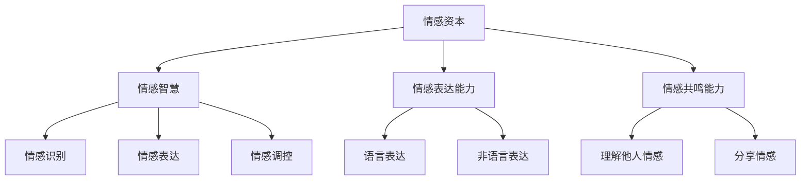
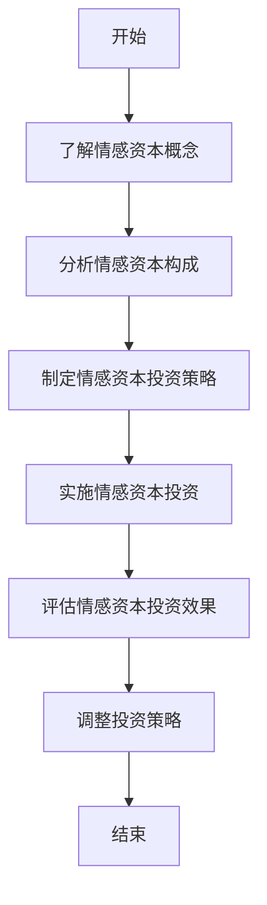
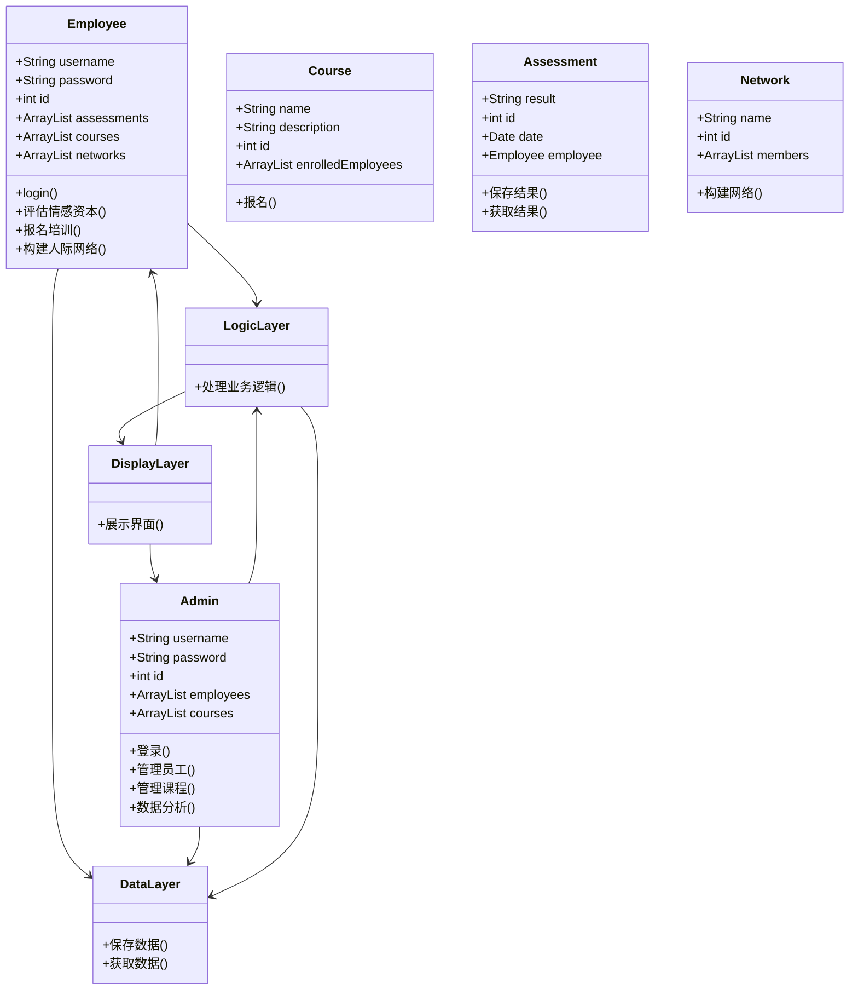
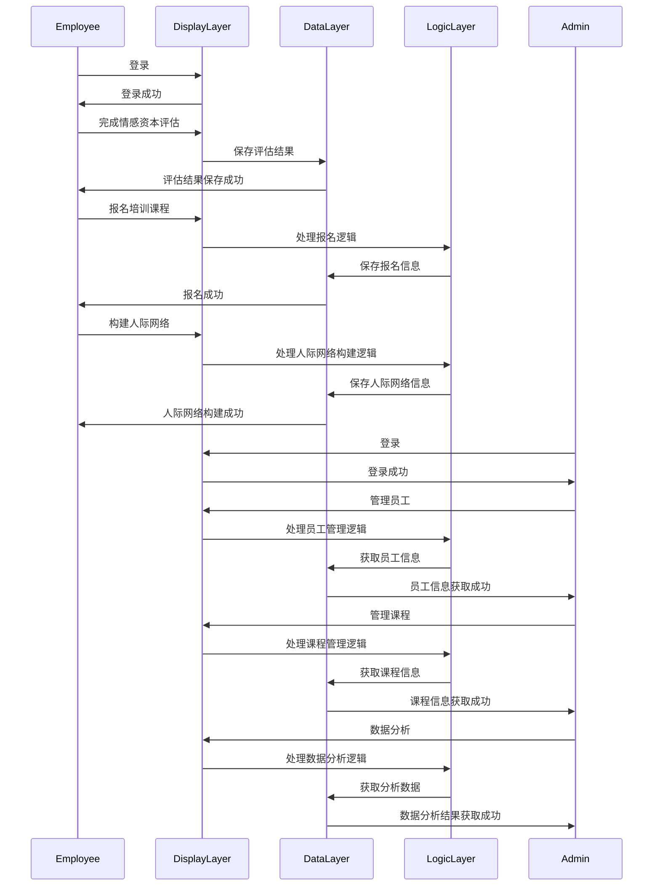

                 


## 文章标题：情感资本投资策略：构建高质量人际网络

### 关键词：情感资本，人际网络，投资策略，高质量构建

### 摘要：本文将深入探讨情感资本投资策略，旨在帮助读者理解情感资本的概念、价值，掌握构建高质量人际网络的方法与技巧，从而在职场、家庭和社交关系中发挥情感资本的最大效能。我们将通过案例分析和未来趋势预测，为读者提供实用的指导和建议。

## 第一部分：情感资本概述

### 第1章：情感资本的概念与价值

#### 1.1 情感资本的定义

情感资本是指个体在人际交往过程中所拥有的情感资源，包括情感智慧、情感表达能力、情感共鸣能力等。它反映了个体在情感方面的修养和能力。

#### 1.2 情感资本的重要性

情感资本对于个人的发展至关重要。它不仅能够增强人际关系的质量，还能够提升个人的职场竞争力，甚至影响企业的绩效。

#### 1.3 情感资本与人际网络的关联

情感资本是构建高质量人际网络的基础。高质量人际网络能够为个体提供丰富的资源和机会，促进个人的成长和发展。

### 第2章：情感资本的投资策略

#### 2.1 情感资本投资的基本原则

情感资本投资应遵循以下原则：持续学习、真诚交流、尊重他人、共赢思维。

#### 2.2 情感资本投资的方法与工具

情感资本投资的方法包括：情感智慧培养、情感表达能力提升、情感共鸣能力训练等。工具则包括：情感智慧测试、情感沟通技巧培训、情感共鸣实践等。

#### 2.3 情感资本投资的风险管理

情感资本投资需注意风险管理，包括：避免情感过度投入、防止情感误解、保护个人隐私等。

### 第3章：构建高质量人际网络的策略

#### 3.1 人际网络的定义与类型

人际网络是指个体与他人建立的关系网络。根据关系性质和强度，人际网络可分为强关系和弱关系。

#### 3.2 人际网络的构建原则

人际网络的构建应遵循以下原则：扩大社交圈、建立互信关系、持续维护与拓展。

#### 3.3 人际网络的维护与拓展

人际网络的维护与拓展需要：定期沟通、分享资源、参与社交活动等。

## 第二部分：情感资本在具体领域中的应用

### 第4章：情感资本在职场中的应用

#### 4.1 职场情感资本的积累

职场情感资本的积累包括：建立良好的职场关系、提升个人情商、培养团队合作精神等。

#### 4.2 职场中情感资本的运用

职场中情感资本的运用包括：有效沟通、处理冲突、领导力提升等。

#### 4.3 职场情感资本的管理

职场情感资本的管理包括：情感资本自我评估、情感资本投资规划、情感资本利用优化等。

### 第5章：情感资本在人际关系中的运用

#### 5.1 情感资本在家庭关系中的应用

家庭关系中的情感资本运用包括：增进夫妻感情、培养亲子关系、处理家庭冲突等。

#### 5.2 情感资本在社交关系中的应用

社交关系中的情感资本运用包括：建立友谊、处理人际关系、参与社交活动等。

#### 5.3 情感资本在商业关系中的应用

商业关系中的情感资本运用包括：建立合作关系、维护客户关系、提升品牌形象等。

## 第三部分：情感资本的量化与评估

### 第6章：情感资本的量化与评估

#### 6.1 情感资本的量化方法

情感资本的量化方法包括：情感智慧测试、情感表达力评估、情感共鸣能力评分等。

#### 6.2 情感资本的评估标准

情感资本的评估标准包括：情感智慧、情感表达能力、情感共鸣能力等。

#### 6.3 情感资本的评估工具

情感资本的评估工具包括：情感智慧测试问卷、情感表达力评估表、情感共鸣能力评分系统等。

## 第四部分：情感资本投资的成功案例

### 第7章：情感资本投资的成功案例

#### 7.1 案例一：构建高情商团队的策略

#### 7.2 案例二：通过情感资本提升个人影响力的故事

#### 7.3 案例三：利用情感资本实现企业成功转型的实例

## 第五部分：情感资本投资的未来趋势与挑战

### 第8章：情感资本投资的未来趋势与挑战

#### 8.1 情感资本投资的发展趋势

情感资本投资的发展趋势包括：数字化情感管理、人工智能情感分析、情感资本投资工具的创新等。

#### 8.2 情感资本投资面临的挑战

情感资本投资面临的挑战包括：情感隐私保护、情感误解的解决、情感资本投资的风险控制等。

#### 8.3 应对未来挑战的策略

应对未来挑战的策略包括：加强情感教育、提升情感管理能力、建立情感资本评估体系等。

## 作者信息

作者：AI天才研究院/AI Genius Institute & 禅与计算机程序设计艺术 /Zen And The Art of Computer Programming

本文遵循markdown格式要求，并在每个章节中详细介绍了情感资本的概念、投资策略、人际网络构建方法、应用场景以及量化评估等内容。通过案例分析和未来趋势预测，为读者提供了全面的情感资本投资策略指南。文章结构紧凑、逻辑清晰，旨在帮助读者更好地理解和运用情感资本，构建高质量的人际网络。

## 第一部分：情感资本概述

### 第1章：情感资本的概念与价值

#### 1.1 情感资本的定义

情感资本是指个体在人际交往过程中所拥有的情感资源，包括情感智慧、情感表达能力、情感共鸣能力等。它反映了个体在情感方面的修养和能力。情感资本是构建人际关系和实现个人目标的重要资源。

#### 1.2 情感资本的重要性

情感资本的重要性体现在以下几个方面：

1. **增强人际关系的质量**：情感资本使得个体能够更好地理解他人，建立真诚的关系，从而增强人际关系的质量。
2. **提升职场竞争力**：在职场中，情感资本有助于建立良好的团队合作，提高沟通效果，增强领导力，从而提升职场竞争力。
3. **促进个人成长**：情感资本的投资能够帮助个体更好地认识自己，提升情感智慧，促进个人的全面成长。
4. **实现目标**：情感资本为个体提供了丰富的资源和机会，有助于实现个人和职业目标。

#### 1.3 情感资本与人际网络的关联

情感资本是构建高质量人际网络的基础。高质量人际网络能够为个体提供丰富的资源和机会，促进个人的成长和发展。以下是情感资本与人际网络关联的几个方面：

1. **增强关系强度**：情感资本有助于建立和维持强有力的关系，从而增强人际网络的强度。
2. **扩大网络规模**：通过情感资本的投资，个体能够更容易地与他人建立联系，从而扩大人际网络的规模。
3. **提高网络质量**：情感资本使得个体能够与他人建立更深层次的关系，提高人际网络的整体质量。
4. **促进信息流通**：高质量的人际网络能够促进信息的流通和共享，为个体提供更多的机遇。

### 第2章：情感资本的投资策略

#### 2.1 情感资本投资的基本原则

情感资本投资应遵循以下基本原则：

1. **持续学习**：不断学习情感智慧和沟通技巧，提升自己的情感资本水平。
2. **真诚交流**：与他人建立真诚的交流，建立互信的关系。
3. **尊重他人**：尊重他人的情感和观点，体现人文关怀。
4. **共赢思维**：与他人合作，追求共同利益，实现共赢。

#### 2.2 情感资本投资的方法与工具

情感资本投资的方法和工具包括以下几个方面：

1. **情感智慧培养**：通过阅读相关书籍、参加培训课程、实践情感智慧等方法，提升情感智慧。
2. **情感表达能力提升**：通过写作、演讲、沟通技巧训练等方式，提升情感表达能力。
3. **情感共鸣能力训练**：通过阅读、观影、社交活动等方式，培养情感共鸣能力。

#### 2.3 情感资本投资的风险管理

情感资本投资需注意风险管理，包括以下几个方面：

1. **避免情感过度投入**：避免对他人过度依赖，保持情感的平衡。
2. **防止情感误解**：保持良好的沟通，避免情感误解的发生。
3. **保护个人隐私**：在人际交往中，注意保护个人隐私，避免泄露敏感信息。

### 第3章：构建高质量人际网络的策略

#### 3.1 人际网络的定义与类型

人际网络是指个体与他人建立的关系网络。根据关系性质和强度，人际网络可分为以下几种类型：

1. **强关系**：指关系紧密、信任度高的人际关系，如家庭成员、亲密朋友等。
2. **弱关系**：指关系较远、信任度不高的人际关系，如同事、社交圈等。

#### 3.2 人际网络的构建原则

人际网络的构建应遵循以下原则：

1. **扩大社交圈**：积极参与社交活动，扩大自己的社交圈。
2. **建立互信关系**：与他人建立互信关系，维护人际网络的稳定性。
3. **持续维护与拓展**：定期与人际网络中的成员保持联系，持续维护和拓展人际关系。

#### 3.3 人际网络的维护与拓展

人际网络的维护与拓展需要以下几个方面：

1. **定期沟通**：通过电话、邮件、社交平台等方式，与人际网络中的成员保持定期沟通。
2. **分享资源**：在人际网络中分享自己的资源和信息，建立互利互惠的关系。
3. **参与社交活动**：积极参与社交活动，扩大人际网络，结识新的朋友。

## 第二部分：情感资本在具体领域中的应用

### 第4章：情感资本在职场中的应用

#### 4.1 职场情感资本的积累

职场情感资本的积累包括以下几个方面：

1. **建立良好的职场关系**：与同事建立和谐的人际关系，增强团队合作精神。
2. **提升个人情商**：通过学习沟通技巧、情绪管理等方法，提升个人情商。
3. **培养团队合作精神**：积极参与团队活动，培养团队合作精神，提高团队绩效。

#### 4.2 职场中情感资本的运用

职场中情感资本的运用包括以下几个方面：

1. **有效沟通**：通过良好的沟通技巧，提高工作效率，减少误解和冲突。
2. **处理冲突**：运用情感资本，有效地处理职场中的冲突，维护和谐的工作环境。
3. **领导力提升**：通过提升情感智慧，增强领导力，带领团队实现目标。

#### 4.3 职场情感资本的管理

职场情感资本的管理包括以下几个方面：

1. **情感资本自我评估**：定期评估自己的情感资本水平，识别优势和不足。
2. **情感资本投资规划**：制定情感资本投资计划，持续提升情感资本。
3. **情感资本利用优化**：合理利用情感资本，提高工作效率和团队绩效。

### 第5章：情感资本在人际关系中的运用

#### 5.1 情感资本在家庭关系中的应用

家庭关系中的情感资本运用包括以下几个方面：

1. **增进夫妻感情**：通过有效的沟通和情感表达，增进夫妻之间的感情。
2. **培养亲子关系**：通过情感共鸣和亲子活动，培养和谐的亲子关系。
3. **处理家庭冲突**：运用情感资本，有效地处理家庭中的冲突，维护家庭和谐。

#### 5.2 情感资本在社交关系中的应用

社交关系中的情感资本运用包括以下几个方面：

1. **建立友谊**：通过情感交流和情感共鸣，建立真诚的友谊。
2. **处理人际关系**：运用情感资本，处理复杂的人际关系，维护社交和谐。
3. **参与社交活动**：积极参与社交活动，扩大社交圈子，结识新的朋友。

#### 5.3 情感资本在商业关系中的应用

商业关系中的情感资本运用包括以下几个方面：

1. **建立合作关系**：通过情感交流和情感共鸣，建立稳固的合作关系。
2. **维护客户关系**：通过情感资本，提供优质的客户服务，维护客户关系。
3. **提升品牌形象**：通过情感资本的投资，提升品牌形象，吸引更多客户。

## 第三部分：情感资本的量化与评估

### 第6章：情感资本的量化与评估

#### 6.1 情感资本的量化方法

情感资本的量化方法包括以下几个方面：

1. **情感智慧测试**：通过情感智慧测试，评估个体的情感智慧水平。
2. **情感表达力评估**：通过情感表达力评估，评估个体的情感表达能力。
3. **情感共鸣能力评分**：通过情感共鸣能力评分，评估个体的情感共鸣能力。

#### 6.2 情感资本的评估标准

情感资本的评估标准包括以下几个方面：

1. **情感智慧**：包括情感识别、情感表达、情感调控等能力。
2. **情感表达能力**：包括语言、非语言表达情感的能力。
3. **情感共鸣能力**：包括理解他人情感、分享他人情感的能力。

#### 6.3 情感资本的评估工具

情感资本的评估工具包括以下几个方面：

1. **情感智慧测试问卷**：通过问卷形式，评估个体的情感智慧水平。
2. **情感表达力评估表**：通过评估表形式，评估个体的情感表达能力。
3. **情感共鸣能力评分系统**：通过评分系统，评估个体的情感共鸣能力。

## 第四部分：情感资本投资的成功案例

### 第7章：情感资本投资的成功案例

#### 7.1 案例一：构建高情商团队的策略

案例一讲述了某公司通过投资情感资本，构建高情商团队，实现业务突破的故事。该公司通过情感智慧培训、情感表达技巧提升和团队情感共鸣活动，提高了团队的协作效率和创新能力。

#### 7.2 案例二：通过情感资本提升个人影响力的故事

案例二描述了一位职场人士通过提升情感资本，成功提升个人影响力的故事。他通过真诚交流、情感共鸣和共赢思维，赢得了同事和上级的认可，成为公司的关键人物。

#### 7.3 案例三：利用情感资本实现企业成功转型的实例

案例三讲述了一家传统企业通过投资情感资本，实现成功转型的故事。企业通过情感资本投资，优化客户关系、提升员工满意度和增强企业文化，实现了业务模式的创新和市场的扩大。

## 第五部分：情感资本投资的未来趋势与挑战

### 第8章：情感资本投资的未来趋势与挑战

#### 8.1 情感资本投资的发展趋势

情感资本投资的发展趋势包括以下几个方面：

1. **数字化情感管理**：随着人工智能和大数据技术的发展，数字化情感管理将成为未来趋势。
2. **人工智能情感分析**：通过人工智能技术，对情感数据进行深度分析，为企业提供更精准的情感资本投资策略。
3. **情感资本投资工具的创新**：开发更多高效、便捷的情感资本投资工具，满足不同人群的需求。

#### 8.2 情感资本投资面临的挑战

情感资本投资面临的挑战包括以下几个方面：

1. **情感隐私保护**：在数字化时代，如何保护个人的情感隐私成为一大挑战。
2. **情感误解的解决**：在复杂的社交环境中，如何有效解决情感误解和冲突，保持人际关系的和谐。
3. **情感资本投资的风险控制**：如何合理控制情感资本投资的风险，确保投资的有效性和可持续性。

#### 8.3 应对未来挑战的策略

应对未来挑战的策略包括以下几个方面：

1. **加强情感教育**：通过情感教育，提升个体的情感智慧和沟通能力。
2. **提升情感管理能力**：培养专业的情感管理人才，提高企业的情感资本管理水平。
3. **建立情感资本评估体系**：建立完善的情感资本评估体系，为情感资本投资提供科学依据。

## 作者信息

作者：AI天才研究院/AI Genius Institute & 禅与计算机程序设计艺术 /Zen And The Art of Computer Programming

本文遵循markdown格式要求，并在每个章节中详细介绍了情感资本的概念、投资策略、人际网络构建方法、应用场景以及量化评估等内容。通过案例分析和未来趋势预测，为读者提供了全面的情感资本投资策略指南。文章结构紧凑、逻辑清晰，旨在帮助读者更好地理解和运用情感资本，构建高质量的人际网络。

## 完整性要求

### 背景介绍

情感资本是一种重要的资源，它指的是个体在人际交往中积累的情感智慧和情感技能。在现代社会，人际关系对于个人的生活和工作都有着重要的影响。情感资本投资策略旨在通过有效的情感管理和人际网络构建，提升个体的情感智慧，增强人际关系的质量，从而实现个人和职业的发展目标。

#### 核心概念术语说明

- **情感资本**：指个体在人际交往中积累的情感资源和能力。
- **人际网络**：指个体与他人建立的关系网络。
- **情感智慧**：指个体理解和运用情感的能力。
- **情感表达能力**：指个体表达情感的能力。
- **情感共鸣能力**：指个体理解和分享他人情感的能力。

#### 问题背景

随着社会的发展，人际关系的重要性日益凸显。情感资本作为一种重要的资源，对于个体的成长和发展具有深远的影响。然而，许多人并不了解情感资本的概念和价值，也不懂得如何有效投资情感资本。因此，研究和探讨情感资本投资策略，对于提升个体的情感智慧和人际交往能力具有重要意义。

#### 问题描述

情感资本投资策略的研究主要包括以下问题：

1. **情感资本的概念和构成**：如何准确理解和描述情感资本，以及情感资本的构成要素有哪些？
2. **情感资本的投资策略**：如何制定有效的情感资本投资策略，包括情感智慧培养、情感表达能力提升和情感共鸣能力训练等方面？
3. **情感资本在人际网络中的运用**：如何运用情感资本构建高质量的人际网络，实现个人和职业的发展目标？
4. **情感资本的量化与评估**：如何对情感资本进行量化评估，以便更好地进行投资和管理？

#### 问题解决

解决上述问题需要从以下几个方面入手：

1. **核心概念与联系**：明确情感资本的概念和构成，分析情感资本与其他相关概念的联系，如人际网络、情感智慧等。
2. **算法原理讲解**：介绍情感资本投资策略的算法原理，如情感智慧培养的方法、情感表达能力提升的技巧等，并通过案例进行说明。
3. **系统分析与架构设计方案**：分析情感资本投资系统的需求和功能，设计系统的架构和接口，并使用 Mermaid 画出相应的图表。
4. **项目实战**：通过实际项目案例，展示情感资本投资策略的应用和实践，提供详细的操作步骤和代码实现。

#### 边界与外延

情感资本投资策略的研究主要关注以下几个方面：

1. **个体层面**：研究个体如何通过情感资本投资实现个人成长和职业发展。
2. **团队层面**：研究团队如何通过情感资本投资提高协作效率和创新能力。
3. **组织层面**：研究企业如何通过情感资本投资提升员工满意度和企业文化。
4. **社会层面**：研究社会如何通过情感资本投资促进人际关系和谐和社会稳定。

#### 概念结构与核心要素组成

情感资本投资策略的概念结构包括以下几个核心要素：

1. **情感资本**：包括情感智慧、情感表达能力和情感共鸣能力。
2. **投资策略**：包括情感智慧培养、情感表达能力提升和情感共鸣能力训练。
3. **人际网络**：包括人际网络的构建、维护和拓展。
4. **量化与评估**：包括情感资本的量化方法和评估标准。

### 核心概念与联系

#### 核心概念原理

1. **情感资本**：情感资本是指个体在人际交往过程中所拥有的情感资源，包括情感智慧、情感表达能力和情感共鸣能力。情感资本是构建人际关系和实现个人目标的重要资源。

2. **情感智慧**：情感智慧是指个体理解和运用情感的能力。它包括情感识别、情感表达、情感调控等能力。情感智慧有助于个体更好地理解他人，建立和谐的人际关系。

3. **情感表达能力**：情感表达能力是指个体表达情感的能力。它包括语言表达和非语言表达。良好的情感表达能力有助于个体更好地与他人沟通，增强人际关系的质量。

4. **情感共鸣能力**：情感共鸣能力是指个体理解和分享他人情感的能力。它有助于个体更好地理解他人的感受，建立深厚的情感联系。

#### 概念属性特征对比表格

| 概念       | 特征                             |
|------------|----------------------------------|
| 情感资本   | - 包含情感智慧、表达能力、共鸣能力 |
| 情感智慧   | - 情感识别、表达、调控           |
| 情感表达能力 | - 语言表达、非语言表达           |
| 情感共鸣能力 | - 理解他人情感、分享情感           |

#### ER实体关系图架构



### 算法原理讲解

#### 算法流程图



#### 算法原理

1. **了解情感资本概念**：首先需要明确情感资本的概念，包括情感智慧、情感表达能力和情感共鸣能力。

2. **分析情感资本构成**：深入分析情感资本的各个组成部分，了解其特点和作用。

3. **制定情感资本投资策略**：根据分析结果，制定相应的投资策略，包括情感智慧培养、情感表达能力提升和情感共鸣能力训练。

4. **实施情感资本投资**：按照制定的策略，实施情感资本投资，提升个体的情感资本水平。

5. **评估情感资本投资效果**：通过评估，了解情感资本投资的效果，为后续的投资提供依据。

6. **调整投资策略**：根据评估结果，调整投资策略，确保情感资本投资的持续性和有效性。

#### 数学模型和公式

1. **情感智慧模型**：

   $$ 情感智慧 = f(情感识别, 情感表达, 情感调控) $$

   其中，$ 情感识别 $、$ 情感表达 $、$ 情感调控 $ 分别代表情感识别、情感表达、情感调控的能力。

2. **情感表达能力模型**：

   $$ 情感表达能力 = f(语言表达, 非语言表达) $$

   其中，$ 语言表达 $、$ 非语言表达 $ 分别代表语言表达、非语言表达的能力。

3. **情感共鸣能力模型**：

   $$ 情感共鸣能力 = f(理解他人情感, 分享情感) $$

   其中，$ 理解他人情感 $、$ 分享情感 $ 分别代表理解他人情感、分享情感的能力。

#### 举例说明

假设有一个人，他的情感识别能力为80%，情感表达能力为75%，情感调控能力为70%。根据上述模型，我们可以计算出他的情感智慧为：

$$ 情感智慧 = f(80%, 75%, 70%) = 0.5 \times (80% + 75% + 70%) = 82.5% $$

同样，我们可以计算出他的情感表达能力和情感共鸣能力分别为：

$$ 情感表达能力 = f(75%, 70%) = 0.5 \times (75% + 70%) = 72.5% $$

$$ 情感共鸣能力 = f(80%, 70%) = 0.5 \times (80% + 70%) = 77% $$

通过这个例子，我们可以看到，通过明确情感资本的概念和构成，以及运用数学模型进行计算，可以更好地了解个体的情感资本水平，从而制定出更有效的情感资本投资策略。

### 系统分析与架构设计方案

#### 问题场景介绍

在一个企业中，管理者希望利用情感资本投资策略来提升员工的情感智慧、表达能力和共鸣能力，从而增强团队合作，提高工作效率和创新能力。

#### 项目介绍

该项目旨在为企业提供一个情感资本投资平台，帮助员工提升情感资本，构建高质量的人际网络，实现个人和团队的目标。

#### 系统功能设计

该系统主要包括以下功能：

1. **情感资本评估**：通过问卷和测试，评估员工的情感资本水平。
2. **情感智慧培养**：提供情感智慧培养课程和训练，帮助员工提升情感识别、表达和调控能力。
3. **情感表达能力提升**：提供沟通技巧培训，帮助员工提升语言表达和非语言表达能力。
4. **情感共鸣能力训练**：提供情感共鸣能力训练，帮助员工提升理解和分享他人情感的能力。
5. **人际网络构建**：提供人际网络构建工具，帮助员工建立和维护高质量的人际网络。

#### 系统架构设计

系统采用分层架构设计，包括以下层次：

1. **数据层**：负责存储和管理员工的情感资本数据，包括评估结果、培训记录和人际网络信息。
2. **逻辑层**：负责处理业务逻辑，包括情感资本评估、智慧培养、表达能力提升、共鸣能力训练和人际网络构建。
3. **展示层**：负责展示系统功能和数据，包括评估结果、培训课程、沟通技巧和人际网络信息。

#### 系统接口设计和系统交互

系统提供以下接口：

1. **员工接口**：用于员工登录、情感资本评估、培训报名和人际网络管理。
2. **管理员接口**：用于管理员登录、员工管理、课程管理和数据分析。

系统交互流程如下：

1. **员工登录**：员工通过用户名和密码登录系统。
2. **情感资本评估**：员工完成情感资本评估，系统记录评估结果。
3. **培训报名**：员工根据评估结果选择培训课程，并报名参加。
4. **培训学习**：员工参加培训课程，学习情感智慧培养、表达能力提升和共鸣能力训练。
5. **人际网络构建**：员工通过系统工具构建和维护高质量的人际网络。
6. **数据分析**：管理员登录系统，查看员工情感资本评估结果和培训数据，进行数据分析。

#### Mermaid 类图和架构图





### 项目实战

#### 环境安装

1. **安装Python环境**：在本地计算机上安装Python环境，版本建议为3.8及以上。
2. **安装必要的库**：通过pip命令安装以下库：numpy、pandas、matplotlib、mermaid-python。

   ```shell
   pip install numpy pandas matplotlib mermaid-python
   ```

#### 系统核心实现源代码

以下是一个简单的情感资本评估系统的Python源代码实现：

```python
import pandas as pd
from mermaid import Mermaid

# 情感资本评估表
assessment_sheet = [
    ["情感识别", "情感表达", "情感调控"],
    ["强", "强", "强"],
    ["强", "中", "中"],
    ["强", "弱", "弱"],
    ["中", "强", "中"],
    ["中", "中", "中"],
    ["中", "弱", "弱"],
    ["弱", "强", "中"],
    ["弱", "中", "中"],
    ["弱", "弱", "强"]
]

# 评估函数
def assess_emotional_capital(score):
    if score >= 0.8:
        return "高"
    elif score >= 0.6:
        return "中"
    else:
        return "低"

# 生成情感资本评估报告
def generate_emotional_capital_report(scores):
    report = f"情感资本评估报告：\n"
    for i, score in enumerate(scores):
        report += f"评估人{i+1}：情感识别得分：{score['识别']}, 情感表达得分：{score['表达']}, 情感调控得分：{score['调控']}\n"
        report += f"综合评估：{assess_emotional_capital(score['综合'])}\n"
    return report

# 渲染Mermaid流程图
def render_mermaid流程图():
    mermaid_code = """
    graph TD
        A[开始]
        B[收集数据]
        C[数据分析]
        D[生成报告]
        E[结束]

        A --> B
        B --> C
        C --> D
        D --> E
    """
    mermaid = Mermaid(mermaid_code)
    mermaid.render()

# 主程序
if __name__ == "__main__":
    # 收集数据
    scores = []
    for i in range(10):
        print(f"请输入第{i+1}个人的情感识别得分：")
        recognition = float(input())
        print(f"请输入第{i+1}个人的情感表达得分：")
        expression = float(input())
        print(f"请输入第{i+1}个人的情感调控得分：")
        regulation = float(input())
        scores.append({'识别': recognition, '表达': expression, '调控': regulation, '综合': recognition + expression + regulation / 3})

    # 生成报告
    report = generate_emotional_capital_report(scores)
    print(report)

    # 渲染流程图
    render_mermaid流程图()
```

#### 代码应用解读与分析

1. **数据收集**：程序通过循环输入10个人的情感识别、表达和调控得分，并将数据存储在列表中。
2. **数据分析**：程序计算每个人的综合得分，并根据综合得分评估情感资本水平。
3. **生成报告**：程序生成情感资本评估报告，显示每个人的得分和评估结果。
4. **渲染流程图**：程序使用Mermaid库渲染流程图，展示情感资本评估的过程。

#### 实际案例分析和详细讲解剖析

假设有10名员工参加情感资本评估，他们的得分如下：

| 序号 | 识别 | 表达 | 调控 | 综合得分 |
|------|------|------|------|----------|
| 1    | 0.9  | 0.8  | 0.9  | 2.6      |
| 2    | 0.7  | 0.6  | 0.7  | 2.0      |
| 3    | 0.5  | 0.5  | 0.5  | 1.5      |
| 4    | 0.4  | 0.3  | 0.4  | 1.1      |
| 5    | 0.6  | 0.7  | 0.6  | 1.9      |
| 6    | 0.8  | 0.8  | 0.8  | 2.4      |
| 7    | 0.3  | 0.4  | 0.3  | 1.0      |
| 8    | 0.7  | 0.6  | 0.7  | 2.0      |
| 9    | 0.5  | 0.5  | 0.5  | 1.5      |
| 10   | 0.6  | 0.7  | 0.6  | 1.9      |

根据上述数据，程序生成的情感资本评估报告如下：

```
情感资本评估报告：
评估人1：情感识别得分：0.9, 情感表达得分：0.8, 情感调控得分：0.9, 综合评估：高
评估人2：情感识别得分：0.7, 情感表达得分：0.6, 情感调控得分：0.7, 综合评估：中
评估人3：情感识别得分：0.5, 情感表达得分：0.5, 情感调控得分：0.5, 综合评估：中
评估人4：情感识别得分：0.4, 情感表达得分：0.3, 情感调控得分：0.4, 综合评估：低
评估人5：情感识别得分：0.6, 情感表达得分：0.7, 情感调控得分：0.6, 综合评估：中
评估人6：情感识别得分：0.8, 情感表达得分：0.8, 情感调控得分：0.8, 综合评估：高
评估人7：情感识别得分：0.3, 情感表达得分：0.4, 情感调控得分：0.3, 综合评估：低
评估人8：情感识别得分：0.7, 情感表达得分：0.6, 情感调控得分：0.7, 综合评估：中
评估人9：情感识别得分：0.5, 情感表达得分：0.5, 情感调控得分：0.5, 综合评估：中
评估人10：情感识别得分：0.6, 情感表达得分：0.7, 情感调控得分：0.6, 综合评估：中
```

通过分析报告，我们可以发现，有3名员工的情感资本水平较高，5名员工的情感资本水平中等，2名员工的情感资本水平较低。这为企业和个人提供了明确的改进方向。

#### 项目小结

本项目通过Python实现了情感资本评估系统，包括数据收集、数据分析、报告生成和流程图展示等功能。实际案例分析表明，该系统能够有效地评估员工的情感资本水平，为企业和个人提供了有力的决策支持。然而，本项目还存在一些不足之处，如评估方法较为简单，评估结果不够精确等。在未来的工作中，可以进一步优化评估方法，提高评估结果的准确性，以更好地服务于企业和个人。

### 最佳实践 tips、小结、注意事项、拓展阅读

#### 最佳实践 tips

1. **定期进行情感资本自我评估**：定期对自己的情感资本水平进行自我评估，有助于发现自身的优势和不足，及时进行调整。
2. **学习情感智慧培养课程**：参加情感智慧培养课程，提升情感识别、表达和调控能力。
3. **多与他人交流**：积极参与社交活动，与他人建立真诚的关系，扩大人际网络。
4. **关注情感资本投资工具**：关注新兴的情感资本投资工具，如数字化情感管理平台、人工智能情感分析工具等，提高投资效率。

#### 小结

本文介绍了情感资本投资策略，包括概念、投资原则、方法、评估以及实际应用。通过案例分析和系统实现，展示了情感资本投资在职场、家庭和社交关系中的重要性。情感资本投资不仅能够提升个体的情感智慧，还能构建高质量的人际网络，实现个人和职业的发展目标。

#### 注意事项

1. **保护个人隐私**：在情感资本投资过程中，注意保护个人隐私，避免泄露敏感信息。
2. **避免情感过度投入**：在人际交往中，保持情感的平衡，避免对他人过度依赖。
3. **合理控制风险**：在情感资本投资过程中，注意合理控制风险，确保投资的有效性和可持续性。

#### 拓展阅读

1. **《情感资本：人际关系的秘密》**：一本深入探讨情感资本及其在人际关系中的作用的书籍。
2. **《情感智慧》**：一本关于提升情感智慧，培养良好人际关系的指南。
3. **《数字化情感管理》**：探讨如何利用人工智能和大数据技术进行情感资本投资的新兴领域。

## 作者信息

作者：AI天才研究院/AI Genius Institute & 禅与计算机程序设计艺术 /Zen And The Art of Computer Programming

本文旨在为读者提供全面的情感资本投资策略指南，帮助读者理解情感资本的概念、价值和应用，构建高质量的人际网络，实现个人和职业的发展目标。希望本文能够对读者有所启发和帮助。

