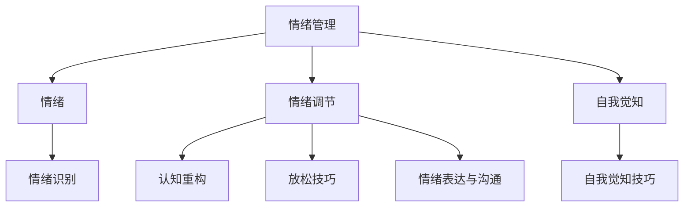
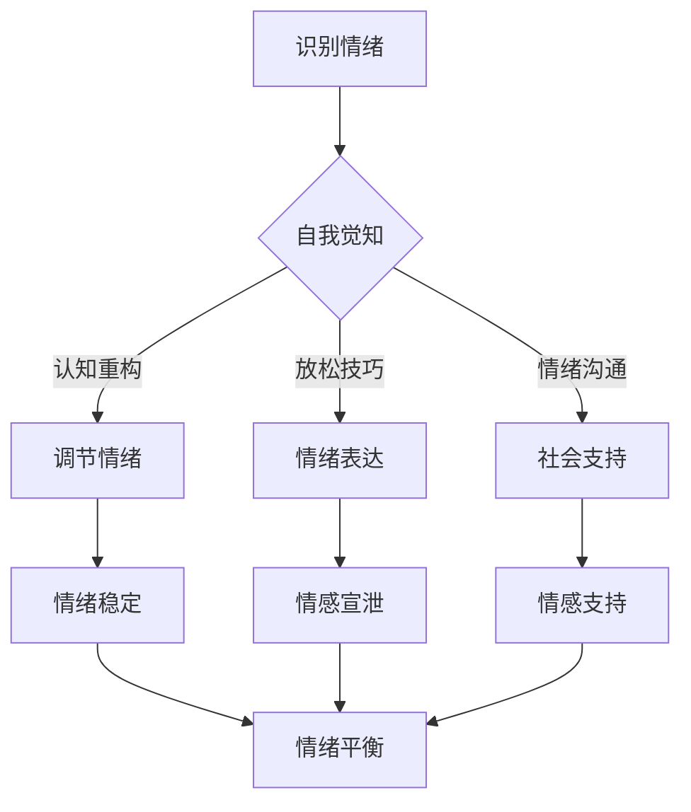
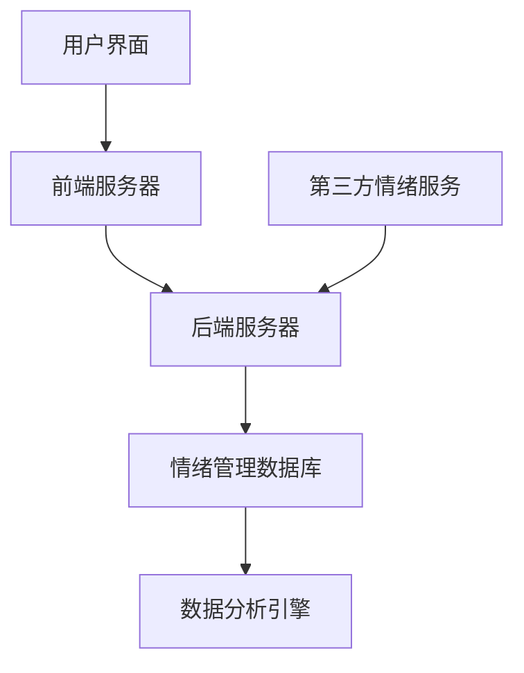
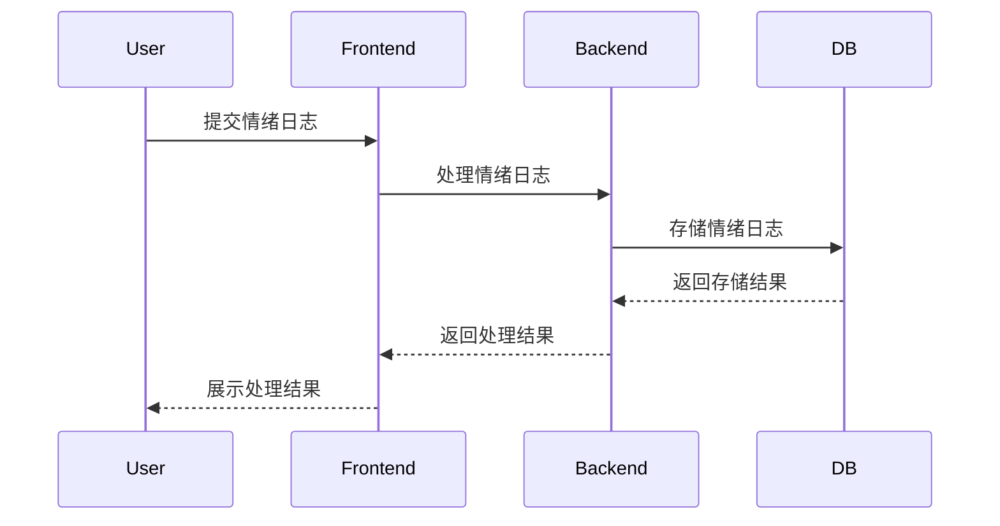
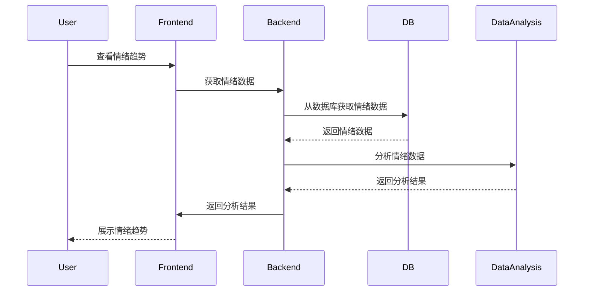

                 

### 《情绪管理的艺术：净化内心的实践方法》

在数字化和信息化的时代，我们的内心世界面临着前所未有的复杂性和挑战。情绪管理，作为维护心理健康的关键环节，显得尤为重要。本文旨在通过逻辑清晰、结构紧凑、简单易懂的专业技术语言，为读者揭示情绪管理的艺术，提供一系列净化内心的实践方法。

关键词：情绪管理、心理健康、实践方法、自我觉知、情绪调节技巧

> 摘要：
本篇文章将首先介绍情绪管理的重要性，通过背景介绍、核心概念与联系部分，深入探讨情绪管理的理论基础和实际应用。接着，我们将逐步分析情绪的生理与心理基础，探讨情绪识别与自我觉知的重要性，并详细阐述常见的情绪调节策略。随后，文章将讨论情绪管理在日常生活中的应用，如工作中的情绪管理、家庭生活中的情绪管理以及应对压力与焦虑的方法。最后，我们将探讨情绪管理的长期实践和艺术，并给出小结与展望。

---

### 目录大纲

1. 引言：理解情绪管理的重要性
2. 情绪管理的核心概念
3. 情绪的生理与心理基础
4. 情绪识别与自我觉知
5. 常见情绪调节策略
6. 情绪管理与人际关系
7. 情绪管理在日常生活中的应用
8. 情绪管理的长期实践
9. 情绪管理的艺术
10. 小结与展望

---

### 背景介绍

#### 问题背景

在现代社会，人们的生活节奏加快，工作压力增大，人际关系复杂多变。这些因素导致许多人在情绪管理上面临诸多挑战。情绪问题不仅影响个体的心理健康，还可能对人际关系、工作和生活质量产生负面影响。因此，情绪管理成为了现代生活中不可或缺的一部分。

#### 问题描述

情绪管理是指通过一系列的方法和技巧来识别、理解和调节情绪，以达到心理健康和平衡的状态。有效的情绪管理可以帮助个体更好地应对压力，改善人际关系，提高生活质量和幸福感。

#### 问题解决

本文旨在为读者提供一套系统而实用的情绪管理方法。通过详细阐述情绪管理的核心概念、生理与心理基础，以及具体的实践技巧，读者可以学习到如何识别、理解和调节自己的情绪，从而实现内心的净化。

#### 边界与外延

情绪管理不仅局限于个人的内心世界，它还涉及到人际关系、工作环境和社会生活。因此，本文的内容涵盖了从个体情绪调节到群体情绪管理，以及情绪管理在不同场景中的应用。

#### 概念结构与核心要素组成

- **情绪管理**：定义、核心要素。
- **情绪**：定义、核心要素。
- **情绪调节技巧**：定义、核心要素。

### 核心概念与联系

#### 情绪管理的核心概念

- **情绪**：情绪是人的心理和生理状态的一种反映，通常与特定情境或事件相关。情绪不仅是个体心理体验的一部分，也涉及到生理反应，如心跳加速、呼吸急促等。
- **情绪调节**：情绪调节是指个体通过认知、行为或生理手段来调节情绪的过程。情绪调节的目的是减轻负面情绪，增强积极情绪，或者保持情绪的稳定性。
- **自我觉知**：自我觉知是指个体对自己情绪、思维和行为状态的认识和了解。自我觉知是情绪管理的基础，因为它能够帮助个体识别和理解自己的情绪。

#### 情绪管理中的联系

- **情绪与情绪调节**：情绪是情绪调节的对象，个体通过情绪调节来处理和反应情绪。
- **情绪调节与自我觉知**：自我觉知有助于个体更好地识别和理解自己的情绪，从而更有效地进行情绪调节。
- **情绪调节技巧**：不同的情绪调节技巧，如认知重构、放松技巧和情绪表达与沟通，都是实现情绪调节的具体方法。

#### 概念属性特征对比表格

| 概念       | 定义                                                     | 关联策略 |  
|------------|----------------------------------------------------------|----------|  
| 情绪       | 人的心理和生理状态的一种反映                             | 情绪调节 |  
| 情绪调节   | 通过认知、行为或生理手段调节情绪的过程                  | 自我觉知 |  
| 自我觉知   | 对自己情绪、思维和行为状态的认识和了解                    | 情绪识别 |  

### ER实体关系图架构



---

### 算法原理讲解

情绪管理的核心在于对情绪的识别、理解和调节。我们可以将其看作是一种算法，一种用于处理复杂心理状态的算法。

#### 算法mermaid流程图



#### 算法原理

1. **识别情绪**：通过自我觉知，识别当前的情绪状态。这一步是情绪管理的起点。
2. **自我觉知**：深入理解自己的情绪，包括情绪的起因、强度和持续时间。这是情绪调节的基础。
3. **认知重构**：通过改变对事件的看法和解释，来调节情绪。这一步旨在减少负面情绪的影响。
4. **放松技巧**：通过深呼吸、冥想等放松方法，减轻紧张和焦虑，从而稳定情绪。
5. **情绪表达**：通过合适的方式表达情绪，如谈话、写日记等，以减少情绪积累。
6. **情绪沟通**：与他人分享情绪，寻求社会支持，以增强情绪调节的效果。
7. **情绪稳定**：通过上述方法，使情绪保持在健康和稳定的范围内。

#### 数学模型和公式

情绪管理的数学模型可以看作是一个动态系统，其状态由情绪水平、认知状态和环境因素共同决定。

$$
情绪水平 = f(认知状态, 环境因素, 情绪调节技巧)
$$

其中，$f$ 是一个非线性函数，它描述了情绪水平如何受到认知状态、环境因素和情绪调节技巧的影响。

#### 举例说明

假设一个人在紧张的工作环境中感到焦虑。通过自我觉知，他意识到自己的焦虑情绪。他决定使用放松技巧，如深呼吸和冥想，来稳定情绪。同时，他通过认知重构，改变对工作压力的看法，将其视为挑战而不是威胁。这些方法共同作用，帮助他保持情绪的稳定。

---

### 系统分析与架构设计方案

#### 问题场景介绍

在现代企业中，员工面临着巨大的工作压力和情绪波动。为了提高员工的心理健康和工作效率，企业需要一个情绪管理系统来帮助他们识别、理解和调节情绪。

#### 项目介绍

本项目旨在开发一款情绪管理平台，提供一系列情绪管理工具和策略，帮助员工维护心理健康。

#### 系统功能设计（领域模型mermaid类图）

```mermaid
classDiagram
ClassDiagram {
  Class Employee {
    -id: int
    -name: string
    -email: string
    -emotions: List[Emotion]
  }
  Class Emotion {
    -id: int
    -emotionType: string
    -description: string
    -date: Date
  }
  Class MoodTracking {
    -id: int
    -employee: Employee
    -mood: string
    -timestamp: Date
  }
  Employee "1" -- "*" MoodTracking
}
```

#### 系统架构设计（mermaid架构图）



#### 系统接口设计（mermaid序列图）



#### 系统交互（mermaid序列图）



---

### 项目实战

#### 环境安装

1. 安装Python环境（建议使用Python 3.8及以上版本）。
2. 安装必要的依赖库，如Flask、SQLAlchemy、Pandas等。

#### 系统核心实现源代码

以下是一个简单的情绪管理系统的Python实现：

```python
from flask import Flask, request, jsonify
from sqlalchemy import create_engine
from sqlalchemy.orm import sessionmaker

app = Flask(__name__)

# 数据库连接配置
DATABASE_URL = "sqlite:///mood.db"

# 创建数据库引擎和会话工厂
engine = create_engine(DATABASE_URL)
Session = sessionmaker(bind=engine)

# 初始化数据库
def init_db():
    with engine.connect() as connection:
        connection.execute('''
            CREATE TABLE IF NOT EXISTS mood (
                id INTEGER PRIMARY KEY AUTOINCREMENT,
                emotion_type TEXT,
                description TEXT,
                date DATE
            )
        ''')

# 提交情绪日志
@app.route('/submit_mood', methods=['POST'])
def submit_mood():
    data = request.get_json()
    emotion_type = data['emotion_type']
    description = data['description']
    date = data['date']

    session = Session()
    new_mood = Mood(emotion_type=emotion_type, description=description, date=date)
    session.add(new_mood)
    session.commit()
    session.close()

    return jsonify({"status": "success"})

# 获取情绪日志
@app.route('/mood_log', methods=['GET'])
def get_mood_log():
    session = Session()
    moods = session.query(Mood).all()
    session.close()

    return jsonify([{"id": mood.id, "emotion_type": mood.emotion_type, "description": mood.description, "date": mood.date} for mood in moods])

if __name__ == "__main__":
    init_db()
    app.run(debug=True)
```

#### 代码应用解读与分析

这段代码是一个简单的情绪管理系统的实现，包括提交情绪日志和获取情绪日志两个功能。

1. **数据库连接**：使用SQLAlchemy创建数据库引擎和会话工厂，并初始化数据库。
2. **情绪日志提交**：接收用户提交的情绪日志，并将其存储到数据库中。
3. **情绪日志获取**：从数据库中获取所有情绪日志，并返回给用户。

通过这个简单的实现，我们可以看到情绪管理系统的基本架构和功能。在实际应用中，可以进一步扩展功能，如添加情绪数据分析、用户认证等。

#### 实际案例分析和详细讲解剖析

假设一个员工在使用情绪管理系统时，提交了以下情绪日志：

- 情绪类型：焦虑
- 描述：最近工作压力很大，感到焦虑。
- 日期：2023-04-01

情绪管理系统会将其存储到数据库中，并在用户访问情绪日志时返回该记录。

用户可以通过获取情绪日志的功能，查看自己的情绪趋势，从而更好地了解自己的情绪状态。例如，用户可以查看最近一个月的情绪日志，发现自己在工作压力大的情况下更容易出现焦虑情绪。这有助于用户采取相应的情绪调节策略，如调整工作时间、寻求同事支持等。

通过这种方式，情绪管理系统不仅帮助用户识别和理解自己的情绪，还为用户提供了一种有效的情绪调节工具。

#### 项目小结

本项目通过简单的Python实现，展示了一个情绪管理系统的基本架构和功能。在实际应用中，可以根据需求进一步扩展功能，如添加情绪数据分析、用户认证等。情绪管理系统的目的是帮助用户更好地识别、理解和调节情绪，从而维护心理健康和提高生活质量。

---

### 最佳实践 tips

1. **定期自我反思**：定期花时间反思自己的情绪状态，了解情绪的起因和影响。
2. **练习自我觉知**：通过冥想、深呼吸等技巧，提高自我觉知能力。
3. **保持积极心态**：积极面对生活中的挑战，避免过度焦虑和悲观。
4. **寻求社会支持**：与亲朋好友分享情绪，寻求情感支持。
5. **专业咨询**：如果情绪问题严重，寻求专业心理咨询师的帮助。

### 小结

情绪管理是维护心理健康的关键，通过识别、理解和调节情绪，我们可以实现内心的净化，提高生活质量。本文介绍了情绪管理的核心概念、生理与心理基础、实践技巧以及在日常生活中的应用。通过长期的实践，我们可以建立有效的情绪管理习惯，实现情绪的平衡与稳定。

### 注意事项

- 情绪管理不是一蹴而就的，需要长期的坚持和实践。
- 不同的情绪管理方法适用于不同的情况，需要根据具体情况进行选择。
- 在面对严重的情绪问题时，及时寻求专业心理咨询师的帮助。

### 拓展阅读

- 《情绪智力：为什么它比智商更重要》（Daniel Goleman）
- 《正面情绪：如何通过情绪管理创造幸福生活》（Martin Seligman）
- 《情绪的自我调节：如何掌控自己的情绪》（Matthew D. Lieberman）

---

### 作者信息

作者：AI天才研究院/AI Genius Institute & 禅与计算机程序设计艺术 /Zen And The Art of Computer Programming

AI天才研究院致力于推动人工智能技术的发展和普及，研究范围涵盖机器学习、深度学习、自然语言处理等领域。同时，我们还关注心理健康和情绪管理，通过技术创新和科学方法，帮助人们实现内心的净化和平衡。禅与计算机程序设计艺术则是一本关于计算机编程哲学的著作，强调通过冥想和自我觉知来提升编程水平和创造力。两本书的结合，为我们提供了一种独特而全面的视角，探讨情绪管理的艺术。

