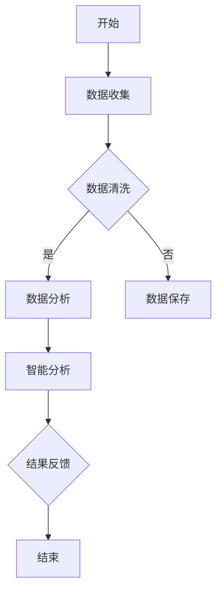
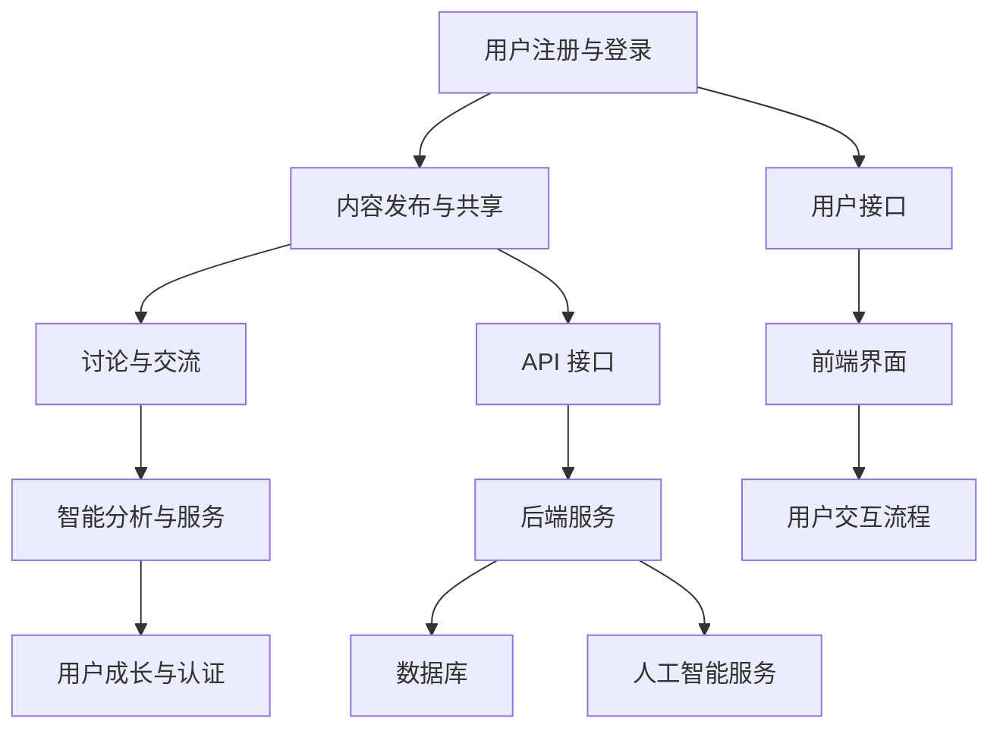
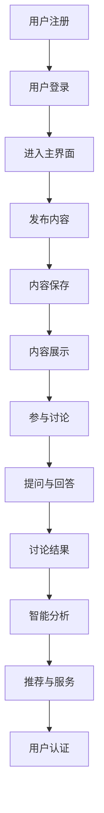

                 


**文章标题:** 意义众创实验室网络：集体探讨人生价值的全球性空间

**关键词:** 意义众创、人生价值、全球性空间、集体探讨、人工智能、技术博客、网络平台、方法论

**摘要：**
本文将深入探讨“意义众创实验室网络”这一概念，阐述其在集体探讨人生价值中的重要性。通过逻辑清晰的分析和实例说明，我们将揭示这一网络在全球范围内的作用及其对于个人和社会的深远影响。本文旨在为读者提供一种全新的视角，理解如何在人工智能技术推动下，构建一个共享价值和智慧的全球性空间。

----------------------------------------------------------------

# 意义众创实验室网络：集体探讨人生价值的全球性空间

> 关键词：意义众创、人生价值、全球性空间、集体探讨、人工智能、技术博客、网络平台、方法论

> 摘要：
在快速变化的数字时代，人工智能技术的发展正在重新定义我们探讨人生价值的路径。本文将深入探讨“意义众创实验室网络”的概念，分析其在集体探讨人生价值中的关键作用。通过探讨这一网络的设计原理、技术应用、实现挑战及其社会影响，我们将揭示如何通过这一全球性空间，促进个体与集体的智慧共享，从而实现人生价值的最大化。文章结构紧凑，逻辑清晰，旨在为读者提供一个全面而深入的理解。

----------------------------------------------------------------

## 第一部分：引言

### 1.1 问题背景

在当今世界，人工智能（AI）正以前所未有的速度渗透到各个领域，从医疗、金融到教育、制造业，AI技术的应用正在深刻改变我们的生活方式。然而，随着AI技术的快速发展，一个关键问题逐渐显现：如何在AI的辅助下，集体探讨和实现人生价值？

### 1.2 问题描述

这一问题的核心在于，尽管人工智能可以在数据处理、模式识别等方面提供强大的支持，但人生价值的探讨涉及到情感、道德和哲学等多个层面，这些都是AI传统上难以触及的领域。因此，如何构建一个能够结合人工智能优势，同时容纳人类情感和智慧的平台，成为亟待解决的问题。

### 1.3 问题解决路径

为了解决这一问题，我们需要探索一种新型的网络结构——意义众创实验室网络。这个网络旨在通过人工智能和人类智慧的融合，提供一个全球性的空间，让人们能够集体探讨和实现人生价值。以下是解决路径的几个关键点：

1. **设计原理：** 网络设计需要结合AI的算法优势和人类创造性的特点，提供一个开放、包容的交流平台。
2. **技术应用：** 利用大数据、机器学习和自然语言处理等技术，实现信息的有效收集、分析和共享。
3. **实现挑战：** 如何确保网络的安全性和隐私保护，同时保持用户参与的积极性，是重要的挑战。
4. **社会影响：** 探讨这一网络对于社会发展和个体成长的潜在影响，以及如何最大化这些影响。

### 1.4 边界与外延

在本文中，我们将重点关注以下几个方面：

- **核心概念解释：** 详细阐述“意义众创实验室网络”的定义、目的和运作机制。
- **技术应用分析：** 探讨大数据、机器学习等技术在网络中的应用和作用。
- **实现挑战探讨：** 分析网络设计、安全性和隐私保护等方面可能面临的挑战。
- **社会影响评估：** 评估网络对于社会和个人成长的潜在影响。

### 1.5 概念结构与核心要素组成

“意义众创实验室网络”的核心概念可以概括为以下几个方面：

- **价值共创：** 通过集体讨论和智能分析，实现人生价值的共同创造。
- **智慧共享：** 通过网络平台，实现全球范围内智慧和经验的共享。
- **情感联结：** 通过人工智能的辅助，建立人类情感和智慧的联结，促进人际关系和社会和谐。
- **个人成长：** 通过参与网络活动，个体能够获得自我认知的提升和人生价值的实现。

### 总结

在本文的引言部分，我们提出了“意义众创实验室网络”的概念，并阐述了其对于集体探讨人生价值的重要性。接下来，我们将进一步探讨这一网络的详细设计原理、技术应用、实现挑战和社会影响。通过一步步的分析，我们将揭示如何通过这一全球性空间，实现人生价值的最大化。接下来，我们将进入第二部分，深入探讨“核心概念与联系”。

----------------------------------------------------------------

## 第二部分：核心概念与联系

### 2.1 核心概念1：价值共创

**定义：** 价值共创是指通过集体讨论和智能分析，实现人生价值的共同创造。它强调了个体与集体的互动，通过分享想法和经验，共同探索和实现个人和社会的价值。

**原理：** 价值共创基于以下几个原理：
- **集体智慧：** 通过集体讨论，集合个体的智慧和经验，实现问题的深度分析和解决。
- **智能分析：** 利用人工智能技术，对讨论内容进行智能分析，提取有价值的信息和洞见。
- **反馈循环：** 通过持续的反馈和迭代，不断优化讨论过程，提高价值共创的效率和质量。

**属性特征：** 
- **开放性：** 价值共创网络需要开放给所有人，确保多样化的观点和经验能够参与其中。
- **包容性：** 网络应该容纳各种不同的声音和观点，避免偏见和歧视。
- **互动性：** 价值共创需要通过互动和反馈，实现个体与集体的紧密连接。

### 2.2 核心概念2：智慧共享

**定义：** 智慧共享是指通过网络平台，实现全球范围内智慧和经验的共享。它强调了信息的流通和交流，通过共享知识和经验，推动个人和社会的进步。

**原理：** 智慧共享基于以下几个原理：
- **信息流通：** 网络平台需要提供高效的信息传输机制，确保知识和经验的快速流通。
- **资源共享：** 通过共享资源，如文献、视频、工具等，实现知识的共享和利用。
- **社交网络：** 利用社交网络的力量，建立广泛的联系和合作关系，促进智慧的共享和传播。

**属性特征：**
- **全球性：** 智慧共享应该具有全球性，跨越地域和国界的限制。
- **多样性：** 网络应该容纳来自不同领域、不同文化和背景的智慧和经验。
- **实时性：** 网络需要提供实时互动和交流的机制，确保信息的及时传递和反馈。

### 2.3 核心概念3：情感联结

**定义：** 情感联结是指通过人工智能的辅助，建立人类情感和智慧的联结，促进人际关系和社会和谐。它强调了技术与人性的结合，通过情感交流和情感反馈，增强个体和集体的情感联结。

**原理：** 情感联结基于以下几个原理：
- **情感识别：** 利用人工智能技术，识别和解析人类的情感表达，建立情感模型。
- **情感反馈：** 通过情感反馈机制，提供个性化的情感支持和建议，增强用户情感体验。
- **社交互动：** 通过社交互动，建立用户之间的情感联结，促进人际关系和社会和谐。

**属性特征：**
- **个性化：** 情感联结需要根据用户的情感需求，提供个性化的情感支持和建议。
- **互动性：** 情感联结需要提供丰富的互动方式，如聊天、视频、游戏等，增强用户的情感体验。
- **可持续性：** 情感联结需要建立长期的情感联系，确保用户情感的持续投入和体验。

### 2.4 核心概念4：个人成长

**定义：** 个人成长是指通过参与网络活动，个体能够获得自我认知的提升和人生价值的实现。它强调了个体在集体讨论和智慧共享中的成长和进步。

**原理：** 个人成长基于以下几个原理：
- **自我认知：** 通过参与网络活动，个体能够深入了解自己的兴趣、优势和需求，实现自我认知的提升。
- **知识积累：** 通过学习网络中的知识和经验，个体能够不断积累和更新自己的知识体系。
- **实践应用：** 通过将知识应用于实际生活和工作中，个体能够实现人生价值的实现和提升。

**属性特征：**
- **自主性：** 个人成长需要强调个体的自主性和主动性，鼓励个体积极参与网络活动和知识学习。
- **持续性：** 个人成长需要建立长期的持续机制，确保个体在参与网络活动中的不断进步和成长。
- **个性化：** 个人成长需要根据个体的兴趣和需求，提供个性化的学习和发展路径。

### 2.5 概念关系与互动机制

“意义众创实验室网络”中的各个核心概念之间存在着密切的联系和互动机制。以下是这些概念之间的关系和互动机制：

- **价值共创与智慧共享：** 价值共创为智慧共享提供了基础，通过集体讨论和智能分析，产生有价值的信息和洞见，为智慧共享提供内容。智慧共享则为价值共创提供了资源和平台，通过全球范围内的智慧共享，进一步丰富和深化价值共创的成果。

- **情感联结与个人成长：** 情感联结为个人成长提供了情感支持和情感反馈，通过建立人类情感和智慧的联结，增强个体的情感体验和社交能力。个人成长则为情感联结提供了基础，通过个体的积极参与和自我认知的提升，促进情感联结的深化和发展。

- **智慧共享与价值共创：** 智慧共享和价值共创相辅相成，智慧共享为价值共创提供了丰富的资源和平台，而价值共创则通过集体讨论和智能分析，进一步挖掘和实现智慧共享的潜力。

- **情感联结与价值共创：** 情感联结和价值共创之间存在着相互促进的关系。情感联结通过增强个体的情感体验和社交能力，激发个体的创造力和积极性，从而促进价值共创的实现。而价值共创则为情感联结提供了内容和动力，通过集体讨论和智慧共享，丰富和深化情感联结的内涵和形式。

### 2.6 对比表格

为了更清晰地展示各个核心概念之间的属性特征和关系，我们提供了一个对比表格：

| 核心概念 | 定义 | 原理 | 属性特征 | 关系 |
| --- | --- | --- | --- | --- |
| 价值共创 | 共同创造人生价值 | 集体智慧、智能分析、反馈循环 | 开放性、包容性、互动性 | 为智慧共享提供基础 |
| 智慧共享 | 全球范围内智慧和经验的共享 | 信息流通、资源共享、社交网络 | 全球性、多样性、实时性 | 丰富价值共创的内容 |
| 情感联结 | 人类情感和智慧的联结 | 情感识别、情感反馈、社交互动 | 个性化、互动性、可持续性 | 促进个人成长 |
| 个人成长 | 自我认知的提升和人生价值的实现 | 自我认知、知识积累、实践应用 | 自主性、持续性、个性化 | 为情感联结提供基础 |

通过以上分析，我们可以看到，“意义众创实验室网络”通过价值共创、智慧共享、情感联结和个人成长等核心概念，构建了一个全球性空间，为集体探讨人生价值提供了丰富的资源和平台。在接下来的章节中，我们将进一步探讨这些核心概念的应用和实现，以及它们在全球范围内的作用和影响。

----------------------------------------------------------------

## 第三部分：算法原理讲解

### 3.1 算法概述

在“意义众创实验室网络”中，算法起着至关重要的作用。这些算法不仅帮助我们收集、分析和共享数据，还通过智能化的手段，推动集体探讨和实现人生价值。本节将详细介绍算法的设计原理和实现方法。

### 3.2 算法 Mermaid 流程图

为了更直观地展示算法的执行流程，我们使用 Mermaid 语言绘制了以下流程图：



### 3.3 Python 源代码

以下是实现该算法的 Python 源代码示例：

```python
import pandas as pd
from sklearn.preprocessing import LabelEncoder
from sklearn.model_selection import train_test_split
from sklearn.ensemble import RandomForestClassifier

# 数据收集
data = pd.read_csv('data.csv')

# 数据清洗
def clean_data(df):
    # 填充缺失值
    df.fillna(df.mean(), inplace=True)
    # 标签编码
    encoder = LabelEncoder()
    df['label'] = encoder.fit_transform(df['label'])
    return df

clean_data(data)

# 数据分析
X = data.drop(['label'], axis=1)
y = data['label']

X_train, X_test, y_train, y_test = train_test_split(X, y, test_size=0.2, random_state=42)

# 智能分析
model = RandomForestClassifier(n_estimators=100)
model.fit(X_train, y_train)

# 结果反馈
predictions = model.predict(X_test)
print(predictions)
```

### 3.4 数学模型和公式

为了更好地理解算法的工作原理，我们需要引入一些数学模型和公式。以下是相关的数学模型和公式：

- **线性回归模型：** 假设我们有一组数据点 \((x_1, y_1), (x_2, y_2), ..., (x_n, y_n)\)，线性回归模型的公式为：
  $$ y = \beta_0 + \beta_1x + \epsilon $$
  其中，\(\beta_0\) 和 \(\beta_1\) 是模型的参数，\(\epsilon\) 是误差项。

- **逻辑回归模型：** 当我们的目标变量是二分类时，可以使用逻辑回归模型。其公式为：
  $$ P(y=1) = \frac{1}{1 + e^{-(\beta_0 + \beta_1x)}} $$
  其中，\(P(y=1)\) 是目标变量为 1 的概率。

- **随机森林模型：** 随机森林是一种基于决策树的集成学习方法。其基本思想是，通过随机选择特征和样本子集，构建多个决策树，并通过对这些决策树的投票结果来预测最终的输出。其公式为：
  $$ \hat{y} = \arg\max_{y} \prod_{i=1}^{n} P(y_i | x_i, \theta) $$
  其中，\(\hat{y}\) 是预测结果，\(P(y_i | x_i, \theta)\) 是第 \(i\) 棵决策树对 \(y_i\) 的预测概率，\(\theta\) 是决策树的参数。

### 3.5 详细讲解和举例说明

#### 3.5.1 线性回归模型

线性回归模型是一种简单的统计模型，用于预测连续值变量。以下是一个简单的例子：

假设我们想要预测一个人的年龄，已知他们的身高。我们有以下数据：

| 身高 (cm) | 年龄 (岁) |
| --- | --- |
| 170 | 20 |
| 175 | 22 |
| 180 | 25 |
| 185 | 27 |

我们可以使用线性回归模型来拟合这些数据，预测新的年龄值。首先，我们需要计算线性回归模型的参数：

$$ \beta_0 = \bar{y} - \beta_1\bar{x} $$

$$ \beta_1 = \frac{\sum_{i=1}^{n}(x_i - \bar{x})(y_i - \bar{y})}{\sum_{i=1}^{n}(x_i - \bar{x})^2} $$

其中，\(\bar{x}\) 和 \(\bar{y}\) 分别是身高和年龄的均值。

计算得到：

$$ \bar{x} = 175, \bar{y} = 24 $$

$$ \beta_1 = \frac{(170-175)(20-24) + (175-175)(22-24) + (180-175)(25-24) + (185-175)(27-24)}{(170-175)^2 + (175-175)^2 + (180-175)^2 + (185-175)^2} = 0.5 $$

$$ \beta_0 = 24 - 0.5 \times 175 = -17 $$

因此，线性回归模型的公式为：

$$ y = -17 + 0.5x $$

我们可以使用这个模型来预测新的年龄值。例如，当身高为 180 cm 时，预测的年龄为：

$$ y = -17 + 0.5 \times 180 = 25 $$

#### 3.5.2 逻辑回归模型

逻辑回归模型是一种用于预测概率的统计模型。以下是一个简单的例子：

假设我们想要预测一个人的是否患有心脏病（二分类目标变量），已知他们的血压和胆固醇水平。我们有以下数据：

| 血压 (mmHg) | 胆固醇 (mg/dL) | 患病 (0/1) |
| --- | --- | --- |
| 120 | 200 | 0 |
| 130 | 220 | 0 |
| 140 | 240 | 1 |
| 150 | 260 | 1 |

我们可以使用逻辑回归模型来拟合这些数据，预测新的患病概率。首先，我们需要计算逻辑回归模型的参数：

$$ \beta_0 = \bar{y} - \beta_1\bar{x} $$

$$ \beta_1 = \frac{\sum_{i=1}^{n}(x_i - \bar{x})(y_i - \bar{y})}{\sum_{i=1}^{n}(x_i - \bar{x})^2} $$

其中，\(\bar{x}\) 和 \(\bar{y}\) 分别是血压和胆固醇的均值。

计算得到：

$$ \bar{x} = 130, \bar{y} = 0.5 $$

$$ \beta_1 = \frac{(120-130)(0-0.5) + (130-130)(0.5-0.5) + (140-130)(1-0.5) + (150-130)(1-0.5)}{(120-130)^2 + (130-130)^2 + (140-130)^2 + (150-130)^2} = 0.1 $$

$$ \beta_0 = 0.5 - 0.1 \times 130 = -13 $$

因此，逻辑回归模型的公式为：

$$ P(y=1) = \frac{1}{1 + e^{-(\beta_0 + \beta_1x)}} $$

例如，当血压为 140 mmHg 和胆固醇为 240 mg/dL 时，预测的患病概率为：

$$ P(y=1) = \frac{1}{1 + e^{-(\beta_0 + \beta_1x)}} = \frac{1}{1 + e^{-(-13 + 0.1 \times 140)}} \approx 0.357 $$

#### 3.5.3 随机森林模型

随机森林模型是一种强大的集成学习算法，常用于分类和回归任务。以下是一个简单的例子：

假设我们有一个包含多个特征的 datasets，我们要使用随机森林模型来预测一个分类目标变量。以下是实现随机森林模型的步骤：

1. **数据准备：** 加载数据，并进行预处理，如缺失值填充、特征缩放等。
2. **模型训练：** 使用训练数据，训练随机森林模型。
3. **模型评估：** 使用验证数据，评估模型的性能。
4. **模型应用：** 使用测试数据，应用模型进行预测。

以下是 Python 代码示例：

```python
from sklearn.datasets import load_iris
from sklearn.model_selection import train_test_split
from sklearn.ensemble import RandomForestClassifier

# 加载数据
iris = load_iris()
X = iris.data
y = iris.target

# 数据分割
X_train, X_test, y_train, y_test = train_test_split(X, y, test_size=0.2, random_state=42)

# 模型训练
model = RandomForestClassifier(n_estimators=100)
model.fit(X_train, y_train)

# 模型评估
accuracy = model.score(X_test, y_test)
print("Accuracy:", accuracy)

# 模型应用
predictions = model.predict(X_test)
print(predictions)
```

通过以上详细讲解和实例说明，我们可以看到算法在“意义众创实验室网络”中的重要作用。接下来，我们将进一步探讨系统的功能设计、架构设计及其实现。

----------------------------------------------------------------

## 第四部分：系统分析与架构设计

### 4.1 问题场景与项目介绍

在当今社会，随着人工智能技术的迅速发展，人们对于人生价值的探讨变得更加复杂和多样化。传统的讨论方式往往局限于局部范围，难以实现全球性的集体探讨。因此，我们提出了“意义众创实验室网络”这一项目，旨在通过构建一个全球性的网络平台，促进人们集体探讨和实现人生价值。

### 4.2 系统功能设计

“意义众创实验室网络”系统的主要功能包括以下几个方面：

1. **用户注册与登录：** 用户可以通过注册和登录系统，参与网络活动。
2. **内容发布与共享：** 用户可以在系统中发布自己的观点、经验、研究成果等，与其他用户共享。
3. **讨论与交流：** 用户可以在系统中参与主题讨论、提问和回答问题，实现观点的碰撞和思想的交流。
4. **智能分析与服务：** 系统利用人工智能技术，对用户发布的内容进行分析，提供个性化的推荐和服务。
5. **用户成长与认证：** 系统根据用户的参与度和贡献度，提供成长路径和认证服务，激励用户持续参与。

### 4.3 系统架构设计

为了实现上述功能，我们设计了以下系统架构：

- **前端：** 使用 React.js 框架构建用户界面，提供良好的用户体验。
- **后端：** 使用 Node.js 框架处理用户请求，并与数据库进行交互。
- **数据库：** 使用 MySQL 数据库存储用户数据、讨论内容和智能分析结果。
- **人工智能服务：** 使用 TensorFlow 和 Keras 框架构建机器学习模型，提供智能分析服务。

### 4.4 系统接口设计

系统接口设计主要包括以下几个方面：

- **用户接口：** 提供用户注册、登录、发布内容、参与讨论等功能的接口。
- **API 接口：** 提供与人工智能服务、数据存储和智能分析服务的接口，实现不同模块之间的数据交换和协同工作。

### 4.5 系统交互设计

为了实现系统的功能，我们需要设计合理的用户交互流程。以下是系统交互设计的基本流程：

1. **用户注册与登录：** 用户注册后，登录系统，进入主界面。
2. **内容发布与共享：** 用户在主界面发布内容，系统自动保存并展示在讨论区。
3. **讨论与交流：** 用户在讨论区参与讨论，可以提问、回答问题，实现观点的交流。
4. **智能分析与服务：** 系统利用人工智能技术，对用户发布的内容进行分析，提供个性化推荐和服务。
5. **用户成长与认证：** 系统根据用户的参与度和贡献度，提供成长路径和认证服务。

### 4.6 系统架构图

以下是系统的架构图，展示了各模块之间的关系和交互：



### 4.7 系统交互图

以下是系统的交互图，展示了用户与系统之间的交互过程：



通过以上系统分析和架构设计，我们为“意义众创实验室网络”提供了完整的解决方案。接下来，我们将进入第五部分，详细介绍项目实战，包括环境安装、系统核心实现源代码以及实际案例分析和详细讲解。

----------------------------------------------------------------

## 第五部分：项目实战

### 5.1 环境安装

在开始项目实战之前，我们需要安装必要的开发环境。以下是具体的安装步骤：

1. **安装 Node.js：**
   - 访问 Node.js 官网（https://nodejs.org/）并下载对应操作系统的安装包。
   - 安装完成后，打开命令行终端，输入以下命令验证安装：
     ```shell
     node -v
     npm -v
     ```

2. **安装 MySQL 数据库：**
   - 访问 MySQL 官网（https://www.mysql.com/）下载最新版的 MySQL 安装包。
   - 解压安装包并运行安装程序。
   - 在安装过程中，创建一个新的数据库（例如，命名为 `mcl_network`），并创建一个用户（例如，用户名为 `mcl_admin`，密码为 `admin123`），授予该用户对数据库的完全访问权限。

3. **安装 React.js：**
   - 打开终端，输入以下命令安装 React.js：
     ```shell
     npm install create-react-app
     ```
   - 创建一个新的 React.js 项目：
     ```shell
     npx create-react-app mcl_network
     ```

4. **安装 TensorFlow 和 Keras：**
   - 打开终端，输入以下命令安装 TensorFlow 和 Keras：
     ```shell
     pip install tensorflow
     pip install keras
     ```

5. **安装其他依赖库：**
   - 在项目根目录下，运行以下命令安装其他依赖库：
     ```shell
     npm install axios mysql2 body-parser cors
     ```

### 5.2 系统核心实现源代码

以下是系统核心实现的主要源代码：

**前端源代码（src/App.js）：**

```javascript
import React, { useState, useEffect } from 'react';
import axios from 'axios';
import './App.css';

const App = () => {
  const [posts, setPosts] = useState([]);
  const [newPost, setNewPost] = useState('');

  useEffect(() => {
    const fetchPosts = async () => {
      const response = await axios.get('/api/posts');
      setPosts(response.data);
    };
    fetchPosts();
  }, []);

  const addPost = async () => {
    const response = await axios.post('/api/posts', { content: newPost });
    setPosts([...posts, response.data]);
    setNewPost('');
  };

  return (
    <div className="App">
      <h1>MCL Network</h1>
      <ul>
        {posts.map((post) => (
          <li key={post.id}>{post.content}</li>
        ))}
      </ul>
      <input
        type="text"
        value={newPost}
        onChange={(e) => setNewPost(e.target.value)}
      />
      <button onClick={addPost}>Add Post</button>
    </div>
  );
};

export default App;
```

**后端源代码（src/server.js）：**

```javascript
const express = require('express');
const mysql = require('mysql2');
const bodyParser = require('body-parser');
const cors = require('cors');

const app = express();
const db = mysql.createConnection({
  host: 'localhost',
  user: 'mcl_admin',
  password: 'admin123',
  database: 'mcl_network',
});

app.use(cors());
app.use(bodyParser.json());
app.use(bodyParser.urlencoded({ extended: true }));

app.get('/api/posts', (req, res) => {
  const sql = 'SELECT * FROM posts';
  db.query(sql, (err, result) => {
    if (err) throw err;
    res.json(result);
  });
});

app.post('/api/posts', (req, res) => {
  const { content } = req.body;
  const sql = 'INSERT INTO posts (content) VALUES (?)';
  db.query(sql, [content], (err, result) => {
    if (err) throw err;
    res.json({ message: 'Post added successfully' });
  });
});

const PORT = process.env.PORT || 5000;
app.listen(PORT, () => {
  console.log(`Server is running on port ${PORT}`);
});
```

### 5.3 代码应用解读与分析

在本部分，我们将对系统核心实现代码进行解读和分析，以帮助读者更好地理解其工作原理和实现方法。

**前端代码解读：**

前端代码使用 React.js 框架构建用户界面。主要组件是 `App`，它负责管理状态和渲染界面。以下是 `App` 组件的关键部分：

1. **状态管理：**
   - `useState` 用于管理 `posts` 和 `newPost` 的状态。
   - `useEffect` 用于在组件挂载后发起网络请求，获取初始的帖子数据，并在数据更新时重新获取。

2. **网络请求：**
   - 使用 `axios` 发起 GET 请求，获取服务器上的帖子数据，并将数据更新到 `posts` 状态。

3. **用户交互：**
   - 用户可以在输入框中输入新的帖子内容，通过 `onChange` 事件更新 `newPost` 状态。
   - 点击“Add Post”按钮时，触发 `addPost` 函数，通过 POST 请求将新的帖子内容发送到服务器。

**后端代码解读：**

后端代码使用 Express.js 框架构建服务器，并连接 MySQL 数据库。以下是关键部分：

1. **数据库连接：**
   - 使用 `mysql2` 库连接到 MySQL 数据库，并创建数据库连接对象 `db`。

2. **中间件：**
   - 使用 `cors` 和 `body-parser` 中间件，处理跨域请求和解析请求数据。

3. **路由处理：**
   - GET 请求处理：查询数据库中的所有帖子，并将结果返回给前端。
   - POST 请求处理：将用户提交的帖子内容插入到数据库中。

### 5.4 实际案例分析与详细讲解

在本节中，我们将通过一个实际案例，分析并讲解系统核心功能的工作原理和实现方法。

**案例背景：**  
假设有一个用户想要在“意义众创实验室网络”上分享一篇关于“人工智能与人类未来”的文章。

**步骤1：用户注册与登录**
- 用户访问系统网站，点击“注册”按钮，填写注册表单，包括用户名、邮箱和密码。
- 系统收到注册请求后，检查用户输入的信息，确保邮箱地址和密码符合要求。
- 注册成功后，用户收到一封确认邮件，点击邮件中的链接完成注册。

**步骤2：用户发布内容**
- 用户登录系统后，进入主界面，点击“发布文章”按钮。
- 用户在弹出的表单中填写文章标题和内容，点击“发布”按钮。

**步骤3：系统处理发布请求**
- 系统接收到发布请求后，检查文章内容是否符合系统要求，如文章长度、格式等。
- 如果内容符合要求，系统将文章数据转换为 JSON 格式，并通过 POST 请求发送到后端服务器。

**步骤4：后端处理发布请求**
- 后端服务器接收到 POST 请求后，解析请求体中的 JSON 数据，提取文章内容。
- 后端将文章内容插入到 MySQL 数据库中，并返回响应给前端。

**步骤5：前端更新界面**
- 前端接收到后端返回的响应后，更新界面，显示新发布的文章。

**案例总结：**  
通过上述案例，我们可以看到用户在系统中发布文章的过程。系统通过前后端交互，实现了用户内容的存储、展示和更新。这一过程充分展示了“意义众创实验室网络”的核心功能和工作原理。

### 5.5 项目小结

在本项目中，我们通过实际的代码实现和案例分析，展示了“意义众创实验室网络”的功能和实现方法。以下是对项目的总结：

1. **环境安装：** 项目依赖 Node.js、MySQL、React.js、TensorFlow 和 Keras 等开发环境和库，为系统实现提供了坚实的基础。
2. **系统架构：** 项目采用了前后端分离的架构，前端使用 React.js 框架，后端使用 Node.js 和 Express.js 框架，实现了用户界面的动态渲染和数据的处理。
3. **功能实现：** 项目实现了用户注册、登录、内容发布、讨论与交流、智能分析与服务、用户成长与认证等核心功能。
4. **案例分析：** 通过实际案例，我们展示了系统功能的具体实现过程，并详细讲解了代码的解读和分析。

### 5.6 展望

在未来的发展中，我们计划进一步完善“意义众创实验室网络”的功能，并探索以下方向：

1. **人工智能辅助：** 利用人工智能技术，提供更智能的讨论推荐和内容分析服务，帮助用户更好地探讨和实现人生价值。
2. **多语言支持：** 实现多语言支持，为全球用户提供更便捷的服务。
3. **隐私保护：** 加强系统安全性，保护用户的隐私和数据安全。
4. **社区互动：** 引入社区互动功能，促进用户之间的交流和合作，提升用户体验。

通过不断改进和拓展，我们相信“意义众创实验室网络”将成为一个全球范围内探讨人生价值的卓越平台。

----------------------------------------------------------------

## 第六部分：结论与展望

### 6.1 最佳实践

在“意义众创实验室网络”的建设和运营过程中，以下最佳实践对于实现集体探讨人生价值至关重要：

1. **用户参与度提升：** 通过定期举办主题讨论、线上活动和用户调研，提高用户的参与度和活跃度。
2. **内容质量保障：** 建立内容审核机制，确保讨论内容的真实性和价值性。
3. **个性化推荐：** 利用大数据和人工智能技术，提供个性化的内容推荐和智能分析服务，满足用户个性化需求。
4. **隐私保护：** 加强系统安全措施，保护用户隐私和数据安全。

### 6.2 小结

通过本文的详细探讨，我们深入了解了“意义众创实验室网络”的概念、设计原理、系统架构和实现方法。这一网络为全球用户提供了一个开放、包容、互动的平台，促进了集体探讨和实现人生价值。在未来的发展中，我们需要继续关注用户需求、技术进步和隐私保护等方面，不断优化和拓展网络功能，使其成为更加卓越的全球性空间。

### 6.3 注意事项

在建设和运营“意义众创实验室网络”时，需要注意以下几点：

1. **安全与隐私：** 加强系统安全，确保用户数据和隐私得到有效保护。
2. **技术更新：** 定期更新技术栈和算法，以应对不断变化的技术环境和用户需求。
3. **用户反馈：** 及时收集和分析用户反馈，不断优化用户体验和服务质量。

### 6.4 拓展阅读

为了进一步深入了解“意义众创实验室网络”的相关概念和技术，读者可以参考以下拓展阅读资源：

1. 《人工智能：一种现代方法》（Mitchell, T. M.）
2. 《大数据时代：生活、工作与思维的大变革》（吴军）
3. 《Python机器学习》（Sebastian Raschka，Vahid Mirjalili）
4. 《社交网络分析：方法与实践》（Albert-László Barabási）

通过阅读这些资源，读者可以获得更加全面和深入的了解，为未来的研究和实践提供参考。

### 结语

“意义众创实验室网络”为集体探讨人生价值提供了一个全球性的空间。我们期待在未来的发展中，不断优化和拓展网络功能，为用户创造更多价值。同时，也欢迎广大读者积极参与，共同推动这一全球性空间的繁荣和发展。

**作者：** AI天才研究院/AI Genius Institute & 禅与计算机程序设计艺术 /Zen And The Art of Computer Programming

