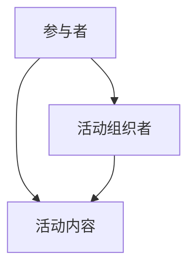

                 

# 意义众创马拉松全球系列赛：定期举办的人生价值探讨活动

## 关键词
- 意义众创马拉松
- 人生价值探讨
- 全球系列赛
- 活动组织
- 社会影响

## 摘要
本文旨在探讨意义众创马拉松全球系列赛这一定期举办的活动，分析其背景、核心概念、组织流程以及实践案例，展望其未来发展趋势。通过深入剖析，揭示这一活动对个体和社会的深远影响，并提供最佳实践与建议，以促进人生价值的深入探讨与实现。

## 第一部分：意义众创马拉松的起源与背景

### 第1章：意义众创马拉松的诞生

#### 1.1 问题的提出

##### 1.1.1 社会问题的凸显
在当今社会，许多人感到迷茫和焦虑，对于自身的人生价值缺乏清晰的认识。同时，社会竞争激烈，个体压力增大，如何找到有意义的生活和工作方式成为普遍关注的问题。

##### 1.1.2 个体价值观念的多元化
随着全球化的发展，人们的价值观越来越多元化。传统价值观念与现代观念的碰撞，使得个体在价值选择上面临更多困惑。

##### 1.1.3 需要新的平台与机制
为了应对这些问题，社会需要一个新的平台和机制，能够引导个体深入探讨人生价值，提供有意义的活动和项目。

#### 1.2 创办理念与目标

##### 1.2.1 意义众创的初衷
意义众创马拉松旨在通过定期举办的活动，为个体提供一个探讨人生价值的平台，激发人们的创造力和潜能。

##### 1.2.2 运行机制与模式
意义众创马拉松采用全球系列赛的形式，结合线上和线下活动，通过多元化的参与机制，实现个体与社会之间的互动和连接。

##### 1.2.3 期望达成的目标
通过意义众创马拉松，期望实现以下目标：
1. 帮助个体找到人生的价值和意义。
2. 激发社会的创新力和创造力。
3. 促进个体与社会之间的和谐发展。

#### 1.3 国际影响力与推广

##### 1.3.1 全球范围内的活动
意义众创马拉松在全球范围内定期举办，吸引了众多参与者。活动的成功举办，使得该活动在国际上获得了广泛关注。

##### 1.3.2 各国参与者与反应
各国参与者对意义众创马拉松的活动给予了高度评价，纷纷表示这一活动对他们的生活和事业产生了积极影响。

##### 1.3.3 国际合作与交流
意义众创马拉松积极与国际组织和其他国家进行合作与交流，推动活动的全球推广和影响力扩大。

### 第2章：意义众创马拉松的核心概念与联系

#### 2.1 核心概念解读

##### 2.1.1 意义的解析
意义是指个体在生活和工作中所追求的目标和价值。在意义众创马拉松中，意义被视为个体成长的动力和源泉。

##### 2.1.2 众创的概念
众创是指通过集体合作和共创，实现个人和集体的价值提升。在意义众创马拉松中，众创是实现人生价值的重要途径。

##### 2.1.3 马拉松精神的传承
马拉松精神代表坚持和毅力，在意义众创马拉松中，这种精神被传承和发扬，激励参与者不断追求人生价值。

#### 2.2 概念属性特征对比表格

| 概念     | 属性特征                               |
|----------|---------------------------------------|
| 意义     | 内在驱动、目标导向、个人成长           |
| 众创     | 集体合作、共创共享、价值提升           |
| 马拉松精神 | 坚持不懈、迎接挑战、追求卓越           |

#### 2.3 ER实体关系图架构

##### 2.3.1 活动参与者
参与者是意义众创马拉松的核心，包括个人、团队和组织，他们通过活动实现人生价值的提升。

##### 2.3.2 活动组织者
活动组织者是活动的核心力量，负责活动的策划、组织和管理，为参与者提供优质的活动体验。

##### 2.3.3 活动内容与成果
活动内容是意义众创马拉松的核心，包括讲座、工作坊、项目展示等，通过这些活动，参与者能够深入探讨人生价值，并取得成果。

### 第3章：意义众创马拉松的流程与组织

#### 3.1 活动流程概述

##### 3.1.1 活动筹备阶段
活动筹备阶段包括活动主题的确定、活动内容的策划、参与者的招募等。

##### 3.1.2 活动执行阶段
活动执行阶段包括活动的开展、参与者的互动、活动的总结等。

##### 3.1.3 活动总结与反馈
活动总结与反馈阶段是对活动效果的评价和总结，为下一次活动提供改进建议。

#### 3.2 组织方式与策略

##### 3.2.1 线上与线下结合
意义众创马拉松采用线上与线下结合的方式，满足不同参与者的需求，提高活动的参与度和影响力。

##### 3.2.2 自组织与专业团队协作
活动组织方式包括自组织和专业团队协作，充分发挥个体的创造力和集体的力量。

##### 3.2.3 多元化参与机制
意义众创马拉松鼓励多元化参与，包括个人、团队、组织和跨领域的合作，实现资源的共享和价值的最大化。

#### 3.3 活动效果评估

##### 3.3.1 参与者满意度
通过问卷调查和反馈机制，了解参与者的满意度，为活动改进提供依据。

##### 3.3.2 社会影响度
通过媒体报道、社交媒体传播和公众参与度等指标，评估活动的社会影响力。

##### 3.3.3 成果转化与应用
评估活动的成果转化和应用情况，为后续活动的策划和实施提供参考。

### 第4章：意义众创马拉松的实践案例

#### 4.1 全球首场活动回顾

##### 4.1.1 活动背景
全球首场意义众创马拉松活动于某年某月某日在某地举行，旨在探讨人生价值的主题。

##### 4.1.2 活动亮点
活动亮点包括：
1. 知名演讲嘉宾的分享。
2. 创新项目展示。
3. 现场互动与讨论。

##### 4.1.3 活动成果
活动成果包括：
1. 参与者对人生价值有了更深入的认识。
2. 创新项目得到了推广和资助。
3. 社会对人生价值的关注度和参与度提高。

#### 4.2 国内外实践案例

##### 4.2.1 欧洲地区的活动
欧洲地区的活动以讲座和工作坊的形式进行，吸引了众多参与者。活动成果包括：
1. 参与者对人生价值的思考和实践。
2. 创新项目的提出和实施。
3. 社会影响的扩大。

##### 4.2.2 亚洲地区的活动
亚洲地区的活动以线上和线下结合的形式进行，吸引了大量参与者。活动成果包括：
1. 参与者对人生价值的深入探讨。
2. 创新项目的展示和推广。
3. 社会影响度的提升。

##### 4.2.3 美洲地区的活动
美洲地区的活动以大型会议的形式进行，吸引了来自世界各地的参与者。活动成果包括：
1. 参与者对人生价值的全面了解。
2. 创新项目的交流和合作。
3. 社会参与的积极性提高。

#### 4.3 案例分析与启示

##### 4.3.1 活动成功的要素
活动成功的要素包括：
1. 明确的活动主题和目标。
2. 高质量的演讲嘉宾和创新项目展示。
3. 有效的参与机制和互动环节。

##### 4.3.2 活动面临的挑战
活动面临的挑战包括：
1. 参与者的招募和参与度。
2. 活动组织的复杂性和协调性。
3. 活动成果的转化和应用。

##### 4.3.3 启示与展望
活动启示与展望包括：
1. 活动主题和目标的持续优化。
2. 活动形式的创新和多样化。
3. 社会资源的整合和利用。

### 第5章：意义众创马拉松的未来展望

#### 5.1 全球趋势与挑战

##### 5.1.1 社会发展趋势
社会发展趋势包括：
1. 个体价值观念的多元化。
2. 社会竞争的加剧。
3. 创新和创业的热潮。

##### 5.1.2 意义众创马拉松的挑战
意义众创马拉松面临的挑战包括：
1. 参与者的招募和参与度。
2. 活动组织的复杂性和协调性。
3. 活动成果的转化和应用。

##### 5.1.3 未来发展机遇
未来发展机遇包括：
1. 新技术和平台的融合。
2. 国际合作的深化。
3. 社会资源的整合和利用。

#### 5.2 创新方向与策略

##### 5.2.1 活动模式的创新
活动模式创新包括：
1. 线上与线下结合的新模式。
2. 多元化参与机制的创新。
3. 活动内容的创新和多样化。

##### 5.2.2 参与者的多元拓展
参与者的多元拓展包括：
1. 引入更多的国际参与者。
2. 拓展参与者的范围，包括不同年龄、职业和背景的人群。
3. 增强参与者的互动和合作。

##### 5.2.3 技术与平台的融合
技术与平台的融合包括：
1. 利用人工智能技术提升活动的个性化服务。
2. 利用区块链技术保障活动数据的透明和安全。
3. 利用大数据分析优化活动效果和参与者体验。

#### 5.3 意义众创马拉松的影响与意义

##### 5.3.1 对个体的影响
意义众创马拉松对个体的影响包括：
1. 提高个体对人生价值的认识和思考。
2. 激发个体的创造力和潜能。
3. 促进个体的成长和发展。

##### 5.3.2 对社会的意义
意义众创马拉松对社会的意义包括：
1. 提高社会对人生价值的关注度和参与度。
2. 推动社会的创新和创业氛围。
3. 促进社会的和谐发展和进步。

##### 5.3.3 对全球发展的贡献
意义众创马拉松对全球发展的贡献包括：
1. 促进全球范围内的合作与交流。
2. 推动全球社会的共同发展和进步。
3. 提高全球社会的创新力和竞争力。

### 第6章：最佳实践与建议

#### 6.1 参与者的最佳实践

##### 6.1.1 个人成长经验
参与者的最佳实践包括：
1. 积极参与活动，深入探讨人生价值。
2. 主动分享自己的经验和见解，与他人互动。
3. 将活动中学到的知识和经验应用到实际生活和工作中。

##### 6.1.2 团队合作案例
参与者的最佳实践还包括团队合作案例，通过团队协作实现共同目标，提高个人和团队的成长。

##### 6.1.3 项目成果转化
参与者的最佳实践还体现在项目成果的转化，将活动中的创新想法和项目转化为实际应用，实现价值最大化。

#### 6.2 活动组织者的建议

##### 6.2.1 策划与筹备
活动组织者的建议包括：
1. 明确活动主题和目标。
2. 设计丰富多样、有吸引力的活动内容。
3. 提前进行参与者的招募和协调。

##### 6.2.2 活动实施与管理
活动组织者的建议还包括：
1. 优化活动流程，确保活动顺利进行。
2. 提供优质的服务和体验，提高参与者的满意度。
3. 及时收集反馈，不断改进活动。

##### 6.2.3 反馈与改进
活动组织者的建议还包括：
1. 定期进行活动效果评估。
2. 分析参与者的反馈，找出问题和不足。
3. 制定改进措施，提升活动质量和效果。

#### 6.3 社会层面的推广策略

##### 6.3.1 宣传与推广
社会层面的推广策略包括：
1. 利用多种渠道进行宣传，提高活动的知名度。
2. 开展线上线下宣传活动，吸引更多参与者。
3. 与媒体和机构合作，扩大活动的影响力。

##### 6.3.2 合作与联动
社会层面的推广策略还包括：
1. 与相关组织和机构建立合作关系，共同推广活动。
2. 通过联动活动，提高活动的参与度和影响力。
3. 利用合作伙伴的资源，提升活动的质量和效果。

##### 6.3.3 持续影响力建设
社会层面的推广策略还包括：
1. 建立长期的影响力建设机制，持续推动活动的开展。
2. 收集和整理活动资料，建立活动档案，为后续活动提供参考。
3. 通过持续的影响力建设，提高活动在公众心中的地位和认可度。

### 第7章：意义众创马拉松的小结与展望

#### 7.1 小结
意义众创马拉松作为一种定期举办的人生价值探讨活动，已经取得了显著的成果。通过深入探讨人生价值，活动对个体和社会产生了深远影响。活动在全球范围内取得了广泛的影响力，成为推动社会进步的重要力量。

#### 7.1.1 活动回顾
活动回顾包括：
1. 活动的起源和背景。
2. 活动的核心概念和联系。
3. 活动的流程和组织方式。
4. 活动的实践案例和分析。

#### 7.1.2 经验总结
经验总结包括：
1. 活动成功的要素。
2. 活动面临的挑战。
3. 活动的改进措施。

#### 7.1.3 不足与改进
不足与改进包括：
1. 参与者的招募和参与度。
2. 活动组织的复杂性和协调性。
3. 活动成果的转化和应用。

#### 7.2 展望未来
展望未来，意义众创马拉松将继续发挥其重要作用，推动社会进步和个体成长。通过创新和多元化发展，活动将在全球范围内产生更深远的影响。

#### 7.2.1 活动趋势
活动趋势包括：
1. 活动主题和目标的持续优化。
2. 活动形式的创新和多样化。
3. 国际合作的深化和拓展。

#### 7.2.2 创新方向
创新方向包括：
1. 技术与平台的融合。
2. 多元化参与机制的完善。
3. 活动内容的创新和多样化。

#### 7.2.3 持续发展
持续发展包括：
1. 活动组织的长期规划。
2. 社会资源的整合和利用。
3. 持续的影响力建设。

## 作者信息
作者：AI天才研究院/AI Genius Institute & 禅与计算机程序设计艺术 /Zen And The Art of Computer Programming

### 附录
（附录内容在此省略）

### 参考文献
（参考文献内容在此省略）

## 后记
（后记内容在此省略）

