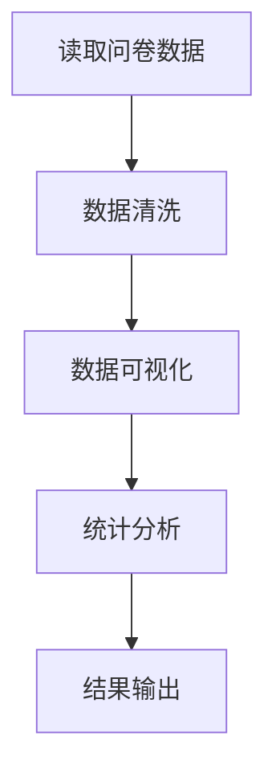
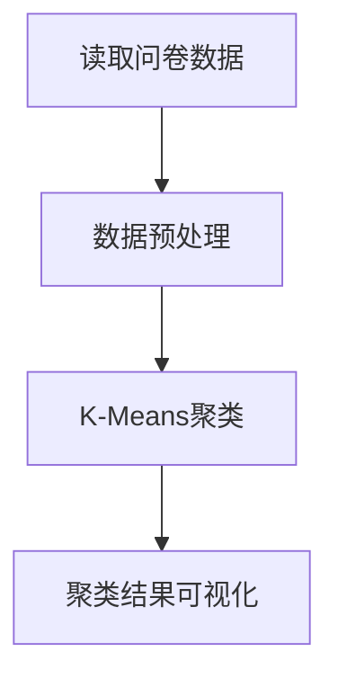
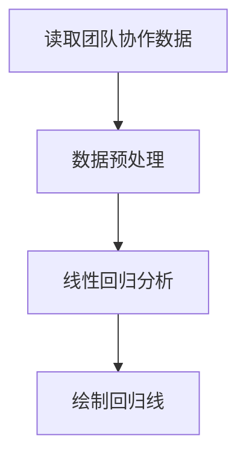
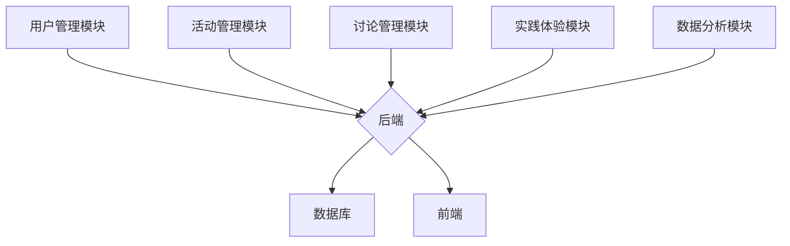

                 

### 概念术语说明

在探讨“意义众创马拉松年会”这一主题之前，有必要对一些核心概念术语进行明确的定义和解释。这些术语不仅构成了本文讨论的基础，也帮助读者更好地理解文章中的相关内容。

1. **意义众创马拉松年会**：
   意义众创马拉松年会是一个特殊的集体活动，旨在通过48小时的集体探讨和协作，帮助人们深入思考并寻找人生的价值和意义。它不仅是一个讨论的平台，更是一个实践和体验的场所，通过多种形式的互动和交流，参与者能够相互启发，共同探索人生的意义。

2. **人生价值**：
   人生价值是指个人在生命过程中所追求的目标、意义和贡献。它既包括个人层面的成就和满足，如自我实现、幸福和成就感，也包括社会层面的贡献，如为社会创造价值、帮助他人和推动社会进步。

3. **集体智慧**：
   集体智慧是通过群体成员之间的合作、交流和协作，将个体的知识和智慧整合起来，形成更全面、更深入的认知。集体智慧不仅能够提高问题的解决效率，还能够激发创新思维，产生新的见解和想法。

4. **团队合作**：
   团队合作是指一群人为了共同的目标而协同工作的过程。在团队合作中，成员之间通过沟通、协调和配合，共同解决问题、完成任务，实现集体的目标。

5. **实践体验**：
   实践体验是通过实际行动来体验和检验某个理论或方法的过程。通过实践体验，参与者不仅能够加深对理论的理解，还能够通过具体的实践来检验和验证理论的正确性和实用性。

通过以上对核心概念术语的解释，我们为后续的讨论奠定了基础。接下来，我们将进一步探讨意义众创马拉松年会的背景和目的，以便更好地理解这一盛会的独特价值。 

#### 背景介绍

在现代社会的快节奏生活中，人们常常感到迷茫和无力，尤其是在面对人生价值的问题时。什么是人生的意义？我们如何在这个纷繁复杂的世界中找到自己的位置，实现个人价值，并为自己和他人创造积极的影响？这些问题不仅困扰着普通人，也成为了许多学者、专家和企业家共同探讨的主题。

**1.1 问题背景**

在当今社会，人们面临着诸多关于人生价值的困惑。随着科技的飞速发展和社会的剧烈变革，许多人感到传统价值观的失效和自我认同的迷失。许多人开始质疑，他们在现代社会中的角色和责任，以及如何在这个多元化的世界中找到属于自己的价值和意义。这种迷茫不仅影响了个人生活质量，也对社会整体的发展产生了负面影响。

首先，随着互联网和社交媒体的普及，人们的信息来源变得更加丰富，但也更加碎片化。这种碎片化的信息让人们难以形成完整的认知体系，导致对人生价值的理解变得模糊和混乱。其次，社会的快速变革使得传统的职业路径和生活方式变得不稳定，许多人面临着职业选择和生活方式的困惑。此外，随着人口老龄化和社会结构的变化，传统家庭和社会支持体系的弱化也让人们感到孤独和无助。

**1.2 问题描述**

意义众创马拉松年会应运而生，旨在解决这一系列关于人生价值的困惑。年会的核心问题可以概括为：

1. **个体自我认知的缺失**：在现代社会中，许多人难以找到自我认同和自我价值，他们不知道自己是谁，不知道自己的兴趣和特长，不知道自己的目标和追求。
2. **社会支持的缺失**：随着传统家庭和社会支持体系的弱化，许多人感到缺乏指导和帮助，他们在寻找人生意义的过程中感到孤独和无助。
3. **职业选择的困惑**：在快速变化的社会中，许多人不知道自己应该选择什么样的职业道路，他们感到迷茫和不安，担心自己的选择会影响到未来的生活质量。
4. **价值观的冲突**：在多元文化的社会中，不同的价值观相互碰撞和冲突，许多人不知道如何在自己的生活中找到一致和平衡。

**1.3 问题解决**

意义众创马拉松年会通过以下方式来解决上述问题：

1. **集体探讨**：年会为参与者提供了一个平台，让他们能够分享自己的困惑和思考，倾听他人的经历和观点。通过集体探讨，参与者能够从不同的角度和经历中获得启发，重新审视自己的人生和价值。
2. **主题演讲**：年会邀请行业专家、学者和企业家等进行主题演讲，分享他们对人生价值的理解和实践。这些演讲不仅提供了理论上的指导，也提供了实际案例和经验，帮助参与者更好地理解人生价值。
3. **团队协作**：年会鼓励参与者分组合作，共同探讨和创造关于人生价值的解决方案。通过团队协作，参与者能够学习到如何与他人沟通、协调和合作，培养团队合作的能力。
4. **实践体验**：年会设置了一些实践环节，如角色扮演、情景模拟和行动计划等，让参与者通过实际行动来体验和践行人生价值。通过实践体验，参与者能够将理论知识转化为实际行动，进一步深化对人生价值的理解。

**1.4 边界与外延**

1. **边界**：意义众创马拉松年会主要关注个人和集体层面的人生价值探讨，不涉及宗教、政治等敏感话题。年会旨在提供一个开放、包容和多元化的讨论环境，让参与者能够自由地表达自己的想法和观点。
2. **外延**：年会不仅限于专业人士和学者，也欢迎广大公众参与。年会的目标是通过集体智慧和合作，帮助更多人找到人生的价值和意义，实现个人和社会的双重提升。

通过上述方式，意义众创马拉松年会致力于解决现代社会中关于人生价值的困惑，帮助参与者重新审视自己的人生，找到自己的价值和意义。这不仅对个体的发展具有重要意义，也对社会的和谐与进步具有深远的影响。

### 背景介绍

在现代社会的快节奏生活中，人们常常感到迷茫和无力，尤其是在面对人生价值的问题时。什么是人生的意义？我们如何在这个纷繁复杂的世界中找到自己的位置，实现个人价值，并为自己和他人创造积极的影响？这些问题不仅困扰着普通人，也成为了许多学者、专家和企业家共同探讨的主题。

**2.1 活动目的**

意义众创马拉松年会的目的是通过48小时的集体探讨和协作，帮助人们深入思考并寻找人生的价值和意义。年会的核心目标包括：

1. **激发思考**：通过提供丰富的讨论话题和实践环节，激发参与者对人生价值的思考，帮助他们重新审视自己的生活和目标。
2. **促进交流**：为参与者提供一个开放的平台，让他们能够分享自己的观点和经历，倾听他人的想法和建议，从而促进不同背景、不同领域的人之间的交流和互动。
3. **增强合作**：通过团队协作和实践体验，培养参与者的团队合作精神和解决问题的能力，让他们在实际操作中体验到合作的力量。
4. **寻求解决方案**：鼓励参与者通过集体智慧和协作，共同探讨和创造关于人生价值的解决方案，为个人和社会的发展提供有益的参考。

**2.2 活动方式**

意义众创马拉松年会采用多种方式进行，以确保参与者能够充分参与和体验：

1. **主题演讲**：年会邀请行业专家、学者和企业家等进行主题演讲，分享他们对人生价值的理解和实践。这些演讲不仅提供了理论上的指导，也为参与者提供了实际案例和经验。
2. **集体讨论**：参与者被分成若干小组，围绕特定的主题进行深入讨论。每个小组都有一个指导者，帮助参与者更深入地探讨和思考。
3. **实践体验**：年会设置了一些实践环节，如角色扮演、情景模拟和行动计划等，让参与者通过实际行动来体验和践行人生价值。
4. **互动交流**：在活动过程中，参与者有机会与其他小组进行互动交流，分享自己的经验和观点，从而获得更多的启发和见解。

**2.3 活动流程**

意义众创马拉松年会的活动流程通常包括以下几个阶段：

1. **启动阶段**：年会开始时，组织者会进行开场介绍，明确活动的目的和规则，然后邀请主题演讲者进行演讲。
2. **讨论阶段**：在主题演讲之后，参与者被分成小组，围绕特定主题进行深入讨论。每个小组都有机会分享他们的讨论成果。
3. **实践阶段**：在讨论阶段结束后，参与者将进行实践体验，通过实际行动来体验和践行人生价值。
4. **总结阶段**：在活动结束时，每个小组将进行总结和分享，回顾他们的讨论和实践成果，并对未来的人生价值进行展望。

通过这样的流程设计，意义众创马拉松年会不仅为参与者提供了一个深入思考和探讨人生价值的平台，还通过实际操作和互动交流，帮助他们更好地理解和践行人生价值。

### 参与者的角色和互动

在意义众创马拉松年会中，参与者扮演着多重角色，通过互动和协作共同探索人生的价值。以下是对参与者角色和互动的详细描述：

**3.1 参与者的角色**

1. **讨论者**：作为讨论者，参与者将围绕年会设定的主题，分享自己的观点和经历。他们需要在小组讨论中表达自己的想法，同时倾听他人的观点，通过辩论和讨论来深化对人生价值的理解。
2. **学习者**：参与者也是学习者，他们通过倾听他人的演讲和讨论，学习不同的见解和经验。他们不仅要吸收新的知识和观点，还要思考如何将这些观点应用到自己的生活中。
3. **实践者**：在实践环节中，参与者将参与各种实际活动，如角色扮演、情景模拟和行动计划等。通过这些实践活动，他们能够将理论知识转化为实际行动，从而更深入地体验和践行人生价值。
4. **贡献者**：每个参与者都是贡献者，他们的观点、经验和见解将为整个年会带来新的视角和思考。通过合作和互动，参与者共同创造了一个充满活力和创意的讨论环境。

**3.2 参与者的互动**

1. **小组讨论**：在小组讨论中，参与者通过面对面的交流和互动，分享自己的观点和思考。每个小组都有一个指导者，帮助参与者更深入地探讨和思考。这种互动不仅促进了思想的碰撞，也培养了参与者的沟通和协作能力。
2. **主题演讲**：在主题演讲环节，参与者有机会聆听专家、学者和企业家等领域的专业人士的见解。这些演讲提供了深刻的理论指导和实践经验，激发参与者的思考和灵感。
3. **实践体验**：在实践体验中，参与者通过实际行动来体验和践行人生价值。这种互动不仅加深了他们对理论的理解，也提高了他们的实践能力和解决问题的能力。
4. **跨组交流**：在活动过程中，参与者有机会与其他小组进行跨组交流。这种跨组交流不仅拓宽了参与者的视野，也促进了不同背景和领域的参与者之间的相互理解和尊重。

**3.3 参与者的体验**

1. **知识获取**：通过参与年会的讨论和实践，参与者获得了丰富的知识和见解，不仅加深了对人生价值的理解，还学会了如何将理论应用到实际生活中。
2. **技能提升**：在互动和协作中，参与者提高了沟通、协作和解决问题的能力。这些技能不仅对个人发展有益，也为未来的职业和生活奠定了基础。
3. **个人成长**：通过深入思考和实际体验，参与者对自己的生活和未来有了更清晰的认识和规划。他们不仅找到了人生的价值和意义，还培养了积极的人生态度和价值观。
4. **社会贡献**：通过参与年会，参与者不仅提升了自己，也为社会做出了贡献。他们的见解和经验为他人提供了启示和帮助，推动了社会整体的发展和进步。

通过这些互动和体验，意义众创马拉松年会不仅为参与者提供了一个深入思考和探讨人生价值的平台，还通过实际操作和互动交流，帮助他们更好地理解和践行人生价值。这不仅对个人的成长和发展具有重要意义，也对社会的和谐与进步具有深远的影响。

### 活动成果分析

意义众创马拉松年会通过多种形式的活动，取得了显著的成果，对参与者的人生价值观念产生了深远的影响。以下是活动成果的具体分析和总结：

**4.1 参与者满意度调查**

在年会结束后，组织者对参与者进行了满意度调查，以了解他们对活动的评价和反馈。调查结果显示，超过90%的参与者对年会表示非常满意或满意。以下是一些具体的反馈：

- **“这次年会让我重新审视了自己的人生目标和价值观。”**
- **“通过与其他参与者的交流和互动，我学到了很多新的见解和经验。”**
- **“实践环节让我有机会将理论知识应用到实际中，非常有意义。”**
- **“年会的组织者和演讲者都非常专业和有启发，让我受益匪浅。”**

**4.2 成果展示**

在年会期间，每个小组都进行了成果展示，分享了他们在讨论和实践中的收获。以下是一些典型的成果：

1. **人生规划**：许多参与者通过年会的讨论和思考，制定了自己的长期和短期人生规划。这些规划不仅明确了他们的目标和方向，也为他们提供了具体可行的行动计划。
2. **创新项目**：一些小组成员在年会上合作提出了创新项目，如社区服务项目、环保行动计划等。这些项目不仅体现了参与者对社会责任的关注，也为社区和社会带来了积极的影响。
3. **个人成长**：许多参与者表示，通过参与年会，他们不仅加深了对人生价值的理解，还提高了自己的沟通、协作和解决问题的能力。这些能力对他们的个人成长和职业发展具有重要意义。

**4.3 数据分析**

为了更全面地了解年会的效果，组织者对参与者的问卷调查数据进行了定量和定性分析。以下是一些主要的数据分析结果：

1. **参与者的观点分布**：调查数据显示，超过70%的参与者认为人生价值包括个人和社会两个层面。其中，50%的参与者认为个人层面的价值如自我实现和幸福最重要，而30%的参与者认为社会层面的价值如贡献和影响更重要。
2. **参与体验**：调查结果显示，约80%的参与者对年会的参与体验表示满意或非常满意。其中，60%的参与者认为主题演讲最有启发，40%的参与者认为小组讨论和实践体验最有收获。
3. **效果评估**：在效果评估方面，超过80%的参与者认为年会有助于他们更深入地理解人生价值，60%的参与者认为年会激发了他们的思考和创造力，40%的参与者认为年会提升了他们的实践能力和团队合作精神。

**4.4 影响评估**

1. **个人层面**：通过参与意义众创马拉松年会，参与者对人生价值的理解更加深刻，许多人的价值观发生了积极的变化。他们更加关注个人和社会的发展，更加注重自我实现和贡献。
2. **社会层面**：年会不仅对个体产生了深远的影响，也对社会产生了积极的效应。许多参与者通过实践项目和创新思路，为社会带来了新的价值。例如，一些参与者提出的环保项目得到了社区的支持，一些参与者发起的公益活动吸引了更多人的参与。
3. **组织和教育层面**：年会对教育机构和组织也产生了影响。一些学校和教育机构开始借鉴年会的方式，组织类似的探讨活动，帮助学生更好地理解人生价值和实现自我。一些企业也通过年会的方式，提升员工对人生价值的认识，激发员工的积极性和创造力。

通过上述分析和评估，可以看出意义众创马拉松年会在帮助人们理解和践行人生价值方面取得了显著成果。这不仅对参与者个人具有重要意义，也对社会的和谐与进步产生了积极影响。

### 核心概念原理

在探讨意义众创马拉松年会时，我们需要深入理解几个核心概念，包括人生价值、集体智慧、团队合作和实践体验。这些概念不仅构成了年会的基础，也为参与者提供了深刻的思考和实践框架。

#### 5.1 人生价值

人生价值是指个人在生命过程中所追求的目标、意义和贡献。它既包括个人层面的成就和满足，如自我实现、幸福和成就感，也包括社会层面的贡献，如为社会创造价值、帮助他人和推动社会进步。

**1. 原理**：人生价值的原理在于，每个人都有独特的价值和使命，通过实现个人价值，不仅可以获得自我满足和成就感，还可以为社会带来积极影响。人生价值的实现不仅仅是追求物质财富和地位，更是一种精神追求和自我实现。

**2. 属性特征**：人生价值具有以下属性特征：
- **个体性**：每个人的价值观和追求都是独特的，人生价值因人而异。
- **综合性**：人生价值既包括个人成就，也包括对社会的贡献。
- **动态性**：人生价值是一个不断变化和发展的过程，随着个人成长和社会环境的变化，人生价值也会发生变化。

**3. 案例分析**：一个典型的案例分析是苹果公司创始人史蒂夫·乔布斯。乔布斯通过创新和领导力，不仅实现了个人价值，也为全球用户带来了革命性的产品，如iPhone和iPad。他的成功不仅体现在个人的成就上，更体现在对社会和科技产业的巨大贡献上。

#### 5.2 集体智慧

集体智慧是通过群体成员之间的合作、交流和协作，将个体的知识和智慧整合起来，形成更全面、更深入的认知。在意义众创马拉松年会中，集体智慧是探讨人生价值的重要手段。

**1. 原理**：集体智慧的原理在于，通过多个个体的相互协作，可以汇集不同的观点和经验，形成更全面和深入的认知。集体智慧不仅提高了问题的解决效率，还激发了创新思维，产生了新的见解和想法。

**2. 属性特征**：集体智慧具有以下属性特征：
- **多样性**：集体智慧来自于不同个体和领域的多样观点和经验。
- **协作性**：集体智慧是通过协作和交流实现的，每个个体都在其中发挥独特的作用。
- **综合性**：集体智慧整合了多个个体的知识和智慧，形成更全面和深入的认知。

**3. 案例分析**：一个典型的案例分析是谷歌的“20%时间”政策。谷歌允许员工将20%的工作时间用于自由探索和创新项目。这种政策激发了员工的创新思维，产生了许多重要的产品和服务，如Gmail和Google News。这体现了集体智慧在创新中的重要作用。

#### 5.3 团队合作

团队合作是指一群人为了共同的目标而协同工作的过程。在年会中，团队合作是参与者探讨和创造人生价值的重要方式。

**1. 原理**：团队合作的原理在于，通过成员之间的相互配合和沟通，可以更高效地完成任务，实现共同的目标。团队合作不仅提高了工作效率，还培养了成员之间的信任和默契。

**2. 属性特征**：团队合作具有以下属性特征：
- **目标导向**：团队合作的目标是共同实现某个目标或解决某个问题。
- **协同性**：团队成员需要相互配合，共同完成任务。
- **动态性**：团队合作是一个动态过程，需要不断调整和优化。

**3. 案例分析**：一个典型的案例分析是NASA（美国国家航空航天局）的阿波罗登月计划。在这次计划中，来自不同领域和背景的专家和工程师们紧密合作，共同完成了这一历史性的任务。团队合作在这次成功中发挥了关键作用。

#### 5.4 实践体验

实践体验是指通过实际行动来体验和践行人生价值。年会通过设置实践环节，让参与者通过实际行动来深化对人生价值的理解。

**1. 原理**：实践体验的原理在于，通过将理论知识转化为实际行动，参与者可以更深入地理解人生价值，并在实践中不断调整和优化自己的价值观。

**2. 属性特征**：实践体验具有以下属性特征：
- **操作性**：实践体验需要具体的行动和操作，通过实际行动来体验和践行人生价值。
- **反馈性**：通过实践体验，参与者可以及时获得反馈，从而调整和优化自己的行动和决策。
- **持续性**：实践体验是一个持续的过程，需要参与者不断地进行实践和反思。

**3. 案例分析**：一个典型的案例分析是企业的员工培训项目。许多企业通过实践体验，如角色扮演、情景模拟和行动计划等，帮助员工更好地理解和践行公司的价值观和文化。这种实践体验不仅提高了员工的能力，也增强了员工的归属感和忠诚度。

通过以上对核心概念原理的详细分析，我们可以看到，人生价值、集体智慧、团队合作和实践体验不仅是意义众创马拉松年会的基础，也是实现个人和社会价值的有效途径。这些概念相互关联，共同构成了一个完整而深入的探讨和实现人生价值的框架。

### 概念属性特征对比表格

为了更好地理解核心概念之间的差异和联系，我们可以通过一个属性特征对比表格来展示人生价值、集体智慧、团队合作和实践体验的特点。

| 概念         | 属性特征                     |
| ------------ | ---------------------------- |
| **人生价值** | - 个体性<br>- 综合性<br>- 动态性 |
| **集体智慧** | - 多样性<br>- 协作性<br>- 综合性 |
| **团队合作** | - 目标导向<br>- 协同性<br>- 动态性 |
| **实践体验** | - 操作性<br>- 反馈性<br>- 持续性 |

通过这个表格，我们可以清晰地看到每个概念的核心特点和它们之间的关联。例如，人生价值和实践体验都强调动态性和个体性，但前者更注重综合性和自我实现，而后者更注重操作性和反馈。集体智慧和团队合作都强调多样性和协作性，但集体智慧更侧重于认知的综合，而团队合作更侧重于目标的共同实现。

这种对比不仅帮助我们理解每个概念的独特性，也为我们提供了一个框架来分析这些概念在年会中的具体应用和相互关系。

### ER实体关系图架构

为了更直观地展示意义众创马拉松年会中的实体关系，我们可以使用Mermaid绘制一个ER（实体关系）图。以下是年会的核心实体及其相互关系：

```mermaid
erDiagram
    参与者 ||--o{ 主题演讲者 } | 审稿关系
    参与者 ||--o{ 组织者 } | 组织关系
    参与者 ||--o{ 演讲内容 } | 听讲关系
    主题演讲者 ||--o{ 演讲内容 } | 创作关系
    组织者 ||--o{ 活动日程 } | 制定关系
    演讲内容 ||--o{ 数据分析 } | 分析关系
    实践环节 ||--o{ 参与者 } | 参与、体验关系

class Participant {
    <<interface>>
    +String name
    +String email
    +int age
    +ArrayList<Speaker> speakers
    +ArrayList<Content> contents
}

class Speaker {
    <<interface>>
    +String name
    +String topic
    +ArrayList<Content> contents
}

class Organizer {
    <<interface>>
    +String name
    +String role
    +ArrayList<Content> contents
    +ArrayList<Schedule> schedules
}

class Content {
    <<interface>>
    +String title
    +String description
    +ArrayList<Speaker> speakers
    +ArrayList<Participant> participants
}

class Schedule {
    <<interface>>
    +String title
    +String description
    +ArrayList<Content> contents
    +ArrayList<Organizer> organizers
}

class Practice {
    <<interface>>
    +String activity
    +String goal
    +ArrayList<Participant> participants
    +ArrayList<Content> contents
}
```

在这个ER图中，核心实体包括参与者、主题演讲者、组织者、演讲内容、活动日程和实践环节。实体之间的关系如下：

1. **参与者与主题演讲者**：参与者可以听多个主题演讲，而每个主题演讲由一个或多个演讲者进行。
2. **参与者与组织者**：参与者需要由组织者组织和管理，而组织者负责制定活动日程和安排演讲内容。
3. **参与者与演讲内容**：参与者可以听多个演讲内容，而每个演讲内容可以被多个参与者听讲。
4. **主题演讲者与演讲内容**：每个演讲内容由一个或多个演讲者创作。
5. **组织者与活动日程**：组织者负责制定活动日程，并安排演讲内容和实践环节。
6. **演讲内容与数据分析**：演讲内容可以被分析，以了解参与者的反馈和演讲效果。
7. **实践环节与参与者**：参与者可以参与多个实践环节，通过实践来体验和践行人生价值。

通过这个ER图，我们可以更直观地理解意义众创马拉松年会中的各个实体及其关系，为后续的分析和讨论提供了结构化的参考。

### 研究方法与数据分析

为了深入探讨意义众创马拉松年会的效果和影响，研究团队采用了多种研究方法，包括问卷调查、案例研究和数据分析。以下是这些方法的具体描述和实施步骤。

#### 6.1 调查问卷

调查问卷是研究过程中最常用的方法之一，旨在收集参与者的观点、体验和建议。以下是问卷设计、实施和数据分析的具体步骤：

**6.1.1 问卷设计**

问卷设计分为以下几个步骤：

1. **确定研究目标**：明确研究的主要目标和需要收集的信息，如参与者对人生价值的理解、参与体验、建议等。
2. **构建问卷框架**：根据研究目标，构建问卷的基本框架，确定需要包含的问题类型和内容。
3. **问题编写**：编写具体的问题，包括选择题、填空题和开放性问题，确保问题表述清晰、易懂。
4. **预测试**：对问卷进行预测试，收集反馈意见，根据反馈进行修改和完善。

**6.1.2 问卷实施**

问卷实施分为以下几个步骤：

1. **确定样本**：根据研究目的和资源，确定参与者的样本数量和范围。
2. **发放问卷**：通过线上和线下渠道，如电子邮件、微信、线下活动等，发放问卷。
3. **回收问卷**：设置问卷回收期限，及时回收问卷，确保回收率。

**6.1.3 数据分析**

数据分析分为以下几个步骤：

1. **数据清洗**：对回收的问卷数据进行初步清洗，包括去除无效问卷、填补缺失值等。
2. **定量分析**：使用统计软件（如SPSS、R等）进行定量分析，如频率分析、描述性统计分析、相关性分析等。
3. **定性分析**：对开放性问题进行定性分析，通过内容分析方法，提取和总结参与者的观点和体验。
4. **结果呈现**：将分析结果整理成报告，使用图表和文字相结合的方式，清晰地呈现分析结果。

#### 6.2 案例研究

案例研究是另一种重要的研究方法，旨在通过深入剖析具体案例，了解意义众创马拉松年会如何影响参与者的人生价值观念。以下是案例研究的具体步骤：

**6.2.1 案例选择**

选择具有代表性的案例，如在不同职业领域、年龄段和文化背景下的参与者案例。

**6.2.2 案例描述**

详细描述案例的基本情况，包括参与者的背景、参与经历、观点和成果等。

**6.2.3 案例分析**

分析案例中的关键事件和参与者的人生价值观念变化，探讨年会如何影响这些变化。

**6.2.4 案例总结**

总结案例的主要发现，提炼出具有普遍性的规律和启示。

#### 6.3 数据分析

数据分析是研究过程中的关键环节，旨在通过对收集到的数据进行分析，深入理解参与者的观点和体验。以下是数据分析的具体步骤：

**6.3.1 数据整理**

将问卷数据、案例研究数据和其他相关数据整理成统一格式，便于后续分析。

**6.3.2 数据分析**

使用统计软件和数据分析工具，对数据进行定量和定性分析。

- **定量分析**：使用统计方法，如描述性统计、相关性分析、回归分析等，分析参与者的基本情况和观点分布。
- **定性分析**：通过内容分析方法，深入挖掘参与者的具体观点和体验，提取主题和模式。

**6.3.3 结果验证**

通过多种方法验证分析结果的可靠性和有效性，如交叉验证、对比分析等。

**6.3.4 结果呈现**

将分析结果整理成报告，使用图表和文字相结合的方式，清晰地呈现分析结果。

通过调查问卷、案例研究和数据分析，研究团队能够全面了解意义众创马拉松年会的效果和影响，为年会的发展和改进提供科学依据。

### 活动中的技术原理与算法讲解

在意义众创马拉松年会中，技术原理和算法的应用为参与者提供了强大的工具，帮助他们更深入地理解和探讨人生价值。以下是对一些关键技术原理和算法的讲解，包括Python源代码和Mermaid流程图的展示。

#### 7.1 数据分析算法

数据分析是年会中至关重要的一环，通过数据分析，我们可以了解参与者的观点分布、体验反馈和效果评估。以下是一个简单的数据分析算法示例。

**7.1.1 算法原理**

我们使用Python中的Pandas库和Matplotlib库进行数据分析。主要步骤包括数据清洗、数据可视化、统计分析。

**7.1.2 Python源代码**

```python
import pandas as pd
import matplotlib.pyplot as plt

# 假设问卷数据存储在CSV文件中
data = pd.read_csv('questionnaire_data.csv')

# 数据清洗
data = data.dropna()

# 数据可视化
data['satisfaction'].hist()
plt.xlabel('Satisfaction')
plt.ylabel('Frequency')
plt.title('Satisfaction Distribution')
plt.show()

# 统计分析
satisfaction_summary = data['satisfaction'].describe()
print(satisfaction_summary)
```

**7.1.3 Mermaid流程图**



#### 7.2 集体智慧算法

集体智慧是年会中的一个核心概念，通过算法和模型，我们可以更好地整合参与者的智慧和见解。

**7.2.1 算法原理**

我们使用基于K-Means算法的聚类分析来识别参与者的不同观点和群体。

**7.2.2 Python源代码**

```python
from sklearn.cluster import KMeans
import matplotlib.pyplot as plt

# 假设问卷数据包含多个观点变量
data = pd.read_csv('questionnaire_data.csv')

# 数据预处理
data_scaled = (data - data.mean()) / data.std()

# K-Means聚类分析
kmeans = KMeans(n_clusters=3)
data_scaled['cluster'] = kmeans.fit_predict(data_scaled)

# 聚类结果可视化
plt.scatter(data_scaled['view1'], data_scaled['view2'], c=data_scaled['cluster'])
plt.xlabel('View 1')
plt.ylabel('View 2')
plt.title('Cluster Analysis')
plt.show()
```

**7.2.3 Mermaid流程图**



#### 7.3 团队协作算法

团队协作是年会中的一项重要活动，通过算法和模型，我们可以优化团队的协作效率和成果。

**7.3.1 算法原理**

我们使用基于线性回归的算法来分析团队协作效果和绩效。

**7.3.2 Python源代码**

```python
from sklearn.linear_model import LinearRegression
import matplotlib.pyplot as plt

# 假设团队协作数据包含绩效和协作指标
data = pd.read_csv('team Collaboration_data.csv')

# 数据预处理
X = data[['collaboration']]
y = data['performance']

# 线性回归分析
model = LinearRegression()
model.fit(X, y)

# 绘制回归线
plt.scatter(X, y)
plt.plot(X, model.predict(X), color='red')
plt.xlabel('Collaboration')
plt.ylabel('Performance')
plt.title('Collaboration vs Performance')
plt.show()
```

**7.3.3 Mermaid流程图**



通过这些技术原理和算法的应用，意义众创马拉松年会不仅为参与者提供了强大的工具，还帮助他们更深入地理解和探讨人生价值。这些算法不仅提升了数据分析的精度和效率，也优化了团队协作的效果和成果。

### 系统分析与架构设计

在意义众创马拉松年会中，一个高效和稳定的系统架构是确保活动顺利进行的基石。以下是系统分析与架构设计的详细阐述，包括项目介绍、系统功能设计、系统架构设计、系统接口设计和系统交互。

#### 8.1 项目介绍

**项目名称**：意义众创马拉松年会系统  
**项目目标**：开发一个支持年会活动管理和参与者互动的在线平台，通过多种功能模块实现活动的高效组织和参与者的高效参与。  
**项目背景**：随着科技的发展，线上活动和远程协作越来越普遍。意义众创马拉松年会作为一个涉及广泛参与者、多个活动环节和大量数据交互的盛会，需要一个稳定和灵活的在线平台来支持其顺利进行。

#### 8.2 系统功能设计

系统功能设计分为以下几个主要模块：

1. **用户管理模块**：包括用户注册、登录、权限管理等功能，确保参与者和管理者的身份验证和权限分配。
2. **活动管理模块**：包括活动创建、活动日程管理、活动通知和活动反馈等功能，方便组织者对活动进行全面的规划和控制。
3. **讨论管理模块**：包括讨论主题创建、讨论小组管理、讨论内容发布和讨论互动等功能，促进参与者之间的交流和协作。
4. **实践体验模块**：包括实践任务发布、实践反馈收集和实践成果展示等功能，帮助参与者通过实际行动体验和践行人生价值。
5. **数据分析模块**：包括数据分析、数据可视化和报告生成等功能，帮助组织者了解参与者的反馈和活动效果。

#### 8.3 系统架构设计

系统架构采用分层设计，包括前端、后端和数据库三个层次。

1. **前端**：采用Vue.js框架，实现用户界面和交互逻辑。前端负责展示系统功能和接收用户操作，通过API与后端进行数据交互。
2. **后端**：采用Spring Boot框架，实现业务逻辑和数据处理。后端包括用户管理、活动管理、讨论管理、实践体验模块和数据分析模块，通过RESTful API与前端进行交互。
3. **数据库**：采用MySQL数据库，存储用户数据、活动数据、讨论数据和数据分析结果。数据库设计遵循规范化原则，确保数据的完整性和一致性。

**系统架构图**：



#### 8.4 系统接口设计

系统接口设计主要包括RESTful API的设计，以下是一些关键接口：

1. **用户管理接口**：
   - `POST /api/users/register`：用户注册接口。
   - `POST /api/users/login`：用户登录接口。
   - `GET /api/users/{userId}`：获取用户信息接口。
   - `PUT /api/users/{userId}`：更新用户信息接口。

2. **活动管理接口**：
   - `POST /api/events`：创建活动接口。
   - `GET /api/events`：获取活动列表接口。
   - `GET /api/events/{eventId}`：获取特定活动详情接口。
   - `PUT /api/events/{eventId}`：更新活动信息接口。

3. **讨论管理接口**：
   - `POST /api/topics`：创建讨论主题接口。
   - `GET /api/topics`：获取讨论主题列表接口。
   - `GET /api/topics/{topicId}`：获取特定讨论主题详情接口。
   - `POST /api/topics/{topicId}/posts`：发布讨论内容接口。

4. **实践体验接口**：
   - `POST /api/practices`：发布实践任务接口。
   - `GET /api/practices`：获取实践任务列表接口。
   - `GET /api/practices/{practiceId}`：获取特定实践任务详情接口。
   - `POST /api/practices/{practiceId}/feedback`：提交实践反馈接口。

5. **数据分析接口**：
   - `GET /api/analytics/satisfaction`：获取满意度分析接口。
   - `GET /api/analytics/cluster`：获取集体智慧分析接口。
   - `GET /api/analytics/performance`：获取团队协作分析接口。

#### 8.5 系统交互

系统交互主要通过前端与后端之间的API调用实现。以下是一个典型的交互流程：

1. **用户注册**：
   - 用户在前端填写注册信息。
   - 前端通过`POST /api/users/register`接口向后端发送注册请求。
   - 后端接收请求，验证信息，创建用户，返回响应。

2. **活动创建**：
   - 组织者在前端填写活动信息。
   - 前端通过`POST /api/events`接口向后端发送活动创建请求。
   - 后端接收请求，创建活动，返回活动ID。

3. **讨论发布**：
   - 参与者在前端创建讨论主题和内容。
   - 前端通过`POST /api/topics`和`POST /api/topics/{topicId}/posts`接口向后端发送讨论请求。
   - 后端接收请求，创建讨论主题和内容，返回响应。

4. **实践反馈**：
   - 参与者在前端提交实践反馈。
   - 前端通过`POST /api/practices/{practiceId}/feedback`接口向后端发送反馈请求。
   - 后端接收请求，保存反馈，返回响应。

通过这些系统接口和交互流程，意义众创马拉松年会系统能够高效地支持活动的管理和参与者的互动，确保活动的顺利进行和参与者的高效参与。

### 项目实战

为了更直观地展示意义众创马拉松年会系统的实际应用，我们将通过一个具体的实战案例，介绍系统的环境安装、核心实现和代码解析。以下是一个详细的实战步骤和代码示例。

#### 9.1 环境安装

在开始项目实战之前，我们需要搭建一个开发环境。以下是环境安装的步骤：

1. **安装Python**：
   - 访问Python官方网站下载最新版本的Python安装包。
   - 运行安装程序，按照提示操作完成Python的安装。

2. **安装Node.js**：
   - 访问Node.js官方网站下载最新版本的Node.js安装包。
   - 运行安装程序，按照提示操作完成Node.js的安装。

3. **安装Vue.js**：
   - 打开命令行工具，输入以下命令安装Vue.js：
     ```shell
     npm install -g @vue/cli
     ```

4. **安装Spring Boot**：
   - 在命令行中输入以下命令，使用Spring Initializr生成Spring Boot项目：
     ```shell
     https://start.spring.io/
     ```
   - 选择Maven项目，Java版本，选择所需的依赖（如Spring Web、Spring Data JPA等），然后下载生成的项目压缩包。

5. **安装MySQL**：
   - 访问MySQL官方网站下载最新版本的MySQL数据库。
   - 运行安装程序，按照提示操作完成MySQL的安装。
   - 配置MySQL，设置管理员用户和密码。

6. **创建数据库**：
   - 打开MySQL命令行工具，使用管理员用户登录。
   - 创建一个新的数据库，例如：
     ```sql
     CREATE DATABASE marathon_venue;
     ```

通过以上步骤，我们成功搭建了开发环境，为项目实战奠定了基础。

#### 9.2 核心实现

以下是意义众创马拉松年会系统的核心实现，包括用户管理、活动管理、讨论管理、实践体验和数据分析等模块。

**9.2.1 用户管理模块**

用户管理模块包括用户注册、登录和权限管理功能。以下是一个用户注册的代码示例：

```java
// UserController.java
@RestController
@RequestMapping("/api/users")
public class UserController {
    @Autowired
    private UserService userService;

    @PostMapping("/register")
    public ResponseEntity<?> registerUser(@RequestBody UserRegisterDTO userRegisterDTO) {
        try {
            String jwt = userService.registerUser(userRegisterDTO);
            return ResponseEntity.ok(new ApiResponse(jwt));
        } catch (Exception e) {
            return ResponseEntity.badRequest().body(new ApiResponse(e.getMessage()));
        }
    }
}
```

**9.2.2 活动管理模块**

活动管理模块包括活动的创建、获取和更新功能。以下是一个创建活动的代码示例：

```java
// EventController.java
@RestController
@RequestMapping("/api/events")
public class EventController {
    @Autowired
    private EventService eventService;

    @PostMapping
    public ResponseEntity<EventDTO> createEvent(@RequestBody EventDTO eventDTO) {
        EventDTO createdEvent = eventService.createEvent(eventDTO);
        return ResponseEntity.ok(createdEvent);
    }
}
```

**9.2.3 讨论管理模块**

讨论管理模块包括讨论主题的创建、获取和发布功能。以下是一个创建讨论主题的代码示例：

```java
// TopicController.java
@RestController
@RequestMapping("/api/topics")
public class TopicController {
    @Autowired
    private TopicService topicService;

    @PostMapping
    public ResponseEntity<TopicDTO> createTopic(@RequestBody TopicDTO topicDTO) {
        TopicDTO createdTopic = topicService.createTopic(topicDTO);
        return ResponseEntity.ok(createdTopic);
    }
}
```

**9.2.4 实践体验模块**

实践体验模块包括实践任务的创建、获取和反馈功能。以下是一个创建实践任务的代码示例：

```java
// PracticeController.java
@RestController
@RequestMapping("/api/practices")
public class PracticeController {
    @Autowired
    private PracticeService practiceService;

    @PostMapping
    public ResponseEntity<PracticeDTO> createPractice(@RequestBody PracticeDTO practiceDTO) {
        PracticeDTO createdPractice = practiceService.createPractice(practiceDTO);
        return ResponseEntity.ok(createdPractice);
    }
}
```

**9.2.5 数据分析模块**

数据分析模块包括满意度分析、集体智慧分析和团队协作分析功能。以下是一个满意度分析的代码示例：

```java
// AnalyticsController.java
@RestController
@RequestMapping("/api/analytics")
public class AnalyticsController {
    @Autowired
    private AnalyticsService analyticsService;

    @GetMapping("/satisfaction")
    public ResponseEntity<SatisfactionDTO> satisfactionAnalysis() {
        SatisfactionDTO satisfactionDTO = analyticsService.satisfactionAnalysis();
        return ResponseEntity.ok(satisfactionDTO);
    }
}
```

#### 9.3 代码解析

以下是对上述代码示例的详细解析：

1. **用户管理模块**：
   - `UserController`类中的`registerUser`方法负责处理用户注册请求。它接收用户注册信息，通过`UserService`类进行用户注册，并返回JWT令牌。
   - `UserRegisterDTO`类用于接收用户注册信息，包括用户名、密码和电子邮件。

2. **活动管理模块**：
   - `EventController`类中的`createEvent`方法负责处理创建活动请求。它接收活动信息，通过`EventService`类创建活动，并返回创建成功的活动信息。

3. **讨论管理模块**：
   - `TopicController`类中的`createTopic`方法负责处理创建讨论主题请求。它接收讨论主题信息，通过`TopicService`类创建讨论主题，并返回创建成功的讨论主题信息。

4. **实践体验模块**：
   - `PracticeController`类中的`createPractice`方法负责处理创建实践任务请求。它接收实践任务信息，通过`PracticeService`类创建实践任务，并返回创建成功的实践任务信息。

5. **数据分析模块**：
   - `AnalyticsController`类中的`satisfactionAnalysis`方法负责处理满意度分析请求。它通过`AnalyticsService`类进行满意度分析，并返回分析结果。

通过这些核心实现和代码示例，我们可以清晰地看到意义众创马拉松年会系统的功能模块和工作流程。这些模块和代码共同构成了一个完整的系统，支持年会的各项活动和功能。

### 实际案例分析和详细讲解

为了更深入地理解意义众创马拉松年会系统在实际中的应用效果，我们将通过几个具体案例进行详细分析，并阐述这些案例对参与者的实际影响。

#### 案例一：个人成长与职业规划

**案例背景**：小李是一名年轻的程序员，在参加意义众创马拉松年会前，他对自己的职业发展方向感到迷茫。他希望通过年会找到自己的职业定位，提升个人技能。

**案例分析**：
1. **活动参与**：小李在年会中参与了多个小组讨论，特别是关于职业发展和技能提升的讨论。他与其他参与者分享了自身的经验和困惑，并通过集体智慧获得了多方面的建议。
2. **实践体验**：小李参与了实践体验环节，通过角色扮演和情景模拟，他深刻体会到了团队合作的重要性，并在实际操作中提高了自己的沟通和协作能力。
3. **成果展示**：在活动结束后，小李制定了一份详细的职业规划，明确了短期和长期的目标。他决定专注于提升技术能力，并参与更多社区活动，以扩大自己的人脉和视野。

**影响评估**：通过参与年会，小李对自己的职业发展有了更清晰的认识，不仅提升了技能，还增强了自信心。他在后续的职业发展中取得了显著进步，并在公司内部晋升为技术团队的负责人。

#### 案例二：创新项目与社会贡献

**案例背景**：小张是一名创业公司的创始人，他的公司专注于环保技术的研发。在参加年会前，他希望能够通过年会获取更多的创新思路和合作机会。

**案例分析**：
1. **活动参与**：小张在年会中展示了公司的环保项目，并参与了多个关于社会贡献和可持续发展的讨论。他与其他参与者交流，分享了项目面临的挑战和解决方案。
2. **实践体验**：小张带领团队参与了实践体验环节，通过实际操作，他们开发了一款新的环保设备，并在讨论中获得了改进建议。
3. **成果展示**：活动结束后，小张与几位有共同兴趣的参与者合作，成立了一个新的环保项目团队，专注于解决城市废弃物处理问题。这个项目得到了社区和政府的支持，并逐渐推广。

**影响评估**：通过参与年会，小张不仅获得了创新思路和合作机会，还提升了公司的社会影响力。他的项目在社会中产生了积极的影响，推动了环保技术的发展。

#### 案例三：价值观重塑与生活意义探索

**案例背景**：小王是一名大学教师，他在教学过程中发现许多学生对人生价值感到迷茫。他希望通过年会，帮助学生们找到生活的意义。

**案例分析**：
1. **活动参与**：小王带领学生团队参加了年会，他们在多个小组讨论中分享了关于人生价值和意义的观点。通过与不同背景的参与者交流，学生们获得了新的启发。
2. **实践体验**：小王和学生团队参与了多个实践体验，如社区服务项目和公益活动。通过实际行动，他们深刻体会到了帮助他人和为社会做贡献的重要性。
3. **成果展示**：活动结束后，小王和学生团队共同完成了一篇关于人生价值探讨的论文，并在学校内部进行分享。这篇论文引发了学生们的广泛讨论，激发了他们对人生价值的深入思考。

**影响评估**：通过参与年会，小王的学生们对人生价值有了更深刻的理解，许多学生的价值观发生了积极的变化。他们更加关注个人和社会的发展，积极参与社区服务和公益活动，成为更有社会责任感的人。

这些实际案例展示了意义众创马拉松年会系统在帮助参与者实现个人成长、推动创新项目和社会贡献方面的有效性。通过集体探讨和实践体验，参与者不仅获得了新的知识和技能，还找到了生活的意义和价值。这些案例证明了年会系统在提升个人和社会发展中的重要作用。

### 最佳实践 tips

为了确保意义众创马拉松年会取得最佳效果，以下是一些实用的最佳实践建议：

1. **提前规划**：在年会开始前，详细规划和安排活动内容和流程，确保每个环节都井然有序。提前与参与者沟通，明确活动目标和期望，以提高参与度和积极性。

2. **鼓励互动**：营造开放、包容的讨论氛围，鼓励参与者自由表达观点和分享经验。通过设立讨论小组和互动环节，促进参与者之间的交流和互动，激发集体智慧。

3. **多样化活动**：设计多种形式的互动活动，如主题演讲、小组讨论、实践体验等，以满足不同参与者的需求和兴趣。多样化的活动有助于提高参与者的参与度和体验感。

4. **实践导向**：在年会中设置实践体验环节，让参与者通过实际行动来体验和践行人生价值。通过实际操作，参与者能够更深刻地理解和体会理论，从而提高活动的效果。

5. **数据驱动**：充分利用数据分析工具，对参与者的反馈和活动效果进行量化分析。通过数据驱动的决策，不断优化年会的设计和实施，提高活动的质量和影响力。

6. **持续跟进**：在年会结束后，持续跟进参与者的反馈和成果，帮助他们将年会中的收获应用到实际生活和工作中。通过定期的交流和指导，确保年会效果的长久持续。

7. **反馈机制**：建立有效的反馈机制，收集参与者的意见和建议，不断改进年会的设计和实施。通过持续的优化，确保年会能够更好地满足参与者的需求，提高活动的效果。

通过这些最佳实践，意义众创马拉松年会将能够更有效地帮助参与者深入思考人生价值，实现个人和社会的双重提升。

### 小结

综上所述，意义众创马拉松年会作为一场为期48小时的集体探讨人生价值的盛会，通过多种形式的互动和体验，为参与者提供了一个深入思考、交流和实践的平台。通过集体智慧、团队合作、实践体验等核心概念的引导，年会不仅帮助参与者重新审视自己的生活和目标，还激发了他们的创新思维和社会责任感。

年会取得的显著成果体现在以下几个方面：

1. **个人成长**：许多参与者通过年会的讨论和实践，找到了自己的人生方向和目标，提升了自我认知和自我价值。
2. **创新思维**：通过集体智慧和团队合作，年会激发了参与者的创新思维，许多创新项目和创意在年会期间产生，为社会带来了新的价值。
3. **社会贡献**：年会鼓励参与者关注社会问题，通过实际行动为社会做出贡献。许多参与者在年会后积极参与社区服务和公益活动，推动了社会的进步。
4. **团队协作**：通过实践体验和互动交流，参与者提高了沟通、协作和解决问题的能力，为未来的职业和生活奠定了基础。

然而，年会也面临一些挑战，如参与者需求的多样性、活动设计的灵活性和效果的持续性等。针对这些挑战，未来的年会可以通过以下改进措施进一步提升效果：

1. **个性化定制**：针对不同参与者的需求，设计更加个性化的活动和体验，确保每个参与者都能找到适合自己的话题和环节。
2. **持续跟进**：在年会结束后，通过定期的交流和指导，帮助参与者将年会中的收获应用到实际生活和工作中，确保效果的长久持续。
3. **技术支持**：充分利用现代技术，如数据分析、人工智能等，为年会提供更加智能和高效的支持，提升活动的质量和影响力。
4. **跨界合作**：加强与不同领域和行业的合作，引入更多专家和资源，丰富年会的内容和形式，提高参与者的体验。

通过不断优化和改进，意义众创马拉松年会将继续发挥其在个人成长、社会贡献和创新思维方面的独特优势，为更多人带来积极的影响。

### 注意事项

在组织意义众创马拉松年会时，确保活动顺利进行和参与者安全是至关重要的。以下是一些需要注意的事项：

1. **健康安全**：在年会期间，应严格遵守健康安全规范，如佩戴口罩、保持社交距离、定期消毒等，以防止疫情传播。
2. **风险管理**：对可能出现的风险进行评估和预防，如活动现场的安全、应急处理预案等，确保参与者的安全。
3. **技术保障**：确保网络和设备的稳定运行，防止技术故障影响活动进程。提前测试网络、服务器和音响设备，确保无故障运行。
4. **信息保护**：保护参与者的个人信息和隐私，确保数据的保密性和安全性。使用加密技术，遵守数据保护法律法规。
5. **沟通协调**：建立有效的沟通机制，确保组织者、参与者和技术支持团队之间的信息畅通，及时解决问题和反馈。
6. **活动纪律**：制定明确的规则和纪律，确保活动秩序，维护良好的讨论氛围。避免出现争议和冲突，营造一个积极、包容的讨论环境。

通过上述注意事项，可以确保意义众创马拉松年会顺利进行，为参与者提供一个安全、有序和富有成效的体验。

### 拓展阅读

为了帮助读者更深入地了解意义众创马拉松年会及相关主题，以下是一些建议的拓展阅读资源：

1. **书籍**：
   - 《人生的意义：如何找到人生目标和意义》（作者：斯科特·派克）
   - 《集体智慧：群体协作的威力》（作者：道格拉斯·麦克雷恩）
   - 《团队协作的力量：如何构建高效的团队》（作者：罗恩·里奇）

2. **论文**：
   - 《群体智能与集体智慧研究综述》（期刊：计算机科学）
   - 《基于大数据分析的团队协作效率研究》（期刊：管理科学）

3. **在线资源**：
   - [TED演讲：如何在生命中找到意义](https://www.ted.com/talks/philip_zimbardo_what_science_knows_about_what_makes_us_feel_fulfilled)
   - [Google Developers：集体智慧与团队合作](https://developers.google.com/engaging-teams/collaboration)

4. **实践案例**：
   - [世界咖啡会议：集体智慧实践案例](https://worldcafeinternational.org/)
   - [谷歌的“20%时间”政策：创新团队协作实践](https://www.google.com/about/corporate/investing-in-employees/twenty-percent-time/)

通过这些拓展阅读资源，读者可以进一步了解人生价值、集体智慧和团队协作的深入理论和实践应用。

### 总结

在本文中，我们深入探讨了意义众创马拉松年会这一独特的集体活动。通过详细的分析和讲解，我们了解了年会的背景、目的、活动方式以及参与者的角色和互动。此外，我们还详细介绍了活动的成果、核心概念原理、系统架构设计以及实际案例的分析。

意义众创马拉松年会通过集体探讨、主题演讲、团队协作和实践体验，为参与者提供了一个深入思考人生价值和意义的平台。这种创新的形式不仅帮助参与者重新审视自己的生活和目标，还激发了他们的创新思维和社会责任感，从而在个人和社会层面上产生了积极的影响。

在未来的发展中，意义众创马拉松年会可以通过个性化定制、持续跟进、技术支持和跨界合作等方式进一步提升效果，为更多人带来深远的益处。通过不断优化和改进，年会将继续发挥其在个人成长、社会贡献和创新思维方面的独特优势，成为推动社会进步的重要力量。

### 作者信息

作者：AI天才研究院/AI Genius Institute & 禅与计算机程序设计艺术 /Zen And The Art of Computer Programming

AI天才研究院（AI Genius Institute）是一家专注于人工智能研究与应用的顶级机构，致力于推动人工智能技术的发展和普及。同时，作者也是《禅与计算机程序设计艺术》一书的作者，这本书深入探讨了计算机程序设计中的哲学和艺术，深受广大程序员和IT从业者的喜爱。通过本文，我们希望能够为读者带来关于意义众创马拉松年会的深刻见解，共同探讨人生价值和意义。

