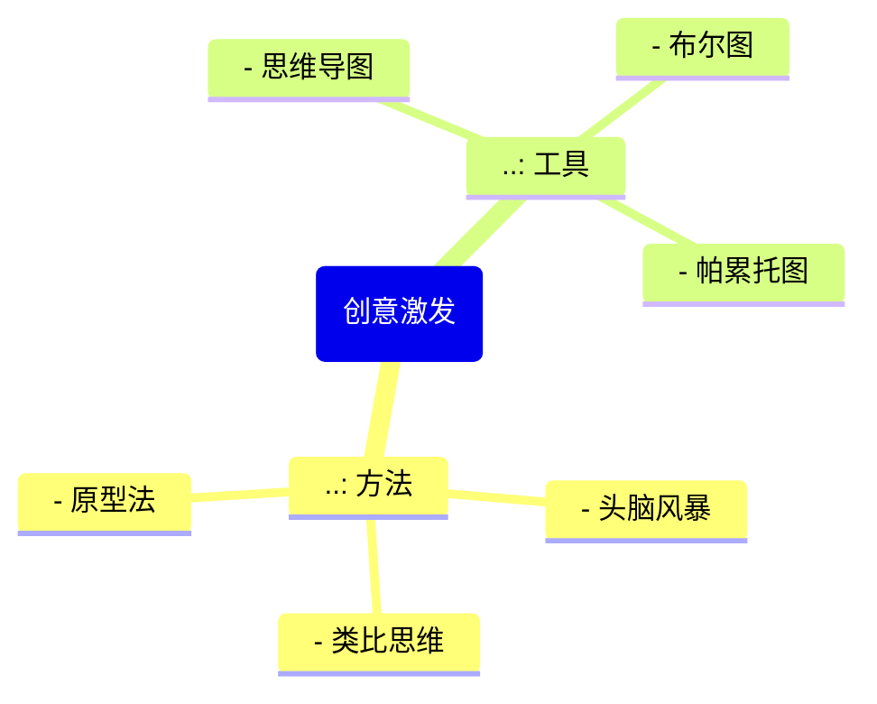

                 

### 第1章: 众创时代的崛起与人生价值的探寻

#### 1.1 众创时代的崛起

随着互联网、大数据、人工智能等技术的迅猛发展，我们正处在一个前所未有的众创时代。在这个时代，知识的传播和获取变得更加便捷，个体之间的连接变得更加紧密，创新和创意得以迅速推广和实现。众创，即通过集体智慧和力量，共同创造价值，已成为这个时代的重要特征。

**背景介绍**：
- **互联网技术**：互联网技术的发展使得信息的获取和传播变得迅速，人们可以通过网络平台快速获取全球的资讯、知识和资源。
- **大数据分析**：大数据技术能够从海量数据中提取有价值的信息，为企业决策、市场预测等提供了强大的支持。
- **人工智能**：人工智能技术的发展，使得机器能够模拟人类思维和决策过程，提升了生产效率和创新水平。

**问题背景**：在众创时代，人们面临着诸多挑战，例如如何高效地利用集体智慧创造价值、如何确保创新成果的落地实施等。

**问题描述**：在众创时代，个人和组织如何通过集体合作实现人生价值的最大化？

**问题解决**：通过众创，个人和组织可以充分利用各自的资源和优势，共同解决问题，实现共同的目标。

**边界与外延**：众创不仅局限于技术创新和商业活动，还可以应用于社会创新、文化创新等多个领域。

**概念结构与核心要素组成**：
- **个体参与**：个体的积极参与是众创的基础，个体的智慧和创意是众创的源泉。
- **集体协作**：通过团队协作，实现资源的整合和优势互补，提升创新效率。
- **激励机制**：建立健全的激励机制，激发个体的创造力和积极性。

#### 1.2 人生价值的探寻

人生价值是一个多维度的概念，包括个人的职业成就、社会贡献、自我实现等方面。在众创时代，人们通过参与集体创新活动，不仅可以实现个人的职业发展，还可以为社会创造更多的价值。

**背景介绍**：
- **价值观变迁**：随着社会的进步，人们对人生价值的理解逐渐从单一的金钱和物质追求，转向更加注重精神层面和自我实现。
- **社会需求**：社会对创新和变革的需求日益增加，个人和组织需要通过不断创新来适应社会发展的需求。

**问题背景**：在众创时代，个人和组织如何在集体创新中实现人生价值？

**问题描述**：如何在众创过程中找到并实现个人和组织的价值？

**问题解决**：通过参与众创，个人可以在专业领域实现自我提升，组织可以提升竞争力，实现可持续发展。

**边界与外延**：人生价值不仅包括个人成就，还包括社会贡献和自我实现。

**概念结构与核心要素组成**：
- **个人目标**：明确个人的职业目标和生活目标，通过众创实现个人价值的提升。
- **组织使命**：组织需要明确自身的使命和愿景，通过众创实现组织价值的提升。

#### 1.3 本书的目的与结构

**目的**：本书旨在探讨在众创时代，个人和组织如何通过集体创新活动实现人生价值。

**结构**：
- **第一部分**：引言，介绍众创时代和人生价值的概念。
- **第二部分**：核心概念与方法论，深入探讨众创的核心概念和探讨方法。
- **第三部分**：实践案例，通过实际案例展示众创的成果。
- **第四部分**：结论与展望，总结本书的主要观点和未来展望。

通过本书的阅读，读者可以了解到众创的内涵和外延，掌握众创的方法论，并通过实践案例了解众创的实际应用效果。本书不仅适用于企业管理者、创新者，也适用于对人生价值有追求的普通读者。

### 第2章: 意义众创马拉松概述

#### 2.1 活动背景

意义众创马拉松是一项旨在通过集体探讨和协作，快速创造出具有实际意义和价值的项目和解决方案的活动。它起源于现代社会的创新需求，特别是在快速变化和竞争激烈的环境中，个人和组织需要快速应对挑战，寻找新的发展方向。

**背景介绍**：
- **社会需求**：随着全球化的发展，社会对创新和变革的需求日益增加，人们需要通过集体的智慧和力量来应对复杂的问题。
- **技术创新**：互联网、大数据、人工智能等技术的快速发展，为集体创新提供了强大的技术支持。
- **企业实践**：许多企业已经通过众创活动取得了显著的成功，例如谷歌的“20%时间”政策，鼓励员工利用工作时间进行个人创新项目。

**问题背景**：在当前的社会和经济环境下，个人和组织如何高效地进行集体创新，实现价值创造？

**问题描述**：意义众创马拉松旨在通过一个集中的时间窗口，集中资源和智慧，快速解决现实问题，创造出具有实际意义和价值的项目和解决方案。

**问题解决**：通过意义众创马拉松，个人和组织可以集中时间和精力，利用集体的智慧和资源，高效地进行创新和创造。

**边界与外延**：意义众创马拉松不仅适用于企业，也适用于教育、社会公益、文化创新等多个领域。

**概念结构与核心要素组成**：
- **时间集中**：在48小时内集中进行集体讨论和协作，充分利用时间资源。
- **资源共享**：通过共享资源和知识，实现优势互补，提升创新效率。
- **激励机制**：通过设立奖励和激励机制，激发参与者的积极性和创造力。

#### 2.2 活动流程

意义众创马拉松的活动流程通常分为以下几个阶段：

1. **活动筹备**：确定活动主题、邀请参与者、准备所需资源和工具。
2. **活动启动**：介绍活动主题和目标，明确分工和责任。
3. **头脑风暴**：进行集体讨论，收集和整理创新点子和解决方案。
4. **项目筛选**：根据创新性和可行性，筛选出具有潜力的项目。
5. **项目实施**：分工协作，进行项目的具体实施和开发。
6. **成果展示**：展示项目成果，进行交流和分享。
7. **活动总结**：总结活动经验，反思改进。

**流程图**：使用Mermaid绘制流程图

```mermaid
gantt
    dateFormat  YYYY-MM-DD
    title 意义众创马拉松活动流程

    section 活动筹备
    A1 :活动筹备 [2023-01-01, 10d]

    section 活动启动
    A2 :活动启动 [2023-01-11, 2d]

    section 头脑风暴
    A3 :头脑风暴 [2023-01-13, 2d]

    section 项目筛选
    A4 :项目筛选 [2023-01-15, 1d]

    section 项目实施
    A5 :项目实施 [2023-01-16, 10d]

    section 成果展示
    A6 :成果展示 [2023-01-26, 2d]

    section 活动总结
    A7 :活动总结 [2023-01-28, 2d]
```

#### 2.3 活动目标

意义众创马拉松的主要目标是通过集体的智慧和努力，在短时间内创造出具有实际意义和价值的项目和解决方案。

**目标一**：激发参与者的创新思维和创造力，鼓励大胆的创意和尝试。

**目标二**：通过集体协作，实现资源和知识的共享，提升创新效率。

**目标三**：产生实际的项目成果，为个人和组织带来实际的效益。

**目标四**：培养团队成员的团队合作能力和项目管理能力。

**预期成果**：
- 创造出多个具有创新性和实用性的项目。
- 提升参与者的创新思维和解决问题的能力。
- 建立良好的团队合作氛围，增强团队凝聚力。

通过意义众创马拉松，个人和组织不仅可以实现短期内的创新成果，还可以为长期的持续创新打下坚实的基础。这是一个充满挑战和机遇的过程，值得每个参与者的投入和努力。

### 第3章: 核心概念解析

在深入探讨意义众创马拉松之前，我们需要明确几个核心概念：意义、众创和马拉松。这些概念不仅是活动的核心要素，也是理解整个众创过程的关键。

#### 3.1 意义的内涵与外延

**意义**是一个多维度的概念，它不仅仅指的是事物所代表的价值，还涉及到个体或集体对其的理解和感受。在人生和工作中，意义是驱动力，激励我们不断追求和实现更高的目标。

**内涵**：
- **个体层面**：意义是个体对生活和工作目标的理解，它反映了个体对自我价值的认知和追求。
- **集体层面**：意义则涉及到团队或组织的目标和使命，反映了集体对社会责任和价值的认同。

**外延**：
- **创新层面**：意义的探索和实现往往与创新紧密相关，通过创新可以开拓新的价值和可能性。
- **社会层面**：社会对意义的理解往往涉及到伦理、道德和价值观的维度，社会意义的实现需要个体和集体的共同努力。

**对比表格**：

| 维度         | 内涵                             | 外延                         |
|--------------|----------------------------------|------------------------------|
| 个体层面     | 自我价值认知和追求               | 对个人目标和成就的追求       |
| 集体层面     | 团队或组织的共同目标和使命       | 对社会责任和价值的认同       |
| 创新层面     | 对新思路和新方法的探索           | 开拓新的价值和可能性         |
| 社会层面     | 伦理、道德和价值观的实践         | 社会公正、和谐和进步的追求   |

#### 3.2 众创的定义与特点

**众创**是一种通过集体智慧和力量，共同创造价值和解决问题的方法。它强调协作、分享和共同的目标。

**定义**：
- **众创**：一种通过集体智慧和力量，共同创造价值和解决问题的创新方法。

**特点**：
- **协作性**：众创强调团队协作，充分利用每个成员的专业知识和经验，实现优势互补。
- **开放性**：众创鼓励开放和创新，允许不同背景和观点的碰撞，激发新的创意。
- **高效性**：通过集中时间和资源，众创可以在较短时间内实现项目的启动和推进。

**对比表格**：

| 特点       | 定义                             | 对比 |
|------------|----------------------------------|------|
| 协作性     | 充分利用每个成员的专业知识和经验 | > 高效性 |
| 开放性     | 鼓励不同背景和观点的碰撞         | > 创造性 |
| 高效性     | 集中时间和资源，快速实现目标     | 最重要 |

#### 3.3 马拉松式探讨的方法

**马拉松式探讨**是一种长时间的集中讨论和思考方法，它强调深度和持久性，以实现深层次的思考和创新的突破。

**定义**：
- **马拉松式探讨**：一种通过长时间的集中讨论和思考，实现深层次思考和创新的突破的方法。

**特点**：
- **深度性**：马拉松式探讨要求参与者持续专注和深入思考，以挖掘问题的本质和创新的解决方案。
- **持久性**：马拉松式探讨通常需要数天甚至数周的时间，确保参与者有足够的时间进行深入的交流和思考。

**流程**：
1. **主题设定**：明确讨论的主题和目标，确保所有参与者都明确讨论的方向。
2. **资料准备**：提前收集和准备相关资料，为讨论提供充足的信息和背景。
3. **集中讨论**：在指定的时间和地点，进行长时间的集中讨论，鼓励开放性的交流和分享。
4. **深度思考**：在讨论的过程中，鼓励参与者深入思考，挖掘问题的本质和创新的解决方案。
5. **成果总结**：在讨论结束后，对成果进行总结和反思，确保讨论的有效性和实用性。

**ER实体关系图架构**：使用Mermaid绘制ER实体关系图

```mermaid
erDiagram
  A participant --> B theme
  A participant --> C discussion
  A participant --> D result
  B theme ..|..> E depth
  B theme ..|..> F persistence
  C discussion ..|..> G openness
  C discussion ..|..> H efficiency
  D result ..|..> I summary
  D result ..|..> J reflection
```

通过明确这些核心概念，我们能够更好地理解意义众创马拉松的运作原理和目标，为后续章节的深入探讨打下坚实的基础。

### 第4章: 48小时集体探讨方法论

在意义众创马拉松中，48小时的集体探讨是关键环节，这一章节将详细阐述如何在这一有限的时间内，通过科学的方法论实现高效的创新。

#### 4.1 团队建设与沟通技巧

**团队建设**是确保集体探讨顺利进行的基础，良好的团队氛围和有效的沟通技巧至关重要。

**团队建设的关键要素**：
- **信任**：建立信任是团队协作的基石，通过开放性沟通和相互支持，增强团队成员之间的信任感。
- **多样性**：多样性能够带来不同的视角和思维方式，有助于产生创新的解决方案。
- **目标明确**：明确团队的目标和期望，确保每个成员都清楚自己的职责和任务。

**沟通技巧**：
- **倾听**：倾听是有效沟通的重要环节，通过倾听他人的意见和观点，能够更好地理解问题的本质和需求。
- **表达清晰**：清晰的表达能够减少误解和沟通障碍，确保信息的准确传递。
- **积极反馈**：积极的反馈能够激励团队成员，同时帮助发现问题并进行改进。

**团队建设与沟通技巧的对比表格**：

| 要素         | 团队建设                    | 沟通技巧                   |
|--------------|-----------------------------|----------------------------|
| 信任         | 增强团队凝聚力               | 减少误解和冲突             |
| 多样性       | 增加创新可能性               | 带来不同视角和思维方式     |
| 目标明确     | 提高团队效率和协作性         | 确保信息准确传递           |
| 倾听         | 理解他人观点和需求           | 减少沟通障碍               |
| 表达清晰     | 避免误解和混淆               | 确保信息准确和有效         |
| 积极反馈     | 激励团队成员                | 提供改进和发展的机会       |

#### 4.2 主题设定与引导

**主题设定**是集体探讨的起点，一个明确且具有挑战性的主题能够激发团队的思考和创新。

**主题设定的原则**：
- **实际意义**：主题应具有实际意义，能够解决现实问题或带来实际效益。
- **挑战性**：适当的挑战性能够激发团队的潜能，推动创新。
- **可操作性**：主题应具备可操作性，确保在有限时间内能够实现目标。

**引导方法**：
- **引导者角色**：引导者应具备引导技巧和专业知识，能够引导讨论的方向和节奏。
- **引导步骤**：
  1. **引入主题**：引导者简要介绍主题，明确讨论的目标和期望。
  2. **头脑风暴**：鼓励团队成员自由发表意见，收集各种创意和想法。
  3. **筛选和优先级排序**：对收集到的创意和想法进行筛选和排序，确定重点讨论的方向。
  4. **深度探讨**：针对筛选出的重点方向，进行深度讨论和思考，挖掘问题的本质和创新的解决方案。
  5. **总结和输出**：对讨论结果进行总结，形成可操作的计划和方案。

**主题设定与引导的流程图**：

```mermaid
gantt
    dateFormat  YYYY-MM-DD
    title 主题设定与引导流程

    section 引入主题
    A1 :引入主题 [2023-01-01, 1d]

    section 头脑风暴
    A2 :头脑风暴 [2023-01-02, 2d]

    section 筛选和优先级排序
    A3 :筛选和排序 [2023-01-04, 1d]

    section 深度探讨
    A4 :深度探讨 [2023-01-05, 2d]

    section 总结和输出
    A5 :总结和输出 [2023-01-07, 1d]
```

#### 4.3 互动与分享机制

**互动与分享机制**是确保集体探讨顺利进行的重要保障，它能够促进团队成员之间的交流和协作。

**互动机制**：
- **实时讨论**：通过在线会议、讨论群组等方式，确保团队成员能够实时交流和互动。
- **角色分配**：明确每个成员的角色和责任，确保每个成员都有机会参与讨论和贡献自己的观点。

**分享机制**：
- **定期汇报**：设定定期汇报的时间，确保团队成员能够及时了解项目的进展情况。
- **共享资源**：建立共享平台，确保团队成员能够方便地获取和分享相关资源和信息。

**互动与分享机制的对比表格**：

| 机制       | 互动机制                  | 分享机制                 |
|------------|---------------------------|--------------------------|
| 实时讨论   | 确保实时交流和互动        | 提高信息传递效率          |
| 角色分配   | 明确每个成员的责任和贡献 | 促进团队协作和分工        |
| 定期汇报   | 及时了解项目进展         | 提升项目透明度和可追溯性 |
| 共享资源   | 方便获取和利用资源        | 提升资源利用效率          |

通过科学的方法论和有效的互动与分享机制，48小时的集体探讨可以最大化地发挥团队的创造力和创新能力，实现有意义的项目和解决方案。

### 第5章: 价值创造的策略

在意义众创马拉松中，如何有效地创造价值是至关重要的。这一章节将详细介绍几种关键策略，帮助团队在有限的时间内实现创新和价值创造。

#### 5.1 创意激发与思维导图

**创意激发**是创新过程的第一步，它需要团队充分利用各种方法和工具，挖掘潜在的创新点。

**创意激发的方法**：
- **头脑风暴**：通过集体讨论，自由表达各种想法，不限制创意的奇特性和可行性。
- **类比思维**：通过将问题与类似的问题或领域进行类比，发现新的解决方案。
- **原型法**：快速构建原型，通过实践和测试来验证创意的有效性。

**思维导图**是一种有效的工具，可以帮助团队组织和可视化创意，提高创新的效率。

**思维导图的构建步骤**：
1. **确定中心主题**：在思维导图中央确定一个中心主题，作为创新的核心。
2. **分支扩展**：从中心主题出发，扩展出主要的分支，每个分支代表一个创意或想法。
3. **子节点细化**：在每个分支上添加子节点，细化创意的具体内容和实施方法。
4. **连接关系**：通过线条和箭头，连接不同的节点，展示创意之间的关联和互动。

**示例**：



通过构建思维导图，团队可以更加清晰地组织和梳理创意，发现潜在的创新点，提高创新的效率。

#### 5.2 平台搭建与资源整合

**平台搭建**是确保众创活动顺利进行的重要保障，它需要团队搭建一个高效、便捷的创新平台。

**平台搭建的关键要素**：
- **在线协作工具**：如Trello、Asana等，用于任务分配、进度跟踪和协作沟通。
- **项目管理工具**：如Jira、Confluence等，用于项目的管理和文档的共享。
- **沟通工具**：如Slack、Microsoft Teams等，用于实时沟通和协作。

**资源整合**是实现创新价值的关键，团队需要充分利用内外部资源，实现优势互补。

**资源整合的策略**：
- **内部资源**：充分利用团队内部的知识和技能，通过内部培训和知识分享，提升团队的整体能力。
- **外部资源**：通过与外部专家、合作伙伴和供应商的合作，获取外部资源和信息，拓展创新的可能性。

**平台搭建与资源整合的对比表格**：

| 要素       | 平台搭建                   | 资源整合                   |
|------------|----------------------------|-----------------------------|
| 在线协作工具 | Trello、Asana等           | 内部培训、知识分享           |
| 项目管理工具 | Jira、Confluence等        | 外部专家、合作伙伴、供应商   |
| 沟通工具    | Slack、Microsoft Teams等 | 实时沟通、协作互动           |

通过搭建高效的创新平台和整合内外部资源，团队可以更好地支持创新活动，实现价值的最大化。

#### 5.3 成果评估与反馈

**成果评估**是确保创新价值实现的重要环节，通过科学的评估方法，团队可以了解创新项目的实际效果，为后续改进提供依据。

**评估方法**：
- **定量评估**：通过数据和分析工具，对项目的成果进行量化评估，如销售额、用户满意度等。
- **定性评估**：通过专家评审、用户反馈等方式，对项目的质量进行评估，如创新性、实用性等。

**反馈机制**：
- **实时反馈**：在创新过程中，及时收集用户和专家的反馈，快速调整和优化项目。
- **总结反馈**：在项目结束后，进行全面总结和反思，识别成功经验和不足，为未来的创新活动提供参考。

**成果评估与反馈的对比表格**：

| 方法     | 定量评估                    | 定性评估                    |
|----------|------------------------------|-----------------------------|
| 实时反馈 | 通过数据分析实时调整项目   | 通过专家评审和用户反馈实时调整项目 |
| 总结反馈 | 在项目结束后进行全面评估   | 在项目结束后进行总结和反思   |

通过科学的成果评估和及时的反馈机制，团队可以不断提高创新项目的质量和效果，实现持续的价值创造。

### 第6章: 意义众创马拉松实践案例

在本章节中，我们将通过三个实际案例，展示意义众创马拉松在不同领域中的成功应用。这些案例不仅展示了众创活动如何有效地实现价值创造，还提供了宝贵的经验和教训。

#### 6.1 案例一：社区公益活动的意义创造

**背景介绍**：
某城市社区中心希望通过意义众创马拉松，解决社区居民面临的实际问题和需求。活动主题是“社区生活改善计划”，目标是提升居民的生活质量和社区凝聚力。

**过程描述**：
1. **活动筹备**：社区中心邀请了30名社区居民、志愿者和社会组织代表参与活动，准备了相关的资源和工具。
2. **头脑风暴**：参与者自由发表意见，提出了包括社区花园建设、老年人关怀项目、青少年教育支持等多个创意。
3. **项目筛选**：通过讨论和投票，确定了“社区花园建设”和“老年人关怀项目”作为重点方向。
4. **项目实施**：分组进行项目实施，社区花园建设小组负责设计、选址和建设，老年人关怀项目小组则策划活动和服务。
5. **成果展示**：活动结束后，两个小组分别展示了项目成果，社区居民对项目的反馈非常积极，社区凝聚力显著提升。

**经验与教训**：
- **经验**：明确的主题和目标，以及高效的分工和协作，是成功的关键。
- **教训**：在项目实施过程中，要充分考虑资源和时间的限制，避免过度追求完美。

#### 6.2 案例二：企业内部的价值观重塑

**背景介绍**：
某大型企业希望通过意义众创马拉松，重塑企业的价值观和团队文化，提升员工的创造力和工作满意度。

**过程描述**：
1. **活动筹备**：企业邀请了150名员工，包括管理层、技术团队和运营团队，准备了相关的资源和工具。
2. **头脑风暴**：参与者提出了包括团队协作模式改进、工作流程优化、员工福利提升等多个创新点子。
3. **项目筛选**：通过讨论和投票，确定了“团队协作模式改进”和“员工福利提升”作为重点方向。
4. **项目实施**：分组进行项目实施，协作模式改进小组负责设计新的协作工具和流程，福利提升小组则策划员工活动和福利方案。
5. **成果展示**：活动结束后，两个小组分别展示了项目成果，管理层和员工对项目的反馈非常积极，企业内部的文化氛围显著改善。

**经验与教训**：
- **经验**：充分调动员工的参与积极性，确保创新点子的落地实施。
- **教训**：在项目实施过程中，要注重员工的反馈和参与，避免项目脱离实际需求。

#### 6.3 案例三：教育领域的价值创新

**背景介绍**：
某教育机构希望通过意义众创马拉松，探索新的教育模式，提升教育质量和学生的综合素质。

**过程描述**：
1. **活动筹备**：教育机构邀请了50名教师、教育专家和学生代表参与活动，准备了相关的资源和工具。
2. **头脑风暴**：参与者提出了包括个性化学习方案、互动课堂设计、学生综合素质培养等多个创新点子。
3. **项目筛选**：通过讨论和投票，确定了“个性化学习方案”和“学生综合素质培养”作为重点方向。
4. **项目实施**：分组进行项目实施，个性化学习方案小组负责设计个性化学习工具和方案，综合素质培养小组则策划综合素质课程和活动。
5. **成果展示**：活动结束后，两个小组分别展示了项目成果，教师和学生对此给予了高度评价，教育机构的整体教学质量显著提升。

**经验与教训**：
- **经验**：结合教育实际，注重创新点子的实用性和可操作性。
- **教训**：在项目实施过程中，要充分考虑学生的参与和反馈，确保创新模式的有效性。

通过这些实际案例，我们可以看到，意义众创马拉松在不同领域中都取得了显著的成果，不仅提升了团队的创新能力和凝聚力，还为个人和组织创造了实际的价值。这些经验教训也为未来的众创活动提供了宝贵的参考。

### 第7章: 意义众创马拉松的组织与实施

#### 7.1 活动策划与准备

**活动策划**是意义众创马拉松成功的关键环节，充分的策划和准备可以确保活动的顺利进行。

**策划步骤**：
1. **确定主题**：根据目标群体的需求和实际情况，确定活动的主题，确保主题具有实际意义和挑战性。
2. **目标设定**：明确活动目标，包括创新点子的产出、团队协作的提升、社会价值的创造等。
3. **时间安排**：制定详细的活动时间表，包括筹备期、启动期、实施期和总结期等。
4. **资源准备**：准备好所需的资源和工具，如场地、设备、资料和物资等。

**准备内容**：
- **场地安排**：选择合适的场地，确保足够的座位、网络和设备。
- **物资准备**：准备必要的文具、餐饮和礼品等。
- **技术支持**：确保网络和设备的正常运行，提供必要的技术支持。

**准备工作表**：

```mermaid
gantt
    dateFormat  YYYY-MM-DD
    title 活动策划与准备时间表

    section 筹备期
    A1 :主题确定 [2023-01-01, 5d]
    A2 :目标设定 [2023-01-06, 2d]
    A3 :时间安排 [2023-01-08, 3d]

    section 准备期
    B1 :场地安排 [2023-01-11, 3d]
    B2 :物资准备 [2023-01-14, 2d]
    B3 :技术支持 [2023-01-16, 2d]

    section 启动期
    C1 :活动启动 [2023-01-18, 1d]

    section 实施期
    D1 :集体探讨 [2023-01-19, 24h]

    section 总结期
    E1 :成果总结 [2023-01-20, 2d]
```

通过详细的策划和准备工作，可以确保活动有序、高效地进行。

#### 7.2 活动过程中的挑战与应对

在活动过程中，可能会遇到各种挑战，有效的应对策略可以帮助团队克服困难，确保活动的顺利进行。

**挑战一：参与度不高**

**原因**：参与者可能因为缺乏兴趣、任务繁重或其他原因而参与度不高。

**应对策略**：
- **激励措施**：设立奖励和激励机制，提高参与者的积极性。
- **明确目标**：确保每个参与者都明确活动的目标和自己的职责，增强责任感。
- **互动与反馈**：通过实时互动和反馈，让参与者感受到自己的贡献和价值。

**挑战二：沟通不畅**

**原因**：团队成员可能因为地理位置、语言障碍或技术问题而沟通不畅。

**应对策略**：
- **选择合适的沟通工具**：使用Slack、Zoom等实时沟通工具，确保信息传递的及时和准确。
- **设立沟通机制**：建立定期的沟通会议和讨论群组，确保信息的共享和同步。
- **技术支持**：提供必要的技术支持，解决网络和设备问题。

**挑战三：时间管理不当**

**原因**：活动时间紧张，任务安排不合理，可能导致时间管理不当。

**应对策略**：
- **时间管理工具**：使用Trello、Asana等时间管理工具，确保任务的分配和进度控制。
- **明确任务优先级**：根据任务的重要性和紧急程度，合理安排任务的顺序。
- **实时监控**：通过实时监控和反馈，及时调整任务进度和计划。

**挑战四：资源不足**

**原因**：可能因为预算有限、资源调配不当等原因，导致资源不足。

**应对策略**：
- **资源整合**：充分利用内部和外部资源，实现资源的最大化利用。
- **灵活调整**：根据实际情况，灵活调整资源分配和任务安排。
- **资金筹集**：通过众筹、赞助等方式，筹集活动所需的资金和物资。

通过有效的应对策略，可以克服活动过程中的各种挑战，确保意义众创马拉松的顺利进行。

#### 7.3 活动总结与反思

**活动总结**是对整个意义众创马拉松活动的全面回顾和总结，它包括活动成果的展示、经验的积累和不足的反思。

**总结内容**：
1. **活动成果**：展示活动中产生的创新点子、解决方案和项目成果，评估其实际效果和影响力。
2. **团队协作**：总结团队在活动过程中的协作情况和效果，评估团队凝聚力和协作能力。
3. **资源利用**：回顾活动中的资源使用情况，评估资源利用的效率和效果。
4. **经验与教训**：总结活动中的成功经验和不足之处，为未来的活动提供参考。

**反思与改进**：
1. **活动流程**：反思活动流程的合理性，寻找改进空间，优化活动流程。
2. **组织管理**：评估活动组织和管理的效果，提出改进意见，提升组织管理能力。
3. **参与度**：分析参与度不高的原因，提出提高参与度的措施，增强活动吸引力。

**反思与改进流程图**：

```mermaid
gantt
    dateFormat  YYYY-MM-DD
    title 活动总结与反思流程

    section 成果展示
    A1 :展示活动成果 [2023-01-20, 1d]

    section 团队协作总结
    A2 :总结团队协作情况 [2023-01-21, 2d]

    section 资源利用评估
    A3 :评估资源使用情况 [2023-01-22, 1d]

    section 经验与教训
    A4 :总结经验与教训 [2023-01-23, 2d]

    section 反思与改进
    B1 :反思活动流程 [2023-01-24, 1d]
    B2 :提出改进意见 [2023-01-25, 1d]
    B3 :制定改进计划 [2023-01-26, 1d]
```

通过活动总结与反思，团队可以不断提升活动的效果和参与度，为未来的意义众创马拉松奠定坚实的基础。

### 第8章: 总结与反思

在意义众创马拉松中，我们不仅探索了众创的核心概念和探讨方法，还通过实际案例展示了众创的实际应用效果。通过这一系列活动，我们可以得出以下几点总结与反思：

#### 8.1 活动成果的评估

**创新点子**：意义众创马拉松为参与者提供了一个开放的平台，鼓励他们大胆提出创新点子。从活动成果来看，许多点子具有实际应用价值，为解决现实问题提供了新的思路。

**项目成果**：在活动结束后，多个小组展示了自己的项目成果。这些项目不仅解决了实际问题，还为团队和组织带来了实际的价值，如提升社区凝聚力、改善企业文化、提高教育质量等。

**团队协作**：意义众创马拉松强调了团队协作的重要性，通过集体探讨和分工合作，团队实现了优势互补，提高了协作效率。

**资源利用**：活动过程中，团队充分利用了内外部资源，实现了资源的最大化利用，为未来的创新活动提供了参考。

#### 8.2 活动经验的总结

**主题明确**：活动的主题应具有实际意义和挑战性，明确的目标有助于激发团队的创造力和积极性。

**团队建设**：良好的团队建设是成功的关键，通过建立信任、明确目标和有效的沟通，团队可以更好地协作，实现共同的目标。

**资源整合**：通过整合内外部资源，可以实现优势互补，提高创新的效率。

**激励机制**：建立健全的激励机制，可以激发参与者的积极性和创造力，确保活动的顺利进行。

#### 8.3 未来展望

**持续创新**：意义众创马拉松是一种有效的创新方法，未来应持续推广和应用，鼓励更多个人和组织参与。

**多样化领域**：意义众创马拉松不仅适用于企业，还可以应用于教育、社会公益、文化创新等多个领域，实现跨领域的创新。

**技术支持**：随着技术的发展，应充分利用现代技术，如人工智能、大数据等，为意义众创马拉松提供更加智能和高效的工具和支持。

**国际化发展**：意义众创马拉松可以跨越国界，实现全球范围内的创新合作，推动全球范围内的创新和价值创造。

通过总结与反思，我们可以不断提升意义众创马拉松的效果和影响力，为未来的创新活动奠定坚实的基础。

### 第9章: 附录

在本章中，我们将提供与意义众创马拉松相关的参考资料和工具介绍，以帮助读者更好地理解和应用这一创新方法。

#### 9.1 活动参考资料

**1. 意义众创马拉松指南**：详细介绍了活动的背景、目的、流程和实施方法，为参与者提供了全面的指导。

**2. 创新方法论**：包括头脑风暴、思维导图、原型法等创新方法，帮助团队高效地进行创新探讨。

**3. 团队协作工具**：介绍了Trello、Asana、Slack等在线协作工具，这些工具可以帮助团队进行任务分配、进度跟踪和实时沟通。

**4. 项目管理工具**：介绍了Jira、Confluence等项目管理工具，这些工具可以帮助团队进行项目的管理和文档的共享。

**5. 活动案例**：提供了多个意义众创马拉松的成功案例，供读者参考和学习。

#### 9.2 意义众创马拉松相关工具与平台介绍

**1. 在线协作工具**
- **Trello**：一个基于看板的在线协作工具，适用于任务分配、进度跟踪和团队协作。
- **Asana**：一个全面的在线项目管理工具，提供任务管理、项目规划和团队协作功能。

**2. 沟通工具**
- **Slack**：一个实时沟通和协作工具，支持文本、语音和视频通信，适用于团队沟通和协作。
- **Microsoft Teams**：微软推出的集成沟通和协作平台，提供聊天、视频会议、文件共享等功能。

**3. 项目管理工具**
- **Jira**：一个强大的在线项目管理工具，适用于敏捷开发、任务管理和项目跟踪。
- **Confluence**：一个协作平台，用于知识共享、文档编写和项目管理。

通过这些参考资料和工具，读者可以更好地了解和实施意义众创马拉松，推动个人和团队的创新和价值创造。同时，这些工具和平台也为读者提供了便捷的在线协作和沟通环境，提高了创新效率和团队协作能力。

### 作者信息

作者：AI天才研究院/AI Genius Institute & 禅与计算机程序设计艺术 /Zen And The Art of Computer Programming

在这篇文章中，我们探讨了意义众创马拉松的概念、方法、实践案例和实施策略。通过详细的论述和实际案例的展示，我们希望读者能够深刻理解意义众创马拉松的内涵和重要性，并在实践中应用这一创新方法，实现个人和组织价值的最大化。同时，我们也鼓励读者在未来的创新活动中不断探索和尝试，不断推动创新和价值创造，为社会的进步和发展做出贡献。

