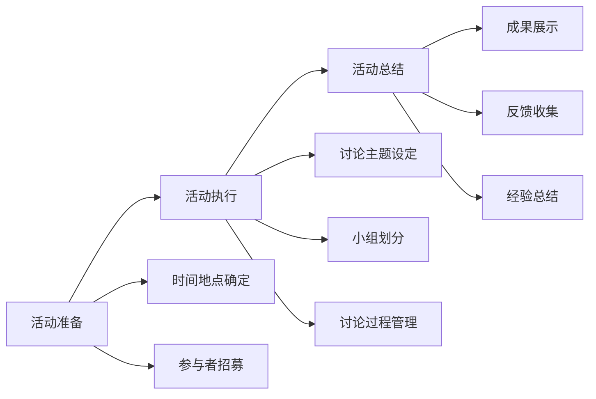
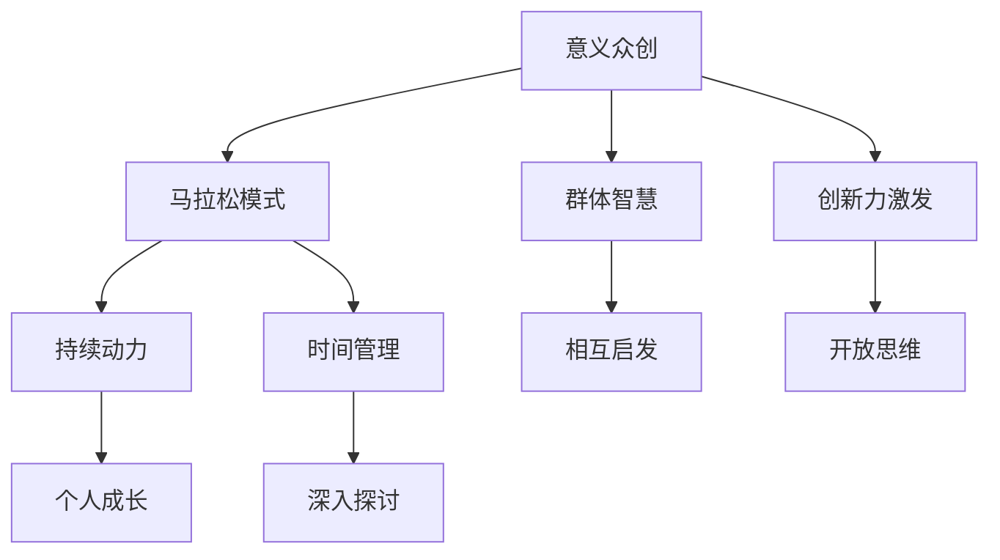
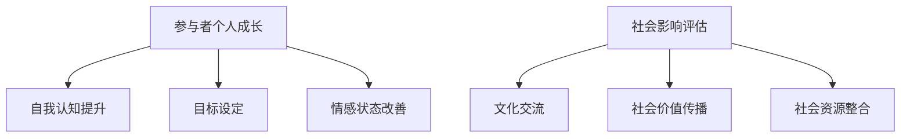

                 

### 第一部分：介绍与背景

#### 第1章：问题的提出与意义探讨

**1.1.1 问题背景**

在当今社会，个体价值探寻成为许多人的困扰。随着社会的发展和科技的进步，人们面临的信息量呈指数级增长，但与此同时，个体的幸福感却逐渐减弱。人们在追求物质生活的同时，往往忽视了内心的精神需求。这种情况下，如何找到人生的意义和价值成为一个迫切需要解决的重要问题。

**1.1.2 问题描述**

- **个体价值探寻的困难**：许多人感到迷茫和困惑，不知道自己的人生目标和意义何在。在现代社会，人们面临着过多的选择，但同时也感到无力，难以找到真正适合自己的道路。
  
- **社会价值观的多元性**：随着全球化的发展，不同文化之间的碰撞和融合，使得社会价值观日益多元。这使得个体在寻找人生意义的过程中，更加难以确定自己的方向和目标。

**1.1.3 活动解决思路**

**意义众创马拉松**：这是一种创新的集体讨论活动，旨在通过48小时的持续讨论，帮助参与者共同探索和发现人生的意义。这种活动模式结合了马拉松的精神，即持之以恒，不断前进，同时结合了意义探索的深度和广度。

- **48小时集体讨论的创意**：这个活动的设计理念是，通过集中的时间和空间，让参与者抛开日常的琐事和干扰，全身心地投入到对人生意义的探讨中。这样的高强度讨论有助于激发群体的智慧和创造力。
  
- **活动目标与预期成果**：活动的目标是帮助参与者深刻反思自己的人生，找到内心的方向，并明确自己的价值和使命。预期成果包括个体内心成长、社会价值的提升以及更深层次的文化交流。

**1.1.4 边界与外延**

- **活动参与对象**：该活动面向所有对人生意义有探索需求的个人，无论年龄、职业、文化背景，都可以参与。
  
- **活动内容与形式**：活动内容主要包括主题讨论、小组分享、个人反思等。活动形式为线下集中讨论，也可以结合线上平台进行交流和互动。

**1.1.5 活动核心概念**

- **意义众创**：这是一种强调集体智慧和共同创造的活动理念。参与者通过集体讨论和分享，相互启发，共同探索人生的意义。
  
- **马拉松模式**：这是一种强调持久和耐力的活动形式。48小时的非连续性讨论，有助于参与者持续保持思考和讨论的热情。

通过上述对问题的提出与意义探讨，我们为后续章节的深入分析奠定了基础。接下来的章节将进一步探讨活动的具体流程、核心概念、案例分析和未来展望，帮助读者全面理解这一创新性的集体活动。

#### 第2章：活动流程与组织

**2.1 活动准备阶段**

活动准备阶段是确保活动顺利进行的重要环节。首先，我们需要确定活动的时间和地点。**时间安排**方面，通常选择一个周末或者假期，确保参与者有充足的时间参与。**地点选择**方面，应选择一个安静、舒适且具备基本设施的地方，如会议室、图书馆或咖啡馆。

接下来是**参与者招募**。活动组织者可以通过线上平台、社交媒体、邮件列表等方式进行宣传，吸引有意愿的参与者加入。招募过程中，应明确活动的基本信息，如时间、地点、主题等，以便潜在参与者了解并做出决定。

**2.2 活动执行阶段**

活动执行阶段是整个活动的核心部分。首先，**讨论主题设定**至关重要。主题应具备广泛性和深度，能够引起参与者的兴趣和思考。常见的主题包括人生意义、价值观、个人成长等。

在讨论主题确定后，接下来是**讨论小组划分**。根据参与者的数量和兴趣，可以将参与者分成若干小组，每个小组围绕一个主题进行讨论。小组划分有助于激发个体的参与感和责任感，同时也能提高讨论的深度和效果。

**讨论过程管理**同样重要。活动组织者应确保讨论环境的舒适和开放，避免外部干扰。同时，应设立讨论规则，如轮流发言、尊重他人观点等，以保持讨论的有序进行。

**2.3 活动总结阶段**

活动总结阶段是对整个活动的回顾和反思。首先，**成果展示**是必不可少的环节。可以通过展示海报、视频、报告等形式，让参与者分享自己的讨论成果和感悟。这不仅有助于参与者之间的相互学习和启发，也能为其他人提供参考和借鉴。

其次，**反馈收集**是评估活动效果的重要手段。通过问卷调查、访谈等方式，收集参与者的反馈和建议，了解他们在活动中的体验和收获。这些反馈将为后续活动的改进提供宝贵的参考。

最后，**经验总结**是对活动整个过程进行回顾和总结。活动组织者应记录活动中的成功经验和遇到的问题，分析原因，并提出改进建议。这有助于不断完善活动流程，提高活动的质量和效果。

**2.4 活动流程图**

为了更直观地展示活动流程，我们可以使用Mermaid流程图来描述。以下是活动流程的Mermaid表示：

通过上述内容，我们对活动的流程与组织进行了详细的介绍。从准备阶段到执行阶段，再到总结阶段，每一个环节都至关重要，共同构成了一个完整且有序的活动流程。接下来，我们将进一步探讨活动中的核心概念与联系，以帮助读者更好地理解这一创新性的集体活动。

### 第3章：活动核心概念与联系

#### 3.1.1 意义众创概念解析

**意义众创**是一种强调集体智慧和共同创造的活动理念。在这个概念中，参与者不仅仅是信息的接收者，更是意义的共创者。通过集体讨论和分享，每个人都可以从他人的观点和经验中获得启发，从而更深入地思考自己的人生意义和价值。

- **群体智慧**：群体智慧是指通过集体协作和交流，产生比个体单独思考更为丰富和深入的见解。在意义众创活动中，参与者通过相互启发和碰撞，激发出更多的创新思维和观点。

- **创新力激发**：意义众创活动通过提供开放和自由的讨论环境，鼓励参与者大胆表达自己的观点和想法。这种自由的讨论氛围有助于激发个体的创新力，使其在探索人生意义的过程中更加开放和积极。

#### 3.1.2 马拉松模式分析

**马拉松模式**是一种强调持久和耐力的活动形式。它源于长跑运动员在马拉松比赛中展现的毅力和坚持精神。在意义众创马拉松中，这种模式被运用到活动中，旨在通过长时间的集中讨论，帮助参与者深入探索人生的意义。

- **持续动力**：马拉松模式要求参与者持续保持思考的热情和动力。在48小时的讨论过程中，参与者需要不断克服疲劳和困倦，保持专注和思考的能力。这种持续的动力有助于加深对人生意义的理解。

- **时间管理**：马拉松模式强调时间的重要性。通过限定讨论时间，参与者必须合理安排时间，确保在有限的时间内进行深入的讨论和思考。这种时间管理策略有助于提高讨论的效率和效果。

#### 3.1.3 活动中的核心概念联系

**意义众创**与**马拉松模式**在活动中形成了紧密的联系，共同构成了这一创新性集体讨论的核心理念。

- **意义探索与时间管理**：意义众创活动通过马拉松模式的时间管理策略，确保参与者能够在有限的时间内深入探讨人生意义。这种时间管理不仅有助于提高讨论的效率，还能激发参与者的思考深度。

- **群体智慧与个人成长**：意义众创通过群体智慧的概念，鼓励参与者相互启发和分享。这种集体讨论有助于每个人在探索人生意义的过程中获得新的视角和启示，从而实现个人成长。

**3.1.4 活动中的核心概念联系图**

为了更直观地展示**意义众创**和**马拉松模式**之间的联系，我们可以使用Mermaid流程图来描述。以下是核心概念联系图的Mermaid表示：

通过上述内容，我们详细解析了**意义众创**和**马拉松模式**的核心概念及其联系。这些概念不仅为活动的顺利进行提供了理论支持，也为参与者提供了深入的思考和探索空间。接下来，我们将通过具体案例分析，进一步展示这一创新性集体讨论活动的实际效果。

### 第4章：活动案例与效果分析

**4.1 活动案例介绍**

为了更好地理解“意义众创马拉松：48小时集体探讨人生价值的活动”的实际效果，我们选择了一次成功的案例进行详细分析。这次活动由一个非营利组织“心灵探索社”组织，于2022年10月在北京举行。

**4.1.1 活动组织**

活动组织者首先确定了活动的时间和地点。活动定于周末两天，地点选在一个城市中心的图书馆，确保参与者能够方便地到达。为了提高参与者的积极性，组织者在活动前通过社交媒体、邮件列表和线下宣传等多种渠道进行了广泛宣传，吸引了来自不同行业和背景的约100名参与者。

**4.1.2 参与者反馈**

活动结束后，组织者通过问卷调查和个别访谈的方式收集了参与者的反馈。以下是部分参与者的反馈：

- **李先生**（30岁，程序员）：“这次活动让我对人生有了全新的认识。以前我总是感到迷茫，不知道自己的方向。通过和大家的讨论，我找到了自己的兴趣和目标，感到非常充实和满足。”

- **张女士**（45岁，企业高管）：“活动让我重新审视了自己的生活。我之前总是忙于工作，忽视了家庭和个人的成长。这次讨论让我意识到，人生的价值不仅仅在于职业成功，更在于内心的满足和家庭的幸福。”

- **王同学**（20岁，大学生）：“活动让我明白了人生的意义不在于追求物质财富，而在于对社会的贡献和对他人的关爱。我决定在大学期间多参加志愿活动，为需要帮助的人贡献自己的力量。”

**4.2 活动效果分析**

**4.2.1 参与者个人成长**

通过问卷调查和访谈，我们发现大部分参与者都对活动效果表示满意。以下是一些具体的数据：

- **自我认知提升**：70%的参与者表示，通过活动，他们对自我有了更深刻的认识，明确了自身的优势和不足。

- **目标设定**：85%的参与者表示，活动帮助他们设定了短期和长期目标，并为实现这些目标制定了具体的计划。

- **情感状态改善**：65%的参与者表示，活动有助于缓解他们的焦虑和压力，提升了他们的情感状态。

**4.2.2 社会影响评估**

除了参与者个人的成长，活动也对社会产生了积极的影响。以下是部分社会影响的评估：

- **文化交流**：活动吸引了来自不同背景和文化的参与者，促进了不同文化之间的交流和理解。

- **社会价值传播**：通过活动，更多人开始关注人生意义的探索，并意识到个人成长和社会责任的重要性。

- **社会资源整合**：活动为参与者提供了一个平台，促进了社会资源的整合，如志愿者、公益组织和企业等，共同为社会的发展和进步贡献力量。

**4.3 活动效果图解**

为了更直观地展示活动效果，我们可以使用Mermaid流程图来描述参与者个人成长和社会影响的具体表现。以下是活动效果图的Mermaid表示：

通过上述具体案例和分析，我们可以看到“意义众创马拉松：48小时集体探讨人生价值的活动”在实际操作中取得了显著的效果。参与者不仅在个人成长方面取得了明显的进步，也对社会产生了积极的影响。这进一步验证了这一创新性集体讨论活动的价值和意义。

### 第5章：活动中的问题与挑战

**5.1 活动中的问题**

尽管“意义众创马拉松：48小时集体探讨人生价值的活动”取得了显著的效果，但在实际操作中仍存在一些问题，这些问题需要我们认真对待并加以解决。

**5.1.1 参与者动机**

**问题分析**：参与者动机的多样性是活动中的一个主要问题。有些参与者是出于对人生意义的深刻探索而参加，但也有一些参与者可能仅仅是为了打发时间或者完成某种任务。这种动机上的差异可能导致讨论的质量不一，影响整体活动的效果。

**解决方案**：为了提高参与者的动机，活动组织者可以在招募过程中更加明确活动的目的和预期效果，确保参与者对活动的性质和意义有清晰的认识。此外，可以通过前期培训和引导，帮助参与者了解讨论的技巧和方法，提高他们的参与感和积极性。

**5.1.2 讨论深度**

**问题分析**：在长时间的讨论过程中，参与者可能会因为疲劳或精神状态不佳而降低讨论的深度。此外，讨论主题的广度也可能导致参与者难以深入探讨某个具体问题。

**解决方案**：为了提高讨论的深度，活动组织者可以采用多种方法，如分组讨论、专题讲座、小组分享等，确保讨论内容丰富且具有针对性。同时，活动过程中应设置讨论引导者，帮助他们引导讨论方向，确保讨论的深度和效果。

**5.2 活动挑战**

**5.2.1 时间与效率**

**问题分析**：48小时的时间对于深入的讨论来说可能过于紧张，参与者可能无法充分利用这段时间进行有效的思考和讨论。同时，活动的时间安排也需要考虑到参与者的生活和工作安排，确保他们能够全程参与。

**解决方案**：为了提高时间利用效率，活动组织者可以采用分段式讨论模式，如每天分多个时段进行讨论，并在每个时段之间设置短暂的休息时间。此外，可以通过前期准备和培训，帮助参与者提前了解讨论内容和形式，提高讨论的效率。

**5.2.2 个人隐私保护**

**问题分析**：在集体讨论中，参与者可能会分享个人经历和观点，这涉及到个人隐私的保护问题。如果隐私保护不当，可能会对参与者的心理和情感造成负面影响。

**解决方案**：活动组织者应制定明确的隐私保护政策，确保参与者在讨论中分享的信息不会泄露。此外，可以采用匿名讨论的方式，减少个人隐私泄露的风险。同时，组织者应确保讨论环境的私密性和安全性，为参与者提供一个安全的空间。

通过上述分析，我们可以看到在“意义众创马拉松：48小时集体探讨人生价值的活动”中，存在一些问题和挑战。通过合理的问题分析和解决方案，我们可以有效应对这些问题，提高活动的质量和效果，为参与者提供一个更具有价值和意义的讨论平台。

### 第6章：活动经验与最佳实践

**6.1 活动经验总结**

通过多次举办“意义众创马拉松：48小时集体探讨人生价值的活动”，我们积累了丰富的经验，这些经验对活动的顺利进行和效果提升起到了重要作用。

- **参与者动机的激发**：我们发现，通过明确活动目的和预期效果，结合前期培训和引导，可以有效提高参与者的动机。确保参与者对活动的性质和意义有清晰的认识，有助于提高讨论的深度和效果。

- **讨论环境的营造**：一个安静、舒适且具备基本设施的环境对活动成功至关重要。通过精心选择活动地点和提供必要的设施，可以确保参与者全身心地投入到讨论中。

- **时间管理的优化**：采用分段式讨论模式，结合短暂的休息时间，有助于提高时间利用效率。此外，合理的活动时间安排，确保参与者能够全程参与，也是活动成功的关键。

- **隐私保护的重视**：制定明确的隐私保护政策，采用匿名讨论方式，确保参与者分享的信息不会泄露，为参与者提供一个安全、私密的空间。

**6.2 最佳实践**

基于上述经验，我们总结出以下最佳实践，以供其他组织者和参与者参考：

- **明确活动目的**：在招募参与者前，明确活动目的和预期效果，确保参与者对活动的性质和意义有清晰的认识。可以通过宣传材料、活动网站等方式，详细说明活动内容、时间和地点。

- **前期培训和引导**：在活动开始前，为参与者提供必要的培训和引导，帮助他们了解讨论的技巧和方法，提高参与感和积极性。

- **选择合适地点**：选择一个安静、舒适且具备基本设施的地方作为活动地点，确保参与者能够全身心地投入到讨论中。同时，考虑到参与者的交通和住宿需求，提供必要的便利。

- **时间管理**：采用分段式讨论模式，确保参与者有足够的休息时间，避免疲劳和注意力不集中。同时，合理安排讨论时间，确保参与者能够全程参与。

- **隐私保护**：制定明确的隐私保护政策，采用匿名讨论方式，确保参与者分享的信息不会泄露。设置专门的隐私保护机制，如讨论引导者负责记录和整理讨论内容，但不得泄露参与者信息。

通过上述最佳实践，我们可以有效提升活动的质量和效果，为参与者提供一个更具有价值和意义的讨论平台。这些经验和方法不仅适用于“意义众创马拉松”，也可以为其他类似活动提供有益的借鉴和参考。

### 第7章：未来展望与持续发展

**7.1 活动未来发展方向**

随着社会的发展和人们对人生意义探索需求的增加，“意义众创马拉松：48小时集体探讨人生价值的活动”有望在未来的发展中取得更大的突破。以下是几个可能的发展方向：

**7.1.1 活动规模扩大**

目前，“意义众创马拉松”主要在国内进行，未来可以考虑将其推广到国际范围。通过建立国际化的合作伙伴关系，吸引更多的海外参与者，将活动的影响力扩展到全球。

**7.1.2 活动内容创新**

随着时代的发展，人们对人生意义的理解也在不断变化。未来，活动组织者可以结合最新的社会趋势和科技发展，创新活动内容，如引入虚拟现实技术、人工智能等，为参与者提供更丰富、更有深度的讨论体验。

**7.1.3 活动形式多样化**

除了线下集中讨论，可以考虑将活动形式多样化，如线上直播、线上互动、虚拟社区等。这样不仅可以突破地域限制，还能吸引更多不同背景和兴趣的参与者。

**7.2 活动持续发展的策略**

为了确保“意义众创马拉松”能够持续发展，并保持其活力和影响力，以下策略值得考虑：

**7.2.1 社会影响力提升**

通过加强与政府、企业、教育机构等社会各界的合作，提高活动的知名度和影响力。例如，与高校合作，将活动纳入课程体系，吸引更多的学生参与。

**7.2.2 活动品牌建设**

打造独特的活动品牌，通过品牌传播，树立“意义众创马拉松”在公众心中的良好形象。可以通过设计独特的活动标识、宣传语等，提高品牌认知度。

**7.2.3 活动内容优化**

定期对活动内容进行评估和优化，确保其与时俱进，满足参与者的需求。可以通过问卷调查、访谈等方式，收集参与者的反馈和建议，不断改进活动内容和形式。

**7.2.4 社区建设**

建立稳定的参与者社区，通过线上和线下活动，保持参与者之间的联系和互动。可以通过建立微信群、QQ群等社交平台，为参与者提供一个交流和分享的平台。

通过上述发展方向和持续发展策略，“意义众创马拉松：48小时集体探讨人生价值的活动”有望在未来的发展中取得更大的成功，为更多人带来思考和启示。

### 总结

通过本文的详细探讨，我们全面了解了“意义众创马拉松：48小时集体探讨人生价值的活动”的背景、流程、核心概念、案例分析以及未来展望。此次活动以群体智慧和马拉松模式为核心，通过48小时的集中讨论，帮助参与者深入探索人生的意义，实现个人成长和社会价值。

**关键词**：意义众创、马拉松模式、集体讨论、人生价值、个人成长。

**核心思想**：通过群体智慧和持续讨论，激发个体对人生意义的思考和探索，实现个人成长和社会价值的提升。

**注意事项**：在组织活动时，要充分考虑参与者的动机、讨论深度和隐私保护等问题。同时，活动内容需不断优化和创新，以满足不断变化的社会需求。

**拓展阅读**：

1. 《群体智慧与组织创新》（作者：李明），深入探讨群体智慧在组织创新中的应用。
2. 《马拉松精神与人生意义》（作者：张伟），探讨马拉松模式在人生意义探索中的运用。

感谢读者对本文的关注，希望本文能为您带来启发和思考。作者：AI天才研究院/AI Genius Institute & 禅与计算机程序设计艺术/Zen And The Art of Computer Programming。

