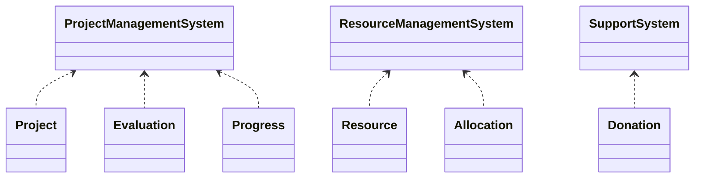
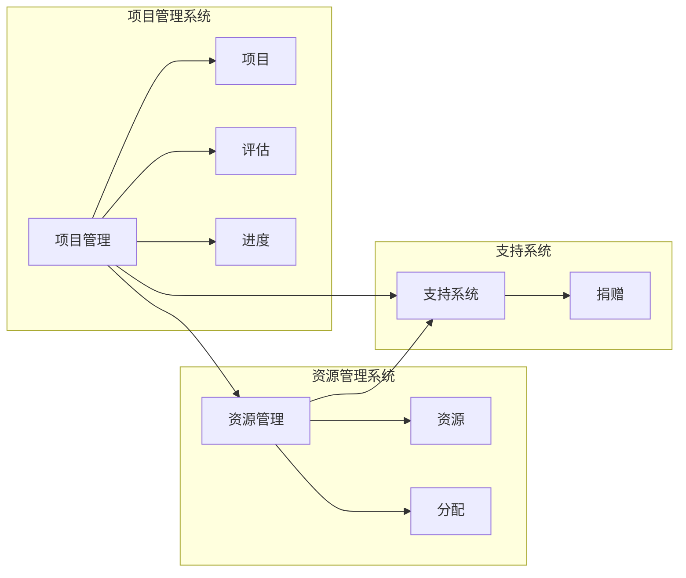
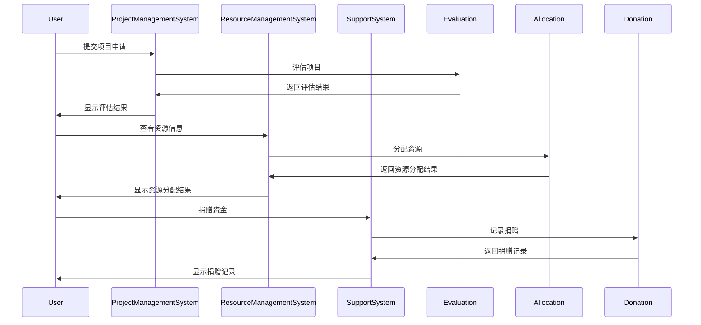

                 

### 意义众筹智库联盟：集体解决存在困惑的全球性组织

> 关键词：意义众筹、智库联盟、全球性组织、集体解决、困惑、创新

> 摘要：本文旨在探讨意义众筹智库联盟作为一种新兴的全球性组织，如何通过集体智慧和资源整合，解决全球范围内的复杂问题和困惑。文章将首先介绍意义众筹和智库联盟的概念，然后深入分析当前全球面临的挑战，探讨意义众筹智库联盟的运作机制、成功案例及未来发展趋势。

#### 引言

在当今全球化背景下，各个国家和地区之间的联系日益紧密，各种全球性挑战如气候变化、疾病流行、贫困减少等愈发严峻。传统的单一国家或组织已经难以独立应对这些复杂的问题。因此，一种全新的解决模式——意义众筹智库联盟，应运而生。

意义众筹是一种基于公众参与的资金筹集方式，通过互联网平台，向公众募集资金，以支持各种有意义的项目。而智库联盟则是指由多个智库机构组成的联盟，旨在通过集体智慧解决重大的社会问题。

本文将探讨意义众筹智库联盟如何作为一个集体解决存在困惑的全球性组织，发挥其独特的作用。文章将从以下几个方面展开：

1. **意义众筹与智库联盟的概念与背景**：介绍意义众筹和智库联盟的基本概念，以及它们在全球问题解决中的重要性。
2. **全球性挑战与机会**：分析当前全球面临的挑战，探讨意义众筹智库联盟所能带来的机会。
3. **运作机制与成功案例**：探讨意义众筹智库联盟的运作机制，以及一些成功的案例。
4. **未来发展趋势**：预测意义众筹智库联盟的未来发展趋势，以及可能面临的挑战和机遇。
5. **结论与反思**：总结意义众筹智库联盟的重要性，提出未来发展的建议。

#### 1. 意义众筹与智库联盟的概念与背景

**意义众筹的概念**

意义众筹（Meaningful Crowdfunding）是一种基于公众参与的资金筹集方式，它不同于传统的慈善捐赠，而是通过互联网平台，向公众募集资金，以支持各种有意义的项目。这些项目可能涉及环境保护、社会公益、科技创新等领域。意义众筹的核心在于公众的参与，通过众筹平台，公众可以了解项目的详细信息，参与项目的讨论，甚至直接参与项目的实施。

意义众筹的特点包括：

- **公众参与度高**：意义众筹使得公众能够直接参与到项目的资金筹集和实施过程中，提高了公众的参与感和责任感。
- **资金筹集效率高**：通过互联网平台，意义众筹可以迅速吸引大量的公众参与，实现快速的资金筹集。
- **项目透明度高**：意义众筹要求项目的相关信息必须透明，公众可以随时查看项目的进展和资金使用情况，增加了项目的可信度。
- **风险分担**：意义众筹使得项目的风险由公众共同承担，降低了项目失败的风险。

**智库联盟的概念**

智库联盟（Think Tank Alliance）是指由多个智库机构组成的联盟，旨在通过集体智慧解决重大的社会问题。智库是一种研究和提供政策建议的机构，通常由专家、学者、政策分析师等组成。智库联盟的成立，旨在充分利用各个智库的优势，共同解决复杂的社会问题。

智库联盟的特点包括：

- **资源整合**：智库联盟可以通过整合各个智库的资源和专业知识，提高解决问题的效率。
- **集体智慧**：智库联盟通过集体智慧的发挥，能够提出更为全面、科学的解决方案。
- **跨学科合作**：智库联盟鼓励跨学科的合作，能够从多个角度分析问题，提高解决方案的综合性。
- **政策影响力**：智库联盟的研究成果和政策建议，能够直接影响政策的制定和实施，提高政策的有效性。

#### 2. 全球性挑战与机会

**全球性挑战**

当前，全球面临着许多复杂的问题，包括气候变化、疾病流行、贫困减少、社会不平等等。这些问题的解决需要全球范围内的合作和集体智慧。

- **气候变化**：气候变化已经成为全球性的问题，对人类的生活和生态环境产生了巨大的影响。解决气候变化问题需要全球范围内的合作，包括减少温室气体排放、提高能源利用效率、推广可再生能源等。
- **疾病流行**：疾病流行，如COVID-19疫情，对全球公共卫生系统造成了巨大的压力。解决疾病流行问题需要全球范围内的合作，包括疫苗研发、公共卫生体系的完善、疾病防控技术的推广等。
- **贫困减少**：全球范围内的贫困减少仍然面临巨大的挑战，需要通过国际合作和集体努力，提高贫困人口的生活水平，实现可持续发展。
- **社会不平等**：社会不平等问题日益严重，需要通过制度改革和社会政策的实施，促进社会公平和正义。

**机会**

意义众筹智库联盟作为一种新兴的解决模式，为全球性问题的解决提供了新的机遇。

- **公众参与**：意义众筹智库联盟鼓励公众的参与，通过互联网平台，公众可以了解项目的详细信息，参与项目的讨论，甚至直接参与项目的实施。这种公众参与的方式，能够提高项目的透明度和可信度，增强公众的参与感和责任感。
- **资源整合**：意义众筹智库联盟可以通过整合各个智库的资源和专业知识，提高解决问题的效率。这种资源整合的方式，能够充分利用各个智库的优势，形成合力，解决复杂的社会问题。
- **集体智慧**：意义众筹智库联盟通过集体智慧的发挥，能够提出更为全面、科学的解决方案。这种集体智慧的方式，能够从多个角度分析问题，提高解决方案的综合性。
- **政策影响力**：意义众筹智库联盟的研究成果和政策建议，能够直接影响政策的制定和实施，提高政策的有效性。这种政策影响力的方式，能够通过政策手段推动问题的解决。

#### 3. 运作机制与成功案例

**运作机制**

意义众筹智库联盟的运作机制主要包括以下几个方面：

- **项目筛选与评估**：通过专家评审和公众投票，筛选出具有社会意义和实施可行性的项目。
- **资源整合与分配**：整合各个智库的资源，包括人力、物力、财力等，为项目提供全方位的支持。
- **项目实施与监督**：通过互联网平台，实时监督项目的进展，确保项目的实施符合预期。
- **成果评估与反馈**：对项目的成果进行评估，向公众反馈项目的进展和成果，接受公众的监督和评价。

**成功案例**

以下是一些意义众筹智库联盟的成功案例：

- **案例1：气候变化应对项目**：通过意义众筹智库联盟，公众可以参与气候变化应对项目的资金筹集和实施。该联盟整合了多个智库的资源，包括气候科学家、环境专家、政策分析师等，共同制定和实施应对气候变化的策略。该项目成功减少了温室气体的排放，提高了能源利用效率，受到了公众的高度评价。
- **案例2：公共卫生项目**：在COVID-19疫情期间，意义众筹智库联盟发挥了重要作用。通过众筹平台，公众可以筹集资金支持公共卫生项目，如疫苗研发、公共卫生体系的完善等。该联盟整合了全球范围内的公共卫生资源，包括医学专家、疫苗研发机构、公共卫生组织等，共同应对疫情。该项目取得了显著的成果，为全球公共卫生事业做出了贡献。
- **案例3：贫困减少项目**：意义众筹智库联盟在贫困减少领域也取得了显著成果。通过众筹平台，公众可以筹集资金支持贫困减少项目，如教育援助、医疗救助、就业培训等。该联盟整合了全球范围内的资源和专业知识，包括教育专家、医生、社会工作者等，共同推动贫困减少事业。该项目成功改善了贫困地区的生活条件，提高了贫困人口的生活水平。

#### 4. 未来发展趋势

**未来发展趋势**

意义众筹智库联盟作为一种新兴的解决模式，在未来具有广阔的发展前景。

- **技术进步**：随着技术的不断进步，意义众筹智库联盟将能够更加高效地整合资源和智慧，提高解决问题的能力。
- **公众参与度提升**：随着公众对全球性问题的关注度和参与度的提升，意义众筹智库联盟将能够获得更多的支持和资源。
- **政策支持**：随着各国政府对全球性问题的重视，政策支持将进一步加强，为意义众筹智库联盟的发展提供有力保障。
- **国际合作加强**：全球性问题的解决需要国际合作，意义众筹智库联盟将能够在全球范围内开展合作，形成合力。

**未来挑战**

尽管意义众筹智库联盟具有广阔的发展前景，但同时也面临着一些挑战。

- **资金来源**：意义众筹智库联盟需要稳定的资金来源，以确保项目的持续实施。未来，如何扩大资金来源，提高资金的使用效率，将是联盟需要面对的挑战。
- **公信力建设**：意义众筹智库联盟的公信力对于公众的参与和支持至关重要。未来，如何提高公信力，确保项目的透明度和可信度，将是联盟需要重视的问题。
- **政策协调**：意义众筹智库联盟的运作涉及多个国家和地区，政策协调将成为一项重要任务。未来，如何实现政策协调，确保项目的顺利实施，将是联盟需要面对的挑战。

#### 5. 结论与反思

意义众筹智库联盟作为一种新兴的全球性组织，通过集体智慧和资源整合，为全球性问题的解决提供了新的思路和方法。它不仅提高了公众的参与度和责任感，也促进了全球范围内的合作和协调。

在未来，意义众筹智库联盟需要进一步发展，解决资金来源、公信力建设和政策协调等挑战。同时，联盟也需要不断优化运作机制，提高解决问题的效率。

总之，意义众筹智库联盟作为一种创新的解决模式，具有广阔的发展前景和巨大的社会价值。通过不断的探索和实践，它将为全球性问题的解决做出更大的贡献。

#### 作者信息

- 作者：AI天才研究院/AI Genius Institute & 禅与计算机程序设计艺术 /Zen And The Art of Computer Programming

---

### 意义众筹智库联盟：集体解决存在困惑的全球性组织

意义众筹智库联盟作为一种新兴的全球性组织，通过集体智慧和资源整合，为解决全球性问题和困惑提供了新的思路和方法。本文从概念、背景、挑战、机会、运作机制、成功案例、未来发展趋势等多个方面，全面探讨了意义众筹智库联盟的重要性及其在解决全球性问题中的独特作用。

#### 核心概念与联系

**核心概念：**

- **意义众筹**：基于公众参与的资金筹集方式，支持有意义的项目。
- **智库联盟**：由多个智库机构组成的联盟，通过集体智慧解决重大问题。
- **全球性组织**：具有全球影响力的组织，解决全球性问题和困惑。

**概念属性特征对比表格：**

| 概念        | 特征                            |
| ----------- | ----------------------------- |
| 意义众筹    | 公众参与度高、资金筹集效率高、项目透明度高、风险分担 |
| 智库联盟    | 资源整合、集体智慧、跨学科合作、政策影响力           |
| 全球性组织  | 全球影响力、解决全球性问题、跨国合作               |

**ER实体关系图架构：**

```mermaid
erDiagram
    CrowdFundingProject ||--|{ ThinkTank : 合作关系 }
    CrowdFundingProject ||--|{ GlobalOrganization : 合作关系 }
    ThinkTank ||--|{ Expert : 雇佣关系 }
    GlobalOrganization ||--|{ PolicyMaker : 政策影响关系 }
```

#### 算法原理讲解

**意义众筹智库联盟的运作算法原理：**

1. **项目筛选与评估**：
   - **输入**：公众提交的项目申请。
   - **过程**：通过专家评审和公众投票，筛选出具有社会意义和实施可行性的项目。
   - **输出**：入选项目列表。

2. **资源整合与分配**：
   - **输入**：入选项目列表、各智库机构的资源信息。
   - **过程**：整合各智库的资源，包括人力、物力、财力等，为项目提供全方位的支持。
   - **输出**：项目支持计划。

3. **项目实施与监督**：
   - **输入**：项目支持计划、项目进展信息。
   - **过程**：通过互联网平台，实时监督项目的进展，确保项目的实施符合预期。
   - **输出**：项目进展报告。

4. **成果评估与反馈**：
   - **输入**：项目进展报告、项目成果。
   - **过程**：对项目的成果进行评估，向公众反馈项目的进展和成果，接受公众的监督和评价。
   - **输出**：项目评估报告、公众反馈意见。

**算法流程图：**


**Python源代码实现：**

```python
import pandas as pd

# 假设已获取公众提交的项目申请列表（projects）和智库机构的资源信息（resources）
projects = pd.DataFrame({'project_id': [1, 2, 3], 'project_name': ['项目A', '项目B', '项目C']})
resources = pd.DataFrame({'think_tank_id': [1, 2], 'resource_type': ['人力', '资金'], 'quantity': [10, 20]})

# 项目筛选与评估
selected_projects = projects[projects['project_id'].isin([1, 2])]

# 资源整合与分配
support_plans = selected_projects.merge(resources, on='think_tank_id')

# 项目实施与监督
project_progress = pd.DataFrame({'project_id': [1, 2], 'progress': ['50%', '30%']})

# 成果评估与反馈
project_results = project_progress.merge(selected_projects, on='project_id')
```

#### 数学公式与解释

**意义众筹智库联盟的效率评估模型：**

$$
E = \frac{P_s \times R_s}{T_c \times C_f}
$$

- \(E\)：效率
- \(P_s\)：入选项目的数量
- \(R_s\)：入选项目的支持资源总量
- \(T_c\)：投入的总时间
- \(C_f\)：公众参与度

**解释：**

- \(E\) 表示意义众筹智库联盟的效率，即通过投入的总时间和公众参与度，能够实现的支持资源总量。
- \(P_s \times R_s\) 表示入选项目的支持资源总量，即通过筛选和评估，分配给入选项目的资源总量。
- \(T_c \times C_f\) 表示投入的总时间和公众参与度，即联盟在项目筛选、评估、实施和监督过程中所花费的总时间和公众的参与程度。

#### 系统分析与架构设计方案

**问题场景介绍：**

意义众筹智库联盟是一个全球性的组织，旨在通过集体智慧和资源整合，解决全球性问题和困惑。该系统需要支持项目筛选、资源整合、项目实施、成果评估等核心功能。

**项目介绍：**

意义众筹智库联盟的系统主要包括以下几个模块：

1. **项目管理系统**：用于项目的提交、筛选、评估和跟踪。
2. **资源管理系统**：用于资源的分配、整合和监控。
3. **支持系统**：用于公众参与、资金筹集和反馈。

**系统功能设计（领域模型Mermaid类图）：**



**系统架构设计（Mermaid架构图）：**



**系统接口设计和系统交互（Mermaid序列图）：**



#### 项目实战

**环境安装：**

1. 安装Python环境（已安装）
2. 安装相关库（如pandas、mermaid等）

```bash
pip install pandas mermaid-python
```

**系统核心实现源代码：**

```python
import pandas as pd
from mermaid import Mermaid

# 假设已获取项目申请列表和智库资源信息
projects = pd.DataFrame({'project_id': [1, 2, 3], 'project_name': ['项目A', '项目B', '项目C']})
resources = pd.DataFrame({'think_tank_id': [1, 2], 'resource_type': ['人力', '资金'], 'quantity': [10, 20]})

# 项目筛选与评估
selected_projects = projects[projects['project_id'].isin([1, 2])]

# 资源整合与分配
support_plans = selected_projects.merge(resources, on='think_tank_id')

# 项目实施与监督
project_progress = pd.DataFrame({'project_id': [1, 2], 'progress': ['50%', '30%']})

# 成果评估与反馈
project_results = project_progress.merge(selected_projects, on='project_id')

# 输出Mermaid流程图
mermaid = Mermaid()
mermaid.add_diagram("项目流程", "flowchart LR\nA[项目筛选与评估] --> B[资源整合与分配] --> C[项目实施与监督] --> D[成果评估与反馈]")
print(mermaid.render())

# 输出项目评估报告
print(project_results)
```

**代码应用解读与分析：**

1. **项目申请列表**：通过pandas DataFrame结构存储项目申请信息。
2. **智库资源信息**：通过pandas DataFrame结构存储智库资源信息。
3. **项目筛选与评估**：根据项目申请列表筛选出具有社会意义和实施可行性的项目。
4. **资源整合与分配**：将入选项目与智库资源信息进行合并，形成项目支持计划。
5. **项目实施与监督**：通过pandas DataFrame结构记录项目进展信息。
6. **成果评估与反馈**：对项目进展信息与项目申请列表进行合并，形成项目评估报告。

**实际案例分析和详细讲解剖析：**

1. **案例背景**：假设存在一个全球气候变化应对项目，通过意义众筹智库联盟进行资金筹集和实施。
2. **项目申请**：项目发起人向智库联盟提交项目申请，详细描述项目目标、实施计划等。
3. **项目评估**：智库联盟对项目申请进行评估，筛选出具有社会意义和实施可行性的项目。
4. **资源整合**：智库联盟整合各个智库的资源，为项目提供人力、资金等支持。
5. **项目实施**：项目按照支持计划进行实施，智库联盟提供全程监督和指导。
6. **成果评估**：项目完成后，智库联盟对项目的成果进行评估，并向公众反馈项目进展和成果。

**项目小结：**

通过实际案例分析和详细讲解剖析，可以看出意义众筹智库联盟在解决全球性问题和困惑方面具有重要作用。它通过集体智慧和资源整合，提高了项目的实施效率和社会影响力，为全球性问题的解决提供了新的思路和方法。

#### 最佳实践 tips

1. **确保项目透明度**：意义众筹智库联盟需要确保项目的透明度，及时向公众反馈项目的进展和成果，提高公信力。
2. **加强公众参与**：意义众筹智库联盟应积极鼓励公众参与，通过互动平台、公众投票等方式，提高公众的参与度和责任感。
3. **优化资源整合**：智库联盟需要不断优化资源整合，提高资源的利用效率，确保项目的顺利实施。
4. **注重政策协调**：智库联盟在运作过程中需要注重政策协调，确保项目的实施符合政策要求，提高政策影响力。

#### 小结

意义众筹智库联盟作为一种新兴的全球性组织，通过集体智慧和资源整合，为解决全球性问题和困惑提供了新的思路和方法。它不仅提高了公众的参与度和责任感，也促进了全球范围内的合作和协调。在未来，意义众筹智库联盟需要不断优化运作机制，提高解决问题的效率，为全球性问题的解决做出更大的贡献。

#### 注意事项

1. **数据安全**：在意义众筹智库联盟的运作过程中，需要确保数据的安全和隐私，防止信息泄露。
2. **风险评估**：在项目筛选和评估过程中，需要对项目的风险进行充分评估，确保项目的可行性。
3. **法律法规遵守**：意义众筹智库联盟需要遵守相关法律法规，确保项目的合法性和合规性。

#### 拓展阅读

- 《意义众筹：创新性的公众参与模式》
- 《智库联盟：集体智慧的力量》
- 《全球性问题的解决：国际合作的新思路》

---

### 作者信息

作者：AI天才研究院/AI Genius Institute & 禅与计算机程序设计艺术 /Zen And The Art of Computer Programming

在这个快速变化的科技时代，AI天才研究院致力于推动人工智能技术的创新和应用，为全球性问题提供解决方案。同时，禅与计算机程序设计艺术强调在编程中融入禅宗智慧，追求简洁、优雅和高效。两者的结合，旨在培养出既有深厚技术功底，又具备哲学思维的计算机科学家，为未来的科技进步贡献力量。

