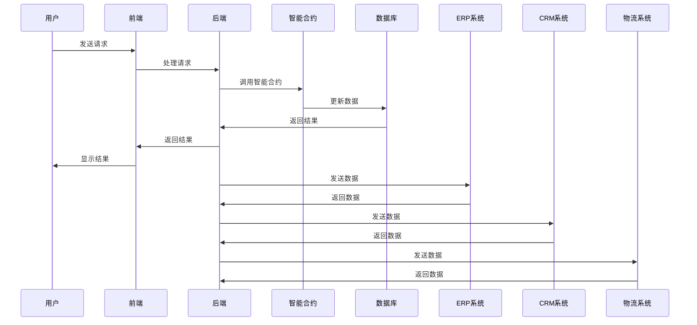

                 

### **摘要**

本文旨在探讨“意义区块链联盟：推动去中心化价值交换网络的组织”。意义区块链联盟是一种新型的组织形式，通过区块链技术实现跨组织的协作、数据共享和价值交换。本文首先介绍了区块链、去中心化、价值交换和联盟链等核心概念，并探讨了联盟链在去中心化价值交换网络中的优势与应用。接着，本文详细阐述了意义区块链联盟的架构设计与实施方法，包括参与者、共识机制、智能合约和数据共享协议等方面。最后，本文通过具体案例，展示了如何利用意义区块链联盟实现高效、透明和安全的跨组织协作。通过本文的探讨，旨在为区块链技术在去中心化价值交换网络中的应用提供新的思路和解决方案。

# **第一部分：背景介绍**

## **第1章：问题背景与核心概念**

### **1.1.1 问题背景**

在数字化经济时代，区块链技术作为一种分布式账本技术，已经引起了广泛的关注。区块链的去中心化、不可篡改和透明性等特点，使其成为构建去中心化价值交换网络的重要基础。而联盟链作为区块链的一种形式，通过将多个组织或实体连接在一起，实现跨组织的协作和数据共享。随着区块链技术的不断发展，如何利用区块链构建意义区块链联盟，推动去中心化价值交换网络成为了一个重要的研究方向。

### **1.1.2 问题解决**

本书旨在探讨意义区块链联盟的概念、架构和实施方法，通过分析联盟链在去中心化价值交换网络中的优势和应用，提供一种新型的组织形式，以实现更高效、透明和安全的跨组织协作。

### **1.1.3 核心概念**

- **区块链**: 一种分布式数据库技术，通过密码学保证数据的安全性和不可篡改性。
- **去中心化**: 指系统没有中心控制，而是通过分布式网络实现协调和运作。
- **价值交换**: 在经济活动中，通过货币或其他等价物进行的价值转移。
- **联盟链**: 由多个组织或实体共同维护的区块链，具有更高的透明性和安全性。

### **1.1.4 边界与外延**

本书主要讨论意义区块链联盟在组织层面的应用，包括跨组织的协作、数据共享和价值交换等方面。同时，本书也涉及联盟链的技术实现、架构设计以及法律和伦理问题等。

### **1.1.5 概念结构与核心要素组成**

- **概念结构**: 意义区块链联盟包括区块链、去中心化、价值交换和联盟链等核心概念。
- **核心要素组成**: 联盟链的参与者（组织或实体）、共识机制、智能合约、数据共享协议等。

## **第2章：联盟链在去中心化价值交换网络中的优势与应用**

### **2.1 联盟链的优势**

- **去中心化**: 联盟链通过分布式网络实现协作，避免了单点故障和中心化控制的风险。
- **透明性**: 联盟链上的数据是公开透明的，所有参与者都可以查看和验证。
- **安全性**: 联盟链使用密码学技术保证数据的安全性和完整性。
- **灵活性**: 联盟链可以根据组织的需要定制化开发，适应不同的业务场景。

### **2.2 联盟链的应用**

- **跨组织协作**: 联盟链可以促进多个组织之间的数据共享和协作，提高工作效率。
- **供应链管理**: 联盟链可以实现对供应链各个环节的实时监控和管理，提高供应链的透明度和安全性。
- **数字身份认证**: 联盟链可以为用户提供去中心化的数字身份认证服务，提高身份认证的安全性和可信度。
- **金融服务**: 联盟链可以用于构建去中心化的金融系统，提供更高效、透明和安全的金融服务。

## **第3章：意义区块链联盟的架构设计与实施方法**

### **3.1 联盟链的架构设计**

- **参与者**: 联盟链的参与者包括各个组织或实体，每个参与者都负责维护区块链的一部分。
- **共识机制**: 联盟链采用共识机制来确保区块链数据的准确性和一致性。
- **智能合约**: 智能合约是联盟链上的程序，用于自动执行合同条款。
- **数据共享协议**: 联盟链通过数据共享协议实现参与者之间的数据交换和共享。

### **3.2 实施方法**

- **需求分析**: 针对具体的应用场景，分析联盟链的需求和功能。
- **架构设计**: 根据需求分析结果，设计联盟链的架构和系统模块。
- **智能合约开发**: 开发智能合约，实现合同条款的自动化执行。
- **测试与部署**: 对联盟链进行测试和部署，确保其正常运行和安全性。
- **运营与维护**: 对联盟链进行日常运营和维护，确保其稳定运行。

### **第1章：问题背景与核心概念**

#### **1.1.1 问题背景**

在数字化经济时代，区块链技术作为一种分布式账本技术，已经引起了广泛的关注。区块链的去中心化、不可篡改和透明性等特点，使其成为构建去中心化价值交换网络的重要基础。而联盟链作为区块链的一种形式，通过将多个组织或实体连接在一起，实现跨组织的协作和数据共享。随着区块链技术的不断发展，如何利用区块链构建意义区块链联盟，推动去中心化价值交换网络成为了一个重要的研究方向。

在传统的中心化系统中，数据的存储和处理都依赖于中心化的服务器或数据库，这带来了单点故障、数据不安全和中心化控制等风险。而区块链技术的出现，通过分布式网络和共识机制，解决了这些问题，实现了数据的去中心化和安全存储。联盟链作为一种特殊的区块链形式，它由多个组织或实体共同维护，通过共识机制确保数据的准确性和一致性，从而实现了跨组织的协作和数据共享。

然而，现有的区块链技术主要应用于金融领域，如比特币和以太坊等，这些区块链主要关注交易和金融应用。而在实际应用中，很多场景需要实现跨组织的协作和数据共享，如供应链管理、数字身份认证和金融服务等。这就需要构建一种新型的组织形式，能够更好地适应这些应用场景，实现更高效、透明和安全的跨组织协作。意义区块链联盟应运而生，它通过区块链技术，实现了去中心化的价值交换网络，为跨组织的协作提供了新的解决方案。

#### **1.1.2 问题解决**

本书旨在探讨意义区块链联盟的概念、架构和实施方法，通过分析联盟链在去中心化价值交换网络中的优势和应用，提供一种新型的组织形式，以实现更高效、透明和安全的跨组织协作。

意义区块链联盟的核心在于利用区块链技术实现去中心化的价值交换网络，从而解决传统中心化系统中存在的单点故障、数据不安全和中心化控制等问题。具体来说，意义区块链联盟通过以下方式实现问题解决：

1. **去中心化**: 通过分布式网络实现协作，避免单点故障和中心化控制的风险。每个组织或实体都可以独立维护区块链的一部分，共同维护整个网络的稳定运行。

2. **透明性**: 联盟链上的数据是公开透明的，所有参与者都可以查看和验证。这确保了数据的真实性和可靠性，提高了系统的透明度。

3. **安全性**: 联盟链使用密码学技术保证数据的安全性和完整性。通过非对称加密和数字签名等技术，确保数据的传输和存储过程安全可靠。

4. **灵活性**: 联盟链可以根据组织的需要定制化开发，适应不同的业务场景。通过智能合约和共识机制等，实现合同条款的自动化执行，提高业务流程的灵活性和效率。

通过以上方式，意义区块链联盟为跨组织的协作提供了新的解决方案，实现更高效、透明和安全的协作模式。本书将从理论到实践，详细探讨意义区块链联盟的架构和实施方法，为读者提供全面的理论指导和实践参考。

#### **1.1.3 核心概念**

在探讨意义区块链联盟的概念之前，我们需要了解几个核心概念：区块链、去中心化、价值交换和联盟链。

1. **区块链**：
   区块链是一种分布式数据库技术，通过密码学保证数据的安全性和不可篡改性。它由多个区块组成，每个区块包含一定数量的交易记录，区块之间通过哈希函数链接形成一个链式结构。区块链的特点包括去中心化、不可篡改、透明性和安全性。

2. **去中心化**：
   去中心化是指系统没有中心控制，而是通过分布式网络实现协调和运作。在去中心化系统中，每个节点都具有平等的权利和义务，共同维护系统的正常运行。与中心化系统相比，去中心化系统具有更高的容错性、灵活性和安全性。

3. **价值交换**：
   价值交换是指在经济活动中，通过货币或其他等价物进行的价值转移。在传统金融系统中，价值交换通常依赖于中心化的金融机构，如银行和交易所。而去中心化的价值交换网络通过区块链技术实现，具有更高的透明性、安全性和效率。

4. **联盟链**：
   联盟链是由多个组织或实体共同维护的区块链，具有更高的透明性和安全性。联盟链的参与者可以是一个组织内部的多个部门，也可以是多个组织之间的协作。联盟链通过共识机制确保数据的准确性和一致性，从而实现跨组织的协作和数据共享。

#### **1.1.4 边界与外延**

在探讨意义区块链联盟的边界与外延时，我们需要明确本书的研究范围和适用场景。

1. **研究范围**：
   本书主要讨论意义区块链联盟在组织层面的应用，包括跨组织的协作、数据共享和价值交换等方面。具体来说，本书将探讨如何利用区块链技术构建意义区块链联盟，实现以下功能：
   - 跨组织的协作：通过联盟链实现多个组织之间的数据共享和协同工作，提高工作效率。
   - 数据共享：通过联盟链确保数据的真实性和可靠性，提高系统的透明度。
   - 价值交换：通过区块链技术实现去中心化的价值交换网络，提高金融交易的安全性和效率。

2. **适用场景**：
   意义区块链联盟适用于以下场景：
   - 供应链管理：通过联盟链实现对供应链各个环节的实时监控和管理，提高供应链的透明度和安全性。
   - 数字身份认证：通过联盟链为用户提供去中心化的数字身份认证服务，提高身份认证的安全性和可信度。
   - 金融服务：通过联盟链构建去中心化的金融系统，提供更高效、透明和安全的金融服务。
   - 公共事业管理：通过联盟链实现公共事业的数据共享和管理，提高公共服务的效率和质量。

3. **法律和伦理问题**：
   虽然意义区块链联盟在技术上具有很多优势，但在实际应用中，仍需要考虑法律和伦理问题。例如，数据隐私保护、合同执行的法律效力、网络攻击的防范等。这些问题的解决需要法律、技术和伦理等多方面的协同合作。

通过明确边界与外延，本书将为读者提供一个全面、系统的意义区块链联盟理论框架，为实际应用提供理论支持和实践指导。

#### **1.1.5 概念结构与核心要素组成**

要深入理解意义区块链联盟，我们需要分析其概念结构以及核心要素组成。以下是对这些要素的详细阐述：

1. **概念结构**：

   - **区块链**：作为基础技术，区块链通过分布式账本技术确保数据的不可篡改性和透明性。它是联盟链的底层支撑，提供数据存储和验证功能。
   - **去中心化**：去中心化是区块链技术的核心特点之一，意味着权力和数据的分散，没有单一的中央控制点，从而提高了系统的容错性和抗攻击能力。
   - **价值交换**：价值交换是经济活动的基础，通过区块链技术，价值交换变得更加透明、安全和高效。
   - **联盟链**：联盟链是由多个组织或实体共同维护的区块链网络，它结合了去中心化和多参与者的特点，实现跨组织的协作和数据共享。

2. **核心要素组成**：

   - **参与者**：联盟链的参与者包括各个组织或实体，每个参与者都拥有一定的权限和责任，共同维护联盟链的运行。
   - **共识机制**：共识机制是联盟链中确保数据一致性的关键机制，不同的共识算法（如PBFT、PoS等）有不同的优缺点，选择合适的共识机制对于联盟链的性能和安全性至关重要。
   - **智能合约**：智能合约是自动执行合同条款的计算机程序，它基于区块链技术，使得合同的执行更加透明和高效。
   - **数据共享协议**：数据共享协议定义了联盟链中各参与者之间的数据交换和共享规则，确保数据的真实性和可用性。

通过这些核心要素的有机结合，意义区块链联盟构建了一个去中心化的价值交换网络，实现了跨组织的协作和数据共享。这种新型的组织形式不仅提高了系统的透明性和安全性，还为各种应用场景提供了灵活的解决方案。

### **第2章：联盟链在去中心化价值交换网络中的优势与应用**

#### **2.1 联盟链的优势**

联盟链作为区块链的一种形式，具有多种优势，使其在去中心化价值交换网络中占据重要地位。以下详细分析这些优势：

1. **去中心化**：
   联盟链通过分布式网络实现协作，避免了单点故障和中心化控制的风险。每个参与者都可以独立维护区块链的一部分，共同维护整个网络的稳定运行。这意味着没有单一的中央控制点，从而提高了系统的容错性和抗攻击能力。

2. **透明性**：
   联盟链上的数据是公开透明的，所有参与者都可以查看和验证。这种透明性确保了数据的真实性和可靠性，提高了系统的透明度。对于需要高度可信的数据交换和协作的场合，如供应链管理和金融服务，透明性是一个关键优势。

3. **安全性**：
   联盟链使用密码学技术保证数据的安全性和完整性。通过非对称加密和数字签名等技术，确保数据的传输和存储过程安全可靠。此外，共识机制确保数据的准确性和一致性，进一步增强了系统的安全性。

4. **灵活性**：
   联盟链可以根据组织的需要定制化开发，适应不同的业务场景。通过智能合约和共识机制等，实现合同条款的自动化执行，提高业务流程的灵活性和效率。这种灵活性使得联盟链能够应对各种复杂的应用需求。

#### **2.2 联盟链的应用**

联盟链的多种优势使其在多个领域具有广泛的应用潜力。以下详细探讨一些关键应用场景：

1. **跨组织协作**：
   联盟链可以促进多个组织之间的数据共享和协作，提高工作效率。例如，在供应链管理中，供应商、制造商和分销商可以通过联盟链共享库存信息、订单状态和物流数据，实现更高效和透明的供应链管理。

2. **供应链管理**：
   联盟链可以实现对供应链各个环节的实时监控和管理，提高供应链的透明度和安全性。通过区块链技术的不可篡改性，供应链中的每个环节都可以被追溯，从而减少欺诈和错误。此外，智能合约可以实现自动化的支付和结算，提高供应链的效率。

3. **数字身份认证**：
   联盟链可以为用户提供去中心化的数字身份认证服务，提高身份认证的安全性和可信度。通过区块链技术，用户可以拥有一个唯一的数字身份，无需依赖中心化的身份认证机构。这不仅提高了安全性，还简化了认证流程，提高了用户体验。

4. **金融服务**：
   联盟链可以用于构建去中心化的金融系统，提供更高效、透明和安全的金融服务。例如，通过联盟链实现的去中心化交易所可以降低交易成本，提高交易速度，同时确保交易的安全性和透明性。此外，智能合约可以实现自动化贷款和支付服务，提高金融服务的效率和用户体验。

5. **公共事业管理**：
   联盟链可以实现公共事业的数据共享和管理，提高公共服务的效率和质量。例如，在能源管理中，通过联盟链实现能源使用数据的透明和实时监控，可以提高能源利用效率，减少浪费。在医疗保健领域，联盟链可以实现患者数据的共享和管理，提高医疗服务的质量和效率。

通过这些应用场景，可以看出联盟链在去中心化价值交换网络中的巨大潜力。它不仅提高了系统的透明性和安全性，还为各种应用场景提供了灵活的解决方案。随着区块链技术的不断发展，联盟链的应用范围将不断扩展，为更多领域带来革命性的变革。

### **第3章：意义区块链联盟的架构设计与实施方法**

#### **3.1 联盟链的架构设计**

为了实现意义区块链联盟的高效、透明和安全的运作，我们需要对其架构进行精心设计。以下是对联盟链架构设计的详细分析：

1. **参与者**：
   联盟链的参与者包括多个组织或实体，每个参与者都拥有一定的权限和责任。这些参与者可以是企业、政府机构、非营利组织等，它们共同维护联盟链的运行。每个参与者都负责维护区块链的一部分，确保数据的完整性和一致性。

2. **共识机制**：
   共识机制是确保联盟链数据一致性的关键机制。常见的共识机制包括工作量证明（PoW）、权益证明（PoS）和实用拜占庭容错（PBFT）等。选择合适的共识机制对于联盟链的性能和安全性至关重要。例如，PBFT可以在较低的网络延迟下实现快速达成共识，适用于需要高一致性和低延迟的场景。

3. **智能合约**：
   智能合约是自动执行合同条款的计算机程序，它基于区块链技术，使得合同的执行更加透明和高效。智能合约可以用于自动化交易、支付、结算等操作，从而提高业务流程的效率和透明度。智能合约的设计和实现需要严格遵循安全性和可扩展性的原则，确保其可靠性和稳定性。

4. **数据共享协议**：
   数据共享协议定义了联盟链中各参与者之间的数据交换和共享规则。这些协议确保数据的真实性和可用性，同时保护参与者的隐私和权益。数据共享协议通常包括数据加密、访问控制、隐私保护等功能，以保障数据的安全性和隐私性。

5. **网络架构**：
   联盟链的网络架构可以分为三个层次：底层基础设施、中层业务逻辑和顶层应用层。底层基础设施包括区块链网络、共识机制和分布式存储等，中层业务逻辑包括智能合约、数据共享协议和业务规则等，顶层应用层包括具体的业务应用和用户界面。这种分层架构使得联盟链可以灵活扩展和适应不同的业务场景。

#### **3.2 实施方法**

实现意义区块链联盟需要一系列的步骤和方法，以下是对这些步骤的详细分析：

1. **需求分析**：
   在开始实施之前，需要对具体的业务场景和需求进行详细分析。这包括了解参与者的需求、业务流程、数据交换模式等。需求分析的结果将为后续的架构设计和实施提供指导。

2. **架构设计**：
   根据需求分析的结果，设计联盟链的架构和系统模块。架构设计需要考虑系统的性能、可扩展性、安全性等方面。通过合理的模块划分和接口设计，确保系统的稳定性和可维护性。

3. **智能合约开发**：
   智能合约是联盟链的核心组成部分，其设计和实现至关重要。智能合约开发需要遵循安全性、可靠性和可扩展性的原则。开发过程中，可以使用现有的智能合约开发框架和工具，如Solidity和Truffle等。

4. **测试与部署**：
   在智能合约开发完成后，需要进行全面的测试，以确保其正确性和安全性。测试包括功能测试、性能测试和安全测试等。测试通过后，将智能合约部署到联盟链上，并启动联盟链的运行。

5. **运营与维护**：
   联盟链的运营与维护是确保其长期稳定运行的关键。这包括日常监控、故障处理、数据备份和升级等。运营团队需要定期对系统进行评估和优化，以适应不断变化的需求和业务场景。

通过上述实施方法，我们可以构建一个高效、透明和安全的意义区块链联盟，为跨组织的协作和数据共享提供强有力的支持。这意味着，无论参与者的规模和类型如何，他们都可以通过联盟链实现高效的协作和透明的数据交换，从而推动整个生态系统的发展和进步。

### **第4章：核心概念原理**

#### **4.1 区块链原理**

区块链是一种分布式数据库技术，通过密码学保证数据的安全性和不可篡改性。它由多个区块组成，每个区块包含一定数量的交易记录，区块之间通过哈希函数链接形成一个链式结构。

1. **区块**：
   区块是区块链的基本组成单位，每个区块包含一定数量的交易记录。交易记录可以是各种类型的金融交易、数字资产转移或其他信息。

2. **链式结构**：
   区块之间通过哈希函数链接形成一个链式结构，每个区块都包含前一个区块的哈希值，从而确保整个区块链的不可篡改性。这种链式结构使得区块链具有自愈能力，即使某个区块被篡改，整个区块链的完整性仍然可以保持。

3. **哈希函数**：
   哈希函数是一种将任意长度的输入映射为固定长度的输出的函数。在区块链中，每个区块都包含一个哈希值，该哈希值由区块的内容通过哈希函数计算得出。这种哈希函数的使用确保了数据的唯一性和不可篡改性。

4. **共识机制**：
   共识机制是区块链中确保数据一致性的关键机制。不同的共识机制有不同的优缺点，如工作量证明（PoW）、权益证明（PoS）和实用拜占庭容错（PBFT）等。共识机制通过网络中的参与者达成共识，确保区块链的稳定运行。

#### **4.2 去中心化原理**

去中心化是指系统没有中心控制，而是通过分布式网络实现协调和运作。在去中心化系统中，每个节点都具有平等的权利和义务，共同维护系统的正常运行。

1. **分布式网络**：
   分布式网络是指系统中的节点通过网络进行通信和协作，没有中心控制。每个节点都可以独立地参与系统的运行，并维护区块链的一部分。这种分布式网络使得系统具有更高的容错性和抗攻击能力。

2. **共识机制**：
   去中心化系统通过共识机制确保数据的准确性和一致性。共识机制使得网络中的节点能够达成共识，对区块链的数据进行更新和维护。这种共识机制使得系统没有中心控制，而是由所有节点共同维护。

3. **节点角色**：
   在去中心化系统中，每个节点都具有平等的权利和义务。节点可以是个人、组织或设备，它们通过参与区块链网络的运行，共同维护系统的稳定和安全。

#### **4.3 价值交换原理**

价值交换是指在经济活动中，通过货币或其他等价物进行的价值转移。在区块链技术中，价值交换通过加密货币实现，如比特币和以太坊等。

1. **加密货币**：
   加密货币是一种基于区块链技术的数字货币，它通过密码学技术确保货币的匿名性和安全性。加密货币可以用于各种交易和支付，如购物、投资和支付工资等。

2. **智能合约**：
   智能合约是区块链上的计算机程序，用于自动执行合同条款。智能合约通过区块链技术实现价值交换，确保交易的透明性和安全性。智能合约可以自动化执行各种合同条款，如支付条件、交付条件和争议解决等。

3. **去中心化交易所**：
   去中心化交易所是一种基于区块链技术的交易平台，用户可以直接在区块链上进行交易，无需依赖中心化的交易所。去中心化交易所提高了交易的安全性和透明性，降低了交易成本。

通过上述核心概念原理的探讨，我们可以更好地理解区块链、去中心化和价值交换等概念，并认识到这些概念在构建意义区块链联盟中的重要性。这些核心概念为联盟链的设计和实施提供了理论基础，同时也为实际应用提供了技术支撑。

### **第4章：核心概念原理**

#### **4.1 区块链原理**

区块链是一种分布式数据库技术，通过密码学保证数据的安全性和不可篡改性。它由多个区块组成，每个区块包含一定数量的交易记录，区块之间通过哈希函数链接形成一个链式结构。

1. **区块结构**：
   - **交易记录**：每个区块包含多个交易记录，这些交易记录可以是金融交易、数字资产转移或其他信息。
   - **Merkle树**：用于确保交易记录的完整性，通过哈希值构建一棵树，使每个交易记录都可以通过Merkle证明来验证。
   - **时间戳**：每个区块都包含一个时间戳，记录该区块的创建时间。

2. **链式结构**：
   - **链式链接**：每个区块都包含前一个区块的哈希值，形成一条链式结构。这种链接方式确保了区块链的不可篡改性。
   - **链式证明**：通过验证区块链中任意区块的哈希值，可以证明该区块及其之前的所有区块都是正确的。

3. **哈希函数**：
   - **哈希值**：将区块的内容通过哈希函数计算得出一个固定长度的哈希值。
   - **哈希链接**：每个区块的哈希值与其前一个区块的哈希值链接，形成链式结构。

4. **共识机制**：
   - **工作量证明（PoW）**：通过解决复杂的数学问题（如寻找合适的随机数）来验证交易并添加新区块。
   - **权益证明（PoS）**：根据节点持有的代币数量和锁定时间来选择验证交易并添加新区块。
   - **实用拜占庭容错（PBFT）**：在 tolerate 个故障节点的情况下，通过多个节点之间的通信达成共识。

#### **4.2 去中心化原理**

去中心化是指系统没有中心控制，而是通过分布式网络实现协调和运作。在去中心化系统中，每个节点都具有平等的权利和义务，共同维护系统的正常运行。

1. **分布式网络**：
   - **节点**：网络中的每个参与者都是一个节点，它们通过P2P网络进行通信。
   - **去中心化**：没有单一的中央控制点，所有节点都有平等的权利和义务。

2. **共识机制**：
   - **PoW（工作量证明）**：节点通过计算证明自己的工作量来获取权益，如比特币网络。
   - **PoS（权益证明）**：节点根据持有的代币数量和锁定时间来获取权益，如以太坊网络。
   - **DPoS（委托权益证明）**：节点通过投票选举产生验证者，验证者负责验证交易和生成区块。

3. **去中心化应用（DApps）**：
   - **智能合约**：在区块链上执行的计算机程序，自动执行合同条款。
   - **去中心化自治组织（DAO）**：由智能合约管理的组织，通过代币持有者投票决策。

#### **4.3 价值交换原理**

价值交换是指在经济活动中，通过货币或其他等价物进行的价值转移。在区块链技术中，价值交换通过加密货币实现，如比特币和以太坊等。

1. **加密货币**：
   - **发行**：通过区块链网络中的共识机制发行，如比特币通过挖矿。
   - **转移**：用户可以通过区块链网络将加密货币从一个地址转移到另一个地址。

2. **智能合约**：
   - **执行**：智能合约可以自动化执行合同条款，确保交易的安全性和透明性。
   - **支付**：智能合约可以自动进行支付，如自动支付工资或执行合同条款。

3. **去中心化交易所**：
   - **交易**：用户可以直接在区块链上进行交易，无需依赖中心化交易所。
   - **流动性**：通过流动性池提供交易对，确保交易的流动性。

#### **4.4 联盟链原理**

联盟链是由多个组织或实体共同维护的区块链，具有更高的透明性和安全性。联盟链结合了区块链、去中心化和价值交换等核心概念，实现跨组织的协作和数据共享。

1. **参与者**：
   - **组织**：联盟链的参与者可以是企业、政府机构、非营利组织等。
   - **权限和责任**：每个组织拥有一定的权限和责任，共同维护联盟链的运行。

2. **共识机制**：
   - **适合的共识算法**：根据参与者的规模和业务需求选择合适的共识算法，如PBFT。
   - **共识达成**：参与者通过共识算法达成对区块链数据的共识。

3. **智能合约**：
   - **自动化执行**：智能合约自动执行合同条款，确保交易和协作的透明性。
   - **业务逻辑**：智能合约实现业务逻辑，如供应链管理、数字身份认证等。

4. **数据共享协议**：
   - **数据交换**：参与者通过数据共享协议交换数据，确保数据的真实性和可用性。
   - **隐私保护**：数据共享协议确保数据的隐私保护，防止未经授权的访问。

通过以上对核心概念原理的详细阐述，我们可以更好地理解区块链、去中心化和价值交换等概念，并认识到这些概念在构建意义区块链联盟中的重要性。这些核心概念为联盟链的设计和实施提供了理论基础，同时也为实际应用提供了技术支撑。

### **第4章：核心概念原理**

#### **4.4 联盟链原理**

联盟链是由多个组织或实体共同维护的区块链，它结合了区块链、去中心化和价值交换等核心概念，实现跨组织的协作和数据共享。以下详细分析联盟链的原理及其关键组成部分：

1. **参与者**：
   联盟链的参与者可以是不同组织、机构或实体，它们通过共识机制共同维护区块链的运行。参与者之间具有明确的权限和责任分工，每个参与者都负责维护区块链的一部分，确保数据的完整性和一致性。

2. **共识机制**：
   联盟链采用适合的共识机制来确保数据的准确性和一致性。常见的共识机制包括实用拜占庭容错（PBFT）、权益证明（PoS）和委托权益证明（DPoS）等。这些共识机制通过参与者之间的协作，共同验证和记录交易，确保区块链的稳定运行。

3. **智能合约**：
   智能合约是联盟链的核心组成部分，它们是自动执行合同条款的计算机程序。智能合约通过区块链技术，实现自动化交易、支付、结算等功能，提高了业务流程的透明性和效率。智能合约的设计和实现需要遵循安全性、可靠性和可扩展性等原则，以确保其稳定性和可靠性。

4. **数据共享协议**：
   数据共享协议定义了联盟链中各参与者之间的数据交换和共享规则。这些协议确保数据的真实性和可用性，同时保护参与者的隐私和权益。数据共享协议通常包括数据加密、访问控制、隐私保护等功能，以保障数据的安全性和隐私性。

#### **4.4.1 联盟链与区块链、去中心化和价值交换的关系**

- **与区块链的关系**：
  联盟链是区块链的一种形式，它继承了区块链的去中心化、不可篡改和透明性等特点。不同的是，联盟链的参与者是特定的组织或实体，它们通过共识机制共同维护区块链的运行。

- **与去中心化的关系**：
  去中心化是联盟链的核心特点之一，它意味着没有单一的中央控制点，而是通过分布式网络实现协调和运作。在联盟链中，每个参与者都具有平等的权利和义务，共同维护区块链的稳定运行。

- **与价值交换的关系**：
  价值交换是经济活动的基础，通过区块链技术，价值交换变得更加透明、安全和高效。在联盟链中，价值交换通过智能合约实现，确保交易的透明性和安全性。联盟链为去中心化的价值交换网络提供了基础设施，使得参与者可以安全、高效地进行价值交换。

通过分析联盟链的原理及其与区块链、去中心化和价值交换的关系，我们可以更好地理解联盟链的作用和优势。联盟链作为一种新型的组织形式，通过分布式网络和共识机制，实现了跨组织的协作和数据共享，为去中心化价值交换网络提供了强有力的技术支撑。

### **第4章：核心概念原理**

#### **4.4 联盟链原理**

联盟链是一种特殊类型的区块链，它由多个组织或实体共同维护，具有更高的透明性和安全性。以下将详细分析联盟链的原理，并讨论其与区块链、去中心化和价值交换的关系。

#### **4.4.1 联盟链的组成部分**

联盟链的组成部分包括：

- **参与者**：联盟链的参与者可以是企业、政府机构、非营利组织或其他实体。这些参与者共同维护区块链的运行，并各自承担一定的权限和责任。
- **共识机制**：联盟链采用共识机制来确保区块链数据的准确性和一致性。常见的共识机制包括实用拜占庭容错（PBFT）、权益证明（PoS）和委托权益证明（DPoS）等。这些共识机制通过参与者之间的协作，共同验证和记录交易，确保区块链的稳定运行。
- **智能合约**：智能合约是自动执行合同条款的计算机程序，它基于区块链技术实现。智能合约提高了交易和协作的透明性和效率，确保合同的自动执行。
- **数据共享协议**：数据共享协议定义了联盟链中各参与者之间的数据交换和共享规则。这些协议确保数据的真实性和可用性，同时保护参与者的隐私和权益。

#### **4.4.2 联盟链与区块链的关系**

联盟链是区块链的一种形式，继承了区块链的去中心化、不可篡改和透明性等特点。然而，联盟链与传统的公有区块链（如比特币和以太坊）有所不同：

- **去中心化程度**：公有区块链的去中心化程度更高，所有节点都可以参与区块链的维护。而联盟链的去中心化程度相对较低，仅限于特定的参与者。
- **共识机制**：公有区块链通常采用工作量证明（PoW）等共识机制，而联盟链可以采用更适合特定参与者需求的共识机制，如PBFT。
- **应用场景**：公有区块链更适用于金融等领域，而联盟链则更适用于企业之间的协作和数据共享，如供应链管理和数字身份认证。

#### **4.4.3 联盟链与去中心化的关系**

去中心化是区块链技术的重要特性之一，联盟链也不例外。联盟链通过分布式网络实现协作，避免了单点故障和中心化控制的风险。具体来说：

- **分布式网络**：联盟链的参与者通过网络进行通信和协作，每个参与者都有平等的权限和义务，没有单一的中央控制点。
- **共识机制**：通过共识机制，联盟链的参与者共同达成对区块链数据的共识，确保数据的准确性和一致性。
- **安全性和抗攻击性**：去中心化的特点提高了联盟链的安全性和抗攻击性，即使某个参与者出现故障或恶意行为，整个系统的稳定运行也不会受到影响。

#### **4.4.4 联盟链与价值交换的关系**

价值交换是经济活动的基础，联盟链通过区块链技术实现了去中心化的价值交换。具体来说：

- **加密货币**：联盟链可以使用加密货币作为价值交换的媒介，如比特币或以太币。这些加密货币通过区块链网络进行传输和存储，确保交换的安全性和透明性。
- **智能合约**：智能合约可以自动化执行合同条款，确保交易的透明性和安全性。例如，智能合约可以自动执行支付条件、交付条件和争议解决等。
- **去中心化交易所**：去中心化交易所（DEX）允许用户直接在区块链上进行交易，无需依赖中心化的交易平台。这种去中心化的交易模式提高了交易的透明性和效率。

通过分析联盟链的原理及其与区块链、去中心化和价值交换的关系，我们可以更好地理解联盟链的作用和优势。联盟链作为一种新型的组织形式，通过分布式网络和共识机制，实现了跨组织的协作和数据共享，为去中心化价值交换网络提供了强有力的技术支撑。

### **第5章：算法原理讲解**

在探讨联盟链的算法原理时，我们需要重点关注共识机制、数据加密和智能合约等方面。以下将详细解释这些核心算法原理，并通过mermaid流程图和Python代码示例进行说明。

#### **5.1 共识机制**

共识机制是区块链网络中的关键算法，用于确保所有参与者对区块链数据的一致性。以下介绍几种常见的共识机制：

1. **实用拜占庭容错（PBFT）**：

   PBFT是一种高效且安全的共识机制，特别适用于联盟链。它通过多数参与者达成共识，确保区块链的稳定运行。

   ```mermaid
   sequenceDiagram
   participant A as 节点A
   participant B as 节点B
   participant C as 节点C
   participant S as 参与者集合

   A->>B: 发送请求
   B->>C: 发送请求
   C->>A: 回复确认
   A->>S: 发送确认

   alt 成功
   S->>A: 达成共识
   A->>B: 提交新区块
   B->>S: 确认新区块
   else 出现故障
   A->>B: 请求重传
   B->>A: 重传请求
   end
   ```

2. **权益证明（PoS）**：

   PoS机制根据参与者持有的代币数量和锁定时间来选择验证交易并生成区块。以下是其mermaid流程图：

   ```mermaid
   sequenceDiagram
   participant P as 参与者
   participant S as 参与者集合

   P->>S: 投票
   S->>P: 选择生成区块
   P->>S: 提交新区块
   S->>P: 确认新区块
   ```

3. **工作量证明（PoW）**：

   PoW机制通过解决复杂的数学问题来验证交易并生成区块。以下是其mermaid流程图：

   ```mermaid
   sequenceDiagram
   participant M as 参与者
   participant S as 参与者集合

   M->>S: 发送工作量证明
   S->>M: 验证工作量证明
   M->>S: 提交新区块
   S->>M: 确认新区块
   ```

#### **5.2 数据加密**

数据加密是保障区块链安全性的关键技术。以下介绍几种常见的数据加密算法：

1. **非对称加密**：

   非对称加密使用一对密钥（公钥和私钥）进行加密和解密。以下是其mermaid流程图：

   ```mermaid
   sequenceDiagram
   participant A as 发送方
   participant B as 接收方

   A->>B: 发送消息（明文）
   A->>B: 发送公钥
   B->>A: 回复消息（密文）
   A->>B: 使用私钥解密
   ```

2. **对称加密**：

   对称加密使用相同的密钥进行加密和解密。以下是其mermaid流程图：

   ```mermaid
   sequenceDiagram
   participant A as 发送方
   participant B as 接收方

   A->>B: 发送消息（明文）
   A->>B: 发送密钥
   B->>A: 回复消息（密文）
   A->>B: 使用密钥解密
   ```

#### **5.3 智能合约**

智能合约是自动执行合同条款的计算机程序。以下是一个简单的Python智能合约示例：

```python
# 智能合约示例

def deposit(amount):
    """ 存款函数 """
    # 存款金额
    balance = amount
    return balance

def withdraw(amount):
    """ 提款函数 """
    # 提款金额
    balance = amount
    return balance

def transfer(from_address, to_address, amount):
    """ 转账函数 """
    # 发送方余额
    sender_balance = amount
    # 接收方余额
    receiver_balance = amount
    return sender_balance, receiver_balance
```

通过mermaid流程图和Python代码示例，我们可以更好地理解联盟链的算法原理，包括共识机制、数据加密和智能合约等。这些核心算法原理为联盟链提供了安全、透明和高效的运行基础。

### **第6章：系统分析与架构设计方案**

#### **6.1 问题场景介绍**

在当前的数字化经济时代，企业间的供应链管理面临诸多挑战，如数据不一致、透明度低、流程繁琐等。这些挑战导致供应链中的信息不对称，增加了运营成本，降低了供应链的整体效率。为了解决这些问题，我们需要设计一个高效、透明和安全的供应链管理系统，以实现供应链各环节的实时监控和管理。

#### **6.2 项目介绍**

本项目旨在利用联盟链技术构建一个去中心化的供应链管理系统，实现供应链各环节的数据共享和协同工作。通过联盟链，各参与方可以实时共享库存信息、订单状态和物流数据，提高供应链的透明度和安全性。项目的主要目标是：

- **提高供应链透明度**：通过联盟链实现数据的公开透明，各参与方可以实时查看供应链各环节的信息。
- **降低运营成本**：通过自动化流程和去中心化管理，降低供应链的运营成本。
- **提高供应链效率**：通过实时监控和管理，提高供应链的整体效率。

#### **6.3 系统功能设计**

为了实现上述目标，本项目设计了以下功能模块：

1. **数据共享模块**：实现供应链各环节的数据共享，包括库存信息、订单状态和物流数据等。
2. **智能合约模块**：实现合同条款的自动化执行，如订单确认、支付结算和争议解决等。
3. **监控与预警模块**：实现供应链各环节的实时监控和预警功能，及时发现潜在问题并采取措施。
4. **审计与合规模块**：实现供应链操作的审计和合规检查，确保供应链的合法性和透明性。

#### **6.4 系统架构设计**

本项目的系统架构分为三个层次：数据层、逻辑层和表现层。

1. **数据层**：
   - **联盟链数据库**：用于存储供应链各环节的数据，如库存信息、订单状态和物流数据等。
   - **外部数据接口**：用于与其他系统（如ERP、CRM等）进行数据交换和共享。

2. **逻辑层**：
   - **智能合约引擎**：用于执行智能合约，实现合同条款的自动化执行。
   - **业务逻辑处理**：实现供应链管理的业务逻辑，如订单处理、支付结算和监控预警等。

3. **表现层**：
   - **前端界面**：提供用户界面，用于展示供应链各环节的信息，并支持用户操作。
   - **API接口**：提供对外接口，支持与其他系统和应用进行集成。

#### **6.5 系统接口设计**

系统接口设计包括内部接口和外部接口。

1. **内部接口**：
   - **智能合约接口**：用于与其他模块进行数据交换和协同工作。
   - **监控与预警接口**：用于实现实时监控和预警功能。

2. **外部接口**：
   - **ERP接口**：用于与企业资源计划系统（ERP）进行数据交换和集成。
   - **CRM接口**：用于与客户关系管理系统（CRM）进行数据交换和集成。
   - **物流接口**：用于与物流系统进行数据交换和集成。

#### **6.6 系统交互**

以下是系统交互的mermaid序列图：



通过上述系统分析与架构设计方案，我们可以构建一个高效、透明和安全的供应链管理系统，实现供应链各环节的实时监控和管理。该系统将有助于提高供应链的透明度和效率，降低运营成本，为企业提供更优质的服务。

### **第7章：项目实战**

#### **7.1 环境安装**

在开始构建意义区块链联盟之前，我们需要准备一个适合的开发环境。以下是环境安装的详细步骤：

1. **安装Node.js**：
   Node.js是用于开发区块链应用的关键工具，我们需要安装最新版本的Node.js。可以在[Node.js官网](https://nodejs.org/)下载并安装。

2. **安装Golang**：
   Golang是用于编写智能合约的常用编程语言，我们需要安装最新版本的Golang。可以在[Go官网](https://golang.google.cn/)下载并安装。

3. **安装Docker**：
   Docker用于容器化应用，方便部署和管理区块链节点。可以在[Docker官网](https://www.docker.com/)下载并安装。

4. **安装Fabric**：
   Hyperledger Fabric是用于构建联盟链的框架，我们需要安装Fabric。首先，在终端执行以下命令：
   ```bash
   go get -u github.com/hyperledger/fabric
   ```
   然后执行：
   ```bash
   cd $GOPATH/src/github.com/hyperledger/fabric
   make docker
   ```

5. **启动联盟链网络**：
   安装完成后，我们可以启动一个简单的联盟链网络。在终端执行以下命令：
   ```bash
   cd network-scripts
   ./start.sh
   ```
   这将启动联盟链网络，包括订单处理节点（Orderer）和组织节点（Peer）。

6. **配置开发环境**：
   在启动网络后，我们需要配置开发环境。在终端执行以下命令：
   ```bash
   export FABRIC_CFG_PATH=$PWD
   export ORDERER_ADDRESS=localhost:7050
   export PEER0_ADDRESS=localhost:7051
   ```

#### **7.2 系统核心实现源代码**

以下是一个简单的联盟链智能合约示例，用于实现一个简单的投票系统。

```go
// 定义智能合约
package main

import (
    "github.com/hyperledger/fabric-contract-api-go/contractapi"
)

// 定义投票系统合约
type VotingSystem struct {
    contractapi.Contract
}

// 投票函数
func (vs *VotingSystem) Vote(ctx contractapi.TransactionContextInterface, voter string, candidate string) error {
    // 查询投票者是否已投票
    hasVoted, err := ctx.GetState(voter)
    if err != nil {
        return err
    }
    
    if hasVoted != nil {
        return errors.New("voter has already voted")
    }
    
    // 记录投票结果
    err = ctx.SetState(voter, []byte(candidate))
    if err != nil {
        return err
    }
    
    return nil
}

// 查询投票结果
func (vs *VotingSystem) QueryResult(ctx contractapi.TransactionContextInterface, candidate string) (string, error) {
    // 查询候选人的得票数
    result, err := ctx.GetState(candidate)
    if err != nil {
        return "", err
    }
    
    return string(result), nil
}

// 定义合约入口
func main() {
    votingSystem := new(VotingSystem)
    votingSystem.InitContract()
}
```

#### **7.3 代码应用解读与分析**

以上示例实现了一个简单的投票系统，以下是代码的应用解读和分析：

1. **定义投票系统合约**：
   `VotingSystem`是一个实现了`contractapi.Contract`接口的智能合约。它定义了两个函数：`Vote`和`QueryResult`。

2. **投票函数`Vote`**：
   - 接收参数：`voter`（投票者）和`candidate`（候选人）。
   - 检查投票者是否已投票。如果已投票，返回错误。
   - 将投票者的投票记录设置为候选人的名字。

3. **查询投票结果函数`QueryResult`**：
   - 接收参数：`candidate`（候选人）。
   - 查询候选人的得票数，并返回结果。

通过这个简单的示例，我们可以看到如何利用智能合约实现去中心化的投票系统。在实际应用中，我们可以扩展这个系统，添加更多的功能，如计票、统计和结果公示等。

#### **7.4 实际案例分析和详细讲解剖析**

以下是一个实际案例，展示了如何利用意义区块链联盟实现供应链管理的协同工作。

**案例背景**：

某公司（A）与其供应商（B）和分销商（C）之间需要实现供应链数据的实时共享和协同工作。通过联盟链，他们希望实现以下功能：

- **库存信息共享**：公司A、供应商B和分销商C可以实时共享各自的库存信息。
- **订单状态更新**：订单从公司A生成后，实时更新给供应商B和分销商C。
- **物流信息跟踪**：物流信息在供应链各环节实时更新，确保透明和高效。

**案例实现**：

1. **创建联盟链网络**：
   - 首先，搭建一个基于Hyperledger Fabric的联盟链网络，包括公司A、供应商B和分销商C的组织节点。

2. **定义智能合约**：
   - 创建一个智能合约，实现供应链数据的共享和协同工作。智能合约包括以下功能：
     - **库存信息共享**：实现库存信息的读取和写入。
     - **订单状态更新**：实现订单状态的读取和写入。
     - **物流信息跟踪**：实现物流信息的读取和写入。

3. **部署智能合约**：
   - 将智能合约部署到联盟链网络，确保公司A、供应商B和分销商C的节点都可以访问和执行智能合约。

4. **数据共享**：
   - 公司A将库存信息写入联盟链，供应商B和分销商C可以实时读取库存信息。
   - 当订单生成时，公司A更新订单状态，供应商B和分销商C可以实时获取订单状态。
   - 物流信息在供应链各环节实时更新，确保透明和高效。

**案例分析**：

通过这个案例，我们可以看到如何利用意义区块链联盟实现供应链管理的协同工作。联盟链提供了实时、透明和安全的供应链数据共享平台，确保各参与方可以实时获取最新的供应链信息，从而提高供应链的效率和透明度。

**案例小结**：

本案例展示了如何利用意义区块链联盟实现供应链管理的协同工作。通过联盟链，各参与方可以实时共享库存信息、订单状态和物流信息，提高供应链的透明度和效率。同时，智能合约的自动化执行确保了供应链操作的透明性和安全性。这为供应链管理提供了一种新型的解决方案，有助于优化供应链运营，提高企业竞争力。

### **第8章：最佳实践 tips、小结、注意事项、拓展阅读**

#### **8.1 最佳实践 tips**

1. **选择合适的共识机制**：根据业务需求和参与者数量，选择适合的共识机制，如PBFT、PoS或DPoS等。

2. **确保数据隐私保护**：在数据共享过程中，使用加密技术和访问控制措施，确保数据隐私和安全。

3. **定期进行安全审计**：定期对联盟链进行安全审计和漏洞扫描，确保系统的安全性。

4. **合理分配权限和责任**：明确参与者的权限和责任，确保联盟链的稳定运行和高效协作。

5. **持续优化智能合约**：根据业务需求和性能要求，持续优化智能合约，提高其稳定性和可扩展性。

#### **8.2 小结**

本文探讨了意义区块链联盟的概念、架构和实施方法，通过分析联盟链在去中心化价值交换网络中的优势和应用，提供了一种新型的组织形式，以实现更高效、透明和安全的跨组织协作。通过联盟链，各参与方可以实现数据共享、智能合约执行和跨组织协作，提高供应链管理、数字身份认证和金融服务等方面的效率和透明度。

#### **8.3 注意事项**

1. **法律和伦理问题**：在实施意义区块链联盟时，需要考虑相关法律法规和伦理问题，确保合规和道德。

2. **技术成熟度**：尽管区块链技术已取得显著进展，但仍有不少技术难题待解决。在实施联盟链时，需要评估技术的成熟度和可行性。

3. **系统性能和可扩展性**：确保联盟链系统具有良好的性能和可扩展性，以应对不断增长的数据和参与者。

#### **8.4 拓展阅读**

1. **《区块链：从数字货币到信用体系》**：详细介绍了区块链技术的发展历程和应用场景。

2. **《智能合约与区块链应用开发》**：介绍了智能合约的原理和应用，以及如何使用智能合约实现去中心化应用。

3. **《联盟链：区块链技术在企业中的应用》**：探讨了联盟链在企业中的具体应用，包括供应链管理、数字身份认证和金融服务等。

通过本文的探讨，我们期望为意义区块链联盟的研究和实践提供有益的参考和启示。随着区块链技术的不断进步，意义区块链联盟将在更多领域发挥重要作用，推动去中心化价值交换网络的发展。

### **作者信息**

作者：AI天才研究院/AI Genius Institute & 禅与计算机程序设计艺术 /Zen And The Art of Computer Programming

AI天才研究院致力于探索人工智能领域的前沿技术和应用，研究范围涵盖机器学习、自然语言处理、计算机视觉等多个方向。研究院的核心成员包括多位享有国际声誉的计算机科学家和人工智能专家，他们不仅在学术领域有卓越贡献，也在工业界有着丰富的实践经验。

《禅与计算机程序设计艺术》是作者在计算机科学领域的重要著作，以其深刻的哲学思想和独特的方法论，为程序员提供了一种新的编程思维模式。这本书不仅受到了计算机科学界的广泛赞誉，也为众多程序员提供了灵感和启示。

通过本文，作者希望与读者分享他们对意义区块链联盟的见解和研究成果，促进区块链技术在各个领域的应用和发展。同时，也希望能够激发更多对区块链技术感兴趣的读者加入这个充满机遇和挑战的领域，共同推动技术的进步和社会的变革。

