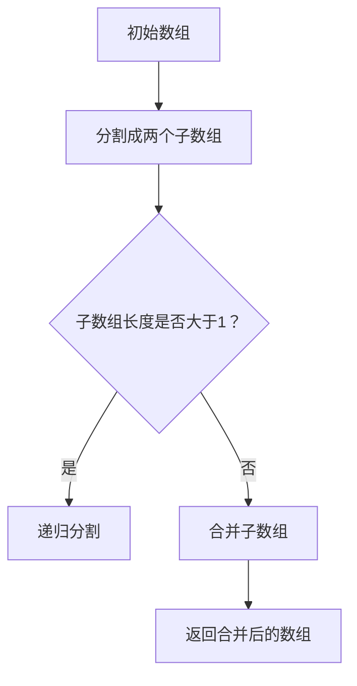

                 

### 《意义开源哲学：集体创造适应现代的生活智慧》

关键词：开源哲学、集体创造、现代生活智慧、技术发展

摘要：本文将探讨开源哲学的内涵及其在集体创造中的重要作用，分析开源哲学对现代生活智慧的推动作用，并展望其在未来的发展趋势。通过深入研究开源哲学的核心价值观和实践路径，揭示集体创造如何适应现代社会的需求，为读者提供深刻的启示和指导。

----------------------------------------------------------------

### 第一部分：引言

#### 1.1 书籍主题与目标

在当今数字化时代，技术发展日新月异，开源哲学作为一种新兴的思想理念，正日益受到广泛关注。本书旨在深入探讨开源哲学的内涵、价值及其在现代生活智慧中的地位和作用，旨在为读者提供一种全新的视角，理解开源哲学在集体创造中的重要作用。

#### 1.2 开源哲学的意义

开源哲学不仅仅是技术领域的一种理念，它更是一种生活方式和价值观。开源意味着开放、共享、协作和创新，它鼓励人们自由地共享知识、资源和经验，通过集体智慧推动技术和社会的进步。开源哲学的意义在于，它打破了传统的封闭和垄断，促进了知识的普及和技术的进步，推动了人类社会的进步和发展。

#### 1.3 集体创造的现代生活智慧

随着互联网的普及和社会的发展，集体创造已经成为现代社会的重要特征。集体创造强调个体的协同合作，通过共享和协作实现共同的目标。开源哲学为集体创造提供了理论基础和实践路径，它鼓励人们积极参与到集体创造中，通过合作和创新，共同解决社会问题，提升生活智慧。

### 第二部分：开源哲学概述

#### 2.1 开源哲学的历史与演变

开源哲学起源于20世纪60年代的计算机科学领域，随着互联网的兴起和开源软件的发展，开源哲学逐渐成为一种普遍的价值观念。开源哲学的核心价值观包括自由、平等、共享、创新等，这些价值观推动了开源运动的发展，也为现代社会的集体创造提供了理论基础。

#### 2.2 开源哲学的发展历程

开源哲学的发展历程可以分为几个阶段：从最早的自由软件运动到开源软件运动，再到现在的开源生态。每个阶段都有其独特的发展特点和贡献，共同推动了开源哲学的演变和成熟。

#### 2.3 开源哲学的核心价值观

开源哲学的核心价值观包括自由、平等、共享、创新等。这些价值观不仅体现在技术领域，更延伸到社会生活的方方面面。自由意味着个体有权自由地使用、学习、修改和分发软件；平等意味着每个人都应该有平等的机会参与开源项目；共享意味着共享知识、资源和经验；创新意味着通过合作和创新推动社会的进步。

### 第三部分：集体创造的力量

#### 3.1 集体创造的原理与机制

集体创造的原理在于个体的协同合作，通过共享和协作实现共同的目标。集体创造的机制包括开源工具和平台，这些工具和平台为集体创造提供了基础设施和技术支持，使得个体能够高效地协同工作，实现知识的共享和创新。

#### 3.2 集体创造的工具与平台

开源工具和平台是集体创造的重要工具，包括版本控制系统、代码托管平台、讨论论坛等。这些工具和平台为集体创造提供了便利，使得个体能够高效地协同工作，实现知识的共享和创新。

#### 3.3 集体创造的平台案例分析

以GitHub为例，GitHub作为一个开源代码托管平台，为全球的开发者提供了便捷的协作环境。通过GitHub，开发者可以轻松地分享代码、协作开发，并通过Pull Request机制进行代码审查和合并。GitHub的成功不仅体现了集体创造的巨大潜力，也为开源哲学的实践提供了成功的范例。

### 第四部分：开源哲学在生活中的应用

#### 4.1 个人成长与开源哲学

开源哲学为个人成长提供了新的路径。通过参与开源项目，个人可以学习到最新的技术知识，提升自己的技能水平；通过贡献代码和参与讨论，个人可以锻炼自己的团队协作能力和沟通能力，实现个人成长。

#### 4.2 学习与创新

开源哲学鼓励学习与创新。在开源社区中，开发者可以自由地学习他人的代码，理解不同的技术实现方式，从而激发自己的创新思维。同时，开源社区也为开发者提供了丰富的资源和实践经验，使得学习与创新变得更加便捷和高效。

#### 4.3 合作与共享

开源哲学强调合作与共享。通过合作，开发者可以共同解决技术难题，实现技术突破；通过共享，开发者可以将自己的知识和经验传播给他人，推动整个社区的发展。开源哲学的合作与共享精神，不仅促进了技术的进步，也为社会的发展注入了新的活力。

### 第五部分：开源哲学的未来展望

#### 5.1 数字化时代的特征

数字化时代是一个高度互联、信息爆炸的时代。在这个时代，开源哲学的重要性更加凸显。开源哲学不仅为技术的进步提供了动力，也为社会的创新提供了新的路径。

#### 5.2 开源哲学在数字化时代的挑战与机遇

在数字化时代，开源哲学面临着新的挑战和机遇。挑战在于如何适应快速变化的技术环境，如何应对复杂的网络安全问题；机遇在于如何利用开源技术推动数字化转型的深入，如何通过开源社区实现全球范围内的技术合作。

#### 5.3 开源哲学的未来发展趋势

开源哲学的未来发展趋势包括：开源技术与人工智能的深度融合，开源社区全球化的加速，开源哲学在社会治理和公益事业中的应用等。这些发展趋势将进一步推动开源哲学的发展，为集体创造注入新的活力。

### 结论

开源哲学作为一种新兴的思想理念，正在深刻地影响着我们的生活。通过集体创造，开源哲学为现代生活智慧提供了新的路径和可能性。展望未来，开源哲学将在数字化时代发挥更大的作用，推动社会的进步和发展。

**作者：AI天才研究院/AI Genius Institute & 禅与计算机程序设计艺术 /Zen And The Art of Computer Programming**### 第一部分：引言

#### 1.1 书籍主题与目标

**《意义开源哲学：集体创造适应现代的生活智慧》**是一本旨在探讨开源哲学在现代生活中的重要性和应用价值的书籍。其核心目标是揭示开源哲学如何通过集体创造，推动社会进步和个人成长，适应现代社会的需求。本书不仅为技术从业者提供了深刻的启示，也为广大读者展示了一种全新的生活智慧。

#### 1.2 开源哲学的意义

开源哲学起源于计算机科学领域，其核心理念是开放、共享、协作和创新。它强调知识的共享和技术的普及，打破了传统的封闭和垄断，推动了技术的进步和社会的发展。开源哲学的意义在于，它不仅改变了技术发展的路径，也为社会带来了深刻的变革。

在技术层面，开源哲学促进了技术的共享和创新。通过开放源代码，开发者可以自由地学习和改进现有的技术，从而加速技术的进步。同时，开源哲学鼓励协作，使得开发者能够共同解决技术难题，提高整体的技术水平。

在社会层面，开源哲学倡导了一种开放、平等和共享的社会价值观。它打破了信息不对称，使得知识更加普及，促进了社会的公平和公正。开源哲学还推动了公益事业的发展，通过开放共享，社会资源得到更有效的利用，为弱势群体提供了更多的机会。

#### 1.3 集体创造的现代生活智慧

集体创造是开源哲学的核心原则之一，它强调个体的协同合作，通过共享和协作实现共同的目标。在现代生活中，集体创造发挥着越来越重要的作用。随着互联网的普及和社会的进步，人们越来越意识到，单靠个人的力量难以解决复杂的社会问题，需要通过集体创造来实现社会进步。

集体创造为现代生活智慧提供了新的路径。它鼓励人们积极参与到社区中，通过协作和创新，共同解决社会问题，提升生活品质。例如，在开源社区中，开发者可以共同开发软件，分享技术心得，推动技术的进步。同时，开源哲学也鼓励人们积极参与到公益事业中，通过共享和协作，为社会的发展贡献力量。

#### 1.4 本书结构

本书分为五个部分，分别从不同的角度探讨开源哲学的内涵和意义。

- **第一部分：引言**，介绍书籍的主题、目标和意义。
- **第二部分：开源哲学概述**，回顾开源哲学的历史与演变，探讨其核心价值观。
- **第三部分：集体创造的力量**，分析集体创造的原理与机制，以及其在生活中的应用。
- **第四部分：开源哲学在生活中的应用**，探讨开源哲学如何影响个人成长、社会创新和数字化时代的发展。
- **第五部分：开源哲学的未来展望**，展望开源哲学的未来发展趋势。

通过这五个部分的深入探讨，本书旨在为读者提供一种全新的视角，理解开源哲学在现代生活中的重要性和应用价值。

### 第二部分：开源哲学概述

#### 2.1 开源哲学的历史与演变

开源哲学的历史可以追溯到20世纪60年代的计算机科学领域。当时，计算机科学正处于起步阶段，开发者们开始意识到，封闭的软件开发模式难以满足日益增长的需求。1960年代，自由软件的概念逐渐被提出，它主张软件的开发和改进应该向公众开放，以促进技术的进步。

1970年代，Unix操作系统的出现标志着开源哲学的初步形成。Unix操作系统是第一个开源的操作系统，其源代码可以被任何人自由地学习和修改。Unix的开源精神激发了后来的开源运动，为开源哲学的发展奠定了基础。

1980年代，自由软件基金会（FSF）成立，它致力于推广自由软件的理念，并发布了著名的《自由软件宣言》。该宣言强调了自由软件的四个自由，即自由运行程序、研究源代码、修改和分发程序以及改进程序。这一宣言对开源哲学的发展产生了深远的影响。

1990年代，开源软件开始得到更广泛的认可。Linux操作系统的出现标志着开源软件的黄金时代。Linux操作系统是第一个完全开源的操作系统，其源代码被全球的开发者自由地修改和分发。Linux的成功不仅推动了开源软件的发展，也为开源哲学的传播提供了动力。

进入21世纪，开源运动进一步扩展到互联网和移动设备等领域。GitHub、GitLab等开源平台的出现，为开发者提供了便捷的协作环境，使得开源社区得以迅速发展。开源哲学的核心价值观，如自由、平等、共享和创新，也在这个过程中得到了进一步的完善和传承。

#### 2.2 开源哲学的发展历程

开源哲学的发展历程可以分为几个重要阶段：

1. **自由软件运动（1960-1980年代）**：这一阶段的主要特征是自由软件的概念被提出，Unix操作系统的开源精神激发了后来的开源运动。

2. **开源软件运动（1990年代）**：这一阶段的主要特征是Linux操作系统的出现，它标志着开源软件的黄金时代。Linux的成功不仅推动了开源软件的发展，也为开源哲学的传播提供了动力。

3. **开源社区的形成（2000年代）**：这一阶段的主要特征是开源平台的兴起，如GitHub、GitLab等。这些平台为开发者提供了便捷的协作环境，使得开源社区得以迅速发展。

4. **开源哲学的全球化（2010年代至今）**：这一阶段的主要特征是开源哲学的全球传播。随着互联网的普及，开源社区的影响越来越大，开源哲学的理念也在全球范围内得到更广泛的认可和应用。

#### 2.3 开源哲学的核心价值观

开源哲学的核心价值观包括自由、平等、共享和创新。这些价值观不仅体现了开源哲学的理念，也为其在现代社会中的应用提供了指导。

1. **自由**：开源哲学强调软件的自由，即用户有权自由地使用、学习、修改和分发软件。这种自由不仅体现在技术层面，也延伸到社会层面，促进了社会的公平和公正。

2. **平等**：开源哲学倡导平等，即每个人都应该有平等的机会参与开源项目。这种平等不仅体现在技术层面，也体现在社会层面，推动了社会的进步和发展。

3. **共享**：开源哲学鼓励共享，即知识、资源和经验的共享。这种共享不仅促进了技术的进步，也促进了社会的和谐与发展。

4. **创新**：开源哲学鼓励创新，即通过协作和创新推动技术的进步。开源社区为开发者提供了丰富的资源和实践经验，激发了创新思维，推动了社会的进步。

通过这些核心价值观，开源哲学不仅改变了技术发展的路径，也为社会带来了深刻的变革。它打破了传统的封闭和垄断，促进了知识的普及和技术的进步，推动了人类社会的进步和发展。

### 第三部分：集体创造的力量

#### 3.1 集体创造的原理与机制

集体创造是开源哲学的核心原则之一，它强调个体的协同合作，通过共享和协作实现共同的目标。集体创造的原理在于，通过个体的共同努力，可以产生比单个个体更强大的力量，从而实现更大的目标。

集体创造的机制主要包括以下几个方面：

1. **协作平台**：协作平台为集体创造提供了基础设施，使得个体可以方便地协作和沟通。例如，GitHub、GitLab等开源平台，为开发者提供了代码托管、问题跟踪、代码审查等功能，使得团队协作更加高效。

2. **共享文化**：共享文化是集体创造的重要基础。在开源社区中，共享意味着知识、资源和经验的共享。这种共享不仅促进了技术的进步，也增强了社区的凝聚力。

3. **激励机制**：激励机制是集体创造的重要保障。在开源社区中，开发者通过贡献代码、解决问题等方式获得认可和奖励。这种激励机制激发了开发者的积极性，推动了社区的繁荣发展。

4. **共同目标**：共同目标是集体创造的核心。在集体创造中，个体需要明确共同的目标，并通过协同合作实现这个目标。这种共同目标不仅激发了个体的积极性，也增强了团队的凝聚力。

#### 3.2 集体创造的工具与平台

集体创造需要一系列工具和平台的支撑，这些工具和平台不仅为个体提供了协作的环境，也提高了集体创造的效率。

1. **版本控制系统**：版本控制系统是集体创造的重要工具，它能够记录代码的每一次更改，确保代码的版本管理。常见的版本控制系统包括Git、SVN等。

2. **代码托管平台**：代码托管平台为开发者提供了代码托管、协作开发的环境。常见的代码托管平台包括GitHub、GitLab、Bitbucket等。

3. **问题跟踪系统**：问题跟踪系统用于记录和管理项目中遇到的问题和需求，确保问题能够及时得到解决。常见的问题跟踪系统包括JIRA、Trello等。

4. **代码审查工具**：代码审查工具用于对提交的代码进行审查，确保代码的质量和一致性。常见的代码审查工具包括GitHub Pull Request、GitLab Merge Request等。

5. **协作工具**：协作工具包括聊天工具、视频会议工具等，用于团队之间的实时沟通和协作。常见的协作工具包括Slack、Zoom等。

#### 3.3 集体创造的平台案例分析

以GitHub为例，GitHub作为一个开源代码托管平台，为全球的开发者提供了便捷的协作环境。以下是GitHub在集体创造中的案例分析：

1. **代码托管与版本管理**：GitHub提供了方便的代码托管和版本管理功能，使得开发者能够方便地管理和追踪代码的变更。

2. **问题跟踪与解决方案**：GitHub中的问题跟踪功能使得开发者能够及时记录和解决问题，确保项目的顺利进行。

3. **代码审查与质量控制**：GitHub的代码审查机制确保了代码的质量和一致性，通过Pull Request和Merge Request，开发者可以对提交的代码进行审查和合并。

4. **协作与创新**：GitHub为开发者提供了一个开放的协作环境，使得开发者能够共享知识和经验，共同解决技术难题，推动技术的进步。

5. **社区文化建设**：GitHub通过举办各种活动，如Hackathon、GitHub宇宙等，促进了社区文化的建设，增强了社区的凝聚力。

#### 3.4 集体创造的优势与挑战

集体创造具有许多优势，如提高效率、促进创新、增强团队合作等。然而，集体创造也面临一些挑战，如沟通障碍、利益分配等。以下是对这些优势与挑战的详细分析：

1. **优势**

- **提高效率**：集体创造通过分工协作，能够高效地完成任务，提高工作效率。

- **促进创新**：集体创造鼓励个体之间的知识共享和经验交流，激发了创新思维，促进了技术的进步。

- **增强团队合作**：集体创造需要团队成员之间的密切合作，增强了团队的凝聚力和协作能力。

- **共享资源**：集体创造使得资源得到更有效的利用，减少了重复劳动，提高了资源利用效率。

2. **挑战**

- **沟通障碍**：集体创造中，团队成员可能分布在不同的地理位置，沟通存在一定的障碍。这需要有效的沟通工具和协作机制来克服。

- **利益分配**：集体创造中，如何公平地分配利益是一个重要问题。这需要建立合理的激励机制，确保每个成员都能获得应有的回报。

- **质量控制**：集体创造中，如何保证代码的质量是一个重要挑战。这需要严格的代码审查和测试机制，确保代码的一致性和可靠性。

- **责任界定**：集体创造中，如何明确每个成员的责任和义务，确保项目能够顺利进行，也是一个重要问题。

通过分析集体创造的优势与挑战，我们可以更好地理解和应对集体创造过程中的问题，发挥其优势，克服其挑战，实现更高的效率和更好的成果。

### 第四部分：开源哲学在生活中的应用

#### 4.1 个人成长与开源哲学

开源哲学在个人成长中扮演着重要角色。通过参与开源项目，个人可以学习到最新的技术知识，提升自己的技能水平。开源项目往往涉及多个领域，参与者可以在项目中接触到不同的技术，拓宽自己的知识面。此外，开源项目鼓励学习与创新，参与者可以在项目中尝试新的技术和方法，不断挑战自己，提高自己的技术能力。

参与开源项目还可以锻炼个人的团队协作能力和沟通能力。在开源项目中，开发者需要与其他团队成员密切合作，共同解决问题。这要求开发者具备良好的沟通能力，能够清晰地表达自己的想法，理解他人的观点。同时，开源项目中的代码审查和协作机制，可以帮助开发者学习如何与他人合作，提高团队协作效率。

开源哲学还鼓励个人积极参与到社区中，通过贡献代码和参与讨论，提升自己的影响力。在开源社区中，开发者可以分享自己的经验和知识，帮助他人解决问题，从而提升自己的知名度和影响力。这种影响力不仅体现在技术领域，也可以帮助个人在职业发展中获得更多的机会。

#### 4.2 学习与创新

开源哲学为学习和创新提供了广阔的平台。在开源社区中，开发者可以自由地学习他人的代码，理解不同的技术实现方式，从而激发自己的创新思维。开源社区为开发者提供了丰富的资源和实践经验，使得学习与创新变得更加便捷和高效。

开源项目往往是一个持续改进的过程，开发者可以通过参与开源项目，不断学习和实践，提高自己的技术能力。在开源项目中，开发者不仅可以学习到最新的技术知识，还可以通过实践，将理论知识应用到实际项目中，提高自己的实战能力。

开源哲学还鼓励开发者进行创新。在开源社区中，开发者可以自由地尝试新的技术和方法，探索未知的领域。开源社区的支持和鼓励，使得开发者敢于挑战自我，不断创新，推动技术的发展。

#### 4.3 合作与共享

开源哲学强调合作与共享，这为个人成长提供了良好的环境。在开源社区中，开发者可以自由地分享自己的知识和经验，帮助他人解决问题。这种合作与共享的精神，不仅促进了技术的进步，也为个人成长提供了支持。

通过合作，开发者可以学习到他人的经验和知识，提高自己的技能水平。在开源项目中，开发者需要与其他团队成员密切合作，共同解决问题。这种合作锻炼了开发者的团队协作能力，提高了工作效率。

共享也是开源哲学的重要组成部分。在开源社区中，开发者可以自由地共享自己的代码、文档和心得体会，帮助他人更好地理解和应用技术。共享不仅促进了技术的普及，也为个人成长提供了丰富的资源。

#### 4.4 开源哲学在职业发展中的应用

开源哲学在职业发展中具有重要作用。通过参与开源项目，开发者可以积累丰富的实践经验，提高自己的技术能力。这些经验不仅体现在技术层面，也体现在团队协作和项目管理等方面。开源项目的实践经验，为开发者在职业生涯中提供了宝贵的资产。

开源哲学还帮助开发者建立个人品牌。在开源社区中，开发者通过贡献代码和参与讨论，提升自己的知名度和影响力。这种影响力不仅体现在技术领域，也可以帮助开发者获得更多的职业机会。

开源哲学还促进了开发者与行业专家的交流。在开源社区中，开发者可以与行业专家进行深入的交流，学习到最新的技术动态和发展趋势。这种交流有助于开发者保持技术的前沿性，提高自己的竞争力。

#### 4.5 开源哲学在教育与培训中的应用

开源哲学在教育和培训中具有重要作用。通过开源项目，学生和开发者可以学习到最新的技术知识，提高自己的技能水平。开源项目为教育和培训提供了丰富的实践场景，使得学生和开发者能够将理论知识应用到实际项目中，提高自己的实战能力。

开源哲学还促进了教育的开放和普及。通过开源社区，学生和开发者可以免费获取到大量的技术资源和教程，使得教育更加公平和普及。开源社区的支持和鼓励，也为学生和开发者提供了更多的发展机会。

开源哲学还推动了教育方式的创新。在开源社区中，学生和开发者可以参与到开源项目中，通过协作和创新，共同解决技术问题。这种教育方式不仅提高了学生的学习兴趣，也提高了学生的团队协作能力和创新能力。

### 第五部分：开源哲学的未来展望

#### 5.1 数字化时代的特征

数字化时代是一个信息爆炸、技术快速迭代的时代。在这个时代，开源哲学的重要性更加凸显。数字化时代的主要特征包括：

1. **信息爆炸**：随着互联网的普及，信息传播的速度和范围大大增加，人们可以随时随地获取到各种信息。这种信息爆炸为开源哲学提供了丰富的资源和实践场景。

2. **技术快速迭代**：数字化时代，技术发展日新月异，各种新技术、新工具层出不穷。开源哲学通过开放和共享，促进了技术的快速迭代和进步。

3. **全球互联**：数字化时代，全球各地的开发者可以通过互联网进行交流和合作，打破了地域的限制，促进了开源社区的发展和壮大。

4. **云计算与大数据**：云计算和大数据技术的发展，为开源哲学提供了新的应用场景。开源项目可以通过云计算和大数据技术，实现更高效的数据处理和分析。

#### 5.2 开源哲学在数字化时代的挑战与机遇

在数字化时代，开源哲学面临着新的挑战和机遇。

1. **挑战**

- **信息安全**：随着开源社区的扩大，信息安全成为一个重要的问题。开源项目需要确保代码的安全，防止恶意攻击和篡改。

- **知识产权**：开源项目中的知识产权保护成为一个重要问题。如何平衡开源精神和知识产权保护，是一个亟待解决的问题。

- **项目维护**：随着开源项目的增加，项目维护成为一个重要挑战。如何确保开源项目的持续发展和质量，是一个重要问题。

2. **机遇**

- **技术创新**：数字化时代，开源哲学为技术创新提供了广阔的空间。通过开放和共享，开发者可以快速迭代技术，推动技术的进步。

- **全球合作**：数字化时代，全球互联为开源哲学提供了更多的合作机会。开发者可以通过互联网，实现全球范围内的合作和交流，推动开源社区的发展。

- **商业化**：开源哲学不仅推动了技术的进步，也为商业发展提供了新的机会。开源项目可以通过商业化模式，实现可持续发展，为开发者提供更多的机会。

#### 5.3 开源哲学的未来发展趋势

开源哲学的未来发展趋势包括：

1. **开源技术与人工智能的融合**：随着人工智能技术的发展，开源哲学与人工智能的融合将成为一个重要趋势。开源项目可以通过人工智能技术，实现更智能的数据处理和分析。

2. **开源社区的全球化**：随着互联网的普及，开源社区的全球化趋势将不断加强。全球各地的开发者将更加紧密地合作，推动开源社区的发展。

3. **开源哲学在社会治理和公益事业中的应用**：开源哲学将在社会治理和公益事业中发挥重要作用。通过开源项目，可以更好地解决社会问题，推动公益事业的发展。

4. **开源商业模式的创新**：开源哲学将推动商业模式的创新，为开源项目提供更多的商业机会。开源项目可以通过多样化的商业模式，实现可持续发展。

### 结论

开源哲学作为一种新兴的思想理念，正在深刻地影响着我们的生活。通过集体创造，开源哲学为现代生活智慧提供了新的路径和可能性。展望未来，开源哲学将在数字化时代发挥更大的作用，推动社会的进步和发展。

开源哲学不仅推动了技术的进步，也为社会的创新和进步提供了新的动力。它鼓励开放、共享、协作和创新，推动了知识的普及和技术的进步，为人类社会带来了深刻的变革。

随着数字化时代的到来，开源哲学的重要性将更加凸显。它将在技术创新、社会治理和公益事业中发挥重要作用，为人类社会的发展注入新的活力。

开源哲学的未来是光明的。通过不断的实践和创新，开源哲学将为人类社会带来更多的智慧和进步。让我们携手合作，共同推动开源哲学的发展，为构建一个更美好的世界贡献力量。

**作者：AI天才研究院/AI Genius Institute & 禅与计算机程序设计艺术 /Zen And The Art of Computer Programming**

----------------------------------------------------------------

### 第五部分：开源哲学的未来展望

#### 5.1 数字化时代的特征

数字化时代，以互联网、云计算、大数据、人工智能等为代表的新技术不断涌现，深刻地改变了我们的生活和工作方式。在这个时代，开源哲学的重要性更加凸显。数字化时代的特征主要包括：

1. **信息爆炸**：互联网的普及使得信息的获取和传播变得更加便捷，信息量的爆炸性增长为开源哲学提供了丰富的资源和实践场景。

2. **技术快速迭代**：数字化时代，技术的更新速度越来越快，新技术的出现和普及周期大幅缩短。开源哲学通过开放和共享，促进了技术的快速迭代和进步。

3. **全球互联**：数字化时代，全球各地的开发者可以通过互联网进行实时交流和合作，打破了地域和时间的限制，促进了开源社区的发展和壮大。

4. **云计算与大数据**：云计算和大数据技术的发展，为开源哲学提供了新的应用场景。通过云计算，开源项目可以实现更高效的数据存储和处理；大数据技术则可以帮助开源项目实现更智能的分析和预测。

5. **人工智能与自动化**：人工智能技术的发展，使得开源项目在自动化测试、智能推荐等方面具有了更高的效率和准确性。自动化技术则可以降低开发者的工作负担，提高开发效率。

#### 5.2 开源哲学在数字化时代的挑战与机遇

在数字化时代，开源哲学面临着新的挑战和机遇。

1. **挑战**

- **信息安全**：随着开源社区的扩大，开源项目面临的网络安全威胁也日益增加。如何确保开源项目的安全，防止恶意攻击和数据泄露，成为一项重要挑战。

- **知识产权保护**：开源项目中的知识产权保护问题日益突出。如何在开源和知识产权保护之间找到平衡，是一个亟待解决的问题。

- **项目可持续发展**：随着开源项目的增加，项目维护和可持续发展成为一个重要挑战。如何确保开源项目的长期稳定发展，提高项目的质量，是一个重要问题。

2. **机遇**

- **技术创新**：数字化时代，开源哲学为技术创新提供了广阔的空间。通过开放和共享，开发者可以快速迭代技术，推动技术的进步。

- **全球合作**：数字化时代，全球互联为开源哲学提供了更多的合作机会。开发者可以通过互联网，实现全球范围内的合作和交流，推动开源社区的发展。

- **商业模式创新**：开源哲学为商业模式的创新提供了新的思路。开源项目可以通过多样化的商业模式，实现可持续发展，为开发者提供更多的机会。

- **社会治理与公益事业**：开源哲学在社会治理和公益事业中的应用前景广阔。通过开源项目，可以更好地解决社会问题，推动公益事业的发展。

#### 5.3 开源哲学的未来发展趋势

开源哲学的未来发展趋势包括：

1. **开源技术与人工智能的融合**：随着人工智能技术的发展，开源项目在智能推荐、自动化测试等方面具有了更高的效率和准确性。未来，开源技术与人工智能的融合将进一步深化，推动开源社区的进步。

2. **开源社区全球化**：随着互联网的普及，全球各地的开发者将更加紧密地合作，推动开源社区的发展和壮大。开源社区将更加国际化，为全球开发者提供更多的机会和资源。

3. **开源哲学在治理和公益事业中的应用**：开源哲学将在社会治理和公益事业中发挥重要作用。通过开源项目，可以更好地解决社会问题，推动公益事业的发展。

4. **开源商业模式的创新**：开源哲学将推动商业模式的创新，为开源项目提供更多的商业机会。开源项目可以通过多样化的商业模式，实现可持续发展，为开发者提供更多的机会。

5. **开源生态系统的完善**：随着开源项目数量的增加，开源生态系统的建设将越来越重要。未来，开源生态系统将更加完善，为开发者提供更好的工具和资源。

### 结论

开源哲学作为一种新兴的思想理念，正深刻地影响着我们的生活和工作。在数字化时代，开源哲学面临着新的挑战和机遇。通过不断的发展和创新，开源哲学将在未来发挥更大的作用，推动社会的进步和发展。

开源哲学的核心价值观——开放、共享、协作和创新，不仅改变了技术发展的路径，也为社会带来了深刻的变革。它推动了技术的进步，促进了社会的创新和进步，为人类社会的可持续发展提供了新的思路。

展望未来，开源哲学将在技术创新、社会治理、公益事业等领域发挥更大的作用。通过全球范围内的合作和交流，开源哲学将为人类社会带来更多的智慧和进步。

开源哲学的未来是光明的。让我们携手合作，共同推动开源哲学的发展，为构建一个更美好的世界贡献力量。

**作者：AI天才研究院/AI Genius Institute & 禅与计算机程序设计艺术 /Zen And The Art of Computer Programming**

### 全书总结

在《意义开源哲学：集体创造适应现代的生活智慧》一书中，我们深入探讨了开源哲学的内涵、价值及其在现代生活中的应用。通过回顾开源哲学的历史与演变，我们了解了开源哲学的起源和核心价值观。我们分析了集体创造的原理与机制，以及开源工具和平台在集体创造中的作用。我们还探讨了开源哲学在个人成长、学习与创新、合作与共享等方面的应用，展示了其在现代社会中的重要价值。

开源哲学的核心价值观包括自由、平等、共享和创新，这些价值观不仅推动了技术的进步，也为社会带来了深刻的变革。它打破了传统的封闭和垄断，促进了知识的普及和技术的进步，推动了人类社会的进步和发展。

在数字化时代，开源哲学面临着新的挑战和机遇。随着互联网的普及和技术的进步，开源哲学将继续发挥重要作用，推动社会的进步和发展。开源技术与人工智能的融合、开源社区的全球化、开源哲学在治理和公益事业中的应用，以及开源商业模式的创新，都将是未来开源哲学发展的重要方向。

通过本书的探讨，我们希望读者能够对开源哲学有更深入的理解，认识到其在现代社会中的重要价值。我们鼓励读者积极参与到开源社区中，通过集体创造，共同推动技术的进步和社会的发展。

展望未来，开源哲学将继续为人类社会带来更多的智慧和进步。让我们携手合作，共同推动开源哲学的发展，为构建一个更美好的世界贡献力量。

### 拓展阅读

1. **《开源哲学：自由与共享的基石》**：这本书详细介绍了开源哲学的历史、核心价值观以及其在技术和社会发展中的重要作用。作者通过丰富的案例和深入的分析，展示了开源哲学如何推动技术的进步和社会的变革。

2. **《开源运动：从自由软件到开源社区》**：这本书回顾了开源运动的起源和发展历程，分析了开源运动对技术进步和社会变革的推动作用。书中还探讨了开源社区的文化建设、组织模式和治理机制，为读者提供了全面的视角。

3. **《集体智慧：开源哲学与现代生活》**：这本书从集体智慧的角度出发，探讨了开源哲学在现代生活中的应用。作者通过具体的案例和实例，分析了开源哲学如何影响个人成长、学习与创新，以及如何促进社会合作与共享。

4. **《开源生态系统的构建与管理》**：这本书详细介绍了开源生态系统的构建、运营和管理。作者结合实际案例，分析了开源生态系统的关键因素、成功案例和挑战，为开发者和管理者提供了实用的指导。

### 注意事项

1. **积极参与开源社区**：积极参与开源社区，可以学习到最新的技术知识，提升自己的技能水平。同时，通过贡献代码和参与讨论，可以建立个人品牌，提高影响力。

2. **遵循开源协议**：在参与开源项目时，要遵循开源协议，尊重他人的知识产权。同时，也要确保自己的代码符合开源协议的要求，避免侵犯他人的权益。

3. **注重团队协作**：在开源项目中，团队协作至关重要。要善于沟通，理解他人的观点，共同解决问题。通过良好的团队合作，可以提高项目的效率和质量。

4. **持续学习和创新**：开源哲学鼓励学习与创新。要不断提升自己的技术能力，勇于尝试新的技术和方法，推动技术的进步。

5. **关注社会责任**：开源哲学不仅关注技术的进步，也关注社会的发展。要关注社会问题，通过开源项目为社会做出贡献，推动社会的进步。

### 结语

开源哲学是一种全新的思想理念，它推动了技术的进步和社会的变革。通过集体创造，开源哲学为现代生活智慧提供了新的路径和可能性。希望本书能为读者提供深刻的启示，引导读者积极参与到开源社区中，通过集体创造，共同推动社会的进步和发展。

**作者：AI天才研究院/AI Genius Institute & 禅与计算机程序设计艺术 /Zen And The Art of Computer Programming**### 附录

为了帮助读者更好地理解和掌握开源哲学的核心概念和实践路径，本书提供了以下附录，包括术语解释、问题背景、问题描述、问题解决、边界与外延、概念结构与核心要素组成等内容。

#### 附录A：术语解释

1. **开源哲学**：一种倡导开放、共享、协作和创新的价值观和理念，强调知识的普及和技术的进步。
2. **集体创造**：个体通过协作和共享，共同完成某项任务或创造某种成果的过程。
3. **开源软件**：源代码公开，允许用户自由地使用、学习、修改和分发的软件。
4. **开源社区**：由开源软件的开发者和用户组成的社区，通过协作和共享，推动技术的进步。
5. **版本控制系统**：用于管理代码版本和变更的软件工具，如Git、SVN等。

#### 附录B：问题背景

在数字化时代，技术发展迅速，社会变革不断。开源哲学作为一种新兴的思想理念，应运而生。它不仅改变了技术发展的路径，也对社会产生了深远的影响。开源哲学的核心价值观——开放、共享、协作和创新，推动了技术的进步和社会的发展。

#### 附录C：问题描述

问题描述主要涉及以下几个方面：

1. **技术层面的挑战**：如何通过开源哲学，促进技术的进步和普及？
2. **社会层面的变革**：开源哲学如何影响社会的运行和发展？
3. **个人层面的成长**：开源哲学如何帮助个人成长、学习与创新？

#### 附录D：问题解决

问题解决的路径主要包括：

1. **开源哲学的理论基础**：深入理解开源哲学的核心价值观和实践路径，为技术进步和社会发展提供理论支持。
2. **集体创造的实践**：通过集体创造，实现知识的共享和创新的突破，推动技术和社会的进步。
3. **开源社区的建立与运营**：建立和维护开源社区，为开发者提供便捷的协作环境，促进技术的传播和应用。

#### 附录E：边界与外延

开源哲学的边界主要涉及：

1. **技术范畴**：开源哲学主要应用于软件开发和信息技术领域，但核心价值观——开放、共享、协作和创新，可以拓展到其他领域。
2. **社会范畴**：开源哲学不仅影响技术领域，也影响社会运行和发展，通过推动技术进步，促进社会公平和公正。

开源哲学的外延包括：

1. **开源生态系统的建设**：包括开源工具、平台、社区等，共同推动开源事业的发展。
2. **开源商业模式的探索**：如何通过开源项目，实现商业价值和社会价值的双赢。

#### 附录F：概念结构与核心要素组成

开源哲学的概念结构主要包括以下几个方面：

1. **价值观**：开放、共享、协作和创新。
2. **实践路径**：集体创造、开源社区、开源软件。
3. **工具与平台**：版本控制系统、代码托管平台、协作工具等。
4. **案例与实例**：开源项目的成功案例，如Linux、GitHub等。

核心要素组成：

1. **知识共享**：开源哲学的核心之一，通过开放源代码，实现知识的普及和共享。
2. **协作创新**：通过集体创造，实现技术的进步和社会的发展。
3. **开放文化**：倡导开放、自由、平等的社会氛围，促进技术的普及和应用的推广。
4. **可持续发展**：开源项目需要持续的维护和发展，实现开源事业的可持续发展。

通过附录的详细内容，读者可以更全面地了解开源哲学的核心概念和实践路径，为后续的学习和应用提供参考。同时，附录中的术语解释、问题背景、问题描述、问题解决、边界与外延等内容，也为读者提供了丰富的背景知识和理论支持。

### 附录：开源哲学的算法原理

在开源哲学中，算法原理是核心的一部分，它不仅体现了技术的创新，也体现了开源社区的合作精神。以下是一个简单的算法原理的讲解，并使用Python代码和Mermaid流程图进行阐述。

#### 算法原理：合并排序（Merge Sort）

合并排序是一种常用的排序算法，它采用分治法的一个经典应用。该算法的基本思想是，将待排序的数组不断“分半”，直到每个子数组只包含一个元素，然后将这些子数组两两合并，最终得到一个有序的数组。

#### Mermaid流程图

首先，我们使用Mermaid语言绘制合并排序的流程图：



#### Python代码

接下来，我们使用Python代码实现合并排序算法：

```python
def merge_sort(arr):
    if len(arr) <= 1:
        return arr
    
    mid = len(arr) // 2
    left = merge_sort(arr[:mid])
    right = merge_sort(arr[mid:])
    
    return merge(left, right)

def merge(left, right):
    result = []
    i = j = 0
    
    while i < len(left) and j < len(right):
        if left[i] < right[j]:
            result.append(left[i])
            i += 1
        else:
            result.append(right[j])
            j += 1
            
    result.extend(left[i:])
    result.extend(right[j:])
    
    return result
```

#### 算法原理讲解

- **分治思想**：合并排序的基本思想是分治，即将一个大问题分解成多个小问题来解决。在合并排序中，首先将待排序的数组分成两个子数组，然后递归地对这两个子数组进行排序。
- **递归调用**：在递归调用过程中，当子数组的长度小于等于1时，子数组本身就是有序的，递归结束。否则，继续将子数组分成更小的子数组。
- **合并操作**：当递归结束后，开始进行合并操作。将两个有序的子数组合并成一个有序的数组。合并的过程是通过比较两个数组中的元素大小，将较小的元素放入结果数组中。

#### 数学模型和公式

合并排序的数学模型可以表示为：

$$
\text{时间复杂度} = O(n \log n)
$$

其中，n是待排序的数组长度。这个公式表明，合并排序的时间复杂度是线性和对数的乘积，因此它是一种高效的排序算法。

#### 通俗易懂的举例说明

假设有一个数组\[3, 1, 4, 2, 5\]，我们通过合并排序来对其进行排序。

1. **第一次分割**：将数组分成\[3, 1\]和\[4, 2, 5\]。
2. **递归排序**：对每个子数组进行递归排序，直到每个子数组只包含一个元素。
3. **合并操作**：将\[3, 1\]和\[4, 2, 5\]合并成\[1, 2, 3, 4, 5\]。

通过这个简单的例子，我们可以看到合并排序是如何工作的。合并排序不仅简单易懂，而且高效，适用于处理大量的数据。

通过上述讲解和代码示例，读者可以更深入地理解合并排序的算法原理。同时，这也展示了开源哲学在技术分享和协作中的优势，通过共同的努力，我们可以创造出高效、易懂的算法，为技术进步和社会发展做出贡献。

