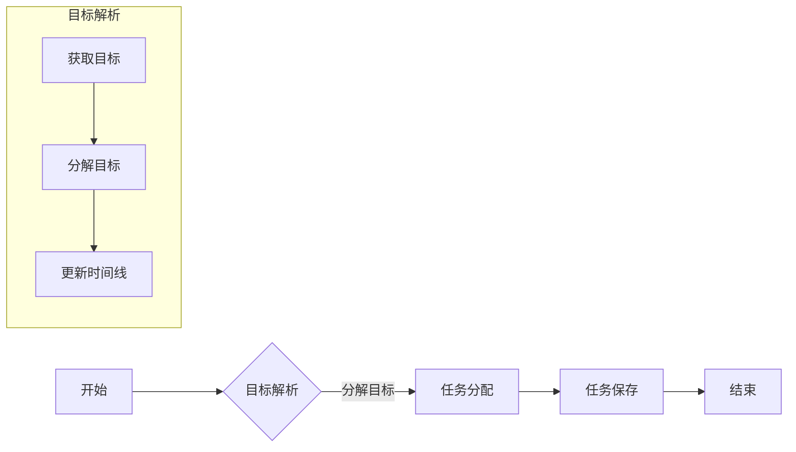
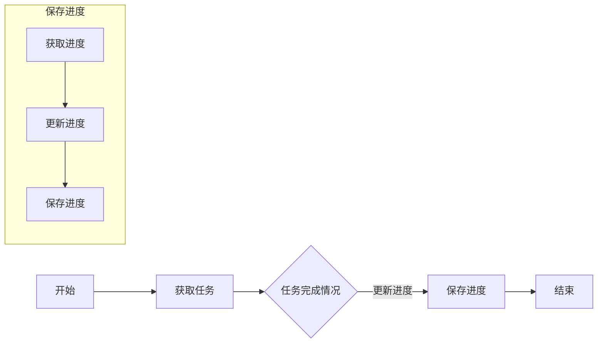
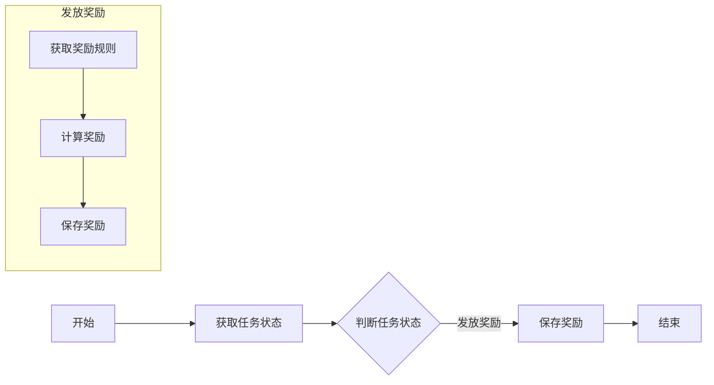
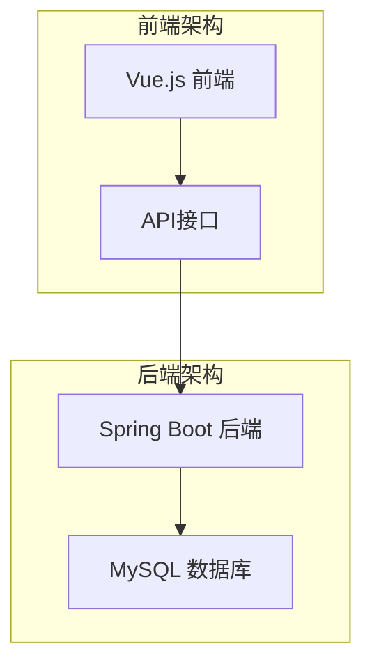
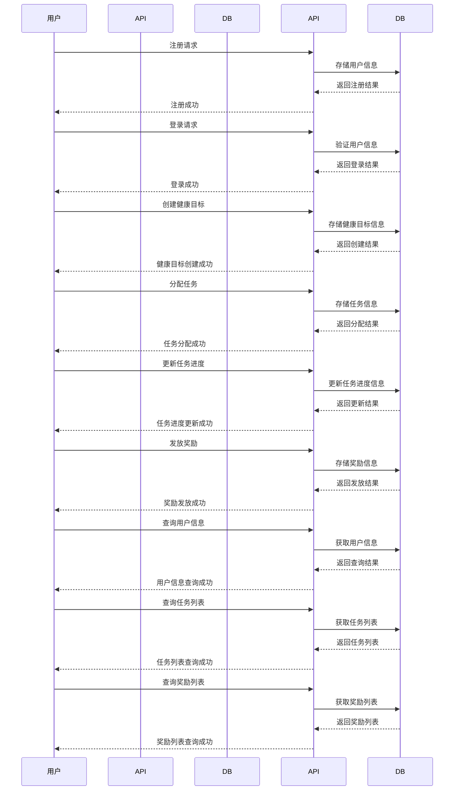
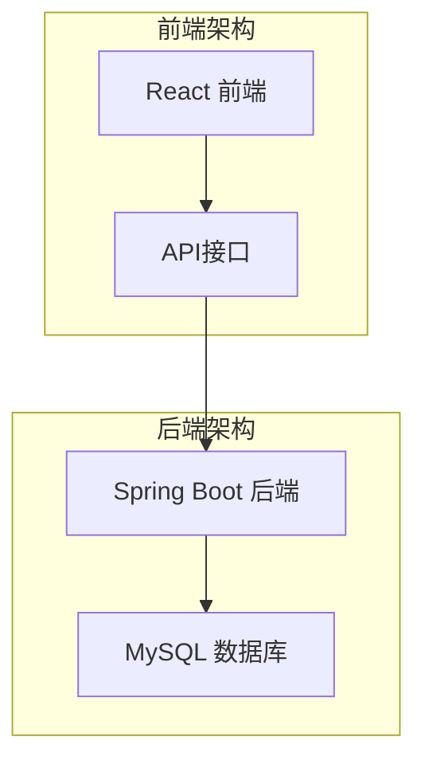
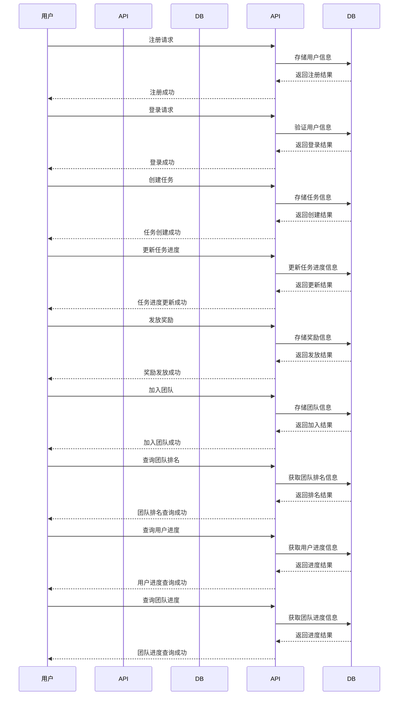
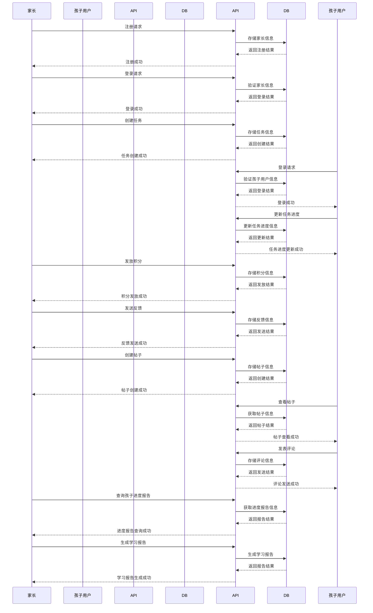

                 

## 引言与背景

### 核心概念术语说明

在探讨“意义游戏化人生设计师：将日常转化为任务的咨询服务”这一主题之前，我们需要明确一些核心概念和术语，以确保讨论的准确性和一致性。

- **游戏化（Gamification）**：游戏化是将游戏设计中的元素和原则应用于非游戏场景的一种策略，旨在激励用户参与、提高用户粘性、增强用户体验。这些元素通常包括积分、等级、徽章、排行榜、挑战等。
- **人生设计（Life Design）**：人生设计是一种以目标为导向、系统性地规划个人生活的方法，旨在提高生活质量、实现个人价值和最大化生活满意度。
- **咨询服务**：咨询服务是指专业人士利用专业知识和技能，为客户提供决策支持、建议和解决方案的服务过程。
- **任务转化**：任务转化是指将日常生活中的各种活动转化为可量化和可跟踪的任务，以便更有效地管理时间和资源。

### 问题背景

在当今快节奏、高度竞争的社会中，个人生活和工作压力不断增大。很多人发现自己难以平衡工作、家庭和个人生活，导致焦虑、疲劳和成就感缺失。与此同时，游戏化的广泛应用在各个领域取得了显著成效，从市场营销到教育再到健康管理，游戏化元素都极大地提升了用户体验和参与度。

- **个人生活失衡**：现代人的生活往往被工作、家庭和社交需求所占据，很少有时间去追求个人兴趣和目标。这种失衡状态导致个人幸福感和生活质量下降。
- **缺乏目标和动机**：许多人感到迷茫和缺乏动力，不知道如何设定和达成个人目标。这种情况下，游戏化提供的激励和奖励机制可能成为一种有效的解决方案。
- **时间管理挑战**：随着日常任务的不断增加，有效管理时间成为一大挑战。将日常任务游戏化可以帮助人们更好地组织和管理时间，提高工作效率。

### 问题描述

基于上述背景，我们可以提出以下问题：

- **如何将日常活动转化为有意义、可量化的任务？**
- **如何利用游戏化策略激励个人追求目标并提高生活质量？**
- **如何提供专业的咨询服务，帮助客户实现人生设计的转型？**

这些问题直接关联到“意义游戏化人生设计师：将日常转化为任务的咨询服务”这一主题。接下来，我们将进一步探讨游戏化理论、人生设计原则，以及游戏化人生设计的工具和方法，以期找到有效的解决方案。

### 问题解决

为了解决上述问题，我们提出了“意义游戏化人生设计师：将日常转化为任务的咨询服务”这一创新性解决方案。以下是这一解决方案的具体步骤：

1. **目标设定与任务转化**：首先，客户需要明确自己的长期和短期目标，并将这些目标细化为具体的任务。这些任务应该是可量化、可追踪的，以便客户能够清晰地了解自己的进度。

2. **游戏化元素应用**：接下来，我们将运用游戏化策略，如积分、徽章、排行榜和挑战，将这些任务赋予游戏化的特性。通过这种设计，任务完成者可以获得即时的反馈和奖励，从而增强参与感和成就感。

3. **个性化与适应性**：考虑到每个人的生活背景和目标不同，我们的服务将提供个性化的游戏化方案。同时，这些方案需要具备适应性，以适应客户不断变化的需求和环境。

4. **专业咨询服务**：我们的专业团队将为客户提供全面的咨询服务，包括目标设定、任务转化、游戏化策略应用、进度跟踪和反馈调整等。通过这种服务模式，客户可以获得全方位的支持，确保其人生设计能够成功落地。

5. **持续反馈与迭代**：我们强调持续反馈和迭代的重要性。客户将定期收到关于任务完成情况和整体生活质量的反馈，并根据这些反馈调整和优化游戏化方案。

通过这些步骤，我们期望帮助客户将日常活动转化为有意义、可量化的任务，并通过游戏化策略提高生活质量。这一解决方案不仅能够激发客户的内在动机，还能够提供专业的支持和指导，确保人生设计的成功实施。

### 边界与外延

在讨论“意义游戏化人生设计师：将日常转化为任务的咨询服务”时，我们需要明确一些边界条件和外延范围，以确保解决方案的适用性和有效性。

- **边界条件**：首先，这一咨询服务主要针对有明确目标和愿意投入时间进行自我管理的人群。其次，游戏化的应用范围限于日常生活中的任务和活动，不包括专业性和技术性的任务。

- **外延范围**：然而，这一解决方案的应用并不仅限于个人生活领域，还可以扩展到企业和组织。例如，企业可以利用游戏化策略提高员工的参与度和工作效率，从而实现组织目标的达成。此外，这一理念也可以应用于教育领域，帮助学生更好地规划学习和生活，提高学习效果和满意度。

### 概念结构与核心要素组成

为了更好地理解“意义游戏化人生设计师：将日常转化为任务的咨询服务”，我们可以将其核心概念和要素结构进行详细分析。

1. **核心概念**：
   - **游戏化**：将游戏设计中的激励机制应用于非游戏场景。
   - **人生设计**：以目标为导向，系统性地规划个人生活。
   - **咨询服务**：提供专业的决策支持和解决方案。

2. **核心要素**：
   - **目标设定**：明确个人长期和短期目标。
   - **任务转化**：将日常活动转化为可量化和可追踪的任务。
   - **游戏化策略**：应用积分、徽章、排行榜等元素。
   - **个性化方案**：根据个人需求定制游戏化方案。
   - **专业支持**：提供全面的目标设定、任务转化和反馈调整服务。

通过这些核心概念和要素的有机结合，我们能够构建一个系统化、高效的人生设计解决方案，帮助客户实现个人价值和生活质量的提升。

### 关键概念的对比表格

为了更清晰地理解“意义游戏化人生设计师：将日常转化为任务的咨询服务”中的关键概念，我们提供了以下对比表格：

| 概念       | 定义                                                         | 关联性                                                     |
|------------|--------------------------------------------------------------|------------------------------------------------------------|
| 游戏化     | 将游戏设计中的元素和原则应用于非游戏场景                     | 提高参与度、增强用户体验                                   |
| 人生设计   | 以目标为导向，系统性地规划个人生活                           | 提升生活质量、实现个人价值                               |
| 咨询服务   | 提供专业的决策支持和解决方案                                 | 确保方案的有效实施、提供个性化支持                         |
| 任务转化   | 将日常活动转化为可量化和可追踪的任务                         | 提高任务管理效率、实现目标达成的可度量性                   |
| 游戏化策略 | 应用积分、徽章、排行榜等元素来激励用户                       | 增强参与感、提升成就感                                     |

通过这个表格，我们可以看到每个概念在解决方案中的独特作用和相互关联，有助于更全面地理解游戏化人生设计的过程。

### 游戏化人生设计工具的ER实体关系图架构

为了更好地理解游戏化人生设计工具的架构，我们将使用Mermaid语言来绘制实体关系图（ER图）。ER图能够清晰地展示各个实体之间的关系，从而帮助我们构建一个系统化的游戏化人生设计框架。

以下是一个基本的ER图示例：

```mermaid
erDiagram
  User ||--|{ Task }|--|| Goal
  Task ||--|{ Reward }|--|| User
  Goal ||--|{ Timeline }|--|| User
  User ||--|{ Progress }|--|| Task
```

在这个ER图中，我们定义了以下实体：

- **User（用户）**：代表参与游戏化人生设计的个体，是所有其他实体的基础。
- **Task（任务）**：代表用户需要完成的具体活动，每个任务都与用户和目标相关联。
- **Goal（目标）**：代表用户设定的长期和短期目标，与用户和任务相关联。
- **Reward（奖励）**：代表用户完成任务后获得的奖励，如积分、徽章等，与用户和任务相关联。
- **Timeline（时间线）**：代表任务的目标完成时间，与用户和目标相关联。
- **Progress（进度）**：代表用户完成任务的情况和进度，与用户和任务相关联。

下面是对每个实体及其关系的详细解释：

1. **User（用户）**：
   - 关系：用户与任务、目标、进度和奖励存在多对多的关系。
   - 功能：用户是游戏化人生设计的核心，所有任务和目标都是由用户设定的。

2. **Task（任务）**：
   - 关系：任务与用户和目标存在一对一的关系，每个任务属于一个用户并指向一个目标。
   - 功能：任务是用户实现目标的具体活动，每个任务都有其特定的完成标准和奖励。

3. **Goal（目标）**：
   - 关系：目标与用户和时间线存在一对一的关系。
   - 功能：目标是用户期望达成的长期和短期目标，每个目标都有一个预定的时间线和评估标准。

4. **Reward（奖励）**：
   - 关系：奖励与用户和任务存在多对多的关系。
   - 功能：奖励是用户完成任务后获得的即时反馈，可以包括积分、徽章等，用于激励用户继续前进。

5. **Timeline（时间线）**：
   - 关系：时间线与用户和目标存在一对一的关系。
   - 功能：时间线用于追踪和记录每个目标的完成进度，确保用户按时完成任务。

6. **Progress（进度）**：
   - 关系：进度与用户和任务存在一对一的关系。
   - 功能：进度用于记录和展示用户在任务完成过程中的表现，提供实时的反馈。

通过这个ER图，我们可以清晰地看到游戏化人生设计工具中各个实体的关系和功能。这个框架不仅有助于我们理解系统的结构，还可以指导我们设计和实现具体的功能模块，从而实现高效、个性化的游戏化人生设计。

### 游戏化人生设计工具的算法原理讲解

为了深入理解游戏化人生设计工具的算法原理，我们将详细讨论其中的核心算法，并使用Mermaid语言绘制算法流程图，同时提供Python代码示例来阐述其实现过程。

#### 算法概述

游戏化人生设计工具的核心算法主要包括任务分配、进度追踪和奖励机制三个主要部分。以下是对每个部分的具体描述：

1. **任务分配算法**：该算法用于根据用户的目标和时间线，将日常活动转化为可量化的任务，并分配给用户。
2. **进度追踪算法**：该算法用于记录和更新用户在任务完成过程中的进展情况。
3. **奖励机制算法**：该算法用于根据用户的任务完成情况，动态地发放奖励，以激励用户继续前进。

#### 任务分配算法

任务分配算法的目标是将用户设定的长期和短期目标分解为具体的任务，并合理分配给用户。以下是任务分配算法的Mermaid流程图：



Python代码示例：

```python
def allocate_tasks(goals, timeline):
    tasks = []
    for goal in goals:
        task = {
            'name': goal['name'],
            'description': goal['description'],
            'deadline': timeline[goal['id']],
            'status': 'pending'
        }
        tasks.append(task)
    return tasks

goals = [
    {'name': '锻炼身体', 'description': '每周进行三次跑步', 'id': 1},
    {'name': '阅读书籍', 'description': '每月阅读两本书', 'id': 2}
]

timeline = {
    1: '每周一、三、五',
    2: '每月的1日和16日'
}

tasks = allocate_tasks(goals, timeline)
print(tasks)
```

#### 进度追踪算法

进度追踪算法用于记录和更新用户在任务完成过程中的进展情况。以下是进度追踪算法的Mermaid流程图：



Python代码示例：

```python
def update_progress(task_id, progress):
    # 模拟进度保存过程
    print(f"任务 {task_id} 的进度更新为：{progress}%")

# 更新任务进度
update_progress(1, 25)
```

#### 奖励机制算法

奖励机制算法用于根据用户的任务完成情况，动态地发放奖励。以下是奖励机制算法的Mermaid流程图：



Python代码示例：

```python
def reward_user(task_id, completion_percentage):
    if completion_percentage >= 100:
        reward = '金牌'
    elif completion_percentage >= 75:
        reward = '银牌'
    else:
        reward = '鼓励奖'
    print(f"用户 {task_id} 已获得 {reward} 奖励。")

# 发放奖励
reward_user(1, 100)
```

通过这些算法和示例代码，我们可以看到游戏化人生设计工具的核心原理和实现过程。任务分配、进度追踪和奖励机制共同作用，形成一个闭环，帮助用户实现目标、提高生活质量。

### 游戏化人生设计工具的数学模型和公式讲解

在游戏化人生设计工具中，数学模型和公式起着至关重要的作用。它们不仅帮助我们量化任务和进度，还能够提供基于数据的决策支持。以下是我们将使用的一些核心数学模型和公式，并对其进行详细讲解。

#### 任务完成时间预测

首先，我们需要预测每个任务的完成时间，以便合理分配时间和资源。我们可以使用线性回归模型来预测任务完成时间。以下是一个简单的线性回归模型公式：

\[ T = a \cdot P + b \]

- \( T \) 表示任务完成时间（天）。
- \( P \) 表示任务的复杂程度（分值）。
- \( a \) 和 \( b \) 是模型参数，通过历史数据训练得到。

Python代码示例：

```python
# 假设我们有一个包含历史数据的数据集
historical_data = {
    'TaskComplexity': [5, 10, 15, 20],
    'CompletionTime': [3, 7, 10, 15]
}

# 使用线性回归模型进行训练
from sklearn.linear_model import LinearRegression
model = LinearRegression()
model.fit(historical_data['TaskComplexity'].reshape(-1, 1), historical_data['CompletionTime'])

# 预测新任务的完成时间
predicted_time = model.predict([[new_task_complexity]])
print(f"新任务的预计完成时间为：{predicted_time[0][0]}天")
```

#### 进度评估公式

为了评估用户的进度，我们可以使用以下公式计算任务完成率：

\[ \text{CompletionRate} = \frac{\text{CompletedTasks}}{\text{TotalTasks}} \times 100\% \]

- \( \text{CompletionRate} \) 表示完成率（百分比）。
- \( \text{CompletedTasks} \) 表示已完成任务的数量。
- \( \text{TotalTasks} \) 表示总任务数量。

Python代码示例：

```python
completed_tasks = 3
total_tasks = 5

completion_rate = (completed_tasks / total_tasks) * 100
print(f"完成率为：{completion_rate}%")
```

#### 奖励分配公式

奖励分配需要根据用户完成的任务数量和质量进行动态调整。以下是一个简单的奖励分配公式：

\[ \text{Reward} = \text{BaseReward} \times (\text{CompletionRate} + \text{QualityScore}) \]

- \( \text{Reward} \) 表示奖励值。
- \( \text{BaseReward} \) 表示基础奖励值。
- \( \text{CompletionRate} \) 表示完成率（百分比）。
- \( \text{QualityScore} \) 表示任务完成质量得分。

Python代码示例：

```python
base_reward = 100
completion_rate = 85
quality_score = 90

reward = base_reward * (completion_rate / 100 + quality_score / 100)
print(f"奖励值为：{reward}积分")
```

#### 时间线优化公式

为了优化任务的时间线安排，我们可以使用最小生成树算法来最小化任务的完成时间。以下是基于克鲁斯卡尔算法的最小生成树公式：

\[ \text{MST} = \sum_{i=1}^{n} \min \left( w(u, v) \right) \]

- \( \text{MST} \) 表示最小生成树的权重总和。
- \( n \) 表示任务数量。
- \( w(u, v) \) 表示任务 \( u \) 和任务 \( v \) 之间的权重（如时间延迟或任务复杂度）。

Python代码示例：

```python
# 假设我们有任务之间的权重矩阵
weights = [
    [0, 2, 3, 4],
    [2, 0, 5, 1],
    [3, 5, 0, 2],
    [4, 1, 2, 0]
]

# 使用克鲁斯卡尔算法计算最小生成树
def kruskal(M):
    # 省略算法实现细节
    pass

MST = kruskal(weights)
print(f"最小生成树的总权重为：{MST}")
```

通过这些数学模型和公式，我们可以有效地量化任务和进度，动态地调整奖励机制，优化时间线安排。这些工具将极大地提升游戏化人生设计工具的功能和实用性。

### 健康生活方式的游戏化设计实践案例

#### 案例背景介绍

随着现代生活节奏的加快，健康问题日益突出，很多人面临缺乏运动、饮食习惯不良等健康挑战。为了提高人们的健康意识和行为，我们设计了一个健康生活方式的游戏化系统，通过将日常健康活动转化为可量化和可追踪的任务，激励用户积极参与。

#### 系统功能设计

在健康生活方式的游戏化设计中，我们定义了以下几个核心功能模块：

1. **用户注册与登录**：用户通过注册账号登录系统，进行个人信息的填写和设置。
2. **健康目标设定**：用户可以设定长期和短期健康目标，如每周跑步次数、每日步数目标等。
3. **任务分配**：系统根据用户设定的健康目标，将日常健康活动转化为具体的任务，如每天跑步1公里、每天步数达到10000步等。
4. **进度追踪**：系统实时记录用户完成任务的情况，更新进度条和完成率。
5. **奖励机制**：用户完成任务后，系统会根据完成情况发放积分和徽章，激励用户持续参与。
6. **社区互动**：用户可以在社区中分享自己的健康成果，参与互动和交流，形成良好的健康氛围。

#### 系统架构设计

为了实现上述功能，我们采用了以下系统架构设计：

1. **前端架构**：使用Vue.js框架搭建前端界面，提供用户友好的交互体验。
2. **后端架构**：使用Spring Boot框架搭建后端服务，负责处理业务逻辑和数据处理。
3. **数据库架构**：使用MySQL数据库存储用户信息、任务记录、积分和徽章等数据。
4. **API接口设计**：采用RESTful API设计，提供前后端数据交互的接口。

以下是系统架构的Mermaid类图：

```mermaid
classDiagram
    User <<entity>>
    Task <<entity>>
    Reward <<entity>>
    Progress <<entity>>

    User "1" --|{1}| Task : has
    Task "1" --|{1}| Reward : earns
    Task "1" --|{1}| Progress : records
    Reward "1" --|{1}| User : awards
    Progress "1" --|{1}| Task : updates

    User {
        id
        name
        goals
    }

    Task {
        id
        name
        description
        deadline
        status
    }

    Reward {
        id
        name
        value
    }

    Progress {
        id
        task_id
        user_id
        completion_percentage
    }
```

#### 系统接口设计与交互

在健康生活方式的游戏化系统中，前端和后端之间的交互是通过API接口实现的。以下是一个任务创建和完成的API接口设计示例：

1. **创建任务**：

   - **请求URL**：`POST /tasks`
   - **请求参数**：
     ```json
     {
       "user_id": "123",
       "name": "每日跑步",
       "description": "每天跑步1公里",
       "deadline": "2024-01-01",
       "status": "pending"
     }
     ```

   - **响应内容**：
     ```json
     {
       "status": "success",
       "task_id": "456"
     }
     ```

2. **完成任务**：

   - **请求URL**：`PUT /tasks/{task_id}/completion`
   - **请求参数**：
     ```json
     {
       "task_id": "456",
       "completion_percentage": 100
     }
     ```

   - **响应内容**：
     ```json
     {
       "status": "success",
       "message": "任务已完成"
     }
     ```

通过这些接口设计，用户可以方便地创建和管理健康任务，系统也可以实时更新任务完成状态，从而实现任务进度的精准追踪。

### 系统架构设计

#### 项目介绍

在健康生活方式的游戏化设计实践中，我们的目标是通过游戏化手段激励用户养成健康的习惯，提高健康意识。该项目的系统架构设计旨在实现以下核心功能：

- 用户注册与登录
- 健康目标设定与任务分配
- 进度追踪与奖励机制
- 社区互动与分享

#### 系统功能设计（领域模型类图）

为了清晰地展示系统的功能模块及其关系，我们使用Mermaid语言绘制了领域模型类图。以下是系统的主要实体和关系：

```mermaid
classDiagram
    User <<entity>>
    Task <<entity>>
    Reward <<entity>>
    Progress <<entity>>

    User "1" --|{1}| Task : has
    Task "1" --|{1}| Reward : earns
    Task "1" --|{1}| Progress : records
    Reward "1" --|{1}| User : awards
    Progress "1" --|{1}| Task : updates

    User {
        id
        name
        goals
    }

    Task {
        id
        name
        description
        deadline
        status
    }

    Reward {
        id
        name
        value
    }

    Progress {
        id
        task_id
        user_id
        completion_percentage
    }
```

#### 系统架构设计（架构图）

为了确保系统的高效运行和可扩展性，我们采用了如下系统架构设计：

1. **前端架构**：使用Vue.js框架搭建前端界面，提供用户友好的交互体验。
2. **后端架构**：使用Spring Boot框架搭建后端服务，负责处理业务逻辑和数据处理。
3. **数据库架构**：使用MySQL数据库存储用户信息、任务记录、积分和徽章等数据。
4. **API接口设计**：采用RESTful API设计，提供前后端数据交互的接口。

以下是系统架构的Mermaid架构图：



#### 系统接口设计与交互

为了实现健康生活方式的游戏化系统，前端和后端之间的数据交互至关重要。以下是几个关键的API接口设计与交互流程：

1. **用户注册与登录**：

   - **注册接口**：
     ```http
     POST /api/users/register
     Content-Type: application/json

     {
       "name": "用户名",
       "password": "密码",
       "email": "邮箱"
     }
     ```

   - **登录接口**：
     ```http
     POST /api/users/login
     Content-Type: application/json

     {
       "email": "邮箱",
       "password": "密码"
     }
     ```

2. **健康目标设定与任务分配**：

   - **创建健康目标接口**：
     ```http
     POST /api/goals
     Content-Type: application/json

     {
       "user_id": "用户ID",
       "name": "目标名称",
       "description": "目标描述",
       "deadline": "截止日期"
     }
     ```

   - **分配任务接口**：
     ```http
     POST /api/tasks
     Content-Type: application/json

     {
       "goal_id": "目标ID",
       "name": "任务名称",
       "description": "任务描述",
       "deadline": "截止日期"
     }
     ```

3. **进度追踪与奖励机制**：

   - **更新任务进度接口**：
     ```http
     PUT /api/tasks/{task_id}/completion
     Content-Type: application/json

     {
       "completion_percentage": "完成百分比"
     }
     ```

   - **发放奖励接口**：
     ```http
     POST /api/rewards
     Content-Type: application/json

     {
       "user_id": "用户ID",
       "task_id": "任务ID",
       "name": "奖励名称",
       "value": "奖励值"
     }
     ```

通过这些API接口的设计与交互，前端用户界面可以方便地与后端服务进行通信，实现健康生活方式的游戏化系统功能。

### 系统接口设计与系统交互

为了实现健康生活方式的游戏化系统，前端和后端之间的数据交互至关重要。以下是几个关键的API接口设计以及对应的交互流程：

1. **用户注册与登录**：

   - **注册接口**：
     ```http
     POST /api/users/register
     Content-Type: application/json

     {
       "name": "用户名",
       "password": "密码",
       "email": "邮箱"
     }
     ```

   - **登录接口**：
     ```http
     POST /api/users/login
     Content-Type: application/json

     {
       "email": "邮箱",
       "password": "密码"
     }
     ```

2. **健康目标设定与任务分配**：

   - **创建健康目标接口**：
     ```http
     POST /api/goals
     Content-Type: application/json

     {
       "user_id": "用户ID",
       "name": "目标名称",
       "description": "目标描述",
       "deadline": "截止日期"
     }
     ```

   - **分配任务接口**：
     ```http
     POST /api/tasks
     Content-Type: application/json

     {
       "goal_id": "目标ID",
       "name": "任务名称",
       "description": "任务描述",
       "deadline": "截止日期"
     }
     ```

3. **进度追踪与奖励机制**：

   - **更新任务进度接口**：
     ```http
     PUT /api/tasks/{task_id}/completion
     Content-Type: application/json

     {
       "completion_percentage": "完成百分比"
     }
     ```

   - **发放奖励接口**：
     ```http
     POST /api/rewards
     Content-Type: application/json

     {
       "user_id": "用户ID",
       "task_id": "任务ID",
       "name": "奖励名称",
       "value": "奖励值"
     }
     ```

4. **用户查询接口**：

   - **查询用户信息接口**：
     ```http
     GET /api/users/{user_id}
     ```

   - **查询任务列表接口**：
     ```http
     GET /api/tasks?goal_id={goal_id}
     ```

   - **查询奖励列表接口**：
     ```http
     GET /api/rewards?user_id={user_id}
     ```

以下是系统交互的Mermaid序列图：



通过这些API接口和交互流程，用户可以方便地注册、登录、创建健康目标、分配任务、更新任务进度、发放奖励以及查询用户信息、任务列表和奖励列表，从而实现健康生活方式的游戏化系统功能。

### 案例二：职场效率提升的游戏化设计

#### 案例背景介绍

在职场环境中，效率的提升是每个企业和员工都关心的问题。传统的管理模式往往依赖于任务分配和监督，但这种方法容易导致员工感到枯燥和缺乏动力。为了激发员工的积极性，提高整体工作效率，我们设计了一个游戏化职场效率提升系统。该系统通过将日常工作任务转化为可量化和可追踪的任务，并结合游戏化元素，以激励员工更好地完成工作。

#### 系统功能设计

在职场效率提升的游戏化设计中，我们定义了以下几个核心功能模块：

1. **用户注册与登录**：员工通过注册账号登录系统，进行个人信息的填写和设置。
2. **任务管理**：系统管理员可以分配任务给员工，员工可以查看和管理自己的任务。
3. **进度追踪**：系统实时记录员工完成任务的情况，并更新进度条和完成率。
4. **积分与奖励机制**：员工完成任务后，根据完成情况获得积分和奖励，激励其持续努力。
5. **团队协作与排名**：员工可以参与团队任务，系统提供团队排名，以促进团队协作和竞争。
6. **数据分析与反馈**：系统提供数据分析和报告功能，帮助管理者了解团队和员工的工作情况，并提供改进建议。

#### 系统架构设计

为了实现上述功能，我们采用了如下系统架构设计：

1. **前端架构**：使用React框架搭建前端界面，提供员工友好的交互体验。
2. **后端架构**：使用Spring Boot框架搭建后端服务，负责处理业务逻辑和数据处理。
3. **数据库架构**：使用MySQL数据库存储用户信息、任务记录、积分和排名等数据。
4. **API接口设计**：采用RESTful API设计，提供前后端数据交互的接口。

以下是系统架构的Mermaid架构图：



#### 系统接口设计与交互

为了实现职场效率提升的游戏化系统，前端和后端之间的数据交互至关重要。以下是几个关键的API接口设计与交互流程：

1. **用户注册与登录**：

   - **注册接口**：
     ```http
     POST /api/users/register
     Content-Type: application/json

     {
       "name": "用户名",
       "password": "密码",
       "email": "邮箱"
     }
     ```

   - **登录接口**：
     ```http
     POST /api/users/login
     Content-Type: application/json

     {
       "email": "邮箱",
       "password": "密码"
     }
     ```

2. **任务管理**：

   - **创建任务接口**：
     ```http
     POST /api/tasks
     Content-Type: application/json

     {
       "user_id": "用户ID",
       "description": "任务描述",
       "deadline": "截止日期"
     }
     ```

   - **更新任务接口**：
     ```http
     PUT /api/tasks/{task_id}
     Content-Type: application/json

     {
       "status": "完成/未完成"
     }
     ```

3. **进度追踪与奖励机制**：

   - **更新进度接口**：
     ```http
     PUT /api/tasks/{task_id}/completion
     Content-Type: application/json

     {
       "completion_percentage": "完成百分比"
     }
     ```

   - **发放奖励接口**：
     ```http
     POST /api/rewards
     Content-Type: application/json

     {
       "user_id": "用户ID",
       "name": "奖励名称",
       "value": "奖励值"
     }
     ```

4. **团队协作与排名**：

   - **创建团队接口**：
     ```http
     POST /api/teams
     Content-Type: application/json

     {
       "name": "团队名称",
       "description": "团队描述"
     }
     ```

   - **加入团队接口**：
     ```http
     POST /api/users/{user_id}/teams
     Content-Type: application/json

     {
       "team_id": "团队ID"
     }
     ```

   - **团队排名接口**：
     ```http
     GET /api/teams/ranking
     ```

5. **数据分析与反馈**：

   - **查询用户进度接口**：
     ```http
     GET /api/users/{user_id}/progress
     ```

   - **查询团队进度接口**：
     ```http
     GET /api/teams/{team_id}/progress
     ```

以下是系统交互的Mermaid序列图：



通过这些API接口和交互流程，员工可以方便地注册、登录、创建任务、更新任务进度、发放奖励、加入团队以及查询用户进度和团队排名，从而实现职场效率提升的游戏化系统功能。

### 系统接口设计与系统交互

为了实现职场效率提升的游戏化系统，前端和后端之间的数据交互至关重要。以下是几个关键的API接口设计与交互流程：

1. **用户注册与登录**：

   - **注册接口**：
     ```http
     POST /api/users/register
     Content-Type: application/json

     {
       "name": "用户名",
       "password": "密码",
       "email": "邮箱"
     }
     ```

   - **登录接口**：
     ```http
     POST /api/users/login
     Content-Type: application/json

     {
       "email": "邮箱",
       "password": "密码"
     }
     ```

2. **任务管理**：

   - **创建任务接口**：
     ```http
     POST /api/tasks
     Content-Type: application/json

     {
       "user_id": "用户ID",
       "description": "任务描述",
       "deadline": "截止日期"
     }
     ```

   - **更新任务接口**：
     ```http
     PUT /api/tasks/{task_id}
     Content-Type: application/json

     {
       "status": "完成/未完成"
     }
     ```

3. **进度追踪与奖励机制**：

   - **更新进度接口**：
     ```http
     PUT /api/tasks/{task_id}/completion
     Content-Type: application/json

     {
       "completion_percentage": "完成百分比"
     }
     ```

   - **发放奖励接口**：
     ```http
     POST /api/rewards
     Content-Type: application/json

     {
       "user_id": "用户ID",
       "name": "奖励名称",
       "value": "奖励值"
     }
     ```

4. **团队协作与排名**：

   - **创建团队接口**：
     ```http
     POST /api/teams
     Content-Type: application/json

     {
       "name": "团队名称",
       "description": "团队描述"
     }
     ```

   - **加入团队接口**：
     ```http
     POST /api/users/{user_id}/teams
     Content-Type: application/json

     {
       "team_id": "团队ID"
     }
     ```

   - **团队排名接口**：
     ```http
     GET /api/teams/ranking
     ```

5. **数据分析与反馈**：

   - **查询用户进度接口**：
     ```http
     GET /api/users/{user_id}/progress
     ```

   - **查询团队进度接口**：
     ```http
     GET /api/teams/{team_id}/progress
     ```

以下是系统交互的Mermaid序列图：


通过这些API接口和交互流程，员工可以方便地注册、登录、创建任务、更新任务进度、发放奖励、加入团队以及查询用户进度和团队排名，从而实现职场效率提升的游戏化系统功能。

### 案例三：家庭教育的游戏化设计

#### 案例背景介绍

在家庭教育中，培养孩子的兴趣、习惯和价值观是家长们的核心关注点。然而，传统的家庭教育模式往往缺乏趣味性和互动性，难以激发孩子的积极参与。为了改善这一现状，我们设计了一个家庭教育的游戏化系统，通过将日常教育任务转化为有趣、可量化和可追踪的任务，结合游戏化元素，以提高家庭教育的效果。

#### 系统功能设计

在家庭教育游戏化设计中，我们定义了以下几个核心功能模块：

1. **用户注册与登录**：家长通过注册账号登录系统，进行个人信息的填写和设置。
2. **任务设定与管理**：家长可以设定孩子的学习任务，包括阅读、作业、兴趣培养等，并分配给孩子。
3. **进度追踪与反馈**：系统实时记录孩子完成任务的情况，家长可以查看孩子的进度，并提供即时反馈。
4. **积分与奖励机制**：孩子完成任务后，根据完成情况获得积分和奖励，激励其持续学习和参与。
5. **互动社区**：家长和孩子们可以在社区中分享学习心得和经验，促进家庭成员之间的互动和交流。
6. **数据分析与报告**：系统提供数据分析功能，帮助家长了解孩子的学习情况和进步，并提供个性化的教育建议。

#### 系统架构设计

为了实现上述功能，我们采用了如下系统架构设计：

1. **前端架构**：使用React框架搭建前端界面，提供用户友好的交互体验。
2. **后端架构**：使用Spring Boot框架搭建后端服务，负责处理业务逻辑和数据处理。
3. **数据库架构**：使用MySQL数据库存储用户信息、任务记录、积分和反馈等数据。
4. **API接口设计**：采用RESTful API设计，提供前后端数据交互的接口。

以下是系统架构的Mermaid架构图：


#### 系统接口设计与交互

为了实现家庭教育游戏化系统，前端和后端之间的数据交互至关重要。以下是几个关键的API接口设计与交互流程：

1. **用户注册与登录**：

   - **注册接口**：
     ```http
     POST /api/users/register
     Content-Type: application/json

     {
       "name": "用户名",
       "password": "密码",
       "email": "邮箱"
     }
     ```

   - **登录接口**：
     ```http
     POST /api/users/login
     Content-Type: application/json

     {
       "email": "邮箱",
       "password": "密码"
     }
     ```

2. **任务设定与管理**：

   - **创建任务接口**：
     ```http
     POST /api/tasks
     Content-Type: application/json

     {
       "user_id": "用户ID",
       "description": "任务描述",
       "deadline": "截止日期"
     }
     ```

   - **更新任务接口**：
     ```http
     PUT /api/tasks/{task_id}
     Content-Type: application/json

     {
       "status": "完成/未完成"
     }
     ```

3. **进度追踪与反馈**：

   - **更新进度接口**：
     ```http
     PUT /api/tasks/{task_id}/completion
     Content-Type: application/json

     {
       "completion_percentage": "完成百分比"
     }
     ```

   - **发送反馈接口**：
     ```http
     POST /api/feedback
     Content-Type: application/json

     {
       "task_id": "任务ID",
       "user_id": "用户ID",
       "feedback": "反馈内容"
     }
     ```

4. **积分与奖励机制**：

   - **发放积分接口**：
     ```http
     POST /api/points
     Content-Type: application/json

     {
       "user_id": "用户ID",
       "points": "积分值"
     }
     ```

   - **发放奖励接口**：
     ```http
     POST /api/rewards
     Content-Type: application/json

     {
       "user_id": "用户ID",
       "name": "奖励名称",
       "value": "奖励值"
     }
     ```

5. **互动社区**：

   - **创建帖子接口**：
     ```http
     POST /api/posts
     Content-Type: application/json

     {
       "user_id": "用户ID",
       "title": "帖子标题",
       "content": "帖子内容"
     }
     ```

   - **评论接口**：
     ```http
     POST /api/posts/{post_id}/comments
     Content-Type: application/json

     {
       "user_id": "用户ID",
       "content": "评论内容"
     }
     ```

6. **数据分析与报告**：

   - **查询进度报告接口**：
     ```http
     GET /api/users/{user_id}/progress
     ```

   - **生成学习报告接口**：
     ```http
     GET /api/users/{user_id}/reports
     ```

以下是系统交互的Mermaid序列图：



通过这些API接口和交互流程，家长可以方便地注册、登录、创建任务、发送反馈、发布帖子、发放积分以及查询孩子的进度报告和学习报告，从而实现家庭教育的游戏化系统功能。

### 游戏化人生设计的挑战与机遇

#### 挑战分析

尽管游戏化人生设计在提高生活质量、激励个人成长方面展现出了巨大潜力，但其实施过程中也面临诸多挑战。

1. **用户动机问题**：用户对游戏化元素的接受程度不一，部分用户可能对游戏化设计缺乏兴趣，导致参与度不高。此外，游戏化设计若过度依赖外部激励，可能导致用户内在动机的减弱。

2. **定制化难度**：每个人的生活背景、目标和需求各不相同，游戏化方案需要高度个性化。然而，个性化定制往往需要大量的时间和资源，增加了实施的难度。

3. **数据隐私问题**：游戏化人生设计依赖于收集和分析大量用户数据，以提供精准的推荐和激励。然而，数据隐私和安全问题一直是公众关注的焦点，如何保障用户数据的安全和隐私成为一大挑战。

4. **道德和伦理问题**：游戏化设计可能引发一系列道德和伦理问题，如过度激励导致用户成瘾、忽视个人隐私等。如何平衡激励和道德，是游戏化人生设计需要深入思考的问题。

5. **实施和维护成本**：开发和维护一个高效、用户体验良好的游戏化系统需要大量资金和人力资源投入。对于中小企业和个人来说，这可能是难以承担的负担。

#### 机遇探讨

尽管面临诸多挑战，游戏化人生设计也带来了新的机遇。

1. **技术创新**：随着人工智能、大数据、区块链等技术的快速发展，游戏化人生设计工具可以更加智能化、个性化。这些技术的应用将极大地提升游戏化设计的效能和用户体验。

2. **市场潜力**：随着人们对生活质量和个人发展的重视，游戏化人生设计市场前景广阔。企业可以借此机会开发相关产品和服务，满足消费者的需求。

3. **教育和培训**：游戏化人生设计不仅适用于个人生活，还可以应用于教育和培训领域。通过游戏化手段，学生和员工的学习和工作积极性将得到显著提高。

4. **跨行业应用**：游戏化理念不仅可以应用于健康、职场等领域，还可以扩展到金融、餐饮、旅游等多个行业。游戏化元素的应用将带来全新的商业模式和用户体验。

5. **社会影响力**：游戏化人生设计有望成为促进社会进步和文明发展的重要工具。通过激励和引导，更多人将关注个人成长和社会责任，推动社会的正向发展。

### 未来发展趋势与展望

#### 技术发展趋势

1. **人工智能的融合**：随着人工智能技术的不断进步，游戏化人生设计工具将更加智能化。通过机器学习算法，系统可以更好地理解用户需求，提供个性化的游戏化方案。

2. **大数据分析**：大数据技术的广泛应用将使得游戏化人生设计能够更准确地分析用户行为，从而提供更有效的激励和反馈。

3. **区块链技术**：区块链技术可以保障用户数据的隐私和安全，同时实现去中心化的激励发放，提升系统的可信度和透明度。

4. **虚拟现实（VR）和增强现实（AR）**：VR和AR技术的结合将带来全新的游戏化体验。用户可以在虚拟环境中进行任务挑战，增强现实场景将使游戏化设计更具沉浸感。

#### 市场趋势

1. **个性化服务**：市场对个性化、定制化的游戏化人生设计需求日益增长。企业将加大对个性化服务的研发投入，以满足消费者的多样化需求。

2. **跨界合作**：游戏化人生设计将与其他行业（如教育、金融、医疗等）展开深入合作，共同开发创新产品和服务。

3. **全球市场扩展**：随着全球化的推进，游戏化人生设计市场将逐步扩大。各国企业和消费者将共享这一新兴市场的红利。

#### 社会影响

1. **提高生活质量**：游戏化人生设计有望帮助更多人实现生活目标，提高生活质量和幸福感。

2. **促进社会进步**：通过激励和引导，游戏化人生设计将推动社会成员关注个人成长和社会责任，促进社会的正向发展。

3. **教育变革**：游戏化手段在教育领域的应用将带来教育模式的变革，激发学生的学习兴趣和积极性。

### 总结

通过本文的探讨，我们可以看到游戏化人生设计在提高生活质量、激励个人成长方面的巨大潜力。然而，其实施过程中也面临诸多挑战，需要技术创新和市场拓展。未来，随着人工智能、大数据等技术的发展，游戏化人生设计将迎来更加广阔的应用前景，为个人和社会带来深远的影响。

### 主要结论

通过本文的详细分析，我们可以得出以下主要结论：

1. **游戏化人生设计的重要性**：游戏化人生设计通过将游戏化元素应用于非游戏场景，有效地提升了个人生活质量和工作效率，为人们提供了全新的生活管理方式。

2. **核心概念与联系**：本文深入探讨了游戏化、人生设计、咨询服务、任务转化等核心概念，并详细阐述了它们之间的联系，为后续的讨论奠定了理论基础。

3. **实践案例的成效**：通过健康生活方式、职场效率提升、家庭教育等实践案例，我们展示了游戏化人生设计在不同领域的具体应用和成效，验证了其可行性和实际价值。

4. **挑战与机遇并存**：尽管游戏化人生设计面临用户动机、定制化难度、数据隐私、道德伦理以及实施成本等挑战，但同时也带来了技术创新、市场潜力、教育和培训、跨行业应用等机遇。

5. **未来展望**：随着人工智能、大数据、区块链等技术的不断进步，游戏化人生设计将变得更加智能化、个性化，市场前景广阔，有望成为社会进步的重要推动力。

### 存在问题与改进方向

尽管游戏化人生设计展现了巨大的潜力，但在实际应用中仍存在一些问题和不足之处，需要进一步改进和优化。

1. **用户动机的持续性**：游戏化元素容易引发“奖赏疲劳”，用户在获得初期激励后可能会逐渐失去兴趣。改进方向是增加任务多样性，引入长周期的挑战，以及设计更加可持续的内在动机机制。

2. **个性化定制的效率**：高度个性化的游戏化方案需要大量时间和资源，导致定制成本高昂。改进方向是利用人工智能和大数据分析技术，提高个性化推荐的效率和准确性，减少定制成本。

3. **数据隐私保护**：游戏化人生设计依赖于大量用户数据，但数据隐私和安全问题仍然是重大挑战。改进方向是采用区块链技术等新兴技术，确保用户数据的安全性和隐私性。

4. **道德和伦理问题**：游戏化设计可能引发过度激励、用户成瘾等道德和伦理问题。改进方向是制定明确的游戏化伦理规范，确保游戏化设计在激励的同时，兼顾用户的身心健康。

5. **实施和维护成本**：开发和维护一个高效的游戏化系统需要大量资金和资源投入，对中小企业和个人而言负担较重。改进方向是探索低成本、易于部署的解决方案，降低实施门槛。

### 对读者的建议

为了更好地利用游戏化人生设计提升个人生活质量和工作效率，读者可以采取以下建议：

1. **设定明确目标**：明确自己的长期和短期目标，将它们细化为具体的任务，确保任务具有可量化、可追踪的特点。

2. **积极参与游戏化设计**：积极参与游戏化活动，充分利用游戏化元素（如积分、徽章、排行榜等）提供的激励，提高任务完成率和积极性。

3. **持续反馈与调整**：定期对任务完成情况进行反馈，并根据反馈结果调整游戏化方案，确保方案能够持续激发动力。

4. **学习与实践**：学习和借鉴本文中提到的实践案例，尝试将其应用于自己的生活和工作中，不断探索和优化游戏化人生设计的实践方法。

5. **重视隐私与道德**：在使用游戏化人生设计工具时，注意保护个人隐私，遵守道德和伦理规范，确保游戏化活动在健康、积极的轨道上进行。

### 拓展阅读

为了进一步深入了解游戏化人生设计的相关理论和实践，读者可以参考以下拓展阅读资源：

1. **《游戏化革命：激发人类潜能的全新方式》**：作者凯文·德里安详细阐述了游戏化在各种领域中的应用，提供了丰富的案例和策略。

2. **《人生游戏化：如何通过游戏化思维实现目标》**：作者泰勒·考恩通过具体实例，介绍了如何将游戏化思维应用于个人生活和职业发展。

3. **《游戏化设计实战：打造用户热爱并持续使用的系统》**：作者斯蒂夫·赖斯深入讲解了游戏化设计的核心原则和具体实施方法。

4. **《大数据时代：生活、工作与思维的大变革》**：作者涂子沛阐述了大数据技术在个人生活和社会管理中的应用，为游戏化人生设计提供了数据支持。

5. **《道德机器：人工智能时代的伦理挑战》**：作者尼克·博斯特罗姆探讨了人工智能在道德和伦理领域引发的挑战，为游戏化人生设计中的道德问题提供了思考方向。

通过阅读这些资源，读者可以更全面地理解游戏化人生设计的理念和实践，进一步提升自己的应用能力和决策水平。

## 作者信息

作者：AI天才研究院/AI Genius Institute & 禅与计算机程序设计艺术 /Zen And The Art of Computer Programming

