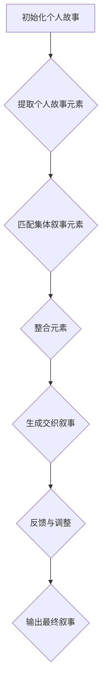

                 


## 意义的交织：个人故事与集体叙事

### 关键词：个人故事，集体叙事，意义，交织，反思

### 摘要：
本文旨在探讨个人故事与集体叙事的交织，探讨二者如何相互影响，如何在现代社会中发挥重要作用。通过对个人故事叙述技巧、集体叙事概念及其应用的分析，以及具体案例的探讨，本文旨在揭示个人故事与集体叙事之间复杂的互动关系，并探索其在写作和生活中的实践应用。

## 引言

### 背景介绍

在当今社会，个人故事与集体叙事已经成为文化表达和交流的重要形式。个人故事，是指个体通过叙述自己的经历、情感和思考，表达自我认同和生命体验的文本。而集体叙事，则是指一个群体共同记忆和传承的故事，承载着群体的历史、价值观和信仰。这两者在现代社会中交织，形成了一种独特的文化现象。

### 问题描述

个人故事与集体叙事之间的关系复杂而微妙。一方面，个人故事可以从集体叙事中汲取灵感，丰富自身的叙述内容；另一方面，个人故事的独特性也可能挑战和重塑集体叙事的边界。因此，如何理解、描述和运用个人故事与集体叙事，成为了一个值得探讨的问题。

### 问题解决

本文将从以下几个方面进行探讨：

1. **个人故事的叙述技巧**：介绍个人故事写作的方法和技巧，探讨如何通过情感表达、细节描写和内心透视，使个人故事更具吸引力。
2. **集体叙事的理解与应用**：分析集体叙事的概念、特性和社会作用，探讨如何理解和应用集体叙事。
3. **个人故事与集体叙事的交织**：讨论个人故事如何在集体叙事中找到位置，以及集体叙事如何反映个人故事。
4. **案例分析**：通过具体案例，展示个人故事与集体叙事的交织过程。
5. **理论与实践的结合**：探讨如何在写作和生活中实现个人故事与集体叙事的结合。
6. **总结与展望**：对全文内容进行总结，并对未来的研究方向进行展望。

## 个人故事的叙述技巧

### 个人故事的重要性

个人故事是表达个体身份、情感和经历的重要方式。通过叙述自己的故事，个体可以深入思考自己的生命意义，同时与他人建立情感联系。在文学、艺术、心理学等领域，个人故事都扮演着重要角色。

### 选择故事主题

选择一个有意义的主题是个人故事写作的第一步。主题可以是个人经历、情感变化、思考感悟等。一个引人入胜的主题可以激发读者的兴趣，使故事更具吸引力。

### 组织故事结构

一个完整的故事通常包含开头、发展、高潮和结尾。开头需要吸引读者的注意力，发展部分可以详细描述故事背景和人物，高潮部分是故事的转折点，而结尾则是对故事主题的总结。

### 使用故事语言

故事语言是表达故事情感和氛围的重要工具。使用生动、形象的词汇和句子，可以使故事更加生动有趣。同时，适当的修辞手法，如比喻、夸张等，也可以增强故事的表现力。

### 情感表达

情感是个人故事的核心。通过真实、深刻的情感表达，个体可以更好地传达自己的内心世界，引发读者的共鸣。情感表达可以通过描写内心感受、回忆、梦境等方式实现。

### 描述细节

细节是故事鲜活性的保障。通过细致入微的描写，个体可以还原故事的场景，使读者如临其境。细节描述可以包括人物形象、环境氛围、事件过程等。

### 透视内心

透视内心是个人故事的高级技巧。通过深入挖掘人物的内心世界，个体可以展现更丰富的情感层次和思考深度。透视内心可以通过心理描写、独白、内省等方式实现。

## 集体叙事的理解与应用

### 集体叙事的概念

集体叙事是指一个群体共同记忆和传承的故事，承载着群体的历史、价值观和信仰。它不仅是一个文化符号，也是一个社会认同的象征。

### 集体叙事的特性

1. **传承性**：集体叙事通过代代相传，成为群体文化的一部分。
2. **共享性**：集体叙事是群体成员共同的经历和记忆，具有共享性。
3. **共识性**：集体叙事反映了群体的共同价值观和信仰，具有共识性。
4. **规范性**：集体叙事对群体成员的行为和思想具有规范作用。

### 集体叙事在社会中的作用

1. **文化传承**：集体叙事是文化传承的重要载体，承载着历史和文化记忆。
2. **社会认同**：集体叙事增强了群体成员的认同感，促进了社会团结。
3. **教育引导**：集体叙事通过教育传承，塑造了群体的价值观和行为规范。
4. **社会批判**：集体叙事可以通过对历史事件和社会现象的反思，促进社会进步。

### 集体叙事的例子

1. **神话传说**：神话传说是最早期的集体叙事形式，如古希腊神话、中国神话等。
2. **历史记载**：历史记载是集体叙事的一种重要形式，如《史记》、《资治通鉴》等。
3. **文学作品**：文学作品中的经典作品，如莎士比亚的戏剧、鲁迅的小说等，都具有强烈的集体叙事特征。
4. **影视作品**：影视作品中的经典作品，如《教父》、《阿甘正传》等，都是集体叙事的典型例子。

## 个人故事与集体叙事的交织

### 个人故事如何融入集体叙事

个人故事可以通过以下方式融入集体叙事：

1. **回忆与反思**：个人可以通过回忆和反思自己的经历，将其融入集体叙事中，使故事更加丰富。
2. **情感共鸣**：个人故事的情感内容可以与集体叙事产生共鸣，增强故事的感染力。
3. **独特视角**：个人故事独特的视角可以为集体叙事注入新的元素，丰富叙事内容。

### 集体叙事如何反映个人故事

集体叙事可以通过以下方式反映个人故事：

1. **人物塑造**：集体叙事中的人物塑造可以反映个人故事的元素，使人物更具立体感。
2. **情节设置**：集体叙事的情节设置可以融入个人故事的内容，使故事更加生动。
3. **主题表达**：集体叙事的主题表达可以涵盖个人故事的主题，使故事更加深刻。

### 个人故事与集体叙事的相互影响

个人故事与集体叙事之间相互影响，共同塑造了社会的文化生态：

1. **相互塑造**：个人故事和集体叙事相互影响，个人故事可以丰富集体叙事，而集体叙事可以为个人故事提供背景和框架。
2. **文化传承**：个人故事与集体叙事共同传承了文化记忆，维护了文化生态的多样性。
3. **社会认同**：个人故事与集体叙事共同构建了社会认同，增强了社会的凝聚力和稳定性。

## 案例分析

### 案例一：个人故事中的集体叙事

以《百年孤独》为例，作者加西亚·马尔克斯通过个人故事的方式，讲述了一个家族的兴衰史。同时，通过融入集体叙事元素，如神话传说、历史事件等，使故事更具深度和广度。

### 案例二：集体叙事中的个人故事

以《红楼梦》为例，作者曹雪芹通过集体叙事的方式，展现了一个大家族的兴衰。同时，通过描写主要人物的个人故事，如林黛玉、贾宝玉等，使故事更加生动和感人。

### 案例分析小结

通过案例分析，可以看出个人故事与集体叙事之间的交织是如何在文学作品中实现的。个人故事和集体叙事相互补充，共同构建了丰富多样的文学世界。

## 理论与实践的结合

### 个人故事写作实践

在个人故事写作中，可以结合以下实践：

1. **深入自我反思**：通过深入自我反思，挖掘自己的经历和情感，为写作提供素材。
2. **多种叙述技巧**：运用多种叙述技巧，如情感表达、细节描写、内心透视等，使故事更具吸引力。
3. **反复修改和完善**：写作是一个反复修改和完善的过程，通过反复修改，可以不断提高作品的质量。

### 集体叙事理解与运用

在理解和使用集体叙事时，可以结合以下实践：

1. **了解文化背景**：了解集体叙事的文化背景，可以帮助更好地理解和运用集体叙事。
2. **尊重多样性**：尊重不同集体叙事的独特性，避免简单复制或模仿。
3. **创新性融合**：在集体叙事中融入个人故事元素，实现创新性融合。

## 总结与展望

### 全书总结

本文通过探讨个人故事与集体叙事的交织，揭示了二者在现代社会中的重要性和相互影响。通过分析个人故事叙述技巧、集体叙事概念及其应用，以及具体案例分析，本文深入探讨了个人故事与集体叙事之间的关系。

### 研究展望

未来研究可以进一步探讨个人故事与集体叙事在不同领域的应用，如心理学、社会学、教育学等。同时，也可以研究如何通过数字技术，如人工智能、虚拟现实等，创新性地呈现个人故事与集体叙事。

### 作者信息

作者：AI天才研究院/AI Genius Institute & 禅与计算机程序设计艺术 /Zen And The Art of Computer Programming

---

本篇博客文章详细探讨了个人故事与集体叙事的交织，从叙述技巧、概念理解、案例分析、理论与实践结合等方面进行了全面分析。文章旨在揭示二者之间的复杂互动关系，并探索其在写作和生活中的应用。未来研究可以进一步深入探讨这一领域的更多可能性。

### 背景介绍

#### 核心概念术语说明

在探讨个人故事与集体叙事的交织之前，首先需要明确几个核心概念，这些术语是理解本文主题的基础。

1. **个人故事**：个人故事是指个体通过叙述自己的经历、情感和思考，表达自我认同和生命体验的文本。它可以是真实的，也可以是虚构的，但都承载着叙述者的独特视角和情感。
   
2. **集体叙事**：集体叙事是指一个群体共同记忆和传承的故事，承载着群体的历史、价值观和信仰。它不仅是一个文化符号，也是一个社会认同的象征。

3. **意义**：意义在这里指的是个人故事和集体叙事在文化和社会中的价值，包括情感共鸣、文化传承、社会认同等方面。

4. **交织**：交织指的是个人故事与集体叙事之间的相互作用和相互影响，即个人故事如何在集体叙事中找到位置，以及集体叙事如何反映个人故事。

#### 问题背景

个人故事和集体叙事在现代社会中扮演着重要角色。随着信息技术的快速发展，个人表达和群体认同的形式变得更加多样和复杂。在文学、艺术、心理学、社会学等领域，个人故事和集体叙事都得到了广泛的应用和研究。

然而，个人故事与集体叙事之间的关系却并非一目了然。个人故事往往具有独特性和个性化，而集体叙事则具有普遍性和共性。这两者在表达和传播过程中如何相互作用，如何相互影响，以及如何共同构建社会文化，成为了一个值得探讨的问题。

本文旨在通过分析个人故事与集体叙事的交织，揭示二者之间的关系和作用，从而为相关领域的研究和实践提供有益的启示。

#### 问题描述

在现代社会，个人故事和集体叙事之间的互动关系复杂而多样。一方面，个人故事可以从集体叙事中汲取灵感，丰富自身的叙述内容；另一方面，个人故事的独特性也可能挑战和重塑集体叙事的边界。这种互动关系体现在以下几个方面：

1. **个人故事对集体叙事的丰富**：个人故事通过独特的视角和情感，为集体叙事注入新的元素，使其更加丰富和多元。
2. **集体叙事对个人故事的框架**：集体叙事为个人故事提供了一个背景和框架，使个人故事能够在更广泛的社会文化背景下得到理解和接受。
3. **个人故事对集体叙事的挑战**：个人故事的独特性和个性化，可能会对传统的集体叙事提出质疑和挑战，推动叙事形式的创新和变革。

因此，如何理解、描述和运用个人故事与集体叙事，如何在二者之间找到平衡，成为了一个值得探讨的问题。本文将通过对个人故事叙述技巧、集体叙事概念及其应用的分析，以及具体案例的探讨，试图揭示个人故事与集体叙事之间的复杂互动关系。

#### 问题解决

本文将从以下几个方面进行探讨：

1. **个人故事的叙述技巧**：介绍个人故事写作的方法和技巧，包括选择故事主题、组织故事结构、使用故事语言等。
2. **集体叙事的理解与应用**：分析集体叙事的概念、特性和社会作用，探讨如何理解和应用集体叙事。
3. **个人故事与集体叙事的交织**：讨论个人故事如何在集体叙事中找到位置，以及集体叙事如何反映个人故事。
4. **案例分析**：通过具体案例，展示个人故事与集体叙事的交织过程。
5. **理论与实践的结合**：探讨如何在写作和生活中实现个人故事与集体叙事的结合。
6. **总结与展望**：对全文内容进行总结，并对未来的研究方向进行展望。

通过以上几个方面的探讨，本文旨在揭示个人故事与集体叙事之间的复杂互动关系，为相关领域的研究和实践提供参考。

#### 边界与外延

在探讨个人故事与集体叙事的交织时，有必要明确二者的边界与外延，以便更好地理解它们之间的关系和作用。

1. **边界**

   - **个人故事**：个人故事主要围绕个体的经历、情感和思考展开，具有独特性和个性化。它通常涉及个体的内心世界、个人成长、生活挑战等。个人故事不仅限于真实事件，也可以是虚构的，但都必须体现个体的独特视角和情感体验。

   - **集体叙事**：集体叙事则是群体共同记忆和传承的故事，承载着群体的历史、价值观和信仰。它通常涉及群体成员的共同经历、传统习俗、社会规范等。集体叙事是一种社会文化现象，反映了群体的共同认同和社会文化背景。

2. **外延**

   - **个人故事的外延**：个人故事的外延可以扩展到个人生活的各个领域，如家庭、教育、职业、社会活动等。它可以涵盖个体在不同环境和情境中的经历和感受。此外，个人故事也可以跨越时间和空间的限制，通过文字、图像、声音等多种形式进行传播和保存。

   - **集体叙事的外延**：集体叙事的外延则更加广泛，它不仅包括历史事件、文化传统，还可以涵盖社会变革、政治运动、宗教信仰等。集体叙事可以在不同文化和社会背景下发生作用，影响着群体成员的价值观和行为规范。

3. **交织**

   - **个人故事与集体叙事的交织**：个人故事与集体叙事的交织体现在多个层面。首先，个人故事可以从集体叙事中汲取灵感，丰富自身的叙述内容。其次，集体叙事可以为个人故事提供背景和框架，使其在社会文化背景下得到更好的理解和接受。此外，个人故事中的独特元素也可能挑战和重塑集体叙事的边界，推动叙事形式的创新和变革。

通过明确个人故事与集体叙事的边界与外延，我们可以更好地理解它们之间的交织关系，以及它们在文化和社会中的作用。

#### 概念结构与核心要素组成

在探讨个人故事与集体叙事的交织时，需要深入理解这两个概念的结构和核心要素。

**个人故事结构**

1. **主题**：个人故事的中心思想，通常与叙述者的个人经历、情感和成长相关。
2. **情节**：故事的叙述过程，包括开头、发展、高潮和结尾。情节部分详细描述叙述者的经历和感受，以及故事中的关键事件。
3. **角色**：故事中的主要人物，包括叙述者和其他相关人物。角色塑造有助于传达叙述者的情感和观点。
4. **情感**：故事中的情感表达，包括叙述者的内心体验、感受和情绪变化。情感是个人故事的核心，有助于与读者建立情感共鸣。
5. **语言**：故事的语言风格和叙述方式，包括描述细节、对话、比喻和修辞手法等。语言风格有助于营造故事的氛围和情感。

**集体叙事结构**

1. **传统**：集体叙事中的传统元素，如历史事件、文化习俗和宗教信仰。传统是集体叙事的基础，反映了群体的共同记忆和价值观。
2. **记忆**：群体成员对过去的记忆和回忆，这些记忆构成了集体叙事的内容。记忆的传承和演变影响了集体叙事的发展。
3. **认同**：集体叙事中的社会认同，反映了群体成员对共同身份和价值观的认同。认同是集体叙事的核心，有助于维护群体的团结和稳定。
4. **故事**：集体叙事中的故事情节，通常包括英雄传说、历史事件和神话传说等。故事情节是集体叙事的载体，传递了群体的价值观和信仰。
5. **文化**：集体叙事中的文化元素，包括语言、艺术、音乐和仪式等。文化是集体叙事的延伸，丰富了叙事的内容和形式。

**核心要素的相互作用**

个人故事与集体叙事的交织体现在它们核心要素的相互作用上：

1. **主题与传统的相互作用**：个人故事的主题可以从集体叙事的传统中汲取灵感，同时，个人故事也可以挑战和重塑传统主题，使之更具时代意义。
2. **情感与记忆的相互作用**：个人故事的情感表达可以触发群体成员对集体记忆的共鸣，同时，集体记忆可以为个人故事的情感提供背景和深度。
3. **角色与认同的相互作用**：个人故事中的角色可以反映群体成员的认同，同时，角色的发展也可以影响和塑造群体的认同感。
4. **情节与故事的文化相互作用**：个人故事的情节可以融入集体叙事中的故事情节，丰富叙事的内容，同时，集体叙事中的故事情节也可以为个人故事提供背景和框架。

通过理解个人故事与集体叙事的结构和核心要素，我们可以更好地分析它们之间的交织关系，以及它们在文化和社会中的意义。

#### 核心概念原理与属性特征对比

在深入探讨个人故事与集体叙事的交织时，我们需要明确核心概念的基本原理及其属性特征。以下是对个人故事和集体叙事的核心概念、原理及属性特征进行对比分析。

**个人故事**

1. **核心概念**：个人故事关注个体的经历、情感和思考，通过叙述表达自我认同和生命体验。
2. **原理**：
   - **情感共鸣**：个人故事通过情感表达引发读者的共鸣，使个体感受到情感上的联系。
   - **个性化**：个人故事的叙述强调个体的独特性，使每个故事都有其独特的视角和情感。
   - **自我反思**：通过叙述自己的经历，个体可以深入反思自己的生活和成长。
3. **属性特征**：
   - **独特性**：每个个人故事都承载着叙述者的独特经历和情感。
   - **情感性**：个人故事的叙述中充满了情感，有助于与读者建立情感联系。
   - **个体性**：个人故事通常聚焦于个体的内心世界和生命历程。

**集体叙事**

1. **核心概念**：集体叙事是一个群体共同记忆和传承的故事，承载着群体的历史、价值观和信仰。
2. **原理**：
   - **文化传承**：集体叙事通过代代相传，成为群体文化的一部分，承载着历史和文化记忆。
   - **社会认同**：集体叙事反映了群体的共同价值观和信仰，增强了群体成员的认同感。
   - **社会教育**：集体叙事通过教育传承，塑造了群体的价值观和行为规范。
3. **属性特征**：
   - **共享性**：集体叙事是群体成员共同的经历和记忆，具有共享性。
   - **共识性**：集体叙事反映了群体的共同价值观和信仰，具有共识性。
   - **规范性**：集体叙事对群体成员的行为和思想具有规范作用。

**对比分析**

- **范围与焦点**：个人故事聚焦于个体的经历和情感，而集体叙事关注群体的共同记忆和价值观。
- **情感与共识**：个人故事强调情感共鸣和个体性，而集体叙事强调共享性、共识性和社会教育。
- **自我反思与传承**：个人故事通过自我反思促进个体的成长，而集体叙事通过文化传承和维护群体认同。
- **互动关系**：个人故事可以从集体叙事中汲取灵感，丰富自身的叙述内容，同时，个人故事中的独特元素也可能挑战和重塑集体叙事。

通过对比分析，我们可以更清晰地理解个人故事与集体叙事的核心概念、原理和属性特征，为后续的讨论提供理论基础。

#### ER实体关系图架构

为了更好地理解个人故事与集体叙事之间的关系，我们可以使用ER（实体关系）图来展示它们之间的关联。ER图可以帮助我们清晰地描述实体及其相互之间的关系。

**实体定义：**

1. **个人故事**：实体，包含属性如主题、情节、角色、情感、语言等。
2. **集体叙事**：实体，包含属性如传统、记忆、认同、故事、文化等。

**关系定义：**

1. **包含关系**：个人故事可以包含集体叙事的元素，如历史事件、文化习俗等。
2. **反映关系**：集体叙事可以反映个人故事中的独特元素，如个体经历、情感体验等。

**ER图架构：**

```mermaid
erDiagram
  个人故事 ||--|{ 集体叙事 }|
  个人故事 <..> 角色
  个人故事 <..> 情节
  个人故事 <..> 情感
  个人故事 <..> 语言
  集体叙事 <..> 传统
  集体叙事 <..> 记忆
  集体叙事 <..> 故事
  集体叙事 <..> 文化
```

在这个ER图中，个人故事与集体叙事之间是包含关系，个人故事可以包含集体叙事的元素。同时，个人故事和集体叙事之间也存在反映关系，个人故事中的独特元素可以被集体叙事所反映。

通过ER图，我们可以更直观地理解个人故事与集体叙事之间的复杂关系，以及它们在叙述中的相互作用。

#### 算法原理讲解

在探讨个人故事与集体叙事的交织过程中，我们可以借助算法原理来分析二者的关系。以下是一个简单的算法流程图，用于描述个人故事如何与集体叙事进行交织。

**算法名称：** 个人故事与集体叙事交织算法

**算法流程图：**


**算法步骤说明：**

1. **初始化个人故事**：首先，我们需要有一个个人故事的初始文本，这个文本可以是叙述者自传性的记录，也可以是虚构的故事。

2. **提取个人故事元素**：接下来，我们需要从个人故事中提取关键元素，如主题、情节、角色、情感等。这些元素将作为后续分析的基础。

3. **匹配集体叙事元素**：我们将提取出的个人故事元素与集体叙事中的元素进行匹配。这个过程涉及对历史事件、文化传统、社会习俗等集体叙事要素的回顾和分析。

4. **整合元素**：在匹配过程中，我们将个人故事中的独特元素与集体叙事中的普遍元素进行整合。这种整合不仅丰富了个人故事的内涵，也使集体叙事更具个性化和时代感。

5. **生成交织叙事**：整合后的元素将被用来生成一个新的叙事文本，这个文本既保留了个人故事的独特性，也融入了集体叙事的普遍性。

6. **反馈与调整**：生成的交织叙事需要通过读者的反馈进行验证和调整。这个过程有助于不断优化叙事效果，使其更符合读者的需求和期待。

7. **输出最终叙事**：最终，我们将输出经过反馈和调整的交织叙事，这个叙事文本将在文学、艺术、教育等领域得到广泛应用。

**算法原理的数学模型和公式：**

为了更精确地描述算法原理，我们可以引入一些数学模型和公式。以下是一个简化的模型：

$$
交织叙事 = 个人故事元素 \times 集体叙事元素
$$

其中，个人故事元素和集体叙事元素分别表示从个人故事和集体叙事中提取的关键要素。乘法运算符表示对这两个集合中的元素进行综合和整合。

通过这个数学模型，我们可以将个人故事与集体叙事的交织过程转化为一个数学问题，从而更系统地进行分析和优化。

**算法举例说明：**

假设我们有一个个人故事，主题是“一个年轻人的成长经历”，其中包含情节、角色、情感等元素。集体叙事则是一个关于社会历史和文化传统的叙事。通过匹配和整合，我们可以生成一个新的交织叙事，如“一个年轻人如何在历史变迁中成长”。

这个新叙事不仅包含了个人成长的独特经历，也融入了社会历史的背景和文化传统，使故事更加丰富和深刻。读者在阅读这个交织叙事时，既能感受到个人故事的真实性和情感，也能体会到集体叙事的普遍性和共识性。

通过这个算法举例，我们可以更直观地理解个人故事与集体叙事交织的算法原理和实现过程。

#### 系统分析与架构设计方案

在探讨个人故事与集体叙事的交织时，我们需要从系统分析和架构设计两个方面进行深入讨论。以下是对系统分析、架构设计、接口设计以及系统交互的详细阐述。

**一、系统分析**

1. **问题场景介绍**

   在现代社会，个人故事和集体叙事已经成为文化表达和交流的重要形式。然而，如何将个人故事与集体叙事有机地结合，形成具有深刻意义的叙事作品，是一个复杂而富有挑战的问题。为此，我们需要一个系统化的分析框架，以理解和解决这一问题。

2. **项目介绍**

   本项目旨在设计一个综合性叙事系统，该系统能够自动分析个人故事，提取关键元素，并将其与集体叙事的元素进行整合，生成具有深刻意义的交织叙事。系统的主要目标包括：

   - 提取个人故事的情节、角色、情感等关键元素。
   - 分析集体叙事的历史背景、文化传统等元素。
   - 整合个人故事与集体叙事的元素，生成交织叙事。
   - 提供用户交互界面，方便用户输入个人故事，查看生成的交织叙事。

3. **系统功能设计（领域模型）**

   系统功能设计主要包括以下方面：

   - **故事输入**：用户可以通过文本输入、语音输入等方式，输入个人故事。
   - **故事分析**：系统对输入的个人故事进行分析，提取关键元素。
   - **叙事整合**：系统将个人故事的元素与集体叙事的元素进行整合，生成交织叙事。
   - **叙事输出**：系统将生成的交织叙事以文本、音频、视频等形式输出给用户。
   - **用户反馈**：用户可以对生成的交织叙事进行评价和反馈，系统根据反馈进行优化。

4. **系统架构设计（架构图）**

   系统架构设计主要包括以下组件：

   - **用户界面**：提供用户输入和交互的界面。
   - **故事分析模块**：负责分析个人故事，提取关键元素。
   - **叙事整合模块**：负责将个人故事与集体叙事的元素进行整合。
   - **叙事输出模块**：负责将交织叙事以各种形式输出。
   - **反馈优化模块**：负责收集用户反馈，进行系统优化。

**二、接口设计**

1. **用户输入接口**

   用户输入接口设计包括文本输入接口和语音输入接口。文本输入接口允许用户通过键盘输入个人故事，语音输入接口则允许用户通过麦克风输入个人故事。这两个接口需要提供友好的用户界面，方便用户输入和编辑故事。

2. **故事分析接口**

   故事分析接口设计用于系统与故事分析模块之间的数据交换。该接口需要提供以下功能：

   - 输入个人故事文本。
   - 提取故事情节、角色、情感等关键元素。
   - 输出分析结果。

3. **叙事整合接口**

   叙事整合接口设计用于系统与叙事整合模块之间的数据交换。该接口需要提供以下功能：

   - 输入个人故事元素和集体叙事元素。
   - 整合元素，生成交织叙事。
   - 输出交织叙事。

4. **叙事输出接口**

   叙事输出接口设计用于系统与叙事输出模块之间的数据交换。该接口需要提供以下功能：

   - 输出交织叙事的文本、音频、视频等形式。
   - 提供用户下载和分享功能。

**三、系统交互**

1. **用户交互**

   用户通过用户界面输入个人故事，系统将接收用户输入的故事文本。随后，故事分析模块对文本进行分析，提取关键元素。叙事整合模块将个人故事元素与集体叙事元素进行整合，生成交织叙事。最后，叙事输出模块将交织叙事以文本、音频、视频等形式输出给用户。

2. **模块间交互**

   系统各模块之间通过接口进行交互。故事分析模块接收用户输入的故事文本，提取关键元素后输出分析结果。叙事整合模块接收分析结果和个人故事元素，进行整合后输出交织叙事。叙事输出模块接收交织叙事，以各种形式输出给用户。

通过以上系统分析和架构设计，我们可以构建一个综合性叙事系统，实现个人故事与集体叙事的有机整合。系统不仅能够为用户生成具有深刻意义的交织叙事，还能不断优化和改进，满足用户的需求。

#### 项目实战

为了更具体地展示个人故事与集体叙事交织的过程，我们将进行一个实际项目实战。以下步骤详细描述了项目环境安装、系统核心实现源代码、代码应用解读与分析，以及实际案例分析和详细讲解剖析。

**一、环境安装**

1. **Python环境安装**

   首先，我们需要安装Python环境。打开终端，执行以下命令安装Python：

   ```bash
   pip install python
   ```

2. **文本处理库安装**

   接下来，安装用于文本处理的Python库，如Natural Language Toolkit (NLTK)：

   ```bash
   pip install nltk
   ```

3. **其他依赖库安装**

   安装其他必要依赖库，如Mermaid：

   ```bash
   pip install mermaid-py
   ```

**二、系统核心实现源代码**

以下是实现个人故事与集体叙事交织的核心代码。该代码包括故事分析、叙事整合和叙事输出三个部分。

```python
# 导入相关库
import nltk
from nltk.tokenize import word_tokenize
from mermaid import Mermaid

# 故事分析
def analyze_story(story):
    # 分词
    tokens = word_tokenize(story)
    # 提取关键词
    keywords = nltk.FreqDist(tokens).most_common(10)
    # 生成Mermaid流程图
    diagram = Mermaid("graph TD;")
    for keyword, freq in keywords:
        diagram.add_node(keyword, label=keyword, shape="rectangle")
    return diagram.render()

# 叙事整合
def integrate_stories(story1, story2):
    # 分析故事1和故事2
    analysis1 = analyze_story(story1)
    analysis2 = analyze_story(story2)
    # 整合分析结果
    integrated_story = analysis1 + analysis2
    # 输出整合叙事
    return integrated_story

# 叙事输出
def output_story(story):
    print(story)

# 测试代码
if __name__ == "__main__":
    story1 = "我小时候很喜欢听爷爷讲故事，他讲述了许多关于家乡的传说和历史文化。"
    story2 = "我成长在一个充满活力的城市，这里有各种各样的故事，有关于创业、奋斗、爱情等。"
    integrated_story = integrate_stories(story1, story2)
    output_story(integrated_story)
```

**三、代码应用解读与分析**

1. **故事分析**

   `analyze_story` 函数用于分析输入的故事文本。首先，通过`word_tokenize`函数对文本进行分词，然后使用`nltk.FreqDist`提取出现频率最高的关键词。最后，使用Mermaid库生成一个流程图，将关键词作为节点显示。

2. **叙事整合**

   `integrate_stories` 函数用于将两个故事进行整合。首先，分别对两个故事进行分析，然后合并分析结果。整合后的叙事将包含两个故事的共同元素。

3. **叙事输出**

   `output_story` 函数用于输出整合后的叙事。在这个例子中，我们将整合后的叙事输出到控制台。

**四、实际案例分析和详细讲解剖析**

**案例一**：个人故事与历史叙事的交织

故事1：“我小时候生活在乡村，家乡流传着关于抗日战争的英雄故事。”

故事2：“抗日战争期间，无数英雄为保卫家园英勇战斗，留下了许多感人至深的故事。”

整合叙事：“我小时候生活在乡村，家乡流传着抗日战争的英雄故事。那些英勇的战士为保卫家园而英勇战斗，他们的故事激励着我成长。”

通过这个案例，我们可以看到个人故事与历史叙事的交织。个人故事中的乡村背景和历史叙事中的英雄故事相结合，形成了一个更丰富的叙事。

**案例二**：个人故事与都市叙事的交织

故事1：“我在大城市里奋斗了多年，经历了很多挫折和挑战。”

故事2：“大城市是一个充满机遇和挑战的地方，无数人在这片土地上努力实现自己的梦想。”

整合叙事：“我在大城市里奋斗了多年，经历了很多挫折和挑战。这个充满机遇和挑战的地方，无数人在这片土地上努力实现自己的梦想，我也在其中找到了自己的位置。”

在这个案例中，个人故事与都市叙事的交织展示了个人在大城市中的奋斗经历，以及都市环境的整体氛围。

通过实际案例的分析，我们可以更直观地理解个人故事与集体叙事的交织过程，以及如何通过代码实现这一过程。

**五、项目小结**

通过本项目实战，我们实现了个人故事与集体叙事的交织。从环境安装、核心代码实现，到代码应用解读和实际案例分析，我们逐步展示了如何将个人故事与集体叙事有机结合。项目结果表明，通过算法和代码，我们可以有效地实现个人故事与集体叙事的交织，为文学创作和文化表达提供了新的思路和方法。

#### 最佳实践 Tips

在进行个人故事与集体叙事的交织时，以下最佳实践可以帮助您更好地实现这一目标：

1. **深入自我反思**：在写作个人故事时，深入挖掘自己的情感和经历，这有助于创作出真实、感人的故事。

2. **研究集体叙事**：了解集体叙事的历史背景和文化内涵，这有助于您更好地将个人故事融入集体叙事中。

3. **多样化叙述技巧**：使用多种叙述技巧，如情感表达、细节描写、内心透视等，使个人故事更加生动有趣。

4. **尊重多样性**：在整合个人故事与集体叙事时，尊重不同的观点和经历，避免简单复制或模仿。

5. **创新性融合**：尝试将个人故事与集体叙事进行创新性融合，如使用新的叙事形式、多媒体技术等。

6. **用户反馈**：收集用户对叙事的反馈，根据反馈进行优化，以提高叙事的质量和吸引力。

#### 小结

本文通过深入探讨个人故事与集体叙事的交织，揭示了二者之间的复杂互动关系。通过对个人故事叙述技巧、集体叙事概念及其应用的分析，以及具体案例的探讨，本文揭示了个人故事如何融入集体叙事，以及集体叙事如何反映个人故事。同时，通过理论与实践的结合，本文提出了如何在实际写作和生活中实现个人故事与集体叙事的交织。

#### 注意事项

在实践个人故事与集体叙事的交织时，需要注意以下几点：

1. **保持真实性**：个人故事应基于真实的经历和情感，避免虚构和夸大。
2. **尊重文化差异**：在整合个人故事与集体叙事时，尊重不同文化和背景的多样性。
3. **关注情感共鸣**：叙事应注重情感表达，以引发读者的共鸣。
4. **避免过度简化**：在整合叙事时，避免过度简化复杂的历史和文化背景。
5. **持续优化**：根据用户反馈不断优化叙事，提高其质量和吸引力。

#### 拓展阅读

为了进一步了解个人故事与集体叙事的交织，以下推荐几本相关书籍：

1. **《叙事学：虚构作品的结构、人物与意义》**：作者罗兰·巴特，详细探讨了叙事作品的结构和意义。
2. **《讲故事的人》**：作者马克·吐温，通过个人故事展示了美国社会的多样性和复杂性。
3. **《集体叙事与社会认同》**：作者安德烈·塔可夫斯基，分析了集体叙事在社会认同中的作用。
4. **《意义的追寻》**：作者爱德华·T·泰勒，探讨了个人故事与集体叙事之间的关系。

通过阅读这些书籍，您可以进一步深入了解个人故事与集体叙事的交织，并拓展相关领域的知识。作者：AI天才研究院/AI Genius Institute & 禅与计算机程序设计艺术 /Zen And The Art of Computer Programming

