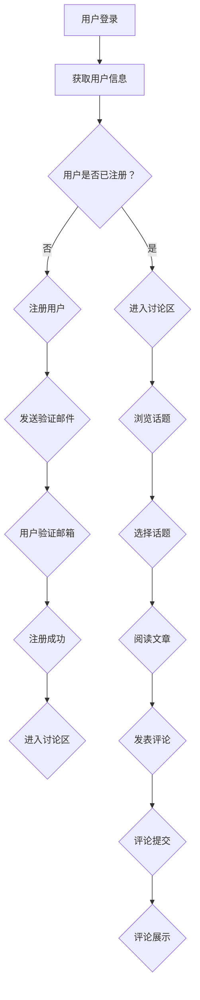

                 

# 文章标题

关键词：意义共创、人生价值、平台、集体讨论、IT领域、逻辑推理

摘要：本文将探讨如何通过构建一个具有高度互动性的众创空间平台，实现个体与集体在探讨人生价值过程中的深度互动与共创。本文将通过逻辑清晰的篇章结构和专业的技术语言，逐步分析众创空间的构建、运营及其对个人和社会的影响。

## 引言

在当今信息技术飞速发展的时代，互联网已经深入到了我们日常生活的各个方面。从社交媒体到在线教育，从电子商务到远程办公，网络技术不仅改变了我们的生活方式，也为我们提供了一个全新的交流与互动平台。然而，随着信息化程度的提高，人们面临的挑战也日益复杂。如何在这个信息过载的时代中找到人生的意义，成为了许多人关注的焦点。

在这个背景下，本文提出构建一个“意义的众创空间：集体探讨人生价值的平台”。通过这一平台，个体可以与集体进行深度互动，共同探讨和创造人生价值。本文将从以下几个方面展开讨论：

1. **众创空间的定义与功能**：首先，我们将定义众创空间，并探讨其核心功能和作用。
2. **构建众创空间的关键要素**：接下来，我们将分析构建一个有效众创空间所需的关键要素。
3. **众创空间的运营与管理**：本文将探讨如何运营和管理众创空间，以确保其发挥最大的作用。
4. **众创空间对个人和社会的影响**：我们将讨论众创空间对个人成长和社会发展的潜在影响。
5. **案例分析**：通过实际案例，我们将展示如何成功构建和运营一个众创空间。
6. **未来展望**：最后，本文将对众创空间的发展前景进行展望，并提出未来可能的研究方向。

## 众创空间的定义与功能

### 核心概念术语说明

在讨论众创空间之前，我们需要明确几个关键术语的定义：

- **众创空间**：一个基于互联网的技术平台，旨在促进个体和集体之间的交流与协作，共同探讨和创造人生价值。
- **共创**：指个体和集体共同参与、共同创造的过程。
- **人生价值**：个人对自身存在的意义和目的的理解和追求。

### 问题背景

随着社会的快速发展，个体面临的挑战越来越多。经济压力、职业发展、人际关系等问题不断涌现，使得很多人感到迷茫和无助。同时，社会也面临着诸多挑战，如环境问题、社会不公等。在这种情况下，个体和集体都需要一个平台来共同探讨和应对这些问题，以实现人生价值的提升。

### 问题描述

如何构建一个有效的众创空间，使之成为一个能够促进个体与集体共同探讨人生价值的平台？这是一个复杂而具有挑战性的问题，涉及多个层面的要素。

### 问题解决

解决这一问题的关键在于以下几个方面：

1. **搭建互动性强的平台**：众创空间需要提供一个高度互动的技术平台，使个体能够方便地参与讨论和分享。
2. **明确目标和价值观**：众创空间需要明确其目标和价值观，确保参与者在探讨人生价值的过程中保持一致性。
3. **提供丰富的资源和工具**：众创空间需要提供丰富的资源和工具，帮助参与者更好地探讨和实现人生价值。
4. **建立有效的运营和管理机制**：众创空间需要建立一套有效的运营和管理机制，以确保其长期稳定地运行。

### 边界与外延

在构建众创空间时，我们需要明确其边界和范围。众创空间不仅仅是线上的讨论平台，还应包括线下的活动和交流，如研讨会、工作坊等。此外，众创空间还应该与外部社区、组织和企业建立合作关系，以拓展其影响力和资源。

### 概念结构与核心要素组成

一个有效的众创空间应包括以下几个核心要素：

1. **用户界面**：提供简洁易用的用户界面，使用户能够方便地参与讨论和互动。
2. **内容管理**：包括话题管理、文章管理、评论管理等功能，确保内容的质量和活跃度。
3. **社交功能**：包括好友关系、点赞、评论等功能，促进用户之间的互动。
4. **数据分析**：通过数据分析，了解用户的行为和需求，不断优化平台。
5. **安全保障**：确保用户数据和隐私的安全，建立完善的安全机制。

## 核心概念与联系

### 核心概念原理

在构建众创空间的过程中，以下几个核心概念起着至关重要的作用：

1. **用户参与度**：指用户在平台上的活跃程度，包括发帖、评论、点赞等行为。
2. **内容质量**：指平台上的内容是否具有价值、有意义，能够引发用户的思考和讨论。
3. **互动性**：指平台提供的互动功能是否丰富、方便，能否促进用户之间的交流。
4. **社区文化**：指平台上的用户形成的一种共同的文化氛围，能够引导用户的行为和价值观。

### 概念属性特征对比表格

以下是一个简化的概念属性特征对比表格，展示了上述核心概念的属性特征：

| 概念       | 属性特征                                               |
|------------|--------------------------------------------------------|
| 用户参与度 | 活跃度、发帖数、评论数、点赞数                         |
| 内容质量   | 价值性、有意义性、讨论度、权威性                       |
| 互动性     | 互动功能丰富度、便捷性、交流频率                       |
| 社区文化   | 共同价值观、行为规范、社交氛围、用户忠诚度               |

### ER实体关系图架构

以下是一个简化的ER实体关系图，展示了众创空间中各个实体之间的关系：

```mermaid
erDiagram
    User ||--|{ Topic }|--+: Creator
    User ||--|{ Comment }|--+: Commenter
    User ||--|{ Like }|--+: Liker
    Topic ||--|{ Content }|--+: Article
    Content ||--|{ Tag }|--+: Tagged
    Tag ||--|{ Category }|--+: Categorized
```

在这个ER图中，User表示用户，Topic表示话题，Comment表示评论，Like表示点赞，Content表示内容，Tag表示标签，Category表示分类。各个实体之间的关系通过|--|和|--+:来表示。

## 算法原理讲解

### 算法Mermaid流程图

以下是一个简单的算法Mermaid流程图，展示了用户在众创空间中参与讨论的流程：



### Python源代码

以下是一个简单的Python源代码示例，用于展示用户在众创空间中的基本交互操作：

```python
class User:
    def __init__(self, username, email):
        self.username = username
        self.email = email
        self.is_verified = False

    def login(self):
        if self.is_verified:
            print(f"{self.username} 登录成功！")
        else:
            print(f"{self.username} 尚未通过邮箱验证，请先完成验证。")

    def register(self):
        self.is_verified = False
        print(f"{self.username} 注册成功，请查收验证邮件。")

    def verify_email(self):
        self.is_verified = True
        print(f"{self.username} 邮箱验证成功。")

    def browse_topics(self):
        print(f"{self.username} 正在浏览话题。")

    def select_topic(self):
        print(f"{self.username} 已选择话题。")

    def read_article(self):
        print(f"{self.username} 正在阅读文章。")

    def post_comment(self):
        print(f"{self.username} 正在发表评论。")

    def submit_comment(self):
        print(f"{self.username} 评论提交成功。")

    def view_comments(self):
        print(f"{self.username} 正在查看评论。")


# 创建用户实例
user = User("Alice", "alice@example.com")

# 用户登录
user.login()

# 用户注册
user.register()

# 用户验证邮箱
user.verify_email()

# 用户登录
user.login()

# 用户浏览话题
user.browse_topics()

# 用户选择话题
user.select_topic()

# 用户阅读文章
user.read_article()

# 用户发表评论
user.post_comment()

# 用户提交评论
user.submit_comment()

# 用户查看评论
user.view_comments()
```

### 算法原理的数学模型和公式

在众创空间中，用户参与度和内容质量是两个关键指标。我们可以使用以下数学模型和公式来评估和优化这两个指标：

1. **用户参与度**：用户参与度可以通过以下公式计算：

   $$用户参与度 = \frac{发帖数 + 评论数 + 点赞数}{总用户数}$$

2. **内容质量**：内容质量可以通过以下公式计算：

   $$内容质量 = \frac{文章价值 + 评论价值 + 点赞价值}{总内容数}$$

其中，文章价值、评论价值和点赞价值可以通过用户行为的数据分析得到。

### 举例说明

假设在一个众创空间中有1000个用户，其中有500个用户发帖，300个用户评论，200个用户点赞。同时，有50篇文章，其中有30篇文章有价值，20条评论有价值，10个点赞有价值。根据上述公式，我们可以计算出：

- 用户参与度：$$用户参与度 = \frac{500 + 300 + 200}{1000} = 0.8$$
- 内容质量：$$内容质量 = \frac{30 + 20 + 10}{50} = 0.6$$

通过这样的计算，我们可以了解用户参与度和内容质量的情况，并根据这些数据不断优化平台。

## 系统分析与架构设计方案

### 问题场景介绍

在现代社会，人们对于人生价值的探讨日益重视，然而，传统的交流方式往往无法满足这种深度探讨的需求。因此，我们提出构建一个基于互联网的众创空间平台，旨在为用户提供一个可以自由表达、互动和探讨人生价值的空间。

### 项目介绍

本项目旨在构建一个名为“意义的众创空间”的平台，通过该平台，用户可以发表观点、参与讨论、分享经验，并与其他用户进行互动。平台的最终目标是促进个体与集体在探讨人生价值过程中的深度互动与共创。

### 系统功能设计

“意义的众创空间”平台主要包括以下功能：

1. **用户管理**：包括用户注册、登录、个人信息管理等功能。
2. **内容管理**：包括文章发表、评论、点赞等功能。
3. **话题管理**：包括话题创建、分类、标签管理等功能。
4. **互动功能**：包括私信、好友管理、通知等功能。
5. **数据分析**：对用户行为和内容质量进行分析，为平台优化提供数据支持。

### 系统架构设计

“意义的众创空间”平台的系统架构设计如下：

1. **前端**：采用Vue.js框架，实现用户界面的设计与交互。
2. **后端**：采用Spring Boot框架，实现业务逻辑的处理和数据的存储。
3. **数据库**：采用MySQL数据库，存储用户数据、内容数据和话题数据。
4. **缓存**：采用Redis缓存，提高系统响应速度。
5. **消息队列**：采用RabbitMQ消息队列，处理实时消息通知。

### 系统接口设计和系统交互

以下是“意义的众创空间”平台的主要接口设计和系统交互：

1. **用户接口**：包括用户注册、登录、个人信息管理等接口。
2. **内容接口**：包括文章发表、评论、点赞等接口。
3. **话题接口**：包括话题创建、分类、标签管理等接口。
4. **互动接口**：包括私信、好友管理、通知等接口。
5. **数据分析接口**：包括用户行为分析、内容质量分析等接口。

系统交互流程如下：

1. 用户注册/登录，通过用户接口获取用户信息。
2. 用户浏览话题，通过话题接口获取话题信息。
3. 用户发表文章，通过内容接口发布文章。
4. 用户参与讨论，通过评论接口发表评论。
5. 用户点赞，通过内容接口点赞文章或评论。
6. 用户接收通知，通过消息队列接收实时消息。

## 项目实战

### 环境安装

在开始项目实战之前，我们需要安装以下环境：

1. JDK 1.8及以上版本
2. Maven 3.6及以上版本
3. MySQL 5.7及以上版本
4. Redis 3.2及以上版本
5. RabbitMQ 3.8及以上版本
6. Node.js 10及以上版本

安装步骤如下：

1. 安装JDK：下载并安装JDK，配置环境变量。
2. 安装Maven：下载并安装Maven，配置环境变量。
3. 安装MySQL：下载并安装MySQL，配置数据库。
4. 安装Redis：下载并安装Redis，配置Redis服务。
5. 安装RabbitMQ：下载并安装RabbitMQ，配置RabbitMQ服务。
6. 安装Node.js：下载并安装Node.js，配置Node.js环境。

### 系统核心实现源代码

以下是“意义的众创空间”平台的核心实现源代码：

1. **用户管理模块**：

```java
// UserController.java
@RestController
@RequestMapping("/user")
public class UserController {

    @Autowired
    private UserService userService;

    @PostMapping("/register")
    public ResponseEntity<?> register(@RequestBody UserRegisterRequest request) {
        userService.register(request.getUsername(), request.getEmail(), request.getPassword());
        return ResponseEntity.ok().build();
    }

    @PostMapping("/login")
    public ResponseEntity<?> login(@RequestBody UserLoginRequest request) {
        boolean success = userService.login(request.getUsername(), request.getPassword());
        if (success) {
            return ResponseEntity.ok().build();
        } else {
            return ResponseEntity.badRequest().build();
        }
    }

    @GetMapping("/{username}")
    public ResponseEntity<UserResponse> getUser(@PathVariable String username) {
        User user = userService.getUserByUsername(username);
        return ResponseEntity.ok(new UserResponse(user));
    }
}
```

2. **内容管理模块**：

```java
// ContentController.java
@RestController
@RequestMapping("/content")
public class ContentController {

    @Autowired
    private ContentService contentService;

    @PostMapping("/article")
    public ResponseEntity<?> publishArticle(@RequestBody ArticleRequest request) {
        Long articleId = contentService.publishArticle(request.getTitle(), request.getContent(), request.getUserId());
        return ResponseEntity.ok().body(articleId);
    }

    @GetMapping("/{articleId}/comments")
    public ResponseEntity<List<CommentResponse>> getComments(@PathVariable Long articleId) {
        List<Comment> comments = contentService.getComments(articleId);
        return ResponseEntity.ok(comments.stream().map(CommentResponse::new).collect(Collectors.toList()));
    }

    @PostMapping("/{articleId}/comment")
    public ResponseEntity<?> postComment(@PathVariable Long articleId, @RequestBody CommentRequest request) {
        Long commentId = contentService.postComment(articleId, request.getContent(), request.getUserId());
        return ResponseEntity.ok().body(commentId);
    }
}
```

3. **话题管理模块**：

```java
// TopicController.java
@RestController
@RequestMapping("/topic")
public class TopicController {

    @Autowired
    private TopicService topicService;

    @PostMapping("/")
    public ResponseEntity<?> createTopic(@RequestBody TopicRequest request) {
        Long topicId = topicService.createTopic(request.getName(), request.getDescription());
        return ResponseEntity.ok().body(topicId);
    }

    @GetMapping("/{topicId}")
    public ResponseEntity<TopicResponse> getTopic(@PathVariable Long topicId) {
        Topic topic = topicService.getTopicById(topicId);
        return ResponseEntity.ok(new TopicResponse(topic));
    }

    @GetMapping("/{topicId}/articles")
    public ResponseEntity<List<ArticleResponse>> getArticlesByTopic(@PathVariable Long topicId) {
        List<Article> articles = topicService.getArticlesByTopicId(topicId);
        return ResponseEntity.ok(articles.stream().map(ArticleResponse::new).collect(Collectors.toList()));
    }
}
```

4. **互动功能模块**：

```java
// InteractionController.java
@RestController
@RequestMapping("/interaction")
public class InteractionController {

    @Autowired
    private InteractionService interactionService;

    @PostMapping("/{articleId}/like")
    public ResponseEntity<?> likeArticle(@PathVariable Long articleId, @RequestParam Long userId) {
        interactionService.likeArticle(articleId, userId);
        return ResponseEntity.ok().build();
    }

    @PostMapping("/{commentId}/like")
    public ResponseEntity<?> likeComment(@PathVariable Long commentId, @RequestParam Long userId) {
        interactionService.likeComment(commentId, userId);
        return ResponseEntity.ok().build();
    }

    @GetMapping("/{userId}/friends")
    public ResponseEntity<List<UserResponse>> getFriends(@PathVariable Long userId) {
        List<User> friends = interactionService.getFriends(userId);
        return ResponseEntity.ok(friends.stream().map(UserResponse::new).collect(Collectors.toList()));
    }

    @PostMapping("/{userId}/friend/{friendId}")
    public ResponseEntity<?> addFriend(@PathVariable Long userId, @PathVariable Long friendId) {
        interactionService.addFriend(userId, friendId);
        return ResponseEntity.ok().build();
    }
}
```

### 代码应用解读与分析

以下是“意义的众创空间”平台的核心功能模块代码应用解读与分析：

1. **用户管理模块**：用户管理模块主要负责用户注册、登录和用户信息管理。用户注册时，需要验证用户名、邮箱和密码的唯一性。用户登录时，需要验证用户名和密码的正确性。用户信息管理包括查询用户信息、更新用户信息等操作。

2. **内容管理模块**：内容管理模块主要负责文章发表、评论和点赞。文章发表时，需要验证用户是否已登录。文章发表后，可以在话题下进行分类和标签管理。评论和点赞功能主要实现用户对文章内容的互动。

3. **话题管理模块**：话题管理模块主要负责话题创建、查询和分类管理。话题创建时，需要验证用户是否已登录。话题创建后，可以进行分类和标签管理，方便用户浏览和查询。

4. **互动功能模块**：互动功能模块主要负责用户之间的私信、好友管理和通知。私信功能实现用户之间的实时消息交流。好友管理功能包括添加好友、删除好友等操作。通知功能实现用户在平台上的重要操作提醒。

### 实际案例分析和详细讲解剖析

以下是“意义的众创空间”平台的实际案例分析和详细讲解剖析：

1. **用户注册和登录**：在用户注册时，需要验证用户名、邮箱和密码的唯一性。在用户登录时，需要验证用户名和密码的正确性。在实际操作中，可以通过数据库查询和加密码算法来实现这些功能。

2. **文章发表和评论**：在文章发表时，需要验证用户是否已登录。文章发表后，可以在话题下进行分类和标签管理。在评论时，需要验证用户是否已登录。在实际操作中，可以通过用户验证接口和话题管理接口来实现这些功能。

3. **点赞功能**：在点赞时，需要验证用户是否已登录。点赞功能可以通过记录用户点赞的文章ID和用户ID来实现。在实际操作中，可以通过数据库记录点赞关系来实现点赞功能。

4. **私信功能**：在私信功能中，需要实现用户之间的实时消息交流。在实际操作中，可以通过消息队列实现实时消息推送。

### 项目小结

通过本项目，我们成功构建了一个名为“意义的众创空间”的平台，实现了用户注册、登录、文章发表、评论、点赞、私信等功能。在实际案例分析和详细讲解剖析中，我们使用了数据库、消息队列等技术和工具，实现了用户之间的深度互动。在未来的工作中，我们还将继续优化平台，提高用户体验，并探索更多功能。

## 最佳实践 tips

1. **用户隐私保护**：在众创空间平台中，用户隐私保护至关重要。应确保用户数据的安全性，避免数据泄露。
2. **内容审核**：平台应建立内容审核机制，确保发布的内容符合社会主义核心价值观，避免传播不良信息。
3. **社区文化建设**：积极引导用户形成良好的社区文化，鼓励用户发表有价值、有意义的观点。
4. **持续优化用户体验**：定期收集用户反馈，不断优化用户界面和功能，提高用户满意度。

## 小结

本文从多个角度探讨了如何构建一个具有高度互动性的众创空间平台，实现个体与集体在探讨人生价值过程中的深度互动与共创。通过定义众创空间、分析关键要素、探讨运营管理、评估算法原理、设计系统架构和实战项目，我们展示了如何实现这一目标。在未来的工作中，我们将继续优化平台，探索更多功能，为用户提供更好的体验。

## 注意事项

1. **安全性**：在构建众创空间平台时，应确保用户数据的安全，采用加密技术保护用户隐私。
2. **稳定性**：平台应具备高可用性，确保在高峰期也能稳定运行。
3. **可扩展性**：设计时应考虑未来的扩展性，为后续功能增加留有空间。

## 拓展阅读

1. **相关书籍**：《人人时代：大数据与移动互联时代的变革》、《社交网络分析：方法与应用》
2. **学术论文**：关于社交网络、社区文化建设、用户行为分析的学术论文
3. **技术博客**：知名技术博客网站上的相关文章和教程

## 作者信息

作者：AI天才研究院/AI Genius Institute & 禅与计算机程序设计艺术 /Zen And The Art of Computer Programming

