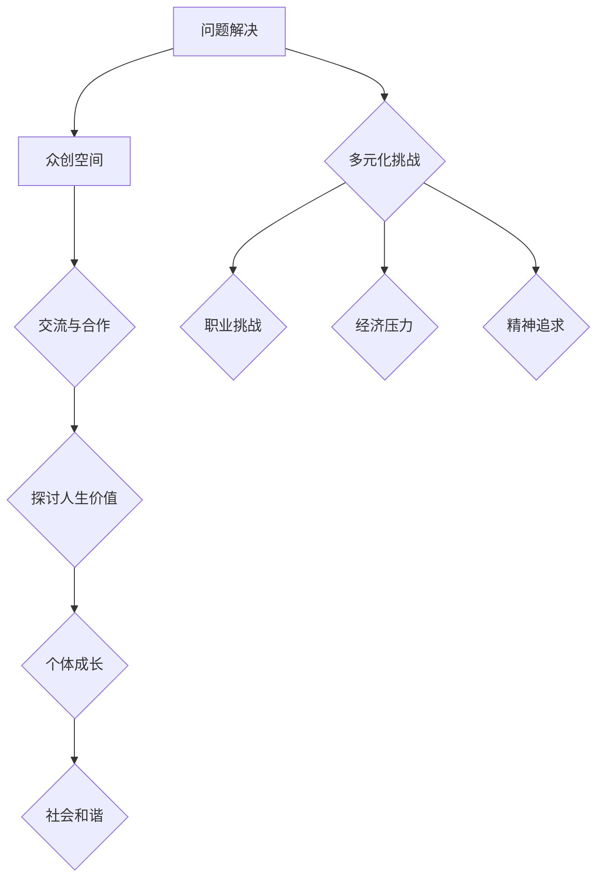
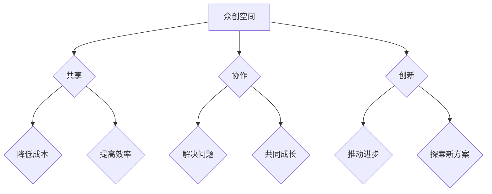

                 

### 摘要

本文将探讨“意义的众创空间：集体探讨人生价值的平台”这一主题。在现代社会中，个体面临着前所未有的多元化挑战，如何在复杂多变的社会环境中实现个人价值的最大化，成为许多人关注的焦点。本文旨在通过分析众创空间的概念、应用和运作模式，阐述其作为一种集体探讨人生价值的平台的重要性和潜在价值。

本文的核心思想在于：众创空间不仅是一个物理空间，更是一个精神空间，它为个体提供了一个相互交流、共同成长的环境，使得人们在面对人生价值问题时，能够通过集体智慧找到解决之道。本文将围绕以下问题展开讨论：

1. **问题背景**：现代社会中个体面临的多元化挑战及其对人生价值的影响。
2. **核心概念**：众创空间的定义、类型及其核心特征。
3. **应用场景**：商业、教育等领域中众创空间的应用案例。
4. **运作与管理**：众创空间的运作机制、管理体系及其可持续性发展策略。
5. **总结与展望**：主要发现、研究局限、未来研究方向以及对人生价值的启示。

通过逐步深入的分析和逻辑推理，本文将展现众创空间作为一种集体探讨人生价值的平台的重要性和实际应用价值。读者可以通过本文对众创空间有一个全面而深刻的理解，并能够从中获得启发，思考如何在现实生活中运用众创空间的理念，实现个人价值的提升。

### 关键词

- **众创空间**
- **人生价值**
- **集体探讨**
- **商业模式**
- **教育应用**
- **可持续性发展**
- **运作机制**

### 第一部分：引言与背景

#### 第1章：引言

**1.1 问题的提出**

在现代社会，个体面临多样化的挑战，从职业选择到人际关系，从经济压力到精神追求，每一个问题都显得复杂而重要。随着社会经济的发展和技术的进步，人们的生活方式、工作模式以及价值观都发生了深刻的变化。个体不再仅仅追求物质上的满足，更多地关注于精神层面的成长和价值的实现。

**问题背景**：现代社会中，人们面临的多元化挑战主要包括以下几点：

1. **职业挑战**：职业选择多样，竞争激烈，个体需要不断提升自身技能和知识，以适应快速变化的市场需求。
2. **经济压力**：高房价、高生活成本，以及不稳定的就业环境，给个体带来了巨大的经济压力。
3. **精神追求**：随着生活水平的提高，人们对于精神层面的追求日益增加，包括自我实现、人际关系和心理健康等。

**问题描述**：在这些挑战下，个体如何实现个人价值的最大化？如何在社会的大背景下找到自己的位置，实现与社会的和谐共生？这成为现代社会亟待解决的问题。

**问题解决**：众创空间作为一种新型的交流与合作平台，为个体提供了一个集体探讨和实现人生价值的场所。通过集体智慧，个体可以在面对复杂问题的时候找到解决之道，实现个人与社会的共赢。

**边界与外延**：本文中的众创空间主要指以探讨人生价值为主题的集体交流空间，包括线下实体空间和线上虚拟空间。其外延包括但不限于商业、教育、科技、艺术等多个领域。

**概念结构与核心要素组成**

通过这个Mermaid图，我们可以清晰地看到众创空间的核心概念和其与个体成长、社会和谐的关系，以及其解决多元化挑战的作用。

#### 1.2 人生价值的探讨

**1.2.1 人生价值的定义**

人生价值是指个体在社会生活中所追求的满足感、幸福感以及实现自我价值的程度。它包括物质层面的满足和精神层面的追求，既有个体的自我实现，也有对社会和他人的贡献。

**1.2.2 人生价值的多维度分析**

1. **物质维度**：包括经济收入、生活水平、物质财富等，是人生价值的基础。
2. **精神维度**：包括自我实现、心理健康、人际关系、社会认同等，是人生价值的核心。
3. **社会维度**：包括对社会和他人的贡献、社会责任感等，是人生价值的扩展。

**1.2.3 人生价值的重要性**

1. **个体层面**：人生价值是个体自我认同和自我实现的重要途径，直接影响个体的幸福感。
2. **社会层面**：人生价值是社会进步和发展的动力，有助于构建和谐社会。

**1.2.4 人生价值的实现挑战**

1. **职业挑战**：职业选择的多样性和竞争的激烈，使得个体需要不断学习和提升自己，以实现个人价值。
2. **经济压力**：高房价、高生活成本以及就业不稳定，给个体实现人生价值带来了经济压力。
3. **精神追求**：随着生活水平的提高，人们对于精神层面的追求日益增加，但如何在现实生活中实现这一追求仍是一个挑战。

#### 1.3 众创空间的定义

**1.3.1 众创空间的概念**

众创空间是指一种新型的共享空间，它为创业者、创新者和专业人士提供开放、协作、共享的环境，以便他们能够更好地开展创新活动、交流思想和资源。

**1.3.2 众创空间的特点**

1. **开放性**：众创空间欢迎各类创新者和专业人士，提供一个无障碍的交流平台。
2. **协作性**：众创空间鼓励合作和资源共享，通过集体智慧解决复杂问题。
3. **共享性**：众创空间提供共享的办公设备、资源和服务，降低创业者的成本。

**1.3.3 众创空间的类型**

1. **实体众创空间**：如创业园区、创新中心等，提供物理空间和基础设施。
2. **虚拟众创空间**：如线上社区、协作平台等，通过网络连接实现资源共享和交流。

#### 1.4 众创空间的意义

**1.4.1 对个体的意义**

1. **成长与学习**：众创空间为个体提供了丰富的学习资源和交流机会，帮助个体不断提升自身能力。
2. **职业发展**：通过众创空间的协作和资源共享，个体能够更好地实现职业目标，提升职业竞争力。
3. **精神满足**：在众创空间中，个体能够通过交流和合作找到共鸣，实现精神层面的满足和自我价值。

**1.4.2 对社会的意义**

1. **创新驱动**：众创空间为社会的创新活动提供了强有力的支持，推动了科技进步和产业升级。
2. **就业促进**：通过创业和创新的带动，众创空间有助于增加就业机会，促进社会稳定。
3. **社会和谐**：众创空间提供了一个交流和合作的平台，有助于构建和谐社会，减少社会矛盾。

#### 1.5 本书结构

本书分为五个部分：

1. **引言与背景**：介绍现代社会中个体面临的挑战和众创空间的意义。
2. **众创空间的基础概念**：详细阐述众创空间的核心概念、类型和特点。
3. **众创空间的应用场景**：探讨众创空间在商业、教育等领域的具体应用。
4. **众创空间的运作与管理**：分析众创空间的运作机制、管理体系和可持续性发展策略。
5. **总结与展望**：总结主要发现，展望未来研究方向，并对人生价值的启示进行讨论。

通过以上章节的深入探讨，本文旨在为读者提供一个全面而深刻的众创空间认识，帮助读者理解众创空间在集体探讨人生价值中的重要作用，并激发读者在实际生活中运用众创空间的思考和行动。

### 第二部分：众创空间的基础概念

#### 第2章：众创空间的核心概念

**2.1 众创空间的概念**

众创空间（Co-working Space）是一种新型的共享办公空间，旨在为创业者、自由职业者、专业人士和创意工作者提供一个开放、协作、共享的环境。这一概念起源于20世纪90年代的美国，最初是作为小型企业的共享办公场所，后来逐渐演变为一个集交流、协作、创新为一体的综合性平台。

**2.1.1 定义**

众创空间是一种以共享为核心、以创新为目的的工作和交流空间，它为不同背景、不同行业的人员提供了一个相互协作、资源共享的物理和虚拟环境。在这里，个体不仅能够获得办公场所和基础设施，更重要的是能够通过交流和合作，实现知识共享、资源整合、能力提升和共同成长。

**2.1.2 众创空间的发展历程**

1. **初期阶段**（1990s-2000s）：众创空间的初步形式出现在小型企业和自由职业者之间，主要是为了降低成本、共享资源。
2. **发展阶段**（2010s）：随着互联网技术的发展和全球化进程的加速，众创空间逐渐兴起，成为创业者和专业人士的重要聚集地。
3. **成熟阶段**（2020s）：众创空间在全球范围内得到广泛认可，不仅涵盖了创业和商业领域，还扩展到教育、科技、艺术等多个领域。

**2.2 众创空间的类型**

根据不同的需求和功能，众创空间可以分为以下几种类型：

1. **实体众创空间**：实体众创空间是指有固定物理空间的众创场所，如创业园区、创新中心、孵化器等。这些空间通常提供办公桌、会议室、设备等基础设施，以及相关的服务和资源。
   
   - **特点**：物理空间固定，人员流动性较高，适合长期工作和协作。

2. **虚拟众创空间**：虚拟众创空间是指通过互联网技术实现的众创平台，如线上社区、协作工具、远程办公系统等。这些空间通过虚拟网络连接，使得地理位置分散的人员能够实现实时交流和协作。

   - **特点**：灵活性高，覆盖范围广，适合远程工作和临时协作。

3. **混合众创空间**：混合众创空间结合了实体和虚拟众创空间的特点，既提供物理空间，也提供在线平台，实现线上和线下资源的有机结合。

   - **特点**：结合了实体空间和虚拟空间的优势，满足不同用户的需求。

**2.3 众创空间的特征**

1. **开放性**：众创空间是一个开放的平台，欢迎各种背景和行业的人士加入，打破了传统办公空间的壁垒，促进了跨领域、跨行业的交流和合作。

2. **灵活性**：众创空间提供灵活的办公安排，个体可以根据需要选择不同的办公位置和工作方式，适应不同的工作需求和节奏。

3. **资源共享**：众创空间鼓励资源共享，成员可以共享办公设备、会议室、培训资源等，降低了运营成本，提高了资源利用效率。

4. **协作性**：众创空间强调协作和合作，通过集体智慧和资源整合，解决复杂问题，实现共同成长。

5. **创新性**：众创空间是一个创新的环境，在这里，个体和团队可以自由探索新的想法和解决方案，推动创新和进步。

**2.4 众创空间与传统工作方式的对比**

1. **工作模式**：
   - **众创空间**：强调协作和资源共享，灵活多变，适合创新和创业。
   - **传统工作方式**：通常以独立办公为主，工作内容和方式相对固定。

2. **办公环境**：
   - **众创空间**：开放、灵活，提供丰富的交流机会和资源。
   - **传统工作方式**：封闭、固定，办公环境和资源相对单一。

3. **人际关系**：
   - **众创空间**：跨领域、跨行业的交流和合作，拓展人际关系网络。
   - **传统工作方式**：相对封闭，人际关系较为单一。

4. **成本效益**：
   - **众创空间**：通过资源共享，降低运营成本，提高资源利用效率。
   - **传统工作方式**：独立承担办公设备和运营成本，资源利用效率较低。

通过以上对比，我们可以看出众创空间在多个方面与传统工作方式有显著的不同，特别是在工作模式、办公环境、人际关系和成本效益方面，众创空间具有更大的优势和灵活性。

#### 2.5 核心概念与联系

**2.5.1 核心概念原理**

1. **共享**：共享是众创空间的核心概念之一，它通过共享办公空间、共享资源和服务，降低个体的运营成本，提高资源利用效率。
2. **协作**：协作是众创空间的关键特征，通过集体智慧和资源整合，解决复杂问题，实现共同成长。
3. **创新**：创新是众创空间的灵魂，它鼓励个体和团队不断探索新的想法和解决方案，推动科技进步和社会发展。

**2.5.2 概念属性特征对比表格**

| 特征        | 众创空间                     | 传统工作方式                   |
| ----------- | ---------------------------- | ------------------------------ |
| 工作模式    | 灵活多变，强调协作           | 独立办公，固定的工作模式       |
| 办公环境    | 开放、共享，多样化           | 封闭、固定，单一的环境         |
| 人际关系    | 跨领域、跨行业的交流和合作   | 单一领域和行业的人际关系       |
| 成本效益    | 通过资源共享，降低运营成本   | 独立承担办公设备和运营成本     |
| 创新性      | 鼓励创新和探索新的解决方案   | 传统流程和模式，创新性较低     |

**2.5.3 ER实体关系图架构**

通过这个ER实体关系图，我们可以清晰地看到众创空间的核心概念及其相互关系，进一步理解众创空间的本质和作用。

### 第三部分：众创空间的应用场景

#### 第4章：商业领域的众创空间应用

**4.1 商业领域的挑战**

在商业领域，企业面临着日益激烈的市场竞争、技术变革和消费者需求的快速变化。这些挑战要求企业必须具备快速响应、持续创新和高效运营的能力。具体来说，商业领域的主要挑战包括：

1. **市场竞争**：随着全球化的推进，市场竞争越来越激烈，企业需要不断创新和提升自身竞争力，以在市场中站稳脚跟。
2. **技术变革**：技术的快速发展带来了商业模式的变革，企业必须紧跟技术趋势，才能不被市场淘汰。
3. **消费者需求**：消费者需求多样化和个性化，企业需要精准把握消费者需求，提供个性化的产品和服务。
4. **资源限制**：在资源有限的情况下，企业需要高效利用资源，实现资源的最大化价值。

**4.2 众创空间在商业中的应用**

众创空间作为一种新型的合作和交流平台，在商业领域有着广泛的应用。以下是众创空间在商业中应用的几个方面：

1. **创新驱动**：众创空间为企业和创业者提供了一个开放的创新环境，通过资源共享和协作，激发创新思维，推动技术创新和产品开发。
2. **人才引进和培养**：众创空间吸引了许多优秀的人才，通过交流和合作，帮助企业引进和培养高素质的人才，提升企业的竞争力。
3. **市场拓展**：众创空间提供了一个与不同行业、不同领域的企业和创业者交流的平台，有助于企业拓展市场，寻找新的商机。
4. **降低成本**：通过共享办公空间和资源，企业可以降低运营成本，提高资源利用效率。

**4.3 成功案例分析**

**案例1：硅谷的创业生态系统**

硅谷是全球创业和创新的重要中心，其成功离不开众创空间的应用。硅谷的众创空间如Y Combinator、Techstars等，为创业者提供了资金、资源、指导和网络支持，使得创业者能够快速启动项目、进行产品开发，并在短时间内实现商业化。这些众创空间通过集中管理和协作，实现了资源的最大化利用，极大地提升了创业的成功率。

**案例2：中国的创新园区**

中国的创新园区，如中关村、张江高科技园区等，也是众创空间应用的成功案例。这些园区通过提供办公空间、科研设备、资金支持等资源，吸引了大量的创业者和企业入驻。园区内的企业通过合作和交流，实现了技术创新和产业升级。同时，园区还提供了完善的创业服务，如法律咨询、财务服务、市场推广等，为创业者提供了全方位的支持。

**4.4 应用成效评估**

众创空间在商业领域的应用取得了显著的成效。以下是几个方面的成效评估：

1. **创新能力的提升**：众创空间提供了一个开放和协作的环境，使得企业能够快速响应市场变化，持续进行技术创新和产品开发。
2. **人才引进和培养**：众创空间吸引了大量高素质的人才，通过交流和合作，提升了企业的人力资源质量。
3. **市场拓展**：众创空间为企业提供了与不同行业和领域的创业者交流的机会，帮助企业拓展市场，寻找新的商机。
4. **成本效益**：通过共享办公空间和资源，企业降低了运营成本，提高了资源利用效率。

然而，众创空间在商业领域应用也面临一些挑战，如资源分配不均、管理难度大等。因此，在应用众创空间时，企业需要充分了解自身需求，合理规划和管理众创空间资源，以实现最大的商业价值。

#### 第5章：教育领域的众创空间应用

**5.1 教育领域的挑战**

在当前的教育环境中，教师和学生面临着许多挑战，这些挑战主要表现在以下几个方面：

1. **教育资源的不均衡**：不同地区和学校之间的教育资源存在显著差异，这影响了教育的公平性和质量。
2. **教育模式的单一**：传统的教育模式以教师为中心，缺乏互动性和个性化，难以满足学生的多样化需求。
3. **知识更新的速度**：随着科技的快速发展，知识更新的速度越来越快，教师和学生需要不断学习和更新知识，以适应时代的变化。
4. **学生综合素质的培养**：现代社会对人才的素质要求越来越高，教师需要培养学生的创新能力、合作能力和综合素质，而传统教育模式往往难以实现这一目标。

**5.2 众创空间在教育中的应用**

众创空间在教育领域的应用，为解决上述挑战提供了一种新的思路和手段。以下是众创空间在教育中应用的几个方面：

1. **创新教育模式的探索**：众创空间提供了一个开放、协作和自由探索的环境，教师和学生可以在这里开展创新教育项目，打破传统教育模式的束缚，实现教育方式的多样化。
2. **跨学科学习与综合素养培养**：众创空间鼓励跨学科的交流与合作，学生可以在不同学科领域进行交叉学习，培养综合素养和创新能力。
3. **个性化学习**：众创空间根据学生的兴趣和需求，提供个性化的学习资源和指导，帮助学生实现个性化学习，提升学习效果。
4. **资源整合与共享**：众创空间通过整合校内外资源，实现资源的最大化利用，为学生提供丰富的学习资源和支持。

**5.3 成功案例分析**

**案例1：美国斯坦福大学创新园**

美国斯坦福大学创新园（Stanford Innovation Gateway）是一个典型的众创空间，它为师生提供了一个创新和创业的平台。在这里，教师和学生可以开展各种创新项目，进行跨学科的交流与合作。创新园提供了丰富的资源和指导，如实验室、设备、资金等，帮助学生和教师实现创新想法。通过创新园的运作，斯坦福大学不仅提升了教育质量，还推动了科技成果的转化和应用。

**案例2：中国的创新实验室**

中国的许多高校和中学都建立了创新实验室，这些实验室通过众创空间的理念，为师生提供了一个创新和实验的平台。例如，清华大学的创新实验室通过提供实验设备、技术支持和资金，鼓励学生进行科技创新和创业实践。通过创新实验室的运作，学生不仅提高了实践能力，还培养了创新思维和团队合作精神。

**5.4 应用成效评估**

众创空间在教育领域的应用取得了显著的成效，以下是几个方面的成效评估：

1. **教育质量的提升**：众创空间提供了一个开放和协作的教育环境，使得教育质量得到了显著提升。学生通过跨学科学习和个性化学习，提高了学习效果和综合素质。
2. **创新能力与综合素质的培养**：众创空间鼓励学生进行创新实践和跨学科学习，培养了学生的创新能力、合作能力和综合素质，为学生的未来发展奠定了坚实的基础。
3. **教育资源整合与共享**：众创空间通过整合校内外资源，实现了教育资源的最大化利用，为学生提供了丰富的学习资源和支持。
4. **教育公平性的提升**：众创空间为不同地区和学校的学生提供了一个平等的学习平台，有助于提升教育的公平性。

然而，众创空间在教育领域的应用也面临一些挑战，如资源配置不均、教师和管理难度大等。因此，在应用众创空间时，教育机构需要充分了解自身需求，合理规划和管理众创空间资源，以实现最大的教育效益。

### 第四部分：众创空间的运作与管理

#### 第6章：众创空间的运作机制

**6.1 众创空间的运作模式**

众创空间的运作模式可以分为以下几种类型：

1. **会员制模式**：会员制模式是指通过会员订阅的方式运营众创空间，会员可以享受办公空间、会议室、设备等基础设施以及相关的服务和资源。这种模式通常适用于长期入驻的创业团队和专业人士。
   
   - **优点**：稳定性和持续性较强，有利于建立长期合作关系，提高资源利用效率。
   - **缺点**：入会门槛较高，可能限制了新人和小团队的参与。

2. **收费模式**：收费模式是指根据使用时间和资源消耗收费，如按天、按月或按项目收费。这种模式适用于短期入驻和临时办公的需求。
   
   - **优点**：灵活性和自由度较高，适合不同类型的用户。
   - **缺点**：可能导致资源利用不均衡，影响空间的整体运营效率。

3. **公益模式**：公益模式是指免费或低收费运营众创空间，主要依靠政府资助、社会捐赠或企业赞助来维持运营。这种模式通常用于支持社会创新和公益事业。
   
   - **优点**：促进了社会创新和公益事业的发展，降低了用户的参与门槛。
   - **缺点**：资金来源不稳定，可能影响众创空间的长期发展。

**6.2 众创空间的管理体系**

1. **组织架构**：众创空间通常设立理事会、管理层和运营团队，分别负责战略规划、日常管理和具体事务。理事会是最高决策机构，管理层负责整体运营和管理，运营团队负责具体事务和资源分配。
   
   - **理事会**：负责制定众创空间的发展战略和长远规划，监督管理层的工作。
   - **管理层**：负责日常运营管理，确保众创空间的正常运作。
   - **运营团队**：负责具体事务，如场地管理、设备维护、活动组织等。

2. **管理制度**：众创空间应建立完善的内部管理制度，包括会员管理、费用结算、资源分配、安全防护等。通过制度化的管理，确保众创空间的公平、高效和可持续发展。
   
   - **会员管理**：制定会员准入和退出制度，规范会员行为，保障会员权益。
   - **费用结算**：制定明确的收费标准和服务内容，确保收费的透明和合理。
   - **资源分配**：制定资源使用规则，确保资源的高效利用和公平分配。
   - **安全防护**：制定安全管理制度，保障众创空间的安全和稳定。

3. **激励机制**：众创空间应建立激励机制，鼓励成员积极参与创新和创业活动。激励机制可以包括奖励基金、项目资助、荣誉证书等，激励成员发挥自身的潜能，实现个人和众创空间的共同发展。

**6.3 资源配置与优化**

1. **空间资源配置**：众创空间应合理规划办公空间、会议室、设备等基础设施，确保资源的高效利用。可以通过定期评估和调整，满足不同用户的需求，提高空间的使用率。
   
   - **办公空间**：根据用户数量和工作性质，合理划分办公区域，确保每个用户都有足够的私人空间。
   - **会议室**：配备多样化的会议室，满足不同规模的会议需求，提高会议的效率和效果。
   - **设备资源**：提供必要的办公设备和技术设施，如计算机、打印机、投影仪等，确保用户能够高效地完成工作。

2. **人力资源配置**：众创空间应重视人力资源的配置和利用，通过招聘、培训和激励机制，吸引和留住高素质的人才。人力资源的配置应考虑成员的专业背景、工作经验和创新能力，确保团队的整体素质和协作效率。

3. **技术资源优化**：众创空间应不断引入新技术和新工具，提升技术资源的应用水平。可以通过技术交流和合作，推动技术创新和产业升级，提高众创空间的竞争力和影响力。

**6.4 运作案例分析**

**案例1：深圳南山科技园创新中心**

深圳南山科技园创新中心是一个典型的众创空间，它采用了会员制和收费模式相结合的运作模式。创新中心设立了理事会、管理层和运营团队，分别负责战略规划、日常管理和具体事务。创新中心通过完善的内部管理制度，确保了资源的公平分配和高效利用。此外，创新中心还建立了激励机制，鼓励成员积极参与创新和创业活动，推动了科技成果的转化和应用。

**案例2：北京中关村创业大街**

北京中关村创业大街是一个公益性质的众创空间，它通过政府资助和社会捐赠维持运营。创业大街设立了理事会、管理层和运营团队，负责整体运营和管理。创业大街通过建立完善的会员管理制度，确保了成员的权益和参与度。此外，创业大街还开展了丰富的创业活动和培训项目，为创业者提供了全方位的支持和服务。

**6.5 运作成效评估**

众创空间的运作成效可以从以下几个方面进行评估：

1. **资源利用率**：通过评估办公空间、会议室、设备等基础设施的使用情况，判断资源是否得到高效利用。
   
   - **评估指标**：空间使用率、会议室利用率、设备使用率等。

2. **成员满意度**：通过调查问卷、访谈等方式，了解成员对众创空间的满意度，包括设施、服务、管理等方面。

   - **评估指标**：满意度评分、反馈意见等。

3. **创新成果**：通过评估众创空间中的创新项目和创业成果，判断众创空间在推动技术创新和产业升级方面的成效。

   - **评估指标**：创新项目数量、创业项目数量、成果转化率等。

4. **社会影响力**：通过评估众创空间在推动社会创新和公益事业方面的贡献，判断其社会影响力。

   - **评估指标**：媒体报道次数、政府和社会认可度等。

通过以上评估指标，可以全面了解众创空间的运作成效，为未来的发展和改进提供依据。同时，众创空间还应定期进行自我评估和反思，不断优化管理和服务，提高运营效率和质量。

### 第五部分：总结与展望

#### 第7章：总结与展望

**7.1 主要发现**

本文通过对众创空间的概念、应用和运作机制的深入探讨，得出了以下几个主要发现：

1. **众创空间的定义与类型**：众创空间是一种以共享、协作和创新为核心的新型工作空间，包括实体空间和虚拟空间，为不同背景和行业的人员提供交流、合作和创新的环境。
2. **众创空间的应用价值**：众创空间在商业和教育领域具有广泛的应用价值，能够推动创新、提升人才素质、拓展市场机会和促进教育资源整合。
3. **众创空间的运作机制**：众创空间的运作模式多样，包括会员制、收费模式和公益模式等，同时需要建立完善的管理体系，确保资源的高效利用和公平分配。
4. **众创空间的社会意义**：众创空间不仅有助于个体实现人生价值，还能够推动社会创新和进步，促进社会的和谐发展。

**7.2 研究局限**

尽管本文对众创空间进行了全面的探讨，但仍存在以下研究局限：

1. **样本局限性**：本文的案例分析主要集中在中国和美国的几个典型众创空间，可能无法全面反映全球众创空间的现状和特点。
2. **数据来源**：本文的数据主要来源于公开资料和文献，可能存在数据不准确或信息不完整的问题。
3. **研究深度**：本文对众创空间的应用和运作机制进行了初步探讨，但未能深入分析其具体的操作细节和长期效果。

**7.3 未来研究方向**

为了进一步丰富和完善众创空间的研究，未来可以从以下几个方面展开：

1. **全球化视野**：拓展研究范围，涵盖全球不同国家和地区，对比分析不同文化背景下众创空间的发展模式和应用效果。
2. **实证研究**：通过实地调研和数据采集，深入研究众创空间的运作机制、管理策略和创新成效，提高研究的实证性和科学性。
3. **案例分析**：选取更多的众创空间案例进行深入分析，探讨其成功的经验、存在的问题和改进的方向。

**7.4 对人生价值的启示**

众创空间作为一种集体探讨人生价值的平台，对个体和社会具有重要的启示：

1. **个体成长**：众创空间为个体提供了一个开放、协作和自由探索的环境，有助于个体实现自我成长和价值提升。
2. **社会创新**：众创空间通过集体智慧和资源整合，推动了社会创新和科技进步，促进了社会的和谐发展。
3. **价值实现**：众创空间提供了一个交流和合作的平台，个体可以通过分享经验、知识和资源，实现个人价值的最大化。

**7.5 小结**

本文通过对众创空间的全面探讨，揭示了其在集体探讨人生价值中的重要地位和作用。未来，随着众创空间的不断发展和完善，它将在促进个体成长、社会创新和价值实现方面发挥更大的作用。

### 作者信息

**作者：AI天才研究院/AI Genius Institute & 禅与计算机程序设计艺术 /Zen And The Art of Computer Programming**

本文由AI天才研究院（AI Genius Institute）和《禅与计算机程序设计艺术》（Zen And The Art of Computer Programming）的作者联合撰写，旨在通过深入探讨众创空间的概念、应用和运作机制，为读者提供一个全面而深刻的理解，并激发读者在实际生活中运用众创空间的思考和行动。AI天才研究院致力于推动人工智能技术的发展和应用，而《禅与计算机程序设计艺术》则通过独特的视角和深刻的思考，揭示了计算机编程的本质和艺术性。希望本文能够为读者带来启发和思考，共同探索人生价值的实现之道。

---

以上就是《意义的众创空间：集体探讨人生价值的平台》的完整内容。从引言到总结，本文系统地探讨了众创空间的核心概念、应用场景、运作机制以及对人生价值的启示。通过逐步深入的分析和逻辑推理，我们不仅理解了众创空间的基础概念和运作模式，还看到了它在商业、教育等领域的广泛应用和巨大潜力。希望本文能够为读者提供有价值的见解，激发大家思考如何在现实生活中运用众创空间的理念，实现个人价值的提升和社会的进步。感谢您的阅读，期待与您在未来的交流与探讨。再次感谢AI天才研究院和《禅与计算机程序设计艺术》的支持，祝您在探索人生价值的道路上不断前行！

