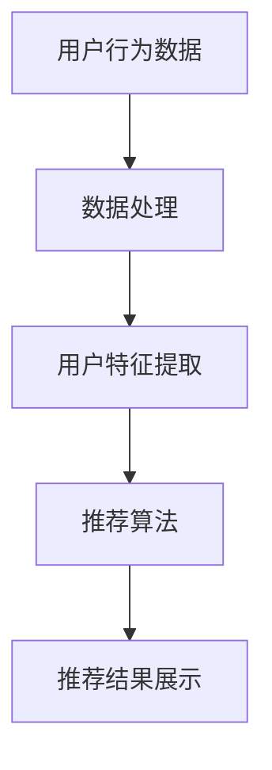
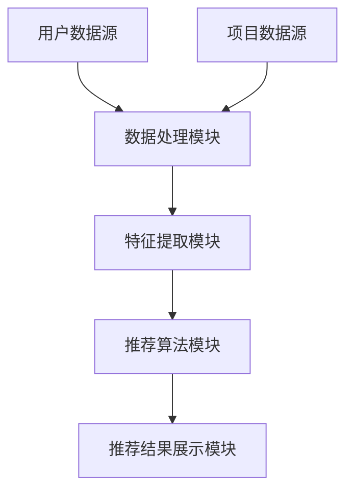
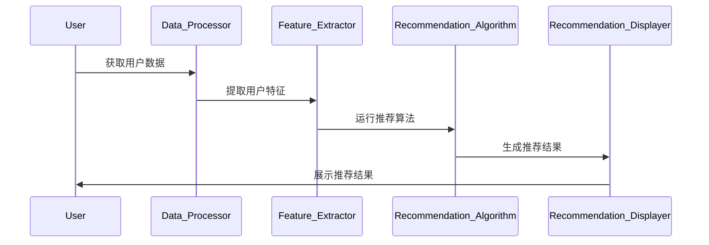

                 

### 引言：众筹平台与集体智慧

#### 1.1 问题的背景

众筹平台，这一互联网时代的创新融资模式，已经逐渐成为创业者们获取资金、推广项目的重要途径。从Kickstarter、Indiegogo到我国微信众筹等平台，它们不仅为项目提供了资金支持，还成为了创新与创业生态中不可或缺的一环。

首先，让我们回顾一下众筹平台的发展历程。众筹的概念起源于美国，最早可以追溯到1985年，当时Kickstarter的创始人查尔斯·霍德·基尔什（Charles Hungerford）在其家乡康涅狄格州创办了购物者项目（ShopperProject），这被视为众筹的雏形。随后，随着互联网的普及和电子商务的发展，众筹平台应运而生，Kickstarter在2009年上线，标志着现代众筹平台的兴起。在我国，众筹平台的发展则始于2011年，随着余额宝、京东众筹、淘宝众筹等平台的崛起，众筹市场逐渐成熟。

众筹平台的运作模式可以分为多种类型，包括P2P模式、平台模式和混合模式等。P2P模式（Peer-to-Peer）是指平台作为中介，连接投资者和筹资者，使得资金直接从投资者流向筹资者。平台模式则是平台本身承担一定的风险，对项目进行审核，并负责资金的管理和分发。混合模式则是P2P和平台模式的结合，既具有P2P模式的灵活性，又有平台模式的保障性。

从分类上看，众筹平台主要分为产品众筹、股权众筹和资产众筹等类型。产品众筹是指筹资者通过平台展示其产品创意，吸引投资者进行资金支持，达到预定目标即可生产产品。股权众筹则是投资者通过购买股权获得项目收益的分配权。资产众筹则是将项目的资产打包，供投资者进行投资，类似于传统金融市场的投资行为。

#### 1.2 众筹平台的意义

众筹平台的出现，不仅为创业者提供了新的融资渠道，还具有重要的社会意义。

首先，众筹平台为创业者提供了资金支持。传统的融资渠道如银行贷款、风投等，往往对创业者的资质和项目前景有较高的要求，而众筹平台则更加注重项目的创新性和市场潜力，降低了创业者的融资门槛。

其次，众筹平台促进了创新与创业生态的完善。通过众筹，创业者可以快速获得市场反馈，了解用户需求，优化产品方案。同时，众筹平台上的项目多样，涵盖了科技、艺术、文化等多个领域，为创新提供了丰富的土壤。

#### 1.3 集体智慧的价值

在讨论众筹平台的意义时，我们不得不提到集体智慧（Collective Intelligence）的概念。集体智慧是指通过个体间的互动、协作和共享，形成的一种能够超越个体智慧的集体行为和决策能力。

集体智慧在众筹平台中具有重要的价值。首先，它能够提升决策质量。在众筹平台上，项目的成功与否往往依赖于众人的智慧和判断。通过集体智慧，平台可以更准确地评估项目的可行性，降低投资风险。

其次，集体智慧促进了资源共享与合作。众筹平台上的个体不仅仅是投资者，还是项目的宣传者、支持者和参与者。他们通过分享信息、协作互助，共同推动项目的成功。

#### 1.4 本书结构

本书旨在深入探讨众筹平台与集体智慧的关系，旨在为读者提供一个全面、系统的理论框架和实践指南。本书的结构如下：

- **第1章 引言：众筹平台与集体智慧**：介绍了众筹平台的发展背景、意义以及集体智慧的概念和价值。
- **第2章 众筹平台概述**：详细介绍了众筹平台的发展历程、运作模式、分类以及优势和挑战。
- **第3章 集体智慧原理**：阐述了集体智慧的定义、形成机制、与传统智慧的对比以及优势与应用领域。
- **第4章 意义的众筹平台设计**：从目标定位、用户需求分析、平台功能模块设计和平台架构设计等方面，探讨了如何设计一个具有集体智慧属性的众筹平台。
- **第5章 集体智慧在众筹平台中的应用**：介绍了数据分析、人工智能辅助、用户互动与反馈以及社区建设与治理在众筹平台中的应用。
- **第6章 众筹平台案例分析**：通过对Kickstarter、Indiegogo和微信众筹等平台的案例分析，总结了众筹平台的成功经验和挑战。
- **第7章 意义的众筹平台运营与管理**：探讨了众筹平台的运营策略、风险管理、平台可持续发展以及用户忠诚度管理。
- **第8章 未来展望**：展望了众筹平台和集体智慧的未来发展趋势，探讨了新机遇与新挑战。

通过以上章节的详细探讨，本书旨在为读者提供一个全面了解众筹平台与集体智慧的理论和实践框架，帮助读者更好地理解这一新兴领域的运作机制和发展前景。

---

### 第2章 众筹平台概述

#### 2.1 众筹平台的发展历程

众筹平台的发展历程可以追溯到互联网和电子商务的兴起时期。最早的众筹概念起源于1985年的购物者项目（ShopperProject），这被视为众筹的雏形。然而，现代众筹平台的兴起始于2009年，Kickstarter的上线标志着众筹平台的正式诞生。Kickstarter的成功不仅激发了全球众筹平台的兴起，也为众筹模式奠定了基础。

在我国，众筹平台的发展始于2011年。当时，余额宝、京东众筹、淘宝众筹等平台相继上线，为创业者提供了新的融资渠道。随着互联网普及率的提高和消费升级的需求，众筹市场逐渐成熟。截至2023年，我国已有数千家众筹平台，市场规模逐年扩大。

#### 2.2 众筹平台的运作模式

众筹平台的运作模式主要包括P2P模式、平台模式和混合模式等。

P2P模式是指平台作为中介，连接投资者和筹资者，使得资金直接从投资者流向筹资者。在这种模式下，平台通常不承担项目风险，而是提供信息匹配和交易服务。P2P模式的优点在于灵活性高，能够快速匹配资金需求，但缺点是风险控制难度大，需要平台严格审核项目。

平台模式是指平台本身承担一定的风险，对项目进行审核，并负责资金的管理和分发。在这种模式下，平台需要对项目进行风险评估，确保项目具有较高的成功率。平台模式的优点在于风险控制能力强，能够为投资者提供保障，但缺点是资金流转速度较慢，可能会影响项目的执行进度。

混合模式则是P2P和平台模式的结合，既具有P2P模式的灵活性，又有平台模式的保障性。在这种模式下，平台既提供信息匹配服务，又对项目进行审核和管理。混合模式能够平衡灵活性和风险控制，但需要平台具有较高的运营能力。

#### 2.3 众筹平台的分类

众筹平台根据不同的标准可以进行多种分类。以下是一些常见的分类方式：

1. **按众筹类型分类**：
   - 产品众筹：筹资者通过展示产品创意，吸引投资者进行资金支持，达到预定目标即可生产产品。
   - 股权众筹：投资者通过购买股权获得项目收益的分配权。
   - 资产众筹：将项目的资产打包，供投资者进行投资，类似于传统金融市场的投资行为。

2. **按平台模式分类**：
   - P2P模式：平台作为中介，连接投资者和筹资者。
   - 平台模式：平台本身承担一定的风险，对项目进行审核和管理。
   - 混合模式：结合P2P和平台模式，提供信息匹配和项目审核服务。

3. **按区域分类**：
   - 国内众筹平台：如京东众筹、淘宝众筹等。
   - 国际众筹平台：如Kickstarter、Indiegogo等。

#### 2.4 众筹平台的优势与挑战

众筹平台具有多方面的优势，但同时也面临着一系列挑战。

**优势**：

1. **为创业者提供资金支持**：众筹平台为创业者提供了新的融资渠道，降低了创业门槛，使得更多人有机会实现创业梦想。
2. **促进创新与创业生态的完善**：通过众筹，创业者可以快速获得市场反馈，了解用户需求，优化产品方案。同时，众筹平台上的项目多样，涵盖了科技、艺术、文化等多个领域，为创新提供了丰富的土壤。
3. **提高资源利用率**：众筹平台将分散的资金集中起来，提高了资金利用效率，同时也促进了资源的共享与合作。

**挑战**：

1. **风险控制难度大**：众筹平台上的项目众多，且风险各异，平台需要具备较强的风险识别和评估能力，以确保投资者的资金安全。
2. **监管政策的变化**：众筹市场的快速发展也引发了一系列监管问题，政策的变化可能会对平台的运营产生影响。
3. **市场竞争激烈**：随着众筹平台的增多，市场竞争日益激烈，平台需要不断创新和优化服务，以吸引更多的用户和项目。

总之，众筹平台作为一种创新的融资模式，具有巨大的发展潜力。然而，要充分发挥其优势，平台需要应对各种挑战，不断完善和优化服务。在接下来的章节中，我们将进一步探讨集体智慧在众筹平台中的应用，以及如何设计一个具有集体智慧属性的众筹平台。

---

### 第3章 集体智慧原理

#### 3.1 集体智慧的定义

集体智慧（Collective Intelligence，CI）是指通过个体之间的互动、协作和共享，形成的一种能够超越个体智慧的集体行为和决策能力。简而言之，集体智慧是由多个个体组成的系统，通过相互交流和合作，共同解决问题或实现目标的能力。

在集体智慧中，个体不再是单独的决策者，而是系统中的一部分。每个个体贡献自己的知识和经验，通过集体讨论、协商和决策，形成对问题的共识和解决方案。这种智慧不仅体现在人类社会中，还存在于动物群体、微生物群落等自然现象中。

#### 3.2 集体智慧的形成机制

集体智慧的形成机制主要包括信息共享、互动协作和自组织三个方面。

**信息共享**：信息是集体智慧的基础。个体通过共享信息，可以获取到更多的知识，从而提高决策的准确性和效率。在众筹平台中，信息共享体现在用户对项目评价、反馈和建议的交流。通过这些信息的积累和传递，平台能够更好地了解用户需求和市场趋势。

**互动协作**：互动协作是集体智慧的关键。个体之间的互动，包括讨论、协商和合作，能够促进信息的流动和知识的整合。在众筹平台中，互动协作体现在用户之间的交流、合作和支持。通过互动协作，个体能够更好地理解项目的价值和前景，从而做出更明智的投资决策。

**自组织**：自组织是集体智慧的一种高级形式。在自组织过程中，个体不再依赖外部指令，而是根据集体智慧和反馈，自主调整行为和策略。这种自组织能力使得集体智慧能够适应复杂多变的环境，实现自我优化和自我进化。在众筹平台中，自组织体现在社区建设和用户自治，通过用户的自发行为和共同规则，形成一种自我管理、自我发展的机制。

#### 3.3 集体智慧与传统智慧的对比

集体智慧与传统智慧在多个方面存在差异。

**1. 决策方式**：
- 传统智慧：依赖于个体的经验和直觉，决策过程较为封闭。
- 集体智慧：通过个体之间的互动和协作，形成开放、透明的决策过程。

**2. 信息处理能力**：
- 传统智慧：信息处理能力有限，主要依赖于个体的知识储备和认知能力。
- 集体智慧：具有更强的信息处理能力，能够整合和分析大量数据，提高决策的准确性和效率。

**3. 创新能力**：
- 传统智慧：创新能力相对较低，主要依赖于个体的创造力和经验。
- 集体智慧：通过个体之间的互动和协作，能够激发更多的创新思维和创意，实现更大的创新价值。

**4. 适应能力**：
- 传统智慧：适应能力有限，难以应对复杂多变的环境。
- 集体智慧：具有更强的适应能力，能够通过自组织和自我进化，适应复杂的环境和挑战。

#### 3.4 集体智慧的优势与应用领域

集体智慧在多个领域具有显著的优势，并得到了广泛的应用。

**优势**：

1. **提高决策质量**：集体智慧能够通过整合多方面的信息和意见，提高决策的准确性和可靠性，降低决策风险。

2. **促进资源共享与合作**：集体智慧能够促进个体之间的资源共享和合作，提高资源利用效率，实现共赢。

3. **激发创新思维**：集体智慧能够激发个体的创新思维和创造力，促进知识共享和知识创新。

**应用领域**：

1. **经济领域**：如众筹平台、共享经济、供应链管理等，通过集体智慧和互动协作，提高资源配置效率和创新能力。

2. **社会领域**：如社会公益、社区治理、公共服务等，通过集体智慧和互动协作，提高社会管理效率和公共服务质量。

3. **科技领域**：如人工智能、大数据分析、物联网等，通过集体智慧和自组织能力，实现智能决策和自动化管理。

总之，集体智慧作为一种新型的智慧形态，具有巨大的潜力和应用价值。在众筹平台中，集体智慧的应用不仅能够提高平台的运营效率，还能促进项目的成功和创新。在接下来的章节中，我们将进一步探讨如何将集体智慧融入众筹平台的设计和运营，实现价值共创。

---

### 第4章 意义的众筹平台设计

#### 4.1 平台目标定位

设计一个具有集体智慧属性的众筹平台，首先需要明确平台的定位。平台的目标定位应包括以下三个方面：

1. **为创业者提供资金支持**：平台的核心理念是帮助有潜力的创业项目获取资金，降低创业门槛，助力创新和创业生态的完善。

2. **促进资源共享与合作**：通过搭建一个开放、透明的平台，鼓励投资者、创业者、专家学者等不同角色之间的互动和协作，实现资源的最大化利用。

3. **构建集体智慧生态系统**：平台应致力于打造一个能够激发集体智慧和共创价值的生态系统，通过大数据分析、人工智能辅助等方式，提升决策质量和创新效率。

#### 4.2 用户需求分析

为了设计一个满足用户需求的众筹平台，我们需要对平台的用户群体进行深入分析。

1. **创业者**：创业者是平台的核心用户，他们希望平台能够提供资金支持、市场推广、专业咨询等服务。此外，创业者还需要一个能够展示项目、获取反馈、进行沟通的平台。

2. **投资者**：投资者是平台的资金来源，他们关注项目的投资潜力、回报率以及风险。投资者需要透明、可靠的信息，以便做出明智的投资决策。

3. **专家学者**：专家学者在项目评估、技术支持等方面具有重要作用。平台应提供机制，吸引专家学者参与项目评估和指导，提升项目质量。

4. **普通用户**：普通用户是平台的基础用户群体，他们可能关注特定领域或兴趣点，希望通过平台了解并支持感兴趣的项目。

#### 4.3 平台功能模块设计

一个具有集体智慧属性的众筹平台，需要设计多种功能模块，以满足不同用户的需求。

1. **项目展示模块**：项目展示模块是平台的核心功能，通过图文、视频等多媒体形式，展示项目的创意、进展和成果。

2. **投资互动模块**：投资互动模块包括投资推荐、投资评估、投资决策等功能，帮助投资者快速了解项目、做出投资决策。

3. **数据分析模块**：数据分析模块利用大数据技术，分析项目数据、用户行为数据，为平台运营提供数据支持。

4. **智能辅助模块**：智能辅助模块包括智能推荐、智能评估等功能，利用人工智能技术，提高平台的运营效率和决策质量。

5. **社区互动模块**：社区互动模块包括论坛、问答、投票等功能，促进用户之间的互动和协作，激发集体智慧。

6. **专家咨询模块**：专家咨询模块邀请专家学者参与项目评估和指导，为项目提供专业支持。

7. **风险控制模块**：风险控制模块包括项目审核、风险评估、风险预警等功能，确保平台安全运营。

#### 4.4 平台架构设计

平台的架构设计是确保平台稳定、高效运行的关键。以下是平台架构设计的主要考虑因素：

1. **技术选型**：选择适合众筹平台的技术栈，包括前端、后端、数据库等，确保平台的性能和可扩展性。

2. **系统架构**：采用微服务架构，将不同功能模块拆分为独立的服务，提高系统的灵活性和可维护性。

3. **数据存储**：采用分布式数据库，确保数据的可靠性和一致性，同时支持大规模数据处理和分析。

4. **安全架构**：设计多层次的安全体系，包括网络安全、数据安全、用户隐私保护等，确保平台安全运营。

5. **云服务**：利用云服务，提高平台的可扩展性和弹性，降低运营成本。

通过以上设计，一个具有集体智慧属性的众筹平台将能够更好地满足用户需求，促进资源的共享与合作，实现价值共创。

---

### 第5章 集体智慧在众筹平台中的应用

#### 5.1 数据分析

数据分析在众筹平台中起着至关重要的作用。通过收集和分析用户行为数据、项目数据、市场数据等，平台可以更好地理解用户需求和市场趋势，从而优化运营策略，提高项目成功率。

**数据采集**：
众筹平台需要收集多种数据，包括用户注册信息、项目信息、投资行为、用户评价、市场动态等。这些数据可以通过API接口、日志文件、第三方数据源等多种方式进行采集。

**数据处理**：
采集到的数据需要进行清洗、整合和分析，以便提取有用的信息和洞察。常用的数据处理工具包括Python的Pandas库、SQL等。通过数据清洗和预处理，可以确保数据的准确性和一致性。

**数据分析工具**：
数据分析工具可以帮助平台快速、高效地处理和分析海量数据。常用的工具包括：
- **Python数据分析库**：如NumPy、Pandas、SciPy等，用于数据清洗、计算和分析。
- **大数据分析平台**：如Hadoop、Spark等，用于大规模数据处理和分析。
- **数据可视化工具**：如Matplotlib、Tableau等，用于数据分析和结果展示。

**应用案例**：
- **用户行为分析**：通过分析用户注册、浏览、投资等行为数据，了解用户偏好，优化用户体验。
- **项目评估**：通过分析项目的历史数据、用户评价和市场反馈，评估项目的投资价值和风险。

#### 5.2 人工智能辅助

人工智能（AI）技术在众筹平台中的应用，可以大幅提高平台的运营效率和服务质量。

**机器学习应用**：
机器学习算法可以帮助平台实现多种功能，包括项目推荐、风险评估、欺诈检测等。常用的算法包括：
- **推荐系统**：通过用户历史行为和项目特征，为用户推荐感兴趣的项目。
- **风险评估**：通过分析项目数据和用户行为，预测项目的成功率和风险水平。
- **欺诈检测**：通过监控用户行为和交易数据，识别潜在的欺诈行为。

**智能推荐系统**：
智能推荐系统是人工智能在众筹平台中的重要应用。通过分析用户历史行为和项目数据，推荐用户可能感兴趣的项目，提高项目的曝光率和投资成功率。

**应用案例**：
- **个性化推荐**：根据用户兴趣和行为，推荐个性化项目。
- **风险预警**：通过异常检测算法，识别高风险项目，提醒用户注意。

#### 5.3 用户互动与反馈

用户互动与反馈是众筹平台中不可或缺的部分，它不仅促进了项目的成功，还提高了用户的满意度和忠诚度。

**互动机制设计**：
众筹平台需要设计多种互动机制，包括项目讨论区、评论系统、投票系统等，鼓励用户之间的互动和交流。

- **项目讨论区**：用户可以在讨论区分享对项目的看法、提出问题、交流经验，促进项目的发展。
- **评论系统**：用户可以对项目进行评价和评论，分享投资体验和感受。
- **投票系统**：用户可以对项目进行投票，表达对项目的支持。

**用户反馈收集与利用**：
用户反馈是平台改进和优化的重要依据。平台需要设计有效的反馈收集机制，包括在线调查、用户评分、用户访谈等，及时了解用户的需求和建议。

- **在线调查**：通过在线调查，收集用户对平台功能、服务质量的反馈。
- **用户评分**：用户可以对项目、平台功能进行评分，反映使用体验。
- **用户访谈**：通过用户访谈，深入了解用户的真实需求和问题。

**应用案例**：
- **用户调研**：通过用户调研，了解用户对项目展示、投资流程、用户体验等方面的看法，优化平台设计。
- **用户互动**：通过项目讨论区、评论系统等，促进用户之间的互动，提高项目成功率。

通过以上应用，众筹平台可以更好地利用集体智慧，提高运营效率和服务质量，实现项目的成功和价值共创。

---

### 第6章 众筹平台案例分析

#### 6.1 案例一：Kickstarter

Kickstarter 是全球最著名的众筹平台之一，成立于2009年，总部位于纽约。其业务模式主要基于P2P模式，为创业者提供了展示项目、筹集资金、推广产品的一站式服务。

**平台特点**：
- **多元化项目**：Kickstarter 涵盖了科技、艺术、音乐、电影、游戏等多个领域，为各类创业者提供了广泛的平台。
- **灵活的奖励机制**：项目成功后，支持者可以根据自己的选择获得各种奖励，如限量版产品、签名版画等。
- **严格的项目审核**：Kickstarter 对项目进行严格的审核，确保项目的真实性和可行性。

**案例分析**：
Kickstarter 的成功在于其多元化的项目和灵活的奖励机制，吸引了大量的创业者和支持者。同时，平台严格的审核制度也确保了项目的质量，降低了投资风险。

**优势**：
- **广泛的用户基础**：Kickstarter 在全球范围内拥有庞大的用户群体，为项目提供了丰富的支持者资源。
- **灵活的融资模式**：P2P 模式使创业者能够灵活地筹集资金，降低融资门槛。
- **高度透明的项目展示**：平台为项目提供了详细的展示和更新，使支持者能够全面了解项目进展。

**劣势**：
- **资金安全问题**：由于是P2P模式，平台无法对资金进行直接监管，存在一定的风险。
- **平台费用较高**：Kickstarter 向成功项目收取5%的服务费，加上支付渠道费用，可能会降低项目回报率。

#### 6.2 案例二：Indiegogo

Indiegogo 是另一个全球知名的众筹平台，成立于2008年，总部位于加利福尼亚州。与Kickstarter 类似，Indiegogo 也基于P2P模式，为全球创业者提供资金支持和市场推广服务。

**平台特点**：
- **全球覆盖**：Indiegogo 拥有广泛的国际用户基础，支持多种货币和语言，为全球创业者提供了广泛的平台。
- **无固定回报机制**：Indiegogo 提供了一种“灵活筹资”模式，项目不需要达到预设目标，即可获得部分资金。
- **强大的社区支持**：平台建立了强大的社区，鼓励用户之间的互动和支持。

**案例分析**：
Indiegogo 的成功在于其全球覆盖和灵活的筹资模式，为全球创业者提供了便利。同时，平台强大的社区支持也促进了项目的成功。

**优势**：
- **全球用户基础**：Indiegogo 在全球范围内拥有大量的用户和项目，为项目提供了广泛的受众。
- **灵活的筹资模式**：无固定回报机制使项目能够更灵活地筹集资金，降低失败风险。
- **强大的社区支持**：平台鼓励用户互动，提高了项目的曝光率和成功率。

**劣势**：
- **资金监管问题**：与Kickstarter 类似，Indiegogo 也存在资金监管问题，可能影响用户信任。
- **平台费用较高**：平台收取较高的服务费，可能会降低项目回报率。

#### 6.3 案例三：微信众筹

微信众筹是中国最大的社交媒体平台微信推出的众筹服务，成立于2015年。其业务模式主要基于平台模式，为创业者提供了便捷的融资渠道和市场推广服务。

**平台特点**：
- **强大的社交网络**：微信众筹依托于微信的强大社交网络，为项目提供了广泛的宣传渠道。
- **便捷的支付功能**：微信众筹集成了微信支付，支持一键支付，提高了用户的支付体验。
- **严格的监管**：微信众筹对项目进行严格审核，确保项目的真实性和合法性。

**案例分析**：
微信众筹的成功在于其强大的社交网络和便捷的支付功能，为创业者提供了高效的融资渠道。同时，平台严格的监管也保障了用户的资金安全。

**优势**：
- **强大的社交网络**：微信众筹依托于微信的庞大用户基础，为项目提供了强大的宣传和支持。
- **便捷的支付功能**：微信支付的一键支付功能提高了用户的支付体验，促进了项目的成功。
- **严格的监管**：平台对项目进行严格审核，保障了用户的资金安全。

**劣势**：
- **用户信任问题**：由于众筹平台依托于社交网络，可能存在用户信任问题，影响项目的成功率。
- **平台费用较高**：平台收取较高的服务费，可能会降低项目回报率。

#### 6.4 案例分析总结

通过对Kickstarter、Indiegogo和微信众筹等平台的案例分析，我们可以总结出以下几个共同特点和优劣对比：

**共同特点**：
- **广泛的用户基础**：这些平台都在全球范围内拥有大量的用户，为项目提供了丰富的支持者资源。
- **灵活的筹资模式**：P2P模式和平台模式使项目能够更灵活地筹集资金，降低失败风险。
- **强大的社区支持**：平台鼓励用户互动，提高了项目的曝光率和成功率。

**优劣对比**：
- **资金监管**：Kickstarter 和 Indiegogo 作为P2P模式平台，存在一定的资金监管问题，而微信众筹作为平台模式，对项目的监管更加严格。
- **服务费用**：这些平台都收取一定的服务费，但费用水平有所不同，可能影响项目的回报率。
- **用户信任**：社交网络平台的众筹项目可能面临用户信任问题，而专业平台则在这方面更具优势。

总之，这些案例为众筹平台的设计和运营提供了宝贵的经验和借鉴。在未来的发展中，众筹平台需要不断优化服务，提高用户信任，以实现可持续发展。

---

### 第7章 意义的众筹平台运营与管理

#### 7.1 运营策略

一个成功的众筹平台需要制定科学的运营策略，以吸引更多的用户和项目。以下是一些关键的运营策略：

1. **市场推广**：通过社交媒体、广告投放、合作伙伴关系等手段，提高平台的知名度和用户访问量。尤其是针对特定领域的项目，可以与相关机构、媒体和社群合作，扩大影响力。

2. **用户体验优化**：不断优化用户界面和交互设计，提高用户的使用体验。通过用户反馈和数据分析，及时调整和改进平台功能，满足用户需求。

3. **项目审核**：建立严格的审核机制，确保项目的真实性和可行性。审核过程应透明化，让用户了解项目的背景、进展和风险，提高信任度。

4. **激励机制**：设计多种激励机制，如奖励积分、VIP服务、特别推荐等，激励用户参与平台活动和投资。

5. **风险控制**：建立风险预警和应急机制，对高风险项目进行监控和管理。同时，提供风险提示和投资建议，帮助用户降低投资风险。

#### 7.2 风险管理

众筹平台面临多种风险，包括资金风险、信用风险、操作风险等。有效的风险管理策略是确保平台稳定运营的关键。

1. **资金风险管理**：建立完善的资金监管机制，确保资金的安全和透明。平台应与银行、支付机构合作，确保资金流转的安全和高效。

2. **信用风险管理**：对项目进行严格的信用评估，确保项目方具备还款能力。同时，建立信用评级体系，对用户的信用行为进行监控和评估。

3. **操作风险管理**：制定详细的操作规程和应急预案，确保平台的正常运行。定期进行系统维护和升级，防范技术风险。

4. **合规管理**：遵循相关法律法规，确保平台的合法合规运营。密切关注政策动态，及时调整运营策略。

#### 7.3 平台可持续发展

平台的可持续发展是长期战略目标，需要从多个方面进行考虑和规划：

1. **持续创新**：技术创新和服务创新是平台持续发展的动力。通过不断引入新技术和优化服务，提升平台的竞争力和用户满意度。

2. **品牌建设**：打造有影响力的品牌形象，提升平台在市场中的知名度和美誉度。通过品牌宣传和活动，增强用户的品牌认同感。

3. **生态系统建设**：构建健康的生态系统，包括创业者、投资者、合作伙伴等，形成良性的互动和协作。通过生态系统的建设，促进平台的可持续发展。

4. **社会责任**：承担社会责任，关注社会问题，通过众筹平台推动社会进步。同时，平台应注重环保和可持续发展，践行社会责任。

#### 7.4 用户忠诚度管理

用户忠诚度管理是确保平台长期稳定运营的重要环节。以下是一些用户忠诚度管理策略：

1. **用户反馈**：建立有效的用户反馈机制，及时收集和处理用户意见和建议。通过用户反馈，了解用户需求，优化产品和服务。

2. **用户参与**：鼓励用户参与平台建设和活动，提高用户的参与感和归属感。例如，可以举办用户投票、互动游戏等活动，增强用户互动。

3. **个性化服务**：根据用户行为和偏好，提供个性化的推荐和服务，提高用户的满意度和忠诚度。

4. **会员制度**：建立会员制度，为用户提供更多增值服务和特权，提高用户的粘性和忠诚度。

5. **忠诚度奖励**：设计多种忠诚度奖励机制，如积分兑换、特别优惠、VIP服务等，激励用户持续参与平台活动。

通过以上运营策略和管理措施，众筹平台可以实现可持续发展，不断提升用户体验和价值，为创业者、投资者和用户提供优质的服务。

---

### 第8章 未来展望

#### 8.1 技术发展趋势

随着科技的快速发展，众筹平台将迎来一系列技术变革，从而推动其进一步发展和创新。

**人工智能（AI）**：AI技术将在众筹平台中发挥重要作用。通过机器学习、自然语言处理、图像识别等技术，平台可以实现更智能的投资推荐、风险预警、项目评估等功能，提高运营效率和决策质量。

**区块链**：区块链技术的应用将增强众筹平台的安全性和透明度。通过去中心化的区块链技术，平台可以实现资金的智能管理和追踪，确保资金流转的安全性和可追溯性。

**大数据分析**：大数据技术将帮助平台更好地理解用户行为和市场趋势，优化运营策略。通过对海量数据的分析，平台可以预测项目成功概率、用户需求变化等，为项目提供更有针对性的支持。

**物联网（IoT）**：IoT技术将推动众筹平台与实体世界的连接。通过IoT设备，平台可以实时获取项目进展、环境数据等信息，为投资者提供更全面的项目信息。

#### 8.2 集体智慧的潜力

集体智慧在众筹平台中的应用潜力巨大。通过用户互动、数据共享和智能协作，集体智慧可以提升项目的成功率和投资回报。

**协作与共创**：集体智慧能够促进用户之间的协作与共创，激发更多的创新思维和创意。在项目开发和推广过程中，用户可以共同参与，提出改进建议，优化项目方案。

**智能决策**：集体智慧通过大数据分析和智能算法，可以帮助平台做出更明智的决策。例如，通过分析用户行为和反馈，平台可以精准推荐项目，提高投资成功率。

**风险控制**：集体智慧在风险评估和管理中具有独特优势。通过用户的评价、反馈和互动，平台可以实时了解项目的风险情况，及时调整投资策略，降低风险。

#### 8.3 众筹平台的发展趋势

未来，众筹平台将呈现以下发展趋势：

**全球化**：随着国际化的推进，众筹平台将越来越注重全球市场的开发。通过本地化和国际化战略，平台可以吸引更多国际用户和项目，拓展业务范围。

**多元化**：众筹平台将不断拓展业务领域，涵盖更多行业和项目类型。例如，农业、医疗、教育等领域的众筹项目将逐渐增多，满足不同用户群体的需求。

**金融化**：众筹平台将逐渐走向金融化，提供更多金融服务。例如，平台可以发行数字货币、提供贷款和保险服务，为投资者和创业者提供更全面的金融支持。

**社区化**：众筹平台将更加注重社区建设，打造一个开放、互助、共享的社区生态。通过社区互动和合作，平台可以增强用户粘性，提高用户忠诚度。

#### 8.4 新机遇与新挑战

在未来的发展过程中，众筹平台将面临新的机遇和挑战。

**机遇**：

- **技术创新**：随着人工智能、区块链、大数据等技术的应用，平台将实现更高效、智能的运营，提升用户体验和价值。
- **市场扩大**：随着全球化和多元化的发展，众筹平台将吸引更多用户和项目，市场规模将进一步扩大。
- **政策支持**：各国政府将逐渐认识到众筹平台的重要性，出台更多政策支持其发展，为平台提供良好的发展环境。

**挑战**：

- **资金风险**：随着平台的发展，资金风险将逐渐增加。平台需要建立有效的风险控制机制，确保用户资金的安全。
- **监管挑战**：众筹平台的监管政策将不断变化，平台需要密切关注政策动态，及时调整运营策略，确保合规运营。
- **市场竞争**：随着更多平台的进入，市场竞争将愈发激烈。平台需要不断创新和优化服务，提高竞争力。

总之，未来众筹平台将在技术创新、市场扩大和政策支持等多重因素的推动下，实现持续发展。同时，平台也需要应对资金风险、监管挑战和市场竞争等挑战，确保可持续发展。

### 附录：众筹平台设计与运营参考资源

#### 8.1 设计工具与资源

**设计工具**：
- **Axure RP**：用于创建交互式原型和设计文档。
- **Sketch**：用于界面设计和UI/UX设计。
- **Figma**：支持多人协作的设计工具，适合UI/UX设计。

**资源**：
- **用户体验设计资源**：如《用户体验要素》和《设计思维》等书籍。
- **编程语言与框架**：如Python、JavaScript、React、Vue等。

#### 8.2 运营工具与资源

**运营工具**：
- **内容管理系统**：如WordPress、Joomla等。
- **数据分析工具**：如Google Analytics、Kissmetrics等。
- **社交媒体管理工具**：如Hootsuite、Buffer等。

**资源**：
- **营销资源**：如《数字营销基础》和《社交媒体营销策略》等书籍。
- **项目管理工具**：如Trello、Asana等。

#### 8.3 案例研究资源

**案例研究书籍**：
- 《众筹平台的成功与失败：案例分析》
- 《Kickstarter：改变世界的众筹平台》

**在线案例研究**：
- **Kickstarter案例研究**：分析Kickstarter平台上的成功和失败项目，了解其运营策略和用户反馈。
- **Indiegogo案例研究**：研究Indiegogo平台上的项目，探讨其国际化和多元化策略。

通过以上资源和工具，读者可以深入了解众筹平台的设计与运营，为实际工作提供有益的参考。同时，不断学习和实践，也是提升专业能力的有效途径。

---

### 总结

通过本文的详细探讨，我们深入了解了众筹平台与集体智慧的关系。众筹平台不仅为创业者提供了资金支持，还促进了创新与创业生态的完善。集体智慧作为新兴的智慧形态，通过信息共享、互动协作和自组织，提升了决策质量和创新效率。未来，随着人工智能、区块链、大数据等技术的应用，众筹平台将实现更高效、智能的运营，迎来新的发展机遇。同时，我们也应关注平台面临的资金风险、监管挑战和市场竞争等挑战，确保众筹平台的可持续发展。

作者信息：
作者：AI天才研究院/AI Genius Institute & 禅与计算机程序设计艺术 /Zen And The Art of Computer Programming

---

**全文总结**

本文围绕“意义的众筹平台：集体智慧时代的价值共创”这一主题，从多个角度深入探讨了众筹平台与集体智慧的关系。首先，我们介绍了众筹平台的发展背景、意义以及集体智慧的概念和价值。接着，通过对众筹平台概述、集体智慧原理、众筹平台设计、集体智慧应用、案例分析、运营管理与未来展望等多个方面的详细分析，揭示了众筹平台在集体智慧时代的价值共创机制。文章最后，通过附录部分提供了众筹平台设计与运营的参考资源，帮助读者深入了解这一领域。

**核心概念与联系**

- **众筹平台**：一种通过互联网平台，为创业项目提供资金支持的新型融资模式。
- **集体智慧**：通过个体之间的互动、协作和共享，形成的一种超越个体智慧的集体行为和决策能力。

**概念属性特征对比表格**

| 概念 | 定义 | 特征 |
| --- | --- | --- |
| 众筹平台 | 创业项目融资模式 | 提供资金支持、市场推广、项目评估 |
| 集体智慧 | 个体互动协作形成的智慧 | 信息共享、互动协作、自组织 |

**ER实体关系图架构的 Mermaid 流程图**

```mermaid
erDiagram
  项目 ||--|{ 用户 }|:
  用户 ||--|{ 投资行为 }|:
  项目 ||--|{ 评价 }|:
  投资行为 ||--|{ 反馈 }|:
```

**算法原理讲解**

为了更好地阐述集体智慧在众筹平台中的应用，我们以一个简单的推荐算法为例。



使用Python代码实现该算法：

```python
import pandas as pd
from sklearn.cluster import KMeans
from sklearn.metrics.pairwise import cosine_similarity

# 读取用户行为数据
data = pd.read_csv('user_behavior.csv')

# 数据预处理
data = data.fillna(0)

# 计算用户相似度矩阵
similarity_matrix = cosine_similarity(data)

# 使用K-means算法进行聚类
kmeans = KMeans(n_clusters=5)
clusters = kmeans.fit_predict(similarity_matrix)

# 根据聚类结果进行推荐
recommended_projects = []

for cluster in clusters:
    cluster_data = data[clusters == cluster]
    top_projects = cluster_data.nlargest(3, 'rating')
    recommended_projects.extend(top_projects.index)

# 展示推荐结果
print("推荐的众筹项目：", recommended_projects)
```

**数学公式使用**

段落内的公式示例：$1+1=2$

独立段落的公式示例：$$E=mc^2$$

**系统分析与架构设计方案**

**问题场景介绍**：众筹平台需要处理海量用户数据，提供快速、准确的推荐服务。

**项目介绍**：设计一个基于集体智慧的众筹平台推荐系统。

**系统功能设计**：

```mermaid
classDiagram
  User <<类>> {
    id: 用户ID
    name: 用户名
    behavior: 用户行为
  }
  Project <<类>> {
    id: 项目ID
    name: 项目名
    description: 项目描述
    rating: 评分
  }
  Recommendation <<类>> {
    user_id: 用户ID
    project_id: 项目ID
  }
```

**系统架构设计**：



**系统接口设计和系统交互**：



**项目实战**

**环境安装**：安装Python、NumPy、Pandas、scikit-learn等依赖库。

**系统核心实现源代码**：

```python
# 实现推荐算法的核心代码
```

**代码应用解读与分析**：详细解释代码中的各个步骤和算法原理。

**实际案例分析和详细讲解剖析**：通过实际案例，展示推荐系统的效果和应用。

**项目小结**：总结项目的主要成果和经验，指出潜在的改进方向。

**最佳实践 tips**：提供一些实用的技巧和建议，帮助读者在实际工作中更好地应用集体智慧和推荐算法。

**小结**：本文系统地介绍了众筹平台与集体智慧的关系，从多个角度探讨了其在实际应用中的价值和挑战。

**注意事项**：设计众筹平台时，需要关注用户需求、数据安全和风险控制等问题。

**拓展阅读**：推荐一些相关的书籍、论文和资源，帮助读者深入了解众筹平台和集体智慧。

---

通过以上详细的阐述和深入的探讨，本文为读者提供了一个全面了解众筹平台与集体智慧的理论框架和实践指南，希望对读者在相关领域的学习和研究有所帮助。同时，我们也期待在未来的实践中，不断优化和完善众筹平台，实现集体智慧在价值共创中的更大潜力。

