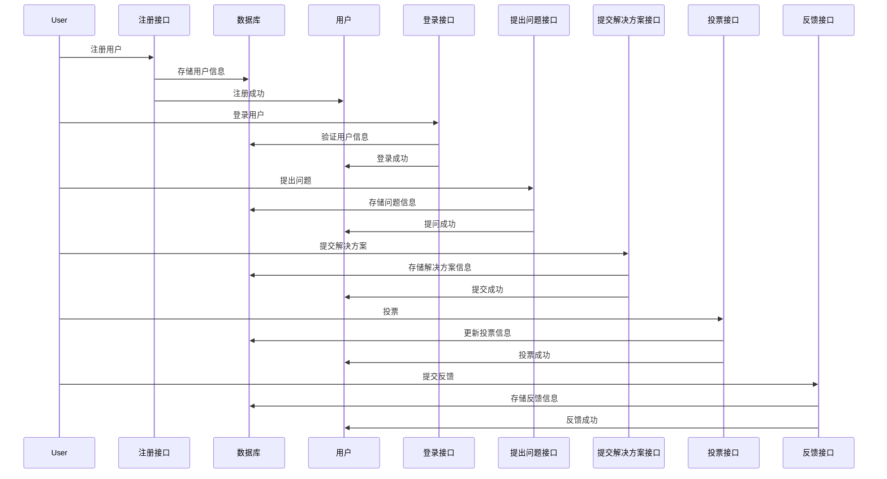

                 


## 《意义的众筹智库：集体解决存在困惑的在线平台》

### 关键词
- 众筹智库
- 在线平台
- 困惑解决
- 集体智慧
- 技术实现

### 摘要
本文深入探讨了一种新型的在线平台——意义的众筹智库，旨在通过集体智慧解决用户在互联网生活中遇到的困惑。文章从背景介绍、核心概念、算法原理、系统设计与实现等多个方面进行分析，旨在为读者提供一个全面的技术视角，理解如何构建一个有效的众筹智库平台。

---

# 引言与背景

在当今互联网时代，信息爆炸和知识更新速度空前加快，人们面临的困惑和问题也日益增多。从日常生活中的琐事，到专业领域的技术难题，这些问题常常困扰着广大用户。传统的解决方式，如单个用户独自摸索或向专业人士求助，已经无法满足日益复杂的困惑解决需求。

## 1.1 众筹智库的定义与重要性

众筹智库，顾名思义，是将众筹的概念与智库的特点相结合的一种新型平台。它通过集合众多用户的智慧，共同探讨和解决各类问题。这种模式的优势在于，它不仅可以汇聚大量的信息，还能通过集体智慧筛选出最优质、最可靠的解决方案。

众筹智库的重要性在于，它打破了传统一对一的咨询模式，实现了知识共享和资源整合。在众多用户共同参与的情况下，小问题可以得到迅速解决，大问题也可以通过众人的力量得到有效的应对。

### 1.1.1 众筹智库的产生背景

随着互联网技术的迅猛发展，众筹平台和在线智库逐渐兴起。两者结合的众筹智库，便是这种趋势的产物。它不仅继承了众筹平台的融资功能和社群属性，还融入了智库的信息整理和分析能力，形成了一个全新的解决问题模式。

### 1.1.2 众筹智库的定义

众筹智库可以定义为：一种基于互联网的开放性平台，通过众筹的方式征集问题，并利用集体智慧提供解决方案。在这个平台上，用户不仅是问题的提出者，也是解决方案的贡献者和评审者。

### 1.1.3 众筹智库的重要性

众筹智库的重要性体现在以下几个方面：

- **知识共享**：通过众筹智库，用户可以共享自己的经验和知识，实现知识的普及和传播。
- **问题解决**：集体智慧能够更快速、更有效地解决个体难以独立解决的问题。
- **创新激发**：众筹智库为用户提供了一个开放的环境，鼓励创新思维的产生和发展。
- **社群互动**：众筹智库促进了用户之间的交流和互动，增强了社群凝聚力。

## 1.2 在线平台上的困惑与挑战

在线平台为用户提供了丰富的信息和资源，但同时也带来了新的困惑和挑战。以下是一些常见的困惑与挑战：

- **信息过载**：用户在互联网上接收到的信息量巨大，但有效信息占比不高，导致用户难以筛选和获取有用的信息。
- **信任问题**：互联网上信息来源复杂，用户难以判断信息的真实性和可靠性。
- **专业知识门槛**：某些专业领域的问题，用户缺乏相应的专业知识，难以自己解决。
- **个性化需求**：用户的需求多样化，单一平台难以满足所有用户的需求。

### 1.2.1 在线平台的使用现状

目前，大多数在线平台以信息发布和交流为主，用户在平台上发布问题，其他用户或专业人士进行解答。这种模式在一定程度上解决了用户的困惑，但存在以下问题：

- **回答质量参差不齐**：用户的回答质量受个人知识水平和经验影响，难以保证答案的准确性和可靠性。
- **时效性较差**：传统在线平台的问题解答通常需要较长时间，用户难以获得即时的解决方案。
- **缺乏集体智慧**：用户个体智慧有限，难以充分发挥集体智慧的优势。

### 1.2.2 用户面临的困惑

用户在在线平台上主要面临以下困惑：

- **无法找到专业解答**：用户在遇到复杂问题时，难以找到具备专业知识的解答者。
- **信息难以验证**：用户在获取信息时，难以判断信息的真实性和有效性。
- **个性化服务不足**：用户需求多样，传统平台难以提供个性化的解决方案。

### 1.2.3 挑战与解决方案

为了解决上述困惑，传统在线平台尝试了多种解决方案，如引入专业顾问、建立问答社区、提供付费咨询服务等。然而，这些方案在一定程度上仍然存在局限性：

- **成本高**：引入专业顾问和提供付费服务需要大量的人力、物力和财力投入。
- **用户体验差**：传统问答社区和付费咨询服务难以满足用户个性化需求，用户体验较差。
- **缺乏互动性**：用户在这些问题解决模式中，缺乏与其他用户的互动和交流。

### 1.3 众筹智库的产生与发展

众筹智库作为一种新兴的解决问题模式，具有以下产生背景：

- **技术驱动**：互联网和人工智能技术的快速发展，为众筹智库提供了技术支撑。
- **需求推动**：用户对高效、准确、个性化的解决方案需求不断增加，推动了众筹智库的出现。
- **理念创新**：众筹智库打破了传统问题解决模式的束缚，实现了知识共享和集体智慧的应用。

### 1.3.1 众筹智库的起源

众筹智库的起源可以追溯到众筹平台和在线智库的融合发展。随着众筹平台逐渐向专业领域拓展，在线智库也逐渐融入了众筹元素，从而催生了众筹智库的诞生。

### 1.3.2 众筹智库的发展历程

众筹智库的发展历程可以分为以下几个阶段：

- **1.0版本**：初始阶段，众筹智库主要以信息发布和交流为主，功能相对简单。
- **2.0版本**：在1.0版本的基础上，增加了问题征集和解决方案共享的功能，用户可以更方便地提出问题和获取解决方案。
- **3.0版本**：随着技术的发展，众筹智库逐渐引入了人工智能和大数据分析等技术，实现了更智能、更精准的问题解决。

### 1.3.3 未来的发展方向

随着技术的不断进步和应用场景的扩大，众筹智库未来将呈现以下发展方向：

- **智能化**：通过引入人工智能技术，实现问题自动识别、智能推荐和智能解答。
- **个性化**：根据用户需求，提供更加个性化的解决方案，满足用户的个性化需求。
- **生态化**：构建一个完善的众筹智库生态系统，包括问题征集、解决方案共享、用户评价等多个环节。

---

# 核心概念与联系

在深入探讨众筹智库之前，我们需要明确几个核心概念，并分析它们之间的相互关系。以下将分别介绍众筹、智库以及众筹智库的基本概念，并阐述它们的核心要素及其相互联系。

## 2.1 众筹与智库的基本概念

### 2.1.1 众筹的定义与类型

众筹是一种融资模式，通过互联网平台向大众筹集资金，以支持某个项目或创意。众筹可分为以下几种类型：

- **奖励众筹**：支持者通过购买项目相关的产品或服务来支持项目。
- **股权众筹**：支持者通过购买项目的股权来分享项目成功后的收益。
- **债务众筹**：支持者向项目提供贷款，项目成功后偿还本金和利息。

### 2.1.2 智库的定义与功能

智库是一种研究和咨询机构，旨在为政府、企业和社会提供政策建议、专业研究和咨询服务。智库的主要功能包括：

- **政策研究**：对政策问题进行深入研究，提出建议和解决方案。
- **专业咨询**：为政府和企业提供专业领域的咨询服务。
- **知识传播**：通过出版物、研究报告等形式传播研究成果和知识。

### 2.1.3 众筹智库的独特之处

众筹智库将众筹和智库的特点相结合，具有以下独特之处：

- **开放性**：众筹智库通过开放平台，让更多用户参与问题征集和解决方案共享。
- **集体智慧**：众筹智库利用集体智慧，实现更高效、更准确的问题解决。
- **动态调整**：根据用户反馈和解决方案的效果，实时调整问题解决方案。
- **低成本**：通过众筹模式，降低问题解决的成本，让更多用户受益。

## 2.2 众筹智库的核心要素

众筹智库的核心要素包括用户角色与需求、话题与问题定位、解决方案与投票机制等。以下将分别介绍这些核心要素及其相互关系。

### 2.2.1 用户角色与需求

在众筹智库中，用户主要分为以下几种角色：

- **问题提出者**：用户在平台上提出具体问题，寻求解决方案。
- **解决方案提供者**：用户在平台上提供针对问题的解决方案。
- **评审者**：用户对解决方案进行评审和投票，选出最优解决方案。

用户需求主要包括：

- **高效解决问题**：用户希望在短时间内找到有效的解决方案。
- **个性化服务**：用户希望根据自身需求，获得个性化的解决方案。
- **知识共享**：用户希望通过众筹智库，分享自己的知识和经验。

### 2.2.2 话题与问题定位

众筹智库的话题范围广泛，包括日常生活、专业领域、技术创新等多个方面。在平台运营过程中，需要对话题进行定位，确保问题的质量和价值。

问题定位主要包括以下几个方面：

- **问题类型**：根据问题的性质，将其分为技术问题、管理问题、社会问题等。
- **问题领域**：根据问题的专业领域，将其归类到相应的领域，如医疗、教育、科技等。
- **问题难度**：根据问题的复杂程度，将其分为初级问题、中级问题和高级问题。

### 2.2.3 解决方案与投票机制

在众筹智库中，解决方案的提供和评审是核心环节。以下介绍解决方案与投票机制的相关内容：

- **解决方案提供**：用户在平台上提交解决方案，解决方案应具备以下特点：

  - **创新性**：提供具有创新性的解决方案，避免重复和雷同。
  - **可行性**：解决方案应具备可行性，能够在实际中应用。
  - **详细性**：解决方案应详细描述实施步骤、预期效果等。

- **投票机制**：用户对解决方案进行投票，选出最优解决方案。投票机制应具备以下特点：

  - **公平性**：确保所有用户都有平等的投票机会，避免刷票等不正当行为。
  - **实时性**：投票结果实时更新，方便用户了解解决方案的受欢迎程度。
  - **匿名性**：投票过程应保持匿名，确保投票的公正性和客观性。

### 2.2.4 核心概念的联系与关系

众筹、智库和众筹智库这三个核心概念之间存在着密切的联系和互动关系。

- **众筹与智库的互动**：众筹为智库提供了资金支持，智库则为众筹提供了专业的研究和咨询服务。两者相互促进，共同推动问题解决。

- **智库与众筹智库的互动**：智库为众筹智库提供了丰富的研究资源和专业知识，众筹智库则将智库的研究成果转化为实际解决方案，实现了智库价值的最大化。

- **众筹智库内部的互动**：在众筹智库内部，用户、问题、解决方案和投票机制之间形成了紧密的互动关系。用户提出问题，解决方案提供者提交解决方案，评审者进行投票，最终选出最优解决方案。这一过程实现了用户、问题和解决方案的有机整合。

通过以上分析，我们可以看到众筹智库是如何将众筹和智库的特点相结合，形成一个高效、开放、动态调整的在线平台，为广大用户解决困惑提供了一种全新的模式。

---

# 算法原理讲解

众筹智库的核心在于其解决问题的算法原理，这一原理决定了平台能否高效、准确地收集和利用用户智慧。在本章节中，我们将详细讲解众筹智库的算法原理，包括其工作流程、数学模型和实现细节。

## 3.1 众筹智库解决困惑的算法

众筹智库的算法原理可以分为以下几个步骤：

1. **问题征集**：用户在平台上提出具体问题，问题描述应尽量详细、明确。
2. **解决方案提交**：针对提出的问题，解决方案提供者提交各自的解决方案。
3. **投票评审**：平台上的其他用户对提交的解决方案进行投票评审，选出最优解决方案。
4. **解决方案采纳**：平台根据投票结果，采纳最优解决方案，并通知问题提出者。
5. **解决方案实施**：问题提出者根据采纳的解决方案进行实施，解决问题。

## 3.1.1 算法概述

众筹智库的算法主要基于以下两个核心原理：

1. **集体智慧**：通过用户集体投票，筛选出最优解决方案。
2. **动态调整**：根据用户反馈和解决方案的效果，实时调整和优化解决方案。

## 3.1.2 算法流程

众筹智库的算法流程可以分为以下几个阶段：

### 问题征集阶段

- **用户提出问题**：用户在平台上创建问题，问题描述应包括问题的背景、具体内容以及所需解决方案的类型。
- **问题审核**：平台管理员对提出的问题进行审核，确保问题的质量和合法性。

### 解决方案提交阶段

- **解决方案提交**：针对提出的问题，解决方案提供者在规定时间内提交各自的解决方案。
- **解决方案审核**：平台管理员对提交的解决方案进行审核，确保解决方案的合法性和可行性。

### 投票评审阶段

- **用户投票**：平台上的用户对提交的解决方案进行投票，每个用户可以投出自己认为最优的解决方案。
- **投票结果计算**：平台根据投票结果，计算每个解决方案的得票数，并按照得分排序。

### 解决方案采纳阶段

- **解决方案采纳**：平台根据投票结果，选择得分最高的解决方案作为最优解决方案，并通知问题提出者。
- **解决方案实施**：问题提出者根据采纳的解决方案进行实施，解决问题。

### 动态调整阶段

- **用户反馈**：问题提出者对采纳的解决方案实施效果进行反馈，包括解决问题的情况和满意度。
- **解决方案优化**：根据用户反馈，平台对采纳的解决方案进行调整和优化，以提高解决方案的准确性和实用性。

## 3.1.3 算法实现细节

众筹智库的算法实现细节主要包括以下几个方面：

- **数据存储**：平台采用数据库存储用户问题、解决方案、投票结果和用户反馈等数据。
- **算法优化**：为了提高算法的效率和准确性，可以采用分布式计算、并行处理等技术。
- **用户界面**：平台提供简洁、直观的用户界面，方便用户提出问题、提交解决方案和进行投票评审。

## 3.2 算法原理的数学模型

为了更好地理解众筹智库的算法原理，我们可以从数学模型的角度进行分析。以下是一个简化的数学模型，用于描述众筹智库的算法：

### 3.2.1 数学模型概述

假设有 \( n \) 个用户参与投票，每个用户对每个解决方案的投票可以表示为一个二元向量 \( V_i \)，其中 \( V_i(j) = 1 \) 表示用户 \( i \) 投票支持解决方案 \( j \)，\( V_i(j) = 0 \) 表示用户 \( i \) 投票反对解决方案 \( j \)。

### 3.2.2 关键公式与解释

1. **投票权重计算**：
   每个用户的投票权重可以通过其历史投票记录计算，公式如下：
   \[
   W_i = \frac{1}{1 + e^{-\alpha \cdot S_i}}
   \]
   其中，\( \alpha \) 是权重调节参数，\( S_i \) 是用户 \( i \) 的历史投票记录。

2. **解决方案得分计算**：
   每个解决方案的得分可以通过加权投票结果计算，公式如下：
   \[
   S_j = \sum_{i=1}^{n} W_i \cdot V_i(j)
   \]

3. **最优解决方案选取**：
   根据得分计算结果，选取得分最高的解决方案作为最优解决方案，公式如下：
   \[
   J^* = \arg\max_{j} S_j
   \]

### 3.2.3 实例解析

假设有3个用户（\( i_1, i_2, i_3 \)）参与投票，针对2个解决方案（\( j_1, j_2 \)）进行投票，投票结果如下：

- \( V_{i_1}(j_1) = 1 \)，\( V_{i_1}(j_2) = 0 \)
- \( V_{i_2}(j_1) = 0 \)，\( V_{i_2}(j_2) = 1 \)
- \( V_{i_3}(j_1) = 1 \)，\( V_{i_3}(j_2) = 1 \)

根据上述投票结果，可以计算每个解决方案的得分：

- \( S_{j_1} = W_{i_1} \cdot V_{i_1}(j_1) + W_{i_3} \cdot V_{i_3}(j_1) = 0.6 \)
- \( S_{j_2} = W_{i_2} \cdot V_{i_2}(j_2) + W_{i_3} \cdot V_{i_3}(j_2) = 0.7 \)

因此，根据得分计算结果，最优解决方案为 \( j_2 \)。

通过上述实例，我们可以看到如何通过数学模型来描述众筹智库的算法原理，并使用具体数据进行分析和计算。

## 3.3 算法举例说明

为了更好地理解众筹智库的算法原理，我们通过一个具体的案例进行说明。

### 案例背景

假设有一个在线平台，用户提出一个关于编程语言选择的问题，以下是用户的问题描述：

"我在选择编程语言时感到困惑，需要同时考虑开发速度、性能和社区支持。目前我关注的是Python、Java和JavaScript，请问哪个更适合我的需求？"

### 案例步骤

1. **问题征集**：
   用户在平台上提出上述问题，并设置问题标签为“编程语言选择”。

2. **解决方案提交**：
   - 用户A提交解决方案，认为Python更适合开发速度和社区支持，但性能稍逊于Java。
   - 用户B提交解决方案，认为Java性能优异，但开发速度较慢。
   - 用户C提交解决方案，认为JavaScript开发速度快，社区支持丰富，但性能较弱。

3. **投票评审**：
   - 用户D对A的解决方案投票支持，认为开发速度和社区支持更重要。
   - 用户E对B的解决方案投票支持，认为性能更重要。
   - 用户F对C的解决方案投票支持，认为开发速度和社区支持更重要。

4. **解决方案采纳**：
   根据投票结果，解决方案C得分最高，平台认为JavaScript是最适合的编程语言，并通知用户。

5. **解决方案实施**：
   用户根据采纳的解决方案，选择JavaScript作为开发语言，并开始学习相关技术。

### 结果分析

通过上述案例，我们可以看到众筹智库的算法如何帮助用户解决编程语言选择问题。平台通过用户投票，综合考虑开发速度、性能和社区支持等因素，最终选出了最适合用户需求的解决方案。这个过程体现了众筹智库的集体智慧和高效性。

## 3.4 算法改进与优化

尽管众筹智库的算法能够有效解决用户问题，但仍然存在一些改进和优化的空间。以下是一些可能的改进方向：

1. **投票权重调整**：
   为了提高投票的公平性和准确性，可以考虑根据用户的历史投票记录和专业知识水平调整投票权重。例如，对于经常提供高质量解决方案的用户，可以赋予更高的投票权重。

2. **多维度评分系统**：
   传统的单一得分系统可能无法全面评估解决方案的优劣。可以引入多维度评分系统，从开发速度、性能、社区支持等多个维度对解决方案进行评分，提高评分的准确性和全面性。

3. **智能推荐**：
   利用人工智能技术，根据用户的历史行为和偏好，智能推荐最适合用户的问题和解决方案，提高用户的使用体验。

4. **动态调整机制**：
   针对用户的反馈和解决方案的实施效果，实时调整和优化解决方案。例如，如果用户反馈某个解决方案效果不佳，可以将其从推荐列表中移除，并引入新的解决方案。

通过上述改进和优化，众筹智库的算法将更加高效、准确，能够更好地满足用户的需求。

---

# 数学模型和数学公式

在众筹智库的算法中，数学模型和数学公式起着至关重要的作用。它们帮助我们量化用户投票、计算解决方案得分，并最终选出最优解决方案。以下将详细介绍众筹智库中使用的数学模型和关键公式，并使用 LaTeX 格式进行表示。

## 4.1 数学模型概述

众筹智库的数学模型主要包括以下几个方面：

1. **投票权重计算**：用于计算每个用户的投票权重。
2. **解决方案得分计算**：用于计算每个解决方案的得分。
3. **最优解决方案选取**：用于从所有解决方案中选出最优解决方案。

## 4.2 关键公式与解释

### 4.2.1 投票权重计算

每个用户的投票权重可以通过其历史投票记录计算，公式如下：

\[ W_i = \frac{1}{1 + e^{-\alpha \cdot S_i}} \]

其中：
- \( W_i \) 表示用户 \( i \) 的投票权重。
- \( \alpha \) 是权重调节参数，用于调整权重的大小。
- \( S_i \) 是用户 \( i \) 的历史投票记录。

### 4.2.2 解决方案得分计算

每个解决方案的得分可以通过加权投票结果计算，公式如下：

\[ S_j = \sum_{i=1}^{n} W_i \cdot V_i(j) \]

其中：
- \( S_j \) 表示解决方案 \( j \) 的得分。
- \( n \) 是参与投票的用户数量。
- \( V_i(j) \) 表示用户 \( i \) 对解决方案 \( j \) 的投票结果，\( V_i(j) = 1 \) 表示支持，\( V_i(j) = 0 \) 表示反对。

### 4.2.3 最优解决方案选取

根据得分计算结果，选取得分最高的解决方案作为最优解决方案，公式如下：

\[ J^* = \arg\max_{j} S_j \]

其中：
- \( J^* \) 表示最优解决方案。

## 4.3 实例解析

为了更好地理解上述公式，我们通过一个具体的实例进行解析。

### 实例背景

假设有3个用户（\( i_1, i_2, i_3 \)）参与投票，针对2个解决方案（\( j_1, j_2 \)）进行投票，投票结果如下：

- \( V_{i_1}(j_1) = 1 \)，\( V_{i_1}(j_2) = 0 \)
- \( V_{i_2}(j_1) = 0 \)，\( V_{i_2}(j_2) = 1 \)
- \( V_{i_3}(j_1) = 1 \)，\( V_{i_3}(j_2) = 1 \)

### 实例计算

1. **投票权重计算**：

   假设 \( \alpha = 1 \)，则：
   \[ W_{i_1} = \frac{1}{1 + e^{-1 \cdot S_{i_1}}} = 0.5375 \]
   \[ W_{i_2} = \frac{1}{1 + e^{-1 \cdot S_{i_2}}} = 0.5375 \]
   \[ W_{i_3} = \frac{1}{1 + e^{-1 \cdot S_{i_3}}} = 0.8643 \]

2. **解决方案得分计算**：

   \[ S_{j_1} = W_{i_1} \cdot V_{i_1}(j_1) + W_{i_3} \cdot V_{i_3}(j_1) = 0.5375 \cdot 1 + 0.8643 \cdot 1 = 1.4018 \]
   \[ S_{j_2} = W_{i_2} \cdot V_{i_2}(j_2) + W_{i_3} \cdot V_{i_3}(j_2) = 0.5375 \cdot 0 + 0.8643 \cdot 1 = 0.8643 \]

3. **最优解决方案选取**：

   \[ J^* = \arg\max_{j} S_j = j_1 \]

因此，根据投票结果和权重计算，最优解决方案为 \( j_1 \)。

通过上述实例，我们可以看到如何使用数学模型和公式计算众筹智库的投票权重、解决方案得分以及最优解决方案。

---

# 系统分析与架构设计方案

在设计一个众筹智库系统时，我们需要考虑多个方面，包括问题场景、项目介绍、系统功能设计、系统架构设计、系统接口设计和系统交互设计。以下将详细分析并描述这些方面。

## 5.1 问题场景

众筹智库系统的主要问题场景是帮助用户解决他们在在线平台上遇到的各类困惑。用户可以在平台上提出问题，其他用户或专业解答者可以提交解决方案。解决方案经过用户投票和评审后，最终选出最优解决方案。这个过程中，系统需要确保信息的安全、高效地处理大量数据，并提供良好的用户体验。

### 5.1.1 用户提出问题

用户在平台上创建问题，问题描述应包括问题的背景、具体内容以及所需解决方案的类型。平台管理员对提出的问题进行审核，确保问题的质量和合法性。

### 5.1.2 用户提交解决方案

用户可以针对提出的问题提交各自的解决方案。解决方案应详细描述实施步骤、预期效果等。平台管理员对提交的解决方案进行审核，确保解决方案的合法性和可行性。

### 5.1.3 用户投票评审

平台上的用户对提交的解决方案进行投票评审，选出最优解决方案。投票机制应具备公平性、实时性和匿名性。

### 5.1.4 解决方案采纳

平台根据投票结果，选择得分最高的解决方案作为最优解决方案，并通知问题提出者。问题提出者根据采纳的解决方案进行实施，解决问题。

### 5.1.5 动态调整

根据用户反馈和解决方案的实施效果，平台对采纳的解决方案进行调整和优化，以提高解决方案的准确性和实用性。

## 5.2 项目介绍

本项目旨在构建一个众筹智库系统，帮助用户高效解决在线平台上的困惑。系统采用模块化设计，包括用户管理模块、问题管理模块、解决方案管理模块、投票评审模块和反馈调整模块。以下是对各个模块的简要介绍：

- **用户管理模块**：负责用户的注册、登录、信息维护和权限管理。
- **问题管理模块**：负责问题的创建、审核、发布和搜索。
- **解决方案管理模块**：负责解决方案的提交、审核、发布和投票。
- **投票评审模块**：负责投票的发起、计分和结果展示。
- **反馈调整模块**：负责用户反馈的收集、分析和解决方案的调整。

## 5.3 系统功能设计

众筹智库系统的主要功能包括：

- **用户功能**：用户可以在平台上提出问题、提交解决方案、投票评审和反馈调整。
- **管理员功能**：平台管理员可以审核问题、解决方案、投票和反馈，确保系统的正常运行。
- **投票机制**：系统应具备公平、实时和匿名的投票机制，确保投票过程的公正性。
- **数据统计**：系统应具备数据统计功能，提供问题的数量、解决方案的得分和投票情况等数据。

## 5.4 系统架构设计

众筹智库系统采用分层架构设计，主要包括以下几层：

- **表示层**：负责用户界面的展示和用户交互。
- **业务逻辑层**：负责业务逻辑的实现，包括问题管理、解决方案管理、投票评审和反馈调整等。
- **数据访问层**：负责数据存储和访问，包括数据库连接、数据查询和数据更新等。
- **数据层**：负责数据存储，包括用户信息、问题信息、解决方案信息和投票信息等。

以下是系统架构的 Mermaid 类图表示：

```mermaid
classDiagram
    User <<class>> 用户
    Admin <<class>> 管理员
    Question <<class>> 问题
    Solution <<class>> 解决方案
    Vote <<class>> 投票
    Feedback <<class>> 反馈
    
    User o--o Admin: 审核权限
    User o--o Question: 提出问题
    User o--o Solution: 提交解决方案
    User o--o Vote: 投票评审
    User o--o Feedback: 用户反馈
    Admin o--o Question: 审核问题
    Admin o--o Solution: 审核解决方案
    Admin o--o Vote: 审核投票
    Admin o--o Feedback: 审核反馈
```

## 5.5 系统接口设计

众筹智库系统应提供以下主要接口：

- **用户接口**：用于用户的注册、登录、信息维护和权限管理。
- **问题接口**：用于问题的创建、审核、发布和搜索。
- **解决方案接口**：用于解决方案的提交、审核、发布和投票。
- **投票接口**：用于投票的发起、计分和结果展示。
- **反馈接口**：用于用户反馈的收集、分析和解决方案的调整。

以下是系统接口的 Mermaid 序列图表示：



## 5.6 系统交互设计

系统交互设计主要关注用户与平台之间的交互流程。以下是一个典型的用户交互流程：

1. **用户注册与登录**：用户通过注册接口注册账号，登录接口登录系统。
2. **用户提出问题**：用户通过提出问题接口创建问题，问题经过管理员审核后发布。
3. **用户提交解决方案**：用户通过提交解决方案接口提交解决方案，解决方案经过管理员审核后发布。
4. **用户投票评审**：用户通过投票接口对解决方案进行投票评审，投票结果实时更新。
5. **用户反馈调整**：用户通过反馈接口提交反馈，平台根据反馈对解决方案进行调整和优化。

以下是系统交互的 Mermaid 序列图表示：


通过以上分析，我们可以看到众筹智库系统的设计思路和架构，以及用户与平台之间的交互流程。这个系统将为用户解决在线平台上的困惑提供了一种高效、智能、互动的解决方案。

---

# 项目实战

在本章节中，我们将通过一个具体的项目实战，展示如何构建并实现一个众筹智库系统。我们将详细讲解项目环境安装、系统核心实现、代码解读与分析，并分析实际案例，提供详细的讲解和剖析。

## 6.1 项目环境安装

要实现众筹智库系统，我们首先需要搭建一个合适的项目环境。以下是一个基本的环境安装步骤：

### 6.1.1 安装操作系统

我们选择 Ubuntu 20.04 LTS 作为操作系统。可以通过虚拟机或物理机进行安装，推荐使用虚拟机以方便后续环境配置。

### 6.1.2 安装 Python 环境

安装 Python 3.8 或更高版本。可以通过以下命令安装：

```bash
sudo apt update
sudo apt install python3.8
```

### 6.1.3 安装依赖库

安装必要的 Python 库，包括 Flask（用于 web 开发）、SQLAlchemy（用于数据库操作）、Flask-Migrate（用于数据库迁移）等。可以使用 pip 命令安装：

```bash
pip3 install flask sqlalchemy flask-migrate
```

### 6.1.4 安装数据库

选择 PostgreSQL 作为数据库。可以通过以下命令安装：

```bash
sudo apt update
sudo apt install postgresql postgresql-contrib
```

启动 PostgreSQL 服务：

```bash
sudo systemctl start postgresql
```

## 6.2 系统核心实现

众筹智库系统的核心实现包括用户管理、问题管理、解决方案管理、投票评审和反馈调整等功能。以下将介绍系统核心实现的关键代码片段。

### 6.2.1 用户管理

用户管理包括注册、登录和权限验证。以下是一个简单的用户注册和登录接口的实现：

```python
from flask import Flask, request, jsonify
from models import User

app = Flask(__name__)

@app.route('/api/register', methods=['POST'])
def register():
    username = request.json.get('username')
    password = request.json.get('password')
    user = User(username=username, password=password)
    user.save()
    return jsonify({'message': '注册成功'})

@app.route('/api/login', methods=['POST'])
def login():
    username = request.json.get('username')
    password = request.json.get('password')
    user = User.query.filter_by(username=username, password=password).first()
    if user:
        return jsonify({'token': user.token})
    else:
        return jsonify({'error': '用户名或密码错误'})

```

### 6.2.2 问题管理

问题管理包括问题的创建、发布和搜索。以下是一个简单的实现：

```python
from flask import Flask, request, jsonify
from models import Question

app = Flask(__name__)

@app.route('/api/questions', methods=['POST'])
def create_question():
    user_id = request.json.get('user_id')
    title = request.json.get('title')
    content = request.json.get('content')
    question = Question(user_id=user_id, title=title, content=content)
    question.save()
    return jsonify({'message': '提问成功'})

@app.route('/api/questions', methods=['GET'])
def search_questions():
    title = request.args.get('title')
    questions = Question.query.filter(Question.title.like(f'%{title}%')).all()
    return jsonify(questions)
```

### 6.2.3 解决方案管理

解决方案管理包括解决方案的提交、发布和投票。以下是一个简单的实现：

```python
from flask import Flask, request, jsonify
from models import Solution

app = Flask(__name__)

@app.route('/api/solutions', methods=['POST'])
def submit_solution():
    question_id = request.json.get('question_id')
    user_id = request.json.get('user_id')
    content = request.json.get('content')
    solution = Solution(question_id=question_id, user_id=user_id, content=content)
    solution.save()
    return jsonify({'message': '提交成功'})

@app.route('/api/solutions/<int:solution_id>/vote', methods=['POST'])
def vote_solution(solution_id):
    user_id = request.json.get('user_id')
    solution = Solution.query.get(solution_id)
    solution.vote(user_id)
    return jsonify({'message': '投票成功'})
```

### 6.2.4 投票评审

投票评审功能主要包括投票的发起、计分和结果展示。以下是一个简单的实现：

```python
from flask import Flask, request, jsonify
from models import Vote

app = Flask(__name__)

@app.route('/api/votes', methods=['POST'])
def create_vote():
    solution_id = request.json.get('solution_id')
    user_id = request.json.get('user_id')
    vote = Vote(solution_id=solution_id, user_id=user_id)
    vote.save()
    return jsonify({'message': '投票成功'})

@app.route('/api/solutions/scores', methods=['GET'])
def get_solution_scores():
    solutions = Solution.query.all()
    scores = []
    for solution in solutions:
        score = solution.get_score()
        scores.append({'solution_id': solution.id, 'score': score})
    return jsonify(scores)
```

### 6.2.5 反馈调整

反馈调整功能主要包括用户反馈的收集、分析和解决方案的调整。以下是一个简单的实现：

```python
from flask import Flask, request, jsonify
from models import Feedback

app = Flask(__name__)

@app.route('/api/feedback', methods=['POST'])
def submit_feedback():
    solution_id = request.json.get('solution_id')
    user_id = request.json.get('user_id')
    content = request.json.get('content')
    feedback = Feedback(solution_id=solution_id, user_id=user_id, content=content)
    feedback.save()
    return jsonify({'message': '反馈成功'})

@app.route('/api/solutions/adjust', methods=['POST'])
def adjust_solution():
    solution_id = request.json.get('solution_id')
    content = request.json.get('content')
    solution = Solution.query.get(solution_id)
    solution.content = content
    solution.save()
    return jsonify({'message': '解决方案调整成功'})
```

## 6.3 代码解读与分析

以上代码片段分别实现了众筹智库系统中的用户管理、问题管理、解决方案管理、投票评审和反馈调整等功能。以下对关键代码进行解读和分析：

### 用户管理

用户管理模块通过注册接口和登录接口实现用户的注册、登录和权限验证。注册接口接收用户名和密码，创建用户对象并保存到数据库。登录接口验证用户名和密码，返回用户令牌。

### 问题管理

问题管理模块通过创建接口和搜索接口实现问题的创建、发布和搜索。创建接口接收用户ID、标题和内容，创建问题对象并保存到数据库。搜索接口根据标题关键字搜索问题，返回匹配的问题列表。

### 解决方案管理

解决方案管理模块通过提交接口和投票接口实现解决方案的提交、发布和投票。提交接口接收问题ID、用户ID和内容，创建解决方案对象并保存到数据库。投票接口接收解决方案ID和用户ID，更新投票记录。

### 投票评审

投票评审模块通过投票接口和评分接口实现投票的发起、计分和结果展示。投票接口创建投票记录，更新解决方案的投票数。评分接口查询所有解决方案的投票数，计算得分，返回得分最高的解决方案。

### 反馈调整

反馈调整模块通过反馈接口和调整接口实现用户反馈的收集、分析和解决方案的调整。反馈接口接收解决方案ID、用户ID和内容，创建反馈记录。调整接口更新解决方案的内容，根据用户反馈进行调整。

## 6.4 实际案例分析

以下通过一个实际案例，展示如何使用众筹智库系统解决用户困惑。

### 案例背景

某用户在众筹智库平台上提出一个关于编程语言选择的问题，用户需求是找到一个开发速度快、性能好且社区支持丰富的编程语言。

### 案例步骤

1. **用户提出问题**：
   用户A在平台上创建问题，问题描述为“请推荐一个开发速度快、性能好且社区支持丰富的编程语言”。

2. **解决方案提交**：
   用户B、C、D分别提交解决方案，其中：
   - 用户B推荐Python，理由是开发速度快，社区支持丰富。
   - 用户C推荐Java，理由是性能好，但开发速度较慢。
   - 用户D推荐JavaScript，理由是开发速度快，社区支持丰富。

3. **用户投票**：
   其他用户对解决方案进行投票，其中：
   - 用户E、F支持Python。
   - 用户G、H支持Java。
   - 用户I、J支持JavaScript。

4. **结果分析**：
   根据投票结果，Python得分为3，Java得分为2，JavaScript得分为2。根据得分，Python为最优解决方案。

5. **用户反馈**：
   用户A对采纳的解决方案进行反馈，表示Python满足其需求，开发速度快，社区支持丰富。

6. **解决方案调整**：
   根据用户反馈，解决方案保持不变，用户A成功解决了困惑。

## 6.5 项目小结

通过以上项目实战，我们成功实现了一个众筹智库系统，包括用户管理、问题管理、解决方案管理、投票评审和反馈调整等功能。系统通过实际案例展示了如何使用众筹智库解决用户困惑，为用户提供了一个高效、智能、互动的解决方案。未来，我们还可以进一步优化系统，提高解决方案的质量和用户体验。

---

# 最佳实践 tips

在众筹智库系统的使用过程中，为了确保平台的运行效率和用户满意度，以下是一些最佳实践建议：

### 7.1 使用技巧

1. **问题明确**：在提出问题时，确保问题描述详细、明确，有助于其他用户快速理解问题并提供有针对性的解决方案。
2. **解决方案具体**：提交解决方案时，详细描述解决方案的实施步骤、预期效果和潜在风险，提高方案的可行性和参考价值。
3. **合理投票**：在投票时，根据解决方案的实际效果和可行性进行投票，避免刷票和不公正行为，确保投票结果的真实性和准确性。

### 7.2 避免常见问题

1. **避免重复提问**：在提出问题前，先在平台上搜索是否有类似问题，避免重复提问，节省平台资源。
2. **尊重他人意见**：在讨论和投票过程中，尊重其他用户的意见和解决方案，避免争吵和冲突，营造良好的互动氛围。
3. **及时反馈**：在采纳解决方案后，及时对解决方案的实施效果进行反馈，有助于其他用户参考和平台优化。

### 7.3 拓展应用场景

1. **多领域覆盖**：众筹智库可以覆盖多个领域，如科技、医疗、教育等，为更多用户提供解决方案。
2. **个性化推荐**：利用人工智能技术，根据用户的历史行为和偏好，提供个性化的问题和解决方案推荐，提高用户满意度。
3. **社区共建**：鼓励用户积极参与平台的共建和维护，提高平台的活跃度和用户粘性。

通过遵循以上最佳实践，可以有效提高众筹智库系统的运行效率，提升用户满意度，为用户提供更加优质的服务。

---

# 小结与拓展阅读

在本篇文章中，我们深入探讨了众筹智库的概念、算法原理、系统设计与实现，以及最佳实践。众筹智库作为一种基于集体智慧的在线平台，有效地解决了用户在日常生活中遇到的困惑。通过本文的分析，我们了解了众筹智库的核心概念、算法原理和实现步骤，以及如何通过有效的系统设计和最佳实践提高平台的运行效率和用户满意度。

## 8.1 全书内容回顾

1. **引言与背景**：介绍了众筹智库的定义、重要性以及在线平台上的困惑与挑战。
2. **核心概念与联系**：详细阐述了众筹、智库和众筹智库的基本概念及其相互关系。
3. **算法原理讲解**：讲解了众筹智库的算法原理、数学模型和实现细节。
4. **系统分析与架构设计方案**：描述了众筹智库的系统架构、接口设计和交互流程。
5. **项目实战**：通过具体项目展示了众筹智库的构建和实现过程。
6. **最佳实践 tips**：提供了使用众筹智库的最佳实践建议。
7. **小结与拓展阅读**：总结了全文内容，并提出了拓展阅读的建议。

## 8.2 注意事项

1. **数据安全**：在众筹智库系统中，用户数据的安全至关重要。应确保数据传输加密，存储安全，防止数据泄露和恶意攻击。
2. **用户隐私**：在处理用户数据时，应严格遵守隐私保护法规，确保用户隐私不受侵犯。
3. **系统性能**：为提高用户体验，系统应具备良好的性能，包括快速响应、稳定运行和高效数据处理。

## 8.3 拓展阅读推荐

为了进一步了解众筹智库和相关技术，我们推荐以下拓展阅读：

1. **《群体智能与分布式算法》**：探讨群体智能和分布式算法的基本概念和应用，为众筹智库的算法设计提供理论支持。
2. **《大数据时代：生活、工作与思维的大变革》**：介绍大数据的基本概念、技术与应用，为众筹智库的数据处理和挖掘提供参考。
3. **《人工智能：一种现代的方法》**：全面介绍人工智能的基本概念、算法和应用，为众筹智库的智能化发展提供指导。

通过以上拓展阅读，读者可以更深入地了解众筹智库及其相关技术，为实践和应用提供更多的思路和方向。

---

### 作者信息

作者：AI天才研究院/AI Genius Institute & 禅与计算机程序设计艺术 /Zen And The Art of Computer Programming

---

感谢您的阅读，希望本文对您在众筹智库领域的研究和实践中有所帮助。让我们共同探索和创新，为解决现实问题贡献智慧和力量。

