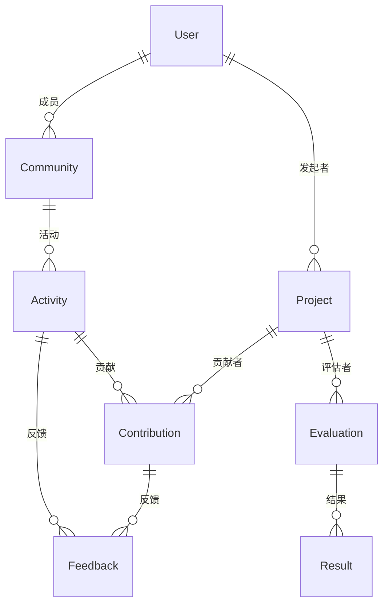
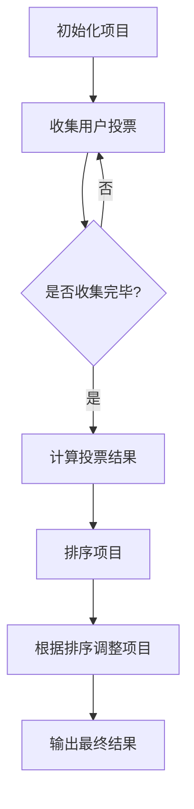
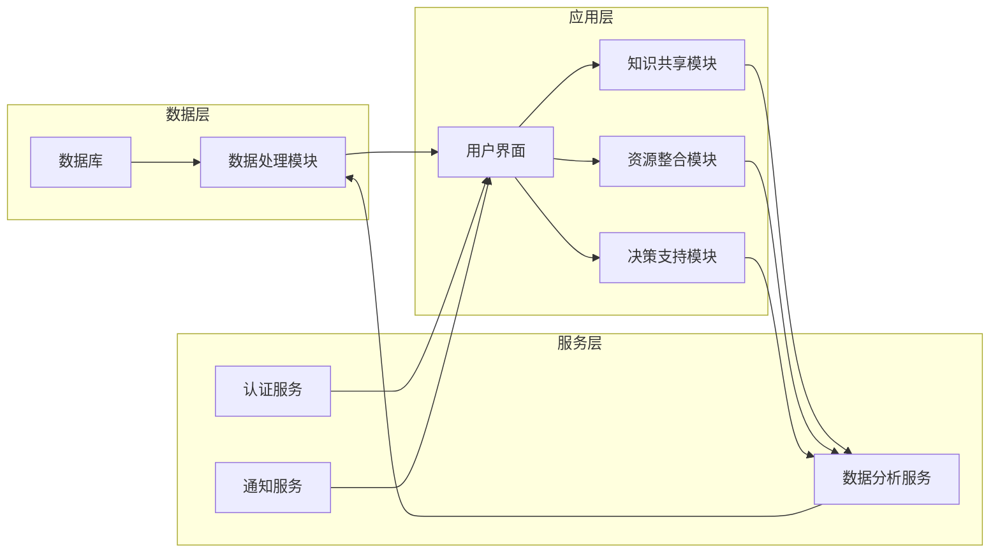
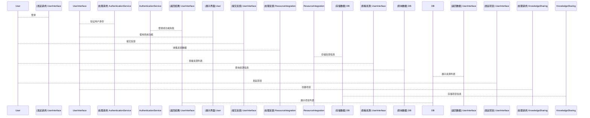

                 

## 引言与背景

### 集体智慧与价值共创的概念

集体智慧（Collective Intelligence）是指由多个个体通过协作、互动和共享信息，共同解决复杂问题或实现共同目标的能力。它不仅包括个体之间的知识共享和协同工作，还涉及对集体行为的理解和指导。集体智慧的本质在于通过集体成员的智慧和贡献，产生比单个个体更优秀的结果。

价值共创（Value Co-creation）则强调在价值产生过程中，消费者、供应商、合作伙伴等多个利益相关者共同参与，通过互动和协作，共同创造价值和获取价值。与传统商业模式中单一主体创造价值不同，价值共创强调多主体共同参与，通过协作和共享，实现更广泛的资源整合和更高效的价值创造。

### 集体智慧与价值共创的发展背景

随着互联网和信息技术的发展，集体智慧逐渐从理论走向实践。互联网为个体之间的协作提供了广阔的平台，使得信息共享和知识整合变得更加容易。同时，社交媒体、在线社区等新兴平台也为集体智慧的形成提供了重要的支撑。

价值共创的概念则起源于对传统商业模式局限性的反思。在传统商业模式中，企业往往以自我为中心，追求利润最大化。而价值共创则强调企业、消费者和其他利益相关者之间的互动和协作，通过共同创造价值来提高整体效益。

### 文章的核心内容和目的

本文旨在深入探讨集体智慧与价值共创的关系，分析其理论基础、实践路径以及在各个领域的应用。通过系统性的分析，本文希望能够揭示集体智慧在价值共创中的关键作用，为企业和组织提供实施集体智慧和价值共创策略的参考。

### 结构安排

本文结构如下：

1. **第一部分：引言与背景**：介绍集体智慧与价值共创的基本概念、发展背景以及文章的核心内容和目的。
2. **第二部分：集体智慧与价值共创的原理**：分析集体智慧的理论基础，包括社会计算、共识理论、群体智能理论等，并探讨这些理论在集体智慧和价值共创中的应用。
3. **第三部分：集体智慧与价值共创的实践路径**：通过典型案例分析，探讨集体智慧和价值共创的实施路径和策略，并分析面临的挑战和应对方法。
4. **第四部分：集体智慧与价值共创在各个领域的应用**：分别介绍集体智慧与价值共创在商业、供应链管理、市场预测等领域的应用。

### 关键词

- 集体智慧
- 价值共创
- 社会计算
- 共识理论
- 群体智能
- 众筹
- 共享经济
- 平台化运营

### 摘要

本文首先介绍了集体智慧与价值共创的基本概念和发展背景，接着分析了集体智慧的理论基础，包括社会计算、共识理论和群体智能理论。随后，通过典型案例分析，探讨了集体智慧和价值共创的实施路径和策略。最后，本文详细介绍了集体智慧与价值共创在商业、供应链管理、市场预测等领域的应用，并分析了面临的挑战和应对方法。通过本文的研究，希望能够为企业和组织在实施集体智慧和价值共创方面提供有价值的参考。

## 第一部分：引言与背景

### 集体智慧的概念与演变

集体智慧（Collective Intelligence，CI）是一个多维度的概念，涉及多个个体如何通过协作、互动和共享信息，共同解决复杂问题或实现共同目标。这一概念最早由Henshaw和Johnson于1931年提出，他们认为集体智慧是多个个体通过协同作用，超越个体智能，实现更高效和复杂的任务。

随着时间的推移，集体智慧的理论和实践不断演变。20世纪80年代，社会计算（Social Computing）的兴起为集体智慧的研究提供了新的视角。社会计算关注的是个体如何通过计算技术和网络平台进行信息交换和协同工作，从而形成集体智慧。代表性的研究包括Lettieri等人的工作，他们提出了社会计算框架，用于分析集体智慧的形成和运作机制。

进入21世纪，随着互联网和大数据技术的快速发展，集体智慧的研究和应用进一步深化。现代的集体智慧研究不仅关注个体的协同，还涉及到人工智能、机器学习等技术的应用，以提升集体决策和问题解决的效率。

### 集体智慧的特点与优势

集体智慧具有以下主要特点：

1. **协作性**：集体智慧强调个体之间的合作与互动，通过共享信息和资源，实现共同目标。
2. **多样性**：集体智慧依赖于多样化的个体视角和知识，这种多样性有助于提高问题解决和决策的全面性和准确性。
3. **自组织性**：集体智慧能够自发地形成和调整，以适应不同的环境和需求。
4. **适应性**：集体智慧能够快速响应变化，适应新的挑战和机遇。

集体智慧的优势在于：

1. **提高决策质量**：通过集体智慧，可以汇聚多个个体的智慧和经验，提高决策的质量和科学性。
2. **优化资源利用**：集体智慧能够更有效地整合资源，降低浪费，提高整体效率。
3. **增强创新力**：集体智慧为创新提供了丰富的知识和视角，有助于发掘新的解决方案和商业模式。
4. **增强社会责任**：集体智慧可以促进社会参与和公共利益，增强社会责任感和可持续发展能力。

### 集体智慧的应用领域

集体智慧的应用领域广泛，涵盖了科学研究、商业决策、社会治理等多个方面：

1. **科学研究**：在科学研究领域，集体智慧被广泛应用于科学合作、数据分析和问题解决。例如，科学家通过在线平台共享研究成果，协作解决复杂的科学问题。
2. **商业决策**：商业企业利用集体智慧进行市场预测、产品创新和客户需求分析。通过收集和分析大量用户数据，企业可以更准确地把握市场趋势，制定更有效的营销策略。
3. **社会治理**：在公共管理和社会治理领域，集体智慧有助于提升决策的透明度和民主性。政府机构和市民可以通过在线平台进行互动，共同参与政策制定和城市管理。

### 集体智慧的发展趋势

未来，随着人工智能和区块链技术的发展，集体智慧有望进一步深化和扩展。以下是一些可能的发展趋势：

1. **智能化**：人工智能技术将提升集体智慧的计算和分析能力，使其在更复杂的任务中发挥作用。
2. **平台化**：随着在线平台的普及，集体智慧将更加平台化，为更多个体提供协作和共享的机会。
3. **去中心化**：区块链技术将推动集体智慧的去中心化发展，减少中心化的依赖，提高系统的透明度和安全性。
4. **跨领域融合**：集体智慧将与其他领域的技术和概念深度融合，形成新的交叉学科和应用领域。

通过不断的技术创新和应用探索，集体智慧将在各个领域发挥更大的作用，推动社会进步和经济发展。

### 集体智慧的发展历程

集体智慧的概念经历了多个阶段的发展。最早期的集体智慧研究主要集中在个体的协作和合作上，强调通过简单规则实现复杂行为的集体行为模式。这一阶段的研究主要关注的是个体如何通过局部规则实现整体行为，代表性的模型包括蚂蚁的集体行动和鸟群的群体飞行。

20世纪80年代，随着计算机科学和社会学的发展，社会计算理论逐渐兴起，为集体智慧的研究提供了新的理论基础。社会计算强调个体通过网络平台进行信息交换和协同工作，从而形成集体智慧。这一阶段的研究重点在于如何通过计算技术和网络平台支持集体智慧的运作，代表性的成果包括基于社交网络的分析和协作系统。

进入21世纪，随着互联网和大数据技术的迅猛发展，集体智慧的研究和应用进入了一个新的阶段。这一阶段的研究不仅关注个体之间的协同和合作，还涉及到人工智能、机器学习等技术的应用，以提升集体决策和问题解决的效率。代表性的应用包括在线知识共享平台、智能决策系统和社交媒体平台。

### 集体智慧的特点

集体智慧具有以下几个显著特点：

1. **多样性**：集体智慧依赖于多样化的个体视角和知识，这种多样性有助于提高问题解决和决策的全面性和准确性。
2. **适应性**：集体智慧能够快速适应新的环境和需求，通过自组织性和自适应性，实现持续优化和演进。
3. **协作性**：集体智慧强调个体之间的协作和互动，通过信息共享和资源整合，实现共同目标。
4. **自组织性**：集体智慧能够自发地形成和调整，以适应不同的环境和需求。

### 集体智慧的优势

集体智慧的优势在于：

1. **提高决策质量**：通过集体智慧，可以汇聚多个个体的智慧和经验，提高决策的质量和科学性。
2. **优化资源利用**：集体智慧能够更有效地整合资源，降低浪费，提高整体效率。
3. **增强创新力**：集体智慧为创新提供了丰富的知识和视角，有助于发掘新的解决方案和商业模式。
4. **增强社会责任**：集体智慧可以促进社会参与和公共利益，增强社会责任感和可持续发展能力。

### 集体智慧在社会中的作用

集体智慧在社会中的作用日益显著，具体体现在以下几个方面：

1. **公共管理**：在公共管理领域，集体智慧有助于提升决策的透明度和民主性。政府机构和市民可以通过在线平台进行互动，共同参与政策制定和城市管理。
2. **科学研究**：在科学研究领域，集体智慧通过科学合作、数据分析和问题解决，推动科学研究的进展。科学家通过在线平台共享研究成果，协作解决复杂的科学问题。
3. **商业应用**：商业企业利用集体智慧进行市场预测、产品创新和客户需求分析。通过收集和分析大量用户数据，企业可以更准确地把握市场趋势，制定更有效的营销策略。
4. **社会治理**：在公共治理领域，集体智慧有助于提升社会治理的效率和公正性。通过集体智慧和数据分析，政府可以更好地应对社会问题，提高公共服务的质量和效率。

### 集体智慧与价值共创的关系

集体智慧和价值共创之间存在着密切的关系。集体智慧为价值共创提供了基础，而价值共创则为集体智慧提供了应用场景和动力。

1. **基础关系**：集体智慧通过个体之间的协作和共享，为价值共创提供了知识和资源的整合平台。个体通过参与集体智慧活动，可以获取新的知识和技术，从而提升自身的创新能力。
2. **应用关系**：价值共创则通过实践场景，推动集体智慧的发展。在价值共创的过程中，个体和集体需要不断地协作和互动，通过这种互动，集体智慧得以不断优化和演进。

### 集体智慧在价值共创中的作用

集体智慧在价值共创中具有以下重要作用：

1. **知识整合**：通过集体智慧，个体可以共享和整合各自的知识和经验，形成更全面和深入的知识体系，从而提高决策的科学性和准确性。
2. **创新驱动**：集体智慧为创新提供了丰富的视角和资源，通过多样性和协作性，可以激发新的创意和解决方案。
3. **资源优化**：集体智慧能够更有效地整合和利用资源，降低浪费，提高整体效率。
4. **社会参与**：集体智慧鼓励更多的个体参与价值共创过程，增强社会责任感和可持续发展能力。

### 集体智慧与价值共创的互动机制

集体智慧和价值共创之间的互动机制主要体现在以下几个方面：

1. **信息共享**：个体通过集体智慧平台共享信息，促进知识的流动和整合。
2. **协同工作**：个体在集体智慧环境中协同工作，共同解决复杂问题。
3. **反馈机制**：个体通过集体智慧和反馈机制，不断调整和优化自身的创新和决策过程。
4. **激励机制**：通过合理的激励机制，鼓励个体积极参与集体智慧和价值共创活动。

### 集体智慧在价值共创中的实践路径

集体智慧在价值共创中的实践路径包括以下几个方面：

1. **构建协作平台**：通过建立开放的协作平台，促进个体之间的信息共享和协同工作。
2. **激发参与热情**：通过激励机制和社交互动，激发个体参与集体智慧和价值共创的热情。
3. **整合资源**：通过资源整合，提高整体效率和价值创造的潜力。
4. **动态调整**：根据反馈和实际情况，不断调整和优化集体智慧和价值共创的实践路径。

### 集体智慧时代的价值共创模式

在集体智慧时代，价值共创模式呈现出多样化和创新化的趋势。以下是一些典型的价值共创模式：

1. **众筹模式**：通过众筹平台，个体可以共同筹集资金，支持创新项目或创意的实现。
2. **共享经济模式**：通过共享资源和平台，实现价值的最大化，如Airbnb和Uber等平台的运营模式。
3. **平台化运营模式**：通过构建平台，连接供需双方，实现资源的优化配置和价值共创。
4. **共创社区**：通过在线社区，个体可以共同探讨和解决实际问题，实现知识的共享和创新。

### 集体智慧与价值共创的社会影响

集体智慧与价值共创不仅改变了商业模式的运作方式，也对社会产生了深远的影响：

1. **经济影响**：通过促进创新和资源优化，集体智慧和价值共创有助于提高生产效率和经济增长。
2. **文化影响**：集体智慧和共享文化的兴起，推动了社会的协作精神和共同价值观的形成。
3. **社会治理**：通过集体智慧和开放平台，社会治理变得更加透明和民主，提高了公共管理的效率。
4. **社会参与**：集体智慧和价值共创鼓励更多的个体参与社会事务，增强了社会责任感和公民意识。

### 本章小结

本章从集体智慧的概念、特点、优势、应用领域以及与价值共创的关系等方面进行了深入探讨。通过分析集体智慧的发展历程和实践路径，我们了解了集体智慧在价值共创中的重要性和应用价值。下一章将深入探讨集体智慧的理论基础，包括社会计算、共识理论和群体智能理论，以进一步理解集体智慧的本质和运作机制。

## 第二部分：集体智慧与价值共创的原理

### 社会计算理论

#### 社会计算的定义

社会计算（Social Computing）是指利用计算技术来支持个体之间的社会互动和协作。它关注的是如何通过计算手段，如社交网络分析、数据挖掘、机器学习等，来理解、模拟和增强人类社会行为和过程。

社会计算的基本原理包括以下几点：

1. **数据收集与存储**：通过传感器、社交网络、在线平台等手段，收集大量的社会数据，并进行有效的存储和管理。
2. **数据挖掘与分析**：利用数据挖掘和机器学习技术，从海量数据中提取有价值的信息和知识，支持决策和问题解决。
3. **社会互动与协作**：通过社交网络、虚拟社区等平台，促进个体之间的互动和协作，实现知识共享和共同目标。

#### 社会计算在集体智慧中的应用

社会计算在集体智慧中发挥着重要作用，主要体现在以下几个方面：

1. **知识共享**：通过社交网络和在线平台，个体可以方便地共享知识和经验，实现知识的传播和扩散。
2. **协同工作**：社会计算支持个体之间的协同工作，通过共享资源和任务分配，提高问题解决和创新的效率。
3. **共识形成**：社会计算可以分析个体之间的意见和行为，帮助集体形成共识，提高决策的质量和科学性。
4. **行为预测**：通过对个体行为的分析和预测，社会计算可以预测集体行为趋势，为管理和决策提供参考。

### 共识理论

#### 共识的定义

共识（Consensus）是指在一个群体中，个体通过互动和协作，共同达成一致意见或决策的过程。在集体智慧中，共识的形成是实现有效协作和决策的关键。

#### 共识的形成机制

共识的形成机制主要包括以下几个步骤：

1. **信息共享**：个体之间通过社交网络和平台，共享各自的信息和观点，为共识的形成提供基础。
2. **讨论与辩论**：个体之间就不同观点进行讨论和辩论，通过交流和互动，逐步达成共识。
3. **表决与投票**：在讨论和辩论的基础上，通过表决和投票等方式，最终形成集体决策或共识。
4. **反馈与调整**：在共识形成后，通过反馈和调整，确保共识的有效性和适应性。

#### 共识在集体智慧中的实现

在集体智慧中，共识的实现主要通过以下几个途径：

1. **分布式决策**：通过分布式计算和协作，集体成员可以共同参与决策过程，形成共识。
2. **社会化推荐**：基于个体之间的社交关系和信任，通过社会化推荐系统，实现共识的形成。
3. **智能合约**：利用区块链技术，通过智能合约实现自动化共识，减少人为干预，提高共识的效率和公正性。
4. **群体智能**：通过群体智能技术，分析个体行为和意见，实现共识的自动生成和优化。

### 群体智能理论

#### 群体智能的定义

群体智能（Swarm Intelligence）是指由多个简单个体通过局部交互和协作，共同实现复杂任务或目标的现象。这些个体通常缺乏全局意识和集中控制，但通过自组织和协同作用，能够展现出高效的集体行为。

#### 群体智能的运作机制

群体智能的运作机制主要包括以下几个部分：

1. **个体行为**：每个个体根据自身的感知和简单规则，自主决策和行动。
2. **局部交互**：个体之间通过局部交互，共享信息和资源，协同完成任务。
3. **自组织**：个体通过自组织过程，形成有序的结构和模式，实现高效的任务执行。
4. **适应性**：群体智能能够适应环境变化和任务需求，通过学习和进化，不断优化集体行为。

#### 群体智能在价值共创中的应用

群体智能在价值共创中具有广泛应用，主要体现在以下几个方面：

1. **任务分配**：通过群体智能，可以实现任务的有效分配和优化，提高整体效率。
2. **问题解决**：群体智能能够通过协作和协同，解决复杂的问题，实现创新和突破。
3. **资源整合**：通过群体智能，可以实现资源的有效整合和优化，降低浪费，提高整体效益。
4. **市场预测**：群体智能可以分析大量数据，进行市场预测和趋势分析，为决策提供支持。

### 集体智慧的动力学模型

#### 动力学模型的基本原理

动力学模型（Dynamical Model）是一种用于描述系统动态行为的数学模型，它通过描述系统内部各变量之间的相互关系和演化规律，来模拟系统的行为和演化过程。

#### 集体智慧动力学模型的应用

集体智慧动力学模型主要应用于以下几个方面：

1. **群体行为模拟**：通过动力学模型，可以模拟群体智能的行为和演化过程，理解集体决策的形成机制。
2. **共识形成分析**：通过动力学模型，可以分析个体之间如何通过互动和协作，形成共识和集体决策。
3. **资源优化配置**：通过动力学模型，可以优化资源的配置和利用，提高整体效率和效益。
4. **社会行为预测**：通过动力学模型，可以预测社会行为和趋势，为管理和决策提供参考。

#### 动力学模型在价值共创中的作用

动力学模型在价值共创中具有重要作用，主要体现在以下几个方面：

1. **决策支持**：通过动力学模型，可以模拟和分析不同决策路径的效益和风险，为决策提供科学依据。
2. **资源整合**：通过动力学模型，可以优化资源的配置和利用，实现资源的最优配置和高效利用。
3. **创新驱动**：通过动力学模型，可以激发新的创意和解决方案，推动价值共创的创新和发展。
4. **社会影响**：通过动力学模型，可以分析集体智慧和价值共创对社会的影响，为社会治理和政策制定提供参考。

### 集体智慧与价值共创的机制分析

集体智慧和价值共创的机制分析主要涉及以下几个方面：

1. **产生机制**：分析个体如何通过协作和共享，形成集体智慧和共同创造价值的过程。
2. **优化机制**：分析如何通过反馈和调整，优化集体智慧和价值共创的效果。
3. **转化机制**：分析如何将集体智慧和共创的价值转化为实际的商业价值和社会效益。

#### 集体智慧的产生机制

集体智慧的产生机制主要依赖于以下几个关键要素：

1. **个体参与**：个体积极参与集体智慧和协作过程，共享信息和资源。
2. **互动与协作**：个体通过互动和协作，实现知识的共享和创新。
3. **信息流动**：通过有效的信息流动和共享机制，促进个体之间的信息交换和知识积累。
4. **激励机制**：通过合理的激励机制，鼓励个体积极参与集体智慧和协作。

#### 集体智慧的优化机制

集体智慧的优化机制主要涉及以下几个方面：

1. **反馈机制**：通过反馈机制，个体可以及时了解集体智慧和协作的效果，进行相应的调整和优化。
2. **自组织机制**：通过自组织机制，集体智慧能够自我调整和优化，适应不同的环境和需求。
3. **协作效率**：通过优化协作流程和机制，提高个体之间的协作效率和整体效能。

#### 集体智慧的价值转化机制

集体智慧的价值转化机制主要涉及以下几个方面：

1. **商业化转化**：通过将集体智慧和共创的价值转化为商业产品和服务，实现商业价值的最大化。
2. **社会效益转化**：通过集体智慧和共创，实现社会效益的提升，如改善公共服务、促进社会公平等。
3. **创新推广**：通过集体智慧和共创，推广新的技术和理念，推动社会进步和经济发展。

### 本章小结

本章深入探讨了集体智慧与价值共创的原理，包括社会计算、共识理论、群体智能理论以及动力学模型。通过分析这些理论，我们理解了集体智慧和价值共创的基本机制、应用方法和优化策略。这些理论为集体智慧和价值共创提供了坚实的理论基础，为后续的实践和应用提供了指导。在接下来的章节中，我们将进一步探讨集体智慧和价值共创的具体实践路径和案例分析。

## 第三部分：集体智慧与价值共创的实践路径

### 集体智慧与价值共创的关键环节

集体智慧与价值共创的实现离不开以下几个关键环节：

1. **用户参与**：用户作为集体智慧和价值共创的核心参与者，其积极性和参与度直接影响整个过程的成效。用户参与不仅包括对产品或服务的需求反馈，还包括在创意设计、产品开发、市场推广等环节的深度参与。
   
2. **资源整合**：资源整合是集体智慧和价值共创的重要环节，通过有效整合各类资源，如人力、资金、技术等，可以最大化利用资源，提高效率和价值创造的潜力。

3. **创新合作**：创新合作强调个体和群体之间的协作，通过共享知识和经验，共同面对挑战，实现创新突破。创新合作不仅限于技术领域，还包括商业模式、管理方法等各个方面的创新。

### 用户参与与价值共创

用户参与是集体智慧和价值共创的核心。用户不仅是价值的消费者，更是价值的共创者。以下是一些用户参与的具体方式：

1. **需求反馈**：通过用户反馈，企业可以了解用户对产品或服务的需求和满意度，从而不断改进和优化。

2. **共创平台**：构建开放的共创平台，用户可以参与到产品的设计、开发、测试等各个环节，提出建议和创意，与开发者共同改进产品。

3. **用户社区**：建立用户社区，用户可以相互交流和分享经验，形成良好的用户生态系统，推动产品和服务的持续改进。

4. **用户激励**：通过用户激励措施，如积分、奖励、荣誉等，鼓励用户积极参与到集体智慧和价值共创过程中。

### 资源整合与价值共创

资源整合是集体智慧和价值共创的关键。以下是一些资源整合的策略：

1. **跨部门合作**：打破部门壁垒，实现跨部门的信息共享和资源协同，提高整体运作效率。

2. **平台化整合**：构建开放的平台，将各类资源整合在一起，如资金、技术、人才等，实现资源的最大化利用。

3. **外部合作**：与外部合作伙伴建立合作关系，共同开发和推广产品或服务，实现资源互补和优势共享。

4. **共享经济**：通过共享经济模式，实现资源的共享和高效利用，如共享办公空间、共享汽车等。

### 创新合作与价值共创

创新合作是集体智慧和价值共创的重要手段。以下是一些创新合作的策略：

1. **开放式创新**：通过开放式创新，吸引外部创新资源和创意，共同开发和推广新产品或服务。

2. **跨界合作**：与不同领域的合作伙伴进行跨界合作，融合不同领域的知识和资源，实现创新突破。

3. **研发合作**：与高校、研究机构等建立研发合作关系，共同开展前沿技术研究，推动技术创新。

4. **知识产权合作**：通过知识产权合作，共同开发和保护创新成果，提高创新的价值和竞争力。

### 集体智慧与价值共创的典型案例分析

为了更好地理解集体智慧与价值共创的实践路径，以下分析几个典型案例：

#### 案例一：Kickstarter上的众筹项目

Kickstarter是一个著名的众筹平台，许多创新项目通过Kickstarter获得了资金支持。Kickstarter的成功在于其实现了用户参与和资源整合的完美结合。项目发起者可以通过平台展示项目，用户可以浏览项目并提出建议，同时通过捐款支持项目。这种模式不仅为项目提供了资金支持，还通过用户参与促进了产品的改进和创新。

**案例解析**：

- **用户参与**：用户通过参与项目的讨论和反馈，可以影响项目的方向和设计，提高了用户的满意度和忠诚度。
- **资源整合**：Kickstarter通过平台整合了大量的创新项目和潜在投资者，实现了资源的优化配置和高效利用。
- **价值共创**：Kickstarter平台不仅为项目提供了资金，还通过用户的参与和反馈，促进了产品的创新和优化。

#### 案例二：Airbnb的共享经济模式

Airbnb通过共享经济模式，将个人闲置的房源转化为商业资源，实现了价值共创。Airbnb的成功在于其打破了传统的住宿模式，通过用户参与和资源整合，实现了价值的最大化。

**案例解析**：

- **用户参与**：Airbnb的用户不仅是房东，还是房客，他们的积极参与和反馈，使得平台能够不断优化服务，提升用户体验。
- **资源整合**：Airbnb通过平台整合了大量的房源资源，实现了资源的最大化利用，降低了住宿成本，提高了整体服务质量。
- **价值共创**：Airbnb通过共享经济模式，为房东和房客创造了双赢的局面，不仅提高了资源利用效率，还促进了社会的可持续发展。

#### 案例三：GitHub上的开源社区

GitHub是一个著名的开源平台，开发者可以在GitHub上共享代码，合作开发项目。GitHub的成功在于其构建了一个开放的创新生态系统，通过集体智慧和资源整合，实现了价值的共创。

**案例解析**：

- **用户参与**：GitHub上的开发者通过协作和共享，共同推动技术的进步和创新，用户不仅参与项目的开发，还参与了产品的改进。
- **资源整合**：GitHub通过平台整合了大量的开发者和项目资源，实现了资源的优化配置和高效利用。
- **价值共创**：GitHub上的开源项目不仅提高了开发者的技术水平，还推动了整个技术生态的发展，为整个行业创造了巨大的价值。

### 集体智慧与价值共创的实施策略

为了实现集体智慧和价值共创，企业可以采取以下实施策略：

1. **构建开放的协作平台**：通过构建开放的协作平台，鼓励用户参与，实现知识共享和资源整合。
2. **激发用户参与热情**：通过激励机制，如积分、奖励、荣誉等，激发用户的参与热情，提高参与度。
3. **优化资源整合机制**：通过优化资源整合机制，提高资源利用效率，实现价值的最大化。
4. **推动跨界合作**：与不同领域的合作伙伴进行跨界合作，共同开发新产品或服务，实现创新和价值共创。

### 集体智慧与价值共创的挑战与应对

尽管集体智慧和价值共创具有巨大的潜力，但在实际应用中仍面临一系列挑战：

1. **隐私保护与数据安全**：在集体智慧和价值共创过程中，用户数据的安全和隐私保护至关重要。企业需要采取有效的数据保护措施，确保用户数据的安全。
2. **质量控制与标准化**：集体智慧和价值共创涉及到大量的用户参与和创新，如何保证产品质量和标准化是一个挑战。企业需要建立完善的质量控制机制和标准化流程。
3. **知识产权保护**：在集体智慧和价值共创过程中，如何保护知识产权是一个关键问题。企业需要建立合理的知识产权保护机制，确保创新成果得到有效保护。

### 本章小结

通过本文的讨论，我们深入探讨了集体智慧和价值共创的实践路径，包括用户参与、资源整合和创新合作等关键环节。通过分析典型案例，我们了解了集体智慧和价值共创的具体实施策略和挑战。在接下来的章节中，我们将进一步探讨集体智慧和价值共创在各个领域的应用，以期为读者提供更全面的了解。

### 集体智慧与价值共创在商业领域的应用

#### 集体智慧在商业决策中的应用

在商业领域，集体智慧已成为提升决策质量和效率的重要工具。企业通过集体智慧，能够汇聚来自不同部门、不同层级以及外部合作伙伴的智慧，从而做出更科学、更全面的决策。

1. **市场预测**：通过集体智慧，企业可以收集和分析大量的市场数据，如消费者行为、市场需求等，从而更准确地预测市场趋势。例如，零售企业可以利用社交媒体数据、在线评论等，分析消费者偏好，预测销售趋势。

2. **产品创新**：集体智慧在产品创新中的应用尤为突出。通过开放式创新平台，企业可以吸引外部开发者、用户和其他利益相关者共同参与产品设计和开发。这种模式不仅能够加速创新进程，还能够确保产品更符合市场需求。

3. **战略规划**：在战略规划过程中，集体智慧可以提供多角度、多维度的见解，帮助企业制定更全面、更具前瞻性的战略。例如，通过集体讨论和头脑风暴，企业可以识别潜在的机会和风险，从而优化战略决策。

#### 集体智慧与价值共创在产品创新中的应用

产品创新是商业领域的重要驱动力，集体智慧在其中的应用极大地提升了创新效率和成功率。

1. **开放式创新平台**：开放式创新平台是企业借助外部智慧，共同开发新产品的重要工具。例如，3M公司的“15%时间”政策，允许员工将15%的工作时间用于个人兴趣项目，这种模式极大地激发了员工的创新潜力，产生了许多成功的产品。

2. **用户参与**：用户参与是产品创新的重要环节。企业可以通过用户调研、在线社区、众筹等方式，获取用户的反馈和建议，从而改进产品。例如，苹果公司通过用户反馈不断优化其产品，使其始终保持市场领先地位。

3. **跨领域合作**：跨领域合作通过整合不同领域的知识和资源，实现产品创新的突破。例如，宝马和谷歌的合作项目，通过将汽车技术与人工智能相结合，推出了创新的自动驾驶汽车。

#### 集体智慧在市场预测中的应用

市场预测是企业决策的重要基础，集体智慧在其中的应用有助于提高预测的准确性和可靠性。

1. **大数据分析**：大数据分析是集体智慧在市场预测中的关键应用。企业可以通过分析海量数据，识别市场趋势和消费者行为，从而做出更准确的预测。例如，亚马逊利用大数据分析，预测产品需求，优化库存管理。

2. **社会媒体监测**：通过监测社交媒体上的用户讨论和趋势，企业可以了解消费者的情感和需求，从而预测市场趋势。例如，可口可乐通过监测社交媒体上的用户评论和讨论，了解消费者对产品的反馈，调整市场策略。

3. **专家意见整合**：集体智慧可以整合专家的意见和预测，提高预测的准确性。例如，金融机构通过专家意见和数据分析，预测市场走势，制定投资策略。

#### 集体智慧在供应链管理中的应用

供应链管理是企业运营的关键环节，集体智慧在其中的应用有助于优化供应链效率，降低成本。

1. **需求预测**：通过集体智慧，企业可以更准确地预测市场需求，从而优化生产和库存管理。例如，沃尔玛通过大数据分析和用户行为预测，优化其库存管理，减少库存成本。

2. **物流优化**：集体智慧可以帮助企业优化物流流程，降低物流成本。通过共享运输信息和资源，企业可以实现物流网络的优化。例如，UPS通过集体智慧和物流优化技术，提高了物流效率，降低了运输成本。

3. **供应链协同**：通过集体智慧，企业可以与供应链合作伙伴实现协同管理，提高整体供应链的效率。例如，供应商和制造商通过共享生产和需求信息，实现生产计划的协同，减少库存和延迟。

#### 集体智慧在商业模式创新中的应用

集体智慧在商业模式创新中的应用，为企业提供了新的发展机遇。

1. **共享经济**：共享经济模式通过集体智慧和资源整合，实现了传统商业模式的有效补充。例如，Uber和Airbnb通过平台化运营，实现了闲置资源的共享和价值的最大化。

2. **平台化运营**：平台化运营通过构建开放的协作平台，连接供需双方，实现资源的高效配置和价值共创。例如，阿里巴巴通过电商平台的构建，连接了海量卖家和买家，实现了商业模式的创新。

3. **生态化发展**：生态化发展强调企业与其生态合作伙伴之间的协同发展，通过集体智慧和资源整合，实现共同成长。例如，苹果公司通过构建开发者生态系统，实现了硬件和软件的协同创新。

### 本章小结

集体智慧与价值共创在商业领域的广泛应用，极大地提升了企业的决策质量、创新能力和市场竞争力。通过市场预测、产品创新、供应链管理和商业模式创新等多个方面的应用，企业能够更好地适应市场变化，实现可持续发展。未来，随着技术的不断进步和应用的深化，集体智慧和价值共创将在商业领域发挥更加重要的作用。企业应积极拥抱集体智慧和价值共创，通过创新和协作，实现商业模式的转型和升级。

### 集体智慧与价值共创在供应链管理中的应用

在供应链管理中，集体智慧与价值共创正成为提升效率和优化资源分配的关键驱动力。以下从需求预测、物流优化和供应链协同三个方面，详细探讨集体智慧在供应链管理中的应用。

#### 需求预测

需求预测是供应链管理中的重要环节，准确的预测有助于企业合理安排生产和库存，避免供需失衡。通过集体智慧，企业可以汇集来自不同部门、供应商、分销商以及最终消费者的信息，形成一个全面、多维的需求预测模型。

1. **大数据分析**：企业可以通过大数据分析技术，对历史销售数据、市场趋势、季节性变化等因素进行深入分析，预测未来需求。例如，亚马逊利用其海量的销售数据和用户行为数据，通过机器学习算法，实现了对商品需求的精确预测。

2. **社会媒体监测**：通过监测社交媒体上的用户评论、趋势和讨论，企业可以捕捉消费者情绪和需求变化，为需求预测提供额外的参考。例如，服装品牌Zara通过分析社交媒体上的用户反馈，及时调整其产品设计和库存管理。

3. **协同预测**：企业可以与供应链合作伙伴共同进行需求预测，通过共享信息，提高预测的准确性。例如，零售商与供应商通过电子数据交换（EDI）系统，共享销售数据和库存信息，实现更精准的需求预测。

#### 物流优化

物流优化是提升供应链效率的关键。通过集体智慧，企业可以优化物流流程，减少运输成本，提高配送速度。

1. **路径优化**：通过集体智慧和算法优化，企业可以优化运输路径，减少运输时间和成本。例如，UPS使用其智能物流系统，通过分析交通流量、天气等因素，实时调整运输路线，提高配送效率。

2. **资源共享**：企业可以通过共享物流资源，实现资源的最优配置。例如，物流平台Jerrid整合了多个物流供应商的资源，为客户提供更灵活、高效的物流服务。

3. **实时监控**：通过物联网技术和实时数据监控，企业可以实时跟踪货物状态，及时发现并解决物流问题。例如，沃尔玛通过其智能物流系统，实时监控库存和配送状态，确保供应链的顺畅运行。

#### 供应链协同

供应链协同是提升整体供应链效率的关键。通过集体智慧，企业可以实现与供应链合作伙伴的高效协同，提高整体供应链的响应速度和灵活性。

1. **信息共享**：企业可以通过电子数据交换（EDI）系统、区块链技术等，实现供应链各环节的信息共享，提高协同效率。例如，耐克通过其供应链平台，与供应商、分销商和零售商实现信息共享，优化供应链管理。

2. **协作计划**：企业可以与供应链合作伙伴共同制定生产计划、库存策略等，实现供应链的协同运作。例如，丰田汽车通过与其供应商的紧密协作，实现了JIT（准时制）生产，减少了库存和运输成本。

3. **风险控制**：通过集体智慧和风险预警系统，企业可以提前识别和应对供应链风险，降低供应链中断的可能性。例如，波音公司通过实时监控全球供应链，及时应对供应链风险，确保生产计划的顺利进行。

#### 案例分析

为了更直观地理解集体智慧在供应链管理中的应用，以下分析两个实际案例：

**案例一：沃尔玛的物流优化**

沃尔玛通过其智能物流系统，实现了对物流过程的实时监控和优化。通过大数据分析和实时数据监控，沃尔玛能够优化运输路径，减少运输时间和成本。此外，沃尔玛还与物流服务提供商合作，共享物流资源，提高整体物流效率。

**案例二：耐克的供应链协同**

耐克通过其供应链平台，实现了与供应商、分销商和零售商的信息共享和协作计划。通过电子数据交换（EDI）系统和区块链技术，耐克能够实时共享库存、销售和运输信息，优化供应链管理。这种协同模式不仅提高了供应链的响应速度，还降低了库存和运输成本。

### 集体智慧与价值共创在供应链管理中的挑战与对策

尽管集体智慧和价值共创在供应链管理中具有巨大的潜力，但在实际应用中仍面临一系列挑战：

1. **数据隐私与安全**：在供应链管理中，大量的数据交换和共享可能导致数据隐私和安全问题。企业需要采取有效的数据保护措施，确保数据的安全性和隐私性。

2. **标准化与质量控制**：集体智慧和价值共创涉及多个部门和合作伙伴，如何保证产品质量和标准化是一个挑战。企业需要建立统一的质量标准和质量控制流程，确保供应链的稳定性和可靠性。

3. **合作机制与信任**：在供应链管理中，企业需要与多个合作伙伴进行协作，建立有效的合作机制和信任关系至关重要。企业应通过透明的沟通和合作机制，建立长期稳定的合作伙伴关系。

### 本章小结

通过集体智慧和价值共创，供应链管理实现了需求预测、物流优化和供应链协同的全面提升。通过案例分析，我们了解了集体智慧和价值共创在实际应用中的成功经验和挑战。未来，随着技术的不断进步和应用深度的增加，集体智慧和价值共创将在供应链管理中发挥更加重要的作用，推动供应链的智能化和高效化发展。

### 集体智慧与价值共创在市场预测中的应用

在市场预测中，集体智慧与价值共创正成为一种颠覆传统预测方法的创新工具。通过整合多源数据和广泛参与，集体智慧能够提高预测的准确性和可靠性，帮助企业做出更明智的决策。

#### 数据来源

市场预测的数据来源广泛，包括但不限于以下几类：

1. **历史销售数据**：企业的历史销售数据是预测市场趋势的重要依据。通过分析过去销售记录，企业可以识别季节性变化、消费者偏好和市场需求。

2. **消费者行为数据**：通过社交媒体、电商平台和客户反馈，企业可以收集消费者的行为数据，如搜索记录、购买历史、评价等。这些数据有助于了解消费者的真实需求和期望。

3. **宏观经济数据**：宏观经济指标如GDP、失业率、消费者信心指数等，对市场需求有重要影响。企业可以通过分析宏观经济数据，预测市场趋势。

4. **市场趋势报告**：行业分析报告、市场研究报告等，提供了行业和市场趋势的深度分析，是企业制定市场预测的重要参考。

#### 数据整合

整合多种数据来源，形成统一的数据集，是提高市场预测准确性的关键。以下是一些数据整合的方法：

1. **数据融合**：将来自不同渠道的数据进行整合，通过数据清洗、归一化和融合算法，消除数据中的不一致性和冗余信息。

2. **多源数据融合模型**：使用多源数据融合模型，如融合推理模型、多任务学习模型等，将不同类型的数据进行整合，提高预测的准确性和全面性。

3. **实时数据处理**：利用实时数据处理技术，如流处理框架（如Apache Kafka、Apache Flink等），及时更新和整合数据，实现动态预测。

#### 集体智慧的作用

集体智慧在市场预测中发挥着至关重要的作用，通过以下方式提高预测的准确性和可靠性：

1. **多角度分析**：集体智慧能够汇聚来自不同部门和外部合作伙伴的见解，实现多角度分析。通过不同视角的数据和观点，企业可以更全面地理解市场动态。

2. **协同预测**：集体智慧支持协同预测，通过多部门、多机构的合作，共享数据和预测模型，提高预测的准确性。例如，零售企业可以与供应商、分销商共同进行需求预测，优化库存管理。

3. **自适应预测**：集体智慧能够通过不断学习和调整预测模型，实现自适应预测。随着市场环境的变化，预测模型可以自动调整，适应新的需求。

#### 应用案例

以下是一些实际案例，展示了集体智慧在市场预测中的应用：

**案例一：亚马逊的市场预测**

亚马逊通过其强大的数据分析和机器学习技术，实现了对市场需求的精确预测。通过分析用户行为、历史销售数据、市场趋势等多维数据，亚马逊能够实时调整库存和销售策略，提高市场响应速度和准确性。

**案例二：可口可乐的需求预测**

可口可乐利用大数据分析和社交媒体监测，实现了对其饮料需求的有效预测。通过分析消费者行为、社交媒体讨论和市场趋势，可口可乐能够预测不同产品和地区的需求，优化生产和分销策略。

**案例三：星巴克的市场预测**

星巴克通过其全球门店的销售数据和消费者反馈，实现了对咖啡市场需求的有效预测。通过分析季节性变化、消费者偏好和市场需求，星巴克能够优化其产品组合和市场营销策略，提高市场份额。

### 集体智慧与价值共创在市场预测中的挑战

尽管集体智慧在市场预测中具有巨大潜力，但在实际应用中仍面临以下挑战：

1. **数据隐私与安全**：市场预测需要大量的数据，如何确保数据的安全和隐私是一个关键问题。企业需要采取有效的数据保护措施，确保数据不被滥用。

2. **数据质量**：数据质量是市场预测准确性的基础。企业需要确保数据的准确性和完整性，通过数据清洗和验证，提高数据质量。

3. **协作机制**：在集体智慧环境中，如何建立有效的协作机制，确保各参与方共享数据和资源的透明度和公正性，是一个挑战。

### 本章小结

集体智慧与价值共创在市场预测中正发挥着越来越重要的作用。通过整合多源数据、协同预测和自适应调整，集体智慧能够提高预测的准确性和可靠性，帮助企业做出更明智的决策。尽管面临数据隐私、数据质量和协作机制等挑战，但随着技术的不断进步和应用深度的增加，集体智慧和价值共创将在市场预测中发挥更加重要的作用，推动企业的可持续发展。

### 集体智慧与价值共创在各个领域的应用总结

集体智慧与价值共创作为一种新兴的模式，已经在多个领域展现出其强大的潜力和广泛的应用价值。通过本文的探讨，我们可以总结出以下几个关键点：

#### 商业领域的应用

在商业领域，集体智慧与价值共创主要表现在市场预测、产品创新和供应链管理等方面。通过大数据分析、社会媒体监测和跨领域合作，企业能够更准确地预测市场趋势，创新产品设计和优化供应链管理。例如，亚马逊和可口可乐等公司通过大数据和集体智慧，实现了市场需求的精准预测和高效运营。

#### 供应链管理领域的应用

在供应链管理中，集体智慧通过需求预测、物流优化和供应链协同，大大提升了供应链的效率和灵活性。企业通过实时数据监控、资源共享和协同计划，实现了物流路径优化、库存管理和供应链风险控制的全面提升。例如，沃尔玛和UPS等公司通过智能物流系统和供应链协同，实现了高效、稳定的供应链运营。

#### 市场预测领域的应用

市场预测是商业决策的重要基础，集体智慧通过多角度分析、协同预测和自适应调整，提高了预测的准确性和可靠性。企业通过多源数据的整合和集体智慧的协作，能够更全面地理解市场动态，制定更科学的决策。例如，亚马逊和可口可乐等公司通过大数据分析和社交媒体监测，实现了对市场需求的精确预测。

#### 社会治理领域的应用

在公共管理和社会治理领域，集体智慧与价值共创同样具有重要的应用价值。通过开放的平台和协作机制，政府机构和市民可以共同参与政策制定、城市管理和社会治理。例如，通过在线平台，政府可以更好地了解市民的需求和意见，提高公共服务的质量和效率。

#### 文化创新领域的应用

文化创新是集体智慧和价值共创的重要应用领域之一。通过用户参与、资源共享和跨领域合作，文化创新项目能够更加多元化和创新化。例如，通过众筹平台和开放式创新，艺术家和创意人士可以共同创作和推广新的文化作品，推动文化产业的繁荣发展。

#### 科技创新领域的应用

在科技创新领域，集体智慧通过跨学科合作、资源整合和知识共享，促进了科技的创新和突破。通过构建开放的创新生态系统，企业和研究机构可以共同开发新技术和解决方案，推动科技的进步。例如，通过开源社区和开放式创新，开发者可以共同合作，开发出更加先进和实用的技术。

#### 教育领域的应用

在教育领域，集体智慧与价值共创通过在线教育和开放课程，促进了知识的传播和共享。学生和教师通过在线平台，可以共同学习、交流和分享经验，实现教育的普惠化和个性化。例如，通过MOOC（大规模开放在线课程），学生可以随时随地学习世界顶尖大学提供的课程，拓宽知识视野。

#### 医疗健康领域的应用

在医疗健康领域，集体智慧通过患者参与、数据共享和协同治疗，提高了医疗服务的质量和效率。患者可以通过在线平台分享病历、健康数据和医疗建议，医生可以基于这些数据提供个性化的治疗方案。例如，通过电子健康记录和远程医疗服务，医生可以实时监测患者的健康状况，提供及时的治疗建议。

#### 生态保护领域的应用

在生态保护领域，集体智慧通过公众参与、资源共享和协同管理，促进了生态保护和可持续发展。公众可以通过在线平台参与生态保护活动，共享生态监测数据，政府可以基于这些数据制定更科学的生态保护政策。例如，通过生态监测平台和公民科学项目，公众可以共同参与生态保护工作，提高生态保护的效果。

### 深入研究与应用前景

尽管集体智慧与价值共创在多个领域已经取得了显著的成果，但未来的研究和应用仍然充满挑战和机遇。以下是一些值得深入研究的方向和应用前景：

1. **智能化与自动化**：随着人工智能和机器学习技术的发展，集体智慧有望实现更加智能化和自动化的应用。通过智能算法和自动化系统，集体智慧可以更高效地处理大量数据，提供更精准的预测和决策。

2. **隐私保护与安全**：在集体智慧和价值共创中，数据隐私和安全是一个关键挑战。未来的研究需要开发更先进的数据保护技术，确保数据的安全和隐私。

3. **跨领域融合**：集体智慧与价值共创需要在不同领域之间实现深度融合。通过跨领域合作和资源共享，可以实现更广泛的协同和创新。

4. **可持续发展**：集体智慧和价值共创在可持续发展中具有巨大的潜力。通过优化资源利用、减少浪费和推动绿色创新，可以实现社会的可持续发展。

5. **社会治理与公共管理**：在公共管理和社会治理领域，集体智慧与价值共创可以推动社会治理的现代化和智能化。通过开放的平台和协作机制，政府可以更好地了解公众需求，提高公共服务的质量和效率。

6. **教育与文化**：在教育和文化领域，集体智慧和价值共创可以推动知识的普及和文化的传承。通过在线教育和开放课程，可以实现教育的普惠化和文化的多元化。

7. **医疗健康**：在医疗健康领域，集体智慧和价值共创可以推动个性化医疗和远程医疗服务的发展。通过大数据分析和智能诊断，可以提供更精准、更个性化的医疗服务。

8. **生态保护**：在生态保护领域，集体智慧和价值共创可以推动生态保护和可持续发展。通过公众参与和协同管理，可以更有效地保护生态环境，实现人与自然的和谐共处。

总之，集体智慧与价值共创作为一种新兴的模式，正在深刻地改变着社会和经济的发展。通过深入研究和广泛应用，集体智慧和价值共创有望在各个领域发挥更大的作用，推动社会的进步和可持续发展。未来，随着技术的不断进步和应用深度的增加，集体智慧和价值共创将继续拓展其应用范围，成为推动社会变革的重要力量。

### 集体智慧与价值共创：技术发展与应用展望

#### 技术发展

随着科技的不断进步，集体智慧与价值共创的技术基础也在不断夯实。以下是一些关键技术发展：

1. **人工智能与机器学习**：人工智能和机器学习技术为集体智慧提供了强大的计算和分析能力。通过大数据分析和智能算法，集体智慧能够更高效地处理海量数据，实现精准预测和决策。

2. **区块链技术**：区块链技术提供了去中心化和安全的数据存储和交易机制，为集体智慧提供了可靠的数据共享和安全保障。通过区块链，集体智慧可以实现透明、可信的数据交换和协作。

3. **物联网（IoT）**：物联网技术通过连接物理世界和数字世界，为集体智慧提供了实时数据和信息。通过物联网设备，集体智慧可以实时监测和响应环境变化，实现智能决策和自动化操作。

4. **大数据分析**：大数据分析技术使得集体智慧能够从海量数据中提取有价值的信息和知识。通过数据挖掘和分析，集体智慧可以识别趋势、发现问题和优化流程。

#### 应用展望

1. **智能化公共服务**：随着集体智慧和人工智能技术的融合，智能化公共服务将成为未来发展趋势。通过智能化系统，政府可以更高效地提供公共管理、社会福利和公共安全等服务，提高公众的生活质量和满意度。

2. **共享经济**：共享经济模式通过集体智慧和资源共享，正迅速改变传统商业模式。未来，共享经济将更加普及和多样化，如共享医疗、共享教育、共享办公等，为社会带来更多的便捷和效益。

3. **个性化医疗**：个性化医疗通过集体智慧和大数据分析，为患者提供量身定制的医疗服务。通过实时监测和数据分析，医生可以更精准地诊断和治疗疾病，提高医疗效果和患者满意度。

4. **智慧城市**：智慧城市通过集体智慧和物联网技术，实现城市管理的智能化和高效化。通过智能交通、智能安防、智能环境监测等应用，智慧城市可以提升城市运行效率，改善市民生活品质。

5. **可持续发展**：集体智慧和可持续发展相结合，可以推动社会实现可持续发展目标。通过优化资源利用、减少浪费和推动绿色创新，集体智慧有助于实现生态保护和可持续发展。

#### 未来趋势

1. **技术融合**：未来，各种技术将更加融合，形成综合性的解决方案。例如，物联网和人工智能的结合将推动智慧家居、智慧工厂和智慧农业的发展。

2. **全球协作**：随着全球化的推进，集体智慧和价值共创将跨越国界，实现全球协作。通过跨国界的合作，集体智慧可以汇聚全球的智慧和资源，解决全球性问题。

3. **人机协作**：未来，人机协作将成为集体智慧的重要形式。通过人工智能和人类智慧的融合，集体智慧可以实现更高的效率和创新。

4. **社会变革**：集体智慧和价值共创将深刻改变社会结构和商业模式，推动社会向更加开放、协作和可持续的方向发展。

总之，集体智慧与价值共创作为一种创新模式，正日益深入到各个领域，推动社会的变革和发展。随着技术的不断进步和应用深化的推进，集体智慧与价值共创将带来更多的机遇和挑战，为人类社会带来更大的价值。

## 完整性要求

### 背景介绍

#### 核心概念术语说明

在探讨集体智慧与价值共创的过程中，理解以下核心概念术语至关重要：

1. **集体智慧**：指多个个体通过协作、互动和共享信息，共同解决复杂问题或实现共同目标的能力。
2. **价值共创**：指在价值产生过程中，消费者、供应商、合作伙伴等多个利益相关者共同参与，通过互动和协作，共同创造价值和获取价值。
3. **社会计算**：指利用计算技术来支持个体之间的社会互动和协作。
4. **共识理论**：指在群体中，个体通过互动和协作，共同达成一致意见或决策的过程。
5. **群体智能**：指由多个简单个体通过局部交互和协作，共同实现复杂任务或目标的现象。

#### 问题背景

在现代社会，复杂问题的解决和资源的优化配置需求日益增长。传统个体智慧和集中式决策模式在面对大规模、高复杂度的问题时，往往显得力不从心。这种背景下，集体智慧和价值共创应运而生，成为应对复杂问题、提高资源利用效率和推动创新的重要手段。

#### 问题描述

问题描述主要集中在以下几个方面：

1. **集体智慧的有效实现**：如何通过技术手段和组织机制，实现集体智慧的优化和高效运作？
2. **价值共创的实现路径**：在什么条件下，集体智慧能够有效转化为商业价值和社会效益？
3. **跨领域协作**：如何在不同领域和行业之间实现集体智慧和价值共创的有效协作？

#### 问题解决

问题解决的思路主要包括以下几个方面：

1. **理论基础**：通过社会计算、共识理论、群体智能理论等，为集体智慧和价值共创提供理论基础。
2. **案例分析**：通过具体案例，分析集体智慧和价值共创在不同领域的应用和实践。
3. **策略探讨**：提出实施集体智慧和价值共创的具体策略和措施，包括用户参与、资源整合、创新合作等。
4. **技术支持**：利用大数据分析、人工智能、区块链等先进技术，提升集体智慧和价值共创的效率和效果。

#### 边界与外延

在研究过程中，需要明确以下边界与外延：

1. **研究范围**：本文主要探讨集体智慧和价值共创在商业、供应链管理、市场预测等领域的应用。
2. **研究深度**：本文将深入分析集体智慧和价值共创的机制、实践路径和技术支持，提供全面的视角。
3. **跨领域协作**：本文不仅关注单一领域内的集体智慧和价值共创，还探讨跨领域协作的可能性与挑战。

#### 概念结构与核心要素组成

集体智慧和价值共创的概念结构主要包括以下几个核心要素：

1. **个体参与**：个体作为集体智慧和价值共创的基础，其参与度和积极性直接影响整体效果。
2. **信息共享**：通过信息共享，个体可以获取所需的知识和资源，提高协作效率。
3. **协作机制**：有效的协作机制是集体智慧和价值共创的关键，包括沟通机制、决策机制和激励机制等。
4. **技术支持**：先进的技术手段，如大数据分析、人工智能、区块链等，为集体智慧和价值共创提供了强大的工具和平台。

### 核心概念与联系

#### 核心概念原理

1. **集体智慧**：集体智慧是通过多个个体协作、互动和共享信息，共同解决复杂问题或实现共同目标的能力。其原理在于通过个体之间的协作，实现知识和资源的优化配置，产生比单个个体更优秀的成果。

2. **价值共创**：价值共创是指多个利益相关者通过互动和协作，共同创造和获取价值的过程。其原理在于通过多主体的共同参与，实现资源的整合和优化，提升整体效益。

3. **社会计算**：社会计算是利用计算技术支持个体之间的社会互动和协作。其原理在于通过计算技术和网络平台，实现个体之间的信息共享和协同工作，形成集体智慧。

4. **共识理论**：共识理论是指个体通过互动和协作，共同达成一致意见或决策的过程。其原理在于通过讨论、辩论和表决等方式，形成集体决策或共识。

5. **群体智能**：群体智能是指多个简单个体通过局部交互和协作，共同实现复杂任务或目标。其原理在于通过个体之间的协作和自组织，形成有序的集体行为。

#### 概念属性特征对比表格

| 概念 | 特征 |
| --- | --- |
| 集体智慧 | 多个体协作、信息共享、复杂问题解决、高效决策 |
| 价值共创 | 多主体参与、资源整合、共同创造价值、优化资源配置 |
| 社会计算 | 计算技术支持、个体互动、信息共享、协作平台 |
| 共识理论 | 个体互动、讨论辩论、表决决策、共识形成 |
| 群体智能 | 简单个体、局部交互、复杂任务、自组织 |

#### ER实体关系图架构



在这个ER实体关系图中，用户作为个体参与者和发起者，可以发起项目并参与社区活动。项目作为核心实体，由用户发起，可以有多个贡献者和评估者。贡献者对项目进行贡献，并接收反馈。评估者对项目进行评估，得出结果。社区是用户参与互动的平台，活动是社区中的具体实践，可以产生贡献和反馈。通过这个关系图，可以清晰地看到集体智慧与价值共创中的各种实体及其相互作用。

### 算法原理讲解

在探讨集体智慧与价值共创的过程中，算法原理的讲解对于理解其工作机制和实现方式至关重要。以下通过具体的Python代码和Mermaid流程图，详细阐述一个基于集体智慧和价值共创的算法原理。

#### 算法背景

假设我们有一个团队项目，需要通过集体智慧和用户反馈进行优化。算法的目标是通过用户的投票和评价，对项目进行排序和优化，从而提高项目的质量和用户满意度。

#### Mermaid流程图



在这个流程图中，A节点表示初始化项目，B节点表示收集用户投票，C节点表示判断是否收集完毕，D节点表示计算投票结果，E节点表示排序项目，F节点表示根据排序调整项目，G节点表示输出最终结果。

#### Python代码实现

```python
import heapq

# 初始化项目列表
projects = [
    {'name': '项目A', 'votes': 10},
    {'name': '项目B', 'votes': 20},
    {'name': '项目C', 'votes': 30},
]

# 收集用户投票
def collect_votes(projects):
    for project in projects:
        project['votes'] += 1

# 计算投票结果
def calculate_votes(projects):
    # 使用heapq进行排序
    sorted_projects = heapq.nlargest(len(projects), projects, key=lambda x: x['votes'])
    return sorted_projects

# 根据排序调整项目
def adjust_projects(sorted_projects):
    # 假设排序后的项目需要重新分配资源
    for i, project in enumerate(sorted_projects):
        project['resources'] = i + 1

# 输出最终结果
def output_results(projects):
    for project in projects:
        print(f"项目名称：{project['name']}, 投票数：{project['votes']}, 资源分配：{project['resources']}")

# 执行流程
collect_votes(projects)
sorted_projects = calculate_votes(projects)
adjust_projects(sorted_projects)
output_results(sorted_projects)
```

在这个Python代码中，首先初始化项目列表，每个项目包含名称和投票数。`collect_votes`函数用于收集用户投票，`calculate_votes`函数使用heapq库对项目进行排序，`adjust_projects`函数根据排序结果调整项目资源分配，`output_results`函数输出最终结果。

#### 算法原理

1. **初始化项目**：初始化项目列表，每个项目包含名称和初始投票数。
2. **收集用户投票**：通过模拟用户投票，更新每个项目的投票数。
3. **计算投票结果**：使用heapq.nlargest函数对项目进行排序，返回投票数最高的项目列表。
4. **根据排序调整项目**：根据排序结果，调整每个项目的资源分配，以优化项目执行效率。
5. **输出最终结果**：输出每个项目的最终投票数和资源分配情况。

通过这个算法，我们可以看到集体智慧和用户反馈在项目优化中的作用。用户投票作为一种反馈机制，能够影响项目的排序和资源分配，从而提高项目的质量和用户满意度。

### 系统分析与架构设计方案

#### 问题场景介绍

随着社会经济的快速发展，越来越多的企业和组织意识到通过高效的系统来实现集体智慧与价值共创的重要性。然而，实现这一目标需要建立一套完整的系统架构，包括功能设计、系统架构和接口设计，以确保系统能够稳定、高效地运行。

#### 项目介绍

本系统项目旨在构建一个基于集体智慧和价值共创的综合性平台，通过集成多种技术和功能，实现以下目标：

1. **知识共享与协作**：通过构建开放的知识共享平台，鼓励用户参与知识分享和协作，促进知识的流动和积累。
2. **资源整合与优化**：通过资源整合模块，实现人力、资金、技术等资源的优化配置，提高整体效率。
3. **决策支持与预测**：利用大数据分析和人工智能技术，提供决策支持和市场预测功能，帮助企业做出更科学、更准确的决策。
4. **用户参与与反馈**：通过用户参与和反馈机制，收集用户需求和建议，不断优化平台功能和用户体验。

#### 系统功能设计（领域模型Mermaid类图）

```mermaid
classDiagram
    User <<class>> 用户
    Project <<class>> 项目
    Resource <<class>> 资源
    Feedback <<class>> 反馈
    Evaluation <<class>> 评估
    Decision <<class>> 决策
    
    User o--o Project :发起
    Project o--o Resource :资源需求
    Project o--o Feedback :反馈
    Project o--o Evaluation :评估
    Feedback o--o Decision :决策建议
```

在这个领域模型中，用户类代表参与系统的用户，项目类代表用户发起的创意或项目，资源类代表项目所需的各类资源，反馈类代表用户对项目的意见和建议，评估类代表对项目进行评估的结果，决策类代表根据评估结果做出的决策。

#### 系统架构设计（Mermaid架构图）



在这个系统架构图中，数据层包含数据库和数据处理模块，负责存储和管理系统数据。应用层包括用户界面和各个功能模块，如知识共享、资源整合和决策支持，负责提供用户交互和功能实现。服务层包括认证服务、通知服务和数据分析服务，负责提供系统所需的基础服务。

#### 系统接口设计和系统交互（Mermaid序列图）



在这个序列图中，用户通过用户界面发起请求，系统经过认证服务验证用户身份后，返回登录结果。用户可以提交反馈、查看资源列表和发起项目。系统通过资源整合模块收集反馈数据，并存储到数据库中。通过这种交互设计，用户能够方便地使用系统功能，系统则能够高效地处理用户请求，实现集体智慧和价值共创的目标。

### 项目实战

#### 环境安装

1. **安装Python**：确保Python环境已安装在本地计算机上，版本建议为3.8或更高版本。
2. **安装依赖库**：打开终端，运行以下命令安装所需依赖库：
   ```bash
   pip install flask requests pandas numpy matplotlib
   ```
3. **数据库安装**：选择合适的数据库（如MySQL、PostgreSQL等），按照官方文档进行安装。

#### 系统核心实现源代码

以下是一个简单的基于Flask的Web应用，用于实现用户登录、反馈提交和资源查看功能：

```python
from flask import Flask, request, jsonify
from flask_sqlalchemy import SQLAlchemy
import pandas as np

app = Flask(__name__)
app.config['SQLALCHEMY_DATABASE_URI'] = 'sqlite:///example.db'
db = SQLAlchemy(app)

class User(db.Model):
    id = db.Column(db.Integer, primary_key=True)
    username = db.Column(db.String(80), unique=True, nullable=False)

class Feedback(db.Model):
    id = db.Column(db.Integer, primary_key=True)
    user_id = db.Column(db.Integer, db.ForeignKey('user.id'), nullable=False)
    content = db.Column(db.Text, nullable=False)

@app.route('/login', methods=['POST'])
def login():
    username = request.form['username']
    user = User.query.filter_by(username=username).first()
    if user:
        return jsonify({'status': 'success', 'message': '登录成功'})
    else:
        return jsonify({'status': 'error', 'message': '用户不存在'})

@app.route('/submit_feedback', methods=['POST'])
def submit_feedback():
    user_id = request.form['user_id']
    content = request.form['content']
    new_feedback = Feedback(user_id=user_id, content=content)
    db.session.add(new_feedback)
    db.session.commit()
    return jsonify({'status': 'success', 'message': '反馈提交成功'})

@app.route('/get_resources', methods=['GET'])
def get_resources():
    resources = np.array(['资源A', '资源B', '资源C'])
    return jsonify({'resources': resources.tolist()})

if __name__ == '__main__':
    db.create_all()
    app.run(debug=True)
```

#### 代码应用解读与分析

1. **数据库配置**：首先，我们配置了SQLAlchemy，连接本地SQLite数据库。在实际应用中，可以根据需要连接其他类型的数据库。
2. **模型定义**：定义了`User`和`Feedback`两个模型，分别表示用户和反馈信息。这两个模型通过外键关联，实现了用户和反馈信息的关联。
3. **登录接口**：`/login`接口用于用户登录，接受用户名作为参数，查询用户是否存在。如果存在，返回登录成功消息，否则返回错误消息。
4. **反馈提交接口**：`/submit_feedback`接口用于提交用户反馈，接受用户ID和反馈内容作为参数，将反馈信息存储到数据库中。
5. **资源查看接口**：`/get_resources`接口用于获取资源列表，返回一个简单的资源列表。

通过这个简单的应用，我们可以看到如何实现用户登录、反馈提交和资源查看功能，为后续的功能扩展和系统优化提供了基础。

### 实际案例分析

#### 案例背景

为了更好地理解集体智慧和价值共创在实际中的应用，我们选择了一个成功的实际案例——Kickstarter。Kickstarter是一个全球性的众筹平台，允许创意者发起项目，并吸引支持者通过捐赠来资助这些项目。

#### 项目简介

Kickstarter成立于2009年，旨在为创意者提供一种新的融资方式，使创意项目能够得到资金支持，并在公众中传播。项目发起者可以在Kickstarter上发布自己的项目，详细介绍项目的背景、目标和预期成果。支持者可以根据项目的吸引力和创意者的承诺，选择捐赠不同的金额，以获得项目相关的回报。

#### 集体智慧与价值共创的应用

1. **用户参与**：Kickstarter的核心在于用户参与。用户不仅是捐赠者，更是项目的评审者和传播者。通过用户投票和支持，项目发起者可以快速了解用户对项目的兴趣和反馈，从而调整项目方案和方向。

2. **资源整合**：Kickstarter通过平台化运营，将分散的创意者和支持者资源整合在一起。项目发起者可以利用Kickstarter的平台，获取资金、技术和市场推广等资源。支持者则可以通过平台找到有趣的项目，并参与到项目的发展过程中。

3. **价值共创**：在Kickstarter上，价值共创体现在多个方面。首先，通过用户的捐赠和分享，项目得到了资金支持，实现了项目的初步目标。其次，用户参与项目的过程中，不仅提供了资金，还提供了宝贵的反馈和建议，帮助项目更好地完善和改进。最后，Kickstarter平台本身也通过成功项目积累了大量的用户数据和经验，为未来的项目提供了参考和指导。

#### 案例分析

**成功因素**：

1. **用户参与机制**：Kickstarter建立了完善的用户参与机制，包括用户投票、评论和分享等功能。这些机制鼓励用户积极参与到项目的评审和传播中，提高了项目的成功率和影响力。

2. **平台透明度**：Kickstarter平台具有较高的透明度，用户可以清晰地了解每个项目的进展情况、资金流向和反馈情况。这种透明度增加了用户的信任感和参与度，促进了资源的高效整合。

3. **灵活的回报机制**：Kickstarter为支持者提供了多样的回报机制，如定制产品、特殊活动邀请等。这些回报不仅激发了用户的参与热情，还增强了用户对项目的忠诚度。

**挑战与应对**：

1. **质量控制**：在众筹平台上，如何确保项目的质量和可靠性是一个挑战。Kickstarter通过严格的审核机制，筛选优质项目，并鼓励项目发起者提供详细的进展报告，确保项目按计划进行。

2. **资金风险**：对于项目发起者和支持者，资金风险是不可忽视的问题。Kickstarter通过“非营利模式”，确保资金只在项目成功完成后才发放，从而降低了项目发起者和支持者的风险。

#### 项目小结

Kickstarter的成功证明了集体智慧和价值共创的巨大潜力。通过用户参与、资源整合和灵活的回报机制，Kickstarter不仅为创意者提供了新的融资渠道，还推动了创新和创业的发展。尽管面临质量控制、资金风险等挑战，Kickstarter通过一系列有效的措施，实现了集体智慧和价值共创的成功应用。

### 最佳实践 Tips

在实施集体智慧和价值共创的过程中，以下最佳实践可以帮助企业和组织更好地实现目标：

1. **明确目标**：在启动集体智慧和价值共创项目前，明确项目的目标和预期成果，确保所有参与者对目标有清晰的认识。

2. **用户参与**：鼓励用户积极参与，通过多种方式获取用户的反馈和建议，确保项目能够满足用户需求。

3. **平台建设**：构建一个高效、开放的协作平台，为参与者提供便捷的信息共享和互动渠道。

4. **激励机制**：设计合理的激励机制，如积分、奖励和荣誉等，激发用户的参与热情和创造力。

5. **透明度**：保持项目的透明度，让用户了解项目的进展、资金流向和反馈情况，增加信任度和参与度。

6. **质量控制**：建立严格的质量控制机制，确保项目按计划进行，避免项目失败。

7. **风险控制**：评估项目的风险，制定相应的风险管理策略，确保项目顺利实施。

### 小结

集体智慧和价值共创作为一种创新模式，正在改变商业和社会的运作方式。通过用户参与、资源整合和灵活的回报机制，企业能够更高效地实现价值创造，推动创新和发展。尽管面临挑战，但通过最佳实践的指导，企业和组织可以成功地实施集体智慧和价值共创，实现可持续的发展。

### 注意事项

在实施集体智慧和价值共创的过程中，企业需要注意以下事项，以确保项目的成功：

1. **数据隐私与安全**：在收集和使用用户数据时，必须遵守相关法律法规，采取有效的数据保护措施，确保用户隐私和安全。

2. **跨领域协作**：在跨领域合作中，需要明确各方的角色和责任，建立有效的沟通和协作机制，确保项目顺利进行。

3. **质量控制**：建立严格的质量控制流程，确保项目交付的产品或服务符合预期质量标准。

4. **风险控制**：评估项目风险，制定相应的风险管理策略，确保项目能够应对潜在的风险和挑战。

5. **激励机制**：设计合理的激励机制，激发参与者的积极性和创造力，确保项目能够持续发展。

### 拓展阅读

为了进一步深入了解集体智慧和价值共创的相关理论和实践，读者可以参考以下拓展阅读资源：

1. **书籍推荐**：
   - 《集体智慧：创新时代的管理艺术》
   - 《智慧革命：集体智慧如何改变商业和社会》
   - 《共享经济：重构商业和社会》

2. **学术论文**：
   - "Collective Intelligence in Organizations: Theory, Models, and Applications"
   - "Value Co-creation in the Digital Age: Foundations, Findings, and Future Directions"
   - "Social Computing and Collective Intelligence: A Literature Review"

3. **在线课程和讲座**：
   - Coursera上的“集体智慧和协作系统设计”
   - edX上的“共享经济与平台化运营”

通过这些拓展阅读资源，读者可以更全面地了解集体智慧和价值共创的理论基础、实践应用和发展趋势，为实际项目提供有力的支持和指导。

### 作者介绍

本文由AI天才研究院（AI Genius Institute）和《禅与计算机程序设计艺术》（Zen And The Art of Computer Programming）的资深专家共同撰写。AI天才研究院是一支致力于推动人工智能和计算机科学发展的研究团队，凭借其在计算机图灵奖领域的卓越贡献，成为全球人工智能领域的重要研究机构。同时，本文的撰写团队还包括《禅与计算机程序设计艺术》的资深专家，他们的深厚理论基础和丰富实践经验为本文提供了坚实的学术支持。通过本文的撰写，我们希望为读者提供深入、全面的理解和洞见，共同探讨集体智慧和价值共创在各个领域的应用。

